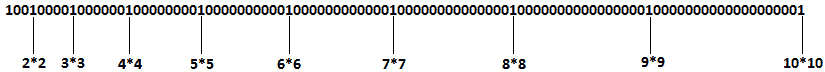
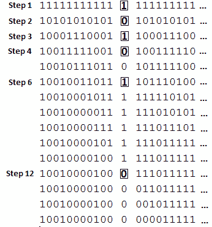
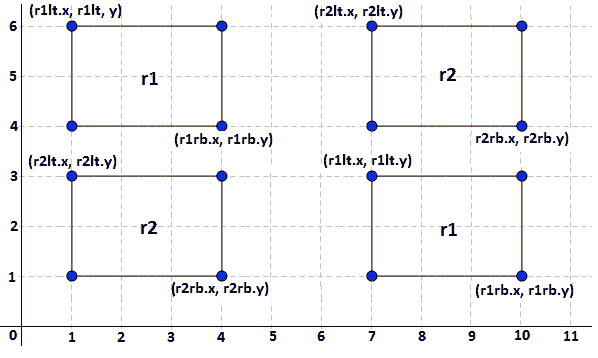
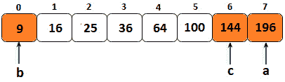

*第 15 章*：

# 数学与谜题

本章涵盖了采访中面临的一个有争议的话题：数学和智力问题。许多公司认为，这些问题不应该是技术面试的一部分，而其他公司仍然认为这一主题是相关的。

本主题中包含的问题是脑筋急转弯，可能需要相当水平的数学和逻辑知识。如果你打算申请一家在学术领域（数学、物理、化学等）工作的公司，你应该预料到这些问题。然而，亚马逊和谷歌等大公司也愿意依赖这些问题。

在本章中，我们将介绍以下主题：

*   提示和建议
*   编码挑战

到本章结束时，您应该熟悉这些类型的问题，并能够探索更多此类问题。

# 技术要求

本章中的所有代码文件都可以在 GitHub 的[上找到 https://github.com/PacktPublishing/The-Complete-Coding-Interview-Guide-in-Java/tree/master/Chapter15](https://github.com/PacktPublishing/The-Complete-Coding-Interview-Guide-in-Java/tree/master/Chapter15) 。

# 提示和建议

当你遇到脑筋急转弯的问题时，最重要的是不要惊慌。把问题读几遍，用系统的方法写下你的结论。必须明确确定其应遵守的输入、输出和约束。

试着举几个例子（输入数据样本），画一些草图，并在分析问题时与面试官保持交谈。面试官不希望你马上找到解决方案，但他们希望在你试图解决问题的时候听到你说话。这样，面试官就可以跟踪你想法的逻辑，了解你是如何处理问题的。

此外，写下开发解决方案时注意到的任何规则或模式也是非常重要的。你写下的每一句话都离解决方案更近了。通常，如果你从解决方案的角度来看（你知道解决方案），这样的问题并不十分困难；它们只需要高水平的观察和更多的关注。

让我们试试一个简单的例子。两个父亲和两个儿子坐下来吃鸡蛋。他们只吃三个鸡蛋；每个人都有一个鸡蛋。这怎么可能？

如果这是你第一次看到这样的问题，你可能会认为这是不合逻辑的或不可能解决的。认为文本中有错误（可能是四个鸡蛋，而不是三个）并反复阅读是正常的。这些是对脑筋急转弯问题最常见的反应。一旦您看到解决方案，它看起来非常简单。

现在，让我们在面试官面前扮演一个候选人。下面的段遵循*有声思维方式*。

很明显，如果每个人都有一个鸡蛋，并且有三个鸡蛋，那么其中一个就没有鸡蛋了。所以，你可能认为答案是三个人吃一个鸡蛋（每个人都吃一个鸡蛋），而第四个人什么都不吃。但问题是，两个父亲和两个儿子坐下来吃鸡蛋，所以他们四个人都吃鸡蛋。

这样想怎么样：每个人都有一个鸡蛋，他们（四个人）正好吃了三个鸡蛋，所以并不是说每个人*吃*一个鸡蛋；他们只有一个蛋。也许他们中的一个和另一个人分享他们的鸡蛋。嗯，这似乎不太合乎逻辑！

可能只有三个人吗？如果其中一位父亲也是祖父，这意味着另一位父亲同时是儿子和父亲。这样，我们通过三个人有了两个父亲和两个儿子。他们吃三个鸡蛋，每个人都有一个鸡蛋。问题解决了！

如您所见，解决方案是一系列推理的结果，这些推理一个接一个地消除了错误的解决方案。通过逻辑推理排除错误解来解决问题是解决这类问题的方法之一。其他问题只是关于计算。大多数情况下，没有复杂的计算或大量的计算，但它们需要数学知识和/或推论。

很难声称有一些技巧和技巧可以帮助你在几秒钟内解决数学和逻辑难题。最好的方法是尽可能多地练习。接下来，让我们继续进行*编码挑战*部分。

# 编码挑战

在接下来的 15 个编码挑战中，我们将重点关注数学和逻辑难题类别中最受欢迎的问题。让我们开始吧！

## 编码挑战 1–嘶嘶声

**Adobe**、**微软**

问题 T1：考虑到你已经给出了一个正整数。写一个问题，打印从 1 到*n*的数字。对于五的倍数，打印*嘶嘶*，对于七的倍数，打印*嘶嘶*，对于五和七的倍数，打印*嘶嘶*。在每个字符串或数字后打印新行。

**解决方案**：这是一个简单的问题，取决于您对除法和 Java 模数（%）运算符的了解。当我们除以两个数，*被除数*和*除数*，我们得到一个*商*和*余数*。在 Java 中，我们可以通过模（%）运算符获得除法的余数。换句话说，如果*X*是被除数，*Y*是除数，那么*X*模*Y*（用 Java 编写为*X*%*Y*返回*X*除以*Y*的余数。例如，11（被除数）/2（除数）=5（商）1（余数），因此 11%2=1。

换句话说，如果余数是 0，那么被除数是除数的倍数；否则，就不是了。因此，五的倍数必须尊重*X*%5=0，而七的倍数必须尊重*X*%7=0。基于这些关系，我们可以将这个问题的解决方案写成如下：

```java
public static void print(int n) {
  for (int i = 1; i <= n; i++) {
    if (((i % 5) == 0) && ((i % 7) == 0)) { // multiple of 5&7            
      System.out.println("fizzbuzz");
    } else if ((i % 5) == 0) { // multiple of 5            
      System.out.println("fizz");
    } else if ((i % 7) == 0) { // multiple of 7            
      System.out.println("buzz");
    } else {
      System.out.println(i); // not a multiple of 5 or 7
    }
  }
}
```

完整的应用程序称为*FizzBuzz*。

## 编码挑战 2–罗马数字

**亚马逊**、**谷歌**、**Adobe**、**微软**、**Flipkart**

问题 T1：考虑到你得到了一个正整数。编写一段代码，将此数字转换为罗马数字表示形式。例如，如果*n*=34，则罗马数字为 XXXIV。您已被赋予以下常量，其中包含罗马数字符号：


图 15.1–罗马数字

**解决方案**：这个问题依赖于罗马数字是常识这一事实。如果你从未听说过罗马数字，那么最好向面试官提及。他们可能会同意给你另一个编码挑战来代替这个。但是如果你知道罗马数字是什么，那就太好了——让我们看看如何编写一个解决这个问题的应用程序。

这个问题的算法可以从几个例子中推导出来。让我们看几个用例：

*   *n*=73=50+10+10+1+1+1=L+X+X+I+I+I=LXIII
*   *n*=558=500+50+5+1+1+1=D+L+V+I+I+I=DLVIII
*   *n*=145=100+（50-10）+5=C+（L-X）+V=C+XL+V=CXLV
*   *n*=34=10+10+10+（5-1）=X+X+X+（V-I）=X+X+X+IV=XXXIV
*   *n*=49=（50-10）+（10-1）=（L-X）+（X-I）=XL+IX=XLIX

大致上，我们取给定的数字，并试图找到对应于 1、10、数百或数千的罗马符号。该算法可以表示为：

1.  从千位开始，打印相应的罗马数字。例如，如果千位的数字是 4，则打印 4000 的罗马等效数字，即 MMMM。
2.  继续使用百位数字除以数字，并打印相应的罗马数字。
3.  继续使用十位数字除以数字，并打印相应的罗马数字。
4.  继续用数字将数字除以一个人的位置，并打印相应的罗马数字。

在代码方面，该算法的工作原理如下：

```java
private static final String HUNDREDTHS[]
 = {"", "C", "CC", "CCC", "CD", "D", 
    "DC", "DCC", "DCCC", "CM"};
private static final String TENS[]
 = {"", "X", "XX", "XXX", 
    "XL", "L", "LX", "LXX", "LXXX", "XC"};
private static final String ONES[]
 = {"", "I", "II", "III", "IV", "V", 
    "VI", "VII", "VIII", "IX"};
public static String convert(int n) {
  String roman = "";
  // Step 1
  while (n >= 1000) {
    roman = roman + 'M';
    n -= 1000;
  }
  // Step 2
  roman = roman + HUNDREDTHS[n / 100];
  n = n % 100;
  // Step 3
  roman = roman + TENS[n / 10];
  n = n % 10;
  // Step 4
  roman = roman + ONES[n];
  return roman;
}
```

完整的应用程序称为*罗马数字*。另一种方法是连续减法而不是除法。*RomanNumbers*应用程序也包含此实现。

## 编码挑战 3–参观和切换 100 扇门

**Adobe**、**微软**、**Flipkart**

问题 T1：考虑到你已经连续 100 个门被关闭了。你必须参观这些门 100 次，每次都从第一扇门开始。对于每个访问的门，您都可以切换它（如果它已关闭，则打开它，反之亦然）。第一次访问时，您访问了所有 100 个门。在第二次拜访时，你每第二次拜访一扇门（#2、#4、#6…）。在第三次访问时，您每三次访问一次门（#3、#6、#9、…）。您遵循此模式，直到只访问第 100 个门。写一段代码，显示 100 次访问后门的状态（关闭或打开）。

**解决方案**：这个问题的解决方案可以通过几个步骤直觉得出。在初始状态下，所有 100 扇门均关闭（在下图中，每个 0 为关闭的门，每个 1 为打开的门）：


图 15.2–所有车门均已关闭（初始状态）

现在，让我们看看在以下每个步骤中可以观察到什么并得出什么结论：

在第一关，我们打开每扇门（我们参观每扇门，#1，#2，#3，#4，#100）：


图 15.3–所有车门均打开（步骤 1）

在第二关，我们只参观偶数门（#2、#4、#6、#8、#10、#12……），所以偶数门关闭，奇数门打开：


图 15.4–偶数门关闭，奇数门打开（步骤 2）

在第三关，我们只参观 3 号门、6 号门、9 号门、12 号门…。这一次，我们关闭了第三扇门，我们在第一次访问时打开了这扇门，打开了第二次访问时关闭的第六扇门，以此类推：


图 15.5–第三次就诊的结果（步骤 3）

在第四次参观时，我们只参观了 4、8、12 号门…。如果我们继续这样做，那么在第 100 次访问时，我们将得到以下结果：



图 15.6–打开的门都是完美的正方形（上次访问）

因此，在最后一次访问（第 100 次访问）时，打开的门都是完美的正方形，而其余的门都是关闭的。显然，即使我们观察到这一点，我们也没有必要的时间在面试中穿越 100 次访问。但也许我们甚至不需要做所有 100 次访问来观察这个结果。让我们假设我们只做了 15 个步骤，我们试着看看某扇门发生了什么。例如，下图显示了门 12 在 15 个步骤中的状态：



图 15.7–15 步后的 12 号门

查看上图中突出显示的步骤。门 12 的状态在*步骤 1、2、3、4、6*和*12*发生变化。所有这些步骤都是 12 的除数。此外，*第一步*开门，*第二步*关门，*第三步*开门，*第四步*关门，*第六步*开门，*第十二步*关门。从这个观察出发，我们可以得出结论，对于每一对除数，门最终都会回到其初始状态，即关闭状态。换句话说，每扇除数为偶数的门最终都会关闭。

让我们看看这是否适用于完美正方形，例如 9。选择完美正方形的原因在于完美正方形总是有奇数个正因子。例如，9 的除数是 1、3 和 9。这意味着 9 号门仍然打开。

根据这两段，我们可以得出结论，在 100 次访问之后，保持打开的门是那些完全方形的门（1、#4、#9、#16、#100），而其余的门保持关闭。

一旦您理解了上述过程，编写一个确认最终结果的应用程序就非常简单了：

```java
private static final int DOORS = 100;
public static int[] visitToggle() {
  // 0 - closed door
  // 1 - opened door     
  int[] doors = new int[DOORS];
  for (int i = 0; i <= (DOORS - 1); i++) {
    doors[i] = 0;
  }
  for (int i = 0; i <= (DOORS - 1); i++) {
    for (int j = 0; j <= (DOORS - 1); j++) {
      if ((j + 1) % (i + 1) == 0) {
        if (doors[j] == 0) {
          doors[j] = 1;
        } else {
          doors[j] = 0;
        }
      }
    }            
  }
  return doors;
}
```

完整的应用程序称为*VisitToggle100Doors*。

## 编码挑战 4–8 个团队

**亚马逊**、**谷歌**、**Adobe**

问题是：有一个竞赛，T2，那里有 8 个队。每队与其他队比赛两次。所有这些球队中，只有 4 支进入半决赛。一个队要赢得多少场比赛才能进入半决赛？

**解决方案**：让我们将团队表示为 T1、T2、T3、T4、T5、T6、T7 和 T8。如果 T1 与 T2…T8 比赛，他们将进行 7 场比赛。由于每个队必须与其他队比赛两次，我们有 8*7=56 场比赛。如果在每场比赛中，一个队能赢得一分，那么我们有 56 分，分布在 8 个队之间。

让我们考虑最坏的情况。T0 输掉了所有的比赛。这意味着 T0 得到 0 分。另一方面，T1 对 T0 赢 2 分，输掉所有其他比赛；T2 对 T0 和 T1 赢 4 分，输掉所有其他比赛；T3 对 T0、T1 和 T2 赢 6 分，输掉所有其他比赛，依此类推。T4 赢得 8 分，T5 赢得 10 分，T6 赢得 12 分，T7 赢得 14 分。因此，一支赢得所有比赛的球队将赢得 14 分。最后四支球队（进入半决赛的球队）赢得了 8+10+12+14=44 分。因此，如果一支球队至少获得 44/4=11 分，他们就可以确保进入半决赛。

## 编码挑战 5–查找具有素数因子 3、5 和 7 的第 k 个数字

**Adobe**、**微软**

**问题**：设计一个算法来寻找第 k 个数，其中唯一的素因子是 3、5 和 7。

**解决方案**：拥有一个只有素数因子为 3、5 和 7 的数字列表意味着一个列表如下所示：1、3、5、7、9、15、21、25 等等。或者，更具启发性的是，可以这样写：1，1*3，1*5，1*7，3*3，3*5，3*7，5*5，3*3*3，5*7，3*3*5，7*7，等等。

通过这种暗示式表示，我们可以看到，我们可以首先将值 1 插入到列表中，而必须计算其余元素。了解确定其余元素的算法的最简单方法是查看实现本身，让我们来看看：

```java
public static int kth(int k) {
  int count3 = 0;
  int count5 = 0;
  int count7 = 0;
  List<Integer> list = new ArrayList<>();
  list.add(1);
  while (list.size() <= k + 1) {
    int m = min(min(list.get(count3) * 3, 
      list.get(count5) * 5), list.get(count7) * 7);
    list.add(m);
    if (m == list.get(count3) * 3) {
      count3++;
    }
    if (m == list.get(count5) * 5) {
      count5++;
    }
    if (m == list.get(count7) * 7) {
      count7++;
    }
  }
  return list.get(k - 1);
}
```

我们还可以通过三个队列提供实现。该算法的步骤如下：

1.  初始化一个整数，*minElem*=1。
2.  初始化三个队列；即，*队列 3*、*队列 5*和*队列 7*。
3.  Loop from 1 to the given *k*-1:

    a、 在*队列 3*、*队列 5*和*队列 7*中分别插入*minElem**3、*minElem**5 和*minElem**7。

    b、 将*minElem*更新为 min（*queue3*.peek、*queue5*.peek、*queue7*.peek）。

    c、 如果*minElem*为*队列 3*peek，则进行*队列 3*轮询。

    d、 如果*minElem*为*队列 5*peek，则进行*队列 5*轮询。

    e、 如果*minElem*为*队列 7*peek，则进行*队列 7*轮询。

4.  返回*minElem*。

完整的应用程序称为*KthNumber357*。它包含本节中介绍的两种解决方案。

## 编码挑战 6–对数字序列进行计数解码

**亚马逊**、**微软**、**Flipkart**

问题 T1：考虑 T2 T2，T4 是 1，其中，T5，B，T6，2，2，7，8，8，3，8。*Z*是 26。对于任何给定的数字序列，编写一段代码，计算可能的解码数量（例如，1234 可以解码为 1234、1234 和 1234，即 ABCD、LCD 和 AWD）。如果给定的数字序列包含 0 到 9 之间的数字，则该序列有效。不允许前导 0、多余的尾随 0 以及两个或更多连续 0。

**解决方案**：这个问题可以通过递归或动态规划来解决。这两种技术都包含在[*第 8 章*](08.html#_idTextAnchor161)*、递归和动态规划*中。那么，让我们来看看*n*位序列的递归算法：

1.  用 0 初始化解码的总数。
2.  从给定数字序列的末尾开始。
3.  如果最后一位不是 0，则对（*n*-1）位应用递归，并使用结果更新解码总数。
4.  如果最后两位数字表示小于 27 的数字（因此是有效字符），则对（*n*-2）位应用递归，并使用结果更新解码总数。

在代码方面，我们有以下内容：

```java
public static int decoding(char[] digits, int n) {
  // base cases 
  if (n == 0 || n == 1) {
    return 1;
  }
  // if the digits[] starts with 0 (for example, '0212')
  if (digits == null || digits[0] == '0') {
    return 0;
  }
  int count = 0;
  // If the last digit is not 0 then last 
  // digit must add to the number of words 
  if (digits[n - 1] > '0') {
    count = decoding(digits, n - 1);
  }
  // If the last two digits represents a number smaller 
  // than or equal to 26 then consider last two digits 
  // and call decoding()
  if (digits[n - 2] == '1'
      || (digits[n - 2] == '2' && digits[n - 1] < '7')) {
    count += decoding(digits, n - 2);
  }
  return count;
}
```

此代码以指数时间运行。但我们可以应用动态规划，通过类似的非递归算法将运行时间减少到 O（n），如下所示：

```java
public static int decoding(char digits[]) {
  // if the digits[] starts with 0 (for example, '0212')
  if (digits == null || digits[0] == '0') {
    return 0;
  }
  int n = digits.length;
  // store results of sub-problems 
  int count[] = new int[n + 1];
  count[0] = 1;
  count[1] = 1;
  for (int i = 2; i <= n; i++) {
    count[i] = 0;
    // If the last digit is not 0 then last digit must 
    // add to the number of words 
    if (digits[i - 1] > '0') {
      count[i] = count[i - 1];
    }
    // If the second last digit is smaller than 2 and 
    // the last digit is smaller than 7, then last 
    // two digits represent a valid character 
    if (digits[i - 2] == '1' || (digits[i - 2] == '2' 
          && digits[i - 1] < '7')) {
      count[i] += count[i - 2];
    }
  }
  return count[n];
}
```

此代码以 O（n）时间运行。完整的应用程序称为*解码数字序列*。

## 编码挑战 7–ABCD

**问题**：找到个类型，ABCD，这样乘以 4，就得到了 DCBA。

**解决方案**：这类问题通常很难解决。在这种情况下，我们必须用一些数学来解决它。

让我们从一些简单的不等式开始：

*   1<=A<=9（A 不能为零，因为 ABCD 是四位数）
*   0<=B<=9
*   0<=C<=9
*   4<=D<=9（D 必须至少为 4*A，因此它应该至少为 4）

接下来，我们可以假设我们的数字 ABCD 写为 1000A+100B+10C+D。在问题陈述之后，我们可以将 ABCD 乘以 4 得到 DCBA，可以写为 1000D+100C+10B+A。

BA 是一个可被 4 整除的两位数，符合可被 4 整除的条件。现在，较大的 ABCD 是 2499，因为大于 2499 的数字乘以 4 将得到一个五位数。

接下来，A 可以是 1 和 2。然而，如果 BA 是一个可被 4 整除的两位数，那么 a 必须是偶数，所以它必须是 2。

继续这个逻辑，这意味着 D 是 8 或 9。然而，由于 D 乘以 4 将以 2 结尾，因此 D 必须是 8。

此外，4000A+400B+40C+4D=1000D+100C+10B+A。由于 A=2 和 D=8，这可以写成 2C-13B=1。在[1,7]中，B 和 C 只能是一个单位数整数，但 B 必须是奇数，因为 BA 是一个可被 4 整除的两位数。因为最大可能的数字是 2499，这意味着 B 可以是 1 或 3。

结果是 2178，因为 2178*4=8712，所以 ABCD*4=DCBA。

我们也可以使用蛮力方法来找到这个数字。以下代码不言自明：

```java
public static void find() {
  for (int i = 1000; i < 2499; i++) {
    int p = i;
    int q = i * 4;
    String m = String.valueOf(p);
    String n = new StringBuilder(String.valueOf(q))
      .reverse().toString();
    p = Integer.parseInt(m);
    q = Integer.parseInt(n);
    if (p == q) {
      System.out.println("\n\nFound: " + p + " : " + (q * 4));
      break;
    }
  }
}
```

完整的应用程序称为*Abcd*。

## 编码挑战 8–矩形重叠

**亚马逊**、**谷歌**、**微软**

问题二：考虑到你已经给出了两个矩形。编写一段代码，在这些矩形重叠时返回**true**（also 称为碰撞或相交）。

**解决方案**：这个问题听起来有点模糊。与面试官讨论这一点很重要，并就两个重要方面达成一致：

*两个矩形相互平行，与水平面成 0 度角（它们与坐标轴平行），或者可以在一定角度下旋转？*

大多数情况下，给定的矩形彼此平行，并且与坐标轴平行。如果涉及旋转，那么解决方案需要一些在面试中不太明显的几何知识。最有可能的是，面试官想测试你的逻辑，而不是你的几何知识，而是挑战自己，并解决非平行矩形的问题。

*直角坐标是在笛卡尔平面上给出的吗？*答案应该是肯定的，因为这是数学中常用的坐标系。这意味着矩形从左到右、从下到上增大其大小。

那么，让我们将矩形表示为*r1*和*r2*。它们都是通过左上角和右下角的坐标给出的。*r1*左上角坐标为*r1lt.x*和*r1lt.y*，右下角坐标为*r2rb.x*和*r2rb.y*，如下图所示：


图 15.8–矩形坐标

如果两个矩形*彼此接触，我们可以说它们是重叠的（至少它们有一个公共点）。换句话说，下图中显示的五对矩形重叠：*


图 15.9–重叠矩形

从前面的图中，我们可以得出结论，两个不重叠的矩形可以是以下四种情况之一：

*   *r1*完全在*r2 的右侧。*
*   *r1*完全在*r2 的左侧。*
*   *r1*完全高于*r2。*
*   *r1*完全低于*r2。*

下图显示了这四种情况：



图 15.10–非重叠矩形

我们可以用坐标表示前面四个项目符号，如下所示：

*   *r1*完全在*r2*的右侧→ *r1lt.x>r2rb.x*
*   *r1*完全在*r2*的左侧→ *r2lt.x>r1rb.x*
*   *r1*完全高于*r2*→ *r1rb.y>r2lt.y*
*   *r1*完全低于*r2*→ *r2rb.y>r1lt.y*

因此，如果我们将这些条件分组到代码中，我们将得到以下结果：

```java
public static boolean overlap(Point r1lt, Point r1rb, 
        Point r2lt, Point r2rb) {
  // r1 is totally to the right of r2 or vice versa
  if (r1lt.x > r2rb.x || r2lt.x > r1rb.x) {
    return false;
  }
  // r1 is totally above r2 or vice versa
  if (r1rb.y > r2lt.y || r2rb.y > r1lt.y) {
    return false;
  }
  return true;
}
```

此代码以 O（1）时间运行。或者，我们可以将这两个条件压缩为一个条件，如下所示：

```java
public static boolean overlap(Point r1lt, Point r1rb, 
        Point r2lt, Point r2rb) {
  return (r1lt.x <= r2rb.x && r1rb.x >= r2lt.x
           && r1lt.y >= r2rb.y && r1rb.y <= r2lt.y);
}
```

完整的应用程序称为*矩形重叠*。请注意，面试官可能会以不同的方式定义*重叠*。基于这个问题，您应该能够相应地调整代码。

## 编码挑战 9–大数乘法

**亚马逊**、**微软**

问题 T1：考虑到你已经给出了两个正大的数，如弦，3，4 和 5。这些数字不适合**int**或**long**域。编写一段计算*a*b*的代码。

Po.T0.溶液：To T2：To T2＝4145775，而 Ty4 T4，B，T5，Ty＝771467。然后，*a*b*=3198328601925。解决这个问题依赖于数学。下图描述了*a*b*解决方案，该解决方案可以应用于纸张上，也可以进行编码：


图 15.11–将两个大数字相乘

我们主要依靠乘法可以写成一组加法这一事实。因此，我们可以把 771467 写成 7+60+400+1000+70000+700000，然后将这些数字乘以 4145775。最后，我们添加结果以获得最终结果 3198328601925。把这个逻辑再进一步，我们可以取第一个数字（5）的最后一个数字，然后乘以第二个数字（7，6，4，1，7，7）的所有数字。然后，我们取第一个数字（7）的第二个数字，乘以第二个数字（7，6，4，1，7，7）的所有数字。然后，我们取第一个数字（7）的第三个数字，乘以第二个数字（7，6，4，1，7，7）的所有数字。我们继续这个过程，直到我们将第一个数字的所有数字乘以第二个数字的所有数字。在添加结果时，我们声明第*t*次乘法移位。

在代码方面，我们有以下内容：

```java
public static String multiply(String a, String b) {
  int lenA = a.length();
  int lenB = b.length();
  if (lenA == 0 || lenB == 0) {
    return "0";
  }
  // the result of multiplication is stored in reverse order 
  int c[] = new int[lenA + lenB];
  // indexes to find positions in result
  int idx1 = 0;
  int idx2 = 0;
  // loop 'a' right to left
  for (int i = lenA - 1; i >= 0; i--) {
    int carry = 0;
    int n1 = a.charAt(i) - '0';
    // used to shift position to left after every 
    // multiplication of a digit in 'b' 
    idx2 = 0;
    // loop 'b' from right to left
    for (int j = lenB - 1; j >= 0; j--) {
      // current digit of second number 
      int n2 = b.charAt(j) - '0';
      // multiply with current digit of first number 
      int sum = n1 * n2 + c[idx1 + idx2] + carry;
      // carry of the next iteration
      carry = sum / 10;
      c[idx1 + idx2] = sum % 10;
      idx2++;
    }
    // store carry 
    if (carry > 0) {
      c[idx1 + idx2] += carry;
    }
    // shift position to left after every 
    // multiplication of a digit in 'a' 
    idx1++;
  }
  // ignore '0's from the right 
  int i = c.length - 1;
  while (i >= 0 && c[i] == 0) {
    i--;
  }
  // If all were '0's - means either both or 
  // one of 'a' or 'b' were '0' 
  if (i == -1) {
    return "0";
  }
  String result = "";
  while (i >= 0) {
    result += (c[i--]);
  }
  return result;
}
```

完整的应用程序称为*MultiplyLargeNumbers*。

## 编码挑战 10–具有相同数字的下一个最大数字

**亚马逊**、**谷歌**、**微软**

问题是：假设你是正整数。编写一段代码，返回下一个最大的数字，其中的数字相同。

**解决方案**：这个问题的解决方案可以通过几个例子来观察。让我们考虑下面的例子：

*   例 1:6→ 不可能
*   例 2:1234→ 1243
*   例 3:1232→ 1322
*   例 4:321→ 不可能
*   例 5:621873→ 623178

从前面的例子中，我们可以直观地看出，可以通过重新排列给定数字的位数来获得解。因此，如果我们能够找到一组交换数字的规则，从而找到搜索到的数字，那么我们就可以尝试实现。

让我们尝试几个观察结果：

*   从例 1 和例 4 中，我们可以看出，如果给定数字的数字是降序的，那么就不可能找到更大的数字。每一次互换都会导致数量减少。
*   从例 2 可以看出，如果给定数字的数字是升序的，那么可以通过交换最后两个数字来获得具有相同数字的下一个更大的数字。
*   从例 3 和例 5 中，我们可以看出，我们需要找到所有较大数中的最小数。为此，我们必须从最右边处理数字。下面的算法澄清了这一说法。

基于这三个观察结果，我们可以详细阐述以下算法，该算法已在数字 621873 上得到了示例：

1.  我们从最右边开始逐位遍历数字。我们继续遍历，直到找到一个比先前遍历的数字小的数字。例如，如果给定的数字是 621873，那么我们遍历该数字直到 621873 中的数字 1。数字 1 是比先前遍历的数字 8 小的第一个数字。
2.  接下来，我们将重点放在步骤 1 中找到的数字右侧的数字上。我们希望在这些数字中找到最小的数字（让我们将其表示为*t*。由于这些数字按降序排列，因此最小的数字位于最后一个位置。例如，3 是 1、62**1**87**3**右侧数字中的最小数字。
3.  我们交换这两个数字（1 和 3），得到 62**3**87**1**。
4.  最后，我们将所有数字按升序排列到*t*的右侧。但由于我们知道*t*右侧的所有数字都是按降序排列的，除了是最后一个数字，我们可以使用线性反转。这意味着结果是 623**178**。这是搜索的号码。

该算法易于实现，如下所示：

```java
public static void findNextGreater(int arr[]) {
  int min = -1;
  int len = arr.length;
  int prevDigit = arr[arr.length - 1];
  int currentDigit;
  // Step 1: Start from the rightmost digit and find the 
  // first digit that is smaller than the digit next to it. 
  for (int i = len - 2; i >= 0; i--) {
    currentDigit = arr[i];
    if (currentDigit < prevDigit) {
      min = i;
      break;
    }
  }
  // If 'min' is -1 then there is no such digit. 
  // This means that the digits are in descending order. 
  // There is no greater number with same set of digits 
  // as the given one.
  if (min == -1) {
    System.out.println("There is no greater number with "
     + "same set of digits as the given one.");
  } else {
    // Steps 2 and 3: Swap 'min' with 'len-1'
    swap(arr, min, len - 1);
    // Step 4: Sort in ascending order all the digits 
    // to the right side of the swapped 'len-1'
    reverse(arr, min + 1, len - 1);
    // print the result
    System.out.print("The next greater number is: ");
    for (int i : arr) {
      System.out.print(i);
    }
  }
}
private static void reverse(int[] arr, int start, int end) {
  while (start < end) {
    swap(arr, start, end);
    start++;
    end--;
  }
}
private static void swap(int[] arr, int i, int j) {
  int aux = arr[i];
  arr[i] = arr[j];
  arr[j] = aux;
}
```

此代码以 O（n）时间运行。完整的应用程序称为*NextElementSameDigits*。

## 编码挑战 11–可被其数字整除的数字

**亚马逊**、**谷歌**、**Adobe**、**微软**

问题 T1：考虑到你已经给出了一个整数。编写一个程序，如果给定的数字可被其数字整除，则返回**true**。

Po.T0.溶液：To T2：n，T2，T3＝412。由于 412 可被 2、1 和 4 整除，因此输出应为**true**。另一方面，如果*n*=143，那么输出应该是**false**，因为 143 不能被 3 和 4 整除。

如果你认为这个问题很简单，那么你是绝对正确的。这类问题用作*热身*问题，可用于快速筛选大量候选问题。大多数情况下，您应该在给定的时间内解决它（例如，2-3 分钟）。

重要提示

建议以与任何其他问题同等的严重程度来处理这些简单问题。一个小小的错误可能会过早地将你从比赛中淘汰。

因此，对于该问题，该算法由以下步骤组成：

1.  获取给定数字的所有数字。
2.  对于每个数字，检查*给定数字**%数字*是否为 0（表示可整除）。
3.  如果其中任何一个非零，则返回**false**。
4.  如果所有的位的*给定数字百分比*为 0，则返回**真**。

在代码方面，我们有以下内容：

```java
public static boolean isDivisible(int n) {
  int t = n;
  while (n > 0) {
    int k = n % 10;
    if (k != 0 && t % k != 0) {
      return false;
    }
    n /= 10;
  }
  return true;
}
```

完整的应用程序称为*NumberVisibleDigits*。

## 编码挑战 12–打破巧克力

**亚马逊**、**谷歌**、**Adobe**、**微软**、**Flipkart**

问题 T1：考虑到你一直是一个普通的长方形巧克力，大小为 T3，宽度为 4.4，X 为 5 英寸，高度为 6 英寸，瓦片为多个。通常，巧克力由许多小瓷砖组成，因此*宽度*和*高度*为我们提供了瓷砖的数量（例如，巧克力大小为 4 x 3，包含 12 块瓷砖）。编写一段代码，计算我们需要应用于给定巧克力的断开（切割）次数，以获得一块恰好具有所需瓷砖数量的巧克力。你可以沿着瓷砖边缘，通过一个垂直或水平的断裂（切割）将给定的巧克力切成两块矩形。

让我们考虑下面图像中的巧克力（一个 3 块 6 块巧克力，有 18 块瓷砖）：


图 15.12–3 x 6 巧克力棒

上图显示了七种情况，它们可以引导我们找到解决方案，如下所示：

*   案例 1、2 和 3：如果给定的瓷砖数量大于 3 x 6，或者我们无法按照巧克力的*宽度*或*高度*排列瓷砖，则无法获得解决方案。对于没有解决方案，我们返回-1。
*   案例 4：如果给定瓷砖的数量等于 3 x 6=18，那么这就是解决方案，因此我们有 0 个切割。我们将返回 0。
*   案例 5：如果给定的瓷砖数量可以与巧克力棒的*宽度*一起排列，则有一个单一的切割。我们将返回 1。
*   案例 6：如果给定的瓷砖数量可以与巧克力棒的*高度*一起排列，则有一个切割。我们将返回 1。
*   案例 7：在所有其他情况下，我们需要两次削减。我们将返回 2。

让我们看看代码：

```java
public static int breakit(int width, int height, int nTiles) {
  if (width <= 0 || height <= 0 || nTiles <= 0) {
    return -1;
  }
  // case 1
  if (width * height < nTiles) {
    return -1;
  }
  // case 4
  if (width * height == nTiles) {
    return 0;
  } 
  // cases 5 and 6
  if ((nTiles % width == 0 && (nTiles / width) < height)
     || (nTiles % height == 0 && (nTiles / height) < width)) {
    return 1;
  }
  // case 7
  for (int i = 1; i <= Math.sqrt(nTiles); i++) {
    if (nTiles % i == 0) {
      int a = i;
      int b = nTiles / i;
      if ((a <= width && b <= height)
          || (a <= height && b <= width)) {
        return 2;
      }
    }
  }
  // cases 2 and 3
  return -1;
}
```

完整的应用程序称为*BreakChocolate*。

## 编码挑战 13–时钟角度

**谷歌**、**微软**

问题 T1：考虑到你一直在考虑时间：3：h：m。编写一段代码，计算模拟时钟上小时和分针之间的较短角度。

**解决方案**：从一开始，我们就必须考虑几个公式，这些公式将帮助我们找到解决方案。

首先，时钟被分成 12 个相等的小时（或 12 个相等的部分），因为它是一个完整的圆，所以它有 360 度。因此，1 小时有 360o/12=30o。因此，在 1:00 时，时针与分针形成 300 度角。2:00 时，时针与分针成 60 度角，以此类推。下图阐明了这一方面：


图 15.13–12 小时时 360 度拆分

更进一步地说，一小时有 60 分钟和 30 度，因此一分钟有 30/60=0.5 度。如果我们只参考时针，那么在 1:10，我们有一个 30o+10*0.5o=30o+5o=35o 的角度。或者，在 4:17，我们有一个 4*30o+17*0.5o=120o+8.5o=128.5o 的角度。

到目前为止，我们知道我们可以将给定的*h:m*时间的时针角度计算为*h**300+*m**0.5o。为了计算分针的角度，我们可以认为，在 1 小时内，分针需要 360 度的周游，因此 360o/60 分钟=每分钟 6 度。因此，在*h*：24 时，分针形成 24*6o=144o 的角度。在*h*：35 处，分针形成 35*6o=210o 的角度，依此类推。

因此，时针和分针之间的角度是 abs（（*h**30o+*m**0.5o）*m**6o）。如果返回的*结果*大于 180o，则我们必须返回（360o-*结果*，因为问题需要我们计算小时和分针之间的较短角度。

现在，让我们尝试计算下图所示时钟所需的角度：


图 15.14–三个时钟

**时钟 1，10:10**：

*   时针：10*30o+10*0.5o=300o+5o=305o
*   分针：10*6o=60o
*   结果：abs（305o-60o）=abs（245o）=245o>180o，因此返回 360o-245o=115o

**时钟 2，9:40**：

*   小时指针：9*30o+40*0.5o=270o+20o=290o
*   分针：40*6o=240o
*   结果：abs（290o-240o）=abs（50o）=50o

**时钟 3，4:40**：

*   时针：4*30o+40*0.5o=120o+20o=140o
*   分针：40*6o=240o
*   结果：abs（140o-240o）=abs（-100o）=100o

基于这些语句，我们可以编写以下代码：

```java
public static float findAngle(int hour, int min) {
  float angle = (float) Math.abs(((30f * hour) 
    + (0.5f * min)) - (6f * min));
  return angle > 180f ? (360f - angle) : angle;
}
```

完整的应用程序称为*HourMinuteAngle*。

## 编码挑战 14–毕达哥拉斯三胞胎

**谷歌**、**Adobe**、**微软**

**问题**：毕达哥拉斯三重态是一组三个正整数{*A、b、c*}，使得*A*2=*b*2+*c*2。假设你得到了一个正整数数组，阿纳尔。编写一段代码，打印此数组的所有毕达哥拉斯三元组。

**解决方案**：蛮力方法可以通过三个循环来实现，这三个循环可以尝试给定数组中所有可能的三元组。但这将在 O（n3）复杂度时间内起作用。显然，蛮力方法（通常称为*天真*方法）不会给面试官留下深刻印象，因此我们必须做得更好。

事实上，我们可以在 O（n2）时间内解决这个问题。让我们看看算法的步骤：

1.  对输入数组中的每个元素进行平方运算（O（n））。这意味着我们可以将*a*2=*b*2+*c*2 写成*a*=*b*+*c*。
2.  按升序（O（n logn））对给定数组进行排序。
3.  如果*a*=*b*+*c*，则*a*始终是*a*、*b*和*c*之间的最大值。因此，我们修正了*a*，使其成为这个排序数组的最后一个元素。
4.  修正*b*，使其成为该排序数组的第一个元素。
5.  固定*c*，使其成为元素*a*之前的元素。
6.  So far, *b<a* and *c<a*. To find the Pythagorean triplets, execute a loop that increases *b* from 1 to *n* and decreases *c* from *n* to 1\. The loop stops when *b* and *c* meet:

    A.如果*b+c<a*，则增加*b*的指数。

    B 如果*b+c>a*，则降低*c*的指数。

    C 如果*b+c*等于*a*，则打印找到的三元组。增加*b*的索引，减少*c*的索引。

7.  对下一个*a*重复 from*步骤 3*。

让我们考虑这一点：ARR OUTYT1EU= { 3, 6, 8，5, 10, 4，12, 14 }。在前两个步骤之后，*arr*={9,16,25,36,64100144196}。在*步骤 3*、*4*和*5*之后，我们有*a*=196、*b*=9、*c*=144，如下所示：



图 15.15–设置 a、b 和 c

由于*b*的 9+144< 196, the 指数增加 1，符合*步骤 6a*的要求。同样的步骤适用于 16+144、25+144 和 36+144。自 64+144>196 起，*c*的指数降低 1，符合*步骤 6b*的要求。

由于 64+100< 196, the index of *b*增加 1，符合*步骤 6a*的要求。由于*b*和*c*已经相遇，循环在此停止，如下所示：


图 15.16–回路末端的 b 和 c

接下来，按照*步骤 7*设置*a*=144、*b*=9、*c*=100。对每个*a*重复此过程。当*a*变为 100 时，我们发现第一个毕达哥拉斯三联体；即*a*=100、*b*=36、*c*=64，如下图：


图 15.17–毕达哥拉斯三重态

让我们把这个算法编成代码：

```java
public static void triplet(int arr[]) {
  int len = arr.length;
  // Step1
  for (int i = 0; i < len; i++) {
    arr[i] = arr[i] * arr[i];
  }
  // Step 2
  Arrays.sort(arr);
  // Steps 3, 4, and 5
  for (int i = len - 1; i >= 2; i--) {  
    int b = 0;
    int c = i - 1;
    // Step 6
    while (b < c) {
      // Step 6c
      if (arr[b] + arr[c] == arr[i]) {
        System.out.println("Triplet: " + Math.sqrt(arr[b]) 
          + ", " + Math.sqrt(arr[c]) + ", " 
              + Math.sqrt(arr[i]));
        b++;
        c--;
      }
      // Steps 6a and 6b
      if (arr[b] + arr[c] < arr[i]) {
        b++;
      } else {
        c--;
      }
    }
  }
}
```

完整的应用程序称为*毕达哥拉斯三胞胎*。

## 编码挑战 15–安排一部电梯

**亚马逊**、**谷歌**、**Adobe**、**微软**、**Flipkart**

问题 T1：考虑到你已经得到了一个数组，表示目标 T2 阿纳尔的目的层。电梯具有给定*k*的容量。最初，电梯和所有人都在 0 层（一楼）。电梯从当前楼层到达任何连续楼层（向上或向下）需要 1 个单位的时间。编写一段代码，以的方式安排电梯，使我们获得所有人员到达目的楼层，然后返回一楼所需的最短总时间。

Po.T0.解决方案 T1：我们假设给定的目的地数组是 OutT2 层，层 T3，{{ 4, 2, 1，2, 4 }，and Ty4，k，O.T5，Ty＝3。我们有五个人：一楼一个人，二楼两个人，四楼两个人。这部电梯一次可以坐三个人。那么，我们如何安排电梯在最短的时间内把这五个人送到他们的楼层呢？

解决方案包括让人们按降序到达各自的楼层。让我们根据下图处理此场景：


图 15.18–电梯调度示例

让我们遍历此场景的步骤：

1.  这是初始状态。电梯在一楼，五个人准备乘电梯。让我们考虑最小时间是 0（所以，0 单位时间）。
2.  在电梯里，我们带着去四楼的人和去二楼的人。记住，我们一次最多可以带三个人。到目前为止，最短时间为 0。
3.  电梯上升，停在二楼。一个人下车。由于每层楼代表一个时间单位，我们的最小时间为 2。
4.  电梯上升，停在四楼。剩下的两个人下车。最短时间变为等于 4。
5.  在这一步，电梯是空的。它必须到一楼去接更多的人。因为它下了四层楼，所以最短的时间是 8 点。
6.  我们接剩下的两个人。最短时间保持为 8 小时。
7.  电梯上升，停在一楼。一个人下车。最短时间为 9。
8.  电梯上升，停在二楼。一个人下车。最短时间为 10 分钟。
9.  在这一步，电梯是空的。它必须下到一楼。因为它下了两层楼，所以最短的时间是 12 点。

所以，总的最小时间是 12。基于此场景，我们可以详细阐述以下算法：

1.  按目标的降序对给定数组进行排序。
2.  创建*k*人的小组。每组所需时间为 2**层**组*。

因此，对我们的测试数据进行排序将得到*楼层*={4,4,2,2,1}。我们有两个小组。一组包含三个人（4，4，2），而另一组包含两个人（2，1）。总最短时间为（2**层*[0]）+（2**层*[3]）=（2*4）+（2*2）=8+4=12。

就代码而言，我们有以下内容：

```java
public static int time(int k, int floors[]) {
  int aux;
  for (int i = 0; i < floors.length - 1; i++) {
    for (int j = i + 1; j < floors.length; j++) {
      if (floors[i] < floors[j]) {
        aux = floors[i];
        floors[i] = floors[j];
        floors[j] = aux;
      }
    }
  }
  // iterate the groups and update 
  // the time needed for each group 
  int time = 0;
  for (int i = 0; i < floors.length; i += k) {
    time += (2 * floors[i]);
  }
  return time;
}
```

当然，您最终可能会选择更好的排序算法。完整的应用程序称为*ScheduleOneElevator*。这是本章最后一个编码挑战。

### 调度多部电梯

但是我们如何安排任意楼层数的多部电梯呢？嗯，在面试中，你不需要为多台电梯实施解决方案，但你可能会被问到如何为多台电梯设计解决方案。

多电梯调度问题及其算法是一个著名而又困难的问题。对于这个问题没有最好的算法。换言之，创建一种可应用于电梯实际调度的算法确实很困难，而且显然，它已获得专利。

电梯算法(https://en.wikipedia.org/wiki/Elevator_algorithm)这是一个很好的开始。在思考如何设计多电梯的解决方案之前，你必须列出你想考虑的所有假设或约束。每个可用的解决方案/算法都有一个假设或约束列表，涉及楼层数、电梯数量、每部电梯的容量、平均人数、高峰时间、电梯速度、装卸时间等。主要有以下三种解决方案：

*   **扇区**：每台电梯分配到一个扇区（为楼层子集提供服务）。
*   **最近的电梯**：每个人被分配到最近的电梯（根据电梯的位置、呼叫方向和电梯的当前方向进行分配）。
*   **考虑容量的最近电梯**：这类似于最近的电梯选项，但它考虑了每个电梯中的负载。

#### 部门

例如，一栋有八层楼和三部电梯的建筑可以这样服务：

*   1 号电梯服务于 1 楼、2 楼和 3 楼。
*   2 号电梯服务于 1 楼、4 楼和 5 楼。
*   3 号电梯服务于 1 楼、6 楼、7 楼和 8 楼。

每部电梯都服务于底层，因为底层的到达率最高。

#### 最近的电梯

为每个电梯分配一个分数。该分数表示新员工到达时电梯的适用性分数：

*   *向呼叫方向，同方向*：*FS*=（*N+*2）*d*
*   *朝向呼叫，相反方向*：*FS*=（*N*+*1）*d**
**   *远离呼叫*：*FS*=1*

 *其中，*N*＝#楼层-1，*d*＝电梯与呼叫的距离。

#### 考虑容量的最近电梯

这与最近的电梯情况完全相同，但它考虑了电梯的过剩容量：

*   *朝向呼叫，同方向*：*FS*=（*N*+2）*d*+*C*
*   *朝向呼叫，相反方向*：*FS*=（*N*+1）*d*+*C*
*   *远离呼叫*：*FS*=1+*C*

此处，*N*为#楼层–1，*d*为电梯与呼叫的距离，*C*为剩余容量。

我强烈建议您搜索和研究这个问题的不同实现，并尝试学习最适合您的实现。我建议你从这里开始：

*   [https://github.com/topics/elevator-simulation](https://github.com/topics/elevator-simulation)
*   [https://austingwalters.com/everyday-algorithms-elevator-allocation/](https://austingwalters.com/everyday-algorithms-elevator-allocation/) 。

现在，让我们总结一下这一章。

# 总结

在本章中，我们介绍了适合数学和谜题类别的最流行的问题。虽然许多公司都避免了这些问题，但仍有一些主要的公司，如谷歌和亚马逊，在他们的采访中依赖于这些问题。

练习这些问题对我们的大脑来说是一种很好的锻炼。除了数学知识外，这些问题还支持基于演绎和直觉的分析思维，这意味着它们对任何程序员都是巨大的支持。

在下一章中，我们将讨论访谈中的一个热门话题：并发（多线程）。*