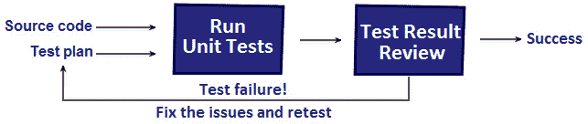
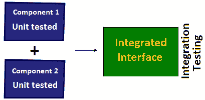

*第 18 章*：

# 单元测试

作为开发人员（或软件工程师），您还必须具备测试领域的技能。例如，开发人员负责编写代码的单元测试（例如，使用 JUnit 或 TestNG）。最有可能的是，不包含单元测试的请求将不会被接受。

在本章中，我们将介绍在申请开发人员或软件工程师等职位时可能遇到的单元测试面试问题。当然，如果您正在寻找测试员（手动/自动）职位，那么本章可能只是测试的另一个角度，因此不要期望在这里看到特定于手动/自动测试员职位的问题。在本章中，我们将介绍以下主题：

*   简而言之，单元测试
*   问题和编码问题

开始吧！

# 技术要求

本章中使用的代码可以在 GitHub 上找到：[https://github.com/PacktPublishing/The-Complete-Coding-Interview-Guide-in-Java/tree/master/Chapter18](https://github.com/PacktPublishing/The-Complete-Coding-Interview-Guide-in-Java/tree/master/Chapter18)

# 简而言之，单元测试

测试应用程序的过程包含多个测试层。其中一层是*单元测试*层。

应用程序主要是由称为单元的小功能部件构建的（例如，一个常规 Java 方法可以被视为一个单元）。在特定输入/条件/约束下测试这些单元的功能和正确性称为单元测试。

这些单元测试由开发人员使用源代码和测试计划编写。理想情况下，每个开发人员都应该能够编写单元测试来测试/验证他们的代码。单元测试应该是有意义的，并提供可接受的代码覆盖率。

如果单元测试失败，那么开发人员负责修复问题并再次执行单元测试。下图描述了该声明：



图 18.1–单元测试流程

单元测试使用**单元测试用例**。*单元测试用例*是一对输入数据和预期输出，旨在为特定功能形成测试。

如果你在面试中希望了解单元测试，那么当你被问及功能测试和/或集成测试的问题时，不要感到惊讶。因此，最好也准备好这些问题的答案。

**功能测试**是基于给定的输入和需要与预期输出（行为）进行比较的生成的输出（行为），对功能需求进行测试。每个功能测试都使用功能规范来验证表示该功能需求实现的组件（或一组组件）的正确性。下图对此进行了说明：


图 18.2–功能测试

**集成测试**的目标是在以迭代增量方式集成时，找出软件组件中的缺陷。换句话说，已经过单元测试的模块被集成（分组或聚合）并按照集成计划进行测试。下图对此进行了描述：



图 18.3–集成测试

一个关于单元测试和集成测试的问题经常被用来面试应聘者，这个问题是关于强调这两者之间的主要区别。下表将帮助您准备此问题的答案：


图 18.4–单元测试和集成测试之间的比较

一个好的测试人员能够强调和滥用测试主题，而无需对输入做出任何假设或限制。这也适用于单元测试。既然我们已经谈到了单元测试，那么让我们来看看单元测试中的一些编码挑战和问题。

# 问题和编码挑战

在本节中，我们将讨论 15 个问题以及与单元测试相关的编码挑战，这些问题在访谈中非常流行。开始吧！

## 编码挑战 1–AAA

**问题**：什么是单元测试中的 AAA？

**解决方案**：**AAA**首字母缩写代表**A**排列、**A**ct、**A**ssert，它代表了一种构建测试以保持干净代码和可读性的方法。如今，AAA 是一种测试模式，几乎是整个行业的标准。以下代码片段不言自明：

```java
@Test
public void givenStreamWhenSumThenEquals6() {
  // Arrange
  Stream<Integer> theStream = Stream.of(1, 2, 3);
  // Act
  int sum = theStream.mapToInt(i -> i).sum();
  // Assert
  assertEquals(6, sum);
}
```

**安排**部分：在该部分中，我们准备或设置测试。例如，在前面的代码中，我们准备了一个整数流，其中元素为 1、2 和 3。

**动作**部分：在本部分中，我们执行必要的动作以获得测试结果。例如，在前面的代码中，我们对流的元素求和，并将结果存储在整数变量中。

**断言**部分：在该部分中，我们检查单元测试的结果是否与预期结果相符。这是通过断言实现的。例如，在前面的代码中，我们检查了元素之和是否等于 6。

您可以在名为*junit5/ArrangeActAssert*的应用程序中找到此代码。

## 编码挑战 2–第一

**问题**：单元测试中的**第一个**是什么？

**解决方案**：优秀的测试人员首先使用，以避免单元测试中遇到的许多陷阱。**第一个**首字母缩写代表**F**ast、**I**solated、**R**epeatable、**S**elf validating、**T**imely。让我们看看它们各自的含义：

**快速**：建议编写快速运行的单元测试。Fast 是一个任意的概念，它取决于您有多少个单元测试，您运行它们的频率，以及您愿意等待它们运行多长时间。例如，如果每个单元测试的平均完成时间为 200 毫秒，而您运行了 5000 个单元测试，那么您将等待约 17 分钟。通常，单元测试速度较慢，因为它们访问外部资源（例如，数据库和文件）。

**隔离**：理想情况下，您应该能够在任何时间以任何顺序运行任何测试。如果您的单元测试是孤立的，并且它们关注于小的代码片段，那么这是可能的。好的单元测试并不依赖于其他单元测试，但这并不总是可以实现的。尽管如此，还是要努力避免依赖链，因为当出现问题时，依赖链是邪恶的，您必须进行调试。

**可重复**：单元测试应该是可重复的。这意味着每次运行单元测试时，单元测试的断言都应该产生相同的结果。换句话说，单元测试不应该依赖于任何可能给断言引入可变结果的东西。

**自验证**：单元测试应该是自验证的。这意味着您不应该手动验证测试结果。这非常耗时，并且表明断言没有发挥作用。努力撰写断言，使其按预期工作。

**及时**：重要的是不要推迟编写单元测试。你越是拖延，你将面临越多的缺陷。您将发现您没有时间回来编写单元测试。想想如果我们一直推迟倒垃圾会发生什么。我们拖延得越多，就越难接受，我们的健康也会受到威胁。我有没有说那气味？因此，及时编写单元测试。这是一个好习惯！

## 编码挑战 3–测试夹具

**问题**：什么是测试夹具？

**解决方案**：所谓测试夹具，我们是指存在于该测试之外的任何测试数据，用于设置应用程序，使其处于固定状态。应用程序有一个固定状态，允许在恒定的已知环境下运行测试。

## 编码挑战 4–异常测试

**问题**：JUnit 中测试异常的常用方法是什么？

**解决方案**：在 JUnit4 中，我们通常通过**try**/**catch**成语、**@test**的**期望**元素以及**期望异常**规则来测试异常。

JUnit 3.x 中流行的**try**/**catch**成语，可使用如下：

```java
@Test
public void givenStreamWhenGetThenException() {
  Stream<Integer> theStream = Stream.of();
  try {
    theStream.findAny().get();
    fail("Expected a NoSuchElementException to be thrown");
  } catch (NoSuchElementException ex) {
    assertThat(ex.getMessage(), is("No value present"));
  }
}
```

由于**fail（）**抛出一个**断言错误**，因此不能用于测试此错误类型。

从 JUnit4 开始，我们可以使用**@Test**注释的**预期的**元素。此元素的值是预期异常的类型（可丢弃的子类**）。查看下面的示例，该示例是使用**预期的**编写的：**

 **```java
@Test(expected = NoSuchElementException.class)
public void givenStreamWhenGetThenException() {
  Stream<Integer> theStream = Stream.of();
  theStream.findAny().get();
}
```

只要您不想测试异常消息的值，这种方法就可以了。此外，请注意，如果任何代码行抛出了一个**NoTouchElementException**，则测试通过。您可能认为此异常是由特定代码行引起的，而实际上，它可能是由其他代码引起的。

另一种方法依赖于**ExpectedException**规则。这种方法从 JUnit4.13 开始就被弃用了。让我们看一下代码：

```java
@Rule
public ExpectedException thrown = ExpectedException.none();
@Test
public void givenStreamWhenGetThenException() 
    throws NoSuchElementException {
  Stream<Integer> theStream = Stream.of();
  thrown.expect(NoSuchElementException.class);
  thrown.expectMessage("No value present");
  theStream.findAny().get();
}
```

通过这种方法，您可以测试异常消息的值。这些示例已分组到名为*junit4/TestingExceptions*的应用程序中。

从 JUnit5 开始，我们可以使用两种方法来测试异常。它们都依赖于**assertThrows（）**方法。此方法允许我们断言给定的函数调用（作为 lambda 表达式或甚至作为方法引用传入）会导致引发预期类型的异常。下面的例子说明了这一点：

```java
@Test
public void givenStreamWhenGetThenException() {
  assertThrows(NoSuchElementException.class, () -> {
    Stream<Integer> theStream = Stream.of();
    theStream.findAny().get();
  });
}
```

此示例仅验证异常的类型。但是，由于抛出了异常，我们可以断言抛出异常的更多细节。例如，我们可以如下断言异常消息的值：

```java
@Test
public void givenStreamWhenGetThenException() {
  Throwable ex = assertThrows(
    NoSuchElementException.class, () -> {
      Stream<Integer> theStream = Stream.of();
      theStream.findAny().get();
    });
  assertEquals(ex.getMessage(), "No value present");
}
```

简单地使用 AutoT0TyEXT1 T1 对象来声明您认为有用的任何东西，从 TytT2。当您不需要断言有关异常的详细信息时，请依赖**assertThrows（）**，而不捕获返回。这两个示例已分组到名为*junit5/TestingExceptions*的应用程序中。

## 编码挑战 5–开发人员或测试人员

**问题**：谁应该使用 JUnit——开发人员还是测试人员？

**解决方案**：开发人员通常使用 JUnit 用 Java 编写单元测试。编写单元测试是一个测试应用程序代码的编码过程。JUnit 不是一个测试过程。然而，许多测试人员愿意学习并使用 JUnit 进行单元测试。

## 编码挑战 6–JUnit 扩展

**问题**：您知道/使用哪些有用的 JUnit 扩展？

**解决方案**：最广泛使用的 JUnit 扩展是 JWebUnit（一个基于 Java 的 web 应用程序测试框架）、XMLUnit（一个用于测试 XML 的 JUnit 扩展类）、Cactus（一个用于测试服务器端 Java 代码的简单测试框架）和 MockObject（一个模拟框架）。你需要就每一个问题说几句话。

## 编码挑战 7–@Before*和@After*注释

**问题**：在/**@之前的**@在**注释之后的**/**是什么您知道/使用了什么？**

**解决方案**：在 JUnit4 中，我们有之前的**、**课前的**、**之后的**、以及**课后的**。**

当在每个测试之前执行一个方法时，我们在注释之前用**注释它。这对于在运行测试之前执行公共代码片段非常有用（例如，我们可能需要在每个测试之前执行一些重新初始化）。为了在每次测试后清理阶段，我们在**注释后用**注释一个方法。**

当在所有测试之前只执行一次方法时，我们使用**@BeforeClass**注释对其进行注释。方法必须为**静态**。这对于全局和昂贵的设置非常有用，例如打开到数据库的连接。为了在所有测试完成后清理阶段，我们使用**@AfterClass**注释注释**静态**方法；例如，关闭数据库连接。

您可以在名称为*junit4/BeforeAfterAnnotations*下找到一个简单的示例。

从 JUnit5 开始，我们将**beforeach**作为之前**的等价物，将**beforeach**作为**beforeach**的等价物。实际上，**之前的**和**之前的**被重命名为更具暗示性的名称，以避免混淆。**

您可以在名称为*junit5/BeforeAfterAnnotations*下找到一个简单的例子。

## 编码挑战 8–模拟和存根

**问题**：什么是嘲弄和存根？

**解决方案**：模拟是一种技术，用于创建模拟/模仿真实对象的对象。这些对象可以按照预期进行预编程（或预设或预配置），我们可以检查它们是否已被调用。在可用的最广泛使用的模拟框架中，我们有 Mockito 和 EasyMock。

存根就像嘲弄，只是我们不能检查它们是否被调用。存根预先配置为用特定输出响应特定输入。

## 编码挑战 9–测试套件

**问题**：什么是测试套件？

**解决方案**：测试套件是的概念，即将多个测试聚合在一起，并在多个测试类和包中进行划分，以便它们一起运行。

在 JUnit4 中，我们可以通过**org.junit.runners.suite**runner 和**@SuiteClasses（…）**注释定义测试套件。例如，下面的代码片段是一个测试套件，它聚合了三个测试（**TestConnect.class**、**TestHeartbeat.class**和**TestDisconnect.class**）：

```java
@RunWith(Suite.class)
@Suite.SuiteClasses({
  TestConnect.class,
  TestHeartbeat.class,
  TestDisconnect.class
})
public class TestSuite {
    // this class was intentionally left empty
}
```

完整的代码称为*junit4/TestSuite*。

在 JUnit5 中，我们可以通过**@SelectPackages**和**@SelectClasses**注释定义一个测试套件。

**@SelectPackages**注释对于聚合来自不同包的测试非常有用。我们所要做的就是指定包的名称，如以下示例所示：

```java
@RunWith(JUnitPlatform.class)
@SuiteDisplayName("TEST LOGIN AND CONNECTION")
@SelectPackages({
  "coding.challenge.connection.test",
  "coding.challenge.login.test"
})
public class TestLoginSuite {
  // this class was intentionally left empty
}
```

**@SelectClasses**注释可用于通过类名称聚合测试：

```java
@RunWith(JUnitPlatform.class)
@SuiteDisplayName("TEST CONNECTION")
@SelectClasses({
  TestConnect.class, 
  TestHeartbeat.class, 
  TestDisconnect.class
})
public class TestConnectionSuite {
  // this class was intentionally left empty
}
```

完整的代码称为*junit5/TestSuite*。

此外，可以通过以下注释过滤测试包、测试类和测试方法：

*   过滤包装：**@包括包装**和**@排除包装**
*   过滤测试类：**@IncludeClassNamePatterns**和**@ExcludeClassNamePatterns**
*   过滤测试方法：**@包括标签**和**@排除标签**

## 编码挑战 10–忽略测试方法

**问题**：我们怎么能忽视考试？

**解决方案**：在 JUnit4 中，我们可以通过**@忽略**注释来忽略测试方法。在 JUnit5 中，我们可以通过**@Disable**注释执行相同的操作。

如果我们已经提前编写了一些测试，并且希望在不运行这些特定测试的情况下运行当前测试，那么忽略测试方法可能会很有用。

## 编码挑战 11–假设

**问题**：什么是假设？

**解决方案**：如果满足规定条件，则使用假设执行测试。它们通常用于处理测试正常执行所需的外部条件，但不在我们的控制范围内和/或与测试内容没有直接关系。

在 JUnit4 中，假设是**静态**方法，可以在**org.junit.aspect**包中找到。在这些假设中，我们有**假设（）。以下代码片段举例说明了**assumeThit（）**的用法：**

```java
@Test
public void givenFolderWhenGetAbsolutePathThenSuccess() {
  assumeThat(File.separatorChar, is('/'));
  assertThat(new File(".").getAbsolutePath(),
    is("C:/SBPBP/GitHub/Chapter18/junit4"));
}
```

如果**假设（）**不满足给定条件，则跳过测试。完整的应用程序称为*junit4/假设*。

在 JUnit5 中，假设是**静态**方法，可以在**org.junit.jupiter.api.aspections**包中找到。在这些假设中，我们有**假设（）。这三种都有不同的口味。以下代码片段举例说明了**assumeThit（）**的用法：**

```java
@Test
public void givenFolderWhenGetAbsolutePathThenSuccess() {
  assumingThat(File.separatorChar == '/',
   () -> {
     assertThat(new File(".").getAbsolutePath(), 
       is("C:/SBPBP/GitHub/Chapter18/junit5"));
   });
   // run these assertions always, just like normal test
   assertTrue(true);
}
```

请注意，测试方法（**assertThat（）**仅在满足假设的情况下执行。无论假设的有效性如何，lambda 之后的一切都将被执行。完整的应用程序称为*junit5/假设*。

## 编码挑战 12–@规则

**问题**：**规则**是什么？

**解决方案**：JUnit 通过所谓的*规则*提供了高度的灵活性。规则允许我们创建和隔离对象（代码），并在多个测试类中重用这些代码。主要是，我们使用可重用的规则增强测试。JUnit 带有内置规则和可用于编写自定义规则的 API。

## 编码挑战 13–方法测试返回类型

**问题**：我们能否从 JUnit 测试方法中返回除**无效**之外的其他内容？

**解决方案**：是的，我们可以将测试方法的返回从**void**更改为其他内容，但 JUnit 不会将其识别为测试方法，因此在测试执行过程中会忽略它。

## 编码挑战 14–动态测试

**问题**：我们可以在 JUnit 中编写动态测试（运行时生成的测试）吗？

**解决方案**：直到 JUnit5，所有测试都是静态的。换句话说，所有用**@Test**注释的测试都是在编译时完全定义的静态测试。JUnit5 引入了动态测试–在运行时生成动态测试。

动态测试是通过工厂方法生成的，这是一种用**@TestFactory**注释注释的方法。这种方法可以返回**DynamicTest**实例的**迭代器**、**Iterable**、**集合**或**流**。工厂方法没有标注**@Test**，也不是**私有**或**静态**。此外，动态测试不能利用生命周期回调（例如，**@beforeach**和**@AfterEach**被忽略）。

让我们看一个简单的例子：

```java
1: @TestFactory
2: Stream<DynamicTest> dynamicTestsExample() {
3:
4:   List<Integer> items = Arrays.asList(1, 2, 3, 4, 5);
5:
6:   List<DynamicTest> dynamicTests = new ArrayList<>();
7:
8:   for (int item : items) {
9:     DynamicTest dynamicTest = dynamicTest(
10:        "pow(" + item + ", 2):", () -> {
11:        assertEquals(item * item, Math.pow(item, 2));
12:    });
13:    dynamicTests.add(dynamicTest);
14:  }
15:
16:  return dynamicTests.stream();
17: }
```

现在，让我们指出主要的代码行：

**1**：在第 1 行，我们使用**@TestFactory**注释指示 JUnit5 这是一种用于动态测试的工厂方法。

**2**：工厂方法返回**流<动态测试>**。

**4**：我们测试的输入是一个整数列表。对于每个整数，我们生成一个动态测试。

**6**：我们定义了**列表<动态测试>**。在这个列表中，我们添加每个生成的测试。

**8-12**：我们为每个整数生成一个测试。每个测试都有一个名称和一个包含必要断言的 lambda 表达式。

**13**：我们将生成的测试存储在适当的列表中。

**16**：返回测试的**流**。

运行这个测试工厂将产生五个测试。完整的示例称为*junit5/TestFactory*。

## 编码挑战 15–嵌套测试

**问题**：我们可以在 JUnit5 中编写嵌套测试吗？

**解决方案**：是的，我们可以！JUnit5 通过**@nested**注释支持嵌套测试。实际上，我们创建了一个嵌套的测试类层次结构。此层次结构可能包含设置、拆卸和测试方法。然而，我们必须遵守一些规则，如下：

*   嵌套测试类用**@Nested**注释。
*   嵌套测试类是非**静态**内部类。
*   一个嵌套的测试类可以包含每个方法之前的一个**、每个**方法之后的一个**和测试方法。**
*   内部类中不允许使用**静态**成员，这意味着**@beforeal**和**@AfterAll**方法不能用于嵌套测试。
*   类层次结构的深度是无限的。

嵌套测试的一些示例代码可以在这里看到：

```java
@RunWith(JUnitPlatform.class)
public class NestedTest {
  private static final Logger log 
    = Logger.getLogger(NestedTest.class.getName());
  @DisplayName("Test 1 - not nested")
  @Test
  void test1() {
    log.info("Execute test1() ...");
  }
  @Nested
  @DisplayName("Running tests nested in class A")
  class A {
    @BeforeEach
    void beforeEach() {
      System.out.println("Before each test 
        method of the A class");
    }
    @AfterEach
    void afterEach() {
      System.out.println("After each test 
        method of the A class");
    }
    @Test
    @DisplayName("Test2 - nested in class A")
    void test2() {
      log.info("Execute test2() ...");
    }
  }
}
```

完整的示例称为*junit5/NestedTests*。

# 总结

在本章中，我们讨论了关于通过 JUnit4 和 JUnit5 进行单元测试的几个热点问题和编码挑战。重要的是不要忽视这个话题。最有可能的是，在 Java 开发人员或软件工程师职位面试的最后一部分，您将得到几个与测试相关的问题。此外，这些问题将与单元测试和 JUnit 相关。

在下一章中，我们将讨论缩放和缩放相关的面试问题。**