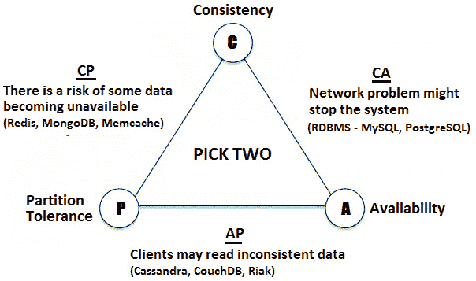

*第 19 章*：

# 系统可扩展性

毫无疑问，可伸缩性是 web 应用程序成功的最关键要求之一。应用程序的扩展能力取决于整个系统架构，在考虑可伸缩性的同时构建项目是最好的方法。当业务的成功可能需要应用程序具有很高的可扩展性时，您会非常感激，因为流量负载很重。

因此，随着 web 的发展，设计和构建可伸缩的应用程序也变得越来越重要。在本章中，我们将介绍在初级/中级职位面试中，您可能会遇到的所有可伸缩性面试问题，如 web 应用程序软件架构师、Java 架构师或软件工程师。如果你正在寻找一个不涉及软件架构和设计相关任务的职位，那么最有可能的是，可伸缩性不会是面试的话题。

本章的议程包括以下内容：

*   简而言之，可伸缩性
*   问题和编码挑战

让我们开始吧！

# 简而言之，可伸缩性

面试官会问你一个最可预测但最重要的问题：什么是可伸缩性？可伸缩性是指进程（系统、网络、应用程序）在添加资源（通常是硬件）时应对工作负载增加的能力（根据工作负载，我们理解任何将系统推向极限的因素，例如流量、存储容量、最大事务数等）。可伸缩性可以表示为系统性能的提高与所用资源的增加之间的比率。此外，可伸缩性还意味着在不影响/修改主节点结构的情况下添加额外资源的能力。

如果增加更多资源会导致性能略有提高，甚至更糟，增加资源对性能没有影响，那么您将面临所谓的*可扩展性差*。

如何实现可伸缩性？在涉及可伸缩性问题的面试中，你很可能也会被问到这个问题。给出一个笼统、全面且不太耗时的答案是最好的选择。应涉及的要点如下：

*   **杠杆 12 因子**(https://12factor.net/)：此方法独立于编程语言，对于交付灵活且可扩展的应用程序非常有帮助。
*   **明智地实现持久性**：从为应用程序选择合适的数据库和开发最优化的模式，到掌握扩展持久性层的技术（例如，集群、副本、分片等），这是值得您全神贯注的关键方面之一。
*   **不要低估查询**：数据库查询是获取短期交易的关键因素。调整连接池和查询以实现可伸缩性。例如，请注意跨节点连接，这会快速降低性能。
*   **选择托管和工具**：缩放不仅仅是代码！基础设施也很重要。如今，许多云计算玩家（例如 Amazon）提供自动缩放和专用工具（Docker、Kubernetes 等）。
*   考虑负载平衡和反向代理（To1）：有一天，你必须从一个服务器切换到一个多服务器体系结构。在云基础设施下运行（例如，亚马逊）可以轻松地为这些设施提供多种配置（对于大多数云提供商来说，负载平衡和反向代理是*即用*服务的一部分）。否则，您必须为这一重大变化做好准备。
*   缓存 To1 T1：在缩放应用程序时，考虑新的缓存策略、拓扑结构和工具。
*   **释放后端**：将尽可能多的计算从后端移动到前端。这样，你就可以从你的肩膀上承担一些工作。
*   **测试和监控**：测试和监控您的代码将帮助您尽快发现问题。

还有许多其他方面需要讨论，但在这一点上，面试官应该准备好将面试推进到下一步。

# 问题和编码挑战

在本节中，我们将讨论 13 个问题和编码挑战，这些问题代表初级/中级可伸缩性访谈中的*必须知道的*。开始吧！

## 编码挑战 1–缩放类型

**问题**：放大和缩小是什么意思？

**解决方案**：通过向现有系统添加更多资源来实现扩展（或垂直扩展），以实现更好的性能并成功面对更大的工作量。通过资源，我们可以了解更多的存储、更多的内存、更多的网络、更多的线程、更多的连接、更强大的主机、更多的缓存等等。添加新资源后，应用程序应该能够遵守 SLA。如今，云中的扩展非常高效和快速。AWS、Azure、Oracle、Heroku、Google Cloud 等云可以在几分钟内根据阈值计划自动分配更多资源。当流量减少时，AWS 可以禁用这些额外资源。这样，你只需为你使用的东西付费。

向外扩展（或水平扩展）通常与分布式架构相关。向外扩展有两种基本形式：

*   在预先打包的基础设施/节点块中添加更多的基础设施容量（例如，超级聚合）。
*   使用一个独立的分布式服务，该服务可以获取有关客户的信息。

通常，通过添加更多与当前使用的服务器或 CPU 类型相同或任何兼容类型的服务器或 CPU 来实现向外扩展。向外扩展使服务提供商可以轻松地为客户提供随增长而付费的基础设施和服务。扩展发生得相当快，因为不需要导入或重建任何内容。然而，扩展速度受到服务器通信速度的限制。

AWS 等云可以在几分钟内根据阈值计划自动分配更多基础设施。当流量较低时，AWS 可以禁用这些额外的基础设施。这样，你只需为你使用的东西付费。

通常，向上扩展比向外扩展提供更好的性能。

## 编码挑战 2–高可用性

**问题**：什么是高可用性？

**解决方案**：高可用性和低延迟对于成吨的业务来说是至关重要的。

通常以给定年份正常运行时间的百分比表示，当应用程序对其用户无中断可用时（一年中 99.9%的时间）即可实现高可用性。

实现高可用性通常是通过集群实现的。

## 编码挑战 3–低延迟

**问题**：什么是低延迟？

**解决方案**：低延迟是一个与计算机网络相关的术语，该网络经过优化，能够以最小的延迟或延迟处理和处理极高的数据量。此类网络的设计和构建旨在处理试图实现近实时数据处理能力的操作。

## 编码挑战 4–聚类

**问题**：什么是集群我们为什么需要集群？

**解决方案**：集群是一组可以单独运行应用程序的机器。我们可以有一个应用服务器集群，一个数据库服务器集群，等等。

拥有一个集群可以显著降低集群中的一台机器出现故障时我们的服务不可用的可能性。换句话说，集群的主要目的在于实现 100%的可用性或零停机服务（高可用性–请参见*编码挑战 2*。当然，所有集群计算机同时发生故障的可能性仍然很小，但通常通过将这些计算机放置在不同的位置或由它们自己的资源支持来缓解这种情况。

## 编码挑战 5–延迟、带宽和吞吐量

**问题**：什么是延迟、带宽和吞吐量？

**解决方案**：在面试中解释这些概念的最佳方式是用一根管子进行简单的类比，如下图所示：

图 19.1–延迟、带宽和吞吐量

**潜伏期**是通过导管所需的时间，而不是导管长度。然而，它是作为管长度的函数来测量的。

**带宽**是管的宽度。

**吞吐量**是流经管道的水量。

## Coding challenge 6 – Load balancing

**Problem**: What is load balancing?

**Solution**: Load balancing is a technique used for distributing workloads across multiple machines or clusters. Among the algorithms used by load balancing, we have Round Robin, sticky session (or session affinity), and IP address affinity. A common and simple algorithm is Round Robin, which divides the workload in a circular order, ensuring that all the available machines get an equal number of requests and none of them is overloaded or underloaded.

For example, the following figure marks the place of a load balancer in a typical master-slave architecture:

Figure 19.2 – Load balancer in a master-slave architecture

By dividing the work across the machines, load balancing strives to achieve maximum throughput and response time.

## Coding challenge 7 – Sticky session

**Problem**: What is sticky session (or session affinity)?

**Solution**: Sticky session (or session affinity) is a notion encountered in a load balancer. Typically, the user information is stored in the session, and the session is replicated on all the machines from the cluster. But session replication (see *Coding challenge 11*) can be avoided by serving a particular user session requests from the same machine.

For this, the session is associated with a machine. This happens when the sessions are created. All the incoming requests for this session are always redirected to the associated machine. The user data is only on that machine.

In Java, sticky session is typically done via the **jsessionid** cookie. At the first request, the cookie is sent to the client. For each subsequent request, the client request contains the cookie as well. This way, the cookie identifies the session.

The main drawback of the sticky session approach consists of the fact that if the machine fails then the user information is lost, and that session is unrecoverable. If the client browser doesn't support cookies or cookies are disabled, then sticky session via cookies cannot be achieved.

## Coding challenge 8 – Sharding

**问题**什么是切分？

**解决方案**：分片是一种架构技术，用于将单个逻辑数据库系统分布在机器集群中。下图描述了该声明：

图 19.3–分片

如上图所示，切分是关于数据库方案的水平分区。主要是数据库表的行（如**团队**）单独存储（西数据中心为奇数行，东数据中心为偶数行），而不是将表拆分为列（拆分为列称为规范化和垂直分区）。

每个分区称为*碎片。*如上图所示，每个碎片可以独立地位于物理位置或单独的数据库服务器上。

切分的目标是使数据库系统具有高度可扩展性。每个分片中的少量行减少了索引大小并提高了读取/搜索操作的性能。

分片的缺点如下：

*   应用程序必须知道数据位置。
*   从系统中添加/删除节点需要重新平衡系统。
*   跨节点联接查询会带来性能损失。

## 编码挑战 9–无共享架构

**问题**：什么是无共享架构？

**解决方案**：无共享架构（表示为**SN**）是一种分布式计算技术，它认为每个节点是独立的，并且包含它需要具有自治性的所有内容。此外，整个系统不需要单点争用。SN 体系结构的主要方面如下：

*   节点独立工作。
*   节点之间不共享任何资源（内存、文件等）。
*   如果一个节点发生故障，那么它只影响其用户（其他节点继续工作）。

SN 体系结构具有线性和理论上无限的可扩展性，非常流行。谷歌是依赖 SN 的主要参与者之一。

## 编码挑战 10–故障切换

**问题**：什么是故障转移？

**解决方案**：故障转移是一种技术，当其中一台机器出现故障时，通过从集群切换到另一台机器来实现高可用性。通常，故障切换由负载平衡器通过心跳检查机制自动应用。负载平衡器主要通过确保机器响应来检查机器的可用性。如果一台机器的心跳发生故障（该机器没有响应），那么负载平衡器不会向它发送任何请求，并将请求从集群重定向到另一台机器。

## 编码挑战 11–会话复制

**问题**：什么是会话复制？

**解决方案**：会话复制是应用服务器集群中常见的，主要目的是实现会话故障切换。

每次用户更改其当前会话时，都会应用会话复制。用户会话主要是从集群自动复制到其他机器上。这样，如果一台机器出现故障，负载平衡器将传入的请求从集群发送到另一台机器。由于集群中的每台机器都有一个用户会话的副本，负载平衡器可以选择这些机器中的任何一台。

虽然会话复制支持会话故障切换，但在内存和网络带宽方面可能会有额外的成本。

## 编码挑战 12–CAP 定理

**问题**：什么是 CAP 定理？

**解决方案**：CAP 定理由 Eric Brewer 发布，专门针对分布式计算。根据这一定理，分布式计算机系统只能同时提供以下三项中的两项：

*   **一致性**：所有节点都可以同时更新。
*   **可用性**：每个请求都会收到成功或失败的响应。
*   **分区容差**：即使部分故障，系统仍继续运行。

下图描述了 CAP 定理：

图 19.4–CAP 定理

谷歌、Facebook 和亚马逊等公司使用 CAP 定理来决定其应用程序架构。

## 编码挑战 13–社交网络

**问题**：您将如何为 Facebook 这样的社交网络设计数据结构？描述显示两人之间最短路径的算法（例如 Tom→ 爱丽丝→ 玛丽→ 凯利）。

**解决方案**：通常，社交网络是使用图形设计的。结果是一个巨大的图，如下图所示（该图是通过谷歌图片通过*社交网络图*关键字收集的）：

图 19.5–社交网络图

所以，在两个人之间找到一条路径就意味着在这样的图中找到一条路径。在这种情况下，问题归结为如何在如此巨大的图中有效地找到两个节点之间的路径。

我们可以从一个人开始，遍历图表找到另一个人。可以使用**BFS**（**广度优先搜索**）或**DFS**（**深度优先搜索**）遍历图形。有关这些算法的更多详细信息，请查看[*第 13 章*](13.html#_idTextAnchor295)、*树和图*。

DFS 将非常低效！两个人之间可能只有一个分离度，但 DFS 可能会在找到这种相对直接的连接之前遍历数百万个节点（人）。

因此，赢家是 BFS。更准确地说，我们可以使用双向 BFS。就像两列来自相反方向并在某个时刻相交的列车一样，我们使用一个从人*A*（来源）开始的 BFS 和一个从人*B*（目的地）开始的 BFS。当搜索发生冲突时，我们找到了一条介于*a*和*B*之间的路径。

为什么不是单向 BFS？因为从*A*到*B*会穿越*p+p*p*人。主要是，单向 BFS 将遍历*A*的*p*朋友，然后遍历他们的*p*朋友。这意味着对于长度为*q*的路径，单向 BFS 将在 O（pq）运行时执行。另一方面，双向 BFS 穿越 2 个*p*节点：每个*A*p 朋友和每个*B*的*p*朋友。这意味着对于长度为*q*的路径，双向 BFS 以 O（pq/2+pq/2）=O（pq/2）执行。显然，O（pq/2）比 O（pq）好。

让我们考虑一条路径，如阿纳河->鲍勃>卡拉>丹-埃尔维拉，每个人都有 100 个朋友。单向 BFS 将穿越 1 亿（1004）个节点。双向 BFS 将仅穿越 20000 个节点（2 x 1002）。

找到一种连接*A*和*B*的有效方法只是问题之一。另一个问题是由于人数太多，数据量太大，无法存储在一台机器上。这意味着我们的图将使用多台机器（例如，一个集群）。如果我们将用户列表表示为 ID 列表，那么我们可以使用切分并在每台机器上存储 ID 范围。这样，我们通过首先进入包含人员 ID 的机器，转到路径中的下一个人。

为了减少机器之间的大量随机跳跃，这会降低性能，我们可以考虑国家、城市、州等，将用户分布到机器上。来自同一国家的用户更有可能成为朋友。

需要回答的更多问题涉及缓存使用、何时停止没有结果的搜索、如果机器出现故障怎么办等等。

很明显，解决像前面这样的问题不是一件容易的事。它需要解决很多问题，因此必须尽可能多地阅读和练习。

# 实践是成功的关键

这短短一章的主题值得一整本书。但是，挑战自己解决以下十大问题将提高您对可伸缩性的认识，并增加您成为软件工程师的机会。

## 设计 bitly、TinyURL 和 goo.gl（一种短网址服务）

要解决的问题：

*   如何为每个给定的 URL 分配唯一标识符（ID）？
*   由于每秒有数千个 URL，如何按比例生成唯一标识符（ID）？
*   如何处理重定向？
*   如何处理自定义短 URL？
*   如何处理过期的 URL（删除它们）？
*   如何跟踪统计数据（例如，单击统计）？

## 设计 Netflix、Twitch 和 YouTube（全球视频流服务）

要解决的问题：

*   如何以容纳大量同时使用的用户（用户可以查看和共享数据）的方式存储和分发数据？
*   如何跟踪统计数据（例如，总视图数、投票数等）？
*   您如何允许用户在视频上添加评论（最好是实时的）？

## 设计 WhatsApp 和 Facebook Messenger（全球聊天服务）

要解决的问题：

*   您如何设计用户之间的一对一对话/会议？
*   你如何设计小组聊天/会议？
*   您如何处理离线用户（未连接互联网）？
*   您应该何时发送推送通知？
*   您如何支持端到端加密？

## 设计 Reddit、HackerNews、Quora 和 Voat（留言板服务和社交网络）

要解决的问题：

*   您如何跟踪每个答案的统计数据（总浏览量、投票数等）？
*   如何允许用户关注其他用户或主题？
*   如何设计包含用户首要问题的时间线（类似于新闻提要生成）？

## 设计谷歌硬盘、谷歌照片和 Dropbox（全球文件存储和共享服务）

要解决的问题：

*   您如何设计用户功能，如上传、搜索、查看和共享文件/照片？
*   如何跟踪文件共享的权限？
*   如何允许一组用户编辑同一文档？

## 设计推特、脸书和 Instagram（一个非常大的社交媒体服务）

要解决的问题：

*   您如何高效地存储和搜索帖子/推文？
*   您如何实现新闻源生成？
*   你如何处理社交图（参见*编码挑战 13*？

## 设计 Lyft、Uber 和 RideAustin（乘车共享服务）

要解决的问题：

*   您如何将乘车请求与附近的驾驶员匹配？
*   如何为不断移动的车手和驾驶员存储数百万个位置（地理坐标）？
*   如何更新驾驶员/骑手位置（每秒更新一次）？

## 设计一款前置式网络爬虫（搜索引擎相关服务）

要解决的问题：

*   如何刷新数据？
*   如何存储以前的搜索查询？
*   如何检测已键入字符串的最佳匹配？
*   当用户打字太快时，您如何处理这种情况？
*   如何查找新页面（网页）？
*   如何为动态变化的网页分配优先级？
*   你如何保证爬虫不会永远停留在同一个域上？

## 设计 API 速率限制器（例如 GitHub 或 Firebase）

要解决的问题：

*   您如何限制一个时间窗口内的请求数（例如，每秒 30 个请求）？
*   如何实现在服务器集群中工作的速率限制？
*   如何应对节流（软节流和硬节流）？

## 设计附近的地点/朋友和 Yelp（近距离服务器）

要解决的问题：

*   你如何搜索附近的朋友或地方？
*   你如何排名？
*   如何根据人口密度存储位置数据？

应对这些挑战并非易事，需要丰富的经验。然而，如果您是一名初级/中级程序员，并且已经阅读了关于可伸缩性的介绍性章节，那么您应该能够决定您的职业道路是否应该朝着这个方向发展。然而，请记住，在软件工程面试中，设计大规模分布式系统是一个要求很高的领域。

# 总结

这是本书的最后一章。我们刚刚讨论了一系列适合可伸缩性主题的问题。

祝贺你走到这一步！现在，在本书的结尾，记住要尽可能多地练习，对自己的判断有信心，永远不要放弃！我真的希望你的下一个 Java 职位能给你带来你梦想中的工作，并希望这本书能为你的成功做出贡献。