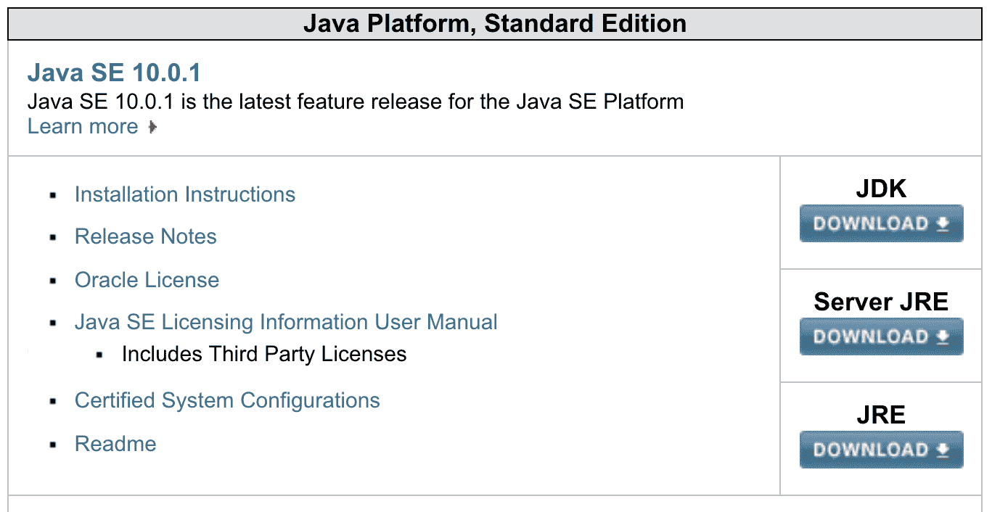
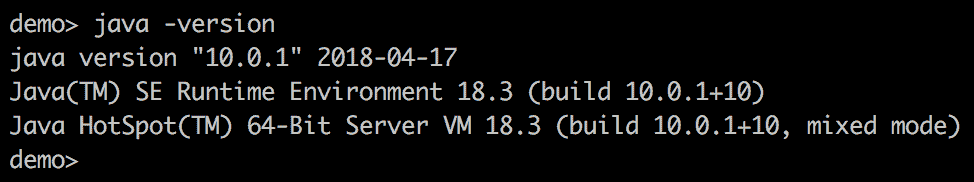
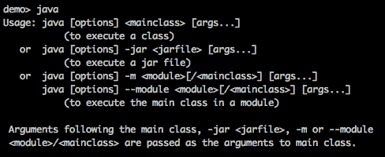
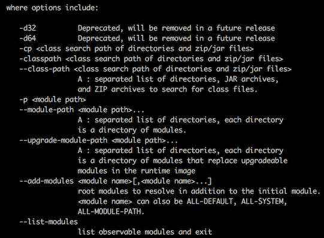
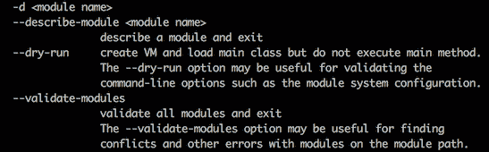
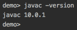
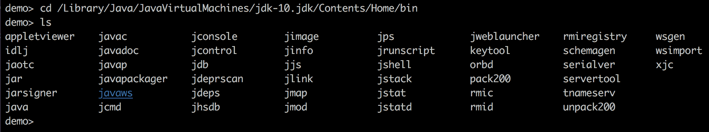

# 计算机上的 Java 虚拟机（JVM）

这本书将是您获得中级 Java 编程技能的指南。编程不仅仅是了解语言语法。它还涉及编写、编译和执行程序或运行整个软件系统所需的工具和信息源。这条路的第一步是学习 Java 的重要组件，包括**Java 开发工具包**（**JDK**）和**Java 虚拟机**（**JVM**）。

本章将介绍 Java 作为一种语言和工具，并建立最重要的术语。它还将描述 Java 创建背后的动机，涵盖其历史、版本、版本和技术，并概述 Java 的市场地位和主要应用领域。然后，一系列实际步骤将引导读者在其计算机上完成 Java 安装和配置过程，并介绍主要的 Java 命令。

在本章中，我们将介绍以下主题：

*   什么是 Java？
*   Java 平台、版本、版本和技术
*   JavaSE 开发工具包（JDK）的安装和配置
*   主要 Java 命令
*   练习–JDK 工具和实用程序

# 什么是 Java？

因为这本书是为初学者编写的，所以我们假设您对 Java 几乎一无所知。但是，即使你确实知道一些东西，甚至很多，复习基础知识总是很有帮助的，即使只是为了让你通过欣赏自己已经掌握了多少知识来自我感觉良好。因此，我们将从定义 Java、JVM、编译、字节码等术语开始。

# 基本术语

当谈到 Java 时，人们使用 Java、JVM、JDK、SDK 和 Java 平台作为同义词。法律定义将 Java 视为*Sun 对一系列技术*的商标，但我们通常不将 Java 视为商标。大多数情况下，当有人说 Java 时，他们指的是一种编程语言，人类使用它来表达可以由计算机执行的指令（程序）集（不是直接执行，而是在程序被编译/转换成计算机能够理解的代码之后）。人类可读的 Java 程序称为**源代码**，计算机可读程序（经过所有转换后）称为**二进制代码**，因为它只使用 1 和 0 表示。

您可以在[找到完整的**Java 语言规范**（说明）https://docs.oracle.com/javase/specs/](https://docs.oracle.com/javase/specs/) 。它比人们预期的更容易访问，甚至对新手也有帮助，尤其是当人们将其用作参考文档时。第一种语言中的少数部分不会让人感到气馁。阅读您可以阅读的内容，稍后再回来，因为您对 Java 的理解在增长，对更深入、更精确的定义的动机也在增加。

JVM 是一个将 Java`.class`文件的字节码转换成二进制机器码并发送给微处理器执行的程序。

您是否注意到有两个类似的术语，*字节码*和*字节码*？在会话中，这种差异几乎不明显，因此人们可以互换使用。但这是有区别的。*字节码*（确切地说是*字节码*）是一种可以由一个名为 JVM 的特殊程序执行的语言。相比之下，*字节码*是 Java 编译器（另一个程序）生成的指令的格式（每条指令占用一个字节，因此是名称），Java 编译器读取人类可读的源代码并将其转换为字节码。

字节码是以 JVM 理解的格式表示的二进制代码。JVM 然后读取（使用名为**类加载器**的程序加载）字节码，将指令转换为二进制代码（JVM 运行的特定计算机微处理器可以理解的格式的指令），并将结果传递给 CPU，CPU 是执行指令的微处理器。

类是 Java 编译器生成的文件（扩展名为`.class`）（来自同名文件中的源代码，扩展名为`.java`）。有十几个 JVM 实现，由不同的公司创建，但我们将重点关注 Oracle JVM 的实现，它被称为**热点**。在[第 11 章](11.html)、*JVM 进程和垃圾收集*中，我们将更仔细地研究 JVM 的功能、架构和进程。

与 Java 语言规范（[在同一页上 https://docs.oracle.com/javase/specs](https://docs.oracle.com/javase/specs) ），您可以找到 Java 虚拟机规范。我们建议您使用它作为术语和 JVM 功能理解的参考源。

JDK 是一个软件工具和支持库的集合，允许创建和执行 Java 语言程序。

自从 Java9 以来，小程序（可以在浏览器中执行的组件）不再受支持，所以我们将不再多谈它们。应用程序是一个 Java 程序，可以（编译后）在安装了 JVM 的计算机上执行。因此，JDK 至少包括一个编译器、JVM 和**Java 类库**（JCL）——应用程序可以调用的现成过程集合。但实际上，它还有许多其他工具和实用程序可以帮助您编译、执行和监视 Java 应用程序。JDK 的子集，包括 JVM、JCL、类加载器和支持文件，允许执行（运行）字节码。这种组合称为**Java 运行时环境**（**JRE**。每个 Java 应用程序都在一个单独的 JVM 实例（副本）中执行，该实例有自己分配的计算机内存，因此两个 Java 应用程序不能直接相互通信，只能通过网络（web 服务和类似手段）进行通信。

**Software Development Kit** (**SDK**) is a collection of software tools and supporting libraries that allow the creation of an application using a certain programming language. SDK for Java is called JDK.

因此，当人们参考 JDK 使用 SDK 时，它们是正确的，但并不精确。

Java 平台由编译器、JVM、支持库和来自 JDK 的其他工具组成。

上述定义中的支持库是 Java 标准库，也称为**JCL**，是执行字节码所必需的。如果程序需要一些其他库（不包括在 JCL 中），则必须在编译时添加它们（请参见[第 3 章](03.html)、*您的开发环境设置*，其中描述了如何进行），并包含在生成的字节码中。Java 平台可以是以下四种版本之一：**Java 平台标准版**（**Java SE**）、**Java 平台企业版**（**Java EE**）、**Java 平台微版**（**Java ME**）或**Java 卡**。过去也有 JavaFX 平台，但自从 Java8 以来，它已经被合并到 JavaSE 中。我们将在下一节讨论这些差异。

OpenJDK 是 JavaSE 的一个免费开源实现。

这些是最基本的术语。根据需要，本书将在相应的上下文中引入其他术语。

# 历史与流行

Java 于 1995 年由 Sun Microsystems 首次发布。它是从 C 和 C++派生的，但不允许用户在非常低的水平上操作计算机内存，这是许多困难的来源，包括内存泄漏相关的问题，如果 C 和 C++程序员不太小心的话，他们会经历这些问题。Java 因其简单性、可移植性、互操作性和安全网而脱颖而出，这使它成为最流行的编程语言之一。据估计，截至 2017 年，全世界有近 2000 万程序员（其中近 400 万在美国），其中约一半使用 Java。有充分的理由相信，对软件开发人员（包括 Java 开发人员）的需求只会在未来增长。因此，学习 Java 看起来是迈向稳定职业的一步。学习 Java 其实并不难。我们将向您展示如何做到这一点；只要继续阅读，思考，并在电脑上尝试所有的建议。

Java 被认为是一种允许用户*写一次，在任何地方*运行的工具——这是另一个需要解释和理解的术语。这意味着编译后的 Java 代码可以在具有支持 Java 的操作系统的所有计算机上运行，而无需重新编译。正如您已经了解的，*支持 Java*意味着对于每个操作系统，都存在一个可以将字节码转换为二进制码的解释器。这就是*run anywhere*的实现方式：Java 解释器可用的任何地方。

在这个概念被证明是流行的，并且 Java 在其他面向对象语言中被牢固地确立为主要参与者之一之后，Sun Microsystems 在 GNU**通用公共许可证**（**GPL**的管理下，大量开发了其 JVM 自由开源软件。2007 年，Sun Microsystems 以免费和开源的发行条款提供了其 JVM 的所有核心代码，但 Sun 没有版权的一小部分代码除外。2010 年，甲骨文收购了 Sun Microsystems，并宣布自己*是 Java 技术的管理者，坚定地致力于培育一个参与和透明的社区*。

如今，Java 应用于许多领域，最突出的是 Android 编程和其他移动应用、各种嵌入式系统（各种芯片和专用计算机）、桌面**图形用户界面**（**GUI**）开发以及各种各样的 web 应用，包括网络应用程序和 web 服务。Java 还广泛用于科学应用，包括迅速扩展的机器学习和人工智能领域。

# 原则

根据 Java*<sup>TM</sup>编程语言*（[的*设计目标，Java 语言的创建有五个主要目标 http://www.oracle.com/technetwork/java/intro-141325.html*](http://www.oracle.com/technetwork/java/intro-141325.html) 。必须是 Java 语言：

*   面向对象和熟悉的 java T1 席：这意味着它必须看起来像 C++，但是没有不必要的复杂性（我们将在 Ont2 中讨论面向对象的术语）第 2 章 AutoT3A.，To.T4\. Java 语言基础（To.T5.）
*   **架构中立和可移植**：这意味着能够使用 JVM 作为环境，将语言（源代码）与每个特定操作系统（通常称为平台）的知识隔离开来
*   高性能 ALE T1：它应该与当时领先的编程语言保持一致。
*   **解释**：无需链接即可将其移动到执行阶段（从多个`.class`文件创建一个可执行文件），从而允许更快的写-编译-执行周期（不过，现代 JVM 经过优化，以保持常用`.class`文件的二进制版本，以避免重复解释）
*   **多线程**：应该允许多个并发执行作业（线程），比如下载一个图像，同时处理其他用户命令和数据
*   **动态**：执行过程中需要进行链接
*   **安全**：必须在运行时对其进行良好保护，防止未经授权的修改

结果证明，这些目标定义明确且富有成效，因为 Java 已成为互联网时代的主要语言之一。

# Java 平台、版本、版本和技术

在日常讨论中，一些程序员交替使用这些术语，但 Java 平台、版本、版本和技术之间存在差异。本节将重点解释它。

# 平台和版本

我们几乎每天都听到*平台*这个词。它的意思随上下文的不同而变化，但在最一般的意义上，它意味着允许某人做某事的设备或环境。它作为一个基础，一个环境，一个平台。在信息技术领域，平台提供了一个可以开发和执行软件程序的操作环境。操作系统是平台的典型示例。Java 有自己的操作环境，正如我们在前面几节中提到的，它有四个平台（和六个版本）：

*   **Java 平台标准版**（**Java SE**）：这是大多数人说 Java 时的意思。它包括 JVM、JCL 和其他工具和实用程序，这些工具和实用程序允许在台式机和服务器上开发和部署 Java 应用程序。在本书中，我们将在本版的范围内，仅在本节中提及其他版本。
*   **Java 平台企业版**（**Java EE**）：它由 Java SE、服务器（为应用程序提供服务的计算机程序）、增强型库、代码示例、教程和其他文档组成，用于开发和部署大规模、多层和安全的网络应用程序。
*   **Java Platform Micro Edition**（**Java ME**）：这是 Java SE 的一个小规模（使用很少的资源）子集，有一些专门的类库用于开发和部署嵌入式和移动设备的 Java 应用程序——电话、个人数字助理、电视机顶盒、打印机、传感器、，等等还有一个由谷歌开发的用于 Android 编程的 JavaME 变体（有自己的 JVM 实现）。名为**安卓 SDK**。
*   **Java 卡**：这是最小的 Java 平台，用于在小型嵌入式设备（如智能卡）上开发和部署 Java 应用程序。它有两个版本（引用自[上的甲骨文官方文档）http://www.oracle.com/technetwork/java/embedded/javacard/documentation/javacard-faq-1970428.html#3](http://www.oracle.com/technetwork/java/embedded/javacard/documentation/javacard-faq-1970428.html#3) ：
    *   **Java Card Classic Edition****<q>针对目前所有垂直市场上部署的智能卡，基于 ISO7816 和 ISO14443 通信。</q>**
    ***   **Java 卡连接版**，开发<q>支持 web 应用模型，卡上运行 servlet，TCP/IP 作为基本协议</q>和<q>在高端安全微控制器上运行，通常基于 32 位处理器，支持 USB</q>等高速通信接口 .**

 **# 版本

自 1996 年首次发布以来，Java 经历了九个主要版本的演变：

*   JDK 1.0（1996 年 1 月 23 日）
*   JDK 1.1（1997 年 2 月 19 日）
*   J2SE 1.2（1998 年 12 月 8 日）
*   J2SE 1.3（2000 年 5 月 8 日）
*   J2SE 1.4（2002 年 2 月 6 日）
*   J2SE 5.0（2004 年 9 月 30 日）
*   爪哇 SE 6（2006 年 12 月 11 日）
*   爪哇 SE7（2011 年 7 月 28 日）
*   爪哇 SE 8（2014 年 3 月 18 日）
*   爪哇 SE 9（2017 年 9 月 21 日）
*   爪哇 SE 10（2018 年 3 月 20 日）

关于更改 Java 版本控制方案，有几点建议。自 Java10 以来，JDK 引入了一种新的基于时间的版本控制`$YEAR.$MONTH`。此外，计划每六个月在每年的 3 月和 9 月发布一个新的 Java 版本。因此，Java 11 将于 2018 年 9 月发布，JVM 版本为 18.9。我们稍后将向您展示如何显示您正在使用的 JDK 版本。

# 技术

“技术”这个词是超负荷的。程序员几乎可以用它做任何事情。如果你看看 Oracle 的 Java 技术列表（[https://www.oracle.com/java/technologies/index.html](https://www.oracle.com/java/technologies/index.html) ），您将发现以下列表：

*   **嵌入式**，其中**包括除 Java EE 之外的所有先前列出的 Java 平台，并进行了一些修改，通常具有更小的占用空间和其他优化**
***   **Java SE**，其中**涵盖 Java SE 和 Java SE Advanced，其中包括 Java SE 和一些用于企业级（不仅仅是开发计算机）安装的监控和管理工具*****   **Java EE**，如上所述*   **云**，其中**包含基于云的可靠、可扩展、弹性服务******

 ******但是在甲骨文词汇表中（[http://www.oracle.com/technetwork/java/glossary-135216.html](http://www.oracle.com/technetwork/java/glossary-135216.html) ），列表中增加了以下技术：

*   **JavaSpaces**：一种提供分布式持久性的技术
*   **Jini Technology**：一个**应用程序编程接口**（**API**），实现设备和服务的自动联网

其他地方，在 Oracle Java 10 文档的首页（[https://docs.oracle.com/javase/10](https://docs.oracle.com/javase/10) ），客户端技术如下：


同时，在 Oracle Java 教程中（[https://docs.oracle.com/javase/tutorial/getStarted/intro/cando.html](https://docs.oracle.com/javase/tutorial/getStarted/intro/cando.html) 、**Java Web Start**和**Java 插件**被称为向最终用户部署应用程序的部署技术<q>。</q>

然而，Oracle 提供的 Java 技术的最大列表出现在专门用于技术网络的页面上（[http://www.oracle.com/technetwork/java/index.html](http://www.oracle.com/technetwork/java/index.html) ）。除了 Java SE、Java SE Advanced and Suite、Java Embedded、Java EE、Java FX 和 Java 卡之外，还列出了**Java TV**、**Java DB**和**开发工具**。如果您转到 JavaSE 或 JavaEE 页面，在 Technologies 选项卡下，您将发现超过二十个 API，以及作为技术列出的各种软件组件。因此，在任何地方都可以找到 Java 技术列表，这并不奇怪。

似乎任何与 Java 相关的东西都至少有一次在某处被称为技术。为了避免进一步的混淆，从现在起，在本书中，我们将尽量避免使用 word 技术。

# JavaSE 开发工具包（JDK）的安装和配置

从现在开始，每次我们谈论 Java 时，我们指的是 JavaSE 版本 10。除非另有说明，否则我们将其称为 Java10 或 Java 或 JDK，用作同义词。

# 从哪里开始

在您的计算机上进行任何 Java 开发之前，您需要安装并配置 JDK。为此，请在 internet 上搜索 JDK 下载并选择任何以[开头的链接 https://www.oracle.com/](https://www.oracle.com/) 。在本文中，最好的应该是[http://www.oracle.com/technetwork/java/javase/downloads/index.html](http://www.oracle.com/technetwork/java/javase/downloads/index.html) 。

如果您遵循前面的链接，您将看到此部分：



我们将此页称为*Page1*，以供进一步参考。现在，您可以单击 JDK 下的下载链接。另外两个下载链接提供 JRE，正如您所知，JRE 只允许您运行已经编译的 Java 程序；我们需要编写一个程序，把它编译成字节码，然后运行它。

# 包含 Java 安装程序的页面

单击后，您将看到一个页面（*Page2*）包含此部分：


这些是针对不同的**操作系统**（**操作系统**的 Java 安装程序。您需要选择一个适合您的操作系统并单击相应的链接（不要忘记使用单选按钮单击接受许可协议；如果有疑问，请通过链接 Oracle Binary Code License Agreement for Java SE 阅读许可协议）。对于 Linux，有两个安装程序—一个是 Red Hat Package Manager 格式（`.rpm`），另一个只是归档（`.tar`和压缩（`.gz`版本）。另外，请注意，在此列表中，只有 64 位操作系统的安装程序。在撰写本文时，还不清楚 32 位版本是否会被正式删除，尽管它是作为早期的 access 版本提供的。

选择所需的安装程序并下载。

# 如何安装

现在是安装 Java 的时候了，它基本上包括以下四个步骤：

1.  展开安装程序
2.  创建目录
3.  将文件复制到这些目录中
4.  使 Java 可执行文件无需键入完整路径即可访问

要查找详细的安装说明，请返回*Page1*并单击安装说明链接。找到操作系统的链接并按照提供的步骤操作，但只选择与 JDK 相关的步骤。

最终，您将能够运行命令`java -version`，该命令将显示以下内容：



如您所见，它将 Java 的版本显示为 10.0.1，将 JRE 和 JVM 的版本显示为 18.3（build 10.0.1）。目前还不清楚 Java、JRE 和 JVM 的未来版本是否将遵循相同的格式。

无论如何，如果`java -version`命令显示您试图安装的版本，这意味着您已经正确安装了 Java，现在可以享受使用它的乐趣。从现在起，每次发布新版本时，都会提示您升级，您只需单击提供的链接即可完成升级。或者，您可以与安装程序一起进入页面（*Page2*，下载相应的安装程序，启动它，然后重复您已经熟悉的过程。

但实际上，程序员并不是每次都升级 Java 安装。他们在生产环境中保持其开发版本与 Java 相同（以避免潜在的不兼容性）。如果他们想在升级产品之前使用新版本，他们可能会在计算机上并行安装两个 Java 版本。在[第 3 章](03.html)*您的开发环境设置*中，您将学习如何执行此操作，以及如何在它们之间切换。

# 主要 Java 命令

在上一节中，您看到了 Java 命令的一个示例，即显示 JVM 版本的命令。顺便说一句，`java`命令启动 JVM，并用于运行已编译 Java 程序的字节码（我们将在[第 4 章](04.html)*您的第一个 Java 项目*中详细介绍如何执行此操作）。

# JVM 执行命令

现在，如果您只运行`java`，输出将显示简短版本的帮助。因为它很长，我们将分几个部分展示它。以下是第一节：



它显示了运行 JVM 的三种方法：

*   要执行一个类，需要一个包含字节码的`.class`文件
*   要执行 jar 文件，一个扩展名为`.jar`的文件，其中包含 ZIP 格式的`.class`文件（甚至可能是整个应用程序），其中还包括一个特定于 Java 的清单文件
*   执行模块中的主类（一组结构优于`.jar`文件的`.class`文件和其他资源），通常是一个应用程序或其一部分

如您所见，在前面的每个命令中，必须显式提供一个主类。首先必须执行的是`.class`文件。它充当应用程序的主要入口，并启动加载其他类（根据需要）以运行应用程序的链。此类命令的一个例子是：

```java
java MyGreatApplication
```

实际上，这意味着当前目录中有一个文件`MyGreatApplication.class`，但我们不应该指定文件扩展名。否则，JVM 将查找文件`MyGreatApplication.class.class`，当然，它不会找到该文件，并且无法运行任何内容。

在本书中，我们不打算显式地使用这些命令中的任何一个，而是将其留给编辑器在幕后运行，因为现代编辑器不仅仅帮助编写和修改源代码；它还可以编译和执行编写的代码。这就是为什么它不仅被称为编辑器，而且被称为**集成开发环境**（**IDE**）。

尽管如此，我们将继续概述所有的`java`命令选项，这样您就可以了解 IDE 中的幕后情况。要享受汽车驾驶的乐趣，人们不需要了解发动机内部工作的细节，但了解发动机的工作原理是有帮助的。此外，随着您的专业水平的提高，您所使用的应用程序也在增长，并且必须处理许多请求，您将需要调整 JVM 配置，因此这里是第一次偷偷地看一看。

以下是`java`命令输出的下一部分：



在前面的屏幕截图中，您可以看到两个不推荐的选项，后面是与类路径和模块路径相关的选项。最后两个是非常重要的选择。它们允许指定应用程序包含的类的位置以及应用程序使用的库的位置。后者可以是您或第三方库编写的类。

模块的概念超出了本书的范围，但是模块路径的使用与类路径非常相似。classpath 选项告诉 JVM 在哪里查找类，而模块路径告诉 JVM 模块的位置。可以在同一命令行中同时使用这两个命令。

例如，假设您将文件`MyGreatApplication.class`（包含您程序的字节码，`MyGreatApplication.java`）存储在目录`dir2`（目录`dir1`的子目录）中，并且您的终端窗口当前显示目录`dir1`的内容：


如您所见，还有另一个目录`dir3`，我们创建该目录是为了存储另一个文件`SomeOtherProgram.class`，供您的应用程序使用。我们还在`dir4`中建立了一个其他支持`.class`文件的库，这些文件收集在`SomeLibrary.jar`中。运行应用程序的命令行如下所示：

```java
java -cp dir2:dir3:dir4/SomeLibrary.jar  MyGreatApplication //on Unix
java -cp dir2;dir3;dir4\SomeLibrary.jar  MyGreatApplication //on Windows
```

或者，我们可以将`SomeOtherProgram.class`和`MyGreatApplication.class`放在`some.jar`或`some.zip`文件中，并将其放在`dir5`中。然后，该命令将采用以下形式之一：

```java
java -cp dir4/SomeLibrary.jar:dir5/some.zip MyGreatApplication //Unix
java -cp dir4/SomeLibrary.jar:dir5/some.jar MyGreatApplication //Unix
java -cp dir4\SomeLibrary.jar;dir5\some.zip MyGreatApplication //Windows
java -cp dir4\SomeLibrary.jar;dir5\some.jar MyGreatApplication //Windows
```

我们可以使用选项`-classpath`或`--class-path`代替`-cp`。它们只是三种不同的约定，因此习惯其中一种约定的人可以直观地编写命令行。尽管我们每个人都有自己的偏好和观点，但没有一种风格比其他风格更好或更差。如果两个类路径选项都没有使用，JVM 将只在当前目录中查找类。有些类（标准库）总是位于 Java 安装的特定目录中，因此不需要使用 classpath 选项列出它们。我们将在[第 3 章](03.html)、*您的开发环境设置*中更详细地讨论类路径的设置。

`java`命令输出的下一部分列出了允许在实际执行应用程序之前验证所有设置是否正确的选项：



由于模块不在本书的范围内，我们将跳过这些模块，继续讨论输出的下一部分：


`-D`选项允许使用应用程序可访问的值设置参数。它通常用于向应用程序传递一些值或标志，应用程序可以使用这些值或标志来更改其行为。如果需要传递更多信息，则使用`.properties`文件（具有许多标志和各种值），同时使用选项`-D`传递属性文件的位置。这完全取决于程序员在`.properties`文件或通过`-D`选项传递的值中必须包含的内容。但也有与应用程序配置相关的最佳实践，这也取决于您使用的特定框架或库。随着时间的推移，您将学习它们，这些实践超出了初级程序员课程的范围。

`-verbose`选项提供了更多的信息（比我们在这些截图上看到的更多）和一些特定数据，具体取决于标志`class`、`module`、`gc`或`jni`，其中**gc**代表**垃圾收集器**，这将在[第 11 章](11.html)、*中讨论 JVM 进程和垃圾收集*。对于其他标志，您可以阅读 Oracle 的官方文档，但很有可能在短期内不会使用它们。

`-version`选项显示已安装的 Java 版本。这从第一天开始就非常有用，因为它允许随时检查当前使用的 Java 版本。在上一节中，我们演示了如何执行它，以及它产生的输出。当 Java 的新版本发布时，许多程序员将其与当前使用的版本并行安装，并在两者之间切换，以学习新功能或开始为新版本编写代码，同时保留为旧版本编写的旧代码。您将在[第 3 章](03.html)*您的开发环境设置*中学习如何在同一台计算机上安装两个版本的 Java，以及如何在它们之间切换。

我们将跳过与模块相关的选项。

前面屏幕截图中的其余选项与帮助相关。选项`-?`、`-h`、`-help`和`--help`显示我们在这些屏幕截图中显示的内容，选项`-X`和`--help-extra`提供附加信息。你可以自己尝试所有的方法。

帮助输出的最后一部分如下所示：


我们将不讨论这些选项。请注意如何使用上一行中解释的 long 选项（带有两个连字符）。

# 编译命令

如前所述，用 Java 编写的程序称为源代码，并存储在`.java`文件中。编译命令`javac`读取它并创建一个带有 Java 字节码的相应`.class`文件。

让我们运行命令`javac`而不指定`.java`文件。这将显示出帮助。让我们分几节来回顾一下：


此格式告诉我们该命令具有以下帮助：

```java
javac <options> <source files>
```

要只编译几个文件，可以在命令行的选项后面列出它们（如果文件不在当前目录中，则必须在文件名前面加上绝对或相对路径）。列出的文件在 Oracle Solaris 中用冒号（`:`）分隔，在 Windows 中用分号（`;`）分隔，可以是目录、`.jar`文件或`.zip`文件。也可以列出一个文件中的所有源文件，并使用`@filename`选项提供此文件名（参见前面的屏幕截图）。但不要试图记住所有这些。您很少（如果有）显式地运行命令`java`或`javac`。您可能会使用一个 IDE 来完成这项工作（请参见[第 3 章](03.html)、*您的开发环境设置*。这也是我们将跳过前面屏幕截图中列出的大多数选项的原因，并且只提及其中两个选项：`--class-path`（或`-classpath`、或`-cp`），用于指定在何处查找当前编译代码所需的`.class`文件，以及`-d`，用于指示将创建的`.class`文件放置在何处。

以下是`javac`帮助的下一部分：


在前面的屏幕截图中，我们将在这里提到的唯一选项是`--help`（或`-help`，它提供了与我们现在看到的相同的帮助消息。

最后，`javac`帮助的最后一部分如下：


我们已经描述了选项`--source-path`（或`-sourcepath`）。选项`-verbose`要求编译器提供更详细的报告，而选项`--version`（或`-version`显示 JDK 版本：



# 命令 jcmd 和其他命令

还有十几个其他 Java 命令（工具和实用程序），您可能需要经过几年的专业编程才能开始使用这些命令（如果有的话）。Oracle Java 在线文档中对它们进行了描述。只需搜索 Java 实用程序和工具。

其中，从 Java 编程的第一天起，我们发现只有一个命令非常有用。这是命令`jcmd`。如果运行它，它将显示计算机上运行的所有 Java 进程（JVM 实例）。在本例中，您可以看到三个 Java 进程，进程 ID 分别为 3408、3458 和 3454：


Process3408 运行 Maven 服务器（您的 IDE 通常会启动它）。流程 3458 是我们运行的`jcmd`。process 3454 是一个编辑器（IDE）IntelliJ IDEA，它正在运行小型演示应用程序`com.packt.javapath.App`。

这样，您就可以随时检查计算机上是否有失控的 Java 进程。如果您想停止它，可以使用任务管理器或命令`kill`，它需要 PID。

当您想要监视 Java 应用程序时，还需要了解 PID。我们将在[第 11 章](11.html)、*JVM 进程和垃圾收集*中讨论这一点。

至此，我们完成了对 Java 命令的概述。正如我们已经提到的，您的 IDE 将在幕后使用所有这些命令，因此您可能永远不会使用它们，除非您进行生产支持（这是几年后，在您开始学习 Java 之后）。但是我们觉得您需要了解它们，这样您就可以连接 Java 开发过程中的各个点。

# 练习–JDK 工具和实用程序

在您的计算机上，找到 Java 安装目录，并列出所有命令（工具和实用程序）-其中存在的可执行文件。

如果您在其他可执行文件中看到`java`和`javac`，那么您就处在正确的位置。

# 答复

以下是使用 Java 10.0.1 安装的所有可执行文件的列表：



查找此目录的方法之一是查看环境变量`PATH`的值。例如，在 Mac 计算机上，Java 安装在目录`/Library/Java/JavaVirtualMachines/jdk-10.jdk/Contents/Home/bin`中。

描述 JVM 安装位置的 Oracle 文档可在[中找到 https://www.java.com/en/download/help/version_manual.xml](https://www.java.com/en/download/help/version_manual.xml) 。

# 总结

在本章中，您学习了最重要的 Java 相关术语 JVM、JDK、SDK、Java 平台和其他术语，涵盖了 Java 程序生命周期的主要阶段，从源代码到字节码再到执行。您还了解了 Java 的历史、创建动机、版本和版本。提供的实际步骤和建议帮助您在计算机上安装 Java，并使用其主要命令`java`、`javac`和`jcmd`。有关更多详细信息，请参阅 Oracle 官方文档。查找和理解本文档的能力是成功从事 Java 程序员职业的先决条件，因此我们建议您遵循提供的所有链接，并在 internet 上进行相关搜索，以便轻松找到好的信息源。

在下一章中，我们将深入探讨 Java 作为一种编程语言，并将介绍基本知识。这将成为以下章节的基础（或跳跃板，如果你愿意）。如果您是 Java 新手，我们建议您继续阅读，不要跳过，因为每一章都基于上一章的知识。即使您对 Java 有一定的了解，再次复习基础知识也总是有帮助的。*重复是学习之母*（*重复是学习之母*），一句拉丁谚语如是说。********