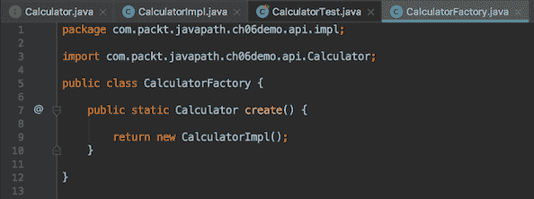
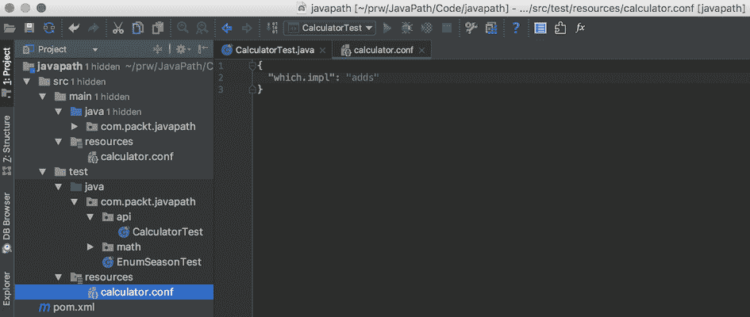
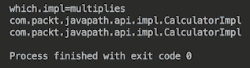
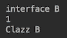
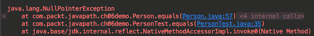
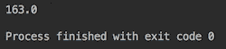
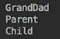
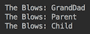

# 接口、类和对象构造

本章向读者解释 Java 编程最重要的方面：**应用程序编程接口**（**API**）、对象工厂、方法重写、隐藏和重载。下面将解释聚合（相对于继承）的设计优势，开始讨论软件系统设计。本章最后概述了 Java 数据结构。

在本章中，我们将介绍以下主题：

*   什么是 API？
*   接口和对象工厂作为 API
*   重写、隐藏和重载
*   `this`和`super`关键字
*   构造函数和构造函数重载
*   最终变量、最终方法和最终类
*   对象关联（聚合）
*   练习–将类实例化限制为单个共享实例

# 什么是 API？

术语**应用程序编程接口**（**API**是一种协议、过程和服务的规范，程序员可以将这些协议、过程和服务用作构建块来实现所需的功能。API 可以表示基于 web 的系统、操作系统、数据库系统、计算机硬件或软件库。

除此之外，在日常生活中，术语 API 通常用于实现规范的系统。例如，您可能熟悉 Twitter API（[https://developer.twitter.com/en/docs](https://developer.twitter.com/en/docs) 或亚马逊 API（[https://developer.amazon.com/services-and-apis](https://developer.amazon.com/services-and-apis) ），或者您可能使用过能够通过提供数据（测量结果）响应请求的设备（传感器）。因此，当程序员说*我们可以使用 AmazonAPI*时，他们的意思不仅是对所提供过程的描述，还包括服务本身。

在 Java 中，我们还有一些术语*API 用法*的变体，我们希望在下面的小节中对其进行识别和描述。

# Java 应用程序接口

Java API 包括两大类 API 和实现它们的库：

*   Java 核心包（[http://www.oracle.com/technetwork/java/api-141528.html](http://www.oracle.com/technetwork/java/api-141528.html) ）随 Java 安装提供，并包含在 JDK 中
*   其他可以单独下载的框架和库，如 Apache Commons API（[https://commons.apache.org 例如，我们已经将三个库作为依赖项包含在演示项目的 Maven`pom.xml`文件中。其中绝大多数可以在 Maven 存储库（](https://commons.apache.org)[中找到 https://mvnrepository.com](https://mvnrepository.com) ），但在这里可以找到各种新的和实验性的库和框架。

# 命令行 API

命令行 API 描述了可用于执行应用程序（工具）的命令格式及其可能的选项。当我们在[第 1 章](01.html)中提到使用工具（应用程序）`java`和`javac`时，我们已经看到了这样的例子，*在您的计算机上使用 Java 虚拟机（JVM）*。我们甚至在[第 4 章](04.html)*中构建了自己的应用程序，您的第一个 Java 项目*定义了它的 API，并将它的命令行 API 描述为接受整数作为参数。

# 基于 HTTP 的 API

基于 web 的应用程序通常使用各种协议提供基于 HTTP 的 API（[https://en.wikipedia.org/wiki/List_of_web_service_protocols](https://en.wikipedia.org/wiki/List_of_web_service_protocols) ），允许通过互联网访问应用程序功能。HTTP 代表超文本传输协议，它是分布式信息系统的一个应用协议，它是用于环球网 www. t3（）的数据通信的基础。

两种最流行的 web 服务协议是：

*   基于 XML 的**SOAP**（简单对象访问协议）协议
*   HTTP 协议上基于 JSON 的 REST 或 RESTful（**表示状态传输**风格）

两者都描述了如何访问功能（服务）并将其合并到应用程序中。在本书中我们不描述 web 服务。

# 软件组件 API

软件组件可以是一个库、一个应用程序子系统、一个应用程序层，甚至是一个类——可以通过调用其方法直接从 Java 代码中使用。软件组件的 API 看起来像一个接口，它描述了可以在实现该接口的类的对象上调用的方法签名。如果组件具有公共静态方法（不需要对象，只能使用类调用），那么这些方法也必须包含在 API 描述中。但是对于组件 API 的完整描述，正如我们在[第 2 章](02.html)、*Java 语言基础*中已经提到的，关于如何创建组件对象的信息也应该是 API 描述的一部分。

在本书中，我们不会超越应用程序的界限，我们将仅在软件组件 API 的意义上使用术语 API，如前所述。并且，我们将按名称调用实现 API 的实体（API 描述的服务）：应用程序子系统、应用程序层、库、类、接口和方法。

这就是为什么我们开始讨论与 API 相关的接口和对象工厂，它们相互补充，并与静态方法一起构成软件组件 API 的完整描述。

# 接口和对象工厂作为 API

名词摘要是指一本书、一篇文章或一篇正式演讲的内容摘要。形容词 abstract 的意思是存在于思想中或作为思想存在，但没有物质或具体的存在。抽象动词是指从理论上或与其他事物分开考虑（某事物）。

这就是接口之所以被称为抽象的原因，因为它只捕获方法签名，而不描述如何实现结果。同一接口不同类的不同实现的行为可能完全不同，即使它们接收相同的参数并返回相同的结果。最后一条语句是已加载语句，因为我们尚未定义术语行为。我们现在就做吧。

类或其对象的行为由其方法执行的操作及其返回的结果定义。如果一个方法不返回任何结果（`void`，则表示该方法仅用于其副作用。

这种观点意味着返回值的方法有直接（而不是副作用）的影响。但是，它也可能产生副作用，例如，通过向另一个应用程序发送消息，或将数据存储在数据库中。理想情况下，必须尝试在方法名称中捕获副作用。如果这不容易，因为这种方法做了很多事情，那么它可能表明需要将这种方法分解为几个重点更好的方法。

只有当方法名没有捕获所有副作用，或者实现的作者不尊重方法名的含义时，相同方法签名的两个实现可以具有不同行为的说法才有意义。但是，即使不同实现的行为相同，代码本身、它使用的库以及它的工作效率也可能不同。

为什么隐藏实现细节很重要，我们将在[第 8 章](08.html)、*面向对象设计（OOD）原则*中解释。现在，我们只需要提到，客户机与实现的隔离使得系统在采用相同实现的新版本或切换到完全不同的版本时更加灵活。

# 界面

我们在[第 2 章](02.html)、*Java 语言基础*中谈到了接口，现在我们只看一些例子。让我们创建一个新包，`com.packt.javapath.ch06demo.api`。然后，我们可以右键点击`com.packt.javapath.ch06demo.api`，打开新的【Java 类】，选择界面，输入`Calculator`，点击确定按钮。我们已经创建了一个接口，可以在其中添加一个方法签名`int multiplyByTwo(int i)`，因此结果如下所示：


这将是实现此接口的每个类的公共面。在现实生活中，我们不会使用包名`api`，而是使用`calculator`，因为它更具体、更具描述性。但是我们正在讨论术语“API”，这就是我们决定以这种方式命名包的原因。

让我们创建另一个包`com.packt.javapath.ch06demo.api.impl`，它将保存`Calculator`的所有实现以及我们将添加到`com.packt.javapath.ch06demo.api`包中的其他接口。第一个实现是`CalulatorImpl`类。现在，您应该已经知道如何创建`com.packt.javapath.ch06demo.api.impl`包和其中的`CalulatorImpl`类。结果应该如下所示：


我们在包中的实现比`api`更深一层，因此表明这些细节不应该向我们创建的 API 的用户公开。

此外，我们需要编写一个测试并使用它来确保我们的功能对用户来说是正确和方便的。再一次，我们假设现在你知道怎么做了。结果应该如下所示：


然后，我们添加缺少的注释，如下所示：

```
@DisplayName("API Calculator tests")
public class CalculatorTest {
  @Test
  @DisplayName("Happy multiplyByTwo()")
  void multiplyByTwo(){
    CalculatorImpl calculator = new CalculatorImpl();
    int i = 2;
    int result = calculator.multiplyByTwo(i);
    assertEquals(4, result);
  }
}
```

该代码不仅作为功能测试；它还可以被视为 API 用户编写的客户机代码的示例。因此，测试帮助我们从客户机的角度查看 API。看看这段代码，我们意识到我们无法完全隐藏实现。`CalculatorImpl`类仍然由客户端直接访问，即使我们将创建对象的行更改为以下内容：

```
Calculator calculator = new CalculatorImpl();

```

这意味着，如果我们更改`CalculatorImpl`构造函数的签名或切换到同一接口的另一个实现（称为`AnotherCalculatorImpl`，则客户端代码也必须更改。为了避免这种情况，程序员使用称为对象工厂的类。

# 对象工厂

对象工厂的目的是隐藏对象创建的详细信息，以便在实现更改时客户端不需要更改代码。让我们创建一个生产`Calculator`对象的工厂。我们将把它放在同一个包`com.packt.javapath.ch06demo.api.impl`中，因为`Calculator`接口的实现位于：



我们可以更改测试（客户端代码）以使用此工厂：

```
@DisplayName("API Calculator tests")
public class CalculatorTest {
  @Test
  @DisplayName("Happy multiplyByTwo()")
  void multiplyByTwo(){
    Calculator calculator = CalculatorFactory.createInstance();
    int i = 2;
    int result = calculator.multiplyByTwo(i);
    assertEquals(4, result);
  }
}
```

这样，我们就实现了我们的目标：客户机代码对实现`Calculator`接口的类没有任何概念。例如，我们可以更改工厂，使其创建另一个类的对象：

```
public static Calculator create(){
  return AnotherCalculatorImpl();
}
```

`AnotherCalculatorImpl`类可能如下所示：

```
class AnotherCalculatorImpl  implements Calculator {
  public int multiplyByTwo(int i){
    System.out.println(AnotherCalculatorImpl.class.getName());
    return i + i;
  }
}
```

此`multiplyByTwo()`方法将两个值相加，而不是将输入参数乘以 2。

我们还可以让工厂读取配置文件，并根据配置文件值实例化实现：

```
public class CalculatorFactory {
  public static Calculator create(){
    String whichImpl = 
       Utils.getStringValueFromConfig("calculator.conf", "which.impl");
    if(whichImpl.equals("multiplies")){
      return new CalculatorImpl();
    } else if (whichImpl.equals("adds")){
      return new AnotherCalculatorImpl();
    } else {
      throw new RuntimeException("Houston, we have a problem. " +
        "Unknown key which.impl value " + whichImpl + " is in config.");
    } 
  }     
}
```

我们还没有谈到`if...else`结构或`RuntimeException`类（参见[第 10 章](10.html)、*控制流语句*。我们将很快讨论`Utils.getStringValueFromConfig()`方法。但是，我们希望您理解此代码的作用：

*   读取配置文件
*   根据`which.impl`键的值实例化类
*   如果没有与`which.impl`键的值对应的类，则通过抛出异常（从而通知客户端存在必须解决的问题）退出该方法

下面是配置文件`calculator.conf`的外观：

```
{
  "which.impl": "multiplies"
}
```

这被称为**JavaScript 对象表示法**（**JSON**格式），它基于由冒号（`:`）分隔的键值对。您可以在[上阅读更多关于 JSON 的信息 http://www.json.org/](http://www.json.org/) 。

`calculator.conf`文件位于`resources`目录中（属于`main`目录的子目录）。默认情况下，Maven 将此目录的内容放在类路径上，以便应用程序可以找到它。

要告诉工厂使用另一个`Calculator`实现，我们只需执行以下操作：

*   更改文件`calculator.conf`中键`which.impl`的值
*   更改 factory`create()`方法，以基于此新值实例化新的实现

需要注意的是，在切换`Calculator`实现时，客户端代码（`CalculatorTest`类）不会受到影响。这就是使用接口和对象工厂类对客户机代码隐藏实现细节的优点。

现在，让我们看看`Utils`类及其`getStringValueFromConfig()`方法。

# 读取配置文件

通过观察`getStringValueFromConfig()`方法的实际实现，我们超越了您对 Java 和 Java 库的了解。因此，我们不希望你了解所有细节，但我们希望这次曝光能让你了解事情是如何完成的，以及我们课程的目标是什么。

# 使用 json 简单库

`getStringValueFromConfig()`方法位于`Utils`类中，我们创建该类是为了从`.conf`文件中读取值。此类具有以下代码：

```
import org.json.simple.JSONObject;
import org.json.simple.parser.JSONParser;
import org.json.simple.parser.ParseException;

public class Utils {
  private static JSONObject config = null;
  public static String getStringValueFromConfig(String configFileName, 
                                                            String key){
    if(config == null){
      ClassLoader classLoader = Utils.class.getClassLoader();
      File file =
           new File(classLoader.getResource(configFileName).getFile());
      try(FileReader fr = new FileReader(file)){
        JSONParser parser = new JSONParser();
        config = (JSONObject) parser.parse(fr);
      } catch (ParseException | IOException ex){
        ex.printStackTrace();
        return "Problem reading config file.";
      }
    }
    return config.get(key) == null ? "unknown" : (String)config.get(key);
  }
}
```

首先，请注意称为缓存的技术。我们首先检查`config`静态类字段的值。如果不是`null`，我们就使用它。否则，我们会在类路径上找到`config`文件，该文件使用的类加载器与加载作为参数传入的已知类时使用的类加载器相同。我们解析配置文件，这意味着将其分解为键值对。结果是对我们分配给`config`字段的`JSONObject`类的生成对象的引用（缓存它，以便下次可以使用它）。

这就是缓存技术，用于避免浪费时间和其他资源。此解决方案的缺点是，对配置文件的任何更改都需要重新启动应用程序，以便可以再次读取该文件。在我们的案例中，我们认为这是可以接受的。但在其他情况下，我们可以添加一个计时器，在定义的时间段过后刷新缓存数据，或者执行类似的操作。

为了读取配置文件，我们使用 Apache Commons 库（[中的`FileReader`类 https://commons.apache.org/proper/commons-io](https://commons.apache.org/proper/commons-io) ）。为了让 Maven 知道我们需要这个库，我们在`pom.xml`文件中添加了以下依赖项：

```
<dependency>
  <groupId>commons-io</groupId>
  <artifactId>commons-io</artifactId>
  <version>2.5</version>
</dependency>

```

为了处理 JSON 格式的数据，我们使用 JSON.simple 库（也是在 Apache 许可下发布的），并在`pom.xml`中添加了以下依赖项：

```
<dependency>
  <groupId>com.googlecode.json-simple</groupId>
  <artifactId>json-simple</artifactId>
  <version>1.1</version>
</dependency>

```

`JSONObject`类存储 JSON 格式的键值对。如果传入的键在文件中不存在，`JSONObject`类的对象返回值`null`。在这种情况下，我们的`getStringValueFromConfig()`方法返回一个`String`文本未知。否则，它将返回值强制转换为`String`。我们可以这样做，因为我们知道该值可以分配给`String`类型的变量。

`<condition>? <option1> : <option2>`构造称为三元运算符。当条件为真时返回`option1`，否则返回`option2`。我们将在[第 9 章](09.html)、*运算符、表达式和语句*中详细介绍。

# 使用 json api 库

或者，我们可以使用另一个 JSON 处理 API 及其实现：

```
<dependency>
  <groupId>javax.json</groupId>
  <artifactId>javax.json-api</artifactId>
  <version>1.1.2</version>
</dependency>
<dependency>
  <groupId>org.glassfish</groupId>
  <artifactId>javax.json</artifactId>
  <version>1.1.2</version>
</dependency>

```

那么`getStringValueFromConfig()`方法的代码看起来会略有不同：

```
import javax.json.Json;
import javax.json.JsonObject;
import javax.json.JsonReader;
public class Utils {
  private static JsonObject config = null;
  public static String getStringValueFromConfig(String FileName, 
                                                           String key){
    if(config == null){
      ClassLoader classLoader = Utils.class.getClassLoader();
      File file = new File(classLoader.getResource(fileName).getFile());
      try(FileInputStream fis = new FileInputStream(file)){
        JsonReader reader = Json.createReader(fis);
        config = reader.readObject();
      } catch (IOException ex){
        ex.printStackTrace();
        return "Problem reading config file.";
      }
    }
    return config.get(key) == null ? "unknown" : config.getString(key);
  }
}
```

第二个实现需要更少的代码，并使用更一致的驼峰式样式（`JsonObject`与`JSONObject`相比）。但是，由于它们的性能差别不大，使用哪个库在很大程度上取决于个人偏好。

# 单元测试

让我们创建一个单元测试来证明该方法按预期工作。现在，您应该能够在`test/java/com/packt/javapath/ch06demo`目录中创建`UtilsTest`类（或者在 Windows 的情况下在`test\java\com\packt\javapath\ch06demo`目录中创建）。测试应如下所示：

```
@DisplayName("Utils tests")
public class UtilsTest {
  @Test
  @DisplayName("Test reading value from config file by key")
  void getStringValueFromConfig(){
    //test body we will write here
  }
}
```

接下来，我们添加`test/resources/utilstest.conf`文件（`test\resources\utilstest.conf`用于 Windows）：

```
{
  "unknown": "some value"
}
```

它将扮演一个`config`文件的角色。至此，测试代码如下所示：

```
@Test
@DisplayName("Test reading value from config file by key")
void getStringValueFromConfig(){
  String fileName = "utilstest.conf";
  String value = Utils.getStringValueFromConfig(fileName, "some value");
  assertEquals("some value", value);

  value = Utils.getStringValueFromConfig(fileName, "some value");
  assertEquals("unknown", value);
}
```

我们测试了两种情况：

*   在第一种情况下，返回值应等于`some value`
*   如果配置文件中不存在密钥，则该值应返回为`unknown`

我们运行此测试并观察成功情况。为了确保，我们还可以将`utilstest.conf`文件设置更改为以下内容：

```
{
  "unknown": "another value"
}
```

这将导致测试在第一种情况下失败。

让我们重温一下计算器 API。

# 计算器 API

基于前面的讨论，我们可以在`Calculator`界面中对计算器 API 进行如下描述：

```
public interface Calculator {
  int multiplyByTwo(int i);
}
static Calculator createInstance(){
  return CalculatorFactory.create();
}
```

如果`Calculator`实现的构造函数需要参数，我们会将它们添加到接口的`create()`工厂方法和`createInstance()`静态方法中。

当`Calculator`接口只有一个实现时，前面的 API 声明就足够了。但是，当您向客户机提供两个或多个实现的选择时，正如我们前面所述，那么 API 还应该包括对`calculator.conf`配置文件的描述。

配置描述必须列出`which.impl`键的所有可能值（`multiplies`和`adds`，在我们的例子中）。我们还需要解释实现是如何不同的，以便使用计算器的程序员能够做出明智的选择。

如果这听起来太多，那么您可能会退后一步，再次查看您的 API 设计，因为它可能没有很好的针对性，并且试图涵盖太多的内容。考虑把这样的 API 分解成几个简单的 API。描述这些较小的 API 更容易编写和理解。

例如，在本例中，配置描述如何添加到接口：

```
public interface Calculator {
  int multiplyByTwo(int i);
  static Calculator createInstance(){
    return  CalculatorFactory.create();
  }
  String CONF_NAME = "calculator.conf";
  String CONF_WHICH_IMPL = "which.impl";
  enum WhichImpl{
    multiplies, //use multiplication operation
    adds        //use addition operation
  }
}
```

正如您所看到的，我们在一个常量中捕获了配置文件名以及配置密钥名。我们已经为键的所有可能值创建了一个`enum`。我们还添加了对实现之间差异的解释作为注释。例如，如果解释太长，注释可以提供文档参考、网站名称或 URL。

由于配置文件中有两个实现和两个可能的值，我们需要为配置的每个可能值运行两次单元测试`CalculatorTest`，以确保两个实现都能按预期工作。但我们不希望更改可交付软件组件本身内部的配置。

这时`test/resources`目录（`test\resources`适用于 Windows）再次发挥作用。让我们在其中创建一个`calculator.conf`文件，并将以下行添加到`CalculatorTest`测试中，该测试将打印该文件中的当前设置：

```
String whichImpl = 
   Utils.getStringValueFromConfig(Calculator.CONF_NAME, 
                                     Calculator.CONF_WHICH_IMPL);
System.out.println(Calculator.CONF_WHICH_IMPL + "=" + whichImpl);

```

`CalculatorTest`代码应如下所示：

```
void multiplyByTwo() {
  WhichImpl whichImpl = 
      Utils.getWhichImplValueFromConfig(Calculator.CONF_NAME, 
                                        Calculator.CONF_WHICH_IMPL);
  System.out.println("\n" + Calculator.CONF_WHICH_IMPL + 
                                                   "=" + whichImpl);
  Calculator calculator = Calculator.createInstance();
  int i = 2;
  int result = calculator.multiplyByTwo(i);
  assertEquals(4, result);
}
```

我们还要添加一行，打印出每个实现的类名：

```
public class CalculatorImpl implements Calculator {
  public int multiplyByTwo(int i){
    System.out.println(CalculatorImpl.class.getClass().getName());
    return i * 2;
  }
}
public class AnotherCalculatorImpl implements Calculator {
  public int multiplyByTwo(int i){
    System.out.println(AnotherCalculatorImpl.class.getClass().getName());
    return i + i;
 }
}
```

如果我们将`which.impl`（在`test`目录的`calculator.conf`文件中）的值设置为`adds`，则如下所示：



`CalculatorTest`试验的结果为：


输出告诉我们三件事：

*   `calculator.conf`中`which.impl`的值设置为`adds`
*   使用了`AnotherCalculatorImpl`的相应实现
*   被调用的实现按预期工作

同样，我们可以对设置为`multiplies`的`calculator.conf`文件运行单元测试。

结果看起来很好，但是如果将来有人决定通过添加新的实现或类似的东西来增强功能，我们仍然可以改进代码并使其不易出错。我们可以利用添加到`Calculator`接口的常数，使`create()`工厂方法更能防止人为错误：

```
public static Calculator create(){
  String whichImpl = Utils.getStringValueFromConfig(Calculator.CONF_NAME, 
                                       Calculator.CONF_WHICH_IMPL);         
  if(whichImpl.equals(Calculator.WhichImpl.multiplies.name())){
    return new CalculatorImpl();
  } else if (whichImpl.equals(Calculator.WhichImpl.adds.name())){
    return new AnotherCalculatorImpl();
  } else {
    throw new RuntimeException("Houston, we have a problem. " +
                     "Unknown key " + Calculator.CONF_WHICH_IMPL +
                     " value " + whichImpl + " is in config.");
  }
}
```

为了确保测试完成了它的工作，我们将测试目录中的`calculator.conf`文件中的值更改为`add`（而不是`adds`，然后再次运行测试。输出结果如下：


正如预期的那样，测试失败了。它让我们对代码的有效性有了一定程度的信心，而且并不总是显示出成功。

然而，当代码被修改或扩展时，它可以得到改进，变得更可读、更可测试，并且不易受到人为错误的影响。利用`enum`功能的知识，我们可以编写一个方法，将`calculator.conf`文件中键`which.impl`的值转换为类`enum WhichImpl`的一个常量（实例）。为此，我们将此新方法添加到类`Utils`：

```
WhichImpl getWhichImplValueFromConfig(String configFileName, String key){
  String whichImpl = getStringValueFromConfig(configFileName, key);
  try{
    return Enum.valueOf(WhichImpl.class, whichImpl);
  } catch (IllegalArgumentException ex){
    throw new RuntimeException("Houston, we have a problem. " +
                     "Unknown key " + Calculator.CONF_WHICH_IMPL +
                     " value " + whichImpl + " is in config.");
  }
}
```

此代码基于方法`getStringValueFromConfig()`的使用，我们已经测试过该方法，并且知道它按预期工作。构造`try...catch`允许我们捕获和处理某些代码（本例中的方法`Enum.valueOf()`遇到无法解决的情况并抛出异常时的情况（我们将在[第 10 章](10.html)、*控制流语句*中了解更多信息）。必须阅读 JavaAPI 文档才能知道方法`Enum.valueOf()`可能引发异常。例如，这里引用了有关方法`Enum.valueOf()`的文档：

“抛出：IllegalArgumentException-如果指定的枚举类型没有具有指定名称的常量，或者指定的类对象不表示枚举类型”

阅读您将要使用的任何第三方类的 API 文档是一个好主意。在我们的代码中，我们捕获它并抛出一个新的异常，使用我们自己的措辞来保持一致性。

正如您所料，我们还为方法`getWhichImplValueFromConfig()`编写了一个单元测试，并将其添加到`UtilsTest`中：

```
@Test
@DisplayName("Test matching config value to enum WhichImpl")
void getWhichImpValueFromConfig(){
  String confifFileName = "utilstest.conf";
  for(int i = 1; i <= WhichImpl.values().length; i++){
    String key = String.valueOf(i);
    WhichImpl whichImpl = 
       Utils.getWhichImplValueFromConfig(confifFileName, key);
    System.out.println(key + "=" + whichImpl);
  }
  try {
    WhichImpl whichImpl = 
       Utils.getWhichImplValueFromConfig(confifFileName, "unknown");
    fail("Should not get here! whichImpl = " + whichImpl);
  } catch (RuntimeException ex){
    assertEquals("Houston, we have a problem. " +
                 "Unknown key which.impl value unknown is in config.", 
                 ex.getMessage());
  }
  try {
    WhichImpl whichImpl = 
       Utils.getWhichImplValueFromConfig(confifFileName, "some value");
    fail("Should not get here! whichImpl = " + whichImpl);
  } catch (RuntimeException ex){
    assertEquals("Houston, we have a problem. " +
                 "Unknown key which.impl value unknown is in config.", 
                 ex.getMessage());
  }
}
```

为了支持此测试，我们还在`utilstest.conf`文件中添加了两个条目：

```
{
  "1": "multiplies",
  "2": "adds",
  "unknown": "unknown"
}
```

该测试包括三种情况：

*   如果`enum WhichImpl`中的所有常量都存在于配置文件中，那么`getWhichImplValueFromConfig()`方法工作得很好，它会找到它们中的每一个，并且不会引发异常
*   如果传入方法`getWhichImplValueFromConfig()`的密钥不是来自`enum WhichImpl`的，则该方法抛出异常消息`Houston, we have a problem. Unknown key which.impl value unknown is in config`
*   如果传递到方法`getWhichImplValueFromConfig()`的密钥在配置文件中不存在，则该方法将抛出异常，并显示消息`Houston, we have a problem. Unknown key which.impl value unknown is in config`

当我们确信此方法按预期工作时，我们可以重写工厂方法`create()`，如下所示：

```
public static Calculator create(){
  WhichImpl whichImpl = 
    Utils.getWhichImplValueFromConfig(Calculator.CONF_NAME, 
                                      Calculator.CONF_WHICH_IMPL);
  switch (whichImpl){
    case multiplies:
      return new CalculatorImpl();
    case adds:
      return new AnotherCalculatorImpl();
    default:
      throw new RuntimeException("Houston, we have another " + 
                "problem. We do not have implementation for the key " +
                Calculator.CONF_WHICH_IMPL + " value " + whichImpl);
  }
}
```

`switch()`构造非常简单：它在匹配相应值的情况下将执行线程定向到代码块（更多信息请参见[第 10 章](10.html)、*控制流语句*。

创建和使用方法`getWhichImplValueFromConfig()`的好处是`create()`方法变得更加清晰，只专注于一项任务：创建正确的对象。我们将在[第 8 章](08.html)*面向对象设计（OOD）原则*第*节【这么多 OOD 原则，这么少时间】中讨论*单一责任原则*。*

我们在接口`Calculator`的一个地方捕获了计算器 API，并对其进行了测试，证明其工作符合设计要求。但是还有另一个可能的 API 方面——我们还没有讨论的最后一个方面。

# 向 API 添加静态方法

实现`Calculator`接口的每个类除了在接口中定义的实例方法外，还可以有静态方法。如果这样的静态方法对 API 的用户有帮助，我们也应该能够在`Calculator`界面中记录它们，这就是我们现在要做的。

假设`Calculator`接口的每个实现都有一个静态方法`addOneAndConvertToString()`：

```
public class CalculatorImpl implements Calculator {
  public static String addOneAndConvertToString(double d){
    System.out.println(CalculatorImpl.class.getName());
    return Double.toString(d + 1);
  }
  //...
}
public class AnotherCalculatorImpl implements Calculator {
  public static String addOneAndConvertToString(double d){
    System.out.println(AnotherCalculatorImpl.class.getName());
    return String.format("%.2f", d + 1);
  }
  //...
}
```

请注意，这些方法具有相同的签名，但实现略有不同。`CalculatorImpl`中的方法按原样返回结果，`AnotherCalculatorImpl`中的方法返回带两位小数的格式化值（我们将很快显示结果）。

通常，静态方法通过应用于类的点运算符调用：

```
String s1 = CalculatorImpl.addOneAndConvertToString(42d);
String s2 = AnotherCalculatorImpl.addOneAndConvertToString(42d);
```

但是，我们希望对 API 客户端隐藏（封装）实现细节，以便客户端代码继续仅使用接口`Calculator`。为了实现这一目标，我们将再次使用`CalculatorFactory`类，并向其添加以下方法：

```
public static String addOneAndConvertToString(double d){
  WhichImpl whichImpl = 
       Utils.getWhichImplValueFromConfig(Calculator.CONF_NAME, 
                                         Calculator.CONF_WHICH_IMPL);
  switch (whichImpl){
    case multiplies:
      return CalculatorImpl.addOneAndConvertToString(d);
    case adds:
      return AnotherCalculatorImpl.addOneAndConvertToString(d);
    default:
      throw new RuntimeException("Houston, we have another " +
                "problem. We do not have implementation for the key " +
                Calculator.CONF_WHICH_IMPL + " value " + whichImpl);
  }
}
```

您可能已经注意到，它看起来非常类似于工厂方法`create()`。我们还使用了相同的`which.impl`属性值`multiplies`和`adds`作为类的标识。这样我们就可以在`Calculator`接口中添加以下静态方法：

```
static String addOneAndConvertToString(double d){
  return CalculatorFactory.addOneAndConvertToString(d);
}
```

如您所见，通过这种方式，我们能够隐藏实现接口`Calculator`和静态方法`addOneAndConvertToString ()`的类的名称。

为了测试新添加的代码，我们在`CalculatorTest`中添加了以下代码行：

```
double d = 2.12345678;
String mString = "3.12345678";
String aString = "3.12";
String s = Calculator.addOneAndConvertToString(d);
if(whichImpl.equals(Calculator.WhichImpl.multiplies)){
  assertEquals(mString, s);
} else {
  assertNotEquals(mString, s);
}
if(whichImpl.equals(Calculator.WhichImpl.adds)){
  assertEquals(aString, s);
} else {
  assertNotEquals(aString, s);
}
```

在测试中，如果是`WhichImpl.multiplies`，我们希望有一个`String`类型的值，如果是`WhichImpl.adds`，我们希望有一个不同格式的相同值（只有两位小数）。让我们在`calculator.conf`中使用以下设置运行`CalculatorTest`：

```
{
  "which.impl": "adds"
}
```

结果是：


当我们将`calculator.conf`设置为`multiplies`值时，结果如下：



至此，我们完成了关于计算器 API 的讨论。

# API 已经完成

我们的 API 的最终版本如下所示：

```
public interface Calculator {
  int multiplyByTwo(int i);
  static Calculator createInstance(){
    return  CalculatorFactory.create();
  }
  static String addOneAndConvertToString(double d){
    return  CalculatorFactory.addOneAndConvertToString(d);
  }
  String CONF_NAME = "calculator.conf";  //file name
  String CONF_WHICH_IMPL = "which.impl"; //key in the .conf file
  enum WhichImpl{
    multiplies, //uses multiplication operation
                // and returns addOneAndConvertToString() 
                // result without formating
    adds    //uses addition operation 
            // and returns addOneAndConvertToString()
            // result with two decimals only
  }
}
```

通过这种方式，我们维护记录接口的单一来源，该接口捕获所有 API 细节。如果需要更多详细信息，注释可能会引用一些外部 URL，其中包含描述每个`Calculator`实现的完整文档。而且，为了重复我们在本节开头已经说过的内容，方法名称应该描述该方法产生的所有副作用。

在实践中，程序员试图编写小型的、重点明确的方法，并以其名称捕获该方法所做的一切，但他们很少向接口添加抽象签名。当他们谈论 API 时，他们通常只指抽象签名，这是 API 最重要的方面。但我们认为在一个地方记录所有其他 API 方面也是一个好主意。

# 重载、重写和隐藏

我们已经在[第 2 章](02.html)、*Java 语言基础*中提到并解释了方法重写。方法重写是将父类中实现的方法（或接口中实现的默认方法）替换为子类（或实现接口的类中，或子接口中相应地）中具有相同签名的方法。方法重载是在同一类或接口中创建多个具有相同名称和不同参数（因此，不同签名）的方法。在本节中，我们将更详细地讨论重写和重载接口、类和类实例的成员，并将解释什么是隐藏。我们从一个接口开始。

# 接口方法重载

我们在[第 2 章](02.html)、*Java 语言基础*中已经说过，除了抽象方法之外，接口还可以有默认方法和静态成员常量、方法和类。

如果接口中已经存在抽象、默认或静态方法`m()`，则不能添加另一个具有相同签名的方法`m()`（方法名称和参数类型列表）。因此，以下示例生成编译错误，因为每对方法具有相同的签名，而访问修饰符（`private`、`public`）、`static`或`default`关键字、返回值类型和实现不属于签名的一部分：

```
interface A {
  int m(String s);
  double m(String s);  
} 
interface B {
  int m(int s);
  static int m(int i) { return 42; }
}
interface C {
  int m(double i);
  private double m(double s) { return 42d; }
}
interface D {
  int m(String s);
  default int m(String s) { return 42; }
}
interface E {
  private int m(int s) { return 1; };
  default double m(int i) { return 42d; }
}
interface F {
  default int m(String s) { return 1; };
  static int m(String s) { return 42; }
}
interface G {
  private int m(double d) { return 1; };
  static int m(double s) { return 42; }
}
interface H {
  default int m(int i) { return 1; };
  default double m(int s) { return 42d; }
}

```

要创建不同的签名，必须更改方法名称或更改参数类型列表。具有两个或多个具有相同方法名称和不同参数类型的方法构成方法重载。以下是接口中合法方法重载的几个示例：

```
interface A {
  int m(String s);
  int m(String s, double d);
  int m(double d, String s);
  String m(int i);
  private double m(double d) { return 42d; }
  private int m(int i, String s) { return 1; }
  default int m(String s, int i) { return 1; }
} 
interface B {
  static int m(String s, int i) { return 42; }
  static int m(String s) { return 42; }
}

```

重载也应用于继承的方法，这意味着以下非静态方法的重载与前面的示例没有什么不同：

```
interface D {
  default int m(int i, String s) { return 1; }
  default int m(String s, int i) { return 1; }
}
interface C {
  default double m(double d) { return 42d; }
}
interface B extends C, D {
  int m(double d, String s);
  String m(int i);
}
interface A extends B {
  int m(String s);
  int m(String s, double d);
}

```

您可能已经注意到，我们在前面的代码中将`private`方法更改为`default`。我们这样做是因为`private`访问修饰符使子接口无法访问该方法，因此不能在子接口中重载。

对于静态方法，以下静态和非静态方法的组合虽然允许，但不构成重载：

```
interface A {
  int m(String s);
  static int m(String s, double d) { return 1 }
} 
interface B {
  int m(String s, int i);
  static int m(String s) { return 42; }
}
interface D {
  default int m(String s, int s) { return 1; }
  static int m(String s, double s) { return 42; }
}
interface E {
  private int m() { return 1; }
  static int m(String s) { return 42; }
}
```

静态方法属于一个类（因此在应用程序中是唯一存在的），而非静态方法与实例关联（并且为每个对象创建方法副本）。

出于同样的原因，不同接口的静态方法不会相互重载，即使接口具有父子关系：

```
interface G {
  static int m(String s) { return 42; }
}

interface F extends G {
  static int m(String s, int i) { return 42; }
}

```

只有属于同一接口的静态方法可以互相重载，而非静态接口方法即使属于不同的接口，只要它们具有父子关系，也可以重载。

# 接口方法重写

与重载不同，重载发生在不同但名称相同的签名的静态和非静态方法上，方法重写只发生在非静态方法上，并且只有当它们具有完全相同的签名时才会发生。

另一个区别是重写方法位于子接口中，而重写方法属于父接口。以下是方法重写的示例：

```
interface D {
  default int m(String s) { // does not override anything
    return 1; 
  } 
}

interface C extends D {
  default int m(String d) { // overrides method of D
    return 42; 
  } 
}

```

直接实现接口`C`且未实现方法`m()`的类将从接口`C`获取该方法的实现，而不会从接口`D`获取该方法的实现。只有直接实现接口`D`且未实现方法`m()`的类才能从接口`D`获取实现。

请注意，我们直接使用这个词。我们说类`X`直接实现接口`C`，意思是类`X`定义如下：`class X implements C`。如果接口`C extends D`，则类`X`也实现接口`D`，但不直接实现。这是一个重要的区别，因为在这种情况下接口`C`的方法可以覆盖具有相同签名的接口`D`的方法，从而使类`X`无法访问它们。

在编写依赖于重写的代码时，一个好的做法是使用注释`@Override`，它表达了程序员的意图。Java 编译器和使用它的 IDE 然后检查是否发生了重写，如果带有此注释的方法没有重写任何内容，则会生成错误。以下是一些例子：

```
interface B {
  int m(String s);
}
interface A extends B {
  @Override             //no error 
  int m(String s);
}
interface D {
  default int m1(String s) { return 1; }
}
interface C extends D {
  @Override            //error
  default int m(String d) { return 42; }
}
```

该错误将帮助您注意到父接口中的方法拼写不同（`m1()`与`m()`）。这是另一个例子：

```
interface D {
  static int m(String s) { return 1; }
}
interface C extends D {
  @Override                  //error
  default int m(String d) { return 42; }
}
```

此示例生成错误，因为实例方法不能重写静态方法，反之亦然。此外，静态方法不能重写父接口的静态方法，因为接口的每个静态方法都与接口本身关联，而不是与类实例关联：

```
interface D {
  static int m(String s) { return 1; }
}
interface C extends D{
  @Override               //error
  static int m(String d) { return 42; }
}
```

但是子接口中的静态方法可以在父接口中隐藏具有相同签名的静态方法。事实上，任何静态成员（字段、方法或类）都可以隐藏父接口的相应静态成员（直接父接口或非直接父接口）。我们将在下一节讨论隐藏。

# 接口静态成员隐藏

让我们看一下以下两个接口：

```
interface B {
  String NAME = "B";
  static int m(String d) { return 1; }
  class Clazz{
    String m(){ return "B";}
  }
}

interface A extends B {
  String NAME = "A";
  static int m(String d) { return 42; }
  class Clazz{
    String m(){ return "A";}
  }
}
```

接口`B`是接口`A`（称为派生接口、子接口、子接口或子类型）的父接口（也称为超级接口或基本接口）。一个接口的所有成员默认为`public`。接口字段和类也默认为`static`。所以，接口`A`和`B`的所有成员都是`public`和`static`。让我们运行以下代码：

```
public static void main(String[] args) {
  System.out.println(B.NAME);
  System.out.println(B.m(""));
  System.out.println(new B.Clazz().m());
}
```

结果如下：



正如您所看到的，效果看起来像是覆盖，但产生它的机制是隐藏的。这种差异在隐藏类成员的情况下更为突出，我们将在下一节中讨论。

# 类成员隐藏

让我们看看这两个类：

```
class ClassC {
  public static String field = "static field C";
  public static String m(String s){
    return "static method C";
  }
}

class ClassD extends ClassC {
  public static String field = "static field D";
  public static String m(String s){
    return "static method D";
  }
}
```

它们有两个静态成员，分别是字段和方法。这样，请查看以下代码：

```
System.out.println(ClassD.field);
System.out.println(ClassD.m(""));
System.out.println(new ClassD().field);
System.out.println(new ClassD().m(""));
ClassC object = new ClassD();
System.out.println(object.field);
System.out.println(object.m(""));
```

停止阅读，试着猜测输出是什么。

下面是相同的代码，包含行数和输出（在注释中捕获）：

```
1 System.out.println(ClassD.field);       //static field D
2 System.out.println(ClassD.m(""));       //static method D
3 System.out.println(new ClassD().field); //static field D
4 System.out.println(new ClassD().m("")); //static method D
5 ClassC object = new ClassD();
6 System.out.println(object.field);       //static field C
7 System.out.println(object.m(""));       //static method C

```

前两条生产线的产量可能是预期的。第 3 行和第 4 行没有那么直观，但可能也有意义。类的任何对象都应该能够访问类成员。然而，不建议通过对象访问静态成员，因为这样的代码隐藏了被访问成员是静态的事实，这使得代码可读性降低，并可能导致不必要的对象创建。第 6 行和第 7 行也是如此。并且，为了重申我们在[第 2 章](02.html)、*Java 语言基础*中所讨论的内容，第 5、6 和 7 行演示了我们能够将`ClassD`的对象分配给`ClassC`类型的引用，因为`ClassC`是父类，所有子类（所有世代的）都是如此类的类型与父类的类型相同。这意味着一个孩子可以直接或间接地从所有父母那里继承许多类型。看起来像是遗传，不是吗？

因此，您可以看到子类（也称为派生类、扩展类、子类或子类型）的静态成员可以隐藏其父类（也称为基类或超类）的静态成员。

隐藏字段和隐藏方法之间有两个区别。静态字段：

*   隐藏实例变量
*   甚至隐藏同名但类型不同的字段

以下是允许隐藏的情况，如前所述：

```
class ClassC {
  public static String field1 = "instance field C";
  public String m1(String s){
    return "instance method C";
  }
}
class ClassD extends ClassC {
  public String field1 = "instance field D";
  public String m1(String s){
    return "instance method D";
  }
}
```

为了演示它，我们可以运行以下代码：

```
System.out.println(new ClassD().field1);
System.out.println(new ClassD().m1(""));
ClassC object1 = new ClassD();
System.out.println(object1.m1(""));
System.out.println(object1.field1);
System.out.println(((ClassD)object1).field1);

```

同样，您现在可以停止阅读并猜测输出结果。

结果如下：

```
1 System.out.println(new ClassD().field1);     //instance field D
2 System.out.println(new ClassD().m1(""));     //instance method D
3 ClassC object1 = new ClassD();
4 System.out.println(object1.m1(""));          //instance method D
5 System.out.println(object1.field1);          //instance field C
6 System.out.println(((ClassD)object1).field1);//instance field D

```

如您所见，第 5 行输出静态变量`ClassC.field1`的值，尽管在`ClassD`中也存在同名的字段`field1`。即使我们将`ClassC`中的`field1`更改为非静态，也会显示相同的结果：第 5 行使用引用`object1`的声明类型打印字段值，而不是指定给它的对象的实际类型。更为复杂的是，如前所述，`ClassC`中的`field1`字段类型可能与`ClassD`中同名字段类型不同，公共字段隐藏的效果仍然相同。

为避免混淆，请始终遵循以下两种最佳做法：

*   使用大写字符写入静态变量的标识符，而实例变量的标识符应使用小写字符
*   尽量不允许公众访问实例字段；将它们私有化，并通过 getter 和 setter 访问它们的值：

```
class ClassC {
  private String field1 = "instance field C";
  public String getField(){ return field1; }
  public void setField(String s){ field1 = s; }
  public String m1(String s){
    return "instance class C";
  }
}
class ClassD extends ClassC {
  private String field1 = "instance field D";
  public String getField(){ return field1; }
  public void setField(String s){ field1 = s; }
  public String m1(String s){
    return "instance class D";
  }
}
```

这样，在重写或隐藏的情况下，您将只有一组与方法相关的规则。它更简单、更直接。此外，您可以更好地控制私有字段的值。例如，您可以向 setter 添加代码，以确保该字段从未分配`null`或其他不需要的值。

# 实例方法重写

因为，正如我们在上一节中所看到的，类（或静态）成员不能相互重写，而只能隐藏，所以我们只能讨论重写实例成员。我们还已经确定实例字段彼此隐藏，并且字段隐藏规则与简单得多的方法重写规则大不相同，因此最佳实践是不公开实例字段，只通过 getter 和 setter 访问它们的值。这样，实例成员重写被简化为实例方法重写，这就是我们将在本节中描述的内容。

实例方法重写的规则与接口默认方法重写的规则没有区别：子类中的方法重写具有相同签名的父类中的方法。如果签名不同，但方法名称相同，则该方法是重载的，而不是重写的。因此，如果您想要覆盖一个方法，建议您向该方法添加`@Override`注释，以确保它不只是以静默方式重载。

正如我们前面所建立的，子类中的静态方法不能重写父类中的实例方法。它使类实例重写规则比接口重写规则简单得多。

需要注意的一个重要特性是，构造函数虽然看起来像方法，但不是方法，甚至不是类的成员。构造函数没有返回类型，并且与类具有相同的名称。因此，构造函数不能被重写，但可以重载。它的唯一用途是在创建类（对象）的新实例时调用。

至此，我们转到*重载、重写和隐藏*部分的最后一小节：实例方法重载。

# 实例方法重载

例如，方法重载，只有两条语句来描述它：

*   对于要重载的非静态方法，它必须与同一类的另一个非静态方法或与包含重载方法的类具有父子关系的类具有相同的名称和不同的参数类型集
*   私有非静态方法只能由同一类的非静态方法重载。

下面是一个方法重载的示例：

```
void m() {
  // some code
}
int m(String s){
  // some code
  return 1;
}
void m(int i){
  // some code
}
int m(String s, double d){
  // some code
  return 1;
}
int m(double d, String s){
  // some code
  return 1;
}
```

如您所见，重载方法的名称保持不变，但参数的数量、类型或参数类型的顺序必须不同。否则，它不会重载，编译器将生成错误。返回的类型在重载中不起任何作用。它可以是相同的，也可以是不同的。

从另一个角度来看，所有重载方法都被认为是不同的。在前面的示例中，我们可以为每个方法指定不同的名称，并具有完全相同的代码行为。因此，当您有多个具有相同功能的方法（这就是为什么您不想更改方法名称），但参数不同或参数类型不同时，重载非常有用。

这里有一种可能的重载使用情况。您可能还记得我们创建的第一个类中有一个叫做`SimpleMath`：

```
public class SimpleMath {
    public int multiplyByTwo(int i){
       return i * 2;
    }
}
```

然后，为了方便用户，我们可能需要添加另一种方法，该方法将接受一个数字作为`String`类型：`multiplyByTwo(String s)`。我们可以通过以下方式进行：

```
public class SimpleMath {
    public int multiplyByTwo(int i){
        return 2 * i;
    }
    public int multiplyByTwo(String s){
        int i = Integer.parseInt(s);
        return 2 * i;
    }
}
```

或者，如果我们想在一个地方保留 2 乘以 2 的复杂代码（因此，只有在需要修改时，我们才能在一个地方对其进行更改），我们可以编写以下代码：

```
public class SimpleMath {
    public int multiplyByTwo(int i){
       return 2 * i;
    }
    public int multiplyByTwo(String s){
       int i = Integer.parseInt(s);
       return multiplyByTwo(i);
    }
}
```

构造函数不能以相同的方式重载：

```
public class SimpleMath {
  private int i;
  private String s;
  public SimpleMath() {
  }
  public SimpleMath(int i) {
    this.i = i;
  }
  public SimpleMath(String s) {
    this.s = s;
  }
  // Other methods that use values of the fields i and s
  // go here
}
```

至此，我们结束了重载、重写和隐藏的主题。现在是时候更详细地解释一下`this`（前面使用过）和`super`（还没有使用过）这两个关键词的用法了，并更多地讨论一下构造器。

# 这个、超级和构造函数

关键字`this`提供对当前对象的引用。关键字`super`是指父类对象。构造函数用于初始化对象状态（实例字段的值）。【可使用 T4】或`this`进入。

# 关键字 this 及其用法

我们在构造函数中看到了几个类似于以下内容的示例：

```
public SimpleMath(int i) {
  this.i = i;
}
```

它允许我们清楚地区分对象属性和局部变量，尤其是当它们具有相同的名称时。

关键字`this`的另一个用法可以在以下`Person`类中方法`equals()`的实现中演示：

```
public class Person {
  private String firstName;
  private String lastName;
  private LocalDate dob;
  public Person(String firstName, String lastName, LocalDate dob) {
    this.firstName = firstName;
    this.lastName = lastName;
    this.dob = dob;
  }
  public String getFirstName() { return firstName; }
  public String getLastName() { return lastName; }
  public LocalDate getDob() { return dob; }

  @Override
  public boolean equals(Object other){
    if (other == null) return false;
    if (this == other) return true;
    if (!(other instanceof Person)) return false;
    final Person that = (Person) other;
    return this.getFirstName().equals(that.getFirstName()) &&
           this.getLastName().equals(that.getLastName()) &&
           this.getDob().equals(that.getDob());
  }
}
```

我们需要重写父类`java.lang.Object`（所有 Java 类的默认父类）中的`equals()`方法的原因是，我们希望`Person`类的两个对象不仅在实际上是同一个对象时相等，而且当一个对象的每个属性的值与另一个对象的相应属性的值相同时。如您所见，我们添加了一个注释`@Override`，以确保此方法覆盖父类`java.lang.Object`中的方法`equals()`。否则，如果我们在方法签名中出错，它可能只是重载了类`java.lang.Object`中的方法`equals()`，或者，如果我们在方法名称中出错，则被添加为与`equals()`方法无关的另一个方法，我们永远不知道或者很难理解为什么类`Person`中的两个不同对象不相等，虽然它们的所有属性值都相同。

第一行检查传入的参考值是否为`null`。如果是，返回值为`false`，因为当前（`this`对象显然不是`null`。

我们的方法`equals()`的第二行检查引用的相等性，如果它们引用相同的对象，则返回`true`。这与父类`Object`中的默认`equals()`方法的工作方式相同。

方法`equals()`的第三行检查对象`other`是否是类`Person`的实例。我们需要这一行，因为在下一行中，我们将对象`other`转换为类型`Person`，以便能够访问`Person`的 getter。如果对象`other`无法转换为类型`Person`（这意味着引用`other`没有引用类`Person`为直接或间接父对象的对象），第四行将抛出异常并中断执行流程（JVM 将以错误退出）。因此，我们检查并确保对象`other`在其祖先中具有类`Person`，并且在施法过程中不会中断执行流。

我们新方法的最后一行，`equals()`是一个布尔表达式（我们将在[第 9 章](09.html)中讨论此类表达式，*运算符、表达式和语句*，它将当前对象的三个属性的值与另一个对象的对应值进行比较，并返回`true`仅当三个字段中的每个字段在两个对象中具有相同的值时。

让我们为我们的新方法`equals()`创建一个单元测试：

```
public class PersonTest {
  @Test
  void equals() {
    LocalDate dob = LocalDate.of(2001, 01, 20);
    LocalDate dob1 = LocalDate.of(2001, 01, 21);

    Person p = new Person("Joe", "Blow", dob);
    assertTrue(p.equals(p));
    assertTrue(p.equals(new Person("Joe", "Blow", dob)));

    assertFalse(p.equals(new Person("Joe1", "Blow", dob)));
    assertFalse(p.equals(new Person("Joe", "Blow1", dob)));
    assertFalse(p.equals(new Person("Joe", "Blow", dob1)));
    assertFalse(p.equals( new Person("Joe1", "Blow1", dob1)));
  }
}
```

如您所见，我们为不同的出生日期创建了两个对象。然后，我们创建一个`Person`对象并进行比较：

*   对自己来说应该是平等的
*   到具有相同状态（属性值）的另一个对象-应相等
*   与另一个名为“仅不同”的对象不应相等
*   与姓氏不同的另一个对象的名称-不应相等
*   对于另一个出生日期不同的对象-不应相等
*   属性值不同的另一个对象的属性值不应相等

我们运行此测试并获得成功的绿色。

但随后，我们决定测试一个或所有值为`null`时会发生什么，并在测试中添加以下行：

```
assertFalse(p.equals(null));
assertFalse(p.equals(new Person(null, "Blow", dob)));
assertFalse(p.equals(new Person("Joe", null, dob)));
assertFalse(p.equals(new Person(null, null, dob)));
assertFalse(p.equals(new Person(null, null, null)));

assertTrue(new Person(null, "Blow", dob)
   .equals(new Person(null, "Blow", dob)));
assertTrue(new Person("Joe", null, dob)
   .equals(new Person("Joe", null, dob)));
assertTrue(new Person("Joe", "Blow", null)
   .equals(new Person("Joe", "Blow", null)));
assertTrue(new Person(null, null, null)
   .equals(new Person(null, null, null)));

```

首先，我们将现有对象与非`null`的所有属性进行比较，并将一个或所有属性设置为`null`的新对象进行比较。我们希望前四个比较告诉我们，物体是不相等的。然后，我们比较两个具有相同状态的对象，它们的一个或所有值都设置为`null`。我们希望所有对都被报告为相等。

如果我们运行测试，我们得到的结果如下：



错误（a`NullPointerExceptions`表示我们正试图调用一个引用上的方法，该引用在类`Person`的第 57 行中尚未赋值（具有`null`值）。这是一行：

```
return this.getFirstName().equals(that.getFirstName()) &&
       this.getLastName().equals(that.getLastName()) &&
       this.getDob().equals(that.getDob());

```

我们意识到，当我们在方法`equals()`上调用它们时，所有 getter 都返回一个`null`值，这是`NullPointerException`的来源。我们需要更改方法`equals()`的实现（考虑到`null`值的可能性）或更改构造函数的实现（并且不允许传入的值为`null`。通常，可以根据业务需求做出决策。例如，在我们将要处理的数据中，是否可能有一个人没有名字、姓氏、出生日期，甚至没有这些值？最后一个问题——一个没有任何财产的人可能是不现实的。然而，真正的数据往往会出现错误，我们可能会问业务人员（也称为领域专家）的问题是代码应该如何处理此类情况。然后，我们修改代码以反映新的需求。

假设他们告诉我们一个甚至两个属性可以是`null`，我们应该像处理这些情况一样处理它们不是`null`。但是，他们说，我们不应该处理所有属性都是`null`的情况。

在审查了新的需求之后，我们再次去找领域专家，并建议，例如，我们将`String`类型的`null`值转换为空文本`""`，将`LocalDate`类型转换为截至零年 1 月 1 日的日期，但仅当并非所有值都是`null`时。将相应记录添加到日志文件后，当所有值都为`null`时，我们跳过人员数据。他们建议我们允许名字和姓氏为`null`并将其转换为空的`String`类型文字`""`，但不要处理没有出生日期的人，并在日志文件中记录此类情况。因此，我们将构造函数更改如下：

```
public Person(String firstName, String lastName, LocalDate dob) {
  this.firstName = firstName == null ? "" : firstName;
  this.lastName = lastName == null ? "" : lastName;
  this.dob = dob;
  if(dob == null){
    throw new RuntimeException("Date of birth is null");
  }
}
```

我们的测试部分处理空值更改，如下所示：

```
assertFalse(p.equals(null));
assertFalse(p.equals(new Person(null, "Blow", dob)));
assertFalse(p.equals(new Person("Joe", null, dob)));
assertFalse(p.equals(new Person(null, null, dob)));
try {
  new Person("Joe", "Blow", null);
} catch (RuntimeException ex){
  assertNotNull(ex.getMessage());
  //add the record ex.getMessage() to the log here
}

assertTrue(new Person(null, "Blow", dob)
   .equals(new Person(null, "Blow", dob)));
assertTrue(new Person("Joe", null, dob)
   .equals(new Person("Joe", null, dob)));
assertTrue(new Person(null, null, dob)
   .equals(new Person(null, null, dob)));
```

我们运行它并获得成功的绿色。

这是使用关键词`this`的一个例子。我们将在*构造函数*部分展示另一个示例。还有一个非常重要的例子，就是在*最终变量*部分的末尾使用了关键字`this`。你不想错过它！否则，它可能是很难找到的 bug 的来源。

现在，我们将解释如何使用关键字`super`。

# 关键字 super 及其用法

关键字`super`表示父类对象。为了演示它的用法，让我们创建一个车辆、卡车和汽车的编程模型。让我们从一辆车开始。建模的类计算在指定时间段内可达到的车速（以秒为单位）。情况如下：

```
public class Vehicle {
  private int weightPounds, horsePower;
  public Vehicle(int weightPounds, int horsePower) {
    this.weightPounds = weightPounds;
    this.horsePower = horsePower;
  }
  protected int getWeightPounds(){ return this.weightPounds; }
  protected double getSpeedMph(double timeSec, int weightPounds){
    double v = 
        2.0 * this.horsePower * 746 * timeSec * 32.174 / weightPounds;
    return Math.round(Math.sqrt(v) * 0.68);
  }
}
```

该类有两个由构造函数设置的属性和两个受保护的方法。Protected 是一个访问修饰符，表示该方法只能由此类的子级访问。我们将在[第 7 章](07.html)、*包和可访问性（可见性）*中进一步讨论访问修饰符。

`Car`和`Truck`类（对汽车和卡车建模）可以扩展该类并继承这两种受保护的方法，因此它们可以用于计算汽车和卡车的速度。还有其他可能的方法来组织代码。通常，使用聚合（将`Vehicle`对象设置为`Car`和`Truck`类的字段值）是首选，除非有理由拥有一个共同的父对象（我们将在[第 8 章](08.html)*面向对象设计（OOD）原则*中讨论）。但是现在，让我们假设我们有一个很好的理由使用继承，所以我们可以演示关键字`super`的用法。总的来说，这有点道理：汽车和卡车都是交通工具，不是吗？

下面是`Truck`类的外观：

```
public class Truck extends Vehicle {
  private int payloadPounds;
  public Truck(int payloadPounds, int weightPounds, int horsePower) {
    super(weightPounds, horsePower);
    this.payloadPounds = payloadPounds;
  }
  public void setPayloadPounds(int payloadPounds) {
    this.payloadPounds = payloadPounds;
  }
  protected int getWeightPounds(){ 
    return this.payloadPounds + getWeightPounds(); 
  }
  public double getSpeedMph(double timeSec){
    return getSpeedMph(timeSec, getWeightPounds());
  }
}
```

该类有一个属性：卡车的当前有效负载重量。它在速度计算中考虑了各种因素。有效载荷越重，卡车达到相同速度所需的时间越长。由于有效载荷重量可能在创建对象后的任何时间发生变化，因此提供了有效载荷重量设置器，并且受保护的方法`getWeightPounds()`返回车辆及其有效载荷的总重量。所有建模的主要方法和目的是方法`getSpeedMph()`，该方法返回卡车启动后`timeSec`秒内可以达到的速度（以英里/小时为单位）。

但是，我们现在讨论关键字`super`的用法。构造器中可能已经包含了它。正如您所猜测的，它表示父类的构造函数。在这种情况下，关键字`super`必须是子构造函数的第一行。我们将在下一节*施工人员*中讨论。

以下是模拟汽车速度的课程：

```
public class Car extends Vehicle {
  private int passengersCount;
  public Car(int passengersCount, int weightPounds, int horsePower) {
    super(weightPounds , horsePower);
    this.passengersCount = passengersCount;
  }
  public void setPassengersCount(int passengersCount) {
    this.passengersCount = passengersCount;
  }

  protected int getWeightPounds(){ 
    return this.passengersCount * 200 + getWeightPounds(); }
  public double getSpeedMph(double timeSec){
    return getSpeedMph(timeSec, getWeightPounds());
  }
}
```

它看起来与`Truck`类非常相似。唯一的区别是有效载荷的计算方式。假设每位乘客体重为`200`磅。因此，当设置乘客计数时，有效载荷计算为乘客数量乘以`200`。

两个类-`Car`和`Truck`都有缺陷（也称为 bug 或错误）。为了发现它，让我们通过运行以下代码，尝试从开始时间算起 10 秒的卡车速度：

```
Truck truck = new Truck(500, 2000, 300);
System.out.println(truck.getSpeedMph(10));

```

如果我们这样做，结果将是一个`StackOverflowError`错误：


堆栈是存储方法调用链的 JVM 内存区域。最后调用的方法名存储在顶部。当调用的最后一个方法完成时，它的名称从顶部移除，然后执行下一个方法，依此类推，直到堆栈为空，也就是说，当`main()`方法完成并且应用程序完成其执行时（JVM 退出）。

在我们的例子中，堆栈无法控制地增长并最终溢出。JVM 无法在堆栈顶部添加另一个方法名，并因错误退出。出现这种情况的原因是我们在这一行中请求的代码的递归调用：

```
protected int getWeightPounds(){ 
  return this.payloadPounds + getWeightPounds(); 
}
```

我们想将卡车有效载荷添加到车辆本身的重量中，作为父类中的属性存储，但却告诉 JVM 调用相同的方法，该方法递归地调用自己，因为该方法被重写，并且在子类中具有相同的名称。这就是关键词`super`的作用所在。通过将其添加到方法`getWeightPounds()`前面，我们告诉 JVM 不要调用子方法，而是调用父方法：

```
protected int getWeightPounds(){ 
  return this.payloadPounds + super.getWeightPounds(); 
}
```

如果我们再次运行相同的代码，我们将得到预期的结果：



嗯，我们的速度计算公式似乎过于乐观了。但谁知道呢？也许在这本书出版的时候，电动卡车将接近这个速度，或者超环线交通将到达那里。

另外，请注意，在计算速度的代码中，我们没有在相同的方法前面添加`super`：

```
public double getSpeedMph(double timeSec){
  return getSpeedMph(timeSec, getWeightPounds());
}
```

这是因为我们不想调用父类的方法。相反，我们希望从其子类中的重写版本获取权重。为了确保代码更易于阅读，避免混淆，我们可以在前面添加关键字`this`：

```
public double getSpeedMph(double timeSec){
  return getSpeedMph(timeSec, this.getWeightPounds());
}
```

事实上，这是我们建议始终遵循的最佳实践之一。

这就结束了对关键字`super`使用的讨论。我们将在*构造器*部分再次看到它，以及关键字`this`，在这里我们将解释构造器如何完成其工作以及默认构造器是什么。

# 建设者

对象是用作对象创建模板的类的实例。每个对象都由其状态和行为定义。对象的状态由其字段（也称为属性）的值定义，对象行为由其方法定义。由于所有 Java 对象都是`java.lang.Object`的后代，因此不可能有一个没有状态和行为的对象，因为每个对象都从`java.lang.Object`继承其方法和一些基本状态。但是，当我们谈论应用程序代码、类和这些代码创建的对象时，我们指的是为了构建我们想要的功能而定义的方法和状态。从这个意义上说，有一个没有方法的对象是可能的。此类对象通常称为数据对象、数据结构或数据传输对象。而且，只有方法才能拥有没有状态的对象。这类对象通常称为实用程序。

如果对象可以具有状态，则必须在对象创建期间初始化状态。这意味着一些值必须分配给表示对象字段的变量。可以使用赋值操作符`=`显式地完成初始赋值，也可以让 JVM 将默认值分配给对象的字段。这些默认值取决于字段类型。我们在[第 5 章](05.html)、*Java 语言元素和类型*中讨论了每种类型的默认值。基本数字类型的默认类型为零、布尔类型为`false`，参考类型为`null`。

使用操作符`new`创建对象。此运算符需要指定创建对象时必须使用的构造函数。构造函数的主要职责是初始化对象状态。但是，有三种情况不需要在类中显式定义构造函数：

*   当对象及其任何父对象都不能有状态时（未定义任何字段）
*   当初始值与类型声明一起分配给每个字段时（`int x = 42;`
*   当默认值足够好时（例如，`int x;`字段默认初始化为零）

那么，如何创建对象呢？操作员`new`期望构造函数。答案是，在这种情况下，当类中没有显式定义构造函数时，编译器会为该类生成默认构造函数。此默认构造函数如下所示：

```
public ClassName(){
  super();
}
```

如您所见，它只做一件事：使用关键字`super`调用父类的构造函数（没有参数的构造函数）。这个不带参数的父构造函数也可能是默认构造函数，也可能是显式创建的。这里存在一个可能的混淆源：如果一个类有一个显式定义的构造函数，那么默认的构造函数（没有参数）不会自动生成。这种限制的原因是，它让程序员掌握命令，并让类作者决定是否向类添加不带参数的构造函数。否则，假设您已经创建了一个类`Person`，并且不希望在未填充特定字段的情况下允许该类的实例。您不希望这些值成为默认值，但希望在每次创建新的`Person`对象时强制客户机代码显式填充它们。没有参数的构造函数是自动生成的，或者至少在后台没有参数的构造函数是自动生成的。让我们测试一下这种行为。这里有两个没有显式定义构造函数（或任何代码）的类：

```
public class Parent {
}
public class Child extends Parent{
}
```

我们可以很好地运行以下代码：

```
new Child();
```

它没有任何作用，但这不是重点。让我们向父类添加一个带参数的构造函数：

```
public class Parent {
  public Parent(int i) {
  }
}
```

如果我们再次尝试创建类`Child`的对象，我们将得到一个错误：


单击红线在 IntelliJ 中查看此错误消息，因为编译器错误消息没有那么有用：


它根据需要标识显式定义的构造函数（带有类型为`int`的参数），并将其参数列表作为正式参数列表。同时，`Child`类的默认构造函数尝试（如前面所述）调用`Parent`类的无参数构造函数，但找不到。关于这一点，错误的措辞不是很清楚。

那么，让我们在`Parent`类中添加一个没有参数的构造函数：

```
public class Parent {
  public Parent() {
  }
  public Parent(int i) {
  }
}
```

类`Child`的对象现在可以毫无问题地创建。这就是类作者控制对象创建过程的方式。

如果您决定必须仅使用带参数的构造函数创建`Parent`对象，则可以再次从该对象中删除无参数构造函数，并将调用带参数的`Parent`构造函数的构造函数添加到类`Child`中：

```
public class Child extends Parent{
  public Child() {
    super(10);
  }
}
```

或者，您可以向子级添加一个带参数的构造函数：

```
public class Child extends Parent{
  public Child(int i) {
    super(i);
  }
}
```

这些都很好。

通过本演示，您可能已经意识到，为了创建子对象，必须首先创建其所有父对象（并初始化其状态）。必须从最古老的祖先开始。让我们看一下以下示例：

```
public class GrandDad{
  private String name = "GrandDad";
  public GrandDad() {
    System.out.println(name);
  }
}
public class Parent extends GrandDad{
  private String name = "Parent";
  public Parent() {
    System.out.println(name);
  }
}
public class Child extends Parent{
  private String name = "Child";
  public Child() {
    System.out.println(name);
  }
}
```

如果我们尝试创建子对象`new Child()`，您能猜出输出是什么吗？如果你猜到`GrandDad`构造函数先完成，然后是`Parent`，然后是`Child`，你是对的。结果如下：



`Child`构造函数调用`Parent`构造函数，后者依次调用`GrandDad`构造函数，后者调用`java.lang.Object`构造函数。只有在父对象被创建之后（并且它的构造函数完成了它必须做的事情），子构造函数才能完成执行，依此类推，通过父子关系链。

思考片刻后，我们决定从类名派生字段`name`的值。每个 Java 对象都有一个基类`java.lang.Object`，它通过方法`getClass()`提供对类信息的访问。此方法返回一个类`java.lang.Class`的对象，其中包含用作该对象模板的类的所有信息，包括其名称。自然地，我们首先考虑使用 Tyt T4 来获得在 Ty5 T5、Ont6、和 Ty7 T7 中的类名。但是，如果我们通过调用`new Child()`来启动调用链（就像我们在示例中所做的那样），那么构造`this.getClass().getName()`总是返回类`Child`的名称，即使我们在`GrandDad`中使用该构造也是如此。

原因是，尽管关键字`this`表示当前对象（例如，如果`GrandDad`中使用了`this`，则`GrandDad`对象），但方法`getClass()`返回的信息*不是关于当前对象*，而是关于*运行时*对象（由操作员创建的对象）`new`）在本例中是`Child`的一个实例。这就是为什么在我们的示例中，构造`this.getClass().getName()`总是返回类`Child`的名称，无论该构造是在`Child`、`Parent`还是`GrandDad`中使用。

但是，还有另一种方式可以访问更适合我们需要的类信息。我们可以显式地使用类名，向其添加扩展名`.class`，然后才能获得类名。以下是一个例子：

```
GrandDad.class.getSimpleName(); //always returns "GrandDad"
```

看起来它和我们以前使用的`String`字没什么不同，是吗？然而，这是一种改进，因为如果类的名称更改，分配给变量`NAME`的值也将更改，而对于`String`文本，其值不会自动绑定到类的名称。

因此，我们为三个类中的每一个添加了一个带有初始化的静态字段`NAME`：

```
public class GrandDad{
  private static String NAME = GrandDad.class.getSimpleName();
  public GrandDad() {
    System.out.println(NAME);
  }
}
public class Parent extends GrandDad{
  private static String NAME = Parent.class.getSimpleName();
  public Parent() {
    System.out.println(NAME);
  }
}
public class Child extends Parent{
  private static String NAME = Child.class.getSimpleName();
  public Child() {
    System.out.println(NAME);
  }
}
```

请注意，我们遵循了只使用大写字母编写静态变量标识符的约定。

如果我们调用`new Child()`，结果如下：


如果我们添加一个带参数的构造函数，代码将如下所示：

```
public class GrandDad{
  private static String NAME = GrandDad.class.getSimpleName()
  public GrandDad() {
    System.out.println(NAME);
  }
  public GrandDad(String familyName) {
    System.out.println(familyName + ": " + NAME);
  }
}
public class Parent extends GrandDad{
  private static String NAME = Parent.class.getSimpleName()
  public Parent() {
    System.out.println(NAME);
  }
  public Parent(String familyName) {
    System.out.println(familyName + ": " + NAME);
  }
}
public class Child extends Parent{
  private static String NAME = Child.class.getSimpleName()
  public Child() {
    System.out.println(NAME);
  }
  public Child(String familyName) {
    System.out.println(familyName + ": " + NAME);
  }
}
```

现在，行`new Child("The Blows")`的执行将仅更改子级的输出：


这是因为新的子构造函数在默认情况下继续调用父构造函数而不带参数。要使用新父级的构造函数，我们需要使用关键字`super`显式地执行此操作（此处仅显示构造函数）：

```
public GrandDad(String familyName) {
  System.out.println(familyName + ": " + NAME);
}
public Parent(String familyName) {
  super(familyName);
  System.out.println(familyName + ": " + NAME);
}
public Child(String familyName) {
  super(familyName);
  System.out.println(familyName + ": " + NAME);
}
```

通过执行同一行`new Child("The Blows")`，我们得到了期望的结果：



请注意关键字`super`必须是构造函数的第一行。如果您尝试将其放在其他任何位置，将生成一个错误。这是因为在调用任何其他代码之前，必须完全执行所有构造函数。必须首先创建父子链中的所有对象并初始化它们的状态，从最顶层的基类开始。

我们想在这里提到的最后一个与构造函数相关的特性是：一个构造函数可以使用关键字`this`调用同一类的另一个构造函数。例如，假设我们不希望一个没有姓的族存在，但是客户端代码可能永远无法提供一个。因此，我们决定在构造函数中添加一个不带参数的默认族名称：

```
public class Child extends Parent{
  private static String NAME = Child.class.getSimpleName()
  public Child() {
    this("The Defaults");
  }
  public Child(String familyName) {
    super(familyName);
    System.out.println(familyName + ": " + NAME);
  }
}
```

如果我们再次执行`new Child()`行，我们将得到以下结果：


正如您所看到的，同一类的构造函数可以重载，并以与方法相同的方式相互调用。但构造函数不是继承的，因此不能隐藏或重写。这是不可能的。

对于任何其他方法，如果不是 private 或 final，则可以重写它。什么是私人的；你可能已经有了主意。我们将在[第 7 章](07.html)、*包和可访问性（可见性）*中详细讨论。我们将在下一节讨论*最终变量*。

# 最终变量、最终方法或最终类

关键词`final`的使用及其效果取决于上下文。它可以使变量值不可更改、方法不可重写或类不可扩展。我们将简要讨论每种情况。

# 最终变量

如果在变量声明前放置关键字`final`，则该变量一旦赋值（变量已初始化）就不能更改。变量的初始化方式取决于变量的使用方式。变量用法有三种，每种都有不同的初始化规则：

*   局部变量是在代码块中声明的变量；它可以使用与声明相同的语句中的赋值进行初始化，也可以在以后某个时间进行初始化，但只能初始化一次；以下是一些例子：

```
        class SomeClass{
          private String someValue = "Initial value";
          public void setSomeValue(String someValue) {
            this.someValue = someValue;
          }
          public String getSomeValue() {
            return someValue;
          }
        }
        public class FinalDemo {
          public static void main(String... args) {
            final SomeClass o = new SomeClass();
            System.out.println(o.getSomeValue());   //Initial value
            o.setSomeValue("Another value");
            System.out.println(o.getSomeValue());   //Another value
            o.setSomeValue("Yet another value");
            System.out.println(o.getSomeValue());   //Yet another value

            final String s1, s2;
            final int x, y;
            y = 2;
            int v = y + 2;
            x = v - 4;
            System.out.println("x = " + x);        //x = 0
            s1 = "1";
            s2 = s1 + " and 2";
            System.out.println(s2);                // 1 and 2 
            //o = new SomeClass();                 //error
            //s2 = "3";                            //error
            //x = 5;                               //error
            //y = 6;                               //error
          }
        }
```

原语类型的最终变量在第一次初始化后仅成为常量，无法更改（请参阅最后两行注释为错误）。类似地，引用类型`String`类型 final 变量也不能更改，因为[第 5 章](05.html)、*Java 语言元素和类型*中讨论了`String`类型不变性。但是其他引用类型的对象，包括数组，只是由最终变量引用。因此，引用本身不能更改（或重新分配），也保持不变。但是，如前所述，可以使用`SomeClass`的对象来改变所引用对象的状态。

*   可以使用与声明相同的语句中的赋值（与局部变量的方式相同）、使用实例初始化块或构造函数初始化实例变量：

```
        public class FinalDemo {
          final SomeClass o = new SomeClass();
          final String s1 = "Initial value";
          final String s2;
          final String s3;
          final int i = 1;
          final int j;
          final int k;
          {
            j = 2;
            s2 = "new value";
          }
          public FinalDemo() {
            k = 3;
            s3 = "new value";
          }
          public void method(){
            //this.i = 4;         //error
            //this.j = 4;         //error
            //this.k = 4;         //error
            //this.s3 = "";       //error
            this.o.setSomeValue("New value");
          }
        }
```

但是，初始化后，最终实例变量的基元类型和`String`值不能更改，而对象（或数组组件）的属性可以更改，类似于最终局部变量。

*   （`static`类最终变量可以使用与声明相同的语句中的赋值（与本地或实例变量相同）或使用静态初始化块初始化：

```
        public class FinalDemo {
          final static SomeClass OBJ = new SomeClass();
          final static String S1 = "Initial value";
          final static String S2;
          final static int INT1 = 1;
          final static int INT2;
          static {
            INT2 = 2;
            S2 = "new value";
          }    
          void method2(){
            OBJ.setSomeValue("new value");
            //OBJ = new SomeClass();
            //S1 = "";
            //S2 = "";
            //INT1 = 0;
            //INT2 = 0;
          }
        }
```

与局部和实例最终变量的情况一样，基元类型和`String`的静态最终变量在第一次赋值后变为常量，而对象（或数组的组件）的属性可以在以后多次更改。

如果您认为在本节之前从未见过 final 变量，请注意，接口字段是隐式 final 的。一旦分配，它就无法更改。还有另外两种类型的变量是隐式 final 的：声明为`try...with...resources`语句资源的变量（我们将在[第 16 章](16.html)、*数据库编程*中看到示例）和多 catch 子句的异常参数（我们将在[第 10 章](10.html)、*中讨论）控制流报表*）。

最后一个变量对于安全性很重要，但在本书中我们将不讨论安全性。相反，在[第 17 章](17.html)、*Lambda 表达式和函数编程*中讨论 Java 函数编程时，我们将看到 final 变量的许多用法。

在阅读其他人的代码时，您可能会注意到方法参数被声明为 final：

```
void someMethod(final int i, final String s, final SomeClass o){
    //... 
}
```

这样做通常是为了防止在方法之外更改值的副作用。但是我们已经在[第 5 章](05.html)中演示过，*Java 语言元素和类型*的原语类型作为副本传递，它们的重新分配只更改副本，而不是原始副本。在引用类型`String`的情况下，我们在同一章中还演示了它的值是不可变的，因为对于每个`String`变量重新分配，都会创建一个新的值副本，并且原始值不会受到影响。至于其他引用类型，将引用本身设置为 final 只会有助于防止指定新对象。但如果情况并非如此，则作为最终引用的引用不会阻止在方法之外更改原始对象的属性。

因此，除非真的有必要（例如，对于匿名类，或者编译器和 IDE 会告诉您的其他一些情况），否则设置这些变量`final`将防止仅在方法内部重新分配新值，并且无助于避免方法外部的副作用。

一些程序员还认为，尽可能地将变量声明为 final 会使代码作者的意图更容易理解。这是正确的，但前提是始终遵循约定，并且可以声明的所有变量`final`都被声明为最终变量。否则，如果某些变量声明为最终变量，而某些变量声明为非最终变量（尽管它们可能是最终变量），则代码可能会产生误导。有人可能会认为前面没有`final`关键字的变量是故意声明的，因为它们被重新分配到某个不同的值。如果您不是代码作者（或者即使您是代码作者，但您在一段时间后正在查看代码），您可以合理地假设可能有一个逻辑分支利用了某个非最终变量。您不愿意将`final`添加到现有变量中，因为您不确定这是否是故意遗漏或省略的，这意味着代码不清晰，更具可读性的代码的想法也不成立。

公平地说，有一类很难发现的错误，只要在任何地方使用关键字`final`，就可以很容易地避免。请看这个例子：

```
class FinalVariable{
    private int i;
    public FinalVariable() { this.i = 1; }
    public void setInt(int i){
        this.i = 100;
        i = i;
    }
    public int getInt(){
        return this.i;
    }
}
```

此类有一个字段`i`，该字段在构造函数中初始化为值`1`。该类还具有该字段的 getter 和 setter。在 setter 中，程序员犯了一个错误。你能认出它吗？让我们运行以下代码：

```
FinalVariable finalVar = new FinalVariable();
System.out.println("Initial setting: finalVar.getInt()=" + 
                                                 finalVar.getInt());
finalVar.setInt(5);
System.out.println("After setting to 5: finalVar.getInt()=" + 
                                                 finalVar.getInt());
```

在代码中，我们创建了一个类为`FinalVariable`的对象。构造函数给它赋值为`1`，我们使用 getter 确认它。然后，我们尝试将其赋值为`5`，并期望 getter 返回该值。相反，我们得到以下输出：


让我们看看如果我们声明参数`final`会发生什么，如下所示：

```
public void setInt(final int i){
  this.i = 100;
  i = i;
}
```

编译器和 IDE 会警告我们，我们正在尝试将变量`i`分配给另一个值。我们将看到问题并按如下方式解决：

```
public void setInt(final int i){
    this.i = 100;
    this.i = i;
}
```

代码将开始按照我们预期的方式运行：


但是这种情况并不多见，很快您将学会如何避免这种陷阱，并开始在实例变量前面自动添加`this`。因此，在我们看来，广泛使用关键字`final`作为提高代码质量的方法是不合理的，但是一些程序员仍然喜欢这样做，所以我们把它作为编程风格的问题。

顺便说一句，添加关键字`final`作为提高应用程序性能的一种方法，据说在某些特殊情况下是有用的，但我们自己没有遇到过这些情况，因此将其留给那些能够演示这种情况的人。

# 最终方法

方法前面的关键字`final`使其无法在子类实例中重写或隐藏（如果方法是静态的）。它保证了方法功能不能通过重写来更改。例如，类`java.lang.Object`将其许多方法作为 final。

但是，如果最终方法使用非最终方法，这可能会允许后门引入不需要的更改。当然，这些考虑对安全非常重要。

有时，我们可以读到，使方法成为最终方法可以提高代码性能。可能是这样，但在某些非常特殊的情况下，它似乎对主流编程没有太大帮助。对于性能改进，通常有更好的机会，包括经验证的面向对象设计原则（参见[第 8 章](08.html)、*面向对象设计（OOD）原则*）。

所有私有方法和最终类的方法（不是继承的）实际上都是最终的，因为不能重写它们。

# 期末班

不能扩展声明为 final 的类。也就是说，它不能有子类，这使得该类的所有方法实际上都是最终的。

此功能广泛用于安全性或程序员希望确保类功能不能被重写、重载或隐藏时。

# 练习–将类实例化限制为单个共享实例

以这样的方式编写类：它保证只能创建一个对象。

# 答复

以下是一种可能的解决方案：

```
public class SingletonClassExample {
  private static SingletonClassExample OBJECT = null;

  private SingletonClassExample(){}

  public final SingletonClassExample getInstance() {
    if(OBJECT == null){
      OBJECT = new SingletonClassExample();
    }
    return OBJECT;
  }

  //... other class functionality
}
```

另一种解决方案是将类设置为工厂类内的私有类，并将其存储在工厂字段中，类似于前面的代码。

但是，请注意，如果这样的单个对象具有正在更改的状态，则必须确保修改状态并同时依赖状态是可以接受的，因为此对象可能同时由不同的方法使用。

# 总结

本章详细讨论了最常用的术语之一 API，以及对象工厂、重写、隐藏和重载的相关主题。此外，还对关键词`this`和`super`的使用进行了详细探讨，并在构造器的解释过程中进行了演示。本章最后概述了关键字`final`及其对局部变量、字段、方法和类的使用。

在下一章中，我们将描述包和类成员的可访问性（也称为可见性），这将帮助我们扩展一个关键的面向对象编程概念，即封装。这将为我们讨论面向对象的设计原则奠定基础。