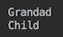

# 八、面向对象设计（OOD）原则

在本章中，我们将回到编程的高级视图，特别是 Java 编程。我们将展示设计在软件系统过程中的作用，从最早的可行性阶段开始，经过高层设计、详细设计，最后是编码和测试。我们将讨论良好设计的标准，并为经过充分验证的 OOD 原则提供指南。讨论将通过演示主要 OOD 原则应用的代码示例进行说明。

在本章中，我们将介绍以下主题：

*   设计的目的是什么？
*   对接口进行封装和编程
*   利用多态性
*   尽可能地解耦
*   更喜欢聚合而不是继承
*   这么多的原则和这么少的时间
*   单一责任原则
*   开闭原理
*   Liskov 替换原则
*   界面分离原理
*   依赖倒置原理
*   练习-设计模式

# 设计的目的是什么？

任何项目都需要规划和对将要建设的项目的愿景。当同一团队的几个成员必须协调他们的活动时，这一点尤为重要。但是，即使你独自工作，你也必须制定某种计划，无论是设计文档还是你正在编写的代码，都不能以任何其他形式捕捉你的想法。这就是设计的目的，以清晰地预见未来系统，从而能够开始构建它。

在这个过程中，设计不断发展、变化并变得更加详细。项目生命周期的每一步都需要一些不同的东西。这就是我们现在要讨论的，随着项目从最初的想法到完整的实施，设计的目的是如何演变的。

这里描述的项目步骤看起来是连续的，但实际上，它们的执行有很大的重叠。更重要的是，软件开发的敏捷方法鼓励在所有项目步骤中移动每个特性，而不必等到发现未来产品的所有特性。

在敏捷方法论中，可交付成果不是需求、设计或任何其他文档，而是部署到生产和产生价值的功能代码（也称为**最小可行产品**（**MVP**）。它必须在一到两周的时间内完成每一次迭代。然后，基于真实客户体验的反馈回路允许不断调整原始愿景，并在最短的时间内以最小的资源浪费将所有精力都投入到最有价值的解决方案中。

许多，如果不是大多数的话，现代成功的产品都是通过这种方式进入市场的。他们的作者经常承认，只有少数原创想法得到了实施，如果有的话。生活是一个伟大的小丑，不是吗？它有利于那些更快适应变化的人。

现在，让我们浏览一下项目生命周期，看看系统设计是如何随着它发展的。

# 项目的可行性

必须尽早做出某个项目值得融资的决定。否则，它可能根本不会启动。这意味着必须向决策者提供足够的信息，以提供一定程度的信心，证明风险是合理的，值得承担。这些信息包括高级需求、高级设计，甚至原型设计或其他证明可用技术可用于成功实施的证据。根据这些数据和市场研究，项目倡导者估计了所有目标之母的工作水平、费用、潜在收入和未来利润。

甚至在项目获得批准之前，就已经确定了产品功能成功的最关键因素，并以一种可以传达给未来客户、与他们讨论甚至测试的形式呈现出来。如果团队成员中包括过去做过类似事情的人，这肯定有助于简化决策过程。

本阶段的目的是以所有参与者和潜在客户都能理解的形式展示未来系统。

# 需求收集和原型设计

一旦项目得到批准和预算，需求收集将随着原型实现全速进行。事实上，原型经常被用作收集需求的工具。它有助于讨论具体的关键细节，避免误解。

在这个项目阶段，随着对输入信息来源、使用信息所需的过程（并产生必要的结果）、可用于实现这一目标的技术以及客户如何与系统交互的更多细节的发现，高层设计也在进行。

有了更多关于未来系统的数据，它可能如何工作和实施，就有可能发现阻碍进展或使整个项目无法进行的障碍。因此，决策者继续密切关注结果并对其进行批判性评估。

本阶段设计的目的是将所有传入数据汇集到一个未来运行系统的有凝聚力的动态画面中。在 OOP 的四大支柱中，封装和接口处于高级设计的最前沿。应在关键领域抽查实施细节，并证明所选技术可行。但它们隐藏在接口后面，后者关注于系统与客户的交互，以及发现实现的新功能性和非功能性需求。

# 高级设计

高级设计最明显的特点是，它关注子系统层次上的系统结构以及子系统之间的接口。如果产品必须与外部系统交互，那么这种交互的接口和协议也是高级设计的一部分。体系结构也被确定并验证为能够支持设计。

对于典型的中型软件系统，高级设计可以用包列表及其公共接口表示。如果系统有图形用户界面，其原型和线框通常就足够了。

# 详细设计

一旦首先确定要实现的用例，详细设计就开始发挥作用。业务代表为新产品功能设置优先级。程序员识别并调整接口以支持第一个特性，并开始创建类来实现第一个用例，这些用例将在第一次迭代中交付。

首先，实现可能在某些地方有硬代码（虚拟）数据。因此，用例的应用范围可能有限。尽管如此，这样的实现还是很有价值的，因为它允许执行所有需要的过程，因此生产中的客户可以测试该特性并获得预期的结果。程序员还为每个实现的方法创建单元测试，即使是虚拟方法。同时，在跨类和子系统执行场景的集成测试中捕获用例。

在第一次迭代结束时，高优先级用例被实现，并使用自动化测试进行全面测试。第一次迭代通常非常繁忙。但是程序员这次不会重复他们的错误，他们通常会带着极大的热情和比平时更高的生产率工作。

详细设计的目的是提供编码模板。一旦建立了模板，所有未来的类都将主要从现有类中剪切和粘贴。这就是为什么第一个类通常由高级程序员或在他们的密切监督下实现。在这样做的同时，他们试图尽可能地保持封装的封闭性，以获得最少和直观的接口，并尽可能地利用继承和多态性。

命名约定也是第一次迭代的重要部分。它必须反映领域术语，并被所有团队成员充分理解。因此，本阶段设计的目的是为项目创建编码和词汇表模式。

# 编码

正如您所看到的，编码从高级设计开始，甚至可能更早。随着详细设计产生第一个结果，编码得到了更多的动力。可以向团队中添加新成员，其中一些可以是初级成员。向团队中添加人员是最受欢迎的管理活动，但必须以可控的方式进行，以便每个新成员都能得到指导并充分学习项目词汇，从而理解围绕新产品功能的所有业务讨论。

此阶段的设计活动主要关注实现及其测试的细节。必须根据需要应用和调整详细设计期间创建的模式。编码过程中的设计目的是验证迄今为止做出的所有设计决策，并生成以代码行表示的特定解决方案。重构是这个阶段和几个第一次迭代中的主要活动之一。

# 测试

当编码完成时，测试也被编写并运行了很多次。它们通常在每次将新的更改块提交到源代码存储库时执行。一些公司正在实践一种持续集成模型，当更改一旦提交到源存储库，就会触发自动回归和集成测试，并随后部署到生产环境中。

然而，许多开发团队仍然有专门的测试专家，他们在将代码部署到测试环境中之后，正在使用一些专门的工具手动测试代码。

这一阶段的设计工作主要集中在测试覆盖率、测试自动化以及与其他系统的集成（自动化与否）。生产环境中的部署和有限测试（称为**烟雾测试**）也是本阶段设计工作的一部分。

测试期间的设计目的是确保所有交付的用例都包含测试，包括否定测试和非功能测试。监控和报告系统性能也是该阶段的重要活动。

# 良好设计的路线图

正如我们在上一节中讨论的设计演变，我们已经暗示了确保设计质量的标准：

*   它必须足够灵活，以适应即将到来的变化（它们就像税收一样不可避免，所以你最好做好准备）
*   它必须清楚地传达每个部分的项目结构和专业化
*   它必须使用定义良好的领域术语
*   它必须允许将测试部件隔离并集成在一起
*   它必须以允许我们与未来客户讨论的形式呈现，理想情况下，由他们进行测试
*   它必须充分利用封装、接口、继承和多态性这四个 OOP 概念

这些是任何项目和任何 OOP 语言的通用标准。但在本书中，我们将介绍 Java 最佳实践，因此我们需要主要讨论 Java 的详细设计、编码和测试——所有这些都与最后一个标准相关。这就是我们现在要做的。

# 对接口进行封装和编码

我们在不同的上下文中多次提到封装和接口。这既不是偶然的，也不是有意的。这是不可避免的。封装和接口的诞生是为了尽可能地隐藏实现。它解决了困扰早期编程的两个问题：

*   对数据的不受监管的共享访问
*   当部件之间的关系结构不好时，更改代码的困难

OOP 是一个成功的解决方案。它确保了对数据的受控访问（对象状态）和实现的灵活性（自由更改），只要接口没有更改。此外，它还有助于组织软件的设计和开发。定义接口后，每个人都可以独立地处理实现。如果接口不变，则无需花费时间进行会议和讨论。

正如我们在[第 6 章](06.html)*接口、类和对象构造*中所展示的，将对象的状态私有化也解决了涉及继承时实例字段和实例方法之间的可访问性差异。子项不能覆盖父项的非私有字段，而只能隐藏它们。只能重写方法。为了演示差异，让我们创建以下三个类：

```java
public class Grandad {
  public String name = "Grandad";
  public String getName() { return this.name; }
}

public class Parent extends Grandad {
  public String name = "Parent";
  public String getName() { return this.name; }
}

public class Child extends Parent {
  public String name = "Child";
  public String getName() { return this.name; }
}
```

每个字段都有一个具有相同名称的公共字段和具有相同签名的方法。现在，不要往下看页面，尝试猜测以下代码的输出：

```java
Grandad grandad = new Child();
System.out.println(grandad.name);
System.out.println(grandad.getName());

```

以下是输出的屏幕截图：



这种差异通常会造成混淆，并可能导致难以调试的错误。为了避免它们，我们建议永远不要允许直接访问对象状态（字段），只能通过方法（至少是 getter 和 setter）访问。这是始终封装状态的另一个原因。

现在，我们将创建一个小型软件建模系统，该系统将演示我们正在讨论的设计步骤的应用。让我们假设我们的任务是创建一个交通模型，该模型允许根据某个城市的汽车和卡车的典型混合计算每辆车的速度，该城市将首先测试该模型。模型返回的值应为车辆在特定秒数后达到的速度（英里/小时）。结果将用于在交通灯变绿几秒钟后评估多车道道路上的交通密度。这将是引入新交通法规期间决策的一部分，涉及最小乘客数量（汽车）和最大有效载荷重量（卡车）。

为了使代码更易于阅读，我们确实简化了可能的实际需求。在实际系统中，这种计算需要更多的输入数据和基于机器学习建模的更复杂的算法。但是，即使是我们开发的简单系统，也具有现实系统所具有的所有设计方面。

在讨论了需求之后，高层设计确定了 API。它必须接受三个参数：

*   车辆数量
*   所有车辆开始移动后的秒数
*   车辆载荷：汽车的乘客数量和卡车的有效载荷

最后一个参数应该是可选的。它可以是以下其中之一：

*   基于目标城市的当前交通统计数据建模
*   设置为特定值，以评估新交通法规的效果

以下是`com.packt.javapath.ch08demo.traffic`包中建模系统 API 的详细设计：

```java
public interface Vehicle {
  double getSpeedMph(double timeSec);
  static List<Vehicle> getTraffic(int vehiclesCount){
    return TrafficFactory.get(vehiclesCount);
  }
}
public interface Car extends Vehicle {
  void setPassengersCount(int passengersCount);
}
public interface Truck extends Vehicle {
  void setPayloadPounds(int payloadPounds);
}
```

如您所见，我们只向客户机公开接口并隐藏实现（下一节将对此进行详细介绍）。它允许我们自由地以我们认为最好的方式实现接口，只要它满足了合同。如果我们以后更改实现，客户机不需要更改其代码。这是一个封装接口并将接口与实现分离的示例。正如我们在前一章中所讨论的，它还促进了代码的可维护性、可测试性和可重用性。关于后者的更多信息，请参见*偏好聚合而非继承*一节，尽管我们应该指出继承也有助于代码重用，我们将在下一节中看到它的证明。

通过从`Vehicle`接口扩展`Car`和`Truck`接口，我们已经暗示我们将使用多态性，这就是我们将在下一节讨论的内容。

# 利用多态性

`Car`和`Truck`接口正在扩展`Vehicle`接口的子接口。这意味着实现`Car`接口的类（让我们给这样一个类命名为`CarImpl`），例如，在实例化时，会创建一个具有三种类型的对象—`Vehicle`、`Car`和`CarImpl`。这类护照类似于三个国家公民的护照。每个公民身份都有特定的权利和限制，一个人可以选择如何在国际旅行的不同情况下展现自己，就像`CarImpl`类的对象可以*向这些类型中的任何一种*进行*投射一样，前提是在进行投射的代码中可以访问该类型。下面是我们所说的类型可访问性：*

*   我们已经将`Car`、`Truck`和`Vehicle`接口声明为公共接口，这意味着任何包的任何代码都可以访问这些类型
*   我们不希望客户端代码能够访问这些接口的实现，因此我们创建了`com.packt.javapath.ch08demo.traffic.impl`包，并将所有实现放在那里，而不指定访问修饰符（因此使用默认访问，使它们仅对同一包的其他成员可见）

以下是流量接口的实现：

```java
class VehicleImpl implements Vehicle {
  public double getSpeedMph(double timeSec){
    return 42;
  }
}
class TruckImpl implements Truck {
  public void setPayloadPounds(int payloadPounds){
  }
}
class CarImpl implements Car {
  public void setPassengersCount(int passengersCount){
  }
}
```

我们已经在`com.packt.javapath.ch08demo.traffic.impl`包中创建了这些类，其中包含一些虚拟数据，只是为了使它们能够编译。但是`CarImpl`和`TruckImpl`类仍然会产生编译错误，因为`Vehicle`接口中列出的`getSpeedMph()`方法在这两个类中没有实现。`Car`和`Truck`接口扩展了`Vehicle`接口，从而继承了其抽象的`getSpeedMph()`方法。

因此，现在我们需要在这两个类中的每一个中实现`getSpeedMph()`方法，或者使它们都成为`VehicleImpl`类的子类，该方法已经实现了。我们已经决定，速度的计算方法可能与汽车和卡车的计算方法相同，因此扩展`VehicleImpl`等级是一条可行之路。如果以后我们发现`CarImpl`或`TruckImpl`类需要不同的实现，我们可以重写父类中的实现。以下是这两个类的新版本：

```java
abstract class VehicleImpl implements Vehicle {
  public double getSpeedMph(double timeSec){
    return 42;
  }
}
class TruckImpl extends VehicleImpl implements Truck {
  public void setPayloadPounds(int payloadPounds){
  }
}
class CarImpl extends VehicleImpl implements Car {
  public void setPassengersCount(int passengersCount){
  }
}
```

请注意，我们还将`VehicleImpl`类抽象化，这使得无法创建`VehicleImpl`类的对象。只能创建其子对象的。我们这样做是因为我们将它用作包含一些常见功能的基类，但我们永远不需要泛型的`Vehicle`对象，只需要一个特定的`Car`或`Truck`对象。

我们遵循了将所有内容尽可能封装的建议。以后可以将受限访问更改为更易于访问。而且，在已经编写了一些依赖于现有较少限制访问级别的客户端代码之后，这样做比限制访问更容易。

那么，回到`CarImpl`和`TruckImpl`流量接口实现。它们无法从包外部访问，但这不是问题，因为我们定义的 API 不需要它。如果`TrafficFactory`类可以访问它们，那就足够了。这就是为什么我们在`com.packt.javapath.ch08demo.traffic.impl`包中创建`TrafficFactor`类，它可以作为同一个包的成员访问这两个实现：

```java
package com.packt.javapath.ch08demo.traffic.impl;

import com.packt.javapath.ch08demo.traffic.Vehicle;
import java.util.ArrayList;
import java.util.List;

public class TrafficFactory {
  public static List<Vehicle> get(int vehiclesCount) {
    List<Vehicle> list = new ArrayList();
    return list;
  }
}
```

它做的不多，但对于设计阶段来说已经足够好了，可以确保在开始编码之前，所有类都已就位并具有适当的访问权限。我们将在[第 13 章](13.html)、*Java C**集合*中进一步讨论`List<Vehicle>`构造。现在，假设它表示实现`Vehicle`接口的对象列表就足够了。

现在，我们可以编写以下客户端代码：

```java
double timeSec = 5;
int vehiclesCount = 4;
List<Vehicle> traffic = Vehicle.getTraffic(vehiclesCount);
for(Vehicle vehicle: traffic){
  System.out.println("Loaded: " + vehicle.getSpeedMph(timeSec));
  if(vehicle instanceof Car){
    ((Car) vehicle).setPassengersCount(0); 
    System.out.println("Car(no load): " + vehicle.getSpeedMph(timeSec));
  } else {
    ((Truck) vehicle).setPayloadPounds(0);
    System.out.println("Truck(no load): " + vehicle.getSpeedMph(timeSec));
  }
}
```

上述代码从`TrafficFactory`检索任意数量的车辆（本例中为四辆）。工厂隐藏（封装）流量建模实现的细节。然后，代码在 for 循环中迭代列表（参见[第 10 章](10.html)、*控制流语句*），并打印出在车辆开始移动 5 秒后计算的每辆车的速度。

然后，代码表明客户可以根据需要更改车辆承载的负载。对于汽车，我们将乘客数量设置为零，对于卡车，我们将其有效载荷设置为零。

我们执行这段代码并没有得到任何结果，因为流量工厂返回一个空列表。但是代码可以编译和运行，我们可以开始实现接口。我们可以将任务分配给不同的团队成员，只要他们不改变接口，我们就不必担心协调他们之间的工作。

在确保接口、继承和多态性被充分利用（尽我们所能）之后，我们可以将注意力转向编码细节。

# 尽可能地解耦

我们选择了继承，以便在不同的实现之间共享代码。结果如下所示。以下是`VehicleImpl`课程：

```java
abstract class VehicleImpl implements Vehicle {
  private int weightPounds, horsePower;
  public VehicleImpl(int weightPounds, int horsePower) {
    this.weightPounds = weightPounds;
    this.horsePower = horsePower;
  }
  protected int getWeightPounds(){ return this.weightPounds; }
  protected double getSpeedMph(double timeSec, int weightPounds){
    double v = 2.0 * this.horsePower * 746 * timeSec * 
                                          32.174 / weightPounds;
    return Math.round(Math.sqrt(v) * 0.68);
  }
}
```

请注意，有些方法具有`protected`访问权限，这意味着只有相同包和类子级的成员才能访问它们。这样做也是为了更好地封装。我们的代码客户端不需要访问这些方法，只有孩子需要。以下是其中之一：

```java
class CarImpl extends VehicleImpl implements Car {
  private int passengersCount;
  public CarImpl(int passengersCount, int weightPounds, int horsePower){
    super(weightPounds , horsePower);
    this.passengersCount = passengersCount;
  }
  public void setPassengersCount(int passengersCount) {
    this.passengersCount = passengersCount;
  }
  protected int getWeightPounds(){ 
    return this.passengersCount * 200 + super.getWeightPounds(); 
  }
  public double getSpeedMph(double timeSec){
    return getSpeedMph(timeSec, this.getWeightPounds());
  }
}
```

前面代码中的`this`和`super`关键字允许我们区分必须调用哪个方法—当前子对象中的方法还是父对象中的方法。

前面实现的其他两个方面值得注意：

*   `getWeightPounds()`方法的访问修饰符设置为`protected`。这是因为具有相同签名和`protected`访问修饰符的方法也在父类中声明。但是重写方法的访问限制不能比重写方法更严格。或者，为了加强封装，我们可以将`CarImpl`中的方法名称更改为`getCarWeightPounds()`，例如，并将其设置为私有。这样，就不需要使用`this`和`super`关键字。但另一个包的类无论如何都无法访问`protected`方法，因此我们决定保留`getWeightPounds()`名称，并使用`this`和`super`关键字，承认这只是风格问题。
*   对构造函数的访问也可以设置为默认（包级别）。

`TruckImpl`类类似于以下代码段：

```java
class TruckImpl extends VehicleImpl implements Truck {
  private int payloadPounds;
  TruckImpl(int payloadPounds, int weightPounds, int horsePower) {
    super(weightPounds, horsePower);
    this.payloadPounds = payloadPounds;
  }
  public void setPayloadPounds(int payloadPounds) {
    this.payloadPounds = payloadPounds;
  }
  protected int getWeightPounds(){ 
    return this.payloadPounds + super.getWeightPounds(); 
  }
  public double getSpeedMph(double timeSec){
    return getSpeedMph(timeSec, this.getWeightPounds());
  }
}
```

`TrafficFactory`类可以访问这些类及其构造函数，根据需要创建对象：

```java
public class TrafficFactory {
  public static List<Vehicle> get(int vehiclesCount) {
    List<Vehicle> list = new ArrayList();
    for (int i = 0; i < vehiclesCount; i++){
      Vehicle vehicle;
      if (Math.random() <= 0.5) {
        vehicle = new CarImpl(2, 2000, 150);
      } else {
        vehicle = new TruckImpl(500, 3000, 300);
      }
      list.add(vehicle);
    }
    return list;
  }
}
```

`Math`类的`random()`静态方法生成一个介于 0 和 1 之间的随机十进制数。我们使用它来使生成的流量组合看起来有些真实。现在，我们已经硬编码了我们传递给每个车辆构造器的值。

现在，我们可以运行以下代码（我们在几页前已经讨论过）：

```java
public class TrafficApp {
  public static void main(String... args){
    double timeSec = 5;
    int vehiclesCount = 4;
    List<Vehicle> traffic = Vehicle.getTraffic(vehiclesCount);
    for(Vehicle vehicle: traffic){
      System.out.println("Loaded: " + vehicle.getSpeedMph(timeSec));
      if(vehicle instanceof Car){
        ((Car) vehicle).setPassengersCount(0);
        System.out.println("Car(no load): " + 
                           vehicle.getSpeedMph(timeSec));
      } else {
        ((Truck) vehicle).setPayloadPounds(0);
        System.out.println("Truck(no load): " + 
                           vehicle.getSpeedMph(timeSec));
      }
    }
  }
}
```

结果是：


计算的速度相同，因为输入数据在`TrafficFactory`中硬编码。但在我们继续并使输入数据不同之前，让我们创建一个速度计算测试：

```java
package com.packt.javapath.ch08demo.traffic.impl;

class SpeedCalculationTest {
  @Test
  void speedCalculation() {
    double timeSec = 5;
    Vehicle vehicle = new CarImpl(2, 2000, 150);
    assertEquals(83.0, vehicle.getSpeedMph(timeSec));
    ((Car) vehicle).setPassengersCount(0);
    assertEquals(91.0, vehicle.getSpeedMph(timeSec));

    vehicle = new TruckImpl(500, 3000, 300);
    assertEquals(98.0, vehicle.getSpeedMph(timeSec));
    ((Truck) vehicle).setPayloadPounds(0);
    assertEquals(105.0, vehicle.getSpeedMph(timeSec));
   }
}
```

我们可以访问`CarImpl`和`TruckImpl`类，因为测试属于同一个包，尽管它位于我们项目的不同目录下（在`test`目录下，而不是`main`目录下）。在类路径上，它们根据它们的包放置，即使源来自另一个源树。

我们已经测试了我们的代码，现在我们可以专注于处理真实数据，并在`TrafficFactory`中为客户创建相应的对象。实现与接口分离，在准备就绪之前，我们可以对其进行硬编码，这样客户机就可以开始编写和测试代码，而无需等待系统完全运行。这是封装和接口的另一个优点。

# 更喜欢聚合而不是继承

那些在现实项目中工作的人知道，需求随时都可能发生变化。在我们的项目中，甚至在第二次迭代完成之前，就必须在`Car`和`Truck`接口中添加新的方法，而速度计算在它自己的项目中不断增长。负责接口实现和速度计算的程序员开始更改`CarImpl`、`TruckImpl`和`VehicleImpl`文件。

不仅如此，另一个项目决定使用我们的速度计算功能，但他们希望将其应用于其他对象，而不是汽车和卡车。这时我们意识到，我们需要改变我们的实现，以利于聚合功能，而不是继承功能，这通常是推荐的设计策略之一，因为它增加了解耦并促进了更灵活的设计。这就是它的意思。

我们复制了`VehicleImpl`类的`getSpeedMph()`方法，并将其放在`SpeedModelImpl`类的新`com.packt.javapath.ch08demo.speedmodel.impl`包中：

```java
class SpeedModelImpl implements SpeedModel {
  public double getSpeedMph(double timeSec, int weightPounds,
                            int horsePower){
    double v = 2.0 * horsePower * 746 * timeSec * 32.174 / weightPounds;
    return Math.round(Math.sqrt(v) * 0.68);
  }
}
```

我们将`SpeedModelFactory`添加到同一包装中：

```java
public class SpeedModelFactory {
  public static SpeedModel speedModel(){
    return new SpeedModelImpl();
  }
}
```

我们在`com.packt.javapath.ch08demo.speedmodel`包中创建`SpeedModel`接口：

```java
public interface SpeedModel {
  double getSpeedMph(double timeSec, int weightPounds, int horsePower);
  static SpeedModel getInstance(Month month, int dayOfMonth, int hour){
    return SpeedModelFactory.speedModel(month, dayOfMonth, hour);
  }
}
```

现在，我们通过为`SpeedModel`对象添加一个 setter 并在速度计算中使用该对象来更改`VehicleImpl`类：

```java
abstract class VehicleImpl implements Vehicle {
  private int weightPounds, horsePower;
  private SpeedModel speedModel;
  public VehicleImpl(int weightPounds, int horsePower) {
    this.weightPounds = weightPounds;
    this.horsePower = horsePower;
  }
  protected int getWeightPounds(){ return this.weightPounds; }
  protected double getSpeedMph(double timeSec, int weightPounds){
    if(this.speedModel == null){
      throw new RuntimeException("Speed model is required");
    } else {
      return speedModel.getSpeedMph(timeSec, weightPounds, horsePower);
    }
  }
  public void setSpeedModel(SpeedModel speedModel) {
    this.speedModel = speedModel;
  }
}
```

如您所见，`getSpeedMph()`方法现在抛出一个异常（并停止工作），如果它在`SpeedModel`对象设置之前被调用。

我们还修改了`TrafficFactory`，让它在流量对象上设置`SpeedModel`：

```java
public class TrafficFactory {
  public static List<Vehicle> get(int vehiclesCount) {
    SpeedModel speedModel = SpeedModelFactory.speedModel();
    List<Vehicle> list = new ArrayList();
    for (int i = 0; i < vehiclesCount; i++) {
      Vehicle vehicle;
      if (Math.random() <= 0.5) {
        vehicle = new CarImpl(2, 2000, 150);
      } else {
        vehicle = new TruckImpl(500, 3000, 300);
      }
      ((VehicleImpl)vehicle).setSpeedModel(speedModel);
      list.add(vehicle);
    }
    return list;
  }
}
```

现在，速度模型继续独立于流量模型进行开发，我们在不更改客户端代码的情况下完成了所有这一切（这样一种不影响接口的内部代码更改称为**重构**。这就是基于封装和接口的解耦的好处。`Vehicle`对象的行为现在已聚合，这允许我们在不修改其代码的情况下更改其行为。

虽然本节的标题是*更喜欢聚合而不是继承*，但这并不意味着应该总是避免继承。继承有它自己的用途，特别有利于多态行为。但当我们谈到设计灵活性和代码重用性时，它有两个弱点：

*   Java 类不允许我们扩展多个父类，因此，如果该类已经是子类，它就不能扩展另一个类以重用其方法
*   继承需要类之间的父子关系，而相同的功能通常由不相关的类共享

有时，继承是解决手头问题的唯一方法，有时使用它会导致以后的问题。现实是，我们永远无法可靠地预测未来会发生什么，因此，如果使用继承或不使用继承的决定后来被证明是错误的，请不要感到难过。

# 这么多的原则和这么少的时间

如果你在互联网上搜索 OOD 原则，你可以很容易地找到许多列表，其中包括几十条推荐的设计原则。所有这些都是有道理的。

例如，以下是五个最流行的 OOD 原则，它们通常以缩写 SOLID（由原则标题的首字母组成）捆绑在一起：

*   **单一责任原则**：一个类应该只有一个责任
*   **开闭原则**：类应该封装其功能（可以关闭），但可以扩展
*   **Liskov 替换原则**：一个对象应该被它的子对象替换（替换），并且仍然不会破坏程序
*   **接口隔离原则**：多个面向客户端的接口比一个通用接口好
*   **依赖倒置原则**：代码应该依赖接口，而不是实现

而且，正如我们之前所说，关于如何实现更好的设计，还有许多其他好的想法。你应该研究所有这些吗？答案在很大程度上取决于你喜欢学习新技能的方式。有些人是通过实验来实现的，有些人是通过学习他人的经验来实现的，大多数人是通过这些方法的结合来实现的。

好消息是，我们在本章中讨论的设计标准、OOP 概念和良好设计的路线图能够在大多数情况下为您提供可靠的 OOP 解决方案。

但是，如果您决定阅读更多关于 OOD 的内容，并了解其他人是如何解决软件设计问题的，请毫不犹豫地查看它们。毕竟，人类就是这样走出洞穴登上宇宙飞船的——将他们的经历传递给下一代。

# 练习-设计模式

有许多 OOD 模式都有针对特定编码问题的共享软件设计解决方案。OOD 模式也经常被程序员用作讨论不同实现的方式。

它们传统上分为四类：创造性、行为性、结构性和并发性模式。了解他们并：

*   在每个类别中命名一个模式
*   说出我们已经使用过的三种模式

# 答复

四个类别中的四种模式可以是：

*   **创作模式**：工厂法
*   **结构形态**：复合
*   **行为模式**：访客
*   **并发模式**：消息传递模式

在本书中，我们已经使用了以下模式：

*   **惰性初始化**：在[第 6 章](06.html)*接口、类和对象构造*中，我们初始化`SingletonClassExample OBJECT`静态字段，不是自动初始化，而是仅在调用`getInstance()`方法时初始化
*   **单例**：在[第 6 章](06.html)中*接口、类、对象构造*中，参见`SingletonClassExample`类
*   **Facade**：在[第 6 章](06.html)中*接口、类和对象构造*中，我们创建了一个`Calculator`接口，该接口捕获了与实现功能的所有可能交互

# 总结

在本章中，我们回顾了编程的高级视图，特别是 Java 编程。我们讨论了软件系统开发过程中的设计演变，从最早的可行性阶段开始，经过高层设计、详细设计，最后进行编码和测试。我们讨论了良好设计的标准、OOP 概念、主要的 OOD 原则，并提供了良好 OOP 设计的路线图。代码示例演示了所讨论的所有 OOD 原则的应用。

在下一章中，我们将深入探讨 Java 编程的三个核心元素：运算符、表达式和语句。我们将定义和讨论所有 Java 操作符，更详细地探讨最流行的操作符，并在具体示例中演示它们，以及表达式和语句。