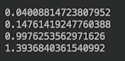
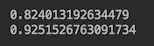
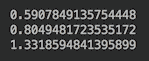
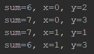
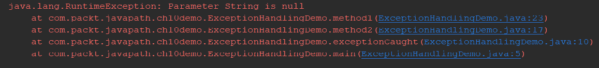

# 控制流语句

本章描述一种特殊的 Java 语句，称为控制语句，它允许根据所实现算法的逻辑构建程序流，包括选择语句、迭代语句、分支语句和异常处理语句。

在本章中，我们将介绍以下主题：

*   什么是控制流？
*   选择声明：`if`、`if....else`、`switch...case`
*   迭代语句：`for`、`while`、`do...while`
*   分支语句：`break`、`continue`、`return`
*   异常处理语句：`try...catch...finally`、`throw`、`assert`
*   练习-无限循环

# 什么是控制流？

Java 程序是一系列可以执行并生成一些数据或/或启动一些操作的语句。为了使程序更通用，根据表达式求值的结果有条件地执行一些语句。这种语句称为控制流语句，因为在计算机科学中，控制流（或控制流）是单个语句执行或计算的顺序。

按照惯例，它们分为四组：选择语句、迭代语句、分支语句和异常处理语句。

在下面的部分中，我们将使用术语 block，它表示用大括号括起来的一系列语句。以下是一个例子：

```java
{ 
  x = 42; 
  y = method(7, x); 
  System.out.println("Example"); 
}

```

块还可以包括控制语句–玩偶中的玩偶、玩偶中的玩偶，等等。

# 选择声明

选择语句组的控制流语句基于表达式求值。例如，这里有一种可能的格式：`if(expression) do something`。或者，另一种可能的格式：`if(expression) {do something} else {do something else}`。

表达式可能返回一个`boolean`值（如前面的示例中所示）或一个可以与常数进行比较的特定值。在后一种情况下，selection 语句的格式为`switch`语句，它执行与特定常量值关联的语句或块。

# 迭代语句

迭代语句执行某个语句或块，直到达到某个条件。例如，它可以是一个`for`语句，它为值集合的每个值执行一个语句或一个块，或者直到某个计数器达到预定义的阈值，或者达到某个其他条件。每个执行周期称为迭代。

# 分支语句

分支语句允许中断当前执行流，并从当前块后的第一行或控制流中的某个（标记）点继续执行。

方法中的`return`语句也是分支语句的一个示例。

# 异常处理语句

异常是表示在程序执行期间发生并中断正常执行流的事件的类。我们已经看到了在相应条件下生成的`NullPointerException`、`ClassCastException`和`ArrayIndexOutOfBoundsException`的示例。

Java 中的所有异常类都有一个共同的父类`java.lang.Exception`类，它反过来扩展了`java.lang.Throwable`类。这就是为什么所有异常对象都有共同的行为。它们包含有关异常情况的原因及其起源位置（类源代码的行号）的信息。

每个异常都可以自动（由 JVM）抛出，也可以由应用程序代码使用`throw`关键字抛出。方法调用方可以使用 exception 语句捕获异常，并根据异常类型及其（可选）携带的消息执行某些操作，也可以让异常在方法调用堆栈中进一步传播。

如果堆栈中没有任何应用程序方法捕捉到异常，则 JVM 最终将捕捉到异常，JVM 将以错误中止应用程序执行。

因此，异常处理语句的目的是生成（`throw`和`catch`异常。

# 选择声明

选择语句有四种变体：

*   `if`声明
*   `if...else`声明
*   `if...else if-...-else`声明
*   `switch...case`声明

# 如果

简单的`if`语句只允许在表达式求值结果为`true`时有条件地执行某个语句或块：

```java
if(booelan expression){
  //do something
} 
```

以下是几个例子：

```java
if(true) System.out.println("true");    //1: true
if(false) System.out.println("false");  //2:

int x = 1, y = 5;
if(x > y) System.out.println("x > y");  //3:
if(x < y) System.out.println("x < y");  //4: x < y

if((x + 5) > y) {                       //5: x + 5 > y
  System.out.println("x + 5 > y");    
  x = y;
}

if(x == y){                             //6: x == y
  System.out.println("x == y");       
}

```

报表 1 打印`true`。报表 2 和 3 不打印任何内容。报表 4 打印`x < y`。报表 5 打印`x + 5 > y`。我们使用大括号创建一个块，因为我们希望只有当这个`if`语句的表达式计算为`true`时，才执行`x = y`语句。报表 6 打印`x == y`。我们可以避免在这里使用大括号，因为只有一条语句要执行。我们这样做有两个原因：

*   演示大括号也可以与单个语句一起使用，从而形成一个语句块。
*   一般来说，在`if`之后使用大括号是一种良好的做法；它的可读性更好，有助于避免这个令人沮丧的错误：在 if 之后添加另一个语句，假设它只在表达式返回`true`时执行：

```java
       if(x > y) System.out.println("x > y"); 
       x = y;
```

但是，此代码中的语句`x = y`是无条件执行的。如果你认为这样的错误不会经常发生，你会感到惊讶。

将大括号`{}`与`if`语句一起使用是一种很好的做法。

正如我们已经提到的，可以在 selection 语句中包含 selection 语句，以便为控制流创建更精细的逻辑：

```java
if(x > y){
  System.out.println("x > y");
  if(x == 3){
    System.out.println("x == 3");
  }
  if(y == 3){
    System.out.println("y == 3");
    System.out.println("x == " + x);
  }
}
```

它可以按照逻辑要求进行深度（嵌套）。

# 如果……否则

`if...else`构造允许在表达式的计算结果为`true`时执行某个语句或块；否则，将执行另一条语句或块：

```java
if(Boolean expression){
  //do something
} else {
  //do something else
}
```

以下是两个例子：

```java
int x = 1, y = 1; 
if(x == y){                        
  System.out.println("x == y");  //prints: x == y
  x = y - 1;
} else {
  System.out.println("x != y");  
}

if(x == y){                        
  System.out.println("x == y");
} else {
  System.out.println("x != y");  //prints: x != y
}
```

当大括号`{}`被一致使用时，您可以看到阅读此代码是多么容易。并且，与前面简单的`if`语句一样，每个块可以有另一个嵌套块和另一个`if`语句，依此类推——根据需要，尽可能多的块和深度嵌套。

# 如果…，否则如果-，否则

可以使用此表单避免创建嵌套块，并使代码更易于阅读和理解。例如，请查看以下代码段：

```java
  if(n > 5){
    System.out.println("n > 5");
  } else {
    if (n == 5) {
      System.out.println("n == 5");
    } else {
      if (n == 4) {
        System.out.println("n == 4");
      } else {
        System.out.println("n < 4");
      }
    }
  }
}
```

这些嵌套的`if...else`语句可以替换为`if...else...if`语句，如下所示：

```java
if(n > 5){
  System.out.println("n > 5");
} else if (n == 5) {
  System.out.println("n == 5");
} else if (n == 4) {
  System.out.println("n == 4");
} else {
  System.out.println("n < 4");
}
```

这样的代码更容易阅读和理解。

如果您在`n < 4`时不需要做任何事情，您可以省略最后一次捕获所有剩余选项`else`条款：

```java
if(n > 5){
  System.out.println("n > 5");
} else if (n == 5) {
  System.out.println("n == 5");
} else if (n == 4) {
  System.out.println("n == 4");
} 
```

如果需要为每个特定值执行某些操作，可以编写，例如：

```java
if(x == 5){
  //do something
} else if (x == 7) {
  //do something else
} else if (x == 12) {
  //do something different
} else if (x = 50) {
  //do something yet more different
} else {
  //do something completely different
}
```

但对于这种情况，有一个专门的选择声明，称为`switch...case`，更容易阅读和理解。

# 开关箱

最后一节前面的代码示例可以表示为`switch`语句，如下所示：

```java
switch(x){
  case 5:
    //do something
    break;
  case 7:
    //do something else
    break;
  case 12:
    //do something different
    break;
  case 50:
    //do something yet more different
    break;
  default:
    //do something completely different
}
```

返回`x`变量值的表达式类型可以是`char`、`byte`、`short`、`int`、`Character`、`Byte`、`Short`、`Integer`、`String`或`enum`类型。注意`break`关键字。它强制退出`switch...case`语句。如果没有它，将执行以下语句`do something`。稍后我们将在*分支语句*部分讨论`break`语句。

`switch`语句中可以使用的类型有`char`、`byte`、`short`、`int`、`Character`、`Byte`、`Short`、`Integer`、`String`和`enum`类型。case 子句中设置的值必须是常量。

让我们来看一个利用`switch`语句的方法：

```java
void switchDemo(int n){
  switch(n + 1){
    case 1:
      System.out.println("case 1: " + n);
      break;
    case 2:
      System.out.println("case 2: " + n);
      break;
    default:
      System.out.println("default: " + n);
      break;
  }
}
```

下面的代码演示了`switch`语句的工作原理：

```java
switchDemo(0);     //prints: case1: 0
switchDemo(1);     //prints: case2: 1
switchDemo(2);     //prints: default: 2

```

并且，与`if`语句中的`else`子句类似，如果程序逻辑不需要，则`switch`语句中不需要默认子句：

```java
switch(n + 1){
  case 1:
    System.out.println("case 1: " + n);
    break;
  case 2:
    System.out.println("case 2: " + n);
}
```

# 迭代语句

迭代语句与选择语句一样是 Java 编程的基础。你也很有可能经常看到和使用它们。每个迭代语句可以是三种形式之一：`while`、`do...while`或`for`。

# 虽然

`while`语句重复执行布尔表达式和语句或块，直到表达式的值计算为`false`：

```java
while (Boolean expression){
  //do something
}
```

有两件事需要注意：

*   只有一条语句需要重复执行时，大括号`{}`是不必要的，但为了保持一致性和更好地理解代码，建议使用大括号
*   该语句可能根本无法执行（当第一个表达式求值返回`false`时）

让我们看一些例子。以下循环执行打印语句五次：

```java
int i = 0;
while(i++ < 5){
  System.out.print(i + " ");   //prints: 1 2 3 4 5
}
```

请注意用于打印的另一种方法：`print()`而不是`println()`。后者在打印行后添加了一个转义序列`\n`（我们在[第 5 章](05.html)、*Java 语言元素和类型*中解释了转义序列是什么），将光标移动到下一行。

下面是一个调用方法的示例，该方法返回一些值，这些值在达到所需阈值之前累积：

```java
double result = 0d;
while (result < 1d){
  result += tryAndGetValue();
  System.out.println(result);
}
```

`tryAndGetValue()`方法非常简单且不现实，仅为演示目的编写：

```java
double tryAndGetValue(){
  return Math.random();
}
```

如果我们运行最后一个`while`语句，我们将看到类似以下内容：



由于`Math.random()`方法生成大于或等于 0.0 且小于 1.0 的伪随机`double`值，因此每次运行的精确值会有所不同。一旦累积值等于或超过 1.0，循环即退出。

让这个循环更简单很有诱惑力：

```java
double result = 0d;
while ((result += tryAndGetValue()) < 1d){
  System.out.println(result);
}
```

或者更简单一些：

```java
double result = 0d;
while ((result += Math.random()) < 1d){
  System.out.println(result);
}
```

但如果我们运行最后两个`while`语句变体中的任何一个，我们将得到如下结果：



打印的值永远不会等于或超过 1.0，因为在进入执行块之前会对具有新累积值的表达式求值。当计算包含在表达式中而不是执行块中时，需要注意这一点。

# 待会儿

与`while`语句类似，`do...while`语句重复执行布尔表达式，并执行语句或块，直到布尔表达式的值计算为`false`：

```java
do {
  //statement or block
} while (Boolean expression)
```

但它在计算表达式之前先执行语句或块，这意味着语句或块至少执行一次。

让我们看一些例子。以下代码执行打印语句六次（比类似的`while`语句多执行一次）：

```java
int i = 0;
do {
  System.out.print(i + " ");   //prints: 0 1 2 3 4 5
} while(i++ < 5);
```

以下代码的行为方式与`while`语句相同：

```java
double result = 0d;
do {
  result += tryAndGetValue();
  System.out.println(result);
} while (result < 1d);
```

如果运行此代码，我们将看到类似于以下内容：



这是因为值是在累积后打印的，然后在再次进入执行块之前对表达式求值。

简化的`do...while`语句的行为不同。以下是一个例子：

```java
double result = 0d;
do {
  System.out.println(result);
} while ((result += tryAndGetValue()) < 1d);

```

下面是相同的代码，但没有使用`tryAndGetValue()`方法：

```java
double result = 0d;
do {
  System.out.println(result);
} while ((result += Math.random()) < 1d);

```

如果我们运行前面两个示例中的任何一个，我们将得到如下屏幕截图中的内容：


始终首先打印`result`变量的初始值，因为在第一次计算表达式之前，语句至少执行一次。

# 对于

`for`基本语句的格式如下：

```java
for(ListInit; Boolean Expression; ListUpdate) block or statement
```

但是，我们将从最流行、更简单的版本开始，然后在*中返回到完整版本，以便使用多个初始值设定项和表达式*部分。更简单的基本`for`语句格式如下所示：

```java
for(DeclInitExpr; Boolean Expression; IncrDecrExpr) block or statement
```

该定义由以下部分组成：

*   `DeclInitExpr`是一个声明和初始化表达式，与`x = 1`类似，在`for`语句执行的最开始只计算一次
*   布尔表达式是一个布尔表达式，类似于`x < 10`，在每次迭代开始时进行计算——每次都是在执行块或语句之前；如果结果为`false`，则`for`语句终止
*   `IncrDecrExpr`是一个递增或递减的一元表达式，如`++x`、`--x`、`x++`、`x-`，在每次迭代结束时—在执行块或语句后对其进行评估

请注意，我们讨论的是表达式，而不是语句，虽然添加了分号，但它们看起来像语句。原因是分号用作`for`语句中表达式之间的分隔符。让我们看一个例子：

```java
for (int i=0; i < 3; i++){
  System.out.print(i + " ");  //prints: 0 1 2
}
```

在此代码中：

*   `int i=0`是声明和初始化表达式，一开始只计算一次
*   `i < 3`是布尔表达式，在执行块或语句之前，在每次迭代开始时计算；如果结果为`false`（`i >= 3`，在这种情况下，`for`语句执行终止
*   `i++`是增量表达式，在执行块或语句后计算

而且，与`while`语句的情况一样，当只需要执行一条语句时，不需要大括号`{}`，但拥有大括号是一种很好的风格，因此代码是一致的，更易于阅读。

`for`语句中的任何表达式都不是必需的：

```java
int k = 0;
for (;;){
  System.out.print(k++ + " ");     //prints: 0 1 2
  if(k > 2) break;
}
```

但是在语句声明中使用表达式更方便、更常规，因此更容易理解。以下是其他例子：

```java
for (int i=0; i < 3;){
  System.out.print(i++ + " "); //prints: 0 1 2
}

for (int i=2; i > 0; i--){
  System.out.print(i + " "); //prints: 2 1
}
```

请注意，在上一个示例中，减量运算符用于向下遍历初始`i`值。

在使用`for`语句或任何迭代语句时，请确保达到退出条件（除非故意创建无限循环）。这是构建迭代语句的主要关注点。

# 为了增强

正如我们已经提到的，`for`语句是访问数组组件（元素）的非常方便的方式：

```java
int[] arr = {21, 34, 5};
for (int i=0; i < arr.length; i++){
  System.out.print(arr[i] + " ");  //prints: 21 34 5
}
```

请注意，我们如何使用数组对象的公共属性`length`来确保已到达所有数组元素。但在这种情况下，当必须遍历所有数组时，最好（更容易写入和读取）使用具有以下格式的增强型`for`语句：

```java
<Type> arr = ...;              //an array or any Iterable
for (<Type> a: arr){
  System.out.print(a + " ");  
}
```

从注释中可以看出，它适用于实现接口`Iterable`的数组或类。这个接口有一个返回类`Iterator`的对象的`iterator()`方法，而类`Iterator`又有一个名为`next()`的方法，允许按顺序访问类成员。我们将在[第 13 章](13.html)、*Java 集合*中讨论这些称为集合的类。因此，我们可以重写最后一个`for`语句示例，并使用增强的`for`语句：

```java
int[] arr = {21, 34, 5};
for (int a: arr){
  System.out.print(a + " ");  //prints: 21 34 5
}
```

对于实现接口`List`（并且`List`扩展了`Iterable`）的集合类，对其成员的顺序访问看起来非常相似：

```java
List<String> list = List.of("Bob", "Joe", "Jill");
for (String s: list){
  System.out.print(s + " ");  //prints: Bob Joe Jill
}
```

但是，当不必访问数组或集合的所有元素时，可能更适合使用其他形式的迭代语句。

另外，请注意，由于 Java8，许多数据结构可以生成流，从而允许编写更紧凑的代码，并避免使用 for 语句。我们将在[第 18 章](18.html)、*溪流和管道*中向您展示如何进行。

# 对于具有多个初始值设定项和表达式的

现在，让我们再次回到基本的`for`语句格式。它允许更多的多样性在使用它比许多程序员甚至知道。这并不是因为缺乏兴趣或专业好奇心，而是可能因为通常不需要这种附加功能。然而，偶尔，当你阅读某人的代码或在求职面试时，你可能会遇到了解全局的需要。所以，我们决定至少提一提。

`for`语句的完整格式是围绕表达式列表构建的：

```java
for(ListInit; Boolean Expression; ListUpdate) block or statement
```

该定义由以下部分组成：

*   `ListInit`：可以包括声明列表和/或表达式列表
*   `Expression`：布尔表达式
*   `ListUpdate`：表达式列表

表达式列表成员（用逗号分隔）可以是：

*   **作业**：`x = 3`
*   **前后加/减表达式**：`++x``--x``x++``x--`
*   **方法调用**：`method(42)`
*   **对象创建表达式**：`new SomeClass(2, "Bob")`

以下两个`for`语句产生相同的结果：

```java
for (int i=0, j=0; i < 3 && j < 3; ++i, ++j){
  System.out.println(i + " " + j);
}
for (int x=new A().getInitialValue(), i=x == -2 ? x + 2 : 0, j=0;
  i < 3 || j < 3 ; ++i, j = i) {
  System.out.println(i + " " + j);
}
```

其中`getInitialValue()`方法具有以下代码：

```java
class A{
  int getInitialValue(){ return -2; }
}
```

如您所见，当过度使用多个初始值设定项、赋值和表达式时，即使是这样一个简单的功能也可能看起来非常复杂，甚至令人困惑。如果有疑问，请保持代码简单易懂。有时这并不容易，但根据我们的经验，它总是可以做到的，并且易于理解是良好代码质量的最重要标准之一。

# 分支语句

您已经在我们的示例中看到了分支语句`break`和`return`。我们将在本节中定义并讨论它们和组中的第三个成员分支语句`continue`。

# 断开并标记为断开

正如您可能已经注意到的，`break`语句对于`switch...case`选择语句能够工作是必不可少的（有关更多信息，请参阅 s*witch…case*部分）。如果包含在迭代语句的执行块中，则会导致`for`或`while`语句立即终止。

在数组或集合中搜索特定元素时，它广泛用于迭代语句中。为了演示它是如何工作的，让我们假设，例如，我们需要在社区学院的学生和教师中按年龄和姓名找到某个人。我们先创建类`Person`、`Student`和`Teacher`：

```java
class Person{
  private int age;
  private  String name;
  public Person(int age, String name) {
    this.age = age;
    this.name = name;
  }
  @Override
  public Boolean equals(Object o) {
    if (this == o) return true;
    Person person = (Person) o;
    return age == person.age &&
              Objects.equals(name, person.name);
  }
  @Override
  public String toString() {
    return "Person{age=" + age +
              ", name='" + name + "'}";
  }
}
class Student extends Person {
  private int year;

  public Student(int age, String name, int year) {
    super(age, name);
    this.year = year;
  }

  @Override
  public String toString() {
    return "Student{year=" + year +
        ", " + super.toString() + "}";
  }
}
class Teacher extends Person {
  private String subject;
  public Teacher(int age, String name, String subject) {
    super(age, name);
    this.subject = subject;
  }
  @Override
  public String toString() {
    return "Student{subject=" + subject +
           ", " + super.toString() + "}";
  }
}
```

请注意，方法`equals()`仅在基类`Person`中实现。我们只根据姓名和年龄来识别一个人。另外，请注意关键字`super`的使用，它允许我们访问父类的构造函数和`toString()`方法。

假设我们被指派在社区学院数据库中查找一个人（按姓名和年龄）。因此，我们创建了一个类型为`List`的集合，我们将对其进行迭代，直到找到匹配项：

```java
List<Person> list = 
  List.of(new Teacher(32, "Joe", "History"),
          new Student(29,"Joe", 4),
          new Student(28,"Jill", 3),
          new Teacher(33, "ALice", "Maths"));
Person personOfInterest = new Person(29,"Joe");
Person person = null;
for (Person p: list){
  System.out.println(p);
  if(p.equals(personOfInterest)){
    person = p;
    break;
  }
}
if(person == null){
  System.out.println("Not found: " + personOfInterest);
} else {
  System.out.println("Found: " + person);
}
```

如果我们运行此程序，结果将是：


我们找到了我们要找的人。但如果我们改变搜索，寻找另一个人（年龄相差一年）：

```java
Person personOfInterest = new Person(30,"Joe");

```

结果将是：


如您所见，`break`语句允许在找到感兴趣的对象后立即退出循环，因此不会浪费时间迭代所有集合，因为集合可能非常大。

在[第 18 章](18.html)、*流和管道*中，我们将向您展示另一种（通常更有效）搜索集合或数组的方法。但是在许多情况下，迭代元素仍然是一种可行的方法。

`break`语句也可用于在多维数据结构中搜索特定元素。假设我们需要搜索一个三维数组，并找到元素和等于或大于 4 的最低维数组。以下是此类阵列的一个示例：

```java
int[][][] data = {
        {{1,0,2},{1,2,0},{2,1,0},{0,3,0}},
        {{1,1,1},{1,3,0},{2,0,1},{1,0,1}}};

```

我们正在寻找的最低维数组是`{1,3,0}`。如果第一维度为`x`，第二维度为`y`，则该数组的位置为`x=1`、`y=1`或`[1][1]`。让我们编写一个程序来查找此数组：

```java
int[][][] data = {
        {{1,0,2},{1,2,0},{2,1,0},{0,3,0}},
        {{1,1,1},{1,3,0},{2,0,1},{1,0,1}}};
int threshold = 4;
int x = 0, y = 0;
Boolean isFound = false;
for(int[][] dd: data){
  y = 0;
  for(int[] d: dd){
    int sum = 0;
    for(int i: d){
      sum += i;
      if(sum >= threshold){
        isFound = true;
        break;
      }
    }
    if(isFound){
      break;
    }
    y++;
  }
  if(isFound){
    break;
  }
  x++;
}
System.out.println("isFound=" + isFound + ", x=" + x + ", y=" + y); 
//prints: isFound=true, x=1, y=1
```

如您所见，我们使用一个名为`isFound`的布尔变量，一旦在最里面的循环中找到所需的结果，就可以方便地从外部循环退出。检查`isFound`变量值的枯燥需要使得 Java 作者引入了一个标签——一个标识符，后面跟一个冒号（`:`），可以放在语句前面。`break`语句可以利用它。以下是如何使用标签更改以前的代码：

```java
int[][][] data = {
        {{1,0,2},{1,2,0},{2,1,0},{0,3,0}},
        {{1,1,1},{1,3,0},{2,0,1},{1,0,1}}};
int threshold = 4;
int x = 0, y = 0;
Boolean isFound = false;
exit:
for(int[][] dd: data){
  y = 0;
  for(int[] d: dd){
    int sum = 0;
    for(int i: d){
      sum += i;
      if(sum >= threshold){
        isFound = true;
        break exit;
      }
    }
    y++;
  }
  x++;
}
System.out.println("isFound=" + isFound + ", x=" + x + ", y=" + y); 
//prints: isFound=true, x=1, y=1

```

我们仍然使用变量`isFound`，但仅用于报告目的。`exit:`标签允许`break`语句指定必须停止执行的语句。这样，我们就不需要编写样板代码来检查`isFound`变量的值。

# Continue 并标记为 Continue

`continue`语句支持与`break`语句类似的功能。但不是退出循环，而是强制只退出当前迭代，因此循环继续执行。为了演示它是如何工作的，让我们假设，与上一节中的`break`语句一样，我们需要搜索一个三维数组，并找到其元素之和等于或大于 4 的最低维度数组。但这一次，总和不应包含等于 1 的元素。以下是阵列：

```java
int[][][] data = {
        {{1,1,2},{0,3,0},{2,4,1},{2,3,2}},
        {{0,2,0},{1,3,4},{2,0,1},{2,2,2}}};
```

我们的程序应该找到以下数组：

*   `data[0][2] = {2,4,1}`、`sum = 6`（因为必须跳过 1）
*   `data[0][3] = {2,3,2}`、`sum = 7`
*   `data[1][1] = {1,3,4}`、`sum = 7`（因为必须跳过 1）
*   `data[1][3]={2,2,2}`、`sum = 6`

如果跳过 1，则其他数组元素的总和不会达到 4。

节目如下：

```java
int[][][] data = {
        {{1,1,2},{0,3,0},{2,4,1},{2,3,2}},
        {{0,2,0},{1,3,4},{2,0,1},{2,2,2}}};
int threshold = 4;
int x = 0, y;
for(int[][] dd: data){
  y = 0;
  for(int[] d: dd){
    int sum = 0;
    for(int i: d){
      if(i == 1){
        continue;
      }
      sum += i;
    }
    if(sum >= threshold){
      System.out.println("sum=" + sum + ", x=" + x + ", y=" + y);
    }
    y++;
  }
  x++;
}
```

如果我们运行它，结果将是：



正如您所看到的，结果与我们预期的完全一样：1 的所有元素都被跳过。

为了演示如何使用带标签的`continue`语句，让我们更改要求：不仅必须跳过元素 1，还必须忽略包含此类元素的所有数组。换句话说，我们需要找到不包含 1 且元素和等于或大于 4 的数组。

我们的程序只能找到两个阵列：

*   `data[0][3] = {2,3,2}`、`sum = 7`
*   `data[1][3] = {2,2,2}`、`sum = 6`

下面是执行此操作的代码：

```java
int[][][] data = {
        {{1,1,2},{0,3,0},{2,4,1},{2,3,2}},
        {{0,2,0},{1,3,4},{2,0,1},{2,2,2}}};
int threshold = 4;
int x = 0, y;
for(int[][] dd: data){
  y = 0;
  cont: for(int[] d: dd){
    int sum = 0;
    for(int i: d){
      if(i == 1){
        y++;
        continue cont;
      }
      sum += i;
    }
    if(sum >= threshold){
      System.out.println("sum=" + sum + ", x=" + x + ", y=" + y);
    }
    y++;
  }
  x++;
}
```

如您所见，我们添加了一个名为`cont:`的标签，并在`continue`语句中引用它，因此最内部循环的当前迭代和下一个外部循环的迭代停止执行。然后，外部循环继续执行下一个迭代。如果我们运行代码，结果将是：


跳过所有其他数组，因为它们包含 1 或它们的元素之和小于 4。

# 回来

`return`语句只能放在方法或构造函数中。它的功能是将控制返回给调用程序，无论是否有值。

对于构造函数，`return`语句不是必需的。如果放置在构造函数中，则必须是最后一条不返回值的语句：

```java
class ConstructorDemo{
  private int field;
  public ConstructorDemo(int i) {
    this.field = i;
    return;
  }
}
```

试图将`return`语句作为构造函数的最后一个语句放置或使其返回任何值将导致编译错误。

对于方法，如果该方法被声明为返回某种类型：

*   `return`声明是必需的
*   `return`语句必须有效地（参见下面的示例）作为方法的最后一个语句
*   可能有几个 return 语句，但其中一个必须是有效的（参见下面的示例）方法的最后一个语句，而其他语句必须位于 selection 语句中；否则，将生成编译错误
*   如果`return`语句没有返回任何内容，则会导致编译错误
*   如果`return`语句返回的类型不是方法定义中声明的类型，也不是其子类型，则会导致编译错误
*   装箱、取消装箱和类型加宽将自动执行，而类型缩小需要类型转换

下面的示例演示了`return`语句实际上是方法的最后一条语句：

```java
public String method(int n){
  if(n == 1){
    return "One";
  } else {
    return "Not one";
  }
}
```

方法的最后一条语句是 selection 语句，`return`语句是 selection 语句中执行的最后一条语句。

下面是一个包含许多返回语句的方法示例：

```java
public static String methodWithManyReturns(){
  if(true){
    return "The only one returned";
  }
  if(true){
    return "Is never reached";
  }
  return "Is never reached";
}
```

虽然在方法中，只有第一个`return`语句始终返回，但编译器不会抱怨，并且方法执行时不会出现运行时错误。它总是返回一个`The only one returned`文本。

以下带有多个返回语句的方法示例更为现实：

```java
public Boolean method01(int n){
  if(n < 0) {
    return true;
  } else {
    return false;
  }
}

public Boolean sameAsMethod01(int n){
  if(n < 0) {
    return true;
  }
  return false;
}

public Boolean sameAsAbove(int n){
  return n < 0 ? true : false;
}

public int method02(int n){
  if(n < 0) {
    return 1;
  } else if(n == 0) {
    return 2;
  } else if (n == 1){
    return 3;
  } else {
    return 4;
  }
}
public int methodSameAsMethod02(int n){
  if(n < 0) {
    return 1;
  }
  switch(n) {
    case 0:
      return 2;
    case 1:
      return 3;
    default:
      return 4;
  }
}
```

以下是装箱、取消装箱以及类型加宽和缩小的示例：

```java
public Integer methodBoxing(){
  return 42;
}

public int methodUnboxing(){
  return Integer.valueOf(42);
}

public int methodWidening(){
  byte b = 42;
  return b;
}

public byte methodNarrowing(){
  int n = 42;
  return (byte)n;
}
```

我们还可以重新访问在教师和学生列表中查找特定人员的计划：

```java
List<Person> list = 
  List.of(new Teacher(32, "Joe", "History"),
          new Student(29,"Joe", 4),
          new Student(28,"Jill", 3),
          new Teacher(33, "ALice", "Maths"));
Person personOfInterest = new Person(29,"Joe");
Person person = null;
for (Person p: list){
  System.out.println(p);
  if(p.equals(personOfInterest)){
    person = p;
    break;
  }
}
if(person == null){
  System.out.println("Not found: " + personOfInterest);
} else {
  System.out.println("Found: " + person);
}
```

使用 return 语句，我们现在可以创建方法`findPerson()`：

```java
Person findPerson(List<Person> list, Person personOfInterest){
  Person person = null;
  for (Person p: list){
    System.out.println(p);
    if(p.equals(personOfInterest)){
      person = p;
      break;
    }
  }
  return person;
}
```

此方法可按如下方式使用：

```java
List<Person> list = List.of(new Teacher(32, "Joe", "History"),
        new Student(29,"Joe", 4),
        new Student(28,"Jill", 3),
        new Teacher(33, "ALice", "Maths"));
Person personOfInterest = new Person(29,"Joe");
Person person = findPerson(list, personOfInterest);
if(person == null){
  System.out.println("Not found: " + personOfInterest);
} else {
  System.out.println("Found: " + person);
}
```

利用新的代码结构，我们可以进一步改变`findPerson()`方法，并展示`return`语句用法的更大变化：

```java
Person findPerson(List<Person> list, Person personOfInterest){
  for (Person p: list){
    System.out.println(p);
    if(p.equals(personOfInterest)){
      return p;
    }
  }
  return null;
}
```

如您所见，我们已将`break`语句替换为 return 语句。代码现在可读性更好了吗？一些程序员会说不，因为他们更希望有一个`return`语句作为返回结果的唯一来源。否则，他们认为，我们必须研究代码，看看是否还有第三个-`return`语句可能返回另一个值。如果代码不是那么简单，就永远无法确定所有可能的返回都已被识别。相反阵营的程序员会反驳说，方法应该很小，因此找到所有返回语句很容易。但是，将一个方法变小通常会迫使创建深度嵌套的方法，而这些方法并不那么容易理解。争论可能会持续很长时间。这就是为什么我们让你来决定你喜欢哪种风格。

如果方法的返回类型定义为`void`：

*   不需要`return`语句
*   如果存在`return`语句，则不会返回任何值

*   如果`return`语句返回某个值，则会导致编译错误
*   可能有几个返回语句，但其中一个必须是方法的最后一个语句，而其他语句必须位于选择语句中；否则，将生成编译错误

为了演示没有值的`return`语句，我们将再次使用`findPerson()`方法。如果我们需要做的只是打印结果，那么方法可以更改如下：

```java
void findPerson2(List<Person> list, Person personOfInterest){
  for (Person p: list){
    System.out.println(p);
    if(p.equals(personOfInterest)){
      System.out.println("Found: " + p);
      return;
    }
  }
  System.out.println("Not found: " + personOfInterest);
  return;  //this statement is optional
}
```

客户机代码看起来会简单得多：

```java
List<Person> list = List.of(new Teacher(32, "Joe", "History"),
        new Student(29,"Joe", 4),
        new Student(28,"Jill", 3),
        new Teacher(33, "ALice", "Maths"));
Person personOfInterest = new Person(29,"Joe");
findPerson(list, personOfInterest);
```

或者它可以更紧凑：

```java
List<Person> list = List.of(new Teacher(32, "Joe", "History"),
        new Student(29,"Joe", 4),
        new Student(28,"Jill", 3),
        new Teacher(33, "ALice", "Maths"));
findPerson(list, new Person(29, "Joe");

```

与前面的讨论一样，将参数传递到方法中有不同的样式。有些人喜欢这里的代码中更紧凑的样式。其他人认为每个参数都必须有一个变量，因为变量的名称包含有助于传达意图的附加信息（如名称`personOfInterest`。

这样的讨论是不可避免的，因为相同的代码必须由不同的人理解和维护，每个开发团队必须找到适合所有团队成员需求和偏好的风格。

# 异常处理语句

正如我们在简介中所解释的，意外情况可能会导致 JVM 创建并抛出异常对象，或者应用程序代码可以这样做。一旦发生异常，如果异常是在`try`块中引发的，则控制流将被传输到异常处理`try`语句（也称为`try-catch`或`try-catch-finally`语句）。以下是捕获的异常的示例：

```java
void exceptionCaught(){
  try {
    method2();
  } catch (Exception ex){
    ex.printStackTrace();
  }
}

void method2(){
  method1(null);
}

void method1(String s){
  s.equals("whatever");
}
```

方法`exceptionCaught()`调用`method2()`，后者调用`method1()`并传递给它`null`。行`s.equals("whatever")`抛出`NullPointerException`，该行通过方法调用堆栈传播，直到被方法`exceptionCaught()`的`try-catch`块捕获，并打印其堆栈跟踪（哪个方法调用了哪个方法，在类的哪个行中）：


从堆栈跟踪中，您可以看到所有涉及的方法都属于同一个类`ExceptionHandlingDemo`。自下而上阅读，您可以看到：

*   方法`main()`调用了`ExceptionHandlingDemo`第 5 行的方法`exceptionCaught()`
*   方法`exceptionCaught()`在同一类的第 10 行调用了`method2()`
*   第 17 行`method2()`呼叫`method1()`
*   `method1()`已经从第 21 行抛出了`java.lang.NullpointerException`

如果我们没有看到代码，我们就不知道这个异常是否是故意抛出的。例如，`method1()`可能如下所示：

```java
void method1(String s){
  if(s == null){
    throw new NullPointerException();
  }
}
```

但通常，程序员会添加一条消息来指出问题所在：

```java
void method1(String s){
  if(s == null){
    throw new NullPointerException("Parameter String is null");
  }
}
```

如果是这种情况，堆栈跟踪将显示一条消息：


但该消息不是自定义异常的可靠指示器。一些标准例外也有自己的信息。如果异常是基类（`java.lang.Exception`或`java.langRuntimeException`中的一个）并且包含消息，则异常包是自定义异常的更好证据。例如，以下代码定制了`RuntimeException`：

```java
void method1(String s){
  if(s == null){
    throw new RuntimeException("Parameter String is null");
  }
}
```

下面是堆栈跟踪在这种自定义异常情况下的外观：



我们将在后面的*自定义异常*部分进一步讨论异常定制。

如果异常在`try...catch`块之外抛出，则 JVM 将终止程序执行。以下是应用程序未捕获的异常示例：

```java
void exceptionNotCaught(){
  method2();
}

void method2(){
  method1(null);
}

void method1(String s){
  s.equals("whatever");
}
```

如果我们运行此代码，结果是：


现在，让我们讨论异常处理语句，然后回到关于处理异常的最佳方法的讨论。

# 投

`throw`语句由关键字`throw`和引用类型`java.lang.Throwable`的变量或值或`null`引用组成。由于所有异常都是`java.lang.Throwable`的子项，因此以下任何抛出语句都是正确的：

```java
throw new Exception("Something happened");

Exception ex = new Exception("Something happened");
throw ex;

Throwable thr = new Exception("Something happened");
throw thr;

throw null;
```

如果抛出`null`，就像在最后一条语句中一样，那么 JVM 会将其转换为`NullPointerException`，因此这两条语句是等价的：

```java
throw null;

throw new NullPointerException;
```

而且，只是提醒您，包装`java.lang`不需要进口。您可以通过名称引用任何包`java.lang`成员接口或类，而无需使用完全限定名（也包括包名）。这就是为什么我们能够在不导入类的情况下编写`NullPointerException`，而不用使用其完全限定名`java.lang.NullPointerException`。我们将研究[第 12 章](12.html)、*Java 标准和外部库*中`java.lang`包的内容。

您也可以通过扩展`Throwable`或其任何子项来创建自己的异常，并抛出它们，而不是包`java.lang`的标准异常：

```java
class MyNpe extends NullPointerException{
  public MyNpe(String message){
    super(message);
  }
  //whatever code you need to have here
}

class MyRuntimeException extends RuntimeException{
  public MyRuntimeException(String message){
    super(message);
  }
  //whatever code you need to have here
}

class MyThrowable extends Throwable{
  public MyThrowable(String message){
    super(message);
  }
  //whatever code you need to have here
}

class MyException extends Exception{
  public MyException(String message){
    super(message);
  }
  //whatever code you need to have here
}
```

稍后阅读*自定义异常*一节后，您会明白为什么要这样做。

# 抓住

当在`try`块内抛出异常时，它将控制流重定向到其第一个`catch`子句（在下面的示例中捕获`NullPointerException`的子句）：

```java
void exceptionCaught(){
  try {
    method2();
  } catch (NullPointerException ex){
    System.out.println("NPE caught");
    ex.printStackTrace();
  } catch (RuntimeException ex){
    System.out.println("RuntimeException caught");
    ex.printStackTrace();
  } catch (Exception ex){
    System.out.println("Exception caught");
    ex.printStackTrace();
  }
}
```

如果存在多个`catch`子句，编译器将强制您排列它们，以便子异常列在父异常之前。在我们前面的示例中，`NullPointerException`扩展`RuntimeException`扩展`Exception`。如果抛出的异常类型与最顶层的`catch`子句匹配，那么这个`catch`块将处理异常（我们将在稍后讨论它的含义）。如果最顶层的子句与异常类型不匹配，则下一个`catch`子句将获取控制流，并在与子句类型匹配时处理异常。如果没有，控制流将传递到下一个子句，直到处理异常或尝试所有子句为止。如果所有子句都不匹配，则会进一步引发异常，直到它被某个 try-catch 块处理或传播到程序代码之外。在这种情况下，JVM 终止程序执行（确切地说，它终止线程执行，但我们将在[第 11 章](11.html)、*JVM 进程和垃圾收集*中讨论线程）。

让我们通过运行示例来演示这一点。如果我们在前面所示的方法`exceptionCaught()`中使用三个`catch`子句，并在`method1()`中抛出`NullPointerException`，如下所示：

```java
void method1(String s){
  throw new NullPointerException("Parameter String is null");
}
```

结果将如以下屏幕截图所示：


您可以看到，最上面的`catch`子句按照预期捕获了异常。

如果我们将`method1()`更改为抛出`RuntimeException`：

```java
void method1(String s){
  throw new RuntimeException("Parameter String is null");
}
```

看到第二个`catch`子句抓住了它，您可能不会感到惊讶。所以，我们不打算演示它。我们最好再次更改`method1()`并让它抛出`ArrayIndexOutOfBoundsException`，它扩展了`RuntimeException`，但没有在任何 catch 子句中列出：

```java
void method1(String s){
  throw new ArrayIndexOutOfBoundsException("Index ... is bigger " +
                                        "than the array length ...");
}
```

如果我们再次运行代码，结果将是：


正如您所看到的，异常被匹配其类型的第一个`catch`子句捕获。这就是编译器强制您列出它们的原因，这样子级通常列在其父级之前，所以最特定的类型列在第一位。这样，第一个匹配的子句始终是最佳匹配。

现在，您可能完全希望看到最后一个`catch`子句捕获任何非`RuntimeException`。这是正确的期望。但在抛出它之前，我们必须解决*已检查*和*未检查*（也称为*运行时*异常）之间的差异。

# 已检查和未检查（运行时）异常

为了理解为什么这个主题很重要，让我们尝试在`method1()`中抛出一个类型为`Exception`的异常。对于这个测试，我们将使用`InstantiationException`，它扩展了`Exception`。让我们假设输入数据（来自某个外部源）经过验证，结果证明它们不足以用于某些对象实例化：

```java
void method1(String s) {
  //some input data validation 
  throw new InstantiationException("No value for the field" +
                                   " someField of SomeClass.");
}
```

我们编写了这段代码，编译器突然生成了一个错误`Unhandled exception java.lang.InstantiationException`，尽管我们在客户端代码中有一个`catch`子句，它将匹配这种类型的异常（方法`exceptionCaught()`中的最后一个`catch`子句）。

该错误的原因是，在编译时会检查扩展`Exception`类而不是其子`RuntimeException`的所有异常类型，因此得名。编译器检查这些异常是否在其原始方法中处理：

*   如果在异常发起的方法中，有一个`try-catch`块捕获此异常，并且不让它在方法之外传播，编译器不会抱怨
*   否则，检查方法声明中是否有列出此异常的`throws`子句；以下是一个例子：

```java
        void method1(String s) throws Exception{
          //some input data validation 
          throw new InstantiationException("No value for the field" +
                                           " someField of SomeClass.");
        }
```

`throws`子句必须列出可在方法外部传播的所有已检查异常。通过添加`throws Exception`，即使我们决定抛出任何其他已检查异常，我们也让编译器感到高兴，因为它们都属于`Exception`类型，因此包含在新的`throws`子句中。

在下一节`Throws`中，您将了解在`throws`子句中使用基本异常类的一些优点和缺点，在*部分中，您将了解异常处理的一些最佳实践*，稍后，我们将讨论一些其他可能的解决方案。

同时，让我们继续讨论检查异常的用法。在我们的演示代码中，我们决定将子句`throws Exception`添加到`method1()`声明中。此更改立即触发了`method2()`中的相同错误`Unhandled exception java.lang.InstantiationException`，该错误调用`method1()`但不处理`Exception`。因此，我们不得不在`method2()`中添加`throws`条款：

```java
void method2() throws Exception{
  method1(null);
}
```

只有`method2()`的调用方`exceptionCaught()`方法不需要更改，因为它处理`Exception`类型。代码的最终版本为：

```java
void exceptionCaught(){
  try {
    method2();
  } catch (NullPointerException ex){
    System.out.println("NPE caught");
    ex.printStackTrace();
  } catch (RuntimeException ex){
    System.out.println("RuntimeException caught");
    ex.printStackTrace();
  } catch (Exception ex){
    System.out.println("Exception caught");
    ex.printStackTrace();
  }
}

void method2() throws Exception{
  method1(null);
}

void method1(String s) throws Exception{
  throw new InstantiationException("No value for the field" +
                                           " someField of SomeClass.");
}
```

如果我们现在调用方法`exceptionCaught()`，结果将是：


这正是我们所期望的。`Exception`类型的最后一个`catch`子句与`InstantiationException`类型匹配。

未检查的异常`RuntimeExceptions`类的后代在编译时未检查，因此名称不需要在`throws`子句中列出。

一般来说，选中的异常用于（应该）可恢复的条件，而未选中的异常用于不可恢复的条件。我们将在*中进一步讨论异常处理是什么？*和*部分之后介绍了异常处理*部分的一些最佳实践*。*

# 投掷

`throws`子句必须列出方法或构造函数可以抛出的所有已检查异常类（类`Exception`的后代，但不包括类`RuntimeException`的后代）。允许但不要求在`throws`子句中列出未检查的异常类（类`RuntimeException`的后代）。以下是一个例子：

```java
void method1(String s) 
           throws InstantiationException, InterruptedException {
  //some input data validation 
  if(some data missing){
    throw new InstantiationException("No value for the field" +
                                     " someField of SomeClass.");
  }
  //some other code
  if(some other reason){
    throw new InterruptedException("Reason..."); //checked exception 
  }
}
```

或者，与其声明抛出两个不同的异常，不如只列出`throws`子句中的基类：

```java
void method1(String s) throws Exception {
  //some input data validation 
  if(some data missing){
    throw new InstantiationException("No value for the field" +
                                     " someField of SomeClass.");
  }
  //some other code
  if(some other reason){
    throw new InterruptedException("Reason..."); //checked exception 
  }
}
```

然而，这意味着潜在故障的种类和可能原因将以这种方式向客户隐藏，因此必须：

*   处理方法内部的异常
*   假设客户机代码将基于消息的内容（消息的内容通常不可靠，可能会发生更改）来执行其行为
*   假设无论实际的异常类型是什么，客户机都将以相同的方式运行
*   假设该方法永远不会抛出任何其他已检查异常，如果抛出，则客户端的行为不应更改

在`throws`子句中只声明基类异常的假设太多了。但有一些最佳实践可以避免这种困境。我们将在后面的*部分讨论异常处理的一些最佳实践*。

# 自定义例外

在本节中，我们承诺讨论定制异常创建的动机。以下是两个例子：

```java
//Unchecked custom exception
class MyRuntimeException extends RuntimeException{
  public MyRuntimeException(String message){
    super(message);
  }
  //whatever code you need to have here
}

//Checked custom exception
class MyException extends Exception{
  public MyException(String message){
    super(message);
  }
  //whatever code you need to have here
}
```

在您意识到注释`whatever code you need to have here`允许您在自定义类中放置任何数据或功能，并利用异常处理机制将此类对象从任何代码深度传播到您需要的任何级别之前，这些示例看起来都不是特别有用。

因为这只是 Java 编程的介绍，所以此类案例超出了本书的范围。我们只是想确保您知道这种功能的存在，以便您可以在需要时搜索互联网或构建自己的创新解决方案。

但是，Java 社区正在讨论如何将异常处理机制用于业务目的，我们将在后面的*部分中介绍异常处理的一些最佳实践。*

# 什么是异常处理？

正如我们已经提到的，检查异常最初被认为是用于可恢复条件，即调用方代码可能会自动执行某些操作并执行另一个分支，这取决于捕获的异常的类型以及它所携带的数据。这是异常处理的主要目的和功能。

不幸的是，这种对异常的利用被证明不是很有效，因为一旦发现异常情况，代码就会得到增强，并使这种情况成为可能的处理选项之一，尽管不是经常执行。

第二个功能是记录错误条件和所有相关信息，以便以后进行分析和代码增强。

异常处理的第三个也是同样重要的功能是保护应用程序免于完全失败。意外情况发生了，但希望这种情况很少发生，并且主流处理仍然可以让应用程序继续按设计工作。

异常处理的第四个功能是，在某些特殊情况下，当其他方法不那么有效时，为信息传递提供一种机制。异常处理的最后一个功能仍然存在争议，并且不经常使用。我们将在下一节讨论它。

# 异常处理的一些最佳实践

Java 异常处理机制旨在处理可能的边缘情况和意外的程序终止。预计两类错误为：

*   **可恢复**：可根据应用逻辑自动修复的
*   **不可恢复**：无法自动纠正并导致程序终止的

第一类错误是通过引入检查异常（`Exception`类的后代）来解决的，而第二类错误是未检查异常（`RuntimeException`类的后代）的领域。

不幸的是，这种分类结果不符合编程的实际情况，特别是在与开发库和框架无关的编程领域，这些库和框架旨在供不同的用户和组织在各种环境和执行上下文中使用。典型的应用程序开发总是能够直接解决代码中的问题，而无需编写复杂的恢复机制。区别很重要，因为作为库的作者，您永远不知道方法将在何处以及如何使用，而作为应用程序开发人员，您确切地知道环境和执行上下文。

就连 Java 作者也间接地证实了这一经验，在撰写本文时，他们在`java.lang`包中添加了 15 个未检查的异常，只有 9 个已检查的异常。如果最初的期望得到实践的确认，那么人们只会期望少数不可恢复（未检查）的异常和更多类型的可恢复（检查）异常。同时，即使是`java.lang`包的某些已检查异常也看起来不可恢复：

*   `ClassNotFoundException`：JVM 找不到引用的类时抛出
*   `CloneNotSupportedException`：抛出表示对象类中的 clone 方法没有实现`Cloneable`接口
*   `IllegalAccessException`：当前执行的方法无权访问指定类、字段、方法或构造函数的定义时引发

事实上，人们很难找到这样一种情况：自动恢复代码值得编写，而不仅仅是在主流处理中添加另一个逻辑分支。

考虑到这一点，让我们列举一些被证明是有用和有效的最佳实践：

*   始终捕获所有异常
*   尽可能靠近源处理每个异常
*   除非必须，否则不要使用选中的异常
*   通过将第三方检查的异常作为`RuntimeException`重新抛出并显示相应消息，将其转换为未检查

*   除非必须，否则不要创建自定义异常
*   不要使用异常处理机制驱动业务逻辑，除非必须这样做
*   通过使用消息系统和可选的枚举类型（而不是使用异常类型）来定制泛型`RuntimeException`，以告知错误原因

# 最后

一个`finally`块可以添加到一个`try`块中，该块可以包含或不包含`catch`子句。格式如下所示：

```java
try {
  //code of the try block
} catch (...){
  //optional catch block code
} finally {
  //code of the finally block
}
```

如果存在，`finally`块中的代码总是在方法退出之前执行。无论`try`块中的代码是否引发异常，以及该异常是否在`catch`块中的一个块中处理，或者如果`try`块中的代码没有引发异常，`finally`块仍然在每次方法将控制流返回给调用方之前执行。

最初，`finally`块用于关闭`try`块中需要关闭的一些资源。例如，如果代码已打开与数据库的连接，或已与磁盘上的文件建立读写连接，则必须在操作完成后或引发异常时关闭此类连接。否则，未及时关闭的连接会将资源（维护连接所需的资源）锁定而不被使用。我们将在[第 11 章](11.html)、*JVM 进程和垃圾收集*中讨论 JVM 进程。

因此，典型代码如下所示：

```java
Connection conn = null;
try {
  conn = createConnection();
  //code of the try block
} catch (...){
  //optional catch block code
} finally {
  if(conn != null){
    conn.close();
  }
}
```

它工作得很好。但是一个新的 Java 功能，称为`try...with...resources`，允许在连接类实现`AutoCloseable`（大多数流行的连接类都实现）时自动关闭连接。我们将在[第 16 章](16.html)*数据库编程*中讨论`try...with...resources`构造。这种开发降低了`finally`块的实用性，现在它主要用于处理一些无法使用`AutoCloseable`接口执行，但必须在方法无条件返回之前执行的代码。例如，我们可以通过利用`finally`块重构`exceptionCaught()`方法，如下所示：

```java
void exceptionCaught(){
  Exception exf = null;
  try {
    method2();
  } catch (NullPointerException ex){
    exf = ex;
    System.out.println("NPE caught");
  } catch (RuntimeException ex){
    exf = ex;
    System.out.println("RuntimeException caught");
  } catch (Exception ex){
    exf = ex;
    System.out.println("Exception caught");
  } finally {
    if(exf != null){
      exf.printStackTrace();
    }
  }
```

基于在控制流返回给方法调用方之前的保证执行，`finally`块使用也有其他情况。

# 断言需要 JVM 选项-ea

分支`assert`语句可用于验证应用程序测试中的数据，尤其是访问很少使用的执行路径或数据组合。此功能的独特之处在于，除非 JVM 使用选项`-ea`运行，否则不会执行代码。

对`assert`语句功能和可能应用的全面讨论超出了本书的范围。我们将演示它的基本用法，以及如何使用 IntelliJ IDEA 打开它。

请看以下代码：

```java
public class AssertDemo {
  public static void main(String... args) {
    int x = 2;
    assert x > 1 : "x <= 1";
    assert x == 1 : "x != 1";
  }
}
```

第一条`assert`语句对表达式`x > 1`求值，如果表达式`x > 1`求值为`false`，则停止程序执行（并报告`x <= 1`。

第二条`assert`语句对表达式`x == 1`求值，如果表达式`x == 1`求值为`false`，则停止程序执行（并报告`x != 1`。

如果我们现在运行这个程序，`assert`语句都不会执行。要启用它们，请单击 IntelliJ IDEA 菜单中的运行，然后选择编辑配置，如以下屏幕截图所示：


运行/调试配置屏幕将打开。在 VM 选项字段中键入`-ea`，如下图所示：


然后，单击屏幕底部的“确定”按钮。

如果您现在运行`AssertDemo`程序，结果将是：


`-ea`选项不应在生产中使用，除非可能暂时用于测试目的，因为它会产生开销并影响应用程序的性能。

# 练习-无限循环

写一两个无限循环的例子。

# 答复

下面是一个可能的无限循环实现：

```java
while(true){
  System.out.println("try and stop me"); //prints indefinitely
}
```

以下是另一个例子：

```java
for (;;){
  System.out.println("try and stop me"); //prints indefinitely
}

```

这也是一个无限循环：

```java
for (int x=2; x > 0; x--){
  System.out.println(x++ + " "); //prints 2 indefinitely
}

```

在这段代码中，布尔表达式`x > 0`总是被计算为`true`，因为`x`被初始化为`2`，然后在每次迭代中递增和递减`1`。

# 总结

本章描述了 Java 语句，这些语句允许您使用条件语句、迭代语句、分支语句和异常处理，根据所实现算法的逻辑构建程序流。对 Java 异常的广泛讨论帮助您浏览这个复杂且经常正确使用的领域。为最有效和最容易混淆的异常处理提供了最佳实践。

在下一章中，我们将深入研究 JVM，并讨论其进程及其内部工作的其他方面，这些对于有效的 Java 编程非常重要，包括机制线程和垃圾收集，它们帮助应用程序恢复不再使用的内存。