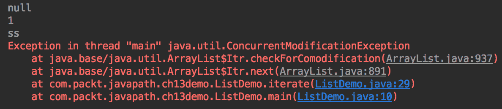

# Java 集合

本章将帮助读者更加熟悉最常用的 Java 集合。代码示例演示了它们的功能，并允许进行实验，强调不同集合类型及其实现之间的差异。

在本章中，我们将介绍以下主题：

*   什么是收藏？
*   列表和数组列表
*   集合与散列集
*   映射和哈希映射
*   练习–枚举集方法

# 什么是收藏？

当您阅读 Java 集合框架时，您可能会认为这样一个集合有一些特殊之处。同时，这个词的框架是相当超载和滥用，因为这个词的技术是一个我们已经拒绝使用。在英语中，framework 一词的意思是*系统、概念或文本的基本结构。*在计算机编程中，框架是一种软件系统，它的功能可以通过用户编写的附加代码或配置设置进行定制，以满足特定应用的要求。

但是，我们进一步研究 Java 集合框架的内容，发现其所有成员都属于`java.util`包，它是 Java 类库或 Java 标准库的一部分，正如我们在前一章中所描述的。在另一个极端，包`java.awt`、`javax.swing`或`javafx`中的图形用户界面具有框架的所有标志；它们只提供小工具和其他图形元素，这些元素必须由特定于应用程序的内容填充。但它们也属于 Java 类库。

这就是为什么我们避免使用单词 framework，在这里提到它只是为了解释标题 Java 集合框架背后隐藏着什么。

# java.util 包

包`java.util`的以下接口和类构成了 Java 集合框架：

*   扩展`java.util.Collection`的接口（这反过来扩展了`java.lang.Iterable`接口）：`List`、`Set`和`Queue`，这是最流行的接口
*   实现上述接口的类：`ArrayList`、`HashSet`、`Stack`和`LinkedList`为例
*   实现接口`java.util.Map`及其子类的类：`HashMap`、`HashTable`和`TreeMap`，仅举三个最常用的类

如您所见，Java 集合框架或 Java 集合由扩展`java.util.Collection`接口或`java.util.Map`接口的接口以及实现这些接口的类组成，所有这些接口都包含在`java.util`包中。

请注意，那些直接或间接实现`Collection`接口的类也实现了`Iterable`接口，因此可以在[第 10 章](10.html)、*控制流语句*中描述的迭代语句中使用。

# apachecommons 集合

ApacheCommons 项目包含（在包`org.apache.commons.collections`中）多个 Java 集合接口的实现，这些实现补充了`java.util`包中的实现。但是，除非您在需要特定收集算法的应用程序上工作，否则您可能不需要使用它们。尽管如此，我们建议您查看`org.apache.commons.collections`包 API，以便了解其内容，以防将来需要使用它。

# 集合与数组

所有集合都是类似于数组的数据结构，因为它们也包含元素，并且每个集合都由类的一个对象表示。不过，数组和集合之间有两个显著的区别：

*   数组在实例化时需要指定大小，而集合在添加或删除元素时会自动增大或减小大小。
*   集合的元素不能是基元类型的值，而只能是引用类型，包括包装类，如`Integer`或`Double`。好消息是，您可以添加一个基本值：

```
       List list = new ArrayList();
       list.add(42);

```

前面语句中的装箱转换（参见[第 9 章](09.html)、*运算符、表达式和语句*）将自动应用于原语值。

虽然人们期望阵列在访问其元素时提供更好的性能，但实际上，现代算法使阵列和集合的性能差异可以忽略不计，除非在某些非常特殊的情况下。这就是为什么必须使用数组的唯一原因是当某些算法或方法需要它时。

# 下面是我们要讨论的内容

在以下小节中，我们将讨论标准库中最流行的 Java 集合接口和类：

*   `List`接口和`ArrayList`类–它们保持元素的顺序
*   `Set`接口和`HashSe`类–它们不允许重复的元素
*   `Map`和`HashMap`接口–它们使用键存储对象，因此允许键到值的映射

请注意，以下部分中描述的大多数方法都来自`java.util.Collection`接口—几乎所有集合的父接口，除了那些实现`java.util.Map`接口的集合。

# 列表-ArrayList 保留顺序

`List`是一个接口，`ArrayList`类是它最常用的实现。两人都居住在`java.util`包中。除了在`List`接口中声明的方法之外，`ArrayList`类还有一些方法。例如，`removeRange()`方法在`List`接口中不存在，但在`ArrayList`API 中可用。

# 首选变量类型列表

在创建`ArrayList`的对象时，将其引用分配给`List`类型的变量是一种很好的做法：

```
List listOfNames = new ArrayList();
```

更有可能的是，使用类型为`ArrayList`的变量不会改变程序中的任何内容，无论是现在还是将来：

```
ArrayList listOfNames = new ArrayList();
```

前面的引用仍然可以传递给任何接受类型为`List`的参数的方法。然而，对接口进行编码（这是我们制作接口类型变量时所做的）通常是一个好习惯，因为您永远不知道对代码的需求何时会发生变化，您需要使用另一个`List`实现，例如`LinkedList`类。如果变量类型为`List`，则切换实现很容易。但如果变量类型为`ArrayList`，将其更改为`List`或`LinkedList`需要跟踪变量使用的所有位置，并运行各种测试以确保在任何地方都没有调用`ArrayList`方法。如果代码很复杂，就永远无法确保所有可能的执行路径都已检查，并且代码不会在生产中中断。这就是为什么我们更喜欢为保存对象引用的变量使用接口类型，除非您确实需要它成为类类型。我们在[第 8 章](08.html)*面向对象设计（OOD）原则*中详细讨论了这一点。

# 为什么叫 ArrayList？

`ArrayList`类之所以命名为 so，是因为它的实现基于数组。它实际上在幕后使用了一个数组。如果您在 IDE 中右键点击`ArrayList`并查看源代码，您将看到以下内容：

```
private static final Object[] DEFAULTCAPACITY_EMPTY_ELEMENTDATA = {};
public ArrayList() {
  this.elementData = DEFAULTCAPACITY_EMPTY_ELEMENTDATA;
}
```

它只是数组`Object[]`的包装器。下面是方法`add(E)`是如何实现的，例如：

```
public boolean add(E e) {
  modCount++;
  add(e, elementData, size);
  return true;
}
private void add(E e, Object[] elementData, int s) {
  if (s == elementData.length)
    elementData = grow();
  elementData[s] = e;
  size = s + 1;
}
```

如果您进一步研究源代码并查看方法`grow()`，您将看到在列表中添加新元素时，它如何增加数组的大小：

```
private Object[] grow() {  return grow(size + 1); }

private Object[] grow(int minCapacity) {
  return elementData = Arrays.copyOf(elementData,
                                    newCapacity(minCapacity));
}
private static final int DEFAULT_CAPACITY = 10;
private static final int MAX_ARRAY_SIZE = Integer.MAX_VALUE - 8;
private int newCapacity(int minCapacity) {
  // overflow-conscious code
  int oldCapacity = elementData.length;
  int newCapacity = oldCapacity + (oldCapacity >> 1);
  if (newCapacity - minCapacity <= 0) {
    if (elementData == DEFAULTCAPACITY_EMPTY_ELEMENTDATA)
      return Math.max(DEFAULT_CAPACITY, minCapacity);
    if (minCapacity < 0) // overflow
      throw new OutOfMemoryError();
    return minCapacity;
  }
  return (newCapacity - MAX_ARRAY_SIZE <= 0)
            ? newCapacity
            : hugeCapacity(minCapacity);
}
```

如您所见，当分配的数组大小不足以存储另一个元素时，将创建最小容量为 10 的新数组。所有已经存在的元素都使用`Arrays.copyOf()`方法复制到新数组中（我们将在本章后面讨论`Arrays`类）。

这就是`ArrayList`如此命名的原因。

对于使用`List`和`ArrayList`，您不需要了解所有这些，除非您必须处理非常大的元素列表，并且频繁复制底层数组会影响代码的性能。在这种情况下，考虑使用专门为您需要的处理类型而设计的不同数据结构。但这已经超出了本书的范围。此外，绝大多数主流程序员可能从未使用过任何不在`java.util`包中的集合。

# 添加元素

`List`接口提供两种添加元素的方法：

*   `add(E)`：这会将元素添加到列表的末尾
*   `add(index, E)`：通过将元素移动到指定位置（如果有）并将任何后续元素向右移动，将元素插入到列表中的指定（按索引，从零开始）位置，并在其索引中添加 1

如果出现问题，这两种方法都会抛出`RuntimeException`。因此，在方法周围放置一个 try-catch 块可以使代码更加健壮（如果 catch 块不只是重新抛出异常，而是做了一些有意义的事情）。在线阅读`List`接口 API 的文档，了解这些方法可以抛出的异常的名称，以及在哪些条件下可以发生。

`add(E)`方法还返回一个布尔值（`true`/`false`，表示操作成功。此方法重写了`Collection`接口中的方法，因此所有扩展或实现`Collection`接口的 Java 集合都拥有它。在`List`实现的情况下，此方法很可能总是返回`true`，因为列表允许重复条目。相反，`Set`接口的实现返回`false`，如果这样的元素已经存在，因为`Set`不允许重复。我们将在后续章节中讨论这一点，以及代码如何确定两个元素是否相同。

现在，我们来看一下`List`接口使用的`add()`方法示例：

```
List list = new ArrayList();
list.add(null);
list.add(1);
list.add("ss");
list.add(new A());
list.add(new B());
System.out.println(list);  //prints: [null, 1, ss, A, B]
list.add(2, 42);
System.out.println(list);  //prints: [null, 1, 42, ss, A, B]

```

在前面的列表中，我们在相同的列表中混合了不同类型的值。前面代码中使用的类`A`和`B`具有父子关系：

```
class A {
  @Override
  public String toString() { return "A"; }
}
class B extends A {
  @Override
  public String toString() { return "B"; }
}
```

如您所见，我们已将`toString()`方法添加到它们中的每一个，因此我们可以看到它们的对象以预期的格式打印。

# size（），isEmpty（），clear（）

这三种方法很简单：

*   `size()`：返回列表中元素的计数
*   `isEmpty()`：如果列表中没有元素，则返回`true`（`size()`返回 0）
*   `clear()`：删除列表中的所有元素，使得`isEmpty()`返回`true`，而`size()`返回 0

# 迭代和流

每个实现`Collection`接口（扩展`Iterable`接口）的集合都可以使用[第 10 章](10.html)、*控制流语句*中讨论的增强`for`语句进行迭代。以下是一个例子：

```
List list = new ArrayList();
list.add(null);
list.add(1);
list.add("ss");
list.add(new A());
list.add(new B());
for(Object o: list){
  //code that does something with each element   
} 
```

`Iterable`接口还为`List`接口增加了以下三种方式：

*   `forEach(Consumer function)`：将提供的功能应用于每个采集元素
*   `iterator()`：它返回一个`Iterator`类的对象，允许遍历（迭代）集合中的每个元素，并根据需要对每个元素进行操作
*   `splititerator()`：返回一个`Splititerator`类的对象，允许拆分集合进行并行处理（对该功能的讨论不在本书讨论范围内）

在[第 17 章](17.html)、*Lambda 表达式和函数编程*中，我们将解释如何将函数作为参数传递，因此现在，我们只展示一个`forEach()`方法用法的示例（如果我们重复使用前面示例中创建的列表）：

```
list.forEach(System.out::println);

```

如您所见，传入的函数获取由`forEach()`方法生成的每个元素，并将其打印出来。它之所以被称为`Consumer`，是因为它获取（消耗）输入，并且不返回任何值，只是打印。如果我们运行前面的代码，结果如下：


`forEach()`方法提供了与`for`语句相同的功能（参见前面的示例），但需要编写更少的代码。这就是为什么程序员喜欢函数式编程（当一个函数可以被视为一个对象时），因为在编写了数百次相同的样板代码之后，人们可以享受速记风格。

`iterator()`方法返回的`Iterator`接口有以下几种方法：

*   `next()`：返回迭代中的下一个元素
*   `hasNext ()`：如果迭代有更多元素，则返回`true`
*   `forEachRemaining (Consumer<? super E> function)`：将提供的功能应用于剩余的每个元素
*   `remove()`：它从基础集合中删除此迭代器返回的最后一个元素

`next()`和`hasNext()`方法被`for`幕后陈述所使用。您也可以使用它们，事实上复制`for`语句功能。但是为什么呢？`for`声明已经在做了。使用`Iterator`接口的唯一原因是在遍历列表时从列表中删除一些对象（使用`remove()`方法）。这就把我们带到了讨论初学者经常犯的错误的地方。

假设我们要从以下列表中删除所有类型为`String`的对象：

```
List list = new ArrayList();
list.add(null);
list.add(1);
list.add("ss");
list.add(new A());
list.add(new B());

```

下面是尝试执行此操作但存在缺陷的代码：

```
for(Object o: list){
  System.out.println(o);
  if(o instanceof String){
    list.remove(o);
  }
}
```

如果我们运行前面的代码，结果如下：



抛出了`ConcurrentModificationException`，因为我们试图在迭代集合时修改集合。`Iterator`类有助于避免此问题。以下代码工作正常：

```
System.out.println(list);  //prints: [null, 1, ss, A, B]
Iterator iter = list.iterator();
while(iter.hasNext()){
  Object o = iter.next();
  if(o instanceof String){
    iter.remove();
  }
}
System.out.println(list);  //prints: [null, 1, A, B]

```

我们不打算讨论为什么`Iterator`允许在迭代期间删除元素，以及为什么集合在类似情况下抛出异常，原因有两个：

*   它需要深入了解 JVM 实现，而不是入门课程所允许的。
*   在[第 18 章](18.html)、*流和管道*中，我们将演示一种使用 Java 函数式编程的更简洁的方法。这样的代码看起来非常干净优雅，以至于许多使用 Java8 和更高版本的程序员在处理集合和其他生成流的数据结构时几乎从不使用`for`语句。

还有四种其他方法可以迭代元素列表：

*   `listIterator()`和`listIterator(index)`：都返回`ListIterator`，与`Iterator`非常相似，但允许在列表中来回移动（`Iterator`只允许向前移动，如您所见）。这些方法很少使用，因此我们将跳过它们的演示。但是如果您需要使用它们，请查看前面的`Iterator`示例。`ListIterator`的用法非常相似。
*   `stream()`和`parallelStream()`：都返回`Stream`对象，我们将在[第 18 章](18.html)、*流和管道中详细讨论。*

# 使用泛型添加

有时在同一个列表中有不同的类型正是我们想要的。但是，大多数情况下，我们希望列表包含相同类型的值。同时，代码可能存在允许将不同类型添加到列表中的逻辑错误，这可能会产生意外的后果。如果它导致抛出一个异常，那么它就不会像某些默认转换和最后的错误结果那样糟糕，这可能在很长一段时间内都不会被注意到。

为了避免这样的问题，可以使用允许定义集合元素的预期类型的泛型，以便编译器可以在添加不同类型时检查并失败。以下是一个例子：

```
List<Integer> list1 = new ArrayList<>();
list1.add(null);
list1.add(1);
//list1.add("ss");          //compilation error
//list1.add(new A());       //compilation error
//list1.add(new B());       //compilation error
System.out.println(list1);  //prints: [null, 1]
list1.add(2, 42);
System.out.println(list1);  //prints: [null, 1, 42]

```

如您所见，`null`值无论如何都可以添加，因为它是任何引用类型的默认值，而正如我们在本节开头所指出的，任何 Java 集合的元素都只能是引用类型。

由于子类具有其任何超类的类型，因此泛型`<Object>`无助于避免前面描述的问题，因为每个 Java 对象都有`Object`类作为其父类：

```
List<Object> list2= new ArrayList<>();
list2.add(null);
list2.add(1);
list2.add("ss");
list2.add(new A());
list2.add(new B());
System.out.println(list2);    //prints: [null, 1, ss, A, B]
list2.add(2, 42);
System.out.println(list2);    //prints: [null, 1, 42, ss, A, B]

```

但是，以下泛型更具限制性：

```
List<A> list3= new ArrayList<>();
list3.add(null);
//list3.add(1);            //compilation error
//list3.add("ss");         //compilation error
list3.add(new A());
list3.add(new B());
System.out.println(list3); //prints: [null, A, B]
list3.add(2, new A());
System.out.println(list3); //prints: [null, A, A, B]

List<B> list4= new ArrayList<>();
list4.add(null);
//list4.add(1);            //compilation error
//list4.add("ss");         //compilation error
//list4.add(new A());      //compilation error
list4.add(new B());
System.out.println(list4); //prints: [null, B]
list4.add(2, new B());
System.out.println(list4); //prints: [null, B, B]

```

您可以使用泛型`<Object>`的唯一情况是，您希望允许将不同类型的值添加到列表中，但不希望允许对列表本身的引用引用引用具有其他泛型的列表：

```
List list = new ArrayList();
List<Integer> list1 = new ArrayList<>();
List<Object> list2= new ArrayList<>();
list = list1;
//list2 = list1;   //compilation error

```

如您所见，不带泛型的列表（称为原始类型）允许其引用带有任何泛型的任何其他列表，而带有泛型`<Object>`的列表不允许其变量引用带有任何其他泛型的列表。

Java 集合还允许通配符泛型`<?>`，它只允许将`null`分配给集合：

```
List<?> list5= new ArrayList<>();
list5.add(null);
//list5.add(1);            //compilation error
//list5.add("ss");         //compilation error
//list5.add(new A());      //compilation error
//list5.add(new B());      //compilation error
System.out.println(list5); //prints: [null]
//list5.add(1, 42);        //compilation error

```

通配符泛型的用法示例如下所示。假设我们编写了一个方法，该方法将`List`（或任何集合，就此而言）作为参数，但我们希望确保此列表不会在方法内部修改，从而更改原始列表。以下是一个例子：

```
void doSomething(List<B> list){
  //some othe code goes here
  list.add(null);
  list.add(new B());
  list.add(0, new B());
  //some other code goes here
}
```

如果我们使用上述方法，会产生不良副作用：

```
List<B> list= new ArrayList<>();
System.out.println(list); //prints: [B]
list.add(0, null);
System.out.println(list); //prints: [null, B]
doSomething(list);
System.out.println(list); //[B, null, B, null, B]

```

为了避免副作用，可以这样写：

```
void doSomething(List<?> list){
  list.add(null);
  //list.add(1);            //compilation error
  //list.add("ss");         //compilation error
  //list.add(new A());      //compilation error
  //list.add(new B());      //compilation error
  //list.add(0, 42);        //compilation error
}
```

如您所见，这种方式不能修改列表，除非添加`null`。好吧，它的代价是去掉通用的`<B>`。现在，传入列表可能包含不同类型的对象，类型转换`(B)`将抛出`ClassCastException`。没有什么是免费的，但有可能。

与封装一样，最佳实践建议对泛型使用尽可能多的窄（或专用）a 类型。这确保了发生意外行为的可能性大大降低。

为了防止在方法内部修改集合，可以使集合不可变。它可以在方法内部或外部完成（在将其作为参数传递之前）。我们将在[第 14 章](14.html)、*管理集合和数组*中向您展示如何实现这一点。

# 添加集合

`List`接口有两种方法可以将整个对象集合添加到现有列表中：

*   `addAll(Collection<? extends E> collection)`：将提供的对象集合添加到列表的末尾。
*   `addAll(int index, Collection<? extends E> collection)`：将提供的元素插入列表中指定位置。该操作将当前位于该位置的元素（如果有）和任何后续元素向右移动（按所提供集合的大小增加其索引）。

如果出现问题，两种方法都会抛出几个`RuntimeExceptions`。此外，这两种方法都返回布尔值：

*   `false`：如果调用此方法后列表没有改变
*   `true`：如果列表已更改

与添加单个元素的情况一样，这些方法的所有`List`实现很可能总是返回 true，因为`List`允许重复，而`Set`则不允许重复（我们将在稍后讨论）。

如果您已经阅读了几页前的泛型描述，您可以猜出符号`Collection<? extends E>`的含义。泛型`<? extends E>`是指`E`或`E`的子类型，其中`E`是用作集合泛型的类型。为了与前面的示例相关，请观察以下类别，`A`和`B`：

```
class A {
  @Override
  public String toString() { return "A"; }
}
class B extends A {
  @Override
  public String toString() { return "B"; }
}
```

我们可以添加到`A`类和`B`类的`List<A>`对象中。

符号`addAll(Collection<? extends E> collection)`表示此方法允许添加`E`类型的`List<E>`对象或`E`的任何子类型。

例如，我们可以执行以下操作：

```
List<A> list = new ArrayList<>();
list.add(new A());
List<B> list1 = new ArrayList<>();
list1.add(new B());
list.addAll(list1);
System.out.println(list);    //prints: [A, B]
```

`addAll(int index, Collection<? extends E> collection)`方法的作用非常类似，但仅从指定的索引开始。当然，所提供索引的值应该等于 0 或小于列表的长度。

对于`addAll(int index, Collection<? extends E> collection)`方法，所提供索引的值应等于 0 或小于列表的长度。

# 实现 equals（）和 hashCode（）

这是一个非常重要的小节，因为在创建类时，程序员往往只关注主要功能，而忘记了实现`equals()`和`hashCode()`方法。在使用`equals()`方法比较对象或将对象添加到集合中，然后搜索或假设对象是唯一的（在`Set`的情况下）之前，它不会导致任何问题。

正如我们在[第 9 章](09.html)、*运算符、表达式和语句*中所展示的，`equals()`方法可用于对象识别。如果一个类没有覆盖基类`Object`中`equals()`方法的默认实现，那么每个对象都是唯一的。即使同一类的两个对象具有相同的状态，默认的`equals()`方法也会将它们报告为不同。因此，如果需要将具有相同状态的同一类的两个对象视为相等，则必须在该类中实现`equals()`方法，以便它覆盖`Object`中的默认实现。

由于每个 Java 集合在其元素中搜索对象时都使用`equals()`方法，因此您必须实现它，因为典型的业务逻辑要求在对象标识过程中考虑对象状态或至少一些状态值。您还必须决定在类继承链的哪个级别上，两个孩子应该被视为相等的，正如我们在[第 9 章](09.html)、*操作符、表达式和语句*中所讨论的，同时比较类`PersonWithHair`和`PersonWithHairDressed`的对象；两者都扩展了`Person`类。然后我们决定，如果根据`Person`类中实现的`equals()`方法，这些类的对象表示相同的人。我们还决定为识别（平等）的目的考虑，只有字段 T6T 和 OutT7，尽管 OLE T8-类可能有几个其他字段（例如，AutoT99，例如）与人的身份无关。

因此，如果您希望您创建的类将用于生成对象，这些对象将用作某个 Java 集合的成员，那么您最好实现`equals()`方法。为此，您必须做出两个决定：

*   在类继承层次结构的哪个级别上实现该方法
*   要将对象的哪些字段（换句话说，对象状态的哪些方面）纳入考虑范围

Java 集合使用`equals()`方法进行元素标识。在实现 AUTYT1 方法时，考虑在父类之一中进行它，并决定在比较两个对象时使用哪些字段。

方法`hashCode()`未被`List`实现使用，因此我们将在下面的代码中结合接口`Set`和`Map`的实现进行更详细的讨论。但是，既然我们在这里讨论这个主题，我们想提到的是，最佳 Java 编程实践建议每次实现`equals()`方法时都实现`hashCode()`方法。执行此操作时，请使用与`equals()`方法相同的字段。例如，我们在[第 9 章](09.html)中实现的`Person`类*运算符、表达式和语句*应该如下所示：

```
class Person{
  private int age;
  private String name, currentAddress;
  public Person(int age, String name, String currAddr) {
    this.age = age;
    this.name = name;
    this.currentAddress = currAddr;
  }
  @Override
  public boolean equals(Object o) {
    if (this == o) return true;
    if (o == null) return false;
    if(!(o instanceof Person)) return false;
      Person person = (Person)o;
      return age == person.getAge() &&
                Objects.equals(name, person.getName());
  }
  @Override
  public int hashCode(){
    return Objects.hash(age, name);
  }
}

```

如您所见，我们在`Objects`类的`hash()`方法的基础上添加了`hashCode()`方法的实现，我们将在本章后面讨论。我们还添加了一个新字段，但不会在`equals()`方法和`hashCode()`方法中使用它，因为我们认为它与个人身份无关。

每次实现`equals()`方法时，也要实现`hashCode()`方法，因为您创建的类的对象不仅可以在`List`中使用，还可以在`Set`或`Map`中使用，这需要实现`hashCode()`。

我们将在本章的相应章节中讨论`hashCode()`方法对`Set`和`Map`实施的动机。我们还将解释为什么我们不能使用`hashCode()`进行对象识别，就像我们使用`equals()`方法时一样。

# 定位元件

`List`界面中有三种方法可以检查列表中元素的存在和位置：

*   `contains(E)`：如果列表中存在提供的元素，则返回`true`。
*   `indexOf(E)`：返回列表中提供元素的索引（位置）。如果列表中有多个这样的元素，则返回最小的索引–左侧第一个元素的索引，该元素等于提供的元素。
*   `lastIndexOf(E)`：返回列表中提供元素的索引（位置）。如果列表中有多个这样的元素，则返回最大的索引–左侧最后一个元素的索引，该元素等于提供的元素。

下面是显示如何使用这些方法的代码：

```
List<String> list = new ArrayList<>();
list.add("s1");
list.add("s2");
list.add("s1");

System.out.println(list.contains("s1"));    //prints: true
System.out.println(list.indexOf("s1"));     //prints: 0
System.out.println(list.lastIndexOf("s1")); //prints: 2

```

有两件事值得注意：

*   列表中的第一个元素的索引为 0（类似于数组）
*   上述方法依赖于`equals()`方法的实现来识别列表中提供的对象

# 检索元素

`List`界面中有两种方法可以进行元素检索：

*   `get(index)`：返回具有提供索引的元素
*   `sublist(index1, index2)`：返回从`index1`开始直到（但不包括）包含`index2`的元素的元素列表

以下代码演示了如何使用这些方法：

```
List<String> list = new ArrayList<>();
list.add("s1");
list.add("s2");
list.add("s3");

System.out.println(list.get(1));       //prints: s2
System.out.println(list.subList(0,2)); //prints: [s1, s2]

```

# 删除元素

`List`界面中有四种方法可以从列表中删除（删除）元素：

*   `remove(index)`：删除具有提供索引的元素并返回删除的元素
*   `remove(E)`：删除提供的元素，如果列表中包含该元素，则返回`true`
*   `removeAll(Collection)`：删除提供的元素，如果列表发生变化则返回`true`
*   `retainAll(Collection)`：删除所有不在所提供集合中的元素，如果列表发生变化则返回`true`

关于这些方法，我们想提出两点：

*   最后三种方法使用`equals()`方法识别要移除或保留的元素
*   如果从列表中删除了一个或多个元素，则将重新计算其余元素的索引

现在让我们看一下代码示例：

```
List<String> list = new ArrayList<>();
list.add("s1");
list.add("s2");
list.add("s3");
list.add("s1");

System.out.println(list.remove(1));    //prints: s2
System.out.println(list);              //prints: [s1, s3, s1]
//System.out.println(list.remove(5));  //throws IndexOutOfBoundsException
System.out.println(list.remove("s1")); //prints: true
System.out.println(list);              //prints: [s3, s1]
System.out.println(list.remove("s5")); //prints: false
System.out.println(list);              //prints: [s3, s1]

```

在前面的代码中，值得注意的是列表有两个元素，`s1`，但只有左边的第一个元素被语句`list.remove("s1")`删除：

```
List<String> list = new ArrayList<>();
list.add("s1");
list.add("s2");
list.add("s3");
list.add("s1");

System.out.println(list.removeAll(List.of("s1", "s2", "s5")));   //true
System.out.println(list);                                        //[s3]
System.out.println(list.removeAll(List.of("s5")));               //false
System.out.println(list);                                        //[s3]

```

为了节省空间，我们使用`of()`方法创建了一个列表，我们将在[第 14 章](14.html)*管理集合和数组*中讨论。与前面的代码中的`list.removeAll("s1","s2","s5")`相比，前面的代码中的`s1`都被删除了：

```
List<String> list = new ArrayList<>();
list.add("s1");
list.add("s2");
list.add("s3");
list.add("s1");

System.out.println(list.retainAll(List.of("s1","s2","s5"))); //true
System.out.println(list);                                    //[s1, s2, s1]
System.out.println(list.retainAll(List.of("s1","s2","s5"))); //false
System.out.println(list);                                    //[s1, s2, s1]
System.out.println(list.retainAll(List.of("s5")));           //true
System.out.println(list);                                    //[]

```

请注意在前面的代码中，`retainAll()`方法是如何第二次返回`false`的，因为列表没有更改。另外，请注意语句`list.retainAll(List.of("s5")`是如何清除列表的，因为它的任何元素都不等于提供的任何元素。

# 更换元件

`List`界面中有两种方法可以替换列表中的元素：

*   `set(index, E)`：将提供索引的元素替换为提供的元素
*   `replaceAll(UnaryOperator<E>)`：用提供的操作返回的结果替换列表中的每个元素

以下是方法`set()`的使用示例：

```
List<String> list = new ArrayList<>();
list.add("s1");
list.add("s2");

list.set(1, null);
System.out.println(list);    //prints: [s1, null]

```

它非常简单，似乎不需要任何评论。

第二种方法`replaceAll()`基于函数`UnaryOperator<E>`——Java 8 中引入的 Java 函数接口之一。我们将在[第 17 章](17.html)、*Lambda 表达式和函数式编程*中讨论。现在，我们只想展示代码示例。它们看起来很简单，所以您应该能够理解它是如何工作的。假设我们从以下列表开始：

```
List<String> list = new ArrayList<>();
list.add("s1");
list.add("s2");
list.add("s3");
list.add("s1");
```

下面是一些可能的元素修改（请记住，`replaceAll()`方法用提供的函数返回的结果替换每个元素）：

```
list.replaceAll(s -> s.toUpperCase()); //cannot process null
System.out.println(list);    //prints: [S1, S2, S3, S1]

list.replaceAll(s -> ("S1".equals(s) ? "S5" : null));
System.out.println(list);    //prints: [S5, null, null, S5]

list.replaceAll(s -> "a");
System.out.println(list);    //prints: [a, a, a, a]

list.replaceAll(s -> {
  String result;
  //write here any code you need to get the value
  // for the variable result based in the value of s
  System.out.println(s);   //prints "a" four times
  result = "42";
  return result;
});
System.out.println(list);    //prints: [42, 42, 42, 42]

```

在上一个示例中，我们将操作体放在大括号`{}`中，并添加了一个显式的`return`语句，因此您可以看到我们所说的操作返回结果的意思。

在使用`equals()`方法将集合的元素与`String`文本或任何其他对象进行比较时，最好在文本（如`"s1".equals(element)`）或用于比较的对象（如`someObject.equals(element)`）上调用`equals()`。如果集合具有`null`值，则有助于避免`NullPointerException`。

前面的函数示例可以重新编写如下：

```
UnaryOperator<String> function = s -> s.toUpperCase();
list.replaceAll(function);

function = s -> ("S1".equals(s) ? "S5" : null);
list.replaceAll(function);

function = s -> "a";
list.replaceAll(function);

function = s -> {
  String result;
  //write here any code you need to get the value
  // for the variable result based in the value of s
  System.out.println(s);   //prints "a" four times
  result = "42";
  return result;
};
list.replaceAll(function);

```

通过这种方式，它们可以作为任何其他参数传递，这就是函数式编程的强大功能。但是，我们将再次讨论它，并解释[第 17 章](17.html)、*Lambda 表达式和函数编程*中的所有语法。

# 排序字符串和数字类型

正如我们已经提到的，`List`类型的集合保留了元素的顺序，因此，很自然地，它还具有对元素进行排序的能力，`sort(Comparator<E>)`方法就是为了实现这一目的。在 Java8 引入函数式编程之后，这种方法成为可能。我们将在[第 17 章](17.html)、*Lambda 表达式和函数式编程*中讨论。

现在，我们将向您展示几个示例，并指出在哪里可以找到标准比较器。我们从以下列表开始：

```
List<String> list = new ArrayList<>();
list.add("s3");
list.add("s2");
list.add("ab");
//list.add(null); //throws NullPointerException for sorting
                  //     String.CASE_INSENSITIVE_ORDER
                  //     Comparator.naturalOrder()
                  //     Comparator.reverseOrder()
list.add("a");
list.add("Ab");
System.out.println(list);                //[s3, s2, ab, a, Ab]

```

下面是一些排序示例：

```
list.sort(String.CASE_INSENSITIVE_ORDER);
System.out.println(list);                //[a, ab, Ab, s2, s3]

list.sort(Comparator.naturalOrder());
System.out.println(list);               //[Ab, a, ab, s2, s3]

list.sort(Comparator.reverseOrder());
System.out.println(list);               //[Ab, a, ab, s2, s3]
```

正如前面的注释所指出的，前面的排序不是空安全的。您可以通过阅读关于前面的比较器的 API 文档或者仅仅通过实验来了解这一点。即使在阅读文档之后，人们也经常尝试各种边缘情况，以便更好地理解所描述的功能，并查看您是否正确理解了描述。

还有处理`null`值的比较器：

```
list.add(null);

list.sort(Comparator.nullsFirst(Comparator.naturalOrder()));
System.out.println(list);              //[null, Ab, a, ab, s2, s3]

list.sort(Comparator.nullsLast(Comparator.naturalOrder()));
System.out.println(list);              //[Ab, a, ab, s2, s3, null]

```

如您所见，许多流行的比较器都可以作为类`java.util.Comparator`的静态方法找到。但如果您没有看到所需的现成比较器，您也可以编写自己的比较器。例如，假设我们需要对 null 值进行排序，就好像它是`String`值“null”。对于这种情况，我们可以编写一个自定义比较器：

```
Comparator<String> comparator = (s1, s2) ->{
  String s = (s1 == null ? "null" : s1);
  return s.compareTo(s2);
};
list.sort(comparator);
System.out.println(list);              //[Ab, a, ab, null, s2, s3]
```

`Comparator`类中还有各种数字类型的比较器：

*   `comparingInt(ToIntFunction<? super T> keyExtractor)`
*   `comparingLong(ToLongFunction<? super T> keyExtractor)`
*   `comparingDouble(ToDoubleFunction<? super T> keyExtractor)`

如果读者需要使用这些方法进行数字比较，我们将其留给读者自己研究。然而，大多数主流程序员似乎从不使用它们；我们演示的现成比较器通常已经足够了。

# 对自定义对象排序

更常见的情况之一是需要对自定义对象进行排序，例如，`Car`或`Person`类型。为此，有两种选择：

*   实现`Comparable`接口。它只有一个方法`compareTo(T)`，该方法接受相同类型的对象，如果该对象小于、等于或大于指定对象，则返回负整数、零或正整数。这种实现称为自然排序，因为实现`Comparable`接口的对象可以通过集合的`sort()`方法进行排序。上一小节的许多示例演示了它如何适用于类型为`String`的对象。比较器通过方法`naturalOrder()`、`reverseOrder()`、`nullFirst()`和`nullLast()`返回–它们都基于使用`compareTo()`实现。
*   实现一个外部比较器，该比较器使用`Comparator`类的静态`comparing()`方法比较收集元素类型的两个对象。

让我们看看前面每个选项的代码示例，并讨论每种方法的优缺点。首先对`Person`、`PersonWithHair`、`PersonWithHairDressed`类进行增强，实现`Comparable`接口：

```
class Person implements Comparable<Person> {
  private int age;
  private String name, address;
  public Person(int age, String name, String address) {
    this.age = age;
    this.name = name == null ? "" : name;
    this.address = address;
  }
  @Override
  public int compareTo(Person p){
    return name.compareTo(p.getName());
  }
  @Override
  public boolean equals(Object o) {
    if (this == o) return true;
    if (o == null) return false;
    if(!(o instanceof Person)) return false;
      Person person = (Person)o;
      return age == person.getAge() &&
                Objects.equals(name, person.getName());
  }
  @Override
  public int hashCode(){ return Objects.hash(age, name); }
  @Override
  public String toString() { return "Person{age=" + age +
                                   ", name=" + name + "}";
  }
}
```

如您所见，我们添加了另一个实例字段`address`，但在`equals()`、`hashCode()`或`compareTo()`方法中都不使用它。我们这样做只是为了说明如何定义`Person`类对象及其子对象的身份完全取决于您。我们还实现了`toString()`方法（只打印标识中包含的字段），因此我们可以在显示每个对象时识别它们。我们已经实现了`Comparable`接口`compareTo()`的方法，该接口将用于排序。现在，它只考虑名称，因此在排序时，对象将按名称排序。

`Person`班的孩子没有变化：

```
class PersonWithHair extends Person {
  private String hairstyle;
  public PersonWithHair(int age, String name, 
                        String address, String hairstyle) {
    super(age, name, address);
    this.hairstyle = hairstyle;
  }
}

class PersonWithHairDressed extends PersonWithHair{
  private String dress;
  public PersonWithHairDressed(int age, String name, 
           String address, String hairstyle, String dress) {
    super(age, name, address, hairstyle);
    this.dress = dress;
  }
}
```

现在，我们可以创建要排序的列表：

```
List<Person> list = new ArrayList<>();
list.add(new PersonWithHair(45, "Bill", "27 Main Street", 
                                                       "Pompadour"));
list.add(new PersonWithHair(42, "Kelly","15 Middle Street",  
                                                        "Ponytail"));
list.add(new PersonWithHairDressed(34, "Kelly", "10 Central Square",  
                                               "Pompadour", "Suit"));
list.add(new PersonWithHairDressed(25, "Courtney", "27 Main Street",  
                                              "Ponytail", "Tuxedo"));

list.forEach(System.out::println);

```

执行上述代码会产生以下输出：

```
Person{age=45, name=Bill}
Person{age=42, name=Kelly}
Person{age=34, name=Kelly}
Person{age=25, name=Courtney}
```

这些人是按照他们被添加到列表中的顺序打印出来的。现在，让我们对它们进行排序：

```
list.sort(Comparator.naturalOrder());
list.forEach(System.out::println);

```

新订单如下：

```
Person{age=45, name=Bill}
Person{age=25, name=Courtney}
Person{age=42, name=Kelly}
Person{age=34, name=Kelly}
```

对象按名称的字母顺序排列–这就是我们实现`compareTo()`方法的方式。

如果我们使用`reverseOrder()`比较器，则显示的顺序相反：

```
list.sort(Comparator.reverseOrder());
list.forEach(System.out::println);

```

如果运行前面的代码，我们会看到：

```
Person{age=42, name=Kelly}
Person{age=34, name=Kelly}
Person{age=25, name=Courtney}
Person{age=45, name=Bill}
```

顺序颠倒了。

我们可以更改`compareTo()`方法的实现，并按年龄对对象进行排序：

```
@Override
public int compareTo(Person p){
  return age - p.getAge();
}
```

或者我们可以实现它，这样`Person`对象将按两个字段排序——首先按名称，然后按年龄：

```
@Override
public int compareTo(Person p){
  int result = this.name.compareTo(p.getName());
  if (result != 0) {
    return result;
  }
  return this.age - p.getAge();
}
```

如果我们现在按自然顺序对列表排序，结果将是：

```
Person{age=45, name=Bill}
Person{age=25, name=Courtney}
Person{age=34, name=Kelly}
Person{age=42, name=Kelly}
```

您可以看到，对象是按名称排序的，但是两个同名的人也是按年龄排序的。

这就是实现`Comparable`接口的优点——排序总是以相同的方式执行。但这也是一个缺点，因为要更改顺序，必须重新实现类。此外，如果`Person`类是从库中提供给我们的，那么这可能是不可能的，因此我们无法修改它的代码。

在这种情况下，使用`Comparator.comparing()`方法的第二个选项将起到救援作用。顺便说一下，即使`Person`类没有实现`Comparable`接口，我们也可以这样做。

`Comparator.comparing()`方法接受函数作为参数。我们将在[第 17 章](17.html)、*Lambda 表达式和函数式编程*中更详细地讨论函数式编程。现在，我们只说，`Comparator.comparing()`方法根据作为参数传入的字段（要排序的类的字段）生成一个比较器。让我们看一个例子：

```
list.sort(Comparator.comparing(Person::getName));
list.forEach(System.out::println);

```

前面的代码按名称对`Person`对象进行排序。我们要做的唯一修改就是将`getName()`方法添加到`Person`类中。同样，如果我们添加`getAge()`方法，我们可以按年龄对`Person`对象进行排序：

```
list.sort(Comparator.comparing(Person::getAge));
list.forEach(System.out::println);

```

或者我们可以按这两个字段对它们进行排序–与我们在实现`Comparable`接口时的方式完全相同：

```
list.sort(Comparator.comparing(Person::getName).thenComparing(Person::getAge));
list.forEach(System.out::println);

```

您可以在前面的代码中看到如何使用`thenComparing()`链接排序方法。

大多数类通常都有 getter 来访问字段值，因此通常不需要添加 getter，任何库类都可以这样排序。

# 与其他收藏相比较

每个 Java 集合都实现了`equals()`方法，该方法将它与另一个集合进行比较。在`List`的情况下，两个列表被视为相等（方法`list1.equals(list2)`返回`true`：

*   每个集合的类型为`List`
*   一个列表中的每个元素都等于位于相同位置的另一个列表中的元素

下面是说明它的代码：

```
List<String> list1 = new ArrayList<>();
list1.add("s1");
list1.add("s2");

List<String> list2 = new ArrayList<>();
list2.add("s1");
list2.add("s2");

System.out.println(list1.equals(list2)); //prints: true
list2.sort(Comparator.reverseOrder());
System.out.println(list2);               //prints: [s2, s1]
System.out.println(list1.equals(list2)); //prints: false

```

如果两个列表相等，则它们的`hashCode()`方法返回相同的整数值。但是`hashCode()`结果的相等并不保证列表是相等的。我们将在下一节讨论`Set`集合元素的`hashCode()`方法实现时讨论其原因。

`List`接口的`containsAll(Collection)`方法（或实现`Collection`接口的任何集合）仅在列表中存在所提供集合的所有元素时返回`true`。如果列表的大小和提供的集合的大小相等，我们可以确保每个比较的集合都由相同的元素组成。虽然它不能保证元素是同一类型的，因为它们可能是不同代的子元素，而`equals()`方法只在公共父元素中实现。

如果没有，我们可以使用本节前面描述的方法`retainAll(Collection)`和`removeAll(Collection)`找到差异。假设我们有两个列表，如下所示：

```
List<String> list1 = new ArrayList<>();
list1.add("s1");
list1.add("s1");
list1.add("s2");
list1.add("s3");
list1.add("s4");

List<String> list2 = new ArrayList<>();
list2.add("s1");
list2.add("s2");
list2.add("s2");
list2.add("s5");

```

我们可以找到一个列表中的哪些元素在另一个列表中不存在：

```
List<String> list = new ArrayList<>(list1);
list.removeAll(list2);
System.out.println(list);    //prints: [s3, s4]

list = new ArrayList<>(list2);
list.removeAll(list1);
System.out.println(list);    //prints: [s5]

```

请注意，我们是如何创建一个临时列表以避免损坏原始列表的。

但这种差异并没有告诉我们每个列表中可能存在重复的元素。要找到它，我们可以使用`retainAll(Collection)`方法：

```
List<String> list = new ArrayList<>(list1);
list.retainAll(list2);
System.out.println(list);    //prints: [s1, s1, s2]

list = new ArrayList<>(list2);
list.retainAll(list1);
System.out.println(list);    //prints: [s1, s2, s2]

```

现在我们全面了解了这两个列表之间的差异。

另外，请注意，`retainAll(Collection)`方法可用于识别属于每个列表的元素。

但是`retainAll(Collection)`和`removeAll(Collection)`都不能保证传入的比较列表和集合包含相同类型的元素。它们可能是具有公共父级的子级的混合，该父级仅在父级中实现了`equals()`方法，父级类型是传入的列表和集合的类型。

# 转换为数组

有两种方法允许将列表转换为数组：

*   `toArray()`：将列表转换为数组`Object[]`
*   `toArray(T[])`：将列表转换为数组`T[]`，其中`T`为列表中元素的类型

这两种方法都保留了元素的顺序。下面是演示如何执行此操作的演示代码：

```
List<String> list = new ArrayList<>();
list.add("s1");
list.add("s2");

Object[] arr1 = list.toArray();
for(Object o: arr1){
  System.out.print(o);       //prints: s1s2
}

String[] arr2 = list.toArray(new String[list.size()]);
for(String s: arr2){
  System.out.print(s);      //prints: s1s2
}
```

然而，还有另一种方法可以将列表或任何集合转换为数组—使用流和函数编程：

```
Object[] arr3 = list.stream().toArray();
for (Object o : arr3) {
  System.out.print(o);       //prints: s1s2
}

String[] arr4 = list.stream().toArray(String[]::new);
for (String s : arr4) {
  System.out.print(s);       //prints: s1s2
}
```

流和函数式编程已经使许多传统的编码解决方案过时。我们将在[第 17 章](17.html)、*Lambda 表达式和函数编程*以及[第 18 章](18.html)、*流和管道*中讨论这一点。

# 列出实现

有许多类实现`List`接口，用于各种目的：

*   `ArrayList`：正如我们在本节中所讨论的，它是迄今为止最流行的`List`实现
*   `LinkedList`：提供列表末尾元素的快速添加和删除
*   `Stack`：为对象提供**后进先出**（**后进先出**存储
*   `List`接口在线文档中提到的许多其他类。

# Set-HashSet 不允许重复

创建`Set`接口是有原因的；它的设计不允许重复的元素。使用`equals()`方法识别重复项，该方法在对象为集合元素的类中实现。

# 首选变量类型集

与`List`的情况一样，对包含对实现`Set`接口的类的对象的引用的变量使用`Set`类型是一种良好的编程实践，称为对接口进行编码。它确保客户机代码独立于任何特定实现。因此，例如，写`Set<Person> persons = new HashSet<>()`是一个好习惯。

# 为什么叫 HashSet？

在编程中，哈希值是表示某些数据的 32 位有符号整数。在`HashTable`等数据结构中使用。在`HashTable`中创建记录后，可以稍后使用其哈希值快速查找和检索存储的数据。哈希值也称为哈希代码、摘要或简单的哈希。

在 Java 中，基`Object`类中的`hashCode()`方法返回一个哈希值作为对象表示，但它不考虑任何子字段的值。这意味着，如果需要哈希值来包含子对象状态，则需要在该子类中实现`hashCode()`方法。

散列值是表示某些数据的整数。在 Java 中，它表示一个对象。

`HashSet`类使用散列值作为唯一键来存储和检索对象。虽然可能的整数数量很大，但对象的种类仍然更大。因此，两个不相等的对象很可能具有相同的哈希值。这就是为什么`HashSet`中的每个散列值不是指单个对象，而是指一组对象（称为 bucket 或 bin）。`HashSet`使用`equals()`方法解决此冲突。

例如，有几个`A`类的对象存储在`HashSet`对象中，您想知道`A`类的特定对象是否存在。在`HashSet`对象上调用`contains(object of A)`方法。该方法计算所提供对象的哈希值，并查找具有此类键的 bucket。如果没有找到，则`contains()`方法返回`false`。但如果存在具有该散列值的 bucket，则该 bucket 可能包含多个`A`类的对象。这就是`equals()`方法发挥作用的时候。代码使用`equals()`方法将桶中的每个对象与提供的对象进行比较。如果对`equals()`的调用中有一个返回`true`，则`contains()`方法返回`true`，从而确认该对象已存储在。否则返回`false`。

这就是为什么，正如我们在讨论`List`接口时所述，如果要创建的类的对象是集合的元素，则必须实现`equals()`和`hashCode()`两种方法，并使用相同的实例字段，这一点非常重要。由于`List`不使用散列值，因此，对于在`Object`的子对象中没有实现`hashCode()`方法的对象，可以使用`List`接口逃之夭夭。但是任何名称中包含“Hash”的集合如果没有它将无法正常工作。因此，这个名字。

# 添加元素

`Set`接口只提供一种添加单个元素的方法：

*   `add(E)`：如果集合中还没有`E2`元素，则将提供的元素`E1`添加到集合中，使得语句`Objects.equals(E1, E2)`返回`true`

`Objects`类是位于包`java.util`中的实用程序类。它的`equals()`方法以空安全方式比较两个对象，当两个对象都是`null`时返回`true`，否则使用`equals()`方法。在下一节中，我们将在本章中进一步讨论实用程序类`Objects`。

如果出现问题，`add()`方法可以抛出`RuntimeException`。因此，在方法周围放置一个 try-catch 块可以使代码更加健壮（如果 catch 块不只是重新抛出异常，而是做了一些有意义的事情）。在线阅读`Set`接口 API 的描述，了解此方法引发的异常的名称以及在何种条件下可能发生。

`add(E)`方法还返回一个布尔值（`true`/`false`，表示操作成功。此方法重写了`Collection`接口中的方法，因此所有扩展或实现`Collection`接口的 Java 集合都拥有它。让我们看一个例子：

```
Set<String> set = new HashSet<>();
System.out.println(set.add("s1"));  //prints: true
System.out.println(set.add("s1"));  //prints: false
System.out.println(set.add("s2"));  //prints: true
System.out.println(set.add("s3"));  //prints: true
System.out.println(set);            //prints: [s3, s1, s2]  

```

请注意，首先，当我们第二次尝试添加元素`s1`时，`add()`方法如何返回`false`。然后查看上面代码的最后一行，并观察以下内容：

*   只有一个元素`s1`被添加到集合中
*   元素的顺序不保留

最后一点很重要。Java 规范明确指出，与`List`相比，`Set`并不保证元素的顺序。当相同的代码在不同的 JVM 实例上运行时，甚至在同一实例上的不同运行时，情况可能会有所不同。工厂方法`Set.of()`在创建无序集合时对其进行了一些洗牌（我们将在[第 14 章](14.html)、*管理集合和数组中讨论集合工厂方法）*。这样，在代码部署到生产环境之前，就可以更早地发现对`Set`和其他无序集合元素的特定顺序的不适当依赖。

# size（）、isEmpty（）和 clear（）等

这三种方法很简单：

*   `size()`：返回集合中元素的个数
*   `isEmpty()`：如果列表中没有元素，则返回`true`（`size()`返回 0）
*   `clear()`：删除列表中的所有元素，`isEmpty()`返回`true`且`size()`返回 0

# 迭代和流

此`Set`功能与前面描述的`List`没有区别，因为实现`Collection`接口的每个集合也实现了`Iterable`接口（因为`Collection`扩展了`Iterable`），集合可以使用传统的增强`for`语句或其自身的方法`forEach()`进行迭代：

```
Set set = new HashSet();
set.add(null);
set.add(1);
set.add("ss");
set.add(new A());
set.add(new B());
for(Object o: set){
  System.out.println(o);
}
set.forEach(System.out::println);
```

在[第 17 章](17.html)、*Lambda 表达式和函数编程*中，我们将解释如何将函数作为方法`forEach()`的参数传递。两种迭代样式的结果相同：


来自`Iterable`接口的其他相关方法也与`List`接口相同：

*   `iterator()`：返回一个`Iterator`类的对象，允许遍历（迭代）集合中的每个元素，并根据需要对每个元素进行操作
*   `splititerator()`：返回一个`Splititerator`类的对象，允许拆分集合进行并行处理（对该功能的讨论不在本书讨论范围内）

`iterator()`方法返回的`Iterator`接口有以下几种方法：

*   `next()`：返回迭代中的下一个元素
*   `hasNext ()`：如果迭代有更多元素，则返回`true`
*   `forEachRemaining (Consumer<? super E> function)`：将提供的功能应用于剩余的每个元素
*   `remove()`：它从基础集合中删除此迭代器返回的最后一个元素

`next()`和`hasNext()`方法由`for`幕后陈述使用。

还可以使用可通过方法`stream()`和`parallelStream()`获得的`Stream`类的对象对集合元素进行迭代。我们将在[第 18 章](18.html)、*溪流和管道中向您展示如何做到这一点。*

# 使用泛型添加

与`List`的情况一样，泛型也可以与`Set`一起使用（或与此相关的任何集合）。泛型的规则和行为与*列表-ArrayList 保留顺序*（第*小节添加使用泛型*一节中`List`的描述完全相同。

# 添加集合

`addAll(Collection<? extends E> collection)`方法将提供的对象集合添加到集合中，但仅添加集合中不存在的对象。如果集合已更改，则该方法返回布尔值`true`，否则返回`false`。

泛型`<? extends E>`表示`E`型或`E`的任何亚型。

例如，我们可以执行以下操作：

```
Set<String> set1 = new HashSet<>();
set1.add("s1");
set1.add("s2");
set1.add("s3");

List<String> list = new ArrayList<>();
list.add("s1");

System.out.println(set1.addAll(list)); //prints: false
System.out.println(set1);              //prints: [s3, s1, s2]

list.add("s4");
System.out.println(set1.addAll(list)); //prints: true
System.out.println(set1);              //prints: [s3, s4, s1, s2] 
```

# 实现 equals（）和 hashCode（）

我们已经多次讨论过实现方法`equals()`和`hashCode()`，这里只重复这一点，如果您的类将被用作`Set`元素，那么这两种方法都必须实现。参见前面*中的解释，为什么称为 HashSet？*节。

# 定位元件

唯一与特定元素位置直接相关的`Set`功能由`contains(E)`方法提供，如果所提供的元素在集合中，则返回`true`。您也可以使用`equals()`方法以这种方式迭代和定位元素，但它不是直接定位。

# 检索元素

与`List`相比，无法直接从`Set`检索元素，因为您不能使用索引或其他方式指向对象。但是，可以像前面在小节*迭代和流*中所描述的那样迭代集合。

# 删除元素

`Set`界面中有四种删除（删除）元素的方法：

*   `remove(E)`：删除提供的元素，如果列表中包含该元素，则返回`true`
*   `removeAll(Collection)`：删除提供的元素，如果列表发生变化则返回`true`
*   `retainAll(Collection)`：删除所有不在所提供集合中的元素，如果列表发生变化则返回`true`
*   `removeIf(Predicate<? super E> filter)`：删除所提供谓词返回的所有元素`true`

前三种方法的行为方式与`List`集合相同，因此我们不会重复解释（请参见*列表部分的*删除元素*小节–ArrayList 保留顺序*。

对于列出的最后一个方法，谓词是返回布尔值的函数。这是函数接口（只有一个抽象方法的接口）和函数编程的另一个例子。

符号`Predicate<? super E>`表示接受`E`类型的参数或其任何基（父）类并返回布尔值的函数。

我们将在[第 17 章](17.html)、*Lambda 表达式和函数编程*中详细介绍函数。同时，下面的例子展示了如何使用`removeIf()`方法：

```
Set<String> set = new HashSet();
set.add(null);
set.add("s1");
set.add("s1");
set.add("s2");
set.add("s3");
set.add("s4");
System.out.println(set);    //[null, s3, s4, s1, s2]

set.removeIf(e -> "s1".equals(e));
System.out.println(set);   //[null, s3, s4, s2]

set.removeIf(e -> e == null);
System.out.println(set);    //[s3, s4, s2] 
```

请注意，当我们试图找到等于`s1`的元素`e`时，我们是如何将`s1`放在第一位的。它与我们用英语表达的方式不匹配，但如果其中一个元素是`null`（就像我们的情况一样），它有助于避免`NullPointerException`。

# 更换元件

与`List`相比，无法直接替换`Set`中的元素，因为不能使用索引或其他方式指向对象。但是可以像前面描述的那样迭代集合，或者使用`Stream`对象（我们将在[第 18 章](18.html)、*流和管道中讨论）*并检查每个元素，看看这是否是您要替换的元素。对于不符合条件的元素，可以添加到新集合中。以及您要替换的对象，跳过并将另一个对象（将替换您跳过的对象）添加到新集合中：

```
Set<String> set = new HashSet();
set.add(null);
set.add("s2");
set.add("s3");
System.out.println(set);    //[null, s3, s2]

//We want to replace s2 with s5
Set<String> newSet = new HashSet<>();
set.forEach(s -> {
  if("s2".equals(s)){
    newSet.add("s5");
  } else {
     newSet.add(s);
  }
});
set = newSet;
System.out.println(set);    //[null, s3, s5]

```

在我们将引用从原始集合切换到新集合（`set = newSet`之后，垃圾收集器将最终从内存中删除原始集合，结果将与我们刚刚替换原始集合中的一个元素相同。

# 分类

`Set`接口不允许排序，不保证订单保存。如果您需要将这些功能添加到集合中，您可以使用接口`java.util.SortedSet`或`java.util.NavigableSet`及其实现`java.util.TreeSet`或`java.util.ConcurrentSkipListSet`。

# 与其他收藏相比较

每个 Java 集合都实现了`equals()`方法，该方法将它与另一个集合进行比较。在`Set`的情况下，在以下情况下，两个集合被视为相等（`set1.equals(set2)`返回`true`：

*   每个集合的类型为`Set`
*   它们大小一样
*   一个集合的每个元素都包含在另一个集合中

以下代码说明了该定义：

```
Set<String> set1 = new HashSet<>();
set1.add("s1");
set1.add("s2");

List<String> list = new ArrayList<>();
list.add("s2");
list.add("s1");

System.out.println(set1.equals(list)); //prints: false 
```

前面的集合不相等，因为它们的类型不同。现在，让我们比较两组：

```
Set<String> set2 = new HashSet<>();
set2.add("s3");
set2.add("s1");

System.out.println(set1.equals(set2)); //prints: false

set2.remove("s3");
set2.add("s2");
System.out.println(set1.equals(set2)); //prints: true
```

上述集合是否相等取决于其元素的组成，即使集合的大小相同。

如果两个集合相等，则它们的`hashCode()`方法返回相同的整数值。但是`hashCode()`结果的相等并不保证集合相等。在前面的小节*Implement equals（）和 hashCode（）*中讨论`hashCode()`方法的实现时，我们已经讨论了原因。

`Set`接口的`containsAll(Collection)`方法（或为此实现`Collection`接口的任何集合）仅在集合中存在所提供集合的所有元素时返回`true`。如果集合的大小和提供的集合的大小相等，那么我们可以确保相同（好的，相等）的元素组成每个比较的集合。虽然它不能保证元素是同一类型的，因为它们可能是不同代的子元素，而`equals()`方法只在公共父元素中实现。

如果没有，我们可以使用本节前面描述的方法`retainAll(Collection)`和`removeAll(Collection)`找到差异。假设我们有两个列表，如下所示：

```
Set<String> set1 = new HashSet<>();
set1.add("s1");
set1.add("s1");
set1.add("s2");
set1.add("s3");
set1.add("s4");

Set<String> set2 = new HashSet<>();
set2.add("s1");
set2.add("s2");
set2.add("s2");
set2.add("s5"); 

```

我们可以找到一组中的哪些元素在另一组中不存在：

```
Set<String> set = new HashSet<>(set1);
set.removeAll(set2);
System.out.println(set);    //prints: [s3, s4]

set = new HashSet<>(set2);
set.removeAll(set1);
System.out.println(set);    //prints: [s5] 
```

请注意，我们如何创建了一个临时集，以避免损坏原始集。

由于`Set`不允许重复元素，因此无需使用`retainAll(Collection)`方法来查找集合之间的更多差异，就像我们对`List`所做的那样。相反，可以使用`retainAll(Collection)`方法在两组中查找公共元素：

```
Set<String> set = new HashSet<>(set1);
set.retainAll(set2);
System.out.println(set);    //prints: [s1, s2]

set = new HashSet<>(set2);
set.retainAll(set1);
System.out.println(set);    //prints: [s1, s2]
```

从前面的代码中可以看出，要找到两个集合之间的公共元素，只需使用一次`retainAll()`方法就足够了，无论哪个集合是主集合，哪个集合用作参数。

另外，请注意，`retainAll(Collection)`和`removeAll(Collection)`方法都不能保证传入的比较集和集合包含相同类型的元素。它们可能是具有公共父级的子级的混合，该父级仅在父级中实现了`equals()`方法，父级类型是传入的集合和集合的类型。

# 转换为数组

有两种方法允许将集合转换为数组：

*   `toArray()`：将集合转换为数组`Object[]`
*   `toArray(T[])`：将集合转换为数组`T[]`，其中`T`为集合中元素的类型

这两种方法仅在集合也保留顺序的情况下才保留元素的顺序，例如`SortedSet`或`NavigableSet`。下面是演示如何执行此操作的演示代码：

```
Set<String> set = new HashSet<>();
set.add("s1");
set.add("s2");

Object[] arr1 = set.toArray();
for(Object o: arr1){
  System.out.print(o);       //prints: s1s2
}

String[] arr2 = set.toArray(new String[set.size()]);

for(String s: arr2){
  System.out.print(s);     //prints: s1s2
}
```

然而，还有另一种方法可以将集合或任何集合转换为数组—使用流和函数编程：

```
Object[] arr3 = set.stream().toArray();
for (Object o : arr3) {
  System.out.print(o);       //prints: s1s2
}

String[] arr4 = set.stream().toArray(String[]::new);
for (String s : arr4) {
  System.out.print(s);       //prints: s1s2
}
```

流和函数式编程已经使许多传统的编码解决方案过时。我们将在[第 17 章](17.html)、*Lambda 表达式和函数编程*以及[第 18 章](18.html)、*流和管道*中讨论它们。

# 集合实现

有许多类实现`Set`接口，用于各种目的：

*   我们在本节讨论了`HashMap`类；它是迄今为止最流行的`Set`实现
*   `LinkedHashSet`类按顺序存储独特的元素
*   `TreeSet`类根据元素的值按自然顺序或使用创建时提供的`Comparator`对其元素进行排序
*   `Set`接口的在线文档中提到了许多其他类

# Map–HashMap 按键存储/检索对象

`Map`接口本身与`Collection`接口没有直接关系，但它使用`Set`接口作为其键，`Collection`作为其值。例如，对于`Map<Integer, String> map`：

*   `Set<Integer> keys = map.keySet();`
*   `Collection<String> values = map.values();`

每个值都存储在一个映射中，并带有一个唯一的键，该键在添加到映射时随值一起传递。在`Map<Integer, String> map`的情况下：

```
map.put(42, "whatever");        //42 is the key for the value "whatever"
```

然后，可以通过其键检索该值：

```
String v = map.get(42);
System.out.println(v);     //prints: whatever
```

这些是传达`Map`接口目的的基本映射操作——为键值对提供存储，其中键和值都是对象，用作键的类实现`equals()`和`hashCode()`方法，这些方法覆盖`Object`类中的默认实现。

现在，让我们更深入地研究一下这个接口，它的实现和使用。

# 首选变量类型映射

与`List`和`Set`的情况一样，对包含对实现`Map`接口的类的对象的引用的变量使用`Map`类型是一种良好的编程实践，称为对接口进行编码。它确保客户机代码独立于任何特定实现。因此，写下`Map<String, Person> persons = new HashMap<>()`是一个好习惯，通过他们的密钥将所有人存储为值，例如社会保险号码。

# 为什么叫 HashMap？

到目前为止，`HashMap`类在其名称中包含“Hash”的原因是它使用`hashCode()`方法计算的散列值存储密钥，这一点对您来说应该已经很明显了。因为我们在前面的章节中已经详细讨论了它，所以我们在这里不讨论散列值及其用法；您可以回头参考*小节，为什么它被称为 HashSet？*在本章前一节中。

# 添加或替换

`Map`接口存储键值对，也称为条目，因为在`Map`中，每个键值对也由`Entry`接口表示，该接口是`Map`的嵌套接口，因此称为`Map.Entry`。

可以使用以下方法将键值对或条目添加到`Map`：

*   `V put(K, V)`：添加键值对（或创建键值关联）。如果提供的键已经存在，则该方法覆盖旧值并返回它（如果旧值为`null`，则返回`null`。如果提供的密钥不在映射中，则该方法返回`null`。
*   `V putIfAbsent(K, V)`：添加键值对（或创建键值关联）。如果提供的键已经存在，并且关联的值不是`null`，则该方法不会覆盖旧值，而只是返回它。如果提供的键不在映射中，或者关联的值为`null`，则该方法覆盖旧值并返回`null`。

以下代码演示了所描述的功能：

```
Map<Integer, String> map = new HashMap<>();
System.out.println(map.put(1, null));  //prints: null
System.out.println(map.put(1, "s1"));  //prints: null
System.out.println(map.put(2, "s1"));  //prints: null
System.out.println(map.put(2, "s2"));  //prints: s1
System.out.println(map.put(3, "s3"));  //prints: null
System.out.println(map);               //prints: {1=s1, 2=s2, 3=s3}

System.out.println(map.putIfAbsent(1, "s4"));  //prints: s1
System.out.println(map);               //prints: {1=s1, 2=s2, 3=s3}

System.out.println(map.put(1, null));  //prints: s1
System.out.println(map);               //prints: {1=null, 2=s2, 3=s3}

System.out.println(map.putIfAbsent(1, "s4"));  //prints: null
System.out.println(map);               //prints: {1=s4, 2=s2, 3=s3}

System.out.println(map.putIfAbsent(4, "s4"));  //prints: null
System.out.println(map);               //prints: {1=s4, 2=s2, 3=s3, 4=s4}

```

请注意，在返回值为`null`的情况下，结果存在一些模糊性——是否添加了新条目（并用值`null`替换条目）。因此，在可能包含`null`值的地图上使用所述方法时，必须注意。

还有`compute()`和`merge()`方法，它们允许您在地图中添加和修改数据，但它们的使用对于入门课程来说太复杂了，因此我们将不讨论它们。此外，它们在主流编程中并不经常使用。

# size（）、isEmpty（）和 clear（）等

这三种方法很简单：

*   `size()`：返回映射中键值对（条目）的计数
*   `isEmpty()`：如果映射中没有键值对（条目），则返回`true`（`size()`返回 0）
*   `clear()`：从映射中删除所有键值对（条目），使`isEmpty()`返回`true`，而`size()`返回 0

# 迭代和流

有几种方法可以使用以下`Map`方法迭代地图内容，例如：

*   返回与地图中存储的`Set<K> keySet()`相关联的值。可以迭代此集合，并从映射中检索每个键的值（请参阅前一节了解迭代集合的对象）。
*   `Collection<V> values()`：返回地图中存储的值。可以迭代此集合。
*   `Set<Map.Entry<K,V>> entrySet()`：返回映射中存储的条目（键值对）。可以迭代该集合并从每个条目中获取键和值。
*   `forEach (BiConsumer<? super K,? super V> action)`：迭代映射中存储的键值对，并将其作为输入提供给函数`BiConsumer`，该函数接受映射键值类型的两个参数并返回`void`。

下面是如何阅读符号`BiConsumer<? super K,? super V>`：它描述了一个函数。函数名称中的`Bi`表示它接受两个参数：一个是`K`类型或其任何超类，另一个是`V`类型或其任何超类。函数名中的`Consumer`表示不返回任何内容（`void`。

我们将在[第 17 章](17.html)、*Lambda 表达式和函数编程*中进一步讨论函数编程。

为了演示上述方法，我们将使用以下地图：

```
Map<Integer, String> map = new HashMap<>();
map.put(1, null);
map.put(2, "s2");
map.put(3, "s3");
```

下面是如何迭代此映射：

```
for(Integer key: map.keySet()){
  System.out.println("key=" + key + ", value=" + map.get(key));
}
map.keySet().stream()
   .forEach(k->System.out.println("key=" + k + ", value=" + map.get(k)));
for(String value: map.values()){
  System.out.println("value=" + value);
}
map.values().stream().forEach(System.out::println);
map.forEach((k,v) -> System.out.println("key=" + k + ", value=" + v));
map.entrySet().forEach(e -> System.out.println("key=" + e.getKey() + 
                                          ", value=" + e.getValue()));

```

除了只返回值的`values()`方法外，前面的所有方法都会产生相同的结果。使用哪一个是风格的问题，但是`map.forEach()`似乎需要更少的按键来实现迭代。

# 使用泛型添加

从我们的示例中，您已经了解了泛型如何与`Map`一起使用。它允许编译器检查映射和试图存储在映射中的对象之间的匹配，从而为程序员提供了有价值的帮助。

# 添加另一个地图

`putAll(Map<? extends K, ? extends V> map)`方法从提供的映射中添加每个键值对，与`put(K, V)`方法对一对键值对的添加方式相同：

```
Map<Integer, String> map1 = new HashMap<>();
map1.put(1, null);
map1.put(2, "s2");
map1.put(3, "s3");

Map<Integer, String> map2 = new HashMap<>();
map2.put(1, "s1");
map2.put(2, null);
map2.put(4, "s4");

map1.putAll(map2);
System.out.println(map1); //prints: {1=s1, 2=null, 3=s3, 4=s4}

```

如您所见，`putAll()`方法添加一个新的对或覆盖现有对中的值（基于键），并且不返回任何内容。

# 实现 equals（）和 hashCode（）

如果要将正在编写的类用作`Map`中的键，则实现`equals()`和`hashCode()`方法非常重要。参见上一节的解释，*为什么称为 HashSet？*在我们的示例中，我们使用了`Integer`类的对象作为键。此类基于类的整数值实现了这两种方法。

将作为值存储在`Map`中的类必须至少实现`equals()`方法（请参见下一小节*定位元素*。

# 定位元件

以下两种方法回答了地图中是否存在特定值键的问题：

*   `containsKey(K)`：如果提供的密钥已经存在，则返回`true`
*   `containsValue(V)`：如果提供的值已经存在，则返回`true`

这两种方法都依赖于`equals()`方法来识别匹配。

# 检索元素

要从`Map`检索元素，可以使用以下四种方法之一：

*   `V get(Object K)`：根据提供的键返回值，如果提供的键不在地图中则返回`null`
*   `V getOrDefault(K, V)`：根据提供的键返回值，如果提供的键不在地图中，则返回提供的（默认）值
*   `Map.Entry<K,V> entry(K,V)`：将提供的键值对转换为`Map.Entry`的不可变对象的静态方法（不可变表示可以读取，但不能更改）
*   `Map<K,V> ofEntries(Map.Entry<? extends K,? extends V>... entries)`：根据提供的条目创建一个不可变的映射

以下代码演示了这些方法：

```
Map<Integer, String> map = new HashMap<>();
map.put(1, null);
map.put(2, "s2");
map.put(3, "s3");

System.out.println(map.get(2));                 //prints: s2
System.out.println(map.getOrDefault(2, "s4"));  //prints: s2
System.out.println(map.getOrDefault(4, "s4"));  //prints: s4

Map.Entry<Integer, String> entry = Map.entry(42, "s42");
System.out.println(entry);      //prints: 42=s42

Map<Integer, String> entries = 
                Map.ofEntries(entry, Map.entry(43, "s43"));   
System.out.println(entries);   //prints: {42=s42, 43=s43}

```

正如我们在*迭代和流*小节中所描述的，通过迭代总是可以检索地图的元素。

# 删除元素

有两种方法允许直接删除贴图元素：

*   `V remove(Object key)`：删除与该键关联的对象并返回其值，或者，如果地图中不存在该键，则返回`null`
*   `boolean remove(Object key, Object value)`：仅当与该键关联的当前值等于提供的值时，才会删除与该键关联的对象；如果元素已删除，则返回`true`

以下是说明所述行为的代码：

```
Map<Integer, String> map = new HashMap<>();
map.put(1, null);
map.put(2, "s2");
map.put(3, "s3");
System.out.println(map.remove(2));        //prints: s2
System.out.println(map);                  //prints: {1=null, 3=s3}
System.out.println(map.remove(4));        //prints: null
System.out.println(map);                  //prints: {1=null, 3=s3}
System.out.println(map.remove(3, "s4"));  //prints: false
System.out.println(map);                  //prints: {1=null, 3=s3}
System.out.println(map.remove(3, "s3"));  //prints: true
System.out.println(map);                  //prints: {1=null}

```

还有另一种方法可以通过按键移除`Map`元素。如果删除了映射中的键，则相应的值也将被删除。下面是演示它的代码：

```
Map<Integer, String> map = new HashMap<>();
map.put(1, null);
map.put(2, "s2");
map.put(3, "s3");

Set<Integer> keys = map.keySet();

System.out.println(keys.remove(2));      //prints: true
System.out.println(map);                 //prints: {1=null, 3=s3}

System.out.println(keys.remove(4));      //prints: false
System.out.println(map);                 //prints: {1=null, 3=s3}

```

类似地，也可以使用*小节中描述的`Set`接口中的`removeAll(Collection)`、`retainAll(Collection)`和`removeIf(Predicate<? super E> filter)`方法删除*集合-哈希集合部分的*元素，不允许重复**、*。

# 更换元件

要更换`Map`的元件，可以使用以下方法：

*   `V replace(K, V)`：仅当提供的键存在于地图中时，才将值替换为提供的值；如果存在此键，则返回上一个（替换的）值；如果此键不在映射中，则返回`null`
*   `boolean replace(K, oldV, newV)` ：仅当提供的密钥存在于地图中且当前与提供的值`oldV`关联时，才将当前值（`oldV`替换为新值（`newV`）；如果值被替换，则返回`true`
*   `void replaceAll(BiFunction<? super K, ? super V, ? extends V> function)`：它允许您使用提供的函数替换值，该函数接受两个参数 key 和 value，并返回一个新值，该值将替换该键值对中的当前值

下面是如何阅读符号`BiFunction<? super K, ? super V, ? extends V>`：它描述了一个函数。函数名称中的`Bi`表示它接受两个参数：一个是`K`类型或其任何超类，另一个是 V 类型或其任何超类。函数名中的`Function`部分表示它返回了一些内容。返回值最后列出。在本例中，它是`<? extends V>`，表示类型`V`或其任何子类的值。

假设我们要更改的地图如下：

```
Map<Integer, String> map = new HashMap<>();
map.put(1, null);
map.put(2, "s2");
map.put(3, "s3");

```

然后，说明前两种方法的代码如下所示：

```
System.out.println(map.replace(1, "s1"));   //prints: null
System.out.println(map);                    //prints: {1=s1, 2=s2, 3=s3}

System.out.println(map.replace(4, "s1"));   //prints: null
System.out.println(map);                    //prints: {1=s1, 2=s2, 3=s3}

System.out.println(map.replace(1, "s2", "s1"));   //prints: false
System.out.println(map);                    //prints: {1=s1, 2=s2, 3=s3}

System.out.println(map.replace(1, "s1", "s2"));   //prints: true
System.out.println(map);                    //prints: {1=s2, 2=s2, 3=s3}
```

下面的代码有助于理解最后列出的替换方法的工作原理：

```
Map<Integer, String> map = new HashMap<>();
map.put(1, null);
map.put(2, null);
map.put(3, "s3");

map.replaceAll((k,v) -> v == null? "s" + k : v);
System.out.println(map);                 //prints: {1=s1, 2=s2, 3=s3}

map.replaceAll((k,v) -> k == 2? "n2" : v);
System.out.println(map);                 //prints: {1=s1, 2=n2, 3=s3}

map.replaceAll((k,v) -> v.startsWith("s") ? "s" + (k + 10) : v);
System.out.println(map);                 //prints: {1=s11, 2=n2, 3=s13}

```

请注意，我们只有在用其他值替换了所有的`null`值之后才能使用`v.startsWith()`方法。否则，该行可能抛出一个`NullPointerException`，我们需要将其更改为以下一个：

```
map.replaceAll((k,v) -> (v != null && v.startsWith("s")) ? 
                                          "s" + (k + 10) : v);

```

# 分类

`Map`接口不允许排序，不保证订单保存。如果需要将这些功能添加到地图中，可以使用接口`java.util.SortedMap`或`java.util.NavigableMap`及其实现`java.util.TreeMap`或`java.util.ConcurrentSkipListMap`。

# 与其他收藏相比较

每个 Java 集合都实现了`equals()`方法，该方法将它与另一个集合进行比较。在`Map`的情况下，在以下情况下，两个映射被视为相等（`map1.equals(map2)`返回`true`：

*   两者都是`Map`对象
*   一个映射与另一个映射具有相同的键值对集

以下是说明定义的代码：

```
Map<Integer, String> map1 = new HashMap<>();
map1.put(1, null);
map1.put(2, "s2");
map1.put(3, "s3");

Map<Integer, String> map2 = new HashMap<>();
map2.put(1, null);
map2.put(2, "s2");
map2.put(3, "s3");

System.out.println(map2.equals(map1)); //prints: true

map2.put(1, "s1");
System.out.println(map2.equals(map1)); //prints: false

```

仔细想想，`map1.equals(map2)`方法返回的结果与`map1.entrySet().equals(map2.entrySet())`方法完全相同，因为`entrySet()`方法返回`Set<Map.Entry<K,V>`，我们知道（参见`Set`的*小节与另一个集合*相比），当一个集合中的每个元素都包含在另一个集合中时，两个集合是相等的。

如果两个映射相等，则它们的`hashCode()`方法返回相同的整数值。但是`hashCode()`结果的相等并不保证映射是相等的。在上一节讨论`Set`集合元素的`hashCode()`方法实现时，我们已经讨论了原因。

如果两张地图不相等，并且需要找出确切的差异，有多种方法可以做到这一点：

```
map1.entrySet().containsAll(map2.entrySet());
map1.entrySet().retainAll(map2.entrySet());
map1.entrySet().removeAll(map2.entrySet());

map1.keySet().containsAll(map2.keySet());
map1.keySet().retainAll(map2.keySet());
map1.keySet().removeAll(map2.keySet());

map1.values().containsAll(map2.values());
map1.values().retainAll(map2.values());
map1.values().removeAll(map2.values());
```

使用这些方法的任何组合，都可以全面了解这两种地图之间的差异。

# 映射实现

有许多类实现`Map`接口，用于各种目的：

*   `HashMap`，我们在本节中已经讨论过；它是迄今为止最流行的`Map`实现
*   `LinkedHashMap`类按插入顺序存储其键值对
*   `TreeMap`类根据键的自然顺序或使用创建时提供的`Comparator`对其键值对进行排序
*   `Map`接口在线文档中提到的许多其他类。

# 练习–枚举集方法

我们没有谈论收藏`java.util.EnumSet`。它是一个鲜为人知但非常有用的类，用于处理某些`enum`值的情况。在线查找其 API，并编写代码演示其四种方法的用法：

*   `of()`
*   `complementOf()`
*   `allOf()`
*   `range()`

# 答复

假设`enum`类如下所示：

```
enum Transport { AIRPLANE, BUS, CAR, TRAIN, TRUCK }
```

那么演示`EnumSet`的四种方法的代码可能如下所示：

```
EnumSet<Transport> set1 = EnumSet.allOf(Transport.class);
System.out.println(set1);   //prints: [AIRPLANE, BUS, CAR, TRAIN, TRUCK]

EnumSet<Transport> set2 = EnumSet.range(Transport.BUS, Transport.TRAIN);
System.out.println(set2);   //prints: [BUS, CAR, TRAIN]

EnumSet<Transport> set3 = EnumSet.of(Transport.BUS, Transport.TRUCK);
System.out.println(set3);   //prints: [BUS, TRUCK]

EnumSet<Transport> set4 = EnumSet.complementOf(set3);
System.out.println(set4);   //prints: [AIRPLANE, CAR, TRAIN]

```

# 总结

本章让读者熟悉了 Java 集合和最流行的集合，`List`、`Set`和`Map`接口。代码示例使其功能更加清晰。代码的注释吸引了读者对可能的陷阱和其他有用细节的注意。

在下一章中，我们将继续概述 Java 标准库和 Apache Commons 中最流行的类。大多数是公用设施，如`Objects`、`Collections`、`StringUtils`和`ArrayUtils`。其他的只是类，比如`StringBuilder`、`StringBuffer`和`LocalDateTime`。有些帮助管理收藏；其他，对象。它们之间的共同点是，它们属于每个 Java 程序员在成为有效的程序员之前必须掌握的一小部分工具。