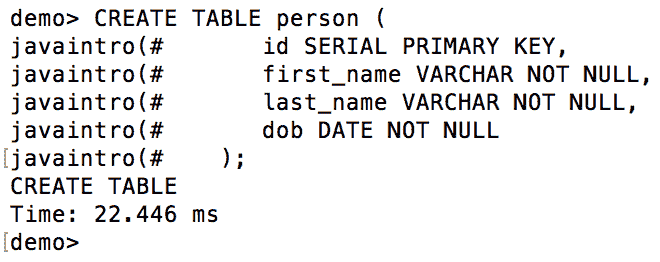
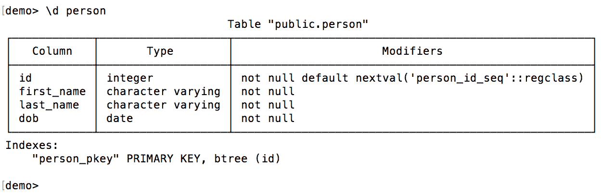
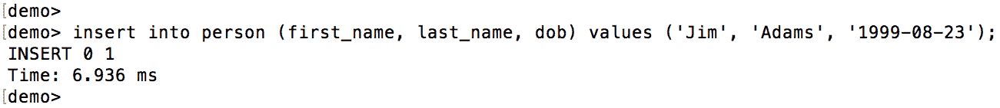

# 数据库编程

本章介绍如何编写 Java 代码，以操作数据库中的插入、读取、更新和删除数据。本文还简要介绍了 SQL 语言和基本数据库操作。

在本章中，我们将介绍以下主题：

*   什么是**Java 数据库连接**（**JDBC**）？
*   如何创建/删除数据库
*   **结构化查询语言**（**SQL**简介）
*   如何创建/删除/修改数据库表
*   **创建、读取、更新和删除**（**CRUD**数据库数据
*   练习–选择唯一的名字

# 什么是 Java 数据库连接（JDBC）？

**Java 数据库连接**（**JDBC**是允许我们访问和修改数据库中数据的 Java 功能。它由 JDBC API（即`java.sql`、`javax.sql`和`java.transaction.xa`包）以及每个数据库供应商提供的数据库访问接口（称为数据库驱动程序）的特定于数据库的实现所支持。

当人们说他们正在使用 JDBC 时，这意味着他们编写的代码使用 JDBCAPI 的接口和类以及知道如何将应用程序与特定数据库连接的特定于数据库的驱动程序来管理数据库中的数据。使用此连接，应用程序可以发出以**结构化查询语言**（**SQL**编写的请求。当然，我们在这里只讨论理解 SQL 的数据库。它们被称为关系数据库（或表格数据库），构成了当前使用的绝大多数数据库，不过也使用了一些替代数据库，例如导航数据库和 NoSql。

`java.sql`和`javax.sql`包包含在 Java 平台标准版（Java SE）中。过去，`java.sql`包属于 Java 核心，而`javax.sql`包被认为是核心扩展。但后来，`javax.sql`包也包含在核心中，并且没有更改名称以避免破坏使用它的现有应用程序。`javax.sql`包包含支持语句池、分布式事务和行集的`DataSource`接口。我们将在本章的以下章节中更详细地讨论这些特性。

使用数据库包括八个步骤：

1.  按照供应商的说明安装数据库。
2.  创建数据库用户、数据库和数据库模式—表、视图、存储过程等。
3.  使用特定于数据库的驱动程序将依赖项添加到`.jar`上的应用程序。
4.  从应用程序连接到数据库。
5.  构造一个 SQL 语句。
6.  执行 SQL 语句。
7.  使用执行的结果。
8.  释放（关闭）进程中打开的数据库连接和其他资源。

在运行应用程序之前的数据库设置中，步骤 1-3 只执行一次。应用程序根据需要重复执行步骤 4-8。步骤 5-7 可以使用相同的数据库连接重复多次。

# 连接到数据库

以下是连接到数据库的代码片段：

```
String URL = "jdbc:postgresql://localhost/javaintro";
Properties prop = new Properties( );
//prop.put( "user", "java" );
//prop.put( "password", "secretPass123" );
try {
  Connection conn = DriverManager.getConnection(URL, prop);
} catch(SQLException ex){
  ex.printStackTrace();
}
```

注释行显示如何使用`java.util.Properties`类为连接设置用户和密码。前面只是一个直接使用`DriverManger`类获取连接的示例。传入属性的许多键对于所有主要数据库都是相同的，但其中一些是特定于数据库的。因此，请阅读数据库供应商文档以了解这些详细信息。

或者，对于只传递用户和密码，我们可以使用重载版本`DriverManager.getConnection(String url, String user, String password)`。

对密码进行加密是一种很好的做法。我们不会告诉你怎么做，但是互联网上有很多指南。

连接数据库的另一种方式是使用`DataSource`接口。其实现包含在与数据库驱动程序相同的`.jar`中。对于 PostgreSQL，有两个类实现了`DataSource`接口：`org.postgresql.ds.PGSimpleDataSource`和`org.postgresql.ds.PGConnectionPoolDataSource`。我们可以用它们代替`DriverManager`。以下是使用`org.postgresql.ds.PGSimpleDataSource`类创建数据库连接的示例：

```
PGSimpleDataSource source = new PGSimpleDataSource();
source.setServerName("localhost");
source.setDatabaseName("javaintro");
source.setLoginTimeout(10);
Connection conn = source.getConnection();
```

要使用`org.postgresql.ds.PGConnectionPoolDataSource`类连接到数据库，我们只需要将前面代码中的第一行替换为以下内容：

```
PGConnectionPoolDataSource source = new PGConnectionPoolDataSource();
```

使用`PGConnectionPoolDataSource`类可以在内存中创建`Connection`对象池。这是一种首选方法，因为创建`Connection`对象需要时间。池允许我们提前完成，然后根据需要重用已经创建的对象。池大小等参数可在`postgresql.conf`文件中设置。

但是无论使用什么方法来创建数据库连接，我们都将把它隐藏在`getConnection()`方法中，并以相同的方式在所有代码示例中使用它。

获取了`Connection`类的对象后，我们现在可以访问数据库来添加、读取、删除或修改存储的数据。

# 关闭数据库连接

保持数据库连接处于活动状态需要大量的资源、内存和 CPU，因此最好在不再需要时关闭连接并释放分配的资源。在池的情况下，`Connection`对象在关闭时返回池并消耗更少的资源。

在 Java 7 之前，关闭连接的方法是在有或没有 catch 块的`finally`块中调用`close()`方法：

```
Connection conn = getConnection();
try {
  //use object conn here 
} finally {
  if(conn != null){
    conn.close();
  }
}
```

无论 try 块内的异常是否被抛出，`finally`-块内的代码始终被执行。但自从 Java7 以来，`try...with...resources`构造在任何实现`java.lang.AutoCloseable`或`java.io.Closeable`接口的对象上都能很好地完成这项工作。由于`java.sql.Connection`对象实现了`AutoCloseable`，我们可以将前面的代码段重写如下：

```
try (Connection conn = getConnection()) {
  //use object conn here
}
catch(SQLException ex) {
  ex.printStackTrace();
}
```

catch 子句是必需的，因为自动关闭的资源抛出`java.sql.SQLException`。有人可能会说，它在打字方面节省不了多少钱。但是`Connection`类的`close()`方法也可以抛出`SQLException`，所以带`finally`-block 的代码应该写得更加防御性：

```
Connection conn = getConnection();
try {
  //use object conn here 
} finally {
  if(conn != null){
    try {
      conn.close();
    } catch(SQLException ex){
      //do here what has to be done
    }
  }
}
```

前面的代码块看起来显然更像一个样板代码。然而，更重要的是，如果我们考虑到通常在`try`块中，其他一些代码也可以抛出`SQLException`，那么前面的代码应该如下所示：

```
Connection conn = getConnection();
try {
  //use object conn here 
} catch(SQLException ex) {
  ex.printStackTrace();
} finally {
  if(conn != null){
    try {
      conn.close();
    } catch(SQLException ex){
      //do here what has to be done
    }
  }
}
```

样板代码在增长，不是吗？这并不是故事的结局。在接下来的部分中，您将了解到，要发送数据库请求，还需要创建一个`java.sql.Statement`，它抛出`SQLException`，并且也必须关闭。然后，前面的代码会进一步增长：

```
Connection conn = getConnection();
try {
  Statement statement = conn.createStatement();
  try{
    //use statement here
  } catch(SQLException ex){
    //some code here
  } finally {
    if(statement != null){
      try {
      } catch (SQLException ex){
        //some code here
      }
    } 
  }
} catch(SQLException ex) {
  ex.printStackTrace();
} finally {
  if(conn != null){
    try {
      conn.close();
    } catch(SQLException ex){
      //do here what has to be done
    }
  }
}
```

现在，我们可以充分欣赏`try...with...resources`构造，特别是如果我们考虑到它允许我们在同一个子句中包含多个自动关闭的资源：

```
try (Connection conn = getConnection();
  Statement statement = conn.createStatement()) {
  //use statement here
} catch(SQLException ex) {
  ex.printStackTrace();
}
```

自 Java 9 以来，我们可以使其更加简单：

```
Connection conn = getConnection();
try (conn; Statement statement = conn.createStatement()) {
  //use statement here
} catch(SQLException ex) {
  ex.printStackTrace();
}
```

现在很明显，`try...with...resources`结构是一个轻而易举的赢家。

# 结构化查询语言（SQL）

SQL 是一种丰富的语言，我们没有足够的空间来涵盖它的所有特性。我们只想列举一些最流行的，所以你会意识到它们的存在，并可以根据需要查找它们。

与 Java 语句类似，还有一个 SQL 语句，它将数据库请求表示为英语中的完整句子。每个语句都可以在数据库控制台中执行，也可以通过使用 JDBC 连接的 Java 代码执行。在 Java 代码中使用 SQL 语句之前，程序员通常在控制台中测试 SQL 语句，因为控制台中的周转速度要快得多。使用控制台时不需要编译和执行程序。

有一些 SQL 语句可以创建和删除用户和数据库。我们将在下一节中看到此类声明的示例。还有其他与整个数据库相关的语句，不在本书的范围之内。

创建数据库后，以下三条 SQL 语句允许我们构建和更改数据库结构–表、函数、约束或其他数据库实体：

*   `CREATE`：此语句创建一个数据库实体
*   `ALTER`：此语句更改数据库实体
*   `DROP`：此语句删除一个数据库实体

还有各种 SQL 语句，允许我们查询每个数据库实体，这也超出了本书的范围。

有四种 SQL 语句可以操作数据库中的数据：

*   `INSERT`：此语句将数据添加到数据库中
*   `SELECT`：此语句从数据库中读取数据
*   `UPDATE`：此语句更改数据库中的数据
*   `DELETE`：此语句从数据库中删除数据

可以在前面的语句中添加一个或多个不同的子句，以标识所请求的数据（`WHERE`-子句）、返回结果的顺序（`ORDER`-子句）以及类似的内容。

一个连接或一个连接中的三个不同的 JDBC 语句的组合允许在一个数据库端提供以下三个不同的 SQL 语句：

*   `java.sql.Statement`：只需将语句发送到数据库服务器执行即可
*   `java.sql.PreparedStatement`：将语句缓存在数据库服务器的某个执行路径内，可以使用不同的参数高效执行多次
*   `java.sql.CallableStatement`：执行数据库中的存储过程

我们将从创建和删除数据库及其用户的语句开始演示。

# 创建数据库及其结构

查看如何下载和安装首选数据库服务器。数据库服务器是维护和管理数据库的软件系统。在我们的演示中，我们将使用 PostgreSQL，一个免费的、开源的数据库服务器。

安装数据库服务器后，我们将使用其控制台创建数据库及其具有相应权限的用户。有许多方法可以构建数据存储和具有不同访问级别的用户系统。在本书中，我们将只介绍基本的方法，它允许我们演示主要的 JDBC 功能。

# 创建并删除数据库及其用户

阅读数据库说明，首先创建`java`用户和`javaintro`数据库（或者选择您喜欢的任何其他名称，并在提供的代码示例中使用它们）。下面是我们为 PostgreSQL 所做的：

```
CREATE USER java SUPERUSER;
CREATE DATABASE javaintro OWNER java;
```

如果犯了错误并决定重新开始，可以使用以下语句删除创建的用户和数据库：

```
DROP USER java;
DROP DATABASE javaintro;
```

我们为用户选择了`SUPERUSER`角色，但良好的安全实践建议只将这样一个强大的角色分配给管理员。对于应用程序，建议创建一个不能创建或更改数据库本身及其表和约束，但只能管理数据的用户。此外，创建另一个名为**模式**的逻辑层也是一个很好的做法，它可以拥有自己的一组用户和权限。这样，可以隔离同一数据库中的多个模式，并且每个用户（其中一个是您的应用程序）只能访问某些模式。在企业级，通常的做法是为数据库模式创建同义词，以便任何应用程序都不能直接访问原始结构。

但是，正如我们已经提到的，就本书而言，它是不需要的，因此我们将其留给数据库管理员，由他们制定适合每个企业特定工作条件的规则和指南。

现在我们可以将应用程序连接到数据库。

# 创建、更改和删除表格

用于创建表的标准 SQL 语句如下所示：

```
CREATE TABLE tablename (
  column1 type1,
  column2 type2,
  column3 type3,
  ....
);
```

表名、列名和可使用的值类型的限制取决于特定的数据库。以下是在 PostgreSQL 中创建表 person 的命令示例：

```
CREATE TABLE person (
  id SERIAL PRIMARY KEY,
  first_name VARCHAR NOT NULL,
  last_name VARCHAR NOT NULL,
  dob DATE NOT NULL
);
```

如您所见，我们已使`dob`（出生日期）列不可为空。这对我们的`Person`Java 类施加了一个约束，该类将表示该表的记录：它的`dob`字段不能是`null`。这就是我们在[第 6 章](06.html)中所做的*接口、类和对象构造*，当我们创建`Person`类时，如下所示：

```
class Person {
  private String firstName, lastName;
  private LocalDate dob;
  public Person(String firstName, String lastName, LocalDate dob) {
    this.firstName = firstName == null ? "" : firstName;
    this.lastName = lastName == null ? "" : lastName;
    if(dob == null){
      throw new RuntimeException("Date of birth is null");
    }
    this.dob = dob;
  }
  public String getFirstName() { return firstName; }
  public String getLastName() { return lastName; }
  public LocalDate getDob() { return dob; }
}
```

我们没有设置`VARCHAR`类型的列的大小，因此允许这些列存储任意长度的值，而整数类型允许它们存储从公元前 4713 年到公元 5874897 年的数字。添加`NOT NULL`是因为默认情况下该列可以为空，虽然我们希望确保每个记录的所有列都已填充。我们的`Person`类通过将名字和姓氏设置为空`String`值（如果它们是`null`），作为`Person`构造函数的参数来支持它。

我们还将`id`列标识为`PRIMARY KEY`，这表明该列唯一标识了该记录。`SERIAL`关键字意味着每次添加新记录时，我们都会要求数据库生成下一个整数值，因此每个记录都有一个唯一的整数。或者，我们可以从`first_name`、`last_name`和`dob`的组合中制作`PRIMARY KEY`：

```
CREATE TABLE person (
  first_name VARCHAR NOT NULL,
  last_name VARCHAR NOT NULL,
  dob DATE NOT NULL,
  PRIMARY KEY (first_name, last_name, dob)
);
```

但是有一种可能性是，有两个人同名，并且出生在同一天，因此我们决定不这样做，并在`Person`类中添加了另一个字段和构造函数：

```
public class Person {
  private String firstName, lastName;
  private LocalDate dob;
  private int id;
  public Person(int id, String firstName, 
                                  String lastName, LocalDate dob) {
    this(firstName, lastName, dob);
    this.id = id;
  }   
  public Person(String firstName, String lastName, LocalDate dob) {
    this.firstName = firstName == null ? "" : firstName;
    this.lastName = lastName == null ? "" : lastName;
    if(dob == null){
      throw new RuntimeException("Date of birth is null");
    }
    this.dob = dob;
  }
  public String getFirstName() { return firstName; }
  public String getLastName() { return lastName; }
  public LocalDate getDob() { return dob; }
}
```

我们将使用接受`id`的构造函数基于数据库中的记录构造对象，而另一个构造函数将用于在插入新记录之前创建对象。

我们在数据库控制台中运行前面的 SQL 语句并创建此表：



如有必要，可通过`DROP`命令删除该表：

```
DROP table person;
```

可以使用`ALTER`命令更改现有表。例如，我们可以添加一个`address`列：

```
ALTER table person add column address VARCHAR;
```

如果不确定该列是否已存在，可以添加“如果存在”或“如果不存在”：

```
ALTER table person add column IF NOT EXISTS address VARCHAR;
```

但这种可能性只有在 PostgreSQL 9.6 之后才存在。

创建数据库表的另一个重要考虑因素是是否必须添加索引。索引是一种数据结构，它有助于加速表中的数据搜索，而不必检查每个表记录。索引可以包括表的一列或多列。例如，主键的索引是自动创建的。如果调出我们已经创建的表的说明，您将看到：



如果我们认为（并通过实验证明）索引有助于提高应用程序的性能，我们也可以自己添加任何索引。例如，通过添加以下索引，我们可以允许按名字和姓氏进行不区分大小写的搜索：

```
CREATE INDEX idx_names ON person ((lower(first_name), lower(last_name));
```

如果搜索速度提高，我们会保留索引。如果没有，则可以将其删除：

```
drop index idx_names;
```

我们删除它是因为索引有额外写入和存储空间的开销。

我们也可以从表中删除一列：

```
ALTER table person DROP column address;
```

在我们的示例中，我们遵循 PostgreSQL 的命名约定。如果使用不同的数据库，我们建议您查找其命名约定并遵循它，以便创建的名称与自动创建的名称对齐。

# 创建、读取、更新和删除（CRUD）数据

到目前为止，我们已经使用控制台向数据库发送 SQL 语句。同样的语句可以使用 JDBCAPI 从 Java 代码中执行，但表只创建一次，因此编写一次性执行的程序没有多大意义。

但管理数据是另一回事。这就是我们现在要编写的程序的主要目的。为了做到这一点，首先，我们在`pom.xml`文件中添加了以下依赖项，因为我们已经安装了 PostgreSQL 9.6：

```
<dependency>
  <groupId>org.postgresql</groupId>
  <artifactId>postgresql</artifactId>
  <version>42.2.2</version>
</dependency>
```

# 插入语句

在数据库中创建（填充）数据的 SQL 语句具有以下格式：

```
INSERT INTO table_name (column1,column2,column3,...)
   VALUES (value1,value2,value3,...);
```

当必须添加多个表记录时，如下所示：

```
INSERT INTO table_name (column1,column2,column3,...)
 VALUES (value1,value2,value3,...), (value11,value21,value31,...), ...;
```

在编写程序之前，让我们测试一下我们的`INSERT`语句：



它工作正常，返回的插入行数为 1，因此我们将创建以下方法：

```
void executeStatement(String sql){
  Connection conn = getConnection();
  try (conn; Statement st = conn.createStatement()) {
    st.execute(sql);
  } catch (SQLException ex) {
    ex.printStackTrace();
  }
}
```

我们可以执行前面的方法并插入另一行：

```
executeStatement("insert into person (first_name, last_name, dob)" +
                             " values ('Bill', 'Grey', '1980-01-27')");
```

我们将在下一节演示`SELECT`-语句时看到此语句和上一个`INSERT`-语句执行的结果。

同时，我们想讨论一下`java.sql.Statement`接口最流行的方式：

*   `boolean execute(String sql)`：如果执行语句返回可以通过`java.sql.Statement`接口的`ResultSet getResultSet()`方法检索的数据（作为`java.sql.ResultSet`对象），则返回`true`。如果执行的语句没有返回数据（SQL 语句可能正在更新或插入一些行），则返回`false`，随后调用`java.sql.Statement`接口的`int getUpdateCount()`方法返回受影响的行数。例如，如果我们在`executeStatement()`方法中添加了 print 语句，插入一行后会看到以下结果：

```
        void executeStatement(String sql){
          Connection conn = getConnection();
          try (conn; Statement st = conn.createStatement()) {
            System.out.println(st.execute(sql));      //prints: false
            System.out.println(st.getResultSet());    //prints: null
            System.out.println(st.getUpdateCount());  //prints: 1
          } catch (SQLException ex) {
            ex.printStackTrace();
          }
        }
```

*   `ResultSet executeQuery(String sql)`：以`java.sql.ResultSet`对象的形式返回数据（执行的 SQL 语句应该是`SELECT`-语句）。同样的数据也可以通过后续调用`java.sql.Statement`接口的`ResultSet getResultSet()`方法进行检索。`java.sql.Statement`接口的`int getUpdateCount()`方法返回`-1`。例如，如果我们更改我们的`executeStatement()`方法并使用`executeQuery()`，则`executeStatement("select first_name from person")`的结果将是：

```
        void executeStatement(String sql){
          Connection conn = getConnection();
          try (conn; Statement st = conn.createStatement()) {
             System.out.println(st.executeQuery(sql)); //prints: ResultSet
             System.out.println(st.getResultSet());    //prints: ResultSet
             System.out.println(st.getUpdateCount());  //prints: -1
          } catch (SQLException ex) {
             ex.printStackTrace();
          }
        }
```

*   `int executeUpdate(String sql)`：返回受影响行数（执行的 SQL 语句预计为`UPDATE`-语句）。相同的号码返回对`java.sql.Statement`接口的`int getUpdateCount()`方法的后续调用。对`java.sql.Statement`接口的`ResultSet getResultSet()`方法的后续调用返回`null`。例如，如果我们更改我们的`executeStatement()`方法并使用`executeUpdate()`，则`executeStatement("update person set first_name = 'Jim' where last_name = 'Adams'")`的结果将是：

```
        void executeStatement4(String sql){
          Connection conn = getConnection();
          try (conn; Statement st = conn.createStatement()) {
            System.out.println(st.executeUpdate(sql));//prints: 1
            System.out.println(st.getResultSet());    //prints: null
            System.out.println(st.getUpdateCount());  //prints: 1
          } catch (SQLException ex) {
            ex.printStackTrace();
          }
        }
```

# SELECT 语句

`SELECT`-语句的格式如下：

```
SELECT column_name, column_name
FROM table_name WHERE some_column = some_value;
```

当必须选择所有列时，如下所示：

```
SELECT * FROM table_name WHERE some_column=some_value;
```

以下是`WHERE`条款的更一般定义：

```
WHERE column_name operator value
Operator:
   =   Equal
   <>  Not equal. In some versions of SQL, !=
   >   Greater than
   <   Less than
   >=  Greater than or equal
   <=  Less than or equal
   IN  Specifies multiple possible values for a column
   LIKE  Specifies the search pattern
   BETWEEN  Specifies the inclusive range of vlaues in a column
```

`column_name`运算符值构造可以使用`AND`和`OR`逻辑运算符组合，并通过括号`( )`分组。

在前面的语句中，我们执行了一个`select first_name from person`SELECT 语句，返回`person`表中记录的所有名字。现在，让我们再次执行它并打印出结果：

```
Connection conn = getConnection();
try (conn; Statement st = conn.createStatement()) {
  ResultSet rs = st.executeQuery("select first_name from person");
  while (rs.next()){
    System.out.print(rs.getString(1) + " "); //prints: Jim Bill
  }
} catch (SQLException ex) {
  ex.printStackTrace();
}
```

`ResultSet`接口的`getString(int position)`方法从`1`位置（在`SELECT`-语句的列列表中的第一个）提取`String`值。所有基元类型都有类似的 getter，例如`getInt()`和`getByte()`。

也可以按列名从`ResultSet`对象中提取值。在我们的例子中，它将是`getString("first_name")`。当`SELECT`-语句如下所示时，它特别有用：

```
select * from person;
```

但请记住，按列名从`ResultSet`对象中提取值的效率较低。性能上的差异非常小，只有在多次操作时才会变得重要。只有实际的测量和测试才能判断差异是否对您的应用有意义。按列名提取值特别有吸引力，因为它提供了更好的代码可读性，这在应用程序维护期间花费了很长时间。

`ResultSet`接口中还有许多其他有用的方法。如果您的应用程序从数据库读取数据，我们强烈建议您阅读`SELECT`-语句和`ResultSet`接口的文档。

# 更新语句

数据可以通过`UPDATE`-语句进行更改：

```
UPDATE table_name SET column1=value1,column2=value2,... WHERE-clause;
```

我们已使用此语句将其中一条记录中的名字从原始值`John`更改为新值`Jim`：

```
update person set first_name = 'Jim' where last_name = 'Adams'
```

稍后，使用`SELECT`-语句，我们将证明更改是成功的。如果没有`WHERE`-子句，表中的所有记录都会受到影响。

# 删除语句

可通过`DELETE`-语句删除数据：

```
DELETE FROM table_name WHERE-clause;
```

如果没有`WHERE`-子句，则删除表中的所有记录。对于`person`表，我们可以使用`delete from person`SQL 语句删除所有记录。以下语句从`person`表中删除名为 Jim 的所有记录：

```
delete from person where first_name = 'Jim';
```

# 使用 PreparedStatement 类

`PreparedStatement`的一个对象`Statement`接口的一个子接口被设计为缓存在数据库中，然后用于针对不同的输入值多次高效地执行 SQL 语句。类似于`Statement`的一个对象（通过`createStatement()`方法创建），可以通过相同`Connection`对象的`prepareStatement()`方法创建。

用于生成`Statement`对象的 SQL 语句也可以用于生成`PreparedStatement`对象。事实上，对于任何多次调用 SQL 语句来说，使用 Oracle T2At 是一个好主意，因为它的性能比 AutoT3T 更好。为此，我们只需更改前面示例代码中的以下两行：

```
try (conn; Statement st = conn.createStatement()) {
  ResultSet rs = st.executeQuery(sql);
```

或者，我们可以用同样的方式使用`PreparedStatement`类：

```
try (conn; PreparedStatement st = conn.prepareStatement(sql)) {
  ResultSet rs = st.executeQuery();
```

但`PreparedStatement`的真正用处在于其接受参数的能力，即替代`?`符号（按其出现顺序）的输入值。例如，我们可以创建以下方法：

```
List<Person> selectPersonsByFirstName(String sql, String searchValue){
  List<Person> list = new ArrayList<>();
  Connection conn = getConnection();
  try (conn; PreparedStatement st = conn.prepareStatement(sql)) {
    st.setString(1, searchValue);
    ResultSet rs = st.executeQuery();
    while (rs.next()){
      list.add(new Person(rs.getInt("id"),
               rs.getString("first_name"),
               rs.getString("last_name"),
               rs.getDate("dob").toLocalDate()));
    }
  } catch (SQLException ex) {
    ex.printStackTrace();
  }
  return list;
}
```

我们可以使用前面的方法从`person`表中读取与`WHERE`子句匹配的记录。例如，我们可以找到所有名为`Jim`的记录：

```
String sql = "select * from person where first_name = ?";
List<Person> list = selectPersonsByFirstName(sql, "Jim");
for(Person person: list){
  System.out.println(person);
}
```

结果将是：

```
Person{firstName='Jim', lastName='Adams', dob=1999-08-23, id=1}
```

`Person`对象是这样打印的，因为我们增加了以下`toString()`方法：

```
@Override
public String toString() {
  return "Person{" +
          "firstName='" + firstName + '\'' +
          ", lastName='" + lastName + '\'' +
          ", dob=" + dob +
          ", id=" + id +
          '}';
}
```

运行以下代码将得到相同的结果：

```
String sql = "select * from person where last_name = ?";
List<Person> list = selectPersonsByFirstName(sql, "Adams");
for(Person person: list){
    System.out.println(person);
}
```

对于 CRUD 操作，始终使用准备好的语句不是一个坏主意。如果只执行一次，它们可能会稍微慢一点，但您可以进行测试，看看这是否是您愿意支付的价格。准备好的语句所得到的是一致（可读性更好）的代码、更高的安全性（准备好的语句不易受到 SQL 注入攻击）以及更少的决策——只要在任何地方重用相同的代码即可。

# 练习–选择唯一的名字

编写一条 SQL 语句，从 person 表中选择所有不重复的姓名。例如，假设`person`表中有三条记录的名字是：`Jim`、`Jim`和`Bill`。您编写的 SQL 语句必须返回`Jim`和`Bill`，且不得重复名称`Jim`两次。

我们没有解释怎么做；您必须阅读 SQL 文档以了解如何选择唯一值。

# 答复

使用`distinct`关键字。以下 SQL 语句返回唯一的名字：

```
select distinct first_name from person;
```

# 总结

本章介绍了如何编写 Java 代码来操作数据库中的插入、读取、更新和删除数据。它还简要介绍了 SQL 语言和基本数据库操作。读者已经了解了什么是 JDBC，如何创建和删除数据库和表，以及如何编写管理表中数据的程序。

在下一章中，读者将学习函数式编程的概念。我们将概述 JDK 附带的函数接口，解释如何在 lambda 表达式中使用它们，并了解如何在数据流处理中使用 lambda 表达式。