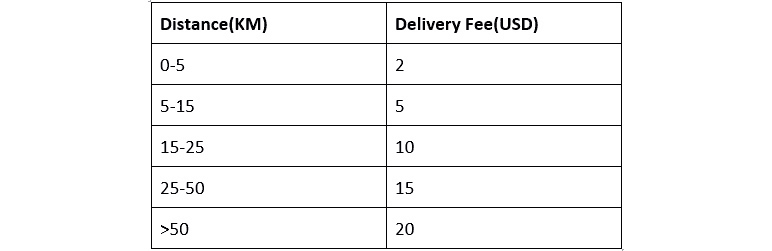
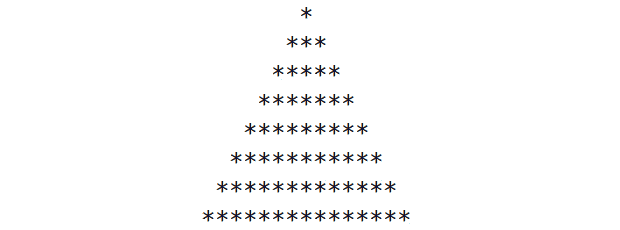

# 三、控制流程

## 学习目标

本课程结束时，您将能够：

*   使用 Java 中的**if**和**else**语句控制执行流
*   使用 Java 中的 switch case 语句检查多个条件
*   利用 Java 中的循环结构编写简洁的代码来执行重复操作

## 导言

到目前为止，我们已经研究了由 Java 编译器顺序执行的一系列语句组成的程序。但是，在某些情况下，我们可能需要根据程序的当前状态执行操作。

考虑安装在 ATM 机中的软件的例子，它执行一组动作，也就是说，当用户输入的 PIN 是正确的时，它允许事务发生。但是，当输入的 PIN 不正确时，软件将执行另一组操作，即通知用户 PIN 不匹配，并要求用户重新输入 PIN。您会发现，几乎所有真实世界的程序中都存在这种依赖于值或阶段的逻辑结构。

有时可能需要重复执行特定任务，也就是说，在特定的持续时间内，在特定的设定次数内，或者直到满足某个条件为止。继续我们的 ATM 机示例，如果输入错误密码的次数超过三次，则卡将被阻止。

当我们朝着用 Java 构建复杂程序的方向前进时，这些逻辑结构充当构建块。本课程将深入探讨这些基本构造，这些构造可分为两类，如下所示：

*   条件语句
*   循环语句

## 条件语句

条件语句用于根据特定条件控制 Java 编译器的执行流。这意味着我们正在根据某个值或程序的状态进行选择。Java 中可用的条件语句如下：

*   **if**语句
*   **if else**语句
*   **else if**语句
*   **开关**语句

### if 语句

if 语句测试一个条件，当该条件为 true 时，执行 if 块中包含的代码。如果条件不为 true，则跳过块中的代码，并从块后的行继续执行。

**if**语句的语法如下：

```java
if (condition) {
//actions to be performed when the condition is true
}
```

考虑下面的例子：

```java
int a = 9;
if (a < 10){
System.out.println("a is less than 10");
}
```

由于条件**a<10**为真，因此执行打印语句。

我们也可以在**if**条件下检查多个值。考虑下面的例子：

```java
if ((age > 50) && (age <= 70) && (age != 60)) {
System.out.println("age is above 50 but at most 70 excluding 60");
}
```

前面的代码片段检查**age**的值是否大于 50，但不超过 70，不包括 60。

当**if**块中的语句只有一行时，我们不需要包含括号：

```java
if (color == 'Maroon' || color == 'Pink')
System.out.println("It is a shade of Red");
```

### else 语句

对于某些场景，如果**if**条件失败，我们需要执行不同的代码块。为此，我们可以使用**else**子句。它是可选的。

**if else**语句的语法如下：

```java
if (condition) {
//actions to be performed when the condition is true
}
else {
//actions to be performed when the condition is false
}
```

### 练习 6：实现简单的 if-else 语句

在本练习中，我们将创建一个程序来检查是否可以根据空座位的数量预订公共汽车票。完成以下步骤以执行此操作：

1.  右键点击**src**文件夹，选择**新建****类**。
2.  输入**预订**作为类名，然后点击**确定**。
3.  设置**主**方式：

    ```java
    public class Booking{
    public static void main(String[] args){
    }
    }
    ```

4.  初始化两个变量，一个用于空座位数，另一个用于请求的票号：

    ```java
    int seats = 3; // number of empty seats
    int req_ticket = 4; // Request for tickets
    ```

5.  使用**if**条件检查请求的票号是否低于或等于可用的空位，并打印相应的消息：

    ```java
    if( (req_ticket == seats) || (req_ticket < seats) ) {
         System.out.print("This booing can be accepted");
         }else
             System.out.print("This booking is rejected");
    ```

6.  Run the program.

    您应该获得以下输出：

    ```java
    This booking is rejected
    ```

### else if 语句

在评估**else**子句之前，当我们希望比较多个条件时，如果使用语句，则使用**else。**

**else if**语句的语法如下：

```java
if (condition 1) {
//actions to be performed when condition 1 is true
}
else if (Condition 2) {
//actions to be performed when condition 2 is true
}
else if (Condition 3) {
//actions to be performed when condition 3 is true
}
…
…
else if (Condition n) {
//actions to be performed when condition n is true
}
else {
//actions to be performed when the condition is false
}
```

### 练习 7：实现 else if 语句

我们正在构建一个电子商务应用程序，根据卖家和买家之间的距离计算配送费用。买家在我们的网站上购买商品并输入送货地址。根据距离，我们计算配送费用并将其显示给用户。在本练习中，下表给出了我们，我们需要编写一个程序来向用户输出交付费用：



###### 表 3.1：显示距离及其相应费用的表

为此，请执行以下步骤：

1.  右键点击**src**文件夹，选择**新建****类**。
2.  输入**送货费**作为类名，然后点击**确定**。
3.  打开创建的类，然后创建主方法：

    ```java
    public class DeliveryFee{
    public static void main(String[] args){
    }
    }
    ```

4.  在**main**方法中，创建两个整数变量，一个称为**距离**，另一个称为**费用**。这两个变量将分别包含**距离**和送货费。将 di**姿态**初始化为 10，**费用**初始化为零：

    ```java
    int distance = 10;
    int fee = 0;
    ```

5.  Create an **if** block to check the first condition in the table:

    ```java
    if (distance > 0 && distance < 5){
       fee = 2;
    }
    ```

    此**if**语句检查**距离**是否大于 0 但小于 5，并将**费用**设置为 2 美元。

6.  添加一个**else if**语句来检查表中的第二个条件，并将**费用**设置为 5 美元：

    ```java
    else if (distance >= 5 && distance < 15){
       fee = 5;
    }
    ```

7.  增加两条**else if**语句检查表中的第三条和第四条条件，如下代码所示：

    ```java
    else if (distance >= 15 && distance < 25){
       fee = 10;
    }else if (distance >= 25 && distance < 50){
       fee = 15;
    }
    ```

8.  最后，添加一个**else**语句以匹配表中的最后一个条件，并设置适当的交付**费用**：

    ```java
    else {
       fee = 20;
    }
    ```

9.  打印出费用的价值：

    ```java
    System.out.println("Delivery Fee: " + fee);
    ```

10.  运行程序并观察输出：

    ```java
    Delivery Fee: 5
    ```

### 嵌套的 if 语句

我们可以在其他**if**语句中包含**if**语句。此构造称为嵌套的**if**语句。我们首先评估外部条件，如果成功，然后评估第二个内部**if**语句，依此类推，直到所有**if**语句都完成：

```java
if (age > 20){

   if (height > 170){

       if (weight > 60){
           System.out.println("Welcome");
       }    
   }
}
```

我们可以嵌套任意多的语句，编译器将从上往下计算它们。

### 开关箱说明书

**switch case**语句是一种更简单、更简洁的方法，可以在比较相同值是否相等时执行多个**if****else**语句。下面是一个快速比较：

传统的**else if**语句如下：

```java
if(age == 10){
   discount = 300;
} else if (age == 20){
   discount = 200;
} else if (age == 30){
   discount = 100;
} else {
   discount = 50;
}
```

但是，使用相同的逻辑，当使用**switch case**语句实现时，它将如下所示：

```java
switch (age){
   case 10:
       discount = 300;
   case 20:
       discount = 200;
   case 30:
       discount = 100;
   default:
       discount = 50;
}
```

注意这段代码的可读性。

要使用**switch**语句，首先需要使用关键字**switch**声明它，然后在括号中声明一个条件。**案例**语句用于检查这些条件。它们是按顺序检查的。

编译器将根据所有案例检查**age**的值，如果找到匹配项，则该**案例**中的代码将执行，随后的所有案例也将执行。例如，如果我们的**年龄**等于 10，则将匹配第一个**案例**，然后匹配第二个**案例**，第三个**案例**，以及**默认****案例**。如果所有其他案例都不匹配，则执行**默认****案例**。例如，如果**年龄**不是 10、20 或 30，则折扣将设置为 50。可以理解为**if-else**语句中的**else**子句。**默认****案例**是可选的，可以省略。

如果**年龄**等于 30，则匹配并执行第三个**案例**。由于**默认****案例**是可选的，我们可以省略它，执行将在第三**案例**后结束。

大多数时候，我们真正希望的是在匹配的**案例**处结束死刑。我们希望这样，如果第一个**案例**匹配，那么该**案例**中的代码将被执行，其余案例将被忽略。为了实现这一点，我们使用一个**break**语句来告诉编译器继续在**switch**语句之外执行。下面是同一个**开关箱**和**断路**语句：

```java
switch (age){
   case 10:
       discount = 300;
       break;
   case 20:
       discount = 200;
       break;
   case 30:
       discount = 100;
       break;
   default:
       discount = 50;
}
```

因为默认值是最后一个**案例**，我们可以安全地忽略**break**语句，因为执行无论如何都会在那里结束。

#### 注:

始终添加 break 语句是一种很好的设计，以防其他程序员将来添加额外的用例。

### 活动 6：使用条件控制执行流

工厂每小时付给工人 10 美元。标准工作日为 8 小时，但工厂对额外工作时间给予额外补偿。计算工资所遵循的政策如下：

*   如果一个人工作时间少于 8 小时–小时数*$10
*   如果员工工作时间超过 8 小时，但不足 12–20%的额外工作时间
*   超过 12 小时–计入额外的一天工资

创建一个程序，根据工作小时数计算并显示工人赚取的工资。

要满足此要求，请执行以下步骤：

1.  初始化两个变量以及工时和工资的值。
2.  在**如果**条件下，检查工人的工作时间是否低于要求的时间。如果条件为**true**，则工资应为（工作时间*10）。
3.  使用**else if**语句检查工作时间是否在 8 小时到 12 小时之间。如果这是真的，那么前八个小时的工资应按每小时 10 美元计算，其余的小时应按每小时 12 美元计算。
4.  使用**else**块，默认每天 160 美元（额外一天的工资）。
5.  Execute the program to observe the output.

    #### 笔记

    有关此活动的解决方案，请参见第 308 页。

### 活动 7：开发温度系统

用 Java 编写一个程序，根据温度显示简单消息。温度可概括为以下三个部分：

*   高：在这种情况下，建议用户使用防晒霜
*   低：在这种情况下，建议用户穿外套
*   潮湿：在这种情况下，建议用户打开窗口

要执行此操作，请执行以下步骤：

1.  声明两个字符串，**温度**和**天气警告**。
2.  用**高**、**低**或**湿**初始化**温度**。
3.  创建一个 switch 语句，检查**temp**的不同情况。
4.  将变量**weatherWarning**初始化为适用于每种温度情况的相应消息（**高**、**低**、**潮湿**。
5.  默认情况下，将**weatherWarning**初始化为“天气看起来不错，出去走走”。
6.  完成开关构造后，打印**weatherWarning**的值。
7.  Run the program to see the output, it should be similar to:

    ```java
    Its cold outside, do not forget your coat.
    ```

    #### 笔记

    有关此活动的解决方案，请参见第 309 页。

## 循环构造

循环构造用于在满足条件的情况下执行给定次数的特定操作。它们通常用于对列表项执行特定操作。例如，当我们想求从 1 到 100 的所有数字的总和时。Java 支持以下循环构造：

*   **用于**回路
*   每个回路的
***   **而**循环*   **边做边做**循环**

 **### 用于循环

循环的**语法如下：**

```java
for( initialization ; condition ; expression) {
    //statements
}
```

初始化语句在循环的**开始执行时执行。它可以是多个表达式，都用逗号分隔。表达式必须全部为同一类型：**

```java
for( int i  = 0, j = 0; i <= 9; i++)
```

循环的**条件部分的计算结果必须为真或假。如果没有表达式，则条件默认为 true。**

表达式部分在语句的每次迭代后执行，只要条件为 true。可以有多个用逗号分隔的表达式。

#### 笔记

表达式必须是有效的 Java 表达式，即可以用分号终止的表达式。

以下是循环的**是如何工作的：**

1.  首先，对初始化进行评估。
2.  然后，检查条件。如果条件为 true，则执行块的**中包含的语句。**
3.  执行语句后，将执行表达式，然后再次检查条件。
4.  如果仍然不是 false，则再次执行语句，然后执行表达式，并再次计算条件。
5.  重复此操作，直到条件评估为 false。
6.  当条件评估为 false 时，循环的**完成，循环后的代码段执行。**

### 练习 8：实现一个简单的 for 循环

要按递增和递减顺序打印所有单个数字，请执行以下步骤：

1.  右键点击**src**文件夹，选择**新建****类**。
2.  输入**循环**作为类名，然后点击**确定**。
3.  设置**主**方式：

    ```java
    public class Looping
    {
       public static void main(String[] args) {
       }
    }
    ```

4.  为将变量**i**初始化为零的循环执行一个**，条件是该值保持在 10 以下，并且**i**应在每次迭代中递增一：

    ```java
    System.out.println("Increasing order");
    for( int i  = 0; i <= 9; i++)
    System.out.println(i);
    ```** 
5.  Implement another **for** loop that initializes a variable **k** at 9, a condition so that the value remains above 0, and **k** should be decremented by one in each iteration:

    ```java
    System.out.println("Decreasing order");
    for( int k  = 9; k >= 0; k--)
    System.out.println(k);
    ```

    输出：

    ```java
    Increasing order 
    0
    1
    2
    3
    4
    5
    6
    7
    8
    9
    Decreasing order
    9
    8
    7
    6
    5
    4
    3
    2
    1
    0
    ```

### 活动 8：实现 for 循环

约翰是个桃农，他从树上摘下桃子，把它们放进水果盒里，然后运出去。如果一个水果盒装满了 20 个桃子，他就可以装运。如果他只有不到 20 个桃子，他必须采更多的桃子，这样他就可以用 20 个桃子装满一个水果盒，然后装运。

我们想通过编写一个自动化软件来帮助 John，该软件启动箱子的填充和装运。我们从约翰那里得到了桃子的数量，我们为每组 20 个桃子打印了一条信息，并说明到目前为止已经装运了多少个桃子。例如，我们为第三个盒子打印“迄今为止已发货 60 个桃子”。我们希望通过**for**循环来实现这一点。我们不必担心剩下的桃子。为此，请执行以下步骤：

1.  新建一个类，输入**PeachBoxCounter**作为类名
2.  导入**java.util.Scanner**包：
3.  在**main（）**中，使用**System.out.print**向用户查询**numberOfPeaches**。
4.  编写一个 for 循环，计算到目前为止已发货的桃子数量。这从零开始，增加 20 乘 20，直到剩下的桃子少于 20。
5.  在循环的**中，打印到目前为止已发货的桃子数量。**
6.  Run the main program.

    输出应类似于：

    ```java
    Enter the number of peaches picked: 42
    shipped 0 peaches so far
    shipped 20 peaches so far
    shipped 40 peaches so far  
    ```

    #### 笔记

    此活动的解决方案见第 310 页。

回路的**的所有三个部分都是可选的。这意味着（；）**的行**将提供任何错误。它只提供了一个 invite 循环。**

这个循环的**没有任何作用，也不会终止。在 for 循环声明中声明的变量在**for**循环的语句中可用。例如，在我们的第一个示例中，我们从语句部分打印了**i**的值，因为变量**i**是在**中为**循环声明的。但是，该变量在**循环的**之后不可用，可以自由声明。但是不能在**循环的**中再次声明：**

```java
for (int i = 0; i <= 9; i++)
   int i  = 10;            //Error, i is already declared
```

如果有多条语句，For 循环也可以用大括号括住这些语句。这正如我们在前面的**if-else**语句中所讨论的。如果我们只有一个语句，那么就不需要大括号。当语句不止一个时，它们需要用大括号括起来。在下面的示例中，我们正在打印出**i**和**j**的值：

```java
for (int i = 0, j = 0; i <= 9; i++, j++) {
   System.out.println(i);
   System.out.println(j);
}
```

#### 笔记

表达式必须是有效的 Java 表达式，即可以用分号终止的表达式。

**break**语句可用于中断循环的**并中断循环。它在**循环的**之外执行。**

例如，如果**i**等于 5，我们可能希望终止前面创建的循环的**：**

```java
for (int i = 0; i <= 9; i++){

   if (i == 5)
       break;
   System.out.println(i);
}
```

输出：

```java
0
1
2
3
4
```

前面的循环的**从 0、1、2 和 3 迭代，并在 4 终止。这是因为在满足条件**i**即 5 之后，执行 break 语句，从而结束**循环的**及其之后的语句不执行。在循环之外继续执行。**

**continue**语句用于告诉循环跳过它之后的所有其他语句，并继续执行到下一个迭代：

```java
for (int i = 0; i <= 9; i++){
   if (i == 5)
       continue;
   System.out.println(i);
}
```

输出：

```java
0
1
2
3
4
6
7
8
9
```

不会打印数字 5，因为一旦遇到 continue 语句，就会忽略它之后的其余语句，并开始下一次迭代。在处理多个项目时，如果您希望跳过一些异常，**continue**语句非常有用。

### 嵌套 for 循环

一个循环中的语句块可以是另一个循环。这种构造称为嵌套循环：

```java
public class Nested{
     public static void main(String []args){
        for(int i = 1; i <= 3; i++) {
   //Nested loop
   for(int j = 1; j <= 3; j++) {
       System.out.print(i + "" + j);
       System.out.print("\t");
   }
   System.out.println();
}
     }
}
```

输出：

```java
11    12    13
21    22    23
31    32    33
```

对于**i**的每个单回路，我们循环**j**三次。对于循环，您可以将这些**考虑如下：**

重复**i**三次，每次重复重复**j**三次。这样，我们总共有 9 次**j**的迭代。对于**j**的每次迭代，我们都会打印出**i**和**j**的值。

### 练习 9：实现嵌套 for 循环

我们在本练习中的目标是打印具有七行的*金字塔，如下所示：



###### 图 3.1：七行*金字塔

要实现此目标，请执行以下步骤：

1.  右键点击**src**文件夹，选择**新建****类**。
2.  输入**嵌套模式**作为类名，然后点击**确定**。
3.  在主方法中，为创建一个**循环，将变量**i**初始化为 1，引入条件使**i**的值最多为 15，并将**i**的值增加 2:

    ```java
    public class NestedPattern{ 
    public static void main(String[] args) {
    for (int i = 1; i <= 15; i += 2) {
    }
    }
    }
    }
    ```** 
4.  在这个循环中，为循环再创建两个**，一个用于打印空格，另一个用于打印*：

    ```java
    for (int k = 0; k < (7 - i / 2); k++) {
       System.out.print(" ");
       }
    for (int j = 1; j <= i; j++) {
       System.out.print("*");
       }
    ```** 
5.  Within the outer **for** loop, add the following code to add the next line:

    ```java
    System.out.println();
    ```

    运行程序。您将看到结果金字塔。

### 对于每个回路

每个循环的**都是在 Java5 中引入的**循环的**的高级版本。它们用于对数组或项目列表中的每个项目执行给定操作。**

让我们来看看这个关于 Ty1 T1 循环的 To0T0。

```java
int[] arr = { 1, 2, 3, 4, 5 , 6, 7, 8, 9,10};
for (int i  = 0; i < 10; i++){
   System.out.println(arr[i]);
}
```

第一行声明一个整数数组。数组是相同类型项的集合。在本例中，变量 arr 包含 10 个整数的集合。然后我们使用**作为**循环，从**0**到**10**，打印此阵列的元素。我们使用**i<10**，因为最后一项位于索引**9**，而不是**10**。这是因为数组的元素以索引 0 开头。第一个元素位于索引**0**，第二个元素位于索引**1**，第三个元素位于**2**，以此类推。**arr[0]**将返回第一个元素、**arr[1]**第二个元素、**arr[2]**第三个元素，依此类推。

环路的**可以替换为每个**环路的较短**。每个**循环的**语法如下：**

```java
for( type item : array_or_collection){
    //Code to executed for each item in the array or collection
}
```

对于前面的示例，每个循环的**如下所示：**

```java
for(int item : arr){
   System.out.println(item);
}
```

**int****项**是我们所在阵列中的当前元素。每个循环的**将对数组中的所有元素进行迭代。在大括号内，我们打印出项目。请注意，我们不必像前面的**for**循环那样使用**arr[i】**。这是因为每个**循环的**会自动为我们提取值。此外，我们不必使用额外的**int****i**来保持当前索引并检查我们是否低于**10****（i<10**，就像我们之前使用的**循环中的**一样。**对于每一个**循环都更短，并自动为我们检查范围。**

例如，我们可以为每个循环使用**来打印阵列中所有元素的平方，**arr**：**

```java
for(int item : arr){
   int square = item * item;
   System.out.println(square);
}
```

输出：

```java
1
4
9
16
25
36
49
64
81
10
```

### while 和 do while 循环

有时，我们希望重复执行某些语句，也就是说，只要某个布尔条件为真。这种情况要求我们使用**while**循环或**do while**循环。**while**循环首先检查布尔语句，如果布尔值为 true，则执行代码块，否则跳过**while**块。**do while**循环首先执行一次代码块，然后再检查布尔条件。如果希望代码至少执行一次，请使用**do while**循环；如果希望在第一次执行之前先检查布尔条件，请使用**while**循环。以下是**while**和**do while**循环的格式：

**while**循环的语法：

```java
while(condition) {
//Do something
}
```

**do while**循环的语法：

```java
do {
//Do something
}
while(condition);
```

例如，要使用**while**循环打印 0 到 10 之间的所有数字，我们将使用以下代码：

```java
public class Loops {
   public static void main(String[] args){
       int number = 0;
       while (number <= 10){
           System.out.println(number);
           number++;
       }
   }
}
```

输出：

```java
0
1
2
3
4
5
6
7
8
9
10
```

我们也可以使用**do while**循环编写前面的代码：

```java
public class Loops {
   public static void main(String[] args){
       int number = 0;
       do {
           System.out.println(number);
           number++;
       }while (number <= 10);
   }
}
```

在**do while**循环中，最后对条件进行求值，因此我们确信这些语句将至少执行一次。

### 练习 10：实现 while 循环

要使用**while**循环打印斐波那契数列中的前 10 个数字，请执行以下步骤：

1.  右键点击**src**文件夹，选择**新建****类**。
2.  输入**FibonacciSeries**作为类名，然后点击**确定**。
3.  Declare the variables that are required in the **main** method:

    ```java
    public class FibonacciSeries {
        public static void main(String[] args) {
            int i = 1, x = 0, y = 1, sum=0;
        }
    }
    ```

    这里，**i**是计数器，**x**和**y**存储斐波那契数列的前两个数，**和**是用于计算变量**x**和**y**之和的变量。

4.  在循环时执行**循环，使计数器**i**不超过 10:

    ```java
    while (i <= 10)
    {
    }
    ```** 
5.  在**while**循环中，执行逻辑打印**x**的值，然后将适当的值分配给**x**、**y**和**sum**，这样我们总是打印最后一个和倒数第二个数字的**和**：

    ```java
    System.out.print(x + " ");
    sum = x + y;
    x = y;
    y = sum;
    i++;
    ```

### 活动 9：实现 while 循环

记住约翰，他是个桃农。他从树上摘下桃子，把它们放进水果盒里运出去。如果一个水果盒装满了 20 个桃子，他就可以装运。如果他只有不到 20 个桃子，他必须采更多的桃子，这样他就可以用 20 个桃子装满一个水果盒，然后装运。

我们想通过编写一个自动化软件来帮助 John，该软件启动箱子的填充和装运。我们从 John 那里得到桃子的数量，我们为每组 20 个桃子打印一条消息，并说明我们已经装运了多少盒桃子，还有多少桃子，例如，“已装运 2 盒，剩余 54 个桃子”。我们希望通过**while**循环来实现这一点。循环将继续，因为我们有许多桃子，至少可以装一个盒子。与之前的活动中的**不同，我们还将跟踪剩余的桃子。为此，请执行以下步骤：**

1.  新建一个类，输入**PeachBoxCounter**作为类名
2.  导入**java.util.Scanner**包：
3.  在**main（）**中，使用**System.out.print**向用户查询**numberOfPeaches**。
4.  创建一个**numberOfBoxesShipped**变量。
5.  写一个 while 循环，它将继续，因为我们至少有 20 个桃子。
6.  在循环中，从**numberOfPeaches**中移除 20 个桃子，并将**numberOfBoxesShipped**增加 1。打印这些值。
7.  Run the main program.

    输出应类似于：

    ```java
    Enter the number of peaches picked: 42
    1 boxes shipped, 22 peaches remaining
    2 boxes shipped, 2 peaches remaining
    ```

    #### 笔记

    有关此活动的解决方案，请参见第 311 页。

### 活动 10：实施循环构造

我们的目标是创建一个票务系统，这样当用户提出购票请求时，就可以根据餐厅剩余的座位数批准购票。

要创建此类程序，请执行以下步骤：

1.  导入从用户读取数据所需的包。
2.  声明变量以存储可用座位总数、剩余座位数和请求的票数。
3.  在**while**循环中，执行**if else**循环检查请求是否有效，这意味着请求的票数小于剩余的座位数。
4.  如果上一步中的逻辑为真，则打印一条消息以表示已处理票证，将剩余座位设置为适当的值，然后请求下一组票证。
5.  If the logic in step 3 is false, then print an appropriate message and break out of the loop.

    #### 笔记

    此活动的解决方案见第 312 页。

### 活动 11：嵌套循环的连续桃子装运。

记住约翰，他是个桃农。他从树上摘下桃子，把它们放进水果盒里运出去。如果一个水果盒装满了 20 个桃子，他就可以装运。如果他只有不到 20 个桃子，他必须采更多的桃子，这样他就可以用 20 个桃子装满一个水果盒，然后装运。

我们想通过编写一个自动化软件来帮助 John，该软件启动箱子的填充和装运。在我们的自动化软件的新版本中，我们将让 John 自己选择批量带桃子进来，并将前一批剩余桃子与新批次一起使用。

我们从 John 那里得到传入的桃子数，并将其添加到当前桃子数中。然后，我们为每组 20 个桃子打印一条消息，并说明我们已经装运了多少盒桃子，还有多少桃子，例如，“已装运 2 盒，剩余 54 个桃子”。我们希望通过**while**循环来实现这一点。循环将继续，因为我们有许多桃子，至少可以装一个盒子。我们将有另一个**while**循环，该循环将获得下一批，如果没有，则退出。为此，请执行以下步骤：

1.  创建一个新类，输入**PeachBoxCount**作为类名
2.  导入**java.util.Scanner**包：
3.  创建一个**numberOfBoxesShipped**变量和一个**numberOfPeaches**变量。
4.  在**main（）。**
5.  使用**System.out.print**向用户索要**incomingNumberOfPeaches**。如果这是零，**将**从这个无限循环中断开。
6.  将传入的桃子添加到现有桃子。
7.  写一个**while**循环，循环将继续，因为我们至少有 20 个桃子。
8.  在 for 循环中，从**numberOfPeaches**中移除 20 个桃子，并将**numberOfBoxesShipped**增加 1。打印这些值。
9.  Run the main program.

    输出应类似于：

    ```java
    Enter the number of peaches picked: 23
    1 boxes shipped, 3 peaches remaining
    Enter the number of peaches picked: 59
    2 boxes shipped, 42 peaches remaining
    3 boxes shipped, 22 peaches remaining
    4 boxes shipped, 2 peaches remaining
    Enter the number of peaches picked: 0
    ```

    #### 笔记

    此活动的解决方案见第 313 页。

## 总结

在本课中，我们通过查看一些简单的示例，介绍了 Java 和编程中的一些基本和重要概念。条件语句和循环语句通常是实现逻辑所必需的。

在下一课中，我们将重点介绍两个更基本的概念，例如函数、数组和字符串。这些概念将帮助我们编写简洁且可重用的代码。**