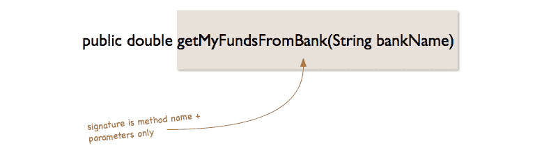

# *第四章*

# 面向对象编程

## 学习目标

本课程结束时，您将能够：

*   解释 Java 中类和对象的概念
*   解释面向对象编程的四个基本原则
*   创建简单类并使用 Java 中的对象访问它们
*   用 Java 实现继承
*   在 Java 中尝试方法重载和重写
*   在 Java 中创建和使用注释

## 导言

到目前为止，我们已经了解了 Java 的基础知识，以及如何使用简单的构造，例如**条件**语句和循环语句，以及如何在 Java 中实现方法。这些基本思想对于理解非常重要，并且在构建简单程序时非常有用。然而，要构建和维护大型复杂的程序，基本类型和构造是不够的。Java 真正强大的原因是它是一种面向对象的编程语言。它允许您有效地构建和集成复杂的程序，同时保持一致的结构，使其易于扩展、维护和重用。

在本课中，我们将介绍一种称为面向对象编程（OOP）的编程范式，它是 Java 的核心。我们将了解 OOP 是如何在 Java 中实现的，以及如何实现它来设计更好的程序。

我们将从 OOP 的定义及其基本原理开始本课程，将研究称为**类**和**对象**的 OOP 构造，并通过研究称为**继承**的概念来结束本课程。

我们将用 Java 编写两个简单的 OOP 应用程序：一个用于表示通常在大学中出现的人，如学生、讲师和员工，另一个用于表示农场中的家畜。让我们开始吧！

## 面向对象原则

OOP 遵循以下四个主要原则。在本课程的其余部分中，我们将进一步深入探讨以下原则：

*   **继承**：我们将学习如何通过使用类的层次结构和从派生类继承行为来重用代码
*   **封装**：我们还将研究如何在提供一致的接口以通过方法与对象通信的同时，向外界隐藏实现细节
*   **抽象**：我们将研究如何专注于对象的重要细节而忽略其他细节
*   **多态性**：我们还将研究如何定义抽象行为，并让其他类为这些行为提供实现

## 类和对象

编程中的范例是编写程序的一种风格。不同的语言支持不同的范例。一种语言可以支持多个范例。

### 面向对象编程

面向对象编程，通常被称为 OOP，是一种处理对象的编程风格。对象是具有保存其数据的属性和操作数据的方法的实体。

让我们把它分解成更简单的术语。

在 OOP 中，我们主要处理对象和类。对象是真实世界项目的表示。对象的一个示例是您的汽车或您自己。对象具有与其关联的属性及其可以执行的操作。例如，您的汽车有车轮、车门、发动机和齿轮，这些都是属性，它可以执行诸如超速、制动和停车等操作，这些都称为方法。下图说明了您作为个人拥有的属性和方法。属性有时可以称为**字段**：


###### 图 4.1：与人类有关的物体表示

在 OOP 中，我们将类定义为项目的蓝图，将对象定义为类的实例。

类的示例为**人**，而**人**的对象/实例的示例为学生或讲师。以下是属于**Person**类的特定示例对象：


###### 图 4.2 类实例的表示

在上图中，**Person**类用于表示所有人，无论其性别、年龄或身高。从这个类中，我们可以创建特定的人物示例，如**Person**类中的框所示。

在 Java 中，我们主要处理类和对象，因此了解它们之间的区别非常重要。

#### 笔记

在 Java 中，除了基本数据类型之外的所有内容都是对象。

以下是 Java 中类定义的格式：

```java
modifier class ClassName {
    //Body
}
```

Java 中的类定义由以下部分组成：

*   **修饰符**：类可以是**public**、**private**、**protected**或者没有修饰符。可以从其他包中的其他类访问**公共**类。**私有**类只能从其声明的类中访问。在同一个包中的所有类中都可以访问受**保护的**类成员。
*   **类名**：名称以首字母开头。
*   **主体**：类主体被大括号包围，{}。这是我们定义类的属性和方法的地方。

### 类名的命名约定

Java 中类的命名约定如下：

*   类名应使用 camelCase。也就是说，第一个单词应该以大写字母开头，所有内部单词都应该有大写的第一个单词，例如，**猫**、**猫主**、**房子**。
*   类名应该是名词。
*   类名应该是描述性的，不应该是首字母缩写，除非它们广为人知。

下面是一个如何定义**Person**类的示例：

```java
public class Person {

}
```

修饰符是公共的，这意味着可以从其他 Java 包访问该类。类名为**人**。

下面是一个更健壮的**Person**类示例，其中包含一些属性和方法：

```java
public class Person {

   //Properties
   int age;
   int height;
   String name;
   //Methods
   public void walk(){
       //Do walking operations here
   }
   public void sleep(){
       //Do sleeping operations here
   }
   private void takeShower(){
       //Do take shower operations here
   }
}
```

这些属性用于保存对象的状态。也就是说，**年龄**代表当前人的年龄，可以与下一个人的年龄不同。**姓名**用于保存当前人员的姓名，该姓名也将与下一个人的姓名不同。他们回答了这个问题：这个人是谁？

这些方法用于保存类的逻辑。也就是说，他们回答了这个问题：这个人能做什么？方法可以是私有的、公共的或受保护的。

方法中的操作可以根据应用程序的需要而复杂。您甚至可以从其他方法调用方法，以及向这些方法添加参数。

### 练习 11：使用类和对象

执行以下步骤：

1.  打开 IntelliJ IDEA 并创建一个名为**Person.java**的文件。
2.  创建一个名为**Person**的公共类，该类有三个属性，即**年龄**、**身高**和**姓名**。**age**和**height**属性将保存整数值，**name**属性将保存字符串值：

    ```java
    public class Person {

       //Properties
       int age;
       int height;
       String name;
    ```

3.  定义三种方法，即**步行（）**、**睡眠（）**、**淋浴（）**。编写每一个的打印语句，以便在调用它们时可以将文本打印到控制台：

    ```java
      //Methods
       public void walk(){
           //Do walking operations here
           System.out.println("Walking...");
       }
       public void sleep(){
           //Do sleeping operations here
           System.out.println("Sleeping...");
       }
       private void takeShower(){
           //Do take shower operations here
           System.out.println("Taking a shower...");
       }
    ```

4.  现在，将**速度**参数传递给**walk（）**方法。如果**速度**大于 10，我们将输出打印到控制台，否则不打印：

    ```java
    public void walk(int speed){
       //Do walking operations here
       if (speed > 10)
    {
           System.out.println("Walking...");
    }
    ```

5.  现在我们有了**Person**类，我们可以使用**新的**关键字为它创建对象。在下面的代码中，我们创建了三个对象：

    ```java
    Person me = new Person();
    Person myNeighbour = new Person();
    Person lecturer = new Person();
    ```

**me**变量现在是**Person**类的对象。它代表一种特殊的人，我。

有了这个对象，我们可以做任何我们想做的事情，比如调用**walk（）**方法，调用**sleep（）**方法等等。只要类中有方法，我们就可以这样做。稍后，我们将研究如何将所有这些行为添加到类中。由于我们没有**main**方法，因此此代码不会有任何输出。

### 练习 12：使用 Person 类

要调用类的成员函数，请执行以下步骤：

1.  在 IntelliJ 中创建一个名为**PersonTest**的新类。
2.  在**PersonTest**类中，创建**main**方法。
3.  在**main**方法中，创建**Person**类

    ```java
    public static void main(String[] args){
    Person me = new Person();
    Person myNeighbour = new Person();
    Person lecturer = new Person();
    ```

    的三个对象
4.  调用第一个对象的**walk（）**方法：

    ```java
    me.walk(20);
    me.walk(5);
    me.sleep();
    ```

5.  运行类并观察输出：

    ```java
    Walking...
    Sleeping…
    ```

6.  使用**我的邻居**和**讲师**对象而不是**我**：

    ```java
    myNeighbour.walk(20);
    myNeighbour.walk(5);
    myNeighbour.sleep();
    lecturer.walk(20);
    lecturer.walk(5);
    lecturer.sleep();
    }
    ```

    执行相同操作
7.  再次运行程序并观察输出：

    ```java
    Walking...
    Sleeping...
    Walking...
    Sleeping...
    Walking...
    Sleeping...
    ```

在本例中，我们创建了一个名为**PersonTest**的新类，并在其中创建了**Person**类的三个对象。然后我们调用了**me**对象的方法。从这个程序中可以明显看出，**Person**类是一个蓝图，我们可以根据需要创建任意多的对象。我们可以分别操纵这些对象，因为它们完全不同且独立。我们可以像传递其他变量一样传递这些对象，甚至可以将它们作为参数传递给其他对象。这就是面向对象编程的灵活性。

#### 笔记

我们没有调用**me.takeShower（）**，因为该方法在**Person**类中声明为私有。不能在类外调用私有方法。

## 施工人员

为了能够创建类的对象，我们需要一个构造函数。要创建类的对象时，将调用构造函数。当我们创建一个没有构造函数的类时，Java 会为我们创建一个不带参数的空默认构造函数。如果一个类是在没有构造函数的情况下创建的，我们仍然可以用默认构造函数实例化它。一个很好的例子是我们之前使用的**Person**类。当我们想要**Person**类的一个新对象时，我们写了以下内容：

```java
Person me = new Person();
```

默认构造函数为**Person（）**，返回**Person**类的新实例。然后，我们将这个返回的实例分配给我们的变量**me**。

构造函数与任何其他方法一样，只是有一些区别：

*   构造函数与类具有相同的名称
*   构造函数可以是**公共**或**私有**
*   构造函数不会返回任何内容，即使**void**

让我们看一个例子。让我们为**Person**类创建一个简单的构造函数：

```java
public class Person {
   //Properties
   int age;
   int height;
   String name;
   //Constructor
   public Person(int myAge){
       age = myAge;
   }

   //Methods
   public void walk(int speed){
       //Do walking operations here
       if (speed > 10)
           System.out.println("Walking...");
   }
   public void sleep(){
       //Do sleeping operations here
       System.out.println("Sleeping...");
   }
   private void takeShower(){
       //Do take shower operations here
       System.out.println("Taking a shower...");
   }
}
```

此构造函数接受一个参数，一个名为**myAge**的整数，并将其值赋给类中的**age**属性。请记住，构造函数隐式返回类的实例。

我们可以使用构造函数再次创建**me**对象，这次经过**年龄**：

```java
Person me = new Person(30);
```

## 该关键字的名称

在我们的**Person**类中，我们在构造函数中看到了以下行：

```java
age = myAge;
```

在这行中，正如我们前面看到的，我们正在将当前对象中的**age**变量设置为新值**myAge**，该值作为参数传入。有时，我们希望对我们所指的对象明确。当我们想要引用我们正在处理的当前对象中的属性时，我们使用**this**关键字。例如，我们可以将前一行改写如下：

```java
this.age = myAge;
```

在这一新行中，**this.age**用于引用我们正在处理的当前对象中的 age 属性。**此**用于访问当前对象的实例变量。

例如，在前一行中，我们将当前对象的**年龄**设置为传递给构造函数的值。

除了引用当前对象外，**这个**还可以用于调用类的其他构造函数（如果您有多个构造函数）。

在我们的**Person**类中，我们将创建第二个不带参数的构造函数。如果调用此构造函数，它将调用我们创建的另一个默认值为 28 的构造函数：

```java
//Constructor
public Person(int myAge){
   this.age = myAge;
}
public Person(){
   this(28);
}
```

现在，当调用**Person me=new Person（）**时，第二个构造函数将调用第一个构造函数，其中**myAge**设置为 28。然后，第一个构造函数将当前对象的**年龄**设置为 28。

### 活动 12：用 Java 创建简单类

Sce 纳里奥：让我们想象一下，我们想为一个动物农场创建一个程序。在这个项目中，我们需要跟踪农场上的所有动物。首先，我们需要一种表示动物的方法。我们将创建一个 animal 类来表示单个动物，然后创建该类的实例来表示特定的动物本身。

目标：我们将创建一个 Java 类来表示动物，并创建该类的实例。在本活动结束时，我们应该有一个简单的**动物**类和该类的一些实例。

目的：了解如何在 Java 中创建类和对象。

按照以下步骤完成活动

1.  在 IDE 中创建一个新项目，并将其命名为**动物**。
2.  在项目中，在**src/**文件夹下创建一个名为**Animal.java**的新文件。
3.  创建一个名为**Animal**的类，添加实例变量**legs**、**ears**、**eyes**、**family**和**name**。
4.  定义一个没有参数的构造函数，并将**腿**初始化为 4，**耳**初始化为 2，**眼**初始化为 2。
5.  定义另一个以**腿**、**耳**和**眼**为参数的参数化构造函数。
6.  为**名称**和**系列**添加 getter 和 setter。
7.  创建另一个名为**Animals.java**的文件，定义**main**方法，创建**Animal**类的两个对象。
8.  创建另一个具有两条**腿**、两只**耳朵**和两只**眼睛**的动物。
9.  To set the animals' **name** and **family**, we will use the getters and setters we created in the class and print names of the animals.

    输出应类似于以下内容：


###### 图 4.3：动物类的产出

#### 笔记

有关此活动的解决方案，请参见第 314 页。

### 活动 13：编写计算器课程

对于此活动，您将创建一个计算器类，给定两个操作数和一个运算符，该类可以执行该运算并返回结果。此类将有一个 operate 方法，该方法将使用两个操作数执行操作。操作数和运算符将是通过构造函数设置的类中的字段。

准备好 Calculator 类后，编写一个应用程序，执行一些示例操作并将结果打印到控制台。

要完成此活动，您需要：

1.  创建一个包含三个字段的类**计算器**：**双****操作数 1**、**双****操作数 2**和**字符串****操作符**的类。添加设置所有三个字段的构造函数。
2.  在此类中，添加一个**操作**方法，该方法将检查什么运算符是（“+”、“-”、“x”或“/”），并执行正确的操作，返回结果。
3.  Add a **main** method to this class so that you can write a few sample cases and print the results.

    #### 笔记

    此活动的解决方案见第 318 页。

## 继承

在本节中，我们将了解 OOP 的另一个重要原则，即继承。OOP 中的继承与英语中的继承具有相同的含义。让我们看一个使用家谱的例子。我们的父母继承祖父母的遗产。然后我们从父母那里继承，最后，我们的孩子从我们那里继承，或将从我们这里继承。类似地，一个类可以继承另一个类的属性。这些属性包括方法和字段。然后，另一个类仍然可以从中继承，依此类推。这形成了我们所谓的**继承层次结构**。

继承的类称为**超类**或**基**类，继承的类称为**子类**或**派生的**类。在 Java 中，一个类只能从一个超类继承。

### 遗传类型

继承的一个例子是公司或政府的管理阶层：

*   **单级继承**：在单级继承中，一个类只继承另一个类：


###### 图 4.4：单级继承的表示

*   **多级继承**：在多级继承中，一个类可以继承另一个类，该类也可以继承另一个类：


###### 图 4.5：多级继承的表示

*   **多重继承**：这里一个类可以继承多个类：


###### 图 4.6：多重继承的表示

Java 不直接支持多重继承，但可以通过使用**接口**来实现，这将在下一课中介绍。

### 继承在 OOP 中的重要性

让我们回到我们的**个人**课程。

很明显，所有人都支持共同的属性和行动，不管他们的性别或种族。例如，在属性方面，每个人都有名字，每个人都有年龄、身高和体重。关于共同行动，所有人都睡觉，所有人吃饭，所有人呼吸，等等。

我们可以在一个类中定义所有这些公共属性和操作，并让其他 Person 类继承该类，而不是在所有**Person**类中为所有这些属性和方法编写代码。这样，我们就不必重写这些子类中的属性和方法。因此，继承允许我们通过重用代码来编写更简洁的代码。

一个类从另一个类继承的语法如下：

```java
class SubClassName extends SuperClassName {
}
```

我们使用**扩展**关键字来表示继承。

例如，如果我们希望我们的**学生**类扩展**人**类，我们会这样声明：

```java
public class Student extends Person {
}
```

在这个**学生**类中，我们可以访问前面在**Person**类中定义的公共属性和方法。当我们创建这个**Student**类的实例时，我们会自动访问之前在**Person**类中定义的方法，例如**walk（）**和**sleep（）**。我们不再需要重新创建这些方法，因为我们的**学生**类现在是**Person**类的子类。但是，我们无法访问私人方法，例如**takeShower（）**。

#### 笔记

请注意，子类只能访问其超类中的公共属性和方法。如果一个属性或方法在超类中声明为 private，我们就不能从子类访问它。默认情况下，我们声明的属性只能从同一个包中的类访问，除非我们特别在它们前面加上**public**修饰符。

在我们的**Person**类中，让我们定义一些所有人都拥有的通用属性和方法。然后，我们将从这个类继承这些属性来创建其他类，例如**Student**和**讲师**：

```java
public class Person {
   //Properties
   int age;
   int height;
   int weight;
   String name;
   //Constructors
   public Person(int myAge, int myHeight, int myWeight){
       this.age = myAge;
       this.height = myHeight;
       this.weight = myWeight;
   }
   public Person(){
       this(28, 10, 60);
   }
   //Methods
   public void walk(int speed){
       if (speed > 10)
           System.out.println("Walking...");
   }
   public void sleep(){
       System.out.println("Sleeping...");
   }
   public  void setName(String name){
       this.name = name;
   }
   public String getName(){
       return name;
   }
   public int getAge(){
       return age;
   }
   public int getHeight(){
       return height;
   }
   public int getWeight(){
       return weight;
   }
}
```

在这里，我们定义了四个属性、两个构造函数和七个方法。你能解释一下每种方法的作用吗？这些方法目前相当简单，因此我们可以关注继承的核心概念。我们还修改了构造函数以获取三个参数。

让我们创建一个继承自**Person**类的**Student**类，创建该类的一个对象，并设置该学生的姓名：

```java
public class Student extends Person {
   public static void main(String[] args){
       Student student = new Student();
       student.setName("James Gosling");
   }
}
```

我们创建了一个新的**学生**类，该类继承自**Person**类。我们还创建了**Student**类的一个新实例，并设置了它的名称。注意，我们没有在**Student**类中重新定义**setName（）**方法，因为它已经在**Person**类中定义。我们也可以在**student**对象上调用其他方法：

```java
public class Student extends Person {
   public static void main(String[] args){
       Student student = new Student();
       student.setName("James Gosling");
       student.walk(20);
       student.sleep();
       System.out.println(student.getName());
       System.out.println(student.getAge());
   }
} 
```

注意，我们没有在**Student**类中创建这些方法，因为它们已经在**Student**类继承的**Person**类中定义。

### 在 Java 中实现继承

写下前面程序的预期输出。通过查看程序来解释输出。

解决办法是：

```java
Walking...
Sleeping...
James Gosling
28
```

让我们定义一个继承自同一**人**类的**讲师**类：

```java
public class Lecturer extends Person {
   public static void main(String[] args){
       Lecturer lecturer = new Lecturer();
       lecturer.setName("Prof. James Gosling");
       lecturer.walk(20);
       lecturer.sleep();
       System.out.println(lecturer.getName());
       System.out.println(lecturer.getAge());
   }
}
```

#### 笔记

请注意继承如何帮助我们通过重用相同的**Person**类来减少编写的代码量。如果没有继承，我们将不得不在所有类中重复相同的方法和属性。

### 活动 14：使用继承创建计算器

在上一个活动中，您创建了一个**计算器**类，该类包含同一类中的所有已知操作。当您考虑添加新操作时，这使得该类很难扩展。运算符方法将无限增长。

为了更好地实现这一点，您将使用 OOP 实践将该类中的运算符逻辑拆分为它自己的类。在本活动中，您将创建一个默认为求和运算的类运算符，然后创建另外三个实现其他三个运算的类：减法、乘法和除法。该运算符类有一个**匹配**方法，给定一个字符串，该方法返回一个布尔值，如果该字符串表示该运算符，则返回 true；否则返回 false。

在自己的类中使用运算逻辑，编写一个名为**Calculator With Fixed Operators**的新类，该类有三个字段：**double****operator 1**、**double****operator 2**和【T12 operator】类型的**operator**。此类将具有与上一个计算器相同的构造函数，但它不会将运算符存储为字符串，而是使用 matches 方法检查运算符类以确定正确的运算符。

与前面的计算器一样，此计算器也有一个返回 double 的方法 operate，但它不在其中进行任何登录，而是委托构造函数中确定的当前运算符。

要完成此活动，您需要：

1.  创建一个类**运算符**，该类在表示运算符的构造函数中初始化了一个字符串字段。此类应具有表示默认运算符的默认构造函数，即**sum**。操作符类还应该有一个名为 operate 的方法，该方法接收两个 double 并将操作符的结果作为 double 返回。默认操作是 sum。
2.  创建另外三个类：**减法**、**乘法**和**除法**。它们从操作符扩展而来，并用它们所表示的每个操作覆盖**操作**方法。它们还需要一个无参数构造函数来调用 super 并传递它们所表示的运算符。
3.  创建一个名为**CalculatorWithFixedOperators**的新类。这个类将包含四个字段，它们是常量（final）并表示四种可能的操作。它还应该有三个其他字段：**操作数 1**和**运算符 2**类型为 double，而**运算符**类型为**运算符**。其他三个字段将在构造函数中初始化，该构造函数将以字符串形式接收操作数和运算符。使用可能的运算符的匹配方法，确定哪一个将设置为运算符字段。
4.  与前面的**计算器**类一样，这个类也会有一个**操作**方法，但它只会委托给**操作符**实例。
5.  Last, write a **main** method that calls the new calculator a few times, printing the results of the operation for each time.

    #### 笔记

    重写计算器以使用更多的类似乎比初始代码更复杂。但它抽象出了一些重要的行为，这些行为开启了未来活动将要探索的一些可能性。

    #### 笔记

    有关此活动的解决方案，请参见第 319 页。

## 超负荷

我们将要讨论的 OOP 的下一个原理叫做重载。重载是 OOP 中一个强大的概念，它允许我们重用方法名，只要它们具有不同的签名。**方法签名**是方法名称、参数和参数顺序：



###### 图 4.7：方法签名的表示

前面是一个从给定银行名称提取资金的方法示例。该方法返回一个 double 并接受一个字符串参数。这里的方法签名是**getMyFundsFromBank（）**方法的名称和字符串参数**bankName**。签名不包括方法的返回类型，只包括名称和参数。

通过重载，我们可以使用相同的方法名但不同的参数定义多个方法。这在定义执行相同操作但使用不同参数的方法时非常有用。

让我们看一个例子。

让我们定义一个名为**Sum**的类，该类包含三个重载方法，它们添加传递的参数并返回结果：

```java
public class Sum {
    //This sum takes two int parameters
    public int sum(int x, int y) {
        return (x + y);
    }
    //This sum takes three int parameters
    public int sum(int x, int y, int z) {
        return (x + y + z);
    }
    //This sum takes two double parameters
    public double sum(double x, double y) {
        return (x + y);
    }
    public static void main(String args[]) {
        Sum s = new Sum();
        System.out.println(s.sum(10, 20));
        System.out.println(s.sum(10, 20, 30));
        System.out.println(s.sum(10.5, 20.5));
    }
}
```

结果如下：

```java
30
60
31.0
```

在本例中，**sum（）**方法被重载以获取不同的参数并返回 sum。方法名称相同，但每个方法采用不同的参数集。方法签名中的这种差异允许我们根据需要多次使用相同的名称。

您可能想知道重载给 OOP 带来的好处。想象一下这样一个场景：我们不能多次重用某个方法名，就像在某些语言中一样，比如在 C 语言中。为了能够接受不同的参数集，我们需要想出六个不同的方法名。在处理大型程序时，为基本上做同一件事的方法想出六个不同的名称既烦人又痛苦。过载使我们免于这种情况。

让我们回到**学生**类，创建两个重载方法。在第一种方法中，我们将打印一个字符串来打印“Going to class…”，而不管它是一周中的哪一天。在第二种方法中，我们将通过一周中的某一天来检查是否是周末。如果是周末，我们将打印一个与本周其余时间不同的字符串。以下是我们将如何实现这一点：

```java
public class Student extends Person {
   //Add this
   public void goToClass(){
       System.out.println("Going to class...");
   }
   public void goToClass(int dayOfWeek){
       if (dayOfWeek == 6 || dayOfWeek == 7){
           System.out.println("It's the weekend! Not to going to class!");
       }else {
           System.out.println("Going to class...");
       }
   }
   public static void main(String[] args){
       Student student = new Student();
       student.setName("James Gosling");
       student.walk(20);
       student.sleep();
       System.out.println(student.getName());
       System.out.println(student.getAge());
       //Add this
       student.goToClass();
       student.goToClass(6);
   }
}
```

输出如下所示：

```java
Walking...
Sleeping...
James Gosling
28
Going to class...
It's the weekend! Not to going to class!
```

打开我们创建的**讲师**类，添加两个重载方法，如下所示：

*   **teachClass（）**打印“随机授课”
*   **教学类（字符串类名）**打印出“**教学**+**类名**

代码如下：

```java
public void teachClass(){
   System.out.println("Teaching a random class.");
}
public void teachClass(String className){
   System.out.println("Teaching " + className);
}
```

我们可以在类中重载 main 方法，但一旦程序启动，JVM 将只调用**main（String[]args）**。我们可以从这个**main**方法中调用重载的**main**方法。以下是一个例子：

```java
public class Student {
    public static void main(String[] args){
        // Will be called by the JVM
    }
    public static void main(String[] args, String str1, int num){
        //Do some operations
    }
    public static void main(int num, int num1, String str){

    }
}
```

在本例中，**main**方法重载了三次。但是，当我们运行程序时，将调用签名为**main（String[]args）**的 main 方法。在代码中的任何地方，我们都可以自由调用其他主要方法。

## 构造函数重载

与方法一样，构造函数也可以重载。当同一类中使用不同参数声明相同的构造函数时，这称为**构造函数重载**。编译器根据参数数量及其数据类型区分要调用的构造函数。

在我们关于构造函数的讨论中，我们为我们的**Person**类创建了第二个构造函数，该类以**年龄**、**身高**和**体重**为参数。我们可以将此构造函数与不接受任何参数的构造函数放在同一个类中。这是因为这两个构造函数具有不同的签名，因此可以并排使用。让我们看看如何做到这一点：

```java
//Constructors
public Person(){
   this(28, 10, 60);
}
//Overloaded constructor
public Person(int myAge, int myHeight, int myWeight){
   this.age = myAge;
   this.height = myHeight;
   this.weight = myWeight;
}
```

这两个构造函数具有相同的名称（类名），但采用不同的参数。

增加第三个构造器，取**年龄**、**身高**、**体重**、**姓名**。在构造函数中，将所有类变量设置为传递的参数。

代码如下：

```java
public Person(int myAge, int myHeight, int myWeight, String name){
   this.age = myAge;
   this.height = myHeight;
   this.weight = myWeight;
   this.name = name;
}
```

## 多态性与覆盖

我们将介绍的 OOP 的下一个原则是多态性。术语**多态性**源于生物学，因为生物体可以有多种形式和阶段。这个术语也用于 OOP，因为子类可以定义其独特的行为，但仍与父类共享一些功能。

让我们用一个例子来说明这一点。

在我们的**人**示例中，我们有一种方法，**步行**。我们的**学生**班继承了**人**班，我们将重新定义相同的**步行**方法，但现在步行去上课，而不仅仅是步行。在我们的**讲师**课程中，我们也将重新定义相同的**步行**方法，这次我们将步行到教职员室，而不是步行去上课。此方法必须与超类中的**walk**方法具有相同的签名和返回类型，才能将其视为多态。以下是在我们的**学生**课程中实现的样子：

```java
public class Student extends Person {
       ….
   public void walk(int speed){
       //Walk to class
       System.out.println("Walking to class ..");
   }
…...
}
```

当我们调用**student.walk（20）**时，我们**student**类中的这个方法将被调用，而不是**Person**类中的相同方法。也就是说，我们为我们的**学生**班提供了一种独特的行走方式，这与**讲师**和**人**班不同。

在 Java 中，我们将这种方法称为重写，将过程称为方法重写。Java 虚拟机（JVM）为所引用的对象调用适当的方法。

### 超控和过载的区别

让我们看看方法重载和重写之间的区别：

*   方法重载处理的概念是在同一个类中有两个或多个具有相同名称但参数不同的方法：

    ```java
    void foo(int a)
    void foo(int a, float b)
    ```

*   方法重写意味着有两个参数相同但实现不同的方法。其中一个将存在于父类中，而另一个将存在于子类中：

    ```java
    class Parent {
        void foo(double d) {
            // do something
        }
    }
    class Child extends Parent {

        void foo(double d){
            // this method is overridden.  
        }
    }
    ```

## 注释

现在我们将讨论另一个重要主题，它将帮助我们编写更好的 Java 程序。

注释是一种向程序中添加元数据的方法。此元数据可以包括我们正在开发的类的版本等信息。这在类不推荐使用或重写某个方法的情况下非常有用。这种元数据不是程序本身的一部分，但可以帮助我们发现错误或提供指导。注释对其注释的代码的操作没有直接影响。

让我们看一个场景。我们如何确保重写某个方法而不是创建另一个完全不同的方法？重写方法时，一个错误（例如使用不同的返回类型）将导致该方法不再被重写。这样的错误很容易犯，但如果在软件开发阶段的早期不加以注意，可能会导致以后的软件错误。那么，我们如何强制执行覆盖？正如您可能已经猜到的，答案是使用注释。

@字符向编译器指示后面是注释。

让我们在**学生**类中使用注释强制重写：

```java
@Override
public void walk(int speed){
   //Walk to class
   System.out.println("Walking to class ..");
}
```

请注意，我们在方法名称上方添加了**@Override**行，以指示该方法是从超类重写的。编译程序时，编译器将检查此注释，它将立即知道我们正在尝试重写此方法。它将检查超类中是否存在此方法，以及重写是否正确完成。如果没有，它将报告一个错误，表明该方法不正确。在某种程度上，这将防止我们犯错误。

Java 包含内置注释，您也可以创建自己的注释。注释可以应用于类、属性、方法和其他程序元素的声明。在声明中使用时，按照惯例，每个注释都显示在自己的行上。让我们看几个 Java 内置注释的示例：


###### 表 4.1：具有不同注释的表及其使用

### 创建自己的注释类型

注释是使用**接口**关键字创建的。让我们声明一个注释，以便添加类的作者信息：

```java
public @interface Author {
    String name();
    String date();
}
```

此批注接受作者的姓名和日期。然后我们可以在我们的**学生**课堂上使用此注释：

```java
@Author(name = "James Gosling", date = "1/1/1970")
public class Student extends Person {
}
```

您可以用前面示例中的值替换名称和日期。

## 参考文献

在处理对象时，理解**引用**非常重要。引用是一个地址，指示对象的变量和方法存储在哪里。

当我们将对象分配给变量或将它们作为参数传递给方法时，实际上并不是传递对象本身或其副本，而是传递对内存中对象本身的引用。

为了更好地理解引用是如何工作的，让我们用一个例子来说明这一点。

以下是一个例子：

创建一个名为**矩形**的新类，如下所示：

```java
public class Rectangle {
    int width;
    int height;
    public Rectangle(int width, int height){
        this.width = width;
        this.height = height;
    }
    public static void main(String[] args){
        Rectangle r1, r2;
        r1 = new Rectangle(100, 200);
        r2 = r1;
        r1.height = 300;
        r1.width = 400;
        System.out.println("r1: width= " + r1.width + ", height= " + r1.height);
        System.out.println("r2: width= " + r2.width + ", height= " + r2.height);
    }
}
```

输出如下所示：

```java
r1: width= 400, height= 300
r2: width= 400, height= 300
```

以下是上述程序中发生的情况的摘要：

1.  我们创建两个变量，**r1**和**r2**，类型为**矩形**。
2.  一个新的**矩形**对象被分配给**r1**。
3.  **r1**的值分配给**r2**。
4.  **r2**的宽度和高度发生变化。
5.  最后打印两个对象的值。

您可能期望**r1**和**r2**的值会有所不同。然而，输出结果表明情况并非如此。这是因为当我们使用**r2=r1 时，**创建了一个从**r2**到**r1**的引用，而不是创建**r2**作为从**r1**复制的新对象。也就是说，**r2**指向**r1**指向的同一对象。任一变量均可用于引用对象并更改其变量：


###### 图 4.8：对象 r1、r2 的表示

如果希望**r2**引用新对象，请使用以下代码：

```java
r1 = new Rectangle(100, 200);
r2 = new Rectangle(300, 400);
```

当参数传递给方法时，Java 中的引用变得特别重要。

#### 笔记

在 java 中没有明确的指针或指针算法，因为 C++和 C++中都有。但是，通过使用引用，大多数指针功能都是复制的，没有许多缺点。

### 活动 15：了解 Java 中的继承和多态性

场景：假设我们希望我们在活动一中创建的**动物**类更加面向对象。这样的话，如果我们的农场需要的话，它将更容易维护并在将来扩大规模。

目标：我们将创建从**动物**类继承的类，实现重载和重写的方法，并为我们的类创建一个注释版本。

目的：了解如何从类继承、重载和重写方法，以及如何在 Java 中创建注释。

程序：

1.  打开我们之前创建的**动物**项目。
2.  在项目中，在**src/**文件夹中创建一个名为**Cat.java**的新文件。
3.  打开**Cat.java**并从**动物**类继承。
4.  在其中，创建一个新的**猫**类实例，并将该族设置为“**猫【T3]”，名称设置为“**小狗【T5]”，**耳朵**设置为两个，**眼睛**设置为两个，**腿**设置为四个。不要重新定义这些方法和字段，而是使用继承自**动物**类的方法和字段。****
5.  Print the **family**, **name**, **ears**, **legs**, and **eyes**. What is the output?

    #### 笔记

    此活动的解决方案可在第 322 页上找到。

## 总结

在本课中，我们了解到类是蓝图，我们可以从中创建对象，而对象是类的实例，并提供该类的特定实现。类可以是公共的、私有的或受保护的。类具有不接受参数的默认构造函数。我们可以在 Java 中使用用户定义的构造函数。**此**关键字用于引用类的当前实例。

然后我们了解到继承是一个属性，其中子类继承超类的属性。

我们继续研究 Java 中的重载、多态性、注释和引用。

在下一课中，我们将了解 Java 中接口和**对象**类的使用。