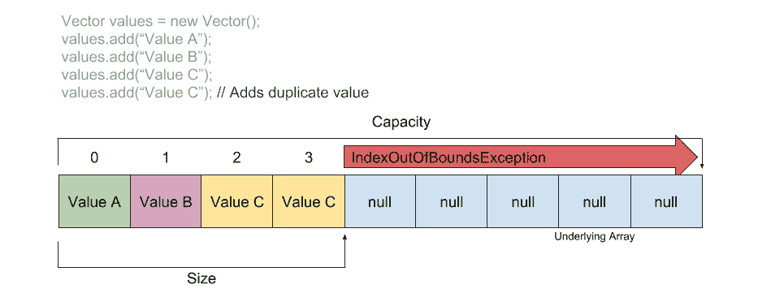
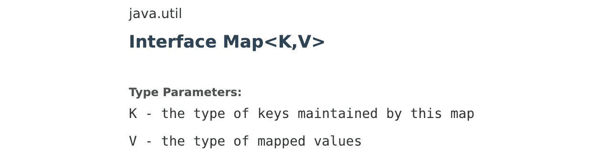
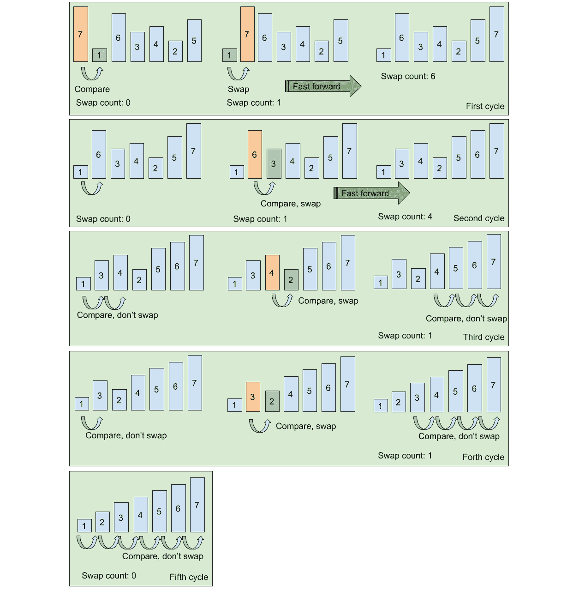
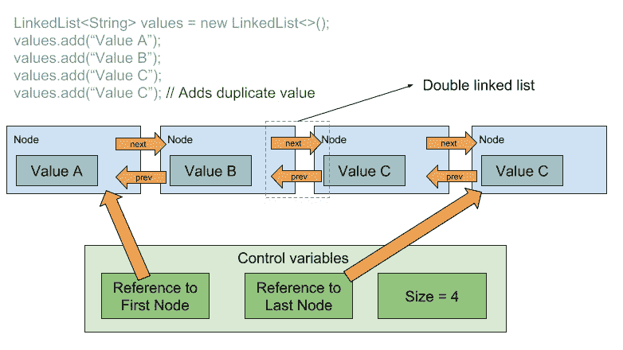
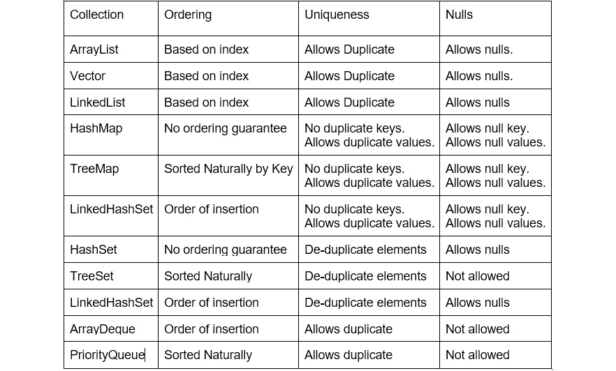

# *第 7 章*

# Java 集合框架和泛型

## 学习目标

本课程结束时，您将能够：

*   使用集合来处理数据
*   以不同的方式比较对象
*   对对象集合排序
*   使用集合构建高效的算法
*   为每个用例使用最适合的集合

## 导言

在前面的课程中，您学习了如何将对象分组到阵列中，以帮助您成批处理数据。数组确实很有用，但是当加载未知数量的数据时，它们具有静态长度这一事实使得它们很难处理。此外，访问数组中的对象需要知道数组的索引，否则需要遍历整个数组才能找到对象。您还简要了解了 ArrayList，它的行为类似于可以动态更改其大小以支持更高级用例的数组。

在本课中，您将了解 ArrayList 实际上是如何工作的。您还将了解 Java 集合框架，它包括一些更高级的数据结构，用于一些更高级的用例。作为本课程的一部分，您还将学习如何迭代许多数据结构，以多种不同的方式比较对象，以及以高效的方式对集合进行排序。

您还将了解泛型，泛型是从编译器获得使用集合和其他特殊类帮助的一种强大方式。

## 从文件中读取数据

在开始之前，让我们先了解一下本课下一节将要用到的一些基础知识。

### 二进制文件与文本文件

计算机中有许多类型的文件：可执行文件、配置文件、数据文件等。文件可以分为两个基本组：二进制和文本。

当人和文件的交互只是间接的，例如执行应用程序（可执行文件）或加载到 Excel 中的电子表格文件时，使用二进制文件。如果你试图查看这些文件，你会看到一堆不可读的字符。这种类型的文件非常有用，因为它们可以变得紧凑，占用更少的空间，并且可以结构化，以便计算机可以快速读取它们。

另一方面，文本文件包含可读字符。如果你用文本编辑器打开它们，你可以看到里面有什么。并不是所有的格式都适合人类阅读，有些格式几乎不可能理解。但是大多数文本文件都可以被人类阅读和编辑。

### CSV 文件

逗号分隔值（CSV）文件是一种非常常见的文本文件类型，用于在系统之间传输数据。CSV 很有用，因为它们易于生成和阅读。这种文件的结构非常简单：

*   每行一条记录。
*   第一行是标题。
*   每个记录都是一个长字符串，其中的值用逗号分隔（值也可以用其他分隔符分隔）。

以下是从我们将要使用的示例数据中提取的一段文件：

```java
id,name,email
10,Bill Gates,william.gates@microsoft.com
30,Jeff Bezos,jeff.bezos@amazon.com
20,Marc Benioff,marc.benioff@salesforce.com
```

### 读取 Java 文件

Java 有两组基本的类用于读取文件：**流**用于读取二进制文件，**读取器**用于读取文本文件。**io**包设计中最有趣的部分是**流**和**读卡器**可以组合在一起，在彼此的基础上增加功能。这种功能称为管道，因为它类似于将多个管道相互连接的过程。

我们将使用一个简单的例子来解释这些，并借助于**文件读取器**和**BufferedReader**的帮助。

**文件阅读器**一次读取一个字符。**BufferedReader**可以缓冲这些字符，一次读取一行。这简化了我们在读取 CSV 时的工作，因为我们只需创建一个**FileReader**实例，然后用**BufferedReader**包装它，然后逐行读取 CSV 文件：


###### 图 7.1：从 CSV 文件读取过程的图示

### E 练习 22：读取 CSV 文件

在本练习中，您将使用**FileReader**和**BufferedReader**从 CSV 文件中读取行，拆分行，并像处理记录一样进行处理：

1.  创建一个名为**ReadCSVFile.java**的文件，添加一个同名类，并在其中添加一个**main**方法：

    ```java
    public class ReadCSVFile {
      public static void main(String [] args) throws IOException {
    ```

2.  首先，您需要添加一个字符串变量，该变量将从命令行参数中获取要加载的文件名：

    ```java
    String fileName = args[0];  
    ```

3.  然后，创建一个新的**文件读取器**并将其导入资源 try with resource 中的**BufferedReader**，如下代码所示：

    ```java
    FileReader fileReader = new FileReader(fileName);
    try (BufferedReader reader = new BufferedReader(fileReader)) {
    ```

4.  现在您已经打开了一个要读取的文件，您可以逐行读取它。**BufferedReader**将为您提供一个新行，一直到文件末尾。文件结束时，返回**空**。因此，我们可以声明一个变量行并将其设置为**while**条件。然后，我们需要立即检查它是否为空。我们还需要一个变量来计算从文件中读取的行数：

    ```java
    String line;
    int lineCounter = -1;
    while ( (line = reader.readLine()) != null ) {
    ```

5.  在循环内部，增加行数并忽略行零（即页眉）。这就是为什么我们将**行计数器**初始化为**-1**而不是零：

    ```java
    lineCounter++;
    // Ignore the header
    if (lineCounter == 0) {
      continue;
    }
    ```

6.  Finally, you split the line using the **split** method from the **String** class. That method receives a separator, which in our case is a comma:

    ```java
    String [] split = line.split(",");
    System.out.printf("%d - %s\n", lineCounter, split[1]);
    ```

    #### 笔记

    您可以看到**文件读取器**如何被传递到**BufferedReader**中，然后再也无法访问。这是因为我们只需要行，而不关心将字符转换为行的中间过程。

祝贺您编写了一个可以读取和解析 CSV 的应用程序。请随意深入研究这段代码，了解更改初始行计数值时会发生什么。

T 输出如下：

```java
1 - Bill Gates
2 - Jeff Bezos
3 - Marc Benioff
4 - Bill Gates
5 - Jeff Bezos
6 - Sundar Pichai
7 - Jeff Bezos
8 - Larry Ellison
9 - Marc Benioff
10 - Larry Ellison
11 - Jeff Bezos
12 - Bill Gates
13 - Sundar Pichai
14 - Jeff Bezos
15 - Sundar Pichai
16 - Marc Benioff
17 - Larry Ellison
18 - Marc Benioff
19 - Jeff Bezos
20 - Marc Benioff
21 - Bill Gates
22 - Sundar Pichai
23 - Larry Ellison
24 - Bill Gates
25 - Larry Ellison
26 - Jeff Bezos
27 - Sundar Pichai
```

### B 构建 CSV 阅读器

现在您已经知道如何从 CSV 读取数据，我们可以开始考虑将该逻辑抽象到它自己的管道中。就像**BufferedReader**允许您逐行读取文本文件一样，CSV 阅读器允许您逐条读取 CSV 文件记录。它建立在**BufferedReader**功能的基础上，并添加了使用逗号作为分隔符拆分行的逻辑。下图显示了使用 CSV 阅读器时新管道的外观：


###### 图 7.2：可以将 CSVReader 添加到链中，以逐个读取记录

### Exercise 23：构建 CSV 阅读器

在本练习中，我们将遵循管道模式并构建一个简单的**CSVReader**，我们将在本课程的其余部分中使用它：

1.  创建一个名为**CSVReader.java**的新文件，并在编辑器中打开它。
2.  在此文件中创建一个名为**CSVReader**的公共类，并实现**可关闭**接口：

    ```java
    public class CSVReader implements Closeable {
    ```

3.  添加两个字段，一个字段将**BufferedReader**存储为**final**，我们将从中读取，另一个字段存储行计数：

    ```java
    private final BufferedReader reader;
    private int lineCount = 0;
    ```

4.  创建一个接收**BufferedReader**的构造函数，并将其设置为字段。此构造函数还将读取并丢弃传入读取器的第一行，因为这是标题，我们在本课程中不关心它们：

    ```java
    public CSVReader(BufferedReader reader) throws IOException {
      this.reader = reader;
      // Ignores the header
      reader.readLine();
    }
    ```

5.  只需从底层读卡器调用**关闭**方法即可实现**关闭**方法：

    ```java
    public void close() throws IOException {
      this.reader.close();
    }
    ```

6.  Just as **BufferedReader** has a **readLine** method, our **CSVReader** class will have a **readRecord** method, which will read the line from **BufferedReader** and then return that string, split by a comma. In this method, we'll keep track of how many lines we have read so far. We also need to check whether the reader returned a line or not since it can return null, which means it's finished reading the file and has no more lines to give us. If that's the case, we'll just follow the same pattern and return null:

    ```java
    public String[] readRow() throws IOException {
      String line = reader.readLine();
      if (line == null) {
        return null;
      }
      lineCount++;
      return line.split(",");
    }
    ```

    #### 笔记

    在一个更复杂的实现中，我们可以存储报头以向类的用户公开额外的功能，例如按报头名称获取值。我们还可以对行进行一些整理和验证，以确保没有额外的空格包装值，并且它们包含预期的值量（与页眉计数相同）。

7.  用吸气剂暴露**测线计数**：

    ```java
    public int getLineCount() {
      return lineCount;
    }
    ```

8.  现在，您的新**CSVReader**已准备就绪！创建一个名为**UseCSVReaderSample.java**的新文件，该文件具有相同名称的类和一个**main**方法：

    ```java
    public class UseCSVReaderSample {
      public static void main (String [] args) throws IOException {
    ```

9.  Following the same pattern we used before to read the lines from the CSV, now you can use your **CSVReader** class to read from the CSV file, adding the following to your **main** method:

    ```java
    String fileName = args[0];
    FileReader fileReader = new FileReader(fileName);
    BufferedReader reader = new BufferedReader(fileReader);
    try (CSVReader csvReader = new CSVReader(reader)) {
      String[] row;
      while ( (row = csvReader.readRow()) != null ) {
        System.out.printf("%d - %s\n", csvReader.getLineCount(), row[1]);
      }
    }
    ```

    #### 笔记

    从前面的代码片段可以看出，您的代码现在简单多了。它专注于交付业务逻辑（使用行计数打印第二个值），而不关心读取 CSV。这是一个非常实用的例子，说明了如何创建读者来抽象出处理来自文件的数据的逻辑。

10.  For the code to compile, you'll need to add the imports from the **java.io** package:

    ```java
    import java.io.BufferedReader;
    import java.io.FileReader;
    import java.io.IOException;
    ```

    The 输出如下：

    ```java
    1 - Bill Gates
    2 - Jeff Bezos
    3 - Marc Benioff
    4 - Bill Gates
    5 - Jeff Bezos
    6 - Sundar Pichai
    7 - Jeff Bezos
    8 - Larry Ellison
    9 - Marc Benioff
    10 - Larry Ellison
    11 - Jeff Bezos
    12 - Bill Gates
    13 - Sundar Pichai
    14 - Jeff Bezos
    15 - Sundar Pichai
    16 - Marc Benioff
    17 - Larry Ellison
    18 - Marc Benioff
    19 - Jeff Bezos
    20 - Marc Benioff
    21 - Bill Gates
    22 - Sundar Pichai
    23 - Larry Ellison
    24 - Bill Gates
    25 - Larry Ellison
    26 - Jeff Bezos
    27 - Sundar Pichai
    ```

### 氩射线

正如您已经从前面的课程中学到的，数组确实很强大，但它们的静态特性使事情变得困难。假设您有一段代码从某个数据库或 CSV 文件加载用户。在完成加载所有数据之前，来自数据库或文件的数据量是未知的。如果使用数组，则必须在每次读取记录时调整数组的大小。这将太昂贵，因为数组无法调整大小；它们需要被反复复制。

以下是一些说明调整数组大小的代码：

```java
// Increase array size by one
// Create new array
User[] newUsers = new User[users.length + 1];
// Copy data over
System.arraycopy(users, 0, newUsers, 0, users.length);
// Switch
users = newUsers;
```

为了提高效率，可以使用指定的容量初始化数组，并在读取完所有记录后修剪数组，以确保其中不包含任何额外的空行。在向阵列中添加新记录时，还需要确保阵列具有足够的容量。如果没有，则必须制作一个具有足够空间的新阵列并复制数据。

### Exercise 24：将用户从 CSV 文件读入数组

在本练习中，您将学习如何使用数组存储来自数据源的无限量数据。在我们的案例中，我们将使用与前面各节中使用的相同的用户 CSV：

1.  创建一个名为**User.java**的文件，并添加一个同名的类。此类将有三个字段：**id**、**姓名**和**电子邮件**。它还有一个构造函数，可以用这三个值初始化它。我们将使用此类来表示一个**用户**：

    ```java
    public class User {
      public int id;
      public String name;
      public String email;
      public User(int id, String name, String email) {
        this.id = id;
        this.name = name;
        this.email = email;
      }
    }
    ```

2.  在**用户**类的开头，添加一个**静态**方法，该方法将根据字符串数组中的值创建一个用户。从 CSV 读取的值创建**用户**时，这将非常有用：

    ```java
    public static User fromValues(String [] values) {
      int id = Integer.parseInt(values[0]);
      String name = values[1];
      String email = values[2];
      return new User(id, name, email);
    }
    ```

3.  创建另一个名为**IncreaseOnEachRead.java**的文件，并添加一个具有相同名称的类和一个**main**方法，该方法将第一个参数从命令行传递给另一个名为**loadUsers**的方法。然后，打印加载的用户数，如图所示：

    ```java
    public class IncreaseOnEachRead {
      public static final void main (String [] args) throws Exception {
        User[] users = loadUsers(args[0]);
        System.out.println(users.length);
      }
    }
    ```

4.  在同一个文件中，添加另一个名为**loadUsers**的方法，该方法将返回一个用户数组并接收一个名为**fileToRead**的字符串，该字符串将是要读取的 CSV 文件的路径：

    ```java
    public static User[] loadUsers(String fileToReadFrom) throws Exception {
    ```

5.  在此方法中，首先创建一个空用户数组，并在末尾返回它：

    ```java
    User[] users = new User[0];
    return users;
    ```

6.  Between those two lines, add the logic to read the CSV record by record using your **CSVReader**. For each record, increase the size of the array by one and then add a newly created **User** to the last position on the array:

    ```java
    BufferedReader lineReader = new BufferedReader(new FileReader(fileToReadFrom));
    try (CSVReader reader = new CSVReader(lineReader)) {
      String [] row = null;
      while ( (row = reader.readRow()) != null) {
        // Increase array size by one
        // Create new array
        User[] newUsers = new User[users.length + 1];
        // Copy data over
        System.arraycopy(users, 0, newUsers, 0, users.length);
        // Swap
        users = newUsers;
        users[users.length - 1] = User.userFromRow(row);
      }
    }
    ```

    结果如下：

    ```java
    27
    ```

现在，您可以读取 CSV 文件，并从中加载对所有用户的引用。这实现了在每次读取记录时增加数组的方法。您将如何实施更有效的方法来初始化具有一定容量的阵列，并根据需要增加容量，最后对其进行修剪？

### 活动 27：使用具有初始容量的阵列从 CSV 读取用户

在本活动中，您将从 CSV 中读取用户，与上一练习中类似，但不是每次读取时都增加阵列，而是创建具有初始容量的阵列，并根据需要增加它。最后，您需要检查数组是否还剩下空格，并将其缩小以返回一个与加载的用户数相同大小的数组。

要完成此活动，您需要：

1.  使用初始容量初始化阵列。
2.  从循环中的命令行传入的路径中读取 CSV，创建用户并将其添加到阵列中。
3.  跟踪在变量中加载的用户数。
4.  在将用户添加到阵列之前，需要检查阵列的大小，并在必要时对其进行扩展。
5.  At the end, shrink the array as necessary to return the exact number of users loaded.

    #### 笔记

    有关此活动的解决方案，请参见第 345 页。

## The Java 集合框架

在构建复杂的应用程序时，需要以不同的方式操作对象集合。最初，核心 Java 库仅限于三个选项：数组、向量和哈希表。他们都有自己的力量，但随着时间的推移，这显然是不够的。人们开始构建自己的框架来处理更复杂的用例，比如分组、排序和比较。

Java 标准版中添加了 Java 集合框架，以通过提供高效且易于使用的数据结构和算法，减少编程工作量，提高 Java 应用程序的性能和互操作性。这组接口和实现类旨在为 Java 开发人员提供一种简单的方法来构建可以共享和重用的 API。

### Ve 因子

向量解决了数组是静态的问题。它们提供了一种动态和可伸缩的方式来存储许多对象。它们随着您添加新元素而增长，可以准备接收大量元素，并且很容易迭代元素。

为了处理内部数组而不必不必要地调整其大小，向量使用一定的容量对其进行初始化，并使用指针值跟踪最后一个元素添加到的位置，指针值只是标记该位置的整数。默认情况下，初始容量为 10。当您添加的容量超过阵列的容量时，内部阵列将被复制到一个新的阵列上，该阵列将以某个因数更大，留下更多的空白空间，以便您可以添加额外的元素。复制过程就像您在*练习 24*：*中将用户从 CSV 文件读取到阵列*中手动处理阵列一样。以下是其工作原理的说明：



###### 图 7.3：矢量图

在 Java 集合框架出现之前，使用向量是在 Java 中获取动态数组的方法。然而，有两个主要问题：

*   缺乏易于理解和扩展的定义接口
*   完全同步，这意味着它受到多线程代码的保护

在 Java Collections 框架之后，vectors 被改造为符合新的接口，解决了第一个问题。

### Exercise 25：将用户从 CSV 文件读入向量

由于向量解决了根据需要增长和收缩的问题，因此在本练习中，我们将重写上一个练习，但不处理数组的大小，我们将委托给向量。我们还将开始构建一个**UsersLoader**类，我们将在未来的所有练习中分享该类：

1.  创建一个名为**UsersLoader.java**的文件，并在其中添加一个同名的类：

    ```java
    public class UsersLoader {
    }
    ```

2.  您将使用此类添加共享方法，以便在以后的课程中可以从 CSV 文件加载用户。您将要编写的第一个步骤是将用户从 CSV 加载到向量中。添加一个返回向量的公共静态方法。在此方法中，实例化**向量**并在末尾返回：

    ```java
    private static Vector loadUsersInVector(String pathToFile)
        throws IOException {
      Vector users = new Vector();
      return users;
    }
    ```

3.  在创建**向量**和返回它之间，从 CSV 加载数据并将其添加到**向量**：

    ```java
    BufferedReader lineReader = new BufferedReader(new FileReader(pathToFile));
    try (CSVReader reader = new CSVReader(lineReader)) {
      String [] row = null;
      while ( (row = reader.readRow()) != null) {
        users.add(User.fromValues(row));
      }
    }
    ```

4.  添加编译此文件所需的导入：

    ```java
    import java.io.BufferedReader;
    import java.io.FileReader;
    import java.io.IOException;
    import java.util.Vector;
    ```

5.  创建一个名为**ReadUsersIntoVector.java**的文件，并在其中添加一个同名的类和一个**main**方法：

    ```java
    public class ReadUsersIntoVector {
      public static void main (String [] args) throws IOException {
      }
    }
    ```

6.  在**main**方法中，类似于我们在数组案例中所做的，调用将用户从 CSV 加载到**向量**中的方法，然后打印**向量**的大小。在这种情况下，使用我们在上一步中创建的**loadUsersInVector（）**方法：

    ```java
    Vector users = UserLoader.loadUsersInVector(args[0]);
    System.out.println(users.size());
    ```

7.  Add the imports for this file to compile:

    ```java
    import java.io.IOException;
    import java.util.Vector;
    ```

    结果如下：

    ```java
    27
    ```

恭喜你又完成了一个练习！这一次，您可以看到您的代码要简单得多，因为加载 CSV、将其拆分为值、创建用户和调整数组大小的大部分逻辑现在都被抽象掉了。

### 活动 28：使用向量读取真实数据集

在本活动中，您将下载一份包含美国人口普查收入信息的 CSV，并对文件中的值进行计算。

要开始，请转到此页面：[https://github.com/TrainingByPackt/Java-Fundamentals/tree/master/Lesson07/data](https://github.com/TrainingByPackt/Java-Fundamentals/tree/master/Lesson07/data) 。要下载 CSV，您可以点击**成人信息**。它将在浏览器中打开数据文件。下载文件并将其保存到计算机中的某个位置。扩展名与此无关，但您需要记住文件名和路径。

您可以在网站中阅读更多关于数据格式的信息，或者只需将其作为文本文件打开即可。使用此文件时要记住两件事：

*   文件末尾有一个额外的空行
*   此文件没有标题行

创建将在此文件中计算最低、最高和平均工资的应用程序。读取所有行后，应用程序应打印这些结果。要实现这一点，您需要：

1.  使用**CSVReader**将文件中的所有工资加载到整数向量中。您可以修改您的**CSVReader**以支持无头文件。
2.  迭代向量中的值，并跟踪三个值：最小值、最大值和和。
3.  Print the results at the end. Remember, the average is just the sum divided by the size of the Vector.

    #### 笔记

    有关此活动的解决方案，请参见第 347 页。

### Ite 对集合的评级

使用数组时，有两种迭代方法：可以使用**for**循环和索引：

```java
for (int i = 0; i < values.length; i++) {
  System.out.printf("%d - %s\n", i, values[i]);
}
```

您还可以对每个循环使用**进行迭代，其中您无权访问元素的索引：**

```java
for (String value : values) {
  System.out.println(value);
}
```

当需要迭代向量时，可以使用带有索引的循环，就像数组一样：

```java
for (int i = 0; i < values.size(); i++) {
  String value = (String) values.get(i);
  System.out.printf("%d - %s\n", i, value);
}
```

您也可以对每个循环使用**中的**向量**，就像数组一样：**

```java
for (Object value : values) {
  System.out.println(value);
}
```

这是因为**向量**实现了**可编辑**。Iterable 是一个简单的接口，它告诉编译器每个循环都可以在**中使用实例。事实上，您可以更改**CSVReader**来实现 Iterable，然后在**中为每个**循环使用它，如下代码所示：**

```java
try (IterableCSVReader csvReader = new IterableCSVReader(reader)) {
  for (Object rowAsObject : csvReader) {
    User user = User.fromValues((String[]) rowAsObject);
    System.out.println(user.name);
  }
}
```

Iterable 是一个非常简单的接口；您只需要实现一个方法：**迭代器（）**。该方法返回一个迭代器。迭代器是另一个简单的接口，只有两种方法可以实现：

*   **hasNext（）**：如果迭代器仍有元素要返回，则返回**true**。
*   **next（）**：取下一条记录并返回。如果**hasNext（）**在调用此函数之前返回**false**，则会抛出异常。

迭代器表示从集合中获取内容的简单方法。但它还有另一种方法，在一些更高级的上下文中非常重要，**remove（）**，它删除了从调用**next（）**中获取的当前元素。

这个**删除**方法很重要，因为当您在集合上迭代时，您不能修改它。这意味着，如果您为每个循环编写一个**来读取向量中的元素，然后在该循环中调用**remove（Object）**来从中移除元素，则会抛出**ConcurrentModificationException**。所以，如果您想使用循环对集合进行迭代，并且在这个循环中需要从向量中删除元素，则必须使用迭代器。**

您一定在想，“为什么它会设计成这样？”因为 Java 是一种多线程语言。在本书中，您不会学习如何创建线程或使用线程，因为这是一个高级主题。但多线程背后的思想是，内存中的一段数据可以由两段代码同时访问。这是可能的，因为现代计算机的多核能力。对于集合和数组，在处理多线程应用程序时必须非常小心。以下是如何发生的示例：


###### 图 7.4：ConcurrentModificationException 如何发生的图示

**ConcurrentModificationException**比我们预期的更常见。以下是使用迭代器的 for 循环示例，可避免此问题：

```java
for (Iterator it = values.iterator(); it.hasNext();) {
  String value = (String) it.next();
  if (value.equals("Value B")) {
    it.remove();
  }
}
```

### 活动 29：在用户向量上迭代

现在，您已经有了从 CSV 文件加载所有用户的方法，并且知道了如何在向量上进行迭代，那么就可以编写一个应用程序来打印文件中所有用户的姓名和电子邮件。要完成此活动，您需要遵循以下步骤：

1.  创建一个新的 Java 应用程序，从矢量中的 CSV 文件加载数据。将从命令行指定该文件。
2.  Iterate over the users in the vector and print a string that is a concatenation of their names and emails.

    #### 笔记

    有关此活动的解决方案，请参见第 349 页。

### 哈希表

当处理许多要按顺序处理的对象时，数组和向量非常有用。但是，当您有一组对象需要通过一个键（例如某种标识）进行索引时，它们就会变得很麻烦。

输入哈希表。它们是一个非常古老的数据结构，创建它就是为了解决这个问题：给定一个值，快速识别它并在数组中找到它。为了解决这个问题，哈希表使用哈希函数来唯一地标识对象。根据该散列，他们可以使用另一个函数（通常是除法的余数）将值存储在数组中。这使得向表中添加元素的过程具有确定性，并且获取它的速度非常快。以下是如何将值存储在哈希表中的过程的说明：


###### 图 7.5：从哈希表存储和获取值的过程

哈希表使用数组在内部存储表示键值对的条目。在哈希表中放入一对时，提供键和值。该键用于查找条目在数组中的存储位置。然后，创建一个包含键和值的条目，并将其存储在指定的位置。

要获取该值，您需要传入用于计算散列的键，并且可以在数组中快速找到条目。

从该过程中免费获得的一个有趣功能是重复数据消除。因为使用相同的键添加一个值将生成相同的散列，当您这样做时，它将覆盖以前存储在其中的内容。

与 vectors 一样，**哈希表**类在集合框架之前添加到 Java 中。它遇到了与 vectors 相同的两个问题：缺少定义的接口和完全同步。它还打破了 Java 命名惯例，不遵循单词分隔的大小写。

此外，与 vectors 一样，在引入 Collections 框架后，哈希表被改装为符合新接口，使其成为框架的无缝部分。

### 练习 ise 26：编写通过电子邮件找到用户的应用程序

在本练习中，您将编写一个应用程序，使用用户的电子邮件作为密钥，将用户从指定的 CSV 文件读入哈希表。然后，他们从命令行接收电子邮件地址，并在哈希表中搜索该地址，如果未找到，则打印其信息或友好消息：

1.  在您的**UsersLoader.java**文件中，添加一个新方法，该方法将使用电子邮件作为密钥将用户加载到哈希表中。在开头创建一个**哈希表**，在结尾返回：

    ```java
    public static Hashtable loadUsersInHashtableByEmail(String pathToFile) 
        throws IOException {
      Hashtable users = new Hashtable();
      return users;
    }
    ```

2.  在创建**哈希表**和返回之间，从 CSV 加载用户，并以**email**为键将其放入**哈希表**：

    ```java
    BufferedReader lineReader = new BufferedReader(new FileReader(pathToFile));
    try (CSVReader reader = new CSVReader(lineReader)) {
      String [] row = null;
      while ( (row = reader.readRow()) != null) {
        User user = User.fromValues(row);
        users.put(user.email, user);
      }
    }
    ```

3.  导入**哈希表**以便文件正确编译：

    ```java
    import java.util.Hashtable;
    ```

4.  创建一个名为**FindUserHashtable.java**的文件，添加一个同名类，并添加一个**main**方法：

    ```java
    public class FindUserHashtable {
      public static void main(String [] args) throws IOException {
      }
    }
    ```

5.  在您的**main**方法中，使用我们在前面步骤中创建的方法将用户加载到**哈希表**中，并打印找到的用户数：

    ```java
    Hashtable users = UsersLoader.loadUsersInHashtableByEmail(args[0]);
    System.out.printf("Loaded %d unique users.\n", users.size());
    ```

6.  打印一些文本，通知用户您正在等待他们键入电子邮件地址：

    ```java
    System.out.print("Type a user email: ");
    ```

7.  使用**扫描仪**：

    ```java
    try (Scanner userInput = new Scanner(System.in)) {
      String email = userInput.nextLine();
    ```

    读取用户输入
8.  检查电子邮件地址是否在**哈希表**中。如果没有，打印友好消息并退出应用程序：

    ```java
    if (!users.containsKey(email)) {
      // User email not in file
      System.out.printf("Sorry, user with email %s not found.\n", email);
      return;
    }
    ```

9.  如果找到，打印找到的用户的一些信息：

    ```java
    User user = (User) users.get(email);
    System.out.printf("User with email '%s' found!", email);
    System.out.printf(" ID: %d, Name: %s", user.id, user.name);
    ```

10.  Add the necessary imports:

    ```java
    import java.io.IOException;
    import java.util.Hashtable;
    import java.util.Scanner;
    ```

    这是第一种情况下的输出：

    ```java
    Loaded 5 unique users.
    Type a user email: william.gates@microsoft.com
    User with email 'william.gates@microsoft.com' found! ID: 10, Name: Bill Gates
    ```

    这是第二种情况下的输出：

    ```java
    Loaded 5 unique users.
    Type a user email: randomstring
    Sorry, user with email randomstring not found.
    ```

祝贺在本练习中，您使用**哈希表**通过电子邮件地址快速查找用户。

### 活动 30：使用哈希表对数据进行分组

哈希表的一个非常常见的用法是根据某个键对记录进行分组。在本活动中，您将使用此项计算上一活动中下载的文件中的最低、最高和平均工资。

如果您还没有，请转到此页面：[https://github.com/TrainingByPackt/Java-Fundamentals/tree/master/Lesson07/data](https://github.com/TrainingByPackt/Java-Fundamentals/tree/master/Lesson07/data) 。要下载 CSV，您可以点击**成人信息**。如前所述，此文件包含来自美国人口普查的收入数据。

每个工资都有许多相关属性。对于本练习，您将按“教育”属性对记录进行分组。然后，像以前一样，打印每个分组的设定工资的最低、最高和平均工资，但现在打印。

要完成此活动，您需要：

1.  使用**CSVReader**加载**成人数据**CSV 文件。这一次，您将把数据加载到一个哈希表中，其中键是字符串，值是整数向量。关键是教育属性，在向量中，您将存储与教育相关的所有工资。
2.  将所有工资分组到哈希表中后，现在可以迭代条目、键值对，并执行与上一个活动中相同的计算。
3.  For each entry, print the minimum, maximum and average wages for each education level found in the file.

    #### 笔记

    此活动的解决方案可在第 351 页找到。

## 通用 ics

以泛型方式与其他类一起工作的类，如 Vector，无法显式地告诉编译器只接受一种类型。正因为如此，它在任何地方都使用对象，运行时检查如**instanceof**和强制转换在任何地方都是必要的。

为了解决这个问题，Java5 中引入了泛型。在本节中，您将更好地了解问题、解决方案以及如何使用它。

### 出了什么问题？

声明数组时，您会告诉编译器数组中包含的数据类型。如果您尝试在其中添加其他内容，它将无法编译。请看以下代码：

```java
// This compiles and work
User[] usersArray = new User[1];
usersArray[0] = user;
// This wouldn't compile
// usersArray[0] = "Not a user";
/* If you uncomment the last line and try to compile, you would get the following error: */
File.java:15: error: incompatible types: String cannot be converted to User
        usersArray[0] = "Not a user";
                        ^
```

假设您尝试对**向量**执行类似操作，如下所示：

```java
Vector usersVector = new Vector();
usersVector.add(user); // This compiles
usersVector.add("Not a user"); // This also compiles
```

编译器根本帮不了你。**哈希表**也是如此：

```java
Hashtable usersTable = new Hashtable();
usersTable.put(user.id, user); // This compiles
usersTable.put("Not a number", "Not a user"); // This also compiles
```

在获取数据时也会发生这种情况。从数组中提取数据时，编译器知道其中包含的数据类型，因此无需强制转换：

```java
User userFromArray = usersArray[0];
```

要从集合中获取数据，需要强制转换数据。一个简单的例子是在将两个元素添加到前面的**usersVector**之后添加以下代码：

```java
User userFromVector = (User) usersVector.get(1);
```

它将编译，但在运行时会抛出一个**ClassCastException**：

```java
Exception in thread "main" java.lang.ClassCastException: java.lang.String cannot be cast to User
```

这个在 Java 世界很长一段时间内都是 bug 的一大来源。然后泛型出现了，改变了一切。

泛型是一种告诉编译器泛型类只能使用指定类型的方法。让我们看看这意味着什么：

*   **泛型类**：泛型类是一个具有泛型功能的类，它与不同类型（如向量）一起工作，可以存储任何类型的对象。
*   **指定类型**：对于泛型，当您实例化泛型类时，您可以指定泛型类将使用的类型。例如，可以指定只希望在向量中存储用户。
*   **编译器**：强调泛型是一种仅在编译时使用的特性是很重要的。运行时没有关于泛型类型定义的信息。在运行时，一切都像在泛型之前一样。

泛型类有一个特殊的声明，公开它需要多少类型。一些泛型类需要多种类型，但大多数只需要一种。在泛型类的 Javadocs 中，有一个特殊的尖括号参数列表，指定它需要多少类型参数，例如在**<T、R>**中。以下是集合框架中接口之一的**java.util.Map**的 Javadoc 截图：



###### 图 7.6:Javadoc for java.util.Map 的屏幕截图，其中显示了泛型类型声明

### 如何使用泛型

要使用泛型，在声明泛型类的实例时，可以使用尖括号指定该实例将使用的类型。以下是如何声明仅处理用户的向量：

```java
Vector<User> usersVector = new Vector<>();
```

对于哈希表，需要指定键和值的类型。对于将用户 ID 作为键存储的哈希表，声明如下所示：

```java
Hashtable<Integer, User> usersTable = new Hashtable<>();
```

仅使用正确的参数声明泛型类型就可以解决我们前面描述的问题。例如，假设您正在声明一个向量，以便它只处理用户。您可以尝试向其添加一个字符串，如下代码所示：

```java
usersVector.add("Not a user");
```

但是，这将导致编译错误：

```java
File.java:23: error: no suitable method found for add(String)
        usersVector.add("Not a user");
                   ^
```

现在，编译器确保除了用户之外，不会向向量添加任何内容，因此您可以从向量中获取数据，而无需强制转换它。编译器将自动为您转换类型：

```java
// No casting needed anymore
User userFromVector = usersVector.get(0);
```

### Exercise 27：通过姓名或电子邮件中的文本查找用户

在本练习中，您将编写一个应用程序，该应用程序将用户从 CSV 文件读入向量，就像以前一样。然后会要求您输入一个字符串，用于筛选用户。应用程序将打印有关在其姓名或电子邮件中包含传入字符串的所有用户的一些信息：

1.  Open your **UsersLoader.java** file and set all the methods to use generic versions of collections. Your **loadUsersInHashtableByEmail** should look as follows (only showing the lines that have changed):

    ```java
    public static Hashtable<String, User> loadUsersInHashtableByEmail(String pathToFile)   
        throws IOException {
      Hashtable<String, User> users = new Hashtable<>();
      // Unchanged lines
    }
    ```

    您的**loadUsersInVector**应如下所示（仅显示已更改的行）：

    ```java
    public static Vector<User> loadUsersInVector(String pathToFile) throws IOException{
      Vector<User> users = new Vector<>();
      // Unchanged lines
    }
    ```

    #### 注:

    您不必更改调用这些方法的其他位置，因为将它们用作非泛型版本仍然有效。

2.  创建一个名为**FindByStringWithGenerics.java**的文件，并添加一个同名的类和一个**main**方法，如下所示：

    ```java
    public class FindByStringWithGenerics {
      public static void main (String [] args) throws IOException {
      }
    }
    ```

3.  将对**loadUsersInVector**方法的调用添加到您的**main**方法中，将值存储在具有指定泛型类型的向量中。打印加载的用户数：

    ```java
    Vector<User> users = UsersLoader.loadUsersInVector(args[0]);
    System.out.printf("Loaded %d users.\n", users.size());
    ```

4.  之后，要求用户键入字符串，并将其转换为小写后存储在变量中：

    ```java
    System.out.print("Type a string to search for: ");
    // Read user input from command line
    try (Scanner userInput = new Scanner(System.in)) {
      String toFind = userInput.nextLine().toLowerCase();
    }
    ```

5.  在 try with 资源块中，创建一个变量来计算找到的用户数。然后，迭代我们之前加载的向量中的用户，搜索电子邮件中的字符串和每个用户的姓名，确保将所有字符串设置为小写：

    ```java
    int totalFound = 0;
    for (User user : users) {
      if (user.email.toLowerCase().contains(toFind)
            ||user.name.toLowerCase().contains(toFind)) {
        System.out.printf("Found user: %s",user.name);
        System.out.printf(" Email: %s\n", user.email);
        totalFound++;
      }
    }
    ```

6.  Finally, if **totalFound** is zero, meaning no users were found, print a friendly message. Otherwise, print the number of users you found:

    ```java
    if (totalFound == 0) {
      System.out.printf("No user found with string '%s'\n", toFind);
    } else {
      System.out.printf("Found %d users with '%s'\n", totalFound, toFind);
    }
    ```

    以下是第一个案例的输出：

    ```java
    Loaded 27 users.
    Type a string to search for: will
    Found user: Bill Gates Email: william.gates@microsoft.com
    Found user: Bill Gates Email: william.gates@microsoft.com
    Found user: Bill Gates Email: william.gates@microsoft.com
    Found user: Bill Gates Email: william.gates@microsoft.com
    Found user: Bill Gates Email: william.gates@microsoft.com
    Found 5 users with 'will'
    ```

    下面是第二种情况的输出：

    ```java
    Loaded 27 users.
    Type a string to search for: randomstring
    No user found with string 'randomstring'
    ```

祝贺现在您了解了泛型如何帮助您使用集合编写安全、简单的代码。

### Sorting 及其比较

在我们的日常生活中，我们总是比较事物：冷/热、短/高、薄/厚、大/小。可以使用不同的光谱来比较对象。您可以通过颜色、大小、重量、体积、高度、宽度等进行比较。当比较两个对象时，你通常感兴趣的是找出哪一个比另一个更重要（或更少），或者它们在你使用的任何度量上是否相等。

有两种比较对象很重要的基本场景：查找最大值（或最小值）和排序。

当找到最大值或最小值时，您将所有对象相互比较，然后从您所看到的任何方面选择赢家。其他一切都可以忽略。你不需要追踪其他物体，只要你能确定你没有无限地反复比较相同的两个物体。

另一方面，排序更为复杂。您必须跟踪到目前为止比较过的所有元素，并且还需要确保一路上对它们进行排序。

集合框架包括一些接口、类和算法，可以帮助您完成所有这些。

### 比较器表和比较器

在 Java 中，有一个接口描述如何将对象相互比较。**java.lang.Compariable**接口是一个通用接口，它只有一个需要实现的方法：**Comparieto（T）**。在 Javadocs 中，**compareTo**应返回“一个负整数、零或正整数，因为此对象小于、等于或大于指定对象”。

为了理解它是如何工作的，我们以一个字符串为例。String 实现了**java.lang.Compariable<String>**，这意味着可以比较两个字符串，如下所示：

```java
"A".compareTo("B") < 0 // -> true
"B".compareTo("A") > 0 // -> true
```

如果比较中的第一个对象比第二个对象“小”，那么它将返回一个负数（它可以是任何数字，大小表示零）。如果两者相同，则返回零。如果第一个大于第二个，那么它将返回一个正数（同样，大小表示零）。

这一切都很好，直到你无意中发现如下情况：

```java
"a".compareTo("B") < 0 // -> false
```

当您阅读字符串 Javadoc 时，它的**compareTo**方法表示它“按字典顺序比较两个字符串”。这意味着它使用字符代码来检查哪个字符串先出现。这里的区别是字符代码首先包含所有大写字母，然后包含所有小写字母。因此，“A”在“B”之后，因为 B 的字符代码在 A 之前。

但是，如果我们想按字母顺序而不是按字典顺序比较字符串呢？如前所述，可以在许多不同的光谱中对物体进行比较。因此，Java 提供了另一个可用于比较两个对象的接口：**Java.util.Comparator**。类可以使用最常见的用例实现比较器，就像数字可以使用其自然顺序进行比较一样。然后，我们可以创建另一个实现**比较器**的类，以使用其他一些自定义算法来比较对象。

### Exercise 28：创建按字母顺序比较字符串的比较器

在本练习中，您将创建一个实现**java.util.Comparator<String>**的类，该类可用于按字母顺序而不是按字典顺序比较字符串：

1.  创建一个名为**Alphaccomparator.java**的文件，并添加一个与实现**java.util.Comparator<字符串>**同名的类（不要忘记导入）：

    ```java
    import java.util.Comparator;
    public class AlphabeticComparator implements Comparator<String> {
      public int compare(String first, String second) {
      }
    }
    ```

2.  在**compareTo**方法中，您只需将两个字符串转换为小写，然后比较它们：

    ```java
    return first.toLowerCase().compareTo(second.toLowerCase());
    ```

3.  创建一个名为**UseAlphaccomparator.java**的新文件，并在中添加一个与**main**方法同名的类，以便您可以测试新的比较器：

    ```java
    public class UseAlphabeticComparator {
      public static void main (String [] args) {
      }
    }
    ```

4.  Now instantiate your class and write some test cases to make sure that your class is working as expected:

    ```java
    AlphabeticComparator comparator = new AlphabeticComparator();
    System.out.println(comparator.compare("A", "B") < 0); // -> true
    System.out.println(comparator.compare("B", "A") > 0); // -> true
    System.out.println(comparator.compare("a", "B") < 0); // -> true
    System.out.println(comparator.compare("b", "A") > 0); // -> true
    System.out.println(comparator.compare("a", "b") < 0); // -> true
    System.out.println(comparator.compare("b", "a") > 0); // -> true
    ```

    output 如下所示：

    ```java
    true
    true
    true
    true
    true
    true
    ```

恭喜你！您编写了第一个比较器。现在，让我们继续往下看，看看你还可以用可比数据和比较器做些什么。

### 分拣

当您拥有对象集合时，通常希望以某种方式对它们进行排序。能够比较两个对象是所有排序算法的基础。既然您知道了如何比较对象，现在就应该使用它来为应用程序添加排序逻辑。

有很多排序算法，每一种都有自己的优缺点。为了简单起见，我们只讨论两个：气泡排序，因为它的简单性，和合并排序，因为它的稳定性能，这就是为什么 Java 核心实现者选择它。

### 气泡排序

最简单的排序算法是冒泡排序，但它也是最容易理解和实现的。它通过迭代每个元素并将其与下一个元素进行比较来工作。如果它找到两个未排序的元素，它将交换它们并继续下一个。当到达数组末尾时，它会检查交换了多少个元素。它将继续此循环，直到循环中交换的元素数为零，这意味着整个数组或集合已排序。

以下是如何使用气泡排序对包含七个元素的数组进行排序的示例：



###### 图 7.7：显示冒泡排序工作原理的图示

气泡排序非常节省空间，因为它不需要任何额外的数组或存储变量的位置。然而，它使用了大量的迭代和比较。在图中的示例中，总共有 30 次比较和 12 次交换。

### 合并 Sort

冒泡排序是可行的，但正如您可能已经注意到的，它真的很幼稚，而且感觉有很多浪费的周期。另一方面，合并排序效率更高，并且基于分治策略。它的工作原理是递归地将数组/集合一分为二，直到最终得到一个元素的多对。然后，在排序的同时将它们合并在一起。您可以在下图中看到其工作原理：


###### 图 7.8：合并排序算法的图示

与冒泡排序相比，合并排序的比较次数要小得多——在示例中只有 13 次。它使用更多的内存空间，因为每个合并步骤都需要一个额外的数组来存储正在合并的数据。

上图中没有明确说明的一个优点是，合并排序具有稳定的性能，因为它将始终执行相同数量的步骤；数据的洗牌或排序方式无关紧要。与冒泡排序相比，如果数组/集合被向后排序，则交换的数量可能会非常高。

稳定性对于核心库（如 Collections 框架）非常重要，这就是为什么合并排序算法被选为**java.util.Collections**实用程序类中排序的实现。

### 活动 y31：用户排序

编写三个用户比较器：一个通过 ID 进行比较，一个通过名称进行比较，一个通过电子邮件进行比较。然后，编写一个应用程序，加载唯一用户，并按从命令行输入中选取的字段对用户进行排序。要完成此活动，您需要遵循以下步骤：

1.  编写三个实现**java.util.Comparator<用户>**的类。一个通过 ID 进行比较，一个通过名称进行比较，另一个通过电子邮件进行比较。
2.  使用返回**哈希表**实例的方法从 CSV 加载用户，这样您就拥有了一个具有唯一用户的集合。
3.  将**哈希表**中的值加载到一个向量中，以便您可以按指定顺序保存它们。
4.  从命令行读取输入以决定将使用哪个字段进行排序。
5.  使用正确的比较器，使用**java.util.Collections**排序方法对向量进行排序。
6.  Print the users.

    #### 笔记

    有关此活动的解决方案，请参见第 354 页。

### 数据 Str 结构

构建应用程序最基本的部分是处理数据。存储数据的方式受读取和处理数据的方式的影响。数据结构定义了存储数据的方式。不同的数据结构针对不同的用例进行优化。到目前为止，我们提到了两种访问数据的方法：

*   按顺序，如用数组或向量
*   Key-value pairs, as with a hashtable

    #### 笔记

    在以下部分中，我们将讨论添加到集合框架中的接口的基本数据结构，以及它们之间的差异。我们还将深入研究每个实现及其解决的用例。

## 集合开启

这是最通用的接口，它是除 Map 之外的所有集合的基础。文档将其描述为表示称为元素的对象集合。它使用以下最重要的方法为所有集合声明基本接口：

*   **添加（元素）**：将元素添加到集合中
*   **清除（）**：从集合中删除所有元素
*   **包含（对象）**：检查对象是否在集合中
*   **删除（对象）**：从集合中删除指定的元素（如果存在）
*   **size（）**：返回集合中存储的元素数

### 名单

列表接口表示可以无限增长的元素的顺序集合。列表中的元素可以通过它们的索引来访问，索引是它们放置的位置，但是如果在其他元素之间添加元素，则可以更改。

当在列表上迭代时，元素的取回顺序是确定的，并且总是基于它们的索引顺序，就像数组一样。

正如我们前面提到的，Vector 经过改造以支持 Collections 框架，它实现了 list 接口。让我们来看一下其他可用的实现。

**列表**扩展了**集合**，因此继承了前面提到的所有方法，并添加了一些其他重要方法，主要与基于位置的访问相关：

*   **添加（int，Element）**：在指定位置添加一个元素
*   **get（int）**：返回指定位置的元素
*   **indexOf（Object）**：返回该对象的索引，如果集合中不存在，则返回**-1**
*   **集合（int，元素）**：在指定位置替换元素
*   **子列表（int，int）**：从原始列表中创建子列表

### ArrayList

就像 Vector 一样，ArrayList 包装一个数组并根据需要对其进行缩放，其行为就像一个动态数组。两者之间的主要区别在于向量是完全同步的。这意味着它们可以保护您免受并发访问（多线程应用程序）。这还意味着，在大多数情况下发生的非并发应用程序上，由于添加了锁定机制，Vector 的速度较慢。因此，建议您使用 ArrayList，除非您确实需要同步列表。

如前所述，出于所有目的，ArrayList 和 Vector 可以互换使用。它们的功能是相同的，并且都实现了相同的接口。

### LinkedList

LinkedList 是 List 的一个实现，它不在底层数组（如 ArrayList 或 Vector）中存储元素。它将每个值包装在另一个称为节点的对象中。节点是一个内部类，包含对其他节点（下一个节点和上一个节点）的两个引用以及为该元素存储的值。这种类型的列表称为双链接列表，因为每个节点链接两次，每个方向一次：从上一个到下一个，从下一个到上一个。

在内部，LinkedList 存储对第一个和最后一个节点的引用，因此它只能从开始或结束遍历列表。与数组、ArrayList 和向量一样，它不适用于随机或基于位置的访问，但在非常快地添加数量不确定的元素时，它是很好的。

LinkedList 还存储一个跟踪列表大小的变量。这样，它就不必每次遍历列表来检查大小。

下图显示了 LinkedList 的实现方式：



###### 图 7.9:LinkedList 如何在引擎盖下工作

### 地图

当需要存储与键关联的元素时，可以使用贴图。正如我们前面看到的，Hashtable 是一种功能强大的机制，可以通过一些键对对象进行索引，在添加了 Collections 框架之后，Hashtable 被改装为实现 Map。

映射最基本的特性是它们不能包含重复的键。

映射功能强大，因为它们允许您从三个不同的角度查看数据集：键、值和键值对。将元素添加到映射后，您可以从这三个透视图中的任意一个透视图对其进行迭代，从而在从中获取数据时提供额外的灵活性。

**地图**界面中最重要的方式如下：

*   **清除（）**：从映射中删除所有键和值
*   **containsKey（对象）**：检查地图上是否有钥匙
*   **包含值（对象）**：检查该值是否存在于地图中
*   **entrySet（）**：返回一组包含映射中所有键值对的条目
*   **获取（对象）**：返回与指定键关联的值（如果存在）
*   **getOrDefault（Object，Value）**：如果存在指定键，则返回与指定键关联的值，否则返回指定值
*   **键集（）**：包含地图中所有键的集合
*   **put（键、值）**：添加或替换键值对
*   **putIfAbsent（键、值）**：与前面的方法相同，但如果键已经存在，则不会替换
*   **size（）**：此映射中的键值对数
*   **values（）**：返回包含此映射中所有值的集合

### 哈希映射

与**哈希表**一样，**哈希映射**实现了一个哈希表来存储键值对的条目，其工作方式完全相同。正如向量是为了数组集，哈希表也是为了**哈希映射**。**哈希表**在映射接口之前就已经存在，所以 HashMap 是作为哈希表的非同步实现创建的。

正如我们前面提到的，哈希表以及相应的 HashMap 可以很快地按键查找元素。它们非常适合用作内存缓存，在其中加载由某个字段键入的数据，就像您在*练习 26*：*中编写的通过电子邮件*查找用户的应用程序一样。

### 树形图

**TreeMap**是 Map 的一个实现，它可以按键或指定的比较器对键值对进行排序。

顾名思义，TreeMap 使用树作为底层存储机制。树是非常特殊的数据结构，用于在插入发生时保持数据排序，同时以很少的迭代获取数据。下图显示了树的外观以及获取操作如何快速找到元素，即使是在非常大的树中：


###### 图 7.10：为获取元素而遍历的树数据结构

树具有表示分支的节点。一切都从根节点开始，并扩展为多个分支。在叶节点的末端，存在没有子节点的节点。TreeMap 实现了一种特定类型的树，称为红黑树，这是一种二叉树，因此每个节点只能有两个子节点。

### LinkedHash 地图

**LinkedHashMap**类的名称有点神秘，因为它在内部使用两种数据结构来支持 HashMap 不支持的一些用例：哈希表和链表。哈希表用于从映射中快速添加和获取元素。当通过任何方式（键、值或键值对）迭代条目时，都会使用链表。这使它能够以确定的顺序迭代条目，即插入条目的顺序。

### 套

集合的主要特征是它们不包含重复的元素。当您希望收集元素并同时消除重复值时，集合非常有用。

关于集合的另一个重要特征是，从集合中获取元素的顺序根据实现的不同而不同。这意味着，如果你想消除重复的内容，你必须考虑以后如何阅读它们。

集合框架中的所有集合实现都基于其相应的映射实现。唯一的区别是，它们将集合中的值作为贴图中的键进行处理。

### 散列集

到目前为止，HashSet 是所有集合中最常见的，它使用 HashMap 作为底层存储机制。它根据 HashMap 中使用的哈希函数以随机顺序存储元素。

### 树集

Ba 由树映射标记，**树集**在您希望存储按自然顺序排序的唯一元素（可比项）或使用比较器时非常有用。

### LinkedHash 套

在**LinkedHashMap**的支持下，**LinkedHashSet**将保留插入顺序，并在您将重复项添加到集合中时删除重复项。它具有与 LinkedHashSet 相同的优点：像 HashSet 一样快速插入和获取，像 LinkedList 一样快速迭代。

### 练习 29：使用 TreeSet 打印已排序的用户

在*活动 31*：*排序用户*中，您编写了三个比较器，可用于排序用户。让我们使用它们和 TreeSet 制作一个应用程序，以更高效的方式打印排序后的用户：

1.  在您的**UsersLoader**类中添加一个方法，可以将用户加载到**集合**：

    ```java
    public static void loadUsersIntoSet(String pathToFile, Set<User> usersSet)
        throws IOException {
      FileReader fileReader = new FileReader(pathToFile);
      BufferedReader lineReader = new BufferedReader(fileReader);
      try(CSVReader reader = new CSVReader(lineReader)) {
        String [] row = null;
        while ( (row = reader.readRow()) != null) {
          usersSet.add(User.fromValues(row));
        }
      }
    }
    ```

2.  导入**设置**如下：

    ```java
    java.util.Set;
    ```

3.  创建一个名为**SortUsersTreeSet.java**的新文件，添加一个同名类，并添加一个**main**方法：

    ```java
    public class SortUsersTreeSet {
      public static void main (String [] args) throws IOException {
      }
    }
    ```

4.  从命令行读取我们将按哪个字段排序：

    ```java
    Scanner reader = new Scanner(System.in);
    System.out.print("Type a field to sort by: ");
    String input = reader.nextLine();
    Comparator<User> comparator;
    switch(input) {
      case "id":
        comparator = new ByIdComparator();
        break;
      case "name":
        comparator = new ByNameComparator();
        break;
      case "email":
        comparator = new ByEmailComparator();
        break;
      default:
        System.out.printf("Sorry, invalid option: %s\n", input);
        return;
    }
    System.out.printf("Sorting by %s\n", input);
    ```

5.  Create a **TreeSet** of users using the specified comparator, load the users into it with your new method, and then print the loaded users to the command line:

    ```java
    TreeSet<User> users = new TreeSet<>(comparator);
    UsersLoader.loadUsersIntoSet(args[0], users);
    for (User user : users) {
      System.out.printf("%d - %s, %s\n", user.id, user.name, user.email);
    }
    ```

    以下是第一个案例的输出：

    ```java
    Type a field to sort by: address
    Sorry, invalid option: address
    ```

    这是第二个案例的输出

    ```java
    Type a field to sort by: email
    Sorting by email
    30 - Jeff Bezos, jeff.bezos@amazon.com
    50 - Larry Ellison, lawrence.ellison@oracle.com
    20 - Marc Benioff, marc.benioff@salesforce.com
    40 - Sundar Pichai, sundar.pichai@google.com
    10 - Bill Gates, william.gates@microsoft.com
    ```

    这是第三个案例的输出

    ```java
    Type a field to sort by: id
    Sorting by id
    10 - Bill Gates, william.gates@microsoft.com
    20 - Marc Benioff, marc.benioff@salesforce.com
    30 - Jeff Bezos, jeff.bezos@amazon.com
    40 - Sundar Pichai, sundar.pichai@google.com
    50 - Larry Ellison, lawrence.ellison@oracle.com
    ```

    这是第四个案例的输出

    ```java
    Type a field to sort by: name
    Sorting by name
    10 - Bill Gates, william.gates@microsoft.com
    30 - Jeff Bezos, jeff.bezos@amazon.com
    50 - Larry Ellison, lawrence.ellison@oracle.com
    20 - Marc Benioff, marc.benioff@salesforce.com
    40 - Sundar Pichai, sundar.pichai@google.com
    ```

祝贺在本练习中，您使用 TreeSet 在从 CSV 文件加载重复元素的同时对其进行排序并消除重复元素。

### 排队

队列是一种特殊的数据结构，遵循先进先出（FIFO）模式。这意味着它将按插入顺序保留元素，并可以在向末尾添加元素的同时返回从第一个插入的元素开始的元素。这样，新的工作可以在队列的末尾排队，而要处理的工作可以从队列的前端排队。以下是此过程的说明：


###### 图 7.11：存储要处理的工作的队列

在 Collections 框架中，队列由**java.util.queue**接口表示。要使元素排队，可以使用**添加（E）**或**提供（E）**。如果队列已满，第一个将抛出异常，而第二个将返回**true**或**false**，告诉您操作是否成功。它还提供了将元素出列或只检查队列前面的内容的方法。**remove（）**将返回并删除前面的元素，如果队列为空，则抛出异常。**poll（）**将返回元素并将其删除，如果队列为空，则返回 null。**element（）**和**peek（）**的工作方式相同，但只返回元素而不将其从队列中移除，第一个抛出异常，如果队列为空，则后一个返回 null。

**java.util.Deque**是一个使用额外方法扩展**java.util.Queue**的接口，允许在队列两侧添加、删除或查看元素。

**java.util.LinkedList**是**java.util.Queue**和**java.util.Deque**的一个实现，它也实现了**java.util.List**。

### java.util.ArrayDeque

Queue 和 Deque 的实现使用数组作为底层数据存储。阵列会自动增长以支持添加到其中的数据。

### java.util.PriorityQueue

队列的实现使用堆来保持元素的排序顺序。如果元素实现了**java.lang.Compariable**或通过传入的比较器，则可以给出顺序。堆是一种特殊类型的树，用于对元素进行排序，类似于**树映射**。队列的这种实现非常适合处理需要以某种优先级处理的元素。

### 练习 30：伪造电子邮件发件人

在本练习中，您将模拟使用一个处理器向用户发送电子邮件的过程。为此，您将编写两个应用程序：一个模拟发送电子邮件，另一个读取 CSV 并为每个用户调用第一个应用程序。强制您使用队列的约束是一次只能运行一个进程。这意味着，当用户从 CSV 加载时，您将尽可能让他们排队并发送电子邮件：

1.  创建一个名为**EmailSender.java**的文件，其中包含一个类和一个**main**方法。为了模拟发送电子邮件，班级将随机睡眠一段时间，最长为 1 秒：

    ```java
    System.out.printf("Sending email to %s...\n", args[0]);
    Thread.sleep(new Random().nextInt(1000));
    System.out.printf("Email sent to %s!\n", args[0]);
    ```

2.  创建另一个名为**SendAllEmails.java**的文件，其中包含一个类和一个**main**方法。

    ```java
    public class SendAllEmails {
    ```

3.  添加一个名为**runningProcess**的**静态**字段。这将表示正在运行的发送电子邮件流程：

    ```java
    private static Process runningProcess = null;
    ```

4.  创建一个**静态**方法，该方法将尝试通过从队列中退出元素来启动发送电子邮件的过程（如果该过程可用）：

    ```java
    private static void sendEmailWhenReady(ArrayDeque<String> queue)
        throws Exception {
      // If running, return
      if (runningProcess != null && runningProcess.isAlive()) {
        System.out.print(".");
        return;
      }
      System.out.print("\nSending email");
      String email = queue.poll();
      String classpath = System.getProperty("java.class.path");
      String[] command = new String[]{
        "java", "-cp", classpath, "EmailSender", email
      };
      runningProcess = Runtime.getRuntime().exec(command);
    }
    ```

5.  在**main**方法中，创建一个**ArrayQue**字符串，表示要发送到的电子邮件队列：

    ```java
    ArrayDeque<String> queue = new ArrayDeque<>();
    ```

6.  打开 CSV 以从中读取每一行。您可以使用**CSVReader**：

    ```java
    FileReader fileReader = new FileReader(args[0]);
    BufferedReader bufferedReader = new BufferedReader(fileReader);
    try (CSVReader reader = new CSVReader(bufferedReader)) {
      String[] row;
      while ( (row = reader.readRow()) != null) {
        User user = User.fromValues(row);
      }
    }
    ```

    来完成此操作
7.  加载用户后，我们可以将其电子邮件添加到队列中，并尝试立即发送电子邮件：

    ```java
    queue.offer(user.email);
    sendEmailWhenReady(queue);
    ```

8.  因为从文件读取通常非常快，我们将通过添加一些睡眠时间来模拟慢速读取：

    ```java
    Thread.sleep(100);
    ```

9.  Outside the try-with-resources block, that is, after we've finished reading all users from the file, we need to ensure we drain the queue. For that, we can use a **while** loop that runs while the queue is not empty:

    ```java
    while (!queue.isEmpty()) {
      sendEmailWhenReady(queue);

      // Wait before checking again
      Thread.sleep(100);
    }
    ```

    #### 笔记

    在这种情况下，重要的是不要在睡眠时使用 100%的 CPU。这在处理队列中的元素时非常常见，如本例中所示。

10.  现在，您可以按照类似的模式等待最后一次发送电子邮件的过程完成：在睡觉时检查并等待：

    ```java
    while (runningProcess.isAlive()) {
      System.out.print(".");
      Thread.sleep(100);
    }
    System.out.println("\nDone sending emails!");
    ```

祝贺您编写了一个应用程序，该应用程序使用受限资源（仅一个进程）模拟电子邮件的发送。此应用程序忽略了用户在文件中重复的事实。它还忽略发送电子邮件过程的输出。如何实现重复发送检测器并避免该问题？您认为发送过程的输出如何影响避免重复的决策？

### 集合的属性

当选择数据结构来解决问题时，您必须考虑以下事项：

*   顺序-如果访问数据时顺序很重要，那么访问数据的顺序是什么？
*   唯一性-如果在集合中多次使用同一元素，这是否重要？你如何定义独特性？
*   Nullables-值可以为 null 吗？如果将键映射到值，空键是否有效？在这两种语言中使用 null 有意义吗？

使用下表确定哪个集合更适合您的用例：



###### 表 7.1：表示集合属性的表

#### 笔记

“自然排序”是指如果元素实现了**Compariable**或使用传入的比较器，它将基于元素（或键）进行排序。

## 总结

在开发应用程序时，处理数据是最基本的任务之一。在本课程中，您学习了如何从文件中读取和解析数据，以便能够将其作为应用程序的一部分进行处理。您还学习了如何比较对象，以便以不同的方式对它们进行排序。

作为数据处理的一部分，您学习了如何使用基本和高级数据结构存储数据。了解如何有效地处理数据非常重要，这样可以避免资源争用情况，例如内存不足，或者执行手头的任务需要太多的处理或时间。有效地处理数据的很大一部分是为正确的问题选择正确的数据结构和算法。您添加到 belt 中的所有新工具都将帮助您在构建 Java 应用程序时做出正确的决策。

在下一课中，我们将了解一些高级数据结构。