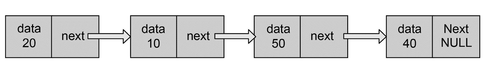

# *第 8 章*

# Java 高级数据结构

## 学习目标

本课程结束时，您将能够：

*   实现一个链表
*   实现一个二叉搜索树
*   使用枚举可以更好地处理常量
*   解释 HashSet 中唯一性背后的逻辑

## 导言

在前面的课程中，您学习了 Java 中的各种数据结构，例如列表、集合和映射。您还学习了如何迭代许多数据结构，以多种不同的方式比较对象；并以有效的方式对这些集合进行排序。

在本课程中，您将学习高级数据结构（如链表和二进制搜索树）的实现细节。随着我们的进展，您还将了解一个称为枚举的强大概念，并探索如何有效地使用它们而不是常量。在本课结束时，您将了解**equals（）**和**hashCode（）**背后的魔力和神秘。

## 实现自定义链表

列表有两种实现：

*   **ArrayList**：这是使用数组作为底层数据结构来实现的。它与阵列具有相同的限制。
*   **链表**：链表中的元素分布在内存中，与数组相反，它们是连续的。

### ArrayList 的缺点

ArrayList 的缺点如下：

*   虽然 ArrayList 是动态的，在创建过程中不需要提及大小。但是，由于数组的大小是固定的，因此当向列表中添加更多元素时，通常需要隐式调整 ArrayList 的大小。调整大小遵循创建新数组并将前一个数组的所有元素添加到新数组中的过程。
*   在 ArrayList 的末尾插入新元素通常比在列表之间添加要快，但是，在列表之间添加元素的代价很高，因为必须为新元素创建房间，而要创建房间，必须移动现有元素。
*   删除 ArrayList 的最后一个元素通常会更快，但是，如果在其间删除元素，则代价会更高，因为必须调整元素，将元素向左移动。

### 链表优于数组

以下是链表相对于数组的优势：

*   动态调整大小，因为大小不是固定的，所以不存在调整大小的问题。每个节点都持有对下一个节点的引用。
*   与向量和数组相比，在链表中随机添加和删除元素要简单得多。

在本主题中，您将学习如何为特定目的构建自定义链表。通过这样做，我们将了解链表的威力，并了解实施细节。

以下是链表的图示：



###### 图 8.1：链表的表示

动态内存分配是链表的一个流行应用。链表的其他应用包括数据结构的实现，如堆栈、队列、图、树等的各种实现。

### 练习 31：向链表添加元素

让我们创建一个简单的链表，允许我们添加整数，并打印列表中的元素：

1.  创建一个类**SimpleIntLinkedList**如下：

    ```java
    public class SimpleIntLinkedList 
    {
    ```

2.  创建另一个类**节点**，表示链表中的每个元素。每个节点都有它需要保存的数据（一个整数值）；并且它将引用下一个**节点**。对数据和**下一个**变量

    ```java
    static class Node {
    Integer data;
    Node next;
    Node(Integer d) {
    data = d;
    next = null;
    }
    Node getNext() {
    return next;
    }
    void setNext(Node node) {
    next = node;
    }
    Object getData() {
    return data;
    }
    }
    ```

    执行 getter 和 setter
3.  执行**添加（对象项）**方法，可以将任何项/对象添加到此列表中。通过传递**newItem=new Node（item）**项，构造一个新的**节点**对象。从**头**节点开始，移动到列表的末尾，访问每个节点。在最后一个节点中，将下一个节点设置为我们新创建的节点（**newItem**。通过调用**incrementIndex（）**来增加索引，以跟踪索引：

    ```java
    // appends the specified element to the end of this list.
        public void add(Integer element) {
            // create a new node
            Node newNode = new Node(element);
            //if head node is empty, create a new node and assign it to Head
            //increment index and return
            if (head == null) {
                head = newNode;
                return;
            }
            Node currentNode = head;

            while (currentNode.getNext() != null) {
                    currentNode = currentNode.getNext();
            }
            // set the new node as next node of current
            currentNode.setNext(newNode);
        }
    ```

4.  实现一个**toString（）**方法来表示这个对象。从**头**节点开始，迭代所有节点，直到找到最后一个节点。在每次迭代中，构造存储在每个节点中的整数的字符串表示形式。表示将类似于此：**【输入 1、输入 2、输入 3】**

    ```java
      public String toString() {
        String delim = ",";
        StringBuffer stringBuf = new StringBuffer();
        if (head == null)
          return "LINKED LIST is empty";
        Node currentNode = head;
        while (currentNode != null) {
          stringBuf.append(currentNode.getData());
          currentNode = currentNode.getNext();
          if (currentNode != null)
            stringBuf.append(delim);
          }
        return stringBuf.toString();
      }
    ```

5.  Create a member attribute of type **Node** (pointing to the **head** node) for the **SimpleIntLinkedList**. In the **main** method, create an object of **SimpleIntLinkedList** and add five integers one after the other (13, 39, 41, 93, 98) into it respectively. Print the **SimpleIntLinkedList** object.

    ```java
    Node head;
    public static void main(String[] args) {
      SimpleLinkedList list = new SimpleLinkedList();
      list.add(13);
      list.add(39);
      list.add(41);
      list.add(93);
      list.add(98);
      System.out.println(list);
      }
    }
    ```

    输出结果如下：

    ```java
    [13, 39, 41, 93, 98]
    ```

### 活动 32：用 Java 创建自定义链表

在我们的练习中，我们创建了一个可以接受整数值的链表。作为一项活动，让我们创建一个自定义链表，可以将任何对象放入其中，并显示添加到列表中的所有元素。另外，让我们再添加两个方法来获取和删除链表中的值。

以下步骤将帮助您完成此活动：

1.  创建类名**SimpleObjLinkedList**并创建 Node 类型的成员属性（指向 head 节点）。添加类型为**int**的成员属性（指向节点中的当前索引或位置）
2.  创建表示链表中每个元素的类节点。每个节点都将有一个需要保存的对象，并且它将具有对下一个节点的引用。**LinkedList**类将有一个对 head 节点的引用，并将能够通过**node.getNext（）**遍历到下一个节点。因为**头**是第一个元素，所以我们可以通过在**当前**节点中移动 next 来穿越到下一个元素。这样，我们可以遍历到列表的最后一个元素。
3.  执行**添加（对象项）**方法，以便可以将任何项/对象添加到此列表中。通过传递**newItem=new Node（item）**项，构造一个新的**节点**对象。从**头**节点开始，爬行到列表的末尾。在最后一个节点中，将**下一个**节点设置为我们新创建的节点（**newItem**。增加索引。
4.  执行**get（整数索引）**方法，根据索引从列表中检索项目。索引不得小于 0。写入爬网到指定索引的逻辑，标识节点并从节点返回值。
5.  执行**删除（整数索引）**方法，根据索引从列表中删除该项。写入逻辑以爬网到指定索引之前的一个节点并标识该节点。在此节点中，将下一个设置为**getNext（）**，如果元素被发现并删除，则返回 true。如果未找到元素，则返回 false。
6.  实现一个**toString（）**方法来表示这个对象。从 head 节点开始，迭代所有节点，直到找到最后一个节点。在每次迭代中，构造存储在每个节点中的对象的字符串表示形式。
7.  Write a **main** method and add create an object of **SimpleObjLinkedList** and add five Strings one after the other ("INPUT-1", "INPUT-2", "INPUT-3", "INPUT-4","INPUT-5") into it respectively. Print the **SimpleObjLinkedList** object. In the main method, get the item from the list using **get(2)** and print the value of the item retrieved, also remove the item from the list **remove(2)** and print the value of the list. One element should have been deleted from the list.

    输出结果如下：

    ```java
    [INPUT-1 ,INPUT-2 ,INPUT-3 ,INPUT-4 ,INPUT-5 ]
    INPUT-3
    [INPUT-1 ,INPUT-2 ,INPUT-3 ,INPUT-5 ]
    ```

    #### 笔记

    有关此活动的解决方案，请参见第 356 页。

### 链表的缺点

链表的缺点如下：

*   访问元素的唯一方法是从第一个元素开始，然后依次移动；随机访问元素是不可能的。
*   搜索很慢。
*   链表需要额外的内存空间。

## 实现二叉搜索树

我们已经在*第 7 课**Java 集合框架和泛型*中简要介绍了树。让我们来看一个称为**二进制搜索树（BST）**的树的特殊实现。

为了理解 BSTs，让我们来看看二叉树是什么。树中每个节点最多有两个子节点的树是一棵**二叉树**。

BST 是二叉树的一种特殊实现，其中左侧子节点始终小于或等于父节点，右侧子节点始终大于或等于父节点。二叉搜索树的这种独特结构使得添加、删除和搜索树中的元素变得更加容易。下图表示 BST：


###### 图 8.2：二进制搜索树的表示

二叉搜索树的应用如下：

*   实现一个字典。
*   在数据库中实现多级索引。
*   实现一个搜索算法。

### 练习 32：用 Java 创建二叉搜索树

在本练习中，我们将创建一个二叉搜索树并实现左右遍历。

1.  创建一个包含**节点**类的**BinarySearchTree**类。**节点**类应该有两个元素指向其左侧和右侧节点。

    ```java
    //Public class holding the functions of Entire Binary Tree structure
    public class BinarySearchTree
    {
        private Node parent;
        private int  data;
        private int  size = 0;
        public BinarySearchTree() {
            parent = new Node(data);
        }
    private class Node {
            Node left; //points to left node
            Node right; //points to right node
            int  data;
            //constructor of Node
            public Node(int data) {
                this.data = data;
            }
    }
    ```

2.  We will create a **add(int data)** function, which will check whether the parent node is empty. If it is empty, it will add the value to the parent node. If the parent node has data, we need to create a new **Node(data)** and find the right node (according to the BST rule) to attach this new node.

    为了帮助找到正确的节点，已经实现了一种方法**add（node root，node newNode）**，使用递归逻辑进行深入分析，并找到这个新节点应该属于的实际节点。

    根据 BST 规则，如果根数据大于**新节点**数据，则必须将**新节点**添加到左侧节点。再次，递归地检查它是否有子节点，BST 的相同逻辑将一直应用，直到它到达叶节点添加值为止。如果根数据小于**新节点**数据，则必须将**新节点**添加到右节点。再次，递归检查它是否有子节点，BST 的相同逻辑将应用，直到它到达叶节点添加值：

    ```java
    /**
    * This is the method exposed as public for adding elements into the Tree.
         * it checks if the size == 0 and then adds the element into parent node. if
         * parent is already filled, creates a New Node with data and calls the
         * add(parent, newNode) to find the right root and add it to it.
         * @param data
         */
      public void add(int data) {
        if (size == 0) {
          parent.data = data;
          size++;
        } else {
          add(parent, new Node(data));
        }
      }
    /**
     * Takes two params, root node and newNode. As per BST, check if the root
     * data is > newNode data if true: newNode has to be added in left Node
     * (again recursively check if it has child nodes and the same logic of BST
     * until it reaches the leaf node to add value) else: newNode has to be
     * added in right (again recursively check if it has child nodes and the
     * same logic of BST until it reaches the leaf node to add value)
    * 
     * @param root
     * @param newNode
     */
      private void add(Node root, Node newNode) {
        if (root == null) {
          return;
        }
      if (newNode.data < root.data) {
          if (root.left == null) {
            root.left = newNode;
            size++;
          } else {
            add(root.left, newNode);
          }
        }
        if ((newNode.data > root.data)) {
          if (root.right == null) {
            root.right = newNode;
            size++;
          } else {
            add(root.right, newNode);
          }
        }
      }
    ```

3.  创建一个**traverseLeft（）**函数，遍历并打印根节点左侧 BST 的所有值：

    ```java
      public void traverseLeft() {
      Node current = parent;
      System.out.print("Traverse the BST From Left : ");
            while (current.left != null && current.right != null) {
                System.out.print(current.data + "->[" + current.left.data + " " + current.right.data + "] ");
                current = current.left;
            }
            System.out.println("Done");
        }
    ```

4.  创建一个**traverseRight（）**函数，遍历并打印根节点右侧的所有 BST 值：

    ```java
        public void traverseRight() {
            Node current = parent;
            System.out.print("Traverse the BST From Right");
            while (current.left != null && current.right != null) {
                System.out.print(current.data + "->[" + current.left.data + " " + current.right.data + "] ");
                current = current.right;
            }
            System.out.println("Done");
        }
    ```

5.  Let's create an example program to test the functionality of the BST:

    ```java
        /**
         * Main program to demonstrate the BST functionality.
         * - Adding nodes
         * - finding High and low 
         * - Traversing left and right
         * @param args
         */
        public static void main(String args[]) {
            BinarySearchTree bst = new BinarySearchTree();
            // adding nodes into the BST
            bst.add(32);
            bst.add(50);
            bst.add(93);
            bst.add(3);
            bst.add(40);
            bst.add(17);
            bst.add(30);
            bst.add(38);
            bst.add(25);
            bst.add(78);
            bst.add(10);
            bst.traverseLeft();
            bst.traverseRight();
    }
        }
    ```

    结果如下：

    ```java
    Traverse the BST From Left : 32->[3 50] Done
    Traverse the BST From Right32->[3 50] 50->[40 93] Done
    ```

### 活动 33：实现 BinarySearchTree 类中的方法，以查找 BST 中的最高值和最低值

1.  创建一个方法**getLow（）**，实现**while**循环，迭代检查父节点是否有剩余子节点，并将左侧 BST 中没有剩余子节点的节点作为最低值返回。
2.  创建一个方法**getHigh（）**，实现**while**循环，迭代检查父节点是否有任何正确的子节点，并将右侧 BST 中没有正确子节点的节点作为最高值返回。
3.  In the **main** method, add elements to the binary search tree, using the **add** method implemented earlier and call the **getLow()** and the **getHigh()** methods to identify the highest and the lowest values.

    输出结果如下：

    ```java
    Lowest value in BST :3
    Highest value in BST :93
    ```

    #### 笔记

    此活动的解决方案可在第 360 页找到。

## 枚举

Java 中的枚举（或枚举）是 Java 中的一种特殊类型，其字段由常量组成。它用于强制执行编译时安全性。

例如，考虑一周中的一天，它们是一组固定常量，因此我们可以定义一个枚举：

```java
public enum DayofWeek { 
 SUNDAY, MONDAY, TUESDAY, WEDNESDAY, THURSDAY, FRIDAY, SATURDAY  
} 
```

现在，我们可以简单地检查存储一天的变量是否是声明的枚举的一部分。我们还可以为非通用常量声明枚举，例如：

```java
public enum Jobs { 
  DEVELOPER, TESTER, TEAM LEAD, PROJECT MANAGER 
}
```

这将强制作业类型为在**作业**枚举中声明的常量。以下是持有货币的枚举示例：

```java
public enum Currency {
    USD, INR, DIRHAM, DINAR, RIYAL, ASD 
}
```

### 练习 33：使用 Enum 存储方向

我们将创建一个枚举，并查找值和比较枚举。

1.  在**main**方法中创建一个类**EnumExample**和。使用值作为枚举获取并打印枚举。使用字符串形式的值获取并打印枚举：

    ```java
    public class EnumExample
    {
        public static void main(String[] args)
        {
            Direction north = Direction.NORTH;
            System.out.println(north + " : " + north.no);
            Direction south = Direction.valueOf("SOUTH");
            System.out.println(south + " : " + south.no);
        }
    }
    ```

2.  Let's create a enum holding directions with an integer value representing the directions:

    ```java
    public enum Direction
        {
                      EAST(45), WEST(90), NORTH(180), SOUTH(360);
                int no;

    Direction(int i){
                    no =i;
                }
        }
    ```

    结果如下：

    ```java
    NORTH : 180
    SOUTH : 360
    ```

### 活动 34：使用枚举保存学院系详细信息

让我们建立一个完整的 enum 来容纳学院院系及其编号**（BE（“工程学士”，100））**。

执行以下步骤：

1.  使用**enum**关键字创建**DeptEnum**enum。添加两个私有属性（String**deptName**和 int**deptNo**来保存要保存在枚举中的值。
2.  . 重写构造函数以获取首字母缩写和**deptNo**并将其放置在成员变量中。添加依附于构造函数的枚举常量。
3.  为**deptName**和**deptNo**添加吸气剂方法。
4.  Let's write a **main** method and sample program to demonstrate the use of enums:

    输出如下：

    ```java
    BACHELOR OF ENGINEERING : 1
    BACHELOR OF ENGINEERING : 1
    BACHELOR OF COMMERCE : 2
    BACHELOR OF SCIENCE : 3
    BACHELOR OF ARCHITECTURE : 4
    BACHELOR : 0
    true
    ```

    #### 笔记

    有关此活动的解决方案，请参见第 362 页。

### 活动 35：实施反向查找

编写一个值为的应用程序

1.  创建一个 enum**应用程序**，声明常量 BE、BCOM、BSC 和 BARC，以及它们的完整表单和部门号。
2.  同时声明两个私有变量**accronym**和**deptNo**。
3.  创建一个参数化构造函数，并使用作为参数传递的值分配变量**accronym**和**deptNo**。
4.  声明一个返回变量**accronym**的公共方法**getAccronym（）**和一个返回变量**deptNo**的公共方法**getDeptNo（）**。
5.  实现反向查找，以获取课程名称，并在**应用程序**枚举中搜索相应的首字母缩略词。
6.  实现 main 方法，并运行程序。

您的输出应类似于：

```java
BACHELOR OF SCIENCE : 3
BSC
```

#### 笔记

有关此活动的解决方案，请参见第 363 页。

## 集合与集合中的唯一性

在本主题中，我们将学习查找所添加对象唯一性的集合背后的逻辑，并了解两种对象级方法的重要性。

神奇之处在于**对象**类的两种方法

*   **hashCode（）**
*   **等于（）**

### equals（）和 hashCode（）方法的基本规则

*   只有当使用**hashcode（）**方法返回的值相同且**equal（）**方法返回 true 时，两个对象才能相同。
*   如果两个对象返回相同的**hashCode（）**值，则不一定意味着两个对象相同（因为散列值也可能与其他对象冲突）。在这种情况下，需要通过调用**equals（）**并验证身份来找到相等。
*   我们不能单独使用**hashCode（）**来找出等式；我们也需要使用**equals（）**来完成此操作。然而，仅凭**hashCode（）**就足以找到不等式。如果 AutoT6H.HASCODE（）.OUTT7A.返回不同的值，则安全地考虑对象是不同的。

### 向集合中添加对象

虽然在我们将对象添加到集合中时会发生很多事情，但我们将只查看与我们的研究主题相关的细节：

*   该方法首先调用该对象上的**hashCode（）**方法，获取**hashCode**，然后**Set**将其与其他对象的**hashCode**进行比较，并检查是否有任何对象匹配该**hashCode**。
*   如果集合中没有任何对象与添加对象的**哈希代码**匹配，那么我们可以 100%确信没有其他具有相同身份的对象可用。新添加的对象将安全地添加到集合中（无需检查**等于（）**。
*   如果其中任何一个对象与添加的对象的**哈希代码**匹配，则意味着它可能是添加的相同对象（因为**哈希代码**对于两个不同的对象可能是相同的）。在这种情况下，为了确认怀疑，它将使用**equals（）**方法查看对象是否真的相等。如果相等，则不会拒绝新添加的对象，否则将拒绝新添加的 objected。

### 练习 34：理解 equals（）和 hashCode（）的行为

在实现**equals（）**和**hashCode（）**之前，让我们创建一个新类并遍历**Set**的行为：

1.  创建一个具有三个属性的学生类：**姓名**（**字符串**）、**年龄**（**int**）和**通过年份**（**int**）。还为这些私有成员创建 getter 和 setter:

    ```java
    /**
     * Sample Class student containing attributes name, age and yearOfPassing
     *
     */
    import java.util.HashSet;
    class Student {
        private String name;
        private Integer age;
        private Integer yearOfPassing;
        public String getName() {
            return name;
        }
        public void setName(String name) {
            this.name = name;
        }
        public int getAge() {
            return age;
        }
        public void setAge(int age) {
            this.age = age;
        }
        public int getYearOfPassing() {
            return yearOfPassing;
        }
        public void setYearOfPassing(int releaseYr) {
            this.yearOfPassing = releaseYr;
        }
    }
    ```

2.  编写一个示例类**HashCodeExample**，以演示集合行为。在主方法中，创建三个具有不同名称和其他细节的**学生**对象（Raymonds、Allen 和 Maggy）：

    ```java
    /**
     * Example class demonstrating the set behavior
     * We will create 3 objects and add into the Set
     * Later will create a new object resembling same as one of the 3 objects created and added into the set
    */
    public class HashCodeExample {
        public static void main(String[] args) {
            Student m = new Student();
            m.setName("RAYMONDS");
            m.setAge(20);
            m.setYearOfPassing(2011);
            Student m1 = new Student();
            m1.setName("ALLEN");
            m1.setAge(19);
            m1.setYearOfPassing(2010);
            Student m2 = new Student();
            m2.setName("MAGGY");
            m2.setAge(18);
            m2.setYearOfPassing(2012);
    }
    }
    ```

3.  创建一个**散列集**来保存这些学生的对象（**集**。将三个对象依次添加到**哈希集**。然后，打印**散列集**：

    ```java
        HashSet<Student> set = new HashSet<Student>();
            set.add(m);
            set.add(m1);
            set.add(m2);
            //printing all the elements of Set
    System.out.println("Before Adding ALLEN for second time : ");
            for (Student mm : set) {
                System.out.println(mm.getName() + " " + mm.getAge());
            }
    ```

    中的值
4.  In the **main** method, create another **Student** object resembling one of the three objects created (for example: let's create a student, similar to Allen). Add this newly created **Student** object to the **HashSet** in which three students have already been **added(set)**. Then, print the values in the **HashSet**. You will notice that Allen has been added into the set twice (which means duplicates were not handled in the Set):

    ```java
        //creating a student similar to m1 (name:ALLEN, age:19, yearOfPassing:2010)
            Student m3 = new Student();
            m3.setName("ALLEN");
            m3.setAge(19);
            m3.setYearOfPassing(2010);
    //this Student will be added as hashCode() and equals() are not implemented
            set.add(m3);
            // 2 students with same details (ALLEN 19 will be noticed twice)
    System.out.println("After Adding ALLEN for second time: ");
            for (Student mm : set) {
                System.out.println(mm.getName() + " " + mm.getAge());
            }
    ```

    结果如下：

    ```java
    Before Adding ALLEN for second time : 
    RAYMONDS 20
    MAGGY 18
    ALLEN 19
    After Adding ALLEN for second time: 
    RAYMONDS 20
    ALLEN 19
    MAGGY 18
    ALLEN 19
    ```

**艾伦**确实加入了两次剧组（这意味着剧组中还没有处理过重复的剧组）。需要在**学生**班处理。

### 练习 35：重写 equals（）和 hashCode（）

让我们为**学生**覆盖**equals（）**和**hashCode（）**，看看 Set 的行为在这之后是如何变化的：

1.  在**学生**类中，让我们通过检查**学生**对象的每个属性来覆盖**equals（）**方法（**姓名**、**年龄**、**光年**对于验证身份同样重要）。**对象**层级中的**equals（）**方法将**对象**作为参数。要覆盖该方法，我们需要提供逻辑，将 self 属性（**this**与**object o**参数进行比较。这里的平等逻辑是，当且仅当两个学生的**姓名**、**年龄**和**学龄**相同时，才说他们是相同的：

    ```java
        @Override
        public boolean equals(Object o) {
            Student m = (Student) o;
            return m.name.equals(this.name) && 
                    m.age.equals(this.age) && 
                    m.yearOfPassing.equals(this.yearOfPassing);
        }
    ```

2.  在**学生**类中，让我们重写**hashCode（）**方法。基本要求是，对于相同的对象，它应该返回相同的整数。实现**hashCode**的一种简单方法是获取对象中每个属性的**hashCode**并将其相加。这背后的基本原理是，如果**姓名**、**年龄**或**通行年限**不同，那么**哈希码**将返回不同的值，显然没有两个对象是相同的：

    ```java
    @Override
        public int hashCode() {
            return this.name.hashCode() + 
                    this.age.hashCode() + 
                    this.yearOfPassing.hashCode();
        }
    ```

3.  Let's run the main method of **HashCodeExample** to demonstrate the behavior of the set after overriding **equals()** and **hashCode()** in the Student object.

    ```java
    public class HashCodeExample {
        public static void main(String[] args) {
            Student m = new Student();
            m.setName("RAYMONDS");
            m.setAge(20);
            m.setYearOfPassing(2011);
            Student m1 = new Student();
            m1.setName("ALLEN");
            m1.setAge(19);
            m1.setYearOfPassing(2010);
            Student m2 = new Student();
            m2.setName("MAGGY");
            m2.setAge(18);
            m2.setYearOfPassing(2012);

            Set<Student> set = new HashSet<Student>();
            set.add(m);
            set.add(m1);
            set.add(m2);

            //printing all the elements of Set
    System.out.println("Before Adding ALLEN for second time : ");
            for (Student mm : set) {
                System.out.println(mm.getName() + " " + mm.getAge());
            }
        //creating a student similar to m1 (name:ALLEN, age:19, yearOfPassing:2010)
            Student m3 = new Student();
            m3.setName("ALLEN");
            m3.setAge(19);
            m3.setYearOfPassing(2010);
    //this element will not be added if hashCode and equals methods are implemented
            set.add(m3);
    System.out.println("After Adding ALLEN for second time: ");
            for (Student mm : set) {
                System.out.println(mm.getName() + " " + mm.getAge());
            }

        }
    }
    ```

    结果如下：

    ```java
    Before Adding ALLEN for second time: 
    ALLEN 19
    RAYMONDS 20
    MAGGY 18
    After Adding ALLEN for second time: 
    ALLEN 19
    RAYMONDS 20
    MAGGY 18
    ```

在添加了**hashCode（）**和**equals（）**之后，我们的**HashSet**具有识别和删除重复项的智能。

如果我们不重写**equals（）**和**hashCode（）**，JVM 会在内存中创建每个对象时为它们分配一个唯一的哈希代码值，如果开发人员不重写**hashCode**方法，则无法保证这两个对象返回相同的哈希代码值。

## 总结

在这节课中，我们学习了什么是 BST，以及用 Java 实现 BST 基本功能的步骤。我们还学习了一种左右遍历 BST 的技术。我们研究了枚举在常量上的使用，并了解了它们解决的问题类型。我们还构建了自己的枚举，并编写了获取和比较枚举值的代码。

我们还了解了**HashSet**如何识别重复项，并研究了覆盖**equals（）**和**hashCode（）**的意义。此外，我们还学习了如何正确实现**equals（）**和**hashCode（）**。