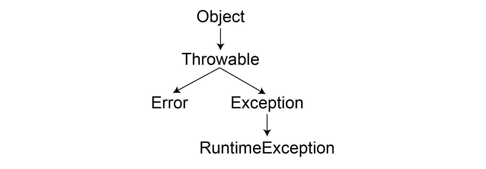
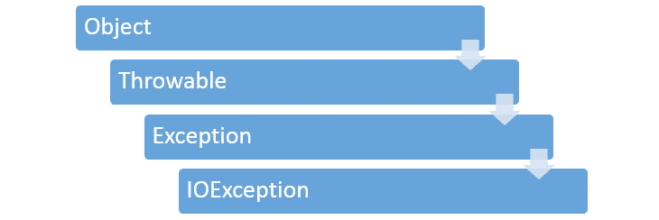
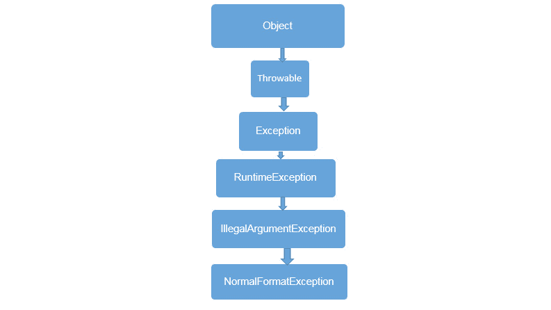

# *第 9 章*

# 异常处理

## 学习目标

本课程结束时，您将能够：

*   使用异常抛出库
*   有效地使用异常处理
*   以尊重异常的方式获取和释放资源，而不会造成泄漏
*   实现最佳实践以在 Java 中合并异常

## 导言

异常处理是一种强大的机制，用于处理代码运行时发生的错误情况。它使我们能够专注于程序的主执行，并将错误处理代码与预期的执行路径分开。Java 语言迫使程序员为库方法编写异常处理代码，IDE（如 IntelliJ、Eclipse 等）帮助我们生成必要的样板代码。然而，如果没有适当的指导和理解，标准例外代码可能导致弊大于利。本课程是对异常的实用介绍，它将促使您考虑异常处理的各个方面，并将提供一些经验法则，在您的编程生活中处理异常时可能会有所帮助。

## 异常背后的动机

当我们创建程序时，我们通常关注预期的场景。例如，我们将从某处获取数据，我们将从我们假设存在的数据中提取某些信息，我们将其发送到其他地方，等等。我们希望我们的代码是可读的，以便我们的团队成员能够清楚地理解业务逻辑，并能够发现我们可能犯的错误。然而，在实践中，我们的假设可能不成立，并且可能与预期情景存在偏差。例如，由于网络或磁盘出现问题，我们可能无法获取数据。我们可能会收到不符合我们假设的数据。或者，由于类似的问题，我们可能无法发送数据。我们必须创建在意外情况下表现优雅的程序。例如：我们应该允许用户在断开的网络连接上重试。异常是我们在 Java 中处理此类情况的方式，而不会使代码过于复杂。

作为程序员，我们必须编写在各种意外情况下运行良好的代码。然而，我们也希望我们的代码干净易懂。这两个目标常常相互竞争。

我们希望编写清晰的代码，如下所示：

```java
Do step 1
Do step 2
Do step 3
Done
```

这反映了一种乐观的情况，即没有意外发生。然而，意外情况经常发生。用户的 internet 连接可能已断开，web 资源可能已断开，客户端可能内存不足，可能发生磁盘错误，等等。除非我们编写能够预见这些问题的代码，否则当这些问题出现时，我们的程序可能会崩溃。很难预测可能发生的每一种问题。即使我们简化事情并以同样的方式处理大多数错误，我们仍然可能需要对代码执行许多检查。例如：我们可能需要编写更像这样的代码：

```java
Do step 1
If there was a problem with step 1, 
     Handle the error, stop
Else 
    Do step 2
    If there was a problem with step 2, 
           Handle the error, stop
    Else 
           Do step 3
           If there was a problem with step 3
                 Handle the error, stop
           Else
Done
```

您可以提出替代的代码结构，但一旦您在每一步都加入额外的代码来处理错误，您的代码就变得不那么可读、不那么容易理解和维护。如果未包含此类错误处理代码，则程序可能会导致意外情况，如崩溃。

这里是 C 中的一个函数，它处理的错误与前面的伪代码类似。

```java
int other_idea()
{
    int err = minor_func1();
    if (!err)
        err = minor_func2();
    if (!err)
        err = minor_func3();
    return err;
}
```

当您使用 C 等原始语言编写代码时，不可避免地会在可读性和完整性之间产生强烈的张力。幸运的是，在大多数现代编程语言中，我们都有异常处理功能来减少这种紧张。您的代码既可以可读，也可以同时处理错误。

异常处理背后的主要语言构造是**try-catch**块。您在 try 之后输入的代码将逐行执行。如果其中任何一行导致错误，try 块中的其余行将不执行，执行将转到 catch 块，这样您就有机会优雅地处理错误。在这里，您将收到一个异常对象，其中包含有关问题的详细信息。但是，如果 try 块中没有发生错误，则永远不会执行 catch 块。

在这里，我们修改了我们的初始示例，以使用 try-catch 块来处理错误，而不是使用许多**if**语句：

```java
Try
Do step 1
Do step 2
Do step 3
Catch error
    Handle error appropriately
Done
```

在这个版本中，我们的代码放在 try 和 catch 关键字之间。我们的代码没有错误处理代码，否则会妨碍可读性。代码的默认预期路径非常清楚：步骤 1、步骤 2 和步骤 3。但是，如果发生错误，执行将立即移动到 catch 块。在那里，我们以异常对象的形式接收关于问题所在的信息，并有机会优雅地处理错误。

大多数情况下，您将拥有相互依赖的代码段。因此，如果其中一个步骤发生错误，您通常不希望执行其余步骤，因为它们取决于前面步骤的成功。您可以创造性地使用**try-catch**块来表示代码依赖关系。例如：在下面的伪代码中，步骤 2 和步骤 5 中存在错误。成功执行的步骤是步骤 1 和 4。由于步骤 4 和后续步骤与前三个步骤的成功无关，因此我们可以使用两个独立的**try**-**catch**块来表示它们的依赖关系。步骤 2 中的错误阻止了步骤 3 的执行，但没有阻止步骤 4 的执行：

```java
Try
Do step 1
Do step 2 - ERROR
Do step 3
Catch error
    Handle error appropriately
Done
Try
Do step 4
Do step 5 - ERROR
Do step 6
Catch error
    Handle error appropriately
Done
```

如果存在异常而您没有捕获它，则错误将传播到调用方。如果这是你的应用程序，你不应该让错误从你的代码中传播出去，以防止你的应用程序崩溃。但是，如果您正在开发一个由其他代码调用的库，那么让错误传播到调用方有时是一个好主意。稍后我们将更详细地讨论这一点。

### 练习 36：引入例外

现在，让我们来看看实际操作中的异常。其中一个典型的例外是尝试将一个数字除以零。在这里，我们将使用它创建异常并验证前面的伪代码：

1.  新建**Main**类，添加 Main 方法如下：

    ```java
    public class Main {
       public static void main(String[] args) { 
    ```

2.  Write code to print the result of the division of two numbers. Add the **try** – **catch** block to handle the exceptions:

    ```java
    try {
    System.out.println("result 1: " + (2 / 2));
    System.out.println("result 2: " + (4 / 0));
    System.out.println("result 3: " + (6 / 2));
        } catch (ArithmeticException e) {
    System.out.println("---- An exception in first block");
    }
    try {
    System.out.println("result 4: " + (8 / 2));
    System.out.println("result 5: " + (10 / 0));
    System.out.println("result 6: " + (12 / 2));
    } catch (ArithmeticException e) {
    System.out.println("---- An exception in second block");
    }
    }
    }
    ```

    运行代码并验证输出是否如下所示：

    ```java
    result 1: 1
    ---- An exception in block 1
    result 4: 4
    ---- An exception in block 2
    ```

请注意，结果 2 和 5 包含除法运算，其中我们将一个数字除以零，这将导致异常。这样，我们有意在这两行中创建异常，以查看异常情况下的执行进度。以下是预期执行的细分：

*   结果 1 应该打印好。
*   在结果 2 的执行过程中，我们应该得到一个异常，它应该阻止结果 2 的打印。
*   由于异常，执行应该跳转到 catch 块，这将阻止打印结果 3。
*   结果 4 应该打印好。
*   就像结果 2 一样，在结果 5 的执行过程中，我们应该得到一个异常，它应该阻止结果 5 的打印。
*   类似地，由于异常，执行应该跳转到 catch 块，这将阻止打印结果 6。

在两个**try catch**块的帮助下，我们应该跳过结果 3 和 6，因为结果 2 和 5 上存在异常。这应该只剩下结果 1 和 4，它们将被成功执行。

这表明我们前面的讨论是正确的。此外，要验证执行顺序，请在结果 1 行中放置一个断点，然后单击 step over，通过**try**-**catch**块一步一步地观察执行过程。

借助异常和**try-catch**块，我们能够编写更多关注预期默认执行路径的代码，同时确保我们能够处理意外错误，并根据错误的严重程度正常恢复或失败。

### 不可避免地引入例外

实际上，大多数 Java 新手在从库中调用异常抛出方法时都会遇到异常。这样的方法可以指定使用 throws 语句引发异常。当您调用这种方法时，您的代码将不会编译，除非您编写的代码对该方法可能引发的异常进行了处理。

因此，作为一名 Java 开发新手，您只想调用一个方法，现在您不得不对它可能抛出的异常做一些处理。IDE 可以生成处理异常的代码。但是，默认生成的代码通常不是最好的。没有指导和 IDE 代码生成能力的新手可能会创建非常糟糕的代码。在本节中，将指导您如何最好地使用 IDE 生成的异常处理代码。

假设您编写了以下代码来打开和读取文件：

```java
import java.io.File;
import java.io.FileInputStream;
public class Main {
   public static void main(String[] args) {
       File file = new File("./tmp.txt");
       FileInputStream inputStream = new FileInputStream(file);
   }
}
```

目前，您的代码将无法编译，您的 IDE 在**FileInputStream**构造函数下面加了红色下划线。这是因为它可能会引发异常，如其源代码中所指定：

```java
public FileInputStream(File file) throws FileNotFoundException {
```

在这一点上，您的 IDE 通常试图提供帮助。例如，当您将插入符号移动到**FileInputStream**并在 IntelliJ 中点击*Alt*+*Enter*时，您将看到两个快速修复选项：**将异常添加到方法签名**和**用 try/catch**环绕。这些对应于处理指定异常时的两个选项，我们将在后面更深入地了解这两个选项。以下是第一个选项将代码转换为的内容：

```java
import java.io.File;
import java.io.FileInputStream;
import java.io.FileNotFoundException;
public class Main {
   public static void main(String[] args) throws FileNotFoundException {
       File file = new File("input.txt");
       FileInputStream inputStream = new FileInputStream(file);
   }
}
```

现在，主函数还指定它可以引发异常。这种异常会导致程序立即退出，这可能是您想要的，也可能不是您想要的。如果这是作为库提供给其他人的函数，则此更改将阻止他们编译代码，除非他们像您一样对指定的异常做了相应的处理。同样，这可能不是你想要做的。

如果您选择了 IntelliJ 提供的第二个选项“**环绕 try/catch**”，那么您的代码将变成：

```java
import java.io.File;
import java.io.FileInputStream;
import java.io.FileNotFoundException;
public class Main {
   public static void main(String[] args) {
       File file = new File("input.txt");
       try {
           FileInputStream inputStream = new FileInputStream(file);
       } catch (FileNotFoundException e) {
           e.printStackTrace();
       }
   }
}
```

在本例中，我们自己编写代码来处理异常。这感觉更合适；我们正在承担责任并编写代码来处理异常。然而，当前形式的代码弊大于利。首先，除此之外，它实际上没有做任何有用的事情；它只是捕获它，将有关它的信息打印到**标准输出**，然后继续执行，就好像什么都没发生一样。特别是在一个不是控制台应用程序的项目中（像大多数 Java 程序一样），打印日志几乎没有什么用处。

如果我们找不到要打开的文件，我们应该聪明地思考我们能做什么。我们是否应该要求用户查找该文件？我们应该从网上下载吗？无论我们做什么，在一个模糊的日志文件中做一个记录，然后把问题隐藏起来，这可能是处理这个问题最糟糕的方法之一。如果我们不能做任何有用的事情，也许不处理异常并让我们的调用方处理它将是一种更诚实的处理问题的方法。

请注意，这里没有“银弹”或“一刀切”的建议。每个例外情况、每个应用程序、每个上下文和每个用户群都是不同的，我们应该提出最适合当前情况的异常处理策略。然而，如果您所做的只是**e.printStackTrace（）**，那么您可能做错了什么。

### 练习 37：使用 IDE 生成异常处理代码

在本练习中，我们将了解如何使用 IDE 生成异常处理代码：

1.  在 IntelliJ 中创建一个新的 Java 控制台项目。导入**文件**和**文件输入流**类：

    ```java
    import java.io.File;
    import java.io.FileInputStream;
    ```

2.  创建一个名为**Main**的类，并添加**Main（）**方法：

    ```java
    public class Main {
       public static void main(String[] args) {
    ```

3.  按如下方式打开文件：

    ```java
    File file = new File("input.txt");
    FileInputStream fileInputStream = new FileInputStream(file);
    ```

4.  Read the file as follows:

    ```java
    int data = 0;
    while(data != -1) {
    data = fileInputStream.read();
    System.out.println(data);
         }
         fileInputStream.close();
       }
    }
    ```

    请注意，IntelliJ 在四个地方用红色标出了我们的代码。这些函数指定引发异常。这会阻止代码执行。

5.  Go to the first issue (**FileInputStream**), press *Alt* + *Enter*, and select "**Add exception to method signature**". This is how your code should look now:

    ```java
    import java.io.File;
    import java.io.FileInputStream;
    import java.io.FileNotFoundException;
    public class Main {
       public static void main(String[] args) throws FileNotFoundException {
           File file = new File("input.txt");
           FileInputStream fileInputStream = new FileInputStream(file);
           int data = 0;
           while(data != -1) {
              data = fileInputStream.read();
              System.out.println(data);
           }
           fileInputStream.close();
       }
    }
    ```

    我们指定我们的**main**函数可以抛出**FileNotFoundException**，但这还不够，因为这不是其他函数抛出的异常类型。现在转到剩余的第一个问题（**读取**，按*Alt*+*输入*，再次选择“**方法签名添加异常**”。下面是您的代码现在的外观：

    ```java
    import java.io.File;
    import java.io.FileInputStream;
    import java.io.FileNotFoundException;
    import java.io.IOException;
    public class Main {
       public static void main(String[] args) throws IOException {
           File file = new File("input.txt");
           FileInputStream fileInputStream = new FileInputStream(file);
           int data = 0;
           while(data != -1) {
              data = fileInputStream.read();
              System.out.println(data);
           }
           fileInputStream.close();
       }
    }
    ```

    现在让我们运行代码。除非您同时创建了一个**input.txt**，否则这就是您应该看到的输出：

    ```java
    Exception in thread "main" java.io.FileNotFoundException: input.txt (The system cannot find the file specified)
    at java.io.FileInputStream.open0(Native Method)
    at java.io.FileInputStream.open(FileInputStream.java:195)
    at java.io.FileInputStream.<init>(FileInputStream.java:138)
    at Main.main(Main.java:9)
    ```

    异常从我们的主函数传播出去，JVM 捕获它并登录到控制台。

    这里发生了两件事。首先，修复**read（）**的问题就足以消除代码中的所有问题，因为**read**和**close**都会引发相同的异常：**IOException**，该异常列在主函数声明的 throws 语句中。然而，我们在那里列出的**FileNotFoundException**异常消失了。为什么？

    这是因为异常类位于层次结构中，**IOException**是**FileNotFoundException**的祖先类。由于每个**FileNotFoundException**也是一个**IOException**，指定**IOException**就足够了。如果这两个类不以这种方式相关，IntelliJ 将以逗号分隔的列表形式列出可能引发的异常。

6.  现在让我们为我们的程序提供**input.txt**。您可以在硬盘中的任意位置创建**input.txt**，并在代码中提供完整路径；但是，我们将使用一种简单的方法：IntelliJ 在主项目文件夹中运行您的程序。右键单击项目的**src**文件夹，然后单击**在资源管理器**中显示。现在您应该可以看到包含**src**文件夹的文件夹的内容；这是项目文件夹的根目录。在此处创建一个**input.txt**文件，并在其中写入文本“**abc**。如果再次运行程序，您将看到类似于以下内容的输出：

    ```java
    97
    98
    99
    -1
    ```

7.  指定异常是使程序工作的一种方法。另一种可能是抓住他们。让我们现在试试。返回到文件的以下版本；您可以重复使用“撤消”来执行此操作：

    ```java
    import java.io.File;
    import java.io.FileInputStream;
    public class Main {
       public static void main(String[] args) {
           File file = new File("input.txt");
           FileInputStream fileInputStream = new FileInputStream(file);
           int data = 0;
           while(data != -1) {
              data = fileInputStream.read();
              System.out.println(data);
           }
           fileInputStream.close();
       }
    }
    ```

8.  Now move the caret on to **FileInputStream**, hit *Alt* + *Enter*, and select "**Surround with try/catch**". Here is how your code should look:

    ```java
    import java.io.File;
    import java.io.FileInputStream;
    import java.io.FileNotFoundException;
    public class Main {
       public static void main(String[] args) {
           File file = new File("input.txt");
           FileInputStream fileInputStream = null;
           try {
               fileInputStream = new FileInputStream(file);
           } catch (FileNotFoundException e) {
               e.printStackTrace();
           }
           int data = 0;
           while(data != -1) {
               data = fileInputStream.read();
               System.out.println(data);
           }
           fileInputStream.close();
       }
    }
    ```

    注意这里发生了什么。它实际上将引用变量的创建与异常生成构造函数调用分离，而不是简单地用**try/catch**块包装该行。这主要是因为代码后面使用了**fileInputStream**，将其移动到**try/catch**块中会阻止这些用户看到它。这实际上是一种常见的模式；在**try/catch**块之前声明变量，处理其创建过程中的任何问题，并在必要时使其可供以后使用。

9.  当前代码有一个问题：**try/catch**块中的**FileInputStream**如果失败，**FileInputStream**将继续为空。在**try**/**catch**块之后，它将被解除引用，您将得到一个空引用异常。您有两个选项：要么将对象的所有用法放在**try/catch**块中，要么检查引用是否为 null。以下是两个选项中的第一个：

    ```java
    import java.io.File;
    import java.io.FileInputStream;
    import java.io.FileNotFoundException;
    public class Main {
       public static void main(String[] args) {
           File file = new File("input.txt");
           FileInputStream fileInputStream = null;
           try {
               fileInputStream = new FileInputStream(file);

               int data = 0;
               while(data != -1) {
                   data = fileInputStream.read();
                   System.out.println(data);
               }
               fileInputStream.close();
           } catch (FileNotFoundException e) {
               e.printStackTrace();
           }
       }
    }
    ```

10.  We moved the code inside the **try**/ **catch** block to make sure we don't dereference **fileInputStream** while null. However, we still have red underlines under **read()** and **close()**. *Alt* + *Enter* on **read()** gives you a couple of options, the first of which is to add a **catch** clause:

    ```java
    import java.io.File;
    import java.io.FileInputStream;
    import java.io.FileNotFoundException;
    import java.io.IOException;
    public class Main {
       public static void main(String[] args) {
           File file = new File("input.txt");
           FileInputStream fileInputStream = null;
           try {
               fileInputStream = new FileInputStream(file);
               int data = 0;
               while(data != -1) {
                   data = fileInputStream.read();
                   System.out.println(data);
               }
               fileInputStream.close();
           } catch (FileNotFoundException e) {
               e.printStackTrace();
           } catch (IOException e) {
               e.printStackTrace();
           }
       }
    }
    ```

    现在我们已经修复了代码中的所有问题，我们可以实际运行它了。请注意，第二个 catch 子句放在第一个之后，因为**IOException**是**FileNotFoundException**的父类。如果顺序相反，则类型为**FileNotFoundException**的异常实际上会被**IOException**catch 块捕获。

11.  Here is the second of the two options, not placing all the code inside the first try:

    ```java
    import java.io.File;
    import java.io.FileInputStream;
    import java.io.FileNotFoundException;
    public class Main {
       public static void main(String[] args) {
           File file = new File("input.txt");
           FileInputStream fileInputStream = null;
           try {
               fileInputStream = new FileInputStream(file);
           } catch (FileNotFoundException e) {
               e.printStackTrace();
           }
           if (fileInputStream != null) {
               int data = 0;
               while(data != -1) {
                   data = fileInputStream.read();
                   System.out.println(data);
               }
               fileInputStream.close();
           }
       }
    }
    ```

    如果**fileInputStream**不为空，我们将运行代码的第二部分。这样，如果创建**FileInputStream**失败，我们将阻止第二部分运行。像这样单独编写它没有多大意义，但是如果中间有其他不相关的代码，那么就有意义了。您不能将所有内容都放在同一个**try**块中，在以后的代码中，您可能必须依赖该**try**块的成功。从这个意义上讲，像这样一个简单的空检查是有用的。

12.  Our code still has issues, though. Let's *Alt* + *Enter* on the **read()** and **close()**, and select **Surround with try/catch**:

    ```java
    import java.io.File;
    import java.io.FileInputStream;
    import java.io.FileNotFoundException;
    import java.io.IOException;
    public class Main {
       public static void main(String[] args) {
           File file = new File("input.txt");
           FileInputStream fileInputStream = null;
           try {
               fileInputStream = new FileInputStream(file);
           } catch (FileNotFoundException e) {
               e.printStackTrace();
           }
           if (fileInputStream != null) {
               int data = 0;
               while(data != -1) {
                   try {
                       data = fileInputStream.read();
                   } catch (IOException e) {
                       e.printStackTrace();
                   }
                   System.out.println(data);
               }
               try {
                   fileInputStream.close();
               } catch (IOException e) {
                   e.printStackTrace();
               }
           }
       }
    }
    ```

    使用这样的代码是不好的做法。虽然使用*Alt*+*Enter*的快速修复通常对我们很有用，但在本例中，它们导致了可怕的代码。这里的代码意味着您的流有时可能会失败。在这种情况下，应该忽略这些失败，我们应该继续尝试从流中读取。此外，流可能无法关闭，我们也应该忽略这一点。这将是一个非常罕见的场景，并且这段代码并不好。它也不可读，因为有许多**try**/**catch**块。

13.  更好的方法是将整个区块置于**try**/**catch**中。在这种情况下，我们在第一个错误后放弃，这是一种更简单、通常更正确的方法：

    ```java
    import java.io.File;
    import java.io.FileInputStream;
    import java.io.FileNotFoundException;
    import java.io.IOException;
    public class Main {
       public static void main(String[] args) {
           File file = new File("input.txt");
           FileInputStream fileInputStream = null;
           try {
               fileInputStream = new FileInputStream(file);
           } catch (FileNotFoundException e) {
               e.printStackTrace();
           }
           if (fileInputStream != null) {
               try {
                   int data = 0;
                   while(data != -1) {
                       data = fileInputStream.read();
                       System.out.println(data);
                   }
                   fileInputStream.close();
               } catch (IOException e) {
                   e.printStackTrace();
               }
           }
       }
    }
    ```

为了创建这段代码，我们没有依赖 IntelliJ 的快速修复，即*Alt*+*Enter*。由于它通常非常好，您可能会认为它创建的代码是正确的。但是，您必须使用您的判断，有时还要更正它创建的代码，如本例所示。

现在，您已经体验了使用 IDE 快速而肮脏地处理异常的过程。您在本节中获得的技能可以指导您在截止日期前完成任务，并帮助您避免在使用 IDE 时使用自动生成的异常代码。

### 异常与错误代码

回想一下我们前面给出的 C 代码示例：

```java
int other_idea()
{
    int err = minor_func1();
    if (!err)
        err = minor_func2();
    if (!err)
        err = minor_func3();
    return err;            
}
```

这里使用的错误处理方法有许多缺点。在这段代码中，我们所要做的就是调用三个函数。但是，对于每个函数调用，我们都会传递值来跟踪错误状态，并在出现错误时为每个函数调用使用**if**语句。此外，函数的返回值是不允许返回所选值的错误状态。所有这些额外的工作稀释了原始代码，使其难以理解和维护。

这种方法的另一个限制是单个整数值可能无法充分表示错误。相反，我们可能希望获得有关错误的更多详细信息，错误发生的时间，关于哪个资源，等等。

在异常处理之前，程序员必须这样编码以确保程序的完整性。异常处理带来了许多好处。考虑这个替代 java 代码：

```java
int otherIdea() {
   try {
       minorFunc1();
       minorFunc2();
       minorFunc3();
   } catch (IOException e) {
       // handle IOException
   } catch (NullPointerException e) {
       // handle NullPointerException
   }
}
```

在这里，我们有三个函数调用，没有任何与错误相关的代码污染它们。它们被放置在**try**/**catch**块中，错误处理与**catch**块中的原始代码分开进行。出于以下原因，这更可取：

*   对于每个函数调用，我们不必有一个**if**语句。我们可以将异常处理分组到一个位置。不管是哪个函数引发了异常；我们在一个地方抓到了所有的鱼。
*   函数中可能发生的问题不止一种。每个函数都可能引发多种异常。这些可以在单独的 catch 块中处理，而在没有异常处理的情况下，每个函数需要多个 if 语句。
*   异常由对象表示，而不是单个整数值。虽然整数可以告诉我们它是哪种问题，但对象可以告诉我们更多：异常时的调用堆栈、相关资源、用户可读的问题解释等等都可以与异常对象一起提供。与单个整数值相比，这使得适当地处理异常变得更加容易。

### 练习 38：异常与错误代码

为了完成关于异常和错误代码的讨论，让我们体验一下这两种情况，看看哪一种更容易处理。在本练习中，我们有一个具有两种不同函数的类，每种函数中有两种。**thFunction1（）**和**thFunction2（）**是可以在出现错误时抛出异常的函数。**ecFunction1（）**和**ecFunction2（）**是返回指示是否存在错误的值的函数。我们使用随机数来模拟有时会发生错误：

1.  按如下方式导入**IOException**和**随机**类：

    ```java
    import java.io.IOException;
    import java.util.Random;
    ```

2.  创建一个名为**Main**的类，其中包含一个**随机**类的实例：

    ```java
    public class Main {
       Random rand = new Random();
    ```

3.  创建**thFunction1（）**和**thFunction2（）**函数，它们抛出一个**IOException**，如下所示：

    ```java
    void thFunction1() throws IOException {
           System.out.println("thFunction1 start");
           if (rand.nextInt(10) < 2) {
               throw new IOException("An I/O exception occurred in thFunction1");
           }
           System.out.println("thFunction1 done");
       }
       void thFunction2() throws IOException, InterruptedException {
           System.out.println("thFunction2 start");
           int r = rand.nextInt(10);
           if (r < 2) {
               throw new IOException("An I/O exception occurred in thFunction2");
           }
           if (r > 8) {
               throw new InterruptedException("An interruption occurred in thFunction2");
           }
           System.out.println("thFunction2 done");
       }
    ```

4.  声明三个变量，最终值如下：

    ```java
    private static final int EC_NONE = 0;
    private static final int EC_IO = 1;
    private static final int EC_INTERRUPTION = 2;
    ```

5.  创建两个函数，**ecFunction1（）**和**ecFunction2（）**，如下所示：

    ```java
    int ecFunction1() {
    System.out.println("ecFunction1 start");
    if (rand.nextInt(10) < 2) {
    return EC_IO;
    }
    System.out.println("thFunction1 done");
    return EC_NONE;
    }
    int ecFunction2() {
    System.out.println("ecFunction2 start");
    int r = rand.nextInt(10);
    if (r < 2) {
    return EC_IO;
    }
    if (r > 8) {
    return EC_INTERRUPTION;
    }
    System.out.println("ecFunction2 done");
           return EC_NONE;
    }
    ```

6.  创建**callThrowingFunctions（）**如下：

    ```java
    private void callThrowingFunctions() {
    try {
    thFunction1();
    thFunction2();
    } catch (IOException e) {
    System.out.println(e.getLocalizedMessage());
    e.printStackTrace();
    } catch (InterruptedException e) {
    System.out.println(e.getLocalizedMessage());
    e.printStackTrace();
    }
    }
    ```

7.  创建一个名为**callErrorCodeFunctions（）**的方法，如下所示：

    ```java
    private void callErrorCodeFunctions() {
    int err = ecFunction1();
    if (err != EC_NONE) {
    if (err == EC_IO) {
    System.out.println("An I/O exception occurred in ecFunction1.");
    }
    }
    err = ecFunction2();
    switch (err) {
    case EC_IO:
    System.out.println("An I/O exception occurred in ecFunction2.");
    break;
    case EC_INTERRUPTION:
    System.out.println("An interruption occurred in ecFunction2.");
    break;
    }
    }
    ```

8.  增加**主**方式如下：

```java
   public static void main(String[] args) {
       Main main = new Main();
       main.callThrowingFunctions();
       main.callErrorCodeFunctions();
   }
}
```

在我们的**主**函数中，我们首先调用抛出函数，然后调用错误代码函数。

运行此程序几次，以观察在每种情况下如何处理错误。以下是使用异常处理捕获的错误示例：

```java
thFunction1 start
thFunction1 done
thFunction2 start
An interruption occurred in thFunction2
java.lang.InterruptedException: An interruption occurred in thFunction2
    at Main.thFunction2(Main.java:24)
    at Main.callThrowingFunctions(Main.java:58)
    at Main.main(Main.java:88)
ecFunction1 start
thFunction1 done
ecFunction2 start
thFunction2 done
```

注意**thFunction2**已启动，但尚未完成。它抛出的异常包含关于**thFunction2**的信息。共享的**catch**块不必知道该异常来自何处；它只是抓住了一个例外。这样，单个异常捕获块就能够处理多个函数调用。由**thFunction2**抛出并被 catch 块捕获的异常对象能够传输有关问题的详细信息（例如，堆栈跟踪）。这使得默认的预期执行路径保持干净，异常捕获块可以以细致的方式处理该问题。

另一方面，看看这个示例执行输出：

```java
thFunction1 start
thFunction1 done
thFunction2 start
thFunction2 done
ecFunction1 start
An I/O exception occurred in ecFunction1.
ecFunction2 start
ecFunction2 done
```

在**ecFunction1**中发生意外错误。这只是由此函数返回的错误代码值发出的信号。请注意，此函数不能返回任何其他值；员工编号、某个内容是否处于活动状态等都是函数可能返回的内容的一些示例。以这种方式使用函数返回的错误代码将禁止在返回值中传递此类信息。

此外，由于错误仅由一个数字表示，因此我们无法在错误处理代码中获得详细信息。我们还必须为每个函数调用提供错误处理代码，否则我们将无法区分错误位置。这会创建比它应该的复杂得多、冗长得多的代码。

进一步使用代码，多次运行，并观察其行为。这将使您更好地理解异常与错误代码，以及为什么异常优于错误代码。

### 活动 36：处理数字用户输入错误

现在，我们将在真实场景中使用异常处理。我们将创建一个控制台应用程序，在该应用程序中，我们向用户请求三个整数，将它们相加，然后打印结果。如果用户没有输入非数字文本或小数，我们将要求用户提供一个整数。我们将分别对每个数字执行此操作-第三个数字中的错误只需要我们重新输入第三个数字，我们的程序将很好地记住前两个数字。

以下步骤将帮助您完成此活动：

1.  从一个空的 Java 控制台项目开始。将以下代码放入其中，从键盘读取输入，并在用户点击*回车*键后将其打印回来。
2.  以此为起点，使用**Integer.parseInt（）**函数将输入转换为数字。
3.  请注意，IDE 没有警告我们可能的异常，这与前面的示例不同。这是因为有两种类型的异常，我们将在下一个主题中学习。现在，请注意，**Integer.parseInt（）**可以引发**java.lang.NumberFormatException**。使用我们之前学到的知识，用一个**try/catch**块来包装这一行，该块需要**NumberFormatException**。
4.  现在将其放入**while**循环中。当用户没有有效的整数输入时，它应该循环。一旦我们有了这样一个值，**while**循环就不应该再循环了。如果用户未输入有效的整数，请向用户打印相应的消息。不要打印原始异常消息或堆栈跟踪。这样，我们坚持从用户那里得到一个整数，在得到一个整数之前我们不会放弃。
5.  Using this strategy, get three whole numbers in and sum them up. The program should ask again and again if you do not provide a valid whole number for any of the inputs. Print the result to the console.

    #### 笔记

    此活动的解决方案可在第 365 页上找到。

## 异常源

当代码中出现异常情况时，问题源会抛出异常对象，而问题源又会被调用堆栈中的一个调用方捕获。异常对象是其中一个异常类的实例。有许多这样的类，它们代表各种类型的问题。在本主题中，我们将了解不同类型的异常，了解 Java 库中的一些异常类，学习如何创建我们自己的异常，并了解如何抛出它们。

在前面的主题中，我们首先使用了**IOException**。然后，在活动中，我们玩了**数字格式感知**。这两个例外之间存在差异。IDE 会强迫我们处理**IOException**，否则不会编译我们的代码。然而，它并不关心我们是否捕获了**NumberFormatException**，它仍然会编译并运行我们的代码。区别在于类层次结构。虽然两者都是**异常**类的后代，**NumberFormatException**是**RuntimeException**的后代，而**异常**的子类是**RuntimeException**：



###### 图 9.1:RuntimeException 类的层次结构

上图显示了一个简单的类层次结构。任何属于**Throwable**的后代的类都可以作为异常抛出和捕获。但是，Java 为**Error**和**RuntimeException**类的后代提供了特殊处理。我们将在接下来的部分中进一步探讨这些问题。

### C 检查异常情况

任何不是**错误**或**运行时异常**的后代的**可丢弃**的后代都属于已检查异常类别。例如：**IOException**，我们在前面的主题中使用过，它是一个选中的异常。IDE 迫使我们要么捕获它，要么指定在函数中抛出它。

为了能够抛出捕获的异常，您的函数必须指定它抛出异常。

### 正在抛出已检查的异常

创建新项目并粘贴以下代码：

```java
import java.io.IOException;
public class Main {
   private static void myFunction() {
       throw new IOException("hello");
   }
   public static void main(String[] args) {
       myFunction();
   }
}
```

在这里，我们创建了一个函数，希望它抛出一个**IOException**。但是，我们的 IDE 不允许我们这样做，因为这是一个已检查的异常。以下是它的类型层次结构：



###### 图 9.2:IOException 类的层次结构

由于**IOException**是**异常**的后代，因此它是一个已检查异常，每个抛出已检查异常的函数都必须指定它。将插入符号移动到错误行，点击*Alt*+*输入*，并选择“**向方法签名添加异常【T9]”。下面是代码的外观：**

```java
import java.io.IOException;
public class Main {
   private static void myFunction() throws IOException {
       throw new IOException("hello");
   }
   public static void main(String[] args) {
       myFunction();
   }
}
```

请注意，我们的代码仍然有一个问题。我们将在下一次演习中继续处理这一问题。

检查异常的另一个要求是，如果调用指定检查异常的方法，则必须捕获该异常或指定同时引发该异常。这也称为“捕获或指定规则”

### 练习 39：使用捕获或指定

让我们看看抛出已检查的异常和调用抛出异常的方法。您应该已经打开了项目：

1.  If you do not have the preceding example in your IDE, create a project and add the following code:

    ```java
    import java.io.IOException;
    public class Main {
       private static void myFunction() throws IOException {
           throw new IOException("hello");
       }
       public static void main(String[] args) {
           myFunction();
       }
    }
    ```

    请注意，带有**myFunction（）**的那一行用红色下划线，因为这一行正在调用一个选中的异常，我们没有对该潜在异常做任何处理。我们要么需要指定也抛出它，要么需要捕获并处理它。IntelliJ 可以帮我们做这两件事。将插入符号移动到**myFunction1（）**行上，然后点击*Alt*+*Enter*。

2.  Select **Add exception to method signature**, to successfully specify that we throw the exception. Here is the code that this generates:

    ```java
    import java.io.IOException;
    public class Main {
       private static void myFunction() throws IOException {
           throw new IOException("hello");
       }
       public static void main(String[] args) throws IOException {
           myFunction();
       }
    }
    ```

    正如您所看到的，这可以很好地编译和运行。现在撤销（*Ctrl*+*Z*键），再次点击*Alt*+*Enter*键，获取选项。

3.  Alternatively, if we select **Surround with try/catch**, we'll successfully catch the exception. Here is the code that it generates:

    ```java
    import java.io.IOException;
    public class Main {
       private static void myFunction() throws IOException {
           throw new IOException("hello");
       }
       public static void main(String[] args) {
           try {
               myFunction();
           } catch (IOException e) {
               e.printStackTrace();
           }
       }
    }
    ```

    在编译和运行时，请记住，简单地打印有关它的信息并不是处理异常的最佳方式。

在这些练习中，我们看到了如何抛出已检查异常以及如何调用抛出异常的方法。

### 未检查的异常

回想异常类层次结构的顶部：


###### 图 9.3:RuntimeException 类的层次结构

这里，作为**RuntimeException**的后代的异常类称为运行时异常。**错误**的后代称为错误。这两种情况都称为未检查异常。不需要指定它们，如果指定了它们，则不需要捕获它们。

未检查的异常表示与已检查的异常相比，可能会发生更意外的情况。假设您可以选择确保它们不会被抛出；因此，他们不必被期待。然而，如果你怀疑他们可能会被扔出去，你应该尽力处理他们。

以下是 NumberFormatException 的层次结构：



###### 图 9.4:NormalFormatException 类的层次结构

由于它是**RuntimeException**的后代，因此它是一个运行时异常，因此是一个未经检查的异常。

### 练习 40：使用抛出未检查异常的方法

在本练习中，我们将编写一些引发运行时异常的代码：

1.  Create a project in IntelliJ and paste in the following code:

    ```java
    public class Main {
    public static void main(String[] args) {
    int i = Integer.parseInt("this is not a number");
    }
    }
    ```

    请注意，此代码试图将字符串解析为整数，但该字符串显然不包含整数。因此，将抛出一个**NumberFormatException**。然而，由于这是一个未经检查的异常，我们不必捕获或指定它。这是我们在运行代码时看到的：

    ```java
    Exception in thread "main" java.lang.NumberFormatException: For input string: "this is not a number"
        at java.lang.NumberFormatException.forInputString(NumberFormatException.java:65)
        at java.lang.Integer.parseInt(Integer.java:580)
        at java.lang.Integer.parseInt(Integer.java:615)
        at Main.main(Main.java:6)
    ```

2.  Since we did not catch it, the **NumberFormatException** got thrown from the **main** function and crashed the application. Instead, we could catch it and print a message about it as follows:

    ```java
    public class Main {
    public static void main(String[] args) {
    try {
    int i = Integer.parseInt("this is not a number");
    } catch (NumberFormatException e) {
    System.out.println("Sorry, the string does not contain an integer.");
    }
    }
    }
    ```

    现在，当我们运行代码时，我们会得到一个输出，表明我们意识到了情况：

    ```java
    Sorry, the string does not contain an integer.
    ```

尽管捕获未检查的异常是可选的，但您应该确保捕获它们，以便创建完整的代码。

错误的情况几乎是一样的，它们是**错误**类的后代。在下一节中，我们将讨论运行时异常和错误之间的语义差异。

### Exc 概念类层次结构

任何可以作为异常抛出的对象都是从**Throwable**类派生的类的实例。从**错误**或**RuntimeException**派生的任何类都被视为未检查的异常，而从**Throwable**派生的任何其他类都是已检查的异常。因此，您使用的异常类决定了异常处理的机制（选中与未选中）。

除了异常处理机制之外，异常类的选择还包含语义信息。例如：如果库方法遇到本应位于硬盘驱动器中的文件丢失的情况，它将抛出一个**FileNotFoundException**实例。如果假定包含数值的字符串中存在问题，则将该字符串指定给的方法将抛出一个**NumberFormatException**。Java 类库包含许多适合大多数意外情况的异常类。以下是此层次结构中类的子集：


###### 图 9.5：层次结构中类的子集

如果您通读此列表，您会注意到在各种情况下有许多异常类型。

### 浏览异常层次结构

在 IntelliJ 中，打开任何 Java 项目或创建一个新项目。在代码中的任意位置，创建一个**可丢弃的**参考变量，如下所示：

```java
Throwable t;
```

现在将插入符号移动到**可丢弃的**上，然后按**Ctrl**+**H**。层次结构窗口应打开，焦点为**可丢弃的**类。应该是这样的：


###### 图 9.6：可丢弃类的层次结构

现在展开**错误**和**异常**，并通读类列表。这些是代码可以访问的各种库中定义的各种可丢弃类。正如您所看到的，有很多例外情况可供选择。在每个异常类的旁边，括号中是它所属的包。根据经验，如果您要自己抛出异常，则应尝试使用您也在使用的库中的异常。例如：导入**com.sun.jmx.snmp.IPAcl**只是为了使用其中定义的**ParseException**不是一件好事。

现在，您对 Java 类库中现有的异常类有了更好的了解，并且您选择的异常类与代码的用户通信了什么。

### 通过 ng 异常和自定义异常

作为程序员，您将编写您或其他人将调用的方法。不可避免地，在不受欢迎的情况下，代码中会出现错误。在那些属于适当异常类实例的情况下，应该抛出异常。

要引发异常，首先，您需要创建一个类的实例，该类是**Throwable**的祖先。然后，填充该实例并使用**throw**关键字来抛出它。然后，throwable 实例将沿着调用堆栈向上移动并弹出条目，直到它遇到一个带有 catch 语句的**try**/**catch**块，该语句与该**throwable**的类型相匹配或是其子类。throwable 作为捕获到的异常提供给该 catch 块，并从那里继续执行。

### 练习 41：抛出异常

在本练习中，我们将为我们的异常使用现有的异常类：

1.  创建一个新的 Java 项目并添加以下代码，该代码具有一个函数，该函数需要一个长度为 1 的字符串，该字符串包含一个位数并打印出来。如果字符串为空，它将抛出一个**IllegalArgumentException**。如果字符串包含除单个数字以外的任何内容，它将抛出一个**NumberFormatException**。由于这些是未检查的异常，我们不必指定它们：

    ```java
    public class Main {
    public static void useDigitString(String digitString) {
    if (digitString.isEmpty()) {
    throw new IllegalArgumentException("An empty string was given instead of a digit");
    }
    if (digitString.length() > 1) {
    throw new NumberFormatException("Please supply a string with a single digit");
    }
    }
    }
    ```

2.  现在我们将调用此函数并处理它引发的异常。我们将有意调用另一个调用此函数的函数，并在两个不同的位置使用 catch 块来演示异常传播。完整代码如下所示：

    ```java
    public class Main {
       public static void useDigitString(String digitString) {
           if (digitString.isEmpty()) {
               throw new IllegalArgumentException("An empty string was given instead of a digit");
           }
           if (digitString.length() > 1) {
               throw new NumberFormatException("Please supply a string with a single digit");
           }
           System.out.println(digitString);
       }
       private static void runDigits() {
           try {
               useDigitString("1");
               useDigitString("23");
               useDigitString("4");
           } catch (NumberFormatException e) {
               System.out.println("A number format problem occurred: " + e.getMessage());
           }
           try {
               useDigitString("5");
               useDigitString("");
               useDigitString("7");
           } catch (NumberFormatException e) {
               System.out.println("A number format problem occured: " + e.getMessage());
           }
       }
    ```

3.  增加**main（）**方法如下：

    ```java
       public static void main(String[] args) {
           try {
               runDigits();
           } catch (IllegalArgumentException e) {
               System.out.println("An illegal argument was provided: " + e.getMessage());
           }
       }
    }
    ```

请注意，从**main**开始，我们调用**runDigits**，这反过来又调用**useDigitString**。主功能捕获**非法 argumentException**和**runDigits**捕获**NumberFormatException**。尽管我们在**useDigitString**中抛出了所有异常，但它们在不同的地方被捕获。

### 练习 42：创建自定义异常类

在上一个练习中，我们将现有的异常类用于我们的异常。**NumberFormatException**听起来很合适，但**IllegalArgumentException**的选择有点奇怪。而且，它们都是未经检查的例外；也许我们想检查一下。因此，现有的异常类不适合我们的需要。在这种情况下，我们可以创建自己的异常类。让我们继续上一个练习的课程：

1.  假设我们对**NumberFormatException**感到满意，但我们需要一个**EmptyInputException**作为检查异常。我们可以扩展**异常**来实现这一点：

    ```java
    class EmptyInputException extends Exception {
    }
    ```

2.  如果我们在这个异常中有额外的信息，我们可以为此添加字段和构造函数。然而，在我们的例子中，我们只想发出输入为空的信号；呼叫方不需要其他信息。现在，让我们修复代码，使函数抛出**EmptyInputException**而不是**IllegalArgumentException**：

    ```java
    class EmptyInputException extends Exception {
    }
    public class Main {
       public static void useDigitString(String digitString) throws EmptyInputException {
           if (digitString.isEmpty()) {
               throw new EmptyInputException();
           }
           if (digitString.length() > 1) {
               throw new NumberFormatException("Please supply a string with a single digit");
           }
           System.out.println(digitString);
       }
       private static void runDigits() throws EmptyInputException {
           try {
               useDigitString("1");
               useDigitString("23");
               useDigitString("4");
           } catch (NumberFormatException e) {
               System.out.println("A number format problem occured: " + e.getMessage());
           }
           try {
               useDigitString("5");
               useDigitString("");
               useDigitString("7");
           } catch (NumberFormatException e) {
               System.out.println("A number format problem occured: " + e.getMessage());
           }
       }
    ```

3.  Add the **main()** method as follows:

    ```java
       public static void main(String[] args) {
           try {
               runDigits();
           } catch (EmptyInputException e) {
               System.out.println("An empty string was provided");
           }
       }
    }
    ```

    请注意，这使我们的代码更加简单，我们甚至不必编写消息，因为异常的名称清楚地说明了问题。以下是输出：

    ```java
    1
    A number format problem occured: Please supply a string with a single digit
    5
    An empty string was provided
    ```

现在您知道了如果现有异常类不足，如何抛出异常并创建自己的异常类。

### 活动 37：用 Java 编写自定义异常。

我们将为过山车的入场系统编写一个程序。对于每位访客，我们将从键盘上获取他们的姓名和年龄。然后，我们将打印出来访者的姓名以及他们乘坐的过山车。

由于过山车仅限成年人乘坐，我们将拒绝 15 岁以下的游客。我们将使用自定义异常处理拒绝：**TooyangException**。此异常对象将包含访问者的姓名和年龄。当我们捕获异常时，我们将打印一条适当的消息，解释它们被拒绝的原因。

我们将继续接受访客，直到名字为空。

为此，请执行以下步骤：

1.  新建一个类，输入**RollerCoasterWithAge**作为类名。
2.  同时创建一个异常类**TooYoungException**。
3.  导入**java.util.Scanner**包。
4.  在**main（）**中，创建一个无限循环。
5.  获取用户名。如果是空字符串，则中断循环。
6.  获取用户的年龄。如果小于 15，则抛出一个带有此名称和年龄的**TooyangException**。
7.  将姓名打印为“John 正在乘坐过山车”。
8.  捕获异常并为其打印适当的消息。
9.  Run the main program.

    输出应类似于以下内容：

    ```java
    Enter name of visitor: John
    Enter John's age: 20
    John is riding the roller coaster.
    Enter name of visitor: Jack
    Enter Jack's age: 13
    Jack is 13 years old, which is too young to ride.
    Enter name of visitor: 
    ```

    #### 笔记

    有关此活动的解决方案，请参见第 366 页。

## Exc 概念力学

在前面的主题中，我们抛出并捕获异常，了解异常是如何工作的。现在让我们重温一下机械原理，确保一切正常。

### try/catch 如何工作

**try**/**catch**语句有两个块：**try**块和**catch**块，如下图：

```java
try {
   // the try block
} catch (Exception e) {
   // the catch block, can be multiple 
}
```

**try**块是您的主执行路径代码所在的位置。您乐观地在这里编写程序。如果在**try**块中的任何一行中发生异常，执行将在该行停止并跳到**catch**块：

```java
try {
   // line1, fine
   // line2, fine
   // line3, EXCEPTION!
   // line4, skipped
   // line5, skipped
} catch (Exception e) {
   // comes here after line3
}
```

**catch**块捕获可丢弃的，如果可以将它们分配给它包含的异常引用（**异常 e**，在这种情况下）。因此，如果这里有一个异常类，它在异常层次结构中处于较高的位置（例如**exception**），它将捕获所有异常。这不会捕获错误，这通常是您想要的。

如果希望更具体地了解捕获的异常类型，可以提供层次结构中较低的异常类。

### 练习 43：未捕获异常，因为无法将其分配给 catch 块中的参数

1.  Create a new project and add the following code:

    ```java
    public class Main {
       public static void main(String[] args) {
           try {
               for (int i = 0; i < 5; i++) {
                   System.out.println("line " + i);
                   if (i == 3) throw new Exception("EXCEPTION!");
               }
           } catch (InstantiationException e) {
               System.out.println("Caught an InstantiationException");
           }
       }
    }
    ```

    请注意，此代码甚至不会编译。代码抛出一个异常，但 catch 子句需要一个**实例化异常**，它是**异常**的后代，异常实例无法分配给它。因此，该异常既不会被捕获，也不会被抛出。

2.  Specify an exception so that the code can compile as follows:

    ```java
    public class Main {
       public static void main(String[] args) throws Exception {
           try {
               for (int i = 0; i < 5; i++) {
                   System.out.println("line " + i);
                   if (i == 3) throw new Exception("EXCEPTION!");
               }
           } catch (InstantiationException e) {
               System.out.println("Caught an InstantiationException");
           }
       }
    }
    ```

    当我们运行代码时，我们发现我们无法捕获抛出的异常：

    ```java
    line 0
    line 1
    line 2
    line 3
    Exception in thread "main" java.lang.Exception: EXCEPTION!
        at Main.main(Main.java:8)
    ```

有时，您捕获特定异常的一种类型，但您的代码也可以抛出其他类型的异常。在这种情况下，可以提供多个 catch 块。捕获的异常类型可以位于类层次结构中的不同位置。将执行其参数的第一个 catch 块，抛出的异常可分配给该块。因此，如果两个异常类具有祖先关系，则后代的 catch 子句必须位于祖先的 catch 子句之前；否则，祖先也会捕获后代的异常。

### 练习 44：多个抓块及其顺序

在本练习中，我们将了解程序中的多个 catch 块及其执行顺序。让我们继续上一个练习：

1.  返回代码的初始形式：

    ```java
    public class Main {
       public static void main(String[] args) {
           try {
               for (int i = 0; i < 5; i++) {
                   System.out.println("line " + i);
                   if (i == 3) throw new Exception("EXCEPTION!");
               }
           } catch (InstantiationException e) {
               System.out.println("Caught an InstantiationException");
           }
       }
    }
    ```

2.  当我们点击*Alt*+*在**异常**上输入*为其添加 catch 子句时，它是在已有的 catch 子句之后添加的，这是正确的：

    ```java
    public class Main {
       public static void main(String[] args) {
           try {
               for (int i = 0; i < 5; i++) {
                   System.out.println("line " + i);
                   if (i == 3) throw new Exception("EXCEPTION!");
               }
           } catch (InstantiationException e) {
               System.out.println("Caught an InstantiationException");
           } catch (Exception e) {
               e.printStackTrace();
           }
       }
    }
    ```

3.  If the thrown exception is an **InstantiationException**, it will be caught by the first catch. Otherwise, if it is any other exception, it will be caught by the second. Let's try reordering the catch blocks:

    ```java
    public class Main {
       public static void main(String[] args) {
           try {
               for (int i = 0; i < 5; i++) {
                   System.out.println("line " + i);
                   if (i == 3) throw new Exception("EXCEPTION!");
               }
           } catch (Exception e) {
               e.printStackTrace();
           } catch (InstantiationException e) {
               System.out.println("Caught an InstantiationException");
           }
       }
    }
    ```

    现在我们的代码甚至不会编译，因为**实例化异常**的实例可以分配给**异常 e**，它们将被第一个 catch 块捕获。第二个区块永远不会被调用。IDE 很聪明，可以帮我们解决这个问题。

异常的另一个特性是它们沿着调用堆栈向上移动。被调用的每个函数本质上都将执行返回给其调用方，直到其中一个函数能够捕获异常为止。

### 练习 45：异常传播

在本练习中，我们将介绍一个示例，其中有多个函数相互调用：

1.  我们从最深的方法抛出异常，该异常被调用堆栈中较高的方法之一捕获：

    ```java
    public class Main {
       private static void method3() throws Exception {
           System.out.println("Begin method 3");
           try {
               for (int i = 0; i < 5; i++) {
                   System.out.println("line " + i);
                   if (i == 3) throw new Exception("EXCEPTION!");
               }
           } catch (InstantiationException e) {
               System.out.println("Caught an InstantiationException");
           }
           System.out.println("End method 3");
       }
       private static void method2() throws Exception {
           System.out.println("Begin method 2");
           method3();
           System.out.println("End method 2");
       }
       private static void method1() {
           System.out.println("Begin method 1");
           try {
               method2();
           } catch (Exception e) {
               System.out.println("method1 caught an Exception!: " + e.getMessage());
               System.out.println("Also, below is the stack trace:");
               e.printStackTrace();
           }
           System.out.println("End method 1");
       }
    ```

2.  Add the **main()** method as follows:

    ```java
       public static void main(String[] args) {
           System.out.println("Begin main");
           method1();
           System.out.println("End main");
       }
    }
    ```

    当我们运行代码时，我们得到以下输出：

    ```java
    Begin main
    Begin method 1
    Begin method 2
    Begin method 3
    line 0
    line 1
    line 2
    line 3
    method1 caught an Exception!: EXCEPTION!
    Also, below is the stack trace:
    java.lang.Exception: EXCEPTION!
        at Main.method3(Main.java:8)
        at Main.method2(Main.java:18)
        at Main.method1(Main.java:25)
        at Main.main(Main.java:36)
    End method 1
    End main
    ```

    请注意，方法 2 和方法 3 不会运行到完成，而方法 1 和**main**会运行到完成。方法 2 抛出异常；方法 3 没有捕获它，而是让它向上传播。最后，方法 1 捕获它。方法 2 和方法 3 突然将执行返回到调用堆栈中较高的方法。因为方法 1 和 main 不允许异常向上传播，所以它们能够运行到完成。

我们还应该讨论 catch 块的另一个特性。假设我们希望捕获两个特定的异常，但不捕获其他异常，但我们将在它们的捕获块中执行完全相同的操作。在本例中，我们可以将这些异常的 catch 块与管道字符组合在一起。此功能是在 Java7 中引入的，在 Java6 及以下版本中不起作用。

### 一个块中有多个异常类型

我们在一段代码中处理了单一类型的异常。现在，我们将在一个块中查看多个异常类型。

考虑下面的代码：

```java
import java.io.IOException;
public class Main {
public static void method1() throws IOException {
System.out.println(4/0);
}
public static void main(String[] args) {
try {
System.out.println("line 1");
method1();
System.out.println("line 2");
} catch (IOException|ArithmeticException e) {
System.out.println("An IOException or a ArithmeticException was thrown. Details below.");
e.printStackTrace();
}
}
}
```

在这里，我们有一个 catch 块，它可以使用具有多个异常类型的 catch 块捕获**IOException**或**算术异常**。当我们运行代码时，我们看到我们导致的**算术异常**被成功捕获：

```java
line 1
An IOException or a ArithmeticException was thrown. Details below.
java.lang.ArithmeticException: / by zero
    at Main.method1(Main.java:6)
    at Main.main(Main.java:12)
```

如果异常是一个**IOException**，它将以相同的方式被捕获。

现在，您了解了更多关于**try**/**catch**块的机制、异常传播、多个 catch 块以及块中的多个异常。

### 活动 38：处理块中的多个异常

还记得我们之前写了一个过山车入场系统的程序吗？这一次，我们还将考虑游客的身高。对于每一位访客，我们将从键盘上获得他们的姓名、年龄和身高。然后，我们将打印出来访者的姓名以及他们乘坐的过山车。

由于过山车只适用于一定身高的成年人，我们将拒绝 15 岁以下或 130 厘米以下的游客。我们将使用自定义异常处理拒绝：**TooYoungException**和**TooShortException**。这些异常对象将包含人员的姓名和相关属性（年龄或身高）。当我们捕获异常时，我们将打印一条适当的消息，解释它们被拒绝的原因。

我们将继续接受访客，直到名字为空。

为此，请执行以下步骤：

1.  新建一个类，输入**过山车，类名为 AGE 和 HEIGHT**。
2.  同时创建两个异常类，**TooYoungException**和**TooShortException**。
3.  导入**java.util.Scanner**包。
4.  在**main（）**中，创建一个无限循环。
5.  获取用户名。如果是空字符串，则中断循环。
6.  获取用户的年龄。如果小于 15，则抛出一个带有此名称和年龄的**TooyangException**。
7.  获取用户的身高。如果低于 130，则抛出一个带有此名称和年龄的**TooShortException**。
8.  将姓名打印为“John 正在乘坐过山车。”
9.  分别捕获这两种类型的异常。为每个用户打印适当的消息。
10.  Run the main program.

    输出应类似于以下内容：

    ```java
    Enter name of visitor: John
    Enter John's age: 20
    Enter John's height: 180
    John is riding the roller coaster.
    Enter name of visitor: Jack
    Enter Jack's age: 13
    Jack is 13 years old, which is too young to ride.
    Enter name of visitor: Jill
    Enter Jill's age: 16
    Enter Jill's height: 120
    Jill is 120 cm tall, which is too short to ride.
    Enter name of visitor: 
    ```

    #### 笔记

    有关此活动的解决方案，请参见第 368 页。

### 我们在捕鲸区该干什么？

当你发现一个异常时，你应该做点什么。理想的情况是，您可以找到一种从错误中恢复并恢复执行的策略。但是，有时您不能这样做，可能会选择在函数中指定让此异常使用 throws 语句传播。我们在前面的主题中看到了这些。

但是，在某些情况下，您可能需要向异常添加更多信息，以便传播给调用方。例如：假设您调用了一个方法来解析用户的年龄，它抛出了一个**NumberFormatException**。如果您只是让它传播给您的调用者，您的调用者将不知道这与用户的年龄有关。也许在传播异常之前将此信息添加到异常中会有好处。您可以通过捕获异常，将其包装在另一个异常中作为原因，然后将该异常抛出给调用方来实现这一点。这也称为“**链接异常**”

### 练习 46：链接异常

在本练习中，我们将了解链式异常的工作原理：

1.  Create a new project and add this code:

    ```java
    public class Main {
    public static int parseUsersAge(String ageString) {
    return Integer.parseInt(ageString);
    }
    public static void readUserInfo()  {
    int age = parseUsersAge("fifty five");
    }
    public static void main(String[] args) {
    readUserInfo();
    }
    }
    ```

    请注意，尝试将“五十五”解析为整数将导致**NumberFormatException**。我们没有抓住它，让它传播。以下是我们得到的结果：

    ```java
    Exception in thread "main" java.lang.NumberFormatException: For input string: "fifty five"
        at java.lang.NumberFormatException.forInputString(NumberFormatException.java:65)
        at java.lang.Integer.parseInt(Integer.java:580)
        at java.lang.Integer.parseInt(Integer.java:615)
        at Main.parseUsersAge(Main.java:4)
        at Main.readUserInfo(Main.java:8)
        at Main.main(Main.java:12)
    ```

    请注意，异常的输出没有给出任何迹象表明此问题与用户的年龄有关。

2.  捕获异常并将其链接以添加有关年龄的信息：

    ```java
    public class Main {
    public static int parseUsersAge(String ageString) {
    return Integer.parseInt(ageString);
    }
    public static void readUserInfo() throws Exception {
    try {
    int age = parseUsersAge("fifty five");
    } catch (NumberFormatException e) {
    throw new Exception("Problem while parsing user's age", e);
    }
    }
    ```

3.  Add the **main()** method as follows:

    ```java
    public static void main(String[] args) throws Exception {
    readUserInfo();
    }
    }
    ```

    在这种情况下，我们得到的输出如下：

    ```java
    Exception in thread "main" java.lang.Exception: Problem while parsing user's age
        at Main.readUserInfo(Main.java:11)
        at Main.main(Main.java:16)
    Caused by: java.lang.NumberFormatException: For input string: "fifty five"
        at java.lang.NumberFormatException.forInputString(NumberFormatException.java:65)
        at java.lang.Integer.parseInt(Integer.java:580)
        at java.lang.Integer.parseInt(Integer.java:615)
        at Main.parseUsersAge(Main.java:4)
        at Main.readUserInfo(Main.java:9)
        ... 1 more
    ```

请注意，其中包含有关年龄的信息。这是一个异常，其原因是另一个异常。如果需要，可以使用**e.getCause（）**方法获取它并相应地采取行动。简单记录时，它会按顺序打印异常详细信息。

### 最后 y 块及其力学

**try**/**catch**块在捕获异常时非常有用。然而，这里有一个常见的场景，其中它可能有一些缺点。在我们的代码中，我们希望获得一些资源。我们负责在处理完资源后释放它们。但是，一个简单的实现可能会导致在发生异常时文件保持打开状态。

### 练习 47：由于异常而使文件保持打开状态

在本练习中，我们将处理**最后的**块：

1.  假设我们将读取文件的第一行并打印它。我们可以将其编码如下：

    ```java
    import java.io.BufferedReader;
    import java.io.FileReader;
    import java.io.IOException;
    public class Main {
    private static void useTheFile(String s) {
    System.out.println(s);
    throw new RuntimeException("oops");
    }
    ```

2.  Add the **main()** method as follows:

    ```java
    public static void main(String[] args) throws Exception {
    try {
    BufferedReader br = new BufferedReader(new FileReader("input.txt"));
    System.out.println("opened the file");
    useTheFile(br.readLine());
    br.close();
    System.out.println("closed the file");
    } catch (Exception e) {
    System.out.println("caught an exception while reading the file");
    }
    }
    }
    ```

    请注意，**useTheFile**函数在我们有机会关闭文件之前引发了一个异常。当我们运行它时，我们得到以下结果：

    ```java
    opened the file
    line 1 from the file
    caught an exception while reading the file
    ```

    请注意，我们没有看到“closedthefile”输出，因为执行过程永远无法通过**useTheFile（）**调用。捕获异常后，即使我们无法访问**BufferedReader**引用，操作系统仍保留文件资源。我们刚刚泄露了一个资源。如果我们在循环中多次这样做，我们的应用程序可能会崩溃。

3.  您可以尝试为这个资源泄漏问题设计各种解决方案。例如：您可以复制文件关闭代码并将其粘贴到 catch 块。现在您在**try**和**catch**模块中都有了它。如果您有多个**catch**块，则所有这些块都应具有如下内容：

    ```java
    import java.io.BufferedReader;
    import java.io.FileReader;
    import java.io.IOException;
    public class Main {
    private static void useTheFile(String s) {
    System.out.println(s);
    throw new RuntimeException("oops");
    }
    public static void main(String[] args) throws Exception {
    BufferedReader br = null;
    try {
    br = new BufferedReader(new FileReader("input.txt"));
    System.out.println("opened the file");
    useTheFile(br.readLine());
    br.close();
    System.out.println("closed the file");
    } catch (IOException e) {
    System.out.println("caught an I/O exception while reading the file");
    br.close();
    System.out.println("closed the file");
    } catch (Exception e) {
    System.out.println("caught an exception while reading the file");
    br.close();
    System.out.println("closed the file");
    }
    }
    }
    ```

4.  The preceding code is correct, but it has code duplication, which makes it hard to maintain. Instead, you may think that you can close the file after the **catch** block in one single place:

    ```java
    import java.io.BufferedReader;
    import java.io.FileReader;
    import java.io.IOException;
    public class Main {
    private static void useTheFile(String s) {
    System.out.println(s);
    throw new RuntimeException("oops");
    }
    public static void main(String[] args) throws Exception {
    BufferedReader br = null;
    try {
    br = new BufferedReader(new FileReader("input.txt"));
    System.out.println("opened the file");
    useTheFile(br.readLine());
    } catch (IOException e) {
    System.out.println("caught an I/O exception while reading the file");
    throw new Exception("something is wrong with I/O", e);
    } catch (Exception e) {
    System.out.println("caught an exception while reading the file");
    }
    br.close();
    System.out.println("closed the file");
    }
    }
    ```

    虽然这几乎是正确的，但它缺少一种可能性。注意，我们现在在第一个**catch**块中抛出一个异常。这将在 catch 块之后绕过代码，并且文件仍然保持打开状态。

5.  Therefore, what we need to do is to ensure that the file closing code will run no matter what happens. The **try** / **catch**/ **finally** block is the solution to this problem. It is like the **try**/ **catch** block, with an extra finally block that executes after we are done with the block, no matter what happens. Here is the solution with the **finally** block:

    ```java
    import java.io.BufferedReader;
    import java.io.FileReader;
    import java.io.IOException;
    public class Main {
    private static void useTheFile(String s) {
    System.out.println(s);
    throw new RuntimeException("oops");
    }
    public static void main(String[] args) throws Exception {
    BufferedReader br = null;
    try {
    br = new BufferedReader(new FileReader("input.txt"));
    System.out.println("opened the file");
    useTheFile(br.readLine());
    } catch (IOException e) {
    System.out.println("caught an I/O exception while reading the file");
    throw new Exception("something is wrong with I/O", e);
    } catch (Exception e) {
    System.out.println("caught an exception while reading the file");
    } finally {
    br.close();
    System.out.println("closed the file");
    }
    }
    }
    ```

    无论是否引发异常，或者在最初捕获异常后引发另一个异常，此新版本都会关闭文件。在每种情况下，都会执行 finally 块中的文件关闭代码，并且操作系统会相应地释放文件资源。

    此代码仍然存在一个问题。问题是，当我们在**BufferedReader**构造函数中打开文件时，可能会引发异常，**br**变量可能仍然为空。然后，当我们试图关闭文件时，我们将取消引用一个 null 变量，这将创建一个异常。

6.  为了避免这个问题，如果**br**为空，我们需要忽略它。以下是完整的代码：

    ```java
    import java.io.BufferedReader;
    import java.io.FileReader;
    import java.io.IOException;
    public class Main {
       private static void useTheFile(String s) {
           System.out.println(s);
           throw new RuntimeException("oops");
       }
       public static void main(String[] args) throws Exception {
           BufferedReader br = null;
           try {
               br = new BufferedReader(new FileReader("input.txt"));
               System.out.println("opened the file");
               useTheFile(br.readLine());
           } catch (IOException e) {
               System.out.println("caught an I/O exception while reading the file");
               throw new Exception("something is wrong with I/O", e);
           } catch (Exception e) {
               System.out.println("caught an exception while reading the file");
           } finally {
               if (br != null) {
                   br.close();
                   System.out.println("closed the file");
               }
           }
       }
    }
    ```

### 活动 39：处理多个自定义异常

记住，我们为过山车的入场系统编写了一个程序，可以验证游客的年龄和身高。这一次，我们将假设我们必须在之后护送每位申请人离开过山车区域，无论他们是否乘坐过山车。

我们将一个接一个地接待来访者。对于每一位访客，我们将从键盘上获得他们的姓名、年龄和身高。然后，我们将打印出来访者的姓名以及他们乘坐的过山车。

由于过山车仅适用于一定身高的成年人，我们将拒绝 15 岁以下或 130 厘米以下的游客。我们将使用自定义异常处理拒绝：**TooYoungException**和**TooShortException**。这些异常对象将包含人员的姓名和相关属性（年龄或身高）。当我们捕获异常时，我们将打印一条适当的消息，解释它们被拒绝的原因。

一旦我们完成了与游客的沟通，无论他们是否乘坐过山车，我们都会打印我们正在护送游客离开过山车区域。

我们将继续接受访客，直到名字为空。

为此，请执行以下步骤：

1.  新建一个类，输入**过山车带护送**作为类名。
2.  同时创建两个异常类，**TooYoungException**和**TooShortException**。
3.  导入**java.util.Scanner**包。
4.  在**main（）**中，创建一个无限循环。
5.  获取用户名。如果是空字符串，则中断循环。
6.  获取用户的年龄。如果小于 15，则抛出一个带有此名称和年龄的**TooyangException**。
7.  获取用户的身高。如果低于 130，则抛出一个带有此名称和年龄的**TooShortException**。
8.  打印名称为“约翰正在坐过山车。”
9.  分别捕获这两种类型的异常。为每个用户打印适当的消息。
10.  打印您正在护送用户离开场所。您必须注意 name 变量的范围。
11.  Run the main program.

    输出应类似于以下内容：

    ```java
    Enter name of visitor: John
    Enter John's age: 20
    Enter John's height: 180
    John is riding the roller coaster.
    Escorting John outside the premises. 
    Enter name of visitor: Jack
    Enter Jack's age: 13
    Jack is 13 years old, which is too young to ride.
    Escorting Jack outside the premises. 
    Enter name of visitor: Jill
    Enter Jill's age: 16
    Enter Jill's height: 120
    Jill is 120 cm tall, which is too short to ride.
    Escorting Jill outside the premises. 
    Enter name of visitor: 
    ```

    #### 笔记

    此活动的解决方案见第 370 页。

### 尝试使用资源块

**try**/**catch**/**finally**块是处理已分配资源的好方法。然而，您可能会同意，它感觉有点像样板。分配资源并在 finally 块中释放它们是一种非常常见的模式。Java7 引入了一个新的块，它简化了这个常见模式**try with resource**块。在这个新的块中，我们将资源分配放在 try 块后面的括号中，然后忘记它们。系统会自动调用他们的**.close（）**方法：

```java
try(Resource r1 = Resource(); OtherResource r2 = OtherResource()) {
    r1.useResource();
    r2.useOtherResource();
} // don't worry about closing the resources
```

要使其工作，所有这些资源都必须实现**自动关闭**接口。

### 练习 48：尝试使用资源块

在本练习中，我们将查看 try with 资源块：

1.  按如下方式导入所需的类：

    ```java
    import java.io.BufferedReader;
    import java.io.FileReader;
    import java.io.IOException;
    ```

2.  使用**UsetFile（）**方法创建一个**Main**类，该类接受如下字符串参数：

    ```java
    public class Main {
       private static void useTheFile(String s) {
           System.out.println(s);
           throw new RuntimeException("oops");
       }
    ```

3.  将前面的示例转换为使用 try with resources 块，如下所示：

    ```java
    public static void main(String[] args) throws Exception {
           try (BufferedReader br = new BufferedReader(new FileReader("input.txt"))) {
               System.out.println("opened the file, which will be closed automatically");
               useTheFile(br.readLine());
           } catch (IOException e) {
               System.out.println("caught an I/O exception while reading the file");
               throw new Exception("something is wrong with I/O", e);
           } catch (Exception e) {
               System.out.println("caught an exception while reading the file");
           }
       }
    }
    ```

## Best 实践

虽然使用它需要学习异常处理及其语句、机制和类，但对于大多数程序员来说，这可能还不够。通常，这组理论信息需要各种案例的实际经验，以便更好地了解异常情况。在这方面，关于例外的实际使用的一些经验法则值得一提：

*   除非您真的处理了异常，否则不要抑制异常。
*   通知用户并让他们承担责任，除非您可以默默地解决问题。
*   注意调用方的行为，不要泄漏异常，除非它是预期的。
*   尽可能使用更具体的异常进行包装和链接。

### 支持处理异常

在你的函数中，当你捕捉到一个异常并且没有抛出任何东西时，你发出的信号是你已经处理了这个异常情况，并且你修复了这个情况，就好像这个异常情况从未发生过一样。如果你不能做出这样的声明，那么你就不应该压制这个例外。

### 练习 49：抑制异常

例如：假设我们有一个字符串列表，其中包含整数：

1.  我们将解析它们并将它们添加到相应的整数列表中：

    ```java
    import java.util.ArrayList;
    import java.util.List;
    public class Main {
       private static List<Integer> parseIntegers(List<String> inputList) {
           List<Integer> integers = new ArrayList<>();
           for(String s: inputList) {
               integers.add(Integer.parseInt(s));
           }
           return integers;
       }
    ```

2.  Add a **main()** method as follows:

    ```java
       public static void main(String[] args) {
           List<String> inputList = new ArrayList<>();
           inputList.add("1");
           inputList.add("two");
           inputList.add("3");

           List<Integer> outputList = parseIntegers(inputList);

           int sum = 0;
           for(Integer i: outputList) {
               sum += i;
           }
           System.out.println("Sum is " + sum);
       }
    }
    ```

    当我们运行它时，我们得到以下输出：

    ```java
    Exception in thread "main" java.lang.NumberFormatException: For input string: "two"
        at java.lang.NumberFormatException.forInputString(NumberFormatException.java:65)
        at java.lang.Integer.parseInt(Integer.java:580)
        at java.lang.Integer.parseInt(Integer.java:615)
        at Main.parseIntegers(Main.java:9)
        at Main.main(Main.java:20)
    ```

3.  我们应该做点什么,；至少，我们不应该让代码崩溃。正确的做法是什么？我们应该在**parseIntegers**函数中捕捉错误，还是在 main 中捕捉错误？让我们在**解析整数**中捕捉它，看看会发生什么：

    ```java
    import java.util.ArrayList;
    import java.util.List;
    public class Main {
       private static List<Integer> parseIntegers(List<String> inputList) {
           List<Integer> integers = new ArrayList<>();
           for(String s: inputList) {
               try {
                   integers.add(Integer.parseInt(s));
               } catch (NumberFormatException e) {
                   System.out.println("could not parse an element: " + s);
               }
           }
           return integers;
       }
    ```

4.  Add a **main()** method as follows:

    ```java
       public static void main(String[] args) {
           List<String> inputList = new ArrayList<>();
           inputList.add("1");
           inputList.add("two");
           inputList.add("3");
           List<Integer> outputList = parseIntegers(inputList);
           int sum = 0;
           for(Integer i: outputList) {
               sum += i;
           }
           System.out.println("Sum is " + sum);
       }
    }
    ```

    下面是我们的输出：

    ```java
    could not parse an element: two
    Sum is 4
    ```

它把 1 和 3 加在一起，忽略了“2”。这就是我们想要的吗？我们假设“2”是正确的数字，我们希望它是总和。然而，目前，我们将其从总数中排除，并在日志中添加注释。如果这是一个真实的场景，可能没有人会查看日志，我们提供的结果将是不准确的。这是因为我们发现了错误，没有做任何有意义的事情。

什么是更好的方法？这里我们有两种可能性：我们可以假设列表中的每个元素实际上都应该是一个数字，或者我们可以假设会有错误，我们应该对此采取一些措施。

后者是一种更为棘手的方法。也许我们可以在另一个列表中收集有问题的条目，并将其返回给调用者，然后调用者将其发送回其来源进行重新评估。例如，它可以将它们显示给用户，并要求用户进行更正。

前者是一种更简单的方法：我们假设初始列表包含数字字符串。但是，如果这个假设被打破，我们必须让打电话的人知道。因此，我们应该抛出一个异常，而不是提供一个半正确的总和。

我们不应该采取第三种方法：希望列表中包含数字，但忽略那些不是数字的。请注意，这是我们做出的选择，但在列举上述两个选项时，我们并没有想到这一点。这便于编程，但它创建了一个在原始业务逻辑中不存在的假设。在这种情况下要非常小心。确保你写下你的假设，并严格执行它们。不要让编程的便利性迫使你接受奇怪的假设。

如果我们假设初始列表包含数字字符串，那么下面是我们应该如何对其进行编码：

```java
import java.util.ArrayList;
import java.util.List;
public class Main {
   private static List<Integer> parseIntegers(List<String> inputList) {
       List<Integer> integers = new ArrayList<>();
       for(String s: inputList) {
           integers.add(Integer.parseInt(s));
       }
       return integers;
   }
   public static void main(String[] args) {
       List<String> inputList = new ArrayList<>();
       inputList.add("1");
       inputList.add("two");
       inputList.add("3");
       try {
           List<Integer> outputList = parseIntegers(inputList);
           int sum = 0;
           for(Integer i: outputList) {
               sum += i;
           }
           System.out.println("Sum is " + sum);
       } catch (NumberFormatException e) {
           System.out.println("There was a non-number element in the list. Rejecting.");
       }
   }
}
```

输出结果如下所示：

```java
There was a non-number element in the list. Rejecting.
```

### 将用户保持在循环中

以前的经验法则建议我们不要通过掩盖问题来提供半正确的结果。现在我们将它扩展到交互式程序的情况。除非您的程序是批处理过程，否则它通常与用户进行一些交互。在这种情况下，让用户成为有问题情况的仲裁者通常是正确的方法。

在我们的字符串数字列表示例中，很明显，其中一个字符串不能作为数字进行解析，程序也无能为力。但是，如果用户看到“两个”，他们可以用“2”替换它来修复这种情况。因此，我们不应该试图默默地解决问题，而应该设法让用户参与决策过程，并得到他们的帮助来解决问题。

### 练习 50：向用户寻求帮助

我们可以扩展前面的示例，以便识别列表中的违规条目，并要求用户更正它：

1.  这里有一种方法：

    ```java
    import java.util.ArrayList;
    import java.util.List;
    import java.util.Scanner;
    class NonNumberInListException extends Exception {
       public int index;
       NonNumberInListException(int index, Throwable cause) {
           super(cause);
           this.index = index;
       }
    }
    public class Main {
       private static List<Integer> parseIntegers(List<String> inputList) throws NonNumberInListException {
           List<Integer> integers = new ArrayList<>();
           int index = 0;
           for(String s: inputList) {
               try {
                   integers.add(Integer.parseInt(s));
               } catch (NumberFormatException e) {
                   throw new NonNumberInListException(index, e);
               }
               index++;
           }
           return integers;
       }
    ```

2.  Add a **main()** method as follows:

    ```java
       public static void main(String[] args) {
           List<String> inputList = new ArrayList<>();
           inputList.add("1");
           inputList.add("two");
           inputList.add("3");
           boolean done = false;
           while (!done) {
               try {
                   List<Integer> outputList = parseIntegers(inputList);
                   int sum = 0;
                   for(Integer i: outputList) {
                       sum += i;
                   }
                   System.out.println("Sum is " + sum);
                   done = true;
               } catch (NonNumberInListException e) {
                   System.out.println("This element does not seem to be a number: " + inputList.get(e.index));
                   System.out.print("Please provide a number instead: ");
                   Scanner scanner = new Scanner(System.in);
                   String newValue = scanner.nextLine();
                   inputList.set(e.index, newValue);
               }
           }
       }
    }
    ```

    下面是一个示例输出：

    ```java
    This element does not seem to be a number: two
    Please provide a number instead: 2
    Sum is 6
    ```

注意，我们发现了有问题的元素，并要求用户修复它。这是一个很好的方法，可以让用户处于循环中，并给他们一个解决问题的机会。

### 除非预料到，否则不要扔

到目前为止，我们一直在建议抛出异常是一件好事，我们不应该抑制它们。然而，在某些情况下，情况可能并非如此。这提醒我们，关于异常的一切都取决于上下文，我们应该考虑每种情况，而不是盲目地遵循模式。

有时，您可能会使用第三方库，并向它们提供您的类，以便它们调用您的方法。例如：一个游戏引擎可能会获取你的对象并每秒调用它的**update（）**方法 60 次。在这样的情况下，您应该小心理解抛出异常可能意味着什么。如果您抛出的异常退出游戏，或者显示出现错误的弹出窗口，那么您可能不应该抛出关于非 showtopper 的异常。假设您无法在此帧中计算所需的值，但它可能会在下一帧中工作。为此停止游戏值得吗？也许不是。

特别是当您重写类/实现接口并将对象交给另一个实体管理时，您应该注意从方法中传播异常会带来什么。如果打电话的人鼓励例外，那太好了。否则，您可能必须将所有方法包装在一个广泛的**try/catch**中，以确保不会泄漏非 showtopper 的异常。

### 考虑到 er 链接，并且在允许异常传播时更加具体

当您将异常传播给调用方时，通常有机会向该异常添加更多信息，以便它对调用方更有用。例如：您可能正在从用户提供的字符串中解析用户的年龄、电话号码、身高等。仅仅提出一个**NumberFormatException**，而不通知调用者它用于哪个值，这不是一个非常有用的策略。相反，为每个解析操作分别捕获**NumberFormatException**使我们有机会识别出有问题的值。然后，我们可以创建一个新的异常对象，在其中提供更多信息，将**NumberFormatException**作为初始原因，并抛出它。然后，调用方可以捕获它，并被告知哪个实体是违规的实体。

在前面的练习中，我们使用自定义的**NonNumberInListException**来识别列表中违规条目的索引，这是一个很好的经验法则示例。只要有可能，最好抛出我们自己创建的信息更丰富的异常，而不是让内部异常在没有太多上下文的情况下传播。

## 总结 y

在本课中，我们从实用的角度讨论了 Java 中的异常。首先，我们讨论了异常处理背后的动机，以及它如何提供优于其他尝试处理错误案例的方法的优势。然后，我们从一个拥有强大 IDE 的新手 Java 程序员的角度出发，就如何最好地处理和指定异常提供了指导。随后，我们深入探讨了异常的原因和各种异常类型，接着介绍了使用 try/catch、try/catch/finally 和 try-with-resource 块处理异常的机制。在结束本次讨论时，我们将列出一系列最佳实践，以指导您在涉及异常的各种情况下的决策过程。