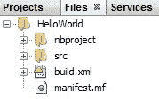
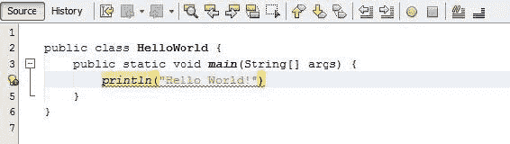
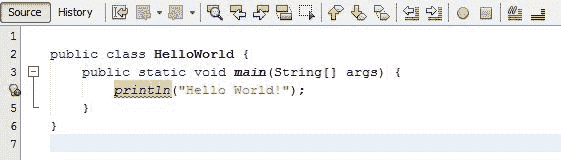
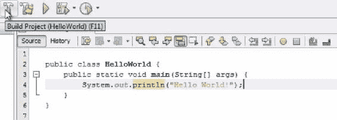
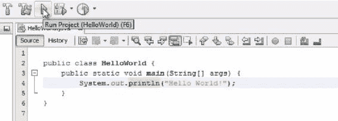
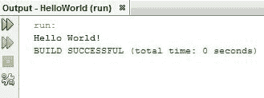
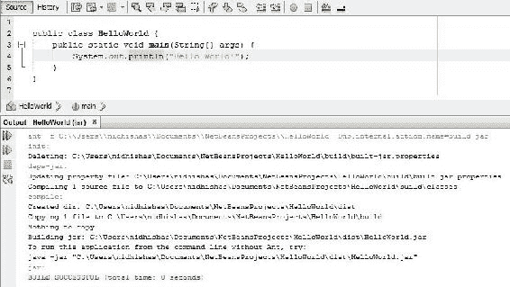
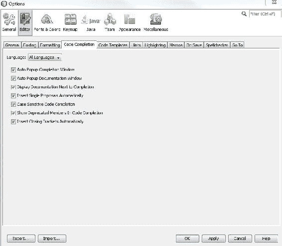

# Java 入门

无论这是您第一次尝试高级面向对象编程语言（如 Java），还是您已经进行了一段时间的编程，只是想将 Java 添加到您的曲目中，或者即使您一生中从未接触过一行代码，本书都是为您而设计的。我们将迅速行动，我们不会回避繁重的话题；然而，我们将从头开始这本书，并在学习过程中了解面向对象编程背后的概念。

在本章中，我们将了解 Java 是什么，并了解它的特性。然后，我们将按照一步一步的过程来建立一个开发环境，使我们能够编写和执行 Java 程序。一旦我们完成这项工作，我们将编写第一个 Java 程序并运行它。最后，我们将看看当我们遇到错误时该怎么办。

具体来说，我们将介绍以下主题：

*   什么是 Java
*   Java 的特点及应用
*   安装 JDK
*   安装 NetBeans IDE
*   写作`HelloWorld.java`
*   NetBeans 的错误检测功能

# 什么是 Java？

Java 是由 Sun Microsystems 于 1995 年开发的，但它经受了时间的考验，至今仍具有高度的相关性和广泛的应用。那么 Java 到底是什么呢？Java 是一种高级、通用的面向对象编程语言。

# Java 的特点

以下是 Java 的主要功能：

*   **高层次和通用**：Java 不是为了完成一项非常具体的任务而创建的，它允许我们在开放式环境中编写计算机可读的指令。因为对于每一个计算机系统来说，拥有自己的专用编程语言是不可行的，甚至是不可取的，所以绝大多数代码都是用高级通用语言（如 Java）编写的。
*   **面向对象**：Java 也是我们所说的面向对象语言。虽然我们在本书后面一段时间才会讨论对象和类的细节，但现在要知道，对象允许我们在程序中定义模块化实体，使它们更易于人类阅读，也更易于管理，以创建大型软件项目。对任何现代软件开发人员来说，牢牢掌握面向对象的概念是绝对必要的。
*   **平台无关**：最后，Java 的设计意图是成为一种只写一次、随时随地运行的语言。这意味着，如果你和我都安装了 Java 系统，即使我们的系统通常不完全相同——例如，我在 Windows 机器上，而你在 Mac 上——我给你的机器上的 Java 程序在你的机器上运行时基本相同，无需重新编译。


**Compiling** a programming language such as Java is the act of taking the human-readable code that we've written and converting it into an interpreted machine-friendly code. Unfortunately, it's usually not very friendly for humans to read or write. To do this, we use a program called the compiler that takes in our code as text and converts it into machine code.

传统上，我们必须为要运行的每个系统重新编译一个程序，因为所有系统对其机器代码应该是什么样子都有不同的想法。Java 通过将所有 Java 程序编译成称为字节码的同一类型的解释代码来避免这个问题。

字节码编译的 Java 程序可以由安装 Java 的任何系统运行。这是因为当我们在您的系统上安装 Java 时，我们也会安装一个特定于该系统的 Java 虚拟机。这台机器负责将字节码转换成最终指令，并发送给该系统中的处理器。

通过让系统负责完成最后的转换，Java 创建了一种写一次，运行在任何地方的语言，我可以给你一个 Java 程序，你可以在你的机器上运行它，同时相当确定它将以与我相同的方式运行。在 Java 这样强大的语言上，这种令人印象深刻的跨平台支持水平已经使它成为软件开发界的热门工具之一。

# Java 应用程序

在当今时代，Java 被用于开发桌面应用程序、web 服务器和客户端 web 应用程序。它是安卓操作系统的母语，在安卓手机和平板电脑上运行。

Java 已经被用来编写视频游戏，有时甚至被移植到没有传统操作系统的小型设备上。在今天的技术世界中，它仍然是一个巨大的玩家，我期待着和你们一起学习。

# 设置开发环境

在本节中，我们将编写第一个 Java 程序，但在开始编写代码之前，我们需要设置一个 Java 开发友好的环境。

# 安装 JDK

为了开始这个过程，让我们下载一个**Java 开发工具包**（**JDK**）或 Java SDK。这个工具包包含库和可执行文件，允许我们用 Java 代码做很多不同的事情。最重要的是，安装了 SDK 后，我们将能够编译 Java 代码，然后运行完整的 Java 程序。

您的机器上可能已经安装了 Java；然而，除非您明确地这样做，否则您可能还没有安装 JavaSDK。普通用户在其机器上安装的 Java 版本称为**Java 运行时环境**（**JRE**。这允许执行 Java 程序，并且如果没有安装 JRE，Java 程序将无法在环境上运行。但是 JRE 不包含我们需要的任何真正的开发工具。好消息是 JavaJRE 和 JavaSDK 可以和谐共存。Java JRE 实际上只是 SDK 的一个子集，因此，如果我们只安装了 Java 开发工具包（即将下载），我们就可以了。

如果您以前下载过 Java 开发工具包，那么当您实际安装该工具包时，Java 会让您知道它已经安装，您可以跳过本节的这一部分。对于其他人，请查看如何下载开发工具包：

1.  首先，通过浏览器导航到[www.oracle.com/technetwork/java/javase/downloads/index.html](http://www.oracle.com/technetwork/java/javase/downloads/index.html)。

2.  我们将使用由 Oracle 维护的 JavaSE 或标准版开发工具包。要获取此工具包，只需转到下载选项卡，并通过选择该选项表示我们想要 JDK：


向下滚动，签出许可协议，接受许可协议，然后下载适合您的操作系统的 SDK 版本。对我来说，这是`jdk-8u144-windows-x64.exe`，列在末尾：


3.  下载完成后，请像安装任何其他程序一样安装它。在适当的时候选择默认选项，并确保注意我们将安装开发工具包的目录。

# 安装 NetBeans IDE

安装了 Java 开发工具包后，我们就具备了开始编写 Java 程序所需的所有工具。然而，我们必须通过命令行来编译它们，在不同的操作系统上，命令行看起来可能有点不同。

为了让一切都变得简单，让我们开始学习 Java，在**集成开发环境**（**IDE**中编写 Java 代码。这是一个自己的软件程序，帮助我们编写、编译和运行 Java 程序。我们将使用 NetBeans IDE，这是非常棒的，因为它是免费的、开源的，并且在 Windows、Mac 和 Linux 环境下也将运行同样的功能。

要获得此 IDE，请访问[netbeans.org/downloads/](http://netbeans.org/downloads/)。

您将看到以下页面：


因为我们已经下载了 Java 标准版开发工具包，所以 Java SE 是我们将在这里下载的 NetBeans 版本。选择 JavaSE 列下面的下载按钮。NetBeans 应该自动启动下载，但如果没有，请单击下图所示的链接：


再一次，我们将像安装任何其他程序一样安装 NetBeans，在适当的时候选择默认选项。最有可能的是，NetBeans 将在我们的机器上找到 Java 开发工具包。如果没有，它将提示我们输入安装 Java 开发工具包的目录。

# 编写我们的第一个 Java 程序

希望您已经安装了 NetBeans，并且已经顺利启动了它。NetBeans 将管理我们程序的文件结构，但首先，我们需要告诉 NetBeans 我们已经准备好开始一个新项目。

# 创建新项目

要创建新项目，请单击文件，然后单击新建项目，然后选择 Java 应用程序：


我们需要给我们的项目起一个与众不同的名字；我们把这个叫做`HelloWorld`。然后，我们可以选择放置文件的位置。因为这是我们的第一个 Java 程序，所以我们应该尽可能从零开始。因此，让我们取消选中 createmain 类选项，这样 NetBeans 将为我们提供一个几乎空白的项目。然后，单击 Finish：


NetBeans 将为我们设置一个文件系统。我们可以像在标准文件系统浏览器中一样导航此文件系统：


`Source Packages`文件是我们编写代码的地方。您会注意到在`Libraries`文件下，JDK 是链接的，允许我们访问它的所有库资源：


# 创建 Java 类

一旦我们创建了一个新的项目，我们就会看到项目、文件和服务选项卡，就像我在下图中看到的那样。让我们看看“文件”选项卡。项目选项卡有点抽象，而文件选项卡则向我们展示了`HelloWorld`项目所在的文件系统中实际包含的内容：



最重要的是，您将看到这里的`src`文件中没有任何文件。这是因为我们的项目没有相关的源代码，所以现在它什么都做不了。要解决此问题，请右键单击`src`，选择新建，然后选择 Java 类…：


我们将把我们的 Java 类命名为`HelloWorld`，就像项目的名称一样，因为它是我们的主类，程序应该在这里输入和启动。现在，这里的其他一切都很好，所以单击 Finish，NetBeans 将为我们创建`HelloWorld.java`。`.java`文件本质上是一个文本文件，但它应该只包含 Java 代码和注释：


# 编写代码

当我们告诉 NetBeans 制作`HelloWorld.java`文件时，它采取了一些自由，并为我们添加了一些代码，如下面的屏幕截图所示：


# Java 注释

您会注意到，本文档的某些内容完全是人类可读的；这些就是我们所说的评论。任何出现在 Java 文件中的`/*`和`*/`符号之间的文本都将被编译器完全忽略。我们可以在这里写任何我们想写的东西，它不会影响我们的程序如何运行。现在，让我们删除这些注释，这样我们就可以处理 Java 代码了。

# main（）函数

Java 代码与英语一样，是自上而下、从左到右读取的。即使我们的项目包含许多文件和类，我们仍然需要在特定点开始读取和执行代码。我们将这个文件和类命名为`HelloWorld`，与我们的项目同名，因为我们希望它是特殊的，并且包含开始执行代码的`public static void main(String[] args)`方法。那是一大堆行话。现在，只需键入它，就可以知道这是我们的代码区域，Java 程序将从这里开始读取和执行。再一次，当我们开始学习 Java 时，这将变得更加清晰；要知道这是我们 Java 程序的起点。`main()`函数的代码用花括号括起来：

```
public class HelloWorld {
  public static void main(String[] args) {
  }
}
```

在 IDE 中工作的一个好处是，它将突出显示哪些括号相互对应。括号允许我们在代码的其他区域中放置代码。例如，我们的`main()`方法包含在`HelloWorld`类中，我们将要编写和执行的 Java 代码将包含在我们的`main()`方法中。第 4 行（目前不包含任何内容）是我们的程序开始读取和执行 Java 代码的地方。

# 打印字符串

我们这个`HelloWorld`项目的目标相当温和。当它运行时，我们希望它将一些文本打印到屏幕底部的这个输出框中。

当我们下载 JavaSDK 时，我们获得了一个有用函数库，其中一个函数库就可以实现这一点。这是`println()`或打印行功能。当我们的 Java 代码在这个函数上执行时，它会立即执行，因为它是我们`main()`方法入口点的第一个函数，Java 代码会将一些单词打印到我们的输出框中。函数名后面是开括号和闭括号。在这些圆括号内，我们放置了函数完成任务所需的信息。当然，`println()`方法需要知道我们想要打印什么。在 Java 中，一行文本包含两个双引号，我们称之为**字符串**。让我们的节目打印`"Hello World!"`：



# Java 语法

您可能已经注意到 NetBeans 已经对我们大喊大叫了一段时间。左边有一个灯泡和一个红点，文本下面有一些红色的抖动，就像我们在一些文本编辑器中犯了拼写错误一样。这就是我们所做的。我们犯了一个语法错误。我们的 Java 代码显然有问题，NetBeans 知道这一点。

这里有两件事不对。首先，我们的代码不以分号结尾。Java 不能很好地读取空格和回车符，因此我们需要在每行代码的末尾加上分号，原因与摩尔斯电码操作员在每行代码的末尾发送“stop”消息的原因相同。让我们在`println()`语句的末尾添加一个分号：



NetBeans 变得更加满意了；抖动有所减少，但仍有一些问题，如前一个屏幕截图所示。

问题是编程语言中的函数，就像计算机上的文件一样，都有它们存在的位置。NetBeans 不确定在哪里可以找到我们试图使用的`println()`函数。所以我们只需要告诉 NetBeans 这个函数存在的位置。`println()`函数的完整路径从`System`包开始，其中包括`out`类，该类具有`println()`函数的定义。我们用 Java 将其写成`System.out.println("Hello World!");`，如下面的代码块所示。

让我们去掉我在第 5 行、第 6 行和第 7 行创建的额外空间，不是因为它们会影响程序的运行方式，而是因为它不会让程序看起来很好。现在我们已经编写了我们的`HelloWorld`程序：

```
public class HelloWorld { 
    public static void main(String[] args) { 
        System.out.println("Hello World!"); 
    } 
} 
```

# 执行我们的程序

那么我们该怎么办呢？我们知道，我们的计算机不能直接读取 Java 代码。它必须将其转换为计算机可读的语言。因此，执行此代码需要两个步骤：

1.  **Compiling our program**: First, we're going to ask NetBeans to build our project. This means that all of the code within our project will be compiled and converted into computer-readable code in a, essentially, computer-readable project:

    

当我们按下 Build Project 按钮时，我们会在屏幕底部的输出框中看到一堆文本——希望是漂亮的`BUILD SUCCESSFUL`消息，然后是构建项目所需的时间：


2.  **运行我们的程序**：一旦我们构建了我们的项目，我们就可以按运行项目按钮来执行我们的代码和我们的`println`语句：



然后，NetBeans 将为我们提供以下弹出框：


当我们在 IDE 之外执行一个程序时，我们通过启动它的一个可执行文件来执行它。因为我们现在处于一个集成开发环境中，NetBeans 希望确定哪些文件是我们的程序的入口点。因为我们在这里只编写了一个 Java 类选项。因此，让我们向 NetBeans 确认，`HelloWorld`是我们的主类，`HelloWorld`程序中的`main()`函数将是我们开始执行 Java 程序的地方。然后，当我们点击 OK 时，我们的输出框会告诉我们程序已经开始运行，然后我们的程序会按照我们的预期将`"Hello World!"`打印到输出框：



好了！现在我们是 Java 程序员。当然，还有很多东西要学。事实上，Java 中的`HelloWorld`可能是您编写过的最简单的程序。Java 是非常强大的，而事实是，在编写第一个程序时，我们根本不希望欣赏它的所有复杂之处。真正好的消息是，从这一点开始，我们需要更少的信心飞跃，我们可以通过采取逐步的方法开始对 Java 有一个非常坚实的理解。

# 如何解释 NetBeans 检测到的错误？

当我们编写越来越复杂的 Java 程序时，我们不可避免地会犯一些错误。其中一些错误将是我们的重大逻辑错误或误解，在解决这些错误之前，我们可能需要进一步教育自己。但是，特别是在我们开始编程的时候，我们会犯很多小的愚蠢的错误，只要我们知道去哪里看，这些错误就很容易修复。

幸运的是，Java 编译器设计用于在遇到错误时向我们指出错误。要了解这一点，我们只需删除`println`语句末尾的分号，使我们的`HelloWorld`程序不正确：


现在 NetBeans red 对这行代码进行了抖动，让我们知道它肯定出了问题，但我们可以让编译器尝试一下。如果我们试图建立这个项目，我们不会得到我们本来会得到的`COMPILATION SUCCESSFUL`信息；相反，我们会收到一条错误消息：


此错误为`';' expected`，这是一条非常方便且自解释的错误消息。同样重要的是此消息中冒号后面的数字，即`4`。这让我们知道编译器是在哪一行遇到这个错误的。在 NetBeans 中，如果单击错误消息，IDE 将突出显示该行代码：


如果我们添加分号，那么我们的程序将成功构建，如以下屏幕截图所示：



就这些。

当然，并不是所有的错误消息都是那么自明的。为了便于讨论，让我们创建一个稍微复杂一点的错误。如果我们忘记在这个程序中插入一个括号，会发生什么？以下代码对此进行了说明：


当我们按下 Build Project 时，我们得到的不是一个错误，而是两个错误，尽管我们实际上只犯了一个错误：


我们的第一个错误是`not a statement`，然后它让我们知道它不理解的行。如果我们稍微看一下第一个错误，我们可能会注意到缺少一对括号，因此我们将能够修复这个错误；但是，第二个错误呢？我们又得到了`';' expected`，尽管在这个例子中我们确实有一个分号。

一旦程序中出现一个错误，编译器理解代码行的能力就会很快被破坏。当我们调试代码时，一般的经验法则是只处理列表中最上面的错误；这是编译器在我们的代码中遇到的第一个错误。我们也许能够从更深层次的错误中收集一些有用的信息，但通常情况下，它们只是我们犯的第一个语法错误所产生的错误。这里没有什么太令人兴奋的，但我想向你们指出这一点，因为能够跟踪编译器错误可以在我们学习编程时为我们节省很多麻烦。

# 代码完成特性

当我们谈论 NetBeans 时，让我们快速回顾一下另一个 IDE 特性。假设我想写一行新代码，我将使用`System`库中的一些东西：


一旦我输入了`System.`，NetBeans 就可以为我提供有效的回复。当然，其中只有一个是我要找的。NetBeans 编译器有很多有用的特性，比如这些。如果你是那种认为代码完成非常棒的人，那就继续使用这些工具吧。我们可以通过进入工具|选项|代码完成并检查我们想要的功能来实现这一点：



如果您希望 NetBeans 的行为更像一个文本编辑器，请继续并取消选中所有特性

我们开始了，在这一部分进行了大量的室内清洁，但希望很快，不要太痛苦。

# 总结

在本章中，您了解了 Java 是什么，并了解了它的特性。通过查看 Java 应用程序所使用的各个领域，我们看到了 Java 应用程序的广度。

我们完成了安装 Java 开发工具包的步骤。然后，我们建立了一个名为**NetBeans**的开发环境，用于编写 Java 程序并执行它们。我们了解了如何使用 NetBeans，并在其中编写了第一个 Java 程序。接下来，我们看到了如何使用 NetBeans 检测错误的能力来纠正错误。

在下一章中，我们将介绍各种 Java 数据类型以及如何使用变量。