# 数据结构

在本章中，我们将学习 Java 中一些最重要的数据结构。我们将了解什么是数组，以及当我们需要处理变量序列时它们是如何有用的。我们将使用数组在 NetBeans 中编写一个程序，以了解它们是如何工作的。本章还将引导我们了解多维数组的概念。我们将编写一个程序，使用二维数组创建棋盘。

接下来，本章将说明什么是 ArrayList，以及与阵列相比，ArrayList 如何提供更多的功能。最后，我们将研究`Map`数据结构并在 NetBeans 中实现它。

更具体地说，我们将介绍以下主题：

*   数组及其语法
*   打印英文字母表的数组示例
*   多维数组
*   使用 2D 数组创建棋盘的程序
*   ArrayList 及其示例
*   映射及其在 NetBeans 中的实现

# 使用阵列

在本节中，我们将学习 Java 数组。数组是 Java 最基本和最常用的数据结构。数据结构是允许我们存储和访问信息序列而不是使用单个变量的工具。当我们在本地编程空间中需要一条特定的信息时，变量是非常有用的，但当我们想要存储大型或复杂的信息集或信息系列时，则使用数据结构。我们将从一些可视化学习模式开始本节，然后我们将跳转到我们的 NetBeans IDE，编写一些实际的 Java 代码并使用数组。

# 声明和初始化数组

让我们首先看一下 Java 中声明和初始化数组背后的语法。以下代码行将生成一个具有足够空间容纳七个字符的数组：

```
char[] arrayVar = new char[7]; 
```

在赋值运算符（`=`的左边，语法看起来非常熟悉，与我们在声明任何其他原语或对象时使用的语法没有什么不同。我们首先告诉 Java 我们将在这里声明什么类型的元素。在本例中，我们声明一个字符数组。空方括号让 Java 知道，与其创建一个单字符变量，不如声明一个数组类型的变量，因为我们的数组和其他变量一样是一个变量。我们将通过数组的变量名本身来访问数组中的元素，而不是通过元素的单个变量名，因为元素存储在数组中，所以我们不需要分配这些变量名。一旦我们告诉 Java 我们要创建什么类型的数组，我们就给数组变量起一个名字。我把这个叫做`arrayVar`。

在等式运算符的右边，情况看起来有点不同。您可能已经看到了过去我们需要创建对象的新实例而不是原始元素时使用的`new`关键字。当我们在 Java 中创建一个基元元素时，Java 确切地知道存储基元元素需要多少内存空间，而不管它的值是什么。但是，对象和数组可能有许多不同的大小要求。因为单个数组变量可以分配给不同长度的数组，所以在创建这些不同长度的数组时，我们需要告诉 Java 为每个数组留出多少内存。因此，在创建一个对象或数组时，我们使用`new`关键字告诉 Java 它应该留出内存空间来放置我们将要产生的内容，这是一个长度为 7 的字符数组。

声明并初始化七字符数组后，程序本地内存中的内容如下所示：


我们的数组基本上是一个足够大的内存块，可以存储七个单独的字符。

# 为数组赋值

当我们调用`arrayVar`变量时，我们的程序可以访问数组的位置。这使我们能够运行以下代码行：

```
arrayVar[2] = 'c'; 
```

我们的`arrayVar`变量本质上让我们能够访问七个不同的字符变量。当我们不想给我们的`arrayVar`变量分配一个新数组时，我们可能会作为个体访问这些字符变量。我们只需使用变量名`arrayVar`就可以做到这一点，后面是方括号，其中包括我们想要访问的单个字符的索引。记住，当我们的计算机计算索引时，它们几乎总是以**0**开头。因此，在 Java 中，我们的七字符数组有以下索引：**0**、**1**、**2**、**3**、**4**、**5**和**6**。如果我们在执行前一行代码的同时将我们的`arrayVar`中的索引`2`的值设置为`c`，我们将获取第三个内存块并将其值分配给字符`c`，如下图所示：


有时，当我们声明一个数组时，我们只想在代码中明确地为它的所有内存块赋值。当我们想这样做时，我们可以显式声明数组，就像显式声明基元类型一样，而不是使用`new`关键字并通过告诉计算机数组的长度来释放新的内存空间。例如，我们将使用以下代码对我们的`arrayVar`变量执行此操作：

```
arrayVar = {'a', 'b', 'c', 'd', 'e', 'f', 'g'}; 
```

前面的语句将创建一个长度为 7 的数组，因为声明了 7 个元素，当然，它将相应地映射值：


现在，让我们跳转到一些 Java 代码中，让数组开始工作。

# NetBeans 中的数组示例

好吧，我想是时候运用我们新发现的知识，编写一个计算机程序了。数组允许我们处理大量的信息，而这些信息在单个元素级别处理起来很难。所以，我们将直接跳入重量级的东西，并创建一个很酷的计算机程序。阵列是一个很大的逻辑步骤，如果您以前没有使用过类似的阵列，那么可能需要一点时间来了解它们。好消息是，如果您能通过 Java 中的数组实现，那么您可能会对该语言可能对您造成的任何影响都很满意。

我想写的程序将把英文字母表打印到我们的屏幕上。当然，我们可以自己完成这一切，只需按照以下代码执行一些操作：

```
System.out.println("abcdefg"); 
```

然而，使用它是相当令人麻木的，它不会教我们很多东西。相反，我们将要编写的程序将学习、存储和打印英语字母表。

要做到这一点，我们需要利用新发现的数组知识、字符如何工作以及在 ASCII 表上映射整数值的现有知识，以及单个`for`循环。

# 创建数组

让我们从声明和初始化一个字符数组开始编程，在该数组中存储英语语言的字符。所以，我们告诉 Java，我们需要一个变量来指向一个字符数组。我将此变量称为`alpha`。然后我们将要求 Java 为`26`字符使用`new`关键字来留出内存空间，因为英语有 26 个字母：

```
char[] alpha = new char[26]; 
```

现在，如果您还记得的话，字符值也可以映射为整数值。为了找到这些，我们将查找 ASCII 表。（您可以通过[www.asciitable.com](http://www.asciitable.com/)访问 ASCII 表。）

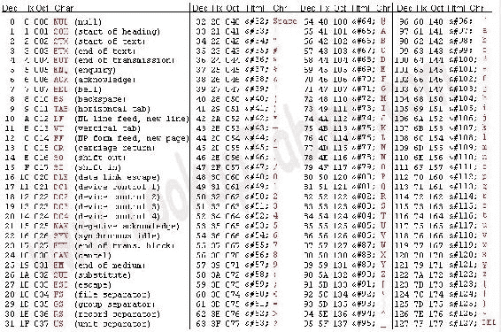

我们要查找的值是**97**，是小写字母**a**的整数值，它是英语中的第一个字符。因此，让我们在程序中创建一个小注释，并存储值`97`以供以后使用：

```
package alphabet; 

public class Alphabet { 
    public static void main(String[] args) { 
        // 97 
        char[] alpha = new char[26]; 
    } 
} 
```

# 创建 for 循环

现在，让我们开始创建`for`循环。我们的`for`循环将运行 26 次；每次运行时，它都会使用英语字母表中的下一个字符，并将其放置在我们的字符数组中：`alpha`。

为了确保我们的`for`循环运行 26 次，我们应该声明一个计数变量，比如`i`，并将其设置为`0`，即（`i=0`。接下来，假设我们的`for`循环应该继续运行，只要我们的计数变量的值小于`26`，也就是说，它应该取`0`和`25`（`i<26`之间的值。最后，每次我们的`for`循环运行时，我们都需要将计数变量的值增加 1，这样它每次都会上升，经过 26 次迭代后，`i<26`语句将不再为真，我们的循环将停止在（`i++`：

```
for(int i = 0; i < 26; i++) 
{ 

} 
```

现在，在我们的`for`循环中，我们将逐个为字符数组中的空格赋值。要访问其中一个空格，我们将使用分配给数组的变量名，即`alpha`，后跟方括号内的数字（或索引），以告诉 Java 我们要将值分配给数组中的哪个字符。

每次运行循环时，数组的索引都应该不同。这就是`for`循环的美丽之处。通过在`0`处启动计数变量`i`，我们可以使用它映射到数组的索引。也就是说，我们可以使用`alpha[i]`逐个访问阵列的元素。循环运行时，计数变量的值将在 0 到 25 之间。数组的索引值（因为计算机从零开始计数）也在 0 到 25 之间。

那么，为了让我们的计算机学习字母表，我们给每个字符分配了什么值呢？嗯，我喜欢这样想：当我们第一次运行循环时，数组的第一个元素的值，当`i`是`0`时，应该是`97`，这是字符**a**的整数值。现在，我们应该指定`97+i`作为数组中每个字符的值。当我们第二次运行循环时，`i`增加 1，我们将赋值 97+1，或**98**，这是字符**b**的整数值：

```
for(int i = 0; i < 26; i++) 
{ 
    alpha[i] = (char)(97 + i); 
} 
```

在这个例子中，Java 要求我们显式地让它知道我们想要将这个整数值转换为一个字符，然后存储它。

# 打印字母表

现在，为了完成我们的程序，我们需要做的就是打印出我们的`alpha`数组。为此，让我们在一个名为`Arrays`的始终可访问对象中使用一个漂亮的函数。`Arrays.toString()`函数将转换一个一维数组，这是我们创建的一种数组，可以转换为字符串：

```
public class Alphabet { 
    public static void main(String[] args) { 
        //97 
        char[] alpha = new char[26]; 

        for(int i = 0; i < 26; i++) 
        { 
            alpha[i] = (char)(97 + i); 
        } 

        System.out.println(Arrays.toString(alpha)); 
    } 
} 
```

现在，如果我们运行我们的程序，我们将看到 Java 以数组形式表示英语字母表：

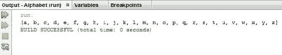

如果你遵循了这一点，你应该给自己一个坚实的拍拍背部。我们刚才做了一些繁重的工作。

# Java 中数组的默认初始化

现在，让我们回到本节剩余部分的理论。早些时候，我误导了你，让你相信我们新创建的数组中充满了空内存空间。事实上，当我们声明一个基本类型的新数组时，即字符、整数、布尔值、浮点值等等，Java 用默认值填充它。例如，我们新的七个字符数组由七个空格字符填充，也就是说，如果按下键盘上的空格键，您将得到：


类似地，整数数组将填充七个零：


我建议您启动一个 Java IDE，创建一些空的基本数组，并使用`println`将它们打印出来，以查看默认值是什么。

现在我们可以创建任何可用对象的数组。但是，与基本体不同的是，对象在作为数组的一部分初始化时没有设置为自己的默认值。这是一件需要认识到的重要事情。

我们需要使用`new`关键字创建的任何内容都不会在数组中默认初始化。

假设出于某种原因，我们决定在一个数组中必须有七个`Scanner`对象。下面的语句没有为我们创建七个`Scanner`对象；它只是留出内存空间：

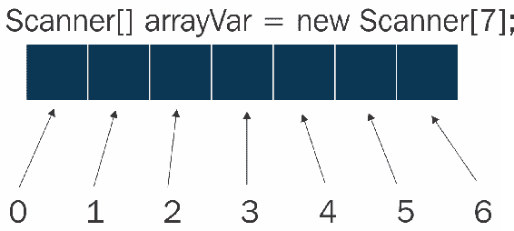

我们可以创建`Scanner`对象并将其分配给这些内存空间，但如果我们在将`Scanner`对象分配给内存位置之前尝试调用其中一个内存空间并从中使用特定于扫描仪的函数，我们的程序将崩溃。我们将得到所谓的`NullReferenceException`，这意味着 Java 要求虚无的行为类似于`Scanner`对象。

# 多维数组

在 Java 中，我们最基本的数据结构是数组，它允许我们存储轻类型信息序列，并通过内存中的单个位置访问这些信息。然而，有时数组很难处理，我们希望使用组织性更强的数据结构，以便人们更容易理解和编写程序。通常，这里合适的是多维数组。

“多维数组”是一个听起来很吓人的名字，但实际上它背后的概念非常基本。问题是，如果我们创建一个数组，会发生什么？以下代码行显示了执行此操作的语法：

```
char[][] twoDimArr = new char[3][7];
```

这行代码将创建一个二维多维数组。您将看到它非常类似于在正常情况下创建字符数组的语法，但是在我们现在引用数组变量的每个实例中，Java 都需要两条信息（或两个索引）。前一行代码将告诉 Java 创建三个数组，每个数组都有足够的空间来存储七个字符或三个长度为七的数组：

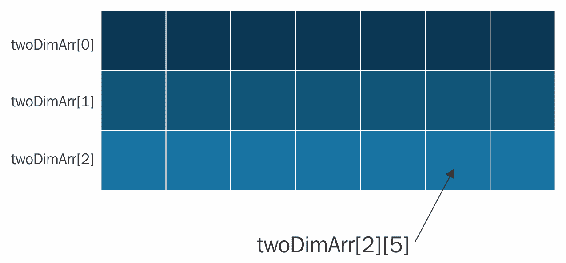

为了巩固我们对这个概念的理解，让我们编写一个利用二维数组的 Java 程序。

# NetBeans 中的多维数组示例

虽然我们可以使用多维数组以抽象的方式存储信息，但通过使用二维数组（在本例中为棋盘）表示实际的二维对象，我们可能最容易学习它们。

经典棋盘分为黑白方块；它的宽度是八个正方形，高度是八个正方形。我们将要编写的程序将在 Java 中存储一个虚拟电路板，其中正方形正确地标记为黑白。然后，在最后，我们会让它打印出这个电路板给我们，这样我们就可以检查我们是否正确地写入了我们的程序。

# 创建多维数组

让我们首先简单地声明和初始化我们将要使用的数组。我们将在这个任务中使用一个字符数组，白色方块的字符值为`W`，黑色方块的字符值为`B`。由于棋盘是一个八乘八的网格，我们要声明一个由八个数组组成的二维数组，每个数组应该包含八个字符：

```
char[][] board = new char[8][8]; 
```

让我们将电路板的尺寸存储在一个单独的位置，让人们更难无意中闯入。为此，只需创建一个名为`boardDim`的变量，为线路板尺寸指定值`8`，然后在创建阵列时引用它。数组将非常乐意使用变量中的整数来初始化自己，如果程序需要，我们可以创建动态链接的数组。现在，如果有人想进入这个程序并放大我们的棋盘，他们只需要更改`boardDim`的值：

```
int boardDim = 8; 
char[][] board = new char[boardDim][boardDim]; 
```

为了给我们的正方形分配合适的值，我们需要通过这个数组循环到每个单独的节点，并给它我们想要的值。

# 对多维数组使用嵌套循环

循环和数组相处得很好，因为数组总是知道它们的长度，但是单个`for`循环不允许我们有意义地循环二维数组。一个`for`循环实际上只朝一个方向，我们的二维数组有两个方向。

为了解决这个问题，我们将使用嵌套的`for`循环，或者`for`循环中的`for`循环。我们的外部`for`循环将依次遍历每个数组，而内部`for`循环的工作将遍历这些数组包含的节点。

创建`for`循环时的一种常见做法是对初始`for`循环使用整数变量`i`，然后对后续`for`循环使用`j`、`k`等。但是，因为我们正在创建一个棋盘，这是一个实际的对象，所以我将选择值`y`作为我们的外循环的计数变量。这是因为我们的循环正在沿着棋盘的*y*轴进行迭代。

正如前面提到的，`for`循环和数组相处得很好，因为数组知道它们的长度。我们可以简单地说，我们希望这个循环运行八次（`y<8`，但这不是好的动态规划，因为如果有人去改变我们棋盘的大小，我们的程序现在就会崩溃。我们可以编写这个循环，这样它就可以在任何大小的棋盘上工作。

要做到这一点，我们不应该明确地说我们的循环应该运行八次，而应该让它从询问数组的长度开始。要询问数组的长度，我们只需要写入`array.length`，这将返回一个整数值。这是一个二维数组，因此只需调用数组的名称来使用`length`变量，就可以得到数组最外层段的长度。在这个例子中，我们问二维数组，“你有多少个数组？”为了完成这个`for`循环，我们只需要在每次运行后增加`y`。因此，我们的外部`for`循环将通过 2D 数组`board`包含的每个数组进行循环：

```
for(int y = 0; y < board.length; y++) 
{ 
} 
```

现在，让我们为我们的内部循环做一些类似的事情。因为这个循环将遍历我们行的各个元素，*x*轴的`x`似乎是一个合适的变量名。因为我们的数组当前在两个段中的长度相同，所以一个八乘八的数组，只需使用`board.length`语句，现在就可以了。但再一次，它不是好的动态规划。如果有人要通过，并改变我们的董事会的大小是八乘十，这个程序将不再正常执行。相反，在这个内部`for`循环执行的开始，让我们询问当前通过外部循环访问的数组，它的长度是多少。这再次使我们的计划变得强大，并允许我们为我们的董事会提供多种尺寸：

```
for(int x = 0; x < board[y].length; x++) 
{ 
} 
```

好的，我们程序的下一步是为数组中的每个节点分配字符值：`B`表示黑色方块，`W`表示白色方块。让我们从编写代码开始，使所有的方块都变成白色。我们的双`for`循环在执行时将通过二维数组中的每个节点。因此，每次我们在内部`for`循环中执行代码时，我们都是根据单个二维数组节点执行代码。要获取此节点，我们需要询问`board`数组在`y`行和`x`列中的位置，然后我们将更改该节点的值：

```
for(int y = 0; y < board.length; y++) 
   { 
      for(int x = 0; x < board[y].length; x++) 
      { 
         board[y][x] = 'W'; 
      } 
   } 
```

# 为我们的棋盘指定不同的颜色

问题是，每次执行这个内部循环时，我们都希望节点有一个不同的值，这样我们就得到了一个交替使用黑白方块的棋盘。为了帮助我们做到这一点，让我们向程序中添加另一个变量。它将是一个布尔变量，我们称之为`isWhite`。如果`isWhite`是`true`，那么我们添加的下一个正方形将是白色；如果`isWhite`为假，则正方形为黑色。

为了将其编码出来，让我们使用一些`if`语句。首先，`if(isWhite)`代码项检查`isWhite`是否为`true`。如果是，那么我们在广场上放一个`W`。如果`isWhite`是`false`，我们将`B`放在方框中表示黑色。为了检查某个值是否为真，我们可以事先用感叹号反转任何布尔值。这将适用于布尔语句甚至条件语句。

接下来，我们只需要翻转`isWhite`的值。好的，利用我们对感叹号运算符的了解，它翻转布尔值，我们可以通过简单地将其值设置为自身的打结版本，将`isWhite`的值从`true`翻转为`false`或`false`翻转为`true`：

```
public static void main(String[] args) { 
   int boardDim = 8; 
   char[][] board = new char[boardDim][boardDim]; 
   boolean isWhite = true; 

   for(int y = 0; y < board.length; y++) 
   { 
       for(int x = 0; x < board[y].length; x++) 
       { 
           if(isWhite) board[y][x] = 'W'; 
           if(!isWhite) board[y][x] = 'B'; 
           isWhite = !isWhite; 
       } 
    } 
} 
```

不幸的是，这个程序并不完美。事实证明，如果我们这样做，我们的棋盘将有每一行以白色正方形开始，而真正的棋盘将与每一行以不同颜色的正方形交替。

幸运的是，外部循环对棋盘的每一行运行一次。因此，如果我们只是在每一行的开头添加一个额外的翻转到我们的`isWhite`布尔值，我们也会得到交替的行开头。如果我们这样做，我们需要将`isWhite`作为`false`开始，因为当外部循环第一次执行时，它将立即更改为`true`：

```
public static void main(String[] args) { 

   int boardDim = 8;  
   char[][] board = new char[boardDim][boardDim]; 
   boolean isWhite = false; 

   for(int y = 0; y < board.length; y++) 
   { 
      isWhite = !isWhite; 
      for(int x = 0; x < board[y].length; x++) 
      { 
         if(isWhite) board[y][x] = 'W'; 
         if(!isWhite) board[y][x] = 'B'; 
         isWhite = !isWhite; 
      } 
   } 
```

# 印刷棋盘

如果到目前为止您已经了解了，那么让我们继续编写程序的最后一部分，一行代码将棋盘打印到屏幕上。实际上，我们需要的不仅仅是一行代码。我们可以使用`println()`函数和`arrays.toString()`将单个数组的内容打印到屏幕上，但这种技术在二维或更高的数组中效果不佳。

所以，我们需要再次使用`for`循环来依次获取每个数组，然后将它们打印到屏幕上。这非常有效，因为`println`将自动回车，或者在打印的每行之间给我们一条新行。在这里，让我们使用常规语法变量`i`来迭代我们的`for`循环：

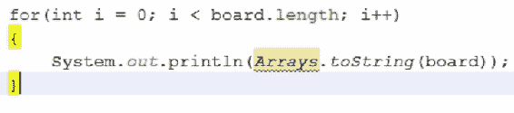

您会注意到 Java 尚未理解前面屏幕截图中所示的`Arrays`关键字；那是因为`Arrays`住在`java.lang`包裹里。当我们调用一个函数或一个类，而 Java 却不知道在哪里可以找到它时，这可能有点烦人，我们必须上网在 Google 上找到它。如果我们在一个 IDE 中工作，比如 NetBeans，有时会有一个快捷方式来查找公共包。在这种情况下，如果我们右键单击问题语句并转到修复导入，NetBeans 将检查常见的包，并检查它是否能够了解我们在做什么：

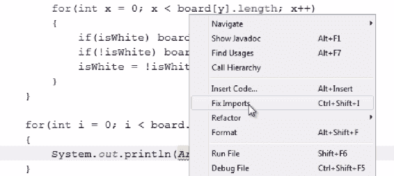

在本例中，NetBeans 已经找到了`Arrays`类并为我们添加了导入语句：

```
import java.util.Arrays; 
```

现在，因为我们不想每次执行`for`循环时都打印二维数组的内容（无论如何，这不会很好地工作），所以我们将告诉我们的`println`语句打印出我们访问的二维数组中的`board[i]`或单个数组的内容：

```
public static void main(String[] args) { 
   int boardDim = 8;  
   char[][] board = new char[boardDim][boardDim]; 
   boolean isWhite = false; 

   for(int y = 0; y < board.length; y++) 
   { 
       isWhite = !isWhite; 
       for(int x = 0; x < board[y].length; x++) 
       { 
           if(isWhite) board[y][x] = 'W'; 
           if(!isWhite) board[y][x] = 'B'; 
           isWhite = !isWhite; 
       } 
   } 

   for(int i = 0; i < board.length; i++) 
   { 
       System.out.println(Arrays.toString(board[i])); 
   } 
} 
```

现在，让我们看看我们是否在第一次完成并运行我们的程序时一切正常：

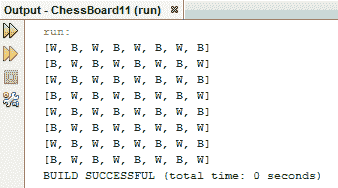

哇！看起来是的。棋盘上有黑白相间的图案，以一个白色正方形开始，并且有以正确方式开始的行。这看起来可能不太像现在，但它的意义是相当大的。我们基本上已经教过我们的程序棋盘是什么样子的。这是我们创建更大的东西的第一步，比如一个下棋程序。

如果我们要创建一个下棋程序（这有点超出了本节的范围，但我们可以从概念上进行讨论），我们可能希望我们的各个方块能够存储更多的信息，而不仅仅是它们是什么颜色。例如，我们可能希望他们知道他们身上有什么东西。为了实现这一点，我们可以利用三维阵列。我们可以创建一个如下所示的数组，这样每个正方形可以存储一个数组，该数组包含两条信息，一个字符表示其颜色，另一个字符表示其所在的部分：

```
char[][][] board = new char[boardDim][boardDim][2]; 
```

这就是 Java 中多维数组的基础。

# 阵列主义者

当我们需要 Java 数据结构时，我们应该先问问自己一个简单的数组是否足够。如果我们只使用一个数组就可以轻松、整洁地编写程序，那么这可能是通过扩展保持程序简单的最佳选择。如果您编写的代码必须尽可能快地运行并尽可能高效地使用内存，那么数组的开销也将非常小。但是，在今天的开发世界中，内存效率和速度对于您的普通程序来说并不重要，有时我们需要使用具有更多内置功能的数据结构，或者可能是为特定目的而设计的数据结构。

具有附加功能的数据结构称为 ArrayList。传统数组的一个缺点是，当我们实例化它们时，我们必须给它们一个特定的长度，因此我们必须知道我们希望数组有多大。ArrayList 基本上是一个封装在一些附加代码中的数组，该代码使数组大小的增减始终与它包含的元素数相同。

# NetBeans 中的 ArrayList 示例

要了解这一点，让我们编写一个程序，如果我们只使用标准数组而不是 ArrayList，那么编写这个程序实际上会有点困难。我想写一个程序，从用户那里获取一个输入字符串。它将此输入字符串与用户提供的其他输入字符串一起存储，然后在用户每次输入新字符串时将其全部打印出来。

这对于一个数组来说是非常困难的，因为如果用户输入的字符串比数组设计的要多，那么在最好的情况下，我们的数组将不接受该字符串；在最坏的情况下，我们的程序可能会崩溃。但是，我们的 ArrayList 对象将简单地调整大小，以适应它当前持有的字符串数量。

# 创建 ArrayList

我们需要从导入`java.util`开始，因为`java.util`是`Scanner`类（我们需要获取用户输入）和`ArrayList`类本身所在的位置。一旦我们申报了`Scanner`（稍后我们将进一步使用），我们就可以申报我们的`ArrayList`：

```
package echo; 

import java.util.*; 

public class Echo { 
    public static void main(String[] args) { 
        Scanner reader = new Scanner(System.in); 
        ArrayList memory = new ArrayList(); 
    } 
} 
```

简单地声明`ArrayList`看起来很像声明任何其他对象。我们说我们想创建什么类型的对象。我们给它起了个名字。我们使用`new`关键字是因为 Java 必须留出一些内存来创建这个对象，因为它不是一个原语。然后，我们告诉 Java 实际创建对象。即使我们不打算为我们的`ArrayList`创建提供任何参数，我们仍然需要在后面加上双括号。这实际上是我们刚刚编写的有效代码，但一般来说，当我们创建一个`ArrayList`时，我们会做更多的工作。

我们创建的`ArrayList`内存实际上将存储我们放置在其中的任何类型的单个实体。一开始这可能听起来非常非常棒，但老实说，在我们的节目中加入它不是一件好事。如果我们有 ArrayList，或者任何数据结构，真的，它存储了几乎所有的东西，那么我们很容易感到困惑。如果我们觉得有必要这样做，我们要么在做一些非常复杂的事情，要么更可能的是，我们没有像我们应该做的那样干净地编写代码。更重要的是，一旦我们在 ArrayList 中存储了任何东西，我们就有可能偷偷地绕过编译器，创建可以正常编译的代码。然而，另一种可能性是，它会在运行时中断，导致商业软件中存在的那种非常糟糕的 bug，因为当人们实际使用它时，它们会中断。

为了解决这个问题，我们可以告诉 ArrayList 只接受某种类型的信息。为此，我们使用双字符括号遵循`ArrayList`声明和实例化，并在其中放置一个类型：

```
ArrayList<String> memory = new ArrayList<String>(); 
```

我们声明了一个`ArrayList`数据结构，它只允许字符串存储在其中。

# 获取用户输入

我们需要一个循环，这样用户就可以向程序输入多个字符串。现在，让我们使用一个无限循环。它将永远运行，但当我们构建程序并调试它时，我们总是可以手动停止它：

```
while(true) 
{ 

} 
```

每次循环运行时，我们都希望在 Scanner 变量上使用`nextLine()`函数，即`reader`，从用户那里获取一行新的输入，并将其存储在 ArrayList 中。

当我们处理对象数据结构时，也就是说，数据结构有代码包，还有它们自己的函数和方法，我们通常不需要处理内存的单个索引，这可能非常好。相反，我们使用它们提供的函数来添加、删除和操作其中的信息。

在这种情况下，向 ArrayList 添加一些内容非常简单。ArrayList 中的`add()`函数将把我们给它的任何输入添加到 ArrayList 包含的数组的末尾，在我们的例子中，只要它是一个字符串。因此，让我们添加以下代码行，从用户请求一个新的输入字符串，然后将其放在无限`while`循环中 ArrayList 的末尾：

```
memory.add(reader.nextLine()); 
```

# 打印用户输入的 ArrayList

现在，我们可以简单地使用`println`向用户打印我们的 ArrayList。注意，`println`代码行不知道如何将 ArrayList 作为输入。实际上，可能是这样，但我们应该显式地使用`toString()`函数，Java 中几乎每个对象都实现了该函数：

```
package echo; 

import java.util.*; 

public class Echo { 
    public static void main(String[] args) { 
        Scanner reader = new Scanner(System.in); 
        ArrayList<String> memory = new ArrayList<String>(); 

        while(true) 
        { 
            memory.add(reader.nextLine()); 
            System.out.println(memory.toString()); 
        } 
    } 
} 
```

现在，当我们运行程序时，系统会提示我们输入一些用户输入，然后我们会看到输入返回到我们身边。如果我们给 Java 更多的输入，我们将看到更多的输入，旧的输入将存储在我们的`ArrayList`：

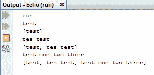

那太酷了！我们已经构建了一个非常基本的程序，用一个简单的数组编写起来会更加困难。

# 将控制权交给用户

ArrayList 包含了很多功能。我们可以将它们转换为数组，从数组中创建它们，等等。如果我们查看 Java 文档并在`java.util`下检查 ArrayList，我们可以找到他们所有的方法。让我们在 ArrayList 程序中添加一些其他特性，以便我可以引导您了解一些常见的 ArrayList 方法。

我们的 arrat0ylist 将有一个[arrat0ylist]函数，它将有一个[arrat0ylist]的输入。我们可以利用这个功能让我们的用户对我们的程序进行一些控制。假设用户输入字符串`CLEAR`，我们希望删除 ArrayList 中的所有信息。好吧，这是我刚才做的一个条件语句，所以我们使用一个`if`语句。我们将在`while`循环中使用以下`if`语句代码来实现此功能：

```
if((memory.get(memory.size()-1)).equals("CLEAR")) memory.clear(); 
```

首先，我们需要对照字符串`CLEAR`检查刚刚添加到 ArrayList 中的项。这个项目将在最后，也就是说，它将是索引值最高的最后一个项目。不幸的是，没有为 ArrayList 实现的`lastItem()`函数，但我们可以通过将两个 ArrayList 函数`get()`和`size()`混合在一起，自己创建一个。

首先，为了从 ArrayList 中获取项，我们使用了`get()`函数。请注意，`get()`非常类似于从传统数组访问项目时使用的方括号。另外，`get()`函数将取一个整数值，并将该整数映射到 ArrayList 中包含的数组索引。

因此，要获取 ArrayList 中的最后一项，我们需要知道 ArrayList 中有多少项。然后，我们想从该值中减去一，因为长度为 7 的数组的最后一个索引将是 6，因为数组开始计数为零。为了得到 ArrayList 中有多少项，我们使用了`size()`函数，它不带任何参数，只给我们一个整数，即数组的大小，即它包含多少项。我们从该值中减去`1`，这样我们就可以正确地访问最后一个索引，而不是它后面的索引，它可以包含任何内容。然后，我们将整个`memory.get(memory.size()-1)`块包装起来，它访问括号中`ArrayList`的最后一项。

我们刚刚用括号括起来的`if`语句块为我们获得了一个 string 对象。我们知道我们可以使用`equals()`方法来比较字符串。我们实际上可以从该代码块返回的 string 对象调用该方法，即使我们还没有为其指定特定的变量名。即使我们没有对象的名称，对象仍然存在，如果我们只是从其他地方返回它们，我们可以调用它们的方法并对它们执行任何我们喜欢的操作：

```
while(true) 
{ 
    memory.add(reader.nextLine()); 
    if((memory.get(memory.size()-1)).equals("CLEAR")) 
        memory.clear(); 
    System.out.println(memory.toString()); 
} 
```

所以，这是我们刚刚写的一个非常疯狂的语句，但只要我们写对了，当我们的用户在程序中输入`CLEAR`时，我们就会删除 ArrayList。

一旦我们编写了这段代码，我们就可以编写非常类似的代码，为用户提供不同的功能选项。让我们也允许我们的用户输入`END`。目前，我们的程序将无限循环，直到我们手动关闭它。但是通过使用`break`Java 关键字，它将跳出我们所处的任何循环，或者如果我们处于函数中，则跳出函数，我们可以使其成为一个可转义循环。这样，我们让用户基本上关闭了我们的程序，因为一旦我们离开这个循环，就没有更多的代码要执行，我们的程序将结束：

```
public static void main(String[] args) { 
    Scanner reader = new Scanner(System.in); 
    ArrayList<String> memory = new ArrayList<String>(); 

    while(true) 
    { 
        memory.add(reader.nextLine()); 
        if((memory.get(memory.size()-1)).equals("CLEAR")) { 
            memory.clear(); 
        } 
        if((memory.get(memory.size()-1)).equals("END")) 
        break; 
    } 
    System.out.println(memory.toString()); 
} 
```

使用`break`语句时要小心。确保这样做是有意义的，因为如果您正在浏览某人的代码，它们可能会有点混乱。他们打破和跳跃控制流的所有地方。

让我们运行这个程序，看看会发生什么。我们将首先为程序提供一些输入并构建 ArrayList：


现在让我们尝试输入`CLEAR`并检查它是否清空我们的 ArrayList。哦，不！我打破了它：


这实际上是我们犯的一个非常有趣的错误。我确实犯了这个错误；这不是事先计划好的。我将把它留在这里，因为这对我们来说是一次很好的学习经历。它还告诉你，即使你是一个有经验的程序员，你也会犯错误。例如，我们应该尽可能地使用类型化 ArrayList 的原因之一是，这样我们就可以轻松地找出并修复错误。

# 分析 ArrayIndexOutOfBoundsException

我们的程序抛出了一个`ArrayIndexOutOfBoundsException`。这意味着我们试图访问`memory`阵列无法访问的内存。具体来说，我们试图查看数组的索引`-1`处的内容。由于数组从索引`0`开始，所以它们在索引`-1`处没有任何内容。计算机内存的任何部分都可能在那里，出于安全原因，程序不允许仅仅通过计算机内存查看，因为它们想这样做。那么，为什么会发生这种情况？为什么我们要求一个数组的索引`-1`，它永远不会是一个有效的数组索引？

我们实现了清除 ArrayList 功能的第一个`if`语句执行得很好。我们的程序看到了我们的`CLEAR`命令，理解了我们对数组索引的第一眼，并清除了数组。

紧接着，我们要求程序使用第二条`if`语句再次检查添加到数组中的最后一项。当我们这样做时，我们执行了`memory.size()-1`。首先，我们询问 Java 关于 ArrayList 的大小。因为我们刚刚清除了 ArrayList，Java 告诉我们 ArrayList 的大小是零，里面什么都没有。然后我们从这个值中减去一得到-1。在这之后，我们在那个`-1`值上运行`memory.get()`。因此，我们让 Java 看一下数组的索引`-1`中的内容，这时 Java 说，“哇！你在干什么？这不酷，我要崩溃了！”

那么，我们如何解决这个问题呢？嗯，我们可以做几件事。在运行第二条`if`语句中的函数之前，我们应该检查并确保数组不是空的。这个选项看起来比我想写的代码多了几行。从任何意义上讲，它都是不可撤销的，我鼓励您自己尝试并实施一个更好的解决方案。

现在，为了让我们的程序快速启动并运行而不会崩溃，让我们将一对`if`块更改为`if...else`语句，如下所示：

```
while(true) 
{ 
    memory.add(reader.nextLine()); 
    if((memory.get(memory.size()-1)).equals("CLEAR")) { 
    memory.clear(); 
    } 
    else { 
        if((memory.get(memory.size()-1)).equals("END")) 
        break; 
    } 
    System.out.println(memory.toString()); 
} 
```

我们已经将第二条`if`语句嵌入到`else`块中。这将阻止我们背靠背运行两个`if`块。如果我们的第一个`if`语句的计算结果为 true，并且我们的 clear 语句得到执行，那么我们将不检查第二个`if`语句。

现在，如果我们运行我们的程序并提供一些乱七八糟的输入来构建我们的 ArrayList，然后输入`CLEAR`，我们将正确地得到一个空 ArrayList 的响应：

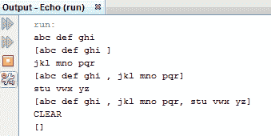

我们永远不会使用大小为`0`的数组来命中第二个`if`语句，因为我们总是要事先在数组中添加一行。

现在，让我们交叉手指，检查`END`输入是否有效：


是的！break 命令专门用于断开循环和函数，因此即使我们将其嵌套在 if 和 else 语句中，它仍然会将我们从`while`循环中断开。

我认为我们的那次小旅行是一次很好的学习经历。这实际上是我们遇到的一个非常有趣的错误。尽管如此，我希望您已经看到不同的数据结构有着不同的用途。

# 地图

在本节中，我们将了解 Java 的`Map`数据结构。我想从一堆已经格式化的信息开始，所以我自己创建了一个小程序。您将在本书的配套文件中找到以下程序。仔细阅读并确保您了解其工作原理：

```
package maps; 
import java.util.*; 
public class Maps { 
    public static void main(String[] args) { 
        String[] allNames =   
            //<editor-fold desc="raw names data"> 
            {"Jane", "Addams", 
            "Muhammad", "Ali", 
            "Stephen", "Ambrose", 
            "Louis", "Armstrong", 
            "Joan", "Baez", 
            "Josephine", "Baker", 
            "Eleanor", "Roosevelt", 
            "Frank", "Sinatra" 
            }; 
            //</editor-fold> 
        String[] firstNames = new String[allNames.length/2]; 
        String[] lastNames = new String[allNames.length/2]; 
        for(int i = 0; i < allNames.length; i++) 
        { 
            /*This if statement checks if we are in an EVEN      
            NUMBERED iteration  
            % is the "mod" or "modulus" operator...  
            it returns the remainder after we divide number1 by      
            number2)*/ 
            if(i % 2 == 0)  
            { 
                //We are in an even number iteration - looking at      
                a first name 
                firstNames[i/2] = allNames[i]; 
            } 
            else 
            { 
                //We are in an odd number iteration - looking at a   
                last name 
                lastNames[i/2] = allNames[i]; 
            } 
        } 
        System.out.println(Arrays.toString(firstNames)); 
        System.out.println(Arrays.toString(lastNames)); 
    } 
} 
```

我的操作假设我们还不熟悉文件的输入和输出，所以我把我们通常希望存储在文件中或更易于管理的地方的所有数据都放在了程序代码中。我创建了一个名为`allNames`的`String`数组，它是一个名人名单。他们个人的名字和姓氏也被分开。所以`Jane`、`Addams`包含阵列的前两个元素。她的名字`Jane`是`allNames[0]`的一部分，然后她的姓`Addams`位于`allNames[1]`，以此类推，数组中每两个元素都是一个人的名字和姓氏。

这也是一个很好的机会，让我向您展示一个在大多数 IDE 中都可用的漂亮的小 NetBeans 特性。如果 IDE 支持这样的特性，我们可以通过在代码的注释中为它们添加说明来经常与它们交谈。因为这些指令被注释掉了，它们不会以任何方式影响 Java 代码编译和运行的方式，但我们可以与 IDE 对话。程序中的以下指令及其结束指令告诉 NetBeans，我们希望它将它们之间包含的代码切掉：

```
//<editor-fold desc="raw names data"> 
. 
. 
. 
//</editor-fold> 
```

现在，我们可以使用开场白左侧的小方框展开和收缩代码块，如以下屏幕截图所示：

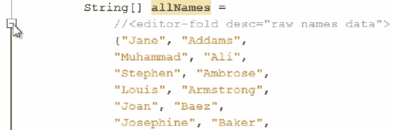

它不会让代码消失；它只是对我们隐藏它，这样我们就可以开发它，而不会弄乱屏幕：


现在，让我们看一下我为开始本节而编写的程序的快速说明。我们有一个名为`allNames`的字符串数组，其中包含一群名人的名字和姓氏。我编写的程序只是在这个数组中循环，并确定它是查看名字还是姓氏。然后，它将这些名称放在它们自己的单独数组中。最后，当我们打印这些数组时，我们有两个单独的数组：一个是名字，另一个是姓氏。这些数组之间的关系，因为我们将它们按顺序放入两个单独的数组（`firstNames`和`lastNames`），是数组的索引匹配。因此，在`firstNames[0]`和`lastNames[0]`，我们有简·亚当斯的名字和姓氏。

我现在要做的是扩展这个程序，并将所有这些信息放在一个数据结构中：一个 Java`Map`。在创建这样一个映射时，我们让它知道一个集合（我们称之为键）和另一个集合（我们称之为值）之间的关系，以便每个键映射到值。这将允许我们问我们的节目问题，例如，“给定一个名人的姓氏，与之相关的名字是什么？”

# 创建地图

首先，我已经导入了`Map`接口所在的`java.util`。接下来，我将去掉最后两个打印`firstNames`和`lastNames`数组的`println`语句。相反，在代码的这一点上，当我们的`firstNames`和`lastNames`数组已经设置好时，让我们开始构建我们的`Map`。为此，请添加以下代码行：

```
Map<String, String> famousPeople = new HashMap<>(); 
```

我们首先使用`Map`关键字，然后，与大多数数据结构一样，我们告诉 Java 我们的`Map`将接收什么类型的信息。地图需要两组信息，所以我们必须给它两种以逗号分隔的信息类型。第一种信息类型是地图键的信息类型，第二种信息类型是地图值的类型。

我们将使用`lastNames`作为键，因为我们不希望`Map`在一个键中存储多个值，而且不太可能有多个相同的姓氏。此外，对于我们来说，询问一个名叫亚当斯的名人的名字比问一个名叫简的名人的姓氏更有价值，而简的姓氏可能更多。总之，`lastNames`的数据类型是`String`，而`firstNames`的数据类型也是`String`。

接下来，我们给新的`Map`变量起一个名字：`famousPeople`。然后，我们通过实例化它使我们的`Map`产生。为此，我们使用`new`关键字。`Map`不是一个对象，实际上，它是我们所说的接口。在大多数情况下，我们与接口和对象的交互方式相同，但我们不能简单地声明接口的实例。相反，接口是我们放在对象之上的功能的附加包装，就像 ArrayList 向数组添加附加功能一样。

因此，要创建一个新的`Map`，我们需要一个更简单的对象类型，我们可以将`Map`接口包装起来。这方面的一个很好的候选者是`HashMap`。因此，我们创建我们的`HashMap`并将我们的 Map 变量`famousPeople`分配给它。我们现在将与这个`famousPeople`变量交互，就像它是一个具有所有`Map`功能的对象一样。此外，如果我们愿意，我们也可以在这个对象上只调用`HashMap`功能。

虽然这有点超出了本节的范围，但接口的强大之处在于我们可以将它们分配给不同类型的对象，为其他不同的对象类型提供公共功能。但是，目前，我们主要只对 Java 映射的功能和功能感兴趣。您会注意到，我们不必显式地告诉 Java 我们的`HashMap`将采用什么类型。这确实是一种风格选择；如果我们愿意，我们可以显式声明`HashMap`将采用的类型：

```
Map<String, String> famousPeople = new HashMap<String, String>(); 
```

然而，由于我们只将与我们的`HashMap`进行交互，就其作为`Map`的功能而言，当我们通过变量`famousPeople`与`HashMap`交互时，简单地保护我们不添加任何字符串，这是我们当前访问它的唯一方式，应该是很好的。

# 为地图赋值

一旦我们建立了我们的`Map`，是时候让我们仔细检查并用信息填充它了。为此，我认为`for`循环是合适的：

```
for(int i = 0; i < lastNames.length; i++) 
{ 
    famousPeople.put(lastNames[i], firstNames[i]); 
} 
```

我们需要向映射中添加多对信息，即一个键和一个值，等于这些数组中的项数。这是因为它们的长度相同。因此，让我们建立一个`for`循环，循环遍历从`i`到`lastNames-1`长度的每个索引。`i`值将映射到`lastNames`数组的索引，由于`firstNames`数组与`lastNames`数组具有相同的长度，因此它们也将映射到`firstNames`数组的索引。

现在，对于每个`i`，我们将执行 Map 的`put()`函数。`put()`功能与`add()`功能类似。它将信息插入我们的地图。但是，此函数需要两条信息。首先，它需要我们的键，这是我们目前在`lastNames`中看到的值，然后它需要相关的值，这是我们在`firstNames`中看到的值。每次我们在`for`循环中执行`famousPeople.put(lastNames[i], firstNames[i]);`行代码时，我们都会向`Map`添加一个新的键值对。

# 从地图上获取信息

一旦我们设置了`Map`，所有信息都已包含在我们的计划中，我们需要做的就是向其提出一些问题，并确保我们得到正确的回答：

```
System.out.println(famousPeople.get("Addams")); 
```

我们使用`get()`函数来问`Map`一个基本问题，它的目的是回答“与给定键配对的值是什么？”因此，让我们问`Map`“与`Addams`配对的值是什么？”或者用更容易理解的英语术语，“地图中姓氏为`Addams`的人的名字是什么？”当我们运行这个程序时，我们得到了预期的结果，即，`Jane`：


让我们再运行一次，以确保我们没有犯任何愚蠢的错误。我们输入`Sinatra`时，看看我们的程序是否回答`Frank`：

```
System.out.println(famousPeople.get("Sinatra")); 
```

的确如此！

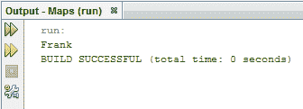

虽然我们可以编写这样的程序，只需在获得用户输入（查找`lastName`，存储该索引，并从`firstNames`获取）时通过数组循环即可，但我们的地图界面基本上为我们做到了这一点。也许，比这更重要的是，当我们与其他程序员一起工作或查看我们昨天没有编写的代码时，我们看到了一个`Map`，我们立即理解了它的预期用途以及它实现了什么功能。在几乎所有的情况下，编写有效的代码同样重要，因为它是有意义的，并且将来可能遇到代码的其他人会理解它。

# 总结

在本章中，我们介绍了数组和一个使用数组打印英文字母的示例。接下来，我们研究了多维数组并编写了一个程序来创建二维棋盘。

我们介绍了什么是 ArrayList，以及它如何增强阵列的功能。我们还使用具有功能的 ArrayList 编写了一个程序，使用 ArrayList 很难实现。最后，我们查看了地图并实现了一个示例来更好地理解这一点。

在下一章中，我们将详细介绍 Java 函数。