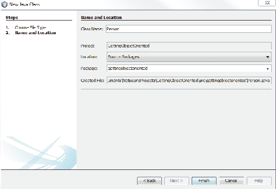
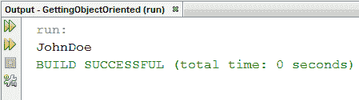
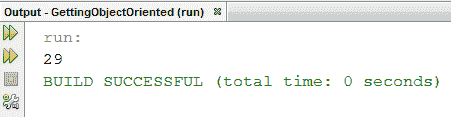
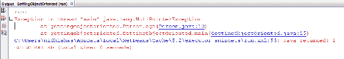
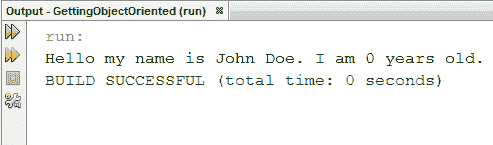
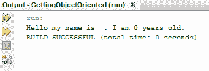

# 面向对象 Java 建模

在本章中，您将学习如何在 Java 中创建类和对象。面向对象编程允许我们向计算机和我们自己解释高度复杂的系统。此外，关于面向对象编程还有很多需要学习的内容，比如对象如何组合在一起，它们可以具有的关系类型，以及我们可以如何使用对象使程序更易于编写。我们还将浏览创建自定义类、成员变量和成员函数的主题。最后，我们将研究分配给自定义类的一个非常特殊的成员，即构造函数和构造函数类型。

本章将介绍以下主题：

*   创建类和对象
*   创建自定义类
*   创建成员变量
*   创建成员函数
*   创建构造函数
*   构造器类型

# 创建类和对象

在本节中，您将学习 Java 中面向对象编程的第一个实际步骤。所以我想首先要问的问题是，“什么是面向对象的编程？”好吧，从高层次上讲，面向对象编程是创建对象、离散代码和逻辑实体，这些对象、离散代码和逻辑实体是唯一的，彼此独立，但可以有复杂的关系。

当我们编写面向对象的代码时，我们开始处理和思考代码，就好像它是一个物理片段或对象的集合。Java 本质上是一种面向对象的语言。因此，如果您一直在学习 Java，至少您一直在使用对象，但没有意识到这一点。

要了解面向对象编程的威力，请查看以下程序（`GettingObjectOriented.java`：

```
package gettingobjectoriented; 

import java.util.*; 

public class GettingObjectOriented { 
    public static void main(String[] args) { 
        Scanner reader = new Scanner(System.in); 

        System.out.println(reader.next()); 
    } 
} 
```

这个程序是一个非常基本的输入/输出程序，如果您一直在学习 Java，您可能已经编写过这种程序。在这个程序中，我们使用了一个我们称之为`reader`的`Scanner`对象，您会注意到我们在两行上使用`reader`：在一行上，我们声明并初始化`reader`，在另一行上，我们调用`reader`的`next()`函数来获取一些用户输入。

关于这两行代码之间的关系，我希望大家注意的一点是，当我们声明`reader`时，除了创建新`Scanner`对象的命令之外，我们还向它提供了一些附加信息。这很有趣，因为稍后当我们使用`reader`的`next()`功能时，我们不必复述它应该从哪个流读取；相反，该信息由`reader`对象自动存储和调用。

这就是面向对象编程的美妙之处：我们创建的实体或对象可以这样构造：它们不仅知道如何处理提供给它们的信息，并为我们提供额外的功能，而且还确切地知道执行后续任务需要哪些信息。

让我们确保我们的术语是直截了当的。首先，让我们分析代码的`new Scanner(System.in)`部分。这个命令告诉 Java 创建一个新对象，一个新的`Scanner`对象，用于我们的程序。此对象有其所在的位置和内存，`reader`变量引用了此位置。我们可以创建多个变量，所有变量都指向同一个`Scanner`对象；然而，在这个简单程序的上下文中，`reader`是我们访问对象在内存中位置的唯一入口点。因此，我们通常可以仅通过变量名来引用这样的对象。

最后，不同的对象以不同的方式运行。我们可以创建多个`Scanner`对象；它们在内存中不会有相同的位置，但会共享类似的功能。声明对象具有哪些功能以及该功能如何运行的代码和逻辑片段称为对象的类。在本例中，我们创建了一个`Scanner`类的对象，并用`reader`变量指向它。

这一切都很好，我们可以使用 Java 提供的默认标准库创建大量程序；然而，要真正打开大门，我们需要能够创建自己的自定义类。让我们开始创建一个。

# 创建自定义类

现在，我们可以在已经使用的文件中创建一个新类；然而，类声明代码与 executed`main()`方法稍有不同，在逻辑上是离散的，在这种方法中，行是按顺序依次执行的。相反，我们将要创建的类将更多地用作代码行的引用，例如`Scanner reader = new Scanner(System.in);`代码行。一般来说，在使用面向对象语言（一种高级面向对象语言，如 Java）时，我们只需将创建的每个新类放在各自的文件中。

要为我们的类创建一个新的 Java 文件，只需右键单击屏幕左侧的包名称，即`gettingobjectoriented`。然后，选择 New，然后选择 Java 类。发布此消息后，我们只会被提示为其命名。


在本例中，我们将创建一个类来提供和存储有关个人的一些基本信息。我们称之为`Person`类，它创建 person 对象：



当我们按 Finish 时，NetBeans 非常方便，并为我们设置了一些真正基本的代码行。它声明这个类在我们的本地包中。这意味着当我们从`main()`方法引用它时，我们不必像导入标准库类那样导入此类。NetBeans 很好地为我们创建了类声明。这只是一行代码，让 Java 编译器知道我们将要声明一个新类，如以下屏幕截图所示：

```
package gettingobjectoriented;
public class Person {
}
```

现在，我们将忽略`public`关键字，但要知道它在这里是非常必要的。`class`关键字自解释性地让我们知道我们将要声明一个类，然后就像我们创建并需要在将来引用的所有内容一样，我们给这个类一个名称或一个唯一的关键字。

是时候编写代码来建立我们的`Person`类了。请记住，我们在这里所做的是教我们的程序的未来部分如何创建`Person`对象或`Person`类的实例。因此，我们在这里编写的代码看起来将与我们在一个方法中编写的代码非常不同，该方法只是从头到尾执行这些行。

我们在类声明中放置的信息将分为以下两类：

*   第一类是告诉 Java`Person`类应该能够存储哪些信息
*   第二类是我们教 Java`Person`对象应该公开什么功能

# 创建成员变量

让我们从第一类开始。让我们告诉 Java 我们希望在`Person`中存储哪些信息：

```
package gettingobjectoriented; 

public class Person { 
    public String firstName; 
    public String lastName; 
} 
```

告诉 Java 要存储什么信息非常类似于在任何其他代码段中声明变量。这里，我们给了`Person`类两个成员变量；这些是我们可以在任何`Person`对象中访问的信息片段。

我们在类声明中声明的几乎所有内容都需要给予保护级别。当我们成为更高级的 Java 用户时，我们将开始使用不同的保护级别，但现在，我们只是将所有内容声明为“公共”

所以，正如我们在这里设置的，每个`Person`对象都有`firstName`和`lastName`。记住，这些成员变量对于`Person`对象的每个实例都是唯一的，因此不同的人不一定共享名字和姓氏。

为了让事情更有趣一点，让我们也为人们指定生日。我们需要导入`java.util`，因为我们将使用另一个类，即`Calendar`类：

```
package gettingobjectoriented; 
import java.util.*; 
public class Person { 
    public String firstName; 
    public String lastName; 
    public Calendar birthday; 
} 
```

日历基本上是点、时间或日期，有很多功能围绕着它们。酷的是`Calendar`是它自己的一个类。所以我们在`Person`类中设置了一个类；`String`也是一个类，但 Java 认为它有点特殊。

现在，让我们回到`GettingObjectOriented.java`文件中的`main()`方法，看看如何创建一个全新的人。现在，我们将保留这行代码，以便将其用作模板。我们想为我们的`Person`类创建一个新实例或创建一个新的`Person`对象。为此，我们首先要告诉 Java 我们想要创建什么类型的对象。

因为我们已经在所使用的包中声明了`Person`类，所以 Java 现在可以理解`Person`关键字。然后，我们需要给我们将要分配给我们的新人的变量命名；让我们说出这个人的名字`john`。创建一个新人就像创建一个新的`Scanner`对象一样简单。我们使用`new`关键字让 Java 知道我们正在创建一个全新的、还不存在的东西，然后我们要求它创建一个人：

```
package gettingobjectoriented; 

import java.util.*; 

public class GettingObjectOriented { 
    public static void main(String[] args) { 
        Scanner reader = new Scanner(System.in); 
        Person john = new Person(); 
        System.out.println(reader.next()); 
    } 
} 
```

在这里，`Person john = new Person ();`将导致变量`john`指向的人，我们只会认为他是一个人 John。现在`john`已经有了一些基本的功能，因为我们已经为`Person`类声明了一些成员变量，所以即使是我们对`Person`类的基本声明也给了 John 一些我们可以使用的成员变量。

例如，`john`有`firstName`，我们可以使用点（`.`操作符）作为变量访问，我们可以继续为这个变量赋值。我们可以对约翰的姓做同样的事情，当然还有他的生日：

```
package gettingobjectoriented;
import java.util.*;
public class GettingObjectOriented {
    public static void main(String[] args) {
        Scanner reader = new Scanner(System.in);
        Person john = new Person();
        john.firstName = "John";
        john.lastName = "Doe";
        john.birthday = 
        System.out.println(reader.next());
    }
}
```

现在，我已经提到，当我们到达这一点时，`birthday`将与`firstName`和`lastName`略有不同。虽然从技术上讲，字符串在 Java 中是类，但 Java 也赋予它们特殊的特权，可以将其分配给显式值或显式字符串。当然，日历没有这种独特的特权，所以我们需要创建一个新的`Calendar`对象来放置在我们的对象中，即`john`。

现在，`Calendar`是我们可以分配实例的类之一；然而，当我们想要创建一个全新的日历时，我们需要创建一个更具体的日历。所以，在这个例子中，我们将使用`GregorianCalendar`。然后，让我们将`birthday`分配给`john`，比如说`1988,1,5`。然后，只要打印出约翰的名字和姓氏，就可以看到一切都按预期分配。

好了！当我们运行以下程序时：

```
package gettingobjectoriented;
import java.util.*;
public class GettingObjectOriented {
    public static void main(String[] args) {
        Scanner reader = new Scanner(System.in);
        Person john = new Person();
        john.firstName = "John";
        john.lastName = "Doe";
        john.birthday = new GregorianCalendar(1988,1,5);
        System.out.println(john.firstName + john.lastName);
    }
}
```

我们看到`John Doe`并没有真正正确格式化，而是像预期的那样打印到屏幕上：



我们已成功地将信息存储在`john`对象中。如果我们愿意，我们可以创造一个全新的人“简”，她将拥有自己的`firstName`、`lastName`和`birthday`；她的成员变量与约翰的完全不同。

# 创建成员函数

让我们回到我们的`Person`类，即`Person.java`文件，为人们提供更多的功能。因此，面向对象 Java 的美妙之处在于，我们已经开始将`Person`类的实例视为物理对象。这使得预测将向他们提出的问题变得更加容易。

例如，当我遇到一个新朋友时，在大多数情况下，我要么想知道他们的名字，要么想知道他们的全名。那么，如果我们的人存储了一个名为`fullName`的字符串，人们可以直接请求它，而不必单独获取他们的名字和姓氏，这不是很好吗？

当然，现在简单地添加另一个成员变量是很难的，因为创建`Person`新实例的人需要设置`fullName`。此外，如果此人的名字、姓氏或全名发生变化，其`fullName`、`firstName`和`lastName`变量可能无法正确匹配。但是如果我们提供了一个成员方法而不是一个成员变量呢？

当我们在类的上下文中创建方法时，我们可以访问类的成员变量。如果需要，我们可以修改它们，或者如果我们正在做我们刚刚做的事情，我们可以简单地利用它们的值，在本例中，返回此人动态构造的全名：

```
package gettingobjectoriented; 
import java.util.*; 
public class Person { 
    public String firstName; 
    public String lastName; 
    public Calendar birthday; 
    public String fullName() 
    { 
         return firstName + " " + lastName; 
    } 
} 
```

我还想问这个人另一个问题，那就是你多大了？这与我们刚刚编写的方法非常相似，只有一个例外。为了知道此人的年龄，需要告知此人今天的日期，因为这不是此人已经存储的信息。

要做到这一点，我们将要求人们在调用此方法时传递此信息，我们只需返回今天年份和此人生日年份之间的差值。

现在，从日历中获取一年的语法有点不可靠，但我认为我们应该能够遵循它。我们只需要使用`get`方法，它有很多用途，然后我们需要准确地告诉这个方法我们希望从中得到什么，我们希望得到的是一个日历年（`Calendar.YEAR`。因此，让我们确保保存此文件并跳转到我们的`main`方法，并使用我们刚刚添加到`Person`实例的其中一个新方法：

```
package gettingobjectoriented;
import java.util.*;
public class Person {
    public String firstName;
    public String lastName;
    public Calendar birthday;
    public String fullName()
    {
         return firstName + " " + lastName;
    }
    public int age(Calendar today)
    {
         return today.get(Calendar.YEAR) - birthday.get(Calendar.YEAR);
    }
}
```

所以，我们设立了`john`。他有一个生日。让我们在这里的`println`声明中询问约翰的年龄。为此，我们只需调用 John 的`age`方法并创建一个新的`Calendar`对象来传递。我想新的`GregorianCalendar`实例会默认设置为当前日期和时间。

如果我们运行以下程序：

```
package gettingobjectoriented;
import java.util.*;
public class GettingObjectOriented {
    public static void main(String[] args) {
        Scanner reader = new Scanner(System.in);
        Person john = new Person();
        john.firstName = "John";
        john.lastName = "Doe";
        john.birthday = new GregorianCalendar(1988,1,5);
        System.out.println(john.age(new GregorianCalendar()));
    }
}
```

我们看到约翰已经`29`岁了：



好了。这是我们对面向对象 Java 的基本介绍，但它将归结为您刚刚学习的基础知识。

# 创建构造函数

在本节中，您将了解我们可以分配给自定义类的一个非常特殊的成员，即构造函数。首先，让我们看看下面的代码：

```
package gettingobjectoriented; 

import java.util.*; 

public class GettingObjectOriented { 
    public static void main(String[] args) { 
        Scanner reader = new Scanner(System.in); 
        Person john = new Person(); 
        john.firstName = "John"; 
        john.lastName = "Doe"; 
        john.birthday = new GregorianCalendar(1988,1,5); 
        System.out.println( 
            "Hello my name is " +            
            john.fullName() + 
            ". I am " + 
            john.age(new GregorianCalendar()) + 
            " years old."); 
    } 
} 
```

该程序创建了我们自定义类`Person`的一个实例，并立即将一些值分配给`Person`：`firstName`、`lastName`和`birthday`的成员变量。然后，我们利用`Person`的一些成员函数打印出一些关于我们刚刚分配的值的信息。

虽然这是我们刚刚编写的一个不错的程序，但即使编写这个简单的程序，也很容易看到有人出错。例如，如果我忘记了，或者根本没有意识到，`birthday`是`Person`的成员变量之一，该怎么办？如果我没有立即为某人指定生日，然后尝试使用`age()`成员方法，如下代码块所示：

```
package gettingobjectoriented; 

import java.util.*; 

public class GettingObjectOriented { 
    public static void main(String[] args) { 
        Person john = new Person(); 
        john.firstName = "John"; 
        john.lastName = "Doe"; 
        //john.birthday = new GregorianCalendar(1988,1,5); 
        System.out.println( 
        "Hello my name is " + 
        john.fullName() + 
        ". I am " + 
        john.age(new GregorianCalendar()) + 
        " years old."); 
    } 
} 
```

我们的程序在尝试访问未设置为任何值的生日变量时会崩溃，如以下屏幕截图所示：



对于程序员来说，这是一个非常合理的错误，既不知道他们应该将这个成员变量设置为一个值，又假设这个成员变量会有一个值，因为哪个人没有生日？幸运的是，有一个系统，我们可以在允许用户创建对象的实例之前要求用户提供信息。因此，让我们跳转到声明`Person`类的代码中，并设置该类，以便只有在从一开始就提供了所有必要信息的情况下才能创建人员。为此，我们将使用构造函数。

构造函数声明看起来很像普通的方法声明，除了一件事。如果一个普通的方法会有一个返回值，如果它不是设计用来返回任何东西的话，即使返回值为 null，构造函数也没有。此外，构造函数方法的名称与我们分配给类的名称相同；然而，就像普通方法一样，我们可以向构造函数提供输入。

首先，假设所有人都有`firstName`、`lastName`和`birthday`；否则，它们就不应该存在。当我们创建`Person`类的新实例并且`Person`类定义了构造函数时，我们将始终使用`Person`构造函数创建该类的实例：

```
package gettingobjectoriented; 

import java.util.*; 

public class Person { 
    public String firstName; 
    public String lastName; 
    public Calendar birthday; 

    public Person(String firstName, String lastName, Calendar birthday) 
    { 

 } 

    public String fullName() 
    { 
         return firstName + " " + lastName; 
    } 

    public int age(Calendar today) 
    { 
         return today.get(Calendar.YEAR) - birthday.get(Calendar.YEAR); 
    } 
} 
```

如果我们将此更新保存到`Person`类声明中，然后返回到程序的`main`方法，我们将得到一个编译器错误，如下面的屏幕截图所示：


这是因为我们修改了`Person`类，要求使用新创建的构造函数。此构造函数接受三个输入值：字符串、字符串和日历。因此，我们不需要在这三行代码中修改`Person`的成员变量，而是将这三个变量作为参数传递给构造函数方法：

```
package gettingobjectoriented; 

import java.util.*; 

public class GettingObjectOriented { 
    public static void main(String[] args) { 
        Person john = new Person("John", "Doe", newGregorianCalendar(1988,1,5)); 

        System.out.println( 
        "Hello my name is " + john.fullName() + ". I am " + john.age(new 
        GregorianCalendar()) + 
        " years old."); 
    } 
} 
```

现在，就我们程序中的`main`方法而言，我们程序的语法再次有效。当然，如果我们运行这个程序，我们会遇到一些麻烦，因为当我们将这些参数传递给`Person`构造函数时，我们还没有对它们做任何处理。

现在，与 Java 程序中的`main`方法不同，这里的`Person`构造函数需要将这些参数转换为`Person`的成员变量的值。那么，让我们这样做。让我们将`Person`类的`firstName`更改为传递给此函数的变量，或者设置其值：

```
package gettingobjectoriented;
import java.util.*;
public class Person {
    String firstName;
    String lastName;
    Calendar birthday;
    public Person(String firstName, String lastName, Calendar birthday)
    {
         firstName = firstName;
    }
    public String fullName()
    {
         return firstName + " " + lastName;
    }

    public int age(Calendar today)
    {
         return today.get(Calendar.YEAR) - birthday.get(Calendar.YEAR);
    }
}
```

现在，这是一个技术上正确的语法，我们这里有；它会做我们希望它做的事。

`firstName = firstName`代码行真的很奇怪，如果你去读它，它会很模糊。毕竟，在这些例子中，我们谈论的是哪个`firstName`变量？我们是说这个类的成员变量`Person.firstName`，还是说作为构造函数方法的参数传入的`firstName`？为了消除歧义，我们可以做几件事。

首先，我们可以简单地将分配给方法参数的名称更改为与本地成员名称不同的名称；然而，有时候，明确要求`firstName`是有意义的。对于打算使用构造函数的人来说，这会容易得多。当我们需要显式地告诉我们的程序我们正在使用`Person`类的一个成员变量时，我们应该正确地为它提供一个路径。当程序运行时，`this`关键字将允许我们访问当前正在运行的类，或者更确切地说是它的对象实例。因此，`this.firstName`将始终引用成员变量，而不是作为参数传入的变量。现在我们有了语法，可以快速地将参数值分配给成员变量的值：


现在，当我们保存此文件并返回到我们的`main`方法即`GettingObjectOriented.java`并运行我们的程序时，我们将获得原始输出，显示我们的`Person`构造函数已将这些输入值正确映射到`Person`对象中存储的值：


所以这很酷。我们已经修改了`Person`类，这样程序员就很难犯明显的错误，在这些方法注定要失败时调用它们。如果程序员在创建了我们的人之后修改了其中一个成员变量，那么他们仍然会遇到麻烦。

然而，我们有一个适当的系统来保护我们的类，如果我们选择的话，不让它们的成员在没有经过适当协议的情况下被修改。假设我们想更改`Person`类，这样，这些成员的唯一更改时间就是在构造函数调用时的最开始一次。如果你还记得的话，我们已经用这个`public`保护标签标记了我们类的所有成员。标记为`public`的东西基本上可以在任何时候被我们的程序的任何一个可以访问其容器的部分看到。

但是，我们可以使用其他几种不同的保护标签。如果我们标记所有成员变量`private`，那么它们只能在当前类的上下文中查看。因此，我们仍然可以在我们的`Person`构造函数以及`fullName`和`age`方法中使用成员变量，但当我们尝试在实际类声明之外访问`lastName`时，它将无效：

```
package gettingobjectoriented; 

import java.util.*; 

public class Person { 
    private String firstName; 
    private String lastName; 
    private Calendar birthday; 
```

我们可以标记成员`private`，然后创建公共方法，在适当的时候修改它们的值。通过这样做，我们将保护我们的对象不被赋予无效值。

# 构造器类型

现在，在我们结束之前，让我们回到关于构造函数的讨论。与普通方法一样，我们可以重写构造函数，并有多个选项供程序员选择。

比如说，在我们的节目中，我们有时想创造一些刚刚出生的新人。在这种情况下，我们可以通过简单地将`firstName`和`lastName`交给我们的构造函数，然后将`birthday`作为`new Gregorian Calendar`来构造一个人，这将非常有意义，默认为今天的日期：

```
package gettingobjectoriented; 

import java.util.*; 

public class Person { 
    private String firstName; 
    private String lastName; 
    private Calendar birthday; 
    public Person(String firstName, String lastName) 
    { 
         this.firstName = firstName; 
         this.lastName = lastName; 
         this.birthday = new GregorianCalendar(); 
    } 

    public Person(String firstName, String lastName, Calendar 
    birthday) 
    { 
         this.firstName = firstName; 
         this.lastName = lastName; 
         this.birthday = birthday; 
    } 
```

如果我们想在程序中使用这个构造函数，我们只需要用两个字符串参数调用构造函数。这将映射到我们在这里声明的新创建的构造函数。

考虑下面的程序：

```
package gettingobjectoriented; 

import java.util.*; 

public class GettingObjectOriented { 
    public static void main(String[] args) { 
            Person john = new Person("John", "Doe"); 

            System.out.println( 
                    "Hello my name is " +            
                    john.fullName() + 
                    ". I am " + 
                    john.age(new GregorianCalendar()) + 
                    " years old."); 
    } 
} 
```

运行时，由于出生日期已经设置为当前日期和时间，我们会看到`John Doe`现在已经`0`岁了，如下图所示：



最后，我们可以让某人选择使用我们的构造函数之一，或者只创建类的实例而不做任何事情，只声明一个空的构造函数。然后，语法看起来就像我们之前参与的 John 的创作：

```
public Person() 
{ 

} 
```

不过，一般来说，我们不想这样做。如果我们有一个空的或默认的构造函数，我们要做的是为我们的成员变量分配默认值，这样至少我们仍然不会破坏我们的程序。因此，我们的默认构造函数将空字符串和今天的日期分配给`firstName`、`lastName`和`birthday`字段可能非常有意义：

```
public Person() 
    { 
        firstName = ""; 
        lastName = ""; 
        birthday = new GregorianCalendar(); 
    } 
```

然后，即使我们的程序员在创建 John 的字段后没有正确地为其赋值，这些字段中仍然会有一些有效值，以保护我们在运行以下程序时不会实际抛出错误：

```
package gettingobjectoriented; 

import java.util.*; 

public class GettingObjectOriented { 
    public static void main(String[] args) { 
            Person john = new Person(); 

            System.out.println( 
                    "Hello my name is " +            
                    john.fullName() + 
                    ". I am " + 
                    john.age(new GregorianCalendar()) + 
                    " years old."); 
    } 
} 
```

以下是上述代码的输出：



这就是 skinny on constructors，另一个帮助我们保护并使我们已经编写的代码更加健壮的工具。

# 总结

在本章中，我们了解了如何创建类和对象，以及如何创建成员变量和函数，从而降低代码的复杂性。您还学习了如何创建分配给类和构造函数类型的构造函数。