# 有用的 Java 类

一旦我们对 Java 的基础知识、Java 语法和 Java 所围绕的基本面向对象概念有了一定程度的了解，我们就可以了解 Java 的 API 和类库了，这些类库对于我们编写 Java 程序来说非常方便。我们之所以想这样做，是因为我们将使用这些类库来加速我们的编程，并利用编写了非常优秀的东西的程序员的工作。

此外，查看 Java 类库，或者任何编程语言的类库，也是了解编程语言是如何设计使用的，以及该语言中的最佳编码应该是什么样子和感觉的一个很好的方法。

因此，在本章中，我们将了解`Calendar`类及其工作原理。我们将深入了解`String`类及其一些有趣的方法。接下来，我们将介绍如何检测异常，即程序中的异常情况，以及如何处理它们。我们来看看`Object`类，它是 Java 中所有类的超类。最后，我们将简要介绍 Java 的基本类。

以下是本章将涉及的主题：

*   `Calendar`类
*   `String`类以及使用`String`对象和文字的区别
*   异常及其处理方法
*   `Object`类
*   Java 的基本类

# 日历类

在本节中，我们将了解 Java 的`Calendar`类。在编写 Java 代码时，我们通常使用`Calendar`类来引用特定的时间点。

`Calendar`类实际上是对 JavaAPI 的一个相对较新的添加。之前，我们使用了一个名为`Date`的类来执行类似的功能。如果您最终使用的是较旧的 Java 代码，或者正在编写处理 SQL 或 MySQL 数据库的 Java 代码，那么您可能会偶尔使用 Java`Date`类。如果发生这种情况，不要惊慌；查阅 Java 文档，您会发现在`Calendar`和`Date`对象之间交换有一些非常好的函数。

为了了解 Java 的`Calendar`类的强大功能，让我们跳入 Java 程序并实例化它。让我们创建一个新程序；首先，从`java.util`包中导入所有类，因为`Calendar`类就住在这里。

接下来，我们声明一个新的`Calendar`对象；我将其命名为`now`，因为我们的第一个目标是将`Calendar`对象的值设置为当前时刻。让我们将`now`的值设置为`Calendar`对象的默认值，看看它给了我们什么。为此，我想我们需要使用`new`关键字。虽然我们实际上没有在文档中查找它，但这似乎是`Calendar`实例的合理起始日期或默认日期。

最后，让我们设置我们的程序，以便我们可以打印出包含在`now`对象中的信息：

```
package datesandtimes; 

import java.util.*; 

public class DatesAndTimes { 
    public static void main(String[] args) { 
        Calendar now = new Calendar(); 
        System.out.println(now); 
    } 

} 
```

也许，令人惊讶的是，当我们试图编译这个基本程序时，它实际上失败了：


我们的错误在`Calendar`上，根据控制台中显示的错误，我们已经实例化了`Calendar`类。错误为`Calendar is abstract; cannot be instantiated`。

如果您还记得的话，抽象类是那些纯粹被设计成子类的类，我们永远不能单独声明抽象类的实例。那么，如果我们永远不能实例化 Java 的`Calendar`类，那么它有什么好处呢？当然，这不是一个公平的问题，因为我们肯定可以创建`Calendar`对象；它们必须是特定类型的`Calendar`对象。我们几乎总是会使用`GregorianCalendar`。

# 历法的子类

让我们后退一步，假设我们可能不知道我们可以选择什么样的选择。这是使用**IDE**（**集成开发环境】**（比如这里的 NetBeans）时非常令人惊奇的一次。

通常，此时，我们必须浏览一下 Java 文档，看看`Calendar`的哪些子类可供我们实例化。但是，因为我们的 IDE 知道一些关于我们已经导入的包的元数据，所以我们可以询问我们的 IDE，它认为什么可能是我们代码的解决方案。如果您使用的是 NetBeans，那么您可以通过检查 Tools | options | Code Completion 中的一些代码完成选项来获得这些建议。

然而，为了防止代码的完整性一直出现，我打算在这个场合使用一个 NetBeans 快捷方式。默认情况下，此快捷键为组合键*Ctrl*+空格，将弹出一个代码完成弹出窗口，显示光标的当前位置，如下图所示：


NetBeans 中的代码完成选项非常好。NetBeans 给了我们三个可能的建议：抽象的`Calendar`类、`BuddhistCalendar`和`GregorianCalendar`。我们已经知道我们不想使用`Calendar`类，因为我们实际上无法实例化抽象类。`BuddhistCalendar`和`GregorianCalendar`看起来确实像`Calendar`的子类。

如果我们选择`GregorianCalendar`，我们会看到它是`Calendar`的一个子类。因此，让我们继续尝试创建一个全新的具有默认设置和值的`GregorianCalendar`实例：

```
package datesandtimes; 

import java.util.*; 

public class DatesAndTimes { 
    public static void main(String[] args) { 
        Calendar now = new GregorianCalendar(); 
        System.out.println(now); 
    } 

} 
```

如果我们运行这个 Java 程序，我们会得到一些输出：


这个输出意味着两件事：

*   我们的语法是正确的，因为我们编译成功
*   我们可以看到 Java 在一个全新的`Calendar`对象中加入了什么值

Java 的一大优点是新对象实现了`println()`所使用的`toString()`方法，这是多么广泛和苛刻。这意味着，当我们要求大多数 Java 标准库对象以某种人类可读的格式打印出来时，它们都能够打印出来。

我们在这里打印的新`Calendar`类并不容易阅读，但我们可以浏览它，看到它的许多字段都被赋值，我们还可以看到`Calendar`类的字段实际上是什么（例如`areFieldsSet`、`areAllFieldsSet`等等）。

# 获取当前日期、月份和年份

让我们看看如何从`Calendar`类中仅获取一条信息。让我们看看它是否实际设置为今天的值。让我们将日、月和年打印在三行独立的`println`上，以保持简单。要访问当前日期、月份和年份，我们需要从`Calendar`对象`now`获取这些字段。如果我们的`Calendar`对象代表一个特定的时间点，那么它应该有日期、月份和年份字段，对吗？好的，如果我们打开我们的自动完成选项，我们可以查看所有可用的字段和方法，由我们的`Calendar`对象显示，如下面的屏幕截图所示：

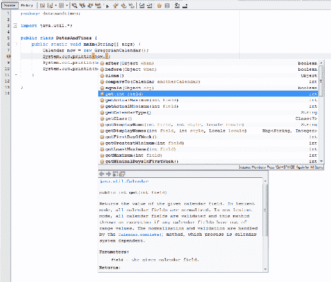

我们不会找到一个容易访问的日、月、年字段，这可能会开始剥夺我们的`Calendar`权利；然而，我们只是没有深入到足够的层次。

`Calendar`类公开了`get()`方法，该方法允许我们获取描述特定`Calendar`实例或时刻的字段。它是一个以整数作为参数的函数。对我们中的一些人来说，这一点一开始可能有点困惑。为什么我们要为`get()`提供一个整数来告诉它我们要查找的`Calendar`字段？

这个整数实际上是一个枚举数，我们现在将其看作是由`Calendar`类本身公开的静态字符串。如果，对于参数`get()`，我们输入`Calendar`类名，就像我们想要获得一个静态成员变量，然后返回到 autocomplete，我们会看到一个选项列表，我们可以在这个实例中使用，如下面的屏幕截图所示：


其中一些选择没有多大意义。我们必须记住，自动完成只是告诉我们`Calendar`暴露了什么；它没有给我们解决方案，因为它不知道我们要做什么。例如，我们不想使用我们的`Calendar`实例`now`来获取其`May`的值；这没有任何意义。但是，我们可以使用我们的`Calendar`实例来获取当前月份（`MONTH`。同样，我们真正想要的是月份的哪一天（`DAY_OF_MONTH`）和当前年份（`YEAR`）。让我们运行以下程序：

```
package datesandtimes; 

import java.util.*; 

public class DatesAndTimes { 
    public static void main(String[] args) { 
        Calendar now = new GregorianCalendar(); 
        System.out.println(now.get(Calendar.MONTH)); 
        System.out.println(now.get(Calendar.DAY_OF_MONTH)); 
        System.out.println(now.get(Calendar.YEAR)); 
    } 

} 
```

如果我们运行前面的程序，我们得到输出`9`、`12`、`2017`：


我在 2017 年 10 月 12 日写这本书，这实际上有点让人困惑，因为 10 月是一年中的第十个月。

幸运的是，这有一个合理的解释。与一年中的某一天和某一年中的某一天存储为整数变量不同，大多数编程语言（不仅仅是 Java）中的`Calendar`和类似于`Calendar`的类的大多数实现都选择将月份存储为数组。这是因为除了一个数值之外，每个月还有一个对应的字符串：其名称。

由于数组是零索引的，所以如果您忘记了这一点，我们的月份将比应该的月份低一个月。我们的`println()`函数可能如下所示：

```
System.out.println(now.get(Calendar.MONTH) + 1); 
```

我得到了以下输出。在这件事上你必须相信我；今天是：


所以`Calendar`有很多与之相关的方法。除了通过`get()`功能将`Calendar`设置为当前时间点并读取外，我们还可以通过`set()`功能将`Calendar`设置为时间点。我们可以使用`add()`函数，使用负值对时间点进行加减。我们可以使用`before()`和`after()`功能检查时间点是在其他时间点之前还是之后。

# 日历的工作原理

如果你像我一样，你想知道一点这个物体是如何运作的。它是在单独的字段中存储月、日和秒的时间，还是有一个大数字包含所有这些信息？

如果我们花点时间来看看`Calendar`类实现中可用的方法，我们会发现这两种方法：`setTimeInMillis()`和它的姐妹方法`getTimeInMillis()`，如下图所示：


这些方法被专门放在一边，这一事实为我们提供了一个很好的机会来了解`Calendar`类是如何思考的。

让我们从调用`getTimeInMillis()`函数并打印其输出开始探索：

```
System.out.println(now.getTimeInMillis()); 
```

我们得到一个非常大的整数，大概是从某个特定时间点开始的毫秒数：

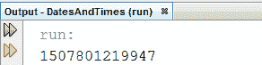

如果我们计算一下，我们会发现这个时间点实际上不是 0 年；相反，这是一个更接近的时间。这个时间点被`Calendar`类称为**纪元**，它是我们开始计算的时间点，从我们在 Java 中存储一个时间到纪元已经过了多少毫秒。

我们可以快速开发计算器，通过一个相当艰苦的过程，准确地计算出这个时间点是什么，或者我们可以在本机 Java 环境中轻松地完成它。让我们简单地将`now`的值更改为毫秒设置为`0`时的时间，该值最初设置为默认时间或当前时间。我们将使用`setTimeInMillis()`进行此操作，并提供`0`作为参数：

```
package datesandtimes; 

import java.util.*; 

public class DatesAndTimes { 
    public static void main(String[] args) { 
        Calendar now = new GregorianCalendar(); 

 now.setTimeInMillis(0); 

        System.out.println(now.getTimeInMillis()); 
        System.out.println(now.get(Calendar.MONTH) + 1); 
        System.out.println(now.get(Calendar.DAY_OF_MONTH)); 
        System.out.println(now.get(Calendar.YEAR)); 
    } 

} 
```

当我们再次运行程序时，会得到相同的输出字段：


输出中的第一个数字是我们确认毫秒已设置为`0`。现在我们的`Calendar`时刻是 1970 年 1 月 1 日。因此，一旦我们开始向对象添加天数，我们将从 1970 年 1 月 2 日开始计算。这个时间点被 Java`Calendar`称为纪元。

为什么这对我们来说真的很有趣？这意味着我们可以将我们的`Calendar`类转换成这些毫秒值，然后加、减，我猜乘、除它们为整数值。这使我们能够以数学的原生格式对它们进行各种操作。

最后，我想向您展示另一件事，因为这是一种您可能不熟悉的语法，当您遇到它时可能无法立即识别。如果您还记得在本节开头，我们说过`Calendar`是一个抽象类；我们只能实例化特定类型的`Calendar`类。然而，我们通常不会具体说明我们要找的日历类型；我们会让`Calendar`班来决定这个。

正如我们在枚举中看到的，`Calendar`类除了具有对象级方法外，还提供了一些静态方法，我们可以通过引用`Calendar`类型名来使用这些方法。其中一种方法是`Calendar.getInstance()`，它将为我们创建 Java 能够找到的最合适的`Calendar`类：

```
Calendar now = Calendar.getInstance(); 
```

在本例中，它将是我们已经创建的同一个`GregorianCalendar`类。

# 字符串功能

在 Java 中使用字符串一开始可能会有点混乱，因为它们实际上是一种特例。字符串与字符串文字的概念相关联，即双引号之间的字符序列。我们可以把它直接放到 Java 程序中，Java 会理解它，就像它理解整数或单个字符一样。

与整数、字符和浮点不同，Java 没有与此字符串文本关联的基本关键字。如果我们想得到最接近的字符数组；然而，一般来说，Java 喜欢我们将字符串文本与`String`类相关联。为了更好地理解`String`课程，请看以下程序：

```
package strings; 

public class Strings { 

    public static void main(String[] args) { 
        String s1 = new String
         ("Strings are arrays of characters"); 
        String s2 = new String
         ("Strings are arrays of characters"); 

        System.out.println("string1: " + s1); 
        System.out.println("string2: " + s2); 
        System.out.println(s1 == s2); 

    } 
} 
```

Java 中的`String`类是特殊的。在某些方面，它就像任何其他类。它有方法，正如我们在代码行中看到的，我们在代码行中定义了变量`s1`和`s2`，它有一个构造函数。但是，我们可以在`String`类上使用运算符，这些运算符通常只保留给文本和原语。例如，在前面的程序中，我们在字符串文本`string 1:`中添加了`s1`，以获得有意义的结果。在处理 Java 对象时，这通常不是一个选项。

# 字符串文字与字符串对象

Java 决定交替使用`String`类的对象作为字符串文本或真实对象，这是非常强大的。它为我们提供了比其他方式更多的文本操作选项，但它确实带来了一些折衷。在处理`String`对象时，了解是处理其字符串值还是处理对象本身非常重要。这是因为我们可以得到完全不同的行为。我们看到的前面的程序是为了说明其中一个实例而设计的。

这是一个相当简单的程序。让我们逐步了解它并尝试预测它的输出。我们首先声明并实例化两个`String`对象：`s1`和`s2`。我们使用`String`构造函数（我们将很快讨论这一点的重要性），我们只需将相同的字符串文本值传递给这些新对象中的每一个。然后，我们要求我们的程序打印出这些值，以便我们可以直观地比较它们。但是，我们也要求我们的程序执行这个有趣的任务：使用双等号比较运算符`s1`和`s2`进行比较。在你运行这个程序之前，花点时间问问自己，“你认为这个比较的结果会是什么？”。

当我运行这个程序时，我看到 Java 不相信`s1`和`s2`的比较返回`true`。我得到结果`false`：


根据我们当时对`s1`和`s2`的想法，输出要么有意义，要么令人困惑。如果我们将`s1`和`s2`视为比较运算符比较的字符串文字，我们会感到非常困惑。我们想知道为什么我们没有得到结果`true`，因为分配给`s1`和`s2`的字符串文本是相同的。

然而，如果我们将`s1`和`s2`视为它们是的对象，`false`结果更有意义，因为我们问 Java 的是，“这两个对象是相同的吗？”它们显然不是，因为它们都是创建两个不同新对象的结果。

这就是为什么我们喜欢在 Java 中使用`equals()`方法的原因。几乎每个对象都实现了一个`equals()`方法，并且应该为每个对象编写`equals()`方法，以便能够逻辑地比较这些对象的值。

如果我们使用`equals()`方法比较字符串，我们也会比较它们包含的字符串文字值：

```
System.out.println(s1.equals(s2)); 
```

现在，如果我们执行我们的程序，我们得到的结果是`true`，而不是我们试图查看它们是否实际上是存储在同一内存位置的相同对象时得到的`false`：

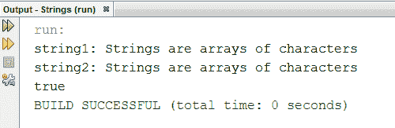

# 字符串函数

那么这个`String`实现给了我们什么权力？我们知道我们可以将字符串添加或连接在一起，因为我们可以将它们作为文本进行操作。除了这种文字操作之外，我们还可以利用`String`类本身提供的所有功能。我们可以查看 Java 文档，看看我们可以使用哪些功能，也可以随时使用 NetBeans 的代码完成功能进行检查。我可能应该在这里指出，我们甚至可以对字符串文本使用`String`类功能，如下面的屏幕截图所示：

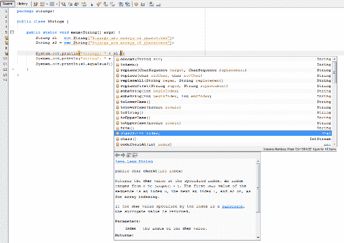

# replace（）函数

您将在方法列表中看到的许多方法都是不言自明的（`toLowerCase()`、`toUpperCase()`等等）。但为了确保我们都在同一页上，让我们使用其中一个。让我们使用`replace()`。`replace()`函数有两个参数，这些参数可以是单个字符，也可以是字符串限定的字符序列。此方法仅将第一个字符串或字符的所有实例替换为第二个字符串或字符。我们来看下面的`replace()`示例：

```
package strings; 

public class Strings { 

    public static void main(String[] args) { 
        String s1 = new String
        ("Strings are arrays of  characters"); 
        String s2 = new String
        ("Strings are arrays of characters"); 

        System.out.println
        ("string1: " + s1.replace("characters", "char")); 
        System.out.println("string2: " + s2); 
        System.out.println(s1.equals(s2)); 
    } 
} 
```

当我们运行程序时，我们看到我们已经修改了它的输出：


大多数方法只是修改返回的值。我们可以看到，我们的程序在最后一行代码中仍然发现`s1`等于`s2`，这表明`s1`的值没有被我们对`replace()`方法的调用所修改。`replace()`方法只返回修改后的值供`println()`函数使用。

# format（）函数

也许，`String`类最有趣的方法实际上是它的一个静态方法：`String.format()`。为了向您展示`String.format()`的威力，我想为我们的项目创建一个全新的功能类。因此，右键单击屏幕左侧显示的文件系统中的项目名称，创建一个新类，并将其命名为`CustomPrinter.java`：

```
package strings; 

public class Strings { 

    public static void main(String[] args) { 
        CustomPrinter printer = new CustomPrinter("> > %s < <"); 

        String s1 = new String
        ("Strings are arrays of characters"); 
        String s2 = new String
        ("Strings are arrays of characters"); 

        printer.println
        ("string1: " + s1.replace("characters", "char")); 
        printer.println("string2: " + s2); 
    } 
} 
```

为了让您看到我们在设置`CustomPrinter`类时正在做什么，让我们看看我们将在`main()`方法中使用的预写代码。`CustomPrinter`类背后的思想是，它将有一个构造函数，该构造函数接受字符串作为输入。此输入字符串将格式化或环绕我们使用`CustomPrinter`实例打印到控制台的任何字符串。我们将在`CustomPrinter`中实现`System.out.println()`，所以我们可以在需要使用`printer.println()`格式化文本时调用它。

在 Java 中格式化字符串时，我们使用一些特殊的语法。在我们的格式字符串中，我们可以在字符`f`或`d`或`s`的前面加上一个百分比符号（就像我们在代码中使用的`%s`）。就`String.format()`函数而言，Java 将这些区域理解为格式字符串中插入其他信息的区域。

我们在代码中使用的格式字符串将用插入符号括号包装我们创建的任何字符串输出。这比简单地在字符串上追加和前置要复杂得多，我们当然可以创建一个实现，允许我们在格式化字符串中添加多个片段。

接下来我们来编辑我们的`CustomPrinter.java`文件。我们知道我们需要一个`CustomPrinter`构造函数，它接受一个格式字符串作为输入。然后，我们可能需要存储这个`format`字符串。让我们的构造函数获取提供的格式字符串，并将其存储在`formatString`变量中供以后使用：

```
package strings; 

public class CustomPrinter { 
    private String formatString; 

    public CustomPrinter(String format) 
    { 
        formatString = format; 
    } 
} 
```

我们还声明了一个`println()`函数，它可能是一个`void`函数；它只是利用`system.out.println()`在屏幕上打印一些东西。那个*是什么*会有点复杂。我们需要获取给定的格式字符串，并用提供给`println()`函数的输入替换`%s`。

我们使用 awesome`String.format()`静态函数来实现这一点，该函数接受两个参数：格式化字符串和要格式化的数据。如果我们的格式字符串有多个要格式化的字符串，我们可以在`String.format()`中提供多个字段。这是一个可以接受任意数量输入的函数。但是，为了使一切保持简单并继续进行，我们只需要假设我们的格式字符串只有一个输入实例。

一旦我们使用`String.format()`函数成功格式化此字符串，我们只需将其打印到屏幕上，就像我们之前所做的那样：

```
package strings; 

public class CustomPrinter { 
    private String formatString; 

    public CustomPrinter(String format) 
    { 
        formatString = format; 
    } 

    public void println(String input) 
    { 
        String formatted = String.format(formatString, input); 
        System.out.println(formatted); 
    } 
} 
```

当我们运行这个程序时（我们需要运行我们有`main()`方法的类），我们看到所有的输出都被正确地包装在插入符号括号中：

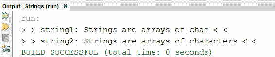

当然，像这样扩展一个定制打印机，以接受更多不同的输入，并比我们创建的快速打印机更具动态性，这是任何东西的基础，例如日志记录系统或终端系统，在这些系统中，您将能够看到围绕消息的相同信息片段。例如，我们可以使用这样的自定义打印机，在发送给用户的任何消息之后放置日期和时间。然而，细节需要适当的格式化，这样它们就不只是在结尾加上，而是在它们和类似的东西之间有适当的间隔。

我希望你已经学了一些关于弦的知识。Java 处理它们的方式非常强大，但与编程中最强大的东西一样，您需要在基本层面上理解它们，然后才能确定它们不会回来咬您。

# 例外情况

有时，我们的代码可能会失败。可能是我们的编程错误，也可能是最终用户以我们没有预料到的方式使用我们的系统。有时，甚至可能是硬件故障；很多错误不能真正归因于任何一个单一的来源，但它们是会发生的。我们的程序处理错误案例的方式通常与处理理想用例的方式一样重要（如果不是更重要的话）。

在本节中，我们将了解 Java 异常。使用 Java 异常，我们可以检测和捕获程序中发生的错误，在某些情况下还可以从中恢复。当我们遇到异常时，有一些非常重要的事情需要记住。异常之所以称为异常，是因为它们的存在是为了处理异常情况，即我们在最初编写代码时无法处理或无法预料的情况。

异常会修改我们程序的控制流，但是除了捕获、处理或传递异常之外，我们不应该使用它们。如果我们试图用它们来实现逻辑，我们会制作一个程序，这个程序很快会让我们感到非常困惑，并且会立即让任何试图理解它的程序员感到非常困惑。

为了帮助我们探索 Java 异常，我设置了一个基本程序供我们使用；这是可能失败的事情。这是一个永恒的循环，做两件真实的事情。首先，它使用`Scanner`的`nextFloat()`功能从用户处获取输入，然后将该输入打印回用户：

```
package exceptions; 

import java.util.*; 

public class Exceptions { 
    public static void main(String[] args) { 
        Scanner reader = new Scanner(System.in); 

        while(true) { 
            System.out.print("Input a number: "); 
            float input = reader.nextFloat(); 
            System.out.println("You input the number: " + input); 
            System.out.println("\r\n"); 
        } 
    } 
} 
```

如果我们准确地将浮点值指定为该程序的输入，则该程序理论上将永远运行，如以下屏幕截图所示：


但是，如果我们犯了一个错误，给这个程序一个字符串作为输入，`nextFloat()`函数将不知道如何处理它，并且会发生异常：

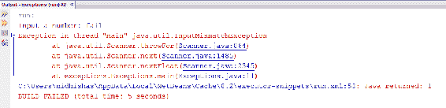

发生这种情况时，控制台中会出现红色文本。这个红色文本实际上将进入`System.err`流。

# 分析控制台异常消息

让我们浏览输出文本并理解其含义。其中有两个重要部分。输出文本的第一部分，即未标记的位，是此异常的标识符。它让我们知道异常已经抛出，并且发生在哪里。然后它告诉我们发生了什么类型的异常。您会注意到，这个异常出现在`java.util`路径中（这部分输出看起来非常类似于我们是将某些内容导入到代码中还是直接路径到外部库）。这是因为这个异常实际上是一个 Java 对象，我们的输出文本让我们确切地知道它是什么类型的对象。

此异常测试的第二位（选项卡部分）是我们所称的堆栈跟踪。它基本上是 Java 所跳过的程序的一部分。堆栈跟踪的最底层是异常最初抛出的位置；本例为`Scanner.java`且在线`909`。

这不是我们的准则；这是为`Scanner.java`编写的代码，大概是`nextFloat()`方法所在的位置，或者`nextFloat()`方法调用的代码。

堆栈跟踪是代码层，所以一旦`InputMismatchException`出现，Java 就开始跳过这些代码层或括号区域，直到它最终到达代码所在的顶层，在我们的例子中就是`Exceptions.java`。这是我们创建的文件，它位于堆栈跟踪的顶部。我们的`Exception.java`代码文件的第 11 行是 Java 能够处理或抛出此异常的最后一个地方。

一旦到达第 11 行，异常仍在向上传播，就没有其他需要处理的了，因为它已经到达了程序的顶部。因此，异常通过打印到我们的`System.err`流而结束，我们的程序以结果`1`终止，这是一个失败案例。

这对于调试目的非常有用；我们知道我们必须去哪里找出我们程序中的错误，`Exceptions.java`第 11 行。但是，如果我们正在创建一个程序，我们希望为了某种合理的目的发布它，我们通常不希望程序在出现小错误时崩溃，特别是像这样的输入错误，这对于用户来说是非常合理的。因此，让我们探讨如何处理异常。

# 异常处理

当 Java 被告知抛出异常时，它停止执行当前代码块，并开始向上跳跃，直到异常得到处理。这就是我们如何从`Scanner.java`类的 909 行深入到`Exceptions.java`的第 11 行，在我们的代码中，就我们而言，异常发生了。如果我们的代码被另一个代码块执行，因为我们没有处理这个异常，而不是打印到`System.err`，那么我们只需将异常抛出到另一个级别。因此，他们会在堆栈跟踪中看到`Exception.java`的第 11 行。

然而，有时持续抛出异常是没有意义的。有时，我们想要处理异常情况，因为我们知道如何处理它，或者因为，就像我们现在正在处理的情况一样，有更好的方法通知用户出了什么问题，而不仅仅是提供堆栈跟踪和异常名称。

此外，如果我们在这里处理这个异常，就没有理由不能像什么都没发生过一样继续我们的`while`循环。这个`while`循环的一个失败案例不一定是终止我们程序的理由。若我们要处理异常情况，我们将使用`try...catch`代码块。

# 试捕积木

在我们认为可能会抛出异常并希望处理异常的任何代码块中，我们将把这行代码包装在一个`try`块中。在大多数情况下，这不会影响代码的执行方式，除非`try`块中发生异常。如果在`try`块内引发异常，则不会将该异常向上传播到下一级，而会立即执行以下`catch`块内的代码。

注意，`catch`块在执行之前需要更多的信息；他们需要知道到底要抓什么。我们可以通过捕获`Exception`类的任何内容来捕获所有异常，但这可能不是一件公平的事情。关于异常处理有很多不同的观点，但一般来说，人们会同意，您应该只捕获并处理您在某种程度上预期可能发生的异常。

在我们看到的示例中，我们知道如果通过用户输入提供无效信息，就会抛出`InputMismatchException`。因为当这个异常发生时，我们将打印一条消息，特别告诉用户`Please enter a float number.`，我们当然不想捕获任何不是`InputMismatchException`的异常。因此，我们使用以下代码捕获`InputMismatchException`：

```
package exceptions; 

import java.util.*; 

public class Exceptions { 
    public static void main(String[] args) { 
        Scanner reader = new Scanner(System.in); 

        while(true) { 
            try{ 
              System.out.print("Input a number: "); 
              float input = reader.nextFloat(); 
              System.out.println("You input the number: " + input); 
              System.out.println("\r\n"); 

            } 
            catch(InputMismatchException e) 
            { 
                System.out.println
                ("Please enter a float number."); 
                System.out.println("\r\n"); 
            } 
        }  
    } 
} 
```

当我们运行这个程序时，首先我们必须快速测试它是否在一个好的用例中工作，就像以前一样。然后，如果我们通过提供字符串输入导致抛出`InputMismatchException`，我们应该看到 catch 块执行，我们应该得到`Please enter a float number.`响应：

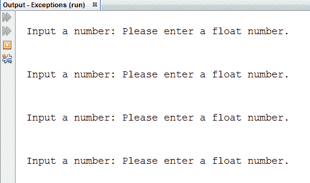

现在，正如你们所看到的，我们确实得到了这种反应，但不幸的是，我们一次又一次地得到这种反应。我们无意中引入了一个更糟糕的错误。现在，我们的程序没有抛出异常并崩溃，而是进入了一个无限循环。

这就是为什么会发生这种情况：我们的`Scanner`对象`reader`是一个流读取器，这意味着它选择了一个输入缓冲区来读取。在正常情况下，当用户将浮点数添加到我们的输入循环中时。我们把它们挑出来，打印出来，然后回到循环的开始，等待下一个循环。然而，当在该缓冲区中找到字符串时，我们调用`nextFloat()`函数的代码行抛出异常，这很好，因为我们使用 catch 块捕获它。

我们的 catch 块打印出一行文本，告诉用户他/她提供了无效的输入，我们返回 while 循环的开始。但是，`reader`对象缓冲区中的坏字符串仍然存在，因此当我们捕获异常时，我们需要清除该流。

幸运的是，这是我们能够处理的。一旦我们捕获并处理了异常，我们就需要清除流阅读器，只需抓取它的下一行，而不处理它的信息。这将刷新读卡器的`Please enter a float number.`行：

```
catch(InputMismatchException e) 
{ 
    System.out.println("Please enter a float number."); 
    System.out.println("\r\n"); 
} 
```

如果我们现在运行我们的程序，我们会看到它处理和恢复失败的输入，我们给它一个字符串，这是非常酷的：

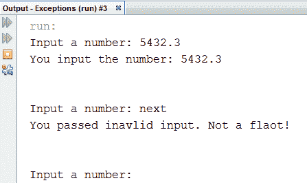

让我们再看几件我们可以做的例外情况。首先，在异常情况结束时清除我们的读取器是很有意义的，但在任何尝试的情况结束时清除读取器可能更有意义。毕竟，我们进入这个`while`循环的前提是读者中没有新行。所以，为了实现这个，我们有`finally`块。

# 最后一个街区

如果我们希望始终执行一个案例，无论我们在`try`块中成功与否，我们都可以跟随`catch`块和`finally`块。无论异常是否被捕获，`finally`块都会执行。它的存在是为了您可以将清理代码放入系统中。清理代码的一个例子是清除`reader`对象缓冲区，这样就不会让我们自己或其他程序员感到困惑。

异常不仅仅是一个被抛出的简单对象；它们可以包含很多非常重要的信息。如前所述，异常可以包含堆栈跟踪。让我们快速修改我们的程序，这样在它仍然提供用户友好的`Please enter a float number.`信息的同时，它还打印出堆栈跟踪，以便程序员可以调试我们的程序。

通常，当我们编写用户将要使用的完成的代码时，我们不希望出现这样的情况，即用户能够看到像堆栈跟踪这样深的东西。对于大多数计算机用户来说，它是令人困惑的，并且在某些情况下可能会带来安全风险，但是作为调试模式中的一项功能，或者对于开发人员来说，像这样的详细异常可能非常有用。

`Exception`类公开了一个名为`printStackTrace()`的方法，该方法需要一个流作为输入。到目前为止，我们的所有输出都使用了`System.out`，因此我们将提供`printStackTrace()`方法，并将`System.out`作为其流：

```
catch(InputMismatchException e) 
{ 
    System.out.println("Please enter a float number."); 
    e.printStackTrace(System.out); 
    System.out.println("\r\n"); 
} 
```

现在，当我们运行程序并给它一个坏字符串时，我们得到了初始的友好异常文本代码。但是，我们仍然有堆栈跟踪，因此我们可以准确地看到错误的来源：

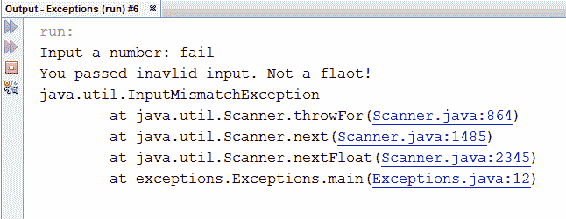

正如我前面提到的，异常处理在现代软件开发中是一个非常深入的主题，但是在本节的最后，您应该牢牢掌握基础知识。当您在代码中遇到异常，或者在编写自己的代码时，觉得需要处理异常时，您应该做好充分的准备。

# 对象类

在本节中，我们将学习一些关于 Java 如何选择实现面向对象编程的非常重要的内容。我们将探索`Object`类本身。为了让我们开始，我写了一个非常基本的程序：

```
package theobjectclass; 

public class TheObjectClass { 

    public static void main(String[] args) { 
        MyClass object1 = new MyClass("abcdefg"); 
        MyClass object2 = new MyClass("abcdefg"); 

        object1.MyMethod(); 
        object2.MyMethod(); 

        System.out.println("The objects are the same: " + 
        (object1 == object2)); 
        System.out.println("The objects are the same: " + 
        object1.equals(object2)); 
    } 

} 
```

这个类的`object1`和`MyClass`创建了两个实例。然后，我们对这些对象中的每一个调用一个 void`MyMethod`方法，该方法只打印出我们给它们的要包含的值。然后，程序比较这些对象。

我们首先使用比较运算符（`==`）进行比较，该运算符检查这两个对象是否实际上是同一个对象。我们知道这不会是真的，因为我们可以看到对象被完全独立地实例化。它们共享一个类，但它们是`MyClass`类的两个不同实例。然后，我们使用`equals()`方法对这些对象进行了比较，我们将在本节中详细介绍。

当我们运行这个程序时，我们看到当比较运算符比较时，发现对象不相同，这是我们所期望的。但是，我们也看到，当使用`equals()`方法对它们进行比较时，发现对象并不相等，即使对象都是在相同的参数下创建的，并且从创建到现在对它们做了完全相同的事情。以下是前面代码的输出：


那么，当`equals()`方法发现对象不相等时，这意味着什么？我们应该问自己的第一个问题是，这个`equals()`方法是从哪里来的，或者在哪里实现的？

如果我们按照`MyClass`类的定义，我们实际上没有找到`equals()`方法，这很奇怪，因为`MyClass`没有声明为继承自任何超类，但`equals()`直接在`MyClass`实例上调用。实际上，`MyClass`和所有 Java 类一样，确实继承自一个超类。在每个类继承树的最顶端，都有`Object`类，尽管我们的代码中没有显式声明它。

如果我们阅读 Java 文档（[docs.oracle.com/javase/7/docs/api/Java/lang/Object.html](http://docs.oracle.com/javase/7/docs/api/java/lang/Object.html)，查找`Object`类，我们会发现这样的定义：“类`Object`是类层次结构的根。每个类都有`Object`作为超类。所有对象，包括数组，都实现了这个类的方法。”然后，如果我们向下滚动页面，我们会得到一个简短但非常重要的方法列表：

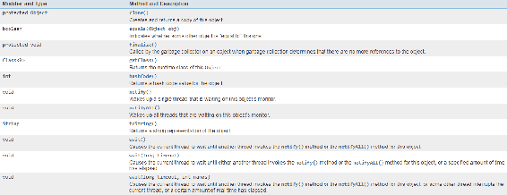

因为所有 Java 对象都继承自`Object`类，所以我们可以安全地假设我们正在处理的任何 Java 对象都实现了这里的每个方法。在这些方法中，有`equals()`方法，我们刚刚讨论过，并试图找出它的来源。这向我们清楚地表明，`MyClass`从其`Object`超类继承了`equals()`方法。

`equals()`方法在对象层面的定义非常模糊。它说，“指示其他对象是否与这个对象相等。”在某种程度上，这种模糊性让作为程序员的我们在一个类一个类的基础上确定相等的真正含义。

假设我们得出一个决定，一个合理的决定，`object1`和`object2`应该被确定为彼此相等，如果它们包含的值相同。如果我们做出这个决定，那么我们的计划目前的实施并不完全正确，因为它目前告诉我们`object1`和`object2`是不相等的。为了改变这一点，我们需要覆盖`MyClass`中的`equals()`方法。

# 重写 equals（）方法

重写`Object`类方法并不比重写任何其他超类的方法更困难。我们只需声明一个相同的方法，当我们处理`MyClass`对象时，将在适当的时候使用这个特定的方法。我们需要注意的是，`equals()`方法没有将`MyClass`对象作为输入；它接受任何对象作为输入。因此，在我们继续将这个对象的值与当前`MyClass`对象的值进行比较之前，我们需要保护自己，并确保作为输入的对象实际上是`MyClass`对象。

要做到这一点，让我们检查一些不好的情况，在这些情况下，我们希望我们的程序简单地继续并返回`false`，甚至不比较这些对象的内部值：

1.  如果我们得到了一个没有实际实例化的对象，一个指针，或者一个空指针，我们只想返回`false`，因为我们实例化的`MyClass`对象根本不等于零。
2.  更困难的问题是：我们要比较的对象是`MyClass`的实例吗？让我们检查一下这个的反面；让我们确认这个对象不是`MyClass`的实例。`instanceof`关键字让我们看到一个对象在其指令库中有哪些类。如果我们的`instanceof`语句的计算结果不是`true`，我们只想返回`false`，因为我们将比较`MyClass`对象和`MyClass`对象以外的对象。

一旦我们成功地通过这些环，我们就可以安全地假设我们可以将给定的对象投射到`MyClass`对象上。现在我们可以简单地比较它们包含的值字段并返回适当的值。让我们将以下代码写入我们的`MyClass.java`文件，然后跳回我们的`main()`方法来运行它：

```
package theobjectclass; 

public class MyClass { 
    public String value; 
    public MyClass(String value) 
    { 
         this.value = value; 
         System.out.println
         ("A MyClass object was created with value:" + value); 
     } 
     public void MyMethod() 
     { 
        System.out.println
        ("MyMethod was called on a MyClass object with value: " + 
        value); 
      }  

      @Override 
      public boolean equals(Object obj) 
      { 
         if(obj == null) 
           return false; 

         if(!(obj instanceof MyClass)) 
         return false; 

         return value.equals(((MyClass)obj).value); 

       } 
} 
```

当我们运行这个程序时，我们会发现`object1`和`object2`是相等的：

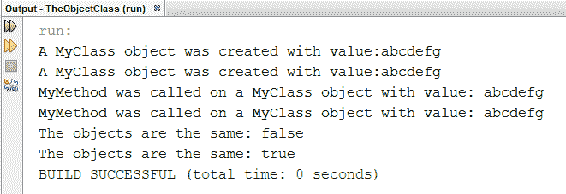

# 其他对象方法

`Object`类声明了许多方法。除了`equals()`之外，一些重要的方法还有`hashCode()`和`toString()`。我们不打算在本节中实现`hashCode()`，因为它需要我们做更多的数学运算，但我非常建议您通过查看文档并探索`hashCode()`是如何工作的。

现在，让我们只知道一个对象的`hashCode()`方法应该返回一个描述该特定对象的整数值。在所有情况下，如果通过`equals()`方法发现两个对象相等，则它们的`hashCode()`函数也应返回相同的整数值。如果两个对象不相等，就`equals()`方法而言，它们的`hashCode()`函数应该返回不同的值。

此时此刻，我们应该熟悉`toString()`方法。这也是`Object`类中的一个方法，这意味着我们可以在任何单个对象上调用`toString()`方法。但是，在我们的自定义对象中，在我们重写`toString()`之前，它可能不会返回有意义的、人类可读的信息。

在学习 Java 时，我强烈建议您实现`equals()`和`toString()`，即使是在学习时编写的小测试类上。这是一个很好的习惯，它使您能够像 Java 一样思考面向对象编程。当我们创建最终确定的软件项目时，如果我们有其他程序员将来可能会使用的公共类，我们应该非常小心，确保我们的所有类都以可理解的方式正确地实现这些方法。这是因为 Java 程序员希望能够利用这些方法来操作和理解我们的类。

# 基本类

在本节中，我想非常快速地了解一下 Java 中可用的基本类。在 Java 中，我们经常说字符串是特殊的，因为它们具有由这些双引号标识的文字解释；然而，我们仍然主要通过`String`类与它们交互，而不是我们实际上不可用的`string`原语类型。

但是，对于标准 Java 原语，我们通常通过其原语类型化方法与之交互。对于每个基元类型，我们都有相应的基元类。这些是`Integer`、`Character`和`Float`类等等。在大多数情况下，这些类的显式使用（我们创建它们的实例，然后在该实例上调用方法）不是很有用，除非我们重写它们来创建自己的类。让我们看一下下面的节目：

```
package the.primitiveclasses; 

public class ThePrimitiveClasses { 

    public static void main(String[] args) { 
        String s = "string"; 

        Character c = 'c'; 
    } 

} 
```

`Character`类的实例`c`提供给我们的方法主要是转换方法，如下面的屏幕截图所示，这些方法将自动发生，或者我们可以简单地转换为：

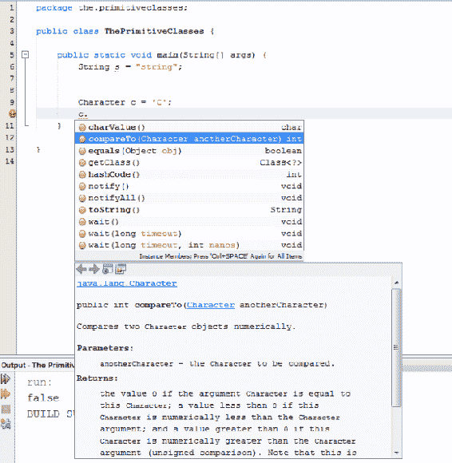

但请注意，`compareTo()`有时是有用的。如果给定的另一个字符相等且小于`0`或大于`0`，则返回整数值`0`，具体取决于两个字符之间的关系属于整数转换刻度的哪一侧。

然而，我们经常会发现自己使用这些基本类的静态方法来操作基本类型的实例或从中获取信息。例如，如果我想知道我们的字符`C`是否为小写，我当然可以将其转换为整数值，检查 ASCII 表，然后查看整数值是否在小写字符范围内。但是，这需要做大量的工作：


`Character`原语类为我提供了一个静态函数`isLowercase()`，如前面的屏幕截图所示，它将告诉我一个字符是否为小写。让我们运行以下程序：

```
package the.primitiveclasses; 

public class ThePrimitiveClasses { 

    public static void main(String[] args) { 
        String s = "string"; 

        Character c = 'c'; 
        System.out.println(Character.isLowerCase(c)); 
    } 

} 
```

以下是前面代码的输出：

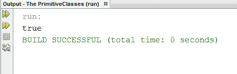

这就是原始函数的要点。我们可以以相同的方式与其他文本类型及其基元类型交互：如果我们愿意，可以使用类与字符串交互。

当我们不需要原语类的功能时，我们应该继续使用原语类型（例如，使用`char`而不是`Character`。语法突出显示功能的存在和这些原语类型在不同语言中的通用外观使它们对程序员的工作更加友好。

# 总结

在这一章中，我们研究了 Java 的`Calendar`类来处理日期和时间。我们详细地看了`String`课程。我们还了解了什么是异常，以及如何处理它们以使我们的程序更加健壮。然后，我们浏览了`Object`类及其一些方法。最后，我们看了 Java 的基本类。

在下一章中，我们将了解如何使用 Java 处理文件。