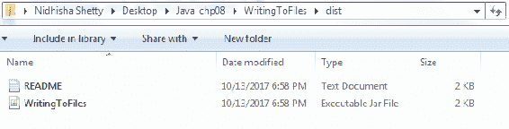
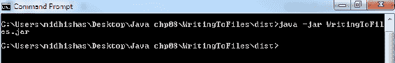
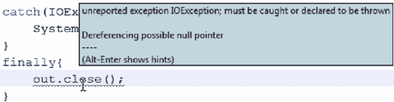
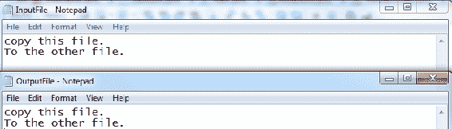
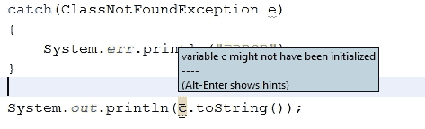

# 文件输入和输出

文件 I/O 函数是一个非常强大的工具，它可以使现代编程中最困难和最令人沮丧的任务之一，即在逻辑上独立的代码实体之间传输信息，比其他方法容易得多。话虽如此，在本章中，您将学习如何使用`FileWriter`和`BufferedWriter`以及`FileReader`和`BufferedReader`类编写和读取数据文件。我们还将了解`close ()`方法和`Scanner`类的用法。然后您将了解异常处理。最后，我们将看到 I/O 的另一个方面：`Serializable`类。

具体而言，我们将在本章中介绍以下主题：

*   将数据写入文件
*   从文件中读取数据
*   可序列化类

# 将数据写入文件

这将是一个激动人心的篇章。首先，我们将了解如何使用 Java 编写文件。为此，我们将为数学序列的前 50 个数字声明一个数学序列，其中每个数字将是前两个数字的总和。当我们运行以下程序时，我们将看到这 50 个数字打印到我们的`System.out`流中，我们将能够在控制台窗口中查看它们：

```java
package writingtofiles; 

public class WritingToFiles { 
    public static void main(String[] args) { 
        for(long number : FibonacciNumbers()) 
        { 
            System.out.println(number); 
        } 
    } 

    private static long[] FibonacciNumbers() 
    { 
        long[] fibNumbers = new long[50]; 
        fibNumbers[0] = 0; 
        fibNumbers[1] = 1; 
        for(int i = 2; i < 50; i++) 
        { 
            fibNumbers[i] = fibNumbers[i - 1] + fibNumbers[i - 2]; 
        } 
        return fibNumbers; 
    } 
} 
```

但是，当我们永久关闭控制台时，这些数字将丢失。为了帮助我们完成这项任务，我们将利用`java.io`图书馆；此处，`io`表示**输入输出**：

```java
import java.io.*; 
```

我们将使用此库中的一个类：`FileWriter`。

# FileWriter 类

`FileWriter`类及其用法可以解释如下：

1.  让我们声明一个新的`FileWriter`类，出于稍后会很明显的原因，让我们显式地将这个`FileWriter`类设置为 null：

```java
        public class WritingToFiles { 
            public static void main(String[] args) { 
                FileWriter out = null; 
```

2.  一旦我们这样做了，我们就可以继续并实例化它。为了写入文件，我们需要知道两件重要的事情：
    *   当然，首先，我们需要知道向文件写入什么
    *   其次，我们的`FileWriter`类需要知道它应该写入哪个文件

3.  当我们使用一个`FileWriter`类时，我们将它与一个特定的文件相关联，因此我们将要写入的文件的名称传递给它的构造函数。我们的`FileWriter`类可以在不存在文件的情况下创建一个文件，因此我们只需选择一个以`.txt`结尾的名称，这样我们的操作系统就会知道我们正在创建一个文本文件：

```java
        public class WritingToFiles { 
            public static void main(String[] args) { 
                FileWriter out = null; 
                    out = new FileWriter("out.txt"); 
```

即使我们使用有效参数调用了`FileWriter`构造函数，NetBeans 仍然会让我们知道在这段代码中会出现编译器错误。它会告诉我们有一个未报告的异常，`IOException`错误可以在这里抛出。Java 中的许多异常都标记为已处理异常。这些是函数显式声明可能抛出的异常。`FileWriter`是一个明确声明它可以抛出`IOException`错误的函数。因此，就 Java 而言，我们的代码没有显式地处理这个可能的异常是一个错误。

4.  当然，为了处理这个问题，我们只需将使用`FileWriter`类的代码部分包装成一个捕捉`IOException`错误的`try...catch`块：
5.  如果我们发现了一个`IOException`错误，那么现在可能是向**错误流**打印一条有用消息的好时机：

```java
        catch(IOException e) 
        { 
             System.err.println("File IO Failed."); 
        } 
```

然后，我们的程序将完成运行并终止，因为它将到达`main`方法的末尾。捕捉到这个异常后，`FileWriter`的实例化现在是有效和合法的，所以让我们使用它。

我们不再需要我们的程序将数字打印到控制台上，所以让我们对我们的`println`语句进行注释，如下代码块所示：

```java
        for(long number : FibonacciNumbers()) 
        { 
            // System.out.println(number); 
        } 
```

我们将对`FileWriter`类做同样的逻辑操作：

```java
            try{ 
                out = new FileWriter("out.txt"); 
                for(long number : FibonacciNumbers()) 
                { 
                    // System.out.println(number); 
                } 
```

`FileWriter`类没有`println`语句，但它有`write`方法。每次执行`foreach`循环时，我们都希望使用`out.write(number);`语法将数字写入文件。

6.  不幸的是，`write`方法不知道如何将`long number`作为输入；它可以接受字符串，也可以接受整数。那么让我们使用静态的`String`类方法`valueOf`获取我们的`long number`值，将数字打印到我们的文件中：

```java
        for(long number : FibonacciNumbers()) 
        { 
            out.write(String.valueOf(number)); 
            // System.out.println(number); 
        } 
```

因此，我们现在应该有一个成功计划的所有部分：

然而，问题是`out.txt`在哪里？我们没有给`FileWriter`类一个完整的系统路径，只有一个文件名。我们知道`FileWriter`类可以在不存在的情况下创建此文件，但是`FileWriter`类将选择在系统目录中的何处创建此文件？

要回答这个问题，我们需要知道 NetBeans 将在何处为我们编译的程序创建`.jar`文件。为了找到答案，我们可以打开控制台窗口并构建我们的程序。在这里，NetBeans 将告诉我们它在哪里创建所有文件。例如，在我的例子中，它是一个名为`WritingToFiles`的文件夹；如果导航到此文件夹，我们将看到项目文件。其中一个文件是`dist`，是**可分发**的缩写，我们的 JAR 文件将在这里编译为：



JAR 文件与使用原始 Java 代码的可执行文件非常接近。因为 Java 代码必须由 Java 虚拟机解释，所以我们实际上无法创建 Java 可执行文件；然而，在大多数安装了 Java 的操作系统中，我们可以通过双击 JAR 文件来运行 JAR 文件，就像运行可执行文件一样。我们还可以告诉 Java 虚拟机使用 Java 命令行`-jar`命令启动并运行 JAR 文件，后面跟着我们希望它执行的文件名，当然：



当我们提交这个命令时，Java 虚拟机解释并执行了我们的`WritingToFiles.jar`程序。它看起来很有效，因为在该目录中创建了一个新文件，如前面的屏幕截图所示。这是工作目录，在我们移动它之前，执行 JAR 文件的命令将从这里执行。这就是我们的`FileWriter`类选择创建`out.txt`的地方。

# 使用 close（）方法释放资源

不幸的是，当我们打开`out.txt`时，我们看不到任何东西。这让我们相信我们的文件编写可能不起作用。那么出了什么问题？嗯，使用`FileWriter`有一个重要的部分我们没有考虑到。无论何时打开文件，我们都应该确保在 T2 中关闭它。从代码的角度来看，这很容易做到；我们只需在我们的`FileWriter`上调用`close`方法：

```java
public class WritingToFiles { 
    public static void main(String[] args) { 
        FileWriter out = null; 
        try{ 
            out = new FileWriter("out.txt"); 
            for(long number : FibonacciNumbers()) 
            { 
                out.write(String.valueOf(number)); 
                // System.out.println(number); 
            } 

        } 
        catch(IOException e) 
        { 
            System.err.println("File IO Failed."); 
        } 

        finally{ 
            out.close(); 
        } 
    } 
```

出现了一条熟悉的错误消息，如下面的屏幕截图所示；`out.close`还可以报告`IOException`错误：



我们可以将`out.close`放在另一个`try...catch`块中并处理这个`IOException`错误，但如果我们的文件无法关闭，那就表明有严重问题。在这种情况下，异常继续向上传播可能是合适的，我们将其传递给一段更健壮的代码，而不是我们完全包含的`WritingToFiles`程序。如果我们不处理这个异常，默认情况下会发生这种情况，但我们确实需要让 Java 知道，这个异常可能会从当前代码向上传播。

当我们声明我们的`main`方法时，我们还可以让 Java 知道该方法可能引发哪些异常类型：

```java
public static void main(String[] args) throws IOException 
```

在这里，我们告诉 Java，在某些情况下，我们的`main`方法可能无法完美执行，反而会抛出`IOException`错误。现在，任何调用`WritingToFiles`的`main`方法的人都需要自己处理这个异常。如果我们构建 Java 程序，然后再次执行它，我们将看到`out.txt`已正确打印。不幸的是，我们忘记在输出中添加新行，因此数字之间没有可区分的间距。当我们写作时，我们需要在每个数字后面加上`\r\n`。这是一种新的换行符语法，几乎对每个操作系统和环境都可见：

```java
for(long number : FibonacciNumbers()) 
{ 
    out.write(String.valueOf(number) + "\r\n"); 
    // System.out.println(number); 
} 
```

再一次，是时候构建、运行并查看`out.txt`，它现在看起来非常有用：


这就是我们最初的目标：将斐波那契序列打印到一个文件中。不过，在我们结束之前，还有一些简单的事情。让我们看看如果我们再次运行我们的程序，然后看看我们的输出文本文件会发生什么。文本文件看起来与以前一样，这可能是预期的，也可能不是预期的。`FileWriter`是否会清除此文件并编写全新的文本（这似乎是它所做的），或者是否会将附加的文本放在文件中现有文本之后，这似乎是一个难题。默认情况下，我们的`FileWriter`将在文件重新写入之前清除该文件，但我们可以通过`FileWriter`构造函数中的参数切换此行为。比如，我们将其追加行为设置为`true`：

```java
try { 
    out = new FileWriter("out.txt", true); 
```

现在构建项目，运行项目，并查看`out.txt`；我们将看到比以前多一倍的信息。我们的文本现在附在末尾。

# BufferedWriter 类

最后，Java 中有很多不同的编写器，而`FileWriter`只是其中之一。我决定在这里展示给你们看，因为它很简单。它获取一些文本并将其打印到文件中。但是，您经常会看到`FileWriter`被`BufferedWriter`类包围。现在，`BufferedWriter`类的声明将类似于下面代码块中给出的声明，其中创建了`BufferedWriter`并将`FileWriter`作为其输入。

`BufferedWriter`类非常酷，因为它智能地接受您给它的所有命令，并尝试以最有效的方式将内容写入文件：

```java
package writingtofiles; 

import java.io.*; 

public class WritingToFiles { 
    public static void main(String[] args) throws IOException { 
        BufferedWriter out = null; 

        try { 
            out = new BufferedWriter(new FileWriter
             ("out.txt", true)); 

            for(long number : FibonacciNumbers()) 
            { 
                out.write(String.valueOf(number) + "\r\n"); 
                //System.out.println(number); 
            } 
        } 
        catch(IOException e) { 
            System.err.println("File IO Failed."); 
        } 
        finally{ 
            out.close(); 
        } 
    } 
```

从我们的角度来看，我们刚刚编写的程序与我们现有的程序所做的是一样的。然而，在我们进行许多小规模写入的情况下，`BufferedWriter`可以显著更快，因为在适当的情况下，它将智能地收集我们发出的写入命令，并在适当的块中执行这些命令，以最大限度地提高效率：

```java
out = new BufferedWriter(new FileWriter("out.txt", true)); 
```

因此，您经常会看到类似于前面代码块的 Java 代码，而不是单独使用`FileWriter`。

# 从文件中读取数据

作为程序员，我们需要执行的一项常见任务是从文件中读取输入。在本节中，我们将快速了解如何从文件中获取文本输入。

我们已经告诉 Java，有时候我们的`main`方法只会抛出`IOException`错误。以下代码块中的`FileWriter`和`FileReader`对象都会由于多种原因产生大量`IOException`错误，例如，如果它们无法连接到它们应该连接的文件。

```java
package inputandoutput; 

import java.io.*; 

public class InputAndOutput { 
    public static void main(String[] args) throws IOException { 
        File outFile = new File("OutputFile.txt"); 
        File inFile = new File("InputFile.txt"); 

        FileWriter out = new FileWriter(outFile); 
        FileReader in = new FileReader(inFile); 

        //Code Here... 

        out.close(); 
        in.close(); 
    } 
} 
```

在为实际应用程序编写实际程序时，我们应该始终确保以合理的方式捕获和处理异常，如果确实有必要，将异常向上抛出。但我们将把所有的东西都扔到这里，因为我们这样做是为了学习，我们不想现在就被困在`try...catch`块中包装我们所有的代码。

# FileReader 和 BufferedReader 类

在这里，您将通过我们已有的代码（参见前面的代码）了解`FileReader`类。首先，请完成以下步骤：

1.  我已经为我们申报了`FileWriter`和`FileReader`物品。`FileReader`是`FileWriter`的姐妹班。信不信由你，它能够从文件中读取文本输入，而且它的构造方式非常相似。它希望在构建时得到一个在其整个生命周期中与之关联的文件。
2.  我选择创建`File`对象，而不是简单地给出这些文件的`FileReader`和`FileWriter`路径。Java file 对象只是对现有文件的引用，我们告诉该文件在创建时将引用什么文件，如以下代码块所示：

```java
        package inputandoutput; 

        import java.io.*; 

        public class InputAndOutput { 
            public static void main(String[] args)
             throws IOException { 
                File outFile = new File("OutputFile.txt"); 
                File inFile = new File("InputFile.txt"); 

                FileWriter out = new FileWriter(outFile); 
                FileReader in = new FileReader(inFile); 

                //Code Here... 
                out.write(in.read()); 
                out.close(); 
                in.close(); 
            } 
        } 
```

在这个程序中，我们将使用`InputFile.txt`，它包含一些信息。另外，我们将使用`OutputFile.txt`，它目前不包含任何信息。我们的目标是将信息从`InputFile`移动到`OutputFile`。`FileWriter`和`FileReader`都有在这里有用的方法。

我们的`FileWriter`类有`write`方法，我们知道可以使用该方法将信息放入文件中。类似地，`FileReader`有`read`方法，它允许我们从文件中获取信息。如果我们只是按顺序调用这些方法并运行我们的程序，我们将看到信息将从`InputFile`中提取并放入`OutputFile`：


不幸的是，`OutputFile`中只出现一个字符：`InputFile`文本的第一个字符。我们的`FileReader`类的`read`方法似乎只获取可获取的最小文本信息。这对我们来说不是问题，因为我们是程序员。

3.  我们可以简单地使用`in.read`方法循环浏览该文件，以获取该`InputFile`文件中的所有可用信息：

```java
        String input = ""; 
        String newInput; 
        out.write(in.read()); 
```

4.  然而，我们可以用`BufferedReader`类来包装`FileReader`，让生活变得更轻松。与我们用`BufferedWriter`包装`FileWriter`的方式类似，用`BufferedReader`包装`FileReader`将允许我们在任何给定时间收集不同长度的输入：

```java
        FileWriter out = new FileWriter(outFile); 
        BufferedReader in = new BufferedReader(new FileReader(inFile)); 
```

甚至比包装我们的`FileWriter`类更重要的是，包装我们的`FileReader`类几乎总是一个好主意`BufferedReader`类还可以保护`FileReader`类不受太大的文件影响，这些文件对于`FileReader`类来说一次都无法保存在内存中。这种情况并不经常发生，但当它发生时，它可能是一个相当令人困惑的错误。这是因为`BufferedReader`一次只查看文件的部分；它受到保护，不受该实例的影响。

`BufferedReader`类还将让我们使用`nextLine`方法，以便我们可以逐行而不是逐字符地从`InputFile`收集信息。不管怎样，我们的`while`循环看起来都非常相似。这里唯一真正的挑战是，我们需要知道何时停止在`InputFile`文件中查找信息。为了解决这个问题，我们实际上要在`while`循环的条件部分中放入一些函数代码。

5.  我们将给这个`newInput`字符串变量赋值，该值将是`in.readLine`。我们希望在`while`循环的条件部分执行此赋值的原因是，这样我们就可以检查分配给`newInput`字符串的值。这是因为如果`newInput`字符串根本没有赋值，这意味着我们将到达文件的末尾：

```java
        while((newInput = in.readLine()) !=null) 
        { 

        } 
```

如果`newInput`确实有一个值，如果变量不是 null，那么我们就知道我们已经从文件中读取了合法文本，实际上是一整行合法文本，因为我们使用的是`readLine`方法。

6.  在这种情况下，我们应该在输入字符串中添加一行新的文本，即`input += newInput;`。当我们执行完`while`循环后，当`newInput`字符串被赋值`null`时，因为我们的读取器无法读取其他内容，我们应该打印出我们一直在构建的字符串：

```java
        while((newInput = in.readLine()) != null) 
        { 
            input += newInput; 
        } 
        out.write(input); 
```

7.  现在，因为我们的`BufferedReader`类的`readLine`方法专门读取文本行，所以它不会在这些行的末尾追加结束行字符，所以我们必须自己完成这项工作：

```java
         while((newInput = in.readLine()) != null) 
        { 
             input += (newInput + "\r\n"); 
        } 
```

我们已经执行了这个程序。让我们转到我们的目录，看看复制到`OutputFile`的内容：



我们走了；`InputFile`和`OutputFile`现在有相同的内容。这就是 Java 中基本文件读取的全部内容。

不过，还有几件事需要注意。正如我们可以用`BufferedReader`包装`FileReader`，如果我们进口`java.util`，我们也可以用`Scanner`包装`BufferedReader`：

```java
        Scanner in = new Scanner(new BufferedReader
        (new FileReader(inFile))); 
```

这将允许我们使用`Scanner`类的方法来获取我们正在阅读的文本中与特定模式匹配的部分。还需要注意的是，`FileReader`类及其包装类仅在我们从 Java 文件读取文本时才适用。如果我们想读取二进制信息，我们将使用不同的类；在学习 Java 中序列化对象时，您将看到更多关于这方面的内容。

# 可序列化类

通常，当我们处理实际代码之外的信息时，我们处理的是从文件中获取的、正在写入文件的、或从输入或输出流中获取的人类可读文本。然而，有时，人类可读的文本并不方便，我们希望使用更加计算机友好的信息。通过一个名为**序列化**的过程，我们可以获取一些 Java 对象，并将它们转换成二进制流，然后在程序之间传输。这不是一种人性化的方法，我们将在本节中看到。序列化对象在我们看来完全是胡言乱语，但另一个知道该对象的类的 Java 程序可以从该序列化信息重新创建对象。

不过，并非所有 Java 对象都可以序列化。为了让我们序列化一个对象，需要将它标记为可以序列化的对象，并且它只需要包含本身可以序列化的成员。对于某些对象，那些依赖于外部引用的对象，或者那些没有将其所有成员标记为可序列化的对象，序列化是不合适的。请参阅以下代码块：

```java
package serialization; 

public class Car { 
    public String vin; 
    public String make; 
    public String model; 
    public String color; 
    public int year; 

    public Car(String vin, String make, String model, String 
     color, int year) 
    { 
        this.vin = vin; 
        this.make = make; 
        this.model = model; 
        this.color = color; 
        this.year = year; 
    } 

    @Override  
    public String toString() 
    { 
        return String.format
         ("%d %s %s %s, vin:%s", year, color, make, model, vin); 
    } 
} 
```

给定程序中的类（在前面的代码块中）是序列化的主要候选对象。它的成员是许多字符串和整数，这两个类都是 Java 标记为可序列化的类。然而，为了将`Car`对象转换为二进制表示，我们需要让 Java 知道`Car`对象也是可序列化的。

我们可以通过以下步骤来实现这一点：

1.  为此，我们需要`io`库，然后我们要让 Java 知道我们的`Car`对象实现了`Serializable`：

```java
        import java.io.*; 
        public class Car implements Serializable{ 
```

这告诉 Java，`Car`对象的所有元素都可以转换为二进制表示。我们永远不应该告诉 Java 一个对象实现了`Serializable`，除非我们已经查看了这个对象，并且考虑了它，并且确定这是一个安全的假设。

因此，我们现在将`Car`标记为`Serializable`类，但这当然是本节中最简单的部分。我们的下一个目标是利用这个新功能创建一个`Car`对象，将其序列化，打印到文件中，然后将其读回。

2.  为此，我们将创建两个新的 Java 类：一个用于序列化对象并将其打印到文件，另一个用于反序列化对象并从文件中读取。
3.  在这两个类中，我们将创建`main`方法，以便我们可以将类作为单独的 Java 程序运行。

# 序列化对象

让我们从`Serialize`类开始，如下所示：

1.  我们首先需要的是一个序列化对象。让我们继续实例化一个新的`Car`对象。`Car`类的变量有四个字符串和一个整数。它需要车辆识别号、品牌、型号、颜色和年份。因此，我们将分别给出所有这些：

```java
        package serialization; 
        public class Serialize { 
            public static void main(String[] args) { 
                Car c =  new Car("FDAJFD54254", "Nisan", "Altima",
                "Green", 2000); 
```

一旦我们创建了`Car`对象，就可以打开一个文件并序列化`Car`以进行输出了。当我们用 Java 打开一个文件时，我们将使用一些不同的管理器，这取决于我们是想将格式化的文本输出写入该文件，还是仅仅计划写入原始二进制信息。

2.  序列化对象是二进制信息，因此我们将使用`FileOutputStream`来编写此信息。`FileOutputStream`类是用一个文件名创建的，该文件名与以下文件关联：

```java
        FileOutputStream outFile = new FileOutputStream("serialized.dat"); 
```

因为我们正在编写原始二进制信息，所以将其指定为文本文件并不重要。我们可以指定它是我们想要的任何东西。如果我们的操作系统试图打开这个文件，它真的不知道该怎么处理它。

我们想把所有这些信息都放在一个`try...catch`块中，因为每当我们处理外部文件时，肯定会抛出异常。如果捕获到异常，我们只需打印一条错误消息：

```java
            try{ 
                FileOutputStream outFile =  
                new FileOutputStream("serialized.dat"); 
            } 
            catch(IOException e) 
            { 
                 System.err.println("ERROR"); 
             } 
```

注意，我们需要在这里添加大量输入；我们只导入整个`java.io`库，即导入`java.io.*;`包。

现在我认为我们可以继续前进了。我们已经创建了`FileOutputStream`类，这个流非常好。但是，我们可以用另一个字符串来包装它，该字符串更专门用于序列化 Java 对象。

3.  这是`ObjectOutputStream`类，我们可以通过简单地将`ObjectOutputStream`对象包装在现有`FileOutputStream`对象上来构造它。一旦我们创建了这个`ObjectOutputStream`对象并与之关联了一个文件，序列化我们的对象并将其写入这个文件就变得非常容易了。我们只需要使用`writeObject`方法并提供`Car`类作为要编写的对象。
4.  将此对象写入文件后，我们应负责并关闭输出字符串：

```java
        try{ 
            FileOutputStream outFile = new
            FileOutputStream("serialized.dat"); 
            ObjectOutputStream out = new ObjectOutputStream(outFile); 
            out.writeObject(c); 
            out.close(); 
        } 
        catch(IOException e) 
        { 
             System.err.println("ERROR"); 
         } 
```

现在我认为我们可以运行下面的程序了。让我们看看会发生什么：

```java
        package serialization; 

        import java.io.*; 

        public class Serialize { 
            public static void main(String argv[]) { 
                Car c = new Car("FDAJFD54254", "Nisan", "Altima",
                "Green", 2000); 

                try { 
                    FileOutputStream outFile = new
                    FileOutputStream("serialized.dat"); 
                    ObjectOutputStream out = new
                    ObjectOutputStream(outFile); 
                    out.writeObject(c); 
                    out.close(); 
                } 
                catch(IOException e) 
                { 
                    System.err.println("ERROR"); 
                } 
            }
        } 
```

在这个 Java 项目中，我们有多个`main`方法。因此，就 NetBeans 而言，当我们运行程序时，我们应该确保右键单击要使用其`main`方法输入的类，并专门运行该文件。当我们运行这个程序时，我们没有得到任何有意义的输出，因为我们没有要求任何输出，至少没有抛出错误。但是，当我们前往该项目所在的目录时，我们将看到一个新文件：`serialize.dat`。如果我们用记事本编辑此文件，它看起来非常可笑：


这当然不是一种人类可读的格式，但我们可以识别一些单词或单词片段。看起来确实序列化了正确的对象。

# 反序列化对象

让我们从另一个类开始，即`DeSerialize`类，并尝试编写一个方法，将`Car`对象从我们已将其序列化信息写入的文件中拉出。执行此操作的步骤如下所示：

1.  再一次，我们需要一个`Car`对象，但这次，我们不会用构造函数值初始化它；相反，我们要将其值设置为从文件中读回的对象。我们将在反序列化程序中使用的语法与我们在`Serialize`类`main`方法中使用的语法非常相似。让我们复制`Serialize`类的代码，以便在构建`DeSerialize`类的`main`方法时可以看到镜像的相似性。

在前面讨论的`Serialize`类中，我们在`Serialize`类的方法中犯了一种不负责任的错误。我们关闭了`ObjectOutputStream`，但没有关闭`FileOutputStream`。这其实没什么大不了的，因为我们的程序立即打开了这些文件，执行了它的功能，在终止 Java 时，它销毁了这些对象，而这些文件知道没有其他东西指向它们。因此，我们的操作系统知道这些文件已关闭，现在可以自由写入。但是，在一个持续很长时间甚至无限期的程序中，不关闭文件可能会产生一些非常奇怪的后果。

当我们嵌套`FileInput`或`Output`类时，就像我们在这个程序中所做的那样，我们通常会按照访问文件的相反顺序关闭文件。在这个程序中，我们在`out.close`之前调用`outFile.close`是没有意义的，因为在很短的时间内，我们的`ObjectOutputStream`对象将引用一个它无法再访问的文件，因为内部`FileOutputStream`类将被关闭。现在删除当前`DeSerialize.java`类中的`Car c = new Car("FDAJFD54254", " Nisan", "Altima", "Green", 2000);`。

我们已经复制了我们的代码，现在我们将对其进行一些修改。因此，我们现在不是将对象序列化为文件，而是从文件中读取序列化对象。

2.  因此，我们将使用它的姐妹类`FileInputStream`，而不是`FileOutputStream`类：

```java
        FileInputStream outFile = new FileInputStream("serialized.dat"); 
```

3.  让我们再次导入`java.io`。我们希望引用前面代码中给出的相同文件名；另外，让我们智能地命名变量。
4.  以类似的方式，我们将用`ObjectInputStream`而不是`ObjectOutputStream`来包装`FileInputStream`，因为`ObjectOutputStream`仍然引用同一个文件：

```java
        ObjectInputStream in = new ObjectInputStream(outFile); 
```

当然，这次我们对向这个文件写入对象没有兴趣，这很好，因为我们的`InputStream`类没有写入这个文件的权限或专有技术；但是，它可以做的是从文件中读取对象。

5.  `ReadObject`不带任何参数；它只是读取文件中的任何对象。当它读取该对象时，将其分配给我们的`Car`对象。当然，`ReadObject`只知道它将从文件中获取一个对象；它不知道那将是什么类型的物体。序列化的缺点之一是，我们确实被迫采取一种信念，将此对象强制转换为预期的类型：

```java
         c = (Car)in.readObject(); 
```

6.  完成此操作后，就可以按相反顺序关闭文件读取器了：

```java
        try { 
            FileInputStream inFile = new FileInputStream("serialized.dat"); 
            ObjectInputStream in = new ObjectInputStream(inFile); 
            c = (Car)in.readObject(); 
            in.close(); 
            inFile.close(); 
        } 
```

7.  There's another type of handled exception being thrown now, namely `ClassNotFoundException`:

    

如果我们的`readObject`方法失败，就会抛出这个。

因此，让我们抓住`ClassNotFoundException`，为了保持简单和移动，我们将抛出或打印一条错误消息，就像我们在前面的 I/O 异常中所做的那样：

```java
            catch(ClassNotFoundException e) 

            { 
                System.err.println("ERROR"); 
            } 
```

8.  现在我们需要一种方法来判断我们的程序是否有效。因此，在最后，让我们尝试使用其自定义的`toString`函数，即`System.out.println(c.toString());`语句，打印出我们的汽车信息。NetBeans 让我们知道变量`c`此时可能未初始化，如以下屏幕截图所示：



一些编程语言会让我们犯这个错误，我们的`Car`对象可能没有初始化，因为这个`try`块可能失败。为了让 NetBeans 知道我们知道了这种情况，或者更确切地说，为了让 Java 知道我们知道了这种情况，我们应该初始化我们的`Car`对象。我们只需将其初始化为值`null`：

```java
            public class DeSerialize { 
                public static void main(String[] args) { 
                    Car c = null; 

                    try { 
                        FileInputStream inFile = new
                        FileInputStream("serialized.dat"); 
                        ObjectInputStream in = new
                        ObjectInputStream(inFile); 
                        c = (Car)in.readObject(); 
                        in.close(); 
                        inFile.close(); 
                    } 
                    catch(IOException e) 
                    { 
                         System.err.println("ERROR"); 
                    } 
                    catch(ClassNotFoundException e) 

                    { 
                         System.err.println("ERROR"); 
                    } 
                    System.out.println(c.toString()); 
                } 

            } 
```

现在是我们的关键时刻。让我们执行 main 方法。当我们在控制台中运行我们的文件时，我们以 pin 码的形式获得输出：`2000 Green Nisan Altima with vin: FDAJFD54254`。以下屏幕截图对此进行了说明：


这就是我们在`Serialize.java`类的`main`方法中声明并序列化到该文件的同一辆车。显然，我们取得了成功。对象序列化是 Java 做得非常优雅和出色的事情之一。

# 总结

在本章中，我们经历了写入和读取数据文件的过程，在这里我们看到了`FileWriter`和`FileReader`类的使用，以及如何释放使用`close()`方法的资源。我们还了解了如何捕获异常并处理它。然后，您学习了如何使用`BufferedWriter`和`BufferedReader`类分别包装`FileWriter`和`FileReader`类。最后，我们看到了 I/O 的另一个方面：`Serializable`类。我们分析了序列化是什么，以及它在序列化和反序列化对象方面的用法。

在下一章中，您将学习基本的 GUI 开发。