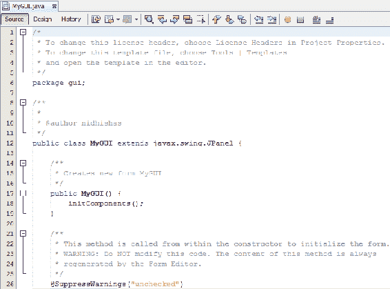
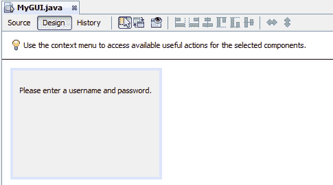
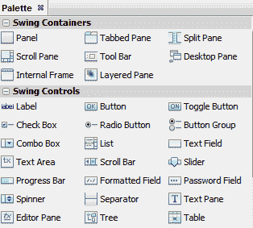
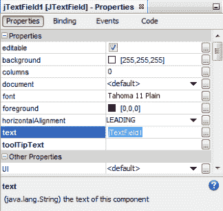
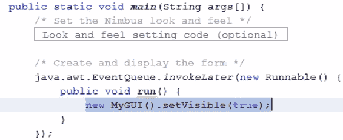
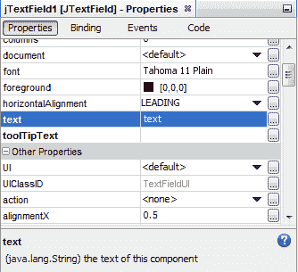

# 基本图形用户界面开发

有时，我们编写的程序都是关于原始功能的。然而，我们经常编写我们或其他用户通常使用的程序，这些用户希望与我们的交互过程得到简化。在本章中，我们将看到 NetBeans 中的**图形用户界面**（**GUI**的基本功能。定义真正令人惊叹的软件程序的两个因素是它们的 GUI 和用户体验。您将学习如何使用`JFrame`类创建应用程序窗口，方法是设置其大小，向其添加标签，并整体关闭应用程序。然后是 GUI 编辑器的主题，即调色板；在这里，我们将看到调色板的工作实例以及其中可用的组件。最后，您将学习如何通过添加按钮和功能来触发事件。

本章将介绍以下主题：

*   Swing GUI
*   可视化 GUI 编辑器工具–调色板
*   事件处理

# Swing GUI

NetBeans 是一个功能强大的程序，提供了许多功能，我们通过 GUI 以及 NetBeans 提供的菜单和按钮来访问这些功能。理论上，我们可以选择将 NetBeans 作为一个命令行程序来操作，但为了像那样使用 NetBeans，我们必须为我们想要执行的每个操作记忆或查找大量特定命令库。一个功能强大且编写良好的应用程序有一个流线型的界面，它将引导我们实现重要的功能，并使我们能够轻松访问它。JDK 包含一个 Java 扩展库，`swing`库，这使得我们可以很容易地将自己的代码包装到 GUI 中，就像 NetBeans 那样。

# JFrame 类

首先，我们将编写一个程序，打开一个新的 GUI 窗口。步骤如下：

1.  `swing`Java GUI 的核心是`JFrame`类。在我们的例子中，这个类将是我们的操作系统将处理的实际窗口对象，我们可以在屏幕上移动。我们可以像创建任何其他对象一样创建一个新的`JFrame`类。我们甚至可以将一些参数传递给这个`JFrame`类的创建。如果我们只给它一个字符串参数，我们将告诉`JFrame`类以其名称表示什么：

```
        package GUI; 
        import javax.swing.*; 

        public class GUI { 
            public static void main(String[] args) { 
                JFrame frame = new JFrame("Hello World GUI"); 
            } 

        } 
```

2.  一旦我们声明了一个`JFrame`类，它就会像其他任何对象一样存在于 Java 内存中。在我们明确告诉用户之前，它不会呈现给用户。这将只是对`setVisible`函数的函数调用，我们将把`true`值赋给这个函数，非常简单，对吧：

```
        frame.setVisible(true); 
```

3.  在使 JFrame 窗口可见之前，我们还需要做一件事，那就是调用`pack`方法：

```
        frame.pack(); 
```

当我们创建更复杂的框架时，它们可能包含很多信息，在 GUI 中，这些信息的大部分占据了可见空间。`pack`方法基本上预先建立了帧中对象之间的物理关系，并确保帧在用户实际可见时不会出现异常行为。因此，到目前为止，我们已经编写了一个非常简单的程序——只有三行代码，我们不需要真正的思考：

```
        package gui; 
        import javax.swing.*; 

        public class GUI { 

            public static void main(String[] args) { 
               JFrame frame = new JFrame("Hello World GUI"); 
               frame.pack(); 
               frame.setVisible(true); 
            } 

        } 
```

当我们运行这个程序时，可能看起来什么都没有发生，但发生了一些事情。屏幕左上角出现了一个新窗口。如果单击此窗口的右侧，理论上，我们可以将其拖动或调整窗口大小：


这是一个成熟的窗口，我们的操作系统现在可以处理，允许我们四处走动；它甚至支持动态调整大小。您将看到我们的标题也被附加到窗口中。这是超基本的。

# 设置窗口的大小

现在让我们看看我们可以用现有的`JFrame`类做些什么。当我们的 JFrame 窗口出现时，它非常小，很难看到。如此大小的程序窗口永远不会对任何人有用，所以让我们看看`frame`在设置窗口大小方面给了我们什么样的能力。通常，我们将使用`setPreferredSize`方法将大小应用于`JFrame`类。还有一种`setSize`方法，但这种方法并不能始终准确地给出我们所期望的结果。这是因为现在我们的`JFrame`类被设置为可调整大小，我们不适合显式地为其指定大小；相反，我们应该指示它，如果没有来自用户的其他输入，这意味着调整 JFrame 窗口的大小，那么窗口应该有一定的大小

我们可以使用`Dimension`类存储、操作和创建大小信息。为了构造一个新的维度，我们可以简单地给它一个宽度和高度。因此，让我们将`JFrame`类的首选大小设置为`400 x 400`：

```
frame.setPreferredSize(new Dimension(400, 400)); 
```

`Dimension`类位于另一个库中，因此我们必须导入`java.awt.*;`包，然后我们应该能够构建和编译我们的项目，并再次打开我们的新 GUI：


现在我们有了一个漂亮的方形 GUI；但是，它仍然非常无用，因为这个 GUI 中没有任何内容。

# 添加标签

现在让我们来看看如何从编程角度向 GUI 添加元素。很可能我们可以放入`JFrame`中的最简单元素是`JLabel`。标签负责包含文本，对它们进行实例化非常简单。我们只是告诉他们应该包含什么文本。当然，在更复杂的程序和 GUI 中，此文本可能会变得动态，并且可能会发生变化，但现在，让我们只显示一些文本：

```
JLabel label = new JLabel("Hi. I am a GUI."); 
```

仅仅声明我们有一个`JLabel`类是不够的。我们尚未以任何方式将此标签对象与现有框架关联。我们的框架，正如您可能从它公开的大量方法和成员中可以看出的，有很多组件，我们需要知道我们需要将新的`JLabel`类放在这些组件中的哪一个：

```
package gui; 
import javax.swing.*; 
import java.awt.*; 
public class GUI { 

    public static void main(String[] args) { 
        JFrame frame = new JFrame("Hello World GUI"); 
        frame.setPreferredSize(new Dimension(400, 400)); 
        JLabel label = new JLabel("Hi. I am a GUI."); 

        frame.pack(); 
        frame.setVisible(true); 
    } 

} 
```

我们`JFrame`类中的一个组件是`contentPane`；这是我们在窗口内可以看到的区域，在程序 GUI 中通常会看到这些东西。这似乎是我们添加新组件的合理位置，在本例中为`label`。再次，让我们构建程序，杀死旧实例，然后运行新程序：


好了！现在我们的 GUI 中有了文本；我们已经成功地将一个元素添加到 JFrame 窗口的内容中。

# 关闭我们的应用程序

一件有点烦人的事情是，我们的程序即使在关闭相关 GUI 后仍在继续运行。这有点傻。当我按下 NetBeans GUI 上的关闭按钮时，NetBeans 会自动关闭，并停止在我的系统上作为进程运行。我们可以指示框架使用其`setDefaultCloseOperation`方法终止相关进程。此方法返回类型为`void`，取整数作为值。这个整数是一个枚举数，我们有很多选择。所有这些选项都是由`JFrame`类静态声明的，我们可能正在寻找的是`EXIT_ON_CLOSE`，当我们关闭窗口时，它将退出我们的应用程序。构建并运行程序，终止 GUI，然后我们的进程就开始了，不再在后台安静地运行了：

```
frame.setDefaultCloseOperation(JFrame.EXIT_ON_CLOSE); 
```

这是我们对 Java 中 GUI 的基本介绍。创建 GUI 很复杂，但也很令人兴奋，因为它直观、即时；而且，它真的很强大。

正如下面的代码块所示，我们的程序现在运行正常，但如果我们扩展它，最终可能会遇到一些非常奇怪和令人困惑的问题。在创建新 GUI 时，我们现在所做的与推荐的实践背道而驰。这些推荐的实践是为了防止我们的程序变为多线程时可能出现的一些非常低级的问题。

当我们说我们的程序是多线程的时候，这意味着什么？好的，当我们创建 GUI 时，当我们使它形成时，我们的程序从执行单个任务，也就是简单地从头到尾执行`main`方法，到执行多个任务。这是因为我们现在正在执行以下代码：

```
package gui; 
import javax.swing.*; 
import java.awt.*; 
public class GUI { 

    public static void main(String[] args) { 
        JFrame frame = new JFrame("Hello World GUI"); 
        frame.setDefaultCloseOperation(JFrame.EXIT_ON_CLOSE); 
        frame.setPreferredSize(new Dimension(400, 400)); 
        JLabel label = new JLabel("Hi. I am a GUI."); 
        frame.getContentPane().add(label); 
        frame.pack(); 
        frame.setVisible(true); 
    } 

} 
```

然而，除此之外，代码还管理我们创建的新窗口以及该窗口执行的任何功能。为了避免多线程代码的复杂性，建议我们创建新的 Swing GUI，方法是允许一个 Swing 实用程序异步为我们构建这个 GUI。

为了实现这一点，我们实际上需要从`main`方法中提取我们编写的所有代码，并将其放在一个可以从`main`方法中引用的地方。这将是一个新函数，如下代码行所示：

```
private static void MakeGUI() 
```

我们可以将所有这些代码粘贴回新函数：

```
private static void MakeGUI() 
{ 
    JFrame frame = new JFrame("Hello World GUI"); 
    frame.setDefaultCloseOperation(JFrame.EXIT_ON_CLOSE); 
    frame.setPreferredSize(new Dimension(400, 400)); 
    JLabel label = new JLabel("Hi. I am a GUI."); 
    frame.getContentPane().add(label); 
    frame.pack(); 
    frame.setVisible(true); 
} 
```

# 猪栏课

现在，让我们来看看 Swing 是如何建议我们的 GUI 生成的。正如我所说，`swing`包为我们提供了一些功能，可以为我们执行大量的工作和思考。`SwingUtilities`类有一个静态`invokeLater`方法，当没有其他线程真正需要处理时，或者当所有其他想法都完成一点时，它将创建我们的 GUI：

```
SwingUtilities.invokeLater(null); 
```

这个`invokeLater`方法要求我们向它传递一个`Runnable`对象，所以我们必须为自己创建一个`Runnable`对象：

```
Runnable GUITask = new Runnable() 
```

`Runnable`对象是那些可以转换为自身线程的对象。他们有一个我们将要重写的方法，称为`run`，而`SwingUtilities.invokeLater`方法将在适当的时候调用`Runnable`的`run`方法。当这种情况发生时，我们只需要调用`MakeGUI`方法并开始执行我们刚刚测试过的代码，即创建 GUI 的代码。我们将添加`Override`符号以成为优秀的 Java 程序员，并将新的`Runnable`对象传递给`SwingUtilities`的`invokeLater`方法：

```
public static void main(String[] args) { 
    Runnable GUITask = new Runnable(){ 
        @Override 
        public void run(){ 
            MakeGUI(); 
        } 
    }; 
    SwingUtilities.invokeLater(GUITask); 
} 
```

运行前面的程序，我们就可以开始了！功能完全相同，对于这么小的程序，我们所做的可以说是过火了；然而，对于我们来说，看看在一个更大的软件项目中应该看到什么是非常好的，在这个项目中，诸如多线程之类的事情可能会成为一个问题。我们过得有点快，所以让我们停下来，再次看看这一部分：

```
Runnable GUITask = new Runnable(){ 
    @Override 
    public void run(){ 
        MakeGUI(); 
    } 
}; 
```

我们在这段代码中所做的是创建一个匿名类。虽然我们已经创建了一个新的 Tyrt0t 对象，但是我们确实创建了一个新的子类，它使用了它自己的特殊的重写版本的 ToeT2Ay 方法，我们把它放在了代码的中间。这是一种强大的方法，它允许我们减少所需的代码量。当然，如果我们过度使用它，我们的代码会很快变得非常复杂，让我们或其他程序员阅读和理解。

# 可视化 GUI 编辑器工具–调色板

Java 编程语言、GUI 扩展库（如`Swing`）和开发环境（如 NetBeans）是一个强大的组合。现在我们来看看如何使用一个 GUI 编辑器创建 GUI，就像在 NetBeans 中找到的那样。

接下来，我强烈建议您在本节中使用 NetBeans IDE。

因此，首先，让我们像平常一样创建一个 Java 应用程序，给它起个名字，我们就可以开始了。首先，我们将简单地删除 NetBeans 提供的默认 Java 文件，并要求 NetBeans 创建一个新文件。我们将要求它为我们创建一个 JFrame 表单：


我们将为这个 JFrame 表单命名，并将其保存在同一个包中。当 NetBeans 创建这个文件时，即使它是一个`.java`文件，弹出的窗口对我们来说也会非常不同。事实上，我们的文件仍然只是 Java 代码。单击 Source 选项卡以查看代码，如以下屏幕截图所示：



# 调色板的工作原理

我们可以在“源代码”选项卡中看到组成文件的 Java 代码；如果我们把它展开，这个文件中实际上有很多代码。它都是由名为 Palette 的 NetBeans GUI 编辑器为我们生成的，如下面的屏幕截图所示。我们对此 Java 文件所做的更改将影响我们的`Design`文件，反之亦然。通过这个`Design`文件，我们可以访问拖放编辑器，我们还可以编辑单个元素的属性，而无需跳入 Java 代码，即`Source`文件。最终，在我们创建的几乎任何应用程序中，我们都必须插入 Java 代码，为我们放入编辑器的片段提供后端编程功能；现在，让我们快速了解一下编辑器是如何工作的。

我想设置密码保护对话框的框架。这不会太复杂，所以我们将使 JFrame 表单比现在小一点。然后，看看一些可用的回转控制装置；有很多。事实上，借助 NetBeans，我们还可以使用其他一些 GUI 扩展系统：


以下是设置密码保护对话框框架的步骤：

1.  Let's just stick with Swing Controls and stay pretty basic. Label is about as basic as you can get. Our password dialog is going to need some text:

    

2.  Now, a password dialog is also going to need some user interaction. We're going to need not only a password, but also a username for the user. To get the username, we will have to decide between a couple of options under Swing Controls:

    

TextArea 是一个不错的选择。它允许用户将文本放入框中，而不像标签，只有开发人员才能编辑。用户可以单击该框并在其中键入一些文本。不幸的是，这个框相当大，如果我们点击它并尝试使它变小，我们会得到滚动条，允许用户在其大小周围反弹。

当滚动条出现时，我们可以通过更改可从编辑器访问的任意数量的属性来修改此框的默认大小。然而，一个简单得多的解决方案是只使用文本字段，它并没有我们的框的所有多行功能。此外，将标签放在文本字段旁边，您会注意到图形编辑器有助于排列内容。如果我们正确双击字段（如 Label），我们可以在此处编辑它们的文本：


现代 GUI 最酷的一点是有一些真正专门化的控件。其中之一是密码字段。在许多方面，它的作用就像我们的文本字段控件，只是它将用点来替换用户在视觉上输入的任何文本，这样从后面看的人将无法了解他们的密码。如果双击可编辑元素失败，它会将您带回源。

我们将编辑两个组件–文本和密码字段–我们的用户可以在其中放置文本，以使它们最初不会以默认值显示给我们的用户。我们可以双击密码字段，也可以编辑控件的属性：



在这里，我们的文本字段控件的文本值可以修改为零开始，我们可以用我们的密码做同样的事情。您会注意到密码的文本值实际上包含文本，但它只是显示为一串点。但是，程序员可以访问此值来验证用户的密码。“属性”选项卡中还有很多其他选项：我们可以更改字体、前景色和背景色、给它加边框等等。

当我们运行程序时，您将看到它确实存在，用户可以将值输入这些字段：


当然，我们还没有编写任何后端代码来使用它们做任何有用的事情，但是 GUI 本身已经启动并工作了。这里没有什么神奇的事情发生。如果我们跳转到这段代码的源代码，并下拉到它的`main`方法，我们将看到 GUI 实际创建并向用户显示的代码（参见以下屏幕截图）：



需要实现的重要一点是，当我们访问源代码中的元素时，我们也可以通过原始 Java 使用所有这些方法。这就是我在本节中真正想向您展示的所有内容，只是原始功能，以及我们使用 NetBeans 图形编辑器为系统设置 GUI 窗口的速度。

# 事件处理

使用 Java 最棒的事情之一是它的 GUI 扩展库有多强大，以及我们能够以多快的速度启动和运行一个程序，它不仅有功能代码，而且有一个光滑、专业的用户界面来支持它，可以帮助任何人与我们的程序交互。这就是我们现在要做的：将用于基本用户名和密码验证的设计界面与我们将要编写的一些后端代码连接起来，这些代码将实际检查两个文本字段，以查看它们是否是我们要查找的。

首先，我们有一个基本的 GUI，其中有一个文本字段，用户可以在其中输入用户名和密码，该字段将显示为星号：


# 添加按钮

到目前为止，这个 GUI 的源代码是完全自动生成的。我们还没有碰过它；它只是反映了我们在这里做出的设计决策。在我们开始编写后端代码来进行用户名和密码验证之前，我们的用户需要一种方法来告诉我们，他们已经输入了用户名和密码，并且希望对其进行验证。这似乎是一个适合全能按钮的工作。因此，让我们从 Swing 控件菜单向 GUI 添加一个按钮。我们将在属性选项中将其文本更改为`Submit`，用户需要单击此按钮提交其信息。现在，当点击按钮时，我们希望它执行一些编程逻辑。我们想检查这个部分的用户名和密码字段，因为我们只是简单而容易地学习和做事情；我们将根据一些硬编码文本检查它们。

问题是我们如何从 GUI 获得功能性 Java 代码？一般来说，我们将通过**事件驱动**编程模式来实现这一点，在这种模式下，用户与 GUI 的交互决定了执行什么 Java 代码以及发生什么后端逻辑。考虑这一点的另一种方式是，我们可以设置 Java 代码片段或方法，以侦听特定 GUI 相关事件的发生，然后在它们发生时执行。您会注意到，我们的 GUI 组件或控件（如按钮）的属性下有一个名为“事件”的字段。这些都是与我们在这里的控制有关的可能发生的事情。理论上，我们可以将这些事件中的每一个绑定到 Java 源代码中的一个方法，当某个特定事件发生时，无论是由于用户交互还是我们编写的其他代码，都会调用相关的 Java 方法。

# 为我们的按钮添加功能

为了让用户点击我们的按钮字段并执行一些编码操作，我们将为`actionPerformed`事件分配一个事件处理程序。如果我们点击这个字段，我们已经得到了一个选项。我们的 GUI 设计师建议我们添加一个处理程序，即`jButton1ActionPerformed`。这是一个可怕的名字，它将出现在我们的代码中；`jBbutton1`很难形容。但是，之所以选择它，是因为它是在实际 Java 代码中创建时分配给`jButton`的变量名：

```
// Variables declaration - do not modify 
private javax.swing.JButton jButton1; 
private javax.swing.JLabel jLabel1; 
private javax.swing.JLabel jLabel2; 
private javax.swing.JLabel jLabel3; 
private javax.swing.JPasswordField jPasswordField1; 
private javax.swing.JTextField jTextField1; 
// End of variables declaration 
```

如果我们向下滚动源代码，我们将在那里看到实际的声明。我相信我们可以更改这些设置，但 NetBeans 会让我们知道，我们可能不应该直接修改这些设置。这是因为设计师也将对其进行修改。因此，我们只需将按钮的名称从非描述性`jButton1`更改为`SubmitButton`：

```
// Variables declaration - do not modify 
private javax.swing.JButton SubmitButton; 
```

当我们进行此更改时，我们将看到 NetBeans 将更新我们的源代码，并且有一个`SubmitButton`对象正在跳转。这是一个以大写字母开头的变量，因此我们将在 Events 部分再做一次更改，将其更改为`submitButton`。

现在建议 NetBeans 执行的操作是`submitButtonActionPerformed`。当我们深入到源代码时，我们会看到一个事件会被创建并链接到一个生成的大量代码块中的`jButton`，NetBeans 创建该代码块是为了模仿我们的 GUI，我们通过他们的工具创建了 GUI。如果我们在源代码中搜索我们的`submitButtonActionPerformed`方法，我们实际上会看到它添加到源代码中生成的代码中：

```
public void actionPerformed(java.awt.event.ActionEvent evt) { 
    submitButtonActionPerformed(evt); 
} 
```

我们的`submitButtonActionPerformed`方法被添加为`submitButton`中放置的`ActionListener`的最终调用：

```
submitButton.addActionListener(new java.awt.event.ActionListener() { 
    public void actionPerformed(java.awt.event.ActionEvent evt) { 
        submitButtonActionPerformed(evt); 
    } 
}); 
```

`ActionListener`当然有一个作业，只有一个作业，那就是看我们的按钮是否被点击了。如果单击，它将调用我们的`submitButtonActionPerformed`方法。因此，在这个`submitButtonActionPerformed`方法中，我们可以放入一些好的旧函数 Java 代码。为此，我们需要做两件事：

*   检查密码字段的值
*   检查用户名字段的值

只有`ActionEvent`（如前面的代码块所示）被传递到我们的`submitButtonActionPerformed`方法中。虽然有很多有趣和有用的方法附加到这个事件中，导致我们的方法被调用的操作的上下文，但它不会给我们真正需要的东西。我们真正需要的是密码字段和文本字段，幸运的是它们是我们当前类的私有成员。验证文本字段值的步骤如下：

1.  以用户名开始，即`jTextField1`：

```
        private void submitButtonActionPerformed
        (java.awt.event.ActionEvent evt) { 
            jTextField1 
        } 
```

我们可能应该在有机会的时候重新命名它，但我们现在就使用它，因为我们只有一个文本字段：



如果您还记得，在编辑器的“属性”选项卡下，此文本字段具有文本属性。我们去掉了其中的文本，因为我们不希望用户名文本字段以任何文本开头。我们希望它是空白的，这样用户就知道他们必须把自己的信息放在那里。

2.  现在，如果这是在设计师中暴露给我们的属性，那么应该有一个由对象本身暴露的相关属性，并且有，即`getText()`：

```
        private void submitButtonActionPerformed
        (java.awt.event.ActionEvent evt) { 
            jTextField1.getText() 
        } 
```

3.  当然，当我们调用`getText`时，我们会返回当前存储在文本字段中的文本，并将我们的超级机密用户名设置为非常“有创意”的单词`username`。

这是一个条件语句，我们要做另一个条件语句。我们想询问我们的程序，文本字段和密码字段——在本例中，它们将公开一个类似的方法`getPassword`——是否都等于硬编码字符串。我们的秘密密码将是`java`。请注意，`getPassword`实际上返回一个字符数组，而不是字符串，因此为了简单起见，让我们将密码值分配给一个字符串，然后我们可以将其用作字符串。将`if`放在条件语句前面的括号内，我们就可以开始了：

```
            private void submitButtonActionPerformed
            (java.awt.event.ActionEvent evt) { 
                String password = new
                String(jPasswordField1.getPassword()); 
                if (jTextField1.getText().equals("username")
                && password.equals("java")) 
                { 

                } 
            } 
```

现在，我们需要给我们的用户一些指示，看看他们是否成功地提供了正确的用户名和密码。好的，如果用户成功输入了正确的用户名和密码，该怎么办？嗯，我想如果我们在这里显示一个弹出对话框会很酷。

4.  `JOptionPane`为我们提供了`showMessageDialog`方法，这是一种非常酷的方式，可以向用户传递真正重要和即时的信息。它将显示一个弹出框，它非常轻巧，易于使用。您可能必须修复此项上的导入：

```
        { 
            JOptionPane.showMessageDialog(rootPane, password); 
        } 
```

唯一需要创建自身的重量级信息`MessageDialog`是一个 GUI 组件，可以将自身附加到该组件上，作为其父组件。我们可以通过`ActionEvent`获得`button evt`，但这没有多大意义，因为对话框不仅仅绑定到按钮上；它与这个 GUI 的全部内容有关，即验证用户名和密码。因此，如果我们可以将消息对话框与 JFrame 表单本身（GUI 的顶级元素）联系起来，那就太好了，事实上我们可以：

```
            public class MyGUI extends javax.swing.JFrame { 

                /** 
                 * Creates new form MyGUI 
                */ 
                public MyGUI() { 
                    initComponents(); 
                } 
```

5.  如果我们向上滚动一点到源代码部分，检查我们编写代码的确切位置，我们将看到我们在一个名为`MyGUI`的类中，该类扩展了`JFrame`类。整个类与我们正在使用的`JFrame`类相关联。因此，要将`JFrame`作为变量传递给`showMessageDialog`方法，我们只需使用`this`关键字。现在只需键入一条消息，在验证密码和用户名时显示用户：

```
        private void submitButtonActionPerformed
        (java.awt.event.ActionEvent evt) { 
            String password = new String(jPasswordField1.getPassword()); 
            if (jTextField1.getText().equals("username") 
            && password.equals("java")) 
            { 
                 JOptionPane.showMessageDialog(this, "Login Good!"); 
            } 
        } 
```

让我们运行我们的程序，看看我们构建了什么。此时会出现我们之前看到的和预期的对话框，然后执行以下步骤：

1.输入我们的有效用户名，即`username`。

2.输入我们的有效密码，即`java`。

3.然后，点击提交按钮。


我们得到一个对话框，看起来像下面的屏幕截图。我们可以在 JFrame 实例中自由移动此框：


为了测试一下，让我们放点东西进去。无论我们点击提交多少次，我们都一无所获。此外，一个好的用户名和密码也不会让我们得到什么，相当酷！我们只触及了 Java GUI 可能实现的功能的表面，当然还有 Java 本身。

为我们的程序创建 JavaGUI 很容易，而且在许多情况下，毫不费力。有时候，GUI 在某种程度上强迫我们实现的事件处理模型甚至可以使创建严重依赖于用户交互的 Java 程序比其他方式更容易。

另一个重要的事情是，尽管 GUI 设计师非常出色，但我们也可以通过坐下来在源代码部分编写 Java 代码来创建完全相同的项目。

我并不是说我们不应该使用 GUI 设计器——特别是因为 GUI 设计器为我们生成了大量代码和大量编写良好的代码，这可以节省我们大量的时间——但这里绝对没有什么神奇的事情发生。这是所有使用`Swing`扩展库的 Java 代码。

# 总结

在本章中，我们看到了 NetBeans 中 GUI 的基本功能。您学习了如何通过设置`JFrame`类的大小、向其添加标签以及关闭应用程序来创建应用程序窗口。然后，我们进入 GUI 编辑器的主题，调色板。我们看到了一个工作调色板和其中可用的组件。最后，您学习了如何通过添加按钮和功能来触发事件。

在下一章中，您将学习 XML。