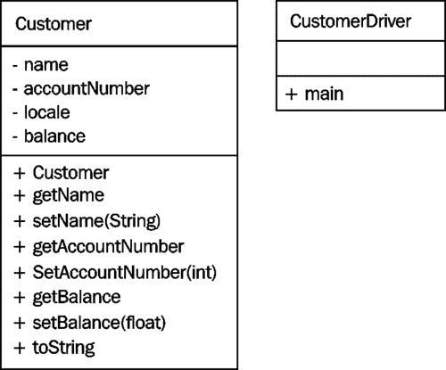
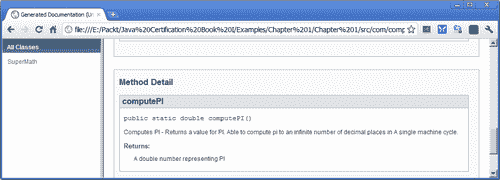

# 第一章 Java 入门

本章使您熟悉 Java 的基本元素以及如何编写简单的 Java 程序。通过对应用程序开发过程的简单解释，可以全面了解 Java 开发环境。提供了一个 Java 控制台程序，作为本讨论的起点和参考点。

在本章中，我们将研究：

*   什么是 Java
*   面向对象的开发过程
*   Java 应用程序的类型
*   创建一个简单的程序
*   类和接口的定义
*   Java 应用程序开发
*   Java 环境
*   Java 文档技术
*   Java 中注释的使用
*   核心 Java 包

# 将 Java 理解为一种技术

Sun Microsystems 在 20 世纪 90 年代中期开发了该语言的原始规范。Patrick Nouton、Mike Sheridan 和 James Gosling 是 Java 的原始发明者，Java 语言最初被称为**Oak**。

Java 是一种成熟的面向对象编程语言。它是独立于平台的，通常被解释而不是像 C/C++那样编译。它以 C/C++为语法和结构模型，执行各种编译时和运行时检查操作。Java 执行自动内存管理，这有助于大大减少在其他动态分配内存的语言和库中发现的内存泄漏问题。

Java 支持许多在构思之初在其他语言中无法直接找到的特性。这些功能包括线程、网络、安全和**图形****用户****界面**（**GUI**开发等。可以使用其他语言来支持这些功能，但这些功能并没有集成到 Java 语言中。

Java 使用独立的字节码，该字节码与体系结构无关。也就是说，它被设计为独立于机器。字节码由**Java****虚拟****机器**（**JVM**）解释和执行。它的所有原始数据类型都被完全指定，我们将在[第 3 章](03.html "Chapter 3. Decision Constructs")*决策构造*中看到。以下时间线图描述了**Java****开发****工具包****JDK**和其他重要时刻的各种版本：


## 面向对象的软件开发

让我们离题一段时间，考虑一下为什么我们使用的是 Ty1 T1 java。Java 最重要的方面之一是它是一种**面向对象的**（**OO**语言。OO 技术是开发应用程序的流行范例。这种方法围绕一系列真实世界对象（如员工或船舶）对应用程序进行建模。为了解决问题，考虑组成问题域的真实世界对象是很有用的。

OO 方法基于三种不同的活动：

*   **面向对象****的****分析**（**OOA**）：这涉及到确定系统的功能，即应用程序应该做什么
*   **面向对象****的****设计****OOD**：这涉及到架构如何支持应用程序的功能
*   **面向对象****的****编程**（**OOP**：这与应用程序的实际实现有关

分析和设计步骤的产品通常被称为分析和设计工件。虽然可能会产生几种不同的类型，但 OOP 步骤最感兴趣的一种被称为**类****图**。下图显示了描述两个类的部分类 UML 图：`Customer`和`CustomerDriver`。在*一个简单的 Java 应用程序*部分，我们将检查这些类的代码。**统一****建模****语言****UML**是一种广泛使用的面向对象技术，用于设计和记录应用程序。类图是该技术的最终产品之一，程序员使用它来创建应用程序：



每个框代表一个类，分为三个部分：

*   框顶部的第一部分是类的名称
*   第二部分列出了组成类的变量
*   最后一节列出了类方法

变量和方法名称前面的符号指定这些类成员的可见性。以下是使用的类图符号：

*   `-`：私人
*   `+`：公众
*   `#`：受保护（与继承一起使用）

通常情况下，类图由许多类组成，并通过显示类之间关系的注释线相互连接。

类图旨在清楚地显示组成系统的对象及其交互方式。一旦类图完成，就可以使用 OOP 语言（如 Java）实现它。

### 注

面向对象的方法通常用于中规模到大规模的项目，在这些项目中，许多开发人员必须进行通信并共同工作，以创建应用程序。对于只涉及少数程序员的较小项目，例如大多数编程类中处理的项目，通常不使用面向对象的方法。

## 面向对象原则

虽然在编程语言成为 OOP 编程语言的真正原因上存在一些分歧，但 OOP 语言必须支持三个基本原则：

*   数据封装
*   遗产
*   多态性

**数据****封装**涉及向类的用户隐藏无关信息并公开相关信息。数据封装的主要目的是降低软件开发的复杂性。通过隐藏执行操作所需的细节，该操作的使用更加简单。本章后面的*访问修饰符*部分将解释如何用 Java 实现数据封装。

数据封装还用于保护对象的内部状态。通过隐藏表示对象状态的变量，可以通过方法控制对对象的修改。状态的任何更改都由方法中的代码验证。此外，通过隐藏变量，消除了类之间的信息共享。这减少了应用中可能的耦合量。

继承描述两个类之间的关系，使得一个类重新使用另一个类的功能。这使软件的重用成为可能，从而使开发人员的工作效率更高。遗传在[第 7 章](07.html "Chapter 7. Inheritance and Polymorphism")、*遗传与多态性*中有详细介绍。

第三个原则是多态性，它主要关注的是使应用程序更易于维护和扩展多态性行为是指一个或相同方法的行为依赖于它所针对的对象执行。例如，`person`对象和`square`对象都可以有`draw`方法。它绘制的内容取决于对其执行方法的对象。多态性在[第 7 章](07.html "Chapter 7. Inheritance and Polymorphism")、*遗传和多态性*中讨论。

下表总结了这些原则：

<colgroup><col style="text-align: left"> <col style="text-align: left"> <col style="text-align: left"> <col style="text-align: left"></colgroup> 
| 

道德原则

 | 

是什么

 | 

我们为什么使用它

 | 

怎么做

 |
| --- | --- | --- | --- |
| 数据封装 | 对该类的用户隐藏信息的技术 | 降低软件开发的复杂程度 | 使用访问修饰符，如`public`、`private`和`protected` |
| 继承 | 允许派生类或子类使用基类或父类的一部分的技术 | 促进软件的重复使用 | 使用`extends`关键字 |
| 多态性 | 支持方法的不同行为的技术，这些行为依赖于方法所针对的对象 | 使应用程序更易于维护 | Java 语言固有的 |

`implements`关键字用于支持多态性行为，如[第 7 章](07.html "Chapter 7. Inheritance and Polymorphism")、*遗传和多态性*所述。

## 检查 Java 应用程序的类型

Java 应用程序有几种类型。这些类型让 Java 在许多不同领域蓬勃发展，并使 Java 成为一种非常流行的编程语言。Java 用于开发以下内容：

*   控制台和窗口应用程序
*   Servlet、JSP、JSF 和其他 JEE 标准支持的基于服务器的 web 应用程序
*   在浏览器中执行的小程序
*   嵌入式应用程序
*   使用 JavaBeans 的组件化构建块

虽然对 Java 应用程序类型的基本理解有助于将 Java 置于上下文中，但它也有助于识别这些应用程序的基本代码。您可能不完全了解这些应用程序类型的所有细节，但是查看简单的代码示例是非常有用的。

阅读代码有助于理解一种语言和一个特定的程序。在本书中，我们将使用大量的示例来说明和解释 Java 的各个方面。Java 应用程序的基本类型如下所示，它提供了该应用程序类型的核心代码片段。

一个简单的控制台应用程序由一个带有`main`方法的类组成，如下代码片段所示：

```java
public class Application {
   public static void main(String[] args) {
      // Body of method
   }
}
```

我们将更深入地研究这种类型的应用程序。

**小程序**通常嵌入在 HTML 页面中，并提供实现客户端代码执行的方法。它没有`main`方法，但使用浏览器使用的一系列回调方法来管理应用程序。以下代码介绍了小程序的一般外观：

```java
import java.applet.*;
import java.awt.Graphics;

public class SimpleApplet extends Applet {

   @Override
   public void init() {
      // Initialization code
   }

   @Override
   public void paint( Graphics g ) {
      // Display graphics
   }
}
```

`@Override`注释用于确保下面的方法实际上被重写。本章的*注释*部分将对此进行更详细的讨论。

**servlet**是一个服务器端应用程序，用于呈现发送给客户端的 HTML 页面。`doGet`或`doPut`方法响应客户端请求。下面示例中的`out`变量表示 HTML 页面。使用`println`方法编写 HTML 代码，如下代码片段所示：

```java
class Application extends HttpServlet {
   public void doGet(HttpServletRequest req,
            HttpServletResponse res)
            throws ServletException, IOException {
      res.setContentType("text/html");

      // then get the writer and write the response data
      PrintWriter out = res.getWriter();
      out.println(
         "<HEAD><TITLE> Simple Servlet</TITLE></HEAD><BODY>");
      out.println("<h1> Hello World! </h1>");
      out.println(
         "<P>This is output is from a Simple Servlet.");
      out.println("</BODY>");
      out.close();
   }
}
```

一个**JavaServer****页面****JSP**实际上是一个伪装的 Servlet。它提供了一种更方便的网页开发方法。下面的示例使用 JavaBean 在 web 页面上显示“Hello World”。以下示例详细介绍了 JavaBean：

```java
<html>
<head>
   <title>A Simple JSP Page</title>
</head>
<body>
Hello World!<br/>

<%
   // This is a scriptlet that can contain Java code
%>
<hr>
<jsp:useBean id="namebean" class="packt.NameBean" scope="session" >
<jsp:setProperty name="namebean" property="name" value=" Hello world"" />
</jsp:useBean>
<h1> <jsp:getProperty name="namebean" property="name" /></h1>
</body>
</html>
```

JavaBean 是共享应用程序功能的构建块。它们通常被设计用于多个应用程序，并遵循标准命名约定。下面是一个简单的 JavaBean，设计用于保存名称（它在上一个 JSP 页面中使用）：

```java
package packt;
public class NameBean {

  private String name= "Default Name"";

  public String getName() {
     return this.name;
  }
  public void setName(String name) {
     this.name = name;
  }
}
```

**企业****Java****bean****EJB**是设计用于 web 服务器的客户机/服务器配置的组件。这是一个相当专业的主题，与助理认证水平无关。

还有其他几种类型的 Java 技术，例如 JSF 和 Facelets，它们是 JEE 的一部分。这些是对用于开发 web 页面的旧 Servlet 和 JSP 技术的改进。

在本书中，我们将只使用简单的 Java 控制台应用程序。这种类型的应用程序足以解释 Java 的本质。

# 探索 Java 控制台程序的结构

让我们从一个简单的 Java 程序开始，然后用它来探索 Java 的许多基本方面。首先，Java 应用程序由位于文件系统中某处的一个或多个文件组成。文件的名称及其位置都很重要，我们很快就会看到。

### 提示

您可以下载您在[账户购买的所有 Packt 书籍的示例代码文件 http://www.PacktPub.com](http://www.PacktPub.com) 。如果您在其他地方购买了本书，您可以访问[http://www.PacktPub.com/support](http://www.PacktPub.com/support) 并注册，将文件直接通过电子邮件发送给您。

## 一个简单的 Java 应用程序

我们的简单程序定义了一个`Customer`类，然后在`CustomerDriver`类中使用它，如下所示：

```java
package com.company.customer;

import java.math.BigDecimal;
import java.util.Locale;

public class Customer {
  private String name;
  private int accountNumber;
  private Locale locale;
  private BigDecimal balance;

  public Customer() {
    this.name = "Default Customer";
    this.accountNumber = 12345;
    this.locale = Locale.ITALY;
    this.balance = new BigDecimal("0");
  }

  public String getName() {
    return name;
  }
  public void setName(String name) throws Exception {
    if(name == null) {
         throw new IllegalArgumentException(
            "Names must not be null");
    } else {
      this.name = name;
    }
  }
  public int getAccountNumber() {
    return accountNumber;
  }

  public void setAccountNumber(int accountNumber) {
    this.accountNumber = accountNumber;
  }

  public BigDecimal getBalance() {
    return balance;
  }

  public void setBalance(float balance) {
    this.balance = new BigDecimal(balance);
  }

   public String toString() {
      java.text.NumberFormat format =
         java.text.NumberFormat.getCurrencyInstance(locale);
      StringBuilder value = new StringBuilder();
      value.append(String.format("Name: %s%n", this.name));
      value.append(String.format("Account Number: %d%n", 
            this.accountNumber));
      value.append(String.format("Balance: %s%n",
            format.format(this.balance)));
      return value.toString();
    }  
}

package com.company.customer;

public class CustomerDriver {

  public static void main(String[] args) {
      // Define a reference and creates a new Customer object
    Customer customer;      
    customer = new Customer();
    customer.setBalance(12506.45f);
    System.out.println(customer.toString());
  }
```

有关如何编译和执行此应用程序的详细信息，请参见*在没有 IDE 的情况下开发 Java 应用程序*一节。执行此应用程序时，您将获得以下输出：

```java
Name: Default Customer
Account number: 12345
Balance: € 12.506,45

```

以下各节详细介绍了示例程序的重要方面。这些将在后面的章节中详细阐述。请注意，此应用程序中有两个类。`CustomerDriver`类包含`main`方法，首先执行。在 main 方法中创建并使用了`Customer`类的实例。

### 包装

package 语句指定类“`com.company.customer`package。包提供了一种将类似类、接口、枚举和异常分组在一起的方法。在[第 9 章](09.html "Chapter 9. The Java Application")*Java 应用程序*中的*包*一节中对它们进行了更深入的讨论。

### 进口

`import`语句表示该类使用了哪些包和类。这允许编译器确定是否正确使用了包的成员。需要为所有类导入包，但以下类除外：

*   在`java.lang`包装中找到
*   位于当前包中（`com.company.customer`，在本例中）
*   明确标记，如`Customer`类`toString`方法

    ### 中使用的`java.text.NumberFormat`注

    `import`语句通知编译器应用程序使用哪些包和类以及如何使用它们。

### 客户类别

类定义的第一个单词是关键字`public`，，这是 Java 为面向对象软件开发提供的支持的一部分。在此上下文中，它指定类在包外部可见。虽然不是必需的，但它经常用于大多数类，并将我们带到第二个关键字`class`，它标识 Java 类。

### 实例变量

接下来声明了四个私有实例变量。使用`private`关键字会对类的用户隐藏它们。`Locale`类支持在国际上透明运行的应用程序。`BigDecimal`是 Java 中表示货币的最佳方式。

### 方法

通过将这些实例变量设置为私有，设计器限制对变量的访问。然后，它们只能通过公共方法访问。私有变量和公共方法的组合就是数据封装的一个例子。如果实例变量被公开，其他用户可以直接访问这些变量。这将提高计划的效率，但可能会阻碍未来的维护工作。更改这些变量并对变量的更改执行任何类型的验证检查将更加困难。

提供了一系列 getter 和 setter 方法来返回和设置与私有实例变量关联的值。这将以可控的方式暴露它们。使用 getter 和 setter 方法是实现封装的标准方法。例如，尝试为名称分配空值会引发`IllegalArmumentException`异常。这些类型的方法在*方法声明*部分进行了讨论。

`toString`方法返回表示客户实例的字符串。在这种情况下，将返回余额的名称、帐号和本地化版本。[第 2 章](02.html "Chapter 2. Java Data Types and Their Usage")、*Java 数据类型及其用法*中讨论了`StringBuilder`类的使用。

### 注

方法在类中找到，类在包中找到。

### CustomerDriver 类的主要方法

`CustomerDriver`类被称为驱动程序或控制器类。它的目的是有一个`main`方法来创建和使用其他类。

在 Java 应用程序中，`main`方法是第一个要执行的方法。如果应用程序由多个类组成，通常只有一个类具有`main`方法。Java 应用程序通常只需要一个`main`方法。

在`main`方法中，创建新客户，设置余额，然后显示客户。将 C++样式注释添加到语句中，以声明客户的声明和创建。这是以双正斜杠（`//`开头的行）。在*注释*一节中详细解释了注释。

### 注

在 Java 控制台应用程序中执行的第一个方法是`main`方法。

# 探索类的结构

编程可以被认为是处理数据的代码。在 Java 中，代码是围绕以下内容组织的：

*   包装
*   班级
*   方法

包是具有类似功能的类的集合。类由支持类功能的方法组成。该组织为应用程序提供结构。类总是在包中，方法总是在类中。

### 注

如果 package 语句未包含在类定义中，则该类将成为默认包的一部分，默认包由同一目录中没有 package 语句的所有类组成。

## 类、接口和对象

类是面向对象程序的基本构造块。它通常表示真实世界的对象。Java 中的类定义由成员变量声明和方法声明组成。它以`class`关键字开头。类的主体用括号括起来，包含所有实例变量和方法：

```java
  class classname {
    // define class level variables
    // define methods
  }
```

### 注

一对开大括号和一对闭大括号构成一个块语句。这在 Java 的许多其他部分中使用。

### 类和对象

类是用于创建具有相似特征的多个对象的模式或模板。它定义了类的变量和方法。它声明了类的功能。但是，在使用这些功能之前，必须先创建一个对象。对象是类的实例化。也就是说，对象由为类的成员变量分配的内存组成。每个对象都有自己的成员变量集。

### 提示

创建新对象时会发生以下情况：

*   new 关键字用于创建类的实例
*   为类的新实例物理分配内存
*   执行任何静态初始值设定项（详见[第 6 章](06.html "Chapter 6. Classes, Constructors, and Methods")中的*Java 初始化序列*一节、*类、构造函数和方法*）
*   调用构造函数进行初始化
*   返回对对象的引用

对象的状态通常对对象的用户隐藏，并反映在其实例变量的值中。对象的行为由其拥有的方法决定。这是数据封装的一个示例。

### 注

对象是类的实例化。类的每个实例都有自己独特的实例变量集。

Java 中的对象总是在堆上分配。堆是用于动态分配内存（如对象）的内存区域。在 Java 中，对象在程序中分配，然后由 JVM 释放。这种内存释放称为垃圾收集，由 JVM 自动执行。应用程序对此过程几乎没有控制权。这种技术的主要好处是最大限度地减少内存泄漏。

### 注

当动态分配内存但从未释放内存时，会发生内存泄漏。这是一个常见的问题，如 C 语言和 C++语言，程序员负责管理堆。

在 Java 中，如果分配了对象，但不再需要该对象时从未释放对该对象的引用，则仍可能发生内存泄漏。

### 施工人员

构造函数用于初始化对象。无论何时创建对象，都会执行构造函数。默认构造函数是没有参数且自动为所有类提供的构造函数。此构造函数将所有实例变量初始化为默认值。

但是，如果开发人员提供构造函数，则不再添加编译器的默认构造函数。开发人员需要显式添加默认构造函数。始终使用默认的无参数构造函数是一种很好的做法。

### 接口

接口类似于抽象类。它使用`interface`关键字声明，只包含抽象方法和最终变量。抽象类通常有一个或多个抽象方法。抽象方法是没有实现的方法。其目的是支持多态行为，如[第 7 章](07.html "Chapter 7. Inheritance and Polymorphism")、*继承和多态*所述。以下代码定义了一个接口，用于将类指定为能够绘制的类：

```java
  interface Drawable {
    final int unit = 1;
    public void draw();
  }
```

## 方法

所有可执行代码在初始值设定项列表或方法中执行。在这里，我们将检查方法的定义和使用。初始值设定项列表在[第 6 章](06.html "Chapter 6. Classes, Constructors, and Methods")、*类、构造函数和方法*中讨论。方法将始终包含在类中。方法的可见性由其访问修饰符控制，详见*访问修饰符*一节。方法可以是静态的，也可以是实例。在这里，我们将考虑实例方法。我们将在[第 6 章](06.html "Chapter 6. Classes, Constructors, and Methods")*类、构造函数和方法*中看到，静态方法通常访问在类的对象之间共享的静态变量。

无论方法的类型如何，一个方法只有一个副本。也就是说，虽然一个类可能有零个、一个或多个方法，但该类（对象）的每个实例都使用相同的方法定义。

### 方法声明

典型方法包括以下内容：

*   选项修饰符
*   返回类型
*   方法名
*   用括号括起来的参数列表
*   一个可选的抛出子句
*   包含方法语句的块语句

以下`setName`方法说明了方法的这些部分：

```java
  public void setName(String name) throws Exception {
    if(name == null) {
      throw new Exception("Names must not be null");
    } else {
      this.name = name;
    }
  }
```

虽然本例中的 else 子句在技术上不是必需的，但始终使用 else 子句是一种良好的做法，因为它表示可能的执行顺序。在本例中，如果 if 语句的逻辑表达式的计算结果为 true，则将引发异常，并跳过该方法的其余部分。异常处理在[第 8 章](08.html "Chapter 8. Handling Exceptions in an Application")、*处理应用程序中的异常*中有详细介绍。

方法经常操纵实例变量来定义对象的新状态。在设计良好的类中，实例变量通常只能由类的方法更改。它们是全班的私人物品。因此，实现了数据封装。

方法通常是可见的，并允许对象的用户操作该对象。有两种方法可以对方法进行分类：

*   **Getter 方法**：这些方法返回对象的状态（也称为**访问器方法**）
*   **Setter 方法**：这些是可以改变对象状态的方法（也称为**变异方法**）

在`Customer`类中，除了 locale 变量之外，所有实例变量都提供了 setter 和 getter 方法。我们可以很容易地为这个变量包含一个 get 和 set 方法，但没有，以节省空间。

### 注

具有 get 方法但没有其他可见集合方法的变量称为**只读成员变量**。类的设计者决定限制对变量的直接访问。

具有 set 方法但没有其他可见 get 方法的变量称为**只写成员变量**。虽然您可能会遇到这样的变量，但它们很少出现。

### 方法签名

方法的签名包括：

*   方法的名称
*   参数的数量
*   参数的类型
*   论点的顺序

签名是一个需要记住的重要概念，用于重载/重写方法和构造函数，如[第 7 章](07.html "Chapter 7. Inheritance and Polymorphism")、*继承和多态性*所述。构造函数也将具有签名。请注意，签名的定义不包括返回类型。

### 主要方法

本书中使用的示例将是控制台程序应用程序。这些程序通常从键盘读取数据，并在控制台上显示输出。当操作系统执行控制台应用程序时，首先执行`main`方法。然后，它可以执行其他方法。

`main`方法可用于从命令行传递信息。该信息被传递给`main`方法的参数。它由表示程序参数的字符串数组组成。我们将在[第 4 章](04.html "Chapter 4. Using Arrays and Collections")中看到这一点，*使用数组和集合*。

Java 中的`main`方法只有一种形式，如下所示：

```java
    public static void main(String[] args) {
       // Body of method
    }
```

下表显示了主要方法的要素：

<colgroup><col style="text-align: left"> <col style="text-align: left"></colgroup> 
| 

元素

 | 

意思

 |
| --- | --- |
| `public` | 该方法在类外部可见。 |
| `static` | 可以在不创建类类型的对象的情况下调用该方法。 |
| `void` | 该方法不返回任何内容。 |
| `args` | 表示传递的参数的字符串数组。 |

#### 从应用程序返回值

`main`方法 r 返回`void`，这意味着无法将值作为正常方法调用序列的一部分返回到操作系统。但是，有时返回一个值来指示程序是否成功终止是有用的。当程序用于执行多个程序的批处理类型操作时，这非常有用。如果一个程序在此执行序列中失败，则该序列可能会被更改。可以使用`System.exit`方法从应用程序返回信息。以下方法的使用将终止应用程序并向操作系统返回零：

```java
    System.exit(0);
```

### 注

`exit`方法：

*   强制终止应用程序的所有线程
*   这是极端的，应该避免
*   不提供体面终止计划的机会

## 访问修饰符

变量和方法可以声明为四种类型之一，如下表所示：

<colgroup><col style="text-align: left"> <col style="text-align: left"> <col style="text-align: left"></colgroup> 
| 

访问类型

 | 

关键词

 | 

意思

 |
| --- | --- | --- |
| 公共 | `public` | 向类外用户提供访问权限。 |
| 私人 | `private` | 限制对类成员的访问。 |
| 受保护的 | `protected` | 提供对继承该类或属于同一包的成员的类的访问。 |
| 包装范围 | 没有一个 | 向同一程序包的成员提供访问权限。 |

大多数情况下，成员变量声明为 private，方法声明为 public。但是，其他访问类型的存在意味着控制成员可见性的其他潜在方法。这些用法将在[第 7 章](07.html "Chapter 7. Inheritance and Polymorphism")、*遗传和多态性*中进行检查。

在`Customer`类中，所有类变量都声明为私有，所有方法都公开。在`CustomerDriver`课程中，我们看到了`setBalance`和`toString`方法的使用：

```java
    customer.setBalance(12506.45f);
    System.out.println(customer.toString());
```

由于这些方法被声明为 public，所以它们可以与`Customer`对象一起使用。无法直接访问 balance 实例变量。以下语句对此进行了尝试：

```java
    customer.balance = new BigDecimal(12506.45f);
```

编译器将发出类似于以下内容的编译时错误：

**余额在 com.company.customer.customer**中有私有访问权限

### 注

访问修饰符用于控制应用程序元素的可见性。

## 文件

程序的文档是软件开发过程的重要组成部分。它向其他开发人员解释代码，并提醒开发人员他们做了什么以及为什么做了什么。

文档是通过几种技术实现的。在这里，我们将介绍三种常见技术：

*   **注释**：这是应用程序中嵌入的文档
*   **命名约定**：遵循标准 Java 命名约定使应用程序更具可读性
*   **Javadoc**：这是一个用于以 HTML 文件的形式生成应用程序文档的工具

### 评论

注释用于记录程序。它们不是可执行文件，编译器会忽略它们。好的注释可以大大提高程序的可读性和可维护性。注释可以被分为三种类型-C 风格、C++风格和 java 风格，如下表所示：

<colgroup><col style="text-align: left"> <col style="text-align: left"> <col style="text-align: left"></colgroup> 
| 

评论类型

 | 

描述

 |
| --- | --- |
| 

实例

 |
| --- |
| C 风格 | C 风格的注释在注释的开头和结尾使用两个字符的序列。这种类型的注释可以跨多行扩展。起始字符序列为`/*`，结束字符序列为`*/`。 |
| 

```java
  /* A multi-line comment
     …
  */

  /* A single line comment */
```

 |
| C++风格 | C++风格的注释从两个前斜杠开始，注释一直到行的末尾。基本上，从`//`到行尾的所有内容都被视为注释。 |
| 

```java
  // The entire line is a comment
  int total;	// Comment used to clarify variable
  area = height*width; 	// This computes the area of a rectangle
```

 |
| Java 风格 | Java 样式在语法上与 C 样式注释相同，只是它以`/**`而不是`/*`开头。此外，出于文档目的，可以在 Java 风格的注释中添加特殊标记。一个名为`javadoc`的程序将读取源文件，该文件使用这些类型的注释，并生成一系列记录该程序的 HTML 文件。更多详细信息，请参见*使用 Javadocs*部分。 |
| 

```java
    /**
     * This method computes the area of a rectangle
     *
     * @param height	The height of the rectangle
     * @param width	The width of the rectangle
     * @return		The method returns the area of a rectangle
     *
     */
   public int computeArea(int height, int width)  {
      return height * width;
   }
```

 |

### Java 命名约定

Java 使用了一系列命名约定来提高程序的可读性。建议您始终遵循此命名约定。这样做：

*   您可以使代码更具可读性
*   支持使用 JavaBeans

    ### 注

    有关命名约定的更多详细信息，请参见 [http://www.oracle.com/technetwork/java/codeconvtoc-136057.html](http://www.oracle.com/technetwork/java/codeconvtoc-136057.html)

Java 命名约定的规则和示例如下表所示：

<colgroup><col style="text-align: left"> <col style="text-align: left"> <col style="text-align: left"></colgroup> 
| 

要素

 | 

习俗

 | 

实例

 |
| --- | --- | --- |
| 包裹 | 所有字母都用小写字母。 | `com.company.customer` |
| 班 | 每个单词的第一个字母大写。 | `CustomerDriver` |
| 界面 | 每个单词的第一个字母大写。 | `Drawable` |
| 变量 | 第一个单词不大写，但后面的单词大写 | `grandTotal` |
| 方法 | 第一个单词不大写，但后面的单词大写。方法应该是动词。 | `computePay` |
| 常数 | 每个字母都是大写的。 | `LIMIT` |

### 注

遵循 Java 命名约定对于维护程序可读性和支持 JavaBeans 非常重要。

### 使用 Javadocs

Javadoc 工具根据源代码和嵌入在源代码中的 Javadoc 标记生成一系列 HTML 文件。此工具也随 JDK 一起分发。虽然下面的示例并不是对 Javadocs 的完整处理，但它应该能让您很好地了解 Javadocs 可以为您做些什么：

```java
public class SuperMath {
   /**
    * Compute PI - Returns a value for PI.
    *    Able to compute pi to an infinite number of decimal 
    *    places in a single machine cycle.
    * @return A double number representing PI
   */

   public static double computePI() {
      //
   }
}
```

当与这个类一起使用时，`javadoc`命令会生成几个 HTML 文件。`index.html`文件的一部分如下图所示：



### 注

有关使用和创建 Javadoc 文件的更多信息，请访问[http://www.oracle.com/technetwork/java/javase/documentation/index-137868.html](http://www.oracle.com/technetwork/java/javase/documentation/index-137868.html) 。

# 调查 Java 应用程序开发过程

Java 源代码编译成中间字节码。然后，字节码在任何具有**Java 虚拟机**（**JVM**的平台上运行时被解释。然而，这种说法有些误导，因为 Java 技术通常会将字节码直接编译成机器码。已经有许多即时编译器改进，加速了 java 应用程序的执行，这些程序通常运行得快，甚至有时比本地编译的 C++或 C++应用程序快。

Java 源代码可以在以`.java`扩展名结尾的文件中找到。Java 编译器将源代码编译成字节码表示形式，并将这些字节码存储在扩展名为`.class`的文件中。

有几个**集成开发环境**（**IDE**用于支持 Java 应用程序的开发。也可以使用**Java 开发工具包**（**JDK**中的基本工具从命令行开发 Java 应用程序。

生产 Java 应用程序通常在一个平台上开发，然后部署到另一个平台。目标平台需要安装**Java 运行时环境****JRE**才能执行 Java 应用程序。在这个部署过程中，有几个工具可以提供帮助。通常，Java 应用程序在**Java 归档**（**JAR**文件中压缩，然后部署。JAR 文件只是一个 ZIP 文件，JAR 文件中嵌入了一个清单文档。清单文档通常详细说明所创建的 JAR 文件的内容和类型。

## 编译 Java 应用程序

开发 Java 应用程序的一般步骤包括：

*   使用编辑器创建应用程序
*   使用 Java 编译器（`javac`编译）
*   使用 Java 解释器（`java`执行）
*   可以根据需要使用 Java 调试器调试应用程序

下图总结了该过程：


Java 源代码文件被编译成字节码文件。这些字节码文件有一个**.class**扩展名。分发 Java 包时，源代码文件通常不会与`.class`文件存储在同一位置。

## SDK 文件结构

**Java 软件开发工具包****SDK**可以下载并用于创建和执行多种类型的 Java 应用程序。**Java 企业版**（**JEE**是一个不同的 SDK，用于开发以基于 web 的应用程序为代表的企业应用程序。SDK 也称为**Java 2 企业版**（**J2EE**，您可以看到它被引用为 J2EE。这里，我们只讨论 Java SDK。

虽然 SDK 发行版的实际结构因版本而异，但典型的 SDK 由一系列目录组成，如下所示：

*   `bin`：包含用于开发 Java 应用程序的工具，包括编译器和 JVM
*   `db`：这是 ApacheDerby 关系数据库
*   `demo`：包含一系列演示应用程序
*   `include`：包含用于与 C 应用程序交互的头文件
*   `jre`：这是 JDK 使用的 JRE
*   `sample`：这包含 Java 各种特性的示例代码

SDK 可能包含核心类的实际源代码。这通常在位于`JAVA_HOME`根目录下的`src.zip`文件中找到。

## IDE 文件结构

每个 IDE 都有一种首选的方式来组织构成应用程序的文件。这些组织方案并不总是硬性的，但这里介绍的是安排文件的常用方法。

例如，EclipseIDE 中的一个简单应用程序由两个项目文件和三个子目录组成。这些文件和目录如下所示：

*   `.classpath`：这是一个包含类路径相关信息的 XML 文件
*   `.project`：这是一个描述项目的 XML 文档
*   `.settings`：这是一个包含`org.eclipse.jdt.core.prefs`文件的目录，该文件指定了编译器的首选项
*   `bin`：此用于包含包文件结构和应用程序的类文件
*   `src`：此用于包含包文件结构和应用程序的源文件

此组织方案由开发工具使用。这些工具通常包括编辑器、编译器、链接器、调试器等。这些语言经常使用 Make 工具来确定哪些文件需要编译或以其他方式操作。

## 在没有 IDE 的情况下开发 Java 应用程序

在本节中，我们将演示如何使用 Java 7 在 Windows 平台上编译和执行 Java 应用程序。该方法与其他操作系统非常相似。

在编译和执行示例程序之前，我们需要：

*   安装 JDK
*   为应用程序创建适当的文件结构
*   创建文件来保存我们的类

JDK 的最新版本可在[找到 http://www.oracle.com/technetwork/java/javase/downloads/index.html](http://www.oracle.com/technetwork/java/javase/downloads/index.html) 。下载并安装满足您需要的版本。请注意安装位置，因为我们将很快使用此信息。

如前所述，Java 类必须位于包名中镜像的特定文件结构中。在文件系统的某个地方创建一个文件结构，该文件结构有一个名为`com`的顶级目录，下面是一个名为`company`的目录，然后在`company`目录下是一个名为`customer`的目录。

在`customer`目录中创建两个名为`Customer.java`和`CustomerDriver.java`的文件。使用前面在*简单 Java 应用程序*一节中找到的相应类。

JDK 工具位于 JDK 目录中。安装 JDK 时，通常会设置环境变量以允许成功执行 JDK 工具。但是，有必要指定这些工具的位置。这是使用`set`命令完成的。在下面的命令中，我们将 path 环境变量设置为引用`C:\Program Files\Java\jdk1.7.0_02\bin directory`，这是编写本章时的最新版本：

```java
set path= C:\Program Files\Java\jdk1.7.0_02\bin;%path%

```

此命令在任何先前分配的路径前面加上指向`bin`目录的路径前缀。`path`环境变量用于操作系统查找在命令提示符下执行的命令。如果没有这些信息，操作系统就不会知道 JDK 命令的位置。

要使用 JDK 编译程序，请导航到`com`目录上方的目录。由于作为本应用程序一部分使用的类是`com.company.customer`包的一部分，我们需要：

*   在`javac`命令中指定路径
*   从`com`目录上方的目录执行命令

由于有两个文件组成了这个应用程序，我们需要编译这两个文件。这可以使用两个单独的命令来完成，如下所示：

```java
javac com.company.customer.Customer.java
javac com.company.customer.CustomerDriver.java

```

或者，可以使用单个命令和星号通配符完成，如下所示：

```java
javac com.company.customer.*.java

```

编译器的输出是一个名为`CustomerDriver.class`的字节码文件。要执行该程序，请使用类文件调用 Java 解释器，如以下命令所示。未包括类扩展名，将其作为文件名的一部分将导致错误：

```java
java com.company.customer.CustomerDriver

```

程序的输出应如下所示：

```java
Name: Default Customer
Account number: 12345
Balance: € 12.506,45

```

## Java 环境

Java 环境是用于开发和执行 Java 应用程序的操作系统和文件结构。前面，我们研究了 JDK 的结构，它是 Java 环境的一部分。与此环境相关联的是一系列环境变量，这些变量不时用于促进各种操作。在这里，我们将更详细地研究其中一些：

*   `CLASSPATH`
*   `PATH`
*   `JAVA_VERSION`
*   `JAVA_HOME`
*   `OS_NAME`
*   `OS_VERSION`
*   `OS_ARCH`

下表总结了这些变量：

<colgroup><col style="text-align: left"> <col style="text-align: left"> <col style="text-align: left"></colgroup> 
| 

名称

 | 

意图

 | 

实例

 |
| --- | --- | --- |
| `CLASSPATH` | 指定类的根目录。 | `.;C:\Program Files (x86)\Java\jre7\lib\ext\QTJava.zip` |
| `PATH` | 命令的位置。 |   |
| `JAVA_VERSION` | 要使用的 Java 版本。 | `<param name="java_version" value="1.5.0_11">` |
| `JAVA_HOME` | Java 目录的位置。 | `C:\Program Files (x86)\Java\jre6\bin` |
| `OS_NAME` | 操作系统的名称。 | 视窗 7 |
| `OS_VERSION` | 操作系统的版本 | 6.1 |
| `OS_ARCH` | 操作系统架构 | AMD64 |

`CLASSPATH`环境变量用于标识包的根目录。其设置如下：

```java
 c:>set CLASSPATH=d:\development\increment1;%CLASSPATH%

```

`CLASSPATH`变量只需要为非标准包装设置。Java 编译器总是将隐式地将系统的类目录附加到`CLASSPATH`。默认`CLASSPATH`为当前目录和系统的类目录。

还有许多其他与应用程序相关的环境变量。以下代码序列可用于显示这些变量的列表：

```java
    java.util.Properties properties = System.getProperties();
    properties.list(System.out);
```

此代码序列输出的部分显示如下所示：

```java
-- listing properties --
java.runtime.name=Java(TM) SE Runtime Environment
sun.boot.library.path=C:\Program Files\Java\jre7\bin
java.vm.version=22.0-b10
java.vm.vendor=Oracle Corporation
java.vendor.url=http://java.oracle.com/
path.separator=;
java.vm.name=Java HotSpot(TM) 64-Bit Server VM
…

```

## 注释

注释提供关于程序的信息。此信息不存在于程序中，也不影响其执行。注释用于在程序执行期间支持编译器等工具。例如，`@Override`注释通知编译器某个方法正在重写基类方法。如果由于基类方法拼写错误，该方法实际上没有重写基类方法，编译器将生成一个错误。

注释应用于应用程序的元素，如类、方法或字段。它以 at 符号`@`开头，后跟注释的名称，还可以选择包含在一组括号中的值列表。

下表详细介绍了常见编译器注释：

<colgroup><col style="text-align: left"> <col style="text-align: left"></colgroup> 
| 

注释

 | 

用法

 |
| --- | --- |
| `@Deprecated` | 编译器用于指示不应使用元素 |
| `@Override` | 该方法重写基类方法 |
| `@SuppressWarnings` | 用于抑制特定的编译器警告 |

注释可以添加到应用程序中，并由第三方工具用于特定目的。还可以在需要时编写自己的注释。

### 注

注释在向工具和运行时环境传递有关应用程序的信息时非常有用

## Java 类库

Java 包含许多支持应用程序开发的类的库。其中包括以下内容：

*   `java.lang`
*   `java.io`
*   `java.net`
*   `java.util`
*   `java.awt`

这些库以包的形式组织。每个包包含一组类。包的结构反映在其底层文件系统中。`CLASSPATH`环境变量保存包裹的位置。

有一组核心包是 JDK 的一部分。这些包为 Java 的成功提供了一个关键因素，它提供了一组标准功能的轻松访问，而这些功能在其他语言中是不容易获得的。

下表列出了一些更常用的软件包：

<colgroup><col style="text-align: left"> <col style="text-align: left"></colgroup> 
| 

包裹

 | 

用法

 |
| --- | --- |
| `java.lang` | 这是基本语言类型的集合。它包括根类`Object`和`Class`以及其他项，如线程、异常、包装器和其他基本类。 |
| `java.io` | 包括流和随机访问文件。 |
| `java.net` | 支持套接字、telnet 接口和 URL。 |
| `java.util` | 支持容器和`Dictionary`、`HashTable`、`Stack`等实用类。在该库中还可以找到编码和解码技术，如`Date`和`Time`。 |
| `java.awt` | 包含**抽象窗口工具包**（**AWT**），其中包含支持**图形用户界面**（**GUI**）的类和方法。它包括事件、颜色、字体和控件的类。 |

# 总结

在本章中，我们研究了 Java 的基本方面和一个简单的 Java 控制台应用程序。从认证的角度来看，我们研究了使用`main`方法的类和 Java 应用程序的结构。

我们还介绍了一些附加主题，这些主题将在后面的章节中详细介绍。这包括创建对象及其操作，使用字符串和类的`StringBuilder`类、实例和静态成员，以及在重载和重写方法时使用签名。

有了这个基础，我们就可以继续学习第 2 章，第 1 章，第 1 章，第 2 章：java 数据类型及其用法，To3T3，我们将研究变量的性质以及它们如何使用。

# 涵盖的认证目标

在本章中，我们介绍了一些认证主题，这些主题将在后续章节中进行更详细的讨论。在这里，我们深入讨论了以下主题：

*   定义 Java 类的结构（在*探索类的结构*部分）
*   使用 main 方法创建一个可执行的 Java 应用程序（在*探索 Java 控制台程序的结构*部分）

# 测试你的知识

1.  What will be printed out if the following code is run with the `java SomeClass hello world` command?

    ```java
    public class SomeClass{
        public static void main(String argv[])
        {
      System.out.println(argv[1]);
        }
    }
    ```

    A.`world`

    B`hello`

    C`hello``world`

    D`ArrayIndexOutOfBoundsException`被抛出

2.  Consider the following code sequence:

    ```java
    public class SomeClass{
       public int i;
       public static void main(String argv[]){
          SomeClass sc = new SomeClass();
          // Comment line
       }
    }
    ```

    如果替换注释行，下列哪条语句将编译时不会出现语法或运行时错误？

    A.`sc.i = 5;`

    B`int j = sc.i;`

    C`sc.i = 5.0;`

    D`System.out.println(sc.i);`