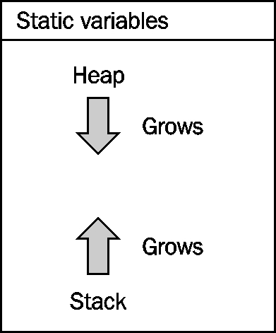
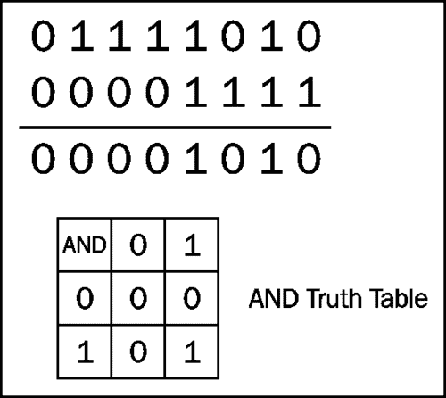
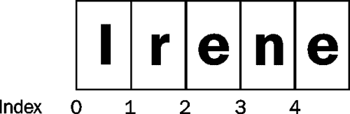

# 第二章 Java 数据类型及其使用

在本章中，我们将进一步了解 Java 如何组织和操作数据，特别是原始数据类型和字符串。除此之外，我们还将探讨各种相关概念，如变量的作用域和生存期。虽然字符串在 Java 中不是原始数据类型，但它们是许多应用程序的关键部分，我们将研究 Java 提供了什么。

在本章中，我们将重点关注：

*   基元数据类型的声明和使用
*   使用`String`和`StringBuilder`类
*   程序堆栈和堆之间的关系
*   类和对象之间的区别
*   Java 中的常量和文本
*   变量的作用域和生存期
*   运算符、操作数和表达式

# 了解 Java 如何处理数据

编程的核心是处理数据的代码。作为程序员，我们对数据和代码的组织感兴趣。数据的组织称为**数据****结构**。这些结构可以是静态的，也可以是动态的。例如，人口年龄可以存储在称为**数组**的数据结构中的连续位置。虽然数组数据结构具有固定大小，但内容可能会更改，也可能不会更改。在[第 4 章](04.html "Chapter 4. Using Arrays and Collections")、*使用数组和集合*中详细讨论了数组。

在本节中，我们将研究变量的几个不同方面，包括：

*   如何申报
*   基本数据类型与对象
*   它们在记忆中的位置
*   它们是如何初始化的
*   它们的范围和寿命

## Java 标识符、对象和内存

变量被定义为特定类型，并分配给内存。创建对象时，在堆上分配构成该对象的实例变量。对象的静态变量被分配到特定的内存区域。当变量被声明为方法的一部分时，该变量的内存将在程序堆栈上分配。

## 堆积如山

对堆栈/堆和其他问题的透彻理解对于理解程序如何工作以及开发人员如何使用 Java 等语言完成工作至关重要。这些概念为理解应用程序如何工作提供了一个框架，并且是实现 Java 使用的运行时系统的基础，更不用说现有的几乎所有其他编程语言了。

这么说来，堆栈和堆的概念相当简单。**堆栈**是每次调用方法时存储方法参数及其局部变量的区域。**堆**是调用`new`关键字时分配对象的内存区域。方法的参数和局部变量组成一个**激活****记录**，也称为**堆栈****帧**。当调用方法时，激活记录被推送到堆栈上，当方法返回时，激活记录被弹出堆栈。这些变量的临时存在决定了变量的生存期。



调用方法时堆栈向堆方向增长，返回方法时堆栈收缩。堆不会以可预测的顺序增长，可能会变得支离破碎。由于它们共享相同的内存空间，如果堆和堆栈发生冲突，则程序将终止。

### 注

理解堆栈和堆的概念很重要，因为：

*   它为理解如何在应用程序中组织数据提供了基础。
*   它有助于解释变量的作用域和生存期的概念
*   它有助于解释递归是如何工作的

我们将重复使用[第 1 章](01.html "Chapter 1. Getting Started with Java")、*Java 入门*中的程序，来演示堆栈和堆的使用。为了您的方便，已在此处复制了该程序：

```java
package com.company.customer;
import java.math.BigDecimal;
import java.util.Locale;

public class Customer {
  private String name;
  private int accountNumber;
  private Locale locale;
  private BigDecimal balance;

  public Customer() {
    this.name = "Default Customer";
    this.accountNumber = 12345;
    this.locale = Locale.ITALY;
    this.balance = new BigDecimal("0");
  }

  public String getName() {
    return name;
  }
  public void setName(String name) throws Exception {
    if(name == null) {
      throw new Exception("Names must not be null");
    } else {
      this.name = name;
    }
  }

  public int getAccountNumber() {
    return accountNumber;
  }

  public void setAccountNumber(int accountNumber) {
    this.accountNumber = accountNumber;
  }

  public BigDecimal getBalance() {
    return balance;
  }

  public void setBalance(float balance) {
    this.balance = new BigDecimal(balance);
  }

  public String toString() {
    java.text.NumberFormat format;
    format = java.text.NumberFormat.getCurrencyInstance(locale);
    return format.format(balance);
  }
 }

package com.company.customer;
public class CustomerDriver {
  public static void main(String[] args) {
    Customer customer;      // defines a reference to a Customer
    customer = new Customer();  // Creates a new Customer object
    customer.setBalance(12506.45f);
    System.out.println(customer.toString());
  }
```

当`main`方法被执行时，激活记录被推送到程序堆栈上。如下图所示，其激活记录仅由单个`args`参数和`customer`参考变量组成。创建`Customer`类的实例时，会在堆上创建并分配一个对象。本例中反映的堆栈和堆的状态发生在`Customer`构造函数执行之后。`args`参考变量指向一个数组。数组的每个元素都引用一个表示应用程序命令行参数的字符串。在下图所示的示例中，我们假设有两个命令行参数，参数 1 和参数 2：


当执行`setBalance`方法时，其激活记录被推送到程序堆栈上，如下所示。`setBalance`方法有一个参数`balance`，分配给`balance`实例变量。但首先，它被用作`BigDecimal`构造函数的参数。`this`关键字引用当前对象。

Heap 是动态分配给对象的内存。堆管理器控制内存的组织方式。当不再需要某个对象时，将执行一个垃圾收集例程来释放内存，以便可以重复使用。在处理对象之前，执行对象的`finalize`方法。但是，无法保证该方法会执行，因为程序可能会在不需要运行垃圾收集例程的情况下终止。原来的`BigDecimal`物体最终会被摧毁。


### 注

在 C++中，当对象即将被销毁时，将执行析构函数。Java 与此最接近的是`finalize`方法，它将在垃圾收集器处理对象时执行。但是，垃圾收集器可能不会运行，因此，`finalize`方法可能永远不会执行。这种范式的转变导致了我们管理资源方式的重大差异。在[第 8 章](08.html "Chapter 8. Handling Exceptions in an Application")中介绍的*处理应用程序*中的异常的【try with resources】块提供了一种处理这种情况的技术。

## 声明一个变量

变量也称为标识符。术语“变量”意味着其值可以改变。通常情况就是这样。但是，如果标识符被声明为常量，如*常量*部分所述，那么它实际上不是一个变量。尽管如此，术语变量和标识符通常被认为是同义词。

变量的声明以数据类型开头，后跟变量名，然后是分号。数据类型可以是基本数据类型或类。当数据类型为类时，变量为对象引用变量。也就是说，它是对对象的引用。

### 注

引用变量实际上是一个伪装的 C 指针。

变量可分为以下三类：

*   实例变量
*   静态变量
*   局部变量

实例变量用于反映对象的状态。静态变量是所有实例通用的变量。局部变量在方法中被声明，并且仅在声明它们的块中可见。

标识符区分大小写，只能由以下部分组成：

*   字母、数字、下划线（u）和美元符号（$）
*   标识符只能以字母、下划线或美元符号开头

有效变量名的示例包括：

*   `numberWheels`
*   `ownerName`
*   `mileage`
*   `_byline`
*   `numberCylinders`
*   `$newValue`
*   `_engineOn`

按照惯例，标识符和方法以小写的第一个单词和大写的后续单词开头，如[第 1 章](01.html "Chapter 1. Getting Started with Java")*Java 入门*中的*Java 命名约定*部分所述。传统声明的示例包括：

*   `int numberWheels;`
*   `int numberCylinders;`
*   `float mileage;`
*   `boolean engineOn;`
*   `int $newValue;`
*   `String ownerName;`
*   `String _byline;`

在前面的示例中，除最后两个变量外，每个变量都声明为基本数据类型。最后一个被声明为对`String`对象的引用。引用变量可以引用一个`String`对象，但在本例中，被分配了一个`null`值，这意味着它当前没有引用字符串。在*字符串类*一节中详细介绍了字符串。以下代码段声明了 integer 类型的三个变量：

```java
int i;
int j;
int k;
```

也可以在一行上声明所有三个变量，如下所示：

```java
int i, j, k;
```

## 基本数据类型

Java 中定义了八种基本数据类型，如下表所示。在 Java 中，所有机器的每种数据类型的大小都是相同的：

<colgroup><col style="text-align: left"> <col style="text-align: left"> <col style="text-align: left"> <col style="text-align: left"></colgroup> 
| 

数据类型

 | 

大小（字节）

 | 

内部代表

 | 

范围

 |
| --- | --- | --- | --- |
| `boolean` | -- | 未精确定义 | `true`或`false` |
| `byte` | 1. | 8 位二的补码 | `−128`至`+127` |
| `char` | 2. | Unicode | `\u0000`至`\uffff` |
| `short` | 2. | 16 位二的补码 | `–32768`至`32767` |
| `int` | 4. | 32 位二的补码 | `−2,147,483,648`至`2,147,483,647` |
| `long` | 8. | 64 位二的补码 | `-9,223,372,036,854,775,808`至`9,223,372,036,854,775,807` |
| `float` | 4. | 32 位 IEEE 754 浮点 | `3.4e +/- 38`（7 位） |
| `double` | 8. | 64 位 IEEE 754 浮点 | `1.7e +/- 308`（15 位） |

`String`数据类型也是 Java 的一部分。虽然它不是一个原始数据类型，但它是一个类，在*字符串类*一节中有详细讨论。

另一种常见的数据类型是货币。Java 中有几种表示货币的方法，详见下表。但是，推荐的方法是使用`BigDecimal`类。

<colgroup><col style="text-align: left"> <col style="text-align: left"> <col style="text-align: left"></colgroup> 
| 

数据类型

 | 

优势

 | 

缺点

 |
| --- | --- | --- |
| 整数 | 适用于简单的货币单位，如一便士。 | 它不使用小数点，如美元和美分。 |
| 浮点数 | 它使用小数点。 | 舍入误差很常见。 |
| `BigDecimal`类 | 

*   处理大量数据。
*   使用小数点。
*   内置四舍五入模式。

 | 更难使用。 |

在使用`BigDecimal`时，必须注意以下几点：

*   使用带有`String`参数的构造函数，因为它在放置小数点方面做得更好
*   `BigDecimal`是不变的
*   `ROUND_HALF_EVEN`舍入模式引入的偏差最小

`Currency`类用于控制货币的格式化。

### 提示

关于货币表示的另一项建议是基于使用的位数。

**位数****推荐数据类型**

小于 10 个整数或`BigDecimal`

长度小于 19 或`BigDecimal`

大于 19`BigDecimal`

在大多数语言中，浮点数可能是问题的重要来源。考虑下面的代码段，在这里我们添加了 AutoT0}，试图获得值 Ty1 T1：

```java
float f = 0.1f;
for(int i = 0; i<9; i++) {
   f += 0.1f;
}
System.out.println(f);
```

结果如下：

```java
1.0000001

```

它反映了十进制值`0.1`不能准确地用基数 2 表示的事实。这意味着我们在处理浮点数时必须始终保持警惕。

## 包装类和自动装箱

包装器类用于将原始数据类型值封装在对象中。在 boxing 可用之前，经常有需要显式使用包装器类的情况，例如`Integer`和`Float`类。这是为了能够将原始数据类型添加到通常在`java.util`包（包括`ArrayList`类）中找到的集合中，因为这些数据类的方法使用对象作为参数。包装类包括以下数据类型：

*   布尔值
*   字节
*   性格
*   短的
*   整数
*   长的
*   浮动
*   双重的

这些包装类的对象是不可变的。也就是说，它们的值不能更改。

**自动装箱**是将原始数据类型自动转换为相应的包装类。这是根据需要执行的，以便消除在基本数据类型及其相应包装器类之间执行简单、显式转换的需要。**取消装箱**指将包装对象自动转换为其等效的原始数据类型。实际上，在大多数情况下，基本数据类型被视为对象。

在使用基本体和对象时，有几件事需要记住。首先，对象可以是`null`，而原语不能指定`null`值。这可能会不时出现问题。例如，取消绑定空对象将导致一个`NullPointerException`。此外，在未发生装箱（如下表所示）时，在比较基本体和对象时要小心：

<colgroup><col style="text-align: left"> <col style="text-align: left"> <col style="text-align: left"> <col style="text-align: left"></colgroup> 
| 

比较

 | 

两个原语

 | 

两个物体

 | 

一个一个

 |
| --- | --- | --- | --- |
| `a == b` | 简单比较 | 比较参考值 | 作为两个基本体处理 |
| `a.equals(b)` | 不会编译 | 比较值是否相等 | 如果是基元，则不会编译，否则会比较它们的值 |

## 初始化标识符

Java 变量的初始化实际上是一个复杂的过程。Java 支持四种初始化变量的方法：

*   默认初始值
*   实例变量初始值设定项
*   实例初始值设定项
*   建设者

在本章中，我们将研究前两种方法。后两种技术在[第 6 章](06.html "Chapter 6. Classes, Constructors, and Methods")、*类、构造函数和方法*中进行了介绍，将整个初始化过程放在一起。

如果未提供显式值，则在创建对象时使用初始默认值。一般来说，当分配对象的字段时，该字段被初始化为零值，如下表所示：

<colgroup><col style="text-align: left"> <col style="text-align: left"></colgroup> 
| 

数据类型

 | 

默认值（用于字段）

 |
| --- | --- |
| `boolean` | `false` |
| `byte` | `0` |
| `char` | `'`\`u0000'` |
| `short` | `0` |
| `int` | `0` |
| `long` | `0L` |
| `float` | `0.0f` |
| `double` | `0.0d` |
| `String`（或任何对象） | `null` |

例如，在下面的类中，`name`被赋值为`null`，而`age`的值为`0`：

```java
class Person {
  String name;
  int age;
  …
}
```

实例变量初始值设定项运算符可用于显式为变量赋值。考虑下面的变化：

```java
class Person {
  String name = "John Doe";
  int age = 23;
  …
}
```

当创建类型为`Person`的对象时，`name`和`age`字段分别被赋值为`John Doe`和`23`。

但是，当声明局部变量时，它不会初始化。因此，重要的是在声明变量时使用初始化运算符，或者在为变量赋值之前不使用该变量。否则，将导致语法错误。

## Java 常量、文本和枚举

常量和文字的相似之处在于它们不能更改。可以使用`final`关键字作为不能更改的基本数据类型来声明变量，因此称为常量。文字是表示值的标记，如`35`或`'C'`。显然，它也不能被修改。与此概念相关的是不可修改的不可变对象。虽然无法修改对象，但可以更改指向该对象的引用变量。

枚举数在本质上也是有效的常量。它们用于提供一种方便的方式，将值集作为列表处理。例如，可以创建枚举来表示卡片组的套装。

### 文字

文字常量是表示数量的简单数字、字符和字符串。有三种基本类型：

*   数字的
*   性格
*   串

#### 数字文字

数字常量由一系列数字组成，这些数字带有可选符号和可选小数点。默认情况下，包含小数点的数字文字是`double`常量。数字常量也可以加上前缀`0x`，表示数字是十六进制数（以 16 为基数）。以`0`开头的数字是八进制数（以 8 为基数）。`f`或`F`后缀可用于声明类型为`float`的浮点文字。

<colgroup><col style="text-align: left"> <col style="text-align: left"> <col style="text-align: left"> <col style="text-align: left"></colgroup> 
| 

数字文字

 | 

基础

 | 

数据类型

 | 

十进制等值

 |
| --- | --- | --- | --- |
| `25` | 10 | `int` | `25` |
| `-235` | 10 | `int` | `-235` |
| `073` | 8. | `int` | `59` |
| `0x3F` | 16 | `int` | `63` |
| `23.5` | 10 | `double` | `23.5` |
| `23.5f` | 10 | `float` | `23.5` |
| `23.5F` | 10 | `float` | `23.5` |
| `35.05E13` | 10 | `double` | `350500000000.00` |

整数文本是常见的。通常它们以 10 为基数表示，但是可以使用适当的前缀创建八进制和十六进制文字。整数文本默认为`int`类型。可以通过在文本末尾附加 L 将文本指定为类型`long`。下表说明了文字及其对应的数据类型：

<colgroup><col style="text-align: left"> <col style="text-align: left"></colgroup> 
| 

字面意义的

 | 

类型

 |
| --- | --- |
| `45` | `int` |
| `012` | 以八进制数表示的整数。 |
| `0x2FFC` | 用十六进制数表示的整数。 |
| `10L` | `long` |
| `0x10L` | 表示为十六进制数的长字符。 |

### 注

可以使用小写或大写 L 将整数指定为 long 类型。但是，最好使用大写 L，以避免将字母与数字“1”（一）混淆。在下面的示例中，粗心的读者可能会将文字视为 100 和 1 与整数 10 的对比：

`10l`对`10L`

浮点文字是包含小数点或使用科学记数法书写的数字。

<colgroup><col style="text-align: left"> <col style="text-align: left"></colgroup> 
| 

字面意义的

 | 

类型

 |
| --- | --- |
| `3.14` | `double` |
| `10e6` | `double` |
| `0.042F` | `float` |

Java7 增加了在数字文本中使用下划线字符（`_`的功能。这通过在文本的重要部分之间添加可视间距来增强代码的可读性。下划线几乎可以用数字文字添加到任何地方。它可以用于浮点数和任何整数基（二进制、八进制、十六进制或十进制）。此外，还支持 base 2 literal。

下表说明了下划线与各种数字文字的用法：

<colgroup><col style="text-align: left"> <col style="text-align: left"></colgroup> 
| 

实例

 | 

用法

 |
| --- | --- |
| `111_22_3333` | 社会保险号码 |
| `1234_5678_9012_3456` | 信用卡号码 |
| `0b0110_00_1` | 表示字节的二进制文字 |
| `3._14_15F` | 圆周率 |
| `0xE_44C5_BC_5` | 用于 32 位量的十六进制文字 |
| `0450_123_12` | 24 位八进制文字 |

在代码中使用文字对数字的内部表示或显示方式没有影响。例如，如果我们使用一个长文字来表示一个社会保险号码，该号码在内部以 2 的补码表示法存储，并将显示为整数：

```java
long ssn = 111_22_3333L;
System.out.println(ssn);
```

结果如下：

```java
111223333

```

如果需要显示格式为社会保险号码的号码，则需要使用代码进行显示。以下是实现这一目标的方法之一：

```java
long ssn = 111_22_3333L;
String formattedSsn = Long.toString(ssn);
for (int i = 0; i < formattedSsn.length(); i++) {
    System.out.print(formattedSsn.charAt(i));
    if (i == 2 || i == 4) {
        System.out.print('-');
    }
}
System.out.println();
```

执行时，我们得到以下输出：

```java
111-22-3333

```

下划线的使用是为了使代码对开发人员更具可读性，但编译器会忽略它。

当使用文字中的下划线时，还有两件事要考虑。首先，连续的下划线被视为一个，并且被编译器忽略。此外，不能放置下划线：

*   在数字的开头或结尾
*   小数点附近
*   在`D`、`F`或`L`后缀之前

下表说明了下划线的无效用法。这将生成语法错误：`illegal underscore`：

<colgroup><col style="text-align: left"> <col style="text-align: left"></colgroup> 
| 

实例

 | 

问题

 |
| --- | --- |
| `_123_6776_54321L` | 不能以下划线开头 |
| `0b0011_1100_` | 不能以下划线结尾 |
| `3._14_15F` | 不能与小数点相邻 |
| `987_654_321_L` | 不能与`L`后缀相邻 |

有些应用程序需要操纵值的位。下面的示例将使用掩码对值执行按位 AND 操作。掩码是用于隔离另一个值的一部分的位序列。在本例中，`value`表示一个位序列，我们希望分离其最后四位。二进制文字表示掩码：

```java
value & 0b0000_11111;
```

当与包含零的掩码进行 AND 运算时，AND 运算将返回零。在前面的示例中，表达式结果的前四位将为零。最后四位与结果的最后四位与值的最后四位相同的位进行 AND 运算。因此，最后四位已被隔离。

这通过执行以下代码序列来说明：

```java
byte value = (byte) 0b0111_1010;
byte result = (byte) (value & 0b0000_1111);
System.out.println("result: " + Integer.toBinaryString(result));
```

执行时，我们得到以下输出：

```java
result: 1010

```

下图说明了这一点和操作：



#### 字符文字

字符文字是单引号中的单字符。

```java
char letter = 'a';
letter = 'F';
```

但是，可以使用一个或多个符号来表示字符。反斜杠字符用于“转义”或赋予字母特殊含义。例如，`'\n'`表示回车换行符。这些特殊的转义序列代表某些特殊值。这些转义序列也可以在字符串文本中使用。下表列出了转义序列字符：

<colgroup><col style="text-align: left"> <col style="text-align: left"></colgroup> 
| 

转义序列字符

 | 

意思

 |
| --- | --- |
| `\a` | 警钟 |
| `\b` | 退格 |
| `\f` | 饲料 |
| `\n` | 新线 |
| `\r` | 回车 |
| `\t` | 水平标签 |
| `\v` | 垂直选项卡 |
| `\\` | 反斜杠 |
| `\?` | 问号 |
| `\'` | 单引号 |
| `\"` | 双引号 |
| `\ooo` | 八进制数 |
| `\xhh` | 十六进制数 |

#### 字符串文字

字符串文字是包含在一组双引号中的字符序列。字符串文字不能跨两行拆分：

```java
String errorMessage = "Error – bad input file name";
String columnHeader = "\tColumn 1\tColumn2\n";
```

### 常数

常量是其值不能更改的标识符。它们用于不使用文字，而应使用可读性更强的名称的情况。在 Java 中，常量是通过在变量声明前加上`final`关键字来声明的。

在下面的示例中，声明了三个常量-`PI`、`NUMSHIPS`和`RATEOFRETURN`。根据[第一章](01.html "Chapter 1. Getting Started with Java")*Java 入门*中的*Java 命名约定*部分的标准，每一项都大写，并给出一个值。这些值不能更改：

```java
final double PI = 3.14159;
final int NUMSHIPS = 120;
final float RATEOFRETURN = 0.125F;
```

在以下语句中，尝试更改 PI 的值：

```java
PI = 3.14;
```

根据编译器的不同，将生成类似于以下内容的错误消息：

```java
cannot assign a value to final variable PI

```

这意味着您不能更改常量变量的值。

### 注

常数除了始终具有相同的值之外，还提供其他好处。可以更有效地处理和优化常量或对象。这使得使用它们的应用程序更高效、更容易理解。我们可以简单地使用`PI`，而不是在每个需要的地方都使用 3.14159。

### 最后一个关键词

虽然`final`关键字用于声明常量，但它还有其他用途，详见下表。我们将在后面的章节中介绍其方法和类的使用：

<colgroup><col style="text-align: left"> <col style="text-align: left"></colgroup> 
| 

适用于

 | 

意思

 |
| --- | --- |
| 原始数据声明 | 无法更改分配给变量的值。 |
| 参考变量 | 不能将变量更改为引用其他变量。但是，可以更改变量引用的对象。 |
| 方法 | 无法重写该方法。 |
| 班 | 无法扩展该类。 |

### 枚举

枚举实际上是`java.lang.Enum`类的子类。在本节中，我们将介绍一个简单枚举的创建。在[第 6 章](06.html "Chapter 6. Classes, Constructors, and Methods")、*类、构造函数和方法*中可以找到对该主题更完整的处理。

下面的示例声明了一个名为`Directions`的枚举。此枚举表示四个基点。

```java
public enum Directions {NORTH, SOUTH, EAST, WEST}
```

我们可以声明这种类型的变量，然后给它赋值。以下代码序列说明了这一点：

```java
Directions direction;
direction = Directions.EAST;
System.out.println(direction);
```

该序列的输出如下所示：

```java
EAST

```

`enum`调用也可以用作 switch 语句的一部分，如下所示：

```java
switch(direction) {
case NORTH:
  System.out.println("Going North");
  break;
case SOUTH:
  System.out.println("Going South");
  break;
case EAST:
  System.out.println("Going East");
  break;
case WEST:
  System.out.println("Going West");
  break;
}
```

当使用前面的代码执行时，我们得到以下输出：

```java
Going East

```

### 不可变对象

不可变对象是字段不能修改的对象。在 Java 核心 SDK 中有几个类的对象是不可变的，包括`String`类。也许令人惊讶的是，`final`关键字并没有用于此目的。这些在[第 6 章](06.html "Chapter 6. Classes, Constructors, and Methods")、*类、构造函数和方法*中有更详细的讨论。

## 实例与静态数据

一个类中有两种不同类型的变量（数据）：实例和静态。当实例化一个对象时（使用带有类名的`new`关键字），每个对象都由组成该类的实例变量组成。但是，每个类只分配一个静态变量副本。虽然每个类都有自己的实例变量副本，但所有类都共享一个静态变量副本。这些静态变量被分配到单独的内存区域，并在类的生命周期内存在。

考虑增加一个共同的折扣百分比，可以选择性地应用于一些客户，但不是所有客户。无论是否应用，百分比始终相同。基于这些假设，我们可以将静态变量添加到类中，如下所示：

```java
private static float discountPercentage;
```

静态方法和字段在[第 6 章](06.html "Chapter 6. Classes, Constructors, and Methods")、*类、构造函数和方法*中有更详细的介绍。

## 范围和寿命

范围是指在程序中可以使用特定变量的地方。通常，变量在声明它的 block 语句中是可见的，但在它之外是不可见的。块语句是用大括号封装的一系列代码。

如果变量在作用域中，则代码可以看到它，并且可以访问它。如果该变量不在范围内，则无法访问该变量，任何尝试都将导致编译时错误。

变量的生存期是指它被分配内存的时间段。当变量声明为方法的局部变量时，分配给该变量的内存位于激活记录中。只要方法没有返回，激活记录就存在，并且为变量分配内存。一旦方法返回，激活记录就会从堆栈中删除，并且变量不再存在且无法使用。

从堆中分配的对象的生存期从分配内存时开始，到取消分配内存时结束。在 Java 中，使用`new`关键字为对象分配内存。对象及其内存在不再被引用时被标记为取消分配。实际上，当垃圾收集例程运行时（如果有的话），它会在将来的某个不确定点被取消分配。如果一个对象没有对它的引用，即使垃圾收集器没有回收它，也可以使用或访问它。

### 范围界定规则

作用域规则对于理解块结构语言（如 Java）是如何工作的至关重要。这些规则解释了何时可以使用变量，以及在发生命名冲突时将使用其中的哪一个。

范围规则围绕块的概念展开。一个块由一个开始和结束的花括号描绘。这些块用于将代码分组在一起并定义变量的范围。下图显示了`i`、`j`和`k`三个变量的范围：


## 访问修饰符

在声明实例和静态变量及方法时，访问修饰符可用作前缀。修改器以各种组合应用，以提供特定的行为。修饰符顺序并不总是重要的，但一致的样式会导致更可读的代码。尽管有一些默认的修改器，但所有修改器都是可选的。访问修饰符包括：

*   `public`：公共对象对其自身类内外的所有方法都可见。
*   `protected`：这允许在当前类和子类之间进行保护。受保护的对象在类之外是不可见的，对子类是完全可见的。
*   `private`：私有变量不能被定义它的类（包括子类）以外的任何类看到。
*   **包**：T 他的可见性是默认保护。只有包中的类具有访问权限（包中的公共类）。

为了解释变量的范围，Po.T0.考虑下面图中所示的包/类组织，箭头表示继承：


假设 A 类的定义如下：

```java
public class A{
   public int  publicInt;
   private int privateInt;
   protected int  protectedInt;
   int defaultInt;  // default (package)
} 
```

所有变量的类型均为`int`。`publicInt`变量是一个公共变量。这个类内外的所有方法都可以看到它。`privateInt`变量仅在此类中可见。`protectedInt`变量仅对该包中的类可见。`protectedInt`变量对该类、其子类和同一包中的其他类可见。其他地方看不见。下表显示了每个声明类型对每个类的可见性：

<colgroup><col style="text-align: left"> <col style="text-align: left"> <col style="text-align: left"> <col style="text-align: left"> <col style="text-align: left"> <col style="text-align: left"></colgroup> 
|   | 

A.

 | 

B

 | 

C

 | 

D

 | 

E

 |
| --- | --- | --- | --- | --- | --- |
| `publicInt` | 看得见的 | 看得见的 | 看得见的 | 看得见的 | 看得见的 |
| `privateInt` | 看得见的 | 看不见的 | 看不见的 | 看不见的 | 看不见的 |
| `protectedInt` | 看得见的 | 看得见的 | 看得见的 | 看不见的 | 看得见的 |
| `defaultInt` | 看得见的 | 看得见的 | 看得见的 | 看不见的 | 看不见的 |

## 数据汇总

以下 t 表总结了变量的类型及其与 Java 编译时和运行时元素的关系：

<colgroup><col style="text-align: left"> <col style="text-align: left"> <col style="text-align: left"> <col style="text-align: left"></colgroup> 
| 

程序元素

 | 

变量类型

 | 

部分

 | 

分配给

 |
| --- | --- | --- | --- |
| 班 | 例子 | 对象 | 堆 |
| 静止的 | 班 | 特殊记忆区 |
| 方法 | 参数 | 激活记录 | 堆栈的激活记录 |
| 地方的 |

# 使用操作数和运算符构建表达式

表达式由操作数和运算符组成。操作数通常是变量名或文字，而运算符作用于操作数。以下是表达式的示例：

```java
int numberWheels = 4;
System.out.println("Hello");
numberWheels = numberWheels + 1;
```

对操作员进行分类有几种方法：

*   算术
*   分配
*   关系的
*   逻辑补码
*   必然的
*   有条件的
*   按位

表达式可以看作是程序的构建块。它们用于表示程序的逻辑。

### 优先级与关联性

Java 运算符汇总在以下优先级和关联性表中。这些运算符中的大多数都很简单：

<colgroup><col style="text-align: left"> <col style="text-align: left"> <col style="text-align: left"> <col style="text-align: left"></colgroup> 
| 

优先

 | 

操作人员

 | 

结合性

 | 

操作人员

 |
| --- | --- | --- | --- |
| 1. | `++` | 正当 | 增薪前/增薪后 |
| `--` | 正当 | 减量前/减量后 |
| `+,-` | 正当 | 一元加减 |
| `~` | 正当 | 按位补码 |
| `!` | 正当 | 逻辑补码 |
| （演员阵容） | 正当 | 铸造 |
| 2. | `*`、`/`和`%` | 左边 | 乘法、除法和模 |
| 3. | `+`和`-` | 左边 | 加减法 |
| `+` | 左边 | 字符串串联 |
| 4. | `<<` | 左边 | 左移 |
| `>>` | 左边 | 右移和符号填充 |
| `>>>` | 左边 | 右移和零填充 |
| 5. | `<`、`<=`、`>`、`>=` | 左边 | 必然的 |
| `Instanceof` | 左边 | 类型比较 |
| 6. | `==`和`!=` | 左边 | 平等与不平等 |
| 7. | `&` | 左边 | 位与布尔与 |
| 8. | `^` | 左边 | 位与布尔异或 |
| 9 | `&#124;` | 左边 | 按位布尔或 |
| 10 | `&&` | 左边 | 布尔与 |
| 11 | `&#124;&#124;` | 左边 | 布尔或 |
| 12 | `?:` | 正当 | 有条件的 |
| 13 | `=` | 正当 | 分配 |
| `+=`、`-=`、`*=`、`/=`、`%=` | 正当 | 复合物 |

虽然这些运算符中的大多数的使用都很简单，但在后面的章节中将提供更详细的示例。但是，请记住，Java 中没有其他变体，也没有其他可用的操作符。例如，`+=`是有效运算符，`=+`不是。然而，它可能会产生意想不到的后果。考虑以下事项：

```java
total = 0;
total += 2;  // Increments total by 2
total =+ 2;  // Valid but simply assigns a 2 to total!
```

最后一条语句似乎使用了=+运算符。实际上，它是赋值运算符，后跟一元加号运算符。`+2`被分配给`total`。请记住，Java 会忽略除字符串文本外的空白。

### 铸造

当一种类型的数据分配给另一种类型的数据时，可能会丢失信息。如果将数据从更精确的数据类型分配到更不精确的数据类型，则称为**缩小**。例如，如果将浮点数`45.607`分配给整数，则小数部分`.607`将丢失。

进行此类型的赋值时，应使用强制转换运算符。强制转换运算符就是要强制转换到的数据类型，用括号括起来。以下显示了几个显式转换操作：

```java
int i;
float f = 1.0F;
double d = 2.0;

i = (int) f;  // Cast a float to an int
i = (int) d;  // Cast a double to an int
f = (float) d;  // Cast a double to a float
```

在这种情况下，如果不使用 cast 运算符，编译器将发出警告。警告是为了建议你更仔细地看作业。精度损失可能是问题，也可能不是问题，这取决于应用程序中数据的使用情况。如果没有强制转换运算符，则在执行代码时进行隐式强制转换。

# 使用字符和字符串

初级班包括的`String`、`StringBuffer`、`StringBuilder`和`Character`班。还有其他几个与字符串和字符操作相关的类和接口，如下所示，您应该知道。然而，并不是下面所有的类都将在这里详细介绍。

*   `Character`：处理字符数据的操作
*   `Charset`：这定义了 Unicode 字符和字节序列之间的映射
*   `CharSequence`：其中，接口由定义常用方法的`String`、`StringBuffer`和`StringBuilder`类实现
*   `StringTokenizer`：用于标记文本
*   `StreamTokenizer`：用于标记文本
*   `Collator`：用于支持对特定于区域设置的字符串的操作

### 字符串、StringBuffer 和 StringBuilder 类

Java 程序员可以使用几个与字符串相关的类。在本节中，我们将研究 Java 中用于处理此类数据的类和技术。

JDK 中用于字符串操作的三个主要类是`String`、`StringBuffer`和`StringBuilder`。在这些类别中，`String`类别是使用最广泛的类别。在 Java5 中引入了`StringBuffer`和`StringBuilder`类，以解决`String`类的效率问题。`String`类是不可变的，需要频繁更改字符串的应用程序将承受创建新的不可变对象的开销。`StringBuffer`和`StringBuilder`类是可变对象，当需要频繁修改字符串时，可以更有效地使用它们。`StringBuffer`与`StringBuilder`的不同之处在于其方法是同步的。

就类支持的方法而言，`StringBuffer`和`StringBuilder`的方法是相同的。它们只是在方法是否同步方面有所不同。

<colgroup><col style="text-align: left"> <col style="text-align: left"> <col style="text-align: left"></colgroup> 
| 

班

 | 

易变的

 | 

同步的

 |
| --- | --- | --- |
| `String` | 不 | 不 |
| `StringBuffer` | 对 | 对 |
| `StringBuilder` | 对 | 不 |

处理使用多线程的应用程序时，同步方法非常有用。**线程**是一个独立执行的代码序列。它将与同一应用程序中的其他线程同时运行。并发线程不会造成问题，除非它们共享数据。发生这种情况时，该数据可能会损坏。使用同步方法可以解决此问题，并防止由于线程的交互而损坏数据。

同步方法的使用包括一些开销。因此，如果字符串没有被多个线程共享，则不需要`StringBuffer`类引入的开销。当不需要同步时，大多数情况下应该使用`StringBuilder`类。

### 注

**使用字符串类的标准**

如果字符串不会更改，请使用`String`类：

*   因为它是不可变的，所以在多个线程之间共享是安全的
*   线程将只读取它们，这通常是线程安全的操作。

如果字符串将要更改并且将在线程之间共享，则使用`StringBuffer`类：

*   本课程就是为这种情况而设计的
*   在这种情况下使用此类将确保正确更新字符串
*   主要缺点是这些方法可能执行得较慢

如果字符串要更改但不会在线程之间共享，请使用`StringBuilder`类：

*   它允许修改字符串，但不会产生同步开销
*   该类的方法执行速度将与`StringBuffer`类的方法执行速度相同或更快

### Unicode 字符

Java 使用 Unicode 标准定义字符。然而，这个标准已经发展和改变，Java 已经适应了它的变化。最初 Unicode 标准将字符定义为 2 字节 16 位值，可以使用可打印字符或`U+0000`到`U+FFFF`表示。无论 Unicode 字符是否可打印，都可以使用十六进制数字对其进行编码。

然而，2 字节编码并不足以用于所有语言。因此，Unicode 标准的第 4 版引入了`U+FFFF`之上的新字符，称为**UTF-16**（**16 位 Unicode 转换格式**。Java 为了支持新标准，使用了**代理****对**-对 16 位字符的概念。这些对用于表示从`U+10000`到`U+10FFFF`的值。代理项对的前导值或高值范围为`U+D800`到`U+DBFF`。该对的尾随或低值范围为`U+DC00`到`U+DFFF`。后一个范围内的字符称为**补充****字符**。这两个特殊范围用于将任何 Unicode 字符映射到代理项对。从 JDK5.0 开始，字符使用 UTF-16 表示。

## 角色类

`Character`类是`char`原语数据类型的包装类。此数据类型支持 Unicode 标准版本 4.0。字符定义为固定宽度、16 位数量。

### 角色类–方法

`Character`类拥有许多处理字符的方法。许多`Character`方法都是重载的，可以采用 char 或 Unicode 代码点参数。代码点是用于字符的抽象，而对于我们来说是 Unicode 字符。下表列出了您可能遇到的几种`Character`方法：

<colgroup><col style="text-align: left"> <col style="text-align: left"></colgroup> 
| 

方法

 | 

描述

 |
| --- | --- |
| `isDigit` | 如果字符是数字，则返回`true` |
| `isLetter` | 如果字符为字母，则返回`true` |
| `isLetterOrDigit` | 如果字符是字母或数字，则返回`true` |
| `isLowerCase` | 如果字符为小写字母，则返回`true` |
| `isSpace` | 如果字符是空格，则返回`true` |
| `isUpperCase` | 如果字符为大写字母，则返回`true` |
| `toLowerCase` | 返回字符的小写等效值 |
| `toUpperCase` | 返回字符的大写等效值 |

## 弦乐类

`String`类是 Java 中用于表示字符串的常见类。它是不可变的，这使得它是线程安全的。也就是说，多个线程可以访问同一个字符串，而不必担心损坏字符串。不可变也意味着它具有固定的大小。

`String`类被设置为不可变的原因之一是出于安全原因。如果字符串用于标识受保护的资源，则一旦授予该资源的权限，就可以修改该字符串，然后获得对用户没有权限的另一资源的访问权限。通过使其不可变，可以避免此漏洞。

尽管`String`类是不可变的，但它可能看起来仍然是可变的。考虑下面的例子：

```java
String s = "Constant";
s = s + " and unchangeable";
System.out.println(s);
```

此序列的输出是字符串“常量和不可更改”。由于`s`定义为`String`类型，`s`标识符引用的对象不能更改。当第二个赋值语句生成时，将创建一个新对象，该对象将`Constant`和`and unchangeable`组合在一起，以生成一个新字符串`Constant and unchangeable`。在此过程中创建了三个`String`对象：

*   `Constant`
*   `and unchangeable`
*   `Constant and unchangeable`

标识符`s`现在引用新字符串`Constant and unchangeable`。

虽然我们可以访问这些对象，但无法更改它们。我们可以访问和读取它们，但不能修改它们。

我们本可以使用`String`类的`concat`方法，但这并不是那么简单：

```java
s = "Constant";
s = s.concat(" and unchangeable");
System.out.println(s);
```

下面的代码演示了创建`String`对象的几种技术。第一个构造函数将只生成一个空字符串。除非应用程序中需要位于堆上的空不可变字符串，否则这不是立即值。

```java
String firstString = new String();
String secondString = new String("The second string");
String thirdString = "The third string";
```

此外，还有两个构造函数使用`StringBuffer`和`StringBuilder`类。根据这些对象创建新的`String`对象，如下代码序列所示：

```java
StringBuffer stringBuffer =new StringBuffer("A StringBuffer string");
StringBuilder stringBuilder =new StringBuilder("A StringBuilder string");
String stringBufferBasedString = new String(stringBuffer);
String stringBuilderBasedString = new String(stringBuilder);
```

### 注

在内部，`String`类的字符串表示为`char`的数组。

### 字符串比较

字符串比较不像最初出现的那样简单。如果要比较两个整数，可以使用如下语句：

```java
if (count == max) {
  // Do something
}
```

但是，对于两个字符串的比较，例如`s1`和`s2`，以下内容通常会被评估为`false`：

```java
String s1 = "street";
String s2;

s2 = new String("street");

if (s1 == s2) {
  // False
}
```

问题在于变量`s1`和`s2`可能引用了内存中的不同对象。if 语句正在比较字符串引用变量，而不是实际字符串。当它们引用不同的对象时，比较返回`false`。这完全取决于编译器和运行时系统如何在内部处理字符串。

当使用`new`关键字时，内存从堆中分配并分配给新对象。但是，对于字符串文本，该内存不是来自堆，而是来自文本池，或者更具体地说，来自字符串内部池。在 Java 中，插入的字符串被放入 JVM 的永久生成区域。该区域还存储 Java 类声明和类静态变量等。

String interning 只存储每个不同字符串的一个副本。这是为了改进某些字符串方法的执行，并减少用于表示相同字符串的空间量。此区域中的字符串将接受垃圾收集。

例如，如果我们使用`new`关键字创建两个字符串文本和一个`String`对象：

```java
String firstLiteral = "Albacore Tuna";
String secondLiteral = "Albacore Tuna";
String firstObject = new String("Albacore Tuna");

if(firstLiteral == secondLiteral) {
  System.out.println(
     "firstLiteral and secondLiteral are the same object");
} else {
  System.out.println(
     "firstLiteral and secondLiteral are not the same object");
}
if(firstLiteral == firstObject) {
  System.out.println(
     "firstLiteral and firstObject are the same object");
} else {
  System.out.println(
     "firstLiteral and firstObject are not the same object");
}
```

结果如下：

```java
firstLiteral and secondLiteral are the same object
firstLiteral and firstObject are not the same object

```

`String`类“`intern`方法可用于插入字符串。对所有常量字符串自动执行插入。在比较内部字符串时，可以使用相等运算符，而不必使用`equals`方法。这可以为字符串密集型应用程序节省时间。很容易忘记插入字符串，因此使用相等运算符时要小心。除此之外，`intern`方法可能是一种昂贵的使用方法。

### 注

`String`类型之外的其他对象由 Java 托管。其中包括包装对象和小整数值。当字符串连接运算符与基元类型一起使用时，可能会产生包装器对象。欲了解更多详情，请访问[http://docs.oracle.com/javase/specs/jls/se7/jls7.pdf](http://docs.oracle.com/javase/specs/jls/se7/jls7.pdf) 参考第 5.1.7 节和第 12.5 节。

为了进行`String`比较，有许多`String`方法可供您使用，包括但不限于以下内容：

<colgroup><col style="text-align: left"> <col style="text-align: left"></colgroup> 
| 

方法

 | 

意图

 |
| --- | --- |
| `equals` | 比较两个字符串，如果它们相等，则返回`true` |
| `equalsIgnoreCase` | 在忽略字母大小写的情况下比较两个字符串，如果它们相等，则返回`true` |
| `startsWith` | 如果字符串以指定的字符序列开头，则返回`tru``e` |
| `endsWith` | 如果字符串以指定的字符序列结尾，则返回`true` |
| `compareTo` | 如果第一个字符串在第二个字符串之前，则返回`-1`；如果第一个字符串在第二个字符串之后，则返回`0`；如果第一个字符串在第二个字符串之后，则返回`1` |

### 注

请记住，字符串以索引`0`开头。

以下说明了各种字符串比较的使用：

```java
String location = "Iceberg City";
if (location.equals("iceberg city"))
  System.out.println(location + " equals ' city'!");
else
  System.out.println(location +" does not equal 'iceberg city'");

if (location.equals("Iceberg City"))
  System.out.println(location + " equals 'Iceberg City'!");
else
  System.out.println(location +" does not equal 'Iceberg City'!");

if (location.endsWith("City"))
  System.out.println(location + " ends with 'City'!");
else
  System.out.println(location + " does not end with 'City'!");
```

输出如下所示：

```java
Iceberg City does not equal 'iceberg city'
Iceberg City equals 'Iceberg City'!
Iceberg City ends with 'City'!

```

在使用这种方法时要考虑几个问题。首先，大写字母在小写字母之前。这是它们以 Unicode 进行排序的结果。同样的顺序也适用于 ASCII。

字符串可以有多个内部表示形式。许多语言使用重音来区分或强调字符。例如，法语名称 Irène 使用重音，可以表示为`I``r``è``n``e`或顺序`I``r``e```java``n``e`。第二个序列将`e`和```组合成字符`è`。如果使用`equals`方法比较这两种不同的内部表示，该方法将返回`false`。在本例中，`\u0300`将严肃重音与字母`e`组合在一起。

字符串 firstIrene=“Irène”；

```java
String secondIrene = "Ire\u0300ne";

if (firstIrene.equals(secondIrene)) {
    System.out.println("The strings are equal.");
} else {
    System.out.println("The strings are not equal.");
}
```

此代码序列的输出如下所示：

```java
The strings are not equal.

```

`Collator`类可用于以特定于语言环境的方式操作字符串，从而消除不同内部字符串表示的问题。

### 基本字符串方法

您可能会遇到几种`String`方法。下表说明了这些问题：

<colgroup><col style="text-align: left"> <col style="text-align: left"></colgroup> 
| 

方法

 | 

意图

 |
| --- | --- |
| `length` | 返回字符串的长度。 |
| `charAt` | 返回字符串中给定索引的字符的位置。 |
| `substring` | 此方法重载并返回部分字符串。 |
| `indexOf` | 返回字符或字符串第一次出现的位置。 |
| `lastIndexOf` | 返回字符或字符串最后一次出现的位置。 |

以下示例说明了这些方法的使用：

```java
String sample = "catalog";
System.out.println(sample.length());
System.out.println(sample.charAt(0));
System.out.println(sample.charAt(sample.length()-1));
System.out.println(sample.substring(0,3));
System.out.println(sample.substring(4));
```

当执行此 code 时，我们得到以下输出：

```java
7
c
g
cat
log

```

在字符串中搜索字符或字符序列是许多应用程序的常见要求。`indexOf`和`lastIndex`方法执行此类操作：

```java
String location = "Irene";
System.out.println(location.indexOf('I'));
System.out.println(location.lastIndexOf('e'));
System.out.println(location.indexOf('e'));
```

这些声明的结果如下：

```java
0
4
2

```

您可以将字符串中的位置想象为紧靠字符前面的位置。这些位置或索引从`0`开始，如下图所示：



### 串长

字符串长度的计算可能比简单使用`length`方法所建议的要复杂一些。它取决于被计数的内容以及字符串在内部的表示方式。

可用于确定字符串长度的方法包括：

*   `length`：采用的标准方法
*   `codePointCount`：与补充字符一起使用
*   字节数组的`length`方法：用于确定用于保存字符串的实际字节数

存储字符串时，字符串的实际长度（以字节为单位）可能很重要。数据库表中分配的空间量可能需要大于字符串中的字符数。

### 数字/字符串转换

将数字转换为字符串的过程很重要。我们可以使用两种方法。第一种方法使用静态方法，如下面的代码序列所示。`valueOf`方法将数字转换为字符串：

```java
String s1 = String.valueOf(304);
String s2 = String.valueOf(778.204);
```

`intValue`和`doubleValue`方法取`valueOf`静态方法返回的对象，分别返回整数或双倍数：

```java
int  num1 = Integer.valueOf("540").intValue();
double  num2 = Double.valueOf("3.0654").doubleValue();
```

第二种方法是使用它们各自包装类的`parseInt`和`parseDouble`方法。它们的用途说明如下：

```java
num1 = Integer.parseInt("540");
num2 = Double.parseDouble("3.0654");
```

### 其他字符串方法

有几种杂项方法可能有用：

*   `replace`：此用另一个字符串替换字符串的一部分
*   `toLowerCase`：此将所有字符转换为字符串中的小写
*   `toUpperCase`：此将所有字符转换为字符串中的大写字母
*   `trim`：此删除前导和尾随空白

这些方法的使用说明如下：

```java
String oldString = " The gray fox ";
String newString;

newString = oldString.replace(' ','.');
System.out.println(newString);

newString = oldString.toLowerCase();
System.out.println(newString);

newString = oldString.toUpperCase();
System.out.println(newString);

newString = oldString.trim();
System.out.println("[" + newString +"]" );
```

结果如下：

```java
.The.gray.fox.
 the gray fox
 THE GRAY FOX
[The gray fox]

```

## StringBuffer 和 StringBuilder 类

`StringBuffer`和`StringBuilder`类提供了`String`类的替代方案。与`String`类不同，它们是可变的。这有时有助于提高程序的效率。有几种常用的方法可用于操纵一个`StringBuffer`或`StringBuilder`对象。下面的示例中说明了其中几个。虽然示例使用`StringBuffer`类，但`StringBuilder`方法的工作方式相同。

经常需要将一个字符串附加到另一个字符串。这可以通过`append`方法实现：

```java
StringBuffer buffer = new StringBuffer();
buffer.append("World class");
buffer.append(" buffering mechanism!");
```

以下说明了如何将字符串插入缓冲区：

```java
buffer.insert(6,"C");
```

一个更详细的例子：

```java
StringBuffer buffer;
buffer = new StringBuffer();
buffer.append("World lass");
buffer.append(" buffering mechanism!");
buffer.insert(6,"C");
System.out.println(buffer.toString());
```

结果如下：

```java
World Class buffering mechanism!

```

# 总结

在本章中，我们研究了 Java 如何处理数据。堆栈和堆的使用是重要的编程概念，在解释变量的作用域和生存期等概念方面有很大的帮助。对象和基本数据类型之间的差异随着变量的初始化而引入。初始化过程将在[第 6 章](06.html "Chapter 6. Classes, Constructors, and Methods")、*类、构造函数和方法*中详细介绍。Java 中可用的运算符与优先级和关联性规则一起列出。此外，还介绍了字符和字符串数据的操作。

在下一章中，我们将探讨 Java 中可用的决策构造，以及如何有效地使用它们。这将基于此处提供的数据类型。

# 涵盖的认证目标

在本章中，我们介绍了以下内容：

*   了解 Java 如何处理数据
*   调查标识符、Java 类和内存之间的关系
*   定义变量的范围
*   初始化标识符
*   使用运算符和操作数构建表达式
*   使用字符串
*   了解对象和基本数据类型之间的差异

# 测试你的知识

1.  What will happen when you compile and run the following code?

    ```java
    public class ScopeClass{
       private int i = 35;
       public static void main(String argv[]){
          int i = 45;
          ScopeClass s = new ScopeClass ();
          s.someMethod();
       }
       public static void someMethod(){
          System.out.println(i);
       }
    }
    ```

    A.第 35 页将打印出来

    B 将打印 45 份

    C 将生成编译时错误

    D 将引发异常

2.  Which of the following lines will compile without warning or error?

    A.`char d="d";`

    B`float f=3.1415;`

    C`int i=34;`

    D`byte b=257;`

    E`boolean isPresent=true;`

3.  Given the following declaration:

    ```java
    public class SomeClass{
       public int i;
       public static void main(String argv[]){
          SomeClass sc = new SomeClass();
          // Comment line
       }
    }
    ```

    如果替换注释行，以下哪项陈述是正确的？

    A.`System.out.println(i);`

    B`System.out.println(sc.i);`

    C`System.out.println(SomeClass.i);`

    D`System.out.println((new SomeClass()).i);`

4.  Given the following declaration:

    ```java
    StringBuilder sb = new StringBuilder;
    ```

    以下哪项是`sb`变量的有效使用？

    A.`sb.append(34.5);`

    B`sb.deleteCharAt(34.5);`

    C`sb.toInteger``(3);`

    D`sb.toString();`

5.  Which of the following will return the position of the first letter `a` where the string s contains "banana"?

    A.`lastIndexOf(2,s);`

    B`s.indexOf('a');`

    C`s.charAt(``2);`

    D`indexOf(s,'v');`

6.  Given the following code, which expression displays the word "Equal"?

    ```java
    String s1="Java";
    String s2="java";
    if(expression) {
       System.out.println("Equal");
    } else {
       System.out.println("Not equal");
    }
    ```

    A.`s1==s2`

    B`s1.matchCase(s2)`

    C`s1.equalsIgnoreCase(s2)`

    D`s1.equals(s2)`