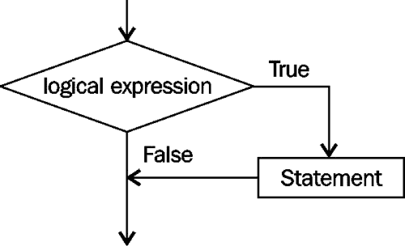
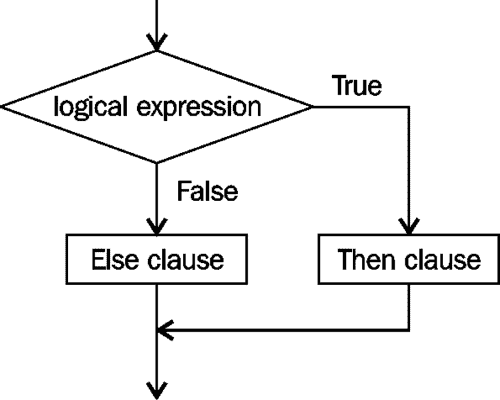
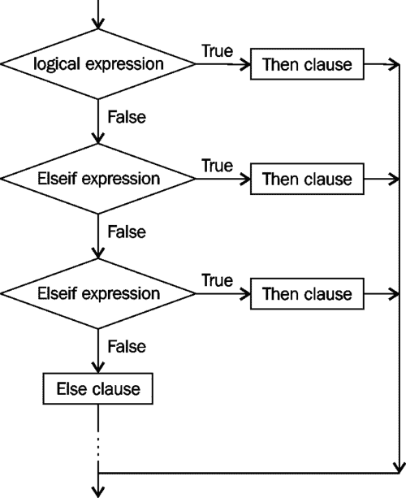
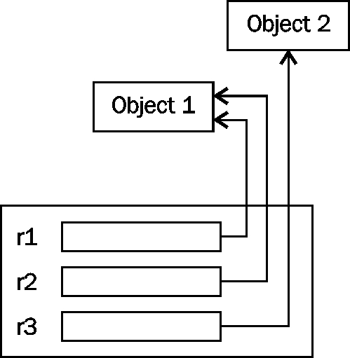

# 第三章决策结构

每个应用程序都会做出某种决定。在 Java 中有几种编程结构，我们可以使用它们来做出这些决策。其中包括逻辑表达式、if 语句和 switch 语句。本章的目的是向您介绍这些工具，并说明如何使用它们。

我们将首先讨论逻辑表达式，因为它们是决策的核心。逻辑表达式是返回布尔值的表达式。

接下来，我们将研究逻辑表达式如何与`if`语句和条件运算符一起使用。`if`语句的结构有很多不同，我们将研究它们的优缺点。

接下来将讨论 switch 语句。在 Java7 之前，switch 语句基于整数或枚举值。在 Java7 中，我们现在可以使用`String`值。研究了字符串的使用及其潜在缺陷。

最后一节讨论了一般控制结构问题，以及在做出决策、比较对象时浮点数的影响，并讨论了组织代码的有用方法。

在本章中，我们将：

*   检查决策构造的性质
*   检查逻辑表达式的基础知识
*   学习如何使用`if`语句并查看其变体
*   了解条件运算符及其使用时间
*   在此语句中探索 switch 语句和 Java7 对字符串的使用
*   确定浮点数比较如何影响控制
*   检查与比较对象相关的陷阱

# 控制流程

在任何应用程序中，程序中的控制流由语句的执行顺序决定。将语句组看作是由决策语句控制执行的块是很方便的。一个块可以被看作是一个单独的语句或一个块语句中包含的几个语句。Java 中的 block 语句是一组用大括号括起来的语句。

## 控制声明–概述

控制结构是语言中决定单个语句执行顺序的部分。如果没有控制结构，语句将按顺序执行，如以下代码段所示：

```java
hours ==35;
payRate = 8.55;
pay = hours * payRate;
System.out.println(pay);
```

要改变语句的执行顺序，可以使用控制语句。在 Java 中，这些语句包括：

*   `if`语句：此语句常用于决定采用两个分支中的哪一个
*   条件运算符：语句是`if`语句的简化和限制形式
*   `switch`语句：该语句用于决定采用几个分支中的哪一个

`switch`语句使用整数、枚举或字符串值进行决策。要理解`if`语句，需要理解逻辑表达式。这将在下一节中介绍。

# 逻辑表达式

与所有的表达式一样，逻辑表达式由运算符和操作数组成。在 Java 中，逻辑运算符的数量有限，如下表所示。它是[第 2 章](02.html "Chapter 2. Java Data Types and Their Usage")、*Java 数据类型及其用法*中列出的运算符的子集：

<colgroup><col style="text-align: left"> <col style="text-align: left"> <col style="text-align: left"> <col style="text-align: left"></colgroup> 
| 

优先

 | 

操作人员

 | 

结合性

 | 

意思

 |
| --- | --- | --- | --- |
| 1. | … |   |   |
| `!` | 正当 | 逻辑补码 |
| … |   |   |
| … |   |   |   |
| 5. | `<`、`<=`、`>`和`>=` | 左边 | 必然的 |
| `instanceof` | 左边 | 类型比较 |
| 6. | `==`和`!=` | 左边 | 平等与不平等 |
| … |   |   |   |
| 10 | `&&` | 左边 | 逻辑与 |
| 11 | `&#124;&#124;` | 左边 | 逻辑或 |
| 12 | `?:` | 正当 | 有条件的 |
| … |   |   |   |

逻辑表达式的操作数可以是任何数据类型，但逻辑表达式的计算结果始终为`true`或`false`值。

### 注

请勿将位运算符`&`、`^`和`|`与相应的逻辑运算符`&&`和`||`混淆。逐位运算符执行与逻辑运算符类似的操作，但是逐位执行的。

## 布尔变量

单词`true`和`false`是 Java 中的关键字。它们的名称对应于它们的值，可以将它们分配给布尔变量。布尔变量可以声明为`boolean`关键字，后跟变量名和可选初始值：

```java
boolean isComplete;
boolean isReady = true;  // Initialized to true
boolean errorPresent;
```

当对逻辑表达式求值时，它将返回一个`true`或`false`值。逻辑表达式的示例包括：

```java
age > 45
age > 45 && departmentNumber == 200
((flowRate > minFlowRate) || ((flowRate > maxFlowRate) && (valveA == off)))
```

给布尔变量起一个反映`true`或`false`状态的名称是一种很好的做法。`isComplete`变量表示操作已完成。变量`isReady`如果设置为 true，则表示某事已准备就绪。

## 相等运算符

相等运算符由两个等号组成，计算时将返回`true`或`false`值。赋值运算符使用单个等号，并将修改其左操作数。为了说明这些运算符，请考虑下面的示例。如果`rate`变量的值等于`100`，我们可以假设存在错误。为了反映这种错误情况，我们可以为`errorPresent`变量指定一个`true`值。这可以使用赋值运算符和相等运算符来执行。

```java
int rate;
rate = 100;
boolean errorPresent = rate==100;
System.out.println(errorPresent);
```

执行前面的代码段时，我们得到以下输出：

```java
true

```

逻辑表达式`rate==100`将`rate`中存储的值与整数文本`100`进行比较。如果它们相等（这里就是这种情况），则表达式返回`true`。然后将`true`值分配给`errorPresent`。如果`rate`中存储的值不是`100`，则表达式将返回一个值`false`。我们将在*比较浮点数*和*比较对象*部分更深入地研究等式运算符的使用。

## 关系运算符

关系运算符用于确定两个操作数之间的关系或相对顺序。这些运算符经常使用两个符号。例如，使用`>=`运算符表示大于或等于。符号的顺序很重要。使用`=>`是不合法的。

下表列出了关系运算符：

<colgroup><col style="text-align: left"> <col style="text-align: left"> <col style="text-align: left"></colgroup> 
| 

操作人员

 | 

意思

 | 

简单例子

 |
| --- | --- | --- |
| `<` | 少于 | `age<35` |
| `<=` | 小于或等于 | `age<=35` |
| `>` | 大于 | `age>35` |
| `>=` | 大于或等于 | `age>=35` |
| `==` | 相同的 | `age==35` |

如果我们希望确定年龄是否大于 25 岁而小于 35 岁，我们必须使用`age`变量两次，并与`&&`运算符结合使用，如下所示：

```java
age > 25 && age < 35
```

虽然下面的表达式可能对我们有意义，但在 Java 中它是非法的。

```java
25 < age < 35
```

变量`age`必须使用两次的原因（如上例所示）是因为关系运算符是二进制运算符。也就是说，每个二进制运算符作用于两个操作数。在前面的表达式中，我们比较了`25`以查看它是否小于`age`。该操作将返回一个`true`或`false`值。接下来，将正确或错误的结果与没有意义且非法的`35`进行比较。

这些是语言的规则。我们不能违反这些规则，因此理解这些规则对我们来说很重要。

## 逻辑运算符

当我们思考我们如何做出决策时，我们经常使用逻辑结构，如 AND 和 OR。如果两个条件都是真的，我们可以做出决定，或者如果两个条件中的任何一个都是真的，我们可以决定做某事。AND 运算符意味着两个条件都必须为真，而 OR 则意味着只有一个条件必须为真。

这两个操作是大多数逻辑表达式的基础。如果某些条件不成立，我们通常会决定做某事。如果下雨，我们可能决定不遛狗。NOT 也是一个用于决策的操作员。使用时，它会将 true 更改为 false，将 false 更改为 true。

有三个逻辑运算符在 Java 中实现这些逻辑结构。下表总结了它们：

<colgroup><col style="text-align: left"> <col style="text-align: left"> <col style="text-align: left"></colgroup> 
| 

操作人员

 | 

意思

 | 

简单例子

 |
| --- | --- | --- |
| `&&` | 和 | `age > 35 && height < 67` |
| `&#124;&#124;` | 或 | `age > 35 &#124;&#124; height < 67` |
| `!` | 不 | `!(age > 35)` |

AND、OR 和 NOT 运算符基于以下真值表：


一些决策可能更复杂，我们使用更复杂的运算符组合`&&`、`||`或`!`来表示这些决策评估。如果天不下雨，如果我们有足够的钱或者一个朋友愿意付钱，我们可能会决定去看电影。

如果（不下雨）和

（（我们有足够的钱）或者（一个朋友会为我们买单）那么

我们要去看电影

括号可以用来控制逻辑运算符的求值顺序，就像它们控制算术运算符的求值顺序一样。在以下代码序列中，错误的存在由存储在`rate`和`period`变量中的值确定。这些语句是等效的，但在括号的使用上有所不同。在第二个语句中使用括号并不是严格需要的，但它确实使它更清楚：

```java
errorPresent = rate == 100 || period > 50;
errorPresent = (rate == 100) || (period > 50);
```

在下面的语句中，使用一组括号强制在`&&`运算符之前执行`||`运算符。由于`&&`运算符的优先级高于`||`运算符，我们需要使用括号来更改求值顺序：

```java
errorPresent = ((period>50) || (rate==100)) && (yaw>56);
```

括号始终优先于其他运算符。

## 短路评估

**短路****电路**是一旦结果变得明显就无法完全评估逻辑表达式的过程。Java 中有两个运算符使逻辑`&&`和`||`运算符短路。

### 使用&&操作符

让我们先考虑逻辑运算。在下面的示例中，我们试图确定`sum`是否大于`1200`并且`amount`是否小于`500`。要使逻辑表达式返回 true，必须满足以下两个条件：

```java
if (sum > 1200 && amount <500)...
```

但是，如果第一个条件为 false，则没有理由计算表达式的其余部分。无论第二个条件的值是多少，`&&`运算符将返回 false。对于短路，不评估第二个条件，从而节省了一些处理时间，尤其是在操作耗时的情况下。

我们可以使用以下两个函数来验证此行为。它们都返回`false`值并在执行时显示消息：

```java
private static boolean evaluateThis() {
    System.out.println("evaluateThis executed");
    return false;
}
private static boolean evaluateThat() {
    System.out.println("evaluateThat executed");
    return false;
}
```

接下来，我们在`if`语句中使用它们，如下所示：

```java
if(evaluateThis() && evaluateThat()) {
    System.out.println("The result is true");
} else {
    System.out.println("The result is false");
}
```

当我们执行前面的代码序列时，我们得到以下输出：

```java
evaluateThis executed
The result is false

```

`evaluateThis`方法执行并返回`false`。由于返回`false`，因此没有执行`evaluateThat`方法。

### 使用| |运算符

逻辑`||`运算符的工作方式类似。如果第一个条件评估为`true`，则没有理由评估第二个条件。这在以下代码序列中演示，`evaluateThis`方法已修改为返回`true`：

```java
private static boolean evaluateThis() {
    System.out.println("evaluateThis executed");
    return true;
}

    ...

if(evaluateThis() || evaluateThat()) {
    System.out.println("The result is true");
} else {
    System.out.println("The result is false");
}
```

执行此代码序列将产生以下输出：

```java
evaluateThis executed
The result is true

```

### 避免短路评估

通常，使表达式短路是一种有效的技术。但是，如果我们像上一个示例中那样调用一个方法，并且程序依赖于第二个执行该方法的方法，则可能会导致意外问题。假设我们编写了如下的`evaluateThat`方法：

```java
private static boolean evaluateThat() {
   System.out.println("evaluateThat executed");
   state = 10;
   return false;
}
```

当逻辑表达式短路时，`state`变量不会改变。如果程序员错误地假设`evaluateThat`方法将始终执行，那么当分配给`state`的值不正确时，这可能会导致逻辑错误。

据说`evaluateThat`方法有副作用。人们可以争论使用有副作用的方法是否是一种好的做法。无论如何，您可能会遇到使用副作用的代码，您需要了解其行为。

避免逻辑表达式短路的一种替代方法是使用位 AND（`&`和 OR（`|`运算符）。这些逐位运算符对操作数的每一位逐位执行`&&` 或`||`操作。作为关键字`true`和`false`的内部表示，使用单个位，结果应与相应逻辑运算符返回的结果相同。不同之处在于未执行短路操作。

使用上一个示例，如果我们使用`&`运算符而不是`&&`运算符，如以下代码段所示：

```java
if (evaluateThis() & evaluateThat()) {
   System.out.println("The result is true");
} else {
   System.out.println("The result is false");
}
```

我们将获得以下输出，显示在执行代码时执行了这两个方法：

```java
evaluateThis executed
evaluateThat executed
The result is false

```

# if 语句

`if`语句用于控制基于布尔表达式的执行流。有两种基本的形式可以使用，并且有几种变体。`if`语句由`if`关键字组成，后跟括号内的逻辑表达式，然后是语句。下图显示了一个简单的`if`语句的图形描述：



下面的说明了`if`语句的这种形式，我们将`rate`与`100`进行比较，如果它等于`100`，我们将显示一条这样的消息：

```java
if (rate==100) System.out.println("rate is equal to 100");
```

但是，这并不像下面的等效示例那样可读，我们将`if`语句分为两行：

```java
if (rate == 100) 
   System.out.println("rate is equal to 100");
```

正如我们将在后面看到的，最好总是将 block 语句与`if`语句一起使用。以下内容在逻辑上等同于前面的`if`语句，但更具可读性和可维护性：

```java
if (rate == 100) {
    System.out.println("rate is equal to 100");
}
```

如果逻辑表达式的计算结果为`false`，则`if`语句的第二种形式使用`else`关键字指定要执行的语句。下图以图形方式说明了此版本的`if`语句：



`if`语句使用前面的示例说明如下：

```java
if (rate == 100) {
   System.out.println("rate is equal to 100");
} else {
   System.out.println("rate is not equal to 100");
}
```

如果表达式的计算结果为`true`，则执行第一个块，然后控制传递到`if`语句的末尾。如果表达式的计算结果为`false`，则执行第二个块。在本例中，每个块由一条语句组成，但不必如此。块中可以使用多个语句。语句数量的选择取决于我们试图做什么。

`if`语句的简单形式消除了`else`子句。假设我们想在超过某个限制时显示一条错误消息，否则什么也不做。这可以通过不使用`else`子句来实现，如以下代码段所示：

```java
if (amount > limit) {
  System.out.println("Your limit has been exceeded");
}
```

消息显示的唯一时间是超过限制时。注意 block 语句的用法。尽管它只包含一条语句，但使用它仍然是一种很好的做法。如果我们决定要做的不仅仅是显示错误消息，例如更改限制或重置数量，那么我们需要一个 block 语句。最好准备：

一些开发人员不喜欢这种更简单的表单，总是使用 else 子句。

```java
if (amount > limit) {
  System.out.println("Your limit has been exceeded");
} else {
  // Do nothing
}
```

`Do nothing`注释用于记录`else`条款。如果我们决定实际做一些事情，比如下订单，那么我们将在这里添加代码。通过使用明确的`else`条款，我们至少必须考虑什么可以或应该去那里。

您也可能会遇到**空语句**。此语句由一个分号组成。执行时，它什么也不做。它通常用作占位符，表示什么也不做。在下面的代码段中修改了前面的`if`语句，以使用空语句：

```java
if (amount > limit) {
   System.out.println("Your limit has been exceeded");
} else {
   ;    // Do nothing
}
```

这不会给`if`语句添加任何内容，在这里使用它也不是问题。在[第 5 章](05.html "Chapter 5. Looping Constructs")*循环构造*中，我们将研究不小心使用空语句如何导致问题。

## 嵌套的 if 语句

相互嵌套的`if`语句为决策提供了另一种技巧。如果一条`if`语句包含在另一条`if`语句的`then`或`else`子句中，则该语句是嵌套的。在下面的示例中，在第一条`if`语句的`then`子句中找到了一条`if`语句：

```java
if (limitIsNotExceeded) {
   System.out.println("Ready");
   if (variationIsAcceptable) {
      System.out.println(" to go!");
   } else {
      System.out.println(" – Not!");
   }
   // Additional processing
} else {
   System.out.println("Not Ok");
}
```

嵌套的`if`可以使用的位置没有限制。它可以在的`then`或`else`子句中。此外，它们的嵌套深度没有限制。我们可以把一个`if`放在一个`if`里面，一个`if`里面，等等。

## else if 变更

在一些编程语言中，有一个`elseif`关键字提供了一种实现多重选择`if`语句的方法。从图形上看，该语句的逻辑如下图所示：



Java 没有关键字，但使用嵌套的 if 语句可以实现相同的效果。假设我们要计算一个运输成本，该成本取决于我们运输到该国东部、中北部、中南部或西部的四个地区中的哪一个。我们可以使用一系列的`if`语句来实现这一点，其中每个语句都有效地嵌套在前面的`if`语句的`else`子句中。计算结果为 true 的第一条`if`语句将执行其主体，其他`if`语句将被忽略：

```java
if (zone.equals("East")) {
   shippingCost = weight * 0.23f;
} else if (zone.equals("NorthCentral")) {
   shippingCost = weight * 0.35f;
} else if (zone.equals("SouthCentral")) {
   shippingCost = weight * 0.17f;
} else {
   shippingCost = weight * 0.25f;
}
```

此代码序列相当于以下代码：

```java
if (zone.equals("East")) {
   shippingCost = weight * 0.23f;
} else 
   if (zone.equals("NorthCentral")) {
      shippingCost = weight * 0.35f;
   } else 
      if (zone.equals("SouthCentral")) {
         shippingCost = weight * 0.17f;
      } else {
         shippingCost = weight * 0.25f;
      }
```

第二个示例获得与第一个示例相同的结果，但需要更多缩进。在*switch 语句*部分，我们将演示如何使用 switch 语句实现相同的结果。

## if 声明-使用问题

在使用`if`语句时，您应该记住几个问题。在本节中，我们将研究以下问题：

*   误用相等运算符
*   使用布尔变量代替逻辑表达式
*   在逻辑表达式中使用 true 或 false
*   不使用 block 语句的危险
*   悬而未决的问题

### 误用相等运算符

Java 语言的一个很好的特性是无法编写意外使用赋值运算符的代码，而赋值运算符本来应该是相等运算符。这种情况在 C 编程语言中经常发生，代码编译干净，但会导致逻辑错误或更糟的是在运行时异常终止。

例如，下面的代码片段比较`rate`是否等于`100`：

```java
if(rate == 100) {
   …
}

```

但是，如果我们改用赋值运算符，如以下代码段所示，我们将生成一个语法错误：

```java
  if(rate = 100) {
…
}
```

将生成类似于以下内容的语法错误：

```java
incompatible types
 required: boolean
 found:    int

```

Java 中消除了这种类型的错误。在*比较浮点数*一节中介绍了对浮点数使用相等运算符。

### 提示

请注意，错误消息说它找到了一个`int`值。这是因为赋值运算符返回了一个**残值**。赋值运算符将修改操作数的左侧，并返回分配给该操作数的值。该值为残值。这是手术遗留下来的。

理解残值的概念可以解释错误信息。它还解释了以下表达式工作的原因：

```java
i = j = k = 10;
```

表达式的作用是将`10`分配给每个变量。赋值的关联性是从右向左的。也就是说，当表达式中存在多个赋值运算符时，将从右向左求值。将值`10`赋值给`k`，赋值运算符返回的剩余值为`10`。然后将剩余值分配给`j`等。

### 使用逆运算

使用关系运算符时，编写表达式的方法通常不止一种。例如，以下代码序列确定某人是否达到法定年龄：

```java
final int LEGAL_AGE = 21;
int age = 12;

if(age >= LEGAL_AGE) {
   // Process
} else {
   // Do not process
}
```

然而，这个代码序列也可以写成如下：

```java
if(age < LEGAL_AGE) {
   // Do not process
} else {
   // Process
}
```

哪种方法更好？在这个例子中，可以说这两种方法都有效。但是，最好使用对问题最自然的形式。

请注意，下表中显示的操作是反向操作：

<colgroup><col style="text-align: left"> <col style="text-align: left"></colgroup> 
| 

活动

 | 

逆运算

 |
| --- | --- |
| `<` | `>=` |
| `>` | `<=` |

注意常数`LEGAL_AGE`的使用。在可能的情况下，最好为诸如法定年龄之类的值使用标识符。如果没有，并且该值在多个位置使用，则只需在一个位置更改该值。此外，它还避免了在某个事件中意外使用错误号码的错误。此外，将数字设置为常量可避免意外修改程序运行时不应修改的值。

### 使用布尔变量代替逻辑表达式

正如我们在*布尔变量*部分所看到的，我们可以声明一个布尔变量，然后将其用作逻辑表达式的一部分。我们可以使用布尔变量来保存逻辑表达式的结果，如以下代码段所示：

```java
boolean isLegalAge = age >= LEGAL_AGE;

if (isLegalAge) {
   // Process
} else {
   // Do not process
}
```

这可能有两个原因：

*   如果需要的话，它允许我们以后重新使用结果
*   如果我们使用一个有意义的布尔变量名，它会使代码更具可读性

我们还可以使用否定运算符更改`then`和`else`子句的顺序，如下所示：

```java
if (!isLegalAge) {
   // Do not process
} else {
   // Process
}
```

这个例子通常比前一个更令人困惑。我们可能会使用一个措词不当的布尔变量，使其更加混乱，如下所示：

```java
if (!isNotLegalAge) {
   // Process
} else {
   // Do not process
}
```

虽然这是可读和有效的，但一般的规则是避免双重否定，就像我们在英语中尝试做的那样。

### 在逻辑表达式中使用 true 或 false

`true`和`false`关键字可以在逻辑表达式中使用。但是，它们不是必需的，是冗余的，并且会使代码变得杂乱无章，几乎没有任何附加值。注意在下面的逻辑`if`语句中使用了`true`关键字：

```java
if (isLegalAge == true) {
   // Process
} else {
   // Do not process
}
```

不需要显式使用子表达式`== true`。使用`false`关键字时也是如此。在前面的示例中，单独使用布尔变量更清晰、更简单。

### 不使用 block 语句的危险

由于块语句被视为一条语句，因此允许在`if`语句的任一部分包含多条语句，如以下代码段所示：

```java
if (isLegalAge) {
   System.out.println("Of legal age");
   System.out.println("Also of legal age");
} else {
   System.out.println("Not of legal age");
} 
```

当`then`或`else`子句只需要一条语句时，实际上不需要使用 Block 语句，但鼓励使用 Block 语句。类似但无效的`if`语句如下所示：

```java
if (isLegalAge) 
   System.out.println("Of legal age");
   System.out.println("Also of legal age");
else {
   System.out.println("Not of legal age");
}
```

block 语句用于将代码分组在一起。print 语句的缩进不包含组码。虽然这可能意味着前两个`println`语句是`if`语句的 then 部分的一部分，`if`语句实际上会导致编译时错误。

在这里，显示的代码相同，但缩进不同。`if`语句只有一个`if`子句和一个`println`语句。第二条`println`语句紧跟其后，无论逻辑表达式的值如何，都将执行该语句。后面是 else 子句，它本身就是。编译器将此视为语法错误：

```java
if (isLegalAge) 
   System.out.println("Of legal age");
System.out.println("Also of legal age");
else {
   System.out.println("Not of legal age");
}
```

生成的语法错误将如下所示：

```java
'else' without 'if'

```

### 注

一般的经验法则是始终对`if`语句的`then`和`else`部分使用块语句。

如果在`else`子句中有一个额外的语句，则会出现一个更隐蔽的问题。考虑下面的例子：

```java
if (isLegalAge) 
   System.out.println("Of legal age");
else
   System.out.println("Not of legal age");
   System.out.println("Also not of legal age");
```

第三个`println`语句不是 else 子句的一部分。它的缩进具有误导性。使用适当缩进的等效代码如下所示：

```java
if (isLegalAge) 
   System.out.println("Of legal age");
else 
   System.out.println("Not of legal age");
System.out.println("Also not of legal age");
```

很明显，第三条`println`语句将始终被执行。撰写本声明的正确方式如下：

```java
if (isLegalAge) {
   System.out.println("Of legal age");
} else {
   System.out.println("Not of legal age");
   System.out.println("Also not of legal age");
}
```

### 悬而未决的问题

不使用 block 语句的另一个问题是悬挂 else 问题。考虑下面的一系列测试，我们需要做出一些决定：

*   如果`limit`大于`100`且`stateCode`等于`45`，我们需要将`limit`增加`10`
*   如果`limit`不大于`100`，我们需要将`limit`减少`10`

该逻辑实现如下：

```java
if (limit > 100) 
   if (stateCode == 45) 
      limit = limit+10;
else
   limit = limit-10;
```

然而，这个例子并没有正确地实现决策。这个例子至少有两个问题。首先，`else`关键字的缩进与陈述的评估无关，并且具有误导性。`else`关键字总是与最近的`if`关键字配对，在本例中，这是第二个关键字。编译器并不关心我们如何缩进代码。这意味着代码等同于以下内容：

```java
if (limit > 100) 
   if (stateCode == 45) 
      limit = limit+10;
   else
      limit = limit-10;
```

此处，仅当限值超过`100`时测试`stateCode`，然后`limit`增加或减少`10`。

请记住，编译器会忽略任何语句中的空格（空格、制表符、换行符等）。代码序列可以在没有空格的情况下编写，但这使其更难阅读：

```java
if (limit > 100) if (stateCode == 45) limit = limit+10; else limit = limit-10;
```

本例中的第二个问题是未能使用 block 语句。块语句不仅提供了一种对语句进行分组的方法，而且还提供了一种更清晰地传达应用程序逻辑的方法。此问题可以解决，如下代码所示：

```java
if (limit > 100) {
   if (stateCode == 45) {
      limit = limit+10;
   }
} else {
   limit = limit-10;
}
```

这一点更加清楚，并且实现了预期目标。它使程序的调试更容易，代码更可读，从而使程序更易于维护。

# 条件运算符

条件运算符是`if`语句的浓缩、限定形式。它的浓缩之处在于决定仅限于一个表达式。由于`then`或`else`子句中不能包含多条语句，所以限制。它有时被称为**三元运算符**，因为它由三个部分组成。

操作员的基本形式如下：

*逻辑压力？然后表达：ElseExpression*

如果*逻辑表达式*的计算结果为 true，则返回*表达式*的结果。否则返回*ElseExpression*的结果。

下面的简单示例测试一个数字是否小于 10。如果是，则返回 1，否则返回 2。示例中的`then`和`else`表达式是普通整数文本。

```java
result = (num < 10) ? 1 : 2;
```

这相当于以下`if`陈述：

```java
if (num < 10) {
   result = 1;
} else {
   result = 2;
}
```

考虑加班的计算过程。如果员工工作时间不超过 40 小时，工资计算为工作小时数乘以其工资率。如果员工的工作时间超过 40 小时，则该员工在超过 40 小时的情况下可获得半小时的工资。

```java
float hoursWorked;
float payRate;
float pay;

if (hoursWorked <= 40) {
   pay = hoursWorked * payRate;
} else {
   pay = 40 * payRate + (hoursWorked - 40) * payRate;
}
```

可以使用条件运算符执行此操作，如下所示：

```java
payRate = (hoursWorked <= 40) ? 
   hoursWorked * payRate : 
   40 * payRate + (hoursWorked - 40) * payRate;
```

虽然此解决方案更紧凑，但可读性较差。此外，`then`和`else`子句需要是一个返回某些值的表达式。虽然值不必是数字，但它不能是多个语句，除非调用包含这些语句的方法。

### 注

不鼓励使用条件运算符，除非是在普通情况下，主要是由于其可读性问题。拥有可读的、可维护的代码通常比保存几行代码更重要。

# switch 语句

一条`switch`语句的目的是提供一种基于整数、枚举或`String`表达式的方便的和简单的多分支选择方法。`switch`语句的基本形式如下：

```java
switch ( expression ) {
  //case clauses
}
```

语句块中通常有多个`case`子句。`case`子句的基本形式使用`case`关键字，后跟冒号、零个或多个语句，通常使用`break`语句。`break`语句由单个关键字`break`组成，如下所示：

```java
case <constant-expression>:
  //statements
break;
```

还可以使用可选的 default 子句。这将捕获`case`子句未捕获的任何值。具体表现如下：

```java
default:
  //statements
break;  // Optional
```

`switch`语句的基本形式如下：

```java
switch (expression) {
  case value: statements
  case value: statements
  …
  default: statements
}
```

一条`switch`语句中的两个案例不能具有相同的值。`break`关键字用于有效结束代码序列并退出`switch`语句。

计算表达式时，控件将传递给与相应常量表达式匹配的大小写表达式。如果没有大小写与表达式的值匹配，则将控制传递给`default`子句（如果存在）。如果默认前缀不存在，`switch`的任何语句都不会执行。

我们将说明`switch`语句在整数、枚举和`String`表达式中的用法。在`switch`语句中使用字符串对 Java 7 来说是新的。

## 基于整数的开关语句

`if`语句可用于在多个整数值之间选择。考虑下面的例子。可以使用一系列的`if`语句来计算基于整数`zone`值的运输成本，如下所示：

```java
private static float computeShippingCost(
         int zone, float weight) {
   float shippingCost;

   if (zone == 5) {
      shippingCost = weight * 0.23f;
   } else if (zone == 6) {
      shippingCost = weight * 0.23f;
   } else if (zone == 15) {
      shippingCost = weight * 0.35f;
   } else if (zone == 18) {
      shippingCost = weight * 0.17f;
   } else {
      shippingCost = weight * 0.25f;
   }

   return shippingCost;
}
```

`switch`语句可用于相同目的，如下所示：

```java
switch (zone) {
   case 5:
      shippingCost = weight * 0.23f;
      break;
   case 6:
      shippingCost = weight * 0.23f;
      break;
   case 15:
      shippingCost = weight * 0.35f;
      break;
   case 18:
      shippingCost = weight * 0.17f;
      break;
   default:
      shippingCost = weight * 0.25f;
}
```

### 注

不要忘记整数数据类型包括`byte`、`char`、`short`和`int`。这些数据类型中的任何一种都可以与 integer switch 语句一起使用。不允许使用数据类型`long`。

大小写和默认前缀的顺序并不重要。唯一的限制是常量表达式必须都是唯一的。如果`break`语句不是最后一个 case 子句，那么它可能需要一个`break`语句，否则控制将传递给它后面的`case`子句：

```java
switch (zone) {
   case 15:
      shippingCost = weight * 0.35f;
      break;
   default:
      shippingCost = weight * 0.25f;
      break; // Only needed if default is not
             // the last case clause
   case 5:
      shippingCost = weight * 0.23f;
      break;
   case 18:
      shippingCost = weight * 0.17f;
      break;
   case 6:
      shippingCost = weight * 0.23f;
      break;
}
```

### 注

为了便于阅读，通常保持自然顺序，通常是顺序的。使用此顺序可以更容易地找到`case`子句，并确保不会意外遗漏案例。

大小写和默认前缀不会改变控制流。除非使用 break 语句，否则控件将从一个案例流向下一个后续案例。由于 5 区和 6 区使用相同的公式计算运输成本，我们可以使用背对背的案例陈述，而不使用中断陈述：

```java
switch (zone) {
   case 5:
   case 6:
      shippingCost = weight * 0.23f;
      break;
   case 15:
      shippingCost = weight * 0.35f;
      break;
   case 18:
      shippingCost = weight * 0.17f;
      break;
   default:
      shippingCost = weight * 0.25f;
}
```

需要中断语句，以确保仅执行与案例相关的那些语句。在`default`子句末尾不一定需要中断，因为控制通常会从`switch`语句中流出。然而，为了完整性的目的，通常会包含它，如果`default`条款不是`switch`声明中的最后一种情况，则它是必要的。

## 基于枚举的开关语句

枚举也可以与`switch`语句一起使用。这样可以使其更具可读性和可维护性。以下内容复制自[第 2 章](02.html "Chapter 2. Java Data Types and Their Usage")*Java 数据类型及其用法*。变量`direction`用于控制`switch`语句的行为，如下所示：

```java
private static enum Directions {
    NORTH, SOUTH, EAST, WEST
};

Directions direction = Directions.NORTH;

switch (direction) {
    case NORTH:
        System.out.println("Going North");
        break;
    case SOUTH:
        System.out.println("Going South");
        break;
    case EAST:
        System.out.println("Going East");
        break;
    case WEST:
        System.out.println("Going West");
        break;
}
```

当执行时，我们得到以下输出：

```java
Going North

```

## 基于字符串的开关语句

为了说明使用带有`switch`语句的字符串，我们将演示基于*else if VARIANCE*部分中使用的区域的运输成本计算。为方便起见，该实现如下所示：

```java
if (zone.equals("East")) {
   shippingCost = weight * 0.23f;
} else if (zone.equals("NorthCentral")) {
   shippingCost = weight * 0.35f;
} else if (zone.equals("SouthCentral")) {
   shippingCost = weight * 0.17f;
} else {
   shippingCost = weight * 0.25f;
}
```

在 Java7 之前，只有整数变量可以与`switch`语句一起使用。通过允许使用字符串，程序可以包含更可读的代码。

下面的代码片段演示了如何将`String`变量与`case`语句一起使用。该示例提供了前面嵌套的`if`语句的替代实现：

```java
switch (zone) {
   case "East":
      shippingCost = weight * 0.23f;
      break;
   case "NorthCentral":
      shippingCost = weight * 0.35f;
      break;
   case "SouthCentral":
      shippingCost = weight * 0.17f;
      break;
   default:
      shippingCost = weight * 0.25f;
}
```

### switch 语句出现字符串问题

在 switch 语句中使用字符串时，还有两个其他问题需要考虑：

*   当遇到空值时
*   字符串的大小写敏感性质

当为 switch 语句中使用的字符串变量分配空值时，将引发`java.lang.NullPointerException`异常。当然，每当对已分配空值的引用变量执行方法时，就会发生这种情况。在 Java7 中，有额外的支持来处理在`java.util.Objects`类中发现的空值。

关于字符串和 switch 语句，要记住的第二件事是，`switch`语句中的比较区分大小写。在前面的示例中，如果使用了字符串值`east`，则`East`案例将不匹配，而`defa``ult`案例将被执行。

# 控制结构问题

到目前为止，我们已经确定了 Java 中可用的几种类型的决策构造。例如，使用`if`语句可以轻松处理简单的决策。可以使用`else if`子句或`switch`语句来处理或处理决策类型。

正确使用控制结构对于开发好的代码至关重要。然而，做决策不仅仅是在不同的控制结构之间进行选择。我们还需要测试我们的假设并处理意外情况。

在本节中，我们将首先解决一些在使用决策构造时应牢记的一般问题。接下来将对各种浮点问题进行检查，这些问题可能会给那些不熟悉浮点数限制的人带来麻烦。接下来，我们将简要介绍比较对象的主题，并概述三种基本的编码活动，这些活动可能有助于理解编程的本质。

## 总体决策构建问题

在使用决策构造时，有几个问题非常重要：

*   决策陈述的结构
*   测试你的假设
*   计划失败

决策过程的整体结构可以是结构良好的，也可以是难以遵循的特殊陈述序列。对此结构进行良好组织的方法可以提高决策过程的可读性和可维护性。

程序可能结构良好，而且可能无法按预期工作。这通常是由于无效的假设。例如，如果一个年龄的值被假定为非负，那么所使用的代码可能是格式良好的，并且从逻辑的角度来看可能是无可挑剔的。然而，如果对某一年龄段使用良好价值的假设是错误的，那么结果可能与预期不符。例如，如果一个人的年龄输入为负数，那么逻辑可能会失败。始终测试您的假设或至少确保基础数据通过某种质量控制检查是很重要的。总是期待意外。协助这一过程的技术包括：

*   始终保留一个`else`条款
*   测试你的假设
*   抛出异常（参见[第 8 章](08.html "Chapter 8. Handling Exceptions in an Application")、*处理应用程序*中的异常）
*   始终使用块语句

当所有其他方法都失败时，请使用调试技术。

## 浮点数注意事项

浮点数在内部使用 IEEE 754 浮点数算术标准（[表示 http://ieeexplore.ieee.org/xpl/mostRecentIssue.jsp?punumber=4610933](http://ieeexplore.ieee.org/xpl/mostRecentIssue.jsp?punumber=4610933) ）。这些操作通常在软件中执行，因为并非所有平台都为标准提供硬件支持。在软件中执行这些操作将比直接在硬件中执行的操作慢。在软件中执行这些操作的优点是它支持应用程序的可移植性。

支持两种浮点类型，`float`和`double`，精度如下表所示。此外，`Integer`和`Float`类是这两种数据类型的包装类。包装类用于封装值，例如整数或浮点数：

<colgroup><col style="text-align: left"> <col style="text-align: left"> <col style="text-align: left"></colgroup> 
| 

数据类型

 | 

大小（字节）

 | 

精确

 |
| --- | --- | --- |
| `float` | 4. | 二进制数字 |
| `double` | 8. | 二进制数字 |

处理浮点数可能比处理其他数据类型更复杂。浮点数有几个方面需要考虑。这些措施包括：

*   特殊浮点值
*   比较浮点数
*   舍入误差

### 特殊浮点值

有几个特殊的浮点值，如下表所示。它们的存在使得当错误条件发生时，将有一个表示法可用于识别错误。

这些值的存在使得错误条件（如算术溢出、取负数的平方根和除以 0）可以产生可以在浮点值内表示的结果，而不会引发异常或以其他方式终止应用程序：

<colgroup><col style="text-align: left"> <col style="text-align: left"> <col style="text-align: left"></colgroup> 
| 

价值

 | 

意思

 | 

可能是由

 |
| --- | --- | --- |
| 不是数字 | **NaN**：表示生成未定义值的操作的结果 | 除零取负数的平方根 |
| 负无穷大 | 很小的价值 | 被零除的负数 |
| 正无穷大 | 非常大的价值 | 被零除的正数 |
| 负零 | 负零 | 负数非常接近于零，但不能正常表示 |

如有必要，可以用代码`Float.NaN`和`Double.NaN`表示 NaN。使用 NaN 值执行算术运算将产生 NaN 结果。将 NaN 转换为整数将返回`0`，这可能导致应用程序错误。以下代码序列说明了 NaN 的使用：

```java
float num1 = 0.0f;

System.out.println(num1 / 0.0f);
System.out.println(Math.sqrt(-4));
System.out.println(Double.NaN + Double.NaN);
System.out.println(Float.NaN + 2);
System.out.println((int) Double.NaN);
```

执行时，我们得到以下输出：

```java
NaN
NaN
NaN
NaN
0

```

在 Java 中，使用以下任一字段表示。正如他们的名字所暗示的那样，我们可以表示一个负无穷大，也可以表示一个正无穷大。负无穷表示非常小的数字，正无穷表示非常大的数字：

*   `Float.NEGATIVE_INFINITY`
*   `Double.NEGATIVE_INFINITY`
*   `Float.POSITIVE_INFINITY`
*   `Double.POSITIVE_INFINITY`

通常，涉及无穷大值的算术运算将导致无穷大值。涉及 NaN 的将导致 NaN 结果。除以零将得到正无穷大。以下代码片段演示了其中的一些操作：

```java
System.out.println(Float.NEGATIVE_INFINITY);
System.out.println(Double.NEGATIVE_INFINITY);
System.out.println(Float.POSITIVE_INFINITY);
System.out.println(Double.POSITIVE_INFINITY);
System.out.println(Float.POSITIVE_INFINITY+2);
System.out.println(1.0 / 0.0);
System.out.println((1.0 / 0.0) - (1.0 / 0.0));
System.out.println(23.0f / 0.0f);
System.out.println((int)(1.0 / 0.0)); 
System.out.println(Float.NEGATIVE_INFINITY == Double.NEGATIVE_INFINITY);
```

该序列的输出如下所示：

```java
-Infinity
-Infinity
Infinity
Infinity
Infinity
Infinity
NaN
Infinity
2147483647
True

```

负零可以通过将负数除以正无穷大或将正数除以负无穷大来生成，如下面的代码片段所示。两条语句的输出都将为负零：

```java
System.out.println(-1.0f / Float.POSITIVE_INFINITY);
System.out.println(1.0f / Float.NEGATIVE_INFINITY);
```

`0`和`-0`是不同的值。然而，当相互比较时，将确定它们彼此相等：

```java
System.out.println(0 == -0);
```

这将生成以下输出：

```java
True

```

### 比较浮点数

浮点数在计算机中表示的实际上不是实数。也就是说，在编号系统中有无限多个浮点数。但是，32 位或 64 位用于表示浮点数。这意味着只能精确地表示有限数量的浮点数。例如，分数 1/3 不能以 10 为基数精确表示。如果我们尝试，我们会得到 0.333。同样，也有一些浮点数不能以基数 2 精确表示，例如分数 1/10。

这意味着比较浮点数可能很困难。考虑下面的例子，我们将两个数字除以 6，并将结果与预期商比较：

```java
double num2 = 1.2f;
double num3 = 0.2f;
System.out.println((num2 / num3) == 6);
```

执行时，结果会给我们一个意外值，如下所示：

```java
false

```

这是因为这些数字没有使用类型`double`准确表示。为了解决这个问题，我们可以检查操作的结果，看看我们预期的结果和实际得到的结果之间有多大差异。在以下顺序中，差异`epsilon`被定义为可接受的最大差异：

```java
float epsilon = 0.000001f;
if (Math.abs((num2 / num3) - 6) < epsilon) {
   System.out.println("They are effectively equal");
} else {
   System.out.println("They are not equal");
}
```

当执行时，我们得到以下输出：

```java
They are effectively equal

```

此外，当使用`compareTo`方法比较`Float`或`Double`对象时，请记住这些对象按从低到高的顺序排列：

*   负无穷大
*   负数
*   -0.0
*   0
*   正数
*   正无穷大
*   楠

例如，下面的代码将返回`-1`，表示负数小于`-0.0`。输出将为`true`：

```java
System.out.println((new Float(-2.0)).compareTo(-0.0f));
```

### 舍入误差

在某些情况下，注意舍入误差是很重要的。考虑下面的代码序列：

```java
for(int i = 0; i < 10; i++) {
   sum += 0.1f;
}
System.out.println(sum);
```

执行此代码时，我们得到以下输出：

```java
1.0000001

```

这是舍入误差的结果，舍入误差源于分数 1/10 的不准确表示。

### 提示

使用浮点数作为精确值不是一个好主意。美元和美分就是这样。相反，请使用`BigDecimal`，因为它提供了更好的准确性，并且设计用于支持此类操作。

### strictfp 关键字

`strictfp`关键字可以应用于类、接口或方法。在 Java 2 之前，所有浮点计算都是按照 IEEE 754 规范执行的。Java2 之后，中间计算不再局限于标准，允许使用某些处理器上可用的额外位来提高精度。由于四舍五入的差异，这可能导致应用程序的可移植性降低。通过使用`strictfp`关键字，所有计算将严格遵守 IEEE 标准。

## 比较对象

在比较对象时，我们需要考虑：

*   比较对象引用
*   用`equals`方法比较对象

在比较引用时，我们确定两个引用变量是否指向同一对象。如果我们想确定指向两个不同对象的两个参考变量是否相同，我们使用`equals`方法。

这两个比较如下图所示。三个参考变量`r1`、`r2`和`r3`用于参考两个对象。变量`r1`和`r2`引用对象 1，`r3`引用对象 2：



在本例中，以下条件为真：

*   `r1 == r2`
*   `r1 != r3`
*   `r2 != r3`
*   `r1.equals(r2)`

然而，根据对象和对象本身的`equals`方法的实现，对象 1 可能等价于对象 2，也可能不等价于对象 2。在[第 2 章](02.html "Chapter 2. Java Data Types and Their Usage")*Java 数据类型及其用法*中的*字符串比较*一节中详细介绍了字符串的比较。重写`equals`方法在[第 6 章](06.html "Chapter 6. Classes, Constructors, and Methods")、*类、构造函数和方法*中进行了讨论。

## 三种基本编码活动

在编写代码时，可能很难确定如何最好地组织代码。为了帮助人们正确地看待事物，请记住以下三个常规编码活动：

*   你想做什么
*   怎么做
*   什么时候做

如果申请的要求是计算小时工的工资，则：

*   “什么”是计算工资
*   “如何”确定如何编写代码，使用工作时间和工资率计算工资
*   “何时”涉及代码的放置位置，即工作时间和工资率确定后

虽然这看起来很简单，但许多刚开始编程的程序员在“何时”编程方面会遇到问题。这对于今天基于**图形用户界面**（**GUI**）的应用程序所代表的事件驱动程序尤其如此。

## goto 声明

`goto`语句在较旧的编程语言中可用，它提供了一种在程序中传递控制权的强大而无纪律的方式。它的使用经常导致程序组织不善，因此不鼓励使用。在 Java 中，`goto`关键字的使用受到限制。它根本无法使用。它实际上已经完全从 Java 编程中消失了。

但是，许多语言中仍然存在与`goto`语句功能类似的语句。例如，`break`语句导致控制立即转移到 switch 语句的末尾，我们将在后面看到，它是循环外的。标签也可以与 break 语句结合使用，正如我们将在[第 5 章](05.html "Chapter 5. Looping Constructs")*循环构造*中的*使用标签*一节中看到的那样。这种转移是立即和无条件的。这实际上是一个`goto`声明。然而，`break`语句，以及类似的返回语句和异常处理，被认为更结构化、更安全。控件不会转移到程序中的任何任意位置。它仅被转移到相对于`switch`报表末尾的报表的特定位置。

# 总结

决策是编程的一个重要方面。大多数程序的效用是基于其做出某些决策的能力。决策过程基于控制结构的使用，如逻辑表达式、`if`语句和开关语句。

有不同类型的决策需要做出，Java 支持不同的控制结构。本章讨论的主要语句包括`if`语句和`switch`语句。

使用这些语句时必须小心，以避免使用时可能出现的陷阱。其中包括误用比较运算符、习惯性地不使用块语句，以及避免悬而未决的 else 问题。我们还研究了使用浮点数时可能出现的一些问题。

Java 中的决策可以是简单的，也可以是复杂的。简单和复杂的决策最好使用`if then else`语句来处理。对于一些简单的决策，可以使用简单的`if`语句或条件语句。

根据决策的性质，可以使用`if`语句或`switch`语句促进多项选择决策。更复杂的决策可以通过嵌套`if`语句和`switch`语句来处理。

既然我们已经了解了决策构造，我们就可以研究如何使用数组和集合，这是下一章的主题。

# 涵盖的认证目标

关于认证目标，我们将研究：

*   使用运算符和决策构造
*   使用 Java 关系运算符和逻辑运算符
*   使用括号替代运算符优先级
*   创建 if 和 if/else 构造
*   使用`switch`语句

# 测试你的知识

1.  What is the result of the following operation?

    ```java
    System.out.println(4 % 3);
    ```

    A.0

    B1.

    C2.

    D3.

2.  Which of the following expressions will evaluate to 7?

    A.`2 + 4 * 3- 7`

    B`(2 + 4) * (3 - 7)`

    C`2 + (4 * 3) - 7`

    D`((2 + 4) * 3) - 7)`

3.  What is the output of the following statement?

    ```java
    System.out.println( 16  >>>  3);
    ```

    A.1.

    B2.

    C4.

    D8.

4.  Given the following declarations, which of the following if statements will compile without errors?

    ```java
    int i = 3;
    int j = 3;
    int k = 3;
    ```

    A.`if(i > j) {}`

    B`if(i > j > k) {}`

    C`if(i > j && i > k) {}`

    D`if(i > j && > k) {}`

5.  What will be printed out when the following code is executed?

    ```java
    switch (5) {
    case 0:
       System.out.println("zero");
       break;
    case 1:
       System.out.println("one");
    default:
       System.out.println("default");
    case 2:
       System.out.println("two");
    }
    ```

    A.一

    B 违约和二

    C 一、二和默认值

    D 无，生成编译时错误