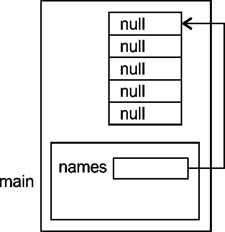
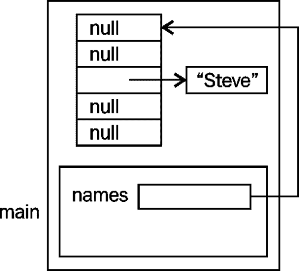
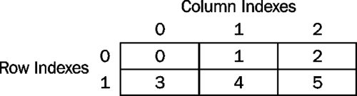
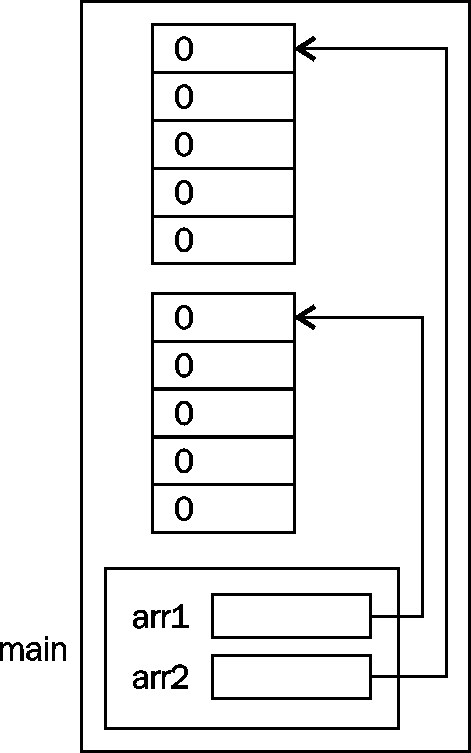

# 第四章使用数组和集合

这一章的实质是关于数据结构的。具体来说，它是关于`java.util.Arrays`和`java.util.ArrayList`类的数组。数组是可以使用单个变量名寻址的内存区域。它提供了一种以顺序或随机方式访问数据的有效技术。`Arrays`类提供对数组的支持，`ArrayList`类提供类似数组的行为，但大小不固定。

我们关心的是如何创建和使用这些数据结构。常见的操作是遍历数组或集合。我们将看到 Java 支持几种方法，允许我们遍历数组或`ArrayList`对象的元素。数组和集合的共同点是能够使用 for-each 语句。迭代器提供了一种访问集合（如`ArrayList`）的替代方法，我们也将对此进行讨论。

我们将从详细检查数组开始。这将包括创建和使用单个和多维数组。将演示常见的阵列操作，如复制和排序。

由于数组是一种简单的数据结构，大多数语言都不支持对其进行操作。`java.util.Arrays`类填补了这一空白，并支持针对数组的重要操作。其中包括复制、填充和排序数组。

`java.util`包包含许多接口和类，可以使处理数据集合变得更容易。在本章中，我们将研究迭代器和`ArrayList`类的使用，它们是这个包的一部分。迭代器为遍历集合提供了一种非常有用的技术。当集合的大小可能发生变化时，通常使用`ArrayList`类代替数组。它为修改集合提供了许多有价值的方法。我们还将研究如何在另一个类中封装集合，例如`ArrayList`。

# 阵列

数组允许使用单个变量名访问多个值。数组的每个元素都是相同类型的。元素类型可以是简单的基本数据类型，也可以是对对象的引用。

一维数组被分配给一个连续的内存区域。这意味着可以有效地访问阵列的元素，因为它们彼此相邻。数组使用整数索引访问数组中的元素。索引范围从 0 到数组长度减 1。我们可以根据应用程序的需要以任何顺序直接访问数组的元素，而不必访问每个元素。

尽管 Java 支持多维数组，但最常用的还是一维数组。阵列可用于多种用途，包括：

*   代表年龄的数字的集合
*   员工名单
*   商店里商品的价格表

阵列的主要缺点是它们具有固定的大小。这使得添加、删除或调整由数组表示的任何列表或数据集合的大小更加困难，效率也更低。

我们的讨论将从一维和多维数组的覆盖范围开始。接下来讨论常见的数组技术，如遍历数组和复制数组。在前两部分中，我们将使用简单的“for 循环”遍历数组元素。替代方法见*遍历阵列*一节。

## 一维阵列

一维数组用于表示简单的线性列表。下面的代码片段演示了一维数组的声明和使用。数组`ages`在第一条语句中声明为`int`类型的数组。在第二条语句中，使用`new`运算符为数组分配内存。在本例中，数组由`5`元素组成：

```java
int[] ages;
ages = new int[5];
```

`ages`数组分配了`5`元素。任何数组的第一个索引都是 0。数组的最大索引是其长度-1。因此，数组的最后一个索引是 4。如果使用的索引超出数组的合法值范围，将生成运行时异常。可以使用单个语句声明和创建数组，如下所示：

```java
int[] ages = new int[5];
```

由于数组名是对数组的引用，因此可以在之后的程序中为变量分配不同的数组。我们将在后面的讨论中演示这一点。

数组是从称为**堆**的内存区域分配的对象。在[第二章](02.html "Chapter 2. Java Data Types and Their Usage")*Java 数据类型及其用法*中的*堆栈和*部分介绍了堆和程序堆栈。在以下示例中，`ages`的第一个元素被赋值为`35`，然后显示：

```java
ages[0] = 35;
System.out.println(ages[0]);
```

数组具有返回数组中元素数的`length`属性。当执行下一个代码序列时，返回`5`。请注意，`length`不是一种方法：

```java
int length = ages.length;
System.out.println(length);
```

数组在 Java 中表示为对象。在前面的示例中，`ages`是一个对象引用变量，它引用已分配给堆的数组。下图对此进行了说明：


在本例中，默认情况下，数组的每个元素被初始化为 0，然后第一个元素被赋值为 35。

### 注

任何试图使用数组边界之外的索引的尝试都将生成一个`java.lang.ArrayIndexOutOfBoundsException`异常。

### 阵列支架的放置

当声明数组时，关于括号的放置还有第二个选项。我们还可以将括号放在数组名称之后，如下所示：

```java
int ages[];
```

对于编译器来说，这相当于前面的声明。但是，括号与数组名称的其他用途的放置受到限制。例如，在声明或引用数组元素时，必须将括号放在数组名称之后。如果在声明数组时尝试以下操作：

```java
ages = new [5]int;
```

我们将得到如下语法错误：

```java
<identifier> expected
';' expected

```

同样，如果我们在引用数组元素时尝试在数组名称前使用括号，例如：

```java
[0]ages = 0;
```

我们得到以下语法错误消息：

```java
illegal start of expression
incompatible types
 required: int[]
 found:    int

```

更常见的情况是在数组的数据类型之后使用括号。例如，大多数 IDE 将在某个时刻生成一个`main`方法。它经常出现在下面的数据类型后面的括号中：

```java
public static void main(String[] args) {
   ...
}
```

此外，考虑声明：

```java
int[] arr1, arr2;
```

`arr1`和`arr2`都声明为数组。这是一种在一行上声明多个数组的简单方法。但是，可以认为以下格式更为明确，是一种更好的格式：

```java
int arr1[], arr2[];
```

也可以说，在一行上声明多个变量是一种糟糕的形式。声明这两个数组的最佳方法如下：

```java
int[] arr1;
int[] arr2;
```

### 初始化数组

数组的元素初始化为默认值，如下表所示。本表从[第 2 章](02.html "Chapter 2. Java Data Types and Their Usage")的*初始化标识符*部分*Java 数据类型及其用法*复制而来，为方便起见：

<colgroup><col style="text-align: left"> <col style="text-align: left"></colgroup> 
| 

数据类型

 | 

默认值（用于字段）

 |
| --- | --- |
| `boolean` | 错误的 |
| `byte` | 0 |
| `char` | “\u0000” |
| `short` | 0 |
| `int` | 0 |
| `long` | 0L |
| `float` | 0.0f |
| `double` | 0.0d |
| `String`（或任何对象） | 无效的 |

在上一个示例中，我们为数组的第一个元素指定了一个值 35。这是一种将数组初始化为默认值以外的值的简单但繁琐的方法。

另一种方法是使用 block 语句初始化数组。下面的示例对此进行了说明，其中`ages`被初始化为五个不同的值。使用 block 语句初始化数组时，无需指定数组大小：

```java
int ages[] = {35, 10, 43, -5, 12};
```

如果尝试指定数组的大小，将生成语法错误，如下所示：

```java
int ages[5] = {35, 10, 43, -5, 12};
```

消息将显示如下：

```java
']' expected
';' expected

```

如果我们想显示数组的内容，有几种方法可用。这里，我们将使用简单索引和`length`属性。在*遍历数组*部分，我们将演示其他技术。

下面的代码序列显示了使用`toString`方法和 for 循环显示数组的区别：

```java
int ages[] = {35, 10, 43, -5, 12};
System.out.println(ages.toString());

for(int i = 0; i < ages.length; i++) {
   System.out.println(ages[i]);
}
```

执行时，我们得到以下输出：

```java
[I@27341e11
35
10
43
-5
12

```

请注意，`toString`方法的使用不会返回数组的内容。相反，它返回数组的奇怪表示形式。我们无法控制`toString`方法返回的字符串。然而，for 循环给出了我们所期望的结果。

### 注

请记住，Java 中的数组总是以索引 0 开头。

不像我们在前面的示例中那样，将数组的大小硬编码为`5`，更好的方法是使用常量。例如，整个序列可以重写如下：

```java
static final int SIZE = 5;

int ages[] = new int[SIZE];
// initialize ages as needed

for(int i = 0; i < ages.length; i++) {
   System.out.println(ages[i]);
}
```

### 注

对数组大小使用命名常量。但是，在声明数组后使用`length`属性是首选的，因为如果数组大小发生变化，它更易于维护。

## 对象数组

在对象引用变量和对象本身之间保持清晰的区别是很重要的。对象数组使用一个引用变量，例如下面声明的`names`变量，它是一个包含对数组对象引用的单个内存位置。数组的每个元素都是另一个引用，可以引用字符串。最初，它们被分配一个`null`值：

```java
public static void main(String args[]) {
   String names[] = new String[5];
   ...
}
```

本例的内存分配如下图所示。但是，我们没有在图中包含数组的索引。我们可以假设顶部元素位于索引 0 处，最后一个元素位于索引 4 处：



当一个字符串被分配给数组的一个元素时，数组元素被修改为引用该字符串，如所示，如下所示：

```java
names[2] = "Steve";
```

下图说明了索引 2 处引用的修改，以使其引用字符串：



使用可能包含空值的数组时要小心。考虑下面的代码序列，在这里我们显示了 HORT T0 数组的内容：

```java
for(int i = 0; i < names.length; i++) {
   System.out.println(names[i]);
}
```

执行时，我们将获得以下输出：

```java
null
null
Steve
null
null

```

## 多维数组

许多应用需要使用二维或二维以上的阵列。具有行和列的表格数据或使用 x/y 坐标系的表格数据是使用二维数组表示的良好候选。三个或更多更高的维度并不常见，但使用 x、y 和 z 值的坐标系将使用三个维度。在本节中，我们将演示使用整数的多维数组。然而，这些技术同样适用于对象数组。

如何声明二维数组的示例如下所示：

```java
static final int ROWS = 2;
static final int COLS = 3;

int grades[][] = new int[ROWS][COLS];
```

这将创建一个逻辑描述为 2 行 3 列的数组，如下图所示：


请注意，索引以零开头。我们可以使用一系列赋值语句初始化每个元素，如下所示：

```java
grades[0][0] = 0;
grades[0][1] = 1;
grades[0][2] = 2;
grades[1][0] = 3;
grades[1][1] = 4;
grades[1][2] = 5;
```

这有点乏味，但它说明了数字在数组中的位置，如下图所示：



嵌套循环对于处理二维数组非常有用。例如，要显示此类数组的内容，我们将使用一组嵌套 For 循环，如下所示：

```java
for (int rows = 0; rows < ROWS; rows++) {
   for (int cols = 0; cols < COLS; cols++) {
      System.out.printf("%d  ", grades[rows][cols]);
   }
   System.out.println();
}
```

执行时，我们得到如下输出：

```java
0  1  2 
3  4  5 

```

实际上，Java 不支持严格意义上的二维数组。实际上，它们是数组的数组。在 C 等语言中，二维数组是按行-列顺序存储的。这意味着二维数组被映射到一维空间，其中第一行存储在内存中，第二行接着第三行，依此类推。这不适用于 Java。

相反，我们实际拥有的是一个一维数组，它引用了一系列其他一维数组。例如，我们可以创建与以下相同的`grades`数组：

```java
grades = new int[ROWS][];
grades[0] = new int[COLS];
grades[1] = new int[COLS];
```

阵列在内存中分配，如下图所示：


在二维数组中，行的大小不一定相同。在下面的代码序列中，我们创建一个具有不同行长度的数组。这种类型的数组称为**参差数组**。

```java
grades[0] = new int[4];
grades[1] = new int[2];
```

内存分配与上一示例类似，只是阵列长度不同，如下图所示：


## 阵列技术

有多种技术用于处理阵列。在本节中，我们将研究其中的许多内容，包括：

*   遍历数组
*   比较数组
*   复制数组
*   传递数组
*   使用命令行参数

我们将根据情况演示每种技术的变化。[第 6 章](06.html "Chapter 6. Classes, Constructors, and Methods")、*类、构造函数和方法*中介绍了向方法传递可变数量的参数。

### 遍历数组

遍历一个数组就是访问数组中每个元素的过程。这通常是从第一个元素开始，逐元素移动，直到到达数组的末尾。但是，也可以向后移动或跳过元素。在这里，我们将重点展示如何使用两种不同的技术从头到尾遍历阵列：

*   使用 simple for 循环
*   对每条语句使用

我们将使用这个`ages`数组来说明如何遍历数组，声明如下：

```java
static final int SIZE = 5;
int[] ages = new int[SIZE];
```

在每个示例中，我们将使用此代码将数组的每个元素初始化为 5。

#### 使用简单循环

任何简单的循环都可以用来遍历数组。循环构造在[第 5 章](05.html "Chapter 5. Looping Constructs")、*循环构造*中有更详细的介绍。在这里，我们将使用 for 循环和 while 循环。首先，“让我们检查 for 循环。在以下序列中，整数变量从 0 开始，前进到数组长度减 1：

```java
for(int i = 0; i < ages.length; i++) {
      ages[i] = 5;
}
```

随后是等效的 while 循环。注意，`i`变量在循环外部声明：

```java
int i = 0;
while(i < ages.length) {
   ages[i++] = 5;
}      
```

for 循环通常更可取，因为我们知道数组的长度，对于这类问题更简单。对于这两个例子，我们都使用数组的`length`属性来控制循环。这比使用可能已用于声明数组的常量变量更可取。考虑下面的情况，我们重新定义数组：

```java
int[] ages = new int[SIZE];
...
for(int i = 0; i < SIZE; i++) {
   ages[i] = 5;
}

// Array redefined
int[] ages = new int[DIFFERENT_SIZE];
...
for(int i = 0; i < SIZE; i++) {
   ages[i] = 5;
}
```

第二个 for 循环将无法正确执行，因为我们忘记更改`SIZE`常量，如果数组小于`SIZE`，甚至可能引发异常。如果我们使用了`length`属性，就不会出现问题。

注意，正如所写的那样，for 循环在 for 循环中声明了变量`i`。这将限制对变量的访问仅限于 for 循环中的那些语句。在 while 循环示例中，我们在循环外部声明了`i`，使其在 while 循环内部和外部都可以访问。我们可以重写 for 循环以使用外部`i`变量。但是，将变量的访问限制为只访问那些需要访问的语句被认为是更好的形式。因此，如果只在循环内部需要，那么 for 循环提供了更好的选择。

### 注

使用 simple for 语句可能会导致 off by one 错误（从错误的开始或结束索引开始）。例如，如果用作最后一个索引的值大于数组的大小减 1，则会抛出一个`ArrayIndexOutOfBoundsException`异常。

#### 对每条语句使用

如果我们不需要显式访问每个元素的索引值，for-each 语句提供了一种更方便的方法来遍历数组。for each 圆括号的主体由数据类型、变量名、冒号和数组（或集合）组成。该语句将遍历数组，从第一个元素开始，以最后一个元素结束。在每次迭代期间，变量引用该数组元素。下面说明了此语句与`ages`数组的用法。在第一次迭代中，`number`引用了`ages[0]`。在第二次迭代中，`number`引用了`ages[1]`。对于数组中的每个元素，这将继续：

```java
for(int number : ages) {
   number = 5;
}
```

for-each 语句使遍历数组变得容易。但是，如果需要使用数组元素的索引，则该语句不提供对其值的访问。访问索引需要传统的 for 循环。

下表总结了使用 for 循环和 for each 循环之间的差异：

<colgroup><col style="text-align: left"> <col style="text-align: left"> <col style="text-align: left"></colgroup> 
|   | 

for 循环

 | 

对于每个循环

 |
| --- | --- | --- |
| 提供对数组元素的访问 |  |  |
| 提供对数组索引的访问 |  |  |
| 使用逻辑表达式来控制循环 |  |  |
| 简单的 |  |  |

### 比较阵列

由于数组变量是一个参考变量，比较数组参考变量以确定相等性并不总是有效的。这里，我们将研究几种比较阵列的技术，包括：

*   逐元素比较
*   使用相等运算符
*   使用`equals`方法
*   使用`deepEquals`方法

我们将通过比较两个整数数组来演示这些技术。考虑下面的例子，在我们初始化它们以包含相同的数据之后，两个数组，即：

```java
public static void main(String[] args) {
   int arr1[];
   int arr2[];
   arr1 = new int[5];
   arr2 = new int[5];

   for(int i = 0; i < 5; i++) {
      arr1[i] = 0;
      arr2[i] = 0;
    }
  }
```

下图显示了如何为两个阵列分配内存：



#### 逐元素比较

这个简单的方法将比较每个数组的对应元素，以确定数组是否相等。它首先假设它们相等，并将一个`true`值赋给`areEqual`变量。如果任何比较结果为假，则变量被指定为值`false`：

```java
boolean areEqual = true;
for (i = 0; i < 5; i++) {
   if(arr1[i]!= arr2[i]) {
      areEqual = false;
   }
}
System.out.println(areEqual);
```

执行此序列时，将显示`true`。这不是最好的办法。使用索引是一种容易出错且单调乏味的方法。

#### 使用相等运算符

如果我们尝试使用相等运算符比较两个数组，我们发现比较的结果将是`false`：

```java
System.out.println(arr1 == arr2);  //Displays false
```

这是因为我们正在比较`arr1`和`arr2`，它们是数组引用变量，而不是数组。变量`arr1`和`arr2`引用内存中的不同对象。这两个参考变量的内容不同，因此，当它们相互比较时，它们并不相等。它们不引用同一个对象。

#### 采用等额法

我们可以对数组使用`equals`方法，就像对其他对象一样。在下面的示例中，输出将为 false，即使它们是等效的。这是因为应用于数组的`equals`方法测试对象等效性，而不是对象值等效性。

```java
System.out.println(arr1.equals(arr2));  // Displays false
```

对象等效性是指两个对象引用变量的比较。如果这些变量引用同一对象，则认为它们是等效的。对象值等效是指两个不同的对象由于其内部值相同而被视为等效的情况。

#### 使用 deepEquals 方法

为了正确比较两个数组，我们需要使用`Arrays`类的`equals`或`deepEquals`方法。`equals`方法使用对象标识执行比较。`deepEquals`方法对元素的值等效性进行了更深入的检查。

以下语句将显示`true`：

```java
System.out.println(Arrays.equals(arr1,arr2));
```

`deepEquals`方法需要一个对象数组。在*多维数组*部分中使用的二维`grades`数组满足要求，因为它是数组的数组，即引用其他数组（即对象）的数组。

如果我们创建一个二级数组`grades2`，并用与`grades`相同的值填充它，我们可以使用这些方法来测试相等性。`grades2`数组的创建和初始化如下：

```java
int grades2[][];
grades2 = new int[ROWS][];
grades2[0] = new int[COLS];
grades2[1] = new int[COLS];

grades2[0][0] = 0;
grades2[0][1] = 1;
grades2[0][2] = 2;
grades2[1][0] = 3;
grades2[1][1] = 4;
grades2[1][2] = 5;
```

如果我们执行以下顺序：

```java
System.out.println(grades == grades2);
System.out.println(grades.equals(grades2));
System.out.println(Arrays.equals(grades, grades2));
System.out.println(Arrays.deepEquals(grades, grades2));
```

我们将获得以下输出：

```java
false
false
false
true

```

前三次比较返回`false`，因为他们没有充分比较两个数组。第四种技术深入比较了阵列，并准确地确定了它们的等效性。

下表总结了这些技术：

<colgroup><col style="text-align: left"> <col style="text-align: left"></colgroup> 
| 

技巧

 | 

议论

 |
| --- | --- |
| 逐元素比较 | 如果实现正确，这将正确比较阵列。 |
| 使用相等运算符 | 只有当两个引用变量引用同一个对象时，这种方法才能正常工作。 |
| 使用数组的`equals`方法 | 只有当两个引用变量引用同一个对象时，这种方法才能正常工作。 |
| 使用`Array`的类`equals`方法 | 这将适用于一维数组。 |
| 使用`Array`的类`deepEquals`方法 | 这将使用对象的`equals`方法进行更深入的比较。 |

### 复制阵列

有次我们需要将一个数组复制到另一个数组。在本节中，我们将研究实现此目标的各种技术。这些措施包括：

*   简单的逐元素复制
*   使用`System.arraycopy`方法
*   使用`Arrays.copyOf`方法
*   使用`Arrays.copyOfRange`方法
*   使用`clone`方法

我们将使用两个一维数组演示技术，如下所述：

```java
int arr1[] = new int[5];
int arr2[] = new int[5];
```

我们将使用以下代码将`arr1`的每个元素初始化为其索引：

```java
for(int i = 0; i < arr1.length; i++) {
   arr1[i] = i;
}
```

在本节的示例中，目标数组的内容如下所示。

我们还将使用术语**浅拷贝**和**深拷贝**。浅复制是指仅复制参考值的情况。复制操作后，原始对象未被复制。在深度复制中，不复制对对象的引用。而是创建对象的新副本。我们将看到这里介绍的一些技术如何只执行浅拷贝，这可能并不总是可取的。

#### 简单的逐元素复制

一种简单的技术是使用 for 循环，如下所示：

```java
for(int i = 0; i < arr1.length; i++) {
   arr2[i] = arr1[i];
}  
// 0, 1, 2, 3, 4
```

这是一种简单的方法，但是您需要小心使用正确的数组索引。这种技术在多维数组中变得更加复杂。

#### 使用 System.arraycopy 方法

`System`类的`arraycopy`方法将尝试将一个数组的全部或部分复制到另一个数组。将指定每个数组中的起始位置以及要复制的元素数。

要将`arr1`的所有元素复制到`arr2`中，我们可以使用以下代码：

```java
System.arraycopy(arr1, 0, arr2, 0, 5);
// 0, 1, 2, 3, 4
```

该方法的参数详见下表：

<colgroup><col style="text-align: left"> <col style="text-align: left"></colgroup> 
| 

参数

 | 

描述

 |
| --- | --- |
| `1` | 源阵列 |
| `2` | 源数组中的起始索引 |
| `3` | 目标阵列 |
| `4` | 目标数组中的起始索引 |
| `5` | 要复制的元素数 |

下一个序列将`arr1`的前三个元素复制到`arr2`的后三个元素：

```java
System.arraycopy(arr1, 0, arr2, 2, 3);
// 0  0  0  1  2
```

我们还可以将一个数组的一部分复制到同一数组中的其他位置。这里我们将前两个元素复制到`arr1`数组的最后两个元素：

```java
System.arraycopy(arr1, 0, arr1, 3, 2);
// 0  1  2  0  1
```

在使用这种技术时，有很多机会发生异常。如果任一数组引用为 null，则抛出一个`NullPointerException`异常。如果数组索引无效，那么我们将得到一个`IndexOutOfBoundsException`异常。

`arraycopy`方法将源数组的指定元素复制到目标数组的相应元素。根据数组的数据类型，有两种可能的结果。详情如下:

*   如果数组元素类型是基本数据类型，那么这两个数组实际上是相同的。
*   如果数组元素类型是引用，则两个数组将相同，但它们都引用相同的对象。这通常不是预期或期望的效果。

在以下代码序列中，尝试创建与`StringBuilder`数组、`arr3`相同的副本：

```java
StringBuilder arr3[] = new StringBuilder[4];
arr3[0] = new StringBuilder("Pine");
arr3[1] = new StringBuilder("Oak");
arr3[2] = new StringBuilder("Maple");
arr3[3] = new StringBuilder("Walnut");
StringBuilder arr4[] = new StringBuilder[4];
System.arraycopy(arr3, 0, arr4, 0, 4);
```

但是，`arr4`包含`arr3`使用的相同对象引用变量。两个数组的对应元素引用同一个对象。使用以下代码创建引用不同字符串的相同数组：

```java
for (int i = 0; i < arr3.length; i++) {
   arr4[i] = new StringBuilder(arr3[i]);
}
```

我们为目标数组的每个元素创建了一个新的`StringBuilder`对象。如果需要深度拷贝，这种方法是必要的。

#### 使用 Arrays.copyOf 方法

`Arrays`类的`copyOf`方法将在现有数组的基础上创建一个新数组。方法的第一个参数指定原始数组。它的第二个参数指定要复制多少个元素。在下面的示例中，我们基于`arr1`的前三个元素创建一个新数组：

```java
arr2 = Arrays.copyOf(arr1, 3);
// 0  1  2
```

新阵列可以比原始阵列大，如以下代码所示：

```java
arr2 = Arrays.copyOf(arr1, 10);
// 0  1  2  3  4  0  0  0  0  0
```

`arr2`的最后五个元素将用零填充。

如果阵列是对象阵列，则会将原始对象的副本指定给新阵列。

#### 使用 Arrays.copyOfRange 方法

`Arrays`类“`copyOfRange`方法将基于现有数组中的元素子范围创建新数组。方法的第一个参数指定原始数组。它的第二个参数指定开始索引，最后一个参数指定结束索引。在下面的示例中，我们基于`arr1`的最后两个元素创建一个新数组：

```java
arr2 = Arrays.copyOfRange(arr1, 3, 5);
//  3  4
```

请注意，最后一个参数不是`arr1`数组的有效索引。这在这里有效，因为最后一个参数是独占的。它不包括该元素。

事实上，如果我们在下一个示例中指定一个值，例如`8`，那么新数组将填充零：

```java
arr2 = Arrays.copyOfRange(arr1, 3, 8);
//     3  4  0  0  0
```

#### 采用克隆法

您也可以使用类的`clone`方法来创建数组的副本：

```java
arr2 = arr1.clone();
```

但是，这仅生成原始对象的浅拷贝。对于上面的整数数组这样的基元数组，这不是问题。对于对象引用数组，两个数组将引用相同的对象。

下表总结了本节介绍的复制技术：

<colgroup><col style="text-align: left"> <col style="text-align: left"></colgroup> 
| 

技巧

 | 

议论

 |
| --- | --- |
| 简单的逐元素复制 | 单调乏味，但可以实现浅拷贝或深拷贝 |
| 使用`System.arraycopy`方法 | 执行浅复制 |
| 使用`Arrays.copyOf`方法 | 执行整个阵列的深度复制 |
| 使用`Arrays.copyOfRange`方法 | 对数组的一部分执行深度复制 |
| 使用`clone`方法 | 执行浅复制 |

### 通过阵列

将一个数组传递给一个方法的优点是它允许我们对多个数组执行相同的操作。要将数组传递给方法，我们在方法调用中使用数组名称，并在方法中声明对传递的数组的引用。下面通过调用`displayArray`方法来说明这一点。此方法仅显示数组。

```java
displayArray(arr2);
   ...
private static void displayArray(int arr[]) {
   for(int number : arr) {
      System.out.print(number + "  ");
   }
   System.out.println();
}
```

请注意，我们正在“通过值”向`arr2`数组“传递引用”。也就是说，如果我们愿意，我们可以在方法中读写`arr2`数组的元素。但是，如果修改`arr`参数，则不会修改原始`arr2`变量。

请考虑下面代码中试图更改 HORT T0 引用变量指向的方法：

```java
System.out.println("Length of arr2: " + arr2.length);
changeArray(arr2);
System.out.println("Length of arr2: " + arr2.length);
...    
private static void changeArray(int arr[]) {
   arr = new int[100];
   System.out.println("Length of arr: " + arr.length);
}
```

当我们执行此代码时，我们得到以下输出：

```java
Length of arr2: 5
Length of arr: 100
Length of arr2: 5

```

`arr`的值已更改，但`arr2`的值未更改。下图应有助于澄清此行为：


### 使用命令行参数

当 Java 应用程序执行时，执行的第一个方法是`main`方法。这个方法传递一个参数，一个名为`args`的`String`对象数组。这些字符串对应于命令行上提供的字符串。

Java 数组的`length`属性将告诉我们使用了多少个命令行参数。数组的第一个参数将包含第一个命令行参数。第二个将包含第二个命令行参数，依此类推。

以下`CommandLineDemo`应用程序说明了`args`阵列的使用：

```java
public class CommandLineDemo {

   public static void main(String args[]) {
      System.out.println("The command line has " + args.length + " arguments");
      for (int i = 0; i < args.length; i++) {
         System.out.println("\tArgument Number " + i + 
                  ": " + args[i]);
      }
   }
}
```

考虑使用以下命令行参数调用 AutoT0R 应用程序：

```java
java CommandLineDemo /D 1024 /f test.dat

```

程序的输出如下所示：

```java
The command line has 4 arguments
 Argument Number 0: /D
 Argument Number 1: 1024
 Argument Number 2: /f
 Argument Number 3: test.dat

```

## 数组类

`java.util.Arrays`类拥有几种用于处理数组的方法。该类的每个方法都是静态方法，这意味着我们不必在使用其方法之前创建`Arrays`类的实例。该类设计用于处理阵列并对阵列执行常见操作。可用的操作类型包括：

*   基于数组返回一个`List`
*   执行二进制搜索
*   制作数组的副本
*   确定两个数组的相等性
*   填充阵列
*   排序数组

在前面的章节中，我们已经看到了其中一些技术的使用。在这里，我们将演示如何使用`asList`、`fill`、`toString`和`deepToString`方法。

考虑下面的声明。我们将声明一个整数数组，然后声明一个数组列表。将向`ArrayList`对象添加两个字符串。我们还将创建一个混合对象数组和一个字符串数组。`ArrayList`类在*ArrayList*一节中有更详细的讨论：

```java
int arr1[] = new int[5];
ArrayList list = new ArrayList();
list.add("item 1");
list.add("item 2");

Object arr2[] = {"item 3", new Integer(5), list};
String arr3[] = {"Pine", "Oak", "Maple", "Walnut"};
```

接下来，我们将使用`fill`方法用数字`5`填充整数数组：

```java
Arrays.fill(arr1,5);
```

然后对这些阵列使用`asList`、`toString`和`deepToString`方法，如下所示：

```java
System.out.println(Arrays.asList(arr3));
System.out.println(Arrays.toString(arr1));
System.out.println(Arrays.deepToString(arr2));
```

执行时，我们得到以下输出：

```java
[Pine, Oak, Maple, Walnut]
 [5, 5, 5, 5, 5]
[item 3, 5, [item 1, item 2]]
```

`asList`方法接受的数组参数并返回表示数组的`java.util.List`对象。如果修改了数组或列表，则会修改它们相应的元素。下面的示例演示了这一点：

```java
List list2 = Arrays.asList(arr3);
list2.set(0, "Birch");
System.out.println(Arrays.toString(arr3));
```

此序列的输出如下所示：

```java
[Birch, Oak, Maple, Walnut]

```

`toString`方法返回数组的字符串表示形式。`deepToString`方法旨在返回其数组参数的字符串表示形式，其中数组更复杂。这反映在`arr2`中，它包含不同的对象，包括一个列表。

## 使用数组时要记住的要点

使用阵列时，请记住：

*   数组索引从 0 开始
*   索引必须是整数
*   数组可以保存基元数据类型或对象
*   阵列提供恒定时间随机访问，这是访问数据的一种有效方式
*   数组提供了良好的引用位置
*   数组比其他数据结构更难插入或删除元素
*   无效元素的索引是可能的

引用的局部性指的是，如果访问一个数据项，则很可能也会访问附近的另一个数据项。这会导致更快的读写操作，是虚拟操作系统中的一个重要概念。当链表分布在内存中时，访问数组元素可能比访问链表元素更快。

访问数组元素时要小心。如果数组未正确初始化，则被索引的元素可能无效，从而导致运行时或逻辑错误。

# 收藏

集合框架是在 Java 2 中引入的一组接口和类，优于早期`java.util`包中的许多接口和类，如`Vector`、`Stack`和`HashTable`。只要可能，就应该始终使用这些接口和类，而不是旧的接口和类。下表总结了许多集合框架接口和类：

<colgroup><col style="text-align: left"> <col style="text-align: left"></colgroup> 
| 

界面

 | 

班

 |
| --- | --- |
| 设置 | `HashSet``TreeSet` |
| 列表 | `ArrayList``LinkedList` |
| 地图 | `HashMap``TreeMap` |

收集框架在[中有更详细的介绍 http://java.sun.com/developer/onlineTraining/collections/Collection.html](http://java.sun.com/developer/onlineTraining/collections/Collection.html) 。在这里，我们将讨论`ArrayList`类，因为它是一个认证主题。建议在需要`List`时使用`ArrayList`类。正如我们将看到的，迭代器和`ArrayList`一起使用，以支持遍历列表。我们将从这个话题开始讨论。

## 迭代器

迭代器提供了一种遍历一组数据的方法。它可以与集合框架中的数组和各种类一起使用。`Iterator`接口支持以下方式：

*   `next`：此方法返回下一个元素
*   `hasNext`：如果有其他元素，此方法返回`true`
*   `remove`：此方法从列表中删除元素

`remove`方法是可选的`Iterator`方法。如果试图使用此方法，而接口的实现不支持此方法，则会引发`UnsupportedOperationException`异常。

当`ListIterator`接口可用时，可替代`Iterator`接口。它使用相同的方法并提供其他功能，包括：

*   在任一方向遍历列表
*   对其要素的修改
*   访问元素的位置

`ListIterator`接口的方式包括：

*   `next`：此方法返回下一个元素
*   `previous`：此方法返回上一个元素
*   `hasNext`：如果当前元素后面有其他元素，则此方法返回`true`
*   `hasPrevious`：如果当前元素前面有其他元素，则此方法返回`true`
*   `nextIndex`：此方法返回下一个`next`方法返回的元素的索引
*   `previousIndex`：此方法返回`previous`方法返回的上一个元素的索引
*   `add`：此方法在列表中插入一个元素（可选）
*   `remove`：此方法从列表中删除元素（可选）
*   `set`：此方法替换列表中的元素（可选）

## 阵列列表

`ArrayList`类有几个有用的特性：

*   它是灵活的
*   按需生长
*   拥有许多有用的方法
*   访问是在固定时间内执行的
*   插入/删除以线性时间执行
*   可以使用索引、for each 循环或迭代器进行遍历

`ArrayList`在内部使用数组。当需要增长时，将元素从旧阵列复制到新阵列。

`ArrayList`类未同步。当为`ArrayList`对象获取迭代器时，如果以并发方式进行修改，可能会同时覆盖并丢失数据。当多个线程访问同一个对象时，它们可能同时（即并发）向该对象写入数据。当同时发生此覆盖时，将引发一个`ConcurrentModificationException`异常。

### 创建 ArrayList

`ArrayList`类具有以下三个构造函数：

*   默认构造函数
*   接受`Collection`对象的人
*   接受初始容量的人

`ArrayList`对象的容量是指列表可以容纳多少元素。当需要添加更多元素且列表已满时，列表的大小将自动增加。使用默认构造函数创建的`ArrayList`的初始容量为`10`。以下示例创建了两个列表，一个容量为`10`，第二个容量为`20`：

```java
ArrayList list1 = new ArrayList();
ArrayList list2 = new ArrayList(20);
```

`ArrayList`类支持泛型。在此，将创建一个字符串列表：

```java
ArrayList<String> list3 = new ArrayList<String>();
```

我们将在下面的示例中使用`list3`。

### 添加元素

有几种方法可用于向`ArrayList`添加元素。可分为以下两类：

*   将一个或多个元素追加到列表的末尾
*   在列表中的某个位置插入一个或多个元素

最简单的情况是在`creatures`的末尾添加一个字符串：

```java
ArrayList<String> creatures = new ArrayList<String>();
creatures.add("Mutant");
creatures.add("Alien");
creatures.add("Zombie");
System.out.println(creatures);
```

print 语句的输出如下所示：

```java
[Mutant, Alien, Zombie]

```

要在第一个元素之后的索引处插入元素，我们使用索引 1：

```java
creatures.add(1,"Godzilla");
System.out.println(creatures);
```

执行代码将验证操作，如下所示：

```java
 [Mutant, Godzilla, Alien, Zombie]

```

`addAll`方法也可以与`Collections`一起使用，如下图所示：

```java
ArrayList<String> cuddles = new ArrayList<String>();
cuddles.add("Tribbles");
cuddles.add("Ewoks");

creatures.addAll(2, cuddles);
System.out.println(creatures);
```

这将导致`cuddles`位于列表中第二个元素之后，如下所示：

```java
[Mutant, Godzilla, Tribbles, Ewoks, Alien, Zombie]
```

`addAll`方法也可以在没有索引参数的情况下使用。在这种情况下，新元素将添加到列表的末尾。

### 检索元素

要在给定位置检索元素，请使用`get`方法。此方法采用单个整数索引值。在下面的示例中，我们检索列表的第三个元素。假设生物列表包含`[Mutant, Godzilla, Tribbles, Ewoks, Alien, Zombie]`，下面的语句将检索`Tribbles`：

```java
String element = creatures.get(2);
```

元素的索引可以使用`indexOf`方法获得，如下一个代码序列所示。如果元素不存在，该方法将返回-1。

```java
System.out.println(creatures.indexOf("Tribbles"));
System.out.println(creatures.indexOf("King Kong"));
```

执行此代码将生成以下输出：

```java
2
-1

```

`indexOf`方法将返回找到的第一个元素的索引。`lastIndexOf`方法将返回列表中找到的最后一个元素的索引。

`toArray`方法将返回列表中对象的数组。在本例中，`creatures`列表被返回并分配给`complete`数组。如果数组不够大（如此处所示），将创建并返回一个新数组。

```java
String[] complete = new String[0];
complete = creatures.toArray(complete);
for(String item : complete) {
   System.out.print(item + " ");
}
System.out.println();
```

执行时，我们得到以下输出：

```java
Mutant Godzilla Tribbles Ewoks Alien Zombie

```

还有一个`subList`方法，它返回给定起始索引和结束索引的部分列表。

### 遍历 ArrayList 对象

要遍历`ArrayList`对象，我们可以使用几种方法中的一种：

*   一个简单的 for 语句
*   每个语句都有一个
*   使用`Iterator`
*   使用`ListIterator`

我们可以使用 for 循环，但它更容易出错。以下代码将从头到尾显示列表：

```java
for(int i = 0; i < creatures.size(); i++) {
   System.out.print(creatures.get(i) + " ");
}
System.out.println();
```

注意`size`方法的使用，它返回列表中元素的数量。

for each 语句是最简单的方法，如以下代码段所示：

```java
for(String creature : creatures) {
   System.out.print(creature + " ");
}
System.out.println();
```

`iterator`方法返回一个`Iterator`对象，如下图：

```java
Iterator<String> iterator = creatures.iterator();
while(iterator.hasNext()) {
   System.out.print(iterator.next() + " ");
}
System.out.println();
```

`ListIterator`方法返回一个`ListIterator`对象：

```java
ListIterator<String> listIterator = 
            creatures.listIterator();
while(listIterator.hasNext()) {
   System.out.print(listIterator.next() + " ");
}
System.out.println();
```

所有这四种技术将产生相同的输出，如下所示：

```java
Mutant Godzilla Tribbles Ewoks Alien Zombie

```

如果将以下代码添加到上一个代码序列的末尾，则可以按相反顺序遍历列表，如以下代码段所示：

```java
while(listIterator.hasPrevious()) {
   System.out.print(listIterator.previous() + " ");
}
System.out.println();
```

输出如下：

```java
Zombie Alien Ewoks Tribbles Godzilla Mutant

```

### 对 ArrayList 对象进行排序

虽然类中没有特定的排序方法，但我们可以使用`Arrays`类的`sort`方法，如下代码片段所示：

```java
Collections.sort(creatures);
System.out.println(creatures);
```

结果如下：

```java
[Alien, Ewoks, Godzilla, Mutant, Tribbles, Zombie]

```

此方法的重载版本接受一个`Comparator`对象。此对象确定如何进行比较。

### 其他 ArrayList 方法

我们可以使用`set`方法修改列表的元素。此方法获取要替换的元素的索引和新值。例如，要用字符串`Ghoul`替换生物列表的第一个元素，我们可以使用以下代码：

```java
creatures.set(0,"Ghoul");
System.out.println(creatures);
```

通过以下输出验证更换：

```java
[Ghoul, Godzilla, Tribbles, Ewoks, Alien, Zombie]

```

我们可以删除列表中的全部或部分元素。`clear`方法将删除所有元素。`remove`方法从列表中删除单个元素，`removeAll`方法从列表中删除给定集合中的所有值。下面的代码序列说明了这些方法。`cuddles``ArrayList`在*添加元素*一节中定义：

```java
System.out.println(creatures);
creatures.remove(0);
System.out.println(creatures);

creatures.remove("Alien");
System.out.println(creatures);

creatures.removeAll(cuddles);
System.out.println(creatures);

creatures.clear();
System.out.println(creatures); 
```

该序列的输出如下：

```java
[Mutant, Godzilla, Tribbles, Ewoks, Alien, Zombie]
[Godzilla, Tribbles, Ewoks, Alien, Zombie]
[Godzilla, Tribbles, Ewoks, Zombie]
[Godzilla, Zombie]
[]

```

虽然`ArrayList`是一个强大的类，但在以下情况下仍应使用数组：

*   存在已知数量的元素
*   它有一个小的固定上限
*   为了提高效率，需要原始数据类型
*   不需要插入任何元素

## 封装集合

在类中使用集合时，隐藏集合以防止无意中修改集合。例如，如果一个类封装了一个`Books`的`ArrayList`，那么应该提供公共方法来允许访问集合。在下面的示例中，名为`Library`的类隐藏了`Book`对象的`ArrayList`：

```java
public class Library {

   private ArrayList<Book> books = new ArrayList<Book>();

   public Book getBook(int index) {
      return books.get(index);
   }

   public void addBook(Book book) {
      books.add(book);
   }

   public List getBooks() {
      return books;
   }
}
```

这是数据封装的一个很好的例子。但是，请确保不要无意中公开私有数据。在`getBook`方法中，我们返回了对该书的引用。此参考允许用户修改书籍。如果不允许进行此修改，则可以返回该书的副本，如下所示。这假设`Book`类有一个构造函数，该构造函数根据构造函数的参数制作一本书的新副本：

```java
public Book getBook (int index) {
   return new Book(books.get(index));
}
```

`getBooks`方法也会出现同样的问题。返回对`Library`类的私有`books`引用变量的引用。此方法可替换为以下实现，以确保正确的数据封装：

```java
public List getBooks() {
   ArrayList list = new ArrayList(books.size());
   for(Book book : books) {
      list.add(new Book(book));
   }
   return list;
}
```

# 总结

在本章中，我们研究了`ArrayList`类的数组和实例的创建和使用。我们还详细介绍了如何使用`Arrays`类来支持各种数组操作。

数组包含一个或多个维度，并被视为对象。使用数组时必须小心，以避免访问其元素时出现问题。如果能够很好地理解阵列在内存中的分配方式以及如何对阵列执行各种操作（如复制和比较阵列），就可以避免问题。当我们需要一个固定大小的列表时，数组非常有用，因为它允许高效地访问其元素。

`Arrays`类提供了许多支持数组的静态方法。例如，我们可以使用`Arrays`类复制数组、排序数组和填充数组。

`ArrayList`类提供了另一种处理数据列表的方法。它提供了许多操作列表的方法，并且在向列表中添加新元素时会根据需要增长。这是其相对于阵列的主要优势之一。与大多数数据结构一样，将信息封装在类中以帮助降低软件开发的复杂性非常重要。

现在我们已经了解了数组，我们准备更仔细地研究 Java 中可用的各种循环结构。我们将在下一章中研究这些结构。

Collections 框架引入了几个新的接口和类来替换`java.util`包中的旧版本。我们检查了`ArrayList`类及其用于操作其元素的方法。`ArrayList`类比数组更灵活，特别适用于插入和删除元素。

# 涵盖的认证目标

在本章中，我们介绍了以下认证目标：

*   使用一维数组
*   使用多维数组
*   申报使用`ArrayList`

# 测试你的知识

1.  Which of the following statements will compile without an error?

    A.`int arr[];`

    B`int arr[5];`

    C`int arr[5] = {1,2,3,4,5};`

    D`int arr[] = {1,2,3,4,5};`

2.  Which of the following declares an array that supports two rows and a variable number of columns?

    A.`int arr[][] = new int[2][3];`

    B`int arr[][] = new int[2][];`

    C`int arr[][] = new int[][];`

    D`int arr[][] = new int[][3];`

3.  Given the following code, which of the following statements can be used to determine if `cat` can be found in the list?

    ```java
    ArrayList<String> list = new ArrayList<>();
    list.add("dog");
    list.add("cat");
    list.add("frog");
    ```

    A.`list.contains("cat")`

    B`list.hasObject("cat")`

    C`list.indexOf("cat")`

    D`list.indexOf(1)`