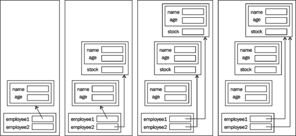
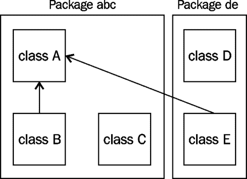

# 第七章遗传与多态性

在本章中，我们将研究 Java 如何支持几个重要的面向对象概念，包括继承和多态性。当我们想到“遗产”这个词时，我们会想到那位富有的叔叔，他将给我们留下他的巨额财产。或者我们说她有她母亲的眼睛。在编程术语中，我们讨论类以及它们之间的关系。术语“父类”和“子类”用于描述类之间的继承关系，其中类可以访问父类的功能。

### 注

有几个术语用于指定父类和子类。您可能会看到父类被称为超类或基类。子类可以称为子类或派生类。在本章中，我们将使用术语**基类**和**派生类**。

基类通常具有实现该类以及从该类派生的类所需的公共功能的方法。例如，我们可能有一个代表个人的*person*类。它可能有一些方法允许我们保留一个人的姓名或年龄。我们可以创建其他类来表示不同类型的人，如屠夫、面包师或蜡烛棒制造者。除了我们为*人员*类定义的能力之外，这些不同类型的人具有不同的能力。

例如，当我们实现一个 baker 时，该类可能有一个名为*cook*的方法，用于烹饪某些东西。然而，面包师仍然有名字和年龄。与其重新实现代码以支持修改姓名或年龄，我们更愿意重新使用为 person 类开发的代码。这样做的过程称为继承。

继承允许我们重用基类的功能。这反过来又促进了软件的重用，使开发人员的工作效率更高。

我们还将解释如何在 Java 中支持多态性。这个概念很重要，有助于使应用程序更易于维护。多态性是重写基类方法的结果。重写与重载类似，但它使用与基类方法相同的签名。

多态性经常与抽象类结合使用。抽象类是不能实例化的类。也就是说，不可能创建该类的实例。虽然我们不能创建抽象类的实例，但我们可以创建从抽象类派生的类的实例。此功能可以增强应用程序的结构。

继承需要调用基类的构造函数。我们将研究 Java 用来控制初始化序列的方法。此外，在某些情况下，确定类的类型并在继承层次结构的类之间进行强制转换的想法变得很重要。

本章讨论的最后一个主题与记忆的组织有关，因为它与继承有关。了解内存的组织和处理方式将加深您对该语言的理解，并有助于调试应用程序。

# 继承

继承与基类和派生类这两个类之间的关系有关。在本节中，我们将介绍以下内容：

*   实现子类
*   使用`protected`关键字
*   重载方法
*   使用`@Override`注释
*   在类中使用`final`关键字
*   创建抽象方法和类

*超级关键字和构造函数*部分介绍了构造函数和继承的使用。

发生继承时，派生类继承基类的所有方法和属性。但是，它只能访问类的公共成员和受保护成员。它无法访问类的私有成员。

当一个方法被添加到与基类方法具有相同签名和可访问性的派生类时，该方法被称为重写基类方法。这允许派生类重新定义该方法的含义。本章中的示例将使用从基类派生的`Employee`基类和`SalaryEmployee`类。

## 实现子类

一个类是通过使用`extends`关键字，后跟基类名实现的。在下面的示例中，定义了`Employee`基类：

```java
class Employee {
   // Implementation of Employee class
}
```

`SalaryEmployee`类可以从基类`Employee`派生，如下代码段所示：

```java
class SalaryEmployee extends Employee  {
   // Implementation of SalaryEmployee class
}
```

继承在 Java 库中广泛使用。例如，小程序是通过扩展`Applet`类创建的。

### 注

成为一名熟练的 Java 程序员的一个重要部分是学习查找、理解和使用与应用程序域相关的库中的类。

在下面的示例中，`HelloWorldApplet` 类扩展并继承了该类的所有方法和属性。在这种情况下，`paint`方法被`HelloWorldApplet`覆盖：

```java
import java.awt.Graphics;

public class HelloWorldApplet extends java.applet.Applet {

   public void paint (Graphics g) {
      g.drawString ("Hello World!", 5, 15);
   }

}
```

基类有一个或多个派生类是可能的，也是完全可取的。对于`Employee`基类，我们不仅可以创建`SalaryEmployee`类，还可以创建`HourlyEmployee`类。它们将共享基类的通用功能，但也包含自己独特的功能。

让我们更仔细地检查`Employee`基类和`SalaryEmployee`类。首先，让我们从更详细的类实现开始，如下面的代码片段所示：

```java
class Employee {
   private String name;
   private int zip;
   private int age;
   …

   public int getAge() {
      return age;
   }

   public void setAge(int age) {
      this.age = age;
   }

   …
}
```

在这个实现中，我们只包含了一个私有的`age`实例变量和一个 getter 和 setter 方法。在下面的`SalaryEmployee`类中，我们没有添加任何字段：

```java
class SalaryEmployee extends Employee  {
   // Implementation of SalaryEmployee class
}
```

然而，尽管我们没有向`SalaryEmployee`类添加任何新内容，但它具有基类的功能。按照以下顺序，我们创建两个类的实例并使用它们的方法：

```java
public static void main(String[] args) {
   Employee employee1 = new Employee();
   SalaryEmployee employee2 = new SalaryEmployee();

   employee1.setAge(25);
   employee2.setAge(35);

   System.out.println("Employee1 age: " +
      employee1.getAge());
   System.out.println("Employee2 age: " + 
      employee2.getAge());
}
```

执行代码时，我们得到以下输出：

```java
Employee1 age: 25
Employee2 age: 35

```

由于`getAge`和`setAge`方法是公开的，我们可以将它们与`SalaryEmployee`类一起使用，尽管我们还没有定义新版本。但是，如果我们试图访问 private`age`变量，如下面的代码段所示，我们将得到一个语法错误：

```java
employee2.age = 35;
```

生成的语法错误如下所示：

```java
age has private access in Employee

```

在*范围回顾*部分，我们将更深入地探讨范围界定和继承。

### 注

Java 不支持类之间的多重继承。也就是说，派生类不能扩展多个类。派生类只能扩展一个类。但是，Java 确实支持接口之间的多重继承。

## 使用受保护的关键字

在前面的示例中，我们确定无法从示例中的实例变量`employee2.age`访问私有成员。我们也不能从派生类的方法或构造函数访问它。在`SalaryEmployee`类的以下实现中，我们尝试在其默认构造函数中初始化`age`变量：

```java
public class SalaryEmployee extends Employee{

   public SalaryEmployee() {
      age = 35;
   }

}
```

语法错误如下所示：

```java
age has private access in Employee

```

但是，任何声明为公共的基类成员都可以从派生类的成员方法或构造函数访问，也可以通过引用派生类的实例变量访问。

有些情况下，成员变量应该可以从派生类构造函数或方法访问，但不能从其实例变量访问。我们可能希望将对成员的访问限制在比公共或私人更精细的级别。在`age`变量的情况下，我们可以信任派生类正确使用该变量，但我们可能不信任实例变量的用户。使用受保护的字段限制可以在应用程序中修改字段，并且可能引入潜在问题。

这就是受保护访问修饰符的作用。通过对基类成员使用关键字`protected`，我们限制对该成员的访问。它只能从基类内部或从派生类构造函数或方法中访问。

在`Employee`类的以下实现中，`age`变量被声明为受保护的：

```java
class Employee {
   protected int age;
   …

   public int getAge() {
      return age;
   }

   public void setAge(int age) {
      this.age = age;
   }

   …
}
```

`age`变量现在可以从`SalaryEmployee`类访问，如下所示，在该类中进行初始化：

```java
public SalaryEmployee() {
   age = 35;
}
```

此初始化不会生成语法错误。但是，我们仍然无法从实例引用变量访问`age`变量。假设语句所在的类与`SalaryEmployee`类不在同一个包中，下面的代码仍然会导致语法错误。这在*范围审查*一节中解释：

```java
employee2.age = 35;
```

`protected`关键字也可以与方法一起使用。它与方法一起使用，进一步增强了控制对类成员访问的能力。例如，`Employee`类的以下实现使用`protected`关键字和`setAge`方法：

```java
class Employee {
   protected int age;
   …

   public int getAge() {
      return age;
   }

   protected void setAge(int age) {
      this.age = age;
   }

   …
}
```

这意味着类的任何用户都可以使用`getAge`方法，但只有基类、同一包中的类或派生类可以访问`setAge`方法。

## 覆盖方法

虽然基类的方法可自动用于派生类，但对于派生类，实际实现可能不正确。【参考译文】考虑使用一种计算雇员工资的方法。`Employee`类中的`computePay`方法可能只返回基本金额，如下代码段所示：

```java
class Employee {
   private float pay = 500.0f;

   public float computePay() {
      return pay;
   }

  …
}
```

此示例基于 float 数据类型，它不一定是表示货币值的最佳数据类型。`java.math.BigDecimal`类更适合此用途。我们在这里使用 float 数据类型来简化示例。

但是，对于`HourlyEmployee`这样的派生类，`computePay`方法是不正确的。这种情况可以通过覆盖`computePay`方法来纠正，如以下简化的`HourlyEmployee`实现所示：

```java
public class HourlyEmployee extends Employee{
   private float hoursWorked;
   private float payRate;

   public HourlyEmployee() {
      this.hoursWorked = 40.0f;
      this.payRate = 22.25f;
   }

   public float computePay() {
      return hoursWorked * payRate;
   }

}
```

重写方法具有两个基本特征：

*   具有与基类方法相同的签名
*   在派生类中找到

类的签名由其名称、参数数量、参数类型和参数顺序组成。这将在[第 6 章](06.html "Chapter 6. Classes, Constructors, and Methods")的*签名*部分*类、构造函数和方法*中详细讨论。

重载和重写这两个术语很容易混淆。下表总结了这些术语之间的主要差异：

<colgroup><col style="text-align: left"> <col style="text-align: left"> <col style="text-align: left"></colgroup> 
| 

特征

 | 

超载

 | 

最重要的

 |
| --- | --- | --- |
| 方法名 | 相同的 | 相同的 |
| 签名 | 不同的 | 相同的 |
| 班 | 同级 | 在派生类中 |

让我们看看`computePay`方法的用法。在以下顺序中，`computePay`方法针对`employee1`和`employee3`实例变量执行：

```java
Employee employee1 = new Employee();
HourlyEmployee employee3 = new HourlyEmployee();

System.out.println("Employee1 pay: " + employee1.computePay());
System.out.println("Employee3 pay: " + employee3.computePay());
```

输出结果如下：

```java
Employee1 pay: 500.0
Employee3 pay: 890.0

```

`Employee`基类的`computePay`方法针对`employee1`参考变量执行，而`HourlyEmployee`的`computePay`方法针对`employee3`参考变量执行。**Java 虚拟机**（**JVM**决定在程序执行时使用哪种方法。这实际上是多态性行为的一个例子，我们将在*多态性*一节中介绍。

在更复杂的类层次结构中，中间类可能不会重写方法。例如，如果`SupervisorEmployee`类是从`SalaryEmployee`类派生的，`SalaryEmployee`类不需要实现`computePay`方法。`SupervisorEmployee`类可以重写`Employee`的`computePay`方法，不管它的直接基类是否重写了它。

## @Override 注释

一个 Java 语言设计问题涉及方法重写。问题是，由于方法声明中的一个简单错误，开发人员可能打算重写一个方法，但可能不会。但是，在以下覆盖`computePay`方法的尝试中，方法名称拼写错误：

```java
public float computPay() {
     return hoursWorked * payRate;
}
```

虽然该方法可能（也可能不是）明显拼写错误，但开发人员可能没有注意到错误。使用前面的示例：

```java
Employee employee1 = new Employee();
HourlyEmployee employee3 = new HourlyEmployee();

System.out.println("Employee1 pay: " + 
   employee1.computePay());
System.out.println("Employee3 pay: " + 
   employee3.computePay());
```

程序仍将执行，但不会生成预期输出，如下所示：

```java
Employee1 pay: 500.0
Employee3 pay: 500.0

```

请注意，在这两种情况下都使用了基类“`computePay`方法。这是因为调用了`computePay`方法，而不是拼写错误的`computPay`方法。由于`HourlyEmployee`类不再有`computePay`方法，JVM 使用基类方法。显然，这不是我们的初衷。

很难立即发现这些类型的错误。为了帮助防止这些类型的错误，我们可以使用`@Override`注释，方法如下：

```java
@Override
public float computPay() {
   return hoursWorked * payRate;
}
```

此注释通知编译器确保后面的方法实际重写基类方法。在本例中，由于方法的名称拼写错误，因此不会出现这种情况。发生这种情况时，将生成一个语法错误，表明存在问题。语法错误消息如下所示：

```java
method does not override or implement a method from a supertype

```

更正方法的拼写后，语法错误消息将消失。

正如名称 annotation 所暗示的，annotation 是一种向 Java 应用程序的某些部分添加附加信息的方法，这些信息可以在以后处理。对于编译时的`@Override`注释，进行检查以验证是否确实发生了重写。注释可以用于其他目的，例如将方法标记为已弃用。

### 提示

始终将`@Override`注释与重写的方法一起使用是一种很好的做法。

## 在类中使用 final 关键字

声明类时可以使用`public`、`abstract`和`final`关键字。`public`关键字指定了类的范围，这将在*范围回顾*一节中解释。`abstract`关键字的使用将在下一节*抽象方法和类*中介绍。当在`class`关键字之前使用`final`关键字时，表示该类不能扩展。它将是继承层次结构的该分支中的最后一个类。

在下面的示例中，`Employee`类被指定为最终类。虽然对于本章的示例来说，将`Employee`类设为 final 没有意义，但它确实说明了将类设为 final 所需的语法：

```java
final class Employee {
   …
}
```

通过限制其他类扩展一个类，可以确保该类的预期操作不会因派生类“重写基类方法”而受损。如果它得到了很好的实现，这将产生一个更可靠的基础来构建应用程序。

`java.lang.String`类是核心 JDK 中定义为 final 的类的一个示例。无法扩展此类或修改其行为。这意味着世界各地的开发人员可以使用该类，而不必担心无意中使用派生类而不是`String`类的可能性。

`final`关键字也可以与方法定义一起使用。在此上下文中使用时，意味着无法在派生类中重写该方法。这提供了比期末考试更大的灵活性。开发人员可以指定那些可以被重写的方法和那些不能被重写的方法。

下面说明了在`Employee`类中使`getAge`方法成为最终方法：

```java
public class Employee {
   ...
   public final int getAge() {
      return age;
   }
}
```

如果我们试图重写派生类（如`SalaryEmployee`类）中的方法，我们将得到以下错误消息：

```java
getAge() in SalaryEmployee cannot override getAge() in Employee
 overridden method is final

```

## 抽象方法和类

抽象类在面向对象继承层次结构的设计中非常有用。它们通常用于强制派生类实现一组特定的方法。基类和/或类的一个或多个方法声明为抽象。无法实例化抽象类。相反，非抽象类必须实现其层次结构树中的所有抽象方法（如果有的话）。

下面的示例说明了如何使`Employee`类抽象。在本例中，没有抽象方法，但使用了`abstract`关键字将类指定为抽象：

```java
public abstract class Employee {
   ...
}
```

由于`Employee`类没有抽象方法，所有派生类都不会被强制实现任何附加方法。上述定义实际上对本章前面的示例没有影响。

`Employee`类的下一个定义使`computePay`方法变得抽象。请注意，该方法没有正文，而是以分号结尾：

```java
public abstract class Employee {
   ...
   public abstract float computePay();
   ...
}
```

所有直接从`Employee`类派生的类都必须实现抽象方法，否则它们本身将变得抽象。如果他们选择不实现`computePay`方法，则必须将该类声明为抽象类。

当我们将一个方法声明为抽象时，我们被迫在类中使用`abstract`关键字。抽象类也可以拥有非抽象方法。

在复杂的层次结构中，您可能会发现非抽象类和抽象类的混合。例如，在`java.awt`包中，您会发现非抽象`Container`类扩展了扩展非抽象`Object`类的抽象`Component`类。抽象类可以在层次结构中的任何级别引入，以满足库的需要。

抽象类可以有 final 方法，但不能声明为 final。也就是说，`final`关键字不能用作抽象类或方法的修饰符。如果这是可能的，那么就不可能扩展类。因为它是抽象的，所以它永远不能被实例化，因此是无用的。但是，抽象类可以有 final 方法。这些方法必须在该抽象类中实现。该类仍然可以扩展，但不能重写最终的方法。

# 多态性

多态性是一个关键的面向对象编程概念，但最初很难理解。使用多态性的主要目的是使应用程序更易于维护。当我们谈到多态性时，我们通常说方法表现出多态行为。

### 注

如果一个方法的行为依赖于它所针对的对象，则称该方法为多态的。

假设我们想画点什么。每个类可能都有一个名为`draw`的方法，可以用来绘制自身。例如，circle 类可能有一个 draw 方法，该方法实际上将自身绘制为一个圆。person 类可能有一个 draw 方法，用于显示此人的图像。方法的签名是相同的。

因此，如果我们对具有相同最终基类的不同类别的不同对象应用`draw`方法，那么绘制结果将根据我们是对圆还是对人应用`draw`方法而有所不同。这就是多态行为。

通过将应用程序设计为使用多态性，我们可以添加具有 draw 方法的新类，并将它们集成到应用程序中，这比以前在非面向对象编程语言中可能实现的要容易得多。

创建对象实例时，对象会经历一系列初始化步骤，详见[第 6 章](06.html "Chapter 6. Classes, Constructors, and Methods")中的*Java 初始化序列*部分、*类、构造函数和方法*。这也适用于从基类派生的对象。Java 内存管理是动态和自动的。当使用`new`关键字时，它会自动从堆中分配内存。

在 Java 中，对基类及其派生类的引用可以分配给基类引用变量。这是可能的，因为为基类和派生类分配内存的方式。在派生类中，首先分配基类的实例变量，然后分配派生类的实例变量。当基类引用变量被分配给派生类对象时，它会看到它期望的基类实例变量加上“额外”的派生类实例变量。

让我们使用`Employee`和`SalaryEmployee`类的以下定义：

```java
public class Employee {
   private String name;
   private int age;

   ...

}

public class SalaryEmployee extends Employee {
   private float stock;
   …
}
```

在下面的示例中，从引用变量的角度来看，将`Employee`或`SalaryEmployee`对象分配给基类引用是有意义的，因为它希望看到实例变量`name`和`age`。我们可以为`employee`变量分配一个新的`Employee`对象，如下代码段所示：

```java
Employee employee;
employee = new Employee();
```

下图也说明了这一点：


我们还可以使用以下代码将新的`SalaryEmployee`对象分配给`employee`变量。请注意，在上图和本图中，`employee`参考变量依次指向`name`和`age`字段。`employee`参考变量需要一个`Employee`对象，该对象由`name`字段和`age`字段组成，这就是它所看到的：

```java
employee = new SalaryEmployee();
```

下图描述了该场景：


如果执行以下代码段，则基于`Employee`和`SalaryEmployee`类之前的声明，将执行`SalaryEmployee`的`computePay`方法，而不是`Employee`类的方法：

```java
Employee employee = new SalaryEmployee();
System.out.println(employee.computePay());
```

据说`computePay`方法相对于它所运行的对象而言是多态的。如果`computePay`方法运行在`Employee`对象上，则`Employee`的`computePay`方法将执行。

对派生对象的引用可以指定给该类的对象引用变量或该类的任何基类。通过下一个示例可以更好地理解多态行为的优势。这里，计算来自`employees`数组的所有员工工资的总和：

```java
Employee employees[] = new Employee[10];
float sum = 0;

// initialize array
employees[0] = new Employee();
employees[1] = new SalaryEmployee();
employees[2] = new HourlyEmployee();
...

for(Employee employee : employees) {
   sum += employee.computePay();
}
```

对数组的每个元素执行`computePay`方法。根据它所针对的对象，调用相应的`computePay`方法。如果一个新类是从`Employee`类派生的，比如`SalesEmployee`类，那么使求和过程正常工作所需的唯一修改就是向数组中添加一个`SalesEmployee`对象。不需要进行其他更改。结果是一个更易于维护和扩展的应用程序。

为派生类分配内存有助于解释多态性是如何工作的。我们可以将对`SalaryEmployee`的引用分配给`SalaryEmployee`引用变量或`Employee`引用变量。这在以下代码序列中进行了说明：

```java
Employee employee1 = new Employee();
SalaryEmployee employee2 = new SalaryEmployee();
employee1 = new SalaryEmployee();
employee1 = employee2;
```

以上所有转让均为合法转让。可以将派生类对象分配给基类引用变量，因为基类引用变量实际上指向其第一部分包含基类实例变量的内存。下图对此进行了说明，其中每个堆栈反映了四个赋值语句的累积效应：



请注意，应用程序不再引用某些对象。这些对象符合垃圾收集的条件。在某个时刻，如果需要，它们将返回到堆中。

# 管理类和对象

本节涉及与类和对象的一般管理相关的许多问题。它包括：

*   对象的创建和初始化
*   访问基类的方法
*   确定对象的类型
*   `Object`类的使用
*   铸造物体
*   控制类和成员的范围

## 超级关键字和构造函数

正如我们在[第 6 章](06.html "Chapter 6. Classes, Constructors, and Methods")中的*使用 this 关键字*部分*类、构造函数和方法*中所看到的，`this`关键字指的是当前对象。它可用于：

*   访问实例变量
*   将当前对象传递给方法
*   从方法返回当前对象

`super`关键字在派生类中以互补方式使用。它用于：

*   调用基类构造函数
*   访问基类中的重写方法

### 调用基类构造函数

让我们检查一下在调用基类构造函数中的用法。创建派生类对象时，通过调用其构造函数对其进行初始化。构造函数的使用在[第 6 章](06.html "Chapter 6. Classes, Constructors, and Methods")的*构造函数*部分*类、构造函数和方法*中进行了介绍。但是，在执行派生类构造函数之前，会调用基类构造函数。这导致基类在派生类之前被初始化。如果派生类在初始化序列中使用任何基类方法，这一点尤其重要。

基类的默认构造函数的调用会自动发生，除非我们使用`super`关键字调用另一个基类构造函数。下面是`Employee`类的一个实现，它定义了两个构造函数—一个默认构造函数和一个三参数构造函数：

```java
public class Employee {
   private String name;
   private int zip;
   private int age;
   ...

   public Employee() {
      this("Default name", 12345, 21);
   }

   public Employee(String name, int age, int zip) {
      this.name = name;
      this.zip = zip;
      this.age = age;
   }

   ...
}
```

注意使用`this`关键字的来调用三参数构造函数。下面是`SalaryEmployee`类的部分实现。仅定义了默认构造函数：

```java
public class SalaryEmployee extends Employee {
   private int age;
   …
   public SalaryEmployee() {
      age = 35;
   }
}
```

在本例中，`Employee`类的默认构造函数被自动调用。但是，我们可以通过使用`super`关键字后跟一组开括号和闭括号来明确此调用，如下所示：

```java
public SalaryEmployee() {
   super();
   age = 35;
}
```

在这两种情况下，`SalaryEmployee`对象中`Employee`基类的成员变量都按照基类构造函数中的指定进行初始化。

### 注

如果显式使用`super`关键字调用基类构造函数，则它必须是派生类构造函数的第一行。`this`关键字必须是构造函数中调用同一类的另一个构造函数的第一条语句。不能在同一个构造函数中使用这两个关键字来调用另一个构造函数。

但是，在某些情况下，我们可能希望调用一些构造函数，而不是默认的基类构造函数。为此，我们使用`super`关键字作为派生类构造函数中的第一个语句，并提供与另一个基类构造函数的参数匹配的参数列表。在下面的示例中，`SalaryEmployee`的四参数构造函数调用基类的三参数构造函数：

```java
public SalaryEmployee(String name, int age, int zip, 
         float stock) {
   super(name, age, zip);
   this.stock = stock;
}
```

如果我们不能选择基类构造函数，那么我们需要在基类的默认构造函数执行后显式调用适当的 setter 方法来初始化基类变量。以下代码段对此进行了说明：

```java
public SalaryEmployee(String name, int age, int zip, 
         float stock) {
   this.setName(name);
   this.setAge(age);
   this.setZip(zip);
   this.stock = stock;
}
```

这种方法不是首选方法。最好允许基类初始化自己的成员变量。派生类并不总是能够确定如何初始化它们，如果它们完全隐藏，派生类甚至可能不知道它们的存在。

### 注

如果构造函数调用基类方法，则这些方法应声明为 final。否则，重写它们的派生类可能会对初始化序列产生不利影响。

### 访问基类中被重写的方法

我们还可以使用`super`关键字访问基类方法的重写方法。例如，重写类的`toString`方法以返回表示该类实例的字符串总是一个好主意。下面的代码片段提供了`Employee`类的此方法的一个可能实现：

```java
public class Employee {
   …
   @Override
   public String toString() {
      return "Name: " + this.name +
             "  Age: " + this.age;
   }
}
```

`SalaryEmployee`类的一个实现如下面的代码片段所示，它使用基类 getter 方法返回名称和年龄：

```java
public class SalaryEmployee extends Employee {
   …
   @Override
   public String toString() {
      return "Name: " + this.getName() +
             "  Age: " + this.getAge() +
             "  Stock: " + this.stock;
   }
}
```

然而，这个实现很难实现，因为它需要调用 getter 方法。该方法的另一个问题是，每个派生类可能提供基类变量的不同表示，这可能会导致该方法用户的混淆。

理想情况下，在本例中，我们只需调用基类“`toString`方法即可获得基类的字符串表示形式。但是，从派生类的`toString`方法中调用`toString`方法会导致递归调用。也就是说，运行时系统认为我们正在调用当前方法。以下代码段对此进行了说明：

```java
public class SalaryEmployee extends Employee {
   …
   @Override
   public String toString() {
      // Results in a recursive call to the current method
      return toString() + "  Stock: " + this.stock;
   }
}
```

我们可以通过使用`super`关键字调用基类方法来避免这些问题。这是通过在基类方法的名称前面加上`super`关键字和句点来实现的，如下面的代码段所示：

```java
public class SalaryEmployee extends Employee {
   …
   @Override
   public String toString() {
      return super.toString() + "  Stock: " + this.stock;
   }
}
```

使用`super`关键字的效果在下一个代码序列中说明：

```java
   Employee employee1 = new Employee("Paula", 23, 12345);
   SalaryEmployee employee2 = 
      new SalaryEmployee("Phillip", 31, 54321, 32);

   System.out.println(employee1);
   System.out.println(employee2);
```

输出将如下所示：

```java
Name: Paula  Age: 23
Name: Phillip  Age: 31  Stock: 32.0

```

请注意，`toString`方法在`println`方法中没有显式调用。当在`print`或`println`方法中使用对象引用时，如果没有其他方法与引用变量一起使用，则自动调用`toString`方法。

与必须使用`super`关键字作为构造函数中调用基类构造函数的第一条语句不同，当用于调用派生类方法时，`super`关键字可以在任何地方使用。它不必在相同的重写方法中使用。

在下面的示例中，`display`方法调用基类的`toString`方法：

```java
public class SalaryEmployee extends Employee {
   …
   public void display() {
      System.out.println("Employee Base Data");
      System.out.println(super.toString());
      System.out.println("SalaryEmployee Data");
      System.out.println("Stock: " + this.stock);
    }
}
```

这里，针对`employee2`参考变量调用`display`方法：

```java
SalaryEmployee employee2 = new SalaryEmployee();
employee2.display();
```

结果如下：

```java
Employee Base Data
Name: Phillip  Age: 31
SalaryEmployee Data
Stock: 32.0

```

无法在当前基类之上调用基类方法。也就是说，假设继承层次结构为`Employee`–`SalaryEmployee`–`Supervisor`，则无法直接从`Supervisor`方法调用`Employee`类的基类方法。以下代码将导致语法错误消息：

```java
super.super.toString();  //illegal
```

## 确定对象的类型

有时了解对象的类很有用。有几种方法可以确定其类型。第一种方法是使用`Class`类获取类名。第二种方法是使用`instanceof`操作符。

实际上，Java 中有一个名为`Class`的类，它位于`java.lang`包中。它用于获取有关当前对象的信息。出于我们的目的，我们将使用它的`getName`方法返回类的名称。首先我们使用`getClass`方法获得`Class`的一个实例。此方法是`Object`类的成员。以下说明了这种方法：

```java
Employee employee1 = new Employee();
SalaryEmployee employee2 = new SalaryEmployee();

Class object = employee1.getClass();
System.out.println("Employee1 type: " + object.getName());
object = employee2.getClass();
System.out.println("Employee2 type: " + object.getName());
```

当执行这个序列时，我们得到以下输出。在本例中，类名以其包的名称作为前缀。为本书开发的所有课程都放在**包**包中：

```java
Employee1 type: packt.Employee
Employee2 type: packt.SalaryEmployee

```

虽然知道类的名称在某些情况下可能有用，`instanceof`运算符通常更有用。我们可以使用操作符来确定一个对象是否是类的实例。下面的示例演示了这一点，其中我们确定了`employee1`和`employee2`变量引用的类的类型：

```java
System.out.println("Employee1 is an Employee: " + (employee1 instanceof Employee));
System.out.println("Employee1 is a SalaryEmployee: " + (employee1 instanceof SalaryEmployee));   
System.out.println("Employee1 is an HourlyEmployee: " + (employee1 instanceofHourlyEmployee));  
System.out.println("Employee2 is an Employee: " + (employee2 instanceof Employee));
System.out.println("Employee2 is a SalaryEmployee: " + (employee2 instanceof SalaryEmployee)); 
```

此序列根据运算符的操作数显示真值或假值。结果如下：

```java
Employee1 is an Employee: true
Employee1 is a SalaryEmployee: false
Employee1 is an HourlyEmployee: false
Employee2 is an Employee: true
Employee2 is a SalaryEmployee: true

```

## 对象类

`Object`类在`java.lang`包中找到。这个类是所有 Java 类的最终基类。如果一个类没有显式扩展一个类，Java 将自动从`Object`类扩展该类。为了说明这一点，考虑下面的定义：

```java
public class Employee {
   // Implementation of Employee class
}
```

虽然我们没有显式扩展`Object`类，但它是从`Object`类扩展而来的。要验证这一点，请考虑下面的代码序列：

```java
Employee employee1 = new Employee();
System.out.println("Employee1 is an Object: " + (employee1 instanceof Object)); 
```

结果如下：

```java
Employee1 is an Object: true

```

`instanceof`操作符的应用确认`Employee`类最终是`Object`的对象。`Employee`类的上述定义具有与我们显式地从`Object`派生的相同的效果，如下面的代码片段所示：

```java
public class Employee extends Object  {
   // Implementation of Employee class
}
```

在 Java 中使用公共基类可以保证所有类都有公共方法。`Object`类拥有几种大多数类可能需要的方法，如下表所示：

<colgroup><col style="text-align: left"> <col style="text-align: left"></colgroup> 
| 

方法

 | 

意思

 |
| --- | --- |
| `clone` | 生成对象的副本。 |
| `equals` | 如果两个对象“相等”，则返回 true。 |
| `toString` | 返回对象的字符串表示形式。 |
| `finalize` | 在对象返回堆管理器之前执行。 |
| `getClass` | 返回一个`Class`对象，该对象提供有关对象的附加信息。 |
| `hashCode` | 返回对象的唯一哈希代码。 |
| `notify` | 用于线程管理。 |
| `notifyAll` | 也用于线程管理。 |
| `wait` | 线程管理中使用的重载方法。 |

### 提示

创建新类时，最好重写`toString`、`equals`和`hashCode`方法。

### 注

在克隆对象之前，其类必须实现`java.lang.Cloneable`接口。`clone`方法受保护。

## 铸造物

在 Java 中，我们可以将对象强制转换为不同的类，而不是原始对象的类。强制转换可以是层次链的上一级或下一级。当我们将派生类对象强制转换为基类引用变量时，它被称为**向上转换**。当我们将基类对象强制转换为派生类引用变量时，它被称为**向下转换**。让我们从以下声明开始，`Employee`是`SalaryEmployee`的基类：

```java
Employee employee1;
SalaryEmployee employee2;
```

下面的示例演示了向上转换。派生类的实例`SalaryEmployee`被分配给基类引用变量`employee1`。这是合法的，也是多态行为的重要组成部分：

```java
employee1 = new SalaryEmployee();
```

下一条语句尝试执行向下广播。正在将基类的实例分配给派生类引用变量。此语句将导致语法错误：

```java
employee2 = new Employee(); // Syntax error
```

但是，使用 cast 运算符可以避免语法错误，如下所示：

```java
employee2 = (SalaryEmployee) new Employee(); 
```

但是，在执行上述语句时会抛出一个`ClassCastException`异常，如下所示：

```java
java.lang.ClassCastException: packt.Employee cannot be cast to packt.SalaryEmployee

```

向上转换是可能的，因为派生对象包含基类拥有的所有内容，以及更多内容。向下投射不是一个好主意，因为引用变量期望对象具有比所提供的更多的功能。

注意，对于向上转换，引用变量可用的方法是基类的方法，而不是派生类的方法。即使引用变量指向派生类对象，它也只能使用基类方法，因为我们已经告诉 Java 编译器对象就是基类方法。下面的语句说明了这一点，其中我们尝试使用派生类“`setStock`方法：

```java
employee1.setStock(35.0f);
```

将为此语句生成以下语法错误：

```java
cannot find symbol
symbol:   method setStock(float)
 location: variable employee1 of type Employee

```

## 范围审查

范围是指变量可见且可访问时的。在前面的章节中，我们学习了如何使用`public`和`private`关键字来控制成员变量的范围。在本章的*使用受保护的关键字*部分，我们探讨了`protected`关键字是如何工作的。但是，成员变量的声明不需要使用这些关键字中的任何一个。当不使用修饰符时，变量声明称为**包私有**。顾名思义，变量的作用域仅限于同一包中的那些类。

当使用类定义时，我们还需要考虑使用 Type T0}关键字 AuthT1。如果一个类被声明为 public，那么它对所有类都是可见的。如果未使用声明，则其可见性仅限于当前包。据说该类具有包私有可见性。

### 注

`private`和`protected`关键字不能用于类定义，除非该类是内部类。内部类是在另一个类中声明的类。

下表总结了应用于类成员变量和方法的访问修饰符的范围：

<colgroup><col style="text-align: left"> <col style="text-align: left"> <col style="text-align: left"> <col style="text-align: left"> <col style="text-align: left"></colgroup> 
| 

修饰语

 | 

班

 | 

包裹

 | 

派生类

 | 

另外

 |
| --- | --- | --- | --- | --- |
| 平民的 |  |  |  |  |
| 私有的 |  |  |  |  |
| 受保护的 |  |  |  |  |
| 没有一个 |  |  |  |  |

让我们考虑下面的包/类安排，它提供了对范围规则的更详细的查看：



假设类`A`具有以下声明：

```java
public class A {
   public int v1;
   private int v2;
   protected int v3;
   int v4;
}
```

下表总结了这些声明的范围规则。这些规则适用于类`A`中声明的变量和方法。它与上表略有不同，因为它说明了派生类在不同包中的位置。因此，受保护行中的访问权限似乎与上一个表不同：

<colgroup><col style="text-align: left"> <col style="text-align: left"> <col style="text-align: left"> <col style="text-align: left"> <col style="text-align: left"> <col style="text-align: left"></colgroup> 
| 

变量

 | 

A.

 | 

B

 | 

C

 | 

D

 | 

E

 |
| --- | --- | --- | --- | --- | --- |
| `public int v1;` |  |  |  |  |  |
| `private int v2;` |  |  |  |  |  |
| `protected int v3;` |  |  |  |  |  |
| `int v4;` |  |  |  |  |  |

可能需要在其中一些类中声明类`A`的实例，以便访问`A`的实例变量。例如，在`D`类中，访问`A`类需要以下代码：

```java
A a = new A();
a.v1 = 35;
…
```

### 提示

一般来说，使用最有意义的限制性访问。这将通过避免意外访问成员导致意外后果的情况，提高应用程序的可靠性。

# 总结

在本章中，我们研究了 Java 定义的继承和多态行为。我们已经研究了如何在内存中分配对象，以便更全面地了解多态性和构造函数是如何工作的。`this`和`super`关键字在构造函数和派生类方法中的使用情况进行了检查。此外，还研究了抽象类以及它们对多态行为的影响。

涵盖了`protected`和`final`关键字。我们看到了`final`关键字如何影响继承和重写方法。`protected`关键字允许我们更好地控制对派生类中信息的访问。

讨论了类和对象的管理，包括在包中组织类以及如何使用`Class`类获取有关对象的信息。介绍了包保护成员的使用。此外，还涵盖了与类一起使用铸造。

在下一章中，我们将介绍异常处理这一重要主题。了解如何正确使用异常处理将使您能够创建更健壮和可维护的程序。

# 涵盖的认证目标

本章涉及的认证目标包括：

*   实现继承
*   开发演示多态性使用的代码
*   区分引用类型和对象类型
*   确定何时需要浇铸
*   使用`super`和`this`访问对象和构造函数
*   使用抽象类和接口

# 测试你的知识

1.  Which set of statements result in `ClassB` and `ClassC` being derived from `ClassA`?

    A.`class ClassB extends ClassA {}`

    B`class ClassB extends ClassC {}`

    C`class ClassA extends ClassB {}`

    D`class ClassC extends ClassB {}`

    E 任何组合都不起作用

2.  Which of the following must be true for a method to support polymorphism?

    A.该方法必须重写基类方法

    B 该方法必须重载基类方法

    C 方法的类必须扩展具有重写方法的基类

    D 该方法必须针对基类引用变量执行

3.  What method is used to determine the type of an object?

    A.`isType`

    B`typeOf`

    C`instanceof`

    D`instanceOf`

4.  Which of the following are valid casts?

    A.`num1 = num2;`

    B`num1 = (int)num2;`

    C`num1 = (float)num2;`

    D`num1(int) = num2;`

5.  Given the following class definitions:

    ```java
    public class ClassA {
       public ClassA() {
          System.out.println("ClassA constructor");
       }

       public void someMethod() {
          System.out.println("ClassA someMethod");
       }
    }

    class ClassB extends ClassA {
       public ClassB() {
          System.out.println("ClassB constructor");
       }

       public void someMethod() {
          // comment
          System.out.println("ClassB someMethod");
       }    
       public static void main(String args[]) {
          ClassB b = new ClassB();
          b.someMethod();

       }
    }
    ```

    注释行需要什么语句来生成以下输出：

    ```java
    ClassA constructor
    ClassB constructor
    ClassA someMethod
    ClassB someMethod
    ```

    A.`super();`

    B`super().someMethod;`

    C`super.someMethod();`

    D`someMethod();`

    E 以上都没有

6.  Which of the following statements are true?

    A.抽象类在声明时必须使用 abstract 关键字

    B 抽象类必须有一个或多个抽象方法

    C 抽象类不能扩展非抽象类

    D 抽象类不能实现接口