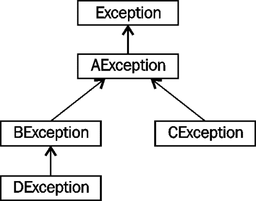

# 第 8 章处理应用程序中的异常

异常是应用程序或**Java 虚拟机****JVM**在发生某种错误时抛出的对象。Java 提供了一系列预定义的异常，并允许开发人员声明和创建自己的异常类。

虽然有许多方法可以对异常进行分类，但有一种方案将其分为三种类型：

*   程序错误
*   代码使用不当
*   资源相关故障

程序错误是代码序列中的内部缺陷。程序员可能会也可能不会对这些类型的错误做太多的处理。例如，常见的异常是`NullPointerException`。这通常是由于未正确初始化或为引用变量赋值造成的。在第一次编写代码时，这种类型的错误很难避免和预测。但是，一旦检测到，可以修改代码以纠正这种情况。

代码可能使用不当。大多数库都设计为以特定的方式使用。他们可能希望以一种方式组织数据，如果库的用户未能遵循该格式，则可能引发异常。例如，一个方法的参数可能没有按该方法预期的那样构造，或者可能是错误的类型。

某些错误与资源故障有关。当底层系统无法满足程序的需求时，可能会发生资源类型的异常。例如，网络故障可能会阻止程序正常执行。此类错误可能需要稍后重新执行程序。

处理异常的传统方法是从过程返回错误代码。例如，如果函数执行时没有错误，则通常可能返回零。如果没有发生错误，将返回一个非零值。这种方法的问题是调用函数可能：

*   不知道函数返回错误代码（例如，C 的`printf`函数）
*   忘记检查错误
*   完全忽略错误

当错误未被捕获时，程序的继续执行可能会导致不可预测的灾难性后果。

此方法的另一种替代方法是“捕获”错误。大多数现代块结构语言（如 Java）都使用这种方法。这种技术需要更少的编码，更具可读性和鲁棒性。当例程检测到错误时，它“抛出”异常对象。然后将异常对象返回给调用方，调用方随后捕获并处理错误。

出于多种原因，应捕获异常。未能处理异常可能会导致应用程序失败，或最终处于无效状态，输出不正确。保持一个一致的环境总是一个好主意。此外，如果您打开一个资源，如文件，则在完成时应始终关闭该资源，但最琐碎的程序除外。

Java 中可用的异常处理机制允许您这样做。打开资源时，即使程序中发生异常，也可以将其关闭。为完成此任务，资源在`try`块中打开，在`catch`或`finally`块中关闭。`try`、`catch`和`finally`块构成了 Java 中使用的异常处理机制的核心。

# 异常类型

Java 提供了一组广泛的类来支持 Java 中的异常处理。异常是直接或间接从`Throwable`类派生的类的实例。两个预定义的 Java 类派生自`Throwable`-`Error`和`Exception`。从`Exception`类派生出`RuntimeException`类。我们将很快看到，程序员定义的异常通常来自`Exception`类：


从`Error`和`RuntimeException`类派生出许多预定义错误。程序员几乎不会处理从`Error`对象派生的异常。这些异常表示 JVM 存在问题，通常无法恢复。`Exception`课程不同。`Exception`类派生的两个类支持两种类型的异常：

*   **勾选**：这些是异常，需要在代码中处理
*   **未选中**：这些异常不需要在代码中处理

选中的异常包括从`Exception`类派生的所有异常，而不是从`RuntimeException`类派生的所有异常。这些必须在代码中处理，否则代码将无法干净地编译，从而导致编译时错误。

未检查的异常是所有其他异常。它们包括例外情况，例如被零除和数组下标错误。这些不必被捕获，但与`Error`异常一样，如果它们没有被捕获，程序将终止。

我们可以创建自己的异常类。当我们这样做时，我们需要决定是创建一个选中的还是未选中的异常。一般的经验法则是，如果客户端代码无法从异常中恢复，则将异常声明为未经检查的异常。否则，如果他们能够处理它，则将其设置为选中异常。

### 注

类的用户不必解释未经检查的异常，如果客户端程序从未处理过这些异常，这些异常可能导致程序终止。选中的异常要求客户端捕获异常或显式地将其传递到调用层次结构。

# Java 中的异常处理技术

在处理 Java 中的异常时，我们可以使用三种通用技术：

*   传统`try`块
*   Java7 中引入了新的“try with resources”块
*   推卸责任

当当前方法不是处理异常的适当位置时，使用第三种技术。它允许将异常传播到更高的方法调用序列中。在下面的示例中，`anotherMethod`可能会遇到一些可能抛出`IOException`的情况。`someMethod`定义中的`throws`关键字不是处理`someMethod`中的异常，而是将异常传递给调用此方法的代码：

```java
public void someMethod() throws IOException {
   …
   object.anotherMethod(); // may throw an IOException
   …
}
```

该方法将跳过该方法中所有剩余的代码行，并立即返回给调用方。未捕获的异常会传播到下一个更高的上下文，直到它们被捕获或从`main`抛出，在`main`中将打印错误消息和堆栈跟踪。

## 堆栈跟踪

`printStackTrace`是`Throwable`类的一种方法，它将在程序中的该点显示程序堆栈。它在未捕获异常或可以显式调用异常时自动使用。方法的输出精确定位导致程序失败的行和方法。以前，每当您遇到未处理的运行时异常时，您都会看到此方法在运行。当未处理异常时，将自动调用该方法。

`ExceptionDemo`程序说明了该方法的明确使用：

```java
public class ExceptionDemo {

   public void foo3() {
      try {
         …
         throw new Exception();
      }
      catch (Exception e) {
         e.printStackTrace();
      }
   }

   public void foo2() { foo3(); }
   public void foo1() { foo2(); }

   public static void main(String args[]) {
      new ExceptionDemo().foo1();
   }
}
```

输出如下所示：

```java
java.lang.Exception
 at ExceptionDemo.foo3(ExceptionDemo.java:8)
 at ExceptionDemo.foo2(ExceptionDemo.java:16)
 at ExceptionDemo.foo1(ExceptionDemo.java:20)
 at ExceptionDemo.main(ExceptionDemo.java:25)

```

## 使用可丢弃的方法

`Throwable`类拥有许多其他方法，可以更深入地了解异常的性质。为了说明其中许多方法的使用，我们将使用以下代码序列。在此序列中，我们尝试打开一个不存在的文件并检查引发的异常：

```java
private static void losingStackTrace(){
   try {
      File file = new File("c:\\NonExistentFile.txt");
      FileReader fileReader = new FileReader(file);
   } 
   catch (FileNotFoundException e) {
      e.printStackTrace();

      System.out.println();
      System.out.println("---e.getCause(): " + 
                   e.getCause());
      System.out.println("---e.getMessage(): " + 
                   e.getMessage());
      System.out.println("---e.getLocalizedMessage(): " + 
                   e.getLocalizedMessage());
      System.out.println("---e.toString(): " + 
                   e.toString());
   }
}

```

由于某些 IDE 的性质，应用程序的标准输出和标准错误输出可以交错。例如，执行上述序列可能导致以下输出。您可能没有或可能在输出中看到交错。输出前面的破折号用于帮助查看交错行为：

```java
java.io.FileNotFoundException: c:\NonExistentFile.txt (The system cannot find the file specified)
---e.getCause(): null
---e.getMessage(): c:\NonExistentFile.txt (The system cannot find the file specified)
   at java.io.FileInputStream.open(Native Method)
---e.getLocalizedMessage(): c:\NonExistentFile.txt (The system cannot find the file specified)
---e.toString(): java.io.FileNotFoundException: c:\NonExistentFile.txt (The system cannot find the file specified)
   at java.io.FileInputStream.<init>(FileInputStream.java:138)
   at java.io.FileReader.<init>(FileReader.java:72)
   at packt.Chapter8Examples.losingStackTrace(Chapter8Examples.java:64)
   at packt.Chapter8Examples.main(Chapter8Examples.java:57)

```

下表总结了本示例中使用的方法：

<colgroup><col style="text-align: left"> <col style="text-align: left"></colgroup> 
| 

方法

 | 

意思

 |
| --- | --- |
| `getCause` | 返回异常的原因。如果无法确定，则返回 null。 |
| `getMessage` | 返回详细消息。 |
| `getLocalizedMessage` | 返回消息的本地化版本。 |
| `toString` | 返回消息的字符串版本。 |

注意，`printStackTrace`方法的第一行是`toString`方法的输出。

`getStackTrace`方法返回一个`StackTraceElement`对象数组，其中每个元素表示堆栈跟踪的一行。我们可以用以下代码序列复制`printStackTrace`方法的效果：

```java
try {
   File file = new File("c:\\NonExistentFile.txt");
   FileReader fileReader = new FileReader(file);
} 
catch (FileNotFoundException e) {
   e.printStackTrace();
   System.out.println();
   StackTraceElement traces[] = e.getStackTrace();
   for (StackTraceElement ste : traces) {
      System.out.println(ste);
   }
}
```

执行时，我们得到以下输出：

```java
java.io.FileNotFoundException: c:\NonExistentFile.txt (The system cannot find the file specified)
 at java.io.FileInputStream.open(Native Method)
 at java.io.FileInputStream.<init>(FileInputStream.java:138)
 at java.io.FileReader.<init>(FileReader.java:72)
 at packt.Chapter8Examples.losingStackTrace(Chapter8Examples.java:64)
 at packt.Chapter8Examples.main(Chapter8Examples.java:57)

java.io.FileInputStream.open(Native Method)
java.io.FileInputStream.<init>(FileInputStream.java:138)
java.io.FileReader.<init>(FileReader.java:72)
packt.Chapter8Examples.losingStackTrace(Chapter8Examples.java:64)
packt.Chapter8Examples.main(Chapter8Examples.java:57)

```

# 传统的试抓式拦网

处理异常的传统技术使用`try`、`catch`和`finally`块的组合。`try`块用于环绕可能引发异常的代码，后面是零个或多个`catch`块，然后是一个`finally`块（可选）。

在`try`块之后添加`catch`块以“捕获”异常。`catch`块中的语句提供了“处理”错误的代码块。`finally`子句可以选择在 catch 块之后使用。即使`try`或`catch`块中的代码抛出或未抛出异常，也保证执行。

### 注

但是，如果在 try 或 catch 块中调用了`System.exit`方法，那么 finally 块将不会执行。

以下顺序说明了这些块的使用。在 try 块中，读入一行并提取一个整数。两个 catch 块用于处理可能引发的异常：

```java
try {
   inString = is.readLine();
   value = Integer.parseInt (inString);
   …
} 
catch (IOException e) {
   System.out.println("I/O Exception occurred");
} 
catch (NumberFormatException e) {
   System.out.println("Bad format, try again...");
} 
finally {
   // Perform any necessary clean-up action
}

```

此代码序列中可能存在两种类型的错误之一：

*   尝试读取输入行或输入行时将发生错误
*   尝试将字符串转换为整数时将发生错误

第一个 catch 块将捕获 IO 错误，第二个 catch 块将捕获转换错误。当抛出异常时，只执行一个 catch 块。

错误可能会发生，也可能不会发生。无论如何，finally 块将在 try 块完成后或 catch 块执行后执行。`finally`子句保证运行，通常包含“清理”代码。

# 使用 try with 资源块

当打开多个资源并发生故障时，使用前面的技术可能会很麻烦。它可能导致多个 try-catch 块变得难以跟随。在 Java7 中，引入了 try with resources 块来解决这种情况。

try with resources 块的优点是，使用该块打开的所有资源在退出该块时都会自动关闭。与 try with resources 块一起使用的任何资源都必须实现接口`java.lang.AutoCloseable`。

我们将通过创建一个简单的方法将一个文件复制到另一个文件来说明这种方法。在下面的示例中，一个文件打开读取，另一个文件打开写入。注意它们是如何在`try`关键字和块的开放大括号之间创建的：

```java
try (BufferedReader reader = Files.newBufferedReader(
    Paths.get(new URI("file:///C:/data.txt")),
      Charset.defaultCharset());
    BufferedWriter writer = Files.newBufferedWriter(
      Paths.get(new URI("file:///C:/data.bak")),
      Charset.defaultCharset())) {

  String input;
  while ((input = reader.readLine()) != null) {
    writer.write(input);
    writer.newLine();
  }
} catch (URISyntaxException | IOException ex) {
  ex.printStackTrace();
}

```

要管理的资源在一组括号内声明和初始化，并放置在`try`关键字和 try 块的大括号之间。第一个资源是使用`data.txt`文件的`BufferedReader`对象，第二个资源是与`data.bak`文件一起使用的`BufferedWriter`对象。`Paths`类是 Java7 的新类，提供了改进的 IO 支持。

使用 try with Resources 块声明的资源必须用分号分隔，否则将生成编译时错误。关于 try with resources 块的更深入的介绍可以在 Java7 烹饪书中找到。

在 catch 块中使用垂直条对 Java7 来说是新的，它允许我们在单个 catch 块中捕获多个异常。这在*中解释，在捕捉块*中使用|运算符。

# 捕获语句

catch 语句只有一个参数。catch 语句将捕获异常，如果其参数：

*   与异常类型完全匹配
*   是异常类型的基
*   是异常类型实现的接口

只有与异常匹配的第一个 catch 语句才会执行。如果没有进行匹配，该方法将终止，异常将冒泡到调用方法，在那里可以处理它。

先前`try`块的一部分复制如下。`catch`语句的格式包括`catch`关键字，后跟一组包含异常声明的开括号和闭括号。在块语句中，括号集后面跟着零个或多个语句：

```java
try {
   …
} 
catch (IOException e) {
   System.out.println("I/O Exception occurred");
} 
catch (NumberFormatException e) {
   System.out.println("Bad format, try again...");
} 
```

处理错误的过程由程序员决定。它可能像显示错误消息一样简单，也可能相当复杂。程序员可以使用错误对象重试操作或以其他方式处理它。在某些情况下，这可能涉及将其传播回调用方法。

## 挡块顺序

在 try 块之后列出 catch 块的顺序可能很重要。抛出异常时，将按照列出的顺序将异常对象与 catch 块进行比较。比较检查抛出的异常是否是 catch 块中的异常类型。

例如，如果抛出一个`FileNotFoundException`，它将匹配具有`IOException`或`FileNotFoundException`异常的 catch 块，因为`FileNotFoundException`是`IOException`的子类型。由于在找到第一个匹配时停止比较，如果在`FileNotFoundException`的 catch 块之前列出了`IOException`的 catch 块，则将永远不会执行`FileNotFoundException`块。

考虑下面的异常类层次：



给定以下代码序列：

```java
try {
   …
}
catch (AException e) {…}
catch (BException e) {…}
catch (CException e) {…}
catch (DException e) {…}
```

如果抛出的异常属于这些类型的异常之一，`AException`catch 块将始终执行。这是因为`AException`、`BException`、`CException`或`DException`都是`AException`类型。异常将始终与`AException`异常匹配。其他`catch`块将永远不会执行。

一般规则总是先列出“最派生”的例外情况。以下是列出例外情况的正确方法：

```java
try {
   …
}
catch (DException e) {…}
catch (BException e) {…}
catch (CException e) {…}
catch (AException e) {…}
```

请注意，`BException`是否紧跟在`CException`之前，与此异常层次结构没有任何区别，因为它们处于同一级别。

## 在挡块中使用|运算符

有时，希望以相同的方式处理多个异常。我们可以使用垂直条来允许一个 catch 块捕获多个异常，而不是复制每个 catch 块中的代码。

考虑两个异常可能被抛出并以相同方式处理的情况：

```java
try {
   …
} 
catch (IOException e) {
   e.printStackTrace();
} 
catch (NumberFormatException e) {
   e.printStackTrace();
} 
```

垂直条可用于捕获同一`catch`语句中的两个或多个异常，如以下代码段所示。这可以减少处理两个以相同方式处理的异常所需的代码量。

```java
try {
   …
} 
catch (IOException | NumberFormatException e) {
   e.printStackTrace();
}
```

当可以以相同的方式处理多个异常时，这种方法可以工作。请记住，catch 块的参数是隐式的 final。无法为参数指定其他异常。以下尝试是非法的，无法编译：

```java
catch (IOException | NumberFormatException e) {
   e = new Exception();  // Compile time error
}
```

# 最后一个街区

`finally`块跟随一系列`catch`块，由`finally`关键字和语句块组成。它包含一个或多个语句，这些语句将始终被执行以清除以前的操作。无论是否存在异常，`finally`块将始终执行。但是，如果`try`或`catch`块调用`System.exit`方法，程序立即终止，`finally`块不执行。

`finally`块的用途是关闭或以其他方式处理`try`块中打开的任何资源。在资源已打开且不再需要后关闭它们始终是一种良好的做法。我们将在下一个示例中介绍这一点。

然而，在实践中，这通常是乏味的，并且如果需要关闭多个资源，而关闭过程也可能会生成异常，那么这很容易出错。此外，如果一个资源在打开时抛出异常，而另一个资源未打开，则必须小心不要尝试关闭第二个资源。因此，在 Java 7 中引入了 try with resources 块来解决这类问题。该块在*中使用 try with 资源块*部分进行了讨论。这里，我们将介绍`finally`块的简化用法。

使用`finally`块的简单示例如下所示。按照此顺序，我们将打开一个文件进行输入，然后显示其内容：

```java
BufferedReader reader = null;     
try {
   File file1 = new File("c:\\File1.txt");

   reader = new BufferedReader(new FileReader(file1));
   // Copy file
   String line;
   while((line = reader.readLine()) != null) {
      System.out.println(line);
   }
} 
catch (IOException e) {
   e.printStackTrace();
}
finally {
   if(reader != null) {
      reader.close();
   }
}
```

无论是否引发异常，文件都将关闭。如果文件不存在，将抛出一个`FileNotFoundException`。这将在`catch`块中捕获。注意我们是如何检查`reader`变量以确保它不为 null 的。

在下面的示例中，我们打开两个文件，然后尝试将一个文件复制到另一个文件。finally 块用于关闭资源。这说明了在处理多个资源时 finally 块的问题：

```java
BufferedReader br = null;
BufferedWriter bw = null;        
try {
   File file1 = new File("c:\\File1.txt");
   File file2 = new File("c:\\File2.txt");

   br = new BufferedReader(new FileReader(file1));
   bw = new BufferedWriter(new FileWriter(file2));
   // Copy file
} 
catch (FileNotFoundException e) {
   e.printStackTrace();
}
catch (IOException e) {
   e.printStackTrace();
}
finally {
   try {
      br.close();
      bw.close();
   } catch (IOException ex) {
      // Handle close exception
   }
}
```

注意，`close`方法也可能抛出一个`IOException`。我们还必须处理这些例外情况。这可能需要一个更复杂的异常处理序列，该序列可能容易出错。在这种情况下，请注意，如果在关闭第一个文件时引发异常，则不会关闭第二个文件。在这种情况下，最好使用 try with resources 块，正如在*使用 try with resources 块*一节中所讨论的那样。

### 提示

try 块需要 catch 块或 finally 块。如果没有一个或两个，将生成编译时错误。

# 嵌套的 try-catch 块

异常处理可以嵌套。当在同样引发异常的`catch`或`finally`块中使用方法时，这可能是必要的。以下说明了如何在`catch`块中使用嵌套的`try`块：

```java
try {
   // Code that may throw an exception
}
catch (someException e) {
   try {
      // Code to handle the exception
   }
   catch (anException e) {
      // Code to handle the nested exception
   } 
}
catch (someOtherException e) {
   // Code to handle the exception
} 
```

在上一节的最后一个示例中，我们在`finally`块中使用了`close`方法。但是，`close`方法可能抛出一个`IOException`。由于它是一个已检查的异常，我们需要捕获它。这导致`try`块嵌套在`finally`块内部。此外，当我们试图关闭`BufferedReader`时，第二个`try`块中将抛出一个`NullPointerException`，因为我们试图对从未赋值的`reader`变量执行 close 方法。

若要完成前面的示例，请考虑以下实现：

```java
finally {
   try {
      br.close();
      bw.close();
   } catch (IOException | NullPointerException e) {
       // Handle close exceptions
   }
   }
```

我们使用`|`条简化了两个异常的捕获，如*在 catch 块*部分中使用|运算符所述。这也是我们可能丢失原始异常的另一个示例。在这种情况下，`FileNotFoundException`丢失给了`NullPointerException`。这将在*丢失堆栈跟踪*部分讨论。

# 异常处理指引

本节介绍处理例外情况的一般准则。它旨在提供如何以更有用和更高效的方式使用异常处理的示例。虽然糟糕的技术可能不会导致编译时错误或错误的程序，但它们通常反映出糟糕的设计。

## 重复引发异常的代码

当抛出并捕获异常时，我们有时会尝试重新执行有问题的代码。如果代码结构正确，这并不困难。

在此代码序列中，当输入`try`块时，假定存在错误。如果生成错误，`catch`块将捕获并处理该错误。由于`errorsArePresent`仍然设置为 true，因此将重复 try 块。但是，如果没有发生错误，在 try 块的末尾，`errorsArePresent`标志被设置为 false，这将允许程序执行 while 循环并继续执行：

```java
boolean errorsArePresent;

…
errorsArePresent = true;	
while (errorsArePresent) {
   try {
      …
      errorsArePresent = false;
   } 

   catch (someException e) {
      // Process error
   } 

}
```

在此示例中，假设用于处理错误的代码需要重新执行`try`块。当我们在流程错误代码序列中所做的只是显示一条识别错误的错误消息时，例如当用户输入错误文件名时，可能就是这种情况。

如果所需的资源不可用，您需要小心使用此方法。这可能会导致一个无限循环，在这个循环中，我们检查一个不可用的资源，抛出一个异常，然后重新执行。可以添加循环计数器来指定尝试处理异常的次数。

## 未具体说明您正在捕获的异常

捕获异常时，请明确需要捕获的异常。例如，在下面的示例中，通用的`Exception`被捕获。没有任何特定信息可以揭示有关异常原因的更多有用信息：

```java
try {
   someMethod();
} catch (Exception e) {
   System.out.println("Something failed" + e);
}
```

下面是一个更有用的版本，它捕获实际抛出的异常：

```java
try {
   someMethod();
} catch (SpecificException e) {
   System.out.println("A specific exception message" + e);
}
```

## 丢失堆栈跟踪

有时会捕获一个异常，然后重新抛出另一个异常。考虑下面的方法，其中抛出一个异常 T0.异常：

```java
private static void losingStackTrace(){
   try {
      File file = new File("c:\\NonExistentFile.txt");
      FileReader fileReader = new FileReader(file);
   }
   catch(FileNotFoundException e) {
      e.printStackTrace();
   }
}
```

假设该文件不存在，将生成以下堆栈跟踪：

```java
java.io.FileNotFoundException: c:\NonExistentFile.txt (The system cannot find the file specified)
   at java.io.FileInputStream.open(Native Method)
   at java.io.FileInputStream.<init>(FileInputStream.java:138)
   at java.io.FileReader.<init>(FileReader.java:72)
   at packt.Chapter8Examples.losingStackTrace(Chapter8Examples.java:49)
   at packt.Chapter8Examples.main(Chapter8Examples.java:42)
```

我们可以知道确切的异常是什么以及它发生在哪里。接下来，考虑使用 AuthT0UR 类代替 OLE T1 异常：

```java
public class MyException extends Exception {
   private String information;

   public MyException(String information) {
      this.information = information;
   }
}
```

如果我们重新抛出异常，如以下代码段所示，我们将丢失有关原始异常的信息：

```java
private static void losingStackTrace() throws MyException {
   try {
      File file = new File("c:\\NonExistentFile.txt");
      FileReader fileReader = new FileReader(file);
   }
   catch(FileNotFoundException e) {
      throw new MyException(e.getMessage());
   }
}
```

此实现产生的堆栈跟踪如下所示：

```java
Exception in thread "main" packt.MyException
 at packt.Chapter8Examples.losingStackTrace(Chapter8Examples.java:53)
 at packt.Chapter8Examples.main(Chapter8Examples.java:42)

```

请注意，实际异常的详细信息已丢失。一般来说，最好不要使用这种方法，因为对于调试至关重要的信息丢失了。这个问题的另一个例子是在*嵌套的 try-catch 块*部分中发现的。

可以重新抛出并保留堆栈跟踪。为此，我们需要执行以下操作：

1.  添加一个以`Throwable`对象作为参数的构造函数。
2.  当我们想要保留堆栈跟踪时，请使用此选项。

下面显示了添加到`MyException`类中的此类构造函数：

```java
public MyException(Throwable cause) {
   super(cause);
}

```

在`catch`块中，我们将使用此构造函数，如下所示。

```java
catch (FileNotFoundException e) {
   (new MyException(e)).printStackTrace();
}
```

我们本可以抛出异常。相反，我们使用`printStackTrace`方法，如下所示：

```java
packt.MyException: java.io.FileNotFoundException: c:\NonExistentFile.txt (The system cannot find the file specified)
 at packt.Chapter8Examples.losingStackTrace(Chapter8Examples.java:139)
 at packt.Chapter8Examples.main(Chapter8Examples.java:40)
Caused by: java.io.FileNotFoundException: c:\NonExistentFile.txt (The system cannot find the file specified)
 at java.io.FileInputStream.open(Native Method)
 at java.io.FileInputStream.<init>(FileInputStream.java:138)
 at java.io.FileReader.<init>(FileReader.java:72)
 at packt.Chapter8Examples.losingStackTrace(Chapter8Examples.java:136)

```

## 范围和块长度

在`try`、`catch`或`finally`块中声明的任何变量的范围仅限于该块。尽可能地限制变量的范围是个好主意。在下面的示例中，有必要在 try 和 catch 块之外定义`reader`变量，因为在`finally`块中需要它：

```java
BufferedReader reader = null;
try {
   reader = …
   …
}
catch (IOException e) {
   …
} finally {
   try {
      reader.close();
   } 
   catch (Exception e) {
      …
   }
}
```

块的长度应受到限制。然而，太小的块可能会导致代码被异常处理代码弄得乱七八糟。让我们假设有四个方法，每个方法都可以抛出不同的异常。如果我们对每种方法使用单独的 try 块，我们将得到类似以下代码：

```java
try {
   method1();
}
catch (Exception1 e1) {
   …
} 
try {
   method2();
}

catch (Exception1 e2) {
   …
} 
try {
   method3();
}
catch (Exception1 e3) {
   …
} 
try {
   method4();
}
catch (Exception1 e4) {
   …
} 
```

这有点笨拙，如果每个`try`块都需要`finally`块，也会出现问题。如果逻辑上相关，更好的方法是使用单个`try`块，如下所示：

```java
try {
   method1();
   method2();
   method3();
   method4();
}
catch (Exception1 e1) {
   …
} 
catch (Exception1 e2) {
   …
} 
catch (Exception1 e3) {
   …
} 
catch (Exception1 e4) {
   …
} 

finally {
      …
}

```

根据异常的性质，我们还可以使用公共基类异常，或者，如 Java7 中介绍的，我们可以使用带有单个 catch 块的`|`操作符。如果可以以相同的方式处理异常，则这一点特别有用。

但是，将方法的整个主体放在包含与异常无关的代码的 try/catch 块中是一种不好的做法。如果可能，最好将异常处理代码与非执行处理代码分开。

一般的经验法则是将异常处理代码的长度保持在一次可以看到的大小。使用多个 try 块是完全可以接受的。但是，请确保每个块都包含逻辑上相关的操作。这有助于模块化代码并使其更具可读性。

## 抛出不支持的 OperationException 对象

打算被重写的方法有时会返回一个“无效”值，以指示需要实现该方法。例如，在以下代码序列中，`getAttribute`方法返回`null`：

```java
class Base {
   public String getAttribute() {
      return null;
   }
   …
}
```

但是，如果未重写该方法且使用基类方法，则如果针对返回值执行方法，则可能会导致错误结果或生成`NullPointerException`等问题。

一个更好的方法是抛出一个`UnsupportedOperationException`来表示方法功能尚未实现。这在以下代码序列中进行了说明：

```java
class Base {
   public String getAttribute() {
      throw new UnsupportedOperationException();
   }
   …
}
```

在提供有效的实现之前，无法成功使用该方法。这种方法在 JavaAPI 中经常使用。`java.util.Collection`类的`unmodifiableList`方法使用了这种技术（[http://docs.oracle.com/javase/1.5.0/docs/api/java/util/Collections.html#unmodifiableList%28java.util.List%29](http://docs.oracle.com/javase/1.5.0/docs/api/java/util/Collections.html#unmodifiableList%28java.util.List%29) ）。通过将方法声明为抽象，可以实现类似的效果。

## 忽略异常

忽略例外情况通常是一种不好的做法。它们被抛出是有原因的，如果你可以做些什么来恢复，那么你应该处理它。否则，您至少可以优雅地终止应用程序。

例如，通常忽略一个`InterruptedException`，如以下代码片段所示：

```java
while (true) {
   try {
      Thread.sleep(100000);
   } 
   catch (InterruptedException e) {
      // Ignore it
   }
}
```

然而，即使在这里，也出现了一些问题。例如，如果线程是线程池的一部分，则该池可能正在终止，您应该处理此事件。始终了解程序运行的环境，并预料到意外情况。

下面的代码片段显示了错误处理不佳的另一个示例。在本例中，我们忽略可能引发的`FileNotFoundException`异常：

```java
private static void losingStackTrace(){
   try {
      File file = new File("c:\\NonExistentFile.txt");
      FileReader fileReader = new FileReader(file);
   }
   catch(FileNotFoundException e) {
      // Do nothing
   }
}
```

此用户不知道曾经遇到过异常。这很少是一种可接受的方法。

## 尽可能晚地处理异常

当一个方法抛出异常时，该方法的用户可以在该点处理该异常，也可以将异常沿着调用序列传递给另一个方法。诀窍是在适当的级别处理异常。该级别通常是可以处理异常的级别。

例如，如果需要应用程序用户的输入才能成功处理异常，则应使用最适合与用户交互的级别。如果该方法是库的一部分，那么假设应该提示用户可能不合适。当我们试图打开一个文件而该文件不存在时，我们不希望或希望调用的方法提示用户输入其他文件名。相反，我们更倾向于自己动手。在某些情况下，甚至可能没有用户提示，就像许多服务器应用程序一样。

## 一个街区抓的太多

当我们向应用程序添加 catch 块时，我们经常试图通过使用基类异常类来捕获它们，从而使用最少数量的 catch 块。下面说明了 catch 块使用`Exception`类捕获多个异常的情况。在这里，我们假设可以抛出多个已检查异常并需要处理：

```java
try {
   …
}
catch (Exception e) {
   …
} 
```

如果它们都以完全相同的方式处理，这可能没问题。然而，如果它们在处理方式上存在差异，那么我们需要包括额外的逻辑来确定实际发生了什么。如果我们忽略这些差异，那么任何调试过程都会变得更加困难，因为我们可能丢失了有关异常的有用信息。此外，这种方法不仅过于粗糙，而且我们还捕获了我们可能无法处理的所有`RuntimeException`。

相反，通常最好在它们自己的 catch 块中捕获多个异常，如以下代码段所示：

```java
try {
   …
}
catch (Exception1 e1) {
   …
} 
catch (Exception1 e2) {
   …
} 
catch (Exception1 e3) {
   …
} 
catch (Exception1 e4) {
   …
} 
```

## 日志记录异常

通常的做法是记录异常，即使它们已成功处理。这在评估应用程序的行为时非常有用。当然，如果我们无法处理异常，需要优雅地终止应用程序，那么错误日志在确定应用程序中出现了什么错误时非常有用。

### 注

只记录一次异常。多次记录可能会使试图查看发生了什么并创建比需要大的日志文件的人感到困惑。

## 不要使用异常来控制正常的逻辑流

在应该执行验证的地方使用异常是一种糟糕的做法。此外，引发异常会占用额外的资源。例如，`NullPointerException`是一个常见的异常，当一个方法试图针对一个分配了空值的引用变量执行时，会产生这种异常。我们不应该捕获此异常，而应该检测此情况并按正常逻辑顺序处理它。请考虑下面的问题：

```java
String state = ...  // Somehow assigned a null value
try {
   if(state.equals("Ready") { … }
}
catch(NullPointerException e) {
   // Handle null state
}
```

相反，我们应该在使用状态变量之前检查其值：

```java
String state = ...  // Somehow assigned a null value

if(state != null) {
   if(state.equals("Ready") { … }
} else {
   // Handle null state
}
```

对`try`块的需求完全消除了。另一种方法使用短路，如以下代码片段所示，并在[第 3 章](03.html "Chapter 3. Decision Constructs")*决策构造*的*短路评估*部分中介绍。如果`state`变量为空，则避免使用`equals`方法：

```java
String state = ...  // Somehow assigned a null value

if(state != null && state.equals("Ready") { 
   // Handle ready state
} else {
   // Handle null state
}
```

## 不要试图处理未检查的异常

处理未经检查的异常通常是不值得的。其中大多数都超出了程序员的控制范围，需要付出巨大的努力才能从中恢复。例如，`ArrayIndexOutOfBoundsException`虽然是编程错误的结果，但在运行时不容易处理。假设修改数组索引变量是可行的，那么可能不清楚应该给它分配什么新值，或者如何重新执行有问题的代码序列。

### 注

永远不要捕捉`Throwable`或`Error`异常。这些都不应该被处理或压制。

# 总结

程序中适当的异常处理将增强其健壮性和可靠性。`try`、`catch`和`finally`块可用于在应用程序内实现异常处理。在 Java7 中，添加了 try with resources 块，它更容易处理资源的打开和关闭。还可以传播异常以备份调用序列。

我们了解到，为了正确处理异常，catch 块的顺序非常重要。此外，`|`操作符可以在 catch 块中使用，以相同的方式处理多个异常。

异常处理可以嵌套以解决 catch 或 finally 块中的代码也可能引发异常的问题。当这种情况发生时，程序员需要小心确保以前的异常不会丢失，并且新的异常会得到适当的处理。

我们还解决了处理异常时可能出现的一些常见问题。他们提供了避免结构不良和容易出错的代码的指导。其中包括在异常发生时不忽略异常以及在适当级别处理异常。

现在我们已经了解了异常处理过程，我们准备在下一章中总结 Java 认证目标。

# 涵盖的认证目标

本章涵盖的认证目标包括：

*   描述 Java 中使用的异常
*   区分已检查异常、运行时异常和错误
*   创建一个 try-catch 块并确定异常如何改变正常的程序流
*   调用引发异常的方法
*   识别常见的异常类和类别

# 测试你的知识

1.  Which of the following implement checked exceptions?

    A.`Class A extends RuntimeException`

    B`Class A extends Throwable`

    C`Class A extends Exception`

    D`Class A extends IOException`

2.  Given the following set of classes:

    `class Exception A extends Exception {}`

    `class Exception B extends A {}`

    `class Exception C extends A {}`

    `class Exception D extends C {}`

    以下`try`块的捕捉块的正确顺序是什么：

    ```java
    try {
       // method throws an exception of the above types
    }
    ```

    A.捕获`A`、`B`、`C`和`D`

    B 捕获`D`、`C`、`B`和`A`

    C 捕获`D`、`B`、`C`和`A`

    D 捕获`C`、`D`、`B`和`A`

3.  Which of the following statements are true?

    A.选中的异常是从`Error`类派生的异常。

    B 检查异常通常应被忽略，因为我们无法处理它们。

    C 必须重新抛出选中的异常。

    D 应在调用堆栈中的适当方法处处理选中的异常。

4.  When a method throws a checked exception which of the following are valid responses?

    A.将该方法放置在 try-catch 块中。

    B 不要使用这些类型的方法。

    C 不做任何事情，因为我们通常无法处理已检查的异常。

    D 在调用此方法的方法上使用`throws`子句。

5.  What exceptions may the following code generate at runtime?

    ```java
    String s;
    int i = 5;
    try{
       i = i/0;
       s += "next";
    }
    ```

    A.`ArithmeticException`

    B`DivisionByZeroException`

    C`FileNotFoundException`

    D`NullPointerException`