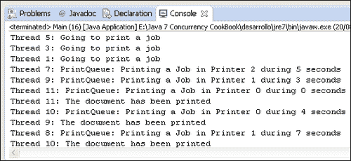
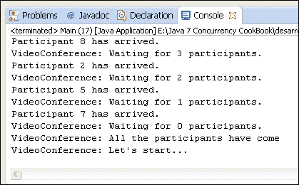
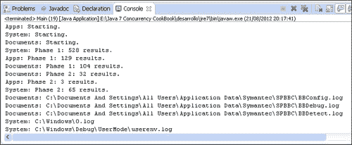
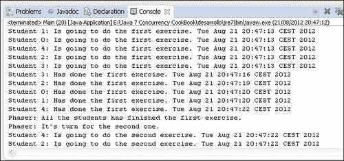

# 第三章线程同步实用程序

在本章中，我们将介绍：

*   控制对资源的并发访问
*   控制对资源的多个副本的并发访问
*   等待多个并发事件
*   在公共点中同步任务
*   运行并发分阶段任务
*   控制并发阶段性任务中的阶段变化
*   在并发任务之间更改数据

# 导言

在[第 2 章](2.html "Chapter 2. Basic Thread Synchronization")*基本线程同步*中，我们学习了同步和临界段的概念。基本上，当多个并发任务共享一个资源（例如，对象或对象的属性）时，我们讨论同步。访问此共享资源的代码块称为关键部分。

如果不使用适当的机制，可能会出现错误的结果、数据不一致或错误情况，因此我们必须采用 Java 语言提供的一种同步机制来避免所有这些问题。

[第 2 章](2.html "Chapter 2. Basic Thread Synchronization")*基本线程同步*向我们介绍了以下基本同步机制：

*   `synchronized`关键字
*   `Lock`接口及其实现类：`ReentrantLock`、`ReentrantReadWriteLock.ReadLock`、`ReentrantReadWriteLock.WriteLock`

在本章中，我们将学习如何使用高级机制实现多线程的同步。这些高级别机制如下：

*   **信号量**：信号量是控制访问一个或多个共享资源的计数器。这种机制是并发编程的基本工具之一，由大多数编程语言提供。
*   **倒计时闩锁**：`CountDownLatch`类是 Java 语言提供的一种机制，允许线程等待多个操作的完成。
*   **CyclicBarrier**：`CyclicBarrier`类是 Java 语言提供的另一种机制，允许在一个公共点上同步多个线程。
*   **Phaser**：`Phaser`类是 Java 语言提供的另一种机制，用于控制分阶段执行的并发任务。所有线程必须先完成一个阶段，然后才能继续下一个阶段。这是 Java7API 的一个新特性。
*   **交换机**：`Exchanger`类是 Java 语言提供的另一种机制，提供两个线程之间的数据交换点。

信号量是一种通用的同步机制，您可以使用它来保护任何问题中的任何关键部分。其他机制被认为用于具有特定功能的应用程序中，如前所述。请确保根据应用程序的特点选择适当的机制。

本章介绍七种配方，向您展示如何使用所描述的机制。

# 控制对资源的并发访问

在本食谱中，您将学习如何使用 Java 语言提供的信号量机制。信号量是一个计数器，用于保护对一个或多个共享资源的访问。

### 注

信号量的概念由 Edsger Dijkstra 于 1965 年引入，并首次在 THEOS 操作系统中使用。

当线程想要访问其中一个共享资源时，首先，它必须获取信号量。如果信号量的内部计数器大于`0`，则信号量将计数器递减，并允许访问共享资源。大于`0`的计数器意味着可以使用空闲资源，因此线程可以访问和使用其中的一个。

否则，如果该信号量的计数器为`0`，则该信号量使线程进入睡眠状态，直到计数器大于`0`。计数器中的值`0`表示所有共享资源都被其他线程使用，因此想要使用其中一个资源的线程必须等待一个线程空闲。

当线程完成共享资源的使用后，它必须释放信号量，以便其他线程可以访问共享资源。该操作增加信号量的内部计数器。

在本教程中，您将学习如何使用`Semaphore`类实现称为**二进制信号量**的特殊类型的信号量。这些类型的信号量保护对唯一共享资源的访问，因此信号量的内部计数器只能接受值`1`或`0`。为了演示如何使用它，您将实现一个打印队列，并发任务可以使用该队列打印其作业。这个打印队列将受到二进制信号量的保护，因此一次只能打印一个线程。

## 准备好了吗

此配方的示例已使用 EclipseIDE 实现。如果您使用 Eclipse 或其他 IDE（如 NetBeans），请打开它并创建一个新的 Java 项目。

## 怎么做。。。

按照以下步骤来实现该示例：

1.  创建一个名为`PrintQueue`的类，该类将实现打印队列。

    ```java
    public class PrintQueue {
    ```

2.  声明一个`Semaphore`对象。叫它`semaphore`。

    ```java
      private final Semaphore semaphore;
    ```

3.  实现类的构造函数。它初始化将保护打印队列访问权限的`semaphore`对象。

    ```java
      public PrintQueue(){
        semaphore=new Semaphore(1);
      }
    ```

4.  实现模拟文档打印的`printJob()`方法。它接收被调用的`Object`作为参数。

    ```java
      public void printJob (Object document){
    ```

5.  在方法内部，首先必须获取调用`acquire()`方法的信号量。这个方法可以抛出一个`InterruptedException`异常，所以您必须包含一些代码来处理它。

    ```java
        try {
          semaphore.acquire();
    ```

6.  然后，实现模拟等待随机时间段的文档打印的行。

    ```java
      long duration=(long)(Math.random()*10);
          System.out.printf("%s: PrintQueue: Printing a Job during %d seconds\n",Thread.currentThread().getName(),duration);
          Thread.sleep(duration);    
    ```

7.  最后，通过调用信号量的`release()`方法释放信号量。

    ```java
        } catch (InterruptedException e) {
          e.printStackTrace();
        } finally {
          semaphore.release();      
        }
    ```

8.  创建一个名为`Job`的类，并指定它实现`Runnable`接口。此类实现将文档发送到打印机的作业。

    ```java
    public class Job implements Runnable {
    ```

9.  声明一个`PrintQueue`对象。叫它`printQueue`。

    ```java
      private PrintQueue printQueue;
    ```

10.  实现类的构造函数。它初始化类中声明的`PrintQueue`对象。

    ```java
      public Job(PrintQueue printQueue){
        this.printQueue=printQueue;
      }
    ```

11.  执行`run()`方法。

    ```java
      @Override
       public void run() {
    ```

12.  首先，该方法向控制台写入一条消息，显示作业已开始执行。

    ```java
        System.out.printf("%s: Going to print a job\n",Thread.currentThread().getName());
    ```

13.  然后调用`PrintQueue`对象的`printJob()`方法。

    ```java
        printQueue.printJob(new Object());
    ```

14.  最后，该方法向控制台写入一条消息，表明其已完成执行。

    ```java
        System.out.printf("%s: The document has been printed\n",Thread.currentThread().getName());        
      }
    ```

15.  通过创建一个名为`Main`的类来实现示例的主类，并实现`main()`方法。

    ```java
    public class Main {

      public static void main (String args[]){
    ```

16.  创建一个名为`printQueue`的`PrintQueue`对象。

    ```java
        PrintQueue printQueue=new PrintQueue();
    ```

17.  创建 10 个线程。这些线程中的每一个都将执行一个`Job`对象，该对象将向打印队列发送一个文档。

    ```java
        Thread thread[]=new Thread[10];
        for (int i=0; i<10; i++){
          thread[i]=new Thread(new Job(printQueue),"Thread"+i);
        }
    ```

18.  最后，启动 10 个线程。

    ```java
        for (int i=0; i<10; i++){
          thread[i].start();
        }
    ```

## 它是如何工作的。。。

这个示例的关键在于`PrintQueue`类的`printJob()`方法。此方法显示了使用信号量实现关键部分并保护对共享资源的访问时必须遵循的三个步骤：

1.  首先，使用`acquire()`方法获取信号量。
2.  然后，使用共享资源执行必要的操作。
3.  最后，使用`release()`方法释放信号量。

本例中的另一个要点是`PrintQueue`类的构造函数和`Semaphore`对象的初始化。您将值`1`作为此构造函数的参数传递，因此您正在创建一个二进制信号量。内部计数器的初始值为`1`，因此您将保护对一个共享资源的访问，在本例中为打印队列。

当您启动 10 个线程时，第一个线程获取信号量并获得对关键部分的访问权。其余的被信号量阻塞，直到获取它的线程释放它。当这种情况发生时，信号量选择一个等待的线程，并允许它访问关键部分。所有的工作都打印他们的文档，但是一个接一个。

## 还有更多。。。

`Semaphore`类有`acquire()`方法的两个附加版本：

*   `acquireUninterruptibly()`：采用`acquire()`方法；当信号量的内部计数器为`0`时，阻塞线程，直到信号量释放。在此阻塞时间内，线程可能被中断，然后此方法抛出一个`InterruptedException`异常。此版本的 acquire 操作忽略线程的中断，并且不会引发任何异常。
*   `tryAcquire()`：此方法尝试获取信号量。如果可以，该方法返回`true`值。但如果不能，该方法将返回`false`值，而不是被阻止，并等待信号量的释放。您有责任根据`return`值采取正确的行动。

### 信号量的公平性

公平性的概念由 Java 语言在所有类中使用，这些类可以阻止各种线程等待同步资源（例如，信号量）的释放。默认模式称为**非公平模式**。在这种模式下，当同步资源被释放时，将选择一个等待线程来获取该资源，但选择它时没有任何条件。**公平模式**改变此行为，并强制选择等待时间更长的线程。

与其他类一样，`Semaphore`类在其构造函数中允许第二个参数。此参数必须采用`Boolean`值。如果您给它`false`值，那么您正在创建一个信号量，它将在非公平模式下工作。如果不使用此参数，将得到相同的行为。如果您给它`true`值，那么您正在创建一个信号量，它将在公平模式下工作。

## 另见

*   [第 8 章](8.html "Chapter 8. Testing Concurrent Applications")*测试并发应用*中的*监控锁接口*配方
*   [第 2 章](2.html "Chapter 2. Basic Thread Synchronization")*基本线程同步*中的*修改锁公平性*配方

# 控制对资源多个副本的并发访问

在*控制对资源*的并发访问配方中，您学习了信号量的基础。

在这个配方中，您使用二进制信号量实现了一个示例。这些类型的信号量用于保护对一个共享资源或一次只能由一个线程执行的关键部分的访问。但是，当您需要保护资源的各种副本时，或者当您有一个可以由多个线程同时执行的关键部分时，也可以使用信号量。

在本教程中，您将学习如何使用信号量保护资源的多个副本。您将实现一个示例，其中有一个打印队列，可以在三台不同的打印机中打印文档。

## 准备好了吗

此配方的示例已使用 EclipseIDE 实现。如果您使用 Eclipse 或其他 IDE（如 NetBeans），请打开它并创建一个新的 Java 项目。

实现本章*控制对资源*配方的并发访问中描述的示例。

## 怎么做。。。

按照以下步骤来实现该示例：

1.  正如我们前面提到的，您将修改用信号量实现的打印队列示例。打开`PrintQueue`类并声明一个名为`freePrinters`的`boolean`数组。此阵列存储可自由打印作业的打印机和正在打印文档的打印机。

    ```java
      private boolean freePrinters[];
    ```

2.  另外，声明一个名为`lockPrinters`的`Lock`对象。您将使用此对象来保护对`freePrinters`阵列的访问。

    ```java
      private Lock lockPrinters;
    ```

3.  修改类的构造函数以初始化新声明的对象。`freePrinters`数组有三个元素，都初始化为`true`值。信号量的初始值为`3`。

    ```java
      public PrintQueue(){
        semaphore=new Semaphore(3);
        freePrinters=new boolean[3];
        for (int i=0; i<3; i++){
          freePrinters[i]=true;
        }
        lockPrinters=new ReentrantLock();
      }
    ```

4.  同时修改的`printJob()`方法。它接收一个名为`document`的`Object`作为唯一参数。

    ```java
      public void printJob (Object document){
    ```

5.  首先，该方法调用`acquire()`方法获取对信号量的访问权。由于此方法可能引发`InterruptedException`异常，因此必须包含处理该异常的代码。

    ```java
        try {
          semaphore.acquire();
    ```

6.  然后，您可以使用专用方法`getPrinter()`获取分配用于打印此作业的打印机的编号。

    ```java
          int assignedPrinter=getPrinter();
    ```

7.  然后，实现模拟等待随机时间段的文档打印的行。

    ```java
          long duration=(long)(Math.random()*10);
          System.out.printf("%s: PrintQueue: Printing a Job in Printer%d during %d seconds\n",Thread.currentThread().getName(),assignedPrinter,duration);
          TimeUnit.SECONDS.sleep(duration);
    ```

8.  最后，释放调用`release()`方法的信号量，将使用的打印机标记为空闲，将`true`分配给`freePrinters`数组中相应的索引。

    ```java
          freePrinters[assignedPrinter]=true;
        } catch (InterruptedException e) {
          e.printStackTrace();
        } finally {
          semaphore.release();      
        }
    ```

9.  执行`getPrinter()`方法。它是一个私有方法，返回一个`int`值，并且没有参数。

    ```java
      private int getPrinter() {
    ```

10.  首先，声明一个`int`变量来存储打印机的索引。

    ```java
        int ret=-1;
    ```

11.  然后，获得对`lockPrinters`对象的访问权。

    ```java
        try {
          lockPrinters.lock();
    ```

12.  然后，在`freePrinters`数组中找到第一个`true`值，并将其索引保存在变量中。将此值修改为`false`，因为此打印机将忙。

    ```java
        for (int i=0; i<freePrinters.length; i++) {
          if (freePrinters[i]){
            ret=i;
            freePrinters[i]=false;
            break;
          }
        }
    ```

13.  最后，释放`lockPrinters`对象并返回`true`值的索引。

    ```java
        } catch (Exception e) {
          e.printStackTrace();
        } finally {
          lockPrinters.unlock();
        }
        return ret;
    ```

14.  `Job`和`Core`类没有修改。

## 它是如何工作的。。。

本例的键在`PrintQueue`类中。`Semaphore`对象是使用`3`作为构造函数的参数创建的。调用`acquire()`方法的前三个线程将获得对本例关键部分的访问，而其余线程将被阻止。当一个线程完成关键部分并释放信号量时，另一个线程将获取它。

在此关键部分中，线程获取分配用于打印此作业的打印机的索引。示例的这一部分用于使示例更加真实，但它不使用任何与信号量相关的代码。

以下屏幕截图显示了此示例的执行输出：



每个文档都在其中一台打印机中打印。第一个是免费的。

## 还有更多。。。

`acquire()`、`acquireUninterruptibly()`、`tryAcquire()`和`release()`方法都有一个附加版本，其中包含一个`int`参数。这个参数表示使用它们的线程想要获取或释放的许可数量，也就是说，这个线程想要删除或添加到信号量内部计数器的单元数量。在的`acquire()`、`acquireUninterruptibly()`和`tryAcquire()`方法的情况下，如果此计数器的值小于此值，线程将被阻塞，直到计数器获得此值或更大的值。

## 另见

*   [第 3 章](3.html "Chapter 3. Thread Synchronization Utilities")*线程同步实用程序*中的*控制对资源*配方的并发访问
*   [第 8 章](8.html "Chapter 8. Testing Concurrent Applications")*测试并发应用*中的*监控锁接口*配方
*   [第 2 章](2.html "Chapter 2. Basic Thread Synchronization")*基本线程同步*中的*修改锁公平性*配方

# 等待多个并发事件

Java 并发 API 提供了一个类，允许一个或多个线程等待一组操作完成。这是`CountDownLatch`类。这个类是用一个整数初始化的，整数是线程要等待的操作数。当线程想要等待这些操作的执行时，它使用`await()`方法。此方法使线程处于休眠状态，直到操作完成。当其中一个操作完成时，使用`countDown()`方法减少`CountDownLatch`类的内部计数器。当计数器到达`0`时，类将唤醒在`await()`方法中休眠的所有线程。

在本食谱中，您将学习如何使用`CountDownLatch`类实现视频会议系统。视频会议系统将在开始之前等待所有参与者的到来。

## 准备好了吗

此配方的示例已使用 EclipseIDE 实现。如果您使用 Eclipse 或其他 IDE（如 NetBeans），请打开它并创建一个新的 Java 项目。

## 怎么做。。。

按照以下步骤来实现该示例：

1.  创建一个名为`Videoconference`的类，并指定它实现`Runnable`接口。本课程将实现视频会议系统。

    ```java
    public class Videoconference implements Runnable{
    ```

2.  声明一个名为`controller`的`CountDownLatch`对象。

    ```java
      private final CountDownLatch controller;
    ```

3.  实现初始化`CountDownLatch`属性的类的构造函数。`Videoconference`类将等待作为参数接收的参与者数量的到来。

    ```java
      public Videoconference(int number) {
        controller=new CountDownLatch(number);
      }
    ```

4.  执行`arrive()`方法。每次参与者到达视频会议时都会调用此方法。它接收一个名为`name`的`String`类型作为参数。

    ```java
      public void arrive(String name){
    ```

5.  首先，它使用已接收的参数编写消息。

    ```java
        System.out.printf("%s has arrived.",name);
    ```

6.  然后调用`CountDownLatch`对象的`countDown()`方法。

    ```java
        controller.countDown();
    ```

7.  最后，它使用`CountDownLatch`对象的`getCount()`方法编写另一条包含参与者数量的消息，参与者的到达被挂起。

    ```java
        System.out.printf("VideoConference: Waiting for %d participants.\n",controller.getCount());
    ```

8.  实现视频会议系统的主要方式。这是每个`Runnable`对象必须具备的`run()`方法。

    ```java
       @Override
      public void run() {
    ```

9.  首先，使用的`getCount()`方法写一条视频会议参与者人数的消息。

    ```java
        System.out.printf("VideoConference: Initialization: %d participants.\n",controller.getCount());
    ```

10.  然后，使用`await()`方法等待所有参与者。由于此方法可能引发`InterruptedException`异常，因此必须包含处理该异常的代码。

    ```java
        try {
          controller.await();
    ```

11.  最后，写一条消息，表明所有参与者都已到达。

    ```java
          System.out.printf("VideoConference: All the participants have come\n");
          System.out.printf("VideoConference: Let's start...\n");
        } catch (InterruptedException e) {
          e.printStackTrace();
        }
    ```

12.  创建`Participant`类并指定它实现`Runnable`接口。本课程代表视频会议的每位参与者。

    ```java
    public class Participant implements Runnable {
    ```

13.  声明一个名为`conference`的私有`Videoconference`属性。

    ```java
      private Videoconference conference;
    ```

14.  声明一个名为`name`的私有`String`属性。

    ```java
      private String name;
    ```

15.  实现初始化这两个属性的类的构造函数。

    ```java
      public Participant(Videoconference conference, String name) {
        this.conference=conference;
        this.name=name;
      }
    ```

16.  执行参与者的`run()`方法。

    ```java
       @Override
      public void run() {
    ```

17.  首先，让线程随机休眠一段时间。

    ```java
        long duration=(long)(Math.random()*10);
        try {
          TimeUnit.SECONDS.sleep(duration);
        } catch (InterruptedException e) {
          e.printStackTrace();
        }
    ```

18.  然后，使用`Videoconference`对象的`arrive()`方法表示该参与者的到达。

    ```java
        conference.arrive(name);
    ```

19.  最后，通过创建一个名为`Main`的类来实现示例的主类，并向其添加`main()`方法。

    ```java
    public class Main {

      public static void main(String[] args) {
    ```

20.  创建一个名为`conference`的`Videoconference`对象，等待 10 名参与者。

    ```java
        Videoconference conference=new Videoconference(10);
    ```

21.  创建`Thread`以运行此`Videoconference`对象并启动它。

    ```java
        Thread threadConference=new Thread(conference);
        threadConference.start();
    ```

22.  创建 10 个`Participant`对象，一个`Thread`对象来运行每个对象，并启动所有线程。

    ```java
        for (int i=0; i<10; i++){
          Participant p=new Participant(conference, "Participant "+i);
          Thread t=new Thread(p);
          t.start();
        }
    ```

## 它是如何工作的。。。

`CountDownLatch`类有三个基本要素：

*   确定`CountDownLatch`类等待多少事件的初始化值
*   `await()`方法，由等待所有事件结束的线程调用
*   `countDown()`方法，在事件完成执行时由事件调用

创建`CountDownLatch`对象时，该对象使用构造函数的参数初始化内部计数器。每次线程调用`countDown()`方法时，`CountDownLatch`对象将内部计数器递减一个单位。当内部计数器到达`0`时，`CountDownLatch`对象唤醒`await()`方法中等待的所有线程。

无法重新初始化`CountDownLatch`对象的内部计数器或修改其值。计数器初始化后，可以用来修改其值的唯一方法是前面介绍的`countDown()`方法。当计数器到达`0`时，所有对`await()`方法的调用立即返回，所有后续对`countDown()`方法的调用无效。

与其他同步方法相比，有一些区别，如下所示：

*   `CountDownLatch`机制不用于保护共享资源或关键部分。它用于将一个或多个线程与各种任务的执行同步。
*   它只允许一次使用。如前所述，`CountDownLatch`的计数器一旦到达`0`，对其方法的所有调用都无效。如果要再次执行相同的同步，必须创建一个新对象。

以下屏幕截图显示了示例执行的输出：



您可以看到最后的参与者是如何到达的，内部计数器到达`0`后，`CountDownLatch`对象会唤醒`Videoconference`对象，该对象会写入指示视频会议应开始的消息。

## 还有更多。。。

`CountDownLatch`类有`await()`方法的另一个版本，如下所示：

*   `await`（`long``time,``TimeUnit``unit`：线程将处于休眠状态，直到中断为止；`CountDownLatch`的内部计数器到达`0`或经过指定的时间。`TimeUnit`类是一个具有以下常量的枚举：`DAYS`、`HOURS`、`MICROSECONDS`、`MILLISECONDS`、`MINUTES`、`NANOSECONDS`和`SECONDS`。

# 在公共点同步任务

Java 并发 API 提供了一个同步实用程序，允许在一个确定的点上同步两个或多个线程。是的`CyclicBarrier`班。这个类类似于本章*等待多个并发事件*配方中解释的`CountDownLatch`类，但存在一些差异，使它们成为一个更强大的类。

`CyclicBarrier`类用一个整数初始化，整数是将在一个确定点上同步的线程数。当其中一个线程到达确定的点时，它调用`await()`方法等待其他线程。当线程调用该方法时，`CyclicBarrier`类将阻塞正在休眠的线程，直到其他线程到达。当最后一个线程调用`CyclicBarrier`类的`await()`方法时，它会唤醒所有正在等待的线程并继续其作业。

`CyclicBarrier`类的一个有趣的优点是，您可以传递一个额外的`Runnable`对象作为初始化参数，`CyclicBarrier`类在所有线程到达公共点时作为线程执行该对象。这个特性使得这个类适合于使用分治编程技术的任务并行化。

在此配方中，您将学习如何使用`CyclicBarrier`类在确定的点上同步一组线程。您还将使用一个`Runnable`对象，该对象将在所有线程到达该点后执行。在本例中，您将在数字矩阵中查找数字。矩阵将被划分为子集（使用分治技术），因此每个线程将在一个子集中查找数字。一旦所有线程都完成了它们的工作，最后一个任务将统一它们的结果。

## 准备好了吗

此配方的示例已使用 EclipseIDE 实现。如果您使用 Eclipse 或其他 IDE（如 NetBeans），请打开它并创建一个新的 Java 项目。

## 怎么做。。。

按照以下步骤来实现该示例：

1.  我们将通过实现两个辅助类来开始这个示例。首先，创建一个名为`MatrixMock`的类。这个类将生成一个介于 1 和 10 之间的随机数字矩阵，其中线程将查找一个数字。

    ```java
    public class MatrixMock {
    ```

2.  声明一个名为`data`的`private``int`矩阵。

    ```java
      private int data[][];
    ```

3.  实现类的构造函数。此构造函数将接收矩阵的行数、每行的长度以及我们将要查找的作为参数的数量。三个参数均为`int`型。

    ```java
      public MatrixMock(int size, int length, int number){
    ```

4.  初始化构造函数中使用的变量和对象。

    ```java
        int counter=0;
        data=new int[size][length];
        Random random=new Random();
    ```

5.  用随机数填充矩阵。每次生成一个数字时，将其与要查找的数字进行比较。如果它们相等，则递增计数器。

    ```java
        for (int i=0; i<size; i++) {
          for (int j=0; j<length; j++){
            data[i][j]=random.nextInt(10);
            if (data[i][j]==number){
              counter++;
            }
          }
        }
    ```

6.  最后，在控制台中打印一条消息，显示要在生成的矩阵中查找的数字的出现次数。此消息将用于检查线程是否得到正确的结果。

    ```java
        System.out.printf("Mock: There are %d ocurrences of number in generated data.\n",counter,number);
    ```

7.  执行`getRow()`方法。此方法接收一个带有矩阵中行数的`int`参数，如果该行存在，则返回该行；如果该行不存在，则返回`null`。

    ```java
      public int[] getRow(int row){
        if ((row>=0)&&(row<data.length)){
          return data[row];
        }
        return null;
      }
    ```

8.  现在，实现一个名为`Results`的类。此类将在数组中存储矩阵每行中搜索的数字的出现次数。

    ```java
    public class Results {
    ```

9.  声明一个名为`data`的私有 `int`数组。

    ```java
      private int data[];
    ```

10.  实现类的构造函数。此构造函数接收一个带有数组元素数的整数参数。

    ```java
      public Results(int size){
        data=new int[size];
      }
    ```

11.  执行`setData()`方法。该方法接收数组中的一个位置和一个值作为参数，并在数组中建立该位置的值。

    ```java
      public void  setData(int position, int value){
        data[position]=value;
      }
    ```

12.  `getData()`实现方法。此方法返回带有结果数组的数组。

    ```java
      public int[] getData(){
        return data;
      }
    ```

13.  现在您有了辅助类，是时候实现线程了。首先，实现`Searcher`类。此类将在随机数矩阵的确定行中查找一个数。创建一个名为`Searcher`的类，并指定它实现`Runnable`接口。

    ```java
    public class Searcher implements Runnable {
    ```

14.  声明两个名为`firstRow`和`lastRow`的私有`int`属性。这两个属性将确定此对象将查找的行的子集。

    ```java
      private int firstRow;

      private int lastRow;
    ```

15.  声明名为`mock`的私有`MatrixMock`属性。

    ```java
      private MatrixMock mock;
    ```

16.  声明名为`results`的私有`Results`属性。

    ```java
      private Results results;
    ```

17.  声明一个名为`number`的私有`int`属性，该属性将存储我们要查找的号码。

    ```java
      private int number;
    ```

18.  声明一个名为`barrier`的`CyclicBarrier`对象。

    ```java
      private final CyclicBarrier barrier;
    ```

19.  实现初始化之前声明的所有属性的类的构造函数。

    ```java
      public Searcher(int firstRow, int lastRow, NumberMock mock, Results results, int number, CyclicBarrier barrier){
        this.firstRow=firstRow;
        this.lastRow=lastRow;
        this.mock=mock;
        this.results=results;
        this.number=number;
        this.barrier=barrier;
      }
    ```

20.  执行搜索号码的`run()`方法。它使用一个名为`counter`的内部变量，该变量将存储该数字在每行中出现的次数。

    ```java
       @Override
      public void run() {
        int counter;
    ```

21.  在控制台中使用分配给此对象的行打印消息。

    ```java
        System.out.printf("%s: Processing lines from %d to %d.\n",Thread.currentThread().getName(),firstRow,lastRow);
    ```

22.  处理分配给该线程的所有行。对于每一行，计算您正在搜索的数字的出现次数，并将该数字存储在`Results`对象的相应位置。

    ```java
        for (int i=firstRow; i<lastRow; i++){
          int row[]=mock.getRow(i);
          counter=0;
          for (int j=0; j<row.length; j++){
            if (row[j]==number){
              counter++;
            }
          }
          results.setData(i, counter);
        }
    ```

23.  在控制台中打印一条消息，指示此对象已完成搜索。

    ```java
        System.out.printf("%s: Lines processed.\n",Thread.currentThread().getName());        
    ```

24.  调用`CyclicBarrier`对象的`await()`方法，并添加必要的代码来处理该方法可以抛出的`InterruptedException`和`BrokenBarrierException`异常。

    ```java
        try {
          barrier.await();
        } catch (InterruptedException e) {
          e.printStackTrace();
        } catch (BrokenBarrierException e) {
          e.printStackTrace();
        }
    ```

25.  现在，实现一个类，该类计算该数字在矩阵中出现的总数。它使用`Results`对象来进行计算，该对象存储矩阵每行中的数字的出现次数。创建一个名为`Grouper`的类，并指定它实现`Runnable`接口。

    ```java
    public class Grouper implements Runnable {
    ```

26.  声明名为`results`的私有`Results`属性。

    ```java
      private Results results;
    ```

27.  实现初始化`Results`属性的类的构造函数。

    ```java
      public Grouper(Results results){
        this.results=results;
      }
    ```

28.  执行`run()`方法，该方法将计算结果数组中该数字的出现总数。

    ```java
       @Override
      public void run() {
    ```

29.  声明一个`int`变量，并向控制台写入一条消息以指示流程的开始。

    ```java
        int finalResult=0;
        System.out.printf("Grouper: Processing results...\n");
    ```

30.  使用`results`对象的`getData()`方法获取该数字在每行中出现的次数。然后，处理数组中的所有元素，并将它们的值添加到`finalResult`变量中。

    ```java
        int data[]=results.getData();
        for (int number:data){
          finalResult+=number;
        }
    ```

31.  在控制台中打印结果。

    ```java
        System.out.printf("Grouper: Total result: %d.\n",finalResult);
    ```

32.  最后，通过创建一个名为`Main`的类来实现示例的主类，并向其添加`main()`方法。

    ```java
    public class Main {

      public static void main(String[] args) {
    ```

33.  声明并初始化五个常量来存储应用程序的参数。

    ```java
        final int ROWS=10000;
        final int NUMBERS=1000;
        final int SEARCH=5; 
        final int PARTICIPANTS=5;
        final int LINES_PARTICIPANT=2000;
    ```

34.  创建一个名为`mock`的`MatrixMock`对象。它将有 10000 行 1000 个元素。现在，您要搜索数字 5。

    ```java
        MatrixMock mock=new MatrixMock(ROWS, NUMBERS,SEARCH);
    ```

35.  创建一个名为`results`的`Results`对象。它将有 10000 个元素。

    ```java
        Results results=new Results(ROWS);
    ```

36.  创建一个名为`grouper`的`Grouper`对象。

    ```java
        Grouper grouper=new Grouper(results);
    ```

37.  创建一个名为`barrier`的`CyclicBarrier`对象。此对象将等待五个线程。当此线程完成时，它将执行先前创建的`Grouper`对象。

    ```java
        CyclicBarrier barrier=new CyclicBarrier(PARTICIPANTS,grouper);
    ```

38.  创建五个`Searcher`对象，五个线程执行它们，并启动五个线程。

    ```java
        Searcher searchers[]=new Searcher[PARTICIPANTS];
        for (int i=0; i<PARTICIPANTS; i++){
          searchers[i]=new Searcher(i*LINES_PARTICIPANT, (i*LINES_PARTICIPANT)+LINES_PARTICIPANT, mock, results, 5,barrier);
          Thread thread=new Thread(searchers[i]);
          thread.start();
        }
        System.out.printf("Main: The main thread has finished.\n");
    ```

## 它是如何工作的。。。

以下屏幕截图显示了执行此示例的结果：


示例中解决的问题很简单。我们有一个大的随机整数矩阵，你想知道这个矩阵中某个数字出现的总数。为了获得更好的性能，我们使用了分治技术。我们将矩阵划分为五个子集，并使用线程查找每个子集中的数字。这些线程是`Searcher`类的对象。

我们使用一个`CyclicBarrier`对象来同步五个线程的完成，并执行`Grouper`任务来处理部分结果，并计算最终结果。

正如我们前面提到的，`CyclicBarrier`类有一个内部计数器来控制有多少线程必须到达同步点。每次线程到达同步点时，它都会调用`await()`方法来通知已到达其同步点的`CyclicBarrier`对象。`CyclicBarrier`使所有线程进入睡眠状态。

当所有线程都到达它们的同步点时，`CyclicBarrier`对象会唤醒在`await()`方法中等待的所有线程，并且可以选择创建一个新线程，该线程执行一个`Runnable`对象，该对象作为`CyclicBarrier`构造中的参数传递（在我们的例子中，是一个`Grouper`对象），以执行其他任务。

## 还有更多。。。

`CyclicBarrier`类有`await()`方法的另一个版本：

*   `await`（`long``time,``TimeUnit``unit`：线程将处于休眠状态，直到中断为止；`CyclicBarrier`的内部计数器到达`0`或经过指定的时间。`TimeUnit`类是一个具有以下常量的枚举：`DAYS`、`HOURS`、`MICROSECONDS`、`MILLISECONDS`、`MINUTES`、`NANOSECONDS`和`SECONDS`。

此类还提供了返回在`await()`方法中被阻塞的线程数的`getNumberWaiting()`方法，以及返回将与`CyclicBarrier`同步的任务数的`getParties()`方法。

### 重置自行车运载器对象

`CyclicBarrier`类与`CountDownLatch`类有一些共同点，但也有一些差异。最重要的区别之一是，`CyclicBarrier`对象可以重置为其初始状态，并将初始化时使用的值分配给其内部计数器。

此重置操作可使用`CyclicBarrier`类的`reset()`方法完成。发生这种情况时，`await()`方法中等待的所有线程都会收到一个`BrokenBarrierException`异常。在本配方中的示例中，通过打印堆栈跟踪来处理此异常，但在更复杂的应用程序中，它可以执行一些其他操作，例如重新启动执行或在中断点恢复操作。

### 自行车运载器物体破损

`CyclicBarrier`对象可以处于**表示的特殊状态**。当`await()`方法中有多个线程等待，其中一个线程被中断时，该线程接收到`InterruptedException`异常，而其他等待的线程接收到`BrokenBarrierException`异常，并且`CyclicBarrier`处于断开状态。

`CyclicBarrier`类提供`isBroken()`方法，如果对象处于断开状态，则返回`true`；否则返回`false`。

## 另见

*   [第三章](3.html "Chapter 3. Thread Synchronization Utilities")*线程同步实用程序*中的*等待多个并发事件*配方

# 运行并发阶段性任务

Java 并发 API 提供的最复杂、最强大的功能之一是使用`Phaser`类执行并发阶段性任务的能力。当我们将一些并发任务划分为多个步骤时，此机制非常有用。`Phaser`类为我们提供了在每个步骤结束时同步线程的机制，因此在所有线程完成第一步之前，没有线程开始第二步。

与其他同步实用程序一样，我们必须使用参与同步操作的任务数初始化`Phaser`类，但我们可以通过增加或减少该数目来动态修改该数目。

在本食谱中，您将学习如何使用`Phaser`类同步三个并发任务。这三个任务在三个不同的文件夹及其子文件夹中查找在过去 24 小时内修改了扩展名为`.log`的文件。此任务分为三个步骤：

1.  获取指定文件夹及其子文件夹中扩展名为`.log`的文件列表。
2.  通过删除超过 24 小时前修改的文件来筛选第一步中创建的列表。
3.  在控制台中打印结果。

在步骤 1 和 2 的末尾，我们检查列表是否包含任何元素。如果没有任何元素，线程将结束其执行并从`phaser`类中删除。

## 准备好了吗

此配方的示例已使用 EclipseIDE 实现。如果您使用 Eclipse 或其他 IDE（如 NetBeans），请打开它并创建一个新的 Java 项目。

## 怎么做。。。

按照以下步骤来实现该示例：

1.  创建一个名为`FileSearch`的类，并指定它实现`Runnable`接口。此类实现了在文件夹及其子文件夹中搜索在过去 24 小时内修改的具有确定扩展名的文件的操作。

    ```java
    public class FileSearch implements Runnable {
    ```

2.  声明一个私有的`String`属性来存储搜索操作将在其中开始的文件夹。

    ```java
      private String initPath;
    ```

3.  声明另一个 private`String`属性来存储我们要查找的文件的扩展名。

    ```java
      private String end;
    ```

4.  声明一个 private`List`属性来存储我们将找到的具有所需特征的文件的完整路径。

    ```java
      private List<String> results;
    ```

5.  最后，声明一个私有的`Phaser`属性来控制任务不同阶段的同步。

    ```java
      private Phaser phaser;
    ```

6.  实现类的构造函数，该构造函数将初始化类的属性。它接收初始文件夹的完整路径、文件扩展名和相位器作为参数。

    ```java
      public FileSearch(String initPath, String end, Phaser phaser) {
        this.initPath = initPath;
        this.end = end;
        this.phaser=phaser;
        results=new ArrayList<>();
      }
    ```

7.  现在，您有来实现`run()`方法将使用的一些辅助方法。第一种是`directoryProcess()`方法。它接收一个`File`对象作为参数，并处理其所有文件和子文件夹。对于每个文件夹，该方法将进行递归调用，并将文件夹作为参数传递。对于每个文件，该方法将调用`fileProcess()`方法：

    ```java
      private void directoryProcess(File file) {

        File list[] = file.listFiles();
        if (list != null) {
          for (int i = 0; i < list.length; i++) {
            if (list[i].isDirectory()) {
              directoryProcess(list[i]);
            } else {
              fileProcess(list[i]);
            }
          }
        }
      }
    ```

8.  现在，实现`fileProcess()`方法。它接收一个`File`对象作为参数，并检查其扩展名是否等于我们正在寻找的扩展名。如果它们相等，此方法会将文件的绝对路径添加到结果列表中。

    ```java
      private void fileProcess(File file) {
        if (file.getName().endsWith(end)) {
          results.add(file.getAbsolutePath());
        }
      }
    ```

9.  现在，执行`filterResults()`方法。它不接收任何参数，并过滤第一阶段获得的文件列表，删除 24 小时前修改过的文件。首先，创建一个新的空列表并获取实际日期。

    ```java
      private void filterResults() {
        List<String> newResults=new ArrayList<>();
        long actualDate=new Date().getTime();
    ```

10.  然后，检查结果列表的所有元素。对于结果列表中的每个路径，为该文件创建一个`File`对象，并获取其最后修改日期。

    ```java
        for (int i=0; i<results.size(); i++){
          File file=new File(results.get(i));
          long fileDate=file.lastModified();

    ```

11.  然后，将日期与实际日期进行比较，如果差异小于一天，则将文件的完整路径添加到新的结果列表中。

    ```java
          if (actualDate-fileDate< TimeUnit.MILLISECONDS.convert(1,TimeUnit.DAYS)){
            newResults.add(results.get(i));
          }
        }
    ```

12.  最后，将旧结果列表更改为新结果列表。

    ```java
        results=newResults;
      }
    ```

13.  现在，执行`checkResults()`方法。此方法将在第一和第二阶段结束时调用，它将检查结果列表是否为空。此方法没有任何参数。

    ```java
      private boolean checkResults() {
    ```

14.  首先，检查结果列表的大小。如果是`0`，则对象向控制台写入一条消息，指示此情况，然后调用`Phaser`对象的`arriveAndDeregister()`方法，通知该线程已完成实际阶段，并离开阶段操作。

    ```java
      if (results.isEmpty()) {
          System.out.printf("%s: Phase %d: 0 results.\n",Thread.currentThread().getName(),phaser.getPhase());
          System.out.printf("%s: Phase %d: End.\n",Thread.currentThread().getName(),phaser.getPhase());
          phaser.arriveAndDeregister();
          return false;
    ```

15.  否则，如果结果列表中有元素，则对象会向控制台写入一条消息，指示这种情况，然后调用`Phaser`的`arriveAndAwaitAdvance()`方法对象通知它此线程已完成实际阶段，并且它希望被阻止，直到分阶段操作中的所有参与线程完成实际阶段。

    ```java
        } else {
        System.out.printf("%s: Phase %d: %d results.\n",Thread.currentThread().getName(),phaser.getPhase(),results.size());
          phaser.arriveAndAwaitAdvance();
          return true;
        }    
      }
    ```

16.  最后一个辅助方法是`showInfo()`方法，它将结果列表的元素打印到控制台。

    ```java
      private void showInfo() {
        for (int i=0; i<results.size(); i++){
          File file=new File(results.get(i));
          System.out.printf("%s: %s\n",Thread.currentThread().getName(),file.getAbsolutePath());
        }
        phaser.arriveAndAwaitAdvance();
      }
    ```

17.  现在，是时候实现使用前面描述的辅助方法执行操作的`run()`方法和`Phaser`对象来控制阶段之间的变化了。首先，调用`phaser`对象的`arriveAndAwaitAdvance()`方法。在创建所有线程之前，搜索不会开始。

    ```java
       @Override
      public void run() {

        phaser.arriveAndAwaitAdvance();
    ```

18.  然后，向控制台写入一条消息，指示搜索任务的开始。

    ```java
        System.out.printf("%s: Starting.\n",Thread.currentThread().getName());
    ```

19.  检查`initPath`属性是否存储文件夹名称，并使用`directoryProcess()`方法在该文件夹及其所有子文件夹中查找具有指定扩展名的文件。

    ```java
        File file = new File(initPath);
        if (file.isDirectory()) {
          directoryProcess(file);
        }
    ```

20.  使用`checkResults()`方法检查是否有任何结果。如果没有结果，则使用`return`关键字完成线程的执行。

    ```java
        if (!checkResults()){
          return;
        }
    ```

21.  使用`filterResults()`方法过滤结果列表。

    ```java
        filterResults();
    ```

22.  使用`checkResults()`方法再次检查是否有任何结果。如果没有结果，则使用`return`关键字完成线程的执行。

    ```java
        if (!checkResults()){
          return;
        }
    ```

23.  使用`showInfo()`方法将最终结果列表打印到控制台，取消注册线程，并打印一条消息，指示线程已完成。

    ```java
        showInfo();
        phaser.arriveAndDeregister();
        System.out.printf("%s: Work completed.\n",Thread.currentThread().getName());
    ```

24.  现在，通过创建一个名为`Main`的类来实现示例的主类，并向其添加`main()`方法。

    ```java
    public class Main {

      public static void main(String[] args) {
    ```

25.  创建一个有三个参与者的`Phaser`对象。

    ```java
        Phaser phaser=new Phaser(3);
    ```

26.  创建三个`FileSearch`对象，每个对象具有不同的初始文件夹。查找扩展名为`.log`的文件。

    ```java
        FileSearch system=new FileSearch("C:\\Windows", "log", phaser);
        FileSearch apps=
    new FileSearch("C:\\Program Files","log",phaser);
        FileSearch documents=
    new FileSearch("C:\\Documents And Settings","log",phaser);
    ```

27.  创建并启动一个线程来执行第一个`FileSearch`对象。

    ```java
        Thread systemThread=new Thread(system,"System");
        systemThread.start();
    ```

28.  创建并启动一个线程来执行第二个`FileSearch`对象。

    ```java
        Thread appsThread=new Thread(apps,"Apps");
        appsThread.start();
    ```

29.  创建并启动一个线程来执行第三个`FileSearch`对象。

    ```java
        Thread documentsThread=new Thread(documents, "Documents");
        documentsThread.start();
    ```

30.  等待三个线程的完成。

    ```java
        try {
          systemThread.join();
          appsThread.join();
          documentsThread.join();
        } catch (InterruptedException e) {
          e.printStackTrace();
        }
    ```

31.  使用`isFinalized()`方法写入`Phaser`对象的最终标志值。

    ```java
        System.out.println("Terminated: "+ phaser.isTerminated());
    ```

## 它是如何工作的。。。

程序开始创建一个`Phaser`对象，该对象将在每个阶段结束时控制线程的同步。`Phaser`的构造函数接收参与者的数量作为参数。在我们的例子中，`Phaser`有三个参与者。此数字向`Phaser`表示在`Phaser`更改阶段并唤醒正在睡眠的线程之前，必须执行`arriveAndAwaitAdvance()`方法的线程数。

创建`Phaser`后，我们启动三个线程，执行三个不同的`FileSearch`对象。

### 注

在本例中，我们使用 Windows 操作系统的路径。如果使用其他操作系统，请修改路径以使其适应环境中的现有路径。

此`FileSearch`对象的`run()`方法中的第一条指令是对`Phaser`对象的`arriveAndAwaitAdvance()`方法的调用。正如我们前面提到的，`Phaser`知道要同步的线程数。当一个线程调用此方法时，`Phaser`减少必须完成实际阶段的线程数，并将此线程置于睡眠状态，直到所有剩余线程完成此阶段。在`run()`方法开始时调用此方法会使`FileSearch`线程在创建所有线程之前都不会开始作业。

在第一阶段和第二阶段结束时，我们检查该阶段是否已生成结果，且包含结果的列表是否包含元素，否则该阶段未生成结果且列表为空。在第一种情况下，`checkResults()`方法调用`arriveAndAwaitAdvance()`，如前所述。在第二种情况下，如果列表为空，则线程中没有继续执行的点，因此返回。但您必须通知相位器，将减少一名参与者。为此，我们使用了`arriveAndDeregister()`。这会通知移相器该线程已完成实际阶段，但它不会参与未来阶段，因此移相器不必等待它继续。

在`showInfo()`方法中实现的第三阶段结束时，有一个对移相器`arriveAndAwaitAdvance()`方法的调用。通过此调用，我们保证所有线程同时完成。当此方法结束执行时，会调用 phaser 的`arriveAndDeregister()`方法。通过这个调用，我们取消了 phaser 线程的注册，正如前面所解释的，因此当所有线程完成时，phaser 将没有参与者。

最后，`main()`方法等待三个线程的完成，并调用 phaser 的`isTerminated()`方法。当一个移相器有零个参与者时，它进入所谓的终止状态，该方法返回`true`。当我们注销移相器的所有线程时，它将处于终止状态，此调用将打印`true`到控制台。

`Phaser`对象可以处于两种状态：

*   **活动**：`Phaser`在每个阶段结束时接受新参与者的注册和同步时进入此状态。在这种状态下，`Phaser`的工作原理如本配方所述。Java 并发 API 中没有提到这种状态。
*   **终止**：默认情况下，`Phaser`在`Phaser`中的所有参与者都已注销时进入此状态，因此`Phaser`中没有参与者。更详细地说，`onAdvance()`方法返回`true`值时`Phaser`处于终止状态。如果重写该方法，则可以更改默认行为。当`Phaser`处于该状态时，同步方法`arriveAndAwaitAdvance()`立即返回，不进行任何同步操作。

`Phaser`类的一个显著特征是，您不必控制与 phaser 相关的方法的任何异常。与其他同步实用程序不同，在移相器中休眠的线程不会响应中断事件，也不会引发`InterruptedException`异常。只有一个例外在下面的*部分有更多的*部分解释。

以下屏幕截图显示了一次执行示例的结果：



它显示了执行的前两个阶段。您可以看到**应用程序**线程如何在第二阶段完成其执行，因为其结果列表为空。当您执行该示例时，您将看到一些线程如何在剩余阶段之前完成一个阶段，但它们会等到所有线程都完成一个阶段后再继续执行剩余阶段。

## 还有更多。。。

`Phaser`类提供了与相位变化相关的其他方法。这些方法如下：

*   `arrive()`：此方法通知移相器一个参与者已完成实际阶段，但不应等待其他参与者继续执行。使用此方法时要小心，因为它不会与其他线程同步。
*   `awaitAdvance(int``phase)`如果我们作为参数传递的数字等于相量的实际相位，则此方法将当前线程置于休眠状态，直到相量的所有参与者完成相量的当前相位。如果参数和移相器的实际相位不相等，则该方法立即返回。
*   `awaitAdvanceInterruptibly(int``phaser)`此方法与前面解释的方法相同，但如果在此方法中休眠的线程被中断，则抛出`InterruptedException`异常。

### 在相位器中注册参与者

当您创建一个`Phaser`对象时，您将指示有多少参与者将拥有该相位器。但是`Phaser`类有两种方法来增加相位器的参与者数量。这些方法如下：

*   `register()`：此方法在`Phaser`中增加一个新的参与者。该新参与者将被视为未进入实际阶段。
*   `bulkRegister(int``Parties)`此方法将指定数量的参与者添加到相位器中。这些新参与者将被视为未进入实际阶段。

`Phaser`类提供的减少参与者数量的唯一方法是`arriveAndDeregister()`方法，该方法通知移相器线程已经完成了实际阶段，并且它不想继续进行阶段操作。

### 强制终止移相器

当相位器的参与者为零时，它将进入**终止**表示的状态。`Phaser`类提供`forceTermination()`来更改相位器的状态，并使其进入终止状态，与相位器中注册的参与者数量无关。当其中一个参与者出现错误情况时，该机制可能有用，以强制终止相位器。

当移相器处于终止状态时，`awaitAdvance()`和`arriveAndAwaitAdvance()`方法立即返回负数，而不是正常返回的正数。如果您知道您的移相器可能会被终止，您应该验证这些方法的返回值，以了解移相器是否已终止。

## 另见

*   [第 8 章](8.html "Chapter 8. Testing Concurrent Applications")*测试并发应用程序*中的*监控移相器*配方

# 控制并发阶段性任务中的阶段变化

`Phaser`类提供了一种方法，每次移相器改变相位时都会执行该方法。这是`onAdvance()`方法。接收两个参数：当前阶段的数量和注册参与者的数量；如果移相器继续执行，则返回一个`Boolean`值；`false`如果移相器已完成且必须进入终止状态，则返回`true`。

如果注册的参与者数量为零，则该方法的默认实现返回`true`，否则返回`false`。但是，如果扩展`Phaser`类并重写此方法，则可以修改此行为。通常，当您从一个阶段推进到下一个阶段时，必须执行某些操作时，您会对此感兴趣。

在本配方中，您将学习如何在一个正在实现您自己版本的`Phaser`类的移相器中控制相位变化，该类重写`onAdvance()`方法以在每个相位变化中执行一些操作。您将实现一个模拟考试，其中将有一些学生必须做三个练习。所有的学生都必须完成一个练习才能进行下一个。

## 准备好了吗

此配方的示例已使用 EclipseIDE 实现。如果您使用 Eclipse 或其他 IDE（如 NetBeans），请打开它并创建一个新的 Java 项目。

## 怎么做。。。

按照以下步骤来实现该示例：

1.  创建一个名为`MyPhaser`的类，并指定它从`Phaser`类扩展而来。

    ```java
    public class MyPhaser extends Phaser {
    ```

2.  覆盖`onAdvance()`方法。根据不同阶段的属性，我们调用不同阶段的辅助值。如果相位等于零，则必须调用`studentsArrived()`方法。如果相位等于 1，则必须调用`finishFirstExercise()`方法。如果相位等于 2，则需要调用`finishSecondExercise()`方法，如果相位等于 3，则需要调用`finishExam()`方法。否则，我们返回`true`值，表示移相器已终止。

    ```java
       @Override
      protected boolean onAdvance(int phase, int registeredParties) {
        switch (phase) {
        case 0:
          return studentsArrived();
        case 1:
          return finishFirstExercise();
        case 2:
          return finishSecondExercise();
        case 3:
          return finishExam();
        default:
          return true;
        }
      }
    ```

3.  执行辅助方法`studentsArrived()`。它向控制台写入两条日志消息并返回`false`值，以指示移相器继续执行。

    ```java
      private boolean studentsArrived() {
        System.out.printf("Phaser: The exam are going to start. The students are ready.\n");
        System.out.printf("Phaser: We have %d students.\n",getRegisteredParties());
        return false;
      }
    ```

4.  执行辅助方法`finishFirstExercise()`。它向控制台写入两条消息并返回`false`值，以指示移相器继续执行。

    ```java
      private boolean finishFirstExercise() {
        System.out.printf("Phaser: All the students have finished the first exercise.\n");
        System.out.printf("Phaser: It's time for the second one.\n");
        return false;
      }
    ```

5.  执行辅助方法`finishSecondExercise()`。它向控制台写入两条消息并返回`false`值，以指示移相器继续执行。

    ```java
      private boolean finishSecondExercise() {
        System.out.printf("Phaser: All the students have finished the second exercise.\n");
        System.out.printf("Phaser: It's time for the third one.\n");
        return false;
      }
    ```

6.  执行辅助方法`finishExam()`。向控制台写入两条消息并返回`true`值，表示移相器已完成工作。

    ```java
      private boolean finishExam() {
        System.out.printf("Phaser: All the students have finished the exam.\n");
        System.out.printf("Phaser: Thank you for your time.\n");
        return true;
      }
    ```

7.  创建一个名为`Student`的类，并指定它实现`Runnable`接口。这门课将模拟参加考试的学生。

    ```java
    public class Student implements Runnable {
    ```

8.  声明一个名为`phaser`的`Phaser`对象。

    ```java
      private Phaser phaser;
    ```

9.  实现初始化`Phaser`对象的类的构造函数。

    ```java
      public Student(Phaser phaser) {
        this.phaser=phaser;
      }
    ```

10.  实现模拟考试实现的`run()`方法。

    ```java
       @Override
      public void run() {
    ```

11.  首先，该方法在控制台中写入一条消息，指示该学生已到达考试，并调用 phaser 的`arriveAndAwaitAdvance()`方法等待其余线程。

    ```java
        System.out.printf("%s: Has arrived to do the exam. %s\n",Thread.currentThread().getName(),new Date());
        phaser.arriveAndAwaitAdvance();
    ```

12.  然后，向控制台写一条消息，调用模拟考试第一个练习实现的私有`doExercise1()`方法，再向控制台和相位器的`arriveAndAwaitAdvance()`方法写一条消息，等待其余学生完成第一个练习。

    ```java
        System.out.printf("%s: Is going to do the first exercise. %s\n",Thread.currentThread().getName(),new Date());
        doExercise1();
        System.out.printf("%s: Has done the first exercise. %s\n",Thread.currentThread().getName(),new Date());
        phaser.arriveAndAwaitAdvance();
    ```

13.  第二次练习和第三次练习执行相同的代码。

    ```java
        System.out.printf("%s: Is going to do the second exercise. %s\n",Thread.currentThread().getName(),new Date());
        doExercise2();
        System.out.printf("%s: Has done the second exercise. %s\n",Thread.currentThread().getName(),new Date());
        phaser.arriveAndAwaitAdvance();
        System.out.printf("%s: Is going to do the third exercise. %s\n",Thread.currentThread().getName(),new Date());
        doExercise3();
        System.out.printf("%s: Has finished the exam. %s\n",Thread.currentThread().getName(),new Date());
        phaser.arriveAndAwaitAdvance();
    ```

14.  执行辅助方法`doExercise1()`。此方法使线程在一段随机时间内处于休眠状态。

    ```java
      private void doExercise1() {
        try {
          long duration=(long)(Math.random()*10);
          TimeUnit.SECONDS.sleep(duration);
        } catch (InterruptedException e) {
          e.printStackTrace();
        }
      }
    ```

15.  执行辅助方法`doExercise2()`。此方法使线程在一段随机时间内处于休眠状态。

    ```java
      private void doExercise2() {
        try {
          long duration=(long)(Math.random()*10);
          TimeUnit.SECONDS.sleep(duration);
        } catch (InterruptedException e) {
          e.printStackTrace();
        }
      }
    ```

16.  执行辅助方法`doExercise3()`。此方法使线程在随机时间段内休眠。

    ```java
      private void doExercise3() {
        try {
          long duration=(long)(Math.random()*10);
          TimeUnit.SECONDS.sleep(duration);
        } catch (InterruptedException e) {
          e.printStackTrace();
        }
      }
    ```

17.  通过创建名为`Main`的类来实现示例的主类，并向其添加`main()`方法。

    ```java
    public class Main {

      public static void main(String[] args) {
    ```

18.  创建一个`MyPhaser`对象。

    ```java
        MyPhaser phaser=new MyPhaser();
    ```

19.  创建五个`Student`对象，并使用`register()`方法在相位器中注册它们。

    ```java
        Student students[]=new Student[5];
        for (int i=0; i<students.length; i++){
          students[i]=new Student(phaser);
          phaser.register();
        }
    ```

20.  创建五个线程运行`students`并启动它们。

    ```java
        Thread threads[]=new Thread[students.length];
        for (int i=0; i<students.length; i++){
          threads[i]=new Thread(students[i],"Student "+i);
          threads[i].start();
        }
    ```

21.  等待五个线程的完成。

    ```java
        for (int i=0; i<threads.length; i++){
          try {
            threads[i].join();
          } catch (InterruptedException e) {
            e.printStackTrace();
          }
        }
    ```

22.  使用`isTerminated()`方法编写一条消息，表明相位器处于终止状态。

    ```java
        System.out.printf("Main: The phaser has finished: %s.\n",phaser.isTerminated());
    ```

## 它是如何工作的。。。

此练习模拟一个包含三个练习的考试的实现。所有学生都必须完成一个练习，然后才能开始下一个练习。为了实现这个同步需求，我们使用`Phaser`类，但是您已经实现了自己的 phaser，它扩展了原始类以覆盖`onAdvance()`方法。

在进行相变之前，以及在唤醒在`arriveAndAwaitAdvance()`方法中睡眠的所有线程之前，移相器会调用此方法。此方法接收实际阶段的数量作为参数，其中`0`是第一阶段的数量和注册参与者的数量。最有用的参数是实际相位。如果根据实际阶段执行不同的操作，则必须使用替代结构（`if`/`else`或`switch`来选择要执行的操作。在本例中，我们使用`switch`结构为每个相位变化选择不同的方法。

`onAdvance()`方法返回一个`Boolean`值，指示移相器是否已终止。如果 phaser 返回一个`false`值，则表示它尚未终止，因此线程将继续执行其他阶段。如果移相器返回一个`true`值，那么移相器仍然会唤醒挂起的线程，但会将移相器移动到终止状态，因此将来所有对移相器任何方法的调用都会立即返回，`isTerminated()`方法返回`true`值。

在`Core`类中，当您创建`MyPhaser`对象时，没有指定 phaser 中的参与者数量。您为创建的每个`Student`对象调用`register()`方法，以在相位器中注册参与者。此调用不会在`Student`对象或执行该对象的线程与移相器之间建立关系。实际上，相位器中的参与者数量只是一个数字。相位器和参与者之间没有关系。

以下屏幕截图显示了执行此示例的结果：



你可以看到学生如何在不同的时间完成第一个练习。当所有学生都完成该练习后，移相器调用`onAdvance()`方法，该方法在控制台中写入日志消息，然后所有学生同时开始第二个练习。

## 另见

*   [第 3 章](3.html "Chapter 3. Thread Synchronization Utilities")*线程同步实用程序*中的*运行并发阶段任务*配方
*   [第 8 章](8.html "Chapter 8. Testing Concurrent Applications")*测试并发应用程序*中的*监控移相器*配方

# 在并发任务之间更改数据

Java 并发 API 提供了一个同步实用程序，允许在两个并发任务之间交换数据。更详细地说，`Exchanger`类允许定义两个线程之间的同步点。当两个线程到达这一点时，它们交换一个数据结构，因此第一个线程的数据结构转到第二个线程，第二个线程的数据结构转到第一个线程。

在类似于生产者-消费者问题的情况下，此类可能非常有用。这是一个典型的并发问题，其中有一个公共数据缓冲区、一个或多个数据生产者和一个或多个数据消费者。由于`Exchanger`类只同步两个线程，如果一个生产者和一个消费者出现生产者-消费者问题，您可以使用它。

在本食谱中，您将学习如何使用`Exchanger`类解决一个生产者和一个消费者的生产者-消费者问题。

## 准备好了吗

此配方的示例已使用 EclipseIDE 实现。如果您使用 Eclipse 或其他 IDE（如 NetBeans），请打开它并创建一个新的 Java 项目。

## 怎么做。。。

按照以下步骤来实现该示例：

1.  首先，让我们从实现生产者开始。创建一个名为`Producer`的类，并指定它实现`Runnable`接口。

    ```java
    public class Producer implements Runnable {
    ```

2.  声明一个名为`buffer`的`List<String>`对象。这将是生产者与消费者交换的数据结构。

    ```java
      private List<String> buffer;
    ```

3.  声明一个名为`exchanger`的`Exchanger<List<String>>`对象。这将是用于同步生产者和消费者的交换器对象。

    ```java
      private final Exchanger<List<String>> exchanger;
    ```

4.  实现初始化这两个属性的类的构造函数。

    ```java
      public Producer (List<String> buffer, Exchanger<List<String>> exchanger){
        this.buffer=buffer;
        this.exchanger=exchanger;
      }
    ```

5.  执行`run()`方法。在它内部，实现 10 个交换周期。

    ```java
      @Override
      public void run() {
        int cycle=1;

        for (int i=0; i<10; i++){
          System.out.printf("Producer: Cycle %d\n",cycle);
    ```

6.  在每个循环中，向缓冲区添加 10 个字符串。

    ```java
          for (int j=0; j<10; j++){
            String message="Event "+((i*10)+j);
            System.out.printf("Producer: %s\n",message);
            buffer.add(message);
          }
    ```

7.  调用`exchange()`方法与使用者交换数据。由于此方法可能引发`InterruptedException`异常，您必须添加代码来处理它。

    ```java
          try {
            buffer=exchanger.exchange(buffer);
          } catch (InterruptedException e) {
            e.printStackTrace();
          }
          System.out.println("Producer: "+buffer.size());
          cycle++;
        }
    ```

8.  现在，让我们实现消费者。创建一个名为`Consumer`的类，并指定它实现`Runnable`接口。

    ```java
    public class Consumer implements Runnable {
    ```

9.  声明一个名为`buffer`的`List<String>`对象。这将是生产者与消费者交换的数据结构。

    ```java
      private List<String> buffer;
    ```

10.  声明一个名为`exchanger`的`Exchanger<List<String>>`对象。这将是用于同步生产者和消费者的交换器对象。

    ```java
      private final Exchanger<List<String>> exchanger;
    ```

11.  实现初始化这两个属性的类的构造函数。

    ```java
      public Consumer(List<String> buffer, Exchanger<List<String>> exchanger){
        this.buffer=buffer;
        this.exchanger=exchanger;
      }
    ```

12.  执行`run()`方法。在它内部，实现 10 个交换周期。

    ```java
      @Override
      public void run() {
        int cycle=1;

        for (int i=0; i<10; i++){
          System.out.printf("Consumer: Cycle %d\n",cycle);
    ```

13.  在每个周期中，首先调用`exchange()`方法与生产者同步。消费者需要数据来消费。由于此方法可能引发`InterruptedException`异常，您必须添加代码来处理它。

    ```java
          try {
            buffer=exchanger.exchange(buffer);
          } catch (InterruptedException e) {
            e.printStackTrace();
          }
    ```

14.  将生产者在其缓冲区中发送的 10 个字符串写入控制台，并将其从缓冲区中删除，使其为空。

    ```java
          System.out.println("Consumer: "+buffer.size());

          for (int j=0; j<10; j++){
            String message=buffer.get(0);
            System.out.println("Consumer: "+message);
            buffer.remove(0);
          }

          cycle++;
        }
    ```

15.  现在，通过创建一个名为`Core`的类来实现示例的主类，并向其添加`main()`方法。

    ```java
    public class Core {

      public static void main(String[] args) {
    ```

16.  创建生产者和消费者将使用的两个缓冲区。

    ```java
        List<String> buffer1=new ArrayList<>();
        List<String> buffer2=new ArrayList<>();
    ```

17.  创建用于同步生产者和消费者的`Exchanger`对象。

    ```java
        Exchanger<List<String>> exchanger=new Exchanger<>();
    ```

18.  创建`Producer`对象和`Consumer`对象。

    ```java
        Producer producer=new Producer(buffer1, exchanger);
        Consumer consumer=new Consumer(buffer2, exchanger);
    ```

19.  创建线程以执行生产者和消费者并启动线程。

    ```java
        Thread threadProducer=new Thread(producer);
        Thread threadConsumer=new Thread(consumer);

        threadProducer.start();
        threadConsumer.start();
    ```

## 它是如何工作的。。。

使用者以空缓冲区开始，并调用`Exchanger`与生产者同步。它需要数据来消费。生产者以空缓冲区开始执行。它创建 10 个字符串，将其存储在缓冲区中，并使用交换机与使用者同步。

此时，两个线程（生产者和消费者）都在`Exchanger`中，并且它改变了数据结构，因此当消费者从`exchange()`方法返回时，它将有一个包含 10 个字符串的缓冲区。当生产者从`exchange()`方法返回时，它将有一个空缓冲区再次填充。此操作将重复 10 次。

如果执行该示例，您将看到生产者和消费者是如何并发地执行其工作的，以及这两个对象在每个步骤中是如何交换缓冲区的。与其他同步实用程序一样，调用`exchange()`方法的第一个线程被置于睡眠状态，直到其他线程到达。

## 还有更多。。。

`Exchanger`类有另一个版本的交换方法：`exchange(V``data,``long``time,``TimeUnit``unit)`，其中`V`是`Phaser`声明中用作参数的类型（`List<String>`在本例中）。该线程将一直处于休眠状态，直到它被中断、另一个线程到达或经过指定的时间。`TimeUnit`类是具有以下常量的枚举：`DAYS`、`HOURS`、`MICROSECONDS`、`MILLISECONDS`、`MINUTES`、`NANOSECONDS`和`SECONDS`。