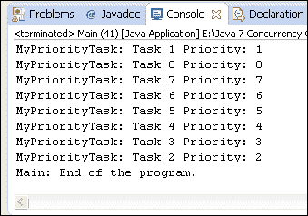
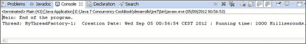
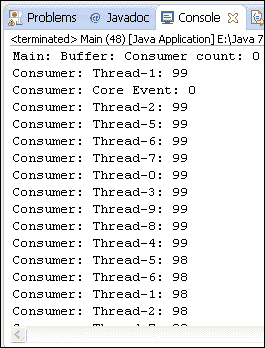

# 第 7 章定制并发类

在本章中，我们将介绍：

*   定制`ThreadPoolExecutor`类
*   实现基于优先级的`Executor`类
*   实现`ThreadFactory`接口生成自定义线程
*   在`Executor`对象中使用我们的`ThreadFactory`
*   自定义在计划线程池中运行的任务
*   实现`ThreadFactory`接口为 Fork/Join 框架生成自定义线程
*   自定义在 Fork/Join 框架中运行的任务
*   实现自定义`Lock`类
*   基于优先级的传输队列的实现
*   实现自己的原子对象

# 导言

Java 并发 API 提供了许多接口和类来实现并发应用程序。它们提供低级机制，如`Thread`类、`Runnable`或`Callable`接口或`synchronized`关键字，以及高级机制，如 Java 7 版本中添加的 Executor 框架和 Fork/Join 框架。尽管如此，您可能会发现自己开发的程序中没有一个 java 类满足您的需求。

在这种情况下，您可能需要基于 Java 提供的工具实现自己的定制并发实用程序。基本上，你可以：

*   实现一个接口以提供该接口定义的功能。例如，`ThreadFactory`接口。
*   重写类的某些方法以使其行为适应您的需要。例如，重写`Thread`类的`run()`方法，默认情况下，该方法没有任何用处，应该被重写以提供一些功能。

通过本章的介绍，您将了解如何更改某些 Java 并发 API 类的行为，而无需从头开始设计并发框架。您可以使用这些配方作为初始点来实现自己的定制。

# 定制 ThreadPoolExecutor 类

Executor 框架是一种机制，允许您将线程创建与其执行分离。它基于实现这两个接口的`Executor`和`ExecutorService`接口以及`ThreadPoolExecutor`类。它有一个内部线程池，并提供了一些方法，允许您发送两种任务以在池线程中执行。这些任务是：

*   `Runnable`接口实现不返回结果的任务
*   用于执行返回结果的任务的`Callable`接口

在这两种情况下，您只将任务发送给执行者。执行器使用其一个池线程或创建一个新线程来执行这些任务。执行者还决定执行任务的时间。

在本配方中，您将学习如何覆盖`ThreadPoolExecutor`类的一些方法，以计算在执行器中执行的任务的执行时间，并在控制台中写入执行器完成执行时的统计信息。

## 准备好了吗

此配方的示例已使用 EclipseIDE 实现。如果您使用 Eclipse 或其他 IDE（如 NetBeans），请打开它并创建一个新的 Java 项目。

## 怎么做。。。

按照下面描述的步骤来实现该示例：

1.  创建一个名为`MyExecutor`的类来扩展`ThreadPoolExecutor`类。

    ```
    public class MyExecutor extends ThreadPoolExecutor {
    ```

2.  声明一个私有的`ConcurrentHashMap`属性，该属性由名为`startTimes`的`String`和`Date`类参数化。

    ```
      private ConcurrentHashMap<String, Date> startTimes;
    ```

3.  实现类的构造函数。使用关键字`super`调用父类的构造函数并初始化`startTime`属性。

    ```
      public MyExecutor(int corePoolSize, int maximumPoolSize,
          long keepAliveTime, TimeUnit unit, BlockingQueue<Runnable> workQueue) {
        super(corePoolSize, maximumPoolSize, keepAliveTime, unit, workQueue);
        startTimes=new ConcurrentHashMap<>();
      }
    ```

4.  覆盖`shutdown()`方法。在控制台中写入有关已执行任务、正在运行任务和挂起任务的信息。然后，使用`super`关键字调用父类的`shutdown()`方法。

    ```
      @Override
      public void shutdown() {
        System.out.printf("MyExecutor: Going to shutdown.\n");
        System.out.printf("MyExecutor: Executed tasks: %d\n",getCompletedTaskCount());
        System.out.printf("MyExecutor: Running tasks: %d\n",getActiveCount());
        System.out.printf("MyExecutor: Pending tasks: %d\n",getQueue().size());
        super.shutdown();
      }
    ```

5.  覆盖`shutdownNow()`方法。在控制台中写入有关已执行任务、正在运行任务和挂起任务的信息。然后，使用`super`关键字调用父类的`shutdownNow()`方法。

    ```
      @Override
      public List<Runnable> shutdownNow() {
        System.out.printf("MyExecutor: Going to immediately shutdown.\n");
        System.out.printf("MyExecutor: Executed tasks: %d\n",getCompletedTaskCount());
        System.out.printf("MyExecutor: Running tasks: %d\n",getActiveCount());
        System.out.printf("MyExecutor: Pending tasks: %d\n",getQueue().size());
        return super.shutdownNow();
      }
    ```

6.  覆盖`beforeExecute()`方法。在控制台中用将要执行任务的线程的名称和任务的哈希代码编写一条消息。使用任务的哈希代码作为键，将开始日期存储在`HashMap`中。

    ```
      @Override
      protected void beforeExecute(Thread t, Runnable r) {
        System.out.printf("MyExecutor: A task is beginning: %s : %s\n",t.getName(),r.hashCode());
        startTimes.put(String.valueOf(r.hashCode()), new Date());
      }
    ```

7.  覆盖`afterExecute()`方法。将任务结果写入控制台，计算任务运行时间减去当前日期`HashMap`中存储的任务开始日期。

    ```
      @Override
      protected void afterExecute(Runnable r, Throwable t) {
        Future<?> result=(Future<?>)r;
        try {
          System.out.printf("*********************************\n");
          System.out.printf("MyExecutor: A task is finishing.\n");
          System.out.printf("MyExecutor: Result: %s\n",result.get());
          Date startDate=startTimes.remove(String.valueOf(r.hashCode()));
          Date finishDate=new Date();
          long diff=finishDate.getTime()-startDate.getTime();
          System.out.printf("MyExecutor: Duration: %d\n",diff);
          System.out.printf("*********************************\n");
        } catch (InterruptedException  | ExecutionException e) {
          e.printStackTrace();
        }
      }
    }
    ```

8.  创建一个名为`SleepTwoSecondsTask`的类，该类实现了用`String`类参数化的`Callable`接口。实施`call()`方法。将当前线程休眠 2 秒，并返回转换为`String`类型的当前日期。

    ```
    public class SleepTwoSecondsTask implements Callable<String> {

      public String call() throws Exception {
        TimeUnit.SECONDS.sleep(2);
        return new Date().toString();
      }

    }
    ```

9.  通过使用`main()`方法创建名为`Main`的类，实现示例的主类。

    ```
    public class Main {
      public static void main(String[] args) {
    ```

10.  创建一个名为`myExecutor`的对象。

    ```
        MyExecutor myExecutor=new MyExecutor(2, 4, 1000, TimeUnit.MILLISECONDS, new LinkedBlockingDeque<Runnable>());
    ```

11.  创建一个用`String`类参数化的`Future`对象列表，以存储要发送给执行者的任务的结果对象。

    ```
        List<Future<String>> results=new ArrayList<>();¡;
    ```

12.  提交 10 个`Task`对象。

    ```
        for (int i=0; i<10; i++) {
          SleepTwoSecondsTask task=new SleepTwoSecondsTask();
          Future<String> result=myExecutor.submit(task);
          results.add(result);
        }
    ```

13.  使用`get()`方法获取前五个任务的执行结果。在控制台中编写它们。

    ```
        for (int i=0; i<5; i++){
          try {
            String result=results.get(i).get();
            System.out.printf("Main: Result for Task %d : %s\n",i,result);
          } catch (InterruptedException | ExecutionException e) {
            e.printStackTrace();
          }
        }
    ```

14.  使用`shutdown()`方法完成执行器的执行。

    ```
        myExecutor.shutdown();
    ```

15.  使用`get()`方法获取执行最后五项任务的结果。在控制台中编写它们。

    ```
        for (int i=5; i<10; i++){
          try {
            String result=results.get(i).get();
            System.out.printf("Main: Result for Task %d : %s\n",i,result);
          } catch (InterruptedException | ExecutionException e) {
            e.printStackTrace();
          }
        }
    ```

16.  使用`awaitTermination()`方法等待执行器完成。

    ```
        try {
          myExecutor.awaitTermination(1, TimeUnit.DAYS);
        } catch (InterruptedException e) {
          e.printStackTrace();
        }
    ```

17.  编写一条消息，指示程序执行结束。

    ```
        System.out.printf("Main: End of the program.\n");
    ```

## 它是如何工作的。。。

在这个配方中，我们实现了自定义执行器，它扩展了`ThreadPoolExecutor`类并覆盖了它的四个方法。使用`beforeExecute()`和`afterExecute()`方法计算任务的执行时间。`beforeExecute()`方法在执行任务之前执行。在本例中，我们使用`HashMap`在其中存储任务的开始日期。`afterExecute()`方法在任务执行后执行。您从`HashMap`中获得已完成任务的`startTime`，然后计算实际日期与该日期之间的差值，以获得任务的执行时间。您还重写了`shutdown()`和`shutdownNow()`方法，将 executor 中执行的任务的统计信息写入控制台：

*   执行的任务，使用`getCompletedTaskCount()`方法
*   此时正在运行的任务，使用`getActiveCount()`方法

挂起的任务，使用阻塞队列的`size()`方法，执行者在其中存储挂起的任务。实现`Callable`接口的`SleepTwoSecondsTask`类将其执行线程置于休眠状态 2 秒，而`Main`类则将 10 个任务发送给使用它和其他类来演示其功能的执行者。

执行程序，您将看到程序如何显示正在运行的每个任务的时间跨度，以及调用`shutdown()`方法时执行者的统计信息。

## 另见

*   [第 4 章](4.html "Chapter 4. Thread Executors")*线程执行器*中的*创建线程执行器*配方
*   *在[第 7 章](7.html "Chapter 7. Customizing Concurrency Classes")*定制并发类*中的执行器*对象配方中使用我们的 ThreadFactory

# 实现基于优先级的执行器类

在 Java 并发 API 的第一个版本中，您必须创建并运行应用程序的所有线程。在 Java 版本 5 中，随着 Executor 框架的出现，引入了一种新的并发任务执行机制。

使用 Executor 框架，您只需实现任务并将其发送给 Executor 即可。执行器负责创建和执行执行任务的线程。

在内部，执行器使用阻塞队列存储挂起的任务。这些文件按到达执行者的顺序存储。一种可能的替代方法是使用优先级队列来存储新任务。这样，如果一个高优先级的新任务到达执行器，它将在已经等待线程执行但优先级较低的其他线程之前执行。

在本配方中，您将学习如何实现一个执行器，该执行器将使用优先级队列存储发送执行的任务。

## 准备好了吗

此配方的示例已使用 EclipseIDE 实现。如果您使用 Eclipse 或其他 IDE（如 NetBeans），请打开它并创建一个新的 Java 项目。

## 怎么做。。。

按照以下步骤来实现该示例：

1.  创建一个名为`MyPriorityTask`的类，该类实现了`MyPriorityTask`类接口参数化的`Runnable`和`Comparable`接口。

    ```
    public class MyPriorityTask implements Runnable, Comparable<MyPriorityTask> {
    ```

2.  声明名为`priority`的私有`int`属性。

    ```
      private int priority;  
    ```

3.  声明名为`name`的私有`String`属性。

    ```
      private String name;
    ```

4.  实现类的构造函数以初始化其属性。

    ```
      public MyPriorityTask(String name, int priority) {
        this.name=name;
        this.priority=priority;
      }
    ```

5.  实现一个方法来返回 priority 属性的值。

    ```
      public int getPriority(){
        return priority;
      }
    ```

6.  实现`Comparable`接口中声明的`compareTo()`方法。它接收一个`MyPriorityTask`对象作为参数，并比较当前对象和参数这两个对象的优先级。您可以让优先级较高的任务在优先级较低的任务之前执行。

    ```
      @Override
      public int compareTo(MyPriorityTask o) {
        if (this.getPriority() < o.getPriority()) {
          return 1;
        }
        if (this.getPriority() > o.getPriority()) {
          return -1;
        }
        return 0;
      }
    ```

7.  执行`run()`方法。将当前线程休眠 2 秒钟。

    ```
       @Override
      public void run() {
        System.out.printf("MyPriorityTask: %s Priority : %d\n",name,priority);
        try {
          TimeUnit.SECONDS.sleep(2);
        } catch (InterruptedException e) {
          e.printStackTrace();
        }  
      }
    ```

8.  通过使用`main()`方法创建一个名为`Main`的类，实现本例的主类。

    ```
    public class Main {
      public static void main(String[] args) {
    ```

9.  创建一个名为`executor`的`ThreadPoolExecutor`对象。使用`Runnable`接口参数化的`PriorityBlockingQueue`作为该执行器用于存储其挂起任务的队列。

    ```
        ThreadPoolExecutor executor=new ThreadPoolExecutor(2,2,1,TimeUnit.SECONDS,new PriorityBlockingQueue<Runnable>());
    ```

10.  使用循环计数器作为任务优先级向执行器发送四个任务。使用`execute()`方法将任务发送给执行者。

    ```
        for (int i=0; i<4; i++){
          MyPriorityTask task=new MyPriorityTask ("Task "+i,i);
          executor.execute(task);
        }
    ```

11.  将当前线程休眠 1 秒钟。

    ```
        try {
          TimeUnit.SECONDS.sleep(1);
        } catch (InterruptedException e) {
          e.printStackTrace();
        }
    ```

12.  使用循环计数器作为任务的优先级，向执行器发送四个额外任务。使用`execute()`方法将任务发送给执行者。

    ```
        for (int i=4; i<8; i++) {
          MyPriorityTask task=new MyPriorityTask ("Task "+i,i);
          executor.execute(task);      
        }
    ```

13.  使用`shutdown()`方法关闭执行器。

    ```
        executor.shutdown();
    ```

14.  使用`awaitTermination()`方法等待执行器的最终确定。

    ```
        try {
          executor.awaitTermination(1, TimeUnit.DAYS);
        } catch (InterruptedException e) {
          e.printStackTrace();
        }
    ```

15.  在控制台中编写一条消息，指示程序已完成。

    ```
        System.out.printf("Main: End of the program.\n");
    ```

## 它是如何工作的。。。

将执行器转换为基于优先级的执行器很简单。您只需传递一个用`Runnable`接口参数化的`PriorityBlockingQueue`对象作为参数。要实现队列中的所有对象，您应该知道该队列中存储了一个优先级。

您已经实现了实现`Runnable`接口的`MyPriorityTask`类，该类将作为任务，而`Comparable`接口将存储在优先级队列中。此类有一个`Priority`属性，用于存储任务的优先级。如果此属性的任务值较高，则会更早执行该任务。`compareTo()`方法确定优先级队列中任务的顺序。在`Main`类中，您向执行者发送了八个具有不同优先级的任务。发送给执行者的第一个任务是执行的第一个任务。当执行器空闲等待任务执行时，当第一个任务到达执行器时，它会立即执行这些任务。您已经创建了带有两个执行线程的执行器，因此前两个任务将是第一个执行的任务。然后，根据优先级执行其余任务。

以下屏幕截图显示了此示例的一次执行：



## 还有更多。。。

您可以将`Executor`配置为使用`BlockingQueue`接口的任何实现。一个有趣的实现是`DelayQueue`。此类用于存储具有延迟激活的元素。它提供了只返回活动对象的方法。您可以使用这个类来实现自己版本的`ScheduledThreadPoolExecutor`类。

## 另见

*   [第 4 章](4.html "Chapter 4. Thread Executors")*线程执行器*中的*创建线程执行器*配方
*   [第 7 章](7.html "Chapter 7. Customizing Concurrency Classes")*定制并发类*中的*定制 ThreadPoolExecutor*类配方
*   [第 6 章](6.html "Chapter 6. Concurrent Collections")、*并发集合*中的*使用按优先级*排序的阻塞线程安全列表

# 实现 ThreadFactory 接口生成自定义线程

**工厂模式**是面向对象编程世界中广泛使用的设计模式。它是一种创造性模式，其目标是开发一个类，其任务是创建一个或多个类的对象。然后，当我们想要创建其中一个类的对象时，我们使用工厂而不是使用新操作符。

*   使用此工厂，我们可以集中创建对象，从而可以轻松更改创建的对象的类别或创建这些对象的方式，从而轻松地限制为有限资源创建对象。例如，我们只能有一种类型的*N*对象，这种类型的对象很容易生成有关对象创建的统计数据。

Java 提供了`ThreadFactory`接口来实现`Thread`对象工厂。Java 并发 API 的一些高级实用程序，如 Executor 框架或 Fork/Join 框架，使用线程工厂创建线程。

Java 并发 API 中工厂模式的另一个例子是`Executors`类。它提供了许多方法来创建不同类型的`Executor`对象。

在此配方中，您将通过添加新功能来扩展`Thread`类，并将实现一个线程工厂类来生成该新类的线程。

## 准备好了吗

此配方的示例已使用 EclipseIDE 实现。如果您使用 Eclipse 或其他 IDE（如 NetBeans），请打开它并创建一个新的 Java 项目。

## 怎么做。。。

按照以下步骤来实现该示例：

1.  创建一个名为`MyThread`的类来扩展`Thread`类。

    ```
    public class MyThread extends Thread {
    ```

2.  声明三个名为`creationDate`、`startDate`和`finishDate`的私有`Date`属性。

    ```
      private Date creationDate;
      private Date startDate;
      private Date finishDate;
    ```

3.  实现类的构造函数。它接收要作为参数执行的名称和`Runnable`对象。存储线程的创建日期。

    ```
      public MyThread(Runnable target, String name ){
        super(target,name);
        setCreationDate();
      }
    ```

4.  `run()`实现方法。存储线程的开始日期，调用父类的`run()`方法，存储执行的完成日期。

    ```
      @Override
      public void run() {
        setStartDate();
        super.run();
        setFinishDate();
      }
    ```

5.  实现一种方法来建立`creationDate`属性的值。

    ```
      public void setCreationDate() {
        creationDate=new Date();
      }
    ```

6.  实现一个方法来建立`startDate`属性的值。

    ```
      public void setStartDate() {
        startDate=new Date();
      }
    ```

7.  实现一种方法来建立`finishDate`属性的值。

    ```
      public void setFinishDate() {
        finishDate=new Date();
      }
    ```

8.  实现名为`getExecutionTime()`的方法，该方法将线程的执行时间计算为开始日期和完成日期之间的差值。

    ```
      public long getExecutionTime() {
        return finishDate.getTime()-startDate.getTime();
      }
    ```

9.  重写`toString()`方法返回线程的创建日期和执行时间。

    ```
      @Override
      public String toString(){
        StringBuilder buffer=new StringBuilder();
        buffer.append(getName());
        buffer.append(": ");
        buffer.append(" Creation Date: ");
        buffer.append(creationDate);
        buffer.append(" : Running time: ");
        buffer.append(getExecutionTime());
        buffer.append(" Milliseconds.");
        return buffer.toString();
      }
    ```

10.  创建一个名为`MyThreadFactory`的类，该类实现`ThreadFactory`接口。

    ```
    public class MyThreadFactory implements ThreadFactory {
    ```

11.  声明名为`counter`的私有`int`属性。

    ```
      private int counter;
    ```

12.  声明名为`prefix`的私有`String`属性。

    ```
      private String prefix;
    ```

13.  实现类的构造函数来初始化其属性。

    ```
      public MyThreadFactory (String prefix) {
        this.prefix=prefix;
        counter=1;
      }
    ```

14.  执行`newThread()`方法。创建一个`MyThread`对象并增加`counter`属性。

    ```
      @Override
      public Thread newThread(Runnable r) {
        MyThread myThread=new MyThread(r,prefix+"-"+counter);
        counter++;
        return myThread;
      }
    ```

15.  创建一个名为`MyTask`的类来实现`Runnable`接口。实施`run()`方法。将当前线程休眠 2 秒钟。

    ```
    public class MyTask implements Runnable {
      @Override
      public void run() {
        try {
          TimeUnit.SECONDS.sleep(2);
        } catch (InterruptedException e) {
          e.printStackTrace();
        }
      }
      }
    ```

16.  通过使用`main()`方法创建名为`Main`的类，实现示例的主类。

    ```
    public class Main {
      public static void main(String[] args) throws Exception {
    ```

17.  创建一个`MyThreadFactory`对象。

    ```
        MyThreadFactory myFactory=new MyThreadFactory("MyThreadFactory");
    ```

18.  创建一个`Task`对象。

    ```
        MyTask task=new MyTask();
    ```

19.  使用工厂的`newThread()`方法创建一个`MyThread`对象来执行任务。

    ```
        Thread thread=myFactory.newThread(task);
    ```

20.  启动线程并等待其完成。

    ```
        thread.start();
        thread.join();
    ```

21.  使用`toString()`方法写入关于线程的信息。

    ```
        System.out.printf("Main: Thread information.\n");
        System.out.printf("%s\n",thread);
        System.out.printf("Main: End of the example.\n");
    ```

## 它是如何工作的。。。

在此配方中，您已经实现了一个扩展`Thread`类的自定义`MyThread`类。该类有三个属性来存储创建日期、执行的开始日期和执行的结束日期。使用开始日期和结束日期属性，您已经实现了返回线程执行其任务的时间的`getExecutionTime()`方法。最后，您已经重写了`toString()`方法来生成关于线程的信息。

一旦你有了自己的线程类，你就实现了一个工厂来创建这个类的对象，实现了`ThreadFactory`接口。如果要将工厂作为独立对象使用，则不必使用接口，但如果要将此工厂与 Java 并发 API 的其他类一起使用，则必须通过实现该接口来构建工厂。`ThreadFactory`接口只有一个方法，`newThread()`方法接收`Runnable`对象作为参数并返回`Thread`对象以执行该`Runnable`对象。在本例中，返回一个`MyThread`对象。

为了检查这两个类，您已经实现了实现`Runnable`对象的`MyTask`类。这是在`MyThread`对象管理的线程中执行的任务。`MyTask`实例将其执行线程休眠 2 秒。

在本例的主要方法中，您已经使用`MyThreadFactory`工厂创建了`MyThread`对象来执行`Task`对象。执行该程序，您将看到一条消息，其中包含已执行线程的开始日期和执行时间。

以下屏幕截图显示了此示例生成的输出：


## 还有更多。。。

Java 并发 API 提供了`Executors`类来生成线程执行器，通常是`ThreadPoolExecutor`类的对象。您还可以使用此类通过`defaultThreadFactory()`方法获得`ThreadFactory`接口的最基本实现。此方法生成的工厂会将属于所有工厂的基本`Thread`对象生成到同一`ThreadGroup`对象。

您可以将程序中的`ThreadFactory`接口用于任何目的，而不一定与 Executor 框架相关。

# 在 Executor 对象中使用我们的 ThreadFactory

在前面的配方*实现 ThreadFactory 接口以生成自定义线程*中，我们介绍了 factory 模式，并提供了如何实现实现`ThreadFactory`接口的线程工厂的示例。

Executor 框架是一种机制，允许您将线程创建和执行分离。它基于`Executor`和`ExecutorService`接口，并在`ThreadPoolExecutor`类中实现这两个接口。它有一个内部线程池，并提供了一些方法，允许您发送两种任务以在池线程中执行。这两类任务是：

*   实现`Runnable`接口的类，以实现不返回结果的任务
*   实现`Callable`接口的类，以实现返回结果的任务

在内部，Executor 框架使用`ThreadFactory`接口创建线程，用于生成新线程。在本教程中，您将学习如何实现自己的线程类，一个创建该类线程的线程工厂，以及如何在执行器中使用该工厂，以便执行器执行您的线程。

## 准备好了。。。

阅读前面的配方*实现 ThreadFactory 接口以生成自定义线程*，并实现其示例。

此配方的示例已使用 EclipseIDE 实现。如果您使用 Eclipse 或其他 IDE（如 NetBeans），请打开它并创建一个新的 Java 项目。

## 怎么做。。。

按照以下步骤来实现该示例：

1.  将实现 ThreadFactory 接口的配方*中实现的类`MyThread`、`MyThreadFactory`和`MyTask`复制到项目中，以生成自定义线程*，因此您将在本例中使用它们。
2.  通过使用`main()`方法创建名为`Main`的类来实现示例的主类。

    ```
    public class Main {
      public static void main(String[] args) throws Exception {
    ```

3.  创建一个名为`threadFactory`的新`MyThreadFactory`对象。

    ```
        MyThreadFactory threadFactory=new MyThreadFactory("MyThreadFactory");
    ```

4.  使用`Executors`类的`newCachedThreadPool()`方法创建一个新的`Executor`对象。将先前创建的 factory 对象作为参数传递。新的`Executor`对象将使用该工厂创建必要的线程，因此它将执行`MyThread`线程。

    ```
        ExecutorService executor=Executors.newCachedThreadPool(threadFactory);
    ```

5.  创建一个新的`Task`对象，并使用`submit()`方法将其发送给执行者。

    ```
        MyTask task=new MyTask();
        executor.submit(task);
    ```

6.  使用`shutdown()`方法关闭执行器。

    ```
        executor.shutdown();
    ```

7.  使用`awaitTermination()`方法等待执行器的最终确定。

    ```
        executor.awaitTermination(1, TimeUnit.DAYS);
    ```

8.  编写一条消息以指示程序结束。

    ```
        System.out.printf("Main: End of the program.\n");
    ```

## 它是如何工作的。。。

在*的工作原理中。。。在上一个配方的*部分*实现 ThreadFactory 接口以生成自定义线程*，您可以阅读关于`MyThread`、`MyThreadFactory`和`MyTask`类如何工作的详细说明。

在本例的`main()`方法中，您已经使用`Executors`类的`newCachedThreadPool()`方法创建了一个`Executor`对象。您已将前面创建的工厂对象作为参数传递，因此创建的`Executor`对象将使用该工厂创建它所需的线程，并将执行`MyThread`类的线程。

执行该程序，您将看到一条消息，其中包含有关线程开始日期及其执行时间的信息。以下屏幕截图显示了此示例生成的输出：



## 另见

*   在[第 7 章](7.html "Chapter 7. Customizing Concurrency Classes")、*自定义并发类*中*实现 ThreadFactory 接口生成自定义线程*配方

# 自定义在计划线程池中运行的任务

**调度线程池**是执行器框架基本线程池的扩展，允许您调度一段时间后要执行的任务的执行。它由`ScheduledThreadPoolExecutor`类实现，允许执行以下两种任务：

*   **延迟任务**这类任务在一段时间后只执行一次
*   **周期性任务**：这些类型的任务在延迟后执行，然后每隔一段时间周期性地执行一次

延迟任务可以同时执行`Callable`和`Runnable`对象，但周期性任务只能执行`Runnable`对象。调度池执行的所有任务都是`RunnableScheduledFuture`接口的实现。在本食谱中，您将学习如何实现自己的`RunnableScheduledFuture`接口实现，以执行延迟和周期性任务。

## 准备好了吗

此配方的示例已使用 EclipseIDE 实现。如果您使用 Eclipse 或其他 IDE（如 NetBeans），请打开它并创建一个新的 Java 项目。

## 怎么做。。。

按照以下描述的步骤来实现该示例：

1.  创建一个名为`MyScheduledTask`的类，该类使用名为`V`的泛型类型参数化。它扩展了`FutureTask`类并实现了`RunnableScheduledFuture`接口。

    ```
    public class MyScheduledTask<V> extends FutureTask<V> implements RunnableScheduledFuture<V> {
    ```

2.  声明名为`task`的私有`RunnableScheduledFuture`属性。

    ```
      private RunnableScheduledFuture<V> task;
    ```

3.  声明一个名为`executor`的私有`ScheduledThreadPoolExecutor`。

    ```
      private ScheduledThreadPoolExecutor executor;
    ```

4.  声明名为`period`的私有`long`属性。

    ```
      private long period;
    ```

5.  声明名为`startDate`的私有`long`属性。

    ```
      private long startDate;
    ```

6.  实现类的构造函数。它接收将由任务执行的`Runnable`对象、该任务返回的结果、将用于创建`MyScheduledTask`对象的`RunnableScheduledFuture`任务以及将执行该任务的`ScheduledThreadPoolExecutor`对象。调用其父类的构造函数并存储 task 和`executor`属性。

    ```
      public MyScheduledTask(Runnable runnable, V result, RunnableScheduledFuture<V> task, ScheduledThreadPoolExecutor executor) {
        super(runnable, result);
        this.task=task;
        this.executor=executor;
      }
    ```

7.  执行`getDelay()`方法。如果任务是周期性任务，`startDate`属性的值不同于零，则将返回值计算为`startDate`属性与实际日期的差值。否则，返回`task`属性中存储的原始任务的延迟。不要忘记，您必须以作为参数传递的时间单位返回结果。

    ```
      @Override
      public long getDelay(TimeUnit unit) {
        if (!isPeriodic()) {
          return task.getDelay(unit);
        } else {
          if (startDate==0){
            return task.getDelay(unit);
          } else {
            Date now=new Date();
            long delay=startDate-now.getTime();
            return unit.convert(delay, TimeUnit.MILLISECONDS);
          }
        }
      }
    ```

8.  执行的`compareTo()`方法。调用原始任务的`compareTo()`方法。

    ```
      @Override
      public int compareTo(Delayed o) {
        return task.compareTo(o);
      }
    ```

9.  执行的`isPeriodic()`方法。调用原任务的`isPeriodic()`方法。

    ```
      @Override
      public boolean isPeriodic() {
        return task.isPeriodic();
      }
    ```

10.  执行`run()`方法。如果是周期性任务，则必须使用任务下一次执行的开始日期更新其`startDate`属性。将其计算为实际日期和期间的总和。然后，将任务再次添加到`ScheduledThreadPoolExecutor`对象的队列中。

    ```
      @Override
      public void run() {
        if (isPeriodic() && (!executor.isShutdown())) {
          Date now=new Date();
          startDate=now.getTime()+period;
          executor.getQueue().add(this);
        }
    ```

11.  将一条带有实际日期的消息打印到控制台，执行调用`runAndReset()`方法的任务，然后将另一条带有实际日期的消息打印到控制台。

    ```
        System.out.printf("Pre-MyScheduledTask: %s\n",new Date());
        System.out.printf("MyScheduledTask: Is Periodic: %s\n",isPeriodic());
        super.runAndReset();
        System.out.printf("Post-MyScheduledTask: %s\n",new Date());
      }
    ```

12.  执行`setPeriod()`方法来确定此任务的周期。

    ```
      public void setPeriod(long period) {
        this.period=period;
      }
    ```

13.  创建一个名为`MyScheduledThreadPoolExecutor`的类来实现一个执行`MyScheduledTask`任务的`ScheduledThreadPoolExecutor`对象。指定该类扩展了`ScheduledThreadPoolExecutor`类。

    ```
    public class MyScheduledThreadPoolExecutor extends ScheduledThreadPoolExecutor {
    ```

14.  实现类的构造函数，该构造函数只调用其父类的构造函数。

    ```
      public MyScheduledThreadPoolExecutor(int corePoolSize) {
        super(corePoolSize);
      }
    ```

15.  执行`decorateTask()`方法。它接收将要执行的`Runnable`对象和将执行该`Runnable`对象的`RunnableScheduledFuture`任务作为参数。使用这些对象创建并返回一个`MyScheduledTask`任务来构造它们。

    ```
      @Override
      protected <V> RunnableScheduledFuture<V> decorateTask(Runnable runnable,
          RunnableScheduledFuture<V> task) {
        MyScheduledTask<V> myTask=new MyScheduledTask<V>(runnable, null, task,this);  
        return myTask;
      }
    ```

16.  覆盖`scheduledAtFixedRate()`方法。调用其父类的方法，将返回的对象转换为`MyScheduledTask`对象，并使用`setPeriod()`方法建立该任务的周期。

    ```
      @Override
      public ScheduledFuture<?> scheduleAtFixedRate(Runnable command, long initialDelay, long period, TimeUnit unit) {
       ScheduledFuture<?> task= super.scheduleAtFixedRate(command, initialDelay, period, unit);
       MyScheduledTask<?> myTask=(MyScheduledTask<?>)task;
     myTask.setPeriod(TimeUnit.MILLISECONDS.convert(period,unit));
       return task;
     }
    ```

17.  创建一个名为`Task`的类，该类实现`Runnable`接口。

    ```
    public class Task implements Runnable {
    ```

18.  执行`run()`方法。在任务开始时打印一条消息，将当前线程休眠 2 秒，然后在任务结束时打印另一条消息。

    ```
      @Override
      public void run() {
        System.out.printf("Task: Begin.\n");
        try {
          TimeUnit.SECONDS.sleep(2);
        } catch (InterruptedException e) {
          e.printStackTrace();
        }
        System.out.printf("Task: End.\n");
      }
    ```

19.  通过使用`main()`方法创建名为`Main`的类来实现示例的主类。

    ```
    public class Main {

      public static void main(String[] args) throws Exception{
    ```

20.  创建一个名为`executor`的`MyScheduledThreadPoolExecutor`对象。使用`2`作为参数，池中有两个线程。

    ```
        MyScheduledThreadPoolExecutor executor=new MyScheduledThreadPoolExecutor(2);
    ```

21.  创建一个名为`task`的`Task`对象。在控制台中写入实际日期。

    ```
        Task task=new Task();
        System.out.printf("Main: %s\n",new Date());
    ```

22.  使用`schedule()`方法向执行者发送延迟任务。任务将在 1 秒延迟后执行。

    ```
        executor.schedule(task, 1, TimeUnit.SECONDS);
    ```

23.  将主线程休眠 3 秒钟。

    ```
        TimeUnit.SECONDS.sleep(3);
    ```

24.  创建另一个对象。再次在控制台中打印实际日期。

    ```
    task=new Task();
        System.out.printf("Main: %s\n",new Date());
    ```

25.  使用`scheduleAtFixedRate()`方法向执行者发送定期任务。任务将在 1 秒延迟后执行，然后每 3 秒执行一次。

    ```
        executor.scheduleAtFixedRate(task, 1, 3, TimeUnit.SECONDS);
    ```

26.  将主线程休眠 10 秒钟。

    ```
        TimeUnit.SECONDS.sleep(10);
    ```

27.  使用`shutdown()`方法关闭执行器。使用`awaitTermination()`方法等待执行者的最终确定。

    ```
        executor.shutdown();
        executor.awaitTermination(1, TimeUnit.DAYS);
    ```

28.  在控制台中写入一条消息，指示程序结束。

    ```
        System.out.printf("Main: End of the program.\n");
    ```

## 它是如何工作的。。。

在这个配方中，您已经实现了`MyScheduledTask`类来实现一个可以在`ScheduledThreadPoolExecutor`执行器上执行的自定义任务。此类扩展了`FutureTask`类并实现了`RunnableScheduledFuture`接口。它实现了`RunnableScheduledFuture`接口，因为在计划执行器中执行的所有任务都必须实现该接口并扩展`FutureTask`类，因为该类提供了`RunnableScheduledFuture`接口中声明的方法的有效实现。前面提到的所有接口和类都是参数化类，具有任务将返回的数据类型。

要在计划执行器中使用`MyScheduledTask`任务，您已经重写了`MyScheduledThreadPoolExecutor`类中的`decorateTask()`方法。此类扩展了`ScheduledThreadPoolExecutor`执行器，该方法提供了将`ScheduledThreadPoolExecutor`执行器执行的默认计划任务转换为`MyScheduledTask`任务的机制。因此，当您实现自己版本的计划任务时，您必须实现自己版本的计划执行器。

*   `decorateTask()`方法只是用参数创建一个新的`MyScheduledTask`对象；将在任务中执行的`Runnable`对象。将由该任务返回的结果对象。在这种情况下，任务不会返回结果，因此您使用了`null`值。原始任务用于执行`Runnable`对象。这是池中新对象将要替换的任务；将要执行任务的执行者。在本例中，您使用`this`关键字引用正在创建任务的执行者。

`MyScheduledTask`类可以执行延迟和周期性任务。您已经使用执行这两种任务所需的所有逻辑实现了两种方法。它们是`getDelay()`和`run()`方法。

`getDelay()`方法由计划执行者调用，以了解它是否必须执行任务。此方法的行为在延迟和周期性任务中会发生变化。如前所述，`MyScheduledClass`类的构造函数接收将要执行`Runnable`对象的原始`ScheduledRunnableFuture`对象，并将其存储为类的属性，以访问其方法和数据。当我们要执行延迟的任务时，`getDelay()`方法返回原始任务的延迟，但对于周期性任务，`getDelay()`方法返回`startDate`属性和实际日期之间的差异。

`run()`方法是执行任务的方法。周期性任务的一个特殊性是，如果希望再次执行任务，则必须将任务的下一次执行作为新任务放入执行者队列中。因此，如果您正在执行周期性任务，则将`startDate`属性值与任务的实际执行日期和执行周期相加，并将任务再次存储在执行者的队列中。`startDate`属性存储任务下一次执行开始的日期。然后，使用`FutureTask`类提供的`runAndReset()`方法执行任务。对于延迟的任务，您不必将它们放入执行者的队列中，因为它们只执行一次。

### 注

您还必须考虑执行器是否已关闭。在这种情况下，您不必再次将定期任务存储到执行者的队列中。

最后，您已经覆盖了`MyScheduledThreadPoolExecutor`类中的`scheduleAtFixedRate()`方法。我们前面提到过，对于周期性任务，您可以使用任务的周期来建立`startDate`属性的值，但尚未初始化该周期。您必须重写该方法，该方法将该句点作为参数接收，然后将其传递给`MyScheduledTask`类，以便它可以使用它。

该示例使用实现`Runnable`接口的`Task`类完成，该类是在计划执行器中执行的任务。示例的主类创建一个`MyScheduledThreadPoolExecutor`执行器，并向其发送以下两个任务：

*   延迟的任务，在实际日期后 1 秒执行
*   定期任务，在实际日期后 1 秒第一次执行，然后每 3 秒执行一次

下面的屏幕截图显示了此示例的部分执行。您可以检查两种任务是否正确执行：


## 还有更多。。。

`ScheduledThreadPoolExecutor`类提供了`decorateTask()`方法的另一个版本，该方法接收`Callable`对象作为参数，而不是`Runnable`对象。

## 另见

*   [第 4 章](4.html "Chapter 4. Thread Executors")*线程执行器*中的*延迟*配方后在执行器中运行任务
*   *定期在执行器中运行任务*配方[第 4 章](4.html "Chapter 4. Thread Executors")、*线程执行器*

# 实现 ThreadFactory 接口为 Fork/Join 框架生成自定义线程

Java7 最有趣的特性之一是 Fork/Join 框架。它是`Executor`和`ExecutorService`接口的实现，允许您执行的`Callable`和`Runnable`任务，而无需管理执行它们的线程。

此执行器面向执行可划分为较小部分的任务。其主要组成部分如下：

*   一种特殊的任务，由`ForkJoinTask`类实现。
*   用于将任务划分为子任务的两个操作（`fork`操作）和等待这些子任务完成的两个操作（`join`操作）。
*   一种算法，命名为工作窃取算法，用于优化池线程的使用。当任务等待其子任务时，执行它的线程将用于执行另一个线程。

Fork/Join 框架的主要类是`ForkJoinPool`类。在内部，它有以下两个要素：

*   等待执行的任务队列
*   执行任务的线程池

在本教程中，您将学习如何实现在`ForkJoinPool`类中使用的自定义工作线程，以及如何使用工厂。

## 准备好了吗

此配方的示例已使用 EclipseIDE 实现。如果您使用 Eclipse 或其他 IDE（如 NetBeans），请打开它并创建一个新的 Java 项目。

## 怎么做。。。

按照以下步骤来实现该示例：

1.  创建一个名为`MyWorkerThread`的类来扩展`ForkJoinWorkerThread`类。

    ```
    public class MyWorkerThread extends ForkJoinWorkerThread {
    ```

2.  声明并创建一个私有的`ThreadLocal`属性，该属性由名为`taskCounter`的`Integer`类参数化。

    ```
      private static ThreadLocal<Integer> taskCounter=new ThreadLocal<Integer>();
    ```

3.  实现类的构造函数。

    ```
      protected MyWorkerThread(ForkJoinPool pool) {
        super(pool);
      }
    ```

4.  覆盖方法。调用其父类上的方法，将消息打印到控制台，并将此线程的`taskCounter`属性的值设置为零。

    ```
      @Override
      protected void onStart() {
        super.onStart();
        System.out.printf("MyWorkerThread %d: Initializing task counter.\n",getId());
        taskCounter.set(0);
      }
    ```

5.  覆盖`onTermination()`方法。在控制台中写入此线程的`taskCounter`属性值。

    ```
      @Override
      protected void onTermination(Throwable exception) {
        System.out.printf("MyWorkerThread %d: %d\n",getId(),taskCounter.get());
        super.onTermination(exception);
      }
    ```

6.  执行`addTask()`方法。增加`taskCounter`属性的值。

    ```
      public void addTask(){
        int counter=taskCounter.get().intValue();
        counter++;
        taskCounter.set(counter);
      }
    ```

7.  创建一个名为`MyWorkerThreadFactory`的类来实现`ForkJoinWorkerThreadFactory`接口。实施`newThread()`方法。创建并返回一个`MyWorkerThread`对象。

    ```
    public class MyWorkerThreadFactory implements ForkJoinWorkerThreadFactory {

      @Override
      public ForkJoinWorkerThread newThread(ForkJoinPool pool) {
        return new MyWorkerThread(pool);
      }

    }
    ```

8.  创建一个名为`MyRecursiveTask`的类，该类扩展了用`Integer`类参数化的`RecursiveTask`类。

    ```
    public class MyRecursiveTask extends RecursiveTask<Integer> {
    ```

9.  声明一个名为`array`的私有`int`数组。

    ```
      private int array[];
    ```

10.  声明两个名为`start`和`end`的私有`int`属性。

    ```
      private int start, end;
    ```

11.  实现初始化其属性的类的构造函数。

    ```
      public Task(int array[],int start, int end) {
        this.array=array;
        this.start=start;
        this.end=end;
      }
    ```

12.  执行`compute()`方法，对开始位置和结束位置之间的数组的所有元素求和。首先，将正在执行任务的线程转换为`MyWorkerThread`对象，并使用`addTask()`方法增加该线程的任务计数器。

    ```
      @Override
      protected Integer compute() {
        Integer ret;
        MyWorkerThread thread=(MyWorkerThread)Thread.currentThread();
        thread.addTask();
      }
    ```

13.  执行`addResults()`方法。计算并返回作为参数接收的两个任务的结果之和。

    ```
      private Integer addResults(Task task1, Task task2) {
        int value;
        try {
          value = task1.get().intValue()+task2.get().intValue();
        } catch (InterruptedException e) {
          e.printStackTrace();
          value=0;
        } catch (ExecutionException e) {
          e.printStackTrace();
          value=0;
        }
    ```

14.  将线程休眠 10 毫秒，并返回任务结果。

    ```
        try {
          TimeUnit.MILLISECONDS.sleep(10);
        } catch (InterruptedException e) {
          e.printStackTrace();
        }
        return value;
      }
    ```

15.  通过使用`main()`方法创建名为`Main`的类，实现示例的主类。

    ```
    public class Main {

      public static void main(String[] args) throws Exception {
    ```

16.  创建一个名为`factory`的`MyWorkerThreadFactory`对象。

    ```
        MyWorkerThreadFactory factory=new MyWorkerThreadFactory();
    ```

17.  创建一个名为`pool`的`ForkJoinPool`对象。将先前创建的工厂对象传递给构造函数。

    ```
        ForkJoinPool pool=new ForkJoinPool(4, factory, null, false);
    ```

18.  创建一个包含 100000 个整数的数组。将所有元素初始化为`1`。

    ```
        int array[]=new int[100000];

        for (int i=0; i<array.length; i++){
          array[i]=1;
        }
    ```

19.  创建一个新的`Task`对象，对数组中的所有元素求和。

    ```
        MyRecursiveTask task=new MyRecursiveTask(array,0,array.length);
    ```

20.  使用`execute()`方法将任务发送到池中。

    ```
        pool.execute(task);
    ```

21.  使用`join()`方法等待任务结束。

    ```
        task.join();
    ```

22.  使用`shutdown()`方法关闭池。

    ```
        pool.shutdown();
    ```

23.  使用`awaitTermination()`方法等待执行器的最终确定。

    ```
        pool.awaitTermination(1, TimeUnit.DAYS);
    ```

24.  在控制台中使用`get()`方法写入任务的结果。

    ```
          System.out.printf("Main: Result: %d\n",task.get());    
    ```

25.  在控制台中编写一条消息，指示示例结束。

    ```
        System.out.printf("Main: End of the program\n");
    ```

## 它是如何工作的。。。

Fork/Join 框架使用的线程称为工作线程。Java 包含`ForkJoinWorkerThread`类，该类扩展`Thread`类并实现 Fork/Join 框架使用的工作线程。

在此配方中，您已经实现了扩展`ForkJoinWorkerThread`类并重写该类的两个方法的`MyWorkerThread`类。您的目标是在每个工作线程中实现一个任务计数器，这样您就可以知道一个工作线程执行了多少任务。您已经使用`ThreadLocal`属性实现了计数器。这样，对于程序员来说，每个线程都将以透明的方式拥有自己的计数器。

您已经重写了`ForkJoinWorkerThread`类的`onStart()`方法来初始化任务计数器。此方法在工作线程开始执行时调用。您还重写了`onTermination()`方法，将任务计数器的值打印到控制台。当工作线程完成其执行时调用此方法。您还在`MyWorkerThread`类中实现了一个方法。`addTask()`方法增加每个线程的任务计数器。

`ForkJoinPool`类与 Java 并发 API 中的所有执行器一样，使用工厂创建其线程，因此如果您想在`ForkJoinPool`类中使用`MyWorkerThread`线程，则必须实现线程工厂。对于 Fork/Join 框架，该工厂必须实现`ForkJoinPool.ForkJoinWorkerThreadFactory`类。为此，您已经实现了`MyWorkerThreadFactory`类。这个类只有一个方法可以创建一个新的`MyWorkerThread`对象。

最后，您只需使用创建的工厂初始化一个`ForkJoinPool`类。您已经在`Main`类中使用`ForkJoinPool`类的构造函数完成了此操作。

以下屏幕截图显示了程序的部分输出：


您可以看到`ForkJoinPool`对象是如何执行四个工作线程的，以及执行了多少任务。

## 还有更多。。。

考虑到当线程正常完成或抛出`Exception`异常时，调用`ForkJoinWorkerThread`类提供的`onTermination()`方法。该方法接收一个`Throwable`对象作为参数。如果参数取值为`null`值，则工作线程正常完成，但如果参数取值，则线程抛出异常。您必须包含必要的代码来处理这种情况。

## 另见

*   [第 5 章](5.html "Chapter 5. Fork/Join Framework")*Fork/Join 框架*中的*创建 Fork/Join 池*配方
*   [第一章](1.html "Chapter 1. Thread Management")*线程管理*中的*通过工厂*配方创建线程

# 定制 Fork/Join 框架中运行的任务

Executor 框架将任务创建和执行分开。使用它，您只需实现`Runnable`对象并使用`Executor`对象。您将`Runnable`任务发送给执行器，执行器将创建、管理和完成执行这些任务所需的线程。

Java7 在 Fork/Join 框架中提供了一种特殊的执行器。该框架旨在解决那些可以使用分治技术分解为更小任务的问题。在任务中，您必须检查要解决的问题的大小，如果问题的大小大于确定的大小，则将问题分为两个或多个任务，并使用框架执行这些任务。如果问题的大小小于确定的大小，则直接在任务中解决问题，然后（可选）返回结果。Fork/Join 框架实现了工作窃取算法，提高了这类问题的整体性能。

Fork/Join 框架的主要类是`ForkJoinPool`类。在内部，它有以下两个要素：

*   等待执行的任务队列
*   执行任务的线程池

默认情况下，`ForkJoinPool`类执行的任务是`ForkJoinTask`类的对象。您还可以向`ForkJoinPool`类发送`Runnable`和`Callable`对象，但它们不能利用 Fork/Join 框架的所有优点。通常，您将向`ForkJoinPool`对象发送`ForkJoinTask`类的两个子类之一：

*   `RecursiveAction`：如果您的任务没有返回结果
*   `RecursiveTask`：如果您的任务返回结果

在本食谱中，您将学习如何为 Fork/Join 框架实现自己的任务，该框架实现了扩展`ForkJoinTask`类的任务。您将要执行的任务测量并在控制台中写入其执行时间，以便您可以控制其演变。您还可以实现自己的 Fork/Join 任务来写入日志信息、获取任务中使用的资源或对任务的结果进行后期处理。

## 怎么做。。。

按照以下步骤来实现该示例：

1.  创建一个名为`MyWorkerTask`的类，并指定它扩展用`Void`类型参数化的`ForkJoinTask`类。

    ```
    public abstract class MyWorkerTask extends ForkJoinTask<Void> {
    ```

2.  声明一个名为`name`的私有`String`属性来存储任务的名称。

    ```
      private String name;
    ```

3.  实现类的构造函数以初始化其属性。

    ```
      public MyWorkerTask(String name) {
        this.name=name;
      }
    ```

4.  执行`getRawResult()`方法。这是`ForkJoinTask`类的抽象方法之一。由于`MyWorkerTask`任务不会返回任何结果，此方法必须返回`null`值。

    ```
      @Override
      public Void getRawResult() {
        return null;
      }
    ```

5.  执行`setRawResult()`方法。这是`ForkJoinTask`类的另一个抽象方法。由于`MyWorkerTask`任务不会返回任何结果，请将此方法的主体留空。

    ```
      @Override
      protected void setRawResult(Void value) {

      }
    ```

6.  执行`exec()`方法。这是任务的主要方法。在这种情况下，将任务的逻辑委托给`compute()`方法。计算该方法的执行时间并将其写入控制台。

    ```
      @Override
      protected boolean exec() {
        Date startDate=new Date();
        compute();
        Date finishDate=new Date();
        long diff=finishDate.getTime()-startDate.getTime();
        System.out.printf("MyWorkerTask: %s : %d Milliseconds to complete.\n",name,diff);
        return true;
      }
    ```

7.  执行`getName()`方法返回任务名称。

    ```
      public String getName(){
        return name;
      }
    ```

8.  声明抽象方法`compute()`。如前所述，此方法将实现任务的逻辑，并且必须由`MyWorkerTask`类的子类实现。

    ```
      protected abstract void compute();
    ```

9.  创建一个名为`Task`的类来扩展`MyWorkerTask`类。

    ```
    public class Task extends MyWorkerTask {
    ```

10.  声明名为`array`的`int`值的私有数组。

    ```
      private int array[];
    ```

11.  实现初始化其属性的类的构造函数。

    ```
      public Task(String name, int array[], int start, int end){
        super(name);
        this.array=array;
        this.start=start;
        this.end=end;
      }
    ```

12.  执行`compute()`方法。此方法递增由“开始”和“结束”属性确定的数组元素块。如果此元素块包含 100 多个元素，请将该块分成两部分，并创建两个`Task`对象来处理每个部分。使用`invokeAll()`方法将这些任务发送到池中。

    ```
      protected void compute() {
        if (end-start>100){
          int mid=(end+start)/2;
          Task task1=new Task(this.getName()+"1",array,start,mid);
          Task task2=new Task(this.getName()+"2",array,mid,end);
          invokeAll(task1,task2);
    ```

13.  如果元素块少于 100 个元素，则使用`for`循环增加所有元素。

    ```
        } else {
          for (int i=start; i<end; i++) {
            array[i]++;
          }
    ```

14.  最后，将执行任务的线程休眠 50 毫秒。

    ```
          try {
            Thread.sleep(50);
          } catch (InterruptedException e) {
            e.printStackTrace();
          }
        }
      }
    ```

15.  通过使用`main(`方法创建名为`Main`的类来实现示例的主类。

    ```
    public class Main {
      public static void main(String[] args) throws Exception {
    ```

16.  创建一个包含 10000 个元素的`int`数组。

    ```
        int array[]=new int[10000];
    ```

17.  创建一个名为`pool`的`ForkJoinPool`对象。

    ```
        ForkJoinPool pool=new ForkJoinPool();
    ```

18.  创建一个`Task`对象以增加数组中的所有元素。构造函数的参数为`Task`作为任务的名称、数组对象，以及`0`和`10000`值，以指示此任务必须处理整个数组。

    ```
        Task task=new Task("Task",array,0,array.length);
    ```

19.  使用`execute()`方法将任务发送到池中。

    ```
        pool.invoke(task);
    ```

20.  使用`shutdown()`方法关闭池。

    ```
        pool.shutdown();
    ```

21.  在控制台中写入一条消息，指示程序结束。

    ```
        System.out.printf("Main: End of the program.\n");
    ```

## 它是如何工作的。。。

在此配方中，您已经实现了扩展`ForkJoinTask`类的`MyWorkerTask`类。它是您自己的基类，用于实现可以在`ForkJoinPool`执行器中执行的任务，并且可以利用该执行器的所有优点，如工作窃取算法。该等级相当于`RecursiveAction`和`RecursiveTask`等级。

扩展`ForkJoinTask`类时，需要实现以下三种方法：

*   `setRawResult()`：此方法用于建立任务的结果。由于任务不返回任何结果，因此将此方法保留为空。
*   `getRawResult()`：此方法用于返回任务的结果。由于您的任务不返回任何结果，因此此方法返回`null`值。
*   `exec()`：这个方法实现了任务的逻辑。在您的例子中，您已经在抽象方法`compute()`（作为`RecursiveAction`和`RecursiveTask`类）中委托了逻辑，在`exec()`方法中，您测量该方法的执行时间，并将其写入控制台。

最后，在本例的主类中，您创建了一个包含 10000 个元素的数组、一个`ForkJoinPool`执行器和一个`Task`对象来处理整个数组。执行该程序，您将看到执行的不同任务如何在控制台中写入其执行时间。

## 另见

*   [第 5 章](5.html "Chapter 5. Fork/Join Framework")*Fork/Join 框架*中的*创建 Fork/Join 池*配方
*   *实现 ThreadFactory 接口为[第 7 章](7.html "Chapter 7. Customizing Concurrency Classes")*定制并发类*中的 Fork/Join 框架*配方生成自定义线程

# 实现自定义锁类

锁是 Java 并发 API 提供的基本同步机制之一。它允许程序员保护代码的关键部分，因此一次只有一个线程可以执行该代码块。它提供以下两个操作：

*   `lock()`：当您想要访问一个关键区段时，您调用此操作。如果有另一个线程运行该关键部分，则会阻止其他线程，直到它们被锁唤醒以获得对该关键部分的访问。
*   `unlock()`：您在临界区的末尾调用此操作，以允许其他线程访问临界区。

在 Java 并发 API 中，锁在`Lock`接口中声明，并在某些类中实现，例如`ReentrantLock`类。

在本教程中，您将学习如何实现自己的`Lock`对象，该对象实现了一个类，该类实现了可用于保护关键部分的`Lock`接口。

## 准备好了吗

此配方的示例已使用 EclipseIDE 实现。如果您使用 Eclipse 或其他 IDE（如 NetBeans），请打开它并创建一个新的 Java 项目。

## 怎么做。。。

按照以下步骤来实现该示例：

1.  创建一个名为`MyQueuedSynchronizer`的类，该类扩展了`AbstractQueuedSynchronizer`类。

    ```
    public class MyAbstractQueuedSynchronizer extends AbstractQueuedSynchronizer {
    ```

2.  声明一个名为`state`的私有`AtomicInteger`属性。

    ```
      private AtomicInteger state;
    ```

3.  实现类的构造函数以初始化其属性。

    ```
      public MyAbstractQueuedSynchronizer() {
        state=new AtomicInteger(0);
      }
    ```

4.  执行`tryAcquire()`方法。此方法尝试将状态变量的值从零更改为一。如果可以，则返回`true`值，否则返回`false`。

    ```
      @Override
      protected boolean tryAcquire(int arg) {
        return state.compareAndSet(0, 1);
      }
    ```

5.  执行`tryRelease()`方法。此方法尝试将状态变量的值从 1 更改为零。如果可以，则返回`true`值，否则返回`false`值。

    ```
      @Override
      protected boolean tryRelease(int arg) {
        return state.compareAndSet(1, 0);
      }
    ```

6.  创建一个名为`MyLock`的类，并指定它实现`Lock`接口。

    ```
    public class MyLock implements Lock{
    ```

7.  声明一个名为`sync`的私有`AbstractQueuedSynchronizer`属性。

    ```
      private AbstractQueuedSynchronizer sync;
    ```

8.  实现类的构造函数，用新的`MyAbstractQueueSynchronizer`对象初始化`sync`属性。

    ```
      public MyLock() {
        sync=new MyAbstractQueuedSynchronizer();
      }
    ```

9.  执行`lock()`方法。调用`sync`对象的`acquire()`方法。

    ```
      @Override
      public void lock() {
        sync.acquire(1);
      }
    ```

10.  执行`lockInterruptibly()`方法。调用`sync`对象的`acquireInterruptibly()`方法。

    ```
      @Override
      public void lockInterruptibly() throws InterruptedException {
        sync.acquireInterruptibly(1);
      }
    ```

11.  执行`tryLock()`方法。调用`sync`对象的`tryAcquireNanos()`方法。

    ```
      @Override
      public boolean tryLock() {
        try {
          return sync.tryAcquireNanos(1, 1000);
        } catch (InterruptedException e) {
          e.printStackTrace();
          return false;
        }
      }
    ```

12.  使用两个参数执行另一版本的`tryLock()`方法。一个名为`time`的长参数和一个名为`unit`的`TimeUnit`参数。调用`sync`对象的`tryAcquireNanos()`方法。

    ```
      @Override
      public boolean tryLock(long time, TimeUnit unit)
          throws InterruptedException {
        return sync.tryAcquireNanos(1, TimeUnit.NANOSECONDS.convert(time, unit));
      }
    ```

13.  执行`unlock()`方法。调用`sync`对象的`release()`方法。

    ```
      @Override
      public void unlock() {
        sync.release(1);
      }
    ```

14.  执行`newCondition()`方法。创建`sync`对象`ConditionObject`内部类的新对象。

    ```
      @Override
      public Condition newCondition() {
        return sync.new ConditionObject();
      }
    ```

15.  创建一个名为`Task`的类，并指定它实现`Runnable`接口。

    ```
    public class Task implements Runnable {
    ```

16.  声明名为`lock`的私有`MyLock`属性。

    ```
      private MyLock lock;
    ```

17.  声明名为`name`的私有`String`属性。

    ```
      private String name;
    ```

18.  实现类的构造函数以初始化其属性。

    ```
      public Task(String name, MyLock lock){
        this.lock=lock;
        this.name=name;
      }
    ```

19.  实现类的`run()`方法。为了获得睡眠，将线程`lock`释放 2 秒，然后将对象放入睡眠状态。

    ```
      @Override
      public void run() {
        lock.lock();
        System.out.printf("Task: %s: Take the lock\n",name);
        try {
          TimeUnit.SECONDS.sleep(2);
          System.out.printf("Task: %s: Free the lock\n",name);
        } catch (InterruptedException e) {
          e.printStackTrace();
        } finally {
          lock.unlock();
        }
      }
    ```

20.  通过使用`main()`方法创建名为`Main`的类来实现示例的主类。

    ```
    public class Main {
      public static void main(String[] args) {
    ```

21.  创建一个名为`lock`的`MyLock`对象。

    ```
        MyLock lock=new MyLock();
    ```

22.  创建并执行 10 个`Task`任务。

    ```
        for (int i=0; i<10; i++){
          Task task=new Task("Task-"+i,lock);
          Thread thread=new Thread(task);
          thread.start();
        }
    ```

23.  尝试使用`tryLock()`方法获取锁。等待一秒钟，如果你没有得到锁，写一条消息，然后再试一次。

    ```
        boolean value;
        do {
          try {
            value=lock.tryLock(1,TimeUnit.SECONDS);
            if (!value) {
              System.out.printf("Main: Trying to get the Lock\n");
            }
          } catch (InterruptedException e) {
            e.printStackTrace();
            value=false;
          }
        } while (!value);
    ```

24.  写一条消息，表明你得到了锁，并释放它。

    ```
        System.out.printf("Main: Got the lock\n");
        lock.unlock();
    ```

25.  写一条消息，指示程序结束。

    ```
        System.out.printf("Main: End of the program\n");
    ```

## 它是如何工作的。。。

Java 并发 API 提供了一个类，可用于实现具有锁或信号量特性的同步机制。它是`AbstractQueuedSynchronizer`，顾名思义，它是一个抽象类。它提供控制对关键部分的访问以及管理等待访问关键部分的线程队列的操作。这些操作基于两种抽象方法：

*   `tryAcquire()`：调用此方法是为了尝试访问关键部分。如果调用它的线程可以访问临界段，则该方法返回`true`值。否则，该方法返回`false`值。
*   `tryRelease()`：调用此方法试图释放对关键区段的访问。如果调用它的线程可以释放访问权限，则该方法返回`true`值。否则，该方法返回`false`值。

在这些方法中，您必须实现用于控制对关键部分的访问的机制。在您的例子中，您已经实现了`MyQueuedSynchonizer`类，该类扩展了`AbstractQueuedSyncrhonizer`类，并使用`AtomicInteger`变量实现了抽象方法，以控制关键部分的访问。如果锁是空闲的，该变量将存储`0`值，这样线程就可以访问临界段；如果锁被阻塞，该变量将存储`1`值，这样线程就不能访问临界段。

您使用了`AtomicInteger`类提供的`compareAndSet()`方法，该方法试图将指定为第一个参数的值更改为指定为第二个参数的值。为了实现`tryAcquire()`方法，您尝试将原子变量的值从零更改为一。类似地，为了实现`tryRelease()`方法，您尝试将原子变量的值从 1 更改为零。

您必须实现这个类，因为`AbstractQueuedSynchronizer`类的其他实现（例如，`ReentrantLock`类使用的实现）在使用它的类内部实现为私有类，因此您没有访问它的权限。

然后，您已经实现了`MyLock`类。此类实现了`Lock`接口，并将`MyQueuedSynchronizer`对象作为属性。为了实现`Lock`接口的所有方法，您已经使用了`MyQueuedSynchronizer`对象的方法。

最后，您已经实现了`Task`类，该类实现了`Runnable`接口，并使用`MyLock`对象来访问关键部分。关键部分使线程休眠 2 秒。主类创建一个`MyLock`对象并运行 10 个共享该锁的`Task`对象。主类还尝试使用`tryLock()`方法访问锁。

当您执行该示例时，您可以看到如何只有一个线程可以访问关键部分，当该线程完成时，另一个线程可以访问它。

您可以使用自己的`Lock`来编写有关其利用率的日志消息，控制锁定的时间，或实施高级同步机制，例如，控制对资源的访问，使其仅在特定时间可用。

## 还有更多。。。

`AbstractQueuedSynchronizer`类提供了两种方法，可用于管理锁的状态。它们是`getState()`和`setState()`方法。这些方法接收并返回一个带锁状态的整数值。您可以使用这些方法而不是`AtomicInteger`属性来存储锁的状态。

Java 并发 API 提供了另一个类来实现同步机制。它是`AbstractQueuedLongSynchronizer`类，相当于`AbstractQueuedSynchronizer`类，但使用`long`属性来存储线程的状态。

## 另见

*   [第 2 章](2.html "Chapter 2. Basic Thread Synchronization")*基本线程同步*中的*用锁同步代码块*配方

# 实现基于优先级的传输队列

Java7API 提供了几种数据结构来处理并发应用程序。在此基础上，我们希望强调以下两种数据结构：

*   `LinkedTransferQueue`：这个数据结构应该用于那些具有生产者/消费者结构的程序中。在这些应用程序中，您有一个或多个数据生产者和一个或多个数据消费者，并且所有人共享一个数据结构。生产者将数据放入数据结构中，消费者从数据结构中获取数据。如果数据结构为空，则会阻止使用者，直到他们有数据可使用为止。如果数据结构已满，生产者将被阻止，直到他们有空间放置数据。
*   `PriorityBlockingQueue`：在这个数据结构中，元素是按顺序存储的。元素必须使用`compareTo()`方法实现`Comparable`接口。在结构中插入图元时，会将其与结构的图元进行比较，直到找到其位置。

`LinkedTransferQueue`元素的存储顺序与它们到达时的顺序相同，因此先消耗较早到达的元素。当您想要开发生产者/消费者程序时，可能会出现这种情况，其中数据是根据某种优先级而不是到达时间消耗的。在此配方中，您将学习如何实现生产者/消费者问题中使用的数据结构，其元素将按优先级排序。优先级较高的元素将首先使用。

## 准备好了吗

此配方的示例已使用 EclipseIDE 实现。如果您使用 Eclipse 或其他 IDE（如 NetBeans），请打开它并创建一个新的 Java 项目。

## 怎么做。。。

按照以下步骤来实现该示例：

1.  创建一个名为`MyPriorityTransferQueue`的类，该类扩展`PriorityBlockingQueue`类并实现`TransferQueue`接口。

    ```
    public class MyPriorityTransferQueue<E> extends PriorityBlockingQueue<E> implements
        TransferQueue<E> {
    ```

2.  声明一个名为`counter`的私有`AtomicInteger`属性来存储等待元素消费的消费者数量。

    ```
      private AtomicInteger counter;
    ```

3.  声明名为`transferred`的私有`LinkedBlockingQueue`属性。

    ```
      private LinkedBlockingQueue<E> transfered;
    ```

4.  声明名为`lock`的私有`ReentrantLock`属性。

    ```
      private ReentrantLock lock;
    ```

5.  实现类的构造函数以初始化其属性。

    ```
      public MyPriorityTransferQueue() {
        counter=new AtomicInteger(0);
        lock=new ReentrantLock();
        transfered=new LinkedBlockingQueue<E>();
      }
    ```

6.  执行`tryTransfer()`方法。如果可能，此方法尝试立即将元素发送给等待的使用者。如果没有等待的使用者，则该方法返回`false`值。

    ```
      @Override
      public boolean tryTransfer(E e) {
        lock.lock();
        boolean value;
        if (counter.get()==0) {
          value=false;
        } else {
          put(e);
          value=true;
        }
        lock.unlock();
        return value;
      }
    ```

7.  执行`transfer()`方法。如果可能，此方法尝试立即将元素发送给等待的使用者。如果没有等待的使用者，则该方法将该元素存储在一个特殊队列中，以发送给第一个尝试获取元素的使用者，并阻塞线程，直到该元素被消耗为止。

    ```
      @Override
      public void transfer(E e) throws InterruptedException {
        lock.lock();
        if (counter.get()!=0) {
          put(e);
          lock.unlock();
        } else {
          transfered.add(e);
          lock.unlock();
          synchronized (e) {
            e.wait();
          }
        }
      }
    ```

8.  实现接收三个参数的`tryTransfer()`方法：元素、等待消费者的时间（如果没有），以及用于指定该时间的时间单位。如果有消费者在等待，它会立即发送元素。否则，将指定的时间转换为毫秒，并使用`wait()`方法将线程置于睡眠状态。当消费者获取元素时，如果线程正在使用`wait()`方法休眠，您将使用`notify()`方法唤醒它，稍后您将看到。

    ```
      @Override
      public boolean tryTransfer(E e, long timeout, TimeUnit unit)
          throws InterruptedException {
        lock.lock();
        if (counter.get()!=0) {
          put(e);
          lock.unlock();
          return true;
        } else {
          transfered.add(e);
          long newTimeout= TimeUnit.MILLISECONDS.convert(timeout, unit);
          lock.unlock();
          e.wait(newTimeout);
          lock.lock();
          if (transfered.contains(e)) {
            transfered.remove(e);
            lock.unlock();
            return false;
          } else {
            lock.unlock();
            return true;
          }
        }
      }
    ```

9.  执行`hasWaitingConsumer()`方法。使用计数器属性的值计算此方法的返回值。如果计数器的值大于零，则返回`true`。否则返回`false`。

    ```
      @Override
      public boolean hasWaitingConsumer() {
        return (counter.get()!=0);
      }
    ```

10.  执行的`getWaitingConsumerCount()`方法。返回`counter`属性的值。

    ```
      @Override
      public int getWaitingConsumerCount() {
        return counter.get();
      }
    ```

11.  执行`take()`方法。当消费者希望某个元素被消费时，就会调用这个`method`。首先，获取先前定义的锁，并增加等待的使用者的数量。

    ```
      @Override
      public E take() throws InterruptedException {
        lock.lock();
        counter.incrementAndGet();
    ```

12.  如果传输的队列中没有任何元素，请释放锁并尝试使用`take()`元素从队列中获取元素，然后再次获取锁。如果队列中没有任何元素，此方法将使线程处于睡眠状态，直到有元素可使用为止。

    ```
        E value=transfered.poll();
        if (value==null) {
          lock.unlock();
          value=super.take();
          lock.lock();
    ```

13.  否则，从传输的队列中取出元素，并唤醒正在等待该元素完成的线程（如果有）。

    ```
        } else {
          synchronized (value) {
            value.notify();
          }
        }
    ```

14.  最后，减少等待消费者的计数器并释放锁。

    ```
        counter.decrementAndGet();
        lock.unlock();
        return value;
      }
    ```

15.  实现一个名为`Event`的类，该类扩展了用`Event`类参数化的`Comparable`接口。

    ```
    public class Event implements Comparable<Event> {
    ```

16.  声明一个名为`thread`的私有`String`属性，以存储创建事件的线程的名称。

    ```
      private String thread;
    ```

17.  声明一个名为`priority`的私有`int`属性来存储事件的优先级。

    ```
      private int priority;
    ```

18.  实现类的构造函数以初始化其属性。

    ```
      public Event(String thread, int priority){
        this.thread=thread;
        this.priority=priority;
      }
    ```

19.  实现一个方法来返回 thread 属性的值。

    ```
      public String getThread() {
        return thread;
      }
    ```

20.  实现一个方法来返回 priority 属性的值。

    ```
      public int getPriority() {
        return priority;
      }
    ```

21.  执行`compareTo()`方法。此方法将实际事件与作为参数接收的事件进行比较。如果实际事件的优先级高于参数，则返回`-1`，如果实际事件的优先级低于参数，则返回`1`，如果两个事件的优先级相同，则返回`0`。您将获得按优先级降序排列的列表。优先级较高的事件将首先存储在队列中。

    ```
      public int compareTo(Event e) {
        if (this.priority>e.getPriority()) {
          return -1;
        } else if (this.priority<e.getPriority()) {
          return 1; 
        } else {
          return 0;
        }
      }
    ```

22.  实现一个名为`Producer`的类，该类实现`Runnable`接口。

    ```
    public class Producer implements Runnable {
    ```

23.  声明一个名为`buffer`的`Event`类参数化的 private`MyPriorityTransferQueue`属性，以存储此生产者生成的事件。

    ```
      private MyPriorityTransferQueue<Event> buffer;
    ```

24.  实现类的构造函数以初始化其属性。

    ```
      public Producer(MyPriorityTransferQueue<Event> buffer) {
        this.buffer=buffer;
      }
    ```

25.  实现类的`run()`方法。使用其创建顺序作为优先级创建 100 个`Event`对象（最新事件将具有最高优先级），并使用`put()`方法将它们插入队列。

    ```
      @Override
      public void run() {
        for (int i=0; i<100; i++) {
          Event event=new Event(Thread.currentThread().getName(),i);
          buffer.put(event);
        }
      }
    ```

26.  实现一个名为`Consumer`的类，该类实现`Runnable`接口。

    ```
    public class Consumer implements Runnable {
    ```

27.  声明一个名为 buffer 的`Event`类参数化的私有`MyPriorityTransferQueue`属性，以获取该类使用的事件。

    ```
      private MyPriorityTransferQueue<Event> buffer;
    ```

28.  实现类的构造函数以初始化其属性。

    ```
      public Consumer(MyPriorityTransferQueue<Event> buffer) {
        this.buffer=buffer;
      }
    ```

29.  执行`run()`方法。它使用`take()`方法消耗 1002`Events`（示例中生成的所有事件），并在控制台中写入生成事件的线程的编号及其优先级。

    ```
      @Override
      public void run() {
        for (int i=0; i<1002; i++) {
          try {
            Event value=buffer.take();
            System.out.printf("Consumer: %s: %d\n",value.getThread(),value.getPriority());
          } catch (InterruptedException e) {
            e.printStackTrace();
          }
        }
      }
    ```

30.  通过使用`main()`方法创建名为`Main`的类来实现示例的主类。

    ```
    public class Main {

      public static void main(String[] args) throws Exception {
    ```

31.  创建一个名为`buffer`的`MyPriorityTransferQueue`对象。

    ```
        MyPriorityTransferQueue<Event> buffer=new MyPriorityTransferQueue<Event>();
    ```

32.  创建一个`Producer`任务并启动 10 个线程来执行该任务。

    ```
        Producer producer=new Producer(buffer);

        Thread producerThreads[]=new Thread[10];
        for (int i=0; i<producerThreads.length; i++) {
          producerThreads[i]=new Thread(producer);
          producerThreads[i].start();
        }
    ```

33.  创建并启动`Consumer`任务。

    ```
        Consumer consumer=new Consumer(buffer);
        Thread consumerThread=new Thread(consumer);
        consumerThread.start();
    ```

34.  在控制台中写入实际的消费者计数。

    ```
        System.out.printf("Main: Buffer: Consumer count: %d\n",buffer.getWaitingConsumerCount());
    ```

35.  使用`transfer()`方法将事件传输给消费者。

    ```
        Event myEvent=new Event("Core Event",0);
        buffer.transfer(myEvent);
        System.out.printf("Main: My Event has ben transfered.\n");
    ```

36.  使用`join()`方法等待生产者的最终确定。

    ```
        for (int i=0; i<producerThreads.length; i++) {
          try {
            producerThreads[i].join();
          } catch (InterruptedException e) {
            e.printStackTrace();
          }
        }
    ```

37.  将线程休眠 1 秒钟。

    ```
          TimeUnit.SECONDS.sleep(1);  
    ```

38.  写下实际的消费者数量。

    ```
        System.out.printf("Main: Buffer: Consumer count: %d\n",buffer.getWaitingConsumerCount());
    ```

39.  使用`transfer()`方法传输另一个事件。

    ```
        myEvent=new Event("Core Event 2",0);
          buffer.transfer(myEvent);  
    ```

40.  使用`join()`方法等待消费者的最终确定。

    ```
          consumerThread.join();
    ```

41.  写一条消息，指示程序结束。

    ```
        System.out.printf("Main: End of the program\n");
    ```

## 它是如何工作的。。。

在此配方中，您已经实现了`MyPriorityTransferQueue`数据结构。它是一种用于生产者/消费者问题的数据结构，但其元素是按优先级排序的，而不是按到达顺序排序的。由于 Java 不允许多重继承，您首先决定的是`MyPriorityTransferQueue` 类的基类。您已经扩展了`PriorityBlockingQueue`类，以实现按优先级顺序在结构中插入元素的操作。您还实现了`TransferQueue`接口，添加了与生产者/消费者相关的方法。

`MyPriortyTransferQueue`类具有以下三个属性：

*   一个名为`counter`的`AtomicInteger`属性：该属性存储等待获取数据结构元素的消费者的数量。当使用者调用`take()`操作从数据结构中获取元素时，计数器将递增。当消费者完成`take()`操作的执行时，计数器再次递减。此计数器用于实现`hasWaitingConsumer()`和`getWaitingConsumerCount()`方法。
*   一个名为`lock`：的`ReentrantLock`属性用于控制对已实现操作的访问。只有一个线程可以处理数据结构。
*   最后，一个`LinkedBlockingQueue`列表来存储传输的元素。

您已经在`MyPriorityTransferQueue`中实现了一些方法。所有的方法都在`TransferQueue`接口中声明，`PriorityBlockingQueue`接口中实现的`take()`方法。其中两个是以前描述过的。以下是其余部分的说明：

*   `tryTransfer(E``e)`：该方法尝试将元素直接发送给消费者。如果有消费者在等待，该方法将该元素存储在优先级队列中，以便消费者立即使用，然后返回`true`值。如果没有消费者等待，则该方法返回`false`值。
*   `transfer(E``e)`：此方法将元素直接传输给消费者。如果有消费者在等待，则该方法将元素存储在优先级队列中，以便消费者立即使用。否则，元素将存储在已传输元素的列表中，线程将被阻塞，直到元素被消耗为止。当线程处于睡眠状态时，您必须释放锁，因为如果不释放锁，您将阻塞队列。
*   `tryTransfer(E``e,``long``timeout,``TimeUnit``unit)`：此方法与`transfer()`方法类似，但线程会阻塞由其参数确定的时间段。当线程处于睡眠状态时，您必须释放锁，因为如果不释放锁，您将阻塞队列。
*   `take()`：此方法返回下一个要使用的元素。如果传输的元素列表中有元素，则将从该列表中获取要使用的元素。否则，它将从优先级队列中获取。

一旦实现了数据结构，就实现了`Event`类。它是存储在数据结构中的元素类。`Event`类有两个属性来存储生产者 ID 和事件优先级，并实现`Comparable`接口，因为这是您的数据结构的要求。

然后，您已经实现了`Producer`和`Consumer`类。在本例中，您有 10 个生产者和一个消费者，他们共享相同的缓冲区。每个生产者生成 100 个具有递增优先级的事件，因此优先级较高的事件是最后生成的事件。

示例的主类创建一个`MyPriorityTransferQueue`对象、10 个生产者和一个消费者，并使用`MyPriorityTransferQueue`缓冲区的`transfer()`方法将两个事件传输到缓冲区。

以下屏幕截图显示了程序执行的部分输出：



您可以看到优先级较高的事件是如何首先使用的，以及使用者如何使用传输的事件。

## 另见

*   [第 6 章](6.html "Chapter 6. Concurrent Collections")、*并发集合*中的*使用按优先级*排序的阻塞线程安全列表
*   [第 6 章](6.html "Chapter 6. Concurrent Collections")*并发集合*中的*使用阻塞线程安全列表*配方

# 实现自己的原子对象

Java 版本 5 中引入了原子变量并提供了对单个变量的原子操作。当线程使用原子变量执行操作时，类的实现包括一种机制，用于检查操作是否在一个步骤中完成。基本上，该操作获取变量的值，更改局部变量中的值，然后尝试将旧值更改为新值。如果旧值仍然相同，则会进行更改。否则，该方法将再次开始该操作。

在本配方中，您将学习如何扩展原子对象，以及如何实现遵循原子对象机制的两个操作，以确保所有操作在一个步骤中完成。

## 准备好了吗

此配方的示例已使用 EclipseIDE 实现。如果您使用 Eclipse 或其他 IDE（如 NetBeans），请打开它并创建一个新的 Java 项目。

## 怎么做。。。

按照以下步骤来实现该示例：

1.  创建一个名为`ParkingCounter`的类，并指定它扩展`AtomicInteger`类。

    ```
    public class ParkingCounter extends AtomicInteger {
    ```

2.  声明一个名为`maxNumber`的私有`int`属性，以存储允许进入停车场的最大车辆数。

    ```
      private int maxNumber;
    ```

3.  实现类的构造函数以初始化其属性。

    ```
      public ParkingCounter(int maxNumber){
        set(0);
        this.maxNumber=maxNumber;
      }
    ```

4.  执行`carIn()`方法。如果 cars 计数器的值小于设定的最大值，则该方法会增加 cars 计数器。构造一个无限循环，使用`get()`方法获取内部计数器的值。

    ```
      public boolean carIn() {
        for (;;) {
          int value=get();
    ```

5.  如果值等于`maxNumber`属性，则计数器不能增加（停车场已满，车辆无法进入）。该方法返回`false`值。

    ```
          if (value==maxNumber) {
            System.out.printf("ParkingCounter: The parking lot is full.\n");
            return false;
    ```

6.  否则，增加值并使用`compareAndSet()`方法将旧值更改为新值。此方法返回`false`值；计数器没有递增，因此必须重新开始循环。如果返回`true`值，则表示已进行了更改，然后返回`true`值。

    ```
          } else {
            int newValue=value+1;
            boolean changed=compareAndSet(value,newValue);
            if (changed) {
              System.out.printf("ParkingCounter: A car has entered.\n");
              return true;
            }
          }
        }
      }
    ```

7.  执行`carOut()`方法。如果 cars 计数器的值大于`0`，则此方法会减少 cars 计数器。构造一个无限循环，使用`get()`方法获取内部计数器的值。

    ```
      public boolean carOut() {
        for (;;) {
          int value=get();
          if (value==0) {
            System.out.printf("ParkingCounter: The parking lot is empty.\n");
            return false;
          } else {
            int newValue=value-1;
            boolean changed=compareAndSet(value,newValue);
            if (changed) {
            System.out.printf("ParkingCounter: A car has gone out.\n");
              return true;
            }
          }
        }
      }
    ```

8.  创建一个名为`Sensor1`的类来实现`Runnable`接口。

    ```
    public class Sensor1 implements Runnable {
    ```

9.  声明一个名为`counter`的私有`ParkingCounter`属性。

    ```
      private ParkingCounter counter;
    ```

10.  实现类的构造函数来初始化其属性。

    ```
      public Sensor1(ParkingCounter counter) {
        this.counter=counter;
      }
    ```

11.  执行`run()`方法。多次调用`carIn()`和`carOut()`操作。

    ```
       @Override
      public void run() {
        counter.carIn();
        counter.carIn();
        counter.carIn();
        counter.carIn();
        counter.carOut();
        counter.carOut();
        counter.carOut();
        counter.carIn();
        counter.carIn();
        counter.carIn();
      }
    ```

12.  创建一个名为`Sensor2`的类来实现`Runnable`接口。

    ```
    public class Sensor2 implements Runnable {
    ```

13.  声明名为`counter`的私有`ParkingCounter`属性。

    ```
      private ParkingCounter counter;
    ```

14.  实现类的构造函数以初始化其属性。

    ```
      public Sensor2(ParkingCounter counter) {
        this.counter=counter;
      }
    ```

15.  执行`run()`方法。多次调用`carIn()`和`carOut()`操作。

    ```
       @Override
      public void run() {
        counter.carIn();
        counter.carOut();
        counter.carOut();
        counter.carIn();
        counter.carIn();
        counter.carIn();
        counter.carIn();
        counter.carIn();
        counter.carIn();
      }
    ```

16.  通过使用`main()`方法创建一个名为`Main`的类来实现本例的主类。

    ```
    public class Main {

      public static void main(String[] args) throws Exception {
    ```

17.  创建一个名为`counter`的`ParkingCounter`对象。

    ```
        ParkingCounter counter=new ParkingCounter(5);
    ```

18.  创建并启动`Sensor1`任务和`Sensor2`任务。

    ```
        Sensor1 sensor1=new Sensor1(counter);
        Sensor2 sensor2=new Sensor2(counter);

        Thread thread1=new Thread(sensor1);
        Thread thread2=new Thread(sensor2);

        thread1.start();
        thread2.start();
    ```

19.  等待两个任务的完成。

    ```
        thread1.join();
        thread2.join();
    ```

20.  在控制台中写入计数器的实际值。

    ```
        System.out.printf("Main: Number of cars: %d\n",counter.get());
    ```

21.  在控制台中写入指示程序结束的消息。

    ```
        System.out.printf("Main: End of the program.\n");
    ```

## 它是如何工作的。。。

`ParkingCounter`类通过两个原子操作`carIn()`和`carOut()`扩展了`AtomicInteger`类。该示例模拟了一个控制停车场内车辆数量的系统。停车场可以容纳多辆车，由`maxNumber`属性表示。

`carIn()`操作将停车场的实际车辆数量与最大值进行比较。如果两者相等，则车辆无法进入停车场，该方法返回`false`值。否则，它将使用以下原子操作结构：

1.  获取局部变量中原子对象的值。
2.  将新值存储在其他变量中。
3.  使用`compareAndSet()`方法尝试用新值替换旧值。如果此方法返回`true`值，则作为参数发送的旧值是变量的值，因此它会更改值。由于`carIn()`方法返回`true`值，因此该操作以原子方式进行。如果`compareAndSet()`方法返回`false`值，则作为参数发送的旧值不是变量的值（另一个线程修改了它），因此操作无法以原子方式完成。操作将再次开始，直到可以以原子方式完成为止。

`carOut()`方法与`carIn()`方法类似。您还实现了两个`Runnable`对象，它们使用`carIn()`和`carOut()`方法来模拟停车场的活动。当您执行该程序时，您可以看到停车场永远不会超过停车场中车辆的最大价值。

## 另见

*   [第 6 章](6.html "Chapter 6. Concurrent Collections")*并发集合*中的*使用原子变量*配方