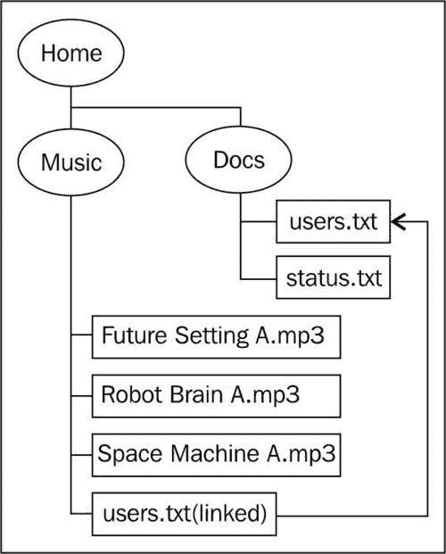

# 第 2 章使用路径定位文件和目录

在本章中，我们将介绍以下内容：

*   创建路径对象
*   java.io.File 和 java.nio.File.File 之间的互操作性
*   将相对路径转换为绝对路径
*   通过规范化路径删除冗余
*   使用路径分辨率组合路径
*   在两个位置之间创建路径
*   在路径类型之间转换
*   确定两条路径是否相等
*   管理符号链接

# 导言

文件系统是在计算机上组织数据的一种方式。通常，它由一个或多个顶级目录组成，每个目录都包含一个文件层次结构。顶级目录通常称为根目录。此外，文件系统存储在介质上，称为文件存储。

Java7 引入了许多新的类和接口，使使用文件系统更容易、更高效。这在很大程度上补充了 `java.io`包中的旧类。

在本章和后续章节中，我们将演示如何使用目录结构管理文件系统，如下图所示：



椭圆形表示目录/文件夹，而矩形表示文件。基于 Unix 的系统和 Windows 系统对根节点的支持不同。Unix 系统支持单个根节点，而 Windows 系统允许多个根节点。使用路径描述目录或文件的位置。路径的元素、目录和文件用正斜杠或反斜杠分隔。在 Unix 中，使用正斜杠。在 Windows 中，使用反斜杠。

音乐文件来自[http://freepd.com/70s%20Sci%20Fi/](http://freepd.com/70s%20Sci%20Fi/) 。 `status.txt`用于保存简单的状态信息，而 `users.txt`用于保存用户列表。音乐目录中的 `users.txt`文件是指向 `docs`目录中实际文件的符号链接，如红线所示。这些文件将在本章的各个示例中使用。当然，您可以使用任何您想要的文件或文件结构。

符号链接在基于 Unix 的平台中更为常见。要为音乐目录中的 `users.txt`文件创建符号链接，请在命令控制台中使用以下命令： `mklink users.txt c:\home\docs\users.txt`。这需要管理员权限才能执行。

本章涉及 `java.nio.file.Path`类所代表的路径管理。 `Path`对象被 `java.nio`包中的类广泛使用，由以下几个部分组成：

*   作为路径基础的根，如 C 驱动器
*   用于分隔组成路径的目录和文件的名称的分隔符
*   中间目录的名称
*   终端元素，可以是文件或目录

这些在*理解路径*配方中进行了讨论和说明。以下是处理文件和目录的类：

*   `java.nio. file.Paths`包含创建 `Path`对象的静态方法
*   `java.nio. file.Path`接口包含许多使用路径的方法
*   `java.nio. file.FileSystems`是用于访问文件系统的主类
*   `java.nio. file.FileSystem`表示文件系统，如 UNIX 系统上的/或 Windows 平台上的 C 驱动器
*   `java.nio. file.FileStore`表示实际存储设备，并提供设备特定信息
*   `java.nio. file.attribute.FileStoreAttributeView`提供对文件信息的访问

后面的章节将更深入地讨论最后两个类。为了获得对文件或目录的访问权，我们通常会使用 `FileSystems`类的 `getDefault`方法来检索对 JVM 可访问的文件系统的引用。为了访问特定的驱动器，我们可以使用带有表示感兴趣的驱动器或目录的**统一资源标识符**（**URI**对象的 `getFileSystem`方法。

`FileSystems`类提供了创建或访问文件系统的技术。在本章中，我们感兴趣的是类如何支持创建 `Path`对象。一旦我们引用了一个文件系统对象，我们就可以使用以下几种方法中的任意一种获得一个 `Path`对象：

*   `getPath:`这使用依赖于系统的路径来获取 `Path`对象。 `Path`对象用于定位和访问文件。
*   `getPathMatcher:`这将创建一个 `PathMatcher`。它对一个文件执行各种匹配类型的操作，并在第 5 章[中的*获取文件系统信息*配方中介绍。](05.html "Chapter 5. Managing Filesystems")
*   `getRootDirectories:`用于获取根目录列表。此方法在第 5 章[中的*获取文件系统信息*配方中进行了说明。](05.html "Chapter 5. Managing Filesystems")

*理解路径*配方中介绍了 `Path`对象的创建和一般用途。这些知识将在随后的食谱和其他章节中使用，因此一定要了解本食谱中涵盖的基本过程。

您仍然可以使用较旧的 `java.io`包元素。可以使用 `File`类的 `toPath`方法创建表示 `java.io.File`对象的路径。这在 java.io.File 和 java.nio.File.Files 之间的*互操作性*配方中进行了讨论，在维护旧代码时可能会很有用。

路径可以是相对的，也可以是绝对的。在*处理相对和绝对路径*配方中讨论了这些类型的路径和处理这些路径的技术。

路径可以包含冗余和无关元素。移除这些元素称为**规范化。***通过规范化路径*配方来消除路径中的冗余，检查了简化这些类型路径的可用技术。

可以组合路径以形成新的复合路径。这被称为解析路径，并在使用路径解析配方的*组合路径中解决。此技术可用于创建新路径，其中路径的一部分可从不同来源获得。*

当文件需要引用时，该路径有时相对于当前位置或其他位置。*在两个位置*之间创建路径的配方说明了这种路径的创建。这个过程被称为**相对化。**

不仅存在相对路径和绝对路径，还存在其他表示路径的方式，例如使用 `java.net.URI`对象。创建 `Path`对象时，不必存在实际路径。例如，可以创建 `Path`来创建新的文件系统元素。*在路径类型之间的转换*配方介绍了用于在这些不同类型的路径之间转换的方法。

路径依赖于系统。也就是说，一个系统（如 UNIX）上的路径与 Windows 系统上的路径不同。比较在同一平台上找到的两条路径可能相同，也可能不同。这在*确定两条路径是否等效*配方中进行了检验。

# 创建路径对象

需要目录或文件的路径来标识该资源。这个方法的重点是如何为典型的文件和目录操作获取一个 `Path`对象。路径用于本章以及后续许多章节中涉及文件和目录的大部分配方。

有几种方法可以创建或返回 `Path`对象。在这里，我们将研究用于创建 `Path`对象的方法，以及如何使用其方法进一步理解 Java 中使用的路径概念。

## 准备好了吗

为了创建一个 `Path`对象，我们需要使用以下任一选项：

*   `FileSystem`类的 `getPath`方法
*   `Paths`类的 `get`方法

我们将首先使用 `getPath`方法。 `get`方法在*中有解释，本配方中还有更多的*部分。

## 怎么做。。。

1.  使用 `main`方法创建控制台应用程序。在 `main`方法中，添加以下代码序列，为文件 `status.txt`创建 `Path`对象。我们将使用几个 `Path`类的方法来检查创建的路径，如下所示：

    ```java
    Path path = FileSystems.getDefault().getPath("/home/docs/status.txt");
    System.out.println();
    System.out.printf("toString: %s\n", path.toString());
    System.out.printf("getFileName: %s\n", path.getFileName());
    System.out.printf("getRoot: %s\n", path.getRoot());
    System.out.printf("getNameCount: %d\n", path.getNameCount());
    for(int index=0; index<path.getNameCount(); index++) {
    System.out.printf("getName(%d): %s\n", index, path.getName(index));
    }
    System.out.printf("subpath(0,2): %s\n", path.subpath(0, 2));
    System.out.printf("getParent: %s\n", path.getParent());
    System.out.println(path.isAbsolute());
    }

    ```

2.  注意在 `path`字符串中使用了前斜杠。这种方法适用于任何平台。但是，在 Windows 上，您也可以使用如下所示的反斜杠：

    ```java
    Path path = FileSystems.getDefault().getPath("\\home\\docs\\status.txt");

    ```

3.  虽然这两种方法都适用于 Windows 平台，但正斜杠的使用更具可移植性。
4.  Execute the program. Your output should appear as follows:

    **toString:\home\docs\status.txt**

    **getFileName:status.txt**

    **getRoot:\**

    **getNameCount:3**

    **getName（0）：主页**

    **获取名称（1）：单据**

    **getName（2）：status.txt**

    **子路径（0,2）：home\docs**

    **getParent:\home\docs**

    **假**

## 它是如何工作的。。。

`Path`对象是使用调用链接创建的，从 `FileSystems`类的 `getDefault`方法开始。这将返回一个表示 JVM 可用的文件系统的 `FileSystem`对象。 `FileSystem`对象通常指当前用户的工作目录。接下来，使用表示感兴趣文件的字符串执行 `getPath`方法。

其余的代码使用各种方法来显示有关路径的信息。如本章介绍中所述，我们可以使用 `Path`类的方法显示有关路径部分的信息。 `toString`方法针对路径执行，以说明默认情况下得到的结果。

`getFileName`返回 `Path`对象的文件名， `getRoot`返回根。 `getNameCount`方法返回中间目录的数量加上一个文件名。for 循环列出了路径的元素。在本例中，有两个目录和一个文件，计数为三。这三个元素构成了路径。

虽然使用了一个简单的 for 循环来显示这些名称，但我们也可以使用 `iterator`方法来列出这些名称，如下代码所示：

```java
Iterator iterator = path.iterator();
while(iterator.hasNext()) {
System.out.println(iterator.next());
}

```

`Path`对象可能由其他路径组成。可以使用 `subpath`方法检索子路径。该方法有两个参数。第一个参数表示初始索引，第二个参数专门指定最后一个索引。在本例中，第一个参数设置为 0，表示要检索根级目录。最后一个索引设置为 2，这意味着只列出了前两个目录。

本例中的 `getParent`方法也返回了相同的路径。但是，请注意，它以反斜杠开头。这表示从每个元素后面的顶级元素（最后一个元素除外）开始的路径。

## 还有更多。。。

有几个问题需要进一步考虑：

*   使用 `Paths`类的 `get`方法
*   父路径的含义

### 使用路径类的 get 方法

`Paths`类的 `get`方法也可以用来创建 `Path`对象。此方法使用数量可变的 `String`参数来构造路径。在下面的代码序列中，从当前文件系统的根开始创建一个 `path`：

```java
try {
path = Paths.get("/home", "docs", "users.txt");
System.out.printf("Absolute path: %s", path.toAbsolutePath());
}
catch (InvalidPathException ex) {
System.out.printf("Bad path: [%s] at position %s",
ex.getInput(), ex.getIndex());
}

```

使用 `toAbsolutePath`方法的输出显示了构建的路径。注意**E**元素。该代码在 Windows 系统上执行，其中当前驱动器为**E**驱动器。 `toAbsolutePath`方法在*使用相对路径和绝对路径*配方中进行了讨论。

**绝对路径：E:\home\docs\users.txt**

如果我们在路径的 `String`中不使用正斜杠，那么该路径将基于当前工作目录创建。删除正斜杠并执行程序。您的输出应该类似于以下内容，其中在执行代码时，**currentDirectory**被替换为正在使用的：

**绝对路径：currentDirectory\home\docs\users.txt**

更灵活的方法是使用解析方法，如使用路径解析配方的*组合路径中所述。*

输入参数到路径的转换取决于系统。如果创建路径时使用的字符对文件系统无效，则抛出一个 `java.nio.file.InvalidPathException`。例如，在大多数文件系统中，空值是非法字符。为了说明这一点，在 `path`字符串中添加反斜杠 0，如下代码所示：

```java
path = Paths.get("/home\0", "docs", "users.txt");

```

执行时，部分输出将显示如下：

**错误路径：[/home\docs\users.txt]位于位置 5**

`InvalidPathException`类“ `getInput`方法返回用于创建路径的连接字符串。 `getIndex`方法返回违规字符的位置，在本例中为空字符。

### 父路径的含义

`getParent`方法返回父路径。但是，该方法不访问文件系统。这意味着对于给定的 `Path`对象，可能存在也可能不存在父对象。

考虑下面的路径声明：

```java
path = Paths.get("users.txt");

```

指在当前工作目录中找到的 `users.txt`文件。 `getNameCount`将返回 1， `getParent`方法将返回 null。实际上，该文件存在于目录结构中，并且有一个根目录和一个父目录。因此，该方法的结果在某些情况下可能没有用处。

此方法的使用大致相当于以下 `subpath`方法的使用：

```java
path = path.subpath(0,path.getNameCount()-1));

```

## 另见

`toRealPath`方法在*使用相对和绝对路径*配方和*通过规范化路径*配方消除路径中的冗余中进行了讨论。

# java.io.File 与 java.nio.File.Files 的互操作性

在引入 `java.nio`包之前， `java.io`包的类和接口是 Java 开发人员唯一可以使用的文件和目录。虽然更新的包补充了 `java.io`包的大部分功能，但仍然可以使用较旧的类，尤其是 `java.io.File`类。本食谱讨论了如何实现这一点。

## 准备好了吗

要使用 `File`类获取 `Path`对象，需要遵循以下步骤：

1.  创建一个表示感兴趣文件的 `java.io.File`对象
2.  对其应用 `toPath`方法获得 `Path`对象

## 怎么做。。。

1.  创建一个控制台应用程序。添加以下主要方法，其中我们创建一个 `File`对象和一个 `Path`对象，表示同一个文件。接下来，我们比较两个对象以确定它们是否表示相同的文件：

    ```java
    public static void main(String[] args) {
    try {
    Path path =
    Paths.get(new URI("file:///C:/home/docs/users.txt"));
    File file = new File("C:\\home\\docs\\users.txt");
    Path toPath = file.toPath();
    System.out.println(toPath.equals(path));
    }
    catch (URISyntaxException e) {
    System.out.println("Bad URI");
    }
    }

    ```

2.  当您执行应用程序时，输出将为 true。

## 它是如何工作的。。。

创建了两个 `Path`对象。第一个 `Path`对象是使用 Paths 类的 `get`方法声明的。它使用一个 `java.net.URI`对象为 `users.txt`文件创建了一个 `Path`对象。第二个 `Path`对象 `toPath`是使用 `toPath`方法从 `File`对象创建的。路径的 `equals`方法被用来证明路径是等价的。

### 提示

请注意，用于表示文件的字符串使用了向前斜杠和向后斜杠。 `URI`字符串使用前斜杠，这与操作系统无关。然而，反斜杠用于 Windows 路径。

## 另见

`Path`对象的创建如*理解路径*配方所示。此外，*使用相对路径和绝对路径*配方中还讨论了 `URI`对象的创建。

# 将相对路径转换为绝对路径

路径可以表示为绝对路径或相对路径。两者都很常见，在不同的情况下都很有用。 `Path`类和相关类支持创建绝对路径和相对路径。

相对路径用于指定文件或目录相对于当前目录位置的位置。通常，一个或两个点分别用于指示当前目录或下一个更高级别的目录。但是，创建相对路径时不需要使用点。

绝对路径从根级别开始，并根据操作系统列出每个目录（由正向斜杠或反向斜杠分隔），直到达到所需的目录或文件为止。

在本配方中，我们将确定用于当前系统的路径分隔符，并学习如何将相对路径转换为绝对路径。这在处理文件名的用户输入时非常有用。与绝对路径和相对路径相关的是路径的 URI 表示。我们将学习如何使用 `Path`类的 `toUri`方法返回给定路径的表示。

## 准备好了吗

在处理绝对路径和相对路径时，经常使用以下方法：

*   `getSeparator`方法确定文件分隔符
*   `subpath`方法获取路径的一部分或所有部分/元素
*   `toAbsolutePath`方法获取相对路径的绝对路径
*   `toUri`方法获取路径的 URI 表示

## 怎么做。。。

1.  我们将逐一介绍前面的每个方法。首先使用以下 `main`方法创建控制台应用程序：

    ```java
    public static void main(String[] args) {
    String separator = FileSystems.getDefault().getSeparator();
    System.out.println("The separator is " + separator);
    try {
    Path path = Paths.get(new URI("file:///C:/home/docs/users.txt"));
    System.out.println("subpath: " + path.subpath(0, 3));
    path = Paths.get("/home", "docs", "users.txt");
    System.out.println("Absolute path: " + path.toAbsolutePath());
    System.out.println("URI: " + path.toUri());
    }
    catch (URISyntaxException ex) {
    System.out.println("Bad URI");
    }
    catch (InvalidPathException ex) {
    System.out.println("Bad path: [" + ex.getInput() + "] at position " + ex.getIndex());
    }
    }

    ```

2.  Execute the program. On a Windows platform, the output should appear as follows:

    **分离器为\**

    **子路径：home\docs\users.txt**

    **绝对路径：E:\home\docs\users.txt**

    **URI：file:///E:/home/docs/users.txt**

## 它是如何工作的。。。

`getDefault`方法返回一个 `FileSystem`对象，表示 JVM 当前可访问的文件系统。对该对象执行 `getSeparator`方法，返回一个反斜杠字符，指示该代码是在 Windows 计算机上执行的。

为 `users.txt`文件创建了 `Path`对象，并对其执行了 `subpath`方法。在*理解路径*配方中对该方法进行了更详细的讨论。 `subpath`方法始终返回相对路径。

接下来，使用 `get`方法创建路径。由于正斜杠用于第一个参数，因此路径从当前文件系统的根开始。在本例中，提供的路径是相对的。

路径的 URI 表示与绝对路径和相对路径相关。 `Path`类“ `toUri`方法返回给定路径的表示形式。 `URI`对象用于表示 Internet 上的资源。在本例中，它以文件的 URI 方案的形式返回一个字符串。

绝对路径可通过 `Path`类 `toAbsolutePath`方法获得。绝对路径包含根元素和路径的所有中间元素。当要求用户输入文件名时，这可能很有用。例如，如果要求用户提供文件名以保存结果，则可以将该文件名添加到表示工作目录的现有路径中。然后可以获得绝对路径，并根据需要使用。

## 还有更多。。。

请记住， `toAbsolutePath`方法无论路径引用的是有效的文件还是目录都有效。上一个示例中使用的文件不需要存在。考虑使用伪文件，如下面的代码所示。假设指定目录中不存在文件 `bogusfile.txt`

```java
Path path = Paths.get(new URI("file:///C:/home/docs/bogusfile.txt"));
System.out.println("File exists: " + Files.exists(path));
path = Paths.get("/home", "docs", "bogusfile.txt");
System.out.println("File exists: " + Files.exists(path));

```

程序执行时，输出如下：

**分离器为\**

**文件存在：false**

**子路径：home\docs\bogusfile.txt**

**文件存在：false**

**绝对路径：E:\home\docs\bogusfile.txt**

**URI：file:///E:/home/docs/bogusfile.txt**

如果我们想知道这是否是一条真正的路径，我们可以使用*中讨论的 `toRealPath`方法，通过规范化路径*配方来消除路径中的冗余。

## 另见

可以使用 `normalize`方法移除路径中的冗余，如*通过规范化路径*配方移除路径中的冗余中所述。

当文件使用符号链接时，路径可能不是文件的真实路径。 `Path`类“ `toRealPath`方法将返回文件的实际绝对路径。这在通过规范化路径配方来消除路径中的冗余的*中得到了证明。*

# 通过规范化路径消除冗余

当在定义路径时使用“.”或“.”符号时，它们的使用可能会引入冗余。也就是说，可以通过移除或以其他方式改变路径来简化所描述的路径。本配方讨论了使用 `normalize`方法来影响这种类型的转换。通过简化路径，它可以避免错误并提高应用程序的性能。 `toRealPath`方法也执行规范化，并在*中进行了解释，还有更多。。*。这是食谱的一部分。

## 准备好了吗

用于删除路径中的冗余的基本步骤包括：

*   识别可能包含冗余的路径
*   使用 `normalize`方法消除冗余

## 怎么做。。。

为了方便起见，这里复制了介绍中的目录结构：


首先考虑以下路径：

```java
/home/docs/../music/ Space Machine A.mp3
/home/./music/ Robot Brain A.mp3

```

这些包含冗余或无关部分。在第一个示例中，路径从 `home`开始，然后向下到 `docs`目录。 `.`。符号然后返回到 `home`目录。然后沿着 `music`目录进入 `mp3`文件。 `docs/.`。元素是无关的。

在第二个示例中，路径从 `home`开始，然后遇到一个周期。表示当前目录，即 `home`目录。接下来，路径沿着 `music`目录向下，然后遇到 `mp3`文件。 `/`。是多余的，不需要。

1.  创建新的控制台应用程序并添加以下 `main`方法：

    ```java
    public static void main(String[] args) {
    Path path = Paths.get("/home/docs/../music/Space Machine A.mp3");
    System.out.println("Absolute path: " + path.toAbsolutePath());
    System.out.println("URI: " + path.toUri());
    System.out.println("Normalized Path: " + path.normalize());
    System.out.println("Normalized URI: " + path.normalize().toUri());
    System.out.println();
    path = Paths.get("/home/./music/ Robot Brain A.mp3");
    System.out.println("Absolute path: " + path.toAbsolutePath());
    System.out.println("URI: " + path.toUri());
    System.out.println("Normalized Path: " + path.normalize());
    System.out.println("Normalized URI: " + path.normalize().toUri());
    }

    ```

2.  Execute the application. You should get the following output, though the root directory may differ depending on the configuration of your system:

    **绝对路径：E:\home\docs\..\music\Space Machine A.mp3**

    **URI：file:///E:/home/docs/../music/Space%20Machine%20A.mp3**

    **规范化路径：\home\music\Space Machine A.mp3**

    **规范化 URI：file:///E:/home/music/Space%20Machine%20A.mp3**

    **绝对路径：E:\home\.\music\Robot Brain A.mp3**

    **URI：file:///E:/home/./music/%20Robot%20Brain%20A.mp3**

    **规范化路径：\home\music\Robot Brain A.mp3**

    **规范化 URI：file:///E:/home/music/%20Robot%20Brain%20A.mp3**

## 它是如何工作的。。。

`Paths`类“ `get`方法用于使用前面讨论的冗余外部路径创建两条路径。 `get`方法后面的代码显示了绝对路径和 URI 等价物，以说明实际创建的路径。接下来，使用 `normalize`方法，然后与 `toUri`方法链接，以进一步说明规范化过程。请注意，冗余和无关的路径元素已消失。*使用相对路径和绝对路径*配方中讨论了 `toAbsolutePath`和 `toUri`方法。

`normalize`方法不检查文件或路径是否有效。该方法只是对路径执行语法操作。如果符号链接是原始路径的一部分，则规范化路径可能不再有效。符号链接在*管理符号链接*配方中讨论。

## 还有更多。。。

`Path`类“ `toRealPath`将返回表示文件实际路径的路径。它会检查路径是否有效，如果文件不存在，它会返回一个 `java.nio.file.NoSuchFileException`。

修改上一个示例，对不存在的文件使用 `toRealPath`方法，如下代码所示：

```java
try
Path path = Paths.get("/home/docs/../music/NonExistentFile.mp3");
System.out.println("Absolute path: " + path.toAbsolutePath());
System.out.println("Real path: " + path.toRealPath());
}
catch (IOException ex) {
System.out.println("The file does not exist!");
}

```

执行应用程序。结果应包含以下输出：

**绝对路径：\\Richard pc\e\home\docs\..\music\NonExistentFile.mp3**

**该文件不存在！**

`toRealPath`方法规范化路径。它还解析任何符号链接，尽管本例中没有符号链接。

## 另见

*理解路径*配方中讨论了 `Path`对象的创建。符号链接在*管理符号链接*配方中讨论。

# 使用路径分辨率组合路径

`resolve`方法用于组合两条路径，其中一条包含根元素，另一条是部分路径。这在创建可能不同的路径（例如应用程序安装中使用的路径）时非常有用。例如，可能存在安装应用程序的默认目录。但是，用户可以选择不同的目录或驱动器。使用 `resolve`方法创建路径，可以独立于实际安装目录配置应用程序。

## 准备好了吗

`resolve`方法的使用包括两个基本步骤：

*   创建一个使用根元素的 `Path`对象
*   使用第二个部分路径对此路径执行 `resolve`方法

部分路径是只提供完整路径的一部分且不包含根元素的路径。

## 怎么做。。。

1.  创建一个新的应用程序。增加以下 `main`方式：

    ```java
    public static void main(String[] args) {
    Path rootPath = Paths.get("/home/docs");
    Path partialPath = Paths.get("users.txt");
    Path resolvedPath = rootPath.resolve(partialPath);
    System.out.println("rootPath: " + rootPath);
    System.out.println("partialPath: " + partialPath);
    System.out.println("resolvedPath: " + resolvedPath);
    System.out.println("Resolved absolute path: " + resolvedPath.toAbsolutePath());
    }

    ```

2.  Execute the code. You should get the following output:

    **根路径：\home\docs**

    **partialPath:users.txt**

    **解析路径：\home\docs\users.txt**

    **解析的绝对路径：E:\home\docs\users.txt**

## 它是如何工作的。。。

创建了以下三条路径：

*   `\home\docs:`这是根路径
*   `users.txt:`这是部分路径
*   `\home\docs\users.txt:`这是结果解析路径

解析路径是使用 `partialPath`变量作为针对 `rootPath`变量执行的 `resolve`方法的参数创建的。然后显示这些路径以及 `resolvedPath`的绝对路径。绝对路径包括根目录，尽管这在您的系统上可能有所不同。

## 还有更多。。。

`resolve`方法重载，一个使用 `String`参数，第二个使用 `Path`参数。 `resolve`方法也可能被误用。此外，还有一种 `overloadedresolveSibling`方法，其工作原理与 `resolve`方法类似，只是它删除了根路径的最后一个元素。这里讨论了这些问题。

### 使用带 resolve 方法的字符串参数

`resolve`方法重载为接受 `String`参数的方法。以下语句将获得与上一示例相同的结果：

```java
Path resolvedPath = rootPath.resolve("users.txt");

```

路径分隔符也可以按如下方式使用：

```java
Path resolvedPath = rootPath.resolve("backup/users.txt");

```

将这些语句与前面的代码一起使用会产生以下输出：

**根路径：\home\docs**

**partialPath:users.txt**

**解析路径：\home\docs\backup\users.txt**

**解析的绝对路径：E:\home\docs\backup\users.txt**

请注意，解析的路径不一定是有效路径，因为备份目录可能存在，也可能不存在。可以使用*中的 `toRealPath`方法通过规范化路径*配方来消除路径中的冗余，以确定其是否有效。

### 解析方法使用不当

`resolve`方法有三种用途可导致意外行为：

*   根路径和部分路径的顺序不正确
*   使用部分路径两次
*   使用根路径两次

如果我们颠倒使用 `resolve`方法的顺序，即将根路径应用于部分路径，则只返回根路径。以下代码对此进行了说明：

```java
Path resolvedPath = partialPath.resolve(rootPath);

```

执行代码时，我们得到以下结果：

**根路径：\home\docs**

**partialPath:users.txt**

**解析路径：\home\docs**

**解析的绝对路径：E:\home\docs**

这里只返回根路径。部分路径不会附加到根路径。使用部分路径两次，如以下代码所示：

```java
Path resolvedPath = partialPath.resolve(partialPath);

```

将产生以下输出：

**根路径：\home\docs**

**partialPath:users.txt**

**解析路径：users.txt\users.txt**

**解析的绝对路径：currentWorkingDIrectory\users.txt\users.txt**

请注意，解析路径不正确，绝对路径使用当前工作目录。使用根路径两次，如下所示：

```java
Path resolvedPath = rootPath.resolve(rootPath);

```

结果与按相反顺序使用路径时的输出相同：

**根路径：\home\docs**

**partialPath:users.txt**

**解析路径：\home\docs**

**解析的绝对路径：E:\home\docs**

无论何时使用绝对路径作为 `resolve`方法的参数，都会返回该绝对路径。如果将空路径用作方法的参数，则返回根路径。

### 使用兄弟姐妹

`resolveSibling`方法重载了 `String`或 `Path`对象。使用 `resolve`方法，将部分路径附加到根路径的末尾。 `resolveSibling`方法与 `resolve`方法的不同之处在于，在附加部分路径之前删除根路径的最后一个元素。考虑下面的代码序列：

```java
Path rootPath = Paths.get("/home/music/");
resolvedPath = rootPath.resolve("tmp/Robot Brain A.mp3");
System.out.println("rootPath: " + rootPath);
System.out.println("resolvedPath: " + resolvedPath);
System.out.println();
resolvedPath = rootPath.resolveSibling("tmp/Robot Brain A.mp3");
System.out.println("rootPath: " + rootPath);
System.out.println("resolvedPath: " + resolvedPath);

```

执行时，我们得到以下输出：

**根路径：\home\music**

**解析路径：\home\music\tmp\Robot Brain A.mp3**

**根路径：\home\music**

**解析路径：\home\tmp\Robot Brain A.mp3**

请注意，在目录 `music`的存在下，解析的路径不同。使用 `resolve`方法时，目录存在。当使用 `resolveSibling`方法时不存在。如果没有父路径，或者方法的参数是绝对路径，则返回传递给方法的参数。如果参数为空，则返回父级。

## 另见

在*理解路径*配方中讨论了 `Path`对象的创建。此外，在通过规范化路径配方来消除路径中的冗余的*中解释了 `toRealPath`方法。*

# 在两个位置之间创建路径

相对化路径意味着基于其他两条路径创建一条路径，以便新路径表示从一条原始路径导航到另一条路径的方式。这种技术可以找到从一个位置到另一个位置的相对路径。例如，第一个路径可以表示应用程序默认目录。第二条路径可以表示目标目录。从这些目录创建的相对路径可以促进针对目标的操作。

## 准备好了吗

要使用 `relativize`方法创建从一条路径到另一条路径的新路径，我们需要执行以下操作：

1.  创建一个表示第一条路径的 `Path`对象。
2.  创建一个表示第二条路径的 `Path`对象。
3.  使用第二条路径作为参数，对第一条路径应用 `relativize`方法。

## 怎么做。。。

1.  创建一个新的控制台应用程序，并使用以下 `main`方法。此方法创建两个 `Path`对象，并显示它们之间的相对路径如下：

    ```java
    public static void main(String[] args) {
    Path firstPath;
    Path secondPath;
    firstPath = Paths.get("music/Future Setting A.mp3");
    secondPath = Paths.get("docs");
    System.out.println("From firstPath to secondPath: " + firstPath.relativize(secondPath));
    System.out.println("From secondPath to firstPath: " + secondPath.relativize(firstPath));
    System.out.println();
    firstPath = Paths.get("music/Future Setting A.mp3");
    secondPath = Paths.get("music");
    System.out.println("From firstPath to secondPath: " + firstPath.relativize(secondPath));
    System.out.println("From secondPath to firstPath: " + secondPath.relativize(firstPath));
    System.out.println();
    firstPath = Paths.get("music/Future Setting A.mp3");
    secondPath = Paths.get("docs/users.txt");
    System.out.println("From firstPath to secondPath: " + firstPath.relativize(secondPath));
    System.out.println("From secondPath to firstPath: " + secondPath.relativize(firstPath));
    System.out.println();
    }

    ```

2.  Execute the application. Your results should be similar to the following:

    **从第一条路径到第二条路径：..\..\docs**

    **从第二路径到第一路径：…\music\Future Setting A.mp3**

    **从第一条路径到第二条路径：。。**

    **从第二路径到第一路径：未来设置 A.mp3**

    **从第一路径到第二路径：..\..\docs\users.txt**

    **从 secondPath 到 firstPath:..\..\music\Future Setting A.mp3**

## 它是如何工作的。。。

在第一个示例中，创建了从 `Future Setting A.mp3`文件到 `docs`目录的相对路径。假设 `music`和 `docs`目录是兄弟目录。 `.`。符号表示向上移动一个目录。本章的引言说明了本示例假定的目录结构。

第二个示例演示如何从同一目录中创建路径。从 `firstpath`到 `secondPath`的路径实际上是一个潜在的错误。根据使用方式的不同，我们可能会在 `music`目录上方的目录中结束，因为返回的路径是 `.`。意思是向上移动一个目录级别。第三个示例与第一个示例类似，只是两个路径都包含文件名。

此方法创建的相对路径可能不是有效路径。这可以通过使用可能不存在的 `tmp`目录来说明，如下所示：

```java
firstPath = Paths.get("music/Future Setting A.mp3");
secondPath = Paths.get("docs/tmp/users.txt");
System.out.println("From firstPath to secondPath: " + firstPath.relativize(secondPath));
System.out.println("From secondPath to firstPath: " + secondPath.relativize(firstPath));

```

输出应如下所示：

**从第一路径到第二路径：..\..\docs\tmp\users.txt**

**从第二路径到第一路径：…\..\music\Future Setting A.mp3**

## 还有更多。。。

我们还需要考虑三种情况：

*   两条路是相等的
*   一个路径包含一个根
*   两个路径都包含一个根

### 两条路径相等

当两条路径相等时， `relativize`方法将返回一条空路径，如以下代码序列所示：

```java
firstPath = Paths.get("music/Future Setting A.mp3");
secondPath = Paths.get("music/Future Setting A.mp3");
System.out.println("From firstPath to secondPath: " + firstPath.relativize(secondPath));
System.out.println("From secondPath to firstPath: " + secondPath.relativize(firstPath));
System.out.println();

```

结果如下：

**从第一路径到第二路径：**

**从第二路径到第一路径：**

虽然这不一定是错误，但请注意，它不会返回一个经常用于表示当前目录的点。

### 一条路径包含一个根

如果只有一个路径包含根元素，则可能无法构造相对路径。是否可能取决于系统。在下面的示例中，第一条路径包含根元素 `c:`

```java
firstPath = Paths.get("c:/music/Future Setting A.mp3");
secondPath = Paths.get("docs/users.txt");
System.out.println("From firstPath to secondPath: " + firstPath.relativize(secondPath));
System.out.println("From secondPath to firstPath: " + secondPath.relativize(firstPath));
System.out.println();

```

在 Windows 7 上执行此代码序列时，我们得到以下输出：

**线程“main”java.lang.IllegalArgumentException 中的异常：“other”是不同类型的路径**

**从第一条路径到第二条路径：。**。

**从第二路径到第一路径：未来设置 A.mp3**

**atsun.nio.fs.WindowsPath.relativize（WindowsPath.java:388）**

**atsun.nio.fs.WindowsPath.relativize（WindowsPath.java:44）**

**atpackt.relatilizepathexample.main（relatilizepathexample.java:25）**

**Java 结果：1**

注意输出中对**其他**的引用。这是指 `relativize`方法的参数。

### 两条路径都包含一个根

当两条路径都包含根元素时， `relativize`方法创建相对路径的能力也依赖于系统。下面的例子说明了这种情况：

```java
firstPath = Paths.get("c:/music/Future Setting A.mp3");
secondPath = Paths.get("c:/docs/users.txt");
System.out.println("From firstPath to secondPath: " + firstPath.relativize(secondPath));
System.out.println("From secondPath to firstPath: " + secondPath.relativize(firstPath));
System.out.println();

```

在 Windows 7 上执行时，我们得到以下输出：

**从第一路径到第二路径：..\..\docs\users.txt**

**从 secondPath 到 firstPath:..\..\music\Future Setting A.mp3**

## 另见

*理解路径*配方中讨论了 `Path`对象的创建。符号链接结果取决于系统，并在*管理符号链接*配方中进行了更深入的讨论。

# 路径类型之间的转换

`Path`接口表示文件系统中的路径。此路径可能是有效路径，也可能不是有效路径。有时，我们可能希望使用路径的替代表示。例如，一个文件可以使用 `URI`加载到大多数浏览器中。 `toUri`方法提供了路径的这种表示。在这个配方中，我们还将看到如何获得 `Path`对象的绝对路径和真实路径。

## 准备好了吗

提供替代路径表示的方法有三种：

*   `toUri`方法返回 `URI`表示法
*   `toAbsolutePath`方法返回绝对路径
*   `toRealPath`方法返回实际路径

## 怎么做。。。

1.  创建一个新的控制台应用程序。在 `main`方法中，我们将使用前面的每一种方法。在申请中增加以下 `main`方式：

    ```java
    public static void main(String[] args) {
    try {
    Path path;
    path = Paths.get("users.txt");
    System.out.println("URI path: " + path.toUri());
    System.out.println("Absolute path: " + path.toAbsolutePath());
    System.out.println("Real path: " + path.toRealPath(LinkOption.NOFOLLOW_LINKS));
    }
    catch (IOException ex) {
    Logger.getLogger(ConvertingPathsExample.class.getName()).log(Level.SEVERE, null, ex);
    }
    }

    ```

2.  If not already present, add a `users.txt` file in the working directory of your application. Execute the program. Your output should be similar to the following, except the **..**. in this output should reflect the location of the `users.txt` file:

    **URI 路径：file:///.../ConvertingPathsExample/users.txt**

    **绝对路径…\ConvertingPathsExample\users.txt**

    **实路径：…\ConvertingPathsExample\users.txt**

## 它是如何工作的。。。

一个 `users.txt`文件被添加到 Java 应用程序的工作目录中。此文件应包含用户名列表。 `get`方法返回表示此文件的 `Path`对象。然后对该对象执行这三个方法中的每一个。

`toUri`和 `toAbsolutePath`方法返回了该方法类型的预期路径。返回的路径取决于应用程序的工作目录。 `toRealPath`方法应该返回与 `toAbsolutePath`方法相同的输出。这是意料之中的，因为 `users.txt`文件不是作为符号链接创建的。如果这是一个符号链接，那么将显示一个表示文件实际路径的不同路径。

## 还有更多。。。

由于 `Path`对象可能并不实际表示文件，因此如果文件不存在， `toRealPath`方法的使用可能会抛出 `java.nio.file.NoSuchFileException`。使用无效的文件名，如下所示：

```java
path = Paths.get("invalidFileName.txt");

```

输出应如下所示：

**URI 路径：file:///.../ConvertingPathsExample/invalidFileName.txt**

**绝对路径：…\ConvertingPathSeSample\invalidFileName.txt**

**2011 年 9 月 11 日下午 6:40:40 包装转换路径取样总管**

**严重：空**

**java.nio.file.NoSuchFileException:…\ConvertingPathSeSample\invalidFileName.txt**

请注意，无论指定的文件是否存在， `toUri`和 `toAbsolutePath`都可以工作。在我们想要使用这些方法的情况下，我们可以使用 `Files`类的 `exists`方法来测试文件是否存在。前面的代码序列已经修改为使用 `exists`方法，如下所示：

```java
if(Files.exists(path)) {
System.out.println("Real path: " + path.toRealPath(LinkOption.NOFOLLOW_LINKS));
}
else {
System.out.println("The file does not exist");
}

```

Java7 中增加了 `java.nio.fil.LinkOption`枚举。它用于指定是否应遵循符号链接。

执行时，输出应如下所示：

**URI 路径：file:///.../ConvertingPathsExample/invalidFileName.txt**

**绝对路径：…\ConvertingPathSeSample\invalidFileName.txt**

**文件不存在**

# 确定两条路径是否相等

有时可能需要比较路径。 `Path`类允许您使用 `equals`方法测试路径是否相等。您还可以使用 `compareTo`方法，通过 `Comparable`接口的实现，按字典顺序比较两条路径。最后，可以使用 `isSameFile`方法确定两个 `Path`对象是否将定位同一个文件。

## 准备好了吗

要比较两条路径，您必须：

1.  创建一个表示第一条路径的 `Path`对象。
2.  创建一个表示第二条路径的 `Path`对象。
3.  根据需要对路径应用 `equals, compareTo`或 `isSameFile`方法。

## 怎么做。。。

1.  创建一个新的控制台应用程序并添加一个 `main`方法。声明三个 `Path`对象变量，如 `path1, path2`和 `path3`。将前两个设置为相同的文件，将第三个设置为不同的路径。这三个文件都必须存在。接下来调用三种比较方法：

    ```java
    public class ComparingPathsExample {
    public static void main(String[] args) {
    Path path1 = null;
    Path path2 = null;
    Path path3 = null;
    path1 = Paths.get("/home/docs/users.txt");
    path2 = Paths.get("/home/docs/users.txt");
    path3 = Paths.get("/home/music/Future Setting A.mp3");
    testEquals(path1, path2);
    testEquals(path1, path3);
    testCompareTo(path1, path2);
    testCompareTo(path1, path3);
    testSameFile(path1, path2);
    testSameFile(path1, path3);
    }

    ```

2.  增加以下三种静态方式：

    ```java
    private static void testEquals(Path path1, Path path2) {
    if (path1.equals(path2)) {
    System.out.printf("%s and %s are equal\n",
    path1, path2);
    }
    else {
    System.out.printf("%s and %s are NOT equal\n",
    path1, path2);
    }
    }
    private static void testCompareTo(Path path1, Path path2) {
    if (path1.compareTo(path2) == 0) {
    System.out.printf("%s and %s are identical\n",
    path1, path2);
    }
    else {
    System.out.printf("%s and %s are NOT identical\n",
    path1, path2);
    }
    }
    private static void testSameFile(Path path1, Path path2) {
    try {
    if (Files.isSameFile(path1, path2)) {
    System.out.printf("%s and %s are the same file\n",
    path1, path2);
    }
    else {
    System.out.printf("%s and %s are NOT the same file\n",
    path1, path2);
    }
    }
    catch (IOException e) {
    e.printStackTrace();
    }
    }

    ```

3.  Execute the application. Your output should be similar to the following:

    **\home\docs\users.txt 与\home\docs\users.txt 相等**

    **\home\docs\users.txt 与\home\music\Future Setting A.mp3 不相等**

    **\home\docs\users.txt 与\home\docs\users.txt 相同**

    **\home\docs\users.txt 与\home\music\Future Setting A.mp3 不相同**

    **\home\docs\users.txt 和\home\docs\users.txt 是同一个文件**

    **\home\docs\users.txt 和\home\music\Future Setting A.mp3 不是同一个文件**

## 它是如何工作的。。。

在 `testEquals`方法中，我们确定路径对象是否被视为相等。如果它们相等， `equals`方法将返回 true。然而，平等的定义取决于制度。除其他因素外，一些文件系统将使用案例来确定路径是否相等。

`testCompareTo`方法使用 `compareTo`方法按字母顺序比较路径。如果路径相同，则该方法返回零。如果路径小于参数，则该方法返回一个小于零的整数；如果路径按字典顺序跟随参数，则该方法返回一个大于零的值。

`testSameFile`方法确定路径是否位于同一文件。首先测试 `Path`对象，看它们是否是相同的对象。如果是，则该方法将返回 true。如果 `Path`对象不相等，则该方法确定路径是否位于同一文件。如果 `Path`对象是由不同的文件系统提供程序生成的，则该方法将返回 false。由于该方法可能抛出一个 `IOException.`，因此使用了一个 try 块

## 还有更多。。。

`equals`和 `compareTo`方法无法成功比较来自不同文件系统的路径。但是，只要文件在同一个文件系统上，所讨论的文件就不必存在，文件系统也不会被访问。如果被测试的路径对象不相等， `isSameFile`方法可能需要访问文件。在这种情况下，文件必须存在，否则方法将返回 false。

## 另见

`Files`类“ `exists`和 `notExists`方法可用于确定文件或目录是否存在。这包含在[第三章](03.html "Chapter 3. Obtaining File and Directory Information")*获取文件和目录信息*中的*获取文件和目录信息*配方中。

# 管理符号链接

符号链接用于创建对实际存在于不同目录中的文件的引用。在引言中，详细介绍了一个文件层次结构，其中两次列出了文件 `users.txt`；一次在 `docs`目录中，第二次在 `music`目录中。实际文件位于 `docs`目录中。 `music`目录中的 `users.txt`文件是指向真实文件的符号链接。对于用户来说，它们似乎是不同的文件。实际上，它们是一样的。修改任何一个文件都会导致实际文件被更改。

从程序员的角度来看，我们通常有兴趣知道哪些文件是符号链接，哪些不是。在本食谱中，我们将讨论 Java7 中使用符号链接的可用方法。理解方法在与符号链接一起使用时的行为非常重要。

## 准备好了吗

虽然根据 `Path`对象是否表示符号链接，有几种方法的行为可能有所不同，但在本章中，只有 `toRealPath, exists`和 `notExists`方法采用可选的 `LinkOption`枚举参数。此枚举只有一个元素： `NOFOLLOW_LINKS`。如果未使用参数，则这些方法默认为以下符号链接。

## 怎么做。。。

1.  创建一个新的控制台应用程序。使用下面的 `main`方法，我们创建几个 `Path`对象，同时表示实文件和符号 `users.txt`文件。本章的几个 `Path-related`方法的行为将得到说明。

    ```java
    public static void main(String[] args) {
    Path path1 = null;
    Path path2 = null;
    path1 = Paths.get("/home/docs/users.txt");
    path2 = Paths.get("/home/music/users.txt");
    System.out.println(Files.isSymbolicLink(path1));
    System.out.println(Files.isSymbolicLink(path2));
    try {
    Path path = Paths.get("C:/home/./music/users.txt");
    System.out.println("Normalized: " + path.normalize());
    System.out.println("Absolute path: " + path.toAbsolutePath());
    System.out.println("URI: " + path.toUri());
    System.out.println("toRealPath (Do not follow links): " + path.toRealPath(LinkOption.NOFOLLOW_LINKS));
    System.out.println("toRealPath: " + path.toRealPath());
    Path firstPath = Paths.get("/home/music/users.txt");
    Path secondPath = Paths.get("/docs/status.txt");
    System.out.println("From firstPath to secondPath: " + firstPath.relativize(secondPath));
    System.out.println("From secondPath to firstPath: " + secondPath.relativize(firstPath));
    System.out.println("exists (Do not follow links): " + Files.exists(firstPath, LinkOption.NOFOLLOW_LINKS));
    System.out.println("exists: " + Files.exists(firstPath));
    System.out.println("notExists (Do not follow links): " + Files.notExists(firstPath, LinkOption.NOFOLLOW_LINKS));
    System.out.println("notExists: " + Files.notExists(firstPath));
    }
    catch (IOException ex) {
    Logger.getLogger(SymbolicLinkExample.class.getName()).log(Level.SEVERE, null, ex);
    }
    catch (InvalidPathException ex) {
    System.out.println("Bad path: [" + ex.getInput() + "] at position " + ex.getIndex());
    }
    }

    ```

2.  The behavior of these methods can differ based on the underlying operating system. When the code is executed on a Windows platform, we get the following output:

    **假**

    **正确**

    **规范化：C:\home\music\users.txt**

    **绝对路径：C:\home\.\music\users.txt**

    **URI：file:///C:/home/./music/users.txt**

    **toRealPath（不要跟随链接）：C:\home\music\users.txt**

    **toRealPath:C:\home\docs\users.txt**

    **从第一路径到第二路径：..\..\docs\status.txt**

    **从 secondPath 到 firstPath:..\..\home\music\users.txt**

    **存在（不跟随链接）：真**

    **存在：真**

    **notExists（不跟随链接）：false**

    **notExists:false**

## 它是如何工作的。。。

创建了分别引用真实文件和符号链接的 `path1`和 `path2`对象。对这些对象执行了 `Files`类“ `isSymbolicLink`方法，指示哪个路径引用了实际文件。

`Path`对象是使用无关的点符号创建的。针对符号链接执行的 `normalize`方法的结果返回到符号链接的规范化路径。使用 `toAbsolutePath`和 `toUri`方法会产生指向符号链接的路径，而不是实际文件。

`toRealPath`方法具有可选的 `LinkOption`参数。我们使用它来获取实际文件的路径。当您需要实际路径时，此方法非常有用，对于符号链接执行的其他方法通常不会返回实际路径。

使用 `firstPath`和 `secondPath`对象来探索 `relativize`方法如何处理符号链接。在这些示例中，使用了符号链接。最后一组示例使用了 `exists`和 `notExists`方法。符号链接的使用并不影响这些方法的结果。

## 另见

符号文件对其他文件系统方法的影响将在后续章节中讨论。