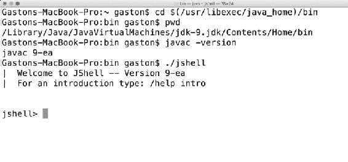
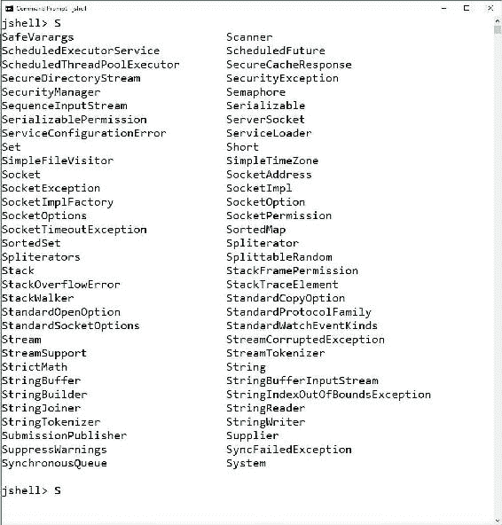
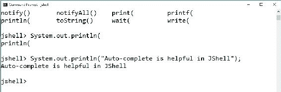
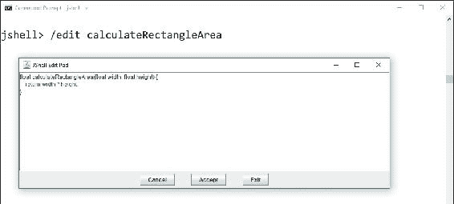
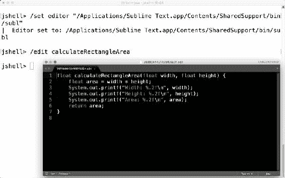

# 第 1 章 JShell–Java 9 的读取-计算-打印循环

在本章中，我们将开始使用 Java9 进行面向对象编程的旅程。您将学习如何启动和使用 Java9 引入的新实用程序：JShell，它允许我们轻松运行 Java9 代码片段并打印其结果。此实用程序将使您轻松学习面向对象编程。我们将做以下工作：

*   为我们使用 Java 9 实现**OOP**（**面向对象编程**的旅程做好准备
*   在 Windows、macOS 或 Linux 上安装所需的软件
*   了解使用**REPL**（**读取评估打印循环**实用程序的好处
*   选中默认导入并使用自动完成功能
*   在 JShell 中运行 Java 9 代码
*   求值表达式
*   使用变量、方法和源
*   在我们最喜欢的外部代码编辑器中编辑源代码
*   加载源代码

# 为使用 Java 9 实现 OOP 做好准备

在本书中，您将学习如何利用 Java 编程语言版本 9 中包含的所有面向对象的特性，即所谓的 Java 9。一些示例可能与以前的 Java 版本兼容，如 Java 8、Java 7 和 Java 6，但必须使用 Java 9 或更高版本，因为此版本不向后兼容。我们不会编写与以前的 Java 版本向后兼容的代码，因为我们的主要目标是使用 Java9 或更高版本，并使用其语法和所有新特性。

大多数时候，我们不会使用任何**IDE**（**集成开发环境**），我们会利用 JShell 和 JDK 中包含的许多其他实用程序。但是，您可以使用任何提供 Java9REPL 的 IDE 来处理所有示例。在接下来的部分中，您将了解使用 REPL 的好处。在上一章中，您肯定会受益于 IDE，在这里您将探索 Java9 引入的新模块化特性。

### 提示

使用本书中的示例，学习如何使用 Java9 建模和创建面向对象的代码，不需要任何 Java 编程语言的经验。如果你有一些 C++、C++、Python、SWIFT、Objto-C、Ruby 或 JavaScript 的经验，你就可以很容易地学习 java 的语法并理解这些例子。许多现代编程语言都在借用 Java 的特性，反之亦然。因此，这些语言的任何知识都将非常有用。

在本章中，我们将在 Windows、macOS 或 Linux 上安装所需的软件。我们将了解使用 REPL，特别是 JShell 学习面向对象编程的好处。我们将学习如何在 JShell 中运行 Java9 代码，以及如何在 REPL 中加载源代码示例。最后，我们将学习如何从命令行或终端在 Windows、macOS 和 Linux 上运行 Java 代码。

# 在 Windows、macOS 或 Linux 上安装所需的软件

我们必须从[为我们的操作系统下载并安装**JDK 9**（**Java 开发工具包 9**的最新版本 https://jdk9.java.net/download/](https://jdk9.java.net/download/) 。我们必须接受 Java 下载软件的许可协议。

正如之前的版本一样，JDK 9 可以在许多不同的平台上使用，包括但不限于以下内容：

*   Windows 32 位
*   Windows 64 位
*   macOS 64 位（以前称为 Mac OS X 或简称为 OS X）
*   32 位 Linux
*   Linux 64 位
*   基于 ARM 的 32 位 Linux
*   基于 ARM 的 64 位 Linux

在完成了基于操作系统的相应版本 JDK 9 的安装后，我们可以将安装 JDK 9 的文件夹的`bin`子文件夹添加到`PATH`环境变量中。这样，我们就可以从我们所在的任何文件夹中启动不同的实用程序。

### 提示

如果我们不将安装了 JDK 9 的文件夹的`bin`子文件夹添加到操作系统中的`PATH`环境变量中，那么在执行命令时，我们将始终必须使用`bin`子文件夹的完整路径。在下一个启动不同 Java 命令行实用程序的说明中，我们将假设我们位于这个`bin`子文件夹中，或者`PATH`环境变量包含它。

一旦我们安装了 JDK 9，并将`bin`文件夹添加到`PATH`环境变量中，我们就可以在 Windows 命令提示符或 macOS 或 Linux 终端中运行以下命令：

```java
javac -version

```

前面的命令将显示 JDK 中包含的主 Java 编译器的当前版本，该编译器将 Java 源代码编译成 Java 字节码。版本号应以 9 开头，如下一个示例输出所示：

```java
javac 9-ea

```

如果上一个命令的结果显示的版本号不是以 9 开头的，我们必须检查安装是否成功完成。此外，我们必须确保`PATH`环境变量不包含 JDK 早期版本的路径，并且它包含最近安装的 JDK 9 的`bin`文件夹。

现在，我们准备启动 JShell。在 Windows 命令提示符或 macOS 或 Linux 终端中运行以下命令：

```java
jshell

```

前面的命令将启动 JShell，显示一条欢迎消息，其中包括正在使用的 JDK 版本，提示将更改为`jshell>`。每当我们看到这个提示时，它意味着我们仍然在 JShell 中。下面的屏幕截图显示了在 macOS 终端窗口中运行的 JShell。



### 提示

如果我们想随时离开 JShell，只需在 Mac 中按*Ctrl*+*D*。另一个选项是输入`/exit`并按*输入*。

## 了解与 REPL 合作的好处

Java9 引入了一个名为 JShell 的交互式 REPL 命令行环境。这个工具允许我们执行 Java 代码片段并立即得到结果。我们可以轻松地编写代码并查看其执行结果，而无需创建解决方案或项目。我们不必等待项目完成构建过程来检查执行多行代码的结果。JShell 和任何其他 REPL 一样，有助于探索性编程，也就是说，我们可以轻松地、交互地尝试和调试不同的算法和结构。

### 提示

如果您使用过其他提供 REPL 或交互式 shell 的编程语言，如 Python、Scala、Clojure、F#、Ruby、Smalltalk 和 Swift 等，那么您已经知道使用 REPL 的好处。

例如，假设我们必须与提供 Java 绑定的**物联网**（**物联网**）库交互。我们必须编写 Java 代码来使用库来控制无人机，也称为**无人机**（**无人机**）。无人机是一种物联网设备，可与许多传感器和执行器进行交互，包括与发动机、螺旋桨和伺服电机相连的数字电子速度控制器。

我们希望能够编写几行代码，从传感器检索数据并控制执行器。我们只需要确保事情按照文档中的说明进行。我们希望确保在移动无人机时，从高度表读取的值发生变化。JShell 为我们提供了适当的工具，可以在几秒钟内开始与库交互。我们只需要启动 JShell，加载库，然后开始在 REPL 中编写 Java9 代码。对于以前的 Java 版本，我们需要从头开始创建一个新项目，并编写一些样板代码，然后才能开始编写与库交互的第一行代码。JShell 允许我们更快地开始工作，并减少了创建整个框架以开始运行 Java9 代码的需要。JShell 允许从 REPL 交互探索**API**（**应用程序编程接口**）。

我们可以在 JShell 中输入任何 Java9 定义。例如，我们可以声明方法、类和变量。我们还可以输入 Java 表达式、语句或导入。一旦我们输入了声明方法的代码，我们就可以输入一个使用先前定义的方法的语句并查看执行结果。

JShell 允许我们从文件中加载源代码，因此，您将能够加载本书中包含的源代码示例，并在 JShell 中对其进行评估。每当我们需要使用源代码时，您都会知道可以从中加载源代码的文件夹和文件。此外，JShell 允许我们执行 JShell 命令。我们将在本章后面学习最有用的命令。

JShell 允许我们调用`System.out.printf`方法来轻松格式化要打印的输出。我们将在示例代码中利用此方法。

### 提示

JShell 禁用了 Java9 中一些在交互式 REPL 中不有用的特性。每当我们必须在 JShell 中使用这些特性时，我们都会明确说明 JShell 将禁用它们，并解释它们的效果。

分号（`;`在 JShell 中的语句末尾是可选的。但是，我们将始终在每条语句的末尾使用分号，因为我们不想忘记，在项目和解决方案中编写实际的 Java 9 代码时必须使用分号。当我们输入要由 JShell 计算的表达式时，我们只会省略语句末尾的分号。

例如，以下两个行是等效的，它们在 JShell 中执行后都将打印`"Object-Oriented Programming rocks with Java 9!"`。第一行语句末尾不包含分号（`;`），第二行包含分号（`;`）。我们将始终使用分号（；）作为第二行，以保持一致性。

```java
System.out.printf("Object-Oriented Programming rocks with Java 9!\n")
System.out.printf("Object-Oriented Programming rocks with Java 9!\n");
```

以下屏幕截图显示了在 Windows 10 上运行的 JShell 中执行这两行的结果：


在一些示例中，我们将利用 JShell 为我们提供网络访问的事实。此功能对于与 Web 服务交互非常有用。但是，您必须确保在防火墙配置中没有阻止 JShell。

### 提示

不幸的是，在我写这本书的时候，JShell 没有包含语法突出显示功能。但是，您将学习如何使用我们最喜欢的编辑器编写和编辑代码，然后在 JShell 中执行这些代码。

## 检查默认导入并使用自动完成功能

默认情况下，JShell 提供了一组通用导入，我们可以使用`import`语句从运行代码片段可能需要的任何附加包中导入必要的类型。我们可以在 JShell 中输入以下命令来列出所有导入：

```java
/imports

```

以下行显示上一个命令的结果：

```java
|    import java.io.*
|    import java.math.*
|    import java.net.*
|    import java.nio.file.*
|    import java.util.*
|    import java.util.concurrent.*
|    import java.util.function.*
|    import java.util.prefs.*
|    import java.util.regex.*
|    import java.util.stream.*

```

当我们在 JShell 之外编写 Java 代码时，我们不需要从`java.lang`包中导入类型，因为它们是默认导入的，当我们在 JShell 中运行`/imports`命令时，它们不会被列在中。因此，默认情况下，JShell 为我们提供对以下包中所有类型的访问：

*   `java.lang`
*   `java.io`
*   `java.math`
*   `java.net`
*   `java.nio.file`
*   `java.util`
*   `java.util.concurrent`
*   `java.util.function`
*   `java.util.prefs`
*   `java.util.regex`
*   `java.util.stream`

JShell 提供了自动完成功能。当我们需要自动完成功能的帮助时，只需按下*Tab*键，就像在 macOS 或 Linux 中使用 Windows 命令提示符或终端时一样。

有时，有太多的选项以我们输入的第一个字符开头。在这些情况下，JShell 为我们提供了所有可用选项的列表，以向我们提供帮助。例如，我们可以输入`S`并按下*选项卡*键。JShell 将列出从前面列出的以`S`开头的包中导入的所有类型。以下截图显示了 JShell 中的结果：



我们想进入`System`。考虑到前面的列表，我们将只输入`Sys`以确保`System`是唯一以`Sys`开头的选项。基本上，我们是为了理解自动完成在 JShell 中是如何工作的而作弊。输入`Sys`并按下*选项卡*键。JShell 将显示`System`。

现在，输入一个点（`.`）并在之后输入一个`o`（您将有`System.o`），然后按*选项卡*键。JShell 将显示`System.out`。

接下来，输入一个点（`.`并按*选项卡*键。JShell 将显示`System.out`中声明的所有公共方法。列表之后，JShell 将再次包含`System.out.`，以允许我们继续输入代码。以下屏幕截图显示了 JShell 中的结果：


输入`printl`并按下*选项卡*键。JShell 将完成到`System.out.println(`，也就是说，它将添加一个`n`和开括号（`(`。这样，我们只需输入该方法的参数，因为只有一个方法以`printl`开头。输入`"Auto-complete is helpful in JShell");`并按*输入*。下一行显示完整的语句：

```java
System.out.println("Auto-complete is helpful in JShell");
```

以下屏幕截图显示了运行前一行后 JShell 中的结果：



# 在 JShell 中运行 Java 9 代码

现在，我们想在 JShell 中运行 Java 9 代码，并了解在输入每个代码片段后会发生什么。按*Ctrl*+*D*退出当前 JShell 会话。在 Windows 命令提示符下或在 macOS 或 Linux 终端上运行以下命令，以启动 JShell 并提供详细反馈：

```java
jshell -v

```

详细的反馈将为我们提供更多关于 JShell 在执行或评估每个代码片段后所做工作的详细信息。在 JShell 中输入以下代码以创建名为`calculateRectangleArea`的新方法。该方法接收矩形的`width`和`height`，并返回`float`类型的两个值的乘法结果：

```java
float calculateRectangleArea(float width, float height) {
    return width * height;
}
```

在我们输入前几行之后，JShell 将显示下一条消息，表明它已经创建了一个名为`calculateRectangleArea`的方法，其中有两个`float`类型的参数：

```java
|  created method calculateRectangleArea(float,float)

```

### 提示

请注意，JShell 编写的所有消息都以管道符号（`|`）开头。

在 JShell 中输入以下命令，列出我们在当前会话中键入并执行的当前活动代码段：

```java
/list

```

下面几行显示了结果。请注意，JShell 以代码段 id 作为代码段的开头，即标识每个代码段的唯一编号。JShell 将显示以下行作为上一个命令的结果。创建`calculateRectangleArea`方法的代码段已分配`1`作为代码段 id。

```java
 1 : float calculateRectangleArea(float width, float height) {
 return width * height;
 }

```

在 JShell 中输入以下代码，创建一个名为`width`的新`float`变量，并用`50`进行初始化：

```java
float width = 50;
```

进入上一行后，JShell 将显示下一条消息，表明它已经创建了一个名为`float`类型的变量`width`，并将值`50.0`分配给该变量：

```java
width ==> 50.0
|  created variable width : float

```

在 JShell 中输入以下代码，创建一个名为`height`的新`float`变量，并用`25`进行初始化：

```java
float height = 25;
```

进入上一行后，JShell 将显示下一条消息，表明它已经创建了一个名为`float`类型的变量`height`，并将值`25.0`分配给该变量：

```java
height ==> 25.0
|  created variable height : float

```

输入`float area = ca`并按下*选项卡*键。JShell 将完成到`float area = calculateRectangleArea(`，即添加`lculateRectangleArea`和开括号（`(`。这样，我们只需输入该方法的两个参数，因为只有一个方法以`ca`开头。输入`width, height);`并按*输入*。下一行显示完整的语句：

```java
float area = calculateRectangleArea(width, height);
```

进入前一行后，JShell 将显示下一条消息，指示它已经创建了一个名为`float`类型的`area`变量，并将前面声明的`width`和`height`变量作为参数分配给调用`calculateRectangleArea`方法的结果。该方法返回`1250.0`作为结果，并将其分配给`area`变量。

```java
area ==> 1250.0
|  created variable area : float

```

在 JShell 中输入以下命令，列出我们在当前会话中键入并执行的当前活动代码段：

```java
/list

```

以下几行显示了结果。请注意，JShell 在代码段前面加上代码段 id，即标识每个代码段的唯一编号。作为上一个命令的结果，JShell 将显示以下行：

```java
 1 : float calculateRectangleArea(float width, float height) {
 return width * height;
 }
 2 : float width = 50;
 3 : float height = 25;
 4 : float area = calculateRectangleArea(width, height);

```

在 JShell 中输入以下代码，通过调用`System.out.printf`来显示`width`、`height`和`area`变量的值。作为第一个参数传递给`System.out.printf`的字符串中的第一个`%.2f`使字符串（`width`之后的下一个参数显示为带两位小数的浮点数。我们重复`%.2f`两次，将`height`和`area`变量显示为小数点后两位的浮点数。

```java
System.out.printf("Width: %.2f, Height: %.2f, Area: %.2f\n", width, height, area);
```

进入前一行后，JShell 将用`System.out.printf`格式化输出，并打印下一条消息，后面跟着一个 scratch 变量的名称：

```java
Width: 50.00, Height: 25.00, Area: 1250.00
$5 ==> java.io.PrintStream@68c4039c
|  created scratch variable $5 : PrintStream

```

## 求值表达式

JShell 允许我们计算任何有效的 Java9 表达式，就像我们使用 IDE 和典型的表达式计算对话框时所做的那样。在 JShell 中输入以下表达式：

```java
width * height;
```

进入前一行后，JShell 将对表达式求值，并将结果分配给一个 scratch 变量，该变量的名称以`$`开头，并以数字继续。JShell 显示暂存变量名`$6`、分配给变量的值（指示表达式求值的结果）`1250.0`、以及暂存变量的类型`float`。在输入上一个表达式后，下一行显示在 JShell 中显示的消息：

```java
$6 ==> 1250.0
|  created scratch variable $6 : float

```

请注意，scratch 变量的名称可能不同。例如，它可能是`$7`或`$8`，而不是`$6`。我们可以运行一个使用先前创建的 scratch 变量的代码段，就像在当前 JShell 会话中创建的任何其他变量一样。在 JShell 中输入以下代码，将`$6`变量的值显示为带两位小数的浮点数。确保将`$6`替换为 JShell 生成的临时变量名。

```java
System.out.printf("The calculated area is %.2f", $6);
```

进入上一行后，JShell 将用`System.out.printf`格式化输出，并打印下一条消息：

```java
The calculated area is 1250.00

```

我们还可以在另一个表达式中使用先前创建的 scratch 变量。在 JShell 中输入以下代码，将`10.5`（`float`添加到`$6`变量的值中。确保将`$6`替换为 JShell 生成的临时变量名。

```java
$6 + 10.5f;
```

进入前一行后，JShell 将对表达式求值，并将结果分配给一个新的 scratch 变量，该变量的名称以`$`开头，并以数字继续。JShell 显示暂存变量名`$8`、分配给变量的值（指示表达式求值的结果）`1260.5`、以及暂存变量的类型`float`。在输入上一个表达式后，下一行显示在 JShell 中显示的消息：

```java
$8 ==> 1250.5
|  created scratch variable $8 : float

```

### 提示

与以前一样，scratch 变量的名称可能不同。例如，它可能是`$9`或`$10`，而不是`$8`。

# 使用变量、方法和来源

到目前为止，我们已经创建了许多变量，JShell 在我们输入表达式并成功评估后创建了一些临时变量。在 JShell 中输入以下命令，列出当前会话中迄今已创建的当前活动变量的类型、名称和值：

```java
/vars

```

以下几行显示了结果：

```java
|    float width = 50.0
|    float height = 25.0
|    float area = 1250.0
|    PrintStream $5 = java.io.PrintStream@68c4039c
|    float $6 = 1250.0
|    float $8 = 1260.5

```

在 JShell 中输入以下代码，将`80.25`（`float`分配给先前创建的`width`变量：

```java
width = 80.25f;
```

我们进入上一行后，JShell 将显示下一条消息，表明它已将`80.25`（`float`分配给`float`类型的名为`width`的现有变量：

```java
width ==> 80.25
|  assigned to width : float

```

在 JShell 中输入以下代码，将`40.5`（`float`分配给先前创建的变量：

```java
height = 40.5f;
```

我们进入上一行后，JShell 将显示下一条消息，表明它已将`40.5`（`float`分配给`float`类型的名为`height`的现有变量：

```java
height ==> 40.5
|  assigned to height : float

```

在 JShell 中再次输入以下命令以列出当前活动变量的类型、名称和值：

```java
/vars

```

以下几行显示了反映我们分配给`width`和`height`变量的新值的结果：

```java
|    float width = 80.25
|    float height = 40.5
|    float area = 1250.0
|    PrintStream $5 = java.io.PrintStream@68c4039c
|    float $6 = 1250.0
|    float $8 = 1260.5

```

在 JShell 中输入以下代码以创建名为`calculateRectanglePerimeter`的新方法。该方法接收矩形的`width`变量和`height`变量，并返回`float`类型的两个值之和乘以`2`的结果。

```java
float calculateRectanglePerimeter(float width, float height) {
    return 2 * (width + height);
}
```

在我们输入前几行之后，JShell 将显示下一条消息，指示它已经创建了一个名为`calculateRectanglePerimeter`的方法，其中包含两个`float`类型的参数：

```java
|  created method calculateRectanglePerimeter(float,float)

```

在 JShell 中输入以下命令，列出名称、参数类型，并返回当前会话中迄今为止创建的当前活动方法的类型：

```java
/methods

```

下面几行显示了结果。

```java
|    calculateRectangleArea (float,float)float
|    calculateRectanglePerimeter (float,float)float

```

在 JShell 中输入以下代码，以打印以`width`和`height`为参数调用最近创建的`calculateRectanglePerimeter`的结果：

```java
calculateRectanglePerimeter(width, height);
```

进入前一行后，JShell 将调用该方法，并将结果分配给一个 scratch 变量，该变量的名称以`$`开头，以数字继续。JShell 显示暂存变量名称`$16`、分配给变量的值（表示方法返回的结果）`241.5`，以及暂存变量的类型`float`。在输入调用方法的上一个表达式后，下一行显示在 JShell 中显示的消息：

```java
$16 ==> 241.5
|  created scratch variable $16 : float

```

现在，我们想对最近创建的`calculateRectanglePerimeter`方法进行更改。我们要添加一行以打印计算的周长。在 JShell 中输入以下命令以列出该方法的源代码：

```java
/list calculateRectanglePerimeter

```

以下几行显示了结果：

```java
 15 : float calculateRectanglePerimeter(float width, float height) {
 return 2 * (width + height);
 }

```

在 JShell 中输入以下代码，用新代码覆盖名为`calculateRectanglePerimeter`的方法，该代码打印接收到的宽度和高度值，然后通过调用`System.out.printf`方法打印计算出的周长，该方法与内置`printf`方法的工作方式相同。我们可以复制并粘贴前面列出的源代码中的片段。此处突出显示了这些更改：

```java
float calculateRectanglePerimeter(float width, float height) {
 float perimeter = 2 * (width + height);
 System.out.printf("Width: %.2f\n", width);
 System.out.printf("Height: %.2f\n", height);
 System.out.printf("Perimeter: %.2f\n", perimeter);
 return perimeter;
}
```

在我们输入前面的行之后，JShell 将显示下一条消息，表明它已经用两个`float`类型的参数修改并覆盖了名为`calculateRectanglePerimeter`的方法：

```java
|  modified method calculateRectanglePerimeter(float,float)
|    update overwrote method calculateRectanglePerimeter(float,float)

```

在 JShell 中输入以下代码，打印出以`width`和`height`为参数调用最近修改的`calculateRectanglePerimeter`的结果：

```java
calculateRectanglePerimeter(width, height);
```

进入前一行后，JShell 将调用该方法，并将结果分配给一个 scratch 变量，该变量的名称以`$`开头，并以数字继续。第一行显示了我们添加到方法中的对`System.out.printf`的三次调用所生成的输出。最后，JShell 显示临时变量名`$19`、分配给该变量的值（表示方法返回的结果）`241.5`，以及临时变量的类型`float`。

在我们输入调用新版本方法的上一个表达式后，下一行显示在 JShell 中显示的消息：

```java
Width: 80.25
Height: 40.50
Perimeter: 241.50
$19 ==> 241.5
|  created scratch variable $19 : float

```

# 在我们最喜欢的外部代码编辑器中编辑源代码

我们创建了`calculateRectanglePerimeter`方法的新版本。现在，我们想对`calculateRectangleArea`方法进行类似的更改。然而，这一次，我们将利用编辑器使更改现有代码变得更容易。

在 JShell 中输入以下命令以启动默认的 JShell 编辑板编辑器来编辑`calculateRectangleArea`方法的源代码：

```java
/edit calculateRectangleArea

```

JShell 将显示一个带有 JShell 编辑板的对话框和`calculateRectangleArea`方法的源代码，如下图所示：



JScript 编辑垫缺少代码编辑器所享受的大部分特性，我们甚至不能认为它是一个像样的代码编辑器。事实上，它只允许我们轻松地编辑源代码，而无需复制和粘贴上一个清单。稍后我们将学习如何配置更好的编辑器。

在 JShell 编辑板中输入以下代码，以使用新代码覆盖名为`calculateRectangleArea`的方法，该代码打印接收到的宽度和高度值，然后通过调用`Sytem.out.printf`方法打印计算区域。此处突出显示了这些更改：

```java
float calculateRectangleArea(float width, float height) {
 float area = width * height;
 System.out.printf("Width: %.2f\n", width);
 System.out.printf("Height: %.2f\n", height);
 System.out.printf("Area: %.2f\n", area);
 return area;
}
```

点击**接受**，然后点击**退出**。JShell 将关闭 JShell 编辑板，并显示下一条消息，表明它已使用两个类型为`float`的参数修改并覆盖了名为`calculateRectangleArea`的方法：

```java
|  modified method calculateRectangleArea(float,float)
|    update overwrote method calculateRectangleArea(float,float)

```

在 JShell 中输入以下代码，打印以`width`和`height`为参数调用最近修改的`calculateRectangleArea`方法的结果：

```java
calculateRectangleArea(width, height);
```

进入前一行后，JShell 将调用该方法，并将结果分配给一个 scratch 变量，该变量的名称以`$`开头，并以数字继续。第一行显示了我们添加到方法中的对`System.out.printf`的三次调用所生成的输出。最后，JShell 显示临时变量名`$24`、分配给该变量的值（表示方法返回的结果）`3250.125`，以及临时变量的类型`float`。在我们输入调用新版本方法的上一个表达式后，下一行显示在 JShell 中显示的消息：

```java
Width: 80.25
Height: 40.50
Area: 3250.13
$24 ==> 3250.125
|  created scratch variable $24 : float

```

好消息是 JShell 允许我们轻松配置任何外部编辑器来编辑代码片段。我们只需要获取我们想要使用的编辑器的完整路径，并在 JShell 中运行一个命令来配置我们想要在使用`/edit`命令时启动的编辑器。

例如，在 Windows 中，流行的 Sublime Text 3 代码编辑器的默认安装路径为`C:\Program Files\Sublime Text 3\sublime_text.exe`。如果我们想使用这个编辑器来编辑 JShell 中的代码片段，我们必须运行`/set editor`命令，后跟用双引号括起来的路径。我们必须确保将路径字符串中的反斜杠（`\`替换为双反斜杠（`\\`）。对于前面解释的路径，我们必须运行以下命令：

```java
/set editor "C:\\Program Files\\Sublimet Text 3\\sublime_text.exe"

```

输入上一个命令后，JShell 将显示一条消息，向我们指示编辑器已设置为指定路径：

```java
| Editor set to: C:\Program Files\Sublime Text 3\sublime_text.exe

```

更改编辑器后，我们可以在 JShell 中输入以下命令来启动新编辑器，对`calculateRectangleArea`方法的源代码进行更改：

```java
/edit calculateRectangleArea

```

JShell 将启动升华文本 3 或我们可能指定的任何其他编辑器，并将加载一个包含`calculateRectangleArea`方法源代码的临时文件，如以下屏幕截图所示：


### 提示

如果我们保存更改，JShell 将自动覆盖该方法，就像我们使用默认编辑器时所做的那样：JShell Edit Pad。在进行必要的编辑之后，我们必须关闭编辑器以继续在 JShell 中运行 Java 代码或 JShell 命令。

在任何平台中，JShell 都会创建一个扩展名为`.edit`的临时文件。因此，我们可以将我们最喜欢的编辑器配置为在打开扩展名为`.edit`的文件时使用 Java 语法高亮显示。

在 macOS 或 Linux 中，路径与 Windows 中不同，因此，必要的步骤也不同。例如，在 macOS 中，为了在安装在默认路径中时启动流行的 Sublime Text 3 代码编辑器，我们必须运行`/Applications/Sublime Text.app/Contents/SharedSupport/bin/subl`。

如果我们想使用这个编辑器来编辑 JShell 中的代码片段，我们必须运行`/set editor`命令，后跟用双引号括起来的完整路径。对于前面解释的路径，我们必须运行以下命令：

```java
/set editor "/Applications/Sublime Text.app/Contents/SharedSupport/bin/subl"

```

输入上一个命令后，JShell 将显示一条消息，向我们指示编辑器已设置为指定路径：

```java
|  Editor set to: /Applications/Sublime Text.app/Contents/SharedSupport/bin/subl

```

更改编辑器后，我们可以在 JShell 中输入以下命令来启动新编辑器，对`calculateRectangleArea`方法的源代码进行更改：

```java
/edit calculateRectangleArea

```

JShell 将在 macOS 或我们可能指定的任何其他编辑器上启动 Sublime Text 3，并将加载一个带有`calculateRectangleArea`方法源代码的临时文件，如以下屏幕截图所示：



# 加载源代码

当然，我们不必为每个示例输入源代码。自动完成功能很有用，但我们将利用一个命令，该命令允许我们从 JShell 中的文件加载源代码。

按*Ctrl*+*D*退出当前 JShell 会话。在 Windows 命令提示符下或在 macOS 或 Linux 终端上运行以下命令，再次启动 JShell 并提供详细反馈：

```java
jshell -v

```

下面几行显示了声明最新版本的`calculateRectanglePerimeter`和`calculateRectangleArea`方法的代码。然后，代码声明并初始化两个`float`类型的变量：`width`和`height`。最后，最后两行调用前面定义的方法，并使用`width`和`height`作为参数。样本的代码文件包含在`java_9_oop_chapter_01_01`文件夹中的`example01_01.java`文件中。

```java
float calculateRectanglePerimeter(float width, float height) {
    float perimeter = 2 * (width + height);
    System.out.printf("Width: %.2f\n", width);
    System.out.printf("Height: %.2f\n", height);
    System.out.printf("Perimeter: %.2f\n", perimeter);
    return perimeter;
}

float calculateRectangleArea(float width, float height) {
    float area = width * height;
    System.out.printf("Width: %.2f\n", width);
    System.out.printf("Height: %.2f\n", height);
    System.out.printf("Area: %.2f\n", area);
    return area;
}

float width = 120.25f;
float height = 35.50f;
calculateRectangleArea(width, height);
calculateRectanglePerimeter(width, height);
```

一旦您在文件夹中下载了该书的源代码，就可以使用 JShell 中的`/open`命令从源代码中加载并执行其中一个文件。在每个代码片段之前，我们总是提到源代码的位置。

如果 Windows 中源代码的根文件夹为`C:\Users\Gaston\Java9`，则可以运行以下命令在 JShell 中加载并执行前面显示的源代码：

```java
/open C:\Users\Gaston\Java9\java_9_oop_chapter_01_01\example01_01.java

```

如果 macOS 或 Linux 中源代码的根文件夹为`~/Documents/Java9`，则可以运行以下命令在 JShell 中加载并执行之前显示的源代码：

```java
/open ~/Documents/Java9/java_9_oop_chapter_01_01/example01_01.java

```

在根据配置和操作系统输入 previous 命令后，JShell 将加载并执行前面显示的源代码，并显示运行加载的代码段后生成的输出。以下几行显示了输出：

```java
Width: 120.25
Height: 35.50
Area: 4268.88
Width: 120.25
Height: 35.50
Perimeter: 311.50

```

现在，在 JShell 中输入以下命令，列出当前会话中已执行的、从源文件加载的当前活动代码段：

```java
/list

```

以下几行显示了结果。请注意，JShell 将不同的方法定义和表达式放在具有不同代码段 ID 的前面，因为加载的源代码的行为方式与我们依次输入一个代码段的行为方式相同：

```java
 1 : float calculateRectanglePerimeter(float width, float height) {
 float perimeter = 2 * (width + height);
 System.out.printf("Width: %.2f\n", width);
 System.out.printf("Height: %.2f\n", height);
 System.out.printf("Perimeter: %.2f\n", perimeter);
 return perimeter;
 }
 2 : float calculateRectangleArea(float width, float height) {
 float area = width * height;
 System.out.printf("Width: %.2f\n", width);
 System.out.printf("Height: %.2f\n", height);
 System.out.printf("Area: %.2f\n", area);
 return area;
 }
 3 : float width = 120.25f;
 4 : float height = 35.50f;

 5 : calculateRectangleArea(width, height);
 6 : calculateRectanglePerimeter(width, height);

```

### 提示

确保在书中找到源代码时，使用前面解释的`/open`命令，后跟要在 JShell 中加载和执行的代码文件的路径和文件名。这样，您就不必输入每个代码片段，并且可以检查在 JShell 中执行代码的结果。

# 测试你的知识

1.  JShell 是：
    1.  java9repl。
    2.  在以前的 JDK 版本中相当于`javac`。
    3.  Java 9 字节码反编译器。
2.  REPL 是指：
    1.  运行扩展流程循环。
    2.  读取评估进程锁。
    3.  读取和计算打印循环。
3.  以下哪个命令列出了在当前 JShell 会话中创建的所有变量：
    1.  `/variables`
    2.  `/vars`
    3.  `/list-all-variables`
4.  以下哪个命令列出了在当前 JShell 会话中创建的所有方法：
    1.  `/methods`
    2.  `/meth`
    3.  `/list-all-methods`
5.  以下哪个命令列出了当前 JShell 会话中迄今为止评估的源代码：
    1.  `/source`
    2.  `/list`
    3.  `/list-source`

# 总结

在本章中，我们开始了使用 Java9 进行面向对象编程的旅程。我们学习了如何启动和使用 Java9 引入的新实用程序：JShell，它允许我们轻松地运行 Java9 代码片段并打印其结果。

我们学习了安装 JDK 9 的必要步骤，并且了解了使用 REPL 的好处。我们学习了使用 JShell 运行 Java9 代码和计算表达式。我们还学习了它的许多有用的命令和特性。当我们开始使用面向对象的代码时，我们将在接下来的章节中使用它们。

现在我们已经学会了使用 JShell，我们将学习如何识别真实世界的元素，并将它们转换为 Java 9 支持的面向对象范例的不同组件，这是我们将在下一章中讨论的内容。