# 二、通过 Java 9 JShell 将现实世界的对象转换为 UML 图

在本章中，我们将学习如何从现实生活中识别对象。我们将理解，使用对象可以使编写更易于理解和重用的代码变得更简单。我们将学习如何识别真实世界的元素，并将它们转换为 Java9 支持的面向对象范例的不同组件。我们将：

*   从应用程序需求中识别对象
*   从真实世界捕获对象
*   生成类以创建对象
*   识别变量和常量以创建字段
*   确定创建方法的操作
*   用 UML 图组织类
*   利用领域专家的反馈改进我们的课程
*   在 JShell 中使用 Java 对象

# 根据应用要求识别对象

无论何时你必须在现实世界中解决一个问题，你都会使用元素并与之交互。例如，当你口渴时，你拿一个玻璃杯，装满水、苏打水或你最喜欢的果汁，然后喝。类似地，您可以轻松地从现实场景中识别称为对象的元素，然后将它们转换为面向对象的代码。我们将开始学习面向对象编程的原理，以便在 Java9 编程语言中使用它们来开发任何类型的应用程序。

现在，我们将想象我们必须开发一个 RESTful Web 服务，它将被移动应用程序和 Web 应用程序使用。这些应用程序和应用程序将具有不同的用户界面和不同的用户体验。然而，我们不必担心这些差异，因为我们将专注于 Web 服务，也就是说，我们将是后端开发人员。

艺术家使用几何形状和有机形状的不同组合来创造艺术。当然，创造艺术比这个简单的定义要复杂一些，但我们的目标是学习面向对象编程，而不是成为艺术方面的专家。

几何形状由点和线组成，精确。以下是几何形状的示例：圆、三角形、正方形、矩形。

有机形状是具有自然外观和弯曲外观的形状。这些形状通常不规则或不对称。我们通常把自然界的东西，如动物和植物，与有机的形状联系起来。

当艺术家想要对通常需要有机形状的事物进行抽象解释时，他们会使用几何形状。想象瓦妮莎·皮斯托普是一位画家和工匠。几年前，她开始将她的作品上传到 Instagram 和 YouTube 上，并在她的艺术生涯中达到了一个伟大的里程碑：旧金山现代艺术博物馆为她最重要的作品准备了一个展览。这一特殊事件对社交网站产生了巨大的影响，而且，正如通常发生的那样，有一项新的软件开发任务与这一重要的人气提升相关。

Pitstop 是一个非常受欢迎的 YouTuber，她的频道拥有 400 多万粉丝。许多好莱坞女演员购买了自己的作品，并在 Instagram 上上传自拍，以她的作品为背景。她的展览对她的创作产生了巨大的额外兴趣，其中一位赞助商希望创建移动应用程序和 web 应用程序，根据几何形状复制她的作品，并提供用户制作作品所需购买的所有工具和丙烯酸涂料的详细信息。

Pitstop 绘制基本形状，然后用丙烯酸漆绘制它们以构建几何图案。移动应用程序和 web 应用程序将使用我们的 web 服务，根据画布大小和用户选择的一些预定义颜色方案，构建 Pitstop 的预定义图案。我们的 Web 服务将接收画布大小和颜色方案，以生成图案和物料清单。具体来说，Web 服务将提供一个不同工具的列表，以及用户必须购买以绘制图案的丙烯酸漆管、罐子或瓶子。最后，用户可以在线订购所有建议的材料。

下图显示了 Pitstop 具有几何图案的艺术品的第一个示例。让我们来看一看图像，并提取组成该模式的对象。

以下对象构成几何图案，具体来说，从上到下为以下 2D 形状：

*   12 个等边三角形
*   6 平方米
*   6 个矩形
*   28 圈
*   4 椭圆
*   28 圈
*   6 个矩形
*   6 平方米
*   12 个等边三角形

描述构成图案的 108 个对象或 2D 形状相当简单。我们能够识别所有这些物体，并为每一个物体指明特定的 2D 形状。如果我们测量每个三角形，就会发现它们是等边三角形。

下图显示了 Pitstop 的几何图案艺术品的第二个示例。让我们来看一看图像，并提取组成该模式的对象。

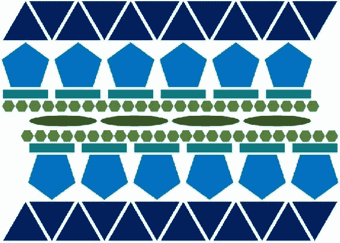

以下对象构成几何图案，具体而言，是从上到下的以下二维形状：

*   12 个等边三角形
*   6 正五边形
*   6 个矩形
*   24 正六边形
*   4 椭圆
*   24 正六边形
*   6 个矩形
*   6 正五边形
*   12 个等边三角形

这一次，我们可以描述构成图案的 100 个对象或 2D 形状。我们能够识别所有这些物体，并为每一个物体指明特定的 2D 形状。如果我们测量每个五边形和六边形，我们就会发现它们是规则的五边形和六边形。

下图显示了 Pitstop 具有几何图案的艺术品的第三个示例。在这种情况下，我们有大量的二维形状。让我们看一看图像，只提取模式中包含的不同的 2D 形状。这一次，我们不计算对象的数量。

图案包括以下 2D 形状：

*   等边三角形
*   方格
*   正五边形
*   正六边形
*   正七边形
*   正八角形
*   正十边形

下面的图像显示了 Pitstop 具有几何图案的艺术品的第四个示例。在这种情况下，我们也有大量的二维形状，其中一些相互交叉。然而，如果我们注意一些，我们仍然能够识别不同的 2D 形状。让我们看一看图像，只提取模式中包含的不同的 2D 形状。我们不会计算对象的数量。

该图案包括以下二维形状：

*   正五边形
*   正十边形
*   圈子
*   等边三角形
*   方格
*   正八角形

下面的图像显示了 Pitstop 具有几何图案的艺术作品的第五个示例。在本例中，我们将从左到右识别形状，因为图案具有不同的方向。我们有许多相互相交的形状。让我们看一看图像，只提取模式中包含的不同的 2D 形状。我们不会计算对象的数量。

图案包括以下 2D 形状：

*   圈子
*   正八角形
*   等边三角形
*   方格
*   正规八角形

# 捕捉真实世界的物体

我们可以很容易地从 Pitstop 的艺术品中识别出物体。我们了解到每个图案都由许多 2D 几何形状组成，我们认识到她在我们分析的所有示例中使用的不同形状。现在，让我们关注 Web 服务的核心需求之一，即计算制作艺术品所需的丙烯酸涂料量。我们必须考虑图案中包含的每个 2D 形状的以下数据，以便计算产生每个形状所需的材料和丙烯酸涂料的数量：

*   线条颜色
*   周界
*   填充颜色
*   地区

可以为绘制每个形状边界的线条使用特定颜色，因此，我们必须计算周长，将其用作一个值，该值将允许我们估计用户为绘制每个 2D 形状的边界必须购买的丙烯酸涂料量。然后，我们必须计算面积，将其用作一个值，该值将允许我们估计用户必须购买的丙烯酸涂料的数量，以填充每个 2D 形状的面积。

我们必须开始为我们的 Web 服务编写后端代码，该代码计算我们在迄今为止分析的所有样本艺术品中识别的不同 2D 形状的面积和周长。我们得出结论，Web 服务必须支持具有以下九种形状的模式：

*   圈子
*   省略号
*   等边三角形
*   方格
*   矩形
*   正五边形
*   正六边形
*   正八角形
*   正十边形

在做了一些研究来更新我们对 2D 几何的认识之后，我们就可以开始编写 Java 9 代码了。具体来说，我们可以编写九种方法来计算前面列举的 2D 形状的面积，另外九种方法来计算它们的周长。请注意，我们讨论的是返回计算值的方法，也称为函数。我们不再考虑对象，因此，我们将在这条路径上面临一些问题，我们将用面向对象的方法解决这些问题。

例如，如果我们开始考虑解决问题的方法，一个可能的解决方案是编写以下 18 个函数来完成这项工作：

*   `calculateCircleArea`
*   `calculateEllipseArea`
*   `calculateEquilateralTriangleArea`
*   `calculateSquareArea`
*   `calculateRectangleArea`
*   `calculateRegularPentagonArea`
*   `calculateRegularHexagonArea`
*   `calculateRegularOctagonArea`
*   `calculateRegularDecagonArea`
*   `calculateCirclePerimeter`
*   `calculateEllipsePerimeter`
*   `calculateEquilateralTrianglePerimeter`
*   `calculateSquarePerimeter`
*   `calculateRectanglePerimeter`
*   `calculateRegularPentagonPerimeter`
*   `calculateRegularHexagonPerimeter`
*   `calculateRegularOctagonPerimeter`
*   `calculateRegularDecagonPerimeter`

前面列举的每个方法都必须接收每个形状的必要参数，并返回其计算面积或周长。这些函数没有副作用，也就是说，它们不更改接收到的参数，只返回计算面积或周长的结果。

现在，让我们暂时忘记方法或函数。让我们回到分配给我们的 Web 服务需求中的真实对象。我们必须计算九个元素的面积和周长，这九个元素是需求中的九个名词，代表现实生活中的对象，特别是 2D 形状。我们已经建立了一个包含 9 个真实对象的列表。

在认识到现实生活中的对象并思考一下它们之后，我们可以开始按照面向对象的范例设计我们的 Web 服务。我们可以创建表示每个枚举 2D 形状的状态和行为的软件对象，而不是创建一组执行所需任务的方法。通过这种方式，不同的对象模仿真实世界的 2D 形状。我们可以使用对象来指定计算面积和周长所需的不同属性。然后，我们可以扩展这些对象，以包括计算其他所需值所需的附加数据，例如绘制边界所需的丙烯酸涂料数量。

现在，让我们进入现实世界，思考一下前面列举的九种形状中的每一种。想象一下，我们必须在纸上绘制每个形状，并计算它们的面积和周长。绘制每个形状后，我们将使用哪些值来计算它们的面积和周长？我们将使用哪些公式？

### 提示

在开始编码之前，我们就开始了面向对象的设计，因此，我们的工作就像我们不知道很多几何概念一样。例如，我们可以很容易地推广用于计算正多边形周长和面积的公式。然而，在大多数情况下，我们不是这方面的专家，我们必须先获得一些应用领域的知识，然后才能用面向对象的方法概括行为。因此，我们将深入探讨这个主题，就好像我们对这个主题知之甚少一样。

下图显示了绘制的圆以及我们将用于计算其周长和面积的公式。我们只需要半径值，通常标识为**r**。

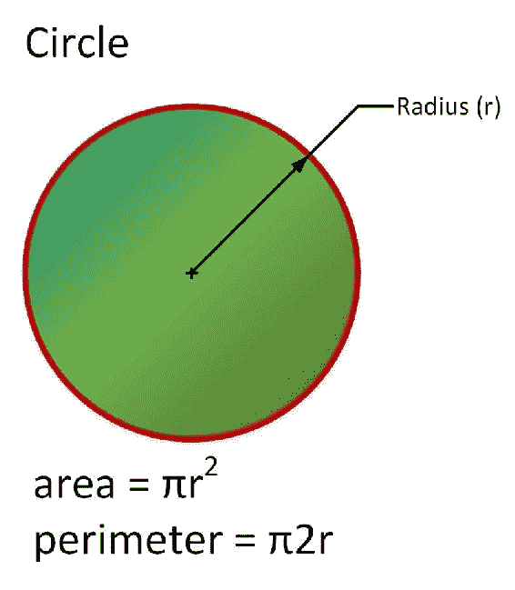

下图显示了一个绘制的椭圆以及我们将用于计算其周长和面积的公式。我们需要半长轴（通常标记为**a**）和半短轴（通常标记为**b**）的值。请注意，为周长提供的公式提供的近似值不是很精确。稍后我们将深入探讨这个具体问题。

下图显示了绘制的等边三角形以及我们将用于计算其周长和面积的公式。这种三角形有相等的边，三个内角等于 60 度。我们只需要边值的长度，通常标识为**a**。

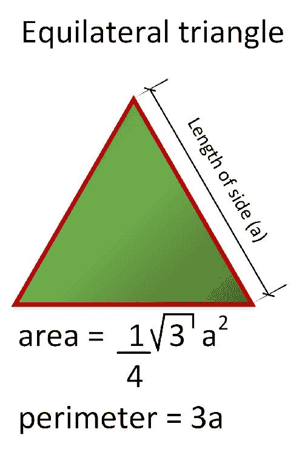

下图显示了绘制的正方形以及我们将用于计算其周长和面积的公式。我们只需要边值的长度，通常标识为**a**。

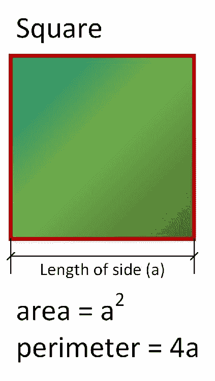

下图显示了一个绘制的矩形以及我们将用于计算其周长和面积的公式。我们需要宽度和高度值，通常标识为**w**和**h**。

下图显示了绘制的规则五边形以及我们将用于计算其周长和面积的公式。我们只需要边值的长度，通常标记为**a**。

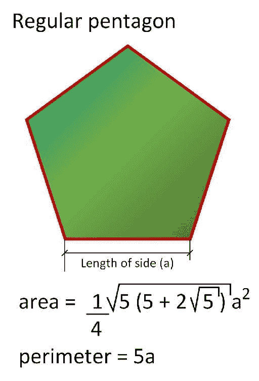

下图显示了一个绘制的正六边形以及我们将用于计算其周长和面积的公式。我们只需要边值的长度，通常标记为**a**。

下图显示了绘制的规则八角形以及我们将用于计算其周长和面积的公式。我们只需要边值的长度，通常标记为**a**。

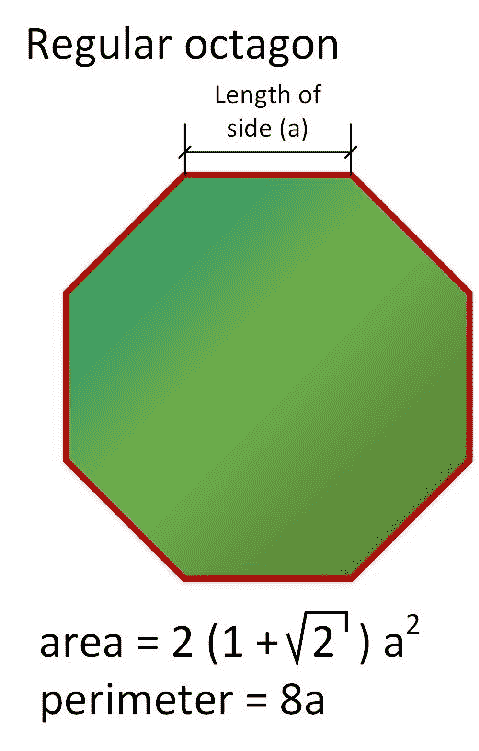

下图显示了一个绘制的规则十边形以及我们将用于计算其周长和面积的公式。我们只需要边值的长度，通常标记为**a**。

下表总结了每个形状计算周长和面积所需的数据：

<colgroup class="calibre15"><col class="calibre16"> <col class="calibre16"></colgroup> 
| 

形状

 | 

所需数据

 |
| --- | --- |
| 圆圈 | 半径 |
| 椭圆 | 半长轴和半短轴 |
| 等边三角形 | 边长 |
| 广场 | 边长 |
| 长方形 | 宽度和高度 |
| 正规五角大楼 | 边长 |
| 正六边形 | 边长 |
| 正八角形 | 边长 |
| 正十边形 | 边长 |

表示特定形状的每个对象封装了我们识别的所需数据。例如，表示椭圆的对象将封装椭圆的半长轴和半短轴值，而表示矩形的对象将封装矩形的宽度和高度值。

### 注

**数据封装**是面向对象编程的主要支柱之一。

# 生成类来创建对象

想象一下，我们必须绘制并计算三个不同矩形的周长和面积。最后，您将绘制三个矩形，它们的宽度和高度值以及计算的周长和面积。如果有一个蓝图来简化绘制具有不同宽度和高度值的每个矩形的过程，那就太好了。

在面向对象编程中，**类**是创建对象的模板定义或蓝图。类是定义对象状态和行为的模型。在声明一个定义矩形状态和行为的类之后，我们可以使用它来生成表示每个真实矩形状态和行为的对象。

### 注

对象也称为实例。例如，我们可以说每个`rectangle`对象都是`Rectangle`类的一个实例。

下图显示了两个名为`rectangle1`和`rectangle2`的矩形实例。绘制这些实例时会指定其宽度和高度值。我们可以使用`Rectangle`类作为蓝图来生成两个不同的`Rectangle`实例。注意，`rectangle1`的宽度和高度值为`36`和`20`，而`rectangle2`的宽度和高度值为`22`和`41`。每个实例的宽度和高度都有不同的值。理解类与通过其使用生成的对象或实例之间的差异非常重要。Java9 支持的面向对象编程特性允许我们发现用于生成特定对象的蓝图。在接下来的章节中，我们将在许多示例中使用这些功能。因此，我们可以确定每个对象是否是`Rectangle`类的实例。

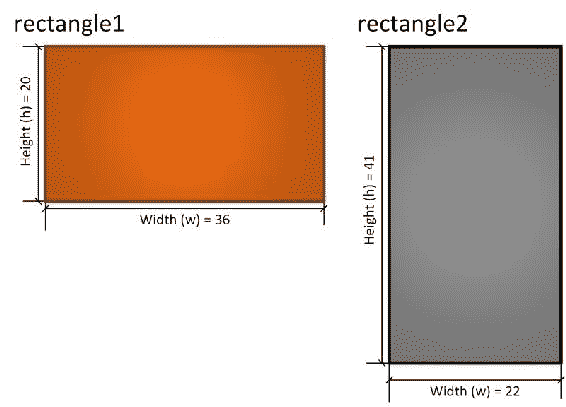

下图显示了两个名为`pentagon1`和`pentagon2`的常规五角大楼实例。绘制这些实例时，将指定其边值的长度。我们可以使用`RegularPentagon`类作为蓝图来生成两个不同的`RegularPentagon`实例。注意，`pentagon1`的边值长度为`20`，而`pentagon2`的边值长度为`16`。每个实例的边长都有不同的值。

下图显示了名为`ellipse1`、`ellipse2`、`ellipse3`和`ellipse4`的四个椭圆实例。绘制这些实例时指定了它们的半长轴和半短轴值。我们可以使用`Ellipse`类作为蓝图来生成四个不同的`Ellipse`实例。请注意，对于半长轴和半短轴，每个椭圆都有自己的特定值。

我们从 Web 服务需求中识别出九个完全不同的真实世界对象，因此，我们可以生成以下九个类来创建必要的对象：

*   `Circle`
*   `Ellipse`
*   `EquilateralTriangle`
*   `Square`
*   `Rectangle`
*   `RegularPentagon`
*   `RegularHexagon`
*   `RegularOctagon`
*   `RegularDecagon`

### 提示

注意类名称使用**Pascal case**。Pascal case 表示组成名称的每个单词的第一个字母大写，而其他字母则为小写。这是 Java 中的一种编码约定。例如，我们为类使用`EquilateralTriangle`名称，该类将是允许我们生成多个等边三角形的蓝图。

# 识别变量和常数

我们知道每个形状实现目标所需的信息。现在，我们必须设计类，以包括向每个实例提供所需数据的必要字段。我们必须确保每个类都有必要的字段，这些字段封装了对象执行基于应用程序域的所有任务所需的所有数据。

让我们从`Circle`课开始。我们需要知道这个类的每个实例的半径，也就是每个圆对象的半径。因此，我们需要一个封装的变量，它允许`Circle`类的每个实例指定半径的值。

### 注

类中定义的用于封装 Java 9 中类的每个实例的数据的变量称为**字段**。对于类中定义的字段，每个实例都有自己的独立值。这些字段允许我们定义类实例的特征。在其他支持面向对象原则的编程语言中，这些在类中定义的变量称为属性。

`Circle`类定义了一个名为`radius`的浮点字段，对于该类的任何新实例，其初始值等于`0`。在我们创建了一个`Circle`类的实例之后，可以更改`radius`属性的值。因此，我们的圆在创建后可以变小或变大。

### 提示

请注意字段名使用了**驼峰格**。驼峰大小写表示第一个字母是小写的，然后，组成名称的每个单词的第一个字母都是大写的，而其他字母是小写的。它是 Java 中变量和字段的编码约定。例如，对于存储半径值的字段，我们使用名称`radius`，对于存储需要此数据的其他类中的边长值的属性，我们将使用`lengthOfSide`。

假设我们创建了两个`Circle`类的实例。其中一个实例名为`circle1`，另一个实例名为`circle2`。实例名称允许我们访问每个对象的封装数据，因此，我们可以使用它们更改公开字段的值。

Java9 使用一个点（`.`）来允许我们访问实例的属性。因此，`circle1.radius`为名为`circle1`的`Circle`实例提供对半径的访问，`circle2.radius`为名为`circle2`的`Circle`实例提供对半径的访问。

### 提示

注意，命名约定使我们很容易区分实例名（即变量）和类名。每当我们看到大写或大写的第一个字母时，就意味着我们在谈论一个类，如`Circle`或`Rectangle`。

我们可以将`14`分配给`circle1.radius`，将`39`分配给`circle2.radius`。这样，每个`Circle`实例的`radius`字段将具有不同的值。

现在，让我们进入`Rectangle`课程。我们必须为这个类定义两个浮点字段：`width`和`height`。它们的初始值也将是`0`。然后，我们可以创建名为`rectangle1`、`rectangle2`、`rectangle3`和`rectangle4`的`Rectangle`类的四个实例。

我们可以将下表中总结的值分配给`Rectangle`类的四个实例：

<colgroup class="calibre15"><col class="calibre16"> <col class="calibre16"> <col class="calibre16"></colgroup> 
| 

实例名

 | 

`width`

 | 

`height`

 |
| --- | --- | --- |
| `rectangle1` | `141` | `281` |
| `rectangle2` | `302` | `162` |
| `rectangle3` | `283` | `73` |
| `rectangle4` | `84` | `214` |

这样，`rectangle1.width`将等于`141`，而`rectangle4.width`将等于`84`。`rectangle1`实例表示一个矩形，`width`为`141`，`height`为`281`。

下表总结了为 Web 服务后端代码所需的九个类中的每一个类定义的浮点字段：

<colgroup class="calibre15"><col class="calibre16"> <col class="calibre16"></colgroup> 
| 

类名

 | 

字段列表

 |
| --- | --- |
| `Circle` | `radius` |
| `Ellipse` | `semiMinorAxis`和`semiMajorAxis` |
| `EquilateralTriangle` | `lengthOfSide` |
| `Square` | `lengthOfSide` |
| `Rectangle` | `width`和`height` |
| `RegularPentagon` | `lengthOfSide` |
| `RegularHexagon` | `lengthOfSide` |
| `RegularOctagon` | `lengthOfSide` |
| `RegularDecagon` | `lengthOfSide` |

### 提示

这些字段是各自类的成员。然而，字段并不是类可以拥有的唯一成员。

请注意，这些类中的六个具有相同的字段：`lengthOfSide`，具体而言，以下六个类：`EquilateralTriangle`、`Square`、`RegularPentagon`、`RegularHexagon`、`RegularOctagon`和`RegularDecagon`。稍后我们将深入探讨这六个类的共同点，并利用面向对象的特性重用代码并简化我们的 Web 服务维护。然而，我们的旅程才刚刚开始，我们将在学习 Java9 中包含的其他面向对象特性的同时进行改进。事实上，让我们记住，我们正在学习有关应用程序领域的知识，我们仍然不是 2D 形状方面的专家。

下图显示了一个包含九个类及其字段的**UML**（**统一建模语言**类图。这个图表很容易理解。类名显示在标识每个类的矩形顶部。保存类名的同一形状下方的矩形显示该类公开的所有字段名，前缀为加号（**+**。这个前缀表示它后面是 UML 中的属性名和 Java9 中的字段名。考虑到下一个 UML 图并不代表我们类的最佳组织。这只是第一个草图。

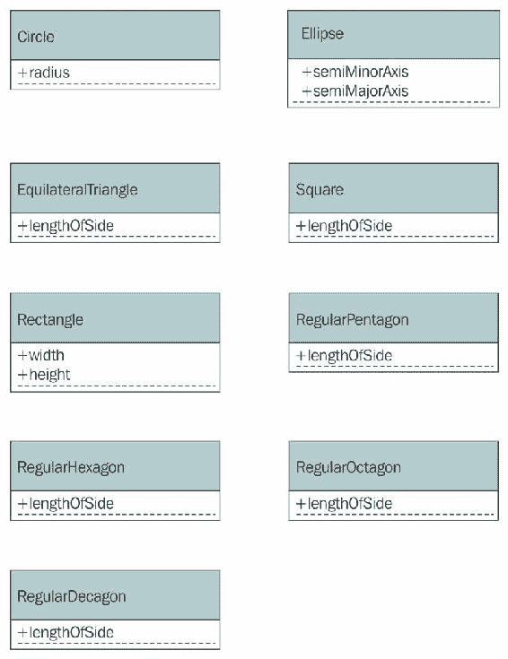

# 确定创建方法的行动

到目前为止，我们设计了九个类，并为每个类确定了必要的字段。现在，是时候添加与先前定义的字段一起工作的必要代码片段，以执行所有必要的任务，即计算周长和面积。我们必须确保每个类都有必要的封装函数来处理对象中指定的属性值，以执行所有任务。

让我们忘记一点不同类之间的相似之处。我们将单独使用它们，就好像我们没有几何公式的必要知识一样。我们将从`Circle`课开始。我们需要一段代码，允许此类的每个实例使用`radius`属性的值来计算面积和周长。

### 提示

在类中定义来封装类的每个实例的行为的函数称为**方法**。每个实例都可以访问该类公开的方法集。方法中指定的代码可以使用类中指定的字段。当我们执行一个方法时，它将使用特定实例的字段。无论何时定义方法，我们都必须确保将它们定义在一个逻辑位置，即保存所需数据的位置。

当一个方法不需要参数时，我们可以说它是一个**无参数**方法。在这种情况下，我们最初为类定义的所有方法都将是无参数方法，它们只处理先前定义的字段的值，并在详细分析每个二维形状时使用先前在图中显示的公式。因此，我们将能够在没有参数的情况下调用这些方法。我们将开始创建方法，但稍后我们将能够基于特定的 Java9 特性探索其他选项。

`Circle`类定义了以下两种无参数方法。我们将在`Circle`类的定义中声明这两个方法的代码，以便它们可以访问`radius`属性值，如下所示：

*   `calculateArea`：此方法返回一个带圆计算面积的浮点值。返回 Pi（`π`乘以`radius`字段值（*π*半径*2或*π*（半径^2】*的平方）。
*   `calculatePerimeter`：此方法返回一个浮点值，其中包含圆的计算周长。返回 Pi（`π`乘以`radius`字段值（*π*2*半径*的 2 倍）。

### 提示

在 Java9 中，`Math.PI`为我们提供了 Pi 的值。`Math.pow`方法允许我们将第一个参数的值提升到第二个参数的幂。稍后我们将学习如何在 Java9 中编写这些方法。

这些方法没有副作用，也就是说，它们不会对相关实例进行更改。这些方法只返回计算值，因此，我们认为它们是非突变方法。它们的操作自然地用`calculate`动词来描述。

Java9 使用一个点（`.`）来允许我们执行实例的方法。假设我们有两个`Circle`类的实例：`circle1`的`radius`属性等于`5`，而`circle2`的`radius`属性等于`10`。

如果调用`circle1.calculateArea()`，则返回*π*5*2的结果，约为`78.54`。如果调用`square2.calculateArea()`，则返回*π*10*2的结果，约为`314.16`。每个实例的`radius`属性都有不同的值，因此，每个实例执行`calculateArea`方法的结果都不同。

如果调用`circle1.calculatePerimeter()`，则返回*π*2*5*的结果，约为`31.41`。另一方面，如果调用`circle2.calculatePerimeter()`，则返回*π*2*10*的结果，约为`62.83`。

现在，让我们进入课程。我们需要为`Circle`类指定两个名称相同的方法：`calculateArea`和`calculatePerimeter`。此外，这些方法返回相同的类型并且不需要参数，因此我们可以将它们都声明为无参数方法，就像我们在`Circle`类中所做的那样。但是，这些方法必须以不同的方式计算结果；也就是说，他们必须对矩形使用适当的公式，并考虑`width`和`height`字段的值。其他类也需要相同的两种方法。但是，它们中的每一个都将针对相关形状使用适当的公式。

我们对`Ellipse`类生成的`calculatePerimeter`方法有一个特殊的问题。椭圆周长的计算极其复杂，因此有许多公式提供近似值。精确的公式需要无限系列的计算。我们将使用一个不太准确的初始公式，但我们将在稍后找到解决这种情况的方法，并改进结果。初始公式将允许我们返回一个浮点值，其中包含椭圆周长的计算近似值。

下图显示了 UML 图的更新版本，包括九个类、它们的属性和它们的方法。它显示了第二轮的结果：

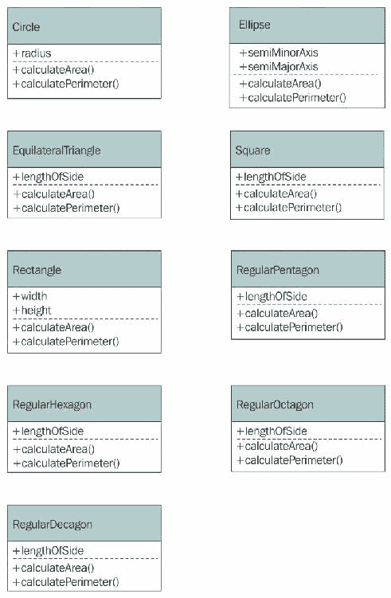

# 用 UML 图组织类

到目前为止，我们的面向对象的解决方案包括九个类及其字段和方法。然而，如果我们再看看这九个类，我们会注意到它们都有相同的两个方法：`calculateArea`和`calculatePerimeter`。每个类中方法的代码都不同，因为每个形状都使用一个特殊的公式来计算面积或周长。但是，这些方法的声明、契约、接口或协议是相同的。这两个方法具有相同的名称，始终无参数，并返回浮点值。因此，它们都返回相同的类型。

当我们谈论这九门课时，我们说我们谈论的是九种不同的几何二维形状或简单的形状。因此，我们可以概括这九种形状所需的行为、协议或接口。这九个形状必须使用前面解释的声明定义`calculateArea`和`calculatePerimeter`方法。我们可以创建一个接口来确保这九个类提供所需的行为。

接口是一个名为`Shape`的特殊类，它概括了我们应用中对二维几何形状的要求。在本例中，我们将使用一个特殊的类，我们不会使用它来创建实例，但在将来，我们将使用接口来实现相同的目标。`Shape`类声明了两个返回浮点值的无参数方法：`calculateArea`和`calculatePerimeter`。然后，我们将九个类声明为`Shape`类的子类，该类将继承这些定义，并为每个方法提供特定代码。

### 提示

`Shape`（`Circle`、`Ellipse`、`EquilateralTriangle`、`Square`、`Rectangle`、`RegularPentagon`、`RegularHexagon`、`RegularOctagon`和`RegularDecagon`的子类实现了这些方法，因为它们在提供代码的同时维护`Shape`超类中指定的相同方法声明。**抽象**和**层次**是面向对象编程的两大支柱。我们只是在这个话题上迈出了第一步。

面向对象编程允许我们发现对象是否是特定超类的实例。当我们改变九个类的组织结构，它们成为`Shape`的子类后，`Circle`、`Ellipse`、`EquilateralTriangle`、`Square`、`Rectangle`、`RegularPentagon`、`RegularHexagon`、`RegularOctagon`、`RegularDecagon`的任何实例都是`Shape`类的实例。

事实上，解释抽象并不困难，因为当我们说面向对象模型代表真实世界时，我们说的是关于面向对象模型的真相。

可以说，正十边形确实是一个形状，因此，`RegularDecagon`的实例也是`Shape`类的实例。`RegularDecagon`的一个实例是`Shape`（属于`RegularDecagon`的超类）和`RegularDecagon`（我们用来创建对象的类）。

下图显示了 UML 图的更新版本，其中包含超类或基类（`Shape`），其九个子类及其属性和方法。请注意，该图使用一条以箭头结尾的线，该箭头将每个子类连接到其超类。您可以阅读以下以箭头结尾的行：行开始的类*是以箭头结尾的类*的子类。例如，`Circle`是`Shape`的子类，`Rectangle`是`Shape`的子类。图表显示了第三轮的结果。

### 注

单个类可以是许多子类的超类。

# 利用领域专家的反馈

现在，是时候与我们的领域专家开会了，他们是一位对二维几何有着卓越知识的人。我们可以使用 UML 图来解释解决方案的面向对象设计。在我们解释了将用于抽象行为的不同类之后，领域专家向我们解释说，有许多形状有一些共同点，我们可以进一步概括行为。以下六种形状是正多边形：

*   等边三角形（T0 类）有三条边
*   正方形（即`Square`类）有四条边
*   一个普通的五角大楼（即`RegularPentagon`类）有五条边
*   正六边形（`RegularHexagon`类）有六条边
*   普通八角形（即`RegularOctagon`类）有八条边
*   一个普通的十边形（`RegularDecagon`类）有十条边

正多边形是等角和等边的多边形。构成正多边形的所有边具有相同的长度，并围绕公共中心放置。这样，任意两边之间的所有角度都相等。

下图显示了六个正多边形以及我们可以用来计算其周长和面积的通用公式。计算面积的广义公式要求我们计算一个余切，在公式中简称为**cot**。

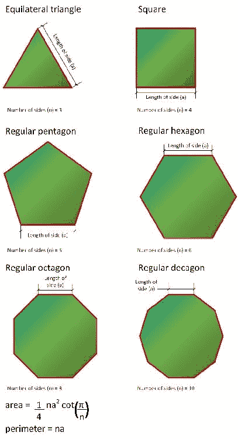

### 提示

在 Java9 中，`Math`类没有提供直接计算余切的方法。但是，它提供了一种计算切线的方法：`Math.tan`。`x`的余切等于`1`除以`x`：`1/ Math.tan(x)`的切线。因此，我们可以很容易地用这个公式计算余切。

由于三个形状使用相同的公式，只是边数（**n**参数的值不同，因此我们可以概括六个正多边形所需的接口。接口是一个名为`RegularPolygon`的特殊类，它定义了一个新的`getSidesCount`方法，该方法返回带整数值的边数。`RegularPolygon`类是先前定义的`Shape`类的子类。这是有意义的，因为正多边形确实是一种形状。表示正多边形的六个类成为`RegularPolygon`的子类。然而，`calculateArea`和`calculatePerimeter`方法都使用广义公式编码在`RegularPolygon`类中。子类对`getSidesCount`方法进行编码以返回正确的值，如下所示：

*   `EquilateralTriangle`：3
*   `Square`：4
*   `RegularPentagon`：5
*   `RegularHexagon`：6
*   `RegularOctagon`：8
*   `RegularDecagon`：10

`RegularPolygon`类还定义了之前在表示正多边形的三个类中定义的`lengthOfSide`属性。现在，这六个类成为`RegularPolygon`的子类并继承`lengthOfSide`属性。下图显示了 UML 图的更新版本，其中包含新的`RegularPolygon`类以及表示正多边形的六个类中的更改。表示正多边形的六个类不声明`calculateArea`或`calculatePerimeter`方法，因为这些类从`RegularPolygon`超类继承它们，不需要对这些应用一般公式的方法进行更改。

图表显示了第四轮的结果。

当我们分析椭圆时，我们提到在计算其周长时存在问题。我们与我们的领域专家进行了交谈，他向我们提供了有关该问题的详细信息。有许多公式提供此形状周长值的近似值。添加使用其他公式计算周长的其他方法是有意义的。他建议我们使用以下公式计算周长：

*   *David W.Cantrell*提出的公式
*   *Srinivasa Aiyangar Ramanujan*开发的公式的第二个版本

我们将为`Ellipse`类定义以下两个附加的无参数方法。新方法将返回一个浮点值，并解决椭圆形状的具体问题：

*   `calculatePerimeterWithRamanujanII`
*   `calculatePerimeterWithCantrell`

这样，`Ellipse`类将实现`Shape`超类中指定的方法，还将添加两个不包含在`Shape`的任何其他子类中的特定方法。下图显示了更新版本的 UML 图，其中包含`Ellipse`类的新方法。

下图显示了第五轮的结果：

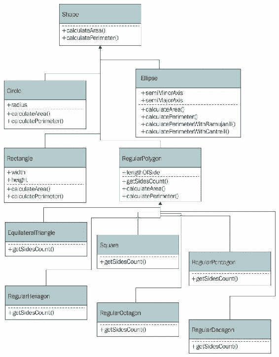

# 测试你的知识

1.  也称为对象：
    1.  子类。
    2.  领域。
    3.  实例。
2.  以下哪些类名遵循 Pascal case 约定，并且是 Java 9 中类的合适名称：
    1.  `regularDecagon`
    2.  `RegularDecagon`
    3.  `Regulardecagon`
3.  在类中的方法中指定的代码：
    1.  可以访问类中指定的字段。
    2.  无法与类的其他成员交互。
    3.  无法访问类中指定的字段。
4.  在类中定义的用于封装类的每个实例的行为的函数称为：
    1.  子类。
    2.  领域。
    3.  方法。
5.  一个子类：
    1.  仅从其超类继承方法。
    2.  仅从其超类继承字段。
    3.  从其超类继承所有成员。
6.  类中定义的用于封装 Java 9 中类的每个实例的数据的变量称为：
    1.  领域。
    2.  方法。
    3.  子类。
7.  类中定义的用于封装 Java 9 中类的每个实例的数据的变量称为：
    1.  领域。
    2.  方法。
    3.  子类。
8.  以下哪一个字段名遵循驼峰大小写约定，是 Java 9 中字段的合适名称：
    1.  `SemiMinorAxis`
    2.  `semiMinorAxis`
    3.  `semiminoraxis`

# 总结

在本章中，您学习了如何识别真实世界的元素，并将它们转换为 Java 9 支持的面向对象范例的不同组件：类、字段、方法和实例。您知道这些类表示生成对象（也称为实例）的蓝图或模板。

我们设计了几个类，其中包含表示现实对象蓝图的字段和方法，特别是 2D 形状。然后，我们利用抽象和特化不同类的能力改进了初始设计。在添加超类和子类时，我们生成了初始 UML 图的许多版本。我们了解应用领域，随着知识的增长，我们对原始设计进行了更改，我们意识到我们能够概括行为。

现在您已经学习了面向对象范例的一些基础知识，我们准备开始使用 JShell 在 Java9 中创建类和实例，这是我们将在下一章中讨论的内容。是时候开始面向对象的编码了！