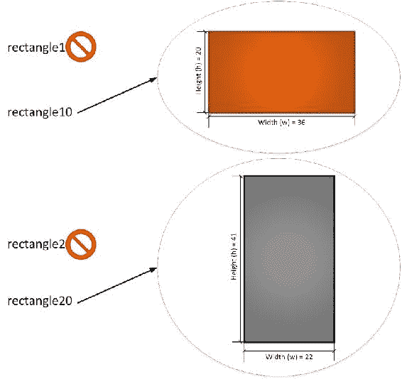
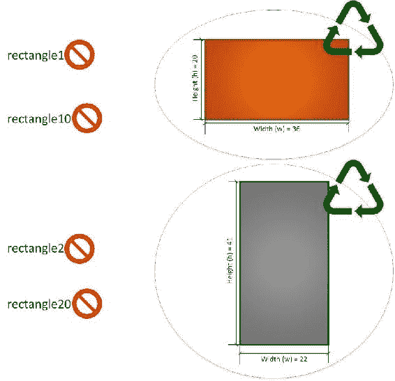
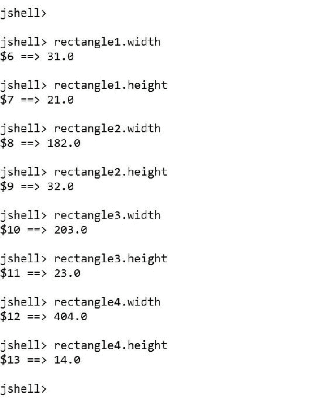
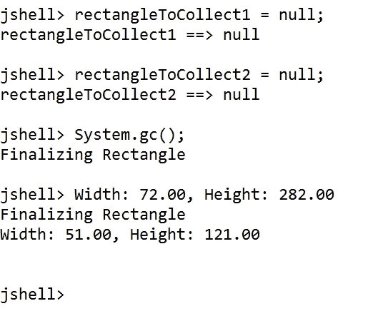
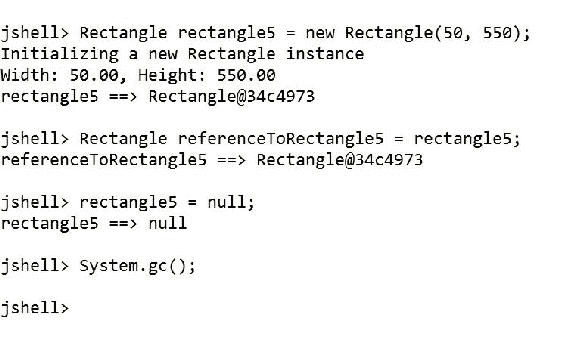
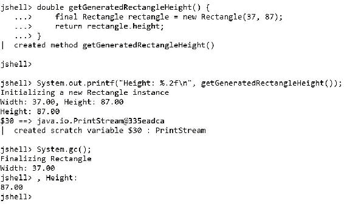

# 第三章类与实例

在本章中，我们将开始使用示例，介绍如何在 Java9 中编写类并自定义实例的初始化。我们将了解类如何作为蓝图来生成实例，并深入研究垃圾收集机制。我们将：

*   了解 Java 9 中的类和实例
*   使用对象初始化及其自定义
*   了解对象的生命周期
*   引入垃圾收集
*   声明类
*   自定义构造函数和初始化
*   了解垃圾收集的工作原理
*   创建类的实例并了解它们的范围

# 了解 Java 9 中的类和实例

在上一章中，我们学习了一些面向对象范例的基础知识，包括类和对象。我们开始为与 2D 形状相关的 Web 服务开发后端。我们最终创建了一个包含许多类的结构的 UML 图，包括它们的层次结构、字段和方法。现在是利用 JShell 开始编写基本类并在 JShell 中使用其实例的时候了。

在 Java9 中，类始终是类型和蓝图。对象是类的工作实例，因此对象是也称为**实例**。

### 注

类是 Java9 中的一流公民，它们将是我们面向对象解决方案的主要构建块。

一个或多个变量可以保存对实例的引用。例如，考虑到我们有以下三个变量：

*   `rectangle1`
*   `rectangle2`
*   `rectangle10`
*   `rectangle2``0`

让我们考虑一下，AUT0T0 变量保存了一个引用，它引用了它的 Ty2 T2 的一个实例，它的 Ty2 t2 被设置为 AUTT3T，并且它的 Ty4 T4 设置为 OutT5。`rectangle10`变量包含对`rectangle1`引用的同一实例的引用。因此，我们有两个变量持有对同一`Rectangle`对象的引用。

`rectangle2`变量保存对`Rectangle`类实例的引用，其`width`设置为`22`，其`height`设置为`41`。`rectangle20`变量包含对`rectangle2`引用的同一实例的引用。我们还有另外两个变量，它们包含对同一`Rectangle`对象的引用。

下图说明了许多`Rectangle`类型的变量持有对单个实例的引用的情况。变量名位于左侧，矩形及其宽度和高度值表示`Rectangle`类的特定实例。


在本章后面，我们将处理许多变量，这些变量包含对 JShell 中单个实例的引用。

# 使用对象初始化及其自定义

当你要求 Java 创建一个特定类的实例时，一些事情就发生了。Java 创建指定类型的新实例，**JVM**（**Java 虚拟机**）分配必要的内存，然后执行构造函数中指定的代码。

当 Java 在构造函数中执行代码时，类已经有了一个活动实例。因此，构造函数中的代码可以访问类中定义的字段和方法。显然，我们必须小心放在构造函数中的代码，因为在创建类实例时可能会产生巨大的延迟。

### 提示

构造函数对于执行设置代码和正确初始化新实例非常有用。

让我们忘掉层次结构结构，在这个层次结构中，我们为表示 2D 形状的类工作。假设我们必须将`Circle`类编码为独立类，而不是从任何其他类继承。在调用`calculateArea`或`calculatePerimeter`方法之前，我们希望每个新`Circle`实例的`radius`字段都有一个初始化为表示圆的适当值的值。我们不希望在没有为`radius`字段指定适当值的情况下创建新的`Circle`实例。

### 提示

当我们想在创建类实例之后，在访问引用所创建实例的变量之前，定义类实例字段的值时，构造函数非常有用。事实上，创建特定类实例的唯一方法是使用我们提供的构造函数。

每当我们需要在创建实例时提供特定的参数时，我们都可以用必要的参数声明许多不同的构造函数，并使用它们创建类的实例。构造函数允许我们确保，如果不使用提供的构造函数（使必要的参数成为必需的参数），就无法创建特定的类。因此，如果提供的构造函数需要一个`radius`参数，我们将无法在不为`radius`参数指定值的情况下创建类的实例。

假设我们必须将`Rectangle`类编码为独立类，而不是从任何其他类继承。在调用`calculateArea`或`calculatePerimeter`方法之前，我们希望每个新`Rectangle`实例的`width`和`height`字段都将其值初始化为表示每个矩形的适当值。我们不希望在没有为`width`和`height`字段指定适当值的情况下创建新的`Rectangle`实例。因此，我们将为这个类声明一个构造函数，它需要`width`和`height`的值。

# 引入垃圾收集

在某个特定时间，应用程序将不再需要处理实例。例如，一旦计算了圆的周长并在 Web 服务响应中返回了必要的数据，就不需要再继续处理特定的`Circle`实例。有些编程语言要求您小心不要让活动实例处于活动状态，并且必须显式地销毁它们并释放它所消耗的内存。

Java 提供了自动内存管理。JVM 运行时使用垃圾收集机制，自动释放不再引用的实例所使用的内存。垃圾收集过程极其复杂，有许多不同的算法，各有优缺点，JVM 有一些特定的考虑因素，应该加以考虑，以避免不必要的巨大内存压力。但是，我们将继续关注对象的生命周期。在 Java 9 中，当 JVM 运行时检测到您不再引用实例，或者保存对特定实例的引用的最后一个变量已超出范围时，它会使实例准备好成为下一个垃圾收集周期的一部分。

例如，让我们考虑一下我们的 Ty7T7 以前的例子，在这里我们有四个变量来引用对两个实例的引用。考虑到，无论是 Ty1 T1 和 Po.T2 变量都超出了范围。被`rectangle1`引用的实例仍被`rectangle10`引用，被`rectangle2`引用的实例仍被`rectangle20`引用。因此，没有一个实例可以从内存中删除，因为它们仍在被引用。下图说明了这种情况。超出范围的变量在右侧有一个无符号。



在`rectangle10`超出范围后，它引用的实例将成为一次性实例，因此，它可以安全地添加到可以从内存中删除的对象列表中。下图说明了这种情况。准备从内存中删除的实例具有循环符号。


在`rectangle20`超出范围后，它引用的实例将成为一次性实例，因此，它可以安全地添加到可以从内存中删除的对象列表中。下图说明了这种情况。这两个实例已经准备好从内存中删除，它们都有一个循环符号。



### 注

JVM 在后台自动运行垃圾收集过程，并自动收回准备进行垃圾收集且不再引用的实例所消耗的内存。我们不知道特定实例的垃圾收集过程何时发生，我们不应该干预该过程。在 Java9 中对垃圾收集算法进行了改进。

想象一下，我们必须分发我们储存在盒子中的物品。分发完所有物品后，我们必须将箱子扔进回收站。当盒子里还有一个或多个物品时，我们不能把它扔进回收站。我们绝对不想丢失我们必须分发的物品，因为它们非常昂贵。

这个问题有一个非常简单的解决方案：我们只需要数一数盒子里剩下的物品的数量。当盒子里的物品数量达到零时，我们可以扔掉盒子，也就是说，我们可以把它扔进回收站。然后，垃圾收集过程将删除所有已扔到回收站的项目。

### 提示

幸运的是，我们不必担心将实例扔进回收站。Java 会自动为我们做这件事。这对我们来说是完全透明的。

一个或多个变量可以保存对类的单个实例的引用。因此，在 Java 将实例放入垃圾收集就绪列表之前，有必要考虑对实例的引用数量。当对特定实例的引用数达到零时，从内存中删除该实例并收回该实例所消耗的内存是安全的，因为没有人再需要该特定实例。此时，实例已准备好由垃圾收集进程删除。

例如，我们可以创建一个类的实例并将其分配给一个变量。Java 将知道对这个实例有一个引用。然后，我们可以将同一实例分配给另一个变量。Java 将知道这个实例有两个引用。

在第一个变量超出范围后，保存实例引用的第二个变量仍然可以访问。Java 将知道还有另一个变量保存对该实例的引用，因此，该实例将无法进行垃圾收集。此时，实例必须仍然可用，也就是说，我们需要它处于活动状态。

在第二个变量超出范围后，就没有更多的变量包含对实例的引用。此时，Java 会将实例标记为已准备好进行垃圾收集，因为不再有变量持有对实例的引用，并且可以安全地将其从内存中删除。

# 声明类

以下几行在 Java 中声明了一个新的最小`Rectangle`类。样本的代码文件包含在`java_9_oop_chapter_03_01`文件夹中的`example03_01.java`文件中。

```java
class Rectangle {
}
```

`class`关键字，后跟类名（`Rectangle`，构成类定义的标题。在这种情况下，我们不会为`Rectangle`类指定父类或超类。一对花括号（`{}`）将类标题后的类主体包围起来。在接下来的章节中，我们将声明从另一个类继承的类，因此，它们将有一个超类。在本例中，类主体为空。`Rectangle`类是我们可以在 Java9 中声明的最简单的类。

### 注

您创建的任何未指定超类的新类都将是`java.lang.Object`类的子类。因此，`Rectangle`类是`java.lang.Object`的一个子类。

以下几行表示创建`Rectangle`类的等效方法。但是，我们不需要指定该类继承自`java.lang.Object`，因为它添加了不必要的样板代码。样本的代码文件包含在`example03_02.java`文件的`java_9_oop_chapter_03_01`文件夹中。

```java
class Rectangle extends java.lang.Object {
}
```

# 自定义构造函数和初始化

我们想用新矩形的宽度和高度值初始化`Rectangle`类的实例。为了做到这一点，我们可以利用前面介绍的构造函数。构造函数是在创建给定类型的实例时自动执行的特殊类方法。Java 在类中的任何其他代码之前运行构造函数中的代码。

我们可以定义一个构造函数，它接收宽度和高度值作为参数，并使用它初始化具有相同名称的字段。我们可以定义任意多的构造函数，因此，我们可以提供许多不同的初始化类的方法。在这种情况下，我们只需要一个构造函数。

以下几行创建了一个`Rectangle`类，在类体中定义了一个构造函数。此时，我们根本不使用访问修饰符，因为我们希望使类声明尽可能简单。我们稍后将与他们合作。样本的代码文件包含在`java_9_oop_chapter_03_01`文件夹中的`example03_03.java`文件中。

```java
class Rectangle {
    double width;
    double height;

    Rectangle(double width, double height) {
        System.out.printf("Initializing a new Rectangle instance\n");
        System.out.printf("Width: %.2f, Height: %.2f\n", 
            width, height);
        this.width = width;
        this.height = height;
    }
}
```

构造函数是一个类方法，它使用与类相同的名称：`Rectangle`。在我们的示例`Rectangle`类中，构造函数接收两个`double`类型的参数：`width`和`height`。构造函数中的代码打印一条消息，指示代码正在初始化新的`Rectangle`实例，并打印`width`和`height`的值。通过这种方式，我们将了解何时执行构造函数中的代码。因为构造函数有一个参数，所以称为**参数化构造函数**。

然后，下一行将作为参数接收的`width`双精度值分配给`width`双精度字段。我们使用`this.width`访问实例的`width`字段，`width`引用参数。`this`关键字提供对已创建的实例的访问，我们希望初始化该实例，即正在构建的对象。我们使用`this.height`访问实例的`height`字段，`height`引用参数。

构造函数前面的两行声明了`width`和`height`双字段。这两个字段是成员变量，我们可以在构造函数完成其执行后无限制地访问它们。

以下几行创建了名为`rectangle1`、`rectangle2`、`rectangle3`和`rectangle4`的`Rectangle`类的四个实例。样本的代码文件包含在`example03_04.java`文件的`java_9_oop_chapter_03_01`文件夹中。

```java
Rectangle rectangle1 = new Rectangle(31.0, 21.0);
Rectangle rectangle2 = new Rectangle(182.0, 32.0);
Rectangle rectangle3 = new Rectangle(203.0, 23.0);
Rectangle rectangle4 = new Rectangle(404.0, 14.0);
```

创建实例的每一行都指定了新变量的类型（`Rectangle`），后跟保存新实例引用的变量名（`rectangle1`、`rectangle2`、`rectangle3`或`rectangle4`）。然后，每行分配使用`new`关键字的结果，后跟`width`和`height`参数的所需值，用逗号分隔并用括号括起来。

### 提示

在 Java9 中，我们必须为变量指定类型，我们希望在其中保存对实例的引用。在本例中，我们用`Rectangle`类型声明每个变量。如果您有使用其他编程语言的经验，这些语言提供了一个关键字来生成隐式类型的局部变量，例如 C#中的`var`关键字，那么您必须知道 Java 9 中没有等效的关键字。

在输入声明类并在 JShell 中创建四个实例的所有行之后，我们将看到四条消息，上面写着`"Initializing a new Rectangle instance"`，后面是在调用每个实例的构造函数时指定的宽度和高度值。以下屏幕截图显示了在 JShell 中执行代码的结果：


在执行前面几行之后，可以检查我们创建的每个实例的`width`和`height`字段的值。以下几行显示了 JShell 可以计算的表达式，以显示每个字段的值。样本的代码文件包含在`example03_05.java`文件的`java_9_oop_chapter_03_01`文件夹中。

```java
rectangle1.width
rectangle1.height
rectangle2.width
rectangle2.height
rectangle3.width
rectangle3.height
rectangle4.width
rectangle4.height
```

下面的屏幕截图显示了在 JShell 中对前面的表达式求值的结果。



在 JShell 中输入以下表达式。样本的代码文件包含在`example03_06.java`文件的`java_9_oop_chapter_03_01`文件夹中。

```java
rectangle1 instanceof Rectangle
```

由于`rectangle1`是`Rectangle`类的实例，JShell 将显示`true`作为对前面表达式求值的结果。`instanceof`关键字允许我们测试对象是否属于指定类型。通过这个关键字，我们可以确定一个对象是否为`Rectangle`对象。

如前所述，`Rectangle`是`java.lang.Object`类的一个子类。JShell 已经从`java.lang`导入了所有类型，因此我们可以将这个类引用为`Object`。在 JShell 中输入以下表达式。样本的代码文件包含在`java_9_oop_chapter_03_01`文件夹中的`example03_07.java`文件中。

```java
rectangle1 instanceof Object
```

由于`rectangle1`也是`java.lang.Object`类的一个实例，JShell 将显示`true`作为前面表达式的求值结果。

在 JShell 中输入以下表达式。样本的代码文件包含在`example03_08.java`文件的`java_9_oop_chapter_03_01`文件夹中。

```java
rectangle1.getClass().getName()
```

JShell 将显示`"Rectangle"`作为前一行的结果，因为`rectangle1`变量包含`Rectangle`类的实例。`getClass`方法允许我们检索对象的运行时类。该方法继承自`java.lang.Object`类。`getName`方法将运行时类型转换为字符串。

现在，我们将尝试创建一个不提供参数的`Rectangle`实例。下一行不允许 Java 编译代码，并将在 JShell 中显示生成错误，因为编译器无法找到在`Rectangle`类中声明的无参数构造函数。为该类声明的唯一构造函数需要两个`double`参数，因此，Java 不允许在未指定`width`和`height`值的情况下创建`Rectangle`实例。样本的代码文件包含在`example03_09.java`文件的`java_9_oop_chapter_03_01`文件夹中。

```java
Rectangle rectangleError = new Rectangle();
```

下一个屏幕截图显示了详细的错误消息：


# 了解垃圾收集的工作原理

我们将通过几个简单的例子来了解垃圾收集是如何工作的。我们不想编写垃圾收集过程的代码，也不想深入了解这个复杂过程的所有细节。我们的目标是使用 Java9 创建面向对象的代码，而不是创建 JVM 的新实现。

现在，我们将向先前创建的`Rectangle`类添加一些代码，以使 Java 在垃圾收集从内存中删除此类的实例之前执行一些代码。我们添加此代码只是为了清楚地了解垃圾收集是如何工作的。我们不建议，通常也没有必要像现在这样，向`finalize`方法添加代码。将下一段代码看作只是出于教育目的的代码片段，而不是我们应该在课堂上做的事情。我们必须考虑到，我们不知道垃圾收集过程何时会确定有必要收回我们将创建的实例所使用的内存。这样做是安全的，但我们无法预测垃圾收集过程何时会这样做。在本例中，我们使用 JVM 提供的默认垃圾收集机制运行 JShell。

### 提示

您可以遵循最佳实践来释放资源，而无需向`finalize`方法添加代码。请记住，您不知道`finalize`方法将在何时执行。即使引用计数达到零，并且包含引用的所有变量都已超出范围，垃圾收集算法实现也可能保留资源，直到适当的垃圾收集销毁实例。因此，使用`finalize`方法释放资源从来都不是一个好主意。

以下几行显示了`Rectangle`类的新完整代码。新行将高亮显示。样本的代码文件包含在`java_9_oop_chapter_03_01`文件夹中的`example03_10.java`文件中。

```java
class Rectangle {
    double width;
    double height;

    Rectangle(double width, double height) {
        System.out.printf("Initializing a new Rectangle instance\n");
        System.out.printf("Width: %.2f, Height: %.2f\n", 
            width, height);
        this.width = width;
        this.height = height;
    }

 // The following code doesn't represent a best practice
 // It is included just for educational purposes
 // and to make it easy to understand how the
 // garbage collection process works
 @Override
 protected void finalize() throws Throwable {
 try {
 System.out.printf("Finalizing Rectangle\n");
 System.out.printf("Width: %.2f, Height: %.2f\n", width, height);
 } catch(Throwable t){
 throw t;
 } finally{
 super.finalize();
 }
 }
}
```

新行声明一个`finalize`方法，该方法覆盖`java.lang.Object`继承的方法，并打印一条消息，指示它正在终结`Rectangle`实例，并显示该实例的宽度和高度值。不要担心您还不理解的代码片段，因为我们将在接下来的章节中学习它们。该类中包含的新代码的目标是让我们知道垃圾收集进程何时将从内存中删除该对象。

### 提示

避免编写重写`finalize`方法的代码。Java 9 不提倡使用`finalize`方法来执行清理操作。

以下几行创建了名为`rectangleToCollect1`和`rectangleToCollect2`的`Rectangle`类的两个实例。然后，接下来的几行将`null`分配给这两个变量，因此，这两个对象的引用计数都达到零，并且它们准备好进行垃圾收集。这两个实例可以安全地从内存中删除，因为作用域中没有更多的变量包含对它们的引用。样本的代码文件包含在`java_9_oop_chapter_03_01`文件夹中的`example03_11.java`文件中。

```java
Rectangle rectangleToCollect1 = new Rectangle(51, 121);
Rectangle rectangleToCollect2 = new Rectangle(72, 282);
rectangleToCollect1 = null;
rectangleToCollect2 = null;
```

下面的屏幕截图显示了在 JShell 中执行前几行的结果：


这两个矩形实例可以安全地从内存中删除，但我们没有看到指示已为每个实例执行了`finalize`方法的消息。请记住，我们不知道垃圾收集进程何时会确定有必要收回这些实例使用的内存。

为了了解垃圾收集过程是如何工作的，我们将强制进行垃圾收集。但是，了解我们不应该在实际应用程序中强制执行垃圾收集是非常重要的。我们必须让 JVM 选择最合适的时间来执行收集。

下一行显示了调用`System.gc`方法以强制 JVM 执行垃圾收集的代码。样本的代码文件包含在`java_9_oop_chapter_03_01`文件夹中的`example03_12.java`文件中。

```java
System.gc();
```

下面的屏幕截图显示了在 JShell 中执行前一行的结果。我们将看到指示两个实例的`finalize`方法已被调用的消息。



以下几行创建名为`rectangle5`的`Rectangle`类实例，然后将对该对象的引用分配给`referenceToRectangle5`变量。这样，对象的引用计数增加到 2。下一行将`null`分配给`rectangle5`，并使对象的参考计数从 2 下降到 1。`referenceToRectangle5`变量 stills 保存对`Rectangle`实例的引用，因此，强制垃圾收集的下一行不会从内存中删除该实例，我们也不会看到`finalize`方法中代码的执行结果。作用域中仍有一个变量保存对实例的引用。样本的代码文件包含在`example03_13.java`文件的`java_9_oop_chapter_03_01`文件夹中。

```java
Rectangle rectangle5 = new Rectangle(50, 550);
Rectangle referenceToRectangle5 = rectangle5;
rectangle5 = null;
System.gc();
```

下面的屏幕截图显示了在 JShell 中执行前几行的结果：



现在，我们将执行一行，将`null`分配给`referenceToRectangle5`，以强制引用实例的引用计数达到零，并强制垃圾收集过程在下一行中运行。样本的代码文件包含在`example03_14.java`文件的`java_9_oop_chapter_03_01`文件夹中。

```java
referenceToRectangle5 = null;
System.gc();
```

下面的屏幕截图显示了在 JShell 中执行前几行的结果。我们将看到指示实例的`finalize`方法已被调用的消息。


### 提示

非常重要的一点是，您不需要为引用分配`null`来强制 JVM 从对象收回内存。在前面的示例中，我们想了解垃圾收集是如何工作的。当对象不再以透明的方式被引用时，Java 将自动销毁这些对象。

# 创建类实例并了解其范围

我们将编写几行代码，在`getGeneratedRectangleHeight`方法的范围内创建名为`rectangle`的`Rectangle`类的实例。方法中的代码使用创建的实例访问并返回其`height`字段的值。在这种情况下，代码使用`final`关键字作为`Rectangle`类型的前缀，向名为`rectangle`的`Rectangle`实例声明**不可变引用**。

### 注

不可变引用也称为常量引用，因为我们不能用`Rectangle`的另一个实例替换`rectangle`常量所持有的引用。

定义新方法后，我们将调用它并强制进行垃圾收集。样本的代码文件包含在`example03_15.java`文件的`java_9_oop_chapter_03_01`文件夹中。

```java
double getGeneratedRectangleHeight() {
    final Rectangle rectangle = new Rectangle(37, 87);
    return rectangle.height; 
}

System.out.printf("Height: %.2f\n", getGeneratedRectangleHeight());
System.gc();
```

下面的屏幕截图显示了在 JShell 中执行前几行的结果。我们将看到一些消息，表明在调用`getGeneratedRectangleHeight`方法和下一个强制垃圾收集的调用之后，实例的`finalize`方法已经被调用。当该方法返回值时，矩形将超出范围，因为它的引用计数从 1 减少到零。

不可变变量的实例引用对于垃圾收集是安全的。因此，当我们强制垃圾收集时，我们会看到通过`finalize`方法显示的消息。



# 练习

现在您已经了解了对象的生命周期，现在是时候花点时间在 JShell 中创建新的类和实例了。

## 练习 1

1.  创建一个新的`Student`类，该类的构造函数需要两个`String`参数：`firstName`和`lastName`。使用参数初始化与参数同名的字段。当为`firstName`创建了一个类的`firstName`值时。
2.  创建`Student`类的实例并将其分配给变量。检查 JShell 中打印的消息。
3.  创建`Student`类的实例并将其分配给变量。检查 JShell 中打印的消息。

## 练习 2

1.  创建一个接收两个`String`参数的函数：`firstName`和`lastName`。创建先前定义的`Student`类的实例，将收到的参数作为创建实例的参数。使用实例属性打印一封邮件，邮件的名字后跟空格和姓氏。您可以创建一个方法，稍后将其添加到`Student`类中以执行相同的任务。然而，我们将在接下来的章节中了解更多有关这方面的信息。
2.  使用必要的参数调用先前创建的函数。检查 JShell 中打印的消息。

# 测试你的知识

1.  当 Java 在构造函数中执行代码时：
    1.  我们无法访问类中定义的任何成员。
    2.  已存在该类的活动实例。我们可以访问类中定义的方法，但不能访问其字段。
    3.  该类已经有一个活动实例，我们可以访问其成员。
2.  构造函数在以下方面非常有用：
    1.  执行设置代码并正确初始化新实例。
    2.  在销毁实例之前执行清理代码。
    3.  声明类的所有实例都可以访问的方法。
3.  Java 9 使用以下机制之一自动释放不再引用的实例所使用的内存：
    1.  实例映射减少。
    2.  垃圾压缩。
    3.  垃圾收集。
4.  Java 9 允许我们定义：
    1.  一个主构造函数和两个可选的辅助构造函数。
    2.  许多具有不同参数的构造函数。
    3.  每个类只有一个构造函数。
5.  我们创建的任何未指定超类的新类都将是以下类的子类：
    1.  `java.lang.Base`
    2.  `java.lang.Object`
    3.  `java.object.BaseClass`
6.  以下哪一行创建了`Rectangle`类的实例并将其引用分配给`rectangle`变量：
    1.  `var rectangle = new Rectangle(50, 20);`
    2.  `auto rectangle = new Rectangle(50, 20);`
    3.  `Rectangle rectangle = new Rectangle(50, 20);`
7.  以下哪一行访问`rectangle`实例的`width`字段：
    1.  `rectangle.field`
    2.  `rectangle..field`
    3.  `rectangle->field`

# 总结

在本章中，您了解了对象的生命周期。您还了解了对象构造函数是如何工作的。我们声明了第一个生成对象蓝图的简单类。我们了解了类型、变量、类、构造函数、实例和垃圾收集如何与 JShell 中的实例一起工作。

现在您已经学会了开始创建类和实例，我们已经准备好使用 Java 9 中包含的数据封装功能共享、保护、使用和隐藏数据，这是我们将在下一章中讨论的内容。