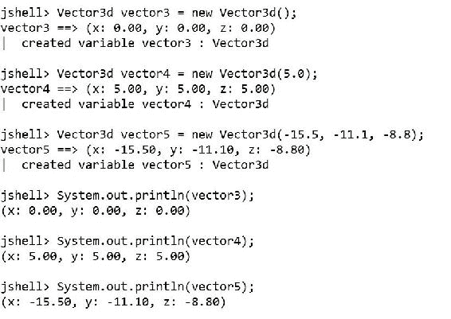
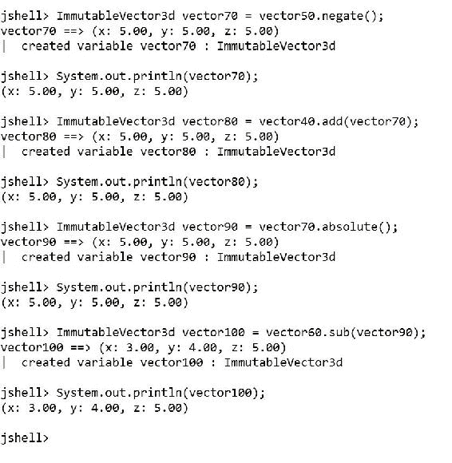
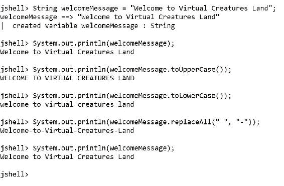
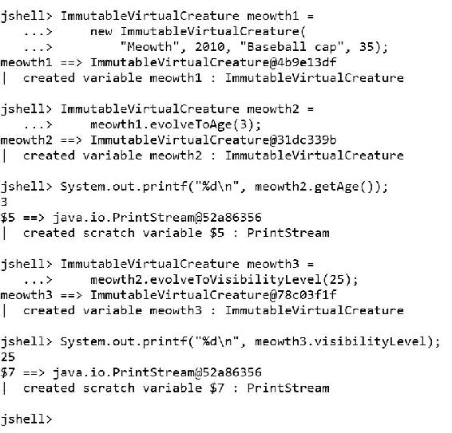

# 第五章可变类和不可变类

在本章中，我们将学习可变类和不可变类。在构建面向对象的代码时，我们将了解它们的差异以及它们的优缺点。我们将：

*   创建可变类
*   在 JShell 中使用可变对象
*   构建不可变类
*   在 JShell 中使用不可变对象
*   了解变异对象和非变异对象之间的区别
*   了解编写并发代码时非变异对象的优点
*   使用不可变`String`类的实例

# 在 Java 9 中创建可变类

当我们声明没有`final`关键字的实例字段时，我们创建了一个可变的实例字段，这意味着我们可以在字段初始化后为我们创建的每个新实例更改它们的值。当我们创建一个定义了至少一个可变字段的类的实例时，我们创建了一个可变对象，它是一个可以在初始化后更改其状态的对象。

### 注

可变对象也称为突变对象。

例如，假设我们必须开发一个 Web 服务来渲染 3D 世界中的元素并返回高分辨率渲染场景。这样的任务要求我们使用 3D 向量。首先，我们将使用具有三个可变字段的可变 3D 向量：`x`、`y`和`z`。可变 3D 矢量必须提供以下功能：

*   `double`类型的三个可变实例字段：`x`、`y`、`z`。
*   通过为`x`、`y`和`z`字段提供初始值来创建实例的构造函数。
*   创建实例的构造函数，该实例的所有值都初始化为`0`，即`x = 0`、`y = 0`和`z = 0`。具有这些值的 3D 向量是被称为**原点向量**的。
*   一个构造函数，它创建一个实例，其中所有值都初始化为一个公共值。例如，如果我们指定`3.0`作为公共值，则构造函数必须生成一个具有`x = 3.0`、`y = 3.0`和`z = 3.0`的实例。
*   将 3D 向量的每个分量设置为其绝对值的`absolute`方法。
*   一种`negate`方法，在适当的位置对 3D 向量的每个分量求反。
*   一种`add`方法，将 3D 向量的值设置为自身和作为参数接收的 3D 向量之和。
*   一种`sub`方法，将 3D 向量的值设置为自身与作为参数接收的 3D 向量的差值。
*   `toString`方法的一种实现，该方法打印 3D 向量的三个分量的值：`x`、`y`和`z`。

以下几行声明了表示 Java 中 3D 向量可变版本的`Vector3d`类。样本的代码文件包含在`java_9_oop_chapter_05_01`文件夹中的`example05_01.java`文件中。

```java
public class Vector3d {
    public double x;
    public double y;
    public double z;

 Vector3d(double x, double y, double z) {
 this.x = x;
 this.y = y;
 this.z = z;
 }

 Vector3d(double valueForXYZ) {
 this(valueForXYZ, valueForXYZ, valueForXYZ);
 }

 Vector3d() {
 this(0.0);
 }

    public void absolute() {
        x = Math.abs(x);
        y = Math.abs(y);
        z = Math.abs(z);
    }

    public void negate() {
        x = -x;
        y = -y;
        z = -z;
    }

    public void add(Vector3d vector) {
        x += vector.x;
        y += vector.y;
        z += vector.z;
    }

    public void sub(Vector3d vector) {
        x -= vector.x;
        y -= vector.y;
        z -= vector.z;
    }

    public String toString() {
        return String.format(
            "(x: %.2f, y: %.2f, z: %.2f)",
            x,
            y,
            z);
    }
}
```

新的`Vector3d`类声明了三个构造函数，其行在前面的代码清单中突出显示。第一个构造函数接收三个`double`参数`x`、`y`和`z`，并使用这些参数中接收的值初始化具有相同名称和类型的字段。

第二个构造函数接收一个`double`参数`valueForXYZ`，并使用`this`关键字调用前面解释过的构造函数，将接收到的参数作为三个参数的值。

### 提示

我们可以在一个构造函数中使用`this`关键字来调用其他具有我们类中定义的不同参数的构造函数。

第三个构造函数是一个无参数的构造函数，使用`this`关键字调用前面解释过的构造函数，将`0.0`作为`valueForXYZ`参数的值。这样，构造函数允许我们构建一个原始向量。

无论何时调用`absolute`、`negate`、`add`或`sub`方法，我们都会对实例进行变异，即改变对象的状态。这些方法更改我们从中调用它们的实例的`x`、`y`和`z`字段的值。

# 在 JShell 中处理可变对象

以下几行创建了一个名为`vector1`的新`Vector3d`实例，其中`x`、`y`和`z`的初始值分别为`10.0`、`20.0`和`30.0`。第二行创建了一个名为`vector2`的新`Vector3d`实例，其中`1.0`、`2.0`和`3.0`为`x`、`y`和`z`的初始值。然后，代码使用`vector1`调用`System.out.println`方法，然后使用`vector2`作为参数。对`println`方法的两次调用都将对每个`Vector3d`实例执行`toString`方法，以显示可变 3D 向量的`String`表示。然后，代码以`vector2`作为参数为`vector1`调用`add`方法。最后一行再次调用`println`方法，并以`vector1`为参数，在调用`add`方法时对象发生变异后，打印`x`、`y`和`z`的新值。样本的代码文件包含在`java_9_oop_chapter_05_01`文件夹中的`example05_01.java`文件中。

```java
Vector3d vector1 = new Vector3d(10.0, 20.0, 30.0);
Vector3d vector2 = new Vector3d(1.0, 2.0, 3.0);
System.out.println(vector1);
System.out.println(vector2);
vector1.add(vector2);
System.out.println(vector1);
```

以下屏幕截图显示了在 JShell 中执行前面代码的结果：


字段的初始值为`x`的`10.0`、`y`的`20.0`和`z`的`30.0`。`add`方法更改三个字段的值。因此，对象状态发生如下变化：

*   `vector1.x`从`10.0`突变为*10.0+1.0=11.0*
*   `vector1.y`从`20.0`突变为*20.0+2.0=22.0*
*   `vector1.z`从`30.0`突变为*30.0+3.0=33.0*

调用`add`方法后的`vector1`字段的值为`x`的`11.0`、`y`的`22.0`和`z`的`33.0`。我们可以说该方法改变了对象的状态。因此，`vector1`是一个可变对象和可变类的实例。

以下几行使用三个可用构造函数创建名为`vector3`、`vector4`和`vector5`的`Vector3d`类的三个实例。然后，接下来的几行调用`System.out.println`方法，在创建对象后打印`x`、`y`和`z`的值。样本的代码文件包含在`example05_02.java`文件的`java_9_oop_chapter_05_01`文件夹中。

```java
Vector3d vector3 = new Vector3d();
Vector3d vector4 = new Vector3d(5.0);
Vector3d vector5 = new Vector3d(-15.5, -11.1, -8.8);
System.out.println(vector3);
System.out.println(vector4);
System.out.println(vector5);
```

以下屏幕截图显示了在 JShell 中执行前面代码的结果：



接下来的几行为先前创建的实例调用许多方法。样本的代码文件包含在`example05_02.java`文件的`java_9_oop_chapter_05_01`文件夹中。

```java
vector4.negate();
System.out.println(vector4);
vector3.add(vector4);
System.out.println(vector3);
vector4.absolute();
System.out.println(vector4);
vector5.sub(vector4);
System.out.println(vector5);
```

三个`vector4`字段（`x`、`y`、`z`的初始值为`5.0`。对`vector4.negate`方法的调用将三个字段的值更改为`-5.0`。

三个`vector3`字段（`x`、`y`、`z`的初始值为`0.0`。对`vector3.add`方法的调用通过`vector3`和`vector4`的每个分量之和的结果改变三个字段的值。因此，对象状态发生如下变化：

*   `vector3.x`从`0.0`突变为*0.0+（-5.0）=-5.0*
*   `vector3.y`从`0.0`突变为*0.0+（-5.0）=-5.0*
*   `vector3.z`从`0.0`突变为*0.0+（-5.0）=-5.0*

`vector3`字段的三个字段在调用`add`方法后设置为`-5.0`。对`vector4.absolute`方法的调用将三个字段的值从`-5.0`更改为`5.0`。

字段的初始值为`x`的`-15.5`、`y`的`-11.1`、和`z`的`-8.8`。对`vector5.sub`方法的调用通过减去`vector5`和`vector4`的每个分量的结果来改变三个字段的值。因此，对象状态发生如下变化：

*   `vector5.x`从`-15.5`突变到*-15.5-5.0=-20.5*
*   `vector5.y`从`-11.1`突变到*-11.1-5.0=-16.1*
*   `vector5.z`从`-8.8`突变到*-8.8-5.0=-13.8*

以下屏幕截图显示了在 JShell 中执行前面代码的结果：


# 在 Java 9 中构建不可变类

到目前为止，我们一直在处理可变类和变异对象。每当我们公开可变字段时，我们都会创建一个类来生成可变实例。在某些情况下，我们可能更喜欢在初始化后无法更改其状态的对象。我们可以将类设计为不可变的，并生成不可变的实例，这些实例在创建和初始化后无法更改其状态。

当我们处理并发代码时，不可变对象非常有用的一个典型场景。无法更改其状态的对象解决了许多典型的并发问题，并避免了可能难以检测和解决的潜在错误。由于不可变对象无法更改其状态，因此当许多不同的线程在没有适当的同步机制的情况下对其进行修改时，不可能最终导致对象的状态已损坏或不一致。

### 注

不可变对象也称为非变异对象。

我们将创建先前编码的`Vector3d`类的不可变版本，以表示不可变的 3D 向量。这样，我们将注意到可变类与其不可变版本之间的区别。不可变 3D 矢量必须提供以下功能：

*   三个类型为`double`：`x`、`y`和`z`的不可变实例字段。初始化或构造实例后，无法更改这些字段的值。
*   通过为`x`、`y`和`z`不可变字段提供初始值来创建实例的构造函数。
*   创建实例的构造函数，其所有值都设置为`0`，即`x = 0`、`y = 0`和`z = 0`。
*   一种构造函数，它创建一个实例，其中所有值都初始化为一个公共值。例如，如果我们指定`3.0`作为公共值，则构造函数必须生成一个具有`x = 3.0`、`y = 3.0`和`z = 3.0`的不可变实例。
*   一种`absolute`方法，返回一个新实例，其中新不可变 3D 向量的每个分量都设置为我们调用该方法的实例的每个分量的绝对值。
*   一种`negate`方法，返回一个新实例，其中新的不可变 3D 向量的每个分量都设置为我们调用该方法的实例的每个分量的求反值。
*   一种`add`方法，它返回一个新实例，其中新不可变 3D 向量的每个分量都设置为实例的每个分量之和，在该实例中，我们调用该方法并将不可变 3D 向量的每个分量作为参数接收。
*   一种`sub`方法，返回一个新实例，其中新的不可变 3D 向量的每个分量都设置为实例的每个分量的减法，在该方法中，我们调用该方法，并将不可变 3D 向量的每个分量作为参数接收。
*   `toString`方法的一种实现，该方法打印 3D 向量的三个分量的值：`x`、`y`和`z`。

以下几行声明了表示 Java 中 3D 向量的不可变版本的`ImmutableVector3d`类。样本的代码文件包含在`java_9_oop_chapter_05_01`文件夹中的`example05_03.java`文件中。

```java
public class ImmutableVector3d {
    public final double x;
    public final double y;
    public final double z;

 ImmutableVector3d(double x, double y, double z) {
 this.x = x;
 this.y = y;
 this.z = z;
 }

 ImmutableVector3d(double valueForXYZ) {
 this(valueForXYZ, valueForXYZ, valueForXYZ);
 }

 ImmutableVector3d() {
 this(0.0);
 }

    public ImmutableVector3d absolute() {
        return new ImmutableVector3d(
            Math.abs(x),
            Math.abs(y),
            Math.abs(z));
    }

    public ImmutableVector3d negate() {
        return new ImmutableVector3d(
            -x,
            -y,
            -z);
    }

    public ImmutableVector3d add(ImmutableVector3d vector) {
        return new ImmutableVector3d(
            x + vector.x,
            y + vector.y,
            z + vector.z);
    }

    public ImmutableVector3d sub(ImmutableVector3d vector) {
        return new ImmutableVector3d(
            x - vector.x,
            y - vector.y,
            z - vector.z);
    }

    public String toString() {
        return String.format(
            "(x: %.2f, y: %.2f, z: %.2f)",
            x,
            y,
            z);
    }
}
```

新的`ImmutableVector3d`类使用`final`关键字声明了三个不可变的实例字段：`x`、`y`和`z`。在前面的代码清单中，突出显示了为该类声明的三个构造函数的行。这些构造函数的代码与我们为`Vector3d`类分析的代码相同。唯一的区别在于执行，因为构造函数正在初始化不可变的实例字段，这些字段在初始化后不会更改其值。

无论何时调用`absolute`、`negate`、`add`或`sub`方法，它们的代码都会返回一个`ImmutableVector3d`类的新实例，并给出每个操作的结果。我们永远不会改变我们的情况；也就是说，我们不会更改对象的状态。

# 在 JShell 中使用不可变对象

以下几行创建了一个名为`vector10`的新`ImmutableVector3d`实例，其中`x`、`y`和`z`的初始值分别为`100.0`、`200.0`和`300.0`。第二行创建了一个名为`vector20`的新`ImmutableVector3d`实例，其中`11.0`、`12.0`和`13.0`用于初始值`x`、`y`和`z`。然后，代码使用`vector10`调用`System.out.println`方法，然后使用`vector20`作为参数。对`println`方法的两次调用都将对每个`ImmutableVector3d`实例执行`toString`方法，以显示不可变 3D 向量的`String`表示。然后，代码以`vector20`为参数调用`vector10`的`add`方法，并将返回的`ImmutableVector3d`实例保存在`vector30`中。

最后一行调用以`vector30`为参数的`println`方法，打印此实例中的`x`、`y`和`z` 的值，该实例的结果为`vector10`和`vector20`之间的加法运算。在声明`ImmutableVector3d`类的代码后面输入行。样本的代码文件包含在`example05_03.java`文件的`java_9_oop_chapter_05_01`文件夹中。

```java
ImmutableVector3d vector10 = 
    new ImmutableVector3d(100.0, 200.0, 300.0);
ImmutableVector3d vector20 = 
    new ImmutableVector3d(11.0, 12.0, 13.0);
System.out.println(vector10);
System.out.println(vector20);
ImmutableVector3d vector30 = vector10.add(vector20);
System.out.println(vector30);
```

下面的屏幕截图显示了在 JShell 中执行上一个代码的结果：


作为`add`方法的结果，我们有另一个名为`vector30`的不可变实例，其字段值为`x`的`111.0`、`y`的`212.0`和`z`的`313.0`。作为调用每个计算操作的方法的结果，我们将有另一个不可变的实例。

以下几行使用三个可用构造函数创建名为`vector40`、`vector50`和`vector60`的`ImmutableVector3d`类的三个实例。然后，接下来的几行调用`System.out.println`方法，在创建对象后打印`x`、`y`和`z`的值。样本的代码文件包含在`example05_03.java`文件的`java_9_oop_chapter_05_01`文件夹中。

```java
ImmutableVector3d vector40 = 
    new ImmutableVector3d();
ImmutableVector3d vector50 = 
    new ImmutableVector3d(-5.0);
ImmutableVector3d vector60 = 
    new ImmutableVector3d(8.0, 9.0, 10.0);
System.out.println(vector40);
System.out.println(vector50);
System.out.println(vector60);
```

下面的屏幕截图显示了在 JShell 中执行上一个代码的结果：


接下来的几行为先前创建的实例调用许多方法，并生成`ImmutableVector3d`类的新实例。样本的代码文件包含在`java_9_oop_chapter_05_01`文件夹中的`example05_03.java`文件中。

```java
ImmutableVector3d vector70 = vector50.negate();
System.out.println(vector70);
ImmutableVector3d vector80 = vector40.add(vector70);
System.out.println(vector80);
ImmutableVector3d vector90 = vector70.absolute();
System.out.println(vector90);
ImmutableVector3d vector100 = vector60.sub(vector90);
System.out.println(vector100);
```

三个`vector50`字段（`x`、`y`、`z`的初始值为`-5.0`。对`vector50.negate`方法的调用返回一个新的`ImmutableVector3d`实例，代码保存在`vector70`中。新实例将`5.0`作为三个字段（`x`、`y`、`z`的值。

三个`vector40`字段（`x`、`y`、`z`的初始值为`0`。对`vector40.add`方法的调用，以`vector70`为参数，返回一个新的`ImmutableVector3d`实例，代码保存在`vector80`中。新实例将`5.0`作为三个字段（`x`、`y`、`z`的值。

对`vector70.absolute`方法的调用返回一个新的`ImmutableVector3d`实例，代码保存在`vector90`中。新实例的三个字段（`x`、`y`、`z`的值为`5.0`。字段的绝对值与原始值相同，但代码仍然生成了一个新实例。

`vector60`字段的初始值为`x`的`8.0`、`y`的`9.0`和`z`的`10.0`。以`vector90`作为参数调用`vector60.sub`方法返回一个新的`ImmutableVector3d`实例，代码保存在`vector100`中。`vector100`字段的值为`x`的`3.0`、`y`的`4.0`和`z`的`5.0`。

以下屏幕截图显示了在 JShell 中执行前面代码的结果：



# 了解突变对象和非突变对象之间的差异

与可变版本相比，不可变版本增加了开销，因为调用`absolute`、`negate`、`add`或`sub`方法需要创建类的新实例。前面分析的名为`Vector3D`的可变类只是更改了字段的值，不需要生成新实例。因此，不可变版本的内存占用高于可变版本。

与可变版本相比，名为`ImmutableVector3d`的不可变类具有内存和性能开销。创建新实例比更改几个字段的值更昂贵。然而，正如前面所解释的，当我们处理并发代码时，为避免可变对象引起的潜在问题而支付额外的开销是有意义的。我们只需要确保分析优势和权衡，以决定哪种方法是编写特定类的最方便的方法。

现在，我们将编写几行代码来处理可变版本，并为不可变版本生成等效代码。通过这种方式，我们将能够对这两段代码之间的差异进行简单而直观的比较。

以下几行创建了一个名为`mutableVector3d1`的新`Vector3d`实例，其中`x`、`y`和`z`的初始值分别为`-30.5`、`-15.5`和`-12.5`。然后，代码打印新实例的`String`表示，调用`absolute`方法，并打印变异对象的`String`表示。样本的代码文件包含在`java_9_oop_chapter_05_01`文件夹中的`example05_04.java`文件中。

```java
// Mutable version
Vector3d mutableVector3d1 = 
    new Vector3d(-30.5, -15.5, -12.5);
System.out.println(mutableVector3d1);
mutableVector3d1.absolute();
System.out.println(mutableVector3d1);
```

以下屏幕截图显示了在 JShell 中执行前面代码的结果：


以下行创建一个名为`immutableVector3d1`的新`ImmutableVector3d`实例，其中`x`、`y`、`z`的初始值分别为`-30.5`、`-15.5`和`-12.5`。然后，代码打印新实例的`String`表示，调用生成名为`immutableVector3d2`的新`ImmutableVector3d`实例的`absolute`方法，并打印新对象的`String`表示。样本的代码文件包含在`java_9_oop_chapter_05_01`文件夹中的`example05_04.java`文件中。

```java
// Immutable version
ImmutableVector3d immutableVector3d1 = 
    new ImmutableVector3d(-30.5, -15.5, -12.5);
System.out.println(immutableVector3d1);
ImmutableVector3d immutableVector3d2 =
    immutableVector3d1.absolute();
System.out.println(immutableVector3d2);
```

以下屏幕截图显示了在 JShell 中执行前面代码的结果：


可变的版本可用于单个`Vector3d`实例。`Vector3d`类的构造函数只执行一次。当我们调用`absolute`方法时，原始实例的状态发生了变化。

不可变版本使用两个`ImmutableVector3d`实例，因此，内存占用比可变版本高。`ImmutableVector3d`类的构造函数执行两次。当我们调用`absolute`方法时，第一个实例没有改变它的状态。

# 编写并发代码时学习非变异对象的优势

现在，让我们假设我们正在编写并发代码，该代码必须访问先前创建的实例的字段。首先，我们将分析可变版本的问题，然后我们将了解使用非可变对象的优势。

假设我们有两个线程，其中代码引用了保存在`mutableVector3d1`中的实例。第一个线程为这个变异对象调用`absolute`方法。`absolute`方法的第一行代码将`Math.abs`的结果和`x`的实际值作为参数分配给`x`可变字段。

此时，方法没有完成其执行，下一行代码将无法访问这些值。但是，在另一个线程中运行的引用了此实例的并发代码可能会在`absolute`方法完成执行之前访问`x`、`y`和`z`字段的值。对象处于损坏状态，因为字段的值分别为`x`的`30.5`、`y`的`-15.5`和`z`的`-12.5`。这些值并不代表当`absolute`方法完成其执行时我们将拥有的 3D 向量。有许多代码同时运行，并且在没有任何同步机制的情况下可以访问同一个实例，这就产生了问题。

并发编程和线程编程是复杂的主题，值得一本完整的书。有一些同步机制可以避免前面提到的问题，并使类线程安全。然而，另一个解决方案是使用不可变类来生成非变异对象。

如果我们使用不可变版本，两个线程可以引用同一个初始实例。但是，当其中一个线程调用`absolute`方法时，原始 3D 向量不会发生变化，因此前面的问题永远不会发生。另一个线程将继续使用其对原始 3D 向量的引用及其原始状态。调用`absolute`方法的线程将生成一个完全独立于原始实例的新实例。

同样，理解这个主题值得一本完整的书是非常重要的。然而，重要的是要理解为什么不可变类在实例将参与并发代码的特定场景中可能是一个特殊需求。

# 处理不可变字符串类的实例

`String`类，特别是类`java.lang.String`类，表示字符串，是一个不可变的类，生成非变异对象。因此，`String`类提供的方法不会改变对象。

例如，以下几行创建了一个新的`String`，即名为`welcomeMessage`的`java.lang.String`类的一个新实例，初始值为`"Welcome to Virtual Creatures Land"`。然后，代码多次调用`System.out.println`，其中`welcomeMessage`后跟一个不同的方法作为参数。首先，我们调用`toUpperCase`方法生成一个新的`String`，其中所有字符都转换为大写。然后，我们调用`toLowerCase`方法生成一个新的`String`，将所有字符转换为小写。然后，我们调用`replaceAll`方法生成一个新的`String`，其中空格被连字符（`-`替换。最后，我们再次调用`System.out.println`方法，将`welcomeMessage`作为参数来检查原始`String`的值。样本的代码文件包含在`java_9_oop_chapter_05_01`文件夹中的`example05_05.java`文件中。

```java
String welcomeMessage = "Welcome to Virtual Creatures Land";
System.out.println(welcomeMessage);
System.out.println(welcomeMessage.toUpperCase());
System.out.println(welcomeMessage.toLowerCase());
System.out.println(welcomeMessage.replaceAll(" ", "-"));
System.out.println(welcomeMessage);
```

以下屏幕截图显示了在 JShell 中执行前面代码的结果：



`welcomeMessage`字符串从未更改其值。对`toUpperCase`、`toLowerCase`和`replaceAll`方法的调用分别为它们生成并返回了一个新的`String`实例。

### 提示

无论我们为`String`实例调用哪种方法，它都不会改变对象。因此，我们可以说`String`是一个不可变的类。

# 创建现有可变类的不可变版本

在上一章中，我们创建了一个名为`VirtualCreature`的可变类。我们提供了 setter 方法来更改`hat`、`visibilityLevel`和`birthYear`字段的值。我们可以通过调用`setAge`方法来更改`birthYear`。

虚拟生物在进化后会改变它们的年龄、帽子和可见度。当它们进化时，它们会变成一个不同的生物，因此，在进化发生后生成一个新实例是有意义的。因此，我们将创建`VirtualCreature`类的不可变版本，并将其命名为`ImmutableVirtualCreature`。

以下几行显示了新的`ImmutableVirtualCreature`类的代码。样本的代码文件包含在`java_9_oop_chapter_05_01`文件夹中的`example05_06.java`文件中。

```java
import java.time.Year;

public class ImmutableVirtualCreature {
 public final String name;
 public final int birthYear;
 public final String hat;
 public final int visibilityLevel;

    ImmutableVirtualCreature(final String name, 
        int birthYear, 
        String hat, 
        int visibilityLevel) {
        this.name = name;
        this.birthYear = birthYear;
        this.hat = hat.toUpperCase();
        this.visibilityLevel = 
            getValidVisibilityLevel(visibilityLevel);
    }

    private int getCurrentYear() {
        return Year.now().getValue();
    }

    private int getValidVisibilityLevel(int levelToValidate) {
        return Math.min(Math.max(levelToValidate, 0), 100);
    }

    public int getAge() {
        return getCurrentYear() - birthYear;
    }

    public ImmutableVirtualCreature evolveToAge(int age) {
        int newBirthYear = getCurrentYear() - age;
        return new ImmutableVirtualCreature(
            name,
            newBirthYear,
            hat,
            visibilityLevel);
    }

    public ImmutableVirtualCreature evolveToVisibilityLevel(
        final int visibilityLevel) {
        int newVisibilityLevel =
            getValidVisibilityLevel(visibilityLevel);
        return new ImmutableVirtualCreature(
            name,
            birthYear,
            hat,
            newVisibilityLevel);
    }
}
```

`ImmutableVirtualCreature`类用`final`关键字`name`、`birthYear`、`hat`和`visibilityLevel`声明了四个公共不可变实例字段。在初始化或构造实例后，我们将无法更改这些字段的值。

构造函数根据`hat`参数中接收到的`String`生成大写的`String`，并将其存储在公共`hat`不可变字段中。我们对可见性级别进行了特定的验证，因此，构造函数使用在`visibilityLevel`参数中接收到的值调用名为`getValidVisibilityLevel,`的新私有方法，以将有效值分配给同名的不可变字段。

我们不再有 setter 方法，因为我们无法在不可变字段初始化后更改其值。该类声明了以下两个新的公共方法，它们返回一个新`ImmutableVirtualCreature`实例：

*   `evolveToAge`：此方法在`age`参数中接收进化虚拟生物的期望年龄。代码根据收到的年龄和当前年份计算出生年份，并返回一个新的带有新初始化值的`ImmutableVirtualCreature`实例。
*   `evolveToVisibilityLevel`：此方法在`visibilityLevel`参数中接收进化虚拟生物所需的可见性级别。代码调用`getValidVisibilityLevel`方法，根据接收到的值生成有效的可见性级别，并返回一个新的`ImmutableVirtualCreature`实例和新的初始化值。

以下几行创建了名为`meowth1`的`ImmutableVirtualCreature`类的实例。然后代码调用`meowth1.evolveToAge`方法，将`3`作为`age`参数的值，并将此方法返回的新`ImmutableVirtualCreature`实例保存在`meowth2`变量中。代码打印`meowth2.getAge`方法返回的值。最后，代码调用以`25`作为`invisibilityLevel`参数值的`meowth2.evolveToVisibilityLevel`方法，并将此方法返回的新`ImmutableVirtualCreature`实例保存在`meowth3`变量中。然后，代码打印存储在`meowth3.visibilityLevel`不可变字段中的值。样本的代码文件包含在`java_9_oop_chapter_05_01`文件夹中的`example05_06.java`文件中。

```java
ImmutableVirtualCreature meowth1 =
    new ImmutableVirtualCreature(
        "Meowth", 2010, "Baseball cap", 35);
ImmutableVirtualCreature meowth2 = 
    meowth1.evolveToAge(3);
System.out.printf("%d\n", meowth2.getAge());
ImmutableVirtualCreature meowth3 = 
    meowth2.evolveToVisibilityLevel(25);
System.out.printf("%d\n", meowth3.visibilityLevel);
```

以下屏幕截图显示了在 JShell 中执行前面代码的结果：



# 测试你的知识

1.  公开可变字段的类将：
    1.  生成不可变的实例。
    2.  生成可变实例。
    3.  生成可变类但不可变实例。
2.  在构造函数中使用的下列哪个关键字允许我们使用类中定义的不同参数调用其他构造函数：
    1.  `self`
    2.  `constructor`
    3.  `this`
3.  初始化后无法更改其状态的对象称为：
    1.  可变对象。
    2.  不可变对象。
    3.  接口对象。
4.  在 Java 9 中，`java.lang.String`生成：
    1.  不可变对象。
    2.  可变对象。
    3.  接口对象。
5.  如果我们为`java.lang.String`调用`toUpperCase`方法，该方法将：
    1.  将现有的`String`转换为大写字符并更改其状态。
    2.  返回一个新的`String`，将原始`String`的内容转换为大写字符。
    3.  返回一个新的`String`，其中包含原始`String`的内容。

# 总结

在本章中，您了解了可变类和不可变类之间的区别，以及它们生成的变异实例和非变异实例之间的区别。我们在 Java9 中声明了 3D 向量类的可变和不可变版本。

然后，我们利用 JShell 轻松地处理这些类的变异和非变异实例，并分析了更改对象状态和在需要更改其状态时返回新对象之间的区别。我们分析了可变类和不可变类的优缺点，并理解了为什么后者在处理并发代码时很有用。

现在，您已经了解了可变类和不可变类，您已经准备好使用继承、抽象、扩展和专门化，这是我们将在下一章中讨论的主题。