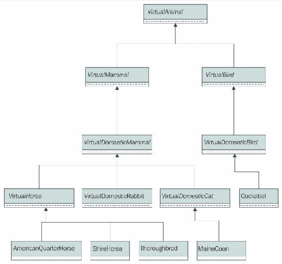

# 第 6 章继承、抽象、扩展和专门化

在本章中，我们将学习 Java 9 中面向对象编程最重要的支柱之一：继承。我们将举例说明如何创建类层次结构、重写和重载方法，以及如何使用超类中定义的构造函数。我们将：

*   创建类层次结构以抽象和专门化行为
*   理解继承
*   创建一个抽象基类
*   声明从另一个类继承的类
*   重载构造函数
*   重写实例方法
*   重载实例方法

# 创建类层次结构以抽象和专门化行为

在前面的章节中，我们已经在 Java9 中创建了类来生成现实对象的蓝图。我们声明了类，然后在 JShell 中创建了这些类的实例。现在是时候利用 Java9 中包含的许多面向对象编程的最高级特性，开始设计类的层次结构，而不是使用孤立的类。首先，我们将根据需求设计我们需要的所有类，然后我们将使用 Java9 中可用的特性来编码所设计的类。

我们使用类来表示虚拟生物。现在，让我们想象一下，我们必须开发一个复杂的 Web 服务，它需要我们处理几十种类型的虚拟动物。在项目的第一阶段，许多虚拟动物将类似于宠物和家畜。这些要求规定，我们的 Web 服务将开始与以下四种与家畜物种相似的虚拟动物合作：

*   **马**（**野马**。不要把这和野马（野马）混淆。我们将有公马和母马，母马可能怀孕了。此外，我们还将与以下三种特定的马品种合作：美国四分之一马、夏尔马和纯种马。
*   **凤头鹦鹉**（**荷兰若虫**。这种鸟也被称为采石场或韦罗。
*   **缅因州库恩**。这是最大的家养猫品种之一（猫科动物）。
*   **家养兔**（**兔尾鼠**。这种兔子也被称为欧洲兔子。

之前的列表包括每种家畜的学名。我们肯定会为每个物种使用最常见的名称，并且将学名作为`String`类型的类常量。因此，我们不会有一个复杂的类名，比如`VirtualEquusFerusCaballus`，但我们将使用`VirtualHorse`。

我们的第一项要求规定，我们必须为之前列举的四种家畜品种提供数量有限的品种。此外，未来有必要与所列家畜物种的其他成员、其他家畜、其他家鸟、特定马种，甚至不属于家畜物种的爬行动物和鸟类合作。我们的面向对象设计必须准备好为未来的需求进行扩展，就像现实项目中经常发生的那样。事实上，我们将使用这个例子来理解面向对象编程如何容易地扩展现有的设计来考虑未来的需求。

我们不想建立动物王国及其分类的完整模型。我们将只创建必要的类，以拥有一个灵活的模型，该模型可以根据未来的需求轻松扩展。动物王国极其复杂。我们将继续关注这个大家庭中的几个成员。

以下示例的主要目标之一是了解面向对象编程不会牺牲灵活性。我们将从一个简单的类层次结构开始，随着所需功能复杂性的增加，我们将对其进行扩展，并且我们有更多关于这些新需求的信息。让我们记住，需求不是固定的，我们必须始终添加新特性，并根据这些新特性对现有类进行更改。

我们将创建一个类的层次结构来表示虚拟动物及其品种的复杂分类。当我们扩展一个类时，我们会创建这个类的一个子类。下表列出了我们将创建的类及其说明：

*   `VirtualAnimal`：这个类概括了动物王国的所有成员。马、猫、鸟、兔子和爬行动物有一个共同点：它们是动物。因此，创建一个类是有意义的，该类将作为我们在面向对象设计中可能必须表示的不同虚拟动物类的基线。
*   `VirtualMammal`：这个类概括了所有的哺乳动物虚拟动物。哺乳动物不同于昆虫、鸟类、两栖动物和爬行动物。我们已经知道，我们可以养母马，它们也可以怀孕。我们还知道，我们必须对爬行动物和鸟类进行建模，因此，我们创建了一个扩展了`VirtualAnimal`的`VirtualMammal`类，并成为它的一个子类。
*   `VirtualBird`：这个类概括了所有的鸟类。鸟类不同于哺乳动物、昆虫、两栖动物和爬行动物。我们已经知道，我们还必须为爬行动物建模。Cockatiel 是一种鸟，因此，我们将创建一个与`VirtualMammal`级别相同的`VirtualBird`类。
*   `VirtualDomesticMammal`：该类扩展了`VirtualMammal`类。让我们做一些研究，我们会发现老虎（Panthera tigris）是猫科动物中最大、最重的现存物种。老虎是猫，但它与缅因州的浣熊完全不同，后者是一种小型家猫。最初的需求规定我们同时处理虚拟家养动物和虚拟野生动物，因此我们将创建一个类来概括所有虚拟家养哺乳动物。未来，我们将有一个`VirtualWildMammal`亚类，它将概括所有虚拟野生哺乳动物。
*   `VirtualDomesticBird`：该类扩展了`VirtualBird`类。让我们做一些研究，我们会发现鸵鸟是现存最大的鸟类。鸵鸟是一种鸟，但它与凤尾鹦鹉完全不同，凤尾鹦鹉是一种小型家鸟。我们将与虚拟家禽和虚拟野生鸟类一起工作，因此我们将创建一个类，概括所有虚拟家禽。在未来，我们将有一个`VirtualWildBird`类，它将概括所有虚拟野生鸟类。
*   `VirtualHorse`：该类扩展了`VirtualDomesticMammal`类。我们可以继续用额外的子类专门化`VirtualDomesticMammal`类，直到我们达到`VirtualHorse`类。例如，我们可以创建一个`VirtualHerbivoreDomesticMammal`子类，然后使`VirtualHorse`类从中继承。但是，我们必须开发的 Web 服务不需要任何介于`VirtualDomesticMammal`和`VirtualHorse`之间的中间类。`VirtualHorse`类概括了我们应用程序中虚拟马所需的字段和方法。`VirtualHorse`类的不同子类将代表虚拟马品种的不同家族。
*   `VirtualDomesticRabbit`：该类扩展了`VirtualDomesticMammal`类。`VirtualDomesticRabbit`类概括了我们应用程序中虚拟家养兔子所需的所有字段和方法。
*   `VirtualDomesticCat`：该类扩展了`VirtualDomesticMammal`类。`VirtualDomesticCat`类概括了我们应用程序中虚拟家猫所需的所有字段和方法。
*   `AmericanQuarterHorse`：该类扩展了`VirtualHorse`类。`AmericanQuarterHorse`类概括了属于美国四分之一马品种的虚拟马所需的所有字段和方法。
*   `ShireHorse`：该类扩展了`VirtualHorse`类。`ShireHorse`类概括了属于夏尔马品种的虚拟马所需的所有字段和方法。
*   `Thoroughbred`：该类扩展了`VirtualHorse`类。`Thoroughbred`类概括了纯种虚拟马所需的所有字段和方法。
*   `Cockatiel`：该类扩展了`VirtualDomesticBird`类。`Cockatiel`类概括了属于 Cockatiel 家族的虚拟家禽所需的所有字段和方法。
*   `MaineCoon`：该类扩展了`VirtualDomesticCat`类。`MaineCoon`类概括了属于缅因州浣熊品种的虚拟家猫所需的所有字段和方法。

下表显示了上一列表中的每个类及其超类、父类或超类型。

<colgroup class="calibre15"><col class="calibre16"> <col class="calibre16"></colgroup> 
| 

子类、子类或子类型

 | 

超类、父类或超类型

 |
| --- | --- |
| `VirtualMammal` | `VirtualAnimal` |
| `VirtualBird` | `VirtualAnimal` |
| `VirtualDomesticMammal` | `VirtualMammal` |
| `VirtualDomesticBird` | `VirtualBird` |
| `VirtualHorse` | `VirtualDomesticMammal` |
| `VirtualDomesticRabbit` | `VirtualDomesticMammal` |
| `VirtualDomesticCat` | `VirtualDomesticMammal` |
| `AmericanQuarterHorse` | `VirtualHorse` |
| `ShireHorse` | `VirtualHorse` |
| `Thoroughbred` | `VirtualHorse` |
| `Cockatiel` | `VirtualDomesticBird` |
| `MaineCoon` | `VirtualDomesticCat` |

下面的 UML 图显示了以前在类层次结构中组织的类。使用斜体文本格式的类名表示它们是抽象类。请注意，该图不包含任何成员，只包含类名。稍后我们将添加成员。



# 理解继承

当一个类从另一个类继承时，它继承组成父类的所有成员，也被称为**超类**。继承元素的类称为超类的**子类**。例如，`VirtualBird`子类继承`VirtualAnimal`超类中定义的所有实例字段、类字段、实例方法和类方法。

### 提示

在 Java9 中，子类不会从其超类继承任何构造函数。但是，可以调用超类中定义的构造函数，我们将在下一个示例中这样做。只有在超类中定义的任何构造函数中使用`private`访问修饰符，子类才能调用此构造函数。

`VirtualAnimal`抽象类是我们类层次结构的基线。我们说它是一个**抽象类**，因为我们无法创建`VirtualAnimal`类的实例。相反，我们必须创建`VirtualAnimal`的特定子类的实例，任何不是抽象类的子类。我们可以用来创建实例的类是称为**具体类**的类，或者在大多数情况下只是类。Java9 允许我们在不打算生成实例时将类声明为抽象类。

### 注

我们不能使用`new`关键字后跟类名来创建抽象类的实例。

我们要求每个`VirtualAnimal`指定其年龄，但不需要为其指定任何名称。我们只给家畜取名字。因此，我们必须在创建任何`VirtualAnimal`时指定年龄值，即任何`VirtualAnimal`子类的任何实例。该类将定义一个`age`字段，并在创建虚拟动物时打印一条消息。

但是等待；我们刚才解释说我们谈论的是一个抽象类，Java 不允许我们创建抽象类的实例。我们无法创建`VirtualAnimal`抽象类的实例，但我们可以创建任何具体类的实例，该类将`VirtualAnimal`作为超类，并且该子类最终可以调用`VirtualAnimal`抽象类中定义的构造函数。这听起来有点复杂，但在编写类代码并在 JShell 中运行示例后，我们将很容易理解这种情况。我们将在定义的每个构造函数中打印消息，以便于理解在创建具有一个或多个超类（包括一个或多个抽象超类）的具体类的实例时会发生什么。`VirtualAnimal`子类的所有实例也将是`VirtualAnimal`的实例。

`VirtualAnimal`抽象类将定义抽象类方法和抽象实例方法。**抽象类方法**是未经实现声明的类方法。**抽象实例方法**，也称为抽象方法，是在没有实现的情况下声明的实例方法。

### 提示

当我们声明这两种抽象方法中的任何一种时，我们只声明参数（如果有的话），然后放一个分号（`;`。我们根本不用花括号。我们只能在抽象类中声明抽象方法。任何抽象类的一个具体子类都必须为所有继承的抽象方法提供一个实现，使其成为一个类，我们可以使用`new`关键字创建实例。

`VirtualAnimal`类将声明以下七种抽象方法，这些方法满足特定家族或类型的所有成员所共有的需求。该类只声明它们所需的参数，而没有方法的实现。子类将负责满足所解释的需求。

*   `isAbleToFly`：返回一个`boolean`值，指示虚拟动物是否会飞。
*   `isRideable`：返回一个`boolean`值，指示虚拟动物是否可驾驶。可骑的动物可以被骑过去。
*   `isHerbivore`：返回一个`boolean`值，指示虚拟动物是否为食草动物。
*   `isCarnivore`：返回一个`boolean`值，指示虚拟动物是否是食肉动物。
*   `getAverageNumberOfBabies`：返回虚拟动物类型通常一次出生的平均婴儿数量。
*   `getBaby`：返回虚拟动物类型的婴儿的`String`表示。
*   `getAsciiArt`：返回一个带有 ASCII 艺术（基于文本的视觉艺术）的`String`，表示虚拟动物。

`VirtualAnimal`类将定义以下五种满足每个实例需求的方法。这些将是具体的方法，将在`VirtualAnimal`类中编码并由其所有子类继承。其中一些方法调用前面解释的抽象方法。稍后我们将详细了解这是如何工作的。

*   `printAsciiArt`：打印`getAsciiArt`方法返回的`String`。
*   `isYoungerThan`：返回一个`boolean`值，指示`VirtualAnimal`的`age`值是否低于作为参数接收的`VirtualAnimal`实例的年龄。
*   `isOlderThan`：返回一个`boolean`值，指示`VirtualAnimal`类的`age`值是否大于作为参数接收的`VirtualAnimal`实例的年龄。
*   `printAge`：打印虚拟动物的`age`值。
*   `printAverageNumberOfBabies`：打印一次虚拟动物通常出生的平均婴儿数量。此方法将考虑将在不同具体子类中实现的`getAverageNumberOfBabies`方法返回的值。

`VirtualMammal`类继承自`VirtualAnimal`。当我们创建一个新的`VirtualMammal`实例时，我们必须指定它的年龄以及它是否怀孕。该类从`VirtualAnimal`超类继承`age`属性，因此只需添加一个字段来指定虚拟哺乳动物是否怀孕。请注意，为了简单起见，我们在任何时候都不会指定性别。如果我们加上性别，我们需要一个验证来避免男性怀孕。现在，我们的重点是继承。每当创建虚拟哺乳动物时，该类将显示一条消息；也就是说，每当其构造函数被执行时。

### 提示

每个类继承自一个类，因此，我们将定义的每个新类只有一个超类。在这种情况下，我们将始终使用**单继承**。在 Java 中，一个类不能从多个类继承。

`VirtualDomesticMammal`类继承自`VirtualMammal`。当我们创建一个新的`VirtualDomesticMammal`实例时，我们必须指定它的名称和它最喜欢的玩具。我们给任何家养哺乳动物取名字，它们总是挑选最喜欢的玩具。的确，有时他们只是选择了一个满足他们毁灭欲望的物体。在许多情况下，我们最喜欢的玩具并不完全是我们希望他们挑选的玩具（我们的鞋子、运动鞋、人字拖或电子设备），但让我们把注意力集中在课堂上。我们无法更改名称，但可以更改最喜欢的玩具。我们从不改变任何家养哺乳动物的名字，但我们绝对可以强迫它改变它最喜欢的玩具。每当创建虚拟的家养哺乳动物时，该类都会显示一条消息。

`VirtualDomesticMammal`类将声明一个`talk`实例方法，该方法将显示一条指示虚拟家养哺乳动物名称的消息，该消息与消息`"says something"`连接在一起。每个亚类必须使特定的家养哺乳动物以不同的方式说话。鹦鹉真的会说话，但我们会认为马的小牛和兔子的牙齿发出咕噜咕噜声，好像他们在说话。注意，在本例中，`talk`实例方法在`VirtualDomesticMammal`类中有一个具体的实现，它不是一个抽象实例方法。子类将能够为该方法提供不同的实现。

`VirtualHorse`类继承自`VirtualDomesticMammal`类，实现了`getBaby`和`getAsciiArt`类以外继承自`VirtualAnimal`超类的所有抽象方法。这两种方法将在决定马品种的`VirtualHorse`的每个子类中实现。

我们希望马能嘶嘶作响。因此，我们需要一个`neigh`和`nicker`方法。马生气时通常会嘶鸣，高兴时会鸣叫。它比这要复杂一点，但我们将保持简单的示例。

`neigh`方法必须允许虚拟马执行以下操作：

*   嘶嘶一声
*   嘶鸣特定次数
*   对另一种只叫一次名字的虚拟家养哺乳动物发出嘶嘶声
*   与另一种具有特定次数名称的虚拟家养哺乳动物发出嘶嘶声

`nicker`方法必须允许虚拟马执行以下操作：

*   尼克，就一次
*   刻痕特定次数
*   Nicker 是另一种只叫一次名字的虚拟家养哺乳动物
*   Nicker 是另一种虚拟的家养哺乳动物，它有一个特定次数的名字

此外，马可以高兴或愤怒地嘶鸣或鸣叫。我们可以有一个`neigh`方法，其中许多参数都有默认值，或者有许多`neigh`方法。Java9 提供了许多机制来解决虚拟马必须能够嘶鸣的不同方式的挑战。我们将对`neigh`和`nicker`方法应用相同的解决方案。

当我们为任何虚拟马调用`talk`方法时，我们希望它能快乐地咬一次。我们不想显示在`VirtualDomesticMammal`类中引入的`talk`方法中定义的消息。因此，`VirtualHorse`类必须用自己的定义覆盖继承的`talk`方法。

我们想知道虚拟马所属的品种。因此，我们将定义一个`getBreed`抽象方法。调用此方法时，`VirtualHorse`的每个子类都必须返回相应的`String`及其名称。`VirtualHorse`类将定义一个名为`printBreed`的方法，该方法使用`getBreed`方法检索名称并打印品种。

此时，我们提到的所有类都是抽象类。我们无法创建它们的实例。`AmericanQuarterHorse`、`ShireHorse`和`Thoroughbred`类继承自`VirtualHorse`类，并实现继承的`getBaby`、`getAsciiArt`和`getBreed`方法。此外，它们的构造函数将打印一条消息，指示我们正在创建相应类的实例。这三个类是具体的类，我们可以创建它们的实例。

稍后我们将使用`VirtualBird`、`VirtualDomesticBird`、`Cockatiel`、`VirtualDomesticCat`和`MaineCoon`类。首先，我们将在 Java9 中创建基本的`VirtualAnimal`抽象类，然后我们将使用简单的继承来创建`VirtualHorse`类之前的子类。我们将重写方法和重载方法以满足所有要求。我们将利用多态性，这是面向对象编程中的一个非常重要的特性，在使用 JShell 中创建的类时，我们将了解这一特性。当然，在分析不同的课程时，我们将深入探讨介绍的许多主题。

下面的 UML 图显示了我们将在本章中编码的所有抽象类的成员：`VirtualAnimal`、`VirtualMammal`、`VirtualDomesticMammal`和`VirtualHorse`。我们将在下一章中对其他类进行编码，稍后我们将把它们的成员添加到图表中。我们使用斜体文本格式来表示抽象方法。请记住，公共成员有一个加号（**+**）作为前缀。一个类有一个受保护的成员，该成员使用哈希作为前缀（**。我们将使用粗体方法替代现有超类中的文本方法。在这种情况下，`VirtualHorse`类重写`tal``k()`方法。**

 **

在前面的 UML 图中，我们将注意到以下约定。我们将在所有包含类成员的 UML 图中使用这些约定。

*   构造函数与类具有相同的名称，并且不指定任何返回类型。它们始终是“方法”部分中列出的第一个方法。
*   字段的类型在以冒号（**：**）分隔的字段名称后指示。
*   每个方法的参数列表中的每个参数都用分号（**；**）分隔。
*   方法的返回类型在方法的参数列表后指示，用冒号（**：**分隔）。
*   我们总是使用 Java 类型名。

# 创建抽象基类

首先，我们将创建抽象类，它将成为其他类的基类。以下几行显示了 Java9 中`VirtualAnimal`抽象基类的代码。`class`之前的`abstract`关键字向 Java 表示我们正在创建一个抽象类。样本的代码文件包含在`example06_01.java`文件的`java_9_oop_chapter_06_01`文件夹中。

```
public abstract class VirtualAnimal {
    public final int age;

    public VirtualAnimal(int age) {
        this.age = age;
        System.out.println("VirtualAnimal created.");
    }

    public abstract boolean isAbleToFly();

    public abstract boolean isRideable();

    public abstract boolean isHerbivore();

    public abstract boolean isCarnivore();

    public abstract int getAverageNumberOfBabies();

    public abstract String getBaby();

    public abstract String getAsciiArt();

    public void printAsciiArt() {
        System.out.println(getAsciiArt());
    }

    public void printAverageNumberOfBabies() {
        System.out.println(new String(
            new char[getAverageNumberOfBabies()]).replace(
                "\0", getBaby()));
    }

    public void printAge() {
        System.out.println(
            String.format("I am %d years old", age));
    }

    public boolean isYoungerThan(VirtualAnimal otherAnimal) {
        return age < otherAnimal.age; 
    }

    public boolean isOlderThan(VirtualAnimal otherAnimal) {
        return age > otherAnimal.age;
    }
}
```

前面的类声明了一个名为`age`的`int`类型的不可变字段。构造函数需要一个`age`值来创建该类的实例，并打印一条消息，指示已创建虚拟动物。该类声明了以下抽象方法，这些方法在返回的类型之前包含了`abstract`关键字，以便让 Java 知道我们只想声明所需的参数，而不会为这些方法提供实现。我们已经解释了将在`VirtualAnimal`子类中实现的这些方法的目标。

*   `isAbleToFly`
*   `isRideable`
*   `isHerbivore`
*   `isCarnivore`
*   `getAverageNumberOfBabies`
*   `getBaby`
*   `getAsciiArt`

此外，该类声明了以下五种方法：

*   `printAsciiArt`：此方法调用`System.out.println`打印`getAsciiArt`方法返回的`String`。
*   `printAverageNumberOfBabies`：此方法创建一个新的`char`数组，其元素数等于`getAverageNumberOfBabies`方法返回的值。然后，代码创建一个新的用`char`数组初始化的`String`，并调用`replace`方法，用`getBaby`方法返回的`String`替换每个`"\0"`。通过这种方式，我们生成一个`String`，它将`getAverageNumberOfBabies`与`getBaby`返回的`String`进行连接。代码调用`System.out.println`打印生成的`String`。
*   `printAge`：此方法调用`System.out.println`打印`String.format`生成的`String`，其中包含`age`不可变字段的值。
*   `isYoungerThan`：此方法接收`otherAnimal`参数中的`VirtualAnimal`实例，并返回在该实例的`age`字段值与`otherAnimal.age`之间应用小于运算符的结果。这样，只有当该实例的年龄低于`otherAnimal`的年龄时，该方法才会返回`true`。
*   `isOlderThan`：此方法接收`otherAnimal`参数中的`VirtualAnimal`实例，并返回在该实例的`age`字段值与`otherAnimal.age`之间应用大于运算符的结果。这样，只有当此实例的年龄大于`otherAnimal`的年龄时，该方法才会返回`true`。

如果我们在声明了`VirtualAnimal`类之后在 JShell 中执行下面的行，Java 将生成一个致命错误，并指示`VirtualAnimal`类是抽象的，无法实例化。样本的代码文件包含在`example06_02.java`文件的`java_9_oop_chapter_06_01`文件夹中。

```
VirtualAnimal virtualAnimal1 = new VirtualAnimal(5);
```

以下屏幕截图显示了在 JShell 中执行前面代码的结果：


# 声明从另一个类继承的类

现在我们将创建另一个抽象类。具体来说，我们将创建最近创建的`VirtualAnimal`抽象类的一个子类。以下几行显示扩展了`VirtualAnimal`类的`VirtualMammal`抽象类的代码。注意，`abstract class`关键字后跟类名、`VirtualMammal`、`extends`关键字和`VirtualAnimal`，即超类。

`extends`关键字后面的类名表示新类在类定义中继承的超类。样本的代码文件包含在`java_9_oop_chapter_06_01`文件夹中的`example06_03.java`文件中。

```
public abstract class VirtualMammal extends VirtualAnimal {
    public boolean isPregnant;

    public VirtualMammal(int age, boolean isPregnant) {
 super(age);
        this.isPregnant = isPregnant;
        System.out.println("VirtualMammal created.");
    }

    public VirtualMammal(int age) {
        this(age, false);
    }
}
```

`VirtualMammal`抽象类继承先前声明的`VirtualAnimal`抽象类的成员，并添加一个名为`isPregnant`的新`boolean`可变字段。新的抽象类声明了两个构造函数。其中一个构造函数需要一个`age`值来创建类的实例，就像`VirtualAnimal`构造函数一样。另一个构造函数需要`age`和`isPregnant`值。

如果我们只使用一个`age`参数创建这个类的实例，Java 将使用第一个构造函数。如果我们用两个参数创建这个类的实例，`age`的`int`值和`isPregnant`的`boolean`值，Java 将使用第二个构造函数。

### 提示

我们重载了构造函数，并提供了两个不同的构造函数。我们不会将这些构造函数与`new`关键字一起使用，因为我们正在声明一个抽象类。但是，我们可以使用`super`关键字从子类调用这些构造函数。

需要`isPregnant`参数的第一个构造函数使用`super`关键字从基类或超类调用构造函数，即需要`age`参数的`VirtualAnimal`类中定义的构造函数。在超类中定义的构造函数完成其执行后，代码设置`isPregnant`可变字段的值，并打印一条消息，指示已创建虚拟哺乳动物。

### 提示

我们使用`super`关键字引用超类，并且我们可以使用该关键字调用超类中定义的任何构造函数。在 Java9 中，子类不会从其超类继承构造函数。在其他编程语言中，子类继承构造函数或初始值设定项，因此，了解 Java 9 中不会发生这种情况非常重要。

第二个构造函数使用`this`关键字调用前面解释过的构造函数，并将收到的`age`和`false`作为`isPregnant`参数的值。

我们将创建另一个抽象类。具体来说，我们将创建最近创建的`VirtualMammal`抽象类的一个子类。以下几行显示扩展了`VirtualMammal`类的`VirtualDomesticMammal`抽象类的代码。注意，`abstract class`关键字后跟类名、`VirtualDomesticMammal`、`extends`关键字和`VirtualMammal`，即超类。`extends`关键字后面的类名表示新类在类定义中继承的超类。样本的代码文件包含在`example06_04.java`文件的`java_9_oop_chapter_06_01`文件夹中。

```
public abstract class VirtualDomesticMammal extends VirtualMammal {
    public final String name;
    public String favoriteToy;

    public VirtualDomesticMammal(
        int age, 
        boolean isPregnant, 
        String name, 
        String favoriteToy) {
 super(age, isPregnant);
        this.name = name;
        this.favoriteToy = favoriteToy;
        System.out.println("VirtualDomesticMammal created.");
    }

    public VirtualDomesticMammal(
        int age, 
        String name, 
        String favoriteToy) {
        this(age, false, name, favoriteToy);
    }

    public void talk() {
        System.out.println(
            String.format("%s: says something", name));
    }
}
```

`VirtualDomesticMammal`抽象类继承先前声明的`VirtualMammal`抽象类的成员。重要的是要理解，新类还继承了超类从其超类继承的成员，即从`VirtualAnimal`抽象类继承的成员。例如，我们的新类继承了`VirtualAnimal`抽象类中声明的`age`不可变字段以及该类中声明的所有其他成员。

`VirtualDomesticMammal`类添加了一个名为`name`的新`String`不可变字段和一个名为`favoriteToy`的新`String`可变字段。新的抽象类声明了两个构造函数。其中一个构造函数需要四个参数来创建类的实例：`age`、`isPregnant`、`name`和`favoriteToy`。另一个构造函数需要除`isPregnant`之外的所有参数。

第一个需要四个参数的构造函数使用`super`关键字从基类或超类调用构造函数，即`VirtualMammal`类中定义的需要两个参数的构造函数：`age`和`isPregnant`。在超类中定义的构造函数完成其执行后，代码设置`name`和`favoriteToy`字段的值，并打印一条消息，指示已创建虚拟家养哺乳动物。

第二个构造函数使用`this`关键字调用前面解释过的构造函数，并使用收到的参数和`false`作为`isPregnant`参数的值。

最后，该类声明了一个`talk`方法，该方法显示一条带有`name`值、后跟冒号（`:`和`says something`的消息。请注意，我们可以在`VirtualDomesticMammal`的任何子类中覆盖此方法，因为每个虚拟家养哺乳动物都有不同的说话方式。

# 超控和过载方法

Java 允许我们使用不同的参数多次定义具有相同名称的方法。此特性为称为**方法重载**。当我们创建之前的抽象类时，我们重载了构造函数。

例如，我们可以利用方法重载来定义我们必须在`VirtualHorse`抽象类中定义的`neigh`和`nicker`方法的多个版本。然而，当我们重载方法时，避免代码重复是非常重要的。

有时，我们在类中定义一个方法，并且我们知道子类可能需要提供该方法的不同版本。一个明显的例子是我们在`VirtualDomesticMammal`类中定义的`talk`方法。当一个子类以相同的名称、参数和返回类型提供在超类中定义的方法的不同实现时，我们说我们是**重写**方法。当我们重写一个方法时，子类中的实现将覆盖超类中提供的代码。

我们将创建另一个抽象类。具体来说，我们将创建最近创建的`VirtualDomesticMammal`抽象类的一个子类。以下几行显示扩展了`VirtualDomesticMammal`类的`VirtualHorse`抽象类的第一个代码段。注意，`abstract class`关键字后跟类名、`VirtualHorse`、`extends`关键字和`VirtualDomesticMammal`，即超类。我们将把这个类的代码分成许多片段，以便于分析。样本的代码文件包含在`java_9_oop_chapter_06_01`文件夹中的`example06_05.java`文件中。

```
public abstract class VirtualHorse extends VirtualDomesticMammal {
    public VirtualHorse(
        int age, 
        boolean isPregnant, 
        String name, 
        String favoriteToy) {
 super(age, isPregnant, name, favoriteToy);
        System.out.println("VirtualHouse created.");        
    }

    public VirtualHorse(
        int age, 
        String name, 
        String favoriteToy) {
        this(age, false, name, favoriteToy);
    }

    public boolean isAbleToFly() {
        return false;
    }

    public boolean isRideable() {
        return true;
    }

    public boolean isHerbivore() {
        return true;
    }

    public boolean isCarnivore() {
        return false;
    }

    public int getAverageNumberOfBabies() {
        return 1;
    }
```

`VirtualHorse`抽象类继承先前声明的`VirtualDomesticMammal`抽象类的成员。新的抽象类声明了两个构造函数。其中一个构造函数需要四个参数来创建类的实例：`age`、`isPregnant`、`name`和`favoriteToy`。另一个构造函数需要除`isPregnant`之外的所有参数。

`VirtualHorse`类实现了许多从基类继承的抽象方法，即`VirtualAnimal`超类。当我们在超类中实现一个声明为抽象方法的方法时，我们只需要使用相同的参数并为该方法编写代码，就像以下五种方法一样：`isAbleToFly`、`isRideable`、`isHerbivore`、`isCarnivore`和`getAverageNumberOfBabies`。虚拟马不能飞，它们可以骑，它们是草食动物，它们不是食肉动物，它们的平均婴儿数量是 1。这些方法为虚拟马返回适当的值。

以下几行显示扩展了`VirtualDomesticMammal`类的`VirtualHorse`抽象类的第二个代码段。样本的代码文件包含在`example06_05.java`文件的`java_9_oop_chapter_06_01`文件夹中。

```
    public abstract String getBreed();

    public void printBreed() {
        System.out.println(getBreed());
    }

    protected void printSoundInWords(
        String soundInWords, 
        int times, 
        VirtualDomesticMammal otherDomesticMammal,
        boolean isAngry) {
        String message = String.format("%s%s: %s%s",
            name,
            otherDomesticMammal == null ? 
                "" : String.format(" to %s ", otherDomesticMammal.name),
            isAngry ?
                "Angry " : "",
            new String(new char[times]).replace("\0", soundInWords));
        System.out.println(message);
    }
```

`VirtualHorse`类声明一个名为`getBreed`的抽象实例方法，该方法返回一个`String`，然后声明一个`printBreed`方法，该方法通过调用`System.out.println`打印`getBreed`方法返回的值。想要成为具体类的`VirtualHorse`子类必须为`getBreed`方法提供实现。我们不会覆盖子类中的`printBreed`实例方法，因为我们只需要实现`getBreed`方法来返回相应的`String`。稍后我们将学习如何确保子类不能覆盖特定的方法。

接下来的几行声明了`printSoundInWords`受保护的方法，该方法接收四个参数：`soundInWords`、`times`、`otherDomesticMammal`和`isAngry`。该方法根据表示声音的单词（`soundInWords`）、指定次数（`times`、目的地虚拟家养哺乳动物（`otherDomesticMammal`）以及马是否生气（`isAngry`）生成并打印消息。`otherDomesticMammal`参数可以等于`null`，这意味着该方法没有接收到对`VirtualDomesticMammal`类或其任何子类的任何实例的引用。打印的消息将根据`otherDomesticMammal`参数中是否指定了实例而有所不同。

以下几行显示了扩展`VirtualDomesticMammal`类的`VirtualHorse`抽象类的第三个也是最后一个代码段。样本的代码文件包含在`example06_05.java`文件的`java_9_oop_chapter_06_01`文件夹中。

```
    public void printNeigh(int times, 
        VirtualDomesticMammal otherDomesticMammal,
        boolean isAngry) {
        printSoundInWords("Neigh ", times, otherDomesticMammal, isAngry);
    }

    public void neigh() {
        printNeigh(1, null, false);
    }

    public void neigh(int times) {
        printNeigh(times, null, false);
    }

    public void neigh(int times, 
        VirtualDomesticMammal otherDomesticMammal) {
        printNeigh(times, otherDomesticMammal, false);
    }

    public void neigh(int times, 
        VirtualDomesticMammal otherDomesticMammal, 
        boolean isAngry) {
        printNeigh(times, otherDomesticMammal, isAngry);
    }

    public void printNicker(int times, 
        VirtualDomesticMammal otherDomesticMammal,
        boolean isAngry) {
        printSoundInWords("Nicker ", times, otherDomesticMammal, isAngry);
    }

    public void nicker() {
        printNicker(1, null, false);
    }

    public void nicker(int times) {
        printNicker(times, null, false);
    }

    public void nicker(int times, 
        VirtualDomesticMammal otherDomesticMammal) {
        printNicker(times, otherDomesticMammal, false);
    }

    public void nicker(int times, 
        VirtualDomesticMammal otherDomesticMammal, 
        boolean isAngry) {
        printNicker(times, otherDomesticMammal, isAngry);
    }

 @Override
 public void talk() {
 nicker();
 }
}
```

`VirtualHorse`类重写从`VirtualDomesticMammal`继承的`talk`方法。代码只调用了`nicker`方法，没有参数，因为马不会说话，它们会鸣叫。该方法不会为其超类调用具有相同名称的方法；`talk`中定义的`talk`方法是【不调用】。

### 提示

我们在方法声明之前使用`@Override`注释来通知 Java 9 编译器，该方法是用来覆盖在超类中声明的同名方法。在重写方法时添加此注释不是强制性的，但包含它是一种良好的做法，并且在重写方法时将始终使用它，因为它有助于防止错误。例如，如果我们有一个输入错误，并且我们编写了`tak()`而不是`talk()`作为方法名和参数，`@Override`注释的使用会使 Java 9 编译器生成一个错误，因为标记有`@Override`的`talk`方法无法覆盖其中一个超类中具有此名称和参数的方法。

`nicker`方法的重载了四个具有不同参数的声明。以下几行显示了类主体中包含的四种不同声明：

```
public void nicker()
public void nicker(int times) 
public void nicker(int times, 
    VirtualDomesticMammal otherDomesticMammal) 
public void nicker(int times, 
    VirtualDomesticMammal otherDomesticMammal, 
    boolean isAngry)
```

这样，我们可以根据提供的参数调用任何定义的`nicker`方法。这四个方法最终调用了具有不同默认值的`printNicker`公共方法，这些参数的名称与`nicker`调用中未提供的名称相同。该方法调用`printSoundInWords`public 方法，其中`"Nicker "`作为`soundInWords`参数的值，其他参数设置为具有相同名称的接收参数。通过这种方式，`printNicker`方法根据指定次数（`times`）、可选目的地虚拟家养哺乳动物（`otherDomesticMammal`）以及马是否生气（`isAngry`）生成并打印 nicker 消息。

`VirtualHorse`类对`neigh`方法使用了类似的方法。此方法还使用具有不同参数的四个声明重载。以下几行显示了类主体中包含的四个不同声明。他们的论点与我们刚才分析的`nicker`方法相同。

```
public void neigh()
public void neigh(int times) 
public void neigh(int times, 
    VirtualDomesticMammal otherDomesticMammal) 
public void neigh(int times, 
    VirtualDomesticMammal otherDomesticMammal, 
    boolean isAngry)
```

这样，我们可以根据提供的参数调用任何定义的`neigh`方法。四个方法最终调用`printNeigh`public 方法，对`nicker`调用中未提供的同名参数使用不同的默认值。该方法调用`printSoundInWords`public 方法，其中`"Neigh "`作为`soundInWords`参数的值，其他参数设置为具有相同名称的接收参数。

# 测试你的知识

1.  在 Java 9 中，一个子类：
    1.  从其超类继承所有构造函数。
    2.  不从其超类继承任何构造函数。
    3.  从其超类继承具有最多参数的构造函数。
2.  我们可以声明抽象方法：
    1.  在任何班级。
    2.  仅在抽象类中。
    3.  仅在抽象类的具体子类中。
3.  任何抽象类的具体子类：
    1.  必须为所有继承的抽象方法提供实现。
    2.  必须为所有继承的构造函数提供实现。
    3.  必须为所有继承的抽象字段提供实现。
4.  以下哪一行将名为`Dog`的抽象类声明为`VirtualAnimal`的子类：
    1.  `public abstract class Dog subclasses VirtualAnimal`
    2.  `public abstract Dog subclasses VirtualAnimal`
    3.  `public abstract class Dog extends VirtualAnimal`
5.  在方法声明之前指示的以下注释中的哪一个通知 Java 9 编译器该方法旨在用在超类中声明的相同名称重写该方法：
    1.  `@Overridden`
    2.  `@OverrideMethod`
    3.  `@Override`

# 总结

在本章中，您了解了抽象类和具体类之间的区别。我们学习了如何利用简单继承来专门化基本抽象类。我们使用链式构造函数、不可变字段、可变字段和实例方法从上到下设计了许多类。

然后，我们利用 Java9 提供的不同特性，在 JShell 中编码了许多此类。我们重载构造函数、重写和重载实例方法，并利用一个特殊的注释来生成重写方法。

现在您已经了解了继承、抽象、扩展和专门化，我们已经准备好完成其他类的编码，并了解如何使用类型转换和多态性，这是我们将在下一章中讨论的主题。**