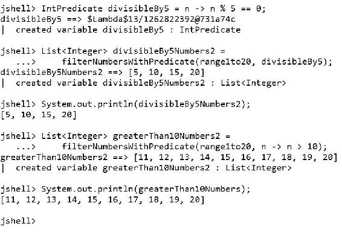
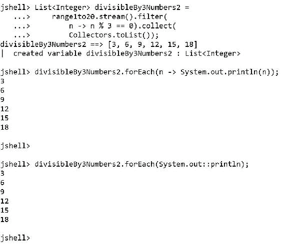

# 十二、面向对象、函数式编程和 Lambda 表达式

在本章中，我们将讨论函数式编程以及 Java9 如何实现许多函数式编程概念。我们将用许多例子来说明如何将函数式编程与面向对象编程相结合。我们将：

*   作为一等公民了解职能和方法
*   使用函数接口和 lambda 表达式
*   创建阵列筛选的功能版本
*   创建具有泛型和接口的数据存储库
*   具有复杂条件的筛选器集合
*   使用映射操作转换值
*   将映射操作与 reduce 相结合
*   使用 map 和 reduce 链接许多操作
*   与不同的收藏家合作

# 作为一等公民理解功能和方法

自从第一次发布以来，Java 一直是一种面向对象的编程语言。从 Java8 开始，Java 增加了对**函数式编程**范式的支持，并在 Java9 中继续这样做。函数式编程支持不可变的数据，因此，函数式编程避免状态更改。

### 注

用函数式编程风格编写的代码尽可能具有声明性，它关注于它做什么，而不是它必须如何做。

在大多数支持函数式编程范式的编程语言中，函数是一级公民，也就是说，我们可以将函数用作其他函数或方法的参数。Java8 引入了许多更改，以减少样板代码，使方法很容易成为 Java 中的一流公民，并使编写使用函数式编程方法的代码变得容易。我们可以通过一个简单的示例（例如筛选列表）轻松理解这个概念。但是，考虑到我们将以方法作为一级公民编写**命令式代码**，然后，我们将为该代码创建一个新版本，该版本使用 Java 9 中的完整函数方法，通过过滤操作。我们将创建这个示例的多个版本，因为它将允许我们理解函数式编程在 Java9 中是如何可能的。

首先，我们将编写一些代码，因为我们仍然不知道 Java9 中包含的将方法转换为一流公民的功能。然后，我们将在许多示例中使用这些特性。

以下几行声明了指定方法需求的`Testable`接口，该方法需求接收`int`类型的`number`参数并返回`boolean`结果。样本的代码文件包含在`java_9_oop_chapter_12_01`文件夹中的`example12_01.java`文件中。

```java
public interface Testable {
    boolean test(int number);
}
```

以下几行声明了实现先前声明的`Testable`接口的`TestDivisibleBy5`具体类。该类使用返回一个指示接收到的数字是否可被`5`整除的`boolean`值的代码实现`test`方法。如果数字与`5`之间的模、模或余数运算符（`%`的结果等于`0`，则表示该数字可被`5`整除。样本的代码文件包含在`example12_01.java`文件的`java_9_oop_chapter_12_01`文件夹中。

```java
public class TestDivisibleBy5 implements Testable {
    @Override
    public boolean test(int number) {
        return ((number % 5) == 0);
    }
}
```

下面的行声明了实现先前声明的`Testable`接口的`TestGreaterThan10`具体类。该类实现了`test`方法，其代码返回一个`boolean`值，指示接收到的数字是否大于`10`。样本的代码文件包含在`example12_01.java`文件的`java_9_oop_chapter_12_01`文件夹中。

```java
public class TestGreaterThan10 implements Testable {
    @Override
    public boolean test(int number) {
        return (number > 10);
    }
}
```

以下几行声明了在`numbers`参数中接收`List<Integer>`并在`tester`参数中接收`Testable`实例的`filterNumbersWithTestable`方法。该方法使用一个外部的`for`循环，即命令式代码为数字`List<Integer>`中的每个`Integer`元素调用`tester.test`方法。如果`test`方法返回`true`，则代码将`Integer`元素添加到`filteredNumbersList<Integer>`中，具体地说是一个`ArrayList<Integer>`。最后，该方法返回满足测试的所有`Integer`对象的`filteredNumbersList<Integer>`结果。样本的代码文件包含在`java_9_oop_chapter_12_01`文件夹中的`example12_01.java`文件中。

```java
public List<Integer> filterNumbersWithTestable(final List<Integer> numbers,
    Testable tester) {
    List<Integer> filteredNumbers = new ArrayList<>();
    for (Integer number : numbers) {
        if (tester.test(number)) {
            filteredNumbers.add(number);
        }
    }
    return filteredNumbers; 
}
```

`filterNumbersWithTestable`方法处理两个`List<Integer>`对象，即`Integer`对象中的两个`List`。我们谈论的是`Integer`而不是`int`原始类型。`Integer`是`int`原语类型的包装类。但是，我们在`Testable`接口中声明并在实现该接口的两个类中实现的`test`方法接收到一个`int`类型的参数，而不是`Integer`。

Java 自动将原语值转换为相应包装器类的对象。每当我们将一个对象作为参数传递给一个需要基元类型值的方法时，Java 编译器就会在一个称为**取消装箱**的操作中将该对象转换为相应的基元类型。在下一行中，Java 编译器将`Integer`对象转换或取消绑定为`int`类型的值。

```java
if (tester.test(number)) {
```

编译器将执行相当于以下行的代码，该行调用将`Integer`解绑到`int`的`intValue()`方法：

```java
if (tester.test(number.intValue())) {
```

我们不会编写一个`for`循环来填充`Integer`对象的`List`。相反，我们将使用专门用于`Stream<T>`的`IntStream`类来描述`int`原语流。这些类是在`java.util.stream`包中定义的，因此，我们必须添加`import`语句才能在 JShell 的代码中使用它。下一行调用以`1`和`20`为参数的`IntStream.rangeClosed`方法，生成一个`IntStream`，其中的`int`值从`1`到`20`（包括在内）。对`boxed`方法的链式调用将生成的`IntStream`转换为`Stream<Integer>`，即从原始`int`值装箱的`Integer`对象流。以`Collectors.toList()`为参数对`collect`方法的链式调用将`Integer`对象流收集到`List<Integer>`中，具体地说，收集到`ArrayList<Integer>`中。`Collectors`类也在`java.util.stream`包中定义。样本的代码文件包含在`java_9_oop_chapter_12_01`文件夹中的`example12_01.java`文件中。

```java
import java.util.stream.Collectors;
import java.util.stream.IntStream;

List<Integer> range1to20 = 
    IntStream.rangeClosed(1, 20).boxed().collect(Collectors.toList());
```

### 提示

装箱和取消装箱会增加开销，并会影响性能和内存。在某些情况下，我们可能需要重写代码，以避免在希望获得最佳性能时不必要的装箱和拆箱。

理解`collect`操作将开始处理管道以返回所需结果，即从中间流生成的列表，这一点非常重要。在调用`collect`方法之前，不会执行中间操作。下面的屏幕截图显示了在 JShell 中执行前几行的结果。我们可以看到，`range1to20`是一个`Integer`的列表，其中包含了装箱到`Integer`对象中的从 1 到 20（含）的数字。


下面的行创建了名为`testDivisibleBy5`的`TestDivisibleBy5`类的实例。然后，代码调用`filterNumbersWithTestable`方法，将`List<Integer> range1to20`作为`numbers`参数，将`TestDivisibleBy5`实例命名为`testDivisibleBy5`作为`tester`参数。代码运行后，`List<Integer> divisibleBy5Numbers`将具有以下值：`[5, 10, 15, 20]`。样本的代码文件包含在`java_9_oop_chapter_12_01`文件夹中的`example12_01.java`文件中。

```java
TestDivisibleBy5 testDivisibleBy5 = new TestDivisibleBy5();
List<Integer> divisibleBy5Numbers = 
filterNumbersWithTestable(range1to20, testDivisibleBy5);
System.out.println(divisibleBy5Numbers);
```

以下几行创建了名为`testGreaterThan10`的`TestGreaterThan10`类的实例。然后，代码以`range1to20`和`testGreaterThan10`作为参数调用`filterNumbersWithTestable`方法。代码运行后，`List<Integer> greaterThan10Numbers`将具有以下值：`[11, 12, 13, 14, 15, 16, 17, 18, 19, 20]`。样本的代码文件包含在`java_9_oop_chapter_12_01`文件夹中的`example12_01.java`文件中。

```java
TestGreaterThan10 testGreaterThan10 = new TestGreaterThan10();
List<Integer> greaterThan10Numbers = 
    filterNumbersWithTestable(range1to20, testGreaterThan10);
System.out.println(greaterThan10Numbers);
```

以下屏幕截图显示了在 JShell 中执行前几行的结果：


# 使用功能接口和 lambda 表达式

我们必须声明一个接口和两个类，使一个方法能够接收`Testable`实例并执行每个类实现的`test`方法。幸运的是，Java 8 引入了**功能接口**，Java 9 使我们可以方便地在代码需要功能接口时提供兼容的**lambda 表达式**。简而言之，我们可以编写更少的代码来实现相同的目标。

### 注

功能接口是满足以下条件的接口：它具有单个抽象方法或单个方法需求。我们可以使用 lambda 表达式、方法引用或构造函数引用创建函数接口的实例。我们将使用不同的示例来理解 lambda 表达式、方法引用和构造函数引用，我们将看到它们的实际应用。

`IntPredicate`函数接口表示一个函数，该函数有一个`int`类型的参数，返回一个`boolean`结果。布尔值函数称为谓词。这个功能接口是在`java.util.function`中定义的，因此我们在使用它之前必须包含`import`语句。

以下几行声明了在`numbers`参数中接收`List<Integer>`和在`predicate`参数中接收`IntPredicate`实例的`filterNumbersWithPredicate`方法。此方法的代码与为`filterNumbersWithTestable`方法声明的代码相同，唯一的区别是，新方法接收的不是名为`tester`的`Testable`类型的参数，而是名为`predicate`的`IntPredicate`类型的参数。代码还使用从列表中检索到的每个数字作为参数来调用`test`方法进行计算。`IntPredicate`函数接口定义了一个名为`test`的抽象方法，该方法接收`int`并返回`boolean`结果。样本的代码文件包含在`java_9_oop_chapter_12_01`文件夹中的`example12_02.java`文件中。

```java
import java.util.function.IntPredicate;

public List<Integer> filterNumbersWithPredicate(final List<Integer> numbers,
    IntPredicate predicate) {
    List<Integer> filteredNumbers = new ArrayList<>();
    for (Integer number : numbers) {
        if (predicate.test(number)) {
            filteredNumbers.add(number);
        }
    }
    return filteredNumbers; 
}
```

下一行声明了一个名为`divisibleBy5`且类型为`IntPredicate`的变量，并为其分配了一个 lambda 表达式。具体来说，代码分配一个 lambda 表达式，该表达式接收名为`n`的`int`参数，并返回一个`boolean`值，该值指示`n`和`5`之间的模、模或余数运算符（`%`是否等于`0`。样本的代码文件包含在`example12_02.java`文件的`java_9_oop_chapter_12_01`文件夹中。

```java
IntPredicate divisibleBy5 = n -> n % 5 == 0;
```

lambda 表达式由以下三个组成部分组成：

*   `n`：参数列表。在这种情况下，只有一个参数，因此，我们不需要将参数列表括在括号内。如果我们有多个参数，有必要将列表括在括号内。我们不必为参数指定类型。
*   `->`：箭头标记。
*   `n % 5 == 0`：身体。在本例中，主体是单个表达式，因此不需要将其括在大括号中（`{}`。另外，不需要在表达式前面写`return`语句，因为它是一个表达式。

前面的代码相当于下面的代码。上一行代码是最短版本，下一行代码是最长版本：

```java
IntPredicate divisibleBy5 = (n) ->{ return n % 5 == 0 };
```

假设使用前面代码的两个版本中的任何一个，我们正在执行以下任务：

1.  创建一个实现`IntPredicate`接口的匿名类。
2.  在匿名类中声明一个测试方法，该方法接收一个`int`参数并返回一个`boolean`，其主体在箭头标记（`->`之后指定。
3.  创建此匿名类的实例。

当需要`IntPredicate`时，只要我们输入 lambda 表达式，所有这些事情都会在引擎盖下发生。当我们将 lambda 表达式用于其他函数接口时，会发生类似的事情，不同之处在于方法名称、参数和方法的返回类型可能不同。

### 注

Java 编译器从函数接口推断参数的类型和返回类型。事情仍然是强类型的，如果我们在类型上出错，编译器将生成相应的错误，代码将无法编译。

以下几行调用`filterNumbersWithPredicate`方法，其中`List<Integer> range1to20`作为`numbers`参数，`IntPredicate`实例名为`divisibleBy5`作为`predicate`参数。代码运行后，`List<Integer> divisibleBy5Numbers2`将具有以下值：`[5, 10, 15, 20]`。样本的代码文件包含在`example12_02.java`文件的`java_9_oop_chapter_12_01`文件夹中。

```java
List<Integer> divisibleBy5Numbers2 = 
    filterNumbersWithPredicate(range1to20, divisibleBy5);
System.out.println(divisibleBy5Numbers2);
```

以下几行调用`filterNumbersWithPredicate`方法，其中`List<Integer> range1to20`作为`numbers`参数，lambda 表达式作为`predicate`参数。lambda 表达式接收名为`n`的`int`参数，并返回一个`boolean`值，指示`n`是否大于`10`。代码运行后，`List<Integer> greaterThan10Numbers2`将具有以下值：`[11, 12, 13, 14, 15, 16, 17, 18, 19, 20]`。样本的代码文件包含在`java_9_oop_chapter_12_01`文件夹中的`example12_02.java`文件中。

```java
List<Integer> greaterThan10Numbers2 = 
    filterNumbersWithPredicate(range1to20, n -> n > 10);
System.out.println(greaterThan10Numbers2);
```

下面的屏幕截图显示了在 JShell 中执行前几行的结果。



`Function<T, R>`功能接口表示一个函数，其中`T`是该函数输入的类型，`R`是该函数结果的类型。我们不能为`T`指定一个灵长类类型，例如`int`，因为它不是一个类，但我们可以使用装箱类型，即`Integer`。我们不能将`boolean`用于`R`，但我们可以使用盒式，即`Boolean`。如果我们想要一个与`IntPredicate`函数接口类似的行为，我们可以使用`Function<Integer, Boolean>`，也就是说，一个函数具有一个返回`Boolean`结果的`Integer`类型的参数。这个功能接口是在`java.util.function`中定义的，因此在使用它之前必须包含`import`语句。

以下几行声明了在`numbers`参数中接收`List<Integer>`并在`predicate`参数中接收`Function<Integer, Boolean>`实例的`filterNumbersWithFunction`方法。此方法的代码与为`filterNumbersWithCondition`方法声明的代码相同，区别在于新方法接收的不是名为`predicate`的`IntPredicate`类型的参数，而是名为`function`的`Function<Integer, Boolean>`类型的参数。代码使用从列表中检索到的每个数字作为参数来调用`apply`方法，而不是调用`test`方法。

`Function<T, R>`功能接口定义了一个名为 apply 的抽象方法，该方法接收`T`并返回`R`类型的结果。在这种情况下，apply 方法接收到一个`Integer`并返回一个`Boolean`，Java 编译器将自动取消绑定到`boolean`。样本的代码文件包含在`example12_03.java`文件的`java_9_oop_chapter_12_01`文件夹中。

```java
import java.util.function.Function;

public List<Integer> filterNumbersWithFunction(final List<Integer> numbers,
 Function<Integer, Boolean> function) {
    List<Integer> filteredNumbers = new ArrayList<>();
    for (Integer number : numbers) {
 if (function.apply(number)) {
            filteredNumbers.add(number);
        }
    }
    return filteredNumbers; 
}
```

以下几行调用`filterNumbersWithFunction`方法，其中`List<Integer> range1to20`作为`numbers`参数，一个 lambda 表达式作为`function`参数。lambda 表达式接收名为`n`的`Integer`参数，并返回一个`Boolean`值，该值指示`n`和`3`之间的模、模或余数运算符（`%`是否等于`0`。Java 自动将表达式生成的`boolean`值装箱到`Boolean`对象中。代码运行后，`List<Integer> divisibleBy3Numbers`将具有以下值：`[3, 6, 9, 12, 15, 18]`。样本的代码文件包含在`java_9_oop_chapter_12_01`文件夹中的`example12_03.java`文件中。

```java
List<Integer> divisibleBy3Numbers = 
    filterNumbersWithFunction(range1to20, n -> n % 3 == 0);
```

Java 将运行相当于以下代码行的代码。`intValue()`函数返回`n`中接收到的`Integer`实例的`int`值，lambda 表达式返回新`Boolean`实例中表达式求值生成的`boolean`值。但是，请记住，装箱和拆箱是在发动机罩下进行的。

```java
List<Integer> divisibleBy3Numbers = 
    filterNumbersWithFunction(range1to20, n -> new Boolean(n.intValue() % 3 == 0));
```

`java.util.function`中定义了 40 多个功能接口。我们刚刚处理了其中两个，它们能够处理相同的 lambda 表达式。我们可以用一整本书来详细分析所有的功能接口。我们将继续关注面向对象与函数式编程的混合。但是，在声明定制接口之前，必须检查`java.util.function`中定义的所有功能接口，这一点非常重要。

# 创建阵列过滤的功能版本

前面的代码声明了`filterNumbersWithFunction`方法代表了带有外部`for`循环的数组过滤的强制版本。我们可以使用`Stream<T>`对象可用的`filter`方法，在本例中是`Stream<Integer>`对象，并通过函数方法实现相同的目标。

接下来的几行使用函数方法生成一个`List<Integer>`，其中的数字包含在可被`3`整除的`List<Integer> range1to20`中。样本的代码文件包含在`example12_04.java`文件的`java_9_oop_chapter_12_01`文件夹中。

```java
List<Integer> divisibleBy3Numbers2 = range1to20.stream().filter(n -> n % 3 == 0).collect(Collectors.toList());
```

如果我们希望前面的代码在 JShell 中运行，那么我们必须在一行中输入所有代码，这对于 Java 编译器成功编译代码是不必要的。这是 JShell、streams 和 lambda 表达式的一个特定问题。这使得代码有点难以理解。因此，接下来的几行将显示另一个版本的代码，它使用多行代码，不会在 JShell 中工作，但会使代码更容易理解。请注意，在下面的示例中，您必须在一行中输入代码。代码文件使用单行。样本的代码文件包含在`example12_04.java`文件的`java_9_oop_chapter_12_01`文件夹中。

```java
range1to20.stream()
.filter(n -> n % 3 == 0)
.collect(Collectors.toList());
```

### 提示

`stream`方法从`List<Integer>`生成`Stream<Integer>`。**流**是特定类型元素的序列，允许我们通过顺序或并行执行来执行计算或聚合操作。事实上，我们可以链接许多流操作并组成一个流管道。这些计算有一个延迟执行，也就是说，直到有一个终端操作，比如请求将最终数据收集到特定类型的`List`中，它们才会被计算。

`filter`方法接收`Predicate<Integer>`作为参数，我们将其应用于`Stream<Integer>`。`filter`方法返回与指定谓词匹配的输入流元素流。该方法返回一个流，其中包含`Predicate<Integer>`计算结果为`true`的所有元素。我们将前面解释的 lambda 表达式作为`filter`方法的参数传递。

`collect`方法接收`filter`方法返回的`Stream<Integer>`。我们将`Collectors.toList()`作为参数传递给`collect`方法，对`Stream<Integer>`的元素执行可变约简操作，并生成一个`List<Integer>`，即可变结果容器。代码运行后，`List<Integer> divisibleBy3Numbers2`将具有以下值：`[3, 6, 9, 12, 15, 18]`。

现在，我们希望采用函数方法打印生成的`List<Integer>`中的每个数字。`List<T>`实现`Iterable<T>`接口，该接口允许我们调用`forEach`方法来执行指定为`Iterable`中每个元素的参数的操作，直到所有元素都已处理完毕或该操作引发异常为止。`forEach`方法的动作参数必须是`Consumer<T>`，因此，在我们的例子中，它必须是`Consumer<Integer>`，因为我们将为结果`List<Integer>`调用`forEach`方法。

`Consumer<T>`是一个函数接口，表示访问`T`类型的单个输入参数且不返回结果（`void`的操作。`Consumer<T>`函数接口定义了一个名为`accept`的抽象方法，该方法接收类型为`T`的参数，但不返回任何结果。以下几行将 lambda 表达式作为参数传递给`forEach`方法。lambda 表达式生成一个`Consumer<Integer>`，打印`n`中接收到的数字。样本的代码文件包含在`example12_04.java`文件的`java_9_oop_chapter_12_01`文件夹中。

```java
divisibleBy3Numbers2.forEach(n -> System.out.println(n));
```

作为前一行的结果，我们将在 JShell 中看到以下数字：

```java
3
6
9
12
15
18

```

生成`Consumer<Integer>`的 lambda 表达式以`Integer`作为参数调用`System.out.println`方法。我们可以使用方法引用而不是 lambda 表达式来调用现有方法。在这种情况下，我们可以用`System.out::println`替换前面显示的 lambda 表达式，即调用`System.out`的`println`方法的方法引用。每当我们使用方法引用时，Java 运行时都会推断方法类型参数；在这种情况下，方法类型参数是一个`Integer`。样本的代码文件包含在`java_9_oop_chapter_12_01`文件夹中的`example12_04.java`文件中。

```java
divisibleBy3Numbers2.forEach(System.out::println);
```

该代码将产生与前面使用 lambda 表达式调用`forEach`相同的结果。以下屏幕截图显示了在 JShell 中执行前几行的结果：



我们可以捕获 lambda 表达式中未定义的变量。当 lambda 从外部世界捕获变量时，我们也可以称之为闭包。例如，以下几行声明一个名为`byNumber`的`int`变量，并将`4`赋值给该变量。然后，接下来的几行使用 stream、filter 和 collect 组合的新版本生成一个数字可被`byNumber`变量中指定的数字整除的`List<Integer>`。lambda 表达式包括`byNumber`，Java 从外部世界捕获该变量。样本的代码文件包含在`example12_04.java`文件的`java_9_oop_chapter_12_01`文件夹中。

```java
int byNumber = 4;
List<Integer> divisibleBy4Numbers =
    range1to20.stream().filter(
        n -> n % byNumber == 0).collect(
        Collectors.toList());
divisibleBy4Numbers.forEach(System.out::println);
```

作为前一行的结果，我们将在 JShell 中看到以下数字：

```java
4
8
12
16
20

```

如果我们使用与函数接口不匹配的 lambda 表达式，代码将无法编译，Java 编译器将生成相应的错误。对于示例，下一行尝试将返回`int`而不是`Boolean`或`boolean`的 lambda 表达式赋给`IntPredicate`变量。样本的代码文件包含在`java_9_oop_chapter_12_01`文件夹中的`example12_05.java`文件中。

```java
// The following code will generate an error
IntPredicate errorPredicate = n -> 8;
```

JShell 将显示以下错误，提示我们`int`无法转换为`boolean`：

```java
|  Error:
|  incompatible types: bad return type in lambda expression
|      int cannot be converted to boolean
|  IntPredicate errorPredicate = n -> 8;
|                                     ^

```

# 创建具有泛型和接口的数据存储库

现在我们想创建一个为我们提供实体的存储库，以便我们可以应用 Java 9 中包含的功能编程特性来从这些实体中检索和处理数据。首先，我们将创建一个`Identifiable`接口，定义可识别实体的需求。我们希望实现该接口的任何类都能提供一个`getId`方法，该方法返回一个`int`，其中包含实体的唯一标识符的值。样本的代码文件包含在`example12_06.java`文件的`java_9_oop_chapter_12_01`文件夹中。

```java
public interface Identifiable {
    int getId();
}
```

接下来的几行创建一个泛型接口，该接口指定`E`必须在泛型类型约束中实现最近创建的泛型接口。该类声明了一个返回`List<E>`的`getAll`方法。实现接口的每个类都必须为此方法提供自己的实现。样本的代码文件包含在`example12_06.java`文件的`java_9_oop_chapter_12_01`文件夹中。

```java
public interface Repository<E extends Identifiable> {
    List<E> getAll();
}
```

接下来的几行创建`Entity`抽象类，它是所有实体的基类。类实现了`Identifiable`接口，定义了`int`类型的不可变`id`保护字段。构造函数接收`id`不可变字段的所需值，并用接收到的值初始化字段。抽象类实现了返回`id`不可变字段值的`getId`方法。样本的代码文件包含在`java_9_oop_chapter_12_01`文件夹中的`example12_06.java`文件中。

```java
public abstract class Entity implements Identifiable {
    protected final int id;

    public Entity(int id) {
        this.id = id;
    }

    @Override
    public final int getId() {
        return id;
    }
}
```

接下来的几行创建了`MobileGame`类，特别是先前创建的`Entity`抽象类的子类。样本的代码文件包含在`example12_06.java`文件的`java_9_oop_chapter_12_01`文件夹中。

```java
public class MobileGame extends Entity {
    protected final String separator = "; ";
    public final String name;
    public int highestScore;
    public int lowestScore;
    public int playersCount;

    public MobileGame(int id, 
        String name, 
        int highestScore, 
        int lowestScore, 
        int playersCount) {
        super(id);
        this.name = name;
        this.highestScore = highestScore;
        this.lowestScore = lowestScore;
        this.playersCount = playersCount;
    }

    @Override
    public String toString() {
        StringBuilder sb = new StringBuilder();
        sb.append("Id: ");
        sb.append(getId());
        sb.append(separator);
        sb.append("Name: ");
        sb.append(name);
        sb.append(separator);
        sb.append("Highest score: ");
        sb.append(highestScore);
        sb.append(separator);
        sb.append("Lowest score: ");
        sb.append(lowestScore);
        sb.append(separator);
        sb.append("Players count: ");
        sb.append(playersCount);

        return sb.toString();
    }
}
```

类声明了许多公共字段，这些字段的值由构造函数初始化：`name`、`highestScore`、`lowestScore`和`playersCount`。该字段是不可变的，但其他三个字段是可变的。我们不使用 getter 或 setter 来简化事情。但是，必须考虑到，一些允许我们使用实体的框架要求我们在字段不是只读的情况下对所有字段使用 getter 和 setter。

此外，该类重写从`java.lang.Object`类继承的`toString`方法，该方法必须为实体返回`String`表示。此方法中声明的代码使用`java.lang.StringBuilder`类（`sb`类）的实例高效地追加多个字符串，最后返回调用`sb.toString`方法返回生成的`String`的结果。此方法使用受保护的分隔符不可变字符串，该字符串确定我们在字段之间使用的分隔符。每当我们以`MobileGame`的实例作为参数调用`System.out.println`时，`println`方法将调用重写的`toString`方法来打印该实例的`String`表示。

### 提示

我们也可以使用`String`串联（`+`或`String.format`来编写`toString`方法的代码，因为我们将只处理`MobileGame`类的 15 个实例。然而，每当我们需要连接多个字符串以产生结果时，使用`StringBuilder`是一种很好的实践，我们希望确保在执行代码时具有最佳性能。在我们的简单示例中，任何实现都不会有任何性能问题。

以下几行创建了实现`Repository<MobileGame>`接口的`MemoryMobileGameRepository`具体类。请注意，我们没有说`Repository<E>`，而是表示`Repository<MobileGame>`，因为我们已经知道我们将在类中实现的`E`类型参数的值。我们不是在创造一个`MemoryMobileGameRepository<E extends Identifiable>`。相反，我们正在创建一个非泛型的具体类，该类实现一个泛型接口，并将参数类型`E`的值设置为`MobileGame`。样本的代码文件包含在`example12_06.java`文件的`java_9_oop_chapter_12_01`文件夹中。

```java
import java.util.stream.Collectors;

public class MemoryMobileGameRepository implements Repository<MobileGame> {
    @Override
    public List<MobileGame> getAll() {
        List<MobileGame> mobileGames = new ArrayList<>();
        mobileGames.add(
            new MobileGame(1, "Uncharted 4000", 5000, 10, 3800));
        mobileGames.add(
            new MobileGame(2, "Supergirl 2017", 8500, 5, 75000));
        mobileGames.add(
            new MobileGame(3, "Super Luigi Run", 32000, 300, 90000));
        mobileGames.add(
            new MobileGame(4, "Mario vs Kong III", 152000, 1500, 750000));
        mobileGames.add(
            new MobileGame(5, "Minecraft Reloaded", 6708960, 8000, 3500000));
        mobileGames.add(
            new MobileGame(6, "Pikachu vs Beedrill: The revenge", 780000, 400, 1000000));
        mobileGames.add(
            new MobileGame(7, "Jerry vs Tom vs Spike", 78000, 670, 20000));
        mobileGames.add(
            new MobileGame(8, "NBA 2017", 1500607, 20, 7000005));
        mobileGames.add(
            new MobileGame(9, "NFL 2017", 3205978, 0, 4600700));
        mobileGames.add(
            new MobileGame(10, "Nascar Remix", 785000, 0, 2600000));
        mobileGames.add(
            new MobileGame(11, "Little BIG Universe", 95000, 3, 546000));
        mobileGames.add(
            new MobileGame(12, "Plants vs Zombies Garden Warfare 3", 879059, 0, 789000));
        mobileGames.add(
            new MobileGame(13, "Final Fantasy XVII", 852325, 0, 375029));
        mobileGames.add(
            new MobileGame(14, "Watch Dogs 3", 27000, 2, 78004));
        mobileGames.add(
            new MobileGame(15, "Remember Me", 672345, 5, 252003));

        return mobileGames;
    }
}
```

类实现`Repository<E>`接口所需的`getAll`方法。在这种情况下，该方法返回`MobileGame`（`List<MobileGame>`的`List`，具体地说是一个`ArrayList<MobileGame>`。该方法创建 15 个`MobileGame`实例，并将它们附加到该方法返回的`MobileGame`的`ArrayList`中。

以下几行创建`MemoryMobileGameRepository`类的实例，并为`getAll`方法返回的`List<MobileGame>`调用`forEach`方法。`forEach`方法调用列表中每个元素的主体，就像在`for`循环中一样。指定为`forEach`方法参数的闭包调用`System.out.println`方法，并将`MobileGame`实例作为参数。这样，Java 使用`MobileGame`类中重写的`toString`方法为每个`MobileGame`实例生成`String`表示。样本的代码文件包含在`java_9_oop_chapter_12_01`文件夹中的`example12_06.java`文件中。

```java
MemoryMobileGameRepository repository = new MemoryMobileGameRepository()
repository.getAll().forEach(mobileGame -> System.out.println(mobileGame));
```

以下几行显示了执行上一个代码后生成的输出，该代码为每个`MobileGame`实例打印`toString()`方法返回的`String`：

```java
Id: 1; Name: Uncharted 4000; Highest score: 5000; Lowest score: 10; Players count: 3800
Id: 2; Name: Supergirl 2017; Highest score: 8500; Lowest score: 5; Players count: 75000
Id: 3; Name: Super Luigi Run; Highest score: 32000; Lowest score: 300; Players count: 90000
Id: 4; Name: Mario vs Kong III; Highest score: 152000; Lowest score: 1500; Players count: 750000
Id: 5; Name: Minecraft Reloaded; Highest score: 6708960; Lowest score: 8000; Players count: 3500000
Id: 6; Name: Pikachu vs Beedrill: The revenge; Highest score: 780000; Lowest score: 400; Players count: 1000000
Id: 7; Name: Jerry vs Tom vs Spike; Highest score: 78000; Lowest score: 670; Players count: 20000
Id: 8; Name: NBA 2017; Highest score: 1500607; Lowest score: 20; Players count: 7000005
Id: 9; Name: NFL 2017; Highest score: 3205978; Lowest score: 0; Players count: 4600700
Id: 10; Name: Nascar Remix; Highest score: 785000; Lowest score: 0; Players count: 2600000
Id: 11; Name: Little BIG Universe; Highest score: 95000; Lowest score: 3; Players count: 546000
Id: 12; Name: Plants vs Zombies Garden Warfare 3; Highest score: 879059; Lowest score: 0; Players count: 789000
Id: 13; Name: Final Fantasy XVII; Highest score: 852325; Lowest score: 0; Players count: 375029
Id: 14; Name: Watch Dogs 3; Highest score: 27000; Lowest score: 2; Players count: 78004
Id: 15; Name: Remember Me; Highest score: 672345; Lowest score: 5; Players count: 252003

```

下一行产生相同的结果。在这种情况下，代码使用先前学习的引用方法调用`System.out.println`方法，将`getAll`方法返回的`List<MobileGame>`中的每个`MobileGame`实例作为参数。请注意，该行比上一个代码段的最后一行短，并且该代码生成相同的结果。样本的代码文件包含在`java_9_oop_chapter_12_01`文件夹中的`example12_06.java`文件中。

```java
repository.getAll().forEach(System.out::println);
```

# 过滤条件复杂的集合

我们可以使用新的存储库限制从复杂数据中检索的结果。我们可以将对`getAll`方法的调用与 stream、filter 和 collect 结合起来，生成`Stream<MobileGame>`，应用带有 lambda 表达式的过滤器作为参数，调用带有`Collectors.toList()`参数的`collect`方法，从过滤后的`Stream<MobileGame>`生成过滤后的`List<MobileGame>`。`filter`方法接收`Predicate<MobileGame>`作为参数，我们使用 lambda 表达式生成该参数，并将过滤器应用于`Stream<MobileGame>`。`filter`方法返回与指定谓词匹配的输入流元素流。该方法返回一个流，其中包含`Predicate<MobileGame>`计算结果为`true`的所有元素。

### 注

接下来的几行显示了使用多行代码的代码段，这些代码段在 JShell 中不起作用，但会使代码更易于阅读和理解。如果我们想让代码在 JShell 中运行，我们必须在一行中输入所有代码，这对于 Java 编译器成功编译代码是不必要的。这是 JShell、streams 和 lambda 表达式的一个特定问题。代码文件使用单行代码与 JShell 兼容。

以下几行声明了`MemoryMobileGameRepository`类的新`getWithLowestScoreGreaterThan`方法。请注意，为了避免重复，我们没有包含新类的所有代码。样本的代码文件包含在`example12_07.java`文件的`java_9_oop_chapter_12_01`文件夹中。

```java
public List<MobileGame> getWithLowestScoreGreaterThan(int minimumLowestScore) {
    return getAll().stream()
        .filter(game -> game.lowestScore > minimumLowestScore)
        .collect(Collectors.toList());
}
```

以下几行使用名为`repository`的`MemoryMobileGameRepository`实例调用前面添加的方法，然后链调用`forEach`打印`lowestScore`值大于`1000`的所有游戏：

```java
MemoryMobileGameRepository repository = new MemoryMobileGameRepository()
repository.getWithLowestScoreGreaterThan(1000).forEach(System.out::println);
```

以下几行显示执行上一个代码后生成的输出：

```java
Id: 4; Name: Mario vs Kong III; Highest score: 152000; Lowest score: 1500; Players count: 750000
Id: 5; Name: Minecraft Reloaded; Highest score: 6708960; Lowest score: 8000; Players count: 3500000

```

下一个代码显示了名为`getWithLowestScoreGreaterThanV2`的`getWithLowestScoreGreaterThan`方法的另一个版本，它是等效的，并产生相同的结果。在本例中，生成`Predicate<MobileGame>`的 lambda 表达式使用括号并指定游戏参数的类型。如前一段代码所示，不需要这样做。但是，我们可以找到像下面几行那样编写的代码，因此，了解这种语法也可以正常工作是很重要的。样本的代码文件包含在`example12_07.java`文件的`java_9_oop_chapter_12_01`文件夹中。

```java
public List<MobileGame> getWithLowestScoreGreaterThanV2(int minimumLowestScore) {
return getAll().stream()
 .filter((MobileGame game) -> game.lowestScore > minimumLowestScore) 
    .collect(Collectors.toList());
}
```

以下几行声明了`MemoryMobileGameRepository`类的新`getStartingWith`方法。作为参数传递给`filter`方法的 lambda 表达式返回调用`startsWith`方法获取游戏名称的结果，前缀作为参数接收。在本例中，lambda 表达式是捕获`prefix`参数并在 lambda 表达式体中使用它的闭包。样本的代码文件包含在`example12_08.java`文件的`java_9_oop_chapter_12_01`文件夹中。

```java
public List<MobileGame> getStartingWith(String prefix) {
    return getAll().stream()
        .filter(game -> game.name.startsWith(prefix))
        .collect(Collectors.toList());
}
```

下面几行使用名为`repository`的`MemoryMobileGameRepository`实例调用前面添加的方法，然后链接调用`forEach`打印所有名称以`"Su"`开头的游戏。

```java
MemoryMobileGameRepository repository = new MemoryMobileGameRepository()
repository.getStartingWith("Su").forEach(System.out::println);
```

以下几行显示执行上一个代码后生成的输出：

```java
Id: 2; Name: Supergirl 2017; Highest score: 8500; Lowest score: 5; Players count: 75000
Id: 3; Name: Super Luigi Run; Highest score: 32000; Lowest score: 300; Players count: 90000

```

以下几行声明了`MemoryMobileGameRepository`类的新`getByPlayersCountAndHighestScore`方法。方法返回一个`Optional<MobileGame>`，即容器对象可能包含`MobileGame`实例，也可能是空的。如果有值，`isPresent`方法将返回`true`，我们可以通过调用`get`方法来检索`MobileGame`实例。在本例中，代码调用链接到`filter`方法调用的`findFirst`方法。`findFirst`方法返回一个`Optional<T>`，在这种情况下，返回一个`Optional<MobileGame>`，其中包含`filter`方法生成的`Stream<MobileGame>`中的第一个元素。请注意，我们在任何时候都不会对结果进行排序。样本的代码文件包含在`java_9_oop_chapter_12_01`文件夹中的`example12_09.java`文件中。

```java
public Optional<MobileGame> getByPlayersCountAndHighestScore(
    int playersCount, 
    int highestScore) {
    return getAll().stream()
        .filter(game -> (game.playersCount == playersCount) && (game.highestScore == highestScore))
        .findFirst();
}
```

下面几行使用名为`repository`的`MemoryMobileGameRepository`实例来调用前面添加的方法。每次调用`getByPlayersCountAndHighestScore`方法后，代码都会调用`isPresent`方法，以确定`Optional<MobileGame>`是否有实例。如果该方法返回`true`，则代码调用`get`方法从`Optional<MobileGame>`中检索`MobileGame`实例。样本的代码文件包含在`example12_09.java`文件的`java_9_oop_chapter_12_01`文件夹中。

```java
MemoryMobileGameRepository repository = new MemoryMobileGameRepository()
Optional<MobileGame> optionalMobileGame1 = 
    repository.getByPlayersCountAndHighestScore(750000, 152000);
if (optionalMobileGame1.isPresent()) {
    MobileGame mobileGame1 = optionalMobileGame1.get();
    System.out.println(mobileGame1);
} else {
    System.out.println("No mobile game matches the specified criteria.");
}
Optional<MobileGame> optionalMobileGame2 = 
    repository.getByPlayersCountAndHighestScore(670000, 829340);
if (optionalMobileGame2.isPresent()) {
    MobileGame mobileGame2 = optionalMobileGame2.get();
    System.out.println(mobileGame2);
} else {
    System.out.println("No mobile game matches the specified criteria.");
}
```

以下几行显示了使用前面的代码生成的输出。在第一次通话中，有一款手机游戏符合搜索条件。在第二次调用中，没有与搜索条件匹配的`MobileGame`实例：

```java
Id: 4; Name: Mario vs Kong III; Highest score: 152000; Lowest score: 1500; Players count: 750000
No mobile game matches the specified criteria.

```

以下屏幕截图显示了在 JShell 中执行前几行的结果：


# 使用映射操作转换值

以下几行为我们之前编码的`MemoryMobileGameRepository`类声明了一个新的`getGameNamesTransformedToUpperCase`方法。新方法执行最简单的映射操作之一。对`map`方法的调用将`Stream<MobileGame>`转换为`Stream<String>`，作为参数传递给`map`方法的 lambda 表达式生成`Function<MobileGame, String>`，即接收`MobileGame`参数并返回`String`。对`collect`方法的调用根据`map`方法返回的`Stream<String>`生成`List<String>`。

样本的代码文件包含在`example12_10.java`文件的`java_9_oop_chapter_12_01`文件夹中。

```java
public List<String> getGameNamesTransformedToUpperCase() {
    return getAll().stream()
        .map(game -> game.name.toUpperCase())
        .collect(Collectors.toList());
}
```

`getGameNamesTransformedToUpperCase`方法返回一个`List<String>`。`map`方法将`Stream<MobileGame>`中的每个`MobileGame`实例转换为`String`，并将`name`字段转换为大写。这样，`map`方法将`Stream<MobileGame>`转换为`List<String>`。

以下几行使用名为`repository`的`MemoryMobileGameRepository`实例调用之前添加的方法，并生成一个转换为大写字符串的游戏名称列表。样本的代码文件包含在`example12_10.java`文件的`java_9_oop_chapter_12_01`文件夹中。

```java
MemoryMobileGameRepository repository = new MemoryMobileGameRepository()
repository.getGameNamesTransformedToUpperCase().forEach(System.out::println);
```

以下几行显示执行上一个代码后生成的输出：

```java
UNCHARTED 4000
SUPERGIRL 2017
SUPER LUIGI RUN
MARIO VS KONG III
MINECRAFT RELOADED
PIKACHU VS BEEDRILL: THE REVENGE
JERRY VS TOM VS SPIKE
NBA 2017
NFL 2017
NASCAR REMIX
LITTLE BIG UNIVERSE
PLANTS VS ZOMBIES GARDEN WARFARE 3
FINAL FANTASY XVII
WATCH DOGS 3
REMEMBER ME

```

下面的代码使用两个构造函数创建一个新的`NamesForMobileGame`类。样本的代码文件包含在`java_9_oop_chapter_12_01`文件夹中的`example12_11.java`文件中。

```java
public class NamesForMobileGame {
    public final String upperCaseName;
    public final String lowerCaseName;

    public NamesForMobileGame(String name) {
        this.upperCaseName = name.toUpperCase();
        this.lowerCaseName = name.toLowerCase();
    }

    public NamesForMobileGame(MobileGame game) {
        this(game.name);
    }
}
```

`NamesForMobileGame`类声明了`String`类型的两个不可变字段：`upperCaseName`和`lowerCaseName`。其中一个构造函数收到一个`nameString`并将其转换为大写保存在`upperCaseName`字段中，将其转换为小写保存在`lowerCaseName`字段中。另一个构造函数接收到一个`MobileGame`实例，并调用前面解释的构造函数，将接收到的`MobileGame`实例的`name`字段作为参数。

下面的代码向`MemoryMobileGameRepository`类添加了一个新的`getNamesForMobileGames`方法。新方法执行映射操作。对`map`方法的调用将`Stream<MobileGame>`转换为`Stream<NamesForMobileGame>`。作为参数传递给`map`方法的 lambda 表达式生成一个`Function<MobileGame, NamesForMobileGame>`，也就是说，它接收一个`MobileGame`参数，并通过调用接收一个`name`作为参数的构造函数返回一个`NamesForMobileGame`实例。对`collect`方法的调用根据`map`方法返回的`Stream<NamesForMobileGame>`生成`List<NamesForMobileGame>`。样本的代码文件包含在`java_9_oop_chapter_12_01`文件夹中的`example12_11.java`文件中。

```java
public List<NamesForMobileGame> getNamesForMobileGames() {
    return getAll().stream()
        .map(game -> new NamesForMobileGame(game.name))
        .collect(Collectors.toList());
}
```

下面几行使用名为`repository`的`MemoryMobileGameRepository`实例来调用前面添加的方法。lambda 表达式作为参数传递给`forEach`方法，它声明了一个用大括号括起来的体，因为它需要很多行。这个主体使用`java.lang.StringBuilder`类（`sb`类）的一个实例来附加许多带有大写名称、分隔符和小写名称的字符串。样本的代码文件包含在`example12_11.java`文件的`java_9_oop_chapter_12_01`文件夹中。

```java
MemoryMobileGameRepository repository = new MemoryMobileGameRepository()
repository.getNamesForMobileGames().forEach(names -> {
    StringBuilder sb = new StringBuilder();
    sb.append(names.upperCaseName);
    sb.append(" - ");
    sb.append(names.lowerCaseName);
    System.out.println(sb.toString());
});
```

以下几行显示执行上一个代码后生成的输出：

```java
UNCHARTED 4000 - uncharted 4000
SUPERGIRL 2017 - supergirl 2017
SUPER LUIGI RUN - super luigi run
MARIO VS KONG III - mario vs kong iii
MINECRAFT RELOADED - minecraft reloaded
PIKACHU VS BEEDRILL: THE REVENGE - pikachu vs beedrill: the revenge
JERRY VS TOM VS SPIKE - jerry vs tom vs spike
NBA 2017 - nba 2017
NFL 2017 - nfl 2017
NASCAR REMIX - nascar remix
LITTLE BIG UNIVERSE - little big universe
PLANTS VS ZOMBIES GARDEN WARFARE 3 - plants vs zombies garden warfare 3
FINAL FANTASY XVII - final fantasy xvii
WATCH DOGS 3 - watch dogs 3
REMEMBER ME - remember me

```

下一个代码显示了名为`getNamesForMobileGamesV2`的`getNamesForMobileGames`方法的另一个版本，它是等效的，并产生相同的结果。在本例中，我们用构造函数引用方法`NamesForMobileGame::new`替换了生成`Function<MobileGame, NamesForMobileGame>`的 lambda 表达式。构造函数引用方法使用类名后跟`::new`进行指定，并将使用接收`MobileGame`实例作为参数的构造函数创建`NamesForMobileGame`的新实例。样本的代码文件包含在`java_9_oop_chapter_12_01`文件夹中的`example12_12.java`文件中。

```java
public List<NamesForMobileGame> getNamesForMobileGamesV2() {
    return getAll().stream()
        .map(NamesForMobileGame::new)
        .collect(Collectors.toList());
}
```

下面的代码使用新版本的方法，并且生成与第一个版本相同的结果。样本的代码文件包含在`example12_12.java`文件的`java_9_oop_chapter_12_01`文件夹中。

```java
MemoryMobileGameRepository repository = new MemoryMobileGameRepository();
repository.getNamesForMobileGamesV2().forEach(names -> {
    StringBuilder sb = new StringBuilder();
    sb.append(names.upperCaseName);
    sb.append(" - ");
    sb.append(names.lowerCaseName);
    System.out.println(sb.toString());
});
```

# 将 map 操作与 reduce 相结合

以下几行显示了一个`for`循环的命令式代码版本，计算手机游戏的所有`lowestScore`值之和。样本的代码文件包含在`example12_13.java`文件的`java_9_oop_chapter_12_01`文件夹中。

```java
int lowestScoreSum = 0;
for (MobileGame mobileGame : repository.getAll()) {
    lowestScoreSum += mobileGame.lowestScore;
}
System.out.println(lowestScoreSum);
```

代码很容易理解。`lowestScoreSum`变量的起始值为`0`，并且`for`循环的每次迭代从`repository.getAll()`方法返回的`List<MobileGame>`中检索一个`MobileGame`实例，并用`mobileGame.lowestScore` 字段的值增加`lowestScoreSum`变量的值。

我们可以将 map 和 reduce 操作结合起来，创建之前命令式代码的功能版本，以计算手机游戏的所有`lowestScore`值之和。接下来的几行将呼叫`map`链接到`reduce`以实现此目标。看看下面的代码。样本的代码文件包含在`example12_14.java`文件的`java_9_oop_chapter_12_01`文件夹中。

```java
int lowestScoreMapReduceSum = repository.getAll().stream().map(game -> game.lowestScore).reduce(0, (sum, lowestScore) -> sum + lowestScore);
System.out.println(lowestScoreMapReduceSum);
```

首先，代码使用对`map`的调用将`Stream<MobileGame>`转换为`Stream<Integer>`，并将`lowestScore`存储属性中指定的值装箱到`Integer`对象中。然后，代码调用`reduce`方法，该方法接收两个参数：的初始值为累积值`0`，以及将使用累积值重复调用的组合闭包。该方法返回对 combine 闭包重复调用的结果。

`reduce`方法的第二个参数中指定的闭包接收`sum`和`lowestScore`，并返回两个值的总和。因此，闭包返回到目前为止累计的总和加上处理的`lowestScore`值。我们可以添加一个`System.out.println`语句来显示`reduce`方法的第二个参数中指定的闭包中`sum`和`lowestScore`的值。以下几行显示了先前代码的新版本，该代码添加了带有`System.out.println`语句的行，这将使我们能够深入了解`reduce`操作的工作原理。样本的代码文件包含在`java_9_oop_chapter_12_01`文件夹中的`example12_15.java`文件中。

```java
int lowestScoreMapReduceSum2 = 
    repository.getAll().stream()
    .map(game -> game.lowestScore)
    .reduce(0, (sum, lowestScore) -> {
        StringBuilder sb = new StringBuilder();
        sb.append("sum value: ");
        sb.append(sum);
        sb.append(";lowestScore value: ");
        sb.append(lowestScore);
        System.out.println(sb.toString());

        return sum + lowestScore;
    });
System.out.println(lowestScoreMapReduceSum2);
```

以下几行显示了前几行的结果，我们可以看到`sum`参数的值是如何从`reduce`方法（`0`的第一个参数中指定的初始值开始的，并累计到目前为止完成的总和。最后，`lowestScoreSum2`变量保存所有`lowestScore`值的总和。我们可以看到，为`sum`和`lowestScore`打印的最后一个值是`10910`和`5`。为 reduce 操作执行的最后一段代码计算`10910`加`5`并返回`10915`，这是保存在`lowestScoreSum2`变量中的结果。

```java
sum value: 0; lowestScore value: 10
sum value: 10; lowestScore value: 5
sum value: 15; lowestScore value: 300
sum value: 315; lowestScore value: 1500
sum value: 1815; lowestScore value: 8000
sum value: 9815; lowestScore value: 400
sum value: 10215; lowestScore value: 670
sum value: 10885; lowestScore value: 20
sum value: 10905; lowestScore value: 0
sum value: 10905; lowestScore value: 0
sum value: 10905; lowestScore value: 3
sum value: 10908; lowestScore value: 0
sum value: 10908; lowestScore value: 0
sum value: 10908; lowestScore value: 2
sum value: 10910; lowestScore value: 5
lowestScoreMapReduceSum2 ==> 10915
10915

```

在前面的示例中，我们将 map 和 reduce 组合起来执行求和。我们可以利用 Java9 提供的简化方法，通过简化代码实现相同的目标。在下面的代码中，我们利用`mapToInt`生成`IntStream`；总和与`int`值一起工作，不必将`Integer`解组为`int`。样本的代码文件包含在`example12_16.java`文件的`java_9_oop_chapter_12_01`文件夹中。

```java
int lowestScoreMapReduceSum3 =
    repository.getAll().stream()
    .mapToInt(game -> game.lowestScore).sum();
System.out.println(lowestScoreMapReduceSum3);
```

接下来的几行还使用不同的管道生成相同的结果，该管道的效率不如前面显示的管道。`map`方法必须将返回的`int`框入`Integer`并返回`Stream<Integer>`。然后，对`collect`方法的调用指定对`Collectors.summingInt`的调用作为参数。`Collectors.summingInt`需要`int`值来计算总和，因此，我们传递一个方法引用来为`Stream<Integer>`中的每个`Integer`调用`intValue`方法。以下行使用`Collectors.summingInt`采集器执行`int`值之和。样本的代码文件包含在`java_9_oop_chapter_12_01`文件夹中的`example12_17.java`文件中。

```java
int lowestScoreMapReduceSum4 = 
    repository.getAll().stream()
.map(game -> game.lowestScore)
.collect(Collectors.summingInt(Integer::intValue));
System.out.println(lowestScoreMapReduceSum4);
```

在这种情况下，我们知道`Integer.MAX_VALUE`将允许我们保持总和的准确结果。但是，在某些情况下，我们必须使用类型。下面的代码使用`mapToLong`方法使用`long`来累积值。样本的代码文件包含在`java_9_oop_chapter_12_01`文件夹中的`example12_18.java`文件中。

```java
long lowestScoreMapReduceSum5 =
    repository.getAll().stream()
    .mapToLong(game -> game.lowestScore).sum();
System.out.println(lowestScoreMapReduceSum6);
```

### 提示

Java9 提供了许多简化方法，也称为聚合操作。在编写自己的代码以执行诸如计数、平均值和求和等操作之前，请务必考虑这些问题。我们可以使用它们对流执行算术运算并得到数字结果。

# 使用 map 和 reduce 链接多个操作

我们可以连锁`filter`、`map`和`reduce`操作。下面的代码向`MemoryMobileGameRepository`类添加了一个新的`getHighestScoreSumForMinPlayersCount`方法。样本的代码文件包含在`java_9_oop_chapter_12_01`文件夹中的文件`example12_19.java`中。

```java
public long getHighestScoreSumForMinPlayersCount(int minPlayersCount) {
    return getAll().stream()
        .filter(game -> (game.playersCount >= minPlayersCount))
        .mapToLong(game -> game.highestScore)
        .reduce(0, (sum, highestScore) -> sum + highestScore);
}
```

新方法执行一个与一个`mapToLong`链接的`filter`操作，最后执行一个`reduce`操作。对`filter`的调用生成一个`Stream<MobileGame>`，其中`MobileGame`的实例的`playersCount`值等于或大于作为参数接收的`minPlayersCount`值。`mapToLong`方法返回一个`LongStream`，即描述`long`原语流的专用`Stream<T>`。对`mapToLong`的调用为每个过滤的`MobileGame`实例接收`int`类型的`highestScore`值，并将该值转换为`long`。

`reduce`方法从处理管道接收`LongStream`。`reduce`运算的累积值的初始值被指定为第一个参数`0`，第二个参数是一个 lambda 表达式，其组合运算将被用累积值重复调用。方法将重复调用的结果返回给联合收割机操作。

在`reduce`方法的第二个参数中指定的 lambda 表达式接收`sum`和`highestScore`，并返回两个值的总和。因此，lambda 表达式返回到目前为止在`sum`参数中接收到的累计总数加上已处理的`highestScore`值之和。

下一行使用先前创建的方法。样本的代码文件包含在`example12_19.java`文件的`java_9_oop_chapter_12_01`文件夹中。

```java
MemoryMobileGameRepository repository = new MemoryMobileGameRepository();
System.out.println(repository.getHighestScoreSumForMinPlayersCount(150000));
```

JShell 将显示以下值作为结果：

```java
15631274

```

正如我们从前面的示例中了解到的，我们可以使用`sum`方法，而不是为`reduce`方法编写代码。下一个代码显示名为`getHighestScoreSumForMinPlayersCountV2`的`getHighestScoreSumForMinPlayersCount`方法的另一个版本，它是等效的，并产生相同的结果。样本的代码文件包含在`java_9_oop_chapter_12_01`文件夹中的`example12_20.java`文件中。

```java
public long getHighestScoreSumForMinPlayersCountV2(int minPlayersCount) {
    return getAll().stream()
        .filter(game -> (game.playersCount >= minPlayersCount))
        .mapToLong(game -> game.highestScore)
        .sum();
}
```

下面的代码使用该方法的新版本，并生成与第一个版本相同的结果。样本的代码文件包含在`example12_20.java`文件的`java_9_oop_chapter_12_01`文件夹中。

```java
MemoryMobileGameRepository repository = new MemoryMobileGameRepository();
System.out.println(repository.getHighestScoreSumForMinPlayersCountV2(150000));
```

# 使用不同的收集器

我们可以遵循函数方法，通过流处理管道和 Java 9 提供的各种收集器（即，`java.util.stream.Collectors`类提供的各种静态方法）来解决各种算法。在下一个示例中，我们将为`collect`方法使用不同的参数。

以下几行将`MobileGame`实例的所有名称连接起来，生成一个`String`，名称之间用分隔符（`"; "`分隔。样本的代码文件包含在`example12_21.java`文件的`java_9_oop_chapter_12_01`文件夹中。

```java
repository.getAll().stream()
.map(game -> game.name.toUpperCase())
.collect(Collectors.joining("; "));
```

代码将`Collectors.joining(";" )`作为参数传递给`collect`方法。`joining`静态方法返回一个`Collector`，该方法将输入元素连接成一个`String`，由作为参数接收的分隔符分隔。下面显示了在 JShell 中执行前几行的结果。

```java
UNCHARTED 4000; SUPERGIRL 2017; SUPER LUIGI RUN; MARIO VS KONG III; MINECRAFT RELOADED; PIKACHU VS BEEDRILL: THE REVENGE; JERRY VS TOM VS SPIKE; NBA 2017; NFL 2017; NASCAR REMIX; LITTLE BIG UNIVERSE; PLANTS VS ZOMBIES GARDEN WARFARE 3; FINAL FANTASY XVII; WATCH DOGS 3; REMEMBER ME

```

以下几行显示了前一个代码段的新版本，该代码段按名称升序排列结果。样本的代码文件包含在`example12_22.java`文件的`java_9_oop_chapter_12_01`文件夹中。

```java
repository.getAll().stream().sorted(Comparator.comparing(game -> game.name)).map(game -> game.name.toUpperCase()).collect(Collectors.joining("; "));
```

代码将`Comparator.comparing(game -> game.name)`作为参数传递给`sorted`方法。`comparing`静态方法接收一个函数，该函数从`MobileGame`提取所需的排序键，并返回一个`Comparator<MobileGame>`，该函数使用指定的比较器比较该排序键。代码将 lambda 表达式作为参数传递给`comparing`静态方法，以指定名称作为`MobileGame`实例所需的排序键。排序方法接收一个`Stream<MobileGame>`并返回一个`Stream<MobileGame>`，其中`MobileGame`实例按照提供的`Comparator<MobileGame>`进行排序。下面显示了在 JShell 中执行前几行的结果：

```java
FINAL FANTASY XVII; JERRY VS TOM VS SPIKE; LITTLE BIG UNIVERSE; MARIO VS KONG III; MINECRAFT RELOADED; NBA 2017; NFL 2017; NASCAR REMIX; PIKACHU VS BEEDRILL: THE REVENGE; PLANTS VS ZOMBIES GARDEN WARFARE 3; REMEMBER ME; SUPER LUIGI RUN; SUPERGIRL 2017; UNCHARTED 4000; WATCH DOGS 3

```

现在我们要检查玩家数量等于或高于指定阈值的游戏。我们要检查通过和失败的比赛。以下几行生成一个`Map<Boolean, List<MobileGame>>`，其键指定手机游戏是否通过，该值包括通过或失败的`List<MobileGame>`。然后，代码调用`forEach`方法来显示结果。样本的代码文件包含在`example12_23.java`文件的`java_9_oop_chapter_12_01`文件夹中。

```java
Map<Boolean, List<MobileGame>> map1 = 
repository.getAll().stream()
.collect(Collectors.partitioningBy(g -> g.playersCount >= 100000));
map1.forEach((passed, mobileGames) -> {
    System.out.println(
        String.format("Mobile games that %s:",
            passed ? "passed" : "didn't pass"));
    mobileGames.forEach(System.out::println);
});
```

代码将`Collectors.partitioningBy(g -> g.playersCount >= 100000)`作为参数传递给`collect`方法。`partitioningBy`静态方法接收`Predicate<MobileGame>`信号。代码将 lambda 表达式作为参数传递给`partitioningBy`静态方法，以指定必须根据`playersCount`字段是否大于或等于`100000`对输入元素进行分区。返回的`Collector<MobileGame>`对`Stream<MobileGame>`进行分区，组织成`Map<Boolean, List<MobileGame>>`，进行下游归约。

然后，代码使用 lambda 表达式作为参数调用`forEach`方法，该参数从`passed`和`mobileGames`参数中的`Map<Boolean, List<MobileGame>>`接收键和值。下面显示了在 JShell 中执行前几行的结果：

```java
Mobile games that didn't pass:
Id: 1; Name: Uncharted 4000; Highest score: 5000; Lowest score: 10; Players count: 3800
Id: 2; Name: Supergirl 2017; Highest score: 8500; Lowest score: 5; Players count: 75000
Id: 3; Name: Super Luigi Run; Highest score: 32000; Lowest score: 300; Players count: 90000
Id: 7; Name: Jerry vs Tom vs Spike; Highest score: 78000; Lowest score: 670; Players count: 20000
Id: 14; Name: Watch Dogs 3; Highest score: 27000; Lowest score: 2; Players count: 78004
Mobile games that passed:
Id: 4; Name: Mario vs Kong III; Highest score: 152000; Lowest score: 1500; Players count: 750000
Id: 5; Name: Minecraft Reloaded; Highest score: 6708960; Lowest score: 8000; Players count: 3500000
Id: 6; Name: Pikachu vs Beedrill: The revenge; Highest score: 780000; Lowest score: 400; Players count: 1000000
Id: 8; Name: NBA 2017; Highest score: 1500607; Lowest score: 20; Players count: 7000005
Id: 9; Name: NFL 2017; Highest score: 3205978; Lowest score: 0; Players count: 4600700
Id: 10; Name: Nascar Remix; Highest score: 785000; Lowest score: 0; Players count: 2600000
Id: 11; Name: Little BIG Universe; Highest score: 95000; Lowest score: 3; Players count: 546000
Id: 12; Name: Plants vs Zombies Garden Warfare 3; Highest score: 879059; Lowest score: 0; Players count: 789000
Id: 13; Name: Final Fantasy XVII; Highest score: 852325; Lowest score: 0; Players count: 375029
Id: 15; Name: Remember Me; Highest score: 672345; Lowest score: 5; Players count: 252003

```

以下几行显示了前一个代码段的新版本，该代码段按名称升序排列每个生成分区的结果。添加排序的行将高亮显示。样本的代码文件包含在`example12_24.java`文件的`java_9_oop_chapter_12_01`文件夹中。

```java
Map<Boolean, List<MobileGame>> map1 =
repository.getAll().stream()
.sorted(Comparator.comparing(game -> game.name))
.collect(Collectors.partitioningBy(g -> g.playersCount >= 100000));
map1.forEach((passed, mobileGames) -> {
    System.out.println(
        String.format("Mobile games that %s:",
            passed ? "passed" : "didn't pass"));
    mobileGames.forEach(System.out::println);
});
```

下面显示了在 JShell 中执行前几行的结果：

```java
Mobile games that didn't pass:
Id: 7; Name: Jerry vs Tom vs Spike; Highest score: 78000; Lowest score: 670; Players count: 20000
Id: 3; Name: Super Luigi Run; Highest score: 32000; Lowest score: 300; Players count: 90000
Id: 2; Name: Supergirl 2017; Highest score: 8500; Lowest score: 5; Players count: 75000
Id: 1; Name: Uncharted 4000; Highest score: 5000; Lowest score: 10; Players count: 3800
Id: 14; Name: Watch Dogs 3; Highest score: 27000; Lowest score: 2; Players count: 78004
Mobile games that passed:
Id: 13; Name: Final Fantasy XVII; Highest score: 852325; Lowest score: 0; Players count: 375029
Id: 11; Name: Little BIG Universe; Highest score: 95000; Lowest score: 3; Players count: 546000
Id: 4; Name: Mario vs Kong III; Highest score: 152000; Lowest score: 1500; Players count: 750000
Id: 5; Name: Minecraft Reloaded; Highest score: 6708960; Lowest score: 8000; Players count: 3500000
Id: 8; Name: NBA 2017; Highest score: 1500607; Lowest score: 20; Players count: 7000005
Id: 9; Name: NFL 2017; Highest score: 3205978; Lowest score: 0; Players count: 4600700
Id: 10; Name: Nascar Remix; Highest score: 785000; Lowest score: 0; Players count: 2600000
Id: 6; Name: Pikachu vs Beedrill: The revenge; Highest score: 780000; Lowest score: 400; Players count: 1000000
Id: 12; Name: Plants vs Zombies Garden Warfare 3; Highest score: 879059; Lowest score: 0; Players count: 789000
Id: 15; Name: Remember Me; Highest score: 672345; Lowest score: 5; Players count: 252003

```

# 测试你的知识

1.  功能接口是满足以下条件的接口：
    1.  它在其默认方法之一中使用 lambda 表达式。
    2.  它有一个单一的抽象方法或单一的方法要求。
    3.  实现`Lambda<T, U>`接口。
2.  您可以通过以下方式创建功能接口的实例：
    1.  Lambda 表达式、方法引用或构造函数引用。
    2.  只有 lambda 表达式。方法引用和构造函数引用仅适用于`Predicate<T>`。
    3.  方法引用和构造函数引用。Lambda 表达式仅适用于`Predicate<T>`。
3.  `IntPredicate`功能接口代表一个具有以下功能的功能：
    1.  `int`类型的一个参数，不返回任何结果（`void`。
    2.  一个返回`Integer`结果的`int`类型的参数。
    3.  一个返回`boolean`结果的`int`类型的参数。
4.  当我们将`filter`方法应用于`Stream<T>`时，该方法返回：
    1.  A`Stream<T>`。
    2.  A`List<T>`。
    3.  A`Map<T, List<T>>`。
5.  以下哪一个代码段等同于`numbers.forEach(n -> System.out.println(n));`：
    1.  `numbers.forEach(n::System.out.println);`
    2.  `numbers.forEach(System.out::println);`
    3.  `numbers.forEach(n ->System.out.println);`

# 总结

在本章中，我们使用了 Java9 中包含的许多函数式编程特性，并将它们与我们到目前为止讨论的所有面向对象编程结合起来。对于许多算法，我们分析了命令式代码和函数式编程方法之间的差异。

我们使用函数接口和 lambda 表达式。我们理解方法引用和构造函数引用。我们创建了一个包含泛型和接口的数据存储库，并使用它处理过滤器、映射操作、缩减、聚合函数、排序和分区。我们使用不同的流处理管道。

现在您已经了解了函数式编程，我们准备利用 Java9 中的模块化，这是我们将在下一章讨论的主题。