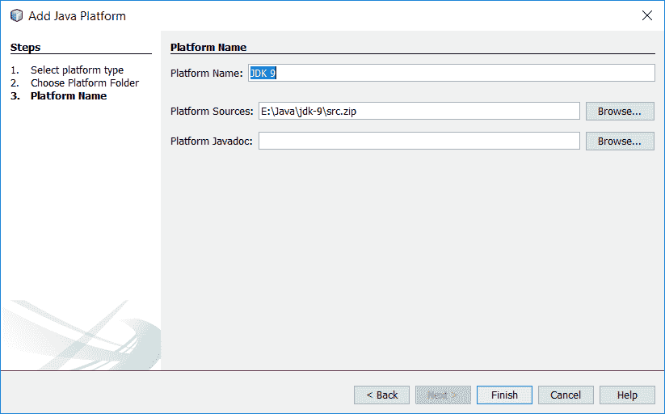

# 一、引言

在建造新建筑的过程中，一套蓝图帮助所有相关方沟通——建筑师、电工、木匠、水管工等等。它详细说明了形状、大小和材质等内容。如果没有他们，每个分包商都只能猜测该做什么、在哪里做以及如何做。没有这些蓝图，现代建筑几乎是不可能的。

在你的手中，或者在你面前的屏幕上，是一套不同类型的蓝图。由于每个项目和环境都有独特的约束和要求，这些蓝图没有详细说明如何构建特定的软件系统，而是提供了如何构建各种基于 Java 的系统的示例，提供了如何使用**Java 开发工具包**或**JDK 中的特定功能的示例**，特别关注 Java 9 的新功能，然后您可以将这些功能应用于您的特定问题。

由于不可能只使用新的 Java9 特性构建应用程序，因此我们还将使用并强调 JDK 中的许多最新特性。在我们深入了解这一点之前，让我们简单地讨论一下最近一些主要的 JDK 版本中的这些新特性。希望大多数 Java 商店已经在 Java7 上，所以我们将重点关注版本 8，当然还有版本 9。

在本章中，我们将介绍以下主题：

*   Java8 中的新特性
*   Java9 中的新特性
*   项目

# Java8 中的新特性

2014 年 3 月 8 日发布的 Java8 带来了自 2004 年发布 Java5 以来最重要的两个特性——lambdas 和 streams。随着函数式编程在 JVM 世界中越来越流行，特别是在 Scala 等语言的帮助下，Java 的拥护者们几年来一直在叫嚣更多函数式语言特性。该功能最初计划在 Java7 中发布，后来从该版本中删除，最终在 Java8 中实现了稳定的发布。

虽然希望每个人都熟悉 Java 的 lambda 支持，但经验表明，由于各种原因，许多商店在采用新的语言版本和功能方面进展缓慢，因此快速介绍可能会有所帮助。

# 兰博达斯

lambda 一词起源于 1936 年由 Alonzo Church 开发的 lambda 演算，它只是指一个匿名函数。通常，函数（或方法，用更恰当的 Java 说法）是 Java 源代码中静态命名的工件：

```java
    public int add(int x, int y) { 
      return x + y; 
    } 

```

这个简单的方法是一个名为`add`的方法，它接受两个`int`参数并返回一个`int`参数。随着 lambdas 的引入，现在可以编写如下内容：

```java
    (int x, int y) → x + y 

```

或者，更简单地说：

```java
    (x, y) → x + y 

```

这个缩写语法表示我们有一个函数，它接受两个参数并返回它们的和。根据 lambda 的使用位置，编译器可以推断参数的类型，从而使第二种更简洁的格式成为可能。不过，最重要的是，请注意此方法不再命名。除非将其分配给变量或作为参数传递（稍后将详细介绍），否则不能在系统中的任何位置引用或使用它。

当然，这个例子非常简单。一个更好的例子可能是在许多 API 中的一个，其中方法的参数是一个称为**单一抽象方法**（**SAM**接口）的实现，至少在 Java 8 之前，该接口是一个具有单一方法的接口。SAM 的一个典型例子是`Runnable`。以下是前 lambda`Runnable`用法的示例：

```java
    Runnable r = new Runnable() { 
      public void run() { 
        System.out.println("Do some work"); 
      } 
    }; 
    Thread t = new Thread(r); 
    t.start(); 

```

使用 Java 8 lambdas，此代码可以大大简化为：

```java
    Thread t = new Thread(() ->
      System.out.println("Do some work")); 
    t.start(); 

```

`Runnable`方法的主体仍然非常琐碎，但在清晰和简洁方面的收获应该是非常明显的。

虽然 lambda 是匿名函数（也就是说，它们没有名称），但与许多其他语言一样，Java lambda 也可以被分配给变量并作为参数传递（事实上，如果没有此功能，该功能几乎一文不值）。回顾前面代码中的`Runnable`方法，我们可以将`Runnable`的声明和使用分开，如下所示：

```java
    Runnable r = () { 
      // Acquire database connection 
      // Do something really expensive 
    }; 
    Thread t = new Thread(r); 
    t.start(); 

```

这故意比前面的示例更详细。`Runnable`方法的删节部分旨在模仿现实世界`Runnable`的外观，以及尽管 lambdas 提供了简洁性，但人们可能希望将新定义的`Runnable`方法分配给变量的原因。这个新的 lambda 语法允许我们声明`Runnable`方法的主体，而不必担心方法名称、签名等。诚然，任何一个像样的 IDE 都会对这种样板文件有所帮助，但这种新语法让您和无数维护代码的开发人员在调试代码时所需解析的噪音大大减少。

任何 SAM 接口都可以编写为 lambda。你有一个比较器，你真的只需要使用一次吗？

```java
    List<Student> students = getStudents(); 
    students.sort((one, two) -> one.getGrade() - two.getGrade()); 

```

`ActionListener`怎么样？

```java
    saveButton.setOnAction((event) -> saveAndClose()); 

```

此外，您可以在 lambdas 中使用自己的 SAM 接口，如下所示：

```java
    public <T> interface Validator<T> { 
      boolean isValid(T value); 
    } 
    cardProcessor.setValidator((card) 
    card.getNumber().startsWith("1234")); 

```

这种方法的优点之一是，它不仅使消费代码更加简洁，而且还降低了创建某些具体 SAM 实例的工作量。也就是说，开发人员不必在匿名类和具体的命名类之间做出决定，而是可以内联、干净、简洁地声明它。

除了多年来一直使用的 SAMs Java 开发人员之外，Java8 还引入了许多功能接口，以帮助促进更多功能风格的编程。Java8Javadoc 列出了 43 个不同的接口。其中，有一些基本的功能**形状**你应该知道，其中一些如下：

| `BiConsumer<T,U>` | 这表示一个接受两个输入参数且不返回结果的操作 |
| `BiFunction<T,U,R>` | 这表示一个接受两个参数并生成结果的函数 |
| `BinaryOperator<T>` | 这表示对同一类型的两个操作数执行的操作，生成与操作数类型相同的结果 |
| `BiPredicate<T,U>` | 这表示两个参数的谓词（布尔值函数） |
| `Consumer<T>` | 这表示接受单个输入参数且不返回结果的操作 |
| `Function<T,R>` | 这表示接受一个参数并生成结果的函数 |
| `Predicate<T>` | 这表示一个参数的谓词（布尔值函数） |
| `Supplier<T>` | 这代表了结果的提供者 |

这些接口有无数的用途，但要演示其中一些功能，最好的方法可能是将注意力转向 Java8 中的下一个大特性——流。

# 溪流

Java8 的另一个主要补充，也许是 lambdas 最耀眼的地方，是新的**Streams API**。如果你要搜索 Java 流的定义，你会得到一些答案，从有点循环的**a 数据元素流**到更技术的**Java 流是单子**，它们可能都是对的。Streams API 允许 Java 开发人员通过**步骤序列**与数据元素流交互。即使这样说也不尽可能清楚，所以让我们通过查看一些示例代码来了解它的含义。

假设你有一个特定班级的成绩表。你想知道班上女生的平均成绩是多少。在 Java 8 之前，您可能编写过如下内容：

```java
    double sum = 0.0; 
    int count = 0; 
    for (Map.Entry<Student, Integer> g : grades.entrySet()) { 
      if ("F".equals(g.getKey().getGender())) { 
        count++; 
        sum += g.getValue(); 
      } 
    } 
    double avg = sum / count; 

```

我们初始化两个变量，一个用于存储总和，另一个用于计算命中数。接下来，我们循环浏览成绩。如果学生的性别是女性，我们增加计数器并更新总数。当循环终止时，我们就有了计算平均值所需的信息。这是可行的，但有点冗长。新的 Streams API 有助于：

```java
    double avg = grades.entrySet().stream() 
     .filter(e -> "F".equals(e.getKey().getGender())) // 1 
     .mapToInt(e -> e.getValue()) // 2 
     .average() // 3 
     .getAsDouble(); //4 

```

这个新版本并没有明显更小，但代码的目的更加明确。在前面的流前代码中，我们必须玩计算机，解析代码并找出其预期目的。对于 streams，我们有一种清晰、声明性的方法来表达应用程序逻辑。对于地图中的每个条目，请执行以下操作：

1.  过滤掉`gender`不是`F`的每个条目。
2.  将每个值映射到基元 int。
3.  平均成绩。
4.  以双精度形式返回值。

使用基于流和基于 lamba 的方法，我们不需要声明临时的中间变量（成绩计数和总数），也不需要担心计算公认的简单平均值。JDK 为我们完成了所有繁重的工作。

# 新的 java.time 包

虽然 lambdas 和 streams 是非常重要的改变游戏规则的更新，但在 Java8 中，我们得到了另一个期待已久的变化，至少在某些圈子里，这同样令人兴奋：一个新的日期/时间 API。任何在 Java 工作过日期和时间的人都知道`java.util.Calendar`和公司的痛苦。很明显，你可以完成你的工作，但它并不总是美好的。许多开发人员发现 API 使用起来太痛苦，所以他们将非常流行的 Joda 时间库集成到他们的项目中。Java 架构师同意了，并聘请 Joda Time 的作者 Stephen Colebourne 领导 JSR 310，JSR 310 将 Joda Time 的一个版本（修复各种设计缺陷）引入平台。在本书后面的部分中，我们将详细介绍如何在日期/时间计算器中使用这些新 API。

# 默认方法

在我们关注 java 9 之前，让我们来看看一个更重要的语言特性：默认方法。自 Java 诞生以来，接口就被用来定义类的外观，这意味着某种类型的行为，但无法实现这种行为。这使得多态性在很多情况下变得更加简单，因为任何数量的类都可以实现给定的接口，而消费代码将它们视为该接口，而不是它们实际上是什么具体的类。

然而，多年来 API 开发人员面临的问题之一是如何在不破坏现有代码的情况下开发 API 及其接口。例如，以 JavaServerFaces1.1 规范中的`ActionSource`接口为例。当 JSF1.2 专家组正在编写下一版本的规范时，他们发现需要向接口添加一个新属性，这将产生两个新方法——getter 和 setter。他们不能简单地将方法添加到接口，因为这会破坏规范的每个实现，需要实现的维护人员更新他们的类。显然，这种破坏是不可接受的，因此 JSF1.2 引入了`ActionSource2`，它扩展了`ActionSource`并添加了新的方法。虽然许多人认为这种方法很丑陋，但 1.2 专家组有几个选择，没有一个是很好的。

但是，在 Java8 中，接口现在可以在接口定义上指定默认方法，如果扩展类不提供默认方法，编译器将使用该方法实现。让我们以下面的代码为例：

```java
    public interface Speaker { 
      void saySomething(String message); 
    } 
    public class SpeakerImpl implements Speaker { 
      public void saySomething(String message) { 
        System.out.println(message); 
      } 
    } 

```

我们已经开发了我们的 API 并向公众开放，事实证明它非常流行。然而，随着时间的推移，我们发现了一个我们想要改进的地方：我们想添加一些方便的方法，比如`sayHello()`和`sayGoodbye()`，以节省用户一点时间。但是，正如前面所讨论的，如果我们只是将这些新方法添加到接口中，那么一旦用户更新到库的新版本，我们就会破坏他们的代码。默认方法允许我们通过定义一个实现来扩展接口并避免中断：

```java
    public interface Speaker { 
      void saySomething(String message); 
      default public void sayHello() { 
        System.out.println("Hello"); 
      } 
      default public void sayGoodbye() { 
        System.out.println("Good bye"); 
      } 
    } 

```

现在，当用户更新他们的库 jar 时，他们会立即获得这些新方法和行为，而不做任何更改。当然，要使用这些方法，用户需要修改他们的代码，但是他们不需要这样做，直到——如果——他们愿意的话。

# Java9 中的新特性

与 JDK 的任何新版本一样，本版本中包含了许多很棒的新特性。当然，最吸引人的功能会根据您的需求而有所不同，但我们将特别关注与我们将共同构建的项目最相关的一些新功能。首先是最重要的，Java 模块系统。

# Java 平台模块系统/项目拼图

尽管 Java8 是一个稳定的、功能丰富的版本，但相当多的人认为它有点令人失望。它缺少备受期待的**Java 平台模块系统**（**JPMS**），也被称为 Jigsaw 项目，虽然不太准确，但更通俗。Java 平台模块系统原本计划在 2011 年随 Java 7 一起发布，但由于一些挥之不去的技术问题，它被推迟到 Java 8。Jigsaw 项目的启动不仅是为了完成模块系统，也是为了模块化 JDK 本身，这将有助于 JavaSE 缩小到更小的设备，如手机和嵌入式系统。Jigsaw 原计划与 2014 年发布的 Java8 一起发布，但再次推迟，因为 Java 架构师认为他们仍然需要更多的时间来正确实现系统。不过，Java9 最终将交付这个承诺已久的项目。

也就是说，到底是什么？一个长期困扰 API 开发人员（包括 JDK 架构师）的问题是无法隐藏公共 API 的实现细节。JDK 私有类的一个很好的例子是`com.sun.*/sun.*`包和类，开发人员不应该直接使用这些私有类。`sun.misc.Unsafe`类就是一个很好的例子——私有 API 得到了广泛的公共使用。除了 Javadoc 中关于不使用这些内部类的措辞强烈的警告之外，几乎没有什么可以阻止它们的使用。直到现在。

有了 JPMS，开发人员将能够公开实现类，以便在项目内部轻松使用它们，但不会在模块外部公开它们，这意味着它们不会向 API 或库的使用者公开。为此，Java 架构师引入了一个新文件`module-info.java`，类似于现有的`package-info.java`文件，位于模块的根目录下，例如`src/main/java/module-info.java`。它被编译为`module-info.class`，并在运行时通过反射和新的`java.lang.Module`类提供。

那么这个文件是做什么的，它看起来像什么？Java 开发人员可以使用此文件命名模块，列出其依赖项，并向系统（包括编译和运行时）表示将向世界导出哪些包。例如，假设在前面的流示例中，我们有三个包：`model`、`api`和`impl`。我们希望公开模型和 API 类，但不公开任何实现类。我们的`module-info.java`文件可能如下所示：

```java
    module com.packt.j9blueprints.intro { 
      requires com.foo; 
      exports com.packt.j9blueprints.intro.model; 
      exports com.packt.j9blueprints.intro.api; 
    } 

```

这个定义公开了我们想要导出的两个包，还声明了对`com.foo`模块的依赖关系。如果此模块在编译时不可用，项目将不会生成，如果在运行时不可用，系统将抛出异常并退出。注意，`requires`语句没有指定版本。这是有意的，因为决定不将版本选择问题作为模块系统的一部分来处理，而将其留给更合适的系统，如构建工具和容器。

当然，关于模块系统可以说得更多，但对其所有特性和局限性的详尽讨论超出了本书的范围。不过，我们将以模块的形式实现我们的应用程序，因此我们将在本书中看到所使用的系统——也许会有更详细的解释。

想要更深入地讨论 Java 平台模块系统的人可以搜索 Mark Reinhold 的文章*模块系统的状态*。

# 过程处理 API

在以前的 Java 版本中，与本机操作系统进程交互的开发人员必须使用相当有限的 API，有些操作需要使用本机代码。作为**Java 增强方案**（**JEP**102）的一部分，Java 流程 API 扩展了以下特性（引用 JEP 文本）：

*   获取当前 Java 虚拟机的 pid（或等效项）以及使用现有 API 创建的进程的 pid 的能力。
*   枚举系统上进程的能力。关于每个进程的信息可能包括其 pid、名称、状态，可能还有资源使用情况。
*   处理过程树的能力；特别是一些破坏进程树的方法。
*   处理数百个子进程的能力，可能是多路复用输出或错误流，以避免为每个子进程创建线程。

我们将在我们的第一个项目 Process Viewer/Manager 中探讨这些 API 更改（有关详细信息，请参见以下部分）。

# 并发更改

正如在 Java7 中所做的那样，Java 架构师重新访问了并发库，进行了一些急需的更改，这次是为了支持反应流规范。这些变化包括一个新类`java.util.concurrent.Flow`，它有几个嵌套接口：`Flow.Processor`、`Flow.Publisher`、`Flow.Subscriber`和`Flow.Subscription`。

# 答复

一个让很多人兴奋的变化根本不是语言的变化。它添加了一个**REPL**（**Read Eval Print Loop**），这是语言外壳的一个奇特术语。实际上，这个新工具的命令是`jshell`。这个工具允许我们键入或粘贴 Java 代码，并获得即时反馈。例如，如果我们想使用上一节中讨论的 Streams API 进行实验，我们可以这样做：

```java
$ jshell 
|  Welcome to JShell -- Version 9-ea 
|  For an introduction type: /help intro 

jshell> List<String> names = Arrays.asList(new String[]{"Tom", "Bill", "Xavier", "Sarah", "Adam"}); 
names ==> [Tom, Bill, Xavier, Sarah, Adam] 

jshell> names.stream().sorted().forEach(System.out::println); 
Adam 
Bill 
Sarah 
Tom 
Xavier 

```

这是一个非常受欢迎的补充，应该可以帮助 Java 开发人员快速原型化和测试他们的想法。

# 项目

有了关于可使用的新功能的简要概述，我们将介绍的这些蓝图是什么样子的？我们将构建十个不同的应用程序，它们的复杂性和种类各不相同，涵盖了广泛的关注点。在每个项目中，我们都会特别关注我们正在强调的新特性，但我们也会看到一些旧的、经过验证的、真实的语言特性和库被广泛使用，并标记出任何有趣或新颖的用法。下面是我们的项目列表。

# 进程查看器/管理器

我们将在实现古老 Unix 工具的 Java 版本--**top**时，探索对流程处理 API 的一些改进。将此 API 与 JavaFX 相结合，我们将构建一个图形工具，允许用户查看和管理系统上运行的流程。

本项目将包括以下内容：

*   Java9 过程 API 增强
*   JavaFX

# 清理重复的文件

随着系统的老化，文件系统中出现混乱的可能性，尤其是重复的文件，似乎呈指数增长。利用一些新的文件 I/O 库，我们将构建一个工具来扫描一组用户指定的目录以识别重复项。将 JavaFX 从工具箱中拉出来，我们将添加一个图形用户界面，它将提供一种更友好的方式来交互处理重复项。

本项目将包括以下内容：

*   Java 文件 I/O
*   散列库
*   JavaFX

# 日期计算器

随着 Java8 的发布，Oracle 或多或少地在 JDK 中集成了一个基于 Joda Time 重新设计的新库。正式名称为 JSR310，这个新的库修复了 JDK 长期以来的一个抱怨——官方的日期库不足且难以使用。在这个项目中，我们将构建一个简单的命令行日期计算器，它将获取一个日期，例如，向其中添加任意数量的时间。考虑下面的代码，例如：

```java
$ datecalc "2016-07-04 + 2 weeks" 
2016-07-18 
$ datecalc "2016-07-04 + 35 days" 
2016-08-08 
$ datecalc "12:00CST to PST" 
10:00PST 

```

本项目将包括以下内容：

*   Java8 日期/时间 API
*   正则表达式
*   Java 命令行库

# 社交媒体集合体

在如此多的社交媒体网络上拥有账户的一个问题是密切关注每个网络上发生的事情。通过 Twitter、Facebook、Google+、Instagram 等账户，活跃用户可以花大量时间从一个站点跳到另一个站点，或从一个应用跳到另一个应用，阅读最新更新。在本章中，我们将构建一个简单的聚合器应用程序，它将从每个用户的社交媒体帐户中提取最新更新，并将它们显示在一个位置。这些功能将包括以下内容：

*   多种社交媒体网络的多个帐户：
    *   啁啾
    *   品特烈
    *   一款图片分享应用
*   只读、丰富的社交媒体帖子列表
*   链接到适当的网站或应用程序，以便快速轻松地跟进
*   桌面和移动版本

本项目将包括以下内容：

*   REST/HTTP 客户端
*   JSON 处理
*   JavaFX 与 Android 开发

考虑到这项工作的规模和范围，我们实际上将分两章来完成这项工作：第一章是 JavaFX，第二章是 Android。

# 电子邮件过滤器

管理电子邮件可能很棘手，特别是如果你有多个帐户。如果您从多个位置（即，从多个桌面或移动应用程序）访问邮件，则管理电子邮件规则可能更为棘手。如果您的邮件系统不支持存储在服务器上的规则，那么您需要决定将这些规则放在何处，以便它们最常运行。在这个项目中，我们将开发一个应用程序，允许我们编写各种规则，然后通过可选的后台流程运行这些规则，以便始终正确管理您的邮件。

示例`rules`文件可能如下所示：

```java
    [ 
      { 
        "serverName": "mail.server.com", 
        "serverPort": "993", 
        "useSsl": true, 
        "userName": "me@example.com", 
        "password": "password", 
        "rules": [ 
           {"type": "move", 
               "sourceFolder": "Inbox", 
               "destFolder": "Folder1", 
               "matchingText": "someone@example.com"}, 
            {"type": "delete", 
               "sourceFolder": "Ads", 
               "olderThan": 180} 
         ] 
      } 
    ] 

```

本项目将包括以下内容：

*   邮件收发
*   JavaFX
*   JSON 处理
*   操作系统集成
*   文件 I/O

# JavaFX 照片管理

Java 开发工具包有一系列非常健壮的图像处理 API。在 Java9 中，通过改进对 TIFF 规范的支持，这些功能得到了增强。在本章中，我们将在创建图像/照片管理应用程序时练习此 API。我们将添加对将图像从用户指定位置导入配置的官方目录的支持。我们还将重新访问重复文件查找器，并重用作为项目一部分开发的一些代码，以帮助我们识别重复图像。

本项目将包括以下内容：

*   新的`javax.imageio`包
*   JavaFX
*   NetBeans 富客户端平台
*   Java 文件 I/O

# 客户端/服务器 Notes 应用程序

您是否使用过基于云的笔记应用程序？你有没有想过自己要做什么？在本章中，我们将创建这样一个应用程序，包括完整的前端和后端。在服务器端，我们将数据存储在日益流行的文档数据库 MongoDB 中，并通过 REST 接口为应用程序公开适当的业务逻辑部分。在客户端，我们将用 JavaScript 开发一个非常基本的用户界面，让我们在 Java 项目中试验并演示如何使用 JavaScript。

本项目将包括以下内容：

*   文档数据库（MongoDB）
*   JAX-RS 和 RESTful 接口
*   JavaFX
*   JavaScript 和 vue2

# 无服务器 Java

无服务器，也称为**功能即服务**（**FaaS**），是当今最热门的趋势之一。它是一种应用程序/部署模型，在该模型中，一个小功能被部署到一个服务，该服务几乎管理该功能的每个方面——启动、关闭、内存等等，从而使开发人员不用担心这些细节。在本章中，我们将编写一个简单的无服务器 Java 应用程序，以了解如何做到这一点，以及如何在自己的应用程序中使用这种新技术。

本项目将包括以下内容：

*   创建 Amazon Web 服务帐户
*   配置 AWS Lambda、简单通知服务、简单电子邮件服务和 DynamoDB
*   编写和部署 Java 函数

# Android 桌面同步客户端

在这个项目中，我们将稍微改变一下方向，特别关注 Java 生态系统的另一部分：Android。为此，我们将关注一个仍然困扰一些 Android 用户的问题——Android 设备和台式机（或笔记本电脑）系统的同步。尽管各种云提供商正在推动我们在云中存储越来越多的内容，并将这些内容流式传输到设备上，但出于各种原因，例如，从云资源的成本到不可靠的无线连接和隐私问题，一些人仍然更喜欢将照片和音乐直接存储在设备上。

在本章中，我们将构建一个系统，允许用户在其设备和台式机或笔记本电脑之间同步音乐和照片。我们将构建一个 Android 应用程序，提供用户界面来配置和监控移动设备端的同步，如果需要，还将构建一个 Android 服务，在后台执行同步。我们还将在桌面上构建相关组件——一个用于配置和监控桌面进程的图形应用程序，以及一个用于处理桌面端同步的后台进程。

本项目将包括以下内容：

*   安卓
*   用户界面
*   服务
*   JavaFX
*   休息

# 开始

我们已经快速浏览了一些我们将要使用的新语言特性。我们还看到了我们将要构建的项目的快速概述。最后一个问题是：我们将使用什么工具来完成我们的工作？

当涉及到开发工具时，Java 生态系统面临着财富的窘境，因此我们有很多选择。我们面临的最基本的选择是构建工具。对于我们在这里的工作，我们将使用 Maven。虽然有一个强大且直言不讳的社区支持 Gradle，但 Maven 似乎是目前最常见的构建工具，并且似乎从主要 IDE 获得了更强大、更成熟和更原生的支持。如果尚未安装 Maven，可以访问[http://maven.apache.org](http://maven.apache.org/) 下载操作系统的发行版，或使用操作系统支持的任何软件包管理系统。

对于 IDE，所有屏幕截图、说明等都将使用 NetBeans——Oracle 提供的免费开源 IDE。当然，IntelliJ IDEA 和 Eclipse 都有支持者，他们都是不错的选择，但是 NetBeans 提供了一个完整而健壮的开箱即用的开发，而且它快速、稳定、免费。要下载 NetBeans，请访问[http://netbeans.org](http://netbeans.org/) 下载适合您操作系统的安装程序。因为我们使用的是 Maven，IDEA 和 Eclipse 都支持 Maven，所以您应该能够在您选择的 IDE 中打开这里展示的项目。不过，在 GUI 中显示步骤的地方，您需要针对所选的 IDE 进行调整。

在撰写本文时，NetBeans 的最新版本是 8.2，使用它进行 Java 9 开发的最佳方法是在 Java 8 上运行 IDE，并将 Java 9 添加为 SDK。NetBeans 有一个在 Java9 上运行的开发版本，但是，由于它是一个开发版本，它有时可能不稳定。一个稳定的 NetBeans9 应该与 Java9 本身差不多同时发布。同时，我们将推进 8.2：

1.  要添加 Java9 支持，我们需要添加一个新的 Java 平台，我们将通过单击 Tools | platform 来实现这一点。
2.  这将打开 Java 平台管理器屏幕：


3.  点击添加平台。。。在屏幕的左下方。


4.  我们希望添加一个 Java 标准版平台，因此我们将接受默认设置并单击 Next。


5.  在 AddJavaPlatform 屏幕上，我们将导航到安装 Java9 的位置，选择 JDK 目录，然后单击 Next。



6.  我们需要为新的 Java 平台命名（NetBeans 默认为非常合理的 JDK 9），因此我们将单击 Finish，现在可以看到我们新添加的 Java 9 选项。


有了 project SDK 套件，我们就可以开始使用这些新的 Java 9 功能了，我们将在[第 2 章](02.html)*中开始使用 Java*管理流程。

如果您确实在 Java9 上运行 NetBeans（这在本书出版时应该是可能的），那么您已经配置了 Java9。但是，如果您特别需要该版本，您可以使用前面的步骤来配置 Java8。

# 总结

在本章中，我们简要介绍了 Java8 中一些伟大的新特性，包括 lambdas、streams、新的日期/时间包和默认方法。从 Java9 中，我们快速了解了 Java 平台模块系统和项目 Jigsaw、流程处理 API、新的并发更改和新的 JavaRepl。对于每一个，我们都讨论了 what 和 why，并查看了一些示例，说明它们如何影响我们编写的系统。我们还了解了我们将在本书中构建的项目类型以及我们将使用的工具。

在我们继续之前，我想重申前面的一点——每个软件项目都是不同的，所以写这本书时不可能简单地将大量代码复制粘贴到项目中。同样，每个开发人员编写代码的方式也不同；我构造代码的方式可能与你的大不相同。重要的是，当你读这本书的时候，你要记住这一点，不要被细节挂住。这里的目的不是向您展示使用这些 API 的一种正确方法，而是为您提供一个示例，您可以通过该示例更好地了解如何使用这些 API。从每一个例子中学习你能做的，根据你认为合适的地方修改东西，然后去做一些令人惊奇的事情。

说到这里，让我们把注意力转向我们的第一个项目，流程管理器和新的流程处理 API。