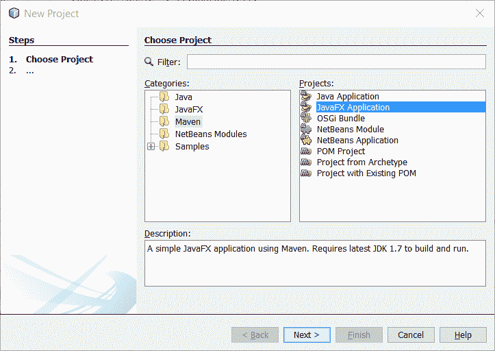
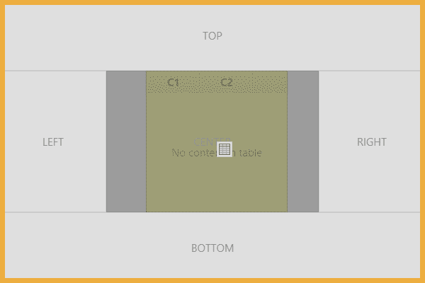
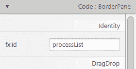
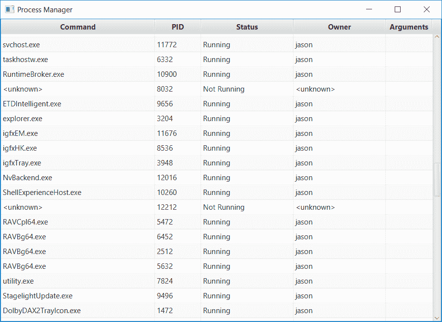

# 用 Java 管理进程

通过快速浏览 Java9 的一些重大新特性，以及之前几个版本中的特性，让我们将注意力转向以实用的方式应用这些新 API。我们将从一个简单的流程管理器开始。

虽然让您的应用程序或实用程序在内部处理用户的所有问题通常是理想的，但出于各种原因，有时您需要运行（或**向**抛出）外部程序。从 Java 诞生的第一天起，JDK 就通过`Runtime`类通过各种 API 支持这一点。以下是最简单的示例：

```java
    Process p = Runtime.getRuntime().exec("/path/to/program"); 

```

创建流程后，您可以通过`Process`类跟踪其执行情况，该类具有`getInputStream()`、`getOutputStream()`和`getErrorStream()`等方法。我们还通过`destroy()`和`waitFor()`对过程进行了初步控制。Java8 通过添加`destroyForcibly()`和`waitFor(long, TimeUnit)`将事情向前推进。从 Java9 开始，这些功能将得到扩展。引用**Java 增强方案**（**JEP**）中的话，我们看到了这个新功能的以下原因：

*许多企业应用程序和容器涉及多个 Java 虚拟机和流程，并且具有长期的需求，包括以下内容：*

*   *获取当前 Java 虚拟机的 pid（或等效值）以及使用现有 API 创建的进程的 pid 的能力。*
*   *枚举系统上进程的能力。关于每个进程的信息可能包括其 pid、名称、状态，可能还有资源使用情况。*
*   *处理进程树的能力，特别是一些破坏进程树的方法。*
*   *处理数百个子进程的能力，可能是多路复用输出或错误流，以避免每个子进程创建线程。*

在本章中，我们将构建一个简单的流程管理器应用程序，类似于 Windows 任务管理器或*nix 的 top。当然，几乎不需要用 Java 编写流程管理器，但这将是我们探索这些新的流程处理 API 的极好途径。此外，我们将花一些时间研究其他语言特性和 API，即 JavaFX 和`Optional`。

本章涵盖以下主题：

*   创建项目
*   引导应用程序
*   定义用户界面
*   初始化用户界面
*   添加菜单
*   更新进程列表

说到这里，让我们开始吧。

# 创建项目

通常来说，如果一个构建可以在不需要使用特定 IDE 或其他专有工具的情况下被复制，那就更好了。幸运的是，NetBeans 提供了创建基于 Maven 的 JavaFX 项目的能力。点击文件|新建项目并选择`Maven`，然后点击 JavaFX 应用程序：



接下来，执行以下步骤：

1.  点击下一步。
2.  输入项目名称为`ProcessManager`。
3.  将组 ID 输入为`com.steeplesoft`。
4.  将包装输入为`com.steeplesoft.processmanager`。
5.  选择项目位置。
6.  点击 Finish。

考虑下面的屏幕截图作为一个例子：


创建新项目后，我们需要更新 Maven`pom`以使用 Java 9：

```java
    <build> 
      <plugins> 
        <plugin> 
          <groupId>org.apache.maven.plugins</groupId> 
          <artifactId>maven-compiler-plugin</artifactId> 
          <version>3.6.1</version> 
          <configuration> 
            <source>9</source> 
            <target>9</target> 
          </configuration> 
        </plugin> 
      </plugins> 
    </build> 

```

现在，NetBeans 和 Maven 都配置为使用 Java9，我们已经准备好开始编码了。

# 引导应用程序

正如简介中所述，这将是一个基于 JavaFX 的应用程序，因此我们将从创建应用程序的框架开始。这是一个 Java9 应用程序，我们打算使用 Java 模块系统。为此，我们需要创建模块定义文件`module-info.java`，它位于源代码树的根目录中。这是一个基于 Maven 的项目，即`src/main/java`：

```java
    module procman.app { 
      requires javafx.controls; 
      requires javafx.fxml; 
    } 

```

这个小文件有两个不同的功能。首先，它定义了一个新的`procman.app`模块。接下来，它告诉系统这个模块`requires`有两个 JDK 模块：`javafx.controls`和`javafx.fxml`。如果我们没有指定这两个模块，那么我们的系统（我们将在下面看到）将无法编译，因为 JDK 不会使所需的类和包可用于我们的应用程序。从 Java9 开始，这些模块是标准 JDK 的一部分，所以这不应该成为问题。然而，在 Java 的未来版本中，这一点可能会改变，这个模块声明将通过强制主机 JVM 提供模块或无法启动来帮助防止应用程序中的运行时故障。也可以通过**J-Link**工具构建自定义 Java 运行时，因此在 Java9 中仍然可能缺少这些模块。配置好模块后，让我们转到应用程序。

新兴的标准目录布局似乎类似于`src/main/java/*<module1>*`、`src/main/java/*<module2>*`等。在写这本书的时候，虽然 Maven 可以被引导到这样的布局中，但是插件本身，尽管它们在 Java9 下运行，似乎没有足够的模块意识来允许我们以这样的方式组织代码。因此，为了简单起见，我们将把一个 Maven 模块当作一个 Java 模块，并维护项目的标准源代码布局。

我们将创建的第一个类是`Application`后代，它是 NetBeans 为我们创建的。它创建了`Main`类，我们将其重命名为`ProcessManager`：

```java
    public class ProcessManager extends Application { 
      @Override 
      public void start(Stage stage) throws Exception { 
        Parent root = FXMLLoader 
         .load(getClass().getResource("/fxml/procman.fxml")); 

        Scene scene = new Scene(root); 
        scene.getStylesheets().add("/styles/Styles.css"); 

        stage.setTitle("Process Manager"); 
        stage.setScene(scene); 
        stage.show(); 
      } 

      public static void main(String[] args) { 
        launch(args); 
      } 
    } 

```

我们的`ProcessManager`类扩展了 JavaFX 基类`Application`，它提供了启动和停止应用程序的各种功能。我们在`main()`方法中看到，我们只是将其委托给`Application.launch(String[])`，这为我们启动新应用程序起到了重要作用。

这个类中更有趣的部分是`start()`方法，它是 JavaFX 生命周期调用回我们的应用程序的地方，让我们有机会构建用户界面，我们将在下一步做这件事。

# 定义用户界面

在为 JavaFX 应用程序构建用户界面时，可以使用两种方法之一：代码或标记。为了使代码更小、更可读，我们将使用 FXML 构建用户界面——专门为 JavaFX 创建的基于 XML 的语言，用于表示用户界面。这为我们提供了另一个二进制选择——我们是手工编写 XML，还是使用图形工具？同样，选择很简单——我们将使用一个工具**Scene Builder**，这是一个所见即所得工具，最初由 Oracle 开发，现在由 Gluon 维护和支持。然而，我们还将研究 XML 源代码，以便了解正在做什么，因此如果您不喜欢使用 GUI 工具，也不会被遗漏。

正如您所期望的，安装和使用场景生成器非常简单。可从[下载 http://gluonhq.com/labs/scene-builder/](http://gluonhq.com/labs/scene-builder/) 。安装后，您需要告诉 NetBeans 在哪里可以找到它，这可以在设置窗口的 Java | JavaFX 下完成，如您在以下屏幕截图中所示：


我们现在准备创建 FXML 文件。在项目视图的`resources`目录下，创建一个名为`fxml`的新文件夹，并在该文件夹中创建一个名为`procman.fxml`的文件，如下所示：

```java
    <BorderPane  
      xmlns:fx="http://javafx.com/fxml/1"  
      fx:controller="com.steeplesoft.procman.Controller"> 
    </BorderPane> 

```

`BorderPane`是一个定义了五个区域的容器——`top`、`bottom`、`left`、`right`和`center`，为我们提供了一个相当粗粒度的控件，用于控制控件在表单上的显示位置。通常，对于`BorderPane`，每个区域都使用嵌套容器来提供更细粒度的控制，这通常是必要的。对于我们的需要，这种控制水平将是完美的。

用户界面的主要关注点是进程列表，因此我们将从该进程的控件开始。在场景生成器中，我们要单击左侧手风琴上的`Controls`部分，然后向下滚动到`TableView`。单击此按钮并将其拖动到表单上的`CENTER`区域，如场景生成器的屏幕截图所示：



生成的 FXML 应该如下所示：

```java
    <center> 
        <TableView fx:id="processList" 
               BorderPane.alignment="CENTER"> 
        </TableView> 
    </center> 

```

在其他区域没有组件的情况下，`TableView`将扩展以填充窗口的整个区域，这就是我们现在想要的。

# 初始化用户界面

虽然 FXML 定义了用户界面的结构，但我们确实需要一些 Java 代码来初始化各种元素、响应操作等等。该类称为控制器，只是一个扩展了`javafx.fxml.Initializable`的类：

```java
    public class Controller implements Initializable { 
      @FXML 
      private TableView<ProcessHandle> processList; 
      @Override 
      public void initialize(URL url, ResourceBundle rb) { 
      } 
    } 

```

`initialize()`方法来自接口，当从前面的`Application`类调用`FXMLLoader.load()`时，JavaFX 运行时使用该方法初始化控制器。注意实例变量`processList`上的`@FXML`注释。当 JavaFX 初始化控制器时，在调用`initialize()`方法之前，系统会查找指定`fx:id`属性的 FXML 元素，并将该引用分配给控制器中相应的实例变量。要完成此连接，我们必须对 FXML 文件再做一次更改：

```java
    <TableView fx:id="processList" BorderPane.alignment="CENTER">
    ...

```

也可以在场景生成器中进行更改，如此屏幕截图所示：



fx:id 属性的值必须与用`@FXML`注释的实例变量的名称匹配。当调用`initialize`时，`processList`将有一个对`TableView`的有效引用，我们可以在 Java 代码中操作该引用。

fx:id 的值也可以通过场景生成器设置。要设置该值，请单击表单编辑器中的控件，然后展开右侧手风琴中的“代码”部分。在 fx:id 字段中，键入所需变量名的名称。

最后一个难题是为 FXML 文件指定控制器。在 XML 源中，可以通过用户界面根元素上的`fx:controller`属性进行设置：

```java
    <BorderPane  
      xmlns:fx="http://javafx.com/fxml/1" 
      fx:controller="com.steeplesoft.procman.Controller">

```

这也可以通过场景生成器进行设置。在左侧手风琴的文档部分，展开控制器部分，并在控制器类字段中输入所需的完全限定类名：


有了这些部分，我们就可以开始初始化`TableView`了，这让我们回到了我们的主要兴趣，处理 API 的流程。我们的出发点是`ProcessHandles.allProcesses()`。从 Javadoc 中，您了解到该方法返回当前进程可见的所有进程的快照**。从流中的每个`ProcessHandle`中，我们可以获得进程 ID、状态、子进程、父进程等信息。每个`ProcessHandle`还有一个嵌套对象`Info`，其中包含流程信息的快照。由于并非所有信息都可在各种支持的平台上获得，并且受当前进程权限的限制，`Info`对象上的属性为`Optional<T>`实例，表示可以设置值，也可以不设置值。或许值得花些时间快速看看什么是`Optional<T>`。**

 **Javadoc 将`Optional<T>`描述为**容器对象，它可能包含也可能不包含非空值**。受 Scala 和 Haskell 的启发，`Optional<T>`在 Java8 中引入，以允许 API 作者提供更为空安全的接口。在 Java 8 之前，`ProcessHandle.Info`上的方法可以定义如下：

```java
    public String command(); 

```

要使用 API，开发人员可能会编写如下内容：

```java
    String command = processHandle.info().command(); 
    if (command == null) { 
      command = "<unknown>"; 
    } 

```

如果开发人员没有显式地检查 null，`NullPointerException`几乎肯定会在某个时候发生。通过使用`Optional<T>`，API 作者向用户发出信号，返回值可能为空，应小心处理。那么，更新后的代码可能如下所示：

```java
    String command = processHandle.info().command() 
     .orElse("<unknown>"); 

```

现在，在一行简洁的代码中，我们可以得到值（如果有），或者默认值（如果没有）。`ProcessHandle.Info`API 广泛使用了这个构造，我们将在后面看到。

`Optional`作为开发者，我们还能得到什么？有许多实例方法可以帮助澄清空处理代码：

*   `filter(Predicate<? super T> predicate)`：通过这种方法，我们过滤`Optional`的内容。我们可以通过`filter()`方法 a`Predicate`并在线进行测试，而不是使用`if...else`块。`Predicate`是一个`@FunctionalInterface`，它接受一个输入并返回一个布尔值。例如，JavaFX`Dialog`的某些用法可能返回`Optional<ButtonType>`。如果我们只想在用户点击某个特定按钮的情况下进行**操作，比如说，OK，我们可以像这样过滤`Optional`：**

```java
        alert.showAndWait() 
         .filter(b -> b instanceof ButtonType.OK) 

```

*   `map(Function<? super T,? extends U> mapper)`：`map`函数允许我们将`Optional`的内容传递给一个函数，该函数将对其进行一些处理并返回。不过，函数的返回将被包装在一个`Optional`中：

```java
        Optional<String> opts = Optional.of("hello"); 
        Optional<String> upper = opts.map(s ->  
         s.toUpperCase()); 
        Optional<Optional<String>> upper2 =  
         opts.map(s -> Optional.of(s.toUpperCase())); 

```

注意`upper2`在`Optional`中的双重包装。如果`Function`返回`Optional`，它将被另一个`Optional`包裹，这给了我们这种奇怪的双重包裹，这是不可取的。幸运的是，我们还有其他选择。

*   `flatMap(Function<? super T,Optional<U>> mapper)`：`flatMap`功能结合了两种功能理念——映射和展平。如果`Function`的结果是一个`Optional`对象，而不是双重包装该值，则将其展平为一个`Optional`对象。回顾前面的示例，我们得到如下结果：

```java
        Optional<String> upper3 = opts.flatMap(s ->      
         Optional.of(s.toUpperCase())); 

```

请注意，`upper3`与`upper2`不同，是一个单独的`Optional`：

*   `get()`：返回包装后的值（如果存在）。如果没有值，则抛出一个`NoSuchElementException`错误。
*   `ifPresent(Consumer<? super T> action)`：如果`Optional`对象包含值，则传递给`Consumer`。如果没有价值存在，则什么也不会发生。
*   `ifPresentOrElse(Consumer<? super T> action, Runnable emptyAction)`：与`ifPresent()`类似，如果存在一个值，则将该值传递给`Consumer`。如果没有值，则执行`Runnable emptyAction`。
*   `isPresent()`：如果`Optional`对象包含值，则返回 true。
*   `or(Supplier<Optional<T>> supplier)`：如果`Optional`对象有值，则说明`Optional`。如果不存在值，则返回由`Supplier`生成的`Optional`对象。
*   `orElse(T other)`：如果`Optional`对象包含值，则返回。如果没有值，则返回`other`。
*   `orElseGet(Supplier<? extends T> supplier)`：其工作原理与前面提到的`orElse()`类似，但如果不存在值，则返回`Supplier`的结果。
*   `orElseThrow(Supplier<? extends X> exceptionSupplier)`：如果存在值，则返回。如果没有值，则抛出`Supplier`提供的`Exception`。

`Optional`还有几个静态方法可以帮助创建`Optional`实例，其中一些方法如下：

*   `empty()`：返回一个空的`Optional`对象。
*   `of(T value)`：返回描述非空值的`Optional`对象。如果该值为 null，则抛出一个`NullPointerException`。
*   `ofNullable(T value)`：返回一个描述该值的`Optional`对象。如果该值为空，则返回空的`Optional`。

通过对`Optional<T>`的简要介绍，让我们看看它的存在如何影响我们的应用。

回到`initialize()`方法，我们的第一步是获取要显示的进程列表。streams API 使这一点非常简单：

```java
    ProcessHandle.allProcesses() 
     .collect(Collectors.toList()); 

```

`allProcesses()`方法返回`Stream<ProcessHandle>`，这允许我们将新的流操作应用于我们的问题。在本例中，我们只想创建一个包含所有`ProcessHandle`实例的`List`，因此我们称之为`collect()`，这是一个包含`Collector`的流操作。我们可以选择很多选项，但我们需要一个`List`，因此我们使用`Collectors.toList()`，它将收集流中的每个项目，并最终在流终止时返回一个`List`。请注意，`List`的参数化类型将与`Stream`的参数化类型匹配，在本例中为`ProcessHandle`。

这一行，然后，给我们一个`List<ProcessHandle>`的系统上的每一个进程，当前进程可以看到，但这只是我们的一半。`TableView`API 不接受`List<T>`。它只支持`ObservableList<T>`，那是什么？它的 Javadoc 对它的定义非常简单--*一个列表，允许监听器在变化发生时跟踪变化*。换句话说，当这个列表发生变化时，`TableView`将被自动告知并重新绘制。一旦我们将`TableView`与此列表关联，我们所要担心的就是数据，而控件将处理其余的数据。创建`ObservableList`非常简单：

```java
    @FXML 
    private TableView<ProcessHandle> processView; 
    final private ObservableList<ProcessHandle> processList =  
      FXCollections.observableArrayList(); 
    // ... 
    processView.setItems(processList);      
    processList.setAll(ProcessHandle.allProcesses() 
     .collect(Collectors.toList())); 

```

在我们的例子中，`TableView`实例是由运行时注入的（为了清晰起见，这里包含了该实例），我们通过`FXCollections.observableArrayList()`创建`ObservableList`。在`initialize()`中，我们通过`setItems()`在`TableView`上设置`ObservableList`，然后通过`setAll()`填充`ObservableList`。有了这些，我们的`TableView`就有了它所需要的所有数据来呈现自己。几乎它有**数据**要呈现，但**它是如何做到的**呢？`ProcessHandle.Info`的每个字段都在哪里？要回答这个问题，我们必须定义表中的列，并告诉每一列从哪里获取数据。

为此，我们需要创建几个`TableColumn<S,T>`实例。`TableColumn`不仅负责显示其列标题（视情况而定），还负责显示每个单元格的值。但是，您必须告诉它**如何**显示单元格。这是通过单元值工厂完成的。在 Java 7 下，该 API 将为我们提供如下代码：

```java
    TableColumn<ProcessHandle, String> commandCol =  
     new TableColumn<>("Command"); 
    commandCol.setCellValueFactory(new  
      Callback<TableColumn.CellDataFeatures<ProcessHandle, String>,  
       ObservableValue<String>>() { 
         public ObservableValue<String> call( 
          TableColumn.CellDataFeatures<ProcessHandle,  
           String> p) { 
             return new SimpleObjectProperty(p.getValue()
              .info() 
              .command() 
              .map(Controller::afterLast) 
              .orElse("<unknown>")); 
           } 
       }
    ); 

```

我来替你说：真难看。幸运的是，我们可以将 lambdas 和类型推断应用于我们的工作中，以使阅读起来更加愉快：

```java
    TableColumn<ProcessHandle, String> commandCol =  
     new TableColumn<>("Command"); 
    commandCol.setCellValueFactory(data ->  
     new SimpleObjectProperty(data.getValue().info().command() 
      .map(Controller::afterLast) 
      .orElse("<unknown>"))); 

```

这是十四行代码被六行代码替换。漂亮多了。现在，我们只需要再做五次，每列一次。尽管前面的代码可能有所改进，但仍然有相当多的重复代码。同样，Java8 功能接口可以帮助我们进一步清理代码。对于每一列，我们希望指定标题、宽度以及从`ProcessHandle.Info`中提取的内容。我们可以用这个方法来封装它：

```java
    private <T> TableColumn<ProcessHandle, T>  
      createTableColumn(String header, int width,  
       Function<ProcessHandle, T> function) { 
         TableColumn<ProcessHandle, T> column = 
          new TableColumn<>(header); 

         column.setMinWidth(width); 
         column.setCellValueFactory(data ->  
          new SimpleObjectProperty<T>( 
           function.apply(data.getValue()))); 
           return column; 
    } 

```

`Function<T,R>`接口为`FunctionalInterface`，表示一个函数接受一种类型`T`，返回另一种类型`R`。在我们的例子中，我们将这个方法定义为一个参数为`String`、一个`int`和一个函数，该函数接受`ProcessHandle`并返回泛型类型。这可能很难描述，但是定义了这个方法后，我们可以用调用这个方法来替换前面的代码和其他类似的代码。前面的代码现在可以压缩为：

```java
    createTableColumn("Command", 250,  
      p -> p.info().command() 
      .map(Controller::afterLast) 
      .orElse("<unknown>")) 

```

现在，我们只需要将这些列添加到控件中，我们可以使用以下方法：

```java
    processView.getColumns().setAll( 
      createTableColumn("Command", 250,  
      p -> p.info().command() 
       .map(Controller::afterLast) 
       .orElse("<unknown>")), 
      createTableColumn("PID", 75, p -> p.getPid()), 
      createTableColumn("Status", 150,  
       p -> p.isAlive() ? "Running" : "Not Running"), 
      createTableColumn("Owner", 150,  
       p -> p.info().user() 
        .map(Controller::afterLast) 
        .orElse("<unknown>")), 
      createTableColumn("Arguments", 75,  
       p -> p.info().arguments().stream() 
        .map(i -> i.toString()) 
        .collect(Collectors.joining(", ")))); 

```

注意，我们在`ProcessHandle.Info`上使用的每个方法都返回我们在前面代码中看到的`Optional<T>`。因为它做到了这一点，所以我们有一个非常好的、干净的 API 来获取我们想要的信息（或者一个合理的默认值），而不必担心生产中会出现`NullPointerException`。

如果我们现在运行应用程序，应该得到如下结果：



到目前为止看起来不错，但还没有完全准备好。我们希望能够启动新的流程，同时终止现有流程。这两个都需要菜单，所以我们将在下一步添加它们。

# 添加菜单

JavaFX 中的菜单以一个名为`MenuBar`的组件开始。当然，我们希望此菜单位于窗口顶部，因此我们将该组件添加到我们的`BorderPane`的`top`部分。如果使用场景生成器，最终会在 FXML 文件中出现如下内容：

```java
    <MenuBar BorderPane.alignment="CENTER"> 
      <menus> 
        <Menu mnemonicParsing="false" text="File"> 
          <items> 
            <MenuItem mnemonicParsing="false" text="Close" /> 
          </items> 
        </Menu> 
        <Menu mnemonicParsing="false" text="Edit"> 
          <items> 
            <MenuItem mnemonicParsing="false" text="Delete" /> 
          </items> 
        </Menu> 
        <Menu mnemonicParsing="false" text="Help"> 
          <items> 
            <MenuItem mnemonicParsing="false" text="About" /> 
          </items> 
        </Menu> 
      </menus> 
    </MenuBar> 

```

我们不需要“编辑”菜单，因此可以从 FXML 文件中删除该部分（或者右键单击场景生成器中的第二个`Menu`条目，然后单击“删除”）。为了创建我们想要的菜单项，我们将适当的`MenuItem`条目添加到`File`元素下的`item`元素中：

```java
    <Menu mnemonicParsing="true" text="_File"> 
      <items> 
        <MenuItem mnemonicParsing="true"  
          onAction="#runProcessHandler"  
          text="_New Process..." /> 
        <MenuItem mnemonicParsing="true"  
          onAction="#killProcessHandler"  
          text="_Kill Process..." /> 
        <MenuItem mnemonicParsing="true"  
          onAction="#closeApplication"  
          text="_Close" /> 
      </items> 
    </Menu> 

```

每个`MenuItem`条目都定义了三个属性：

*   `mnemonicParsing`：这指示 JavaFX 使用任何带有下划线前缀的字母作为键盘快捷键
*   `onAction`：标识激活/点击`MenuItem`时将调用的控制器上的方法
*   `text`：定义`MenuItem`的标签

最有趣的部分是`onAction`及其与控制器的关系。当然，JavaFX 已经知道此表单由`com.steeplesoft.procman. Controller`支持，因此它将寻找具有以下签名的方法：

```java
    @FXML 
    public void methodName(ActionEvent event) 

```

`ActionEvent`是 JavaFX 在许多场景中使用的类。在我们的例子中，每个菜单项都有专门的方法，因此事件本身并不太有趣。让我们来看看每个处理程序，从最简单的开始——

```java
    @FXML 
    public void closeApplication(ActionEvent event) { 
      Platform.exit(); 
    } 

```

这里没什么可看的；单击菜单项时，我们通过调用`Platform.exit()`退出应用程序。

接下来，让我们看看如何终止进程：

```java
    @FXML 
    public void killProcessHandler(final ActionEvent event) { 
      new Alert(Alert.AlertType.CONFIRMATION,  
      "Are you sure you want to kill this process?",  
      ButtonType.YES, ButtonType.NO) 
       .showAndWait() 
       .filter(button -> button == ButtonType.YES) 
       .ifPresent(response -> { 
         ProcessHandle selectedItem =  
          processView.getSelectionModel() 
           .getSelectedItem(); 
         if (selectedItem != null) { 
           selectedItem.destroy(); 
           processListUpdater.updateList(); 
         } 
       }); 
    } 

```

我们这里有很多事情要做。我们要做的第一件事是创建一个类型为`CONFIRMATION`的`Alert`框，要求用户确认请求。该对话框有两个按钮：`YES`和`NO`。一旦对话框被创建，我们就调用`showAndWait()`，它的名字就意味着什么——它显示对话框并等待用户的响应。它返回`Optional<ButtonType>`，其中包含用户单击的按钮类型，根据我们创建的`Alert`框的类型，该按钮将为`ButtonType.YES`或`ButtonType.NO`。通过`Optional`，我们可以应用`filter()`只找到我们感兴趣的按钮类型，即`ButtonType.YES`，其结果是另一个`Optional`。如果用户点击 yes，`ifPresent()`将返回 true（感谢我们的过滤器），我们传入的 lambda 将被执行。很好，很简洁。

下一个有趣的领域是 lambda。一旦我们确定**用户想要终止一个进程，我们需要确定**要终止哪个**进程。为此，我们通过`TableView.getSelectionModel() .getSelectedItem()`询问`TableView`选择了哪一行。如果用户没有实际选择行，我们确实需要检查 null（唉，这里没有`Optional`）。如果不为空，我们可以在`TableView`给我们的`ProcessHandle`上调用`destroy()`。然后我们调用`processListUpdater.updateList()`刷新 UI。我们稍后再看。**

我们的最终操作处理程序必须运行以下命令：

```java
    @FXML 
    public void runProcessHandler(final ActionEvent event) { 
      final TextInputDialog inputDlg = new TextInputDialog(); 
      inputDlg.setTitle("Run command..."); 
      inputDlg.setContentText("Command Line:"); 
      inputDlg.setHeaderText(null); 
      inputDlg.showAndWait().ifPresent(c -> { 
        try { 
          new ProcessBuilder(c).start(); 
        } catch (IOException e) { 
            new Alert(Alert.AlertType.ERROR,  
              "There was an error running your command.") 
              .show(); 
          } 
      }); 
    } 

```

这在很多方面与前面的`killProcessHandler()`方法类似——我们创建一个对话框，设置一些选项，调用`showAndWait()`，然后处理`Optional`。不幸的是，对话框不支持构建器模式，这意味着我们没有一个好的、流畅的 API 来构建对话框，所以我们分几个独立的步骤来完成。处理`Optional`也类似。我们调用`ifPresent()`查看对话框是否返回命令行（即，用户输入一些文本**并**按下 OK），如果存在，则将其传递给 lambda。

让我们来看看兰博达。这是多行 lambda 的另一个示例。到目前为止，我们看到的大多数 lambda 都是简单的单线函数，记住 lambda**可以**跨越多条线。所有需要做的就是像我们所做的那样用大括号把这个块包起来，一切照旧。像这样的多行 lambda 必须小心，因为 lambda 在可读性和简洁性方面所带来的任何好处都可能被增长过大的 lambda 体迅速掩盖或抹去。在这些情况下，将代码提取到方法并使用方法引用可能是明智的做法。最终，决定权归你，但请记住鲍勃·马丁叔叔的话——*清晰是王道*。

菜单主题的最后一项。更有用的是，应用程序应该提供一个上下文菜单，允许用户右键单击进程并从那里终止它，而不是单击行，将鼠标移动到`File`菜单等等。添加上下文菜单是一个简单的操作。我们需要做的就是修改 FXML 中的`TableView`定义，如下所示：

```java
    <TableView fx:id="processView" BorderPane.alignment="CENTER"> 
      <contextMenu> 
        <ContextMenu> 
          <items> 
            <MenuItem onAction="#killProcessHandler"  
               text="Kill Process..."/> 
          </items> 
        </ContextMenu> 
      </contextMenu> 
    </TableView> 

```

这里，我们在`TableView`中添加一个`contextMenu`子项。很像它的兄弟姐妹，`MenuBar``contextMenu`有一个`items`孩子，而这个孩子又有 0 个或更多`MenuItem`孩子。在这种情况下，`Kill Process...`的`MenuItem`看起来非常像`File`下的`MenuItem`，唯一的区别是`mnemonicProcessing`信息。我们甚至重用了`ActionEvent`处理程序，因此没有额外的编码，并且无论单击哪个菜单项，终止进程的行为都是相同的。

# 更新进程列表

如果应用程序启动并显示了一个进程列表，但从未更新过该列表，那么它将毫无用处。然后我们需要的是一种定期更新列表的方法，为此，我们将使用`Thread`。

您可能知道，也可能不知道，`Thread`大致上是在后台运行任务的一种方式（Javadoc 将其描述为程序中的*执行线程）。系统可以是单线程的，也可以是多线程的，这取决于系统的需要和运行时环境。而且多线程编程很难做到正确。幸运的是，我们这里的用例相当简单，但我们仍然必须谨慎，否则我们将看到一些真正意想不到的行为。*

通常，在创建`Thread`时，您得到的建议是实现`Runnable`接口，然后将其传递给线程的构造函数，这是一个非常好的建议，因为它使您的类层次结构更加灵活，因为您不必绑定到具体的基类（`Runnable`是`interface`）。然而，在我们的例子中，我们有一个相对简单的系统，它几乎没有从这种方法中获益，因此我们将直接扩展`Thread`，稍微简化我们的代码，并封装我们想要的行为。让我们来看看我们的新班级：

```java
    private class ProcessListUpdater extends Thread { 
      private volatile boolean running = true; 

      public ProcessListRunnable() { 
        super(); 
        setDaemon(true); 
      } 

      public void shutdown() { 
        running = false; 
      } 

      @Override 
      public void run() { 
        while (running) { 
          updateList(); 
          try { 
            Thread.sleep(5000); 
          } catch (InterruptedException e) { 
              // Ignored 
            } 
        } 
      }  

      public synchronized void updateList() { 
        processList.setAll(ProcessHandle.allProcesses() 
          .collect(Collectors.toList())); 
        processView.sort(); 
      } 
    } 

```

我们有一个非常基本的类，我们给它起了一个合理而有意义的名称，扩展了`Thread`。在构造函数中，请注意我们调用了`setDaemon(true)`。这将允许我们的应用程序按预期退出，而不是阻塞，等待线程终止。我们还定义了一个`shutdown()`方法，我们将在应用程序中使用它来停止线程。

`Thread`类确实有各种状态控制方法，例如`stop()`、`suspend()`、`resume()`等等，但这些方法都被弃用，因为它们被认为本质上是不安全的。搜索文章时，为什么不推荐使用`Thread.stop`、`Thread.suspend`和`Thread.resume`？如果你想了解更多细节；然而，现在建议的最佳实践是使用一个控制标志，就像我们对`running`所做的那样，向`Thread`类发出需要清理和关闭的信号。

最后，我们有了`Thread`类的核心`run()`，它无限循环（或直到`running`变为假），在完成工作后睡眠五秒钟。实际工作在`updateList()`中完成，它构建流程列表，更新我们前面讨论的`ObservableList`，然后指示`TableView`根据用户的排序选择（如果有的话）重新排序。这是一个公共方法，允许我们在需要时调用它，就像我们在`killProcessHandler()`中所做的那样。这就给我们留下了以下代码块来进行设置：

```java
    @Override 
    public void initialize(URL url, ResourceBundle rb) { 
      processListUpdater = new ProcessListUpdater(); 
      processListUpdater.start(); 
      // ... 
    } 

```

下面的代码将关闭它，我们已经在`closeHandler()`中看到了这一点：

```java
    processListUpdater.shutdown(); 

```

鹰眼会注意到`updateList()`上有`synchronized`关键字。这是为了防止从多个线程调用此方法可能导致的任何类型的争用条件。想象一下这样一个场景：用户决定终止一个进程，并在确认对话框上单击 OK，此时线程正处于唤醒状态（这种情况发生的频率比您想象的要高）。我们可以想象有两个线程同时调用`updateList()`，导致第一个线程命中`processView.sort()`，就像第二个线程命中`processList.setAll()`。当另一个线程正在重建列表时调用`sort()`会发生什么？这很难说清楚，但这可能是灾难性的，所以我们不允许这样做。`synchronized`关键字指示 JVM 一次只允许一个线程执行该方法，导致所有其他线程排队等待轮到它们（请注意，它们的执行顺序是不确定的，因此您不能将任何期望建立在线程运行`synchronized`方法的顺序上）。这避免了潜在的竞争条件，并确保我们的程序不会崩溃。

虽然在这里是合适的，但必须小心使用`synchronized`方法，因为获取和释放锁可能会非常昂贵（尽管现代 JVM 的成本要低得多），而且更重要的是，当线程调用此方法时，它会强制线程按顺序运行，这可能会导致应用程序中出现非常不希望出现的延迟，尤其是在 GUI 应用程序中。在编写自己的多线程应用程序时，请记住这一点。

# 总结

有了这些，我们的申请就完成了。虽然不是一个非常复杂的应用程序，但它确实包含了一些有趣的技术，如 JavaFX、Lambdas、Streams、`ProcessHandle`以及相关的类和线程。

在下一章中，我们将构建一个简单的命令行实用程序来查找重复文件。通过这些，我们将获得使用新文件 I/O API、Java 持久性 API（JPA）、文件哈希和更多 JavaFX 的实际经验。**