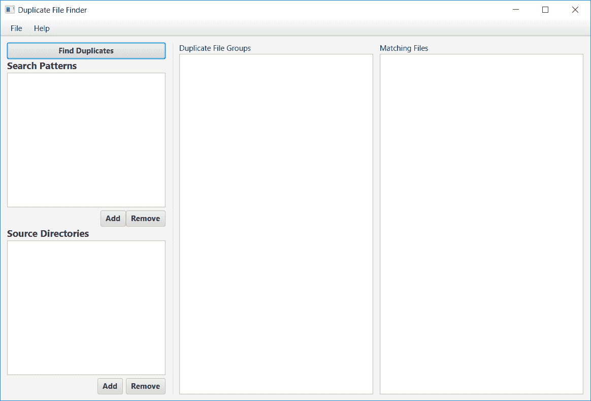

# 三、清理重复的文件

任何运行了一段时间的系统都会开始遭受硬盘混乱的困扰。例如，大型音乐和照片收藏尤其如此。除了最挑剔的文件被复制和移动外，我们最终在这里和那里各复制一份。但问题是，其中哪些是重复的，哪些不是？在本章中，我们将构建一个文件遍历实用程序，它将扫描一组目录以查找重复的文件。我们将能够指定是否应删除副本、**隔离**或只是报告。

在本章中，我们将介绍以下主题：

*   Java 平台模块系统
*   JavaNIO（新 I/O）文件 API
*   文件散列
*   **Java 持久化 API**（**JPA**）
*   新的 Java 日期/时间 API
*   编写命令行实用程序
*   更多 JavaFX

# 开始

这个应用程序虽然在概念上相当简单，但比我们在上一章中看到的要复杂一些，因为我们将同时拥有命令行和图形界面。经验丰富的程序员可能会立即看到需要在这两个接口之间共享代码，因为**干**（**不要重复自己**）是设计良好的系统的众多标志之一。为了促进代码共享，我们将引入第三个模块，它提供了一个库，其他两个项目可以使用该库。我们将这些模块称为`lib`、`cli`和`gui`。我们设置项目的第一步是创建各种 Maven POM 文件来描述项目的结构。父 POM 将如下所示：

```java
    <?xml version="1.0" encoding="UTF-8"?> 
    <project  
      xmlns:xsi="http://www.w3.org/2001/XMLSchema-instance"  
      xsi:schemaLocation="http://maven.apache.org/POM/4.0.0  
      http://maven.apache.org/xsd/maven-4.0.0.xsd"> 
      <modelVersion>4.0.0</modelVersion> 

     <groupId>com.steeplesoft.dupefind</groupId> 
     <artifactId>dupefind-master</artifactId> 
     <version>1.0-SNAPSHOT</version> 
     <packaging>pom</packaging> 

     <modules> 
       <module>lib</module> 
       <module>cli</module> 
       <module>gui</module> 
     </modules> 

     <name>Duplicate Finder - Master</name> 
    </project> 

```

这是一个相当典型的 POM 文件。我们将首先确定项目的父级，它允许我们继承许多设置、依赖项等，并避免在这个项目中重复它们。接下来，我们将为项目定义 Maven 坐标。请注意，我们没有为这个项目定义一个版本，允许父级的版本级联。这将允许我们在一个地方根据需要增加版本，并隐式更新所有子项目。

对于那些以前没有看过多模块项目的人来说，本 POM 的最后一个有趣部分是`modules`部分。这里唯一需要注意的是，对于那些不熟悉这个的人来说，每个`module`元素都引用一个目录名，它是当前目录的直接子目录，应该按照需要的顺序声明。在我们的例子中，CLI 和 GUI 都依赖于库，所以`lib`是第一位的。接下来，我们需要为每个模块创建 POM 文件。每一个都是 jar 类型的典型 POM，所以这里不需要包含它们。在每种情况下都会有不同的依赖关系，但我们将根据需要讨论这些依赖关系。

# 建设图书馆

这个项目的基础部分是 CLI 和 GUI 都将使用的库，因此从这里开始是有意义的。在设计库（其输入、输出和一般行为）时，它有助于理解我们到底希望这个系统做什么，所以让我们花一些时间来讨论功能需求。

正如简介中所述，我们希望能够在任意数量的目录中搜索重复文件。我们也希望能够限制搜索和比较，只有某些文件。如果我们没有指定要匹配的模式，那么我们希望检查每个文件。

最重要的部分是如何识别匹配项。当然，有很多方法可以做到这一点，但我们将采用以下方法：

*   标识具有相同文件名的文件。想想那些情况，你可能已经将图像从你的相机下载到你的计算机上进行安全保存，然后，稍后，也许你忘记了你已经下载了图像，所以你又将它们复制到了其他地方。显然，您只需要一个副本，但是临时目录中的文件（例如，`IMG_9615.JPG`）是否与图片备份目录中的文件相同？通过识别具有匹配名称的文件，我们可以对其进行测试以确保其正确性。
*   识别大小相同的文件。在这里比赛的可能性较小，但仍然有机会。例如，某些照片管理软件在从设备导入图像时，如果发现具有相同名称的文件，将修改第二个文件的文件名并同时存储，而不是停止导入并要求用户立即干预。这会导致大量文件，如`IMG_9615.JPG`和`IMG_9615-1.JPG`。此检查将有助于识别这些情况。
*   对于上面的每个匹配，为了确定文件是否实际匹配，我们将基于文件内容生成一个哈希。如果多个文件生成相同的哈希，则这些文件完全相同的可能性极高。我们将这些文件标记为潜在的重复文件。

这是一个非常简单的算法，应该非常有效，但我们确实有一个问题，尽管这个问题可能不会立即显现出来。如果您有大量文件，尤其是包含大量潜在副本的文件集，那么处理所有这些文件可能是一个非常漫长的过程，我们希望尽可能减少这一过程，这将导致我们产生一些非功能性需求：

*   程序应以并发方式处理文件，以便尽可能减少处理大型文件集所需的时间
*   这种并发性应该是有限制的，这样系统就不会因为处理请求而不知所措
*   考虑到可能存在大量数据，系统的设计必须避免耗尽所有可用 RAM 并导致系统不稳定

有了这些功能性和非功能性需求的适度列表，我们应该准备好开始了。与上一个应用程序一样，让我们从定义模块开始。在`src/main/java`中，我们将创建此`module-info.java`：

```java
    module com.steeplesoft.dupefind.lib { 
      exports com.steeplesoft.dupefind.lib; 
    } 

```

最初，编译器和 IDE 会抱怨`com.steeplesoft.dupefind.lib`包不存在，并且不会编译项目。现在还可以，因为我们现在将创建该包。

在功能需求中使用**并发**一词很可能会立即让人想到线程的概念。我们在[第 2 章](02.html)*管理 Java 进程*中介绍了线程的概念，因此如果您不熟悉线程，请在上一章中回顾该部分。

我们在这个项目中对线程的使用不同于上一个项目，因为我们将有一系列需要完成的工作，一旦完成，我们希望线程退出。我们还需要等待这些线程完成它们的工作，以便我们可以对其进行分析。在`java.util.concurrent`包中，JDK 提供了几个选项来实现这一点。

# 具有未来接口的并发 Java

`Future<V>`接口是一种更常见和流行的 API。`Future`是一种封装异步计算的方法。通常，`Future`实例由`ExecutorService`返回，我们将在后面讨论。调用代码一旦引用了`Future`，就可以继续处理其他任务，而`Future`在另一个线程的后台运行。当调用者准备好接收`Future`的结果时，调用者调用`Future.get()`。如果`Future`已完成其工作，调用将立即返回结果。但是，如果`Future`仍在工作，则对`get()`的调用将被阻止，直到`Future`完成。

然而，对于我们的使用，`Future`并不是最合适的选择。通过查看非功能性需求，我们看到了通过耗尽显式列出的可用内存来避免系统崩溃的愿望。正如我们稍后将看到的，实现这一点的方法是将数据存储在一个轻量级的磁盘数据库中，我们将实现这一点——同样，正如我们稍后将看到的那样，将文件信息存储在检索时，而不是收集数据，然后将其保存在后处理方法中。鉴于此，我们的`Future`不会归还任何东西。虽然有一种方法可以实现这一点（将`Future`定义为`Future<?>`并返回`null`，但这并不是最自然的方法。

也许最合适的方法是`ExecutorService`，即`Executor`，它提供了额外的功能，如前面讨论的创建`Future`和管理队列终止的能力。那么，`Executor`是什么？`Executor`是一种执行`Runnable`的机制，它比简单地调用`new Thread(runnable).start()`更健壮。接口本身是非常基本的，仅由`execute(Runnable)`方法组成，因此，仅从 Javadoc 来看，它的价值并不明显。然而，如果你看看`ExecutorService`，这是 JDK 提供的所有`Executor`实现的接口，以及各种`Executor`实现，它们的价值很容易变得更加明显。让我们现在进行一个快速的调查。

查看`Executors`类，我们可以看到五种不同类型的`Executor`实现：缓存线程池、固定大小的线程池、计划线程池、单线程执行器和工作窃取线程池。单线程`Executor`是唯一的例外，每个线程都可以直接实例化（`ThreadPoolExecutor`、`ScheduledThreadPoolExecutor`和`ForkJoinPool`，但 JDK 作者敦促用户在`Executors`类上使用方便的方法。也就是说，这些选项中的每一个都是什么？为什么您会选择其中一个？

*   `Executors.newCachedThreadPool()`：返回提供缓存线程池的`Executor`。当任务进入时，`Executor`将尝试寻找一个未使用的线程来执行任务。如果找不到，将创建一个新的`Thread`并开始工作。任务完成后，`Thread`返回到池中等待重用。大约 60 秒后，未使用的线程将被销毁并从池中移除，这会阻止资源被分配，也不会被释放。但是，必须注意这个`Executor`，因为线程池是无限的，这意味着在大量使用的情况下，系统可能会被活动线程淹没。
*   `Executors.newFixedThreadPool(int nThreads)`：此方法返回一个与前面提到的类似的`Executor`，除了线程池最多绑定到`nThreads`之外。
*   `Executors.newScheduledThreadPool(int corePoolSize)`：此`Executor`能够根据延迟和`TimeUnit`值，安排任务在可选的初始延迟后运行，然后定期运行。例如，参见`schedule(Runnable command, long delay, TimeUnit unit)`方法。
*   `Executors.newSingleThreadExecutor()`：此方法将返回一个`Executor`，将使用单个线程执行提交给它的任务。任务保证按照提交的顺序执行。
*   `Executors.newWorkStealingExecutor()`：此方法返回所谓的**偷工**`Executor`，类型为`ForkJoinPool`。提交到此`Executor`的任务的编写方式应确保能够将工作分配给其他工作线程，直到工作大小低于用户定义的阈值。

鉴于我们的非功能性需求，固定尺寸`ThreadPoolExecutor`似乎是最合适的。不过，我们需要支持的一个配置选项是强制为找到的每个文件生成哈希的选项。根据前面的算法，只有名称或大小重复的文件才会被散列。但是，用户可能希望对其文件规范进行更彻底的分析，并希望对每个文件强制进行哈希。我们将使用工作窃取（或 fork/join）池来实现这一点。

我们选择了线程处理方法，让我们来看看库的入口点，我们称之为“ORT T0”类。因为这是我们的切入点，它需要知道我们要搜索的地方和我们要搜索的内容。这将为我们提供实例变量`sourcePaths`和`patterns`：

```java
    private final Set<Path> sourcePaths = new HashSet<>(); 
    private final Set<String> patterns = new HashSet<>(); 

```

我们将变量声明为`private`，因为这是一个很好的面向对象实践。我们还声明了它们`final`，以帮助避免这些变量被赋予新值的细微错误，从而导致意外的数据丢失。一般来说，我发现在默认情况下将变量标记为`final`是一种很好的做法，以防止出现这种微妙的错误。对于这样一个类中的实例变量，只有当一个变量立即被赋值，或者在类的构造函数中被赋值时，才能声明它。

我们现在还想定义我们的`ExecutorService`：

```java
    private final ExecutorService es = 
      Executors.newFixedThreadPool(5); 

```

我们有点武断地选择将我们的线程池限制为五个线程，因为这似乎是一种公平的平衡，既为繁重的请求提供足够数量的工作线程，又不分配在大多数情况下可能不使用的大量线程。在我们的例子中，这可能是一个被夸大了的小问题，但肯定要记住。

接下来，我们需要提供一种方法来存储发现的任何重复项。考虑下面的代码行作为一个例子：

```java
    private final Map<String, List<FileInfo>> duplicates =  
      new HashMap<>(); 

```

稍后我们将看到更多细节，但现在，我们需要注意的是，这是由文件散列键控的`List<FileInfo>`对象的`Map`。

要注意的最后一个变量可能有点出乎意料——一个`EntityManagerFactory`。你可能会问自己，那是什么？`EntityManagerFactory`是与**Java 持久化 API**（**JPA**定义的持久化单元交互的接口，是 Java 企业版规范的一部分。幸运的是，尽管如此，该规范的编写方式要求它在**标准版**（**SE**这样的上下文中可用。

那么，我们用这样的 API 做什么呢？如果您回顾一下非功能性需求，我们已经指定要确保搜索重复文件不会耗尽系统上的可用内存。对于非常大的搜索，文件列表及其哈希值很可能会增长到有问题的大小。再加上生成哈希所需的内存，我们将在后面讨论，我们很可能会遇到内存不足的情况。因此，我们将使用 JPA 将搜索信息保存在一个简单的轻型数据库（SQLite）中，该数据库允许我们将数据保存到磁盘上。它还允许我们查询和过滤结果，比在内存结构中反复迭代更有效。

在使用这些 API 之前，我们需要更新模块描述符，让系统知道我们现在需要持久性模块。考虑下面的代码片段作为一个例子：

```java
    module dupefind.lib { 
      exports com.steeplesoft.dupefind.lib; 
      requires java.logging; 
      requires javax.persistence; 
    } 

```

我们已经向系统声明，我们需要`javax.persistence`和`java.logging`，我们将在稍后使用。正如我们在[第 2 章](02.html)中所讨论的，*在 Java*中管理流程，如果这些模块中的任何一个不存在，JVM 实例将无法启动。

也许模块定义中更重要的部分是`exports`子句。通过这一行（可以有 0 个或更多），我们告诉系统我们正在导出指定包中的所有类型。这一行将允许我们的 CLI 模块（我们将在后面介绍）使用该模块中的类（以及接口、枚举等，如果我们要添加的话）。如果一个类型的包没有`export`，则消费模块将无法看到该类型，我们稍后也将对此进行演示。

有了这个理解，让我们看看我们的构造函数：

```java
    public FileFinder() { 
      Map<String, String> props = new HashMap<>(); 
      props.put("javax.persistence.jdbc.url",  
       "jdbc:sqlite:" +  
       System.getProperty("user.home") +  
       File.separator +  
       ".dupfinder.db"); 
      factory = Persistence.createEntityManagerFactory 
       ("dupefinder", props); 
      purgeExistingFileInfo(); 
    } 

```

为了配置持久化单元，JPA 通常使用一个`persistence.xml`文件。不过，在我们的例子中，我们希望对数据库文件的存储位置有更多的控制。正如您在前面的代码中所看到的，我们正在使用`user.home`环境变量构建 JDBCURL。然后，我们使用 JPA 定义的键来指定 URL，将其存储在`Map`中。然后将该`Map`传递给`createEntityManagerFactory`方法，该方法覆盖`persistence.xml`中设置的任何内容。这允许我们将数据库放在适合用户操作系统的主目录中。

通过构建和配置我们的类，现在可以了解如何找到重复文件：

```java
    public void find() { 
      List<PathMatcher> matchers = patterns.stream() 
       .map(s -> !s.startsWith("**") ? "**/" + s : s) 
       .map(p -> FileSystems.getDefault() 
       .getPathMatcher("glob:" + p)) 
       .collect(Collectors.toList()); 

```

我们的第一步是根据用户指定的模式创建一个`PathMatcher`实例列表。`PathMatcher`实例是由试图匹配文件和路径的对象实现的功能接口。我们的实例是从`FileSystems`类中检索的。

在请求`PathMatcher`时，我们必须指定全局模式。从第一次调用`map()`可以看出，我们必须对用户指定的内容进行调整。通常，模式掩码被简单地指定为类似于`*.jpg`的内容。然而，像这样的模式掩码不会以用户期望的方式工作，因为它只会查看当前目录，而不会深入到任何子目录。为此，模式必须以`**/`作为前缀，我们在调用`map()`时就是这样做的。通过调整后的模式，我们从系统的默认`FileSystem`请求`PathMatcher`实例。请注意，我们将 matcher 模式指定为`"glob:" + p`，因为我们需要指出我们确实指定了一个`glob`文件。

我们的匹配者准备好了，我们就可以开始搜索了。我们通过以下代码实现这一点：

```java
    sourcePaths.stream() 
     .map(p -> new FindFileTask(p)) 
     .forEach(fft -> es.execute(fft)); 

```

使用`Stream`API，我们将每个源路径映射到一个 lambda，该 lambda 创建`FindFileTask`的一个实例，并提供它将搜索的源路径。这些`FileFindTask`实例中的每一个都将通过`execute()`方法传递给我们的`ExecutorService`。

`FileFindTask`方法是这部分过程的主要工具。它是一个`Runnable`，因为我们将把它提交给`ExecutorService`，但它也是一个`FileVisitor<Path>`，因为它将用于遍历文件树，这是我们通过`run()`方法完成的：

```java
    @Override 
    public void run() { 
      final EntityTransaction transaction = em.getTransaction(); 
      try { 
        transaction.begin(); 
        Files.walkFileTree(startDir, this); 
        transaction.commit(); 
      } catch (IOException ex) { 
        transaction.rollback(); 
      } 
    } 

```

因为我们将通过 JPA 将数据插入数据库，所以我们需要启动一个事务作为第一步。由于这是一个由`EntityManager`管理的应用程序，我们必须手动管理事务。我们获取对`try/catch`块外部的`EntityTransaction`实例的引用，以简化对它的引用。在`try`块中，我们启动事务，通过`Files.walkFileTree()`启动文件遍历，然后在流程成功时提交事务。如果失败——如果抛出了一个`Exception`，我们将回滚事务。

`FileVisitor`API 需要许多方法，其中大多数方法都不太有趣，但为了清晰起见，我们将展示它们：

```java
    @Override 
    public FileVisitResult preVisitDirectory(final Path dir,  
    final BasicFileAttributes attrs) throws IOException { 
      return Files.isReadable(dir) ?  
       FileVisitResult.CONTINUE : FileVisitResult.SKIP_SUBTREE; 
    } 

```

这里，我们告诉系统，如果目录是可读的，那么我们继续沿着该目录走。否则，我们跳过它：

```java
    @Override 
    public FileVisitResult visitFileFailed(final Path file,  
     final IOException exc) throws IOException { 
       return FileVisitResult.SKIP_SUBTREE; 
    } 

```

API 要求实现此方法，但我们对文件读取失败不太感兴趣，因此只返回一个跳过结果：

```java
    @Override 
    public FileVisitResult postVisitDirectory(final Path dir,  
     final IOException exc) throws IOException { 
       return FileVisitResult.CONTINUE; 
    } 

```

与前面的方法非常相似，此方法是必需的，但我们对此特定事件不感兴趣，因此我们向系统发送信号以继续：

```java
    @Override 
    public FileVisitResult visitFile(final Path file, final
     BasicFileAttributes attrs) throws IOException { 
       if (Files.isReadable(file) && isMatch(file)) { 
         addFile(file); 
       } 
       return FileVisitResult.CONTINUE; 
    } 

```

现在我们找到了一种我们感兴趣的方法。我们将检查以确保文件可读，然后检查是否匹配。如果是，则添加该文件。不管怎样，我们继续在树上行走。我们如何测试文件是否匹配？考虑下面的代码片段作为一个例子：

```java
    private boolean isMatch(final Path file) { 
      return matchers.isEmpty() ? true :  
       matchers.stream().anyMatch((m) -> m.matches(file)); 
    } 

```

我们迭代前面传递给类的`PathMatcher`实例列表。如果`List`为空，表示用户没有指定任何模式，则该方法的结果始终为`true`。但是，如果`List`中有项目，我们使用`List`上的`anyMatch()`方法，传递一个 lambda，将`Path`与`PathMatcher`实例进行检查。

添加文件非常简单：

```java
    private void addFile(Path file) throws IOException { 
      FileInfo info = new FileInfo(); 
      info.setFileName(file.getFileName().toString()); 
      info.setPath(file.toRealPath().toString()); 
      info.setSize(file.toFile().length()); 
      em.persist(info); 
    } 

```

我们创建一个`FileInfo`实例，设置属性，然后通过`em.persist()`将其持久化到数据库中。

我们的任务已经确定并提交给`ExecutorService`，我们需要坐下来等待。我们通过以下两个方法调用来实现这一点：

```java
    es.shutdown(); 
    es.awaitTermination(Integer.MAX_VALUE, TimeUnit.SECONDS); 

```

第一步是要求`ExecutorService`关闭。`shutdown()`方法将立即返回，但它将指示`ExecutorService`拒绝任何新任务，并在线程空闲时立即关闭线程。如果没有此步骤，线程将无限期地继续运行。接下来，我们将等待服务关闭。我们指定最大等待时间，以确保给任务时间完成。一旦此方法返回，我们就可以处理结果，这是通过以下`postProcessFiles()`方法完成的：

```java
    private void postProcessFiles() { 
      EntityManager em = factory.createEntityManager(); 
      List<FileInfo> files = getDuplicates(em, "fileName"); 

```

# 用 JPA 实现现代数据库访问

让我们在这里停一会儿。还记得我们讨论过的**Java 持久性 API**（**JPA**和数据库吗？这就是我们所看到的。使用 JPA，与数据库的交互通过`EntityManager`接口完成，我们从巧妙命名的`EntityManagerFactory`中检索该接口。需要注意的是，`EntityManager`实例不是线程安全的，因此它们不应该在线程之间共享。这就是为什么我们没有在构造函数中创建一个并传递它。当然，这是一个局部变量，所以我们不需要太多担心，直到，如果，我们决定将它作为参数传递给另一个方法，我们在这里做的。稍后我们将看到，所有事情都发生在同一个线程中，因此我们不必像现在的代码那样担心线程安全问题。

使用我们的`EntityManager`，我们调用`getDuplicates()`方法并传递管理器和字段名`fileName`。这就是该方法的外观：

```java
    private List<FileInfo> getDuplicates(EntityManager em,  
     String fieldName) { 
       List<FileInfo> files = em.createQuery( 
         DUPLICATE_SQL.replace("%FIELD%", fieldName), 
          FileInfo.class).getResultList(); 
       return files; 
    } 

```

这是 Java 持久性 API 的一个相当直接的用法——我们正在创建一个查询并告诉它我们想要的，然后得到一个`List`的`FileInfo`引用。`createQuery()`方法创建了一个`TypedQuery`对象，我们将在该对象上调用`getResultList()`来检索结果，这将为我们提供`List<FileInfo>`。

在进一步讨论之前，我们需要对 Java 持久性 API 有一个简短的入门介绍。JPA 被称为**对象关系映射**（**ORM**工具。它提供了一种面向对象、类型安全和独立于数据库的方式，用于在关系数据库中存储数据。规范/库允许应用程序作者使用具体的 Java 类定义他们的数据模型，然后保存和/或读取它们，而不考虑当前使用的数据库特有的机制。（开发人员并没有完全避开数据库问题——他或她是否应该完全避开数据库问题也是有争议的——但是这些问题被抽象到 JPA 接口后面后就大大减少了）。获取连接、创建 SQL、将其发布到服务器、处理结果等的过程都由库处理，因此可以将更多的精力放在应用程序的业务上，而不是放在管道上。它还允许数据库之间具有高度的可移植性，因此应用程序（或库）可以轻松地从一个系统移动到另一个系统，而只需进行最小的更改（通常仅限于配置更改）。

JPA 的核心是`Entity`，为应用程序建模数据的业务对象（或域模型，如果您愿意的话）。这在 Java 代码中表示为一个**普通的旧 Java 对象**（**POJO**），它用各种注释标记。对所有这些注释（或整个 API）的完整讨论超出了本书的范围，但我们将使用足够多的注释让您开始学习。

有了这个基本的解释，让我们来看看我们唯一的实体——OrthT0.类：

```java
    @Entity 
    public class FileInfo implements Serializable { 
      @GeneratedValue 
      @Id 
      private int id; 
      private String fileName; 
      private String path; 
      private long size; 
      private String hash; 
    } 

```

这个类有五个属性。唯一需要特别注意的是`id`。此属性保存每行的主键值，因此我们用`@Id`对其进行注释。我们还用`@GeneratedValue`注释该字段，以表明我们有一个简单的主键，希望系统为其生成一个值。此注释有两个属性：`strategy`和`generator`。策略的默认值为`GenerationType.AUTO`，我们很乐意在这里接受。其他选项包括`IDENTITY`、`SEQUENCE`和`TABLE`。在更复杂的使用中，您可能需要明确指定策略，该策略允许您微调密钥的生成方式（例如，起始编号、分配大小、序列或表的名称等）。通过选择`AUTO`，我们告诉 JPA 为我们的目标数据库选择合适的生成策略。如果指定的策略不是`AUTO`，还需要指定生成器的详细信息，使用`@SequenceGenerator`表示`SEQUENCE`，使用`@TableGenerator`表示`TABLE`。您还需要使用 generator 属性为`@GeneratedValue`注释提供生成器的 ID。我们使用默认值，因此不需要为此属性指定值。

接下来的四个字段是我们确定的需要捕获的数据片段。注意，如果我们不需要指定关于这些字段到数据库列的映射的任何特殊内容，则不需要任何注释。但是，如果我们想更改默认值，我们可以应用`@Column`注释并设置适当的属性，可以是`columnDefinition`（用于帮助生成列的 DDL）、`insertable`、`length`、`name`、`nullable`、`precision`、`scale`、`table`、`unique`和`updatable`中的一个或多个。同样，我们对默认设置感到满意。

JPA 还要求每个属性都有一个 getter 和 setter；规范的措辞似乎很奇怪，这导致了一些关于这是否是硬需求的模糊性，不同的 JPA 实现对这一点的处理方式也不同，但作为实践，提供两者肯定更安全。如果您需要一个只读属性，您可以使用 no setter 或简单的 no op 方法进行实验。我们没有在这里展示 getter 和 setter，因为它们没有什么有趣的地方。我们还省略了 IDE 生成的`equals()`和`hashCode()`方法。

为了帮助演示模块系统，我们将实体放在`com.steeplesoft.dupefind.lib.model`子包中。我们将稍微举手，然后宣布我们的 CLI 和 GUI 模块都将使用该类，因此我们需要更新模块定义，如下所示：

```java
    module dupefind.lib { 
      exports com.steeplesoft.dupefind.lib; 
      exports com.steeplesoft.dupefind.lib.model; 
      requires java.logging; 
      requires javax.persistence; 
    } 

```

这就是实体的全部内容，所以让我们将注意力转回应用程序逻辑。`createQuery()`电话值得讨论一下。通常，在使用 JPA 时，查询是用所谓的**JPAQL**（**Java 持久化 API 查询语言**编写的。它看起来很像 SQL，但有一种更面向对象的感觉。例如，如果我们想查询数据库中的每一条`FileInfo`记录，我们将使用以下查询：

```java
 SELECT f FROM FileInfo f 

```

我把关键字放在所有大写字母中，变量名放在小写字母中，实体名放在小写字母中。这主要是风格问题，但尽管大多数标识符不区分大小写，但 JPA 确实要求实体名称上的大小写与其表示的 Java 类的大小写匹配。您还必须为实体指定别名或标识变量，我们称之为`f`。

要获取特定的`FileInfo`记录，您可以指定一个`WHERE`子句，如下所示：

```java
 SELECT f from FileInfo f WHERE f.fileName = :name 

```

通过这个查询，我们可以像 SQL 一样过滤查询，并且，就像 SQL 一样，我们指定一个位置参数。参数可以是一个名称，就像我们在这里做的那样，也可以只是一个`?`。如果使用名称，则使用该名称在查询上设置参数值。如果使用问号，则必须在查询中使用其索引设置参数。对于小查询，这通常是好的，但是对于更大、更复杂的查询，我建议使用名称，这样您就不必管理索引值，因为这几乎可以保证在某个时候会导致错误。设置参数的方式如下所示：

```java
 Query query = em.createQuery( 
      "SELECT f from FileInfo f WHERE f.fileName = :name"); 
    query.setParameter("name", "test3.txt"); 
    query.getResultList().stream() //... 

```

话虽如此，让我们看看我们的查询：

```java
 SELECT f  
    FROM FileInfo f,  
      (SELECT s.%FIELD%  
        FROM FileInfo s  
        GROUP BY s.%FIELD%  
        HAVING (COUNT(s.%FIELD%) > 1)) g 
    WHERE f.%FIELD% = g.%FIELD%  
    AND f.%FIELD% IS NOT NULL  
    ORDER BY f.fileName, f.path 

```

这个查询比较复杂，所以让我们把它分解一下，看看发生了什么。首先，在我们的`SELECT`查询中，我们将只指定`f`，这是我们要查询的实体的标识变量。接下来，我们从一个常规表和一个临时表中进行选择，这是由`FROM`子句中的 subselect 定义的。我们为什么要这样做？我们需要识别所有具有重复值的行（`fileName`、`size`或`hash`。为此，我们使用了一个带有`COUNT`聚合函数`HAVING (COUNT(fieldName > 1))`的`HAVING`子句，实际上，它告诉我该字段多次出现的所有行。`HAVING`子句需要一个`GROUP BY`子句，完成后，所有具有重复值的行将聚合为一行。一旦我们有了那个行列表，我们就会将真实的（或物理的）表连接到那些结果中，以过滤我们的物理表。最后，我们过滤掉`WHERE`子句中的空字段，然后按`fileName`和`path`排序，这样我们就不必在 Java 代码中这样做了，这可能比数据库（专为此类操作设计的系统）的效率要低。

您还应该注意 SQL 中的`%FIELD%`属性。我们将对多个字段运行相同的查询，因此我们编写了一次查询，并在文本中放置了一个标记，我们将替换为所需的字段，这有点像一个*穷人的*模板。当然，有各种各样的方法可以做到这一点（你可能会有一种你觉得更好的方法），但这很简单，也很容易使用，所以在这种环境下是完全可以接受的。

我们还应该注意，一般来说，将 SQL 与值连接起来或者像我们现在这样进行字符串替换是一个非常糟糕的主意，但是我们的场景有点不同。如果我们接受用户输入并以这种方式将其插入 SQL，那么肯定会有 SQL 注入攻击的目标。然而，在我们这里的使用中，我们并没有从用户那里获取输入，所以这种方法应该是完全安全的。就数据库性能而言，这也不会有任何不利影响。虽然我们需要三种不同的硬解析（每个字段对应一种解析，我们将根据它进行过滤），但这与在源文件中硬编码查询没有什么不同。这两个问题，以及更多的问题，在编写查询时总是很好的考虑（以及为什么我说开发人员主要屏蔽了数据库的关注点）。

所有这些都让我们完成了第一步，即识别具有相同名称的所有文件。我们现在需要识别具有相同大小的文件，这可以使用以下代码来完成：

```java
    List<FileInfo> files = getDuplicates(em, "fileName"); 
    files.addAll(getDuplicates(em, "size")); 

```

在查找重复文件名的调用中，我们声明了一个局部变量`files`，以存储这些结果。在查找重复大小的文件时，我们调用相同的`getDuplicates()`方法，但字段名正确，只需通过`List.addAll()`方法将其添加到`files`。

我们现在有了所有可能的重复项的完整列表，因此我们需要为每个重复项生成哈希，以查看它们是否是真正的重复项。我们将通过这个循环来实现这一点：

```java
    em.getTransaction().begin(); 
    files.forEach(f -> calculateHash(f)); 
    em.getTransaction().commit(); 

```

简而言之，我们启动一个事务（因为我们将向数据库中插入数据），然后通过`List.forEach()`和调用`calculateHash(f)`的 lambda 循环每个可能的副本，然后传递`FileInfo`实例。一旦循环终止，我们提交事务以保存更改。

`calculateHash()`做什么？我们来看一看:

```java
    private void calculateHash(FileInfo file) { 
      try { 
        MessageDigest messageDigest =  
          MessageDigest.getInstance("SHA3-256"); 
        messageDigest.update(Files.readAllBytes( 
          Paths.get(file.getPath()))); 
        ByteArrayInputStream inputStream =  
          new ByteArrayInputStream(messageDigest.digest()); 
        String hash = IntStream.generate(inputStream::read) 
         .limit(inputStream.available()) 
         .mapToObj(i -> Integer.toHexString(i)) 
         .map(s -> ("00" + s).substring(s.length())) 
         .collect(Collectors.joining()); 
        file.setHash(hash); 
      } catch (NoSuchAlgorithmException | IOException ex) { 
        throw new RuntimeException(ex); 
      } 
    }  

```

这个简单的方法封装了读取文件内容和生成哈希所需的工作。它请求一个使用`SHA3-256`散列的`MessageDigest`实例，这是 Java 9 支持的四个新散列之一（另外三个是`SHA3-224`、`SHA3-384`和`SHA3-512`。许多开发人员的第一个想法是达到 MD-5 或 SHA-1，但这些不再被认为是可靠的。使用新的 SHA-3 应能保证避免任何误报。

就其工作方式而言，该方法的其余部分相当有趣。首先，它读取指定文件的所有字节并将它们传递给`MessageDigest.update()`，后者更新`MessageDigest`对象的内部状态，以提供我们想要的哈希值。接下来，我们创建一个`ByteArrayInputStream`来包装`messageDigest.digest()`的结果。

准备好散列后，我们根据这些字节生成一个字符串。我们将通过`IntStream.generate()`方法生成一个流，使用我们刚刚创建的`InputStream`作为源。我们将限制流生成到`inputStream`中可用的字节。对于每个字节，我们将通过`Integer.toHexString()`将其转换为字符串；然后用零到两个空格填充，这可以防止，例如，单个数字十六进制字符`E`和`F`被解释为`EF`；然后使用`Collections.joining()`将它们收集到一个字符串中。最后，我们获取该字符串值并更新`FileInfo`对象。

目光敏锐的人可能会注意到一些有趣的事情：我们调用`FileInfo.setHash()`来更改对象的值，但我们从未告诉系统保留这些更改。这是因为我们的`FileInfo`实例是一个托管实例，这意味着我们从 JPA 获得了它，可以说，JPA 一直在关注它。因为我们通过 JPA 检索到它，所以当我们对它的状态进行任何更改时，JPA 知道它需要持久化这些更改。当我们在调用方法中调用`em.getTransaction().commit()`时，JPA 会自动将这些更改保存到数据库中。

这种自动持久性有一个缺点：如果您通过 JPA 检索对象，然后将其传递到序列化对象的某种屏障上，例如，通过远程 EJB 接口，那么 JPA 实体被称为“分离”。要将其重新附加到持久性上下文，您需要调用`entityManager. merge()`，之后此行为将继续。除非您需要将持久性上下文的内存中状态与基础数据库同步，否则无需调用`entityManager.flush()`。

一旦我们计算了潜在重复项的散列（此时，假设它们有重复的 SHA-3 散列，它们几乎肯定是实际的重复项），我们就可以收集并报告它们了：

```java
    getDuplicates(em, "hash").forEach(f -> coalesceDuplicates(f)); 
    em.close(); 

```

我们调用相同的`getDuplicates()`方法来查找重复的散列，并将每个记录传递给`coalesceDuplicates()`方法，该方法将以适当的方式对这些记录进行分组，以便向我们的 CLI 或 GUI 层上游报告，或者向使用此功能的任何其他程序报告：

```java
    private void coalesceDuplicates(FileInfo f) { 
      String name = f.getFileName(); 
      List<FileInfo> dupes = duplicates.get(name); 
      if (dupes == null) { 
        dupes = new ArrayList<>(); 
        duplicates.put(name, dupes); 
      } 
      dupes.add(f); 
    } 

```

这种简单的方法遵循一种非常熟悉的模式：

1.  根据密钥，即文件名，从`Map`获取一个`List`。
2.  如果地图不存在，请创建它并将其添加到地图中。
3.  将`FileInfo`对象添加到列表中。

这就完成了重复文件检测。回到`find()`，我们将呼叫`factory.close()`做一个好的 JPA 公民，然后返回呼叫代码。有了这些，我们就可以构建 CLI 了。

# 构建命令行界面

与我们的新库交互的主要手段将是我们现在开发的命令行界面。不幸的是，JavaSDK 没有内置任何东西来帮助生成复杂的命令行实用程序。如果您曾经使用过 Java，您会看到以下方法签名：

```java
    public static void main(String[] args) 

```

显然，有一种*机制来处理命令行参数。`public static void main`方法是通过字符串数组传递的，这些数组表示用户在命令行上提供的参数，但这就到此为止了。要解析选项，开发人员需要迭代数组，分析每个条目。它可能看起来像这样：*

```java
    int i = 0; 
    while (i < args.length) { 
      if ("--source".equals(args[i])) { 
         System.out.println("--source = " + args[++i]); 
      } else if ("--target".equals(args[i])) { 
         System.out.println("--target = " + args[++i]); 
      } else if ("--force".equals(args[i])) { 
        System.out.println("--force set to true"); 
      } 
      i++; 
    } 

```

这是一个有效的解决方案，如果非常幼稚和容易出错的话。它假设`--source`和`--target`后面的任何内容都是该参数的值。如果用户键入`--source --target /foo`，则我们的处理器将中断。显然，我们需要更好的东西。幸运的是，我们有选择。

如果您要搜索 Java 命令行库，您将找到大量的命令行库（至少有 10 个）。我们的空间（和时间）在这里是有限的，所以我们显然不能讨论所有这些，所以我将提到我熟悉的前三个：Apache Commons CLI、Airline 和 Crest。每一家都与竞争对手有一些相当显著的差异。

Commons CLI 采用更具程序性的方法；可用选项的列表、名称、描述、是否有参数等等都是使用 Java 方法调用定义的。创建了`Options`列表后，将手动解析命令行参数。前面的例子可以改写如下：

```java
    public static void main(String[] args) throws ParseException { 
      Options options = new Options(); 
      options.addOption("s", "source", true, "The source"); 
      options.addOption("t", "target", true, "The target"); 
      options.addOption("f", "force", false, "Force"); 
      CommandLineParser parser = new DefaultParser(); 
      CommandLine cmd = parser.parse(options, args); 
      if (cmd.hasOption("source")) { 
        System.out.println("--source = " +  
          cmd.getOptionValue("source")); 
      } 
      if (cmd.hasOption("target")) { 
        System.out.println("--target = " +  
          cmd.getOptionValue("target")); 
      } 
      if (cmd.hasOption("force")) { 
         System.out.println("--force set to true"); 
      } 
    } 

```

它当然更冗长，但我认为它显然更健壮。我们可以为选项指定长名称和短名称（`--source`与`-s`），我们可以对其进行描述，最重要的是，我们可以得到内置验证，即选项具有其所需的值。虽然这是一个很大的改进，但我从经验中了解到，这里的程序方法在实践中变得单调乏味。让我们看看下一个候选人，看看票价如何。

Airline 是一个命令行库，最初是作为 GitHub 上空运组织的一部分编写的。经过一段时间的煎熬，它被罗布·维塞叉了出来，并被赋予了新的生命（[http://rvesse.github.io/airline](http://rvesse.github.io/airline) ）。Airline 的命令行定义方法更基于类——要定义命令实用程序，您需要声明一个新类，并用大量注释适当地标记它。让我们用 Airline 实现前面的简单命令行：

```java
    @Command(name = "copy", description = "Copy a file") 
    public class CopyCommand { 
      @Option(name = {"-s", "--source"}, description = "The source") 
      private String source; 
      @Option(name = {"-t", "--target"}, description = "The target") 
      private String target; 
      @Option(name = {"-f", "--force"}, description = "Force") 
      private boolean force = false; 
      public static void main(String[] args) { 
        SingleCommand<CopyCommand> parser =  
          SingleCommand.singleCommand(CopyCommand.class); 
        CopyCommand cmd = parser.parse(args); 
        cmd.run(); 
      } 

      private void run() { 
        System.out.println("--source = " + source); 
        System.out.println("--target = " + target); 
        if (force) { 
          System.out.println("--force set to true"); 
        } 
      } 
    } 

```

选项处理在代码大小方面继续增长，但我们也越来越清楚地了解支持哪些选项以及它们各自的含义。我们的命令是通过类声明上的`@Command`明确定义的。可能的选项被描述为`@Option`——带注释的实例变量，`run()`中的业务逻辑完全没有命令行解析代码。调用此方法时，所有数据都已提取，我们已准备好进行工作。这看起来很不错，但让我们看看我们最后的竞争者能提供什么。

Crest 是 TomEE 背后的公司 Tomitribe 提供的一个库，它是“所有 apachejavaeeweb 概要文件认证堆栈”，基于久负盛名的 tomcatservlet 容器。Crest 的命令定义方法是基于方法的，您可以为每个命令定义一个方法。它还使用注释，并提供开箱即用的 Bean 验证，以及可选的命令发现。那么，重新实现我们的简单命令可能如下所示：

```java
    public class Commands { 
      @Command 
      public void copy(@Option("source") String source, 
        @Option("target") String target, 
        @Option("force") @Default("false") boolean force) { 
          System.out.println("--source = " + source); 
          System.out.println("--target = " + target); 
          if (force) { 
            System.out.println("--force set to true"); 
          } 
       } 
    } 

```

这似乎是两全其美的：它既美观又简洁，而且仍然可以使命令的实际逻辑不受任何 CLI 解析的影响，除非您对方法上的注释感到烦恼。尽管实际的逻辑实现代码没有这些顾虑。虽然航空公司和佳洁士都提供了其他公司没有的东西，但佳洁士为我赢得了胜利，所以我们将使用它来实现我们的命令行界面。

选择了一个图书馆，然后让我们看看我们的 CLI 可能是什么样子。最重要的是，我们需要能够指定要搜索的路径。很可能，这些路径中的大多数文件都具有相同的扩展名，但情况并非总是如此，因此我们希望允许用户仅指定要匹配的文件模式（例如，`.jpg`。一些用户可能还想知道运行扫描需要多长时间，所以让我们加入一个开关来打开输出。最后，让我们添加一个开关，使流程更详细一些。

设置好功能需求后，让我们开始编写命令。Crest 在其命令声明中是基于方法的，但是我们仍然需要一个类来将我们的方法放入其中。如果此 CLI 更复杂（例如，如果您正在为应用程序服务器编写 CLI），则可以轻松地将多个 CLI 命令放在同一个类中，或将类似命令分组到多个不同的类中。你如何构建它们完全是你的问题，因为无论你选择什么，佳洁士都很满意。

我们将从 CLI 接口声明开始，如下所示：

```java
    public class DupeFinderCommands { 
      @Command 
      public void findDupes( 
        @Option("pattern") List<String> patterns, 
        @Option("path") List<String> paths, 
        @Option("verbose") @Default("false") boolean verbose, 
        @Option("show-timings")  
        @Default("false") boolean showTimings) { 

```

在讨论前面的代码之前，我们需要声明 Java 模块：

```java
    module dupefind.cli { 
      requires tomitribe.crest; 
      requires tomitribe.crest.api; 
    } 

```

我们定义了一个新模块，它的名称与我们库的模块名类似。我们还声明我们有两个 Crest 模块。

回到我们的源代码，我们有我们在功能需求中讨论的四个参数。注意，`patterns`和`paths`被定义为`List<String>`。当 Crest 解析命令行时，如果它找到其中一个的多个实例（例如，`--path=/path/one--path=/path/two`，它将收集所有这些值并将它们存储为`List`。另外，请注意，`verbose`和`showTimings`被定义为`boolean`，因此我们看到了一个很好的强制类型示例，Crest 将代表我们执行。我们也有这两个的默认值，所以当我们的方法执行时，我们肯定会有合理的、可预测的值。

该方法的业务逻辑非常简单。我们将预先处理详细标志，按如下方式打印所请求操作的摘要：

```java
    if (verbose) { 
      System.out.println("Scanning for duplicate files."); 
      System.out.println("Search paths:"); 
      paths.forEach(p -> System.out.println("\t" + p)); 
      System.out.println("Search patterns:"); 
      patterns.forEach(p -> System.out.println("\t" + p)); 
      System.out.println(); 
    } 

```

然后我们将执行实际工作。由于我们构建库所做的工作，重复搜索的所有逻辑都隐藏在 API 后面：

```java
    final Instant startTime = Instant.now(); 
    FileFinder ff = new FileFinder(); 
    patterns.forEach(p -> ff.addPattern(p)); 
    paths.forEach(p -> ff.addPath(p)); 

    ff.find(); 

    System.out.println("The following duplicates have been found:"); 
    final AtomicInteger group = new AtomicInteger(1); 
    ff.getDuplicates().forEach((name, list) -> { 
      System.out.printf("Group #%d:%n", group.getAndIncrement()); 
      list.forEach(fileInfo -> System.out.println("\t"  
        + fileInfo.getPath())); 
    }); 
    final Instant endTime = Instant.now(); 

```

这段代码一开始不会编译，因为我们没有告诉系统我们需要它。我们现在可以做到：

```java
    module dupefind.cli { 
      requires dupefind.lib; 
      requires tomitribe.crest; 
      requires tomitribe.crest.api; 
    } 

```

我们现在可以导入`FileFinder`类。首先，为了证明模块实际上正在做他们应该做的事情，让我们尝试导入一些没有导出的东西：`FindFileTask`。让我们创建一个简单的类：

```java
    import com.steeplesoft.dupefind.lib.model.FileInfo; 
    import com.steeplesoft.dupefind.lib.util.FindFileTask; 
    public class VisibilityTest { 
      public static void main(String[] args) { 
        FileInfo fi; 
        FindFileTask fft; 
      } 
    } 

```

如果我们试图编译它，Maven/javac 会大声抱怨错误消息如下：

```java
[ERROR] Failed to execute goal org.apache.maven.plugins:maven-compiler-plugin:3.6.1:compile (default-compile) on project cli: Compilation failure: Compilation failure:
[ERROR] /C:/Users/jason/src/steeplesoft/DupeFinder/cli/src/main/java/com/
steeplesoft/dupefind/cli/VisibilityTest.java:[9,54] 
com.steeplesoft.dupefind.lib.util.FindFileTask is not visible because 
package com.steeplesoft.dupefind.lib.util is not visible 
[ERROR] /C:/Users/jason/src/steeplesoft/DupeFinder/cli/src/main/java/com/
steeplesoft/dupefind/cli/VisibilityTest.java:[13,9] cannot find symbol 
[ERROR] symbol:   class FindFileTask 
[ERROR] location: class com.steeplesoft.dupefind.cli.VisibilityTest 

```

我们已经成功地隐藏了我们的实用程序类，同时公开了我们的公共 API。这种做法可能需要一段时间才能普及，但它在防止私有 API 结晶为伪公共 API 方面应该会产生奇迹。

回到任务中，我们创建一个`FileFinder`类的实例，使用`String.forEach`将`paths`和`patterns`传递给查找器，然后通过调用`find()`开始工作。工作本身是线程化的，但是我们已经公开了一个同步 API，所以我们在这里的调用将被阻止，直到工作完成。一旦它返回，我们就开始在屏幕上打印细节。由于`FindFiles.getDuplicates()`返回`Map<String, List<FileInfo>>`，我们在`Map`上调用`forEach()`对每个键进行迭代，然后在`List`上调用`forEach()`打印每个文件的信息。我们也使用一个`AtomicInteger`作为索引，因为变量必须是 final 或有效 final，所以我们只使用`AtomicInteger`的`final`实例。`BigInteger`可能会让经验丰富的开发人员想到，但它是不可变的，因此对于我们在这里的使用来说，这是一个糟糕的选择。

运行该命令的输出如下所示：

```java
The following duplicates have been found: 
Group #1: 
     C:\some\path\test\set1\file5.txt 
     C:\some\path\test\set2\file5.txt 
Group #2: 
     C:\some\path\test\set1\file11.txt 
     C:\some\path\test\set1\file11-1.txt 
     C:\some\path\test\set2\file11.txt 

```

接下来，我们处理`showTimings`。在前面的代码中我没有调用它，虽然我现在会调用，但我们在处理前后都会得到一个`Instant`实例（来自`java.time`中的 Java8 日期/时间库）。只有当`showTimings`为真时，我们才真正对他们做任何事情。执行此操作的代码如下所示：

```java
    if (showTimings) { 
      Duration duration = Duration.between(startTime, endTime); 
      long hours = duration.toHours(); 
      long minutes = duration.minusHours(hours).toMinutes(); 
      long seconds = duration.minusHours(hours) 
         .minusMinutes(minutes).toMillis() / 1000; 
      System.out.println(String.format( 
        "%nThe scan took %d hours, %d minutes, and %d seconds.%n",  
         hours, minutes, seconds)); 
    } 

```

用我们的两个`Instant`，我们得到一个`Duration`，然后开始计算小时、分钟和秒。希望这不会超过一个小时，但做好准备也无妨。就代码而言，这就是 CLI 的全部功能。Crest 为我们的命令行参数解析做了繁重的工作，给我们留下了一个简单明了的逻辑实现。

我们还需要添加最后一件事，那就是 CLI 帮助。如果最终用户能够了解如何使用我们的命令，这将非常有帮助。幸运的是，Crest 内置了支持来提供这些信息。要添加帮助信息，我们需要在与命令类相同的包中创建一个名为`OptionDescriptions.properties`的文件（请记住，因为我们使用的是 Maven，所以该文件应该位于`src/main/resource`下），如下所示：

```java
 path = Adds a path to be searched. Can be specified multiple times. 
    pattern = Adds a pattern to match against the file names (e.g.,
    "*.png").
    Can be specified multiple times. 
    show-timings= Show how long the scan took 
    verbose = Show summary of duplicate scan configuration 

```

这样做将产生如下输出：

```java
 $ java -jar cli-1.0-SNAPSHOT.jar help findDupes 
    Usage: findDupes [options] 
    Options: 
      --path=<String[]>    Adds a path to be searched. Can be
                            specified multiple times. 
      --pattern=<String[]> Adds a pattern to match against
                            the file names
                           (e.g., "*.png"). Can be specified
                             multiple times. 
      --show-timings       Show how long the scan took 
      --verbose            Show summary of duplicate scan configuration 

```

您可以尽可能地冗长，而不会使源代码变得不可读。

有了它，我们的 CLI 功能就完整了。在继续之前，我们需要了解 CLI 的一些构建问题，并了解 Crest 是如何适应的。显然，我们需要告诉 Maven 在哪里可以找到我们的 Crest 依赖项，如下代码所示：

```java
    <dependency> 
      <groupId>org.tomitribe</groupId> 
      <artifactId>tomitribe-crest</artifactId> 
      <version>${crest.version}</version> 
    </dependency> 

```

我们还需要告诉它在哪里可以找到我们的重复查找器库，如下所示：

```java
    <dependency> 
      <groupId>${project.groupId}</groupId> 
      <artifactId>lib</artifactId> 
      <version>${project.version}</version> 
    </dependency> 

```

注意`groupId`和`version`：由于我们的 CLI 和库模块是同一个父多模块构建的一部分，我们将`groupId`和`version`设置为父模块的构建，允许我们从单个位置进行管理，这使得更改组或切换版本更加简单。

更有趣的部分是 POM 的`build`部分。首先，让我们从`maven-compiler-plugin`开始。当我们瞄准 Java 9 时，`crest-maven-plugin`（稍后我们将介绍）目前似乎不喜欢为 Java 9 生成的类，因此我们指示编译器插件发出 Java 1.8 字节码：

```java
    <plugin> 
      <groupId>org.apache.maven.plugins</groupId> 
      <artifactId>maven-compiler-plugin</artifactId> 
      <configuration> 
         <source>1.8</source> 
         <target>1.8</target> 
      </configuration> 
    </plugin> 

```

接下来，我们需要设置`crest-maven-plugin`。要将命令类公开给 Crest，我们有两个选项：可以对类使用运行时扫描，也可以在构建时对命令进行 Crest 扫描。为了使该实用程序尽可能小，并尽可能减少启动时间，我们将选择后一种方法，因此我们需要在构建中添加另一个插件，如下所示：

```java
    <plugin> 
      <groupId>org.tomitribe</groupId> 
      <artifactId>crest-maven-plugin</artifactId> 
      <version>${crest.version}</version> 
      <executions> 
         <execution> 
            <goals> 
              <goal>descriptor</goal> 
            </goals> 
         </execution> 
      </executions> 
    </plugin> 

```

当这个插件运行时，它将生成一个名为`crest-commands.txt`的文件，Crest 将在启动时处理该文件以查找类。这可能不会在这里节省很多时间，但对于更大的项目来说，这绝对是需要记住的。

最后，我们不希望用户每次都要担心设置类路径（或模块路径！），因此我们将介绍 Maven Shade 插件，它将创建一个包含所有依赖项的胖 jar，可传递的或其他的：

```java
    <plugin> 
      <artifactId>maven-shade-plugin</artifactId> 
      <version>2.1</version> 
      <executions> 
         <execution> 
             <phase>package</phase> 
             <goals> 
                <goal>shade</goal> 
              </goals> 
              <configuration> 
                 <transformers> 
                   <transformer implementation= 
                     "org.apache.maven.plugins.shade.resource
                      .ManifestResourceTransformer"> 
                     <mainClass> 
                       org.tomitribe.crest.Main 
                     </mainClass> 
                   </transformer> 
                 </transformers> 
              </configuration> 
         </execution> 
      </executions> 
    </plugin> 

```

生成后，我们可以使用以下命令运行搜索：

```java
 java -jar target\cli-1.0-SNAPSHOT.jar findDupes \
      --path=../test/set1 --path=../test/set2 -pattern=*.txt 

```

显然，它仍然可以改进，所以我们希望通过脚本包装器（shell、batch 等）来实现这一点，但是 jar 的数量从 18 个左右减少到 1 个，所以这是一个很大的改进。

完成 CLI 后，让我们制作一个简单的 GUI，它也会使用我们的库。

# 构建图形用户界面

对于我们的 GUI，我们希望公开与命令行相同类型的功能，但是，显然，要有一个漂亮的图形界面。为此，我们将再次使用 JavaFX。我们将使用选择器对话框为用户提供选择要搜索的目录和添加搜索模式的字段的方法。一旦识别出重复项，我们将在列表中显示它们，供用户仔细阅读。将列出所有重复组，单击时，该组中的文件将显示在另一个列表中。用户可以在列表上单击鼠标右键，然后选择查看或删除文件。完成后，应用程序将如下所示：



让我们从创建项目开始。在 NetBeans 中，转到 File | New Project 并选择 Maven | JavaFX 应用程序。您可以随意命名，但我们使用了名称`Duplicate Finder - GUI`、`groupId`作为`com.steeplesoft.dupefind`、`artifactId`作为`gui`。

一旦你有了你的项目，你应该有两个类，`Main`和`FXMLController`以及`fxml/Scene.fxml`资源。这听起来可能是重复的，但在进一步讨论之前，我们需要按照如下方式设置 Java 模块：

```java
    module dupefind.gui { 
      requires dupefind.lib; 
      requires java.logging; 
      requires javafx.controls; 
      requires javafx.fxml; 
      requires java.desktop; 
    } 

```

然后，为了创建我们看到的界面，我们将使用`BorderPane`，在`top`部分添加`MenuBar`，如下所示：

```java
    <top> 
      <MenuBar BorderPane.alignment="CENTER"> 
        <menus> 
          <Menu mnemonicParsing="false"  
            onAction="#closeApplication" text="File"> 
            <items> 
              <MenuItem mnemonicParsing="false" text="Close" /> 
            </items> 
          </Menu> 
          <Menu mnemonicParsing="false" text="Help"> 
            <items> 
              <MenuItem mnemonicParsing="false"  
                onAction="#showAbout" text="About" /> 
            </items> 
          </Menu> 
        </menus> 
      </MenuBar> 
    </top> 

```

当您使用场景生成器添加`MenuBar`时，它会自动为您添加多个示例`Menu`条目。我们已经删除了不需要的条目，并将其余的绑定到控制器类中的 Java 方法。具体来说，`Close`菜单将调用`closeApplication()`，而`About`将调用`showAbout()`。这看起来就像书中前面看到的菜单标记，所以没有什么可谈的。

布局的其余部分稍微复杂一些。在`left`部分，我们有许多垂直堆叠的控件。JavaFX 有一个内置的容器，使之易于实现：`VBox`。稍后我们将讨论其内容，但其用法如下所示：

```java
    <VBox BorderPane.alignment="TOP_CENTER"> 
      <children> 
         <HBox... /> 
         <Separator ... /> 
         <Label .../> 
         <ListView ... /> 
         <HBox ... /> 
         <Label ... /> 
         <ListView... /> 
         <HBox ... /> 
      </children> 
      <padding> 
         <Insets bottom="10.0" left="10.0" right="10.0" 
           top="10.0" /> 
      </padding> 
    </VBox> 

```

这不是有效的 FXML，所以不要尝试复制和粘贴它。为了清楚起见，我省略了孩子们的细节。如您所见，`VBox`有许多子项，每个子项都将垂直堆叠，但正如我们从前面的屏幕截图中所看到的，有些子项我们希望水平排列。为了实现这一点，我们在需要的地方嵌套了一个`HBox`实例。它的标记看起来就像`VBox`。

FXML 的这一部分没有太多的兴趣，但有几点需要注意。我们希望用户界面的某些部分随着窗口的大小而收缩和增长，即`ListView`。默认情况下，每个组件的各种高度和宽度属性（最小值、最大值和首选值）将使用计算的大小，这大致意味着它们将根据渲染自身所需的大小而定，在大多数情况下，这很好。在我们的情况下，我们希望两个`ListView`实例在各自的容器中尽可能多地增长，在本例中，这就是我们前面讨论的`VBox`。为了实现这一点，我们需要修改两个`ListView`实例，如下所示：

```java
    <ListView fx:id="searchPatternsListView" VBox.vgrow="ALWAYS" /> 
    ... 
    <ListView fx:id="sourceDirsListView" VBox.vgrow="ALWAYS" /> 

```

当两个`ListView`实例都设置为`ALWAYS`增长时，它们将相互竞争可用空间，并最终共享空间。当然，可用空间取决于`VBox`实例的高度，以及容器中其他组件的计算高度。通过该属性集，我们可以增加或减少窗口的大小，并观察两个`ListView`实例的增长和收缩，而其他一切都保持不变。

对于用户界面的其余部分，我们将应用相同的策略来排列组件，但是，这次，我们将从一个`HBox`实例开始，并根据需要将其划分。我们有两个`ListView`实例，我们也希望用它们填充所有可用的空间，所以我们用与前两个相同的方法标记它们。每个`ListView`实例也有一个`Label`，所以我们将每个`Label`/`ListView`对包装在一个`VBox`实例中，以获得我们的垂直分布。在 pseudo FXML 中，如下所示：

```java
    <HBox> 
      <children> 
         <Separator orientation="VERTICAL"/> 
         <VBox HBox.hgrow="ALWAYS"> 
           <children> 
             <VBox VBox.vgrow="ALWAYS"> 
                <children> 
                  <Label ... /> 
                  <ListView ... VBox.vgrow="ALWAYS" /> 
                </children> 
             </VBox> 
           </children> 
         </VBox> 
         <VBox HBox.hgrow="ALWAYS"> 
           <children> 
             <Label ... /> 
             <ListView ... VBox.vgrow="ALWAYS" /> 
           </children> 
         </VBox> 
      </children> 
    </HBox> 

```

在用户界面的这一部分有一个有趣的项目，那就是我们前面讨论过的上下文菜单。要向控件添加上下文，可以在目标控件的 FXML 中嵌套一个`contextMenu`元素，如下所示：

```java
    <ListView fx:id="matchingFilesListView" VBox.vgrow="ALWAYS"> 
      <contextMenu> 
        <ContextMenu> 
          <items> 
            <MenuItem onAction="#openFiles" text="Open File(s)..." /> 
            <MenuItem onAction="#deleteSelectedFiles"  
              text="Delete File(s)..." /> 
           </items> 
         </ContextMenu> 
      </contextMenu> 
    </ListView> 

```

我们定义了一个包含两个`MenuItem`：`"Open File(s)..."`和`"Deleted File(s)..."`的内容菜单。我们还使用`onAction`属性为两个`MenuItem`指定了操作。我们将研究以下方法。

这标志着用户界面定义的结束，所以现在我们将注意力转向 Java 代码，在 Java 代码中，我们将完成用户界面的准备工作，并实现应用程序的逻辑。

虽然我们没有显示实现这一点的 FXML，但我们的 FXML 文件绑定到控制器类：`FXMLController`。当然，这个类可以被称为任何名称，但我们选择使用 IDE 生成的名称。在更大的应用程序中，在命名此类时需要更加小心。为了允许将用户界面组件注入到代码中，我们需要在类上声明实例变量，并用`@FXML`注释标记它们。一些例子包括：

```java
    @FXML 
    private ListView<String> dupeFileGroupListView; 
    @FXML 
    private ListView<FileInfo> matchingFilesListView; 
    @FXML 
    private Button addPattern; 
    @FXML 
    private Button removePattern; 

```

还有其他几个，但这应该足以证明这一概念。注意，我们没有声明一个普通的`ListView`，而是将实例参数化为`ListView<String>`和`ListView<FileInfo>`。我们知道这就是我们要放入控件的内容，因此指定 type 参数可以在编译时获得类型安全性的度量，但也可以避免每次与它们交互时都必须强制转换内容。

接下来，我们需要设置保存用户将输入的搜索路径和模式的集合。我们将使用`ObservableList`实例来实现这一点。记住，对于`ObservableList`实例，当`Observable`实例更新时，容器可以根据需要自动重新加载自身：

```java
    final private ObservableList<String> paths =  
      FXCollections.observableArrayList(); 
    final private ObservableList<String> patterns =  
      FXCollections.observableArrayList(); 

```

在`initialize()`方法中，我们可以开始将事物捆绑在一起。考虑下面的代码片段作为一个例子：

```java
    public void initialize(URL url, ResourceBundle rb) { 
      searchPatternsListView.setItems(patterns); 
      sourceDirsListView.setItems(paths); 

```

这里，我们将`ListView`实例与`ObservableList`实例相关联。现在，在更新这些列表的任何时候，用户界面都会立即反映出更改。

接下来，我们需要配置复制文件组`ListView`。从我们的库返回的数据是一个由重复散列键控的`List<FileInfo>`对象的`Map`。显然，我们不希望向用户显示哈希列表，因此，与 CLI 一样，我们希望用更友好的标签表示每组文件。为此，我们需要创建一个`CellFactory`，它将依次创建一个`ListCell`，负责渲染单元格。我们将按以下方式进行：

```java
    dupeFileGroupListView.setCellFactory( 
      (ListView<String> p) -> new ListCell<String>() { 
        @Override 
        public void updateItem(String string, boolean empty) { 
          super.updateItem(string, empty); 
          final int index = p.getItems().indexOf(string); 
          if (index > -1) { 
            setText("Group #" + (index + 1)); 
          } else { 
            setText(null); 
          } 
       } 
    }); 

```

虽然 lambdas 可能很棒，因为它们倾向于使代码更简洁，但它们也可以掩盖一些细节。在非 lambda 代码中，上面的 lambda 可能如下所示：

```java
    dupeFileGroupListView.setCellFactory(new  
      Callback<ListView<String>, ListCell<String>>() { 
        @Override 
        public ListCell<String> call(ListView<String> p) { 
          return new ListCell<String>() { 
            @Override 
            protected void updateItem(String t, boolean bln) { 
             super.updateItem(string, empty); 
              final int index = p.getItems().indexOf(string); 
              if (index > -1) { 
                setText("Group #" + (index + 1)); 
              } else { 
                setText(null); 
              } 
            } 
          }; 
        } 
    }); 

```

你当然会得到更多的细节，但它也更难阅读。这里包含这两者的要点有两个：一个是说明为什么 lambda 通常更好，另一个是说明所涉及的实际类型，这有助于 lambda 的理解。有了对我们腰带下的 lambda 的了解，该方法在做什么？

首先，我们称之为`super.updateItem()`，因为这仅仅是良好的实践。接下来，我们找到正在呈现的字符串的索引。API 给了我们字符串（因为它是一个`ListView<String>`，所以我们在`ObservableList<String>`中找到它的索引。如果找到了，我们将单元格的文本设置为`Group #`加上索引加 1（因为 Java 中的索引通常是基于零的）。如果找不到字符串（`ListView`正在呈现空单元格），我们将文本设置为 null 以确保字段为空。

接下来，我们需要在`matchingFilesListView`上执行类似的程序：

```java
    matchingFilesListView.getSelectionModel() 
      .setSelectionMode(SelectionMode.MULTIPLE); 
    matchingFilesListView.setCellFactory( 
      (ListView<FileInfo> p) -> new ListCell<FileInfo>() { 
        @Override 
        protected void updateItem(FileInfo fileInfo, boolean bln) { 
          super.updateItem(fileInfo, bln); 
          if (fileInfo != null) { 
             setText(fileInfo.getPath()); 
          } else { 
             setText(null); 
          } 
        } 
    }); 

```

这几乎是相同的，但有几个例外。首先，我们将`ListView`的选择模式设置为`MULTIPLE`。这将允许用户控制单击感兴趣的项目，或按住 shift 键单击一系列行。接下来，我们以相同的方式设置`CellFactory`。注意，由于`ListView`实例的参数化类型为`FileInfo`，因此`ListCell.updateItem()`的方法签名中的类型不同。

我们还有最后一个用户界面设置步骤。如果您回顾屏幕截图，您会注意到“查找重复项”按钮的宽度与`ListView`相同，而其他按钮的宽度刚好足以呈现其内容。我们通过将`Button`元素的宽度绑定到其容器的宽度来实现，这是一个`HBox`实例：

```java
    findFiles.prefWidthProperty().bind(findBox.widthProperty()); 

```

我们正在获取首选的宽度属性，它是一个`DoubleProperty`，并将其绑定到控件容器`findBox`的宽度属性（也是一个`DoubleProperty`。`DoubleProperty`是`Observable`实例，就像`ObservableListView`一样，所以我们告诉`findFiles`控件观察其容器的宽度属性，并在其他属性发生变化时相应地设置其自身的值。这让我们可以设置属性，然后忘记它。除非我们想打破这两个属性之间的绑定，否则我们再也不用考虑它了，我们当然不需要手动监视一个属性来更新作者。框架为我们做到了这一点。

现在，那些按钮怎么样？我们如何让他们做点什么？我们通过将`Button`元素的`onAction`属性设置为控制器中的一个方法来实现这一点：`#someMethod`转换为`Controller.someMethod(ActionEvent event)`。我们至少可以用两种方法中的一种来处理这个问题：我们可以为每个按钮创建一个单独的处理程序方法，或者，正如我们在这里所做的，我们可以创建一个，然后根据需要委托给另一个方法；两者都可以：

```java
    @FXML 
    private void handleButtonAction(ActionEvent event) { 
      if (event.getSource() instanceof Button) { 
        Button button = (Button) event.getSource(); 
        if (button.equals(addPattern)) { 
          addPattern(); 
        } else if (button.equals(removePattern)) { 
        // ... 

```

我们必须确保我们实际上得到了一个`Button`元素，然后我们将其转换并与注入的实例进行比较。每个按钮的实际处理程序如下所示：

```java
    private void addPattern() { 
      TextInputDialog dialog = new TextInputDialog("*.*"); 
      dialog.setTitle("Add a pattern"); 
      dialog.setHeaderText(null); 
      dialog.setContentText("Enter the pattern you wish to add:"); 

      dialog.showAndWait() 
      .filter(n -> n != null && !n.trim().isEmpty()) 
      .ifPresent(name -> patterns.add(name)); 
    } 

```

为了添加模式，我们创建了一个带有适当文本的`TextInputDialog`实例，然后调用`showAndWait()`。JavaFX8 中此方法的优点在于它返回`Optional<String>`。如果用户在对话框中输入文本，如果用户点击 OK，`Optional`将有内容。我们通过对`ifPresent()`的调用来确定这一点，并向其传递一个 lambda，该 lambda 将新模式添加到`ObservableList<String>`，从而自动更新用户界面。如果用户没有点击 OK，`Optional`将为空。如果用户没有输入任何文本（或输入了大量空格），则对`filter()`的调用将阻止 lambda 运行。

删除一个项是类似的，尽管我们可以在实用程序方法中隐藏一些细节，因为我们对该功能有两个需求。我们确保选择了某个内容，然后显示确认对话框，如果用户单击确定，则从`ObservableList<String>`中删除模式：

```java
    private void removePattern() { 
      if (searchPatternsListView.getSelectionModel() 
      .getSelectedIndex() > -1) { 
        showConfirmationDialog( 
          "Are you sure you want to remove this pattern?", 
          (() -> patterns.remove(searchPatternsListView 
          .getSelectionModel().getSelectedItem()))); 
      } 
    } 

```

让我们看一下这个方法：

```java
    protected void showConfirmationDialog(String message, 
     Runnable action) { 
      Alert alert = new Alert(Alert.AlertType.CONFIRMATION); 
      alert.setTitle("Confirmation"); 
      alert.setHeaderText(null); 
      alert.setContentText(message); 
      alert.showAndWait() 
      .filter(b -> b == ButtonType.OK) 
      .ifPresent(b -> action.run()); 
    } 

```

同样，这与前面的对话框非常相似，应该是不言自明的。这里有趣的部分是使用 lambda 作为方法参数，顺便说一下，它是一个高阶函数——这意味着它接受函数作为参数，返回函数作为结果，或者两者兼而有之。我们传入`Runnable`，因为我们想要一个不接受任何内容也不返回任何内容的 lambda，`Runnable`是一个符合该描述的`FunctionalInterface`。在我们显示对话框并获得用户的响应后，我们将仅过滤点击按钮为`OK`的响应，如果存在，我们将通过`action.run()`执行`Runnable`。我们必须指定`b -> action.run()`，因为`ifPresent()`接受`Consumer<? super ButtonType>`，所以我们创建了一个`b -> action.run()`，并忽略传入的值，这样我们就可以屏蔽调用代码的细节。

添加路径需要一个`DirectoryChooser`实例：

```java
    private void addPath() { 
        DirectoryChooser dc = new DirectoryChooser(); 
        dc.setTitle("Add Search Path"); 
        dc.setInitialDirectory(new File(lastDir)); 
        File dir = dc.showDialog(null); 
        if (dir != null) { 
            try { 
                lastDir = dir.getParent(); 
                paths.add(dir.getCanonicalPath()); 
            } catch (IOException ex) { 
                Logger.getLogger(FXMLController.class.getName()).log(
                  Level.SEVERE, null, ex); 
            } 
        } 
    } 

```

在创建`DirectoryChooser`实例时，为了方便用户，我们将初始目录设置为最后一个目录。当应用程序启动时，默认为用户的主目录，但一旦成功选择了一个目录，我们将`lastDir`设置为添加的目录的父目录，允许用户在需要输入多个路径时从他或她离开的地方开始。`DirectoryChooser.showDialog()`返回一个文件，所以我们得到它的规范路径并将其存储在路径中，这再次导致我们的用户界面自动更新。

删除路径与删除模式非常相似，如以下代码段所示：

```java
    private void removePath() { 
      showConfirmationDialog( 
        "Are you sure you want to remove this path?", 
        (() -> paths.remove(sourceDirsListView.getSelectionModel() 
        .getSelectedItem()))); 
    } 

```

相同的基本代码，只是不同的 lambda。兰姆达斯不是最酷的吗？

`findFiles()`按钮的处理程序有点不同，但看起来很像我们的 CLI 代码，您可以在这里看到：

```java
    private void findFiles() { 
       FileFinder ff = new FileFinder(); 
       patterns.forEach(p -> ff.addPattern(p)); 
       paths.forEach(p -> ff.addPath(p)); 

       ff.find(); 
       dupes = ff.getDuplicates(); 
       ObservableList<String> groups =  
         FXCollections.observableArrayList(dupes.keySet()); 

       dupeFileGroupListView.setItems(groups); 
    } 

```

我们创建`FileFinder`实例，使用 streams 和 lambda 设置路径和模式，然后开始搜索过程。完成后，我们通过`getDuplicates()`获取列表重复文件信息，然后使用地图的键创建一个新的`ObservableList<String>`实例，然后将其设置为`dupeFileGroupListView`。

现在我们需要添加逻辑来处理组列表上的鼠标点击，因此我们将 FXML 文件中`ListView`上的`onMouseClicked`属性设置为`#dupeGroupClicked`，如下代码块所示：

```java
    @FXML 
    public void dupeGroupClicked(MouseEvent event) { 
      int index = dupeFileGroupListView.getSelectionModel() 
       .getSelectedIndex(); 
      if (index > -1) { 
        String hash = dupeFileGroupListView.getSelectionModel() 
        .getSelectedItem(); 
        matchingFilesListView.getItems().clear(); 
        matchingFilesListView.getItems().addAll(dupes.get(hash)); 
      } 
    } 

```

当点击控件时，我们得到索引并确保它是非负的，以确保用户实际点击了某个东西。然后，我们通过从`ListView`中获取所选项目来获取组的哈希值。请记住，`ListView`可能会显示类似`Group #2`的内容，但该行的实际内容是散列。我们刚刚用了一个定制的`CellFactory`给它贴上了一个更漂亮的标签。使用散列，我们清除`matchingFilesListView`中的项目列表，然后获取控件的`ObservableList`并添加散列键控的`List`中的所有`FileInfo`对象。此外，由于`Observable`的强大功能，我们获得了自动用户界面更新。

我们还希望用户能够使用键盘导航重复组列表，以更新匹配的文件列表。我们通过在`ListView`上设置`onKeyPressed`属性来指向这个相当简单的方法：

```java
    @FXML 
    public void keyPressed(KeyEvent event) { 
      dupeGroupClicked(null); 
    } 

```

碰巧我们对这两种方法中的实际`Event`都不太感兴趣（它们从未实际使用过），所以我们可以天真地委托给前面讨论的鼠标点击方法。

我们还需要实现另外两个次要功能：查看匹配文件和删除匹配文件。

我们已经创建了上下文菜单和菜单项，所以我们需要做的就是实现如下处理程序方法：

```java
    @FXML 
    public void openFiles(ActionEvent event) { 
      matchingFilesListView.getSelectionModel().getSelectedItems() 
      .forEach(f -> { 
        try { 
          Desktop.getDesktop().open(new File(f.getPath())); 
        } catch (IOException ex) { 
          // ... 
        } 
      }); 
    } 

```

匹配文件列表允许多个选择，因此我们需要从选择模型中获取`List<FileInfo>`，而不是我们已经看到的单个对象。然后我们调用`forEach()`来处理条目。我们希望在用户在操作系统中配置的任何应用程序中打开该文件，以处理该文件类型。为此，我们使用 Java6 中引入的 AWT 类：`Desktop`。我们通过`getDesktop()`获取实例，然后调用`open()`，传递指向`FileInfo`目标的`File`。

删除文件与此类似：

```java
    @FXML 
    public void deleteSelectedFiles(ActionEvent event) { 
      final ObservableList<FileInfo> selectedFiles =  
        matchingFilesListView.getSelectionModel() 
        .getSelectedItems(); 
      if (selectedFiles.size() > 0) { 
        showConfirmationDialog( 
          "Are you sure you want to delete the selected files", 
           () -> selectedFiles.forEach(f -> { 
            if (Desktop.getDesktop() 
            .moveToTrash(new File(f.getPath()))) {                         
              matchingFilesListView.getItems() 
              .remove(f); 
              dupes.get(dupeFileGroupListView 
               .getSelectionModel() 
               .getSelectedItem()).remove(f); 
            } 
        })); 
      } 
    } 

```

与打开文件类似，我们获得所有选定的文件。如果至少有一个，我们通过`showConfirmationDialog()`确认用户的意图，并传入处理删除的 lambda。我们再次使用`Desktop`类执行实际的文件删除，将文件移动到文件系统提供的垃圾桶中，为用户提供安全的删除选项。如果文件被成功删除，我们将其条目从`ObservableList`中删除，并将其缓存副本文件`Map`中删除，这样，如果用户再次单击此文件组，则不会显示该文件。

# 总结

这样，我们的应用程序就完成了。那么，我们涵盖了什么？从项目描述来看，这似乎是一个非常简单的应用程序，但当我们开始分解需求并深入研究实现时，我们最终覆盖了很多领域——这一场景并不罕见。我们构建了另一个多模块 Maven 项目。我们介绍了 Java 并发，包括基本的`Thread`管理和`ExecutorService`使用，以及 Java 持久化 API，展示了基本的`@Entity`定义、`EntityManagerFactory/EntityManager`使用和 JPAQL 查询编写。我们讨论了使用`MessageDigest`类创建文件哈希，并演示了新的文件 I/O API，包括目录树遍历 API。我们还使用嵌套容器、“链接的”`ListView`实例和绑定属性在 JavaFX 中构建了更复杂的用户界面。

对于这样一个“简单”的项目来说，这是相当多的。我们的下一个项目也将相对简单，因为我们构建了一个命令行日期计算器，它将允许我们探索`java.time`包，并查看这个新的日期/时间 API 提供的一些内容。