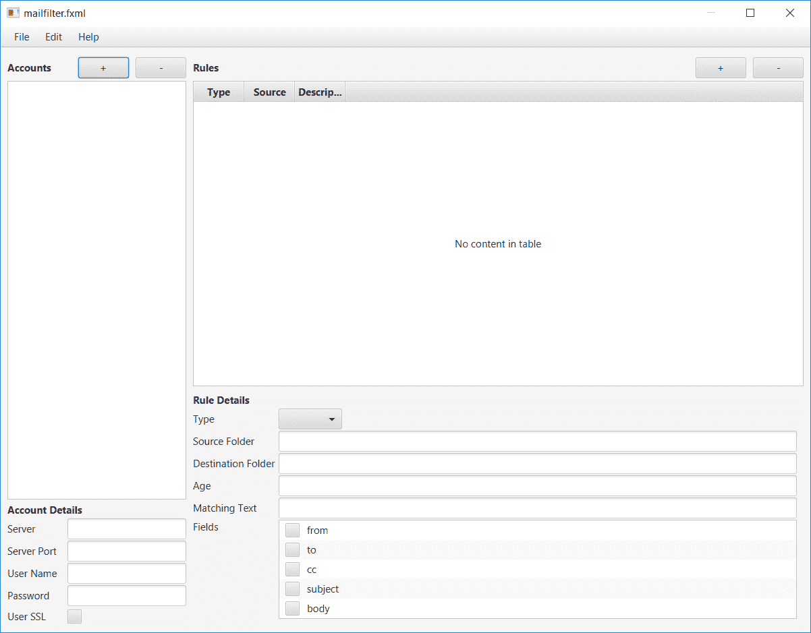
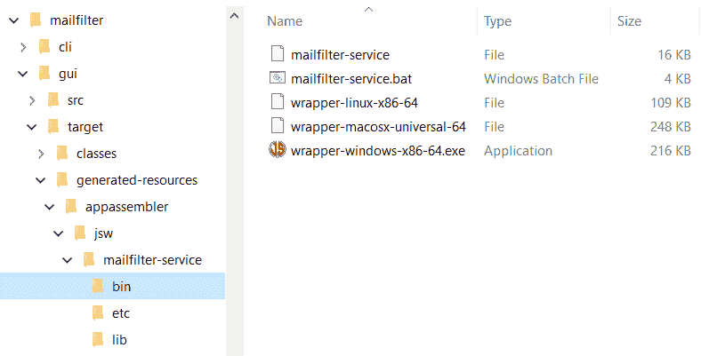

# 使用邮件过滤器管理电子邮件和垃圾邮件

在计算机科学中，我们有许多**定律**，其中最著名的也许是摩尔定律，它解决了计算机处理能力增加的速度。另一条法律，虽然不那么广为人知，当然也不那么严重，但被称为**扎文斯基定律**。杰米·扎温斯基（Jamie Zawinski）因在网景和 Mozilla 中的角色而闻名，他曾指出，“每个程序都试图扩展，直到它能够阅读邮件。那些不能扩展的程序会被那些能够扩展的程序所取代。”虽然扎温斯基定律不如摩尔定律准确，但它似乎确实有一个真理的环，不是吗？

本着扎温斯基定律的精神，即使不完全是字面意思，我们也将在本章中把注意力转向电子邮件，看看我们能否解决困扰我们所有人的问题：电子邮件混乱。从垃圾邮件到邮件列表帖子，这些信息不断出现，并且不断堆积。

我有几个电子邮件帐户。作为我们家的负责人——也是首席极客——我的任务常常是管理我们的数字资产，不管他们意识到与否。虽然一小块垃圾邮件看起来可能什么都不是，但随着时间的推移，它可能会成为一个实实在在的问题。在某一点上，它似乎太令人畏惧而难以处理。

在本章中，我们将考虑这个非常真实的问题，如果可能有些夸大的话，并尝试解决它。这将为我们提供一个使用标准 Java 电子邮件 API 的完美借口，恰当地称为 JavaMail。

在本章中，我们将介绍以下主题：

*   JavaMail API
*   电子邮件协议
*   更多的 JavaFX 工作（当然）
*   使用 Quartz 在 Java 中创建作业计划
*   安装用 Java 编写的特定于操作系统的服务

这可能是因为你的电子邮件收件箱控制得很好，在这种情况下，祝贺你！然而，尽管您的邮件客户机可能非常整洁或令人难以忍受，但在本章中，我们应该在探索小型但功能强大的 JavaMail API 和奇妙的电子邮件世界的同时，从中获得乐趣。

# 开始

在我们深入应用程序之前，让我们停下来，快速了解一下电子邮件中涉及的内容。作为一个无所不在的工具，对于大多数人来说，这似乎是一个相当不透明的话题，即使是那些有技术头脑的人，也可能倾向于阅读这样一本书。如果我们要使用它，理解它将非常有帮助，即使只是一点点。如果您对协议本身的细节不感兴趣，请跳到下一节。

# 简要回顾电子邮件协议的历史

像许多伟大的计算概念一样，**电子邮件**--**电子邮件**--最早出现在 20 世纪 60 年代，尽管当时看起来大不相同。电子邮件的完整历史，当然是一个巨大的技术好奇心，超出了我们在这里的目的范围，但我认为看看今天仍然相关的一些电子邮件协议会有所帮助，它们是用于发送邮件的 SMTP 协议，以及用于（从您的电子邮件客户端的角度）接收邮件的 POP3 和 IMAP 协议。（从技术上讲，服务器通过 SMTP 接收电子邮件，因为这是由**邮件传输代理**（**MTA**）使用的在线协议，用于将邮件从一台服务器传输到另一台服务器。我们非 MTA 作者从未想到过这一点，因此我们不必过度关注这一区别）。

我们将从发送电子邮件开始，因为本章的重点将更多地放在文件夹管理上。**SMTP**（**简单邮件传输协议**）创建于 1982 年，上一次更新于 1998 年，是发送电子邮件的主要协议。通常，在 SSL 和 TLS 安全连接的日子里，客户端通过端口 587 连接到 SMTP 服务器。服务器和客户端之间的对话（通常称为对话）可能如下所示（摘自[的 SMTP RFC）https://tools.ietf.org/html/rfc5321](https://tools.ietf.org/html/rfc5321) ：

```java
    S: 220 foo.com Simple Mail Transfer Service Ready
    C: EHLO bar.com
    S: 250-foo.com greets bar.com
    S: 250-8BITMIME
    S: 250-SIZE
    S: 250-DSN
    S: 250 HELP
    C: MAIL FROM:<Smith@bar.com>
    S: 250 OK
    C: RCPT TO:<Jones@foo.com>
    S: 250 OK
    C: RCPT TO:<Green@foo.com>
    S: 550 No such user here
    C: RCPT TO:<Brown@foo.com>
    S: 250 OK
    C: DATA
    S: 354 Start mail input; end with <CRLF>.<CRLF>
    C: Blah blah blah...
    C: ...etc. etc. etc.
    C: .
    S: 250 OK
    C: QUIT
    S: 221 foo.com Service closing transmission channel

```

在这个简单的例子中，客户机与服务器握手，然后说这封电子邮件来自谁，将发送给谁。请注意，电子邮件地址列出了两次，但重要的只是第一个实例（`MAIL FROM`和`RCPT TO`，后者对每个收件人重复）。第二组只是用于格式化和显示电子邮件。注意到这一特点，实际的电子邮件在`DATA`行之后，这应该是不言自明的。行上的一个单独的句点标志着消息的结束，此时，服务器确认收到消息，我们通过说`QUIT`来注销。这个例子看起来很简单，确实如此，但是如果邮件有附件，例如图像或 office 文档，或者电子邮件的格式是 HTML，事情就会变得复杂得多。

SMTP 用于发送邮件，而 POP3 协议用于检索邮件。POP 或邮局协议于 1984 年首次引入。现行标准 POP3 的大部分于 1988 年推出，1996 年发布了更新版本。POP3 服务器用于接收或下载客户机（如 Mozilla Thunderbird）发送的邮件。如果服务器允许，客户端可以在端口 110 上进行不安全连接，而安全连接通常在端口 995 上进行。

POP3 一度是用户下载邮件的主要协议。这是快速有效的，而且在一段时间内，这是我们唯一的选择。文件夹管理是必须在客户端完成的事情，因为 POP3 将邮箱视为一个大的存储，没有文件夹的概念（POP4 的目的是添加一些文件夹的概念，除其他外，但在提议的 RFC 上已有几年没有任何进展）。POP3（RC 1939，发现于[https://tools.ietf.org/html/rfc1939](https://tools.ietf.org/html/rfc1939) 给出了这个示例对话框：

```java
    S: <wait for connection on TCP port 110>
    C: <open connection>
    S:    +OK POP3 server ready <1896.697170952@dbc.mtview.ca.us>
    C:    APOP mrose c4c9334bac560ecc979e58001b3e22fb
    S:    +OK mrose's maildrop has 2 messages (320 octets)
    C:    STAT
    S:    +OK 2 320
    C:    LIST
    S:    +OK 2 messages (320 octets)
    S:    1 120
    S:    2 200
    S:    .
    C:    RETR 1
    S:    +OK 120 octets
    S:    <the POP3 server sends message 1>
    S:    .
    C:    DELE 1
    S:    +OK message 1 deleted
    C:    RETR 2
    S:    +OK 200 octets
    S:    <the POP3 server sends message 2>
    S:    .
    C:    DELE 2
    S:    +OK message 2 deleted
    C:    QUIT
    S:    +OK dewey POP3 server signing off (maildrop empty)
    C:  <close connection>
    S:  <wait for next connection>

```

请注意，客户端发送一个`RETR`命令来检索消息，然后发送一个`DELE`命令将其从服务器中删除。这似乎是大多数 POP3 客户端的标准/默认配置。

尽管如此，许多客户端可以配置为将邮件保留在服务器上若干天或永久，可能是在本地删除邮件时从服务器删除邮件。如果你曾经用这种方式管理过你的邮件，你会亲眼看到这会使电子邮件管理复杂化。

例如，在笔记本电脑出现之前，想象一下你在办公室和家里各有一台台式电脑。您希望能够在两个位置阅读您的电子邮件，因此您在两台计算机上都设置了 POP3 客户端。你把工作时间花在阅读、删除或者整理电子邮件上。当你回家时，比如说，你在工作中管理的 40 封邮件现在都放在你的收件箱里，用粗体大字表示一封未读的邮件。如果你想让这两个客户保持相似的状态，你现在必须在家里重复你的电子邮件管理任务。它冗长乏味且容易出错，这导致我们创建了 IMAP。

**IMAP**或**互联网接入消息协议**创建于 1986 年，其设计目标之一是允许多个客户端完全管理邮箱、文件夹和所有内容。多年来，它经历了几次修订，IMAP 4 修订版 1 是当前的标准。客户端连接到端口 143 上的 IMAP 服务器以进行不安全连接，而对于基于 SSL 到 TLS 的连接，客户端连接到端口 993。

IMAP 是一个更复杂的协议，因为它提供了比 POP 更强大的功能。来自 RFC（[https://tools.ietf.org/html/rfc3501](https://tools.ietf.org/html/rfc3501) ），我们可以查看以下示例对话框：

```java
    S:   * OK IMAP4rev1 Service Ready 
    C:   a001 login mrc secret 
    S:   a001 OK LOGIN completed 
    C:   a002 select inbox 
    S:   * 18 EXISTS 
    S:   * FLAGS (\Answered \Flagged \Deleted \Seen \Draft) 
    S:   * 2 RECENT 
    S:   * OK [UNSEEN 17] Message 17 is the first unseen message 
    S:   * OK [UIDVALIDITY 3857529045] UIDs valid 
    S:   a002 OK [READ-WRITE] SELECT completed 
    C:   a003 fetch 12 full 
    S:   * 12 FETCH (FLAGS (\Seen) INTERNALDATE 
         "17-Jul-1996 02:44:25 -0700" 
      RFC822.SIZE 4286 ENVELOPE ("Wed,
         17 Jul 1996 02:23:25 -0700 (PDT)" 
      "IMAP4rev1 WG mtg summary and minutes" 
      (("Terry Gray" NIL "gray" "cac.washington.edu")) 
      (("Terry Gray" NIL "gray" "cac.washington.edu")) 
      (("Terry Gray" NIL "gray" "cac.washington.edu")) 
      ((NIL NIL "imap" "cac.washington.edu")) 
      ((NIL NIL "minutes" "CNRI.Reston.VA.US") 
      ("John Klensin" NIL "KLENSIN" "MIT.EDU")) NIL NIL 
      "<B27397-0100000@cac.washington.edu>") 
       BODY ("TEXT" "PLAIN" ("CHARSET" "US-ASCII") NIL NIL "7BIT" 3028 
       92)) 
    S:    a003 OK FETCH completed 
    C:    a004 fetch 12 body[header] 
    S:    * 12 FETCH (BODY[HEADER] {342} 
    S:    Date: Wed, 17 Jul 1996 02:23:25 -0700 (PDT) 
    S:    From: Terry Gray <gray@cac.washington.edu> 
    S:    Subject: IMAP4rev1 WG mtg summary and minutes 
    S:    To: imap@cac.washington.edu 
    S:    cc: minutes@CNRI.Reston.VA.US, John Klensin <KLENSIN@MIT.EDU> 
    S:    Message-Id: <B27397-0100000@cac.washington.edu> 
    S:    MIME-Version: 1.0 
    S:    Content-Type: TEXT/PLAIN; CHARSET=US-ASCII 
    S: 
    S:    ) 
    S:    a004 OK FETCH completed 
    C:    a005 store 12 +flags \deleted 
    S:    * 12 FETCH (FLAGS (\Seen \Deleted)) 
    S:    a005 OK +FLAGS completed 
    C:    a006 logout 
    S:    * BYE IMAP4rev1 server terminating connection 
    S:    a006 OK LOGOUT completed 

```

正如您所看到的，这里有比我们的示例 POP3 对话框更多的细节。这也应该强调为什么我们使用像 JavaMail 这样的 API，而不是自己打开套接字直接与服务器通信。说到 JavaMail，让我们把注意力转向这个标准 API，看看它能为我们做些什么。

# JavaMail，电子邮件的标准 JavaAPI

JavaMail API 是一组抽象，提供了一种与协议和平台无关的电子邮件处理方式。虽然它是**Java 企业版**（**Java EE**的必需部分，但它是 Java SE 的附加库，这意味着您必须单独下载，我们将通过 POM 文件处理。

我们对本章应用程序的主要兴趣是消息管理，但我们将花一些时间来研究使用 API 发送电子邮件，这样，如果您发现自己需要这样做，您将有一些东西可以使用。

要开始发送邮件，我们需要获取 JavaMail`Session`。为此，我们需要设置一些属性，如下所示：

```java
    Properties props = new Properties(); 
    props.put("mail.smtps.host", "smtp.gmail.com"); 
    props.put("mail.smtps.auth", "true"); 
    props.put("mail.smtps.port", "465"); 
    props.put("mail.smtps.ssl.trust", "*"); 

```

我们将通过 Gmail 的服务器发送电子邮件，我们将通过 SSL 使用 SMTP。通过这个`Properties`实例，我们可以创建我们的`Session`实例，如下所示：

```java
    Session session = Session.getInstance(props,  
      new javax.mail.Authenticator() { 
      @Override 
      protected PasswordAuthentication getPasswordAuthentication() { 
        return new PasswordAuthentication(userName, password); 
      } 
    }); 

```

要登录到服务器，我们需要指定凭据，这是通过匿名`PasswordAuthentication`实例完成的。一旦我们有了`Session`实例，我们需要创建一个`Transport`，如下所示：

```java
    transport = session.getTransport("smtps"); 
      transport.connect(); 

```

注意，对于 protocol 参数，我们指定了`smtps`，它告诉 JavaMail 实现我们希望通过 SSL/TLS 发送 SMTP。我们现在准备使用以下代码块构建消息：

```java
    MimeMessage message = new MimeMessage(session); 
    message.setFrom("jason@steeplesoft.com"); 
    message.setRecipients(Message.RecipientType.TO, 
      "jason@steeplesoft.com"); 
    message.setSubject("JavaMail Example"); 

```

电子邮件是使用`MimeMessage`类建模的，因此我们使用`Session`实例创建该类的实例。我们设置了发件人和收件人地址以及主题。为了让事情变得更有趣，我们将使用`MimeBodyPart`附加一个文件，如下所示：

```java
    MimeBodyPart text = new MimeBodyPart(); 
    text.setText("This is some sample text"); 

    MimeBodyPart attachment = new MimeBodyPart(); 
    attachment.attachFile("src/test/resources/rules.json"); 

    Multipart multipart = new MimeMultipart(); 
    multipart.addBodyPart(text); 
    multipart.addBodyPart(attachment); 
    message.setContent(multipart); 

```

我们的消息将有两个部分，使用`MimeBodyPart`建模，一个是消息的正文，它是简单的文本，另一个是附件。在本例中，我们只是从测试中附加一个数据文件，稍后将看到。一旦我们定义了这些部分，我们使用`MimeMultipart`将它们组合起来，然后将其设置为消息的内容，现在我们可以使用`transport.sendMessage()`方法：

```java
    transport.sendMessage(message, new Address[] { 
      new InternetAddress("jason@steeplesoft.com")}); 
      if (transport != null) { 
        transport.close();   
      }  

```

在几秒钟内，您将看到以下电子邮件显示在您的收件箱中：


如果要发送带有文本替代项的 HTML 电子邮件，可以使用以下代码执行此操作：

```java
    MimeBodyPart text = new MimeBodyPart(); 
    text.setContent("This is some sample text", "text/plain");  
    MimeBodyPart html = new MimeBodyPart(); 
    html.setContent("<strong>This</strong> is some <em>sample</em>
      <span style=\"color: red\">text</span>", "text/html"); 
    Multipart multipart = new MimeMultipart("alternative"); 
    multipart.addBodyPart(text); 
    multipart.addBodyPart(html); 
    message.setContent(multipart); 
    transport.sendMessage(message, new Address[]{ 
      new InternetAddress("jason@example.com")});

```

注意，我们在每个`MimeBodyPart`上设置了内容，指定了 mime 类型，当我们创建`Multipart`时，我们将 alternative 作为`subtype`参数传递。如果不这样做，将导致一封电子邮件显示这两个部分，一个接一个，这肯定不是我们想要的。如果我们正确编写了应用程序，我们应该在电子邮件客户端中看到如下内容：


当然，你看不到黑色和白色的红色文本，但你可以看到粗体和斜体文本，这意味着显示的是 HTML 版本，而不是文本版本。任务完成了！

发送电子邮件非常有趣，但我们在这里学习文件夹和邮件管理，所以让我们把注意力转向这一点，我们将从设置项目开始。

# 构建 CLI

这个项目和其他项目一样，将是一个多模块的 Maven 项目。我们将为所有核心代码提供一个模块，为帮助管理规则而编写的 GUI 提供另一个模块。

为了创建项目，这次我们将做一些不同的事情。我们将使用 Maven 原型从命令行创建项目，而不是使用 NetBeans 创建项目，Maven 原型大致可以看作是项目模板，因此您可以看到它是如何以这种方式完成的：

```java
    $ mvn archetype:generate \ -DarchetypeGroupId=
      org.codehaus.mojo.archetypes \ -DarchetypeArtifactId=pom-root -
      DarchetypeVersion=RELEASE 
      ... 
    Define value for property 'groupId': com.steeplesoft.mailfilter 
    Define value for property 'artifactId': mailfilter-master 
    Define value for property 'version':  1.0-SNAPSHOT 
    Define value for property 'package':  com.steeplesoft.mailfilter 

```

一旦 Maven 完成处理，将目录更改为新项目的目录`mailfilter-master`。从这里，我们可以创建第一个项目 CLI：

```java
    $ mvn archetype:generate \ -DarchetypeGroupId=
      org.apache.maven.archetypes \ -DarchetypeArtifactId=
      maven-archetype-quickstart \ -DarchetypeVersion=RELEASE 
    Define value for property 'groupId': com.steeplesoft.mailfilter 
    Define value for property 'artifactId': mailfilter-cli 
    Define value for property 'version':  1.0-SNAPSHOT 
    Define value for property 'package':  com.steeplesoft.mailfilter 

```

这将在`mailfilter-master`下创建一个名为`mailfilter-cli`的新项目。我们现在可以在 NetBeans 中打开`mailfilter-cli`并开始工作。

我们需要做的第一件事是说明我们希望这个工具如何工作。在高层，我们希望能够为一个帐户指定任意数量的规则。这些规则允许我们根据特定标准移动或删除电子邮件，如发件人或电子邮件的年龄。为了简单起见，我们将把所有规则的范围限定到一个特定的帐户，并限制移动和删除操作。

让我们先看看该帐户的外观：

```java
    public class Account { 
      @NotBlank(message="A value must be specified for serverName") 
      private String serverName; 
      @NotNull(message = "A value must be specified for serverPort") 
      @Min(value = 0L, message = "The value must be positive") 
      private Integer serverPort = 0; 
      private boolean useSsl = true; 
      @NotBlank(message = "A value must be specified for userName") 
      private String userName; 
      @NotBlank(message = "A value must be specified for password") 
      private String password; 
      private List<Rule> rules; 

```

这基本上是一个非常简单的**POJO**（**普通旧 Java 对象**），具有六个属性：`serverName`、`serverPort`、`useSsl`、`userName`、`password`和`rules`。那些注释是什么？这些来自一个名为 Bean Validation 的库，该库提供了一些注释和支持代码，允许我们以声明方式表示变量可以保存的值的约束。以下是我们正在使用的注释及其含义：

*   `@NotBlank`：告知系统该值不能为空，也不能为空字符串（有效的是，`string != null && !string.trim() .equals("")`）
*   `@NotNull`：告知系统该值不能为空
*   `@Min`：描述最小有效值

当然，还有很多其他的，系统为您定义了一种定义自己的方法，因此它是一个非常简单但非常强大的验证输入的框架，这就引出了一个重要的问题：只有当 Bean 验证框架被要求这样做时，这些约束才会被验证。我们可以很容易地建立这些`Account`实例的大集合，每个字段都包含无效数据，JVM 对此非常满意。应用 Bean 验证约束的唯一方法是让它检查我们提供给它的实例。简而言之，强制执行这些约束的是 API，而不是 JVM。这可能看起来很明显，但有时候，直言不讳是值得的。

在继续之前，我们需要将 Bean 验证添加到我们的项目中。我们将使用参考实现：`Hibernate Validator`。在我们的项目中，我们还需要表达式语言 API 和一个实现。我们通过向`pom.xml`添加以下依赖项来获得所有这些：

```java
    <dependency> 
      <groupId>org.hibernate</groupId> 
      <artifactId>hibernate-validator</artifactId> 
      <version>5.3.4.Final</version> 
    </dependency> 
    <dependency> 
      <groupId>javax.el</groupId> 
      <artifactId>javax.el-api</artifactId> 
      <version>2.2.4</version> 
    </dependency> 
    <dependency> 
      <groupId>org.glassfish.web</groupId> 
      <artifactId>javax.el</artifactId> 
      <version>2.2.4</version> 
    </dependency> 

```

回到我们的模型，当然有一些 getter 和 setter，但它们不是很有趣。然而，有趣的是`equals()`和`hashCode()`的实现。Josh Bloch 在他的开创性著作《高效 Java》中说：

当您覆盖`equals`时，始终覆盖`hashCode`。

他的断言的要点是，如果不这样做，就会违反`equals()`契约，该契约规定 equals 对象必须具有 equals 散列，如果您的类用于任何基于散列的集合，例如`HashMap`，则可能会导致不正确和/或不可预测的行为。Bloch 然后列出了一些规则来创建一个好的`hashCode`实现，以及一个好的`equals`实现，但我的建议是：让 IDE 为您完成这项工作，这就是我们在`equals()`的以下代码块中所做的：

```java
    public boolean equals(Object obj) { 
      if (this == obj) { 
        return true; 
      } 
      if (obj == null) { 
        return false; 
      } 
      if (getClass() != obj.getClass()) { 
        return false; 
      } 
      final Account other = (Account) obj; 
      if (this.useSsl != other.useSsl) { 
        return false; 
      } 
      if (!Objects.equals(this.serverName, other.serverName)) { 
        return false; 
      } 
      if (!Objects.equals(this.userName, other.userName)) { 
        return false; 
      } 
      if (!Objects.equals(this.password, other.password)) { 
        return false; 
      } 
      if (!Objects.equals(this.serverPort, other.serverPort)) { 
        return false; 
      } 
      if (!Objects.equals(this.rules, other.rules)) { 
         return false; 
      } 
      return true; 
    } 

```

我们在这里为`hashCode()`做了同样的工作：

```java
    public int hashCode() { 
      int hash = 5; 
      hash = 59 * hash + Objects.hashCode(this.serverName); 
      hash = 59 * hash + Objects.hashCode(this.serverPort); 
      hash = 59 * hash + (this.useSsl ? 1 : 0); 
      hash = 59 * hash + Objects.hashCode(this.userName); 
      hash = 59 * hash + Objects.hashCode(this.password); 
      hash = 59 * hash + Objects.hashCode(this.rules); 
      return hash; 
    } 

```

请注意，在`equals()`中测试的每一种方法也在`hashCode()`中使用。实现遵循这一规则是绝对重要的，否则最终会导致方法无法正常工作。在生成方法时，您的 IDE 可能会对此有所帮助，但您必须确保确实使用了相同的字段列表，当然，如果您修改了其中一个方法，则必须相应地更新另一个方法。

我们现在有了`Account`，那么`Rule`看起来像什么？让我们来看看下面的代码：

```java
    @ValidRule 
    public class Rule { 
      @NotNull 
      private RuleType type = RuleType.MOVE; 
      @NotBlank(message = "Rules must specify a source folder.") 
      private String sourceFolder = "INBOX"; 
      private String destFolder; 
      private Set<String> fields = new HashSet<>(); 
      private String matchingText; 
      @Min(value = 1L, message = "The age must be greater than 0.") 
      private Integer olderThan; 

```

这个类的验证是双重的。首先，我们可以看到在`Account`上看到的相同字段级约束：`type`不能为空，`sourceFolder`不能为空，`olderThan`必须至少为 1。虽然您可能不知道它是什么，但我们在`@ValidRule`中也有一个类级别的约束。

字段级约束只能看到已应用约束的字段。这意味着，如果字段的有效值取决于其他字段的值，则这些类型的约束不合适。然而，类级规则允许我们在进行验证时查看整个对象，因此我们可以在验证另一个字段时查看一个字段的值。这也意味着我们需要更多的代码，因此我们将从以下注释开始：

```java
    @Target({ElementType.TYPE, ElementType.ANNOTATION_TYPE}) 
    @Retention(RetentionPolicy.RUNTIME) 
    @Constraint(validatedBy = ValidRuleValidator.class) 
    @Documented 
    public @interface ValidRule { 
      String message() default "Validation errors"; 
      Class<?>[] groups() default {}; 
      Class<? extends Payload>[] payload() default {}; 
    } 

```

如果您以前从未见过注释的源代码，那么这是一个相当典型的示例。我们没有将对象的类型声明为`class`或`interface`，而是使用了`@interface`，这是一个微妙但重要的区别。注释的字段也有点不同，因为没有可见性修饰符，并且类型不能是基本类型。注意`default`关键字的用法。

注释本身也有注释，如下所示：

*   `@Target`：这限制了此注释可应用于的元素类型；在本例中，将显示类型和其他注释。
*   `@Retention`：这指示编译器是否应该将注释写入类文件，并在运行时使其可用。
*   `@Constraint`：这是一个 Bean 验证注释，它将我们的注释标识为一个新的约束类型。此注释的值告诉系统`ConstraintValidator`如何处理此约束的验证逻辑。
*   `@Documented`：这表示任何类型上存在此注释都应被视为该类型的公共 API 的一部分。

我们处理这个新约束的`ConstraintValidator`实现有点复杂。我们这样声明类：

```java
    public class ValidRuleValidator implements  
      ConstraintValidator<ValidRule, Object> { 

```

Bean 验证为约束验证提供了一个参数化接口，该接口接受约束的类型和验证器中的逻辑所应用的对象类型。这允许您为不同的对象类型编写给定约束的不同验证器。在我们的例子中，我们可以指定`Rule`而不是`Object`。如果我们这样做的话，任何时候`Rule`以外的东西被`@ValidRule`注释并验证实例时，调用代码都会看到抛出异常。正如您将看到的，我们所做的是验证带注释的类型，特别是在需要时添加约束冲突。

接口要求我们也实现这个方法，但是我们这里没有工作要做，所以它有一个空的方法体，如下所示：

```java
    @Override 
    public void initialize(ValidRule constraintAnnotation) { 
    } 

```

有趣的方法称为`isValid()`。它有点长，所以让我们一步一步地看一遍：

```java
    public boolean isValid(Object value,  
      ConstraintValidatorContext ctx) { 
        if (value == null) { 
          return true; 
        } 

```

第一步是确保`value`不为空。我们有两种选择：如果为空则返回`true`，表示没有问题；或者返回`false`，表示有问题。我们的选择取决于我们希望应用程序如何运行。这两种方法都有合理的理由，但将空`Rule`视为无效似乎是有意义的，因此让我们将其主体更改为如下所示：

```java
    ctx.disableDefaultConstraintViolation(); 
    ctx.buildConstraintViolationWithTemplate( 
      "Null values are not considered valid Rules") 
      .addConstraintViolation(); 
    return false; 

```

我们使用指定的消息构建`ConstraintViolation`，将其添加到`ConstraintValidatorContext`、`ctx`中，并返回 false 以指示失败。

接下来，我们要确保我们正在处理一个`Rule`的实例：

```java
    if (!(value instanceof Rule)) { 
      ctx.disableDefaultConstraintViolation(); 
      ctx.buildConstraintViolationWithTemplate( 
        "Constraint valid only on instances of Rule.") 
      .addConstraintViolation(); 
      return false; 
    } 

```

一旦我们确定有一个非空的`Rule`实例，我们就可以进入验证逻辑的核心：

```java
    boolean valid = true; 
    Rule rule = (Rule) value; 
    if (rule.getType() == RuleType.MOVE) { 
      valid &= validateNotBlank(ctx, rule, rule.getDestFolder(),  
      "A destination folder must be specified."); 
    } 

```

我们希望能够收集所有违规行为，因此我们创建一个`boolean`变量来保存当前状态，然后将该值转换为`Rule`，以使处理实例更自然。在我们的第一个测试中，我们确保，如果`Rule`的类型是`RuleType. MOVE`，那么它指定了一个目标文件夹。我们使用这种私有方法来实现这一点：

```java
    private boolean validateNotBlank(ConstraintValidatorContext ctx,  
      String value, String message) { 
      if (isBlank(value)) { 
        ctx.disableDefaultConstraintViolation(); 
        ctx.buildConstraintViolationWithTemplate(message) 
        .addConstraintViolation(); 
        return false; 
      } 
      return true; 
   } 

```

如果`value`为空，我们使用指定的消息添加`ConstraintViolation`，如前所述，并返回`false`。如果不为空，我们返回`true`。然后将该值与`valid`进行 AND 运算，以更新`Rule`验证的当前状态。

`isBlank()`方法非常简单：

```java
    private boolean isBlank(String value) { 
      return (value == null || (value.trim().isEmpty())); 
    } 

```

这是一个非常常见的检查，实际上在逻辑上与 Bean Validation 的`@NotBlank`后面的验证器相同。

我们接下来的两个测试是相关的。逻辑是这样的：规则必须指定要匹配的文本或以天为单位的最大年龄。对此的测试如下所示：

```java
     if (!isBlank(rule.getMatchingText())) { 
       valid &= validateFields(ctx, rule); 
     } else if (rule.getOlderThan() == null) { 
       ctx.disableDefaultConstraintViolation(); 
       ctx.buildConstraintViolationWithTemplate( 
         "Either matchingText or olderThan must be specified.") 
       .addConstraintViolation(); 
       valid = false; 
     } 

```

如果`Rule`指定了`matchingText`，则验证`fields`设置是否正确。如果既没有设置`matchingText`也没有设置`olderThan`，那么我们会添加一条具有这种效果的消息`ConstraintViolation`，并将`valid`设置为 false。我们的`fields`验证如下所示：

```java
    private boolean validateFields(ConstraintValidatorContext ctx, Rule rule) { 
      if (rule.getFields() == null || rule.getFields().isEmpty()) { 
        ctx.disableDefaultConstraintViolation(); 
        ctx.buildConstraintViolationWithTemplate( 
          "Rules which specify a matching text must specify the field(s)
            to match on.") 
          .addConstraintViolation(); 
        return false; 
      } 
      return true; 
    } 

```

我们确保`fields`既不是空的也不是空的。我们在这里不对字段`Set`的实际内容进行任何验证，尽管我们当然可以。

我们现在可能已经编写了第一个自定义验证。你的反应可能是“哇！这是一个‘简单’验证的大量代码”，你是对的。在你把婴儿和洗澡水一起扔掉之前，请想一想：Bean 验证的价值在于，你可以将潜在的复杂验证逻辑隐藏在一个非常小的注释后面。然后，只要将约束注释放置在适当的位置，就可以在任何地方重用此逻辑。逻辑在一个地方表达，在一个地方维护，但在许多地方使用，都非常整洁和简洁。

所以，是的，这是大量的代码，但是您只需要编写一次，约束的使用者永远不需要看到它。除了你通常写的内容之外，实际上没有多少额外的工作，但这是由你决定的，这额外的工作是否值得花时间。

现在我们已经快速查看了定制 Bean 验证约束，让我们回到我们的数据模型。最后要展示的是`RuleType`枚举：

```java
    public enum RuleType { 
      DELETE, MOVE; 
      public static RuleType getRuleType(String type) { 
        switch(type.toLowerCase()) { 
          case "delete" : return DELETE; 
          case "move" : return MOVE; 
          default : throw new IllegalArgumentException( 
            "Invalid rule type specified: " + type); 
        } 
      } 
    } 

```

这是一个基本的 Java`enum`，有两个可能的值，`DELETE`和`MOVE`，但我们还添加了一个 helper 方法来为给定的字符串表示返回适当的`RuleType`实例。例如，当我们从 JSON 中解压`Rule`时，这将帮助我们。

定义了数据模型之后，我们就可以开始为实用程序本身编写代码了。虽然 Maven 模块被称为`mailfilter-cli`，但我们不会像前面章节中看到的那样，在这里关注健壮的命令行界面。相反，我们将提供一个与命令行的非常基本的交互，留下一个操作系统服务，我们将在后面介绍，作为首选的使用方式。

正是在这一点上，我们将开始使用 JavaMail API，因此我们需要确保我们的项目设置正确，因此我们在`pom.xml`中添加以下代码行：

```java
    <dependency> 
      <groupId>com.sun.mail</groupId> 
      <artifactId>javax.mail</artifactId> 
      <version>1.5.6</version> 
    </dependency> 

```

在我们的 IDE 中，我们创建了一个新类`MailFilter`，并创建了熟悉的`public static void main`方法，如下所示：

```java
    public static void main(String... args) { 
      try { 
        final MailFilter mailFilter =  
          new MailFilter(args.length > 0 ? args[1] : null); 
        mailFilter.run(); 
        System.out.println("\tDeleted count: "  
          + mailFilter.getDeleted()); 
        System.out.println("\tMove count:    "  
          + mailFilter.getMoved()); 
      } catch (Exception e) { 
        System.err.println(e.getLocalizedMessage()); 
      } 
    } 

```

NetBeans 支持许多代码模板。这里感兴趣的模板是`psvm`，它将创建一个`public static void main`方法。要使用它，请确保您位于类定义内的空行上（以避免奇怪的格式问题），然后键入`psvm`并按 tab 键。NetBeans 为您创建方法，并将光标放在空方法的第一行，以便您开始编码。通过导航到工具|选项|编辑器|代码模板，您可以找到数十个其他有用的代码模板。你甚至可以定义你自己的。

在我们的`main()`方法中，我们创建一个`MainFilter`实例，传入任何可能已经在命令行上指定的规则定义文件，并调用`run()`：

```java
    public void run() { 
      try { 
        AccountService service = new AccountService(fileName); 

        for (Account account : service.getAccounts()) { 
          AccountProcessor processor =  
            new AccountProcessor(account); 
          processor.process(); 
          deleted += processor.getDeleteCount(); 
          moved += processor.getMoveCount(); 
        } 
      } catch (MessagingException ex) { 
        Logger.getLogger(MailFilter.class.getName()) 
        .log(Level.SEVERE, null, ex); 
      } 
    } 

```

我们首先创建一个`AccountService`实例，它包含了读取和写入`Rules`文件的详细信息。对于指定文件中的每个帐户，我们创建`AccountProcessor`，它封装了规则处理逻辑。

`AccountService`实例听起来可能不太令人兴奋，但在这个公共界面背后隐藏着一些非常有趣的技术细节。我们看到了 Bean 验证约束的实际检查位置，还看到了使用 jacksonjson 库读取和写入`Rules`文件。在开始使用 Jackson 之前，我们需要将其添加到我们的项目中，我们通过添加以下内容`pom.xml`：

```java
    <dependency> 
      <groupId>com.fasterxml.jackson.core</groupId> 
      <artifactId>jackson-databind</artifactId> 
      <version>2.8.5</version> 
    </dependency> 

```

您应该一如既往地确保您使用的是库的最新版本。

这不是一个很大的类，但是这里只有三种方法值得关注。我们将从最基本的一个开始，如下所示：

```java
    private File getRulesFile(final String fileName) { 
      final File file = new File(fileName != null ? fileName 
        : System.getProperty("user.home") + File.separatorChar 
        + ".mailfilter" + File.separatorChar + "rules.json"); 
      if (!file.exists()) { 
        throw new IllegalArgumentException( 
          "The rules file does not exist: " + rulesFile); 
      } 
      return file; 
    } 

```

我在这里包含这个的唯一原因是，从用户的主目录读取文件是我发现自己经常做的事情，您也可能会这样做。本例向您展示了如何做到这一点，如果用户没有明确指定文件，则尝试在`~/.mailfilter/rules.json`处查找规则文件。生成或指定，如果找不到规则文件，则抛出异常。

也许最有趣的方法是`getAccounts()`方法。我们将慢慢地完成这一步：

```java
    public List<Account> getAccounts() { 
      final Validator validator = Validation 
        .buildDefaultValidatorFactory().getValidator(); 
      final ObjectMapper mapper = new ObjectMapper() 
        .configure(DeserializationFeature. 
        ACCEPT_SINGLE_VALUE_AS_ARRAY, true); 
      List<Account> accounts = null; 

```

这三个报表正在设置处理帐户所需的一些对象。第一个是`Validator`，它是 Bean 验证类，是我们应用和检查我们在数据模型上描述的约束的入口点。下一个，`ObjectMapper`是一个 Jackson 类，它将 JSON 数据结构映射到我们的 Java 数据模型上。我们需要指定`ACCEPT_SINGLE_VALUE_AS_ARRAY`以确保 Jackson 正确处理我们模型中的任何列表。最后，我们创建`List`来保存`Account`实例。

使用 Jackson，将规则文件读入内存并将其作为数据模型的实例非常容易：

```java
    accounts = mapper.readValue(rulesFile,  
      new TypeReference<List<Account>>() {}); 

```

由于 Java 类中的属性名称与 JSON 文件中使用的键相匹配，`ObjectMapper`可以轻松地从 JSON 文件中读取数据，并使用这一行构建内存模型。注意`TypeReference`实例。我们希望 Jackson 返回一个`List<Account>`实例，但是由于 JVM 中的一些设计决策，在运行时直接访问参数化类型是不可能的。然而，`TypeReference`类帮助捕获这些信息，然后 Jackson 使用这些信息创建数据模型。如果我们通过了`List.class`，我们将在运行时得到类型转换失败。

现在我们有了`Account`实例，我们准备开始验证：

```java
    accounts.forEach((account) -> { 
      final Set<ConstraintViolation<Account>> violations =  
        validator.validate(account); 
      if (violations.size() > 0) { 
        System.out.println( 
          "The rule file has validation errors:"); 
        violations.forEach(a -> System.out.println("  \"" + a)); 
        throw new RuntimeException("Rule validation errors"); 
      } 
      account.getRules().sort((o1, o2) ->  
        o1.getType().compareTo(o2.getType())); 
    }); 

```

使用`List.forEach()`，我们迭代`List`中的每个帐户（此处未显示空检查）。对于每个`Account`，我们称之为`validator.validate()`，这是实际验证约束的时间。到目前为止，它们只是存储在类中的注释，JVM 很乐意携带它们，但不使用它们做任何其他事情。正如我们前面讨论的，Bean 验证是注释所描述的约束的实施者，这里我们看到了手动 API 调用。

当对`validator`的调用返回时，我们需要查看是否有`ConstraintViolations`。如果有，我们相当天真地将一条消息打印到标准输出，详细说明每个故障。如果规则有多个冲突，多亏了我们编写验证器的方式，我们将一次看到所有冲突，因此用户无需多次尝试处理规则就可以修复它们。将它们打印到控制台不一定是最好的方法，因为我们无法以编程方式处理它们，但目前它已足以满足我们的需要。

Where Bean Validation really shines is in frameworks that integrate it on your behalf. For example, JAX-RS, the standard Java API to build REST resources, offers this type of integration. We see a usage of the functionality in this sample REST resource method:
`@GET`
`public Response getSomething (`
`@QueryParam("foo") @NotNull Integer bar) {`
When a request is routed to this method, JAX-RS ensures that the query parameter `foo` is converted, if possible, to an `Integer`, and that it is not `null`, so in your code, you can assume that you have a valid `Integer` reference.

我们想在这个类中查看的最后一个方法是`saveAccounts()`，它听起来很疯狂，但它将`Account`实例保存到指定的规则文件中：

```java
    public void saveAccounts(List<Account> accounts) { 
      try { 
        final ObjectMapper mapper =  
          new ObjectMapper().configure(DeserializationFeature. 
          ACCEPT_SINGLE_VALUE_AS_ARRAY, true); 
        mapper.writeValue(rulesFile, accounts); 
      } catch (IOException ex) { 
        // ... 
      } 
    } 

```

与读取文件非常相似，只要 Java 类和 JSON 结构匹配，写入文件就非常简单。如果确实有不同的名称（例如，Java 类可能有`accountName`属性，而 JSON 文件使用`account_name`，Jackson 提供了一些可以应用于 POJO 的注释，以解释如何正确映射字段。您可以在 Jackson 的网站（[上找到完整的详细信息 https://github.com/FasterXML/jackson](https://github.com/FasterXML/jackson) ）。

将我们的`Account`实例加载到内存并验证其正确性后，我们现在需要处理它们。入口点是`process()`方法：

```java
    public void process() throws MessagingException { 
      try { 
        getImapSession(); 

        for (Map.Entry<String, List<Rule>> entry :  
          getRulesByFolder(account.getRules()).entrySet()) { 
          processFolder(entry.getKey(), entry.getValue()); 
        } 
      } catch (Exception e) { 
        throw new RuntimeException(e); 
      } finally { 
        closeFolders(); 
        if (store != null) { 
          store.close(); 
        } 
      } 
    } 

```

需要注意的三行是对`getImapSession()`、`getRulesByFolder()`和`processFolder()`的调用，我们现在将详细介绍这三行：

```java
    private void getImapSession()  
      throws MessagingException, NoSuchProviderException { 
      Properties props = new Properties(); 
      props.put("mail.imap.ssl.trust", "*"); 
      props.put("mail.imaps.ssl.trust", "*"); 
      props.setProperty("mail.imap.starttls.enable",  
        Boolean.toString(account.isUseSsl())); 
      Session session = Session.getInstance(props, null); 
      store = session.getStore(account.isUseSsl() ?  
        "imaps" : "imap"); 
      store.connect(account.getServerName(), account.getUserName(),  
        account.getPassword()); 
    } 

```

为了获得 IMAP`Session`，正如我们在本章前面看到的，我们创建了一个`Properties`实例并设置了一些重要属性。我们使用用户在规则文件中指定的协议获得一个`Store`引用：`imap`用于非基于 SSL 的连接，`imaps`用于基于 SSL 的连接。

完成会话后，我们将迭代规则，按源文件夹对规则进行分组：

```java
    private Map<String, List<Rule>> getRulesByFolder(List<Rule> rules) { 
      return rules.stream().collect( 
        Collectors.groupingBy(r -> r.getSourceFolder(), 
        Collectors.toList())); 
    } 

```

我们现在可以按如下方式处理该文件夹：

```java
    private void processFolder(String folder, List<Rule> rules)  
      throws MessagingException { 
      Arrays.stream(getFolder(folder, Folder.READ_WRITE) 
        .getMessages()).forEach(message -> 
        rules.stream().filter(rule ->  
        rule.getSearchTerm().match(message)) 
        .forEach(rule -> { 
          switch (rule.getType()) { 
            case MOVE: 
              moveMessage(message, getFolder( 
                rule.getDestFolder(),  
                Folder.READ_WRITE)); 
            break; 
            case DELETE: 
              deleteMessage(message); 
            break; 
          } 
      })); 
    } 

```

使用`Stream`，我们迭代源文件夹中的每条消息，只过滤那些与`SearchTerm`匹配的消息，但这是什么，它来自哪里？

`Rule`课程中还有几个额外的项目我们还没有看：

```java
    private SearchTerm term; 
    @JsonIgnore 
    public SearchTerm getSearchTerm() { 
      if (term == null) { 
        if (matchingText != null) { 
          List<SearchTerm> terms = fields.stream() 
          .map(f -> createFieldSearchTerm(f)) 
          .collect(Collectors.toList()); 
          term = new OrTerm(terms.toArray(new SearchTerm[0])); 
        } else if (olderThan != null) { 
          LocalDateTime day = LocalDateTime.now() 
          .minusDays(olderThan); 
          term = new SentDateTerm(ComparisonTerm.LE, 
            Date.from(day.toLocalDate().atStartOfDay() 
            .atZone(ZoneId.systemDefault()).toInstant())); 
        } 
      } 
      return term; 
    } 

```

我们为缓存`SearchTerm`添加了一个私有字段，因此不必多次创建它。这是一个较小的优化，但我们希望避免对大型文件夹中的每封邮件重新创建`SearchTerm`造成不必要的性能影响。如果规则有一个`matchingText`集合，我们将根据指定的字段创建一个`List<SearchTerm>`。一旦我们有了这个列表，我们将它包装在`OrTerm`中，如果指定字段中的*任何*与文本匹配，它将指示 JavaMail 匹配消息。

如果设置了`olderThan`，那么我们创建`SentDateTerm`来匹配至少`olderThan`天前发送的任何消息。我们将`SearchTerm`引用保存在私有实例变量中，然后返回它。

请注意，该方法具有`@JsonIgnore`注释。我们使用它来确保 Jackson 不会试图将这个 getter 返回的值打包到 JSON 文件中。

对于好奇的人来说，`createFieldSearchTerm()`看起来像这样：

```java
    private SearchTerm createFieldSearchTerm(String f) { 
      switch (f.toLowerCase()) { 
        case "from": 
          return new FromStringTerm(matchingText); 
        case "cc": 
          return new RecipientStringTerm( 
            Message.RecipientType.CC, matchingText); 
        case "to": 
          return new RecipientStringTerm( 
            Message.RecipientType.TO, matchingText); 
        case "body": 
          return new BodyTerm(matchingText); 
        case "subject": 
          return new SubjectTerm(matchingText); 
        default: 
            return null; 
      } 
    } 

```

那么，这些消息实际上是如何移动或删除的呢？当然，有一个 JavaMail API 用于此，其用法可能如下所示：

```java
    private static final Flags FLAGS_DELETED =  
      new Flags(Flags.Flag.DELETED); 
    private void deleteMessage(Message toDelete) { 
      if (toDelete != null) { 
        try { 
          final Folder source = toDelete.getFolder(); 
          source.setFlags(new Message[]{toDelete},  
            FLAGS_DELETED, true); 
          deleteCount++; 
        } catch (MessagingException ex) { 
          throw new RuntimeException(ex); 
        } 
      } 
    } 

```

我们做了一个快速的空检查，然后得到了对消息`Folder`的引用。这样，我们就指示 JavaMail 在文件夹中的消息上设置一个标志`FLAGS_DELETED`。JavaMail API 通常在`Message`（`Message[]`的数组上工作，因此我们需要在将`Message`传递给`setFlags()`时将其包装在一个数组中。当我们完成时，我们会增加已删除邮件计数器，以便在完成时打印报告。

移动一个`Message`非常相似：

```java
    private void moveMessage(Message toMove, Folder dest) { 
      if (toMove != null) { 
        try { 
          final Folder source = toMove.getFolder(); 
          final Message[] messages = new Message[]{toMove}; 
          source.setFlags(messages, FLAGS_DELETED, true); 
          source.copyMessages(messages, dest); 
          moveCount++; 
        } catch (MessagingException ex) { 
          throw new RuntimeException(ex); 
        } 
      } 
    } 

```

这个方法的大部分看起来就像`deleteMessage()`，但有一个细微的区别。JavaMail 没有`moveMessages()`API。我们需要做的是调用`copyMessages()`在目标文件夹中创建邮件的副本，然后从源文件夹中删除邮件。我们增加移动的计数器并返回。

最后两种感兴趣的方法处理文件夹。首先，我们需要获取文件夹，我们在这里执行以下操作：

```java
    final private Map<String, Folder> folders = new HashMap<>(); 
    private Folder getFolder(String folderName, int mode) { 
      Folder source = null; 
      try { 
        if (folders.containsKey(folderName)) { 
          source = folders.get(folderName); 
        } else { 
          source = store.getFolder(folderName); 
          if (source == null || !source.exists()) { 
            throw new IllegalArgumentException( 
             "Invalid folder: " + folderName); 
          } 
          folders.put(folderName, source); 
        } 
        if (!source.isOpen()) { 
          source.open(mode); 
        } 
      } catch (MessagingException ex) { 
        //... 
      } 
      return source; 
    } 

```

出于性能原因，我们将每个`Folder`实例缓存在`Map`中，并按文件夹名称键入。如果我们在`Map`中找到`Folder`，我们就使用它。如果我们没有，那么我们要求 IMAP`Store`提供对所需`Folder`的引用，并将其缓存在`Map`中。最后，我们要确保`Folder`是打开的，否则我们的移动和删除命令将抛出`Exception`。

我们还需要确保完成后关闭`Folder`：

```java
    private void closeFolders() { 
      folders.values().stream() 
      .filter(f -> f.isOpen()) 
      .forEachOrdered(f -> { 
        try { 
          f.close(true); 
        } catch (MessagingException e) { 
        } 
      }); 
    } 

```

我们只过滤`Folder`流中那些打开的，然后调用`folder.close()`，吞下可能发生的任何故障。在处理过程中的这一点上，没有什么可以做的。

我们的邮件过滤器现在在技术上是完整的，但它并没有像它可能的那样可用。我们需要一些方法来按计划运行它，并且能够在 GUI 中查看和编辑规则将非常好，因此我们将构建这两个。因为如果我们没有任何东西要运行，那么安排一些事情是没有意义的，我们将从 GUI 开始。

# 构建 GUI

由于我们希望使其尽可能易于使用，现在我们将构建一个 GUI 来帮助管理这些规则。要创建项目，我们将使用创建 CLI 时使用的相同 Maven 原型：

```java
$ mvn archetype:generate \ -DarchetypeGroupId=org.apache.maven.archetypes \ -DarchetypeArtifactId=maven-archetype-quickstart \ -DarchetypeVersion=RELEASE 
Define value for property 'groupId': com.steeplesoft.mailfilter 
Define value for property 'artifactId': mailfilter-gui 
Define value for property 'version':  1.0-SNAPSHOT 
Define value for property 'package':  com.steeplesoft.mailfilter.gui 

```

创建 POM 后，我们需要对其进行编辑。我们需要通过将此元素添加到`pom.xml`来设置父元素：

```java
    <parent> 
      <groupId>com.steeplesoft.j9bp.mailfilter</groupId> 
      <artifactId>mailfilter-master</artifactId> 
      <version>1.0-SNAPSHOT</version> 
    </parent> 

```

我们还将在 CLI 模块上添加一个依赖项，如下所示：

```java
    <dependencies> 
      <dependency> 
        <groupId>${project.groupId}</groupId> 
        <artifactId>mailfilter-cli</artifactId> 
        <version>${project.version}</version> 
      </dependency> 
    </dependencies> 

```

因为我们不依赖 NetBeans 来为我们生成 JavaFX 项目，所以我们还需要手工创建一些基本工件。让我们从应用程序的入口点开始：

```java
    public class MailFilter extends Application { 
      @Override 
      public void start(Stage stage) throws Exception { 
        Parent root = FXMLLoader.load(getClass() 
        .getResource("/fxml/mailfilter.fxml")); 
        Scene scene = new Scene(root); 
        stage.setTitle("MailFilter"); 
        stage.setScene(scene); 
        stage.show(); 
      } 

      public static void main(String[] args) { 
        launch(args); 
      } 
    } 

```

这是一个非常典型的 JavaFX 主类，因此我们将直接跳到 FXML 文件。现在，我们将使用以下代码段创建一个存根：

```java
    <?xml version="1.0" encoding="UTF-8"?> 
    <?import java.lang.*?> 
    <?import java.util.*?> 
    <?import javafx.scene.*?> 
    <?import javafx.scene.control.*?> 
    <?import javafx.scene.layout.*?> 

    <AnchorPane id="AnchorPane" prefHeight="200" prefWidth="320"  
      xmlns:fx="http://javafx.com/fxml"  
      fx:controller= 
        "com.steeplesoft.mailfilter.gui.Controller"> 
      <children> 
        <Button layoutX="126" layoutY="90" text="Click Me!"  
          fx:id="button" /> 
        <Label layoutX="126" layoutY="120" minHeight="16"  
          minWidth="69" fx:id="label" /> 
      </children> 
    </AnchorPane> 

```

最后，我们创建控制器：

```java
    public class Controller implements Initializable { 
      @Override 
      public void initialize(URL url, ResourceBundle rb) { 
      } 
    } 

```

这为我们提供了一个可以运行的 JavaFX 应用程序，它可以启动并运行，但不做其他的事情。在前面的章节中，我们已经详细介绍了构建 JavaFX 应用程序的过程，所以这里不再赘述，但其中有一些有趣的挑战值得一看。

为了让您了解我们的工作目标，这里是最终用户界面的屏幕截图：



在左边，我们有`ListView`来显示规则文件中配置的`Account`。在`ListView`下方，我们有几个控件可以编辑当前选择的`Account`。在右边，我们有`TableView`来显示`Rule`，下面有一个类似的区域用于编辑`Rule`。

当用户点击`Account`或`Rule`时，我们希望下面的表单区域填充相关信息。当用户修改数据时，`Account`/`Rule`和`ListView`/`TableView`需要更新。

通常，这是 JavaFX 真正闪耀的领域之一，即属性绑定。我们已经在`ObservableList`中看到了其中的一小部分：我们可以向`List`添加一个项目，它会自动添加到它绑定到的 UI 组件中。不过，我们现在所处的情况有点不同，因为我们的模型是一个 POJO，它不使用任何 JavaFXAPI，所以我们不太容易获得该功能。让我们看看将这些东西连接起来需要什么。

首先，让我们看看`Account`列表。我们有`ObservableList`：

```java
    private final ObservableList<Account> accounts =  
      FXCollections.observableArrayList(); 

```

我们将我们的账户添加到`ObservableList`中，如下所示：

```java
    private void configureAccountsListView() { 
      accountService = new AccountService(); 
      accounts.addAll(accountService.getAccounts()); 

```

然后，我们绑定`List`和`ListView`，如下所示：

```java
    accountsListView.setItems(accounts); 

```

在这里，情况会有一点变化。为了封装我们的 POJO 绑定设置，我们将创建一个名为`AccountProperty`的新类，稍后我们将介绍它。尽管如此，我们还是先添加以下代码片段来处理`ListView`点击：

```java
    accountProperty = new AccountProperty(); 
    accountsListView.setOnMouseClicked(e -> { 
      final Account account = accountsListView.getSelectionModel() 
      .getSelectedItem(); 
      if (account != null) { 
        accountProperty.set(account); 
      } 
    }); 

```

当用户点击`ListView`时，我们在`AccountProperty`实例上设置`Account`。在我们离开此方法并查看`AccountProperty`之前，我们需要设置最后一项：

```java
    final ChangeListener<String> accountChangeListener =  
      (observable, oldValue, newValue) ->  
      accountsListView.refresh(); 
    serverName.textProperty().addListener(accountChangeListener); 
    userName.textProperty().addListener(accountChangeListener); 

```

我们定义了`ChangeListener`，它简单地调用`accountsListView.refresh()`，指示`ListView`重新绘制自身。我们希望它在模型本身更新时这样做，`ObservableList`不会冒泡到`ListView`。接下来的两行将`Listener`添加到`serverName`和`userName``TextField`。这两个控件以相同的名称编辑`Account`上的属性，并且是用于生成`ListView`显示字符串的唯一两个控件，我们在这里不显示。

`AccountProperty`是一个自定义 JavaFX 属性，因此我们对`ObjectPropertyBase`进行如下扩展：

```java
    private class AccountProperty extends ObjectPropertyBase<Account> { 

```

这提供了绑定解决方案的一部分，但繁重的工作由优秀的 JFXtras 项目`BeanPathAdapter`中的一个类处理：

```java
    private final BeanPathAdapter<Account> pathAdapter; 

```

在撰写本书时，JFXtras 库与 Java 9 不兼容。我们从库中需要的只是这一个类，所以我暂时将类的源代码从 JFXtras 存储库复制到这个项目中。一旦 JFXtras 在 Java9 下运行，我们就可以删除这个副本。

文档将该类描述为“一个适配器，它接受一个 POJO bean，并在内部递归地将其字段绑定/解除绑定到其他`Property`组件”。这是一个非常强大的类，我们无法在这里完整地介绍它，因此我们将跳转到我们的特定用法，如下所示：

```java
    public AccountProperty() { 
        pathAdapter = new BeanPathAdapter<>(new Account()); 
        pathAdapter.bindBidirectional("serverName",  
            serverName.textProperty()); 
        pathAdapter.bindBidirectional("serverPort",  
            serverPort.textProperty()); 
        pathAdapter.bindBidirectional("useSsl",  
            useSsl.selectedProperty(), Boolean.class); 
        pathAdapter.bindBidirectional("userName",  
            userName.textProperty()); 
        pathAdapter.bindBidirectional("password",  
            password.textProperty()); 
        addListener((observable, oldValue, newValue) -> { 
            rules.setAll(newValue.getRules()); 
        }); 
    } 

```

`BeanPathAdapter`允许我们将 JavaFX`Property`绑定到 POJO 上的属性，该属性可以嵌套到任意深度，并使用点分隔路径表示法引用。在我们的例子中，属性是`Account`对象的顶级属性，因此路径短而简单。在我们将控件绑定到属性之后，我们添加了一个`Listener`来用`Rule`更新往来账户的`ObservableList`规则。

前面代码中当`ListView`中的`Account`选择发生变化时调用的`set()`方法非常简单：

```java
    @Override 
    public void set(Account newValue) { 
      pathAdapter.setBean(newValue); 
      super.set(newValue); 
    } 

```

当这些部分就位后，`Account`对象将随着我们在各种控件中的键入而更新，`ListView`标签将随着`serverName`和/或`userName`字段的编辑而更新。

现在我们需要对显示用户配置的每个`Rule`的`TableView`执行相同的操作。设置几乎相同：

```java
    private void configureRuleFields() { 
        ruleProperty = new RuleProperty(); 
        fields.getCheckModel().getCheckedItems().addListener( 
          new RuleFieldChangeListener()); 
        final ChangeListener<Object> ruleChangeListener =  
            (observable, oldValue, newValue) ->  
                rulesTableView.refresh(); 
        sourceFolder.textProperty() 
           .addListener(ruleChangeListener); 
        destFolder.textProperty().addListener(ruleChangeListener); 
        matchingText.textProperty() 
            .addListener(ruleChangeListener); 
        age.textProperty().addListener(ruleChangeListener); 
        type.getSelectionModel().selectedIndexProperty() 
            .addListener(ruleChangeListener); 
    } 

```

在这里，我们看到了相同的基本结构：实例化`RuleProperty`，创建`ChangeListener`以请求`TableView`刷新自身，并将该侦听器添加到相关表单字段。

`RuleProperty`也类似于`AccountProperty`：

```java
    private class RuleProperty extends ObjectPropertyBase<Rule> { 
      private final BeanPathAdapter<Rule> pathAdapter; 

      public RuleProperty() { 
        pathAdapter = new BeanPathAdapter<>(new Rule()); 
        pathAdapter.bindBidirectional("sourceFolder",  
          sourceFolder.textProperty()); 
        pathAdapter.bindBidirectional("destFolder",  
          destFolder.textProperty()); 
        pathAdapter.bindBidirectional("olderThan",  
          age.textProperty()); 
        pathAdapter.bindBidirectional("matchingText",  
          matchingText.textProperty()); 
        pathAdapter.bindBidirectional("type",  
          type.valueProperty(), String.class); 
        addListener((observable, oldValue, newValue) -> { 
          isSelectingNewRule = true; 
          type.getSelectionModel().select(type.getItems() 
          .indexOf(newValue.getType().name())); 

          IndexedCheckModel checkModel = fields.getCheckModel(); 
          checkModel.clearChecks(); 
          newValue.getFields().forEach((field) -> { 
            checkModel.check(checkModel.getItemIndex(field)); 
          }); 
          isSelectingNewRule = false; 
      }); 
    } 

```

这里最大的区别是`Listener`被创建。考虑到`CheckListView`的使用，一个来自 great ControlsFX 项目的定制控件，值得注意的逻辑是：我们得到`IndexedCheckModel`，我们清除它，然后我们迭代每个字段，在`CheckModel`中找到它的索引并检查它。

我们通过`RuleFieldChangeListener`控制更新`Rule`上设置的字段值：

```java
    private class RuleFieldChangeListener implements ListChangeListener { 
      @Override 
      public void onChanged(ListChangeListener.Change c) { 
        if (!isSelectingNewRule && c.next()) { 
          final Rule bean = ruleProperty.getBean(); 
          bean.getFields().removeAll(c.getRemoved()); 
          bean.getFields().addAll(c.getAddedSubList()); 
        } 
      } 
    } 

```

`ListChangeListener`告诉我们删除了哪些内容，添加了哪些内容，因此我们对这些内容进行了相应的处理。

GUI 中还有其他几个移动部件，但我们在前面的章节中已经看到了它们，因此我们将不在这里介绍它们。如果您对这些细节感兴趣，可以在本书的源代码库中找到它们。让我们把注意力转向项目的最后一部分：特定于操作系统的服务。

# 构建服务

该项目的一个既定目标是能够定义管理和过滤电子邮件的规则，并使其始终或多或少地运行，而不仅仅是在电子邮件客户端运行时。（当然，对于运行此功能的机器被关闭，我们无能为力，因此我们不能保证持续覆盖）。为了履行这部分承诺，我们还需要一些额外的部分。我们已经有了系统中执行实际工作的部分，但是我们还需要一种按照计划运行该部分的方法，并且我们还需要一个启动计划作业的部分。

对于调度方面，我们有很多选择，但我们将使用一个名为 Quartz 的库。Quartz 作业调度库是一个开源库，可用于 JavaSE 和 JavaEE 应用程序。它提供了一个干净简单的 API，非常适合在这里使用。要将石英添加到我们的项目中，我们需要对`pom.xml`执行以下操作：

```java
    <dependency> 
      <groupId>org.quartz-scheduler</groupId> 
      <artifactId>quartz</artifactId> 
      <version>2.2.3</version> 
    </dependency> 

```

API 有多简单？以下是我们的`Job`定义：

```java
    public class MailFilterJob implements Job { 
      @Override 
      public void execute(JobExecutionContext jec)  
        throws JobExecutionException { 
        MailFilter filter = new MailFilter(); 
        filter.run(); 
      } 
    } 

```

我们扩展了`org.quartz.Job`覆盖`execute()`，其中我们只是实例化`MailFilter`并调用`run()`。这就是一切。定义了我们的工作后，我们只需要安排它，我们将在`MailFilterService`中进行：

```java
    public class MailFilterService { 
      public static void main(String[] args) { 
        try { 
          final Scheduler scheduler =  
            StdSchedulerFactory.getDefaultScheduler(); 
          scheduler.start(); 

          final JobDetail job =  
            JobBuilder.newJob(MailFilterJob.class).build(); 
          final Trigger trigger = TriggerBuilder.newTrigger() 
          .startNow() 
          .withSchedule( 
             SimpleScheduleBuilder.simpleSchedule() 
             .withIntervalInMinutes(15) 
             .repeatForever()) 
          .build(); 
          scheduler.scheduleJob(job, trigger); 
        } catch (SchedulerException ex) { 
          Logger.getLogger(MailFilterService.class.getName()) 
          .log(Level.SEVERE, null, ex); 
        } 
      } 
    } 

```

我们首先获取对默认值`Scheduler`的引用并启动它。接下来，我们使用`JobBuilder`创建一个新作业，然后使用`TriggerBuilder`构建`Trigger`。我们告诉`Trigger`现在就开始执行，但请注意，它在实际构建并分配给`Scheduler`之前不会启动。一旦发生这种情况，`Job`将立即执行。最后，我们使用`SimpleScheduleBuilder`助手类为`Trigger`定义`Schedule`，指定一个 15 分钟的间隔，该间隔将永远运行。我们希望它一直运行，直到计算机关闭或服务停止。

如果我们现在运行/调试`MailFilterService`，我们可以看到`MailFilter`运行。如果你这样做了，并且你不是非常有耐心，我建议你将间隔时间降低到更合理的程度。

这给我们留下了最后一块：操作系统集成。简而言之，我们希望能够在操作系统启动时运行`MailFilterService`。理想情况下，我们不希望临时脚本拼凑在一起来实现这一点。幸运的是，我们再次看到了许多选择。

我们将使用来自 Tanuki 软件的优秀 Java 服务包装库（详细信息可在[中找到）https://wrapper.tanukisoftware.com](https://wrapper.tanukisoftware.com/) ）。虽然我们可以手动构建服务构件，但我们更愿意让我们的构建为我们完成工作，当然，有一个名为`appassembler-maven-plugin`的 Maven 插件来完成这项工作。为了将两者集成到我们的项目中，我们需要通过添加以下代码片段来修改 POM 的`build`部分：

```java
    <build> 
      <plugins> 
        <plugin> 
          <groupId>org.codehaus.mojo</groupId> 
          <artifactId>appassembler-maven-plugin</artifactId> 
          <version>2.0.0</version> 

```

该插件的可传递依赖项将为 Java 服务包装器提供我们所需的一切，因此我们需要做的就是配置我们的使用。我们从添加执行开始，告诉 Maven 在打包项目时运行`generate-daemons`目标：

```java
    <executions> 
      <execution> 
        <id>generate-jsw-scripts</id> 
        <phase>package</phase> 
        <goals> 
          <goal>generate-daemons</goal> 
        </goals> 

```

接下来，我们需要配置插件，我们使用`configuration`元素进行配置：

```java
    <configuration> 
      <repositoryLayout>flat</repositoryLayout> 

```

`repositoryLayout`选项告诉插件构建一个**lib**样式的存储库，而不是 Maven 2 样式的布局，它是许多嵌套目录。这在很大程度上是一个风格问题，至少对于我们这里的目的来说是这样的，但是我发现能够扫描生成的目录并一目了然地查看其中包含的内容是很有帮助的。

接下来，我们需要将**守护进程**（来自 Unix 世界的 OS 服务的另一个术语，代表**磁盘和执行监视器**）定义如下：

```java
    <daemons> 
      <daemon> 
        <id>mailfilter-service</id> 
        <wrapperMainClass> 
          org.tanukisoftware.wrapper.WrapperSimpleApp 
        </wrapperMainClass> 
        <mainClass> 
         com.steeplesoft.mailfilter.service.MailFilterService 
        </mainClass> 
        <commandLineArguments> 
          <commandLineArgument>start</commandLineArgument> 
        </commandLineArguments> 

```

Java 服务包装器是一个非常灵活的系统，提供了许多方法来包装 Java 项目。我们的需求很简单，所以我们指示它使用`WrapperSimpleApp`并将其指向主类`MailFilterService`。

该插件支持其他几种服务包装器方法，但我们对 Java 服务包装器感兴趣，因此我们在这里使用`platform`元素指定：

```java
        <platforms> 
          <platform>jsw</platform> 
        </platforms> 

```

最后，我们需要配置生成器，告诉它支持哪个操作系统：

```java
        <generatorConfigurations> 
          <generatorConfiguration> 
            <generator>jsw</generator> 
            <includes> 
              <include>linux-x86-64</include> 
              <include>macosx-universal-64</include> 
              <include>windows-x86-64</include> 
            </includes> 
          </generatorConfiguration> 
        </generatorConfigurations> 
      </daemon> 
    </daemons> 

```

这些操作系统定义中的每一个都提供了一个 32 位的选项，您可以在需要时添加它，但是，为了简洁起见，我在这里省略了它们。

当我们现在通过`mvn package`或`mvn install`构建应用程序时，该插件将为我们的服务生成一个包装器，包含适合配置的操作系统的二进制文件。很好的一点是，它将为每个操作系统构建包装器，而不管构建是在什么操作系统下运行的。例如，下面是在 Windows 机器上构建此文件的输出（请注意 Linux 和 Mac 二进制文件）：



包装器能够提供更多功能，因此如果您感兴趣，可以在 Tanuki 软件的网站上阅读所有详细信息。

# 总结

就这样，我们的申请再次**完成**。在本章中我们已经介绍了很多内容。我们首先学习了一些关于几种电子邮件协议（SMTP、POP3 和 IMAP4）的历史和技术细节，然后学习了如何与使用 JavaMail API 的服务进行交互。在这样做的过程中，我们发现了 Jackson JSON 解析器，并使用它来封送和解封 POJO 到磁盘。我们使用 ControlsFX 类`BeanPathAdapter`将非 JavaFX 感知的 POJO 绑定到 JavaFX 控件，并使用 Quartz 作业调度库按照调度执行代码。最后，我们使用 Java 服务包装器来包装我们的应用程序，以创建安装工件。

我希望剩下的是一个既有趣又有用的应用程序。当然，如果你觉得有动力的话，有几种方法可以改进它。可以扩展帐户/规则数据结构，以允许定义跨帐户共享的全局规则。GUI 可以支持查看帐户文件夹中的电子邮件，并基于实时数据生成规则。可以扩展构建以创建应用程序的安装程序。你可能会想到更多。随时检查代码并进行黑客攻击。如果你有什么有趣的想法，一定要和大家分享，因为我很想看看你都做了些什么。

随着另一个项目的结束（没有双关语的意思），我们准备把注意力转向另一个项目。在下一章中，我们将在 GUI 中花费全部时间并构建一个照片管理系统。这将使我们有机会了解 JDK 的一些图像处理功能，包括新添加的 TIFF 支持，这一功能应该会让图像爱好者非常高兴。翻开这一页，让我们开始吧！