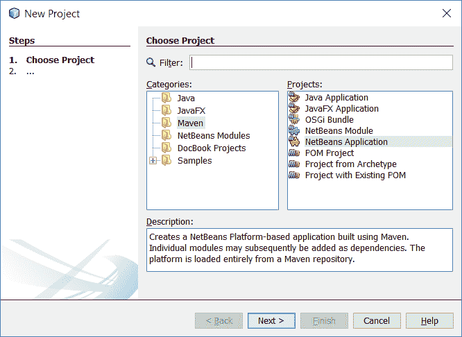
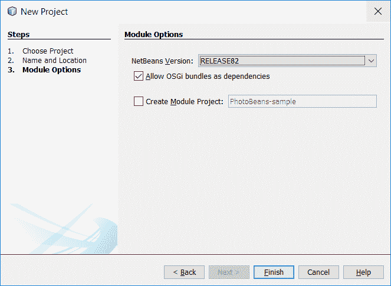
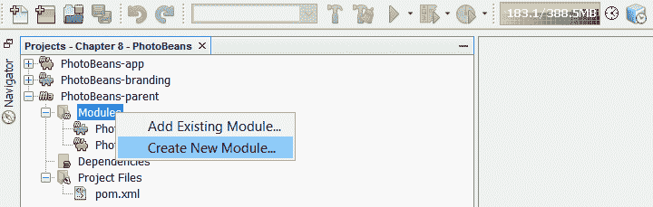
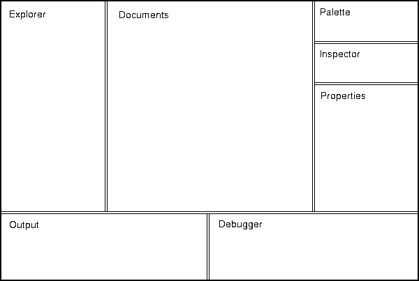
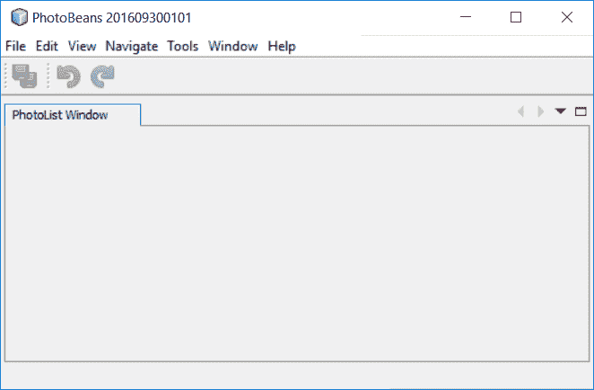
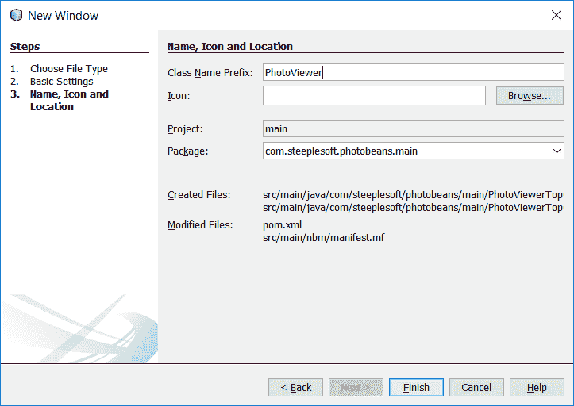
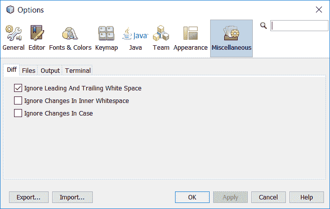
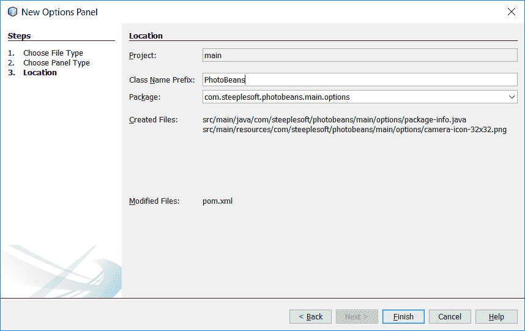
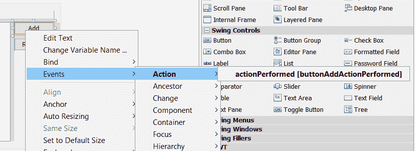

# 使用 PhotoBeans 进行照片管理

到目前为止，我们已经编写了库。我们已经编写了命令行实用程序。我们还使用 JavaFX 编写了 GUI。在本章中，我们将尝试完全不同的方法。我们将构建一个照片管理系统，当然，它需要一个图形化的应用程序，但我们将采取一种不同的方法。我们将使用现有的应用程序框架，而不是使用纯 JavaFX 从头开始构建一切。这个框架就是 NetBeans**富客户端平台**（**RCP**），一个成熟、稳定、功能强大的框架，它不仅支持我们一直使用的 NetBeans IDE，还支持从石油天然气到航空航天等众多行业的无数应用程序。

在本章中，我们将介绍以下主题：

*   如何引导 NetBeans RCP 项目
*   如何将 JavaFX 与 NetBeans RCP 集成
*   RCP 应用程序的基础，如节点、操作、查找、服务和 TopComponents

那就别再麻烦了，让我们马上开始吧。

# 开始

可能您列表顶部或附近的问题是，**我为什么要使用 NetBeans RCP？**。在我们深入了解应用程序的细节之前，让我们先讨论一下这个非常公平的问题，并试着理解为什么我们要以这样的方式构建它。

当您开始研究 NetBeans 平台时，首先会注意到的是模块化的强烈概念。Java 模块系统是 Java 9 的一个突出特性，这似乎是一个小细节，但 NetBeans 在应用程序级别向我们揭示了这个概念，使插件变得非常简单，并允许我们零碎地更新应用程序。

RCP 还提供了一个健壮的、经过良好测试的框架，用于处理窗口、菜单、操作、节点、服务等。如果我们要从头开始构建这个应用程序，就像我们在前面几章中使用**plain**JavaFX 所做的那样，我们必须手动定义屏幕上的区域，然后手动处理窗口放置。有了 RCP，我们已经定义了一个丰富的窗口规范，我们可以很容易地使用它。它提供了诸如最大化/最小化窗口、滑动、分离和停靠窗口等功能。

RCP 还提供了一个强大的**节点**概念，它是用户界面概念中特定于域的数据的封装，通常被视为应用程序左侧树状视图中的条目，以及可以与这些节点（或菜单项）关联以对其所代表的数据进行操作的操作。同样，所有这些都可以在 JavaFX（或 Swing）中完成，但您必须自己编写所有这些特性的代码。事实上，有许多开源框架提供了这样的功能，比如卡诺的海豚平台（[http://www.dolphin-platform.io](http://www.dolphin-platform.io/) ），虽然没有一个像 NetBeans RCP 那样经过多年的生产强化和测试，所以我们将继续关注这里。

# 引导项目

如何创建 NetBeans RCP 项目将对如何处理项目的其余部分产生非常根本的影响。默认情况下，NetBeans 使用 Ant 作为所有 RCP 应用程序的构建系统。几乎所有来自 NetBeans 项目的在线文档，以及来自 NetBeans 传教士的博客条目，都反映了这种偏好。我们已经在其他项目中使用 Maven，我们不会在这里改变这一点。幸运的是，NetBeans 确实允许我们使用 Maven 创建一个 RCP 项目，这就是我们将要做的。



在新项目窗口中，我们选择 Maven，然后选择 NetBeans 应用程序。在下一个屏幕上，我们像往常一样配置项目，指定项目名称、photobeans、项目位置、包等。

单击“下一步”时，将显示“新建项目向导”的“模块选项”步骤。在这一步中，我们将配置 RCP 应用程序的一些基本方面。具体来说，我们需要指定要使用的 NetBeans API 的版本，以及是否要使用 OSGi 捆绑包作为依赖项，如以下屏幕截图所示：



在撰写本文时，最新的平台版本是 RELEASE82。到 Java9 发布时，可以合理地预期 NetBeans9.0 以及 RELEASE90 将可用。我们希望获得最新版本，但请注意，根据 NetBeans 项目的发布时间表，它很可能*不是*9.0。对于 Allow OSGi bundles as dependencies 选项，我们可以安全地接受默认值，尽管更改它不会给我们带来任何问题，并且我们可以在以后需要时轻松更改该值。

创建项目后，我们将在项目窗口中看到三个新条目：`PhotoBeans-parent`、`PhotoBeans-app`和`PhotoBeans-branding`。`-parent`项目没有真正的可交付成果。与其他章节中的`master`项目一样，这仅用于组织相关模块、协调依赖关系等。

# 为应用程序创建品牌

`-branding`模块是我们可以定义（正如您可能已经猜到的）应用程序品牌细节的地方。您可以通过右键单击品牌模块并选择内容菜单底部附近的`Branding...`来访问这些品牌属性。执行此操作后，系统将向您提示如下屏幕：


在前面的选项卡中，您可以设置或更改应用程序的名称，以及指定应用程序图标。

在启动屏幕选项卡中，最重要的是，您可以配置应用程序加载时启动屏幕上显示的图像。您还可以启用或禁用进度条，并设置进度条和启动消息的颜色、字体大小和位置：


我们目前唯一感兴趣的另一个选项卡是“窗口系统”选项卡。在此选项卡中，我们可以配置许多功能，如窗口拖放、窗口滑动、关闭等：


更可能的是，出于我们的目的，默认值是可以接受的。但是，在您自己的 NetBeans RCP 应用程序中，此屏幕可能更重要。

我们的主要兴趣是`-app`模块。此模块将定义应用程序的所有依赖项，并将成为其入口点。不过，与我们在前几章中看到的 JavaFX 应用程序不同，我们不需要定义`public static void main`方法，因为 NetBeans 为我们处理这个问题。事实上，`-app`模块中根本没有任何 Java 类，但应用程序可以直接运行，尽管它做的不多。我们现在就把它修好。

# NetBeans 模块

NetBeans 平台的优势之一是它的模块化。如果您曾经使用过 NetBeans IDE 本身（比如说，在阅读本书之前），那么您在使用插件时已经看到了这种模块化：每个 NetBeans 插件都由一个或多个模块组成。事实上，NetBeans 本身由许多模块组成。这就是 RCP 应用程序的工作原理。它促进了解耦，并使扩展和升级应用程序更加简单。

普遍接受的模式是，比如说，将 API 类放在一个模块中，将实现放在另一个模块中。这使得 API 类可以被其他实现者重用，可以通过隐藏私有类来帮助实施低耦合，等等。不过，为了在学习平台时保持简单，我们将只创建一个模块来提供所有核心功能。为此，我们右键单击父项目下的模块节点，然后选择创建新模块…：如以下屏幕截图所示：



选择后，将显示“新建项目”窗口。在这里，您需要选择 Maven 类别和 NetBeans 模块项目类型，如下所示：


单击“下一步”将获得我们在本书中已经多次看到的名称和位置步骤。在此窗格中，我们将模块命名为`main`，将包设置为`com.steeplesoft.photobeans.main`，并接受其他字段的默认值。在下一个窗格“模块选项”中，我们将确保 NetBeans 版本与前面选择的版本相同，然后单击 Finish。

# TopComponent-选项卡和窗口的类

我们现在有一个模块，大部分是空的。NetBeans 为我们创建了一些工件，但我们不必担心这些，因为构建将为我们管理这些工件。不过，我们需要做的是创建第一个 GUI 元素，NetBeans 将其称为 TopComponent。来自 NetBeans Javadoc，位于[http://bits.netbeans.org/8.2/javadoc/](http://bits.netbeans.org/8.2/javadoc/) 我们发现这个定义：

要在 NetBeans 中显示的可嵌入可视组件。这是显示的基本单位——不应直接创建窗口，而应使用此类。顶部组件可能对应于单个窗口，但也可能是窗口中的选项卡（例如）。它可以停靠或取消停靠，具有选定的节点、补给行动等。

我们将看到，此类是 NetBeans RCP 应用程序的主要组件。它将保存和控制各种相关的用户界面元素。换句话说，它位于用户界面中组件层次结构的顶部。要创建 TopComponent，我们可以使用 NetBeans 向导，方法是右键单击 Project Explorer 树中的空包，然后选择 New | Window。如果窗口不是选项，请选择其他|模块开发|窗口。

现在，您将看到以下基本设置窗口：


在前面的窗口中，我们有许多选项。我们正在创建的是一个显示照片列表的窗口，因此一些合理的设置是选择以下内容：

*   在应用程序启动时打开
*   不允许关闭
*   不允许最大化

这些选项看起来很简单，但什么是窗口位置？使用 NetBeans RCP 而不是从头开始编写的另一个好处是，该平台提供了许多预定义的概念和功能，因此我们无需担心它们。其中一个问题是窗口的定位和放置。NetBeans 用户界面规范（可在 NetBeans 网站[上找到）https://ui.netbeans.org/docs/ui/ws/ws_spec-netbeans_ide.html](https://ui.netbeans.org/docs/ui/ws/ws_spec-netbeans_ide.html) 定义了以下领域：

*   **资源管理器：**这用于所有提供用户对象访问权限的窗口，通常在树型浏览器中
*   **输出：**默认用于输出窗口和 VCS 输出窗口
*   **调试器：**用于所有需要水平布局的调试器窗口和其他支持窗口
*   **调色板：**用于组件调色板窗口
*   **检查员：**用于组件检查员窗口
*   **属性：**用于属性窗口
*   **单据：**用于所有单据窗口

本文档还提供了以下有用的说明：



规范页面有大量的附加信息，但现在这些信息应该足以让您继续。我们希望照片列表位于应用程序窗口的左侧，因此选择编辑器作为窗口位置。单击 Next，我们为组件配置名称和图标。严格来说，我们不需要为 TopComponent 指定图标，所以我们只需输入`PhotoList`作为类名前缀：，然后单击 Finish：


当您单击此处的 Finish 时，NetBeans 将为您创建几个文件，尽管只有一个文件会显示在 Project Explorer 树中，即`PhotoListTopComponent.java`。还有一个名为`PhotoListTopComponent.form`的文件，你需要知道，尽管你永远不会直接编辑它。NetBeans 提供了一个非常好的所见即所得编辑器，用于构建用户界面。用户界面定义存储在`.form`文件中，该文件只是一个 XML 文件。在进行更改时，NetBeans 会为您修改此文件，并在名为`initComponents()`的方法中生成等效的 Java 代码。您还将注意到，NetBeans 不允许您修改该方法。当然，您可以使用另一个编辑器来执行此操作，但是如果您在 GUI 编辑器中进行更改，则以这种方式进行的任何更改都将丢失，因此最好不要使用此方法。TopComponent 的其余部分看起来像什么？

```java
    @ConvertAsProperties( 
      dtd = "-//com.steeplesoft.photobeans.main//PhotoList//EN", 
      autostore = false 
    ) 
    @TopComponent.Description( 
      preferredID = "PhotoListTopComponent", 
      //iconBase="SET/PATH/TO/ICON/HERE", 
      persistenceType = TopComponent.PERSISTENCE_ALWAYS 
    ) 
    @TopComponent.Registration(mode = "editor",
     openAtStartup = true) 
    @ActionID(category = "Window", id =  
      "com.steeplesoft.photobeans.main.PhotoListTopComponent") 
    @ActionReference(path = "Menu/Window" /*, position = 333 */) 
    @TopComponent.OpenActionRegistration( 
      displayName = "#CTL_PhotoListAction", 
      preferredID = "PhotoListTopComponent" 
    ) 
    @Messages({ 
      "CTL_PhotoListAction=PhotoList", 
      "CTL_PhotoListTopComponent=PhotoList Window", 
      "HINT_PhotoListTopComponent=This is a PhotoList window" 
    }) 
    public final class PhotoListTopComponent 
     extends TopComponent { 

```

这是很多注释，但也很好地提醒了您 NetBeans 平台为您做了多少事情。在构建过程中，将处理这些注释以创建元数据，平台将在运行时使用这些元数据来配置和连接应用程序。

其中一些亮点如下：

```java
    @TopComponent.Registration(mode = "editor",
      openAtStartup = true) 

```

这登记了我们的`TopComponent`，并反映了我们对放置位置和打开时间的选择。

我们还为我们做了一些国际化和本地化工作，如下所示：

```java
    @ActionID(category = "Window", id =  
      "com.steeplesoft.photobeans.main.PhotoListTopComponent") 
    @ActionReference(path = "Menu/Window" /*, position = 333 */) 
    @TopComponent.OpenActionRegistration( 
      displayName = "#CTL_PhotoListAction", 
      preferredID = "PhotoListTopComponent" 
    ) 
    @Messages({ 
      "CTL_PhotoListAction=PhotoList", 
      "CTL_PhotoListTopComponent=PhotoList Window", 
      "HINT_PhotoListTopComponent=This is a PhotoList window" 
    }) 

```

前三个注释注册了一个打开的操作，并在我们的应用程序的`Window`菜单中公开了一个项目，而不会深入到细节中，也不会造成混乱。最后一个注释`@Messages`用于定义本地化键和字符串。编译此类时，在同一个包中创建一个名为`Bundle`的类，该类定义使用指定键返回本地化字符串的方法。例如，对于`CTL_PhotoListAction`，我们得到以下结果：

```java
    static String CTL_PhotoListAction() { 
      return org.openide.util.NbBundle.getMessage(Bundle.class,  
        "CTL_PhotoListAction"); 
    } 

```

前面的代码在标准 Java`.properties`文件中查找本地化消息的密钥。这些键/值对与 NetBeans 向导为我们生成的`Bundle.properties`文件中的任何条目合并。

我们`TopComponent`的以下构造师也很感兴趣：

```java
    public PhotoListTopComponent() { 
      initComponents(); 
      setName(Bundle.CTL_PhotoListTopComponent()); 
      setToolTipText(Bundle.HINT_PhotoListTopComponent()); 
      putClientProperty(TopComponent.PROP_CLOSING_DISABLED,  
       Boolean.TRUE); 
      putClientProperty(TopComponent.PROP_MAXIMIZATION_DISABLED,  
       Boolean.TRUE); 
    } 

```

在前面的构造函数中，我们可以看到如何设置组件的名称和工具提示，以及如何设置与窗口相关的选项。

如果我们现在运行应用程序，将不会看到任何更改。那么，我们需要做的是向应用程序添加对`main`模块的依赖。我们可以通过右键单击应用程序模块的 Dependencies 节点来实现这一点，如此屏幕截图所示：


现在应该可以看到“添加依赖项”窗口。选择打开的项目选项卡，然后选择`main`，如图所示：


一旦我们添加了依赖项，我们需要构建两个模块，首先是`main`，然后是`app`，然后我们将准备好第一次运行 PhotoBeans：



注意到前一屏幕窗口标题中的奇数日期了吗？这是 NetBeans 平台的构建日期，在我们的应用程序中它不是很漂亮，所以，让我们来解决这个问题。我们有两个选择。第一个是使用我们前面看到的品牌用户界面。另一种是直接编辑文件。为了保持事物的趣味性，并帮助理解事物在磁盘上的位置，我们将使用第二种方法。

在品牌模块中，在其他来源| nbm 品牌下，您应该可以找到`modules/org-netbeans-core-windows.jar/org/netbeans/core/windows/ view/ui/Bundle.properties`文件。在此文件中，您应该看到以下几行：

```java
    CTL_MainWindow_Title=PhotoBeans {0} 
    CTL_MainWindow_Title_No_Project=PhotoBeans {0} 

```

我们所需要做的就是删除`{0}`部分，重建这个模块和应用程序，我们的标题栏就漂亮多了。虽然看起来更好，但我们的顶级组件呢？要解决这个问题，我们需要学习一些新概念。

# 节点，一个 NetBeans 表示对象

您已经听说过节点这个术语。我已经多次使用它来描述要单击的内容和位置。正式地说，节点表示对象层次结构（bean）中的一个元素。它提供了浏览器视图和 bean 之间通信所需的所有方法。在应用程序的浏览器部分，我们希望向用户表示一个照片列表。我们将把每张照片以及它拍摄的年份和月份表示为一个节点。为了显示这些节点，我们将使用一个名为`BeanTreeView`的 NetBeans 类，它将此节点层次结构显示为树。还有一些概念需要学习，但让我们先从我们掌握的开始。

我们将首先定义节点，节点将充当应用程序的业务域模型和 NetBeans API 之间的包装器或桥梁。当然，我们还没有定义这样一个模型，所以我们现在需要解决这个问题。我们的基本数据项是一张照片，一个保存图像的磁盘文件。在应用程序中，我们将以嵌套的树结构显示这些照片，按年份、月份对照片进行分组。如果展开“年”节点，将看到月节点列表；如果展开“月”节点，将看到照片节点列表。这是一个非常基本的、有点幼稚的数据模型，但它既有效地演示了概念，又非常简单，我们不会混淆概念。

与所有层次结构一样，我们需要一个根节点，因此我们将从该节点开始：

```java
    public class RootNode extends AbstractNode 

```

从技术上讲，所有节点的基类都是 Node，但扩展该类会给我们带来更大的负担，因此我们使用`AbstractNode`提供的 NetBeans，它以合理的默认值为我们实现了相当数量的节点基本行为。

接下来，我们定义一些构造函数如下：

```java
    public RootNode() { 
      this(new InstanceContent()); 
    } 

    protected RootNode(InstanceContent ic) { 
      super(Children.create(new YearChildFactory(), true), 
       new AbstractLookup(ic)); 
      setDisplayName(Bundle.LBL_RootNode()); 
      setShortDescription(Bundle.HINT_RootNode()); 

      instanceContent = ic; 
    } 

```

注意，我们有两个构造器，一个`public`和一个`protected`。原因是我们想要创建并捕获一个`InstanceContent`实例，我们，这个类的查找的创建者，可以使用它来控制查找中的实际内容。因为我们需要将`Lookup`传递给类的父构造函数，所以我们有两步的对象实例化方法。

# 查找，NetBeans 的基础

什么是查找？它是一个**通用注册表，允许客户端查找服务实例（实现给定接口）**。换句话说，这是一种机制，通过它我们可以发布各种工件，系统的其他部分可以通过一个键（一个`Class`或一个`Lookup.Template`，我们将不在这里讨论）查找这些工件，模块之间没有耦合。

正如我们将看到的，这经常用于查找服务接口的实现。您还记得我之前提到过，我们经常看到在一个模块中定义 API，在另一个模块中定义实现吗？这就是它特别有用的地方。假设您正在开发一个 API 来从在线服务中检索照片（这对于这个应用程序来说是一个很好的特性！）。您计划为一项服务（例如 Google Photos）提供一个实现，但希望让第三方开发人员为 Flickr 提供一个实现。如果将所需的 API 接口、类等放在一个模块中，而将 Google Photos 实现放在另一个模块中，则第三方开发人员可以仅依赖于您的 API 模块，并避免实现模块的重量。Flickr 模块将声明照片服务 API 的一个实现，我们可以通过请求查找来加载该 API 和我们自己的 Google 照片实现。简而言之，该系统允许在一个非常干净、简单的 API 中解耦 API 定义、实现和实例获取。

这是查找，但什么是`InstanceContent`？查找 API 仅公开获取项的方法。没有向查找添加项的机制，这是有意义的，因为查找实例由未知的第三方使用，我们不希望他们随机更改查找的内容。然而，我们实际上可能想要更改这些内容，我们通过`InstanceContent`来实现，它公开了添加或删除项目所需的方法。稍后我们将在应用程序中看到此概念的演示。

# 编写我们自己的节点

上一节涵盖了这两个类，但什么是`YearChildFactory`？类`RootNode`为系统定义将成为我们的树的根节点。但是，如果每个节点都有子节点，则负责加载和构建这些子节点，这是通过这个`ChildFactory`类完成的。我们的实例如下所示：

```java
    public class YearChildFactory extends ChildFactory<String> { 
      private final PhotoManager photoManager; 
      private static final Logger LOGGER =  
        Logger.getLogger(YearChildFactory.class.getName()); 
      public YearChildFactory() { 
        this.photoManager =  
          Lookup.getDefault().lookup(PhotoManager.class); 
        if (photoManager == null) { 
          LOGGER.log(Level.SEVERE,  
          "Cannot get PhotoManager object"); 
          LifecycleManager.getDefault().exit(); 
        } 
      } 

      @Override 
      protected boolean createKeys(List<String> list) { 
        list.addAll(photoManager.getYears()); 
        return true; 
      } 

      @Override 
      protected Node createNodeForKey(String key) { 
        return new YearNode(Integer.parseInt(key)); 
      } 
    } 

```

我们正在创建一个`ChildFactory`接口，该接口将返回操作字符串的节点。如果您有一个更复杂的数据模型，例如使用 POJO 的数据模型，您可以将该类指定为参数化类型。

在我们的构造函数中，我们看到了一个通过查找找到服务实现的示例，如下所示：

```java
    this.photoManager=Lookup.getDefault().lookup(
      PhotoManager.class); 

```

稍后我们将介绍如何定义服务，但现在，您需要了解的是，我们正在为`PhotoManager`接口的实例请求全局查找（与我们之前创建的查找不同，它不绑定到特定类）。也许很天真，我们假设这个接口只有一个实例，但是因为我们没有导出接口，所以我们的假设是安全的。不过，我们会检查以确保至少有一个，如果没有，则退出应用程序。

接下来的两种方法是如何使用工厂创建子节点。系统调用第一种方法`createKeys(List<String> list)`，为子节点生成密钥列表。在我们的实现中，我们向`PhotoManager`接口询问年份列表（我们将看到，这是一个简单的数据库查询，以获得系统中有照片的年份列表）。然后平台获取这些密钥，并将它们一次一个地传递到`createNodeForKey(String key)`以创建实际节点。在这里，我们创建一个`YearNode`实例来表示年份。

`YearNode`与`RootNode`类似，扩展`AbstractNode`。

```java
    public class YearNode extends AbstractNode { 
      public YearNode(int year) { 
        super(Children.create(new MonthNodeFactory(year), true),  
         Lookups.singleton(year)); 
        setName("" + year); 
        setDisplayName("" + year); 
      } 
    } 

```

前面的显然是一个更简单的节点，但基本原理是一样的——我们创建`ChildFactory`来创建我们的子节点，然后我们创建一个查找，在本例中，它保存一个值，即节点表示的年份。

`MonthNodeFactory`看起来几乎与`YearNodeFactory`完全相同，只是它为给定年份加载了几个月，所以我们在这里不显示源代码。它还为列表中的每个月创建`MonthNode`实例。与`YearNode`类似，`MonthNode`非常简单，如您在以下代码片段中所见：

```java
    public class MonthNode extends AbstractNode { 
      public MonthNode(int year, int month) { 
        super(Children.create( 
          new PhotoNodeFactory(year, month), true),  
           Lookups.singleton(month)); 
          String display = month + " - " +  
           Month.values()[month-1].getDisplayName( 
             TextStyle.FULL, Locale.getDefault()); 
          setName(display); 
          setDisplayName(display); 
      } 
    } 

```

我们做了更多的工作来为节点指定一个有意义的名称和显示名称，但基本上是一样的。还请注意，我们还有另一个`ChildFactory`，正如名字所示，它将生成我们作为孩子需要的光节点。工厂本身并没有什么新的兴趣，但是有一点新的，所以让我们来看一看：

```java
    public class PhotoNode extends AbstractNode { 
      public PhotoNode(String photo) { 
        this(photo, new InstanceContent()); 
    } 

    private PhotoNode(String photo, InstanceContent ic) { 
      super(Children.LEAF, new AbstractLookup(ic)); 
      final String name = new File(photo).getName(); 
      setName(name); 
      setDisplayName(name); 

      ic.add((OpenCookie) () -> { 
        TopComponent tc = findTopComponent(photo); 
        if (tc == null) { 
          tc = new PhotoViewerTopComponent(photo); 
          tc.open(); 
        } 
        tc.requestActive(); 
      }); 
    } 

```

在这里，我们再次看到双构造函数方法，不过，在本例中，我们确实使用了`InstanceContent`。注意，`super()`的第一个参数是`Children.LEAF`，表示该节点没有任何子节点。我们也通过了现在熟悉的`new AbstractLookup(ic)`。

在设置了名称和显示名称之后，我们将 lambda 添加到`InstanceContent`对象中。此的非 lambda 版本如下所示：

```java
    ic.add(new OpenCookie() { 
      @Override 
      public void open() { 
      } 
    }); 

```

什么是`OpenCookie`？它是标记接口`Node.Cookie`的子接口，cookie**是一种设计模式，用于向现有数据对象和节点添加行为，或将实现与主对象**分离。使用这个 cookie，我们可以巧妙地抽象出某些东西可以打开的信号以及如何打开它。

在这种情况下，当系统试图打开由节点表示的照片时，它将调用我们对`OpenCookie.open()`的定义，该定义将尝试查找照片的打开实例。无论它是找到一个现有的还是需要创建一个新的，它都会指示系统将其激活（或给予它焦点）。

请注意，打开的照片由另一个 TopComponent 表示。要找到它，我们有以下方法：

```java
    private TopComponent findTopComponent(String photo) { 
      Set<TopComponent> openTopComponents =  
        WindowManager.getDefault().getRegistry().getOpened(); 
      for (TopComponent tc : openTopComponents) { 
        if (photo.equals(tc.getLookup().lookup(String.class))) { 
          return tc; 
        } 
      } 
      return null; 
    } 

```

我们要求查找所有打开的 TopComponent 的`WindowManager`，然后对每个进行迭代，将图像的完整路径`String photo`与 TopComponent 查找中存储的任何`String`进行比较。如果有匹配项，我们返回 TopComponent。不过，`String`的这种查找有点幼稚，在更复杂的应用程序中，可能会导致意外的匹配。在这个应用程序中，我们可能足够安全，但您需要确保在您自己的应用程序中，匹配条件足够严格和唯一，以避免错误命中。

# 表演动作

稍后我们将看`PhotoViewerTopComponent`，但在继续之前，我们还需要看几个项目。

`PhotoNode`覆盖另外两种方法，如下所示：

```java
    @Override 
    public Action[] getActions(boolean context) { 
      return new Action[]{SystemAction.get(OpenAction.class)}; 
    } 

    @Override 
    public Action getPreferredAction() { 
      return SystemAction.get(OpenAction.class); 
    } 

```

不出所料，`getActions()`方法会为此节点返回一个操作数组。动作是一种抽象（来自 Swing，而不是 NetBeans），它允许我们向菜单中添加项，并为用户提供与系统交互的方法。在主菜单或上下文菜单中看到的每个条目都有一个操作支持。在我们的例子中，我们将定义的 NetBeans`OpenAction`与我们的节点相关联，当单击该节点时，它将在节点的查找中查找`OpenCookie`实例并调用`OpenCookie.open()`，这是我们之前定义的。

我们还覆盖了`getPreferredAction()`，它允许我们定义双击节点时的行为。这两种方法的组合使用户可以右键单击节点并选择`Open`，或双击节点，最终结果是打开该节点的 TopComponent。

# 服务-公开分离的功能

在了解我们`TopComponent`的定义之前，让我们先来看看`PhotoManager`，了解一下它的服务。`PhotoManager`接口本身非常简单：

```java
    public interface PhotoManager extends Lookup.Provider { 
      void scanSourceDirs(); 
      List<String> getYears(); 
      List<String> getMonths(int year); 
      List<String> getPhotos(int year, int month); 
    } 

```

除了`extends Lookup.Provider`部分之外，对前面的代码没有什么兴趣。在这里添加这一点，我们可以强制实现在该接口上实现 lone 方法，因为我们稍后需要它。有趣的部分来自实现，如下所示：

```java
    @ServiceProvider(service = PhotoManager.class) 
    public class PhotoManagerImpl implements PhotoManager { 

```

这就是向平台注册服务所需的全部内容。注释指定了所需的元数据，其余部分由构建负责。让我们来看看其余的实现：

```java
    public PhotoManagerImpl() throws ClassNotFoundException { 
      setupDatabase(); 

      Preferences prefs =  
        NbPreferences.forModule(PhotoManager.class); 
      setSourceDirs(prefs.get("sourceDirs", "")); 
      prefs.addPreferenceChangeListener(evt -> { 
        if (evt.getKey().equals("sourceDirs")) { 
          setSourceDirs(evt.getNewValue()); 
          scanSourceDirs(); 
        } 
      }); 

      instanceContent = new InstanceContent(); 
      lookup = new AbstractLookup(instanceContent); 
      scanSourceDirs(); 
    } 

```

在前面这个非常简单的实现中，我们将使用 SQLite 来存储有关我们找到的照片的信息。该服务将提供代码来扫描配置的源目录，存储有关找到的照片的信息，并公开检索这些特定性不同的信息片段的方法。

首先，如果这是应用程序第一次运行，我们需要确保数据库设置正确。我们可以包括一个预构建的数据库，但在用户的机器上创建它会为数据库意外删除的情况增加一点恢复力。

```java
    private void setupDatabase() { 
      try { 
       connection = DriverManager.getConnection(JDBC_URL); 
       if (!doesTableExist()) { 
         createTable(); 
       } 
      } catch (SQLException ex) { 
        Exceptions.printStackTrace(ex); 
      } 
    } 

    private boolean doesTableExist() { 
      try (Statement stmt = connection.createStatement()) { 
        ResultSet rs = stmt.executeQuery("select 1 from images"); 
        rs.close(); 
        return true; 
      } catch (SQLException e) { 
        return false; 
      } 
    } 

    private void createTable() { 
      try (Statement stmt = connection.createStatement()) { 
        stmt.execute( 
          "CREATE TABLE images (imageSource VARCHAR2(4096), " 
          + " year int, month int, image VARCHAR2(4096));"); 
          stmt.execute( 
            "CREATE UNIQUE INDEX uniq_img ON images(image);"); 
      } catch (SQLException e) { 
        Exceptions.printStackTrace(e); 
      } 
    } 

```

接下来，我们要求对模块`PhotoManager`的 NetBeans 首选项进行引用。我们将在本章后面的章节中讨论管理首选项，我们将更详细地研究这个 API，但是，现在，我们只说我们将向系统询问`sourceDirs`首选项，然后我们将使用它来配置扫描代码。

我们还创建了`PreferenceChangeListener`来捕获用户更改偏好的时间。在这个侦听器中，我们验证我们关心的首选项`sourceDirs`是否已更改，如果更改，我们将新值存储在`PhotoManager`实例中，并启动目录扫描。

最后，我们创建`InstanceContent`，创建并存储查找，并开始目录扫描，以确保应用程序与磁盘上照片的状态保持最新。

`getYears()`、`getMonths()`和`getPhotos()`方法基本上是相同的，当然，只是它们处理的数据类型不同，所以我们将`getYears()`作为这三种方法的解释：

```java
    @Override 
    public List<String> getYears() { 
      List<String> years = new ArrayList<>(); 
      try (Statement yearStmt = connection.createStatement(); 
      ResultSet rs = yearStmt.executeQuery( 
        "SELECT DISTINCT year FROM images ORDER BY year")) { 
          while (rs.next()) { 
            years.add(rs.getString(1)); 
          } 
        } catch (SQLException ex) { 
          Exceptions.printStackTrace(ex); 
        } 
      return years; 
    } 

```

如果您熟悉 JDBC，这应该不会令人惊讶。我们使用 Java7 的`try-with-resources`语法来声明和实例化`Statement`和`ResultSet`对象。对于那些不熟悉这种构造的人，它允许我们声明某些类型的资源，而不必担心关闭它们，因为一旦`try`的范围终止，系统会自动为我们关闭它们。然而，需要注意的主要限制是类必须实现`AutoCloseable`；a`Closeable`不起作用。其他两种`get*`方法在逻辑上是相似的，因此这里不显示它们。

这里的最后一个主要功能是扫描源目录，由`scanSourceDirs()`方法协调，如下所示：

```java
    private final ExecutorService executorService =  
      Executors.newFixedThreadPool(5); 
    public final void scanSourceDirs() { 
      RequestProcessor.getDefault().execute(() -> { 
        List<Future<List<Photo>>> futures = new ArrayList<>(); 
        sourceDirs.stream() 
         .map(d -> new SourceDirScanner(d)) 
         .forEach(sds ->  
          futures.add((Future<List<Photo>>)  
          executorService.submit(sds))); 
        futures.forEach(f -> { 
          try { 
            final List<Photo> list = f.get(); 
            processPhotos(list); 
          } catch (InterruptedException|ExecutionException ex) { 
            Exceptions.printStackTrace(ex); 
          } 
        }); 
        instanceContent.add(new ReloadCookie()); 
      }); 
    } 

```

为了加快处理速度，我们为每个配置的源目录创建未来，并将其传递给我们的`ExecutorService`。我们在池中最多配置五个线程，这在很大程度上是任意的。一种更复杂的方法可能会使此功能可配置，或者自动调整，但对于我们这里的目的来说，这已经足够了。

一旦创建了未来，我们就遍历列表，请求每个结果。如果源目录的数量超过了线程池的大小，那么多余的未来将等待线程可用，此时`ExecutorService`将选择一个线程运行。一旦它们全部完成，对`.get()`的调用将不再阻塞，应用程序可以继续。请注意，我们并没有阻塞用户界面以使其工作，因为我们将此方法的大部分作为 lambda 传递给`RequestProcessor.getDefault().execute()`以请求此方法从用户界面线程中运行。

创建并返回照片列表后，我们使用以下方法处理这些照片：

```java
    private void processPhotos(List<Photo> photos) { 
      photos.stream() 
       .filter(p -> !isImageRecorded(p)) 
       .forEach(p -> insertImage(p)); 
    } 

```

`isImageRecorded()`方法检查图像路径是否已经在数据库中，如果已经在，则返回 true。我们`filter()`基于本次测试的结果生成流，因此`forEach()`只对之前未知的图像进行操作，然后通过`insertImage()`将图像插入数据库。这两种方法如下所示：

```java
    private boolean isImageRecorded(Photo photo) { 
      boolean there = false; 
      try (PreparedStatement imageExistStatement =  
        connection.prepareStatement( 
          "SELECT 1 FROM images WHERE image = ?")) { 
            imageExistStatement.setString(1, photo.getImage()); 
            final ResultSet rs = imageExistStatement.executeQuery(); 
            there = rs.next(); 
            close(rs); 
          } catch (SQLException ex) { 
            Exceptions.printStackTrace(ex); 
          } 
      return there; 
    } 

    private void insertImage(Photo photo) { 
      try (PreparedStatement insertStatement =  
       connection.prepareStatement( 
         "INSERT INTO images (imageSource, year, month, image)
          VALUES (?, ?, ?, ?);")) { 
            insertStatement.setString(1, photo.getSourceDir()); 
            insertStatement.setInt(2, photo.getYear()); 
            insertStatement.setInt(3, photo.getMonth()); 
            insertStatement.setString(4, photo.getImage()); 
            insertStatement.executeUpdate(); 
       } catch (SQLException ex) { 
         Exceptions.printStackTrace(ex); 
       } 
    } 

```

我们使用的是`PreparedStatement`，因为通常情况下，通过连接创建 SQL 语句是不明智的，这可能并且经常会导致 SQL 注入攻击，因此我们无法在第一种方法中完全使用`try-with-resources`，需要我们手动关闭`ResultSet`。

# 光电元件

我们现在可以找到图像，但我们仍然无法告诉系统在哪里查找。不过，在我们将注意力转向使用 NetBeans 平台处理首选项之前，我们还有一个 TopComponent 要看--`PhotoViewerTopComponent`。

如果您回想一下我们对 NetBeans 窗口系统提供的区域的讨论，当我们查看图像时，我们希望将图像加载到`Editor`区域。为了创建一个 TopComponent，我们指示 NetBeans 通过右键单击所需的包并选择 new | Window 来创建一个新的`Window`：


在下一个窗格中，我们为新的 TopComponent 指定类名前缀--`PhotoViewer`，如以下屏幕截图所示：



NetBeans 现在将创建文件`PhotoViewerTopComponent.java`和`PhotoViewerTopComponent.form`，正如前面讨论的那样。不过，对于这个 TopComponent，我们需要做一些更改。当我们打开`Window`时，我们需要为它指定一个要加载的图像，因此我们需要提供一个构造函数来获取图像的路径。但是，TopComponents 必须有一个无参数构造函数，所以我们保留它，但让它用空的映像路径调用我们的新构造函数。

```java
    public PhotoViewerTopComponent() { 
      this(""); 
    } 

    public PhotoViewerTopComponent(String photo) { 
      initComponents(); 
      this.photo = photo; 
      File file = new File(photo); 
      setName(file.getName()); 
      setToolTipText(photo); 
      associateLookup(Lookups.singleton(photo)); 
      setLayout(new BorderLayout()); 
      init(); 
    } 

```

虽然看起来可能很多，但这里的步骤很简单：我们将照片路径保存在一个实例变量中，我们从中创建一个`File`实例以更容易地获取文件名，将照片路径添加到 TopComponent 的查找中（这就是我们如何找到给定照片的 TopComponent），更改布局，然后初始化窗口。

# 将 JavaFX 与 NetBeans RCP 集成

`init()`方法很有趣，因为我们要做一些稍微不同的事情；我们将使用 JavaFX 来查看图像。我们没有理由不能像在其他 TopComponent 中那样使用 Swing，但这给了我们一个很好的机会来演示如何集成 JavaFX 和 Swing，以及 JavaFX 和 NetBeans 平台。

```java
    private JFXPanel fxPanel; 
    private void init() { 
      fxPanel = new JFXPanel(); 
      add(fxPanel, BorderLayout.CENTER); 
      Platform.setImplicitExit(false); 
      Platform.runLater(this::createScene); 
    } 

```

`JFXPanel`是一个 Swing 组件，用于将 JavaFX 嵌入 Swing。我们的窗口布局是`BorderLayout`，所以我们在`CENTER`区域添加了`JFXPanel`，并让它扩展以填充`Window`。JavaFX 组件的任何复杂布局都将由`JFXPanel`中的另一个容器处理。不过，我们的用户界面相当简单。与我们早期的 JavaFX 系统一样，我们通过 FXML 将用户界面定义如下：

```java
    <BorderPane fx:id="borderPane" prefHeight="480.0"  
      prefWidth="600.0"  

      xmlns:fx="http://javafx.com/fxml/1"  
      fx:controller= 
        "com.steeplesoft.photobeans.main.PhotoViewerController"> 
      <center> 
        <ScrollPane fx:id="scrollPane"> 
          <content> 
            <Group> 
              <children> 
                <ImageView fx:id="imageView"  
                  preserveRatio="true" /> 
              </children> 
            </Group> 
          </content> 
        </ScrollPane> 
      </center> 
    </BorderPane> 

```

因为 FXML 需要一个根元素，所以我们指定了一个`BorderLayout`，如前所述，它在`BorderLayout`中的`JFXPanel`中给出了一个`BorderLayout`。这听起来很奇怪，但这就是嵌入 JavaFX 的工作原理。还要注意，我们仍然指定了一个控制器。在该控制器中，我们的`initialize()`方法如下所示：

```java
    @FXML 
    private BorderPane borderPane; 
    @FXML 
    private ScrollPane scrollPane; 
    public void initialize(URL location,
     ResourceBundle resources) { 
       imageView.fitWidthProperty() 
        .bind(borderPane.widthProperty()); 
       imageView.fitHeightProperty() 
        .bind(borderPane.heightProperty()); 
    } 

```

在最后一种方法中，我们所做的就是将宽度和高度属性绑定到边框窗格的属性。我们还在 FXML 中将`preserveRatio`设置为`True`，这样图像就不会失真。这将是重要的，因为我们旋转图像下一步。

我们还没有看到旋转的代码，现在让我们看看。我们将首先添加一个按钮，如下所示：

```java
    <top> 
      <ButtonBar prefHeight="40.0" prefWidth="200.0"  
         BorderPane.alignment="CENTER"> 
         <buttons> 
           <SplitMenuButton mnemonicParsing="false" 
             text="Rotate"> 
              <items> 
                <MenuItem onAction="#rotateLeft"  
                  text="Left 90°" /> 
                <MenuItem onAction="#rotateRight"  
                  text="Right 90°" /> 
              </items> 
            </SplitMenuButton> 
         </buttons> 
      </ButtonBar> 
    </top> 

```

在`BorderPane`的`top`部分，我们添加了`ButtonBar`，其中我们添加了一个`SplitMenuButton`。这给了我们一个像右边那个按钮一样的按钮。在非聚焦状态下，它看起来像一个普通按钮。当用户单击箭头时，菜单（如图所示）将显示给用户，使其能够按所列方向旋转图像：


我们已将这些菜单项绑定到 FXML 定义中控制器中的适当方法：

```java
    @FXML 
    public void rotateLeft(ActionEvent event) { 
      imageView.setRotate(imageView.getRotate() - 90); 
    } 
    @FXML 
    public void rotateRight(ActionEvent event) { 
      imageView.setRotate(imageView.getRotate() + 90); 
    } 

```

使用 JavaFX`ImageView`提供的 API 设置图像旋转。

我们可以找到图像，查看它们，并旋转它们，但我们仍然无法告诉系统在哪里查找这些图像。是时候解决这个问题了。

# NetBeans 首选项和选项面板

管理首选项的关键有两个方面：`NbPreferences`和选项面板。`NbPreferences`是存储和加载首选项的方式，选项面板是向用户显示用于编辑这些首选项的用户界面的方式。我们将从如何添加选项面板开始，这将自然导致`NbPreferences`讨论。接下来是 NetBeans 选项窗口：



在前面的窗口中，我们可以看到两种类型的选项面板——主选项和辅助选项。主选项面板由顶部的图标表示：常规、编辑器、字体和颜色等。辅助选项面板是我们在中间部分看到的一个选项卡：差异、文件、输出和终端。添加选项面板时，必须选择主选项或辅助选项。我们想添加一个新的主面板，因为它将从视觉上区分我们的偏好和其他面板，并给我们一个机会来创建这两种类型的面板。

# 添加主面板

要创建主选项面板，请右键单击所需的包或项目节点，然后单击新建|选项面板。如果选项面板不可见，请选择新建|其他|模块开发|选项面板。接下来，选择创建主面板：


我们必须指定一个标签，这是我们将在图标下看到的文本。我们还必须选择一个图标。系统将允许您选择 32x32 图像以外的其他图像，但如果它的大小不正确，则在用户界面中看起来会很奇怪；所以，仔细选择。系统还要求您输入关键字，如果用户对“选项”窗口应用过滤器，将使用这些关键字。最后，选择“允许辅助配电盘”。主面板没有任何真实的内容，只用于显示辅助面板，我们将很快创建辅助面板。

单击“下一步”时，系统将要求您输入类前缀和包：



当您单击 Finish 时，NetBeans 将创建一个文件`package-info.java`：

```java
    @OptionsPanelController.ContainerRegistration(id = "PhotoBeans", 
      categoryName = "#OptionsCategory_Name_PhotoBeans",  
      iconBase = "com/steeplesoft/photobeans/main/options/
       camera-icon-32x32.png",  
       keywords = "#OptionsCategory_Keywords_PhotoBeans",  
       keywordsCategory = "PhotoBeans") 
    @NbBundle.Messages(value = { 
      "OptionsCategory_Name_PhotoBeans=PhotoBeans",  
      "OptionsCategory_Keywords_PhotoBeans=photo"}) 
    package com.steeplesoft.photobeans.main.options; 

    import org.netbeans.spi.options.OptionsPanelController; 
    import org.openide.util.NbBundle; 

```

# 添加辅助面板

定义了主面板之后，我们就可以创建辅助面板了，它将完成我们的工作。我们再次右键单击该包，然后选择新建|选项面板，这次选择创建辅助面板：


因为我们已经定义了自己的主面板，所以我们可以选择它作为父面板，并像以前一样设置标题和关键字。单击 Next，选择和/或验证类前缀和包，然后单击 Finish。这将创建三个工件--`SourceDirectoriesOptionPanelController.java`、`SourceDirectoriesPanel.java`和`SourceDirectoriesPanel.form`，NetBeans 将为您的面板提供 GUI 编辑器。

我们想向面板中添加四个元素——一个标签、一个列表视图和两个按钮。我们通过从右侧的调色板中拖动它们来添加它们，并将它们按如下所示的形式排列：


为了使使用这些用户界面元素更有意义，我们需要设置变量名。我们还需要设置用户界面的文本，以便每个元素对用户都有意义。我们可以通过右键单击每个元素来实现这两个功能，如此屏幕截图所示：



在前面的屏幕中，我们可以看到三个感兴趣的项目——编辑文本、更改变量名…，以及事件| Action | actionPeformed[buttonAddActionPerformed]。对于我们的按钮，我们需要使用所有三个，因此我们将文本设置为`Add`（或`Remove`，将变量名称更改为`buttonAdd`/`buttonRemove`，然后选择`actionPerformed`。回到 Java 源代码中，我们看到一个为我们创建的方法，我们需要填写：

```java
    private void buttonAddActionPerformed(ActionEvent evt) {                                               
      String lastDir = NbPreferences 
       .forModule(PhotoManager.class).get("lastDir", null); 
      JFileChooser chooser = new JFileChooser(); 
      if (lastDir != null) { 
        chooser.setCurrentDirectory( 
          new java.io.File(lastDir)); 
      } 
      chooser.setDialogTitle("Add Source Directory"); 
      chooser.setFileSelectionMode(
        JFileChooser.DIRECTORIES_ONLY); 
      chooser.setAcceptAllFileFilterUsed(false); 
      if (chooser.showOpenDialog(null) ==  
        JFileChooser.APPROVE_OPTION) { 
          try { 
            String dir = chooser.getSelectedFile() 
            .getCanonicalPath(); 
            ensureModel().addElement(dir); 
            NbPreferences.forModule(PhotoManager.class) 
            .put("lastDir", dir); 
          } catch (IOException ex) { 
              Exceptions.printStackTrace(ex); 
            } 
        } else { 
            System.out.println("No Selection "); 
          } 
    } 

```

我们这里有很多事情要做：

1.  我们首先检索`lastDir`首选项值。如果设置了，我们将使用它作为选择要添加的目录的起点。通常，至少在我的经验中，感兴趣的目录通常在文件系统中彼此非常接近，因此我们使用此首选项来为用户节省一些点击次数。
2.  接下来我们创建`JFileChooser`，这是一个 Swing 类，它允许我们选择目录。
3.  如果`lastDir`不为空，则传递给`setCurrentDirectory()`。
4.  我们将对话框的标题设置为有意义的内容。
5.  我们指定对话框只允许我们选择目录。
6.  最后，我们禁用全选文件过滤器选项。
7.  我们调用`chooser.showOpenDialog()`将对话框呈现给用户，并等待它关闭。
8.  如果对话框返回的代码为`APPROVE_OPTION`，我们需要将所选目录添加到我们的模型中。
9.  我们得到所选文件的规范路径。
10.  我们调用`ensureModel()`，稍后我们将查看它，以获取`ListView`的模型，然后将此新路径添加到其中。
11.  最后，我们在首选项中将所选路径存储为`lastDir`，以设置前面讨论的起始目录。
12.  “删除”按钮的操作要简单得多，如下所示：

```java
        private void buttonRemoveActionPerformed(ActionEvent evt) {                                              
          List<Integer> indexes = IntStream.of( 
            sourceList.getSelectedIndices()) 
            .boxed().collect(Collectors.toList()); 
          Collections.sort(indexes); 
          Collections.reverse(indexes); 
          indexes.forEach(i -> ensureModel().remove(i)); 
        } 

```

当我们从模型中删除项时，我们通过项索引删除它们。但是，当我们删除一个项目时，该项目之后的任何内容的索引号都会更改。那么，我们在这里要做的就是创建一个所选索引的列表，对其进行排序以确保其顺序正确（这在这里可能过多，但这是一个相对便宜的操作，并且使下一个操作更安全），然后我们颠倒列表的顺序。现在索引按降序排列，我们可以遍历列表，从模型中删除每个索引。

我们已经使用了`ensureModel()`几次了，让我们看看它是什么样子：

```java
    private DefaultListModel<String> ensureModel() { 
      if (model == null) { 
        model = new DefaultListModel<>(); 
        sourceList.setModel(model); 
      } 
      return model; 
    } 

```

重要的是，我们将模型视为`DefaultListModel`而不是`ListView`所期望的`ListModel`类型，因为后者不公开任何方法来改变模型的内容，而前者确实如此。通过处理`DefaultListModel`，我们可以根据需要添加和删除项目，就像我们在这里所做的那样。

# 加载和保存首选项

在这个类中，我们还需要研究另外两种方法，即加载和存储面板中表示的选项的方法。我们从`load()`开始，如下所示：

```java
    protected void load() { 
      String dirs = NbPreferences 
       .forModule(PhotoManager.class).get("sourceDirs", ""); 
      if (dirs != null && !dirs.isEmpty()) { 
        ensureModel(); 
        model.clear(); 
        Set<String> set = new HashSet<>( 
          Arrays.asList(dirs.split(";"))); 
        set.forEach(i -> model.addElement(i)); 
      } 
    } 

```

`NbPreferences`不支持存储字符串列表，因此，正如我们将在下面看到的，我们将源目录列表存储为以分号分隔的字符串列表。在这里，我们加载`sourceDirs`的值，如果不为 null，则在分号上拆分，并将每个条目添加到`DefaultListModel`中。

保存源目录也相当简单：

```java
    protected void store() { 
      Set<String> dirs = new HashSet<>(); 
      ensureModel(); 
      for (int i = 0; i < model.getSize(); i++) { 
        final String dir = model.getElementAt(i); 
        if (dir != null && !dir.isEmpty()) { 
          dirs.add(dir); 
        } 
      } 
      if (!dirs.isEmpty()) { 
        NbPreferences.forModule(PhotoManager.class) 
        .put("sourceDirs", String.join(";", dirs)); 
      } else { 
        NbPreferences.forModule(PhotoManager.class) 
          .remove("sourceDirs"); 
      } 
    } 

```

我们迭代`ListModel`，将每个目录添加到本地`HashSet`实例，这有助于我们删除任何重复的目录。如果`Set`不是空的，我们使用`String.join()`创建带分隔符的列表，`put()`将其放入我们的首选项存储中。如果它是空的，我们将从存储中删除首选项，以清除先前可能已持久化的任何旧数据。

# 对偏好变化作出反应

既然我们可以持久化更改，我们需要让应用程序对更改做出反应。幸运的是，NetBeans RCP 提供了一种简洁、解耦的方法来处理这个问题。在这里，我们不需要从代码中显式调用方法。我们可以在系统中对更改感兴趣的位置附加一个侦听器。我们已经在`PhotoManagerImpl`中看到了此代码：

```java
    prefs.addPreferenceChangeListener(evt -> { 
      if (evt.getKey().equals("sourceDirs")) { 
        setSourceDirs(evt.getNewValue()); 
        scanSourceDirs(); 
      } 
    }); 

```

当我们为`PhotoManager`模块保存任何首选项时，将调用此侦听器。我们只需检查以确保它是我们感兴趣的密钥，并相应地采取行动，正如我们所看到的，这涉及重新启动源目录扫描过程。

一旦加载了新数据，我们如何使用户界面反映这种变化？我们必须手动更新用户界面吗？再次感谢 RCP，答案是否定的。我们在`scanSourceDirs()`结尾看到了上半部分，即：

```java
    instanceContent.add(new ReloadCookie()); 

```

NetBeans 有许多 cookie 类，用于指示应该执行某些操作。虽然我们不共享类层次结构（由于对节点 API 的不幸依赖），但我们确实共享相同的命名法，可以说，这是为了偷取一些熟悉的东西。那么`ReloadCookie`看起来像什么？没什么大不了的；它是这样给出的：

```java
    public class ReloadCookie { 
    } 

```

在我们的例子中，我们只有一个空类。我们不打算在其他地方使用它，所以我们不需要在类中编码任何功能。我们只是将其作为一个指标，正如我们在`RootNode`的构造器中看到的，如下所示：

```java
    reloadResult = photoManager.getLookup().lookup( 
      new Lookup.Template(ReloadCookie.class)); 
    reloadResult.addLookupListener(event -> setChildren( 
      Children.create(new YearChildFactory(), true))); 

```

`Lookup.Template`用于定义系统过滤`Lookup`请求的模式。使用我们的模板，我们创建一个`Lookup.Result`对象`reloadResult`，并通过 lambda 向其添加一个侦听器。lambda 使用前面提到的`Children.create()`和`YearChildFactory`创建了一组新的子对象，并将它们传递给`setChildren()`以更新用户界面。

这似乎只是为了在首选项更改时更新用户界面而编写的一段代码，但这种解耦确实值得。想象一个更复杂的应用程序或依赖模块树。使用这种侦听器方法，我们不需要向外部世界公开方法，甚至类，从而允许在不破坏客户机代码的情况下修改内部代码。简言之，这是代码解耦的主要原因之一。

# 总结

我们再一次来到了另一个应用程序的末尾。您学习了如何引导基于 Maven 的 NetBeans 富客户机平台应用程序。您了解了 RCP 模块，以及如何在应用程序构建中包含这些模块。您还学习了 NetBeans RCP 节点 API 的基础知识、如何创建自己的节点以及如何嵌套子节点。我们解释了如何使用 NetBeans Preferences API，包括为编辑首选项创建新的选项面板，如何加载和存储它们，以及如何对首选项的更改做出反应。

关于 NetBeans RCP 的最后一句话——虽然我们在这里构建了一个值得尊敬的应用程序，但我们并没有突破 RCP 的限制。我已经尝试了足够多的平台，让你去，但你几乎肯定需要了解更多，如果你要继续使用该平台。虽然官方文档很有帮助，但全面报道的来源是 Jason Wexbridge 和 Walter Nyland 的*NetBeans 初学者平台*（[https://leanpub.com/nbp4beginners](https://leanpub.com/nbp4beginners) ）。这是一本好书，我极力推荐。

在下一章中，我们将深入研究客户机/服务器编程，并实现我们自己的笔记应用程序。它不会像市场上已有的竞争对手那样强大和功能齐全，但我们将在这方面取得良好进展，希望在这一过程中能学到很多东西。