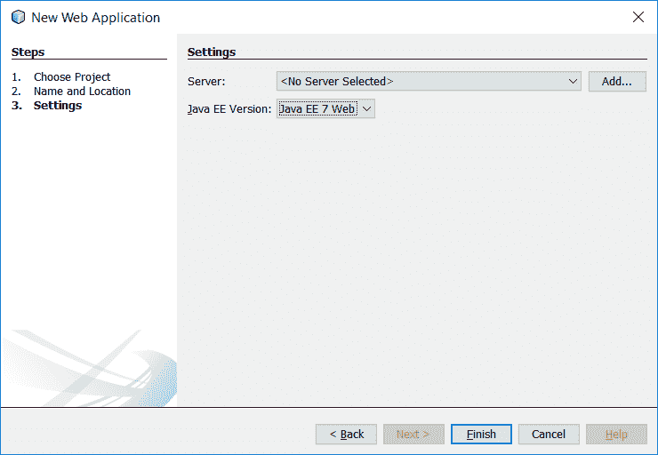
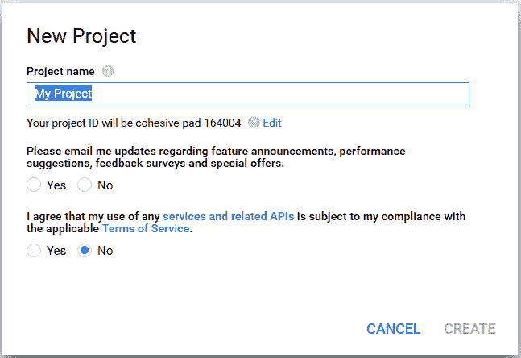

# 不朽的笔记

对于我们的第八个项目，我们将再次做一些新的事情——我们将构建一个 web 应用程序。尽管我们的所有其他项目都是命令行、GUI 或其组合，但该项目将是一个由 REST API 和 JavaScript 前端组成的单一模块，所有这些都着眼于当前的微服务趋势。

要构建应用程序，您将了解以下主题：

*   构建微服务应用程序的一些 Java 选项
*   Payara Micro 和`microprofile.io`
*   用于 restfulweb 服务的 javaapi
*   文档数据存储和 MongoDB
*   OAuth 身份验证（特别针对 Google）
*   **JSON 网络令牌**（**JWT**）

正如你所看到的，在很多方面，这将是一个与我们目前所看到的截然不同的项目类型。

# 开始

我们大多数人可能都使用过某种笔记应用程序，如 EverNote、OneNote 或 Google Keep。它们是一种非常方便的记笔记和想法的方式，并且可以在几乎所有可以想象的环境中使用它们——桌面、手机和网络。在本章中，我们将构建这些行业巨头的一个相当基本的复制品，以便运用一些概念。我们将此应用程序称为 Monterum，拉丁语表示提醒或纪念，是此类应用程序的恰当名称。

在开始之前，让我们花一些时间列出应用程序的要求：

*   能够创建注释
*   能够列出注释
*   能够编辑注释
*   能够删除注释
*   注释正文必须能够存储/显示富文本
*   能够创建用户帐户
*   必须能够针对现有系统使用 OAuth2 凭据登录到应用程序

我们的非功能性需求相当温和：

*   必须有一个 RESTful API
*   必须具有 HTML 5/JavaScript 前端
*   必须有一个灵活、可扩展的数据存储
*   必须易于在资源受限的系统上部署

当然，选择这个非功能性需求列表部分是因为它们反映了现实世界的需求，但它们也很好地帮助我们讨论了我想在本章中介绍的一些技术。为了切入正题，我们将创建一个 web 应用程序，它同时提供基于 REST 的 API 和 JavaScript 客户端。它将由文档数据存储支持，并使用 JVM 可用的众多微服务库/框架之一构建。

那么这个堆栈是什么样子的呢？让我们在选择一个特定的选择之前，快速调查一下我们的选择。让我们先看看微服务框架。

# JVM 上的微服务框架

虽然我不愿意花大量时间来讨论目前大多数人都熟悉的微服务，但我认为如果你不熟悉这个想法，至少不做一个简短的描述是一种失职。综上所述，这里是 SmartBear 对 microservice 的一个很好、简洁的定义，SmartBear 是一家软件质量工具的提供商，可能最著名的是他们对 Swagger API 和相关库的管理：

从本质上讲，微服务体系结构是一种将软件应用程序开发为一套独立部署的小型模块化服务的方法，其中每个服务运行一个独特的流程，并通过定义良好的轻量级机制进行通信，以服务于业务目标。

换一种方式来说，与将多个相关系统捆绑在一个 web 应用程序中并将其部署到大型应用程序服务器（如 GlassFish/Payara server、Wildfly、WebLogic server 或 WebSphere）的较旧、更成熟的方法不同，这些系统中的每一个都将在各自的 JVM 进程中单独运行。这种方法的好处包括更简单、零碎的升级、通过进程隔离提高稳定性、更小的资源需求、更高的机器利用率等等。这一概念本身并不一定是新概念，但近年来它肯定受到了欢迎，并继续以快速的速度增长。

那么，我们的选项在 JVM 上是什么样子的呢？我们有几个，不按特定顺序，包括：

*   **Eclipse Vert.x**：这是一个正式的*工具包，用于在 JVM*上构建反应式应用程序。它提供了一个事件驱动的应用程序框架，非常适合编写微服务。x 可以在多种语言中使用，包括 Java、Javascript、Kotlin、Ceylon、Scala、Groovy 和 Ruby。更多信息请参见[http://vertx.io/](http://vertx.io/) 。
*   **Spring Boot**：这是一个用于构建独立 Spring 应用程序的库。Spring 引导应用程序可以完全访问整个 Spring 生态系统，并且可以使用单个 fat/uber JAR 运行。弹簧靴的寿命为[https://projects.spring.io/spring-boot/](https://projects.spring.io/spring-boot/) 。
*   **Java EE 微文件**：这是一项由社区和供应商主导的工作，旨在为 Java EE 创建一个新的配置文件，专门为微服务定制。在撰写本文时，该概要文件包括用于 RESTful Web 服务的**Java API**（**JAX-RS**）、CDI 和 JSON-P，并由 Tomitribe、Payara、Red Hat、Hazelcast、IBM 和 Fujitsu 等多家公司以及伦敦 Java 社区和 SouJava 等用户团体赞助。微文件主页为[http://microprofile.io/](http://microprofile.io/) 。
*   **Lagom**：这个全新的框架是由 Scala 背后的公司 Lightbend 提供的反应式微服务框架。它被描述为一个固执己见的微服务框架，使用 Lightbend 两个更著名的库——Akka 和 Play 构建。Lagom 应用程序可以用 Java 或 Scala 编写。更多详情请参见[https://www.lightbend.com/platform/development/lagom-framework](https://www.lightbend.com/platform/development/lagom-framework) 。
*   **Dropwizard**：这是一个 Java 框架，用于开发操作友好、高性能、RESTful 的 web 服务。它是一个提供 Jetty for HTTP、Jersey for REST 服务和 Jackson for JSON 的框架。它还支持其他库，如 Guava、Hibernate Validator、Freemarker 等。您可以在[找到 Dropwizardhttp://www.dropwizard.io/](http://www.dropwizard.io/) 。

还有一些其他的选择，但应该清楚的是，作为 JVM 开发人员，我们有无数的选择，这几乎总是好的。因为我们只能使用一个文件进行构建，所以我选择使用微文件。具体来说，我们的应用程序将基于 Payara Micro，Payara 的实现，它基于 GlassFish 源代码（加上 Payara 的 bug 修复、增强等）。

通过选择 MicroFile 和 Payara Micro，我们隐式地选择 JAX-RS 作为 REST 服务的基础。当然，我们可以自由地使用我们想要的任何东西，但是偏离框架提供的东西会降低框架本身的价值。

这让我们可以选择数据存储。我们已经看到的一个选项是关系数据库。这是一个久经考验的真实选择，为该行业的广泛领域提供了动力。然而，它们并非没有局限性和问题。虽然数据库本身在分类和功能方面可能很复杂，但关系数据库最流行的替代方案可能是 NoSQL 数据库。虽然这些想法已经存在了半个世纪，但直到近十年左右的某个时候，随着**Web2.0**的出现，这个想法才获得了任何显著的市场吸引力。

虽然术语**NoSQL**非常广泛，但这类数据库的大多数示例往往是键值、文档或图形数据存储，每种存储都提供不同的性能和行为特征。对每种类型的 NoSQL 数据库及其各种实现的全面讨论超出了本书的范围，因此，从时间和空间的角度考虑，我们将直接进入我们的选择——MongoDB。它的可伸缩性和灵活性，特别是在文档模式方面，与我们的目标用例很好地吻合。

最后，在客户端，我们有无数的选择。其中最受欢迎的是 Facebook 的 ReactJS 和谷歌的 Angular。还有各种各样的其他框架，包括旧的选项，如 Knockout 和 Backbone，以及更新的选项，如 Vue.js。我们将使用后一种选择。这不仅是一个非常强大和灵活的选择，它还提供了最少的摩擦开始。因为这本书的重点是 Java，我觉得选择一个在满足我们需求的同时需要最少设置的选项是明智的。

# 创建应用程序

为了使用 Payara Micro，我们像往常一样创建了一个 Java web 应用程序。在 NetBeans 中，我们将选择 File | New Project | Maven | Web 应用程序并单击 Next。对于项目名称，输入`monumentum`，选择适当的项目位置，并根据需要设置组 ID 和包：


下一个窗口将要求我们选择一个服务器（可以留空）和一个 Java EE 版本（要设置为 Java EE 7 Web）：



几分钟后，我们应该创建项目并准备就绪。自从我们创建了 JavaEE7Web 应用程序以来，NetBeans 已经将 JavaEEAPI 依赖项添加到项目中。在开始编码之前，让我们将 Payara Micro 添加到构建中，以准备好该部分。为此，我们需要在构建中添加一个插件。看起来是这样的（尽管我们这里只展示了亮点）：

```java
    <plugin>
      <groupId>org.codehaus.mojo</groupId>
      <artifactId>exec-maven-plugin</artifactId>
      <version>1.5.0</version>
      <dependencies>
        <dependency>
          <groupId>fish.payara.extras</groupId>
          <artifactId>payara-microprofile</artifactId>
          <version>1.0</version>
        </dependency>
      </dependencies>

```

这将设置 Maven exec 插件，该插件用于执行外部应用程序或 Java 应用程序（我们将在此处介绍）：

```java
    <executions>
      <execution>
        <id>payara-uber-jar</id>
        <phase>package</phase>
        <goals>
          <goal>java</goal>
        </goals>

```

这里，我们将这个插件的执行与 Maven 的包阶段相关联。这意味着，当我们运行 Maven 构建项目时，插件的 java 目标将在 Maven 开始打包项目时运行，从而允许我们准确地更改 JAR 中打包的内容：

```java
    <configuration>
      <mainClass>
        fish.payara.micro.PayaraMicro
      </mainClass>
      <arguments>
        <argument>--deploy</argument>
        <argument>
          ${basedir}/target/${warfile.name}.war
        </argument>
        <argument>--outputUberJar</argument>
        <argument>
          ${basedir}/target/${project.artifactId}.jar
        </argument>
      </arguments>
    </configuration>

```

最后一节配置插件。它将运行`PayaraMicro`类，并传递`--deploy <path> --outputUberJar ...`命令。实际上，我们告诉 Payara Micro 如何运行我们的应用程序，但是，我们不希望现在就执行包，而是希望它创建一个 uber JAR，稍后再运行应用程序。

通常，在构建项目时，会得到一个 jar 文件，其中只包含直接包含在项目中的类和资源。任何外部依赖项都是执行环境必须提供的。对于 uber JAR，所有依赖项都包含在我们项目的 JAR 中，然后以执行环境可以根据需要找到它们的方式进行配置。

设置的问题是，在构建时，我们会得到一个 uber JAR，但我们没有任何简单的方法从 NetBeans 运行应用程序。为了解决这个问题，我们需要一个稍微不同的插件配置。具体而言，它需要以下几行：

```java
    <argument>--deploy</argument> 
    <argument> 
      ${basedir}/target/${project.artifactId}-${project.version} 
    </argument> 

```

这些选项取代了前面的`deploy`和`outputUberJar`选项。为了加快构建速度，我们也不希望在我们要求之前创建 uber JAR，因此我们可以将这两个插件配置分为两个单独的配置文件，如下所示：

```java
    <profiles> 
      <profile> 
        <id>exploded-war</id> 
        <!-- ... --> 
      </profile> 
      <profile> 
        <id>uber</id> 
        <!-- ... --> 
      </profile> 
    </profiles> 

```

当我们准备好构建部署工件时，我们在执行 Maven 时激活 uber 概要文件，我们将获得可执行 jar：

```java
$ mvn -Puber install 

```

`exploded-war`配置文件是我们将从运行 Payara Micro 的 IDE 中使用的配置，它指向构建目录中的爆炸战争。为了指示 NetBeans 使用它，我们需要修改几个操作配置。为此，右键单击 NetBeans 中的项目，并从上下文菜单底部选择 Properties。在操作下，找到运行项目并选择它，然后在激活配置文件下输入`exploded-war`：


如果我们现在运行应用程序，NetBeans 会抱怨，因为我们没有选择服务器。虽然这是一个 web 应用程序，通常需要一个服务器，但我们使用的是 Payara Micro，因此不需要定义应用程序服务器。幸运的是，NetBeans 将让我们告诉它，如以下屏幕截图所示：


选择 Ignore，我不想要 IDE 管理的部署并单击 OK，然后观察 output 窗口。您会看到大量文本滚动经过，几秒钟后，您会看到如下文本：

```java
Apr 05, 2017 1:18:59 AM fish.payara.micro.PayaraMicro bootStrap 
INFO: Payara MicroProfile  4.1.1.164-SNAPSHOT (build ${build.number}) ready in 9496 (ms) 

```

一旦您看到了这一点，我们就准备好测试我们的应用程序，就像现在这样。在你的浏览器中，打开`http://localhost:8080/monumentum-1.0-SNAPSHOT/index.html`，你会看到一个巨大而激动人心的*你好世界！*页面上的信息。如果您看到了这一点，您已经成功地启动了 Payara 微型项目。花点时间祝贺你自己，然后我们会让应用程序做一些有用的事情。

# 创建 REST 服务

这基本上是一个 JavaEE 应用程序，尽管它的打包和部署方式有点不同，但您在编写 JavaEE 应用程序方面所学到的一切很可能仍然适用。当然，您可能从未编写过这样的应用程序，因此我们将逐步介绍这些步骤。

JavaEE 中的 REST 应用程序是使用 JAX-RS 编写的，JAX-RS 的起点是`Application`。`Application`是一种与部署无关的方法，用于向运行时声明根级别的资源。当然，运行时如何找到`Application`取决于运行时本身。对于像我们这样的微文件应用程序，我们将在 Servlet3.0 环境中运行，因此我们不需要做任何特殊的事情，因为 Servlet3.0 支持无描述符部署选项。运行时将扫描带有`@ApplicationPath`注释的`Application`类型的类，并使用该类配置 JAX-RS 应用程序，如下所示：

```java
    @ApplicationPath("/api") 
      public class Monumentum extends javax.ws.rs.core.Application { 
      @Override 
      public Set<Class<?>> getClasses() { 
        Set<Class<?>> s = new HashSet<>(); 
        return s; 
      } 
    } 

```

通过`@ApplicationPath`注释，我们指定应用程序的 REST 端点的根 URL，当然，这是相对于 web 应用程序的根上下文本身的。`Application`有三种方法可以覆盖，但我们只对这里列出的方法感兴趣：`getClasses()`。我们稍后将提供有关此方法的更多详细信息，但是，现在请记住，这就是我们将如何向 JAX-RS 描述我们的顶级资源。

Monterum 将有一个非常简单的 API，主要端点是与 notes 交互的 API。为了创建该端点，我们创建了一个简单的 Java 类，并使用适当的 JAX-RS 注释对其进行标记：

```java
    @Path("/notes") 
    @RequestScoped 
    @Produces(MediaType.APPLICATION_JSON)  
    public class NoteResource { 
    } 

```

在这个类中，我们描述了一个端点，它将位于`/api/notes`并生成 JSON 结果。例如，JAX-RS 支持 XML，但大多数 REST 开发人员都习惯于 JSON，不需要其他任何东西，所以我们不需要支持 JSON 以外的任何东西。当然，应用程序的需求可能会有所不同，因此您可以根据需要调整支持的媒体类型列表。

虽然这将编译并运行，JAX-RS 将尝试处理对端点的请求，但我们还没有实际定义它。为此，我们需要向端点添加一些方法，这些方法将定义端点的输入和输出，以及我们将使用的 HTTP 谓词/方法。让我们从 notes 集合端点开始：

```java
    @GET 
    public Response getAll() { 
      List<Note> notes = new ArrayList<>(); 
      return Response.ok( 
        new GenericEntity<List<Note>>(notes) {}).build(); 
    } 

```

我们现在有了一个端点，它在`/api/notes`处响应`GET`请求，并返回`Note`实例的`List`。REST 开发人员之间就此类方法的正确返回存在一些争论。有些人更喜欢返回客户端将看到的实际类型，例如在我们的例子中的`List<Note>`，因为它向阅读源代码或从源代码生成的文档的开发人员清楚地表明了这一点。其他人更喜欢返回 JAX-RS`Response`对象，正如我们在这里所做的那样，因为这样可以更好地控制响应，包括 HTTP 头、状态代码等等。我倾向于第二种方法，就像我们在这里所做的那样。当然，您可以自由使用任何一种方法。

最后要注意的是我们构建响应主体的方式：

```java
    new GenericEntity<List<Note>>(notes) {} 

```

通常，在运行时，由于类型擦除，列表的参数化类型将丢失。使用这样的`GenericEntity`允许我们捕获参数化类型，允许运行时封送数据。使用它可以避免编写我们自己的`MessageBodyWriter`。更少的代码几乎总是一件好事。

如果我们现在运行应用程序，我们将得到以下响应，尽管这是一个非常无聊的响应：

```java
$ curl http://localhost:8080/monumentum-1.0-SNAPSHOT/api/notes/
[] 

```

这既令人满意，也不令人满意，但它确实表明我们走在了正确的轨道上。显然，我们希望该端点返回数据，但我们无法添加注释，所以现在就解决这个问题。

通过 REST 创建新实体是通过将新实体发布到其集合来完成的。该方法如下所示：

```java
    @POST 
    public Response createNote(Note note) { 
      Document doc = note.toDocument(); 
      collection.insertOne(doc); 
      final String id = doc.get("_id",  
        ObjectId.class).toHexString(); 

      return Response.created(uriInfo.getRequestUriBuilder() 
        .path(id).build()) 
      .build(); 
    } 

```

`@POST`注释表示使用 HTTP POST 动词。该方法获取一个`Note`实例，并返回一个`Response`，正如我们在前面的代码中看到的。注意，我们不直接处理 JSON。通过在方法签名中指定一个`Note`，我们可以利用 JAX-RS 的一个重要特性——POJO 映射。我们已经在前面的代码中看到了它的一个提示，即`GenericEntity`。JAX-RS 将尝试解组 JSON 请求体，即从序列化表单转换为模型对象。如果客户端以正确的格式发送 JSON 对象，我们将得到一个可用的`Note`实例。如果客户端发送了一个构建不正确的对象，它会得到一个响应。这个特性允许我们只处理我们的域对象，而不用担心 JSON 编码和解码，这可以节省大量的时间和精力。

# 添加 MongoDB

在该方法的主体部分，我们第一次看到了与 MongoDB 的集成。要进行编译，我们需要在 MongoDB Java 驱动程序上添加一个依赖项：

```java
    <dependency> 
      <groupId>org.mongodb</groupId> 
      <artifactId>mongodb-driver</artifactId> 
      <version>3.4.2</version> 
    </dependency> 

```

MongoDB 处理文档，因此我们需要将域模型转换为`Document`，这是通过模型类上的方法实现的。我们还没有看到`Note`类的详细信息，现在我们来看看：

```java
    public class Note { 
      private String id; 
      private String userId; 
      private String title; 
      private String body; 
      private LocalDateTime created = LocalDateTime.now(); 
      private LocalDateTime modified = null; 

      // Getters, setters and some constructors not shown 

      public Note(final Document doc) { 
        final LocalDateTimeAdapter adapter =  
          new LocalDateTimeAdapter(); 
        userId = doc.getString("user_id"); 
        id = doc.get("_id", ObjectId.class).toHexString(); 
        title = doc.getString("title"); 
        body = doc.getString("body"); 
        created = adapter.unmarshal(doc.getString("created")); 
        modified = adapter.unmarshal(doc.getString("modified")); 
      } 

      public Document toDocument() { 
        final LocalDateTimeAdapter adapter =  
           new LocalDateTimeAdapter(); 
        Document doc = new Document(); 
        if (id != null) { 
           doc.append("_id", new ObjectId(getId())); 
        } 
        doc.append("user_id", getUserId()) 
         .append("title", getTitle()) 
         .append("body", getBody()) 
         .append("created",  
           adapter.marshal(getCreated() != null 
           ? getCreated() : LocalDateTime.now())) 
         .append("modified",  
           adapter.marshal(getModified())); 
         return doc; 
      } 
    } 

```

这只是一个普通的 POJO。我们添加了一个构造函数和一个实例方法来处理 MongoDB 的`Document`类型之间的转换。

这里有几件事值得一提。第一个是如何处理 MongoDB`Document`的 ID。MongoDB 数据库中存储的每个文档都会被分配到`_id`。在 Java API 中，这个`_id`表示为`ObjectId`。我们不想在我们的领域模型中暴露这些细节，所以我们将其转换为`String`，然后再转换回来。

我们还需要对日期字段进行一些特殊处理。我们选择将`created`和`modified`属性表示为`LocalDateTime`实例，因为新的日期/时间 API 优于旧的`java.util.Date`。不幸的是，MongoDBJava 驱动程序还不支持 Java8，所以我们需要自己处理转换。我们将这些日期存储为字符串，并根据需要进行转换。该转换通过`LocalDateTimeAdapter`类处理：

```java
    public class LocalDateTimeAdapter  
      extends XmlAdapter<String, LocalDateTime> { 
      private static final Pattern JS_DATE = Pattern.compile 
        ("\\d{4}-\\d{2}-\\d{2}T\\d{2}:\\d{2}:\\d{2}\\.\\d+Z"); 
      private static final DateTimeFormatter DEFAULT_FORMAT =  
        DateTimeFormatter.ISO_LOCAL_DATE_TIME; 
      private static final DateTimeFormatter JS_FORMAT =  
        DateTimeFormatter.ofPattern 
        ("yyyy-MM-dd'T'HH:mm:ss.SSS'Z'"); 

      @Override 
      public LocalDateTime unmarshal(String date) { 
        if (date == null) { 
          return null; 
        } 
        return LocalDateTime.parse(date,  
          (JS_DATE.matcher(date).matches()) 
          ? JS_FORMAT : DEFAULT_FORMAT); 
      } 

      @Override 
      public String marshal(LocalDateTime date) { 
        return date != null ? DEFAULT_FORMAT.format(date) : null; 
      } 
    } 

```

这可能比你想象的要复杂一些，这是因为它做的比我们目前讨论的要多。我们现在看到的模型类的用法，并不是这个类的主要用途，但我们稍后会讨论。除此之外，该类的行为非常简单——以`String`为例，确定它所代表的两种受支持的格式中的哪一种，然后将其转换为`LocalDateTime`。它也走了另一条路。

此类的主要用途是供 JAX-RS 使用。当我们通过线路传递`Note`实例时，`LocalDateTime`也需要解组，我们可以通过`XmlAdapter`告诉 JAX-RS 如何做到这一点。

定义了这个类之后，我们需要告诉 JAX-RS 关于它的情况。我们可以通过两种不同的方式来实现。我们可以对模型中的每个属性使用如下注释：

```java
    @XmlJavaTypeAdapter(value = LocalDateTimeAdapter.class) 
    private LocalDateTime created = LocalDateTime.now(); 

```

虽然这是可行的，但这是一个相当大的注释，就这类事情而言，你必须在每个`LocalDateTime`属性上使用它。如果有多个模型具有此类型的字段，则必须触摸每个属性。幸运的是，有一种方法可以将类型与适配器关联一次。我们可以在一个名为`package-info.java`的特殊 Java 文件中实现这一点。大多数人从未听说过这个文件，使用它的人更少，但它只是一个存放包级文档和注释的地方。我们感兴趣的是后一个用例。在我们模型类的包中，创建`package-info.java`并将其放入其中：

```java
    @XmlJavaTypeAdapters({ 
      @XmlJavaTypeAdapter(type = LocalDateTime.class,  
        value = LocalDateTimeAdapter.class) 
    }) 
    package com.steeplesoft.monumentum.model; 

```

我们在前面的代码中看到了相同的注释，但是它被包装在`@XmlJavaTypeAdapters`中。JVM 只允许对元素进行给定类型的注释，因此这个包装器允许我们绕过这个限制。我们还需要在`@XmlJavaTypeAdapter`注释上指定类型参数，因为它不再位于目标属性上。有了这一点，每个`LocalDateTime`属性都将得到正确处理，无需任何额外工作。

这是一个相当多的设置，但我们还没有完全准备好。我们已经把一切都安排好了。我们现在需要让 MongoDB 类就位。要连接到 MongoDB 实例，我们从一个`MongoClient`开始。从`MongoClient`中，我们获得对`MongoDatabase`的引用，从中我们得到`MongoCollection`：

```java
    private MongoCollection<Document> collection; 
    private MongoClient mongoClient; 
    private MongoDatabase database; 

    @PostConstruct 
    public void postConstruct() { 
      String host = System.getProperty("mongo.host", "localhost"); 
      String port = System.getProperty("mongo.port", "27017"); 
      mongoClient = new MongoClient(host, Integer.parseInt(port)); 
      database = mongoClient.getDatabase("monumentum"); 
      collection = database.getCollection("note"); 
    } 

```

`@PostConstruct`方法在构造函数运行后在 bean 上运行。在这个方法中，我们初始化各种 MongoDB 类并将它们存储在实例变量中。准备好这些类后，我们可以重新访问，例如，`getAll()`：

```java
    @GET 
    public Response getAll() { 
      List<Note> notes = new ArrayList<>(); 
      try (MongoCursor<Document> cursor = collection.find() 
      .iterator()) { 
        while (cursor.hasNext()) { 
          notes.add(new Note(cursor.next())); 
        } 
      } 

      return Response.ok( 
        new GenericEntity<List<Note>>(notes) {}) 
      .build(); 
    } 

```

现在我们可以查询数据库中的注释，通过前面代码中所示的`createNote()`实现，我们可以创建以下注释：

```java
$ curl -v -H "Content-Type: application/json" -X POST -d '{"title":"Command line note", "body":"A note from the command line"}' http://localhost:8080/monumentum-1.0-SNAPSHOT/api/notes/ 
*   Trying ::1... 
* TCP_NODELAY set 
* Connected to localhost (::1) port 8080 (#0) 
> POST /monumentum-1.0-SNAPSHOT/api/notes/ HTTP/1.1 
... 
< HTTP/1.1 201 Created 
... 
$ curl http://localhost:8080/monumentum-1.0-SNAPSHOT/api/notes/ | jq . 
[ 
  { 
    "id": "58e5d0d79ccd032344f66c37", 
    "userId": null, 
    "title": "Command line note", 
    "body": "A note from the command line", 
    "created": "2017-04-06T00:23:34.87", 
    "modified": null 
  } 
] 

```

为了在您的机器上运行，您需要一个运行 MongoDB 的实例。您可以下载适合您操作系统的安装程序，也可以在 MongoDB 网站（[上找到安装说明 https://docs.mongodb.com/manual/installation/](https://docs.mongodb.com/manual/installation/) ）。

在我们继续讨论其他资源方法之前，让我们最后看一下我们的 MongoDB API 实例。在实例化实例的同时，它也会对资源本身进行大量的工作。理想情况下，我们应该能够将这些担忧转移到其他地方，并注入实例。希望您对此很熟悉，因为这正是创建**依赖注入**（**DI**）或**控制反转**（**IoC**框架所要解决的问题。

# 使用 CDI 的依赖注入

JavaEE 提供了一个框架，比如 CDI。使用 CDI，我们可以将任何容器控制的对象注入到另一个具有编译时类型安全性的对象中。但问题是，所讨论的对象需要容器控制，而我们的 MongoDB API 对象不是。幸运的是，CDI 提供了一种容器创建这些实例的方法，称为生产者方法。这看起来像什么？让我们从注入点开始，因为这是最简单的部分：

```java
    @Inject 
    @Collection("notes") 
    private MongoCollection<Document> collection; 

```

当 CDI 容器看到`@Inject`时，它检查注释所在的元素以确定类型。然后，它将尝试查找满足注入请求的实例。如果有多个，注入通常会失败。尽管如此，我们还是使用了限定符注释来帮助 CDI 确定注入什么。该注释的定义如下：

```java
    @Qualifier  
    @Retention(RetentionPolicy.RUNTIME)  
    @Target({ElementType.METHOD, ElementType.FIELD,  
      ElementType.PARAMETER, ElementType.TYPE})   
    public @interface Collection { 
      @Nonbinding String value() default "unknown";   
    } 

```

使用此注释，我们可以向容器传递提示，帮助它选择要注入的实例。正如我们所提到的，`MongoCollection`不是容器管理的，所以我们需要解决这个问题，我们通过以下生产者方法来解决：

```java
    @RequestScoped 
    public class Producers { 
      @Produces 
      @Collection 
      public MongoCollection<Document>  
        getCollection(InjectionPoint injectionPoint) { 
          Collection mc = injectionPoint.getAnnotated() 
          .getAnnotation(Collection.class); 
        return getDatabase().getCollection(mc.value()); 
      } 
    } 

```

`@Produces`方法告诉 CDI，该方法将生成容器所需的实例。CDI 根据方法签名确定可注入实例的类型。在运行时尝试解析注入请求时，我们还将限定符注释作为附加提示放置在方法上。

在方法本身中，我们将`InjectionPoint`添加到方法签名中。当 CDI 调用这个方法时，它将提供这个类的一个实例，从中我们可以在处理每个特定的注入点时获得它们的信息。从`InjectionPoint`中，我们得到`Collection`实例，从中我们可以得到我们感兴趣的 MongoDB 集合的名称。我们现在准备好获取前面看到的`MongoCollection`实例。`MongoClient`和`MongoDatabase`实例化是在类内部处理的，与我们以前的用法相比没有显著变化。

CDI 有一个小的设置步骤。为了避免 CDI 容器进行潜在的昂贵的类路径扫描，我们需要告诉系统我们希望 CDI 打开。要做到这一点，我们需要一个`beans.xml`文件，它可以充满 CDI 配置元素，也可以完全为空，这就是我们要做的。对于 Java EE web 应用程序，`beans.xml`需要在`WEB-INF`目录中，因此我们在`src/main/webapp/WEB-INF`中创建文件。

确保文件确实为空。如果甚至有一个空行，Payara 的 CDI 实现 Weld 将尝试解析该文件，从而导致 XML 解析错误。

# 完成 notes 资源

在从`Note`资源继续之前，我们需要完成一些操作，即读取、更新和删除。阅读一个注释非常简单：

```java
    @GET 
    @Path("{id}") 
    public Response getNote(@PathParam("id") String id) { 
      Document doc = collection.find(buildQueryById(id)).first(); 
      if (doc == null) { 
        return Response.status(Response.Status.NOT_FOUND).build(); 
      } else { 
        return Response.ok(new Note(doc)).build(); 
      } 
    } 

```

我们已经指定了 HTTP 动词`GET`的用法，正如我们已经看到的，但是我们对这个方法有一个额外的注释，`@Path`。使用这个注释，我们告诉 JAX-RS，这个端点有额外的路径段，需要匹配请求。在本例中，我们指定了一个额外的段，但我们将其用大括号括起来。如果没有大括号，匹配将是文字匹配，也就是说，“这个 URL 末尾有字符串'id'吗？”尽管有大括号，但我们告诉 JAX-RS 我们想要匹配额外的段，但它的内容可以是任何内容，我们想要捕获该值并给它命名`id`。在我们的方法签名中，我们指示 JAX-RS 通过`@PathParam`注释注入值，从而允许我们访问方法中用户指定的`Note`ID。

为了从 MongoDB 检索注释，我们第一次真正了解了如何查询 MongoDB：

```java
    Document doc = collection.find(buildQueryById(id)).first(); 

```

简言之，将`BasicDBObject`传递给`collection`上的`find()`方法，该方法返回一个`FindIterable<?>`对象，我们在该对象上调用`first()`以获取应该返回的唯一元素（当然，假设有一个）。这里有趣的部分隐藏在`buildQueryById()`中：

```java
    private BasicDBObject buildQueryById(String id) { 
      BasicDBObject query =  
        new BasicDBObject("_id", new ObjectId(id)); 
      return query; 
    } 

```

我们的查询过滤器是使用这个`BasicDBObject`定义的，我们用一个键和一个值初始化它。在本例中，我们希望通过文档中的`_id`字段进行过滤，因此我们使用该字段作为键，但请注意，我们将`ObjectId`作为值传递，而不仅仅是`String`。如果我们想按更多字段进行过滤，我们会在`BasicDBObject`变量中附加更多的键/值对，我们将在后面看到。

查询集合并获取用户请求的文档后，我们使用`Note`上的助手方法将其从`Document`转换为`Note`，并返回状态代码为 200 或`OK`。

更新数据库中的文档稍微复杂一点，但不会过于复杂，如您在此处所见：

```java
    @PUT 
    @Path("{id}") 
    public Response updateNote(Note note) { 
      note.setModified(LocalDateTime.now()); 
      UpdateResult result =  
        collection.updateOne(buildQueryById(note.getId()), 
        new Document("$set", note.toDocument())); 
      if (result.getModifiedCount() == 0) { 
        return Response.status(Response.Status.NOT_FOUND).build(); 
      } else { 
        return Response.ok().build(); 
      } 
    } 

```

首先要注意的是 HTTP 方法--`PUT`。关于更新时使用哪个动词存在一些争论。有些人，如 Dropbox 和 Facebook，说的是`POST`，而其他人，如谷歌（取决于你看到的 API），说的是`PUT`。我认为选择在很大程度上取决于你。只要在你的选择上保持一致。我们将用客户端传入的内容完全替换服务器上的实体，因此操作是幂等的。通过选择`PUT`，我们可以将这一事实告知客户机，使 API 对客户机的描述更加自我。

在方法内部，我们首先设置修改日期以反映操作。接下来，我们调用`Collection.updateOne()`来修改文档。语法有点奇怪，但这里发生了一些事情——我们正在查询集合中要修改的注释，然后告诉 MongoDB 用我们提供的新文档替换加载的文档。最后，我们查询`UpdateResult`以查看更新了多少文档。如果没有，则请求的文档不存在，因此我们返回`NOT_FOUND`（`404`。如果非零，则返回`OK`（`200`。

最后，我们的 delete 方法如下所示：

```java
    @DELETE 
    @Path("{id}") 
    public Response deleteNote(@PathParam("id") String id) { 
      collection.deleteOne(buildQueryById(id)); 
      return Response.ok().build(); 
    } 

```

我们告诉 MongoDB 使用我们以前见过的相同的查询过滤器过滤集合，然后删除一个文档，当然，考虑到我们的过滤器，`deleteOne()`是一种合理的保护措施。我们可以像上面在`updateNote()`中所做的那样进行检查，以查看是否确实删除了某些内容，但没有什么意义——无论文档在请求开始时是否存在，在请求结束时是否存在，这是我们的目标，因此返回错误响应没有什么好处。

我们现在可以创建、阅读、更新和删除注释，但你们当中目光敏锐的人可能已经注意到，任何人都可以阅读系统中的每个注释。对于多用户系统来说，这不是一件好事，所以让我们来解决这个问题。

# 添加身份验证

认证系统很容易变得极其复杂。从配备定制用户管理屏幕的自制系统，到复杂的单点登录解决方案，我们有很多选择。OAuth2 是一个比较流行的选项，有很多选项。对于 Monterum，我们将使用 Google 实现登录。为此，我们需要在谷歌的开发者控制台中创建一个应用程序，可以在[上找到 https://console.developers.google.com](https://console.developers.google.com) 。

登录后，单击页面顶部的“项目”下拉列表，然后单击“创建项目”，将向您显示此屏幕：



提供项目名称，为接下来的两个问题做出选择，然后单击“创建”。创建项目后，应将您重定向到库页面。单击左侧的凭据链接，然后单击创建凭据并选择 OAuth 客户端 ID。如果需要，按照指示填写 OAuth 同意屏幕。选择 Web 应用程序作为应用程序类型，输入名称，并提供授权重定向 URI，如此屏幕截图所示：


在转移到生产之前，我们需要向这个屏幕添加一个生产 URI，但是这个配置在开发中可以正常工作。单击“保存”时，将显示新的客户端 ID 和客户端密码。请注意以下事项：


有了这些数据（请注意，这些不是我的实际 ID 和机密，因此您必须生成自己的 ID 和机密），我们就可以开始使用我们的身份验证资源了。我们将从定义资源开始，如下所示：

```java
    @Path("auth") 
    public class AuthenticationResource { 

```

我们需要在我们的`Application`中注册，如下所示：

```java
    @ApplicationPath("/api") 
    public class Monumentum extends javax.ws.rs.core.Application { 
      @Override 
      public Set<Class<?>> getClasses() { 
        Set<Class<?>> s = new HashSet<>(); 
        s.add(NoteResource.class); 
        s.add(AuthenticationResource.class); 
        return s; 
      } 
    } 

```

要使用 Google OAuth 提供程序，我们需要声明几个实例变量并实例化几个 Google API 类：

```java
    private final String clientId; 
    private final String clientSecret; 
    private final GoogleAuthorizationCodeFlow flow; 
    private final HttpTransport HTTP_TRANSPORT =  
      new NetHttpTransport(); 
    private static final String USER_INFO_URL =  
      "https://www.googleapis.com/oauth2/v1/userinfo"; 
    private static final List<String> SCOPES = Arrays.asList( 
      "https://www.googleapis.com/auth/userinfo.profile", 
      "https://www.googleapis.com/auth/userinfo.email"); 

```

变量`clientId`和`clientSecret`将保存谷歌刚刚给我们的值。另外两个类是我们将要完成的过程所必需的，并且`SCOPES`持有我们想要从 Google 获得的权限，这只是访问用户的个人资料和电子邮件。类构造函数完成这些项的设置：

```java
    public AuthenticationResource() { 
      clientId = System.getProperty("client_id"); 
      clientSecret = System.getProperty("client_secret"); 
      flow = new GoogleAuthorizationCodeFlow.Builder(HTTP_TRANSPORT, 
        new JacksonFactory(), clientId, clientSecret, 
        SCOPES).build(); 
    } 

```

身份验证流的第一部分是创建身份验证 URL，如下所示：

```java
    @Context 
    private UriInfo uriInfo; 
    @GET 
    @Path("url") 
    public String getAuthorizationUrl() { 
      return flow.newAuthorizationUrl() 
      .setRedirectUri(getCallbackUri()).build(); 
    } 
    private String getCallbackUri()  
      throws UriBuilderException, IllegalArgumentException { 
      return uriInfo.getBaseUriBuilder().path("auth") 
        .path("callback").build() 
        .toASCIIString(); 
    } 

```

使用 JAX-RS 类`UriInfo`，我们创建了一个指向应用程序中另一个端点`/api/auth/callback`的`URI`。然后我们将其传递给`GoogleAuthorizationCodeFlow`以完成构建登录 URL。当用户点击链接时，浏览器将被引导到谷歌的登录对话框。成功验证后，用户将被重定向到我们的回调 URL，该 URL 由以下方法处理：

```java
    @GET 
    @Path("callback") 
    public Response handleCallback(@QueryParam("code")  
    @NotNull String code) throws IOException { 
      User user = getUserInfoJson(code); 
      saveUserInformation(user); 
      final String jwt = createToken(user.getEmail()); 
      return Response.seeOther( 
        uriInfo.getBaseUriBuilder() 
        .path("../loginsuccess.html") 
        .queryParam("Bearer", jwt) 
        .build()) 
      .build(); 
    } 

```

当 Google 重定向到我们的`callback`端点时，它将提供一个代码，我们可以使用该代码完成身份验证。我们采用`getUserInfoJson()`方法：

```java
    private User getUserInfoJson(final String authCode)  
    throws IOException { 
      try { 
        final GoogleTokenResponse response =  
          flow.newTokenRequest(authCode) 
          .setRedirectUri(getCallbackUri()) 
          .execute(); 
        final Credential credential =  
          flow.createAndStoreCredential(response, null); 
        final HttpRequest request =  
          HTTP_TRANSPORT.createRequestFactory(credential) 
          .buildGetRequest(new GenericUrl(USER_INFO_URL)); 
        request.getHeaders().setContentType("application/json"); 
        final JSONObject identity =  
          new JSONObject(request.execute().parseAsString()); 
        return new User( 
          identity.getString("id"), 
          identity.getString("email"), 
          identity.getString("name"), 
          identity.getString("picture")); 
      } catch (JSONException ex) { 
        Logger.getLogger(AuthenticationResource.class.getName()) 
        .log(Level.SEVERE, null, ex); 
        return null; 
      } 
    } 

```

使用我们刚从谷歌获得的认证码，我们向谷歌发送了另一个请求，这次是为了获取用户信息。当请求返回时，我们在响应体中获取 JSON 对象并使用它构建一个`User`对象，然后返回。

回到 REST 端点方法，如果需要，我们调用此方法将用户保存到数据库：

```java
    private void saveUserInformation(User user) { 
      Document doc = collection.find( 
        new BasicDBObject("email", user.getEmail())).first(); 
      if (doc == null) { 
        collection.insertOne(user.toDocument()); 
      } 
    } 

```

一旦我们从谷歌获得了用户的信息，我们就不再需要这些代码，因为我们不需要与任何其他谷歌资源交互，所以我们不会将其保存在任何地方。

最后，我们想向客户机返回一些东西——某种令牌——可以用来证明客户机的身份。为此，我们将使用一种称为 JSON Web 令牌（简称 JWT）的技术。JWT 是*一个基于 JSON 的开放标准（RFC 7519），用于创建断言一定数量声明*的访问令牌。我们将使用用户的电子邮件地址创建 JWT。我们将使用仅服务器使用的密钥对其进行签名，这样我们就可以安全地将其传递给客户端，客户端将在每次请求时将其传递回。由于必须使用服务器密钥对令牌进行加密/签名，因此不可信的客户端将无法成功更改或伪造令牌。

要创建 JWT，我们需要将库添加到我们的项目中，如下所示：

```java
    <dependency> 
      <groupId>io.jsonwebtoken</groupId> 
      <artifactId>jjwt</artifactId> 
      <version>0.7.0</version> 
    </dependency> 

```

然后，我们可以编写以下方法：

```java
    @Inject 
    private KeyGenerator keyGenerator; 
    private String createToken(String login) { 
      String jwtToken = Jwts.builder() 
      .setSubject(login) 
      .setIssuer(uriInfo.getAbsolutePath().toString()) 
      .setIssuedAt(new Date()) 
      .setExpiration(Date.from( 
        LocalDateTime.now().plusHours(12L) 
      .atZone(ZoneId.systemDefault()).toInstant())) 
      .signWith(SignatureAlgorithm.HS512,  
        keyGenerator.getKey()) 
      .compact(); 
      return jwtToken; 
    } 

```

令牌的主题是电子邮件地址，我们 API 的基本地址是发卡机构，到期日期和时间是未来 12 小时，令牌由我们使用新类生成的密钥`KeyGenerator`签名。当我们调用`compact()`时，会生成一个 URL 安全字符串，并将其返回给调用者。我们可以在[使用 JWT 调试器 http://jwt.io](http://jwt.io/) 要查看令牌内部：


显然，令牌中的声明是可读的，因此不要在其中存储任何敏感内容。使这种安全的原因是在对令牌签名时使用了密钥，从理论上讲，不经检测就不可能更改其内容。

用来给我们签名密钥的`KeyGenerator`类如下所示：

```java
    @Singleton 
    public class KeyGenerator { 
      private Key key; 

      public Key getKey() { 
        if (key == null) { 
          String keyString = System.getProperty("signing.key",  
            "replace for production"); 
          key = new SecretKeySpec(keyString.getBytes(), 0,  
            keyString.getBytes().length, "DES"); 
        } 

        return key; 
      } 
    } 

```

该类用`@Singleton`注释，因此容器保证该 bean 的一个且仅一个实例将存在于系统中。`getKey()`方法将使用系统属性`signing.key`作为密钥，允许用户在启动系统时指定唯一的秘密。当然，完全随机密钥更安全，但如果我们试图横向扩展此系统，则会增加一些复杂性。我们需要所有实例使用相同的签名密钥，这样无论客户机指向哪个服务器，都可以验证 JWT。数据网格解决方案，如 Hazelcast，将是适合这些情况的工具。就目前而言，这足以满足我们在这里的需要。

我们的身份验证资源现在已经完成，但我们的系统实际上还没有得到保护。要做到这一点，我们需要告诉 JAX-RS 如何对请求进行身份验证，我们将使用一个新的注释和`ContainerRequestFilter`来实现这一点。

如果我们在没有附加信息的情况下安装请求过滤器，它将应用于每个资源，包括我们的身份验证资源。这意味着我们必须进行身份验证才能进行身份验证。显然，这没有意义，因此我们需要一种区分请求的方法，以便只有对特定资源的请求才会应用此过滤器，这意味着一个新的注释：

```java
    @NameBinding 
    @Retention(RetentionPolicy.RUNTIME) 
    @Target({ElementType.TYPE, ElementType.METHOD}) 
    public @interface Secure { 
    } 

```

我们定义了一个语义上有意义的注释。`@NameBinding`注释告诉 JAX-RS 仅将注释应用于某些资源，这些资源是通过名称绑定的（而不是在运行时动态绑定的）。定义注释后，我们需要定义事物的另一面，即请求过滤器：

```java
    @Provider 
    @Secure 
    @Priority(Priorities.AUTHENTICATION) 
    public class SecureFilter implements ContainerRequestFilter { 
      @Inject 
      private KeyGenerator keyGenerator; 

      @Override 
      public void filter(ContainerRequestContext requestContext)  
       throws IOException { 
        try { 
          String authorizationHeader = requestContext 
          .getHeaderString(HttpHeaders.AUTHORIZATION); 
          String token = authorizationHeader 
          .substring("Bearer".length()).trim(); 
          Jwts.parser() 
          .setSigningKey(keyGenerator.getKey()) 
          .parseClaimsJws(token); 
        } catch (Exception e) { 
          requestContext.abortWith(Response.status 
          (Response.Status.UNAUTHORIZED).build()); 
        } 
      } 
    } 

```

我们首先定义一个实现`ContainerRequestFilter`接口的类。我们必须用`@Provider`注释它，以便 JAX-RS 识别并加载该类。我们应用`@Secure`注释将过滤器与注释相关联。我们将在稍后将其应用于资源。最后，我们应用`@Priority`注释来指示系统在请求周期的早期应用此过滤器。

在过滤器内部，我们注入与前面所看到的相同的`KeyGenerator`。由于这是一个单例，我们保证这里使用的密钥与身份验证方法中使用的密钥相同。接口上唯一的方法是`filter()`，在该方法中，我们从请求中获取授权头，提取承载令牌，即 JWT，并使用 JWT API 进行验证。如果我们能够解码并验证令牌，那么我们就知道用户已经成功地针对系统进行了身份验证。为了告诉系统这个新的过滤器，我们需要修改 JAX-RS`Application`如下：

```java
    @ApplicationPath("/api") 
    public class Monumentum extends javax.ws.rs.core.Application { 
      @Override 
      public Set<Class<?>> getClasses() { 
        Set<Class<?>> s = new HashSet<>(); 
        s.add(NoteResource.class); 
        s.add(AuthenticationResource.class); 
        s.add(SecureFilter.class); 
        return s; 
      } 
    } 

```

系统现在知道这个过滤器，但在它做任何事情之前，我们需要将它应用于我们想要保护的资源。我们通过将`@Secure`注释应用于适当的资源来实现这一点。它既可以在类级别应用，这意味着类中的每个端点都将受到保护，也可以在资源方法级别应用，这意味着只有那些特定的端点才会受到保护。在我们的例子中，我们希望保护每个`Note`端点，因此在类上放置以下注释：

```java
    @Path("/notes") 
    @RequestScoped 
    @Produces(MediaType.APPLICATION_JSON) 
    @Secure 
    public class NoteResource { 

```

只需再执行几个步骤，我们的应用程序就会得到保护。我们需要对`NoteResource`进行一些修改，以便它知道谁登录了，并使 notes 与经过身份验证的用户相关联。我们将从注入`User`开始：

```java
    @Inject 
    private User user; 

```

这显然不是一个容器管理的类，所以我们需要编写另一个`Producer`方法。还有一点工作要做，所以我们将在它自己的类中进行包装：

```java
    @RequestScoped 
    public class UserProducer { 
      @Inject 
      private KeyGenerator keyGenerator; 
      @Inject 
      HttpServletRequest req; 
      @Inject 
      @Collection("users") 
      private MongoCollection<Document> users; 

```

我们将其定义为请求范围的 CDIBean，并注入我们的`KeyGenerator`、`HttpServletRequest`和我们的用户集合。实际工作按`Producer`方法进行：

```java
    @Produces 
    public User getUser() { 
      String authHeader = req.getHeader(HttpHeaders.AUTHORIZATION); 
      if (authHeader != null && authHeader.contains("Bearer")) { 
        String token = authHeader 
        .substring("Bearer".length()).trim(); 
        Jws<Claims> parseClaimsJws = Jwts.parser() 
        .setSigningKey(keyGenerator.getKey()) 
        .parseClaimsJws(token); 
        return getUser(parseClaimsJws.getBody().getSubject()); 
      } else { 
        return null; 
      }  
    } 

```

使用 Servlet 请求，我们检索`AUTHORIZATION`头。如果它存在并且包含`Bearer`字符串，我们可以处理该令牌。如果该条件不成立，则返回 null。为了处理令牌，我们从报头中提取令牌值，然后让`Jwts`为我们解析声明，它返回一个类型为`Jws<Claims>`的对象。我们在`getUser()`方法中构建用户如下：

```java
    private User getUser(String email) { 
      Document doc = users.find( 
        new BasicDBObject("email", email)).first(); 
      if (doc != null) { 
        return new User(doc); 
      } else { 
        return null; 
      } 
    } 

```

通过解析声明，我们可以提取主题并使用它查询我们的`Users`集合，如果找到，则返回`User`，如果没有，则返回`null`。

回到我们的`NoteResource`中，我们需要将我们的资源方法修改为`User-aware`：

```java
    public Response getAll() { 
      List<Note> notes = new ArrayList<>(); 
      try (MongoCursor<Document> cursor =  
        collection.find(new BasicDBObject("user_id",  
        user.getId())).iterator()) { 
      // ... 
      @POST 
      public Response createNote(Note note) { 
        Document doc = note.toDocument(); 
        doc.append("user_id", user.getId()); 
        // ... 
      @PUT 
      @Path("{id}") 
      public Response updateNote(Note note) { 
        note.setModified(LocalDateTime.now()); 
        note.setUser(user.getId()); 
        // ... 
      private BasicDBObject buildQueryById(String id) { 
        BasicDBObject query =  
        new BasicDBObject("_id", new ObjectId(id)) 
         .append("user_id", user.getId()); 
        return query; 
    } 

```

我们现在有了一个完整且安全的 RESTAPI。除了像 curl 这样的命令行工具之外，我们没有任何好的方法来使用它，所以让我们构建一个用户界面。

# 构建用户界面

对于 UI，我们有许多选项。本书中我们已经介绍了 JavaFX 和 NetBeans RCP。虽然这些都是不错的选择，但我们将为这个应用程序做一些不同的事情，并构建一个基于 web 的界面。即使在这里，我们也有很多选择：JSF、SpringMVC、GoogleWebToolkit、Vaadin 等等。通常，在现实世界的应用程序中，虽然我们可能有一个 Java 后端，但我们可能有一个 JavaScript 前端，所以这就是我们在这里要做的，这就是您的选择可能会让人头晕目眩的地方。

在撰写本书时，该市场上两个最大的参与者是 Facebook 的 React 和谷歌的 Angular。有几个较小的竞争者，如 React API 兼容的 Preact、VueJS、主干、Ember 等。您选择的架构将对应用程序产生重大影响，从架构到更普通的事情，例如构建项目本身，或者如果迫切需要特定的架构，您可以让架构驱动框架。和往常一样，你所处的特定环境会有所不同，应该比你在书中或网上读到的内容更能推动你做出决定。

由于这是一本 Java 书籍，我不想深入了解 JavaScript 构建系统和替代**JavaScript VM**语言、transpiling 等的详细信息，所以我选择使用 Vue，因为它是一个快速、现代且流行的框架，可以满足我们的需要，但仍然允许我们构建一个简单的系统，而不需要复杂的构建配置。如果您有使用另一个框架的经验或偏好，那么使用您选择的框架构建一个可比较的系统应该相当简单。

请注意，我不是一名 JavaScript 开发人员。我们将在本章这一部分构建的应用程序不应被解释为最佳实践的示例。这仅仅是试图构建一个可用（尽管很简单）的 JavaScript 前端来演示一个完整的堆栈应用程序。有关如何使用该工具构建惯用应用程序的详细信息，请参阅 Vue 文档或您选择的框架。

让我们从索引页开始。在 NetBeans 中的 project explorer 窗口中，展开“其他源”节点，右键单击 webapp 节点，然后选择新建“空文件”，并将其命名为`index.html`。此时，我们在文件中需要的最小值如下：

```java
    <!DOCTYPE html> 
      <html> 
        <head> 
          <title>Monumentum</title> 
          <meta charset="UTF-8"> 
          <link rel="stylesheet" href="monumentum.css"> 
          <script src="https://unpkg.com/vue"></script> 
        </head> 
        <body> 
          <div id="app"> 
            {{ message }} 
          </div> 
          <script type="text/javascript" src="index.js"></script> 
        </body> 
      </html> 

```

此时将显示一个空白页面，但它确实导入了 Vue 的源代码，以及我们的客户端应用程序`index.js`的 JavaScript，我们需要创建：

```java
    var vm = new Vue({ 
      el: '#app', 
      data: { 
        message : 'Hello, World!' 
      } 
    }); 

```

如果我们部署这些更改（提示：如果应用程序已经运行，只需按*F11*命令 NetBeans 进行构建；这不会使任何 Java 更改生效，但它会将这些静态资源复制到输出目录）并刷新浏览器中的页面，我们现在应该看到*你好，World！*在页面上。

粗略地说，我们正在创建一个新的`Vue`对象，用`app`ID 锚定到（`el`元素。我们还为这个组件（`data`定义了一些状态，其中包括单个属性`message`。在页面上，元素`app`内的任何地方，我们都可以使用索引页面中的 Mustache 语法访问组件的状态--`{{ message }}`。让我们稍微扩展一下组件：

```java
    var vm = new Vue({ 
      el: '#app', 
      store, 
      computed: { 
        isLoggedIn() { 
          return this.$store.state.loggedIn; 
        } 
      }, 
      created: function () { 
        NotesActions.fetchNotes(); 
      } 
    }); 

```

我们在此处添加了三项：

*   我们引入了一个全球数据存储，恰当地称为`store`
*   我们添加了一个名为`isLoggedIn`的新属性，它从方法调用中获取其值
*   我们添加了一个生命周期方法`created`，当在页面上创建组件时，它将从服务器加载`Note`

我们的数据存储基于 Vuex，一种用于`Vue.js`应用程序的状态管理模式+库。它作为应用程序中所有组件的集中存储，具有确保状态只能以可预测的方式变化的规则。（[https://vuex.vuejs.org](https://vuex.vuejs.org/) 。要将其添加到我们的应用程序中，我们需要在页面中添加以下代码行：

```java
    <script src="https://unpkg.com/vuex"></script>

```

然后，我们将一个名为`store`的字段添加到我们的组件中，您可以在前面的代码中看到。到目前为止，大部分工作都发生在`NotesActions`对象中：

```java
    var NotesActions = { 
      buildAuthHeader: function () { 
        return new Headers({ 
          'Content-Type': 'application/json', 
          'Authorization': 'Bearer ' +    
          NotesActions.getCookie('Bearer') 
        }); 
      }, 
      fetchNotes: function () { 
        fetch('api/notes', { 
          headers: this.buildAuthHeader() 
        }) 
        .then(function (response) { 
          store.state.loggedIn = response.status === 200; 
          if (response.ok) { 
            return response.json(); 
          } 
        }) 
        .then(function (notes) { 
          store.commit('setNotes', notes); 
        }); 
      } 
    } 

```

当页面加载时，应用程序将立即向后端发送 Notes 请求，并在`Authorization`头中发送承载令牌（如果有）。当响应返回时，我们更新存储中`isLoggedIn`属性的状态，如果请求成功，我们更新页面上`Notes`的列表。请注意，我们使用的是`fetch()`。这是用于在浏览器中发送 XHR 或 Ajax 请求的新的实验性 API。在撰写本书时，除 Internet Explorer 外，所有主要浏览器都支持此功能，因此，如果您无法指定客户端的浏览器，请在生产应用程序中小心使用此功能。

我们已经看过这家商店使用过几次了，让我们来看一看：

```java
    const store = new Vuex.Store({ 
      state: { 
        notes: [], 
        loggedIn: false, 
        currentIndex: -1, 
        currentNote: NotesActions.newNote() 
      } 
    }; 

```

存储类型为`Vuex.Store`，我们在其`state`属性中指定了各种状态字段。如果处理得当，绑定到这些状态字段之一的任何 Vue 组件都会自动为您更新。您不需要跟踪和管理状态，而是随着应用程序状态的更改在页面上手动反映更改。Vue 和 Vuex 为您处理这些问题。主要地有些情况下，例如数组突变（或替换），需要进行一些特殊处理。Vuex 提供了**突变**来帮助解决这个问题。例如，`NotesAction.fetchNotes()`，如果请求成功，我们将拨打此电话：

```java
     store.commit('setNotes', notes); 

```

前面的代码告诉存储区`commit`一个名为`setNotes`的突变，有效载荷为`notes`。我们这样定义突变：

```java
    mutations: { 
      setNotes(state, notes) { 
        state.notes = []; 
        if (notes) { 
          notes.forEach(i => { 
            state.notes.push({ 
              id: i.id, 
              title: i.title, 
              body: i.body, 
              created: new Date(i.created), 
              modified: new Date(i.modified) 
            }); 
        }); 
      } 
    } 

```

我们传递给这个变异的是一个 JSON 数组（如果有帮助的话，你可能会认为这是一个函数或一个具有特殊调用语法的方法）（希望这里没有显示类型检查），所以我们首先清除当前的注释列表，然后迭代这个数组，创建和存储新对象，并在我们这样做时重新格式化一些数据。严格地使用这种变异来替换注释集，我们可以保证用户界面与应用程序不断变化的状态保持同步，所有这些都是免费的。

那么这些注释是如何显示的呢？为此，我们定义了一个新的 Vue 组件并将其添加到页面中，如下所示：

```java
    <div id="app"> 
      <note-list v-bind:notes="notes" v-if="isLoggedIn"></note-list> 
    </div> 

```

这里，我们引用了一个名为`note-list`的新组件。我们已经将模板变量`notes`绑定到同名的应用程序变量，并指定只有用户登录时才会显示组件。实际的组件定义发生在 JavaScript 中。回到`index.js`，我们有：

```java
    Vue.component('note-list', { 
      template: '#note-list-template', 
      store, 
      computed: { 
        notes() { 
          return this.$store.state.notes; 
        }, 
        isLoggedIn() { 
          return this.$store.state.loggedIn; 
        } 
      }, 
      methods: { 
        loadNote: function (index) { 
          this.$store.commit('noteClicked', index); 
        }, 
        deleteNote: function (index) { 
          if (confirm 
            ("Are you sure want to delete this note?")) { 
              NotesActions.deleteNote(index); 
            } 
        } 
      } 
    }); 

```

该组件名为`note-list`；它的模板在一个 ID 为`note-list-template`的元素中找到；它有两个计算值：`notes`和`isLoggedIn`；它提供了两种方法。在一个典型的 Vue 应用程序中，我们会有许多文件，所有文件最终都使用 Grunt 或 Gulp 之类的东西编译在一起，其中一个文件就是我们组件的模板。由于我们试图通过避免 JS 构建过程来尽可能简单地实现这一点，因此我们在页面上声明了所有内容。在`index.html`中，我们可以找到我们组件的模板：

```java
    <script type="text/x-template" id="note-list-template"> 
      <div class="note-list"> 
        <h2>Notes:</h2> 
        <ul> 
          <div class="note-list"  
            v-for="(note,index) in notes" :key="note.id"> 
          <span : 
             v-on:click="loadNote(index,note);"> 
          {{ note.title }} 
          </span> 
            <a v-on:click="deleteNote(index, note);"> 
               
            </a> 
          </div> 
        </ul> 
        <hr> 
      </div>  
    </script> 

```

使用带有`text/x-template`类型的`script`标记，我们可以将模板添加到 DOM 中，而无需在页面上呈现模板。在这个模板中，有趣的部分是带有`note-list`类的`div`标记。我们在其上有`v-`属性，这意味着 Vue 模板处理器将使用此`div`作为模板在`notes`列表上迭代，以显示数组中的每个`note`。

每个注释都将使用`span`标记呈现。使用模板标记`:title`，我们可以使用我们的应用程序状态为标题标记创建一个值（我们不能说，因为 Vue 2.0 中不推荐使用字符串插值）。`span`标记的唯一子级是`{{ note.title }}`表达式，它将`note`列表的标题呈现为字符串。当用户单击页面上的注释标题时，我们希望对此做出反应，因此我们通过`v-on:click`将`onClick`处理程序绑定到 DOM 元素。这里引用的函数是我们在组件定义的`methods`块中定义的`loadNote()`函数。

`loadNote()`函数调用了一个我们尚未研究过的突变：

```java
    noteClicked(state, index) { 
      state.currentIndex = index; 
      state.currentNote = state.notes[index]; 
      bus.$emit('note-clicked', state.currentNote); 
    } 

```

此变异修改状态以反映用户单击的注释，然后触发（或发出）名为`note-clicked`的事件。事件系统非常简单。它是这样设置的：

```java
    var bus = new Vue(); 

```

确实如此。这只是一个简单的、全局范围的 Vue 组件。我们通过调用`bus.$emit()`方法触发事件，并通过调用`bus.$on()`方法注册事件侦听器。我们将在便笺表单中看到它是什么样子。

我们将向页面添加 note form 组件，就像我们添加了`note-list`组件一样：

```java
    <div id="app"> 
      <note-list v-bind:notes="notes" v-if="isLoggedIn"></note-list> 
      <note-form v-if="isLoggedIn"></note-form> 
    </div> 

```

同样，该组件在`index.js`中定义如下：

```java
    Vue.component('note-form', { 
      template: '#note-form-template', 
      store, 
      data: function () { 
        return { 
          note: NotesActions.newNote() 
        }; 
      }, 
      mounted: function () { 
        var self = this; 
        bus.$on('add-clicked', function () { 
          self.$store.currentNote = NotesActions.newNote(); 
          self.clearForm(); 
        }); 
        bus.$on('note-clicked', function (note) { 
          self.updateForm(note); 
        }); 
        CKEDITOR.replace('notebody'); 
      } 
    }); 

```

模板也在`index.html`中，如图所示：

```java
    <script type="text/x-template" id="note-form-template"> 
      <div class="note-form"> 
        <h2>{{ note.title }}</h2> 
        <form> 
          <input id="noteid" type="hidden"  
            v-model="note.id"></input> 
          <input id="notedate" type="hidden"  
            v-model="note.created"></input> 
          <input id="notetitle" type="text" size="50"  
            v-model="note.title"></input> 
          <br/> 
          <textarea id="notebody"  
            style="width: 100%; height: 100%"  
            v-model="note.body"></textarea> 
          <br> 
          <button type="button" v-on:click="save">Save</button> 
        </form> 
      </div> 
    </script> 

```

这大部分是正常的 HTML 格式。有趣的是 v 模型，它将表单元素与组件的属性联系起来。对表单所做的更改将自动反映在组件中，而在组件中所做的更改（例如，通过事件处理程序）将自动反映在 UI 中。我们还通过现在熟悉的`v-on:click`属性附加一个`onClick`处理程序。

您注意到我们的组件定义中提到了`CKEDITOR`吗？我们将使用富文本编辑器`CKEditor`提供更好的体验。我们可以去`CKEditor`下载分发包，但我们有更好的方法——WebJars。WebJars 项目采用流行的客户端 web 库，并将它们打包为 JAR。这使得向项目中添加受支持的库变得非常简单：

```java
    <dependency> 
      <groupId>org.webjars</groupId> 
      <artifactId>ckeditor</artifactId> 
      <version>4.6.2</version> 
    </dependency> 

```

当我们打包应用程序时，这个二进制 jar 被添加到 web 存档中。但是，如果它仍然存档，我们如何访问这些资源？根据您正在构建的应用程序的类型，有许多选项。我们将使用 Servlet 3 的静态资源处理（打包在 web 应用程序的`lib`目录中的`META-INF/resources`下的任何内容都将自动公开）。在`index.html`中，我们在页面中添加`CKEditor`一行：

```java
    <script type="text/javascript"
      src="webjars/ckeditor/4.6.2/standard/ckeditor.js"></script>

```

`CKEditor`现在可以使用了。

前端的最后一个主要部分是允许用户登录。为此，我们将创建另一个组件，如下所示：

```java
    <div id="app"> 
      <navbar></navbar> 
      <note-list v-bind:notes="notes" v-if="isLoggedIn"></note-list> 
      <note-form v-if="isLoggedIn"></note-form> 
    </div> 

```

然后，我们将添加以下组件定义：

```java
    Vue.component('navbar', { 
      template: '#navbar-template', 
      store, 
      data: function () { 
        return { 
          authUrl: "#" 
        }; 
      }, 
      methods: { 
        getAuthUrl: function () { 
          var self = this; 
          fetch('api/auth/url') 
          .then(function (response) { 
            return response.text(); 
          }) 
          .then(function (url) { 
            self.authUrl = url; 
          }); 
        } 
      }, 
      mounted: function () { 
        this.getAuthUrl(); 
      } 
    }); 

```

最后，我们将添加以下模板：

```java
    <script type="text/x-template" id="navbar-template"> 
      <div id="nav" style="grid-column: 1/span 2; grid-row: 1 / 1;"> 
        <a v-on:click="add" style="padding-right: 10px;"> 
           
        </a> 
        <a v-on:click="logout" v-if="isLoggedIn">Logout</a> 
        <a v-if="!isLoggedIn" :href="authUrl"  
         style="text-decoration: none">Login</a> 
      </div> 
    </script> 

```

当这个组件被**挂载**（或者附加到 DOM 中的元素）时，我们调用`getAuthUrl()`函数，该函数向服务器发送一个 Ajax 请求，以获取我们的 Google 登录 URL。获取后，将更新登录锚标记以引用 URL。

JavaScript 文件中还有一些细节我们在这里没有明确介绍，但是感兴趣的人可以查看存储库中的源代码，并通读其中的剩余细节。我们的笔记应用程序确实有一个可工作的 JavaScript 前端，支持列出、创建、更新和删除笔记，以及支持多个用户。这不是一个漂亮的应用程序，但它可以工作。对一个 Java 的家伙来说还不错！

# 总结

现在我们回到熟悉的重复——我们的应用程序已经**完成**。这一章我们讲了些什么？我们已经使用 JAX-RS 创建了一个 RESTAPI，它不需要直接的 JSON 操作。我们已经学习了如何将请求过滤器应用于 JAX-RS 端点，以限制经过身份验证的用户的访问，我们使用 Google 的 OAuth2 工作流对他们的 Google 帐户进行身份验证。我们使用 Payara Micro 打包了应用程序，Payara Micro 是开发微服务的一个很好的选择，我们还使用 MongoDB Java API 将 MongoDB 集成到我们的应用程序中。最后，我们使用 Vue.js 构建了一个非常基本的 JavaScript 客户端来访问我们的应用程序。

在这个应用程序中，有很多新概念和技术相互作用，从技术角度来看，这使它很有趣，但还有更多的工作要做。该应用程序可以使用大量的样式，支持嵌入式图像和视频会很好，移动客户端也是如此。应用程序有很多改进和改进的空间，但相关方有一个坚实的基础。不过，对我们来说，是时候进入下一章和一个新的项目了，在这个项目中，我们将跳入云计算的世界，将功能作为服务。