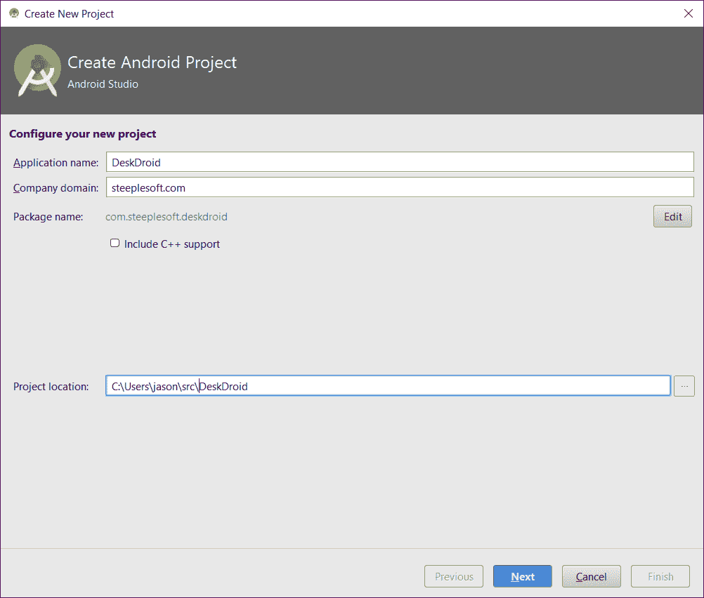
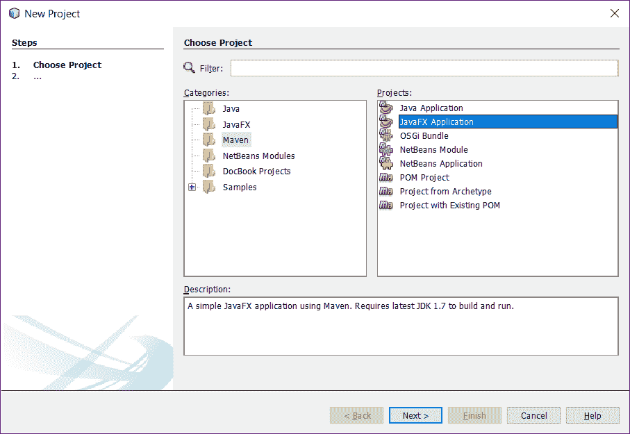
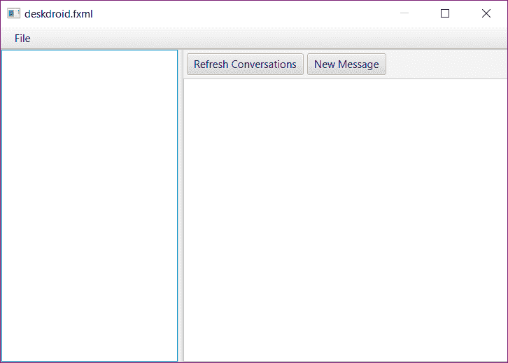
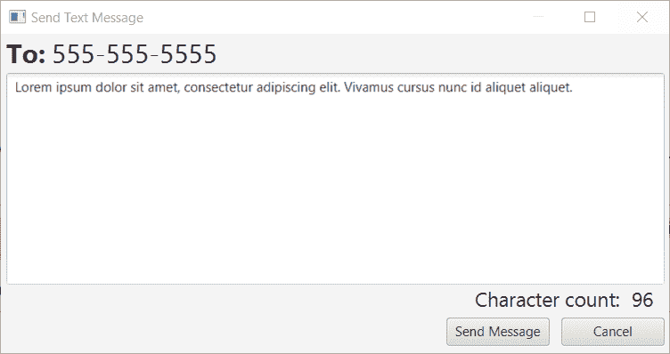
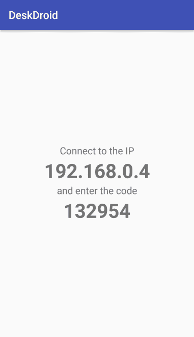

# DeskDroid-Android 手机的桌面客户端

我们终于到了最后一个项目。为了结束我们在一起的时光，我们将构建一个非常实用的应用程序，让我们在舒适的桌面上收发短信。现在市场上有很多产品都允许您这样做，但它们通常需要第三方服务，这意味着您的消息将通过其他人的服务器传播。对于注重隐私的人来说，这可能是一个真正的问题。我们将建立一个 100%本地的系统。

构建该应用程序将涉及几个不同的主题，有些是熟悉的，有些是新的。该清单包括以下内容：

*   Android 应用程序
*   安卓服务
*   REST 服务器
*   服务器已发送事件/数据流的事件
*   使用内容提供者进行数据访问

当我们以一种强烈的、高调的方式结束我们在一起的时光时，还会有很多其他的、小的花边新闻。

# 开始

本项目将分为两部分：

*   Android 应用程序/服务器（当然，不要与应用程序服务器混淆）
*   桌面/JavaFX 应用程序

没有**服务器**部分，桌面部分有些无用，因此我们将首先构建 Android 端。

# 创建 Android 项目

虽然到目前为止我们的大部分工作都在使用 NetBeans，但我们将再次使用 androidstudio 来完成这个项目。尽管有一些 Android 对 NetBeans 的支持，但在撰写本文时，该项目似乎已经停止。另一方面，Android Studio 由谷歌非常积极地开发，事实上，它是 Android 开发的官方 IDE。如果需要的话，我将把它作为一个练习留给读者来安装 IDE 和 SDK。

要创建新项目，请单击文件| new project，并指定应用程序名称、公司域和项目位置，如以下屏幕截图所示：



接下来，我们需要指定要针对的 API 版本。这可能是一个棘手的选择。一方面，我们希望站在最前沿，拥有 Android 提供给我们的所有伟大的新功能，但另一方面，我们不希望针对这样一个新的 API 级别，使更多的 Android 用户无法使用（读取可卸载）应用程序。在这种情况下，安卓 6.0 或棉花糖似乎是一个可以接受的折衷方案：


单击 Next，选择 Blank Activity、Next 和 Finish，我们的项目就可以进行开发了。

在 Android 方面，我们不会在用户界面方面做太多工作。一旦我们完成了项目，你可能会有各种各样的想法可以做什么，这是伟大的，但我们不会花时间在这里做任何这些。也就是说，我们真正需要做的第一件事就是请求用户允许访问他们手机上的短信。

# 请求权限

在 Android 的早期版本中，权限是一个要么全有，要么全无的命题。不过，从 Android 6 开始，应用程序请求的每个权限都会提示用户，允许用户授予某些权限，同时拒绝其他权限。我们需要请求一些权限——我们需要能够读写 SMS 消息，我们需要访问联系人（以便我们可以尝试找出是谁给我们发送了给定消息）。Android 提供了一个 API，可以非常轻松地请求这些权限，我们将把它放在我们的`onCreate()`方法中，如下所示：

```java
    public static final int PERMISSION_REQUEST_CODE = 42; 
    @Override 
    protected void onCreate(Bundle savedInstanceState) { 
      super.onCreate(savedInstanceState); 
     // ... 
     ActivityCompat.requestPermissions(this, 
            new String[]{ 
                    Manifest.permission.SEND_SMS, 
                    Manifest.permission.RECEIVE_SMS, 
                    Manifest.permission.READ_CONTACTS 
            }, 
            PERMISSION_REQUEST_CODE); 
    } 

```

当上述代码运行时，Android 将提示用户授予或拒绝请求的权限。这是异步完成的，因此，在您的应用程序中，您需要确保在用户有机会授予权限之前，您不会尝试任何需要您请求的任何权限的操作（并且，如果用户拒绝该权限，应用程序应该正常降级或失败）。

为了允许应用程序响应权限授予，Android 提供了回调。在我们的回调中，我们希望确保用户授予我们两个权限：

```java
    @Override 
    public void onRequestPermissionsResult(int requestCode, 
     String permissions[], int[] grantResults) { 
      switch (requestCode) { 
        case PERMISSION_REQUEST_CODE: { 
          if (grantResults.length != 3 
           || grantResults[0] !=  
                PackageManager.PERMISSION_GRANTED 
           || grantResults[1] !=  
                PackageManager.PERMISSION_GRANTED 
           || grantResults[2] !=  
                PackageManager.PERMISSION_GRANTED) { 
                  AlertDialog.Builder dialog =  
                    new AlertDialog.Builder(this); 
                  dialog.setCancelable(false); 
                  dialog.setTitle("Error"); 
                  dialog.setMessage("This app requires access
                   to text messages and contacts. Click OK
                   to close."); 
                  dialog.setPositiveButton("OK",  
                   new DialogInterface.OnClickListener() { 
                     @Override 
                     public void onClick(DialogInterface dialog,  
                      int id) { 
                        finish(); 
                      } 
                  }); 

                  final AlertDialog alert = dialog.create(); 
                  alert.show(); 
                } 
        } 
      } 
    } 

```

当 Android 调用我们的应用程序时，我们需要确保`requestCode`是我们指定的--`PERMISSION_REQUEST_CODE`，以确保我们只响应自己的请求。

一旦我们确定了一个合适的响应，我们就要确保`grantResults`是正确的长度，并且每个条目都是`PERMISSION_GRANTED`。如果数组太短，或者任一数组元素的类型不正确，我们将显示一个对话框，通知用户这两个权限都是必需的，然后退出应用程序。

在我们的示例中，我们同时请求两个权限，因此我们同时响应这两个权限。如果您有一组复杂的权限，例如，如果您的应用程序只能使用部分请求的权限，您可以多次调用`ActivityCompat.requestPermissions`，为每个请求提供不同的`requestCode`。然后，您需要在`onRequestPermissionsResult()`中扩展开关块，以覆盖每个新的`requestCode`。

关于权限的最后一句话。通常，您应该始终检查以确保您具有执行给定任务所需的权限。您可以使用以下方法执行此操作：

```java
    protected boolean checkPermission(Permissions permission) { 
      return ContextCompat.checkSelfPermission(this,  
        permission.permission) ==  
        PackageManager.PERMISSION_GRANTED; 
   } 

```

在我们的例子中，如果我们没有被授予所需的权限，我们就不允许应用程序运行，因此我们不必担心额外的权限检查。

# 创建服务

该项目 Android 部分的核心是我们的 REST 端点。我们希望这些端点在手机开机时都可用，因此我们不能使用`Activity`来承载它们。我们想要的是一个`Service`。Android 文档将`Service`定义为*可以在后台执行长时间运行操作的应用程序组件，不提供用户界面*。有三种类型的服务--`scheduled`（按计划运行）、`started`（可由另一个应用程序组件显式启动）和`bound`（通过`bindService()`调用绑定到应用程序组件，并运行到所有绑定组件被销毁为止）。由于我们希望该服务始终可用，因此我们需要一个已启动的服务。

要创建服务，请单击文件|新建|服务|服务。为服务输入`DeskDroidService`，取消选中导出，然后单击完成。这将获得以下存根代码：

```java
    public class DeskDroidService extends Service { 
      public DeskDroidService() { 
      } 

     @Override 
     public IBinder onBind(Intent intent) { 
       throw new UnsupportedOperationException( 
           "Not yet implemented"); 
     } 
    } 

```

向导还更新了`AndroidManifest.xml`如下：

```java
    <service 
      android:name=".DeskDroidService" 
      android:enabled="true" 
      android:exported="false" /> 

```

方法`onBind()`是抽象的，必须实现。我们并没有创建绑定服务，所以我们可以让它保持未实现状态，尽管我们将对其进行更改，使其返回`null`而不是抛出`Exception`。但是，我们对服务何时启动和停止感兴趣，因此我们需要覆盖这两种相关的生命周期方法：

```java
    public int onStartCommand(Intent intent, int flags, int startId) { 
      super.onStartCommand(intent, flags, startId); 
    }  
    public void onDestroy() { 
    } 

```

我们将在这些方法中放置 REST 服务代码。我们将再次使用 Jersey，JAX-RS 参考实现，它提供了一种在 JavaSE 环境中引导服务器的好方法，比如我们在 Android 应用程序中发现的东西。我们将把该逻辑封装在一个名为`startServer()`的新方法中，如下所示：

```java
    protected static Server server; 
    protected void startServer() { 
      WifiManager WifiMgr = (WifiManager) getApplicationContext() 
       .getSystemService(Service.Wifi_SERVICE); 
      if (WifiMgr.isWifiEnabled()) { 
        String ipAddress = Formatter. 
         formatIpAddress(WifiMgr.getConnectionInfo() 
          .getIpAddress()); 
        URI baseUri = UriBuilder.fromUri("http://" + ipAddress) 
         .port(49152) 
         .build(); 
        ResourceConfig config =  
          new ResourceConfig(SseFeature.class) 
           .register(JacksonFeature.class); 
        server = JettyHttpContainerFactory.createServer(baseUri, 
         config); 
      } 
    } 

```

我们要做的第一件事就是确认我们使用的是 Wi-Fi。这并不是严格必要的，但它似乎是一种谨慎的预防措施，以防止应用程序侦听连接，而不管网络状态如何。如果手机不在 Wi-Fi 上，则预期的笔记本电脑也很有可能不在 Wi-Fi 上。然而，即使在蜂窝网络上，也可能存在允许端点监听的合法用例。使此限制可配置是首选项驱动选项的最佳选择。

要使此代码正常工作，我们需要将此新权限添加到清单中：

```java
    <uses-permission android:name= 
      "android.permission.ACCESS_WIFI_STATE" /> 

```

一旦我们确定我们使用的是 Wi-Fi，我们就会查找我们的 IP 地址，并引导一个基于 Jetty 的 Jersey 服务器。向尊敬的 64 号准将致意，对于我们这些年纪大到足以记住这位计算机先驱的人来说，我们在 Wi-Fi 网络接口的端口`49152`上收听。

接下来，我们创建一个`ResourceConfig`实例，提供我们感兴趣的两个特性引用--`SseFeature`和`JacksonFeature`。我们已经看到了`JacksonFeature`；这就是为什么我们可以使用 POJOs，将 JSON 问题留给 Jersey。什么是`SseFeature`？

# 服务器发送事件

SSE，或服务器发送事件，是一种将数据从服务器流式传输到客户端的方法。通常，REST 请求是非常短暂的——建立连接、发送请求、获得响应、关闭连接。但是，有时候 REST 服务器可能没有客户端在请求时所需的所有数据（例如，从另一个数据源（如日志文件或网络套接字）读取数据）。因此，如果能够在数据可用时将其推送到客户机，那就太好了。这正是苏格兰和南方能源公司允许我们做的。稍后我们将更详细地研究这一点。

最后，我们通过调用`JettyHttpContainerFactory.createServer()`来启动服务器实例。因为我们需要能够在以后停止服务器，所以我们捕获服务器实例，并将其存储在实例变量中。我们从`onStartCommand()`中调用`startServer()`如下：

```java
    private static final Object lock = new Object(); 
    public int onStartCommand(Intent intent, int flags, int startId) { 
      super.onStartCommand(intent, flags, startId); 

      synchronized (lock) { 
        if (server == null) { 
          startServer(); 
          messageReceiver = new BroadcastReceiver() { 
            @Override 
            public void onReceive(Context context,  
             Intent intent) { 
               String code = intent.getStringExtra("code"); 
               DeskDroidService.this.code = code; 
               Log.d("receiver", "Got code: " + code); 
            } 
          }; 
          LocalBroadcastManager.getInstance(this). 
           registerReceiver( 
             messageReceiver,  
              new IntentFilter(CODE_GENERATED)); 
        } 
      } 

      return Service.START_STICKY; 
    } 

```

请注意，我们已将对`startServer()`的调用包装在`synchronized`块中。对于那些可能不知道的人来说，`synchronized`是 Java 开发人员可用的并发代码的更基本的方法之一。此关键字的净效果是，尝试执行此代码块的多个线程必须同步执行，或者一次执行一个。我们在这里这样做是为了，如果有两个不同的进程试图启动服务器，我们可以保证最多有一个进程正在运行。如果没有此块，第一个线程可以启动服务器并将实例存储在变量中，而第二个线程也可以执行相同的操作，但其存储在变量中的服务器实例无法启动。我们现在有一个正在运行的服务器，没有对它的有效引用，因此我们将无法停止它。

我们还注册了一个监听`CODE_GENERATED`的`BroadcastReceiver`。我们将在本章后面回来解释这一点，所以现在不要担心这一点。

# 控制服务状态

如果我们现在运行应用程序，我们的服务将无法运行，因此我们需要使其能够运行。我们将用两种不同的方式来做。第一种方法将来自我们的应用程序。我们希望在打开应用程序时确保服务正在运行，尤其是在刚刚安装应用程序之后。为此，我们需要在`MainActivity.onCreate()`中添加一行，如下所示：

```java
    startService(new Intent(this, DeskDroidService.class)); 

```

现在启动应用程序时，它将保证服务正在运行。但是，我们不希望要求用户打开应用程序来运行服务。幸运的是，我们有一种在手机启动时启动应用程序的方法。我们可以通过安装一个监听引导事件的`BroadcastReceiver`来实现这一点，如下所示：

```java
    public class BootReceiver extends BroadcastReceiver { 
      @Override 
      public void onReceive(Context context, Intent intent) { 
        context.startService(new Intent(context,  
         DeskDroidService.class)); 
      } 
    } 

```

上述方法的主体与我们最近添加到`MainActivity`的内容相同。不过，我们确实需要注册该服务，并请求许可。在`AndroidManifest.xml`中，我们需要添加以下内容：

```java
    <uses-permission android:name= 
      "android.permission.RECEIVE_BOOT_COMPLETED" /> 
    <receiver android:name=".BootReceiver" android:enabled="true"> 
      <intent-filter> 
        <action android:name= 
        "android.intent.action.BOOT_COMPLETED" /> 
      </intent-filter> 
    </receiver> 

```

我们现在有了一个在设备启动或应用程序启动时启动的服务。但是，它不做任何感兴趣的事情，因此我们需要向服务器添加一些端点。

# 向服务器添加端点

正如[第 9 章](09.html)所述，*用纪念碑*记录笔记，JAX-RS 资源生活在具有特定注释的 POJO 中。要删除端点类，我们可以从以下内容开始：

```java
    @Path("/") 
    @Produces(MediaType.APPLICATION_JSON) 
    protected class DeskDroidResource { 
    } 

```

我们还需要向 JAX-RS 注册这个类，这是我们在`startServer()`中的这一行所做的：

```java
    config.registerInstances(new DeskDroidResource()); 

```

通常，我们会传递，比如说，`DeskDroidResource.class`给`ResourceConfig`构造函数，就像我们传递`JacksonFeature.class`一样。我们将访问 Android 资源，为此，我们需要`Service`的`Context`实例。互联网上有很多资源建议创建一个定制的`Application`类并将其存储在`public static`中。虽然这看起来确实有效，但它也会泄漏内存，因此，举例来说，如果您尝试这样做，Android Studio 会抱怨。但是，我们可以通过使用嵌套类来避免这种情况。这种方法可能会有点笨拙，但我们的类应该足够小，以保持可管理性。

# 获取对话

让我们首先添加一个端点来获取电话上的所有对话，如下所示：

```java
    @GET 
    @Path("conversations") 
    public Response getConversations() { 
      List<Conversation> conversations = new ArrayList<>(); 
      Cursor cur = getApplication().getContentResolver() 
      .query(Telephony.Sms.Conversations.CONTENT_URI,  
      null, null, null, null); 
      while (cur.moveToNext()) { 
        conversations.add(buildConversation(cur)); 
      } 

      Collections.sort(conversations, new ConversationComparator()); 

      return Response.ok(new GenericEntity<List<Conversation>>( 
      conversations) {}).build(); 
     } 

```

这里是我们看到 Android 工件开始出现的地方——我们将使用`ContentProvider`来访问 SMS 数据。`ContentProvider`是一种应用程序，或者，在本例中，是一个 Android 子系统，以一种便携的、与存储无关的方式向外部消费者公开数据的方式。我们不在乎数据是如何存储的。我们只需指定我们想要的字段、我们想要对该数据设置的过滤器或限制，`ContentProvider`完成其余部分。

使用`ContentProvider`s，我们不是通过表名指定数据类型，就像使用 SQL 一样，而是通过`Uri`指定数据类型。在这种情况下，我们指定了`Telephony.Sms.Conversations.CONTENT_URI`。我们还将几个空值传递给`query()`。它们表示投影（或字段列表）、选择（或过滤器）、选择参数和排序顺序。因为这些都是`null`，所以我们希望提供者的每个字段和每一行都按自然排序顺序排列。这就得到了一个`Cursor`对象，然后我们对其进行迭代，创建`Conversation`对象，并将它们添加到`List`中。

我们用这个方法创建`Conversation`实例：

```java
    private Conversation buildConversation(Cursor cur) { 
      Conversation conv = new Conversation(); 
      final int threadId =  
        cur.getInt(cur.getColumnIndex("thread_id")); 
      conv.setThreadId(threadId); 
      conv.setMessageCount( 
        cur.getInt(cur.getColumnIndex("msg_count"))); 
      conv.setSnippet(cur.getString(cur.getColumnIndex("snippet"))); 
      final List<Message> messages =  
        getSmsMessages(conv.getThreadId()); 
      Set<String> participants = new HashSet<>(); 
      for (Message message : messages) { 
        if (!message.isMine()) { 
          participants.add(message.getAddress()); 
        } 
      } 
      conv.setParticipants(participants); 
      conv.setMessages(messages); 
      return conv; 
    } 

```

每个对话只是一个线程 ID、消息计数和最后接收到的消息片段。要获取实际消息，我们调用`getSmsMessages()`如下：

```java
    private List<Message> getSmsMessages(int threadId) { 
      List<Message> messages = new ArrayList<>(); 
      Cursor cur = null; 
      try { 
        cur = getApplicationContext().getContentResolver() 
         .query(Telephony.Sms.CONTENT_URI, 
         null, "thread_id = ?", new String[] 
         {Integer.toString(threadId)}, 
         "date DESC"); 

        while (cur.moveToNext()) { 
          Message message = new Message(); 
          message.setId(cur.getInt(cur.getColumnIndex("_id"))); 
          message.setThreadId(cur.getInt( 
            cur.getColumnIndex("thread_id"))); 
          message.setAddress(cur.getString( 
            cur.getColumnIndex("address"))); 
          message.setBody(cur.getString( 
            cur.getColumnIndexOrThrow("body"))); 
          message.setDate(new Date(cur.getLong( 
            cur.getColumnIndexOrThrow("date")))); 
          message.setMine(cur.getInt( 
            cur.getColumnIndex("type")) ==  
              Telephony.Sms.MESSAGE_TYPE_SENT); 
          messages.add(message); 
        } 
      } catch (Exception e) { 
          e.printStackTrace(); 
      } finally { 
          if (cur != null) { 
            cur.close(); 
          } 
      } 
      return messages; 
    } 

```

此方法和处理逻辑与对话的方法基本相同。当然，`ContentProvider``Telephony.Sms.CONTENT_URI`的`Uri`是不同的，我们为查询指定了一个过滤器，如下所示：

```java
    cur = getApplicationContext().getContentResolver().query( 
      Telephony.Sms.CONTENT_URI, 
       null, "thread_id = ?", new String[] 
       {Integer.toString(threadId)}, 
       "date DESC"); 

```

我们这里确实有一些数据分析。我们需要知道哪些消息是我们发送的，哪些是我们收到的，这样我们才能更有意义地显示线程。在设备上，我们发送的消息类型为`Telephony.Sms.MESSAGE_TYPE_SENT`。此字段的值大致转换为文件夹（已发送、已接收、草稿等）。我们没有通过共享常量的值将部分 Android API 泄漏到我们的 API 中，而是有一个`boolean`字段`isMine`，如果消息类型为`MESSAGE_TYPE_SENT`，则为真。诚然，这是一个有点笨拙的选择，但它是有效的，应该足够清晰。

一旦我们返回消息列表，我们就在列表上迭代，得到一个唯一参与者的列表（应该只有一个，因为我们正在处理 SMS 消息）。

最后，我们使用 Jersey 的 POJO 映射功能将此`List<Conversation>`返回给客户端，如下所示：

```java
    return Response.ok(new GenericEntity<List<Conversation>>( 
      conversations) {}).build();

```


如果我们单击 run 或 debug 按钮（工具栏中的大三角形或 triangle-over-a-bug 图标），将要求您提供部署目标，如此屏幕截图所示：


因为我们需要 Wi-Fi，所以我选择了我的物理设备。如果你想配置一个带有 Wi-Fi 的模拟器，那也可以。单击“确定”，几分钟后，应用程序将在您选择的设备上启动，我们可以按如下方式发出第一个 REST 请求：

```java
    $ curl http://192.168.0.2:49152/conversations | jq . 
    [ 
    { 
      "messageCount": 2, 
      "messages": [ 
        { 
          "address": "5551234567", 
          "body": "Demo message", 
          "date": 1493269498618, 
          "id": 301, 
          "mine": true, 
          "threadId": 89 
        }, 
        { 
          "address": "+15551234567", 
          "body": "Demo message", 
          "date": 1493269498727, 
          "id": 302, 
          "mine": false, 
          "threadId": 89 
        } 
      ], 
      "participants": [ "+15551234567" ], 
      "snippet": "Demo message", 
      "threadId": 89 
    } 
    ] 

```

前面的示例代码显示了我与自己的对话。也许有太多的深夜，但你可以看到第一条消息，最早的消息，被标记为我的，这是我发给自己的，第二条是我收到它的地方。很酷，但是你怎么发送信息呢？事实证明，这其实很简单。

# 发送短信

为了发送消息，我们将创建一个 POST 端点，该端点接受一个`Message`对象，然后将其分离并传递给 Android 的电话 API。

```java
    @POST 
    @Path("conversations") 
    public Response sendMessage(Message message)  
    throws InterruptedException { 
       final SmsManager sms = SmsManager.getDefault(); 
       final ArrayList<String> parts =  
       sms.divideMessage(message.getBody()); 
       final CountDownLatch sentLatch =  
       new CountDownLatch(parts.size()); 
       final AtomicInteger statusCode = new AtomicInteger( 
       Response.Status.CREATED.getStatusCode()); 
       final BroadcastReceiver receiver = new BroadcastReceiver() { 
       @Override 
       public void onReceive(Context context, Intent intent) { 
            if (getResultCode() != Activity.RESULT_OK) { 
                    statusCode.set( 
                        Response.Status.INTERNAL_SERVER_ERROR 
                            .getStatusCode()); 
            } 
             sentLatch.countDown(); 
          } 
        }; 
      registerReceiver(receiver,  
      new IntentFilter("com.steeplesoft.deskdroid.SMS_SENT")); 
      ArrayList<PendingIntent> sentPIs = new ArrayList<>(); 
      for (int i = 0; i < parts.size(); i++) { 
         sentPIs.add(PendingIntent.getBroadcast( 
            getApplicationContext(), 0, 
            new Intent("com.steeplesoft.deskdroid.SMS_SENT"), 0)); 
      } 
      sms.sendMultipartTextMessage(message.getAddress(), null,  
      parts, sentPIs, null); 

      sentLatch.await(5, TimeUnit.SECONDS); 
      unregisterReceiver(receiver); 
      return Response.status(statusCode.get()).build(); 
     } 

```

这种方法有很多优点。以下是分项数字：

1.  我们得到了`SmsManager`类的引用。这个班将为我们做所有的工作。
2.  我们要求`SmsManager`为我们分配信息。文本消息通常限制为 160 个字符，因此这将根据需要拆分消息。
3.  我们创建一个`CountDownLatch`，其计数与消息中的部分数量相匹配。

4.  我们创建一个`AtomicInteger`来存储状态代码。稍后我们将看到，我们需要在匿名类中更改此变量的值。但是，对于一个匿名类来说，要从其封闭范围访问变量，这些变量必须是`final`，这意味着我们不能有`final int`，因为那样我们就无法更改该值。但是，使用`AtomicInteger`，我们可以调用`set()`来更改值，同时保持实例引用（变量将保持不变）不变。
5.  我们创建了一个新的`BroadcastReceiver`，它将在消息发送时处理`Intent`的广播（我们将进一步了解）。在`onReceive()`中，如果结果代码不是`ACTIVITY.RESULT_OK`，我们调用`AtomicInteger.set()`来反映故障。然后我们调用`sentLatch.countDown()`来表示该消息部分已被处理。
6.  通过调用`registerReceiver()`，我们让操作系统知道我们的新接收器。我们提供一个`IntentFilter`来限制我们的接收者必须处理的`Intents`。
7.  然后，我们为消息分成的每个部分创建一个新的`PendingIntent`。这将允许我们分别对每个部分的发送尝试作出反应。
8.  我们呼叫`sendMultipartTextMessage()`发送消息部分。Android 为我们处理多部分消息的细节，因此不需要额外的工作。
9.  我们需要等待所有消息部分被发送，因此我们调用`sentLatch.await()`给系统发送消息的时间。不过，我们不想永远等待，所以我们给它 5 秒钟的超时时间，这应该足够长了。可以想象，某些网络发送短信的速度可能非常慢，因此可能需要调整此值。
10.  一旦我们通过闩锁，我们`unregister`就会打开接收器，并返回状态码。

再次使用 curl，我们现在可以测试发送消息（确保再次单击`Run`或`Debug`部署更新的代码）：

```java
        $ curl -v -X POST -H 'Content-type: application/json'
        http://192.168.0.2:49152/conversations -d 
        '{"address":"++15551234567", "body":"Lorem ipsum dolor sit 
         amet..."}' 
        > POST /conversations HTTP/1.1 
        > Content-type: application/json 
        > Content-Length: 482 
        < HTTP/1.1 201 Created 

```

在前面的`curl`中，我们向收件人发送了一些`lorem ipsum`文本，这会给我们一条漂亮的长消息（请求有效负载总共 482 个字符），该消息被正确地分组并发送到目标电话号码，如`201 Created`响应状态所示。

我们现在有了手机上的工作休息服务，可以让我们阅读现有的信息并发送新的信息。与`curl`的服务交互已经足够好了，但现在是构建我们的桌面客户端的时候了，并且在这个项目上展现出一副漂亮的面孔。

# 创建桌面应用程序

为了构建我们的应用程序，我们将返回 NetBeans 和 JavaFX。与前几章一样，我们将通过单击 File | new Project 创建一个新的基于 Maven 的 JavaFX 应用程序：



在下一步中，调用项目`deskdroid-desktop`，验证包名，然后单击 Finish。虽然没有严格必要，但让我们稍微清理一下命名，将控制器更改为`DeskDroidController`，将 FXML 文件更改为`deskdroid.fxml`。我们还需要修改控制器中对 FXML 和 CSS 的引用，以及 FXML 中对控制器的引用。单击 Run | Run Project 以确保所有内容都正确连接。一旦应用程序启动，我们可以立即关闭它，以便开始进行更改。

# 定义用户界面

让我们从构建用户界面开始。下面是应用程序的外观：



在前面的屏幕中，我们将在左侧显示对话列表，并在右侧显示所选对话。我们将添加自动刷新机制，但如果需要，刷新会话将允许手动刷新。新信息应该是不言自明的。

当然，我们可以使用胶子的场景生成器来构建用户界面，但是让我们来看看 FXML。像往常一样，我们将从一个`BorderPane`开始，如下所示：

```java
    <BorderPane fx:id="borderPane" minWidth="1024" prefHeight="768"  

    xmlns:fx="http://javafx.com/fxml/1"  
    fx:controller="com.steeplesoft.deskdroid.
    desktop.DeskDroidController"> 

```

对于`top`部分，我们将添加一个菜单栏，如下所示：

```java
    <MenuBar BorderPane.alignment="CENTER"> 
      <menus> 
        <Menu text="_File"> 
            <items> 
                <MenuItem onAction="#connectToPhone"  
                    text="_Connect to Phone" /> 
                <MenuItem onAction="#disconnectFromPhone"  
                    text="_Disconnect from Phone" /> 
                <MenuItem onAction="#closeApplication"  
                    text="E_xit"> 
                    <accelerator> 
                        <KeyCodeCombination alt="ANY" code="F4"  
                            control="UP" meta="UP" shift="UP"  
                            shortcut="UP" /> 
                    </accelerator> 
                </MenuItem> 
              </items> 
          </Menu> 
       </menus> 
    </MenuBar> 

```

我们将在`FileMenu``connectToPhone``disconnectFromPhone`和`Exit`中设置三个`MenuItem`。每个菜单项都有一个助记符，如下划线所示。`ExitMenuItem`有一把加速键`ALT-F4`。

我们将把大部分用户界面放在`center`部分。垂直分割允许我们调整用户界面两侧的大小。为此，我们使用`SplitPane`如下：

```java
    <center> 
      <SplitPane dividerPositions="0.25"  
        BorderPane.alignment="CENTER"> 
      <items> 

```

使用`dividerPositions`时，我们将默认拆分设置为沿水平规则的 25%标记。`SplitPane`有一个嵌套的`items`元素来保存其子元素，我们将左侧元素`ListView`添加到该元素中：

```java
    <VBox> 
      <children> 
        <ListView fx:id="convList" VBox.vgrow="ALWAYS" /> 
      </children> 
    </VBox> 

```

我们将`ListView`包裹在`VBox`中，使`ListView`在需要时更容易生长和收缩。

最后，让我们构建用户界面的右侧：

```java
     <VBox fx:id="convContainer"> 
       <children> 
        <HBox> 
            <children> 
                <Button mnemonicParsing="false"  
                        onAction="#refreshConversations"  
                        text="Refresh Conversations"> 
                    <HBox.margin> 
                        <Insets right="5.0" /> 
                    </HBox.margin> 
                </Button> 
                <Button fx:id="newMessageBtn"  
                    text="New Message" /> 
            </children> 
            <padding> 
                <Insets bottom="5.0" left="5.0"  
                    right="5.0" top="5.0" /> 
            </padding> 
        </HBox> 
        <ListView fx:id="messageList" VBox.vgrow="ALWAYS" /> 
      </children> 
    </VBox> 

```

在右边，我们还有一个`VBox`，我们用它来安排我们的两个用户界面元素。第一个是`HBox`，它有两个按钮：刷新对话和新建消息。第二个是显示所选对话的`ListView`。

# 定义用户界面行为

虽然我们可以在 FXML 中定义用户界面的结构，但除了最普通的应用程序外，用户界面仍然需要一些 Java 代码来完成其行为的定义。我们现在将在`DeskDroidController.initialize()`中这样做。我们将从用户界面左侧的对话列表开始，如下所示：

```java
    @FXML 
    private ListView<Conversation> convList; 
    private final ObservableList<Conversation> conversations =  
    FXCollections.observableArrayList(); 
    private final SimpleObjectProperty<Conversation> conversation =  
    new SimpleObjectProperty<>(); 
    @Override 
    public void initialize(URL url, ResourceBundle rb) { 
      convList.setCellFactory(list ->  
      new ConversationCell(convList)); 
      convList.setItems(conversations); 
       convList.getSelectionModel().selectedItemProperty() 
            .addListener((observable, oldValue, newValue) -> { 
                conversation.set(newValue); 
                messages.setAll(newValue.getMessages()); 
                messageList.scrollTo(messages.size() - 1); 
     }); 

```

我们声明一个可注入变量来保存对`ListView`的引用。由于注释`@FXML`，JavaFX 将为我们设置该值。`ListView`将需要一个模型来显示，我们将其声明为`conversations`，并声明`conversation`来保存当前选择的对话。

在`initialize()`方法中，我们将所有东西连接在一起。由于`ListView`将显示我们的域对象，我们需要为它声明一个`CellFactory`，这是我们对传递给`setCellFactory()`的 lambda 所做的。我们马上来看`ListCell`。

接下来，我们将`ListView`与其模型`conversations`相关联，并定义什么实际上是`onClick`侦听器。不过，我们通过在`ListView`上的`SelectionModel`中添加一个侦听器来实现这一点。在该侦听器中，我们更新当前选择的对话，更新消息`ListView`以显示对话，并将该消息`ListView`滚动到最底部，以便我们看到最近的消息。

初始化消息`ListView`要简单得多。我们需要这些实例变量：

```java
    @FXML 
    private ListView<Message> messageList; 
    private final ObservableList<Message> messages =  
    FXCollections.observableArrayList(); 

```

我们在`initialize()`中也需要这些行：

```java
    messageList.setCellFactory(list -> new MessageCell(messageList)); 
    messageList.setItems(messages); 

```

新消息按钮需要一个处理程序：

```java
    newMessageBtn.setOnAction(event -> sendNewMessage()); 

```

`ConversationCell`告诉 JavaFX 如何显示`Conversation`实例。为此，我们创建了一个新的`ListCell`子项，如下所示：

```java
    public class ConversationCell extends ListCell<Conversation> { 

```

然后我们覆盖`updateItem()`：

```java
    @Override 
    protected void updateItem(Conversation conversation,  
    boolean empty) { 
    super.updateItem(conversation, empty); 
    if (conversation != null) { 
        setWrapText(true); 
        final Participant participant =  
            ConversationService.getInstance() 
                .getParticipant(conversation 
                    .getParticipant()); 
        HBox hbox = createWrapper(participant); 

        hbox.getChildren().add( 
            createConversationSnippet(participant,  
                conversation.getSnippet())); 
        setGraphic(hbox); 
     } else { 
        setGraphic(null); 
     } 
    } 

```

如果给该单元格一个`Conversation`，我们将对其进行处理。如果不是，我们将单元格的图形设置为 null。如果我们做不到这一点，在滚动列表时会出现不可预测的结果。

要构建单元格内容，我们首先获取`Participant`并创建包装器组件，如下所示：

```java
    protected HBox createWrapper(final Participant participant) { 
      HBox hbox = new HBox(); 
      hbox.setManaged(true); 
      ImageView thumbNail = new ImageView(); 
      thumbNail.prefWidth(65); 
      thumbNail.setPreserveRatio(true); 
      thumbNail.setFitHeight(65); 
      thumbNail.setImage(new Image( 
        ConversationService.getInstance() 
           .getParticipantThumbnail( 
               participant.getPhoneNumber()))); 
      hbox.getChildren().add(thumbNail); 
      return hbox; 
    } 

```

这是相当标准的 JavaFX 票价——创建一个`HBox`，然后添加一个`ImageView`。不过，我们正在使用一个我们还没有看过的类--`ConversationService`。稍后我们将讨论这个问题，但现在，我们只需知道我们将在这个类中封装 REST 调用。在这里，我们正在呼叫一个端点（我们还没有看到），以获取对话另一端的电话号码的联系信息。

我们还需要创建对话片段，如下所示：

```java
    protected VBox createConversationSnippet( 
     final Participant participant, String snippet) { 
      VBox vbox = new VBox(); 
      vbox.setPadding(new Insets(0, 0, 0, 5)); 
      Label sender = new Label(participant.getName()); 
      sender.setWrapText(true); 
      Label phoneNumber = new Label(participant.getPhoneNumber()); 
      phoneNumber.setWrapText(true); 
      Label label = new Label(snippet); 
      label.setWrapText(true); 
      vbox.getChildren().addAll(sender, phoneNumber, label); 
      return vbox; 
    } 

```

使用`VBox`确保垂直对齐，我们创建了两个标签，一个是参与者的信息，另一个是对话片段。

虽然这就完成了单元格定义，但如果我们按照现在的方式运行应用程序，`ListCell`的内容很可能会被`ListView`本身的边缘裁剪。例如，请在以下屏幕截图中查看顶部列表和底部列表之间的差异：


为了使我们的`ListCell`像我们在最后一个屏幕底部看到的那样运行，我们需要对我们的代码再做一次更改，如下所示：

```java
    public ConversationCell(ListView list) { 
      super(); 
      prefWidthProperty().bind(list.widthProperty().subtract(2)); 
      setMaxWidth(Control.USE_PREF_SIZE); 
    } 

```

在我们前面的`CellFactory`中，我们传递了对所附`ListView`的引用。

```java
    convList.setCellFactory(list -> new ConversationCell(convList)); 

```

在构造函数中，我们将单元格的首选宽度绑定到列表的实际宽度（并减去一小部分以调整控件边框）。现在渲染时，我们的单元格将按预期进行包装。

`MessageCell`的定义类似，如下所示：

```java
    public class MessageCell extends ListCell<Message> { 
      public MessageCell(ListView list) { 
          prefWidthProperty() 
            .bind(list.widthProperty().subtract(20)); 
          setMaxWidth(Control.USE_PREF_SIZE); 
      } 

    @Override 
    public void updateItem(Message message, boolean empty) { 
        super.updateItem(message, empty); 
        if (message != null && !empty) { 
            if (message.isMine()) { 
                wrapMyMessage(message); 
            } else { 
                wrapTheirMessage(message); 
            } 
         } else { 
            setGraphic(null); 
        } 
    } 

```

对于*我的*消息，我们通过以下方式创建内容：

```java
    private static final SimpleDateFormat DATE_FORMAT =  
     new SimpleDateFormat("EEE, MM/dd/yyyy hh:mm aa"); 
    private void wrapMyMessage(Message message) { 
     HBox hbox = new HBox(); 
     hbox.setAlignment(Pos.TOP_RIGHT); 
     createMessageBox(message, hbox, Pos.TOP_RIGHT); 
     setGraphic(hbox); 
    } 
    private void createMessageBox(Message message, Pane parent,  
     Pos alignment) { 
       VBox vbox = new VBox(); 
       vbox.setAlignment(alignment); 
       vbox.setPadding(new Insets(0,0,0,5)); 
       Label body = new Label(); 
       body.setWrapText(true); 
       body.setText(message.getBody()); 

       Label date = new Label(); 
       date.setText(DATE_FORMAT.format(message.getDate())); 

       vbox.getChildren().addAll(body,date); 
       parent.getChildren().add(vbox); 
    } 

```

**消息框**与前面的对话片段非常相似——垂直显示消息，后跟日期和时间。此格式将由*我的*消息和*他们的*消息使用，因此我们使用`javafx.geometry.Pos`分别将控件向右或向左对齐。

*他们的*消息是这样创建的：

```java
    private void wrapTheirMessage(Message message) { 
      HBox hbox = new HBox(); 
      ImageView thumbNail = new ImageView(); 
      thumbNail.prefWidth(65); 
      thumbNail.setPreserveRatio(true); 
      thumbNail.setFitHeight(65); 
      thumbNail.setImage(new Image( 
            ConversationService.getInstance() 
                .getParticipantThumbnail( 
                    message.getAddress()))); 
      hbox.getChildren().add(thumbNail); 
      createMessageBox(message, hbox, Pos.TOP_LEFT); 
      setGraphic(hbox); 
   } 

```

这类似于*我的*消息，除了显示发件人的个人资料图片（如果手机上有联系人相关的图片），我们通过`ConversationService`类从手机中检索。

我们还有一些工作要做，但这就是应用程序在处理数据时的样子：


为了获取数据，我们需要一个 REST 客户端，可以在`ConversationService`中找到：

```java
    public class ConversationService { 
      public static class LazyHolder { 
        public static final ConversationService INSTANCE =  
            new ConversationService(); 
      } 

     public static ConversationService getInstance() { 
        return LazyHolder.INSTANCE; 
      } 
     private ConversationService() { 
        Configuration configuration = new ResourceConfig() 
                .register(JacksonFeature.class) 
                .register(SseFeature.class); 
        client = ClientBuilder.newClient(configuration); 
     } 

```

使用所谓的*按需初始化持有者*成语，我们创造了一种穷人的单身生活。由于构造函数是私有的，因此不能在此类之外调用它。嵌套的静态类`LazyHolder`只有在最终引用时才会初始化，这发生在第一次调用`getInstance()`时。一旦调用了该方法，`LazyHolder`被加载并初始化，此时，构造函数将运行。创建的实例存储在静态变量中，只要 JVM 运行，它就会一直存在。每个后续调用都将返回相同的实例。这对我们很重要，因为我们在类中有一些创建成本很高的对象以及一些简单的缓存：

```java
    protected final Client client; 
    protected final Map<String, Participant> participants =  
      new HashMap<>(); 

```

在前面的代码中，我们初始化了我们的客户机实例，注册了`JacksonFeature`，这就得到了我们已经讨论过的 POJO 映射。我们还注册了`SseFeature`，这是 Jersey 的一个更高级的功能，我们将在后面详细讨论。

我们已经看到了对话列表。使用此方法中的数据生成的：

```java
    public List<Conversation> getConversations() { 
      List<Conversation> list; 
      try { 
       list = getWebTarget().path("conversations") 
                .request(MediaType.APPLICATION_JSON) 
                .header(HttpHeaders.AUTHORIZATION,  
                    getAuthorizationHeader()) 
                .get(new GenericType<List<Conversation>>() {}); 
       } catch (Exception ce) { 
        list = new ArrayList<>(); 
      } 
      return list; 
    } 
    public WebTarget getWebTarget() { 
    return client.target("http://" 
            + preferences.getPhoneAddress() + ":49152/"); 
    } 

```

`WebTarget`是一个 JAX-RS 类，表示由资源 URI 标识的*资源目标。我们正在从首选项中提取电话的地址，稍后将讨论。一旦我们有了`WebTarget`，我们就通过添加`conversations`来完成 URI 的构建，指定请求 mime 类型，并发出`GET`请求。请注意，这里的请求有些乐观，因为我们不进行任何状态代码检查。如果抛出一个`Exception`，我们只需返回一个空的`List`。*

我们看到的另一种方法是`getParticipant()`，如下所示：

```java
    public Participant getParticipant(String number) { 
      Participant p = participants.get(number); 
      if (p == null) { 
        Response response = getWebTarget() 
                .path("participants") 
                .path(number) 
                .request(MediaType.APPLICATION_JSON) 
                .header(HttpHeaders.AUTHORIZATION,  
                    getAuthorizationHeader()) 
                .get(Response.class); 
        if (response.getStatus() == 200) { 
            p = response.readEntity(Participant.class); 
            participants.put(number, p); 
            if (p.getThumbnail() != null) { 
                File thumb = new File(number + ".png"); 
                try (OutputStream stream =  
                        new FileOutputStream(thumb)) { 
                    byte[] data = DatatypeConverter 
                        .parseBase64Binary(p.getThumbnail()); 
                    stream.write(data); 
                } catch (IOException e) { 
                    e.printStackTrace(); 
                } 
             } 
          } 
       } 
     return p; 
   } 

```

在最后一种方法中，我们看到缓存发挥作用。当请求`Participant`时，我们查看是否已经获取了此信息。如果是这样，我们将返回缓存的信息。如果没有，我们可以提出申请。

与`getConversations(),`非常相似，我们为适当的端点构建了一个请求，并发送`GET`请求。不过，这次我们会检查状态代码。只有当状态为`200 (OK)`时，我们才能继续处理响应。在本例中，我们向 JAX-RS 请求返回的`Participant`实例，`JacksonFeature`愉快地从 JSON 响应体为我们构建了该实例，我们立即将其添加到缓存中。

如果服务器找到联系人的缩略图，我们需要处理它。在讨论完这个方法后，我们将立即查看服务器部分，它将缩略图作为 JSON 对象主体中的 base64 编码字符串发送，因此我们将其转换回二进制表示形式，并将其保存到一个文件中。请注意，我们使用的是 try with 资源，因此我们不必担心自己之后的清理。

```java
    try (OutputStream stream = new FileOutputStream(thumb)) 

```

我们还没有看到这个操作的服务器端，现在让我们来看一下。在 Android Studio 中的 Android 应用程序中，我们在`DeskDroidResource`上有此方法：

```java
    @GET 
    @Path("participants/{address}") 
    public Response getParticipant(@PathParam("address")  
    String address) { 
      Participant p = null; 
      try { 
        p = getContactsDetails(address); 
        } catch (IOException e) { 
        return Response.serverError().build(); 
       } 
      if (p == null) { 
        return Response.status(Response.Status.NOT_FOUND).build(); 
       } else { 
        return Response.ok(p).build(); 
       } 
    } 

```

我们尝试构建`Participant`实例。如果抛出异常，我们将返回一个`500`（服务器错误）。如果返回了`null`，则返回一个`404`（未找到）。如果找到参与者，我们返回`200`（确定）和参与者。

要构建参与者，我们需要查询电话联系人。这与 SMS 查询的工作方式大致相同：

```java
    protected Participant getContactsDetails(String address) throws 
     IOException { 
      Uri contactUri = Uri.withAppendedPath( 
        ContactsContract.PhoneLookup.CONTENT_FILTER_URI,  
        Uri.encode(address)); 
        Cursor phones = deskDroidService.getApplicationContext() 
        .getContentResolver().query(contactUri, 
        new String[]{ 
          ContactsContract.CommonDataKinds.Phone.DISPLAY_NAME, 
          "number", 
          ContactsContract.CommonDataKinds.Phone 
            .PHOTO_THUMBNAIL_URI}, 
            null, null, null); 
        Participant participant = new Participant(); 
        if (phones.moveToNext()) { 
          participant.setName(phones.getString(phones 
          .getColumnIndex( 
          ContactsContract.CommonDataKinds.Phone 
           .DISPLAY_NAME))); 
          participant.setPhoneNumber(phones.getString( 
            phones.getColumnIndex("number"))); 
          String image_uri = phones.getString( 
            phones.getColumnIndex( 
              ContactsContract.CommonDataKinds.Phone 
               .PHOTO_THUMBNAIL_URI)); 
          if (image_uri != null) { 
            try (InputStream input = deskDroidService 
              .getApplicationContext().getContentResolver() 
              .openInputStream(Uri.parse(image_uri)); 
            ByteArrayOutputStream buffer = 
              new ByteArrayOutputStream()) { 
                int nRead; 
                byte[] data = new byte[16384]; 

                while ((nRead = input.read(data, 0,  
                        data.length)) != -1) { 
                    buffer.write(data, 0, nRead); 
                } 

                buffer.flush(); 
                participant.setThumbnail(Base64 
                    .encodeToString(buffer.toByteArray(),  
                        Base64.DEFAULT)); 
            } catch (IOException e) { 
                e.printStackTrace(); 
              } 
            } 
        } 
        phones.close(); 
        return participant; 
    } 

```

前面的查询和游标管理类型与我们在前面的对话中看到的相同，但有一个例外。如果联系人有缩略图，查询将向该图像返回一个`Uri`。我们可以使用`ContentResolver`打开`InputStream`，使用`Uri`读取内容，并将其加载到`ByteArrayOutputStream`中。使用 Android 的`Base64`类，我们将这个二值图像编码为`String`，并将其添加到`Participant`模型中。我们在前面看到了此操作的一半解码。

# 发送消息

现在我们可以看到我们一直在进行的对话了，我们需要添加参与这些对话的功能——发送新的文本消息。我们从客户机开始。实际上，我们已经看到分配的`New Message`按钮的处理程序。详情如下:

```java
    newMessageBtn.setOnAction(event -> sendNewMessage()); 

```

我们现在需要做的是看看这个`sendNewMessage()`方法本身：

```java
    private void sendNewMessage() { 
      Optional<String> result = SendMessageDialogController 
        .showAndWait(conversation.get()); 
      if (result.isPresent()) { 
        Conversation conv = conversation.get(); 
        Message message = new Message(); 
        message.setThreadId(conv.getThreadId()); 
        message.setAddress(conv.getParticipant()); 
        message.setBody(result.get()); 
        message.setMine(true); 
        if (cs.sendMessage(message)) { 
            conv.getMessages().add(message); 
            messages.add(message); 
        } else { 
            Alert alert = new Alert(AlertType.ERROR); 
            alert.setTitle("Error"); 
            alert.setHeaderText( 
                "An error occured while sending the message."); 
            alert.showAndWait(); 
        } 
      } 
    } 

```

实际对话框显示在另一个窗口中，因此我们有一个单独的 FXML 文件`message_dialog.fxml`和控制器`SendMessageDialogController`。当对话框关闭时，我们检查返回`Optional`以查看用户是否输入了消息。如果是，请按如下方式处理该消息：

1.  获取对所选`Conversation`的引用。
2.  创建新邮件，设置对话 ID、收件人和正文。
3.  使用`ConversationService`，我们尝试发送消息：
    1.  如果成功，我们将使用新消息更新用户界面。
    2.  如果失败，我们将显示一条错误消息。

`SendMessageController`和我们看到的其他控制器一样工作。最有趣的是方法`showAndWait()`。我们将使用该方法显示对话框，等待它关闭，然后将任何用户响应返回给调用方。该对话框如下所示：



方法如下所示：

```java
    public static Optional<String> showAndWait( 
      Conversation conversation) { 
      try { 
        FXMLLoader loader =  
            new FXMLLoader(SendMessageDialogController.class 
                .getResource("/fxml/message_dialog.fxml")); 
        Stage stage = new Stage(); 
        stage.setScene(new Scene(loader.load())); 
        stage.setTitle("Send Text Message"); 
        stage.initModality(Modality.APPLICATION_MODAL); 
        final SendMessageDialogController controller =  
            (SendMessageDialogController) loader.getController(); 
        controller.setConversation(conversation); 
        stage.showAndWait(); 
        return controller.getMessage(); 
      } catch (IOException ex) { 
          throw new RuntimeException(ex); 
      } 
    } 

```

前面方法中的前几行是我们通常看到的，即创建加载器和`Stage`。在显示`Stage`之前，我们设置了模态，并传入当前`Conversation`。最后，我们调用`showAndWait()`，在这一点上，方法阻塞，直到用户关闭对话框，然后我们返回输入的消息：

```java
    public Optional<String> getMessage() { 
      return Optional.ofNullable(message); 
    } 

```

Java`Optional`是*容器对象，它可能包含也可能不包含非空值*。`message`的值可以设置，也可以不设置，具体取决于对话框中单击的按钮。使用`Optional`，我们可以返回一个可能为空的值，并在调用方`if (result.isPresent())`中更安全地处理它。

消息的发送是`ConversationService`中一个简单的 POST 操作，如下所示：

```java
    public boolean sendMessage(Message message) { 
      Response r = getWebTarget().path("conversations") 
        .request() 
        .header(HttpHeaders.AUTHORIZATION, 
          getAuthorizationHeader()) 
        .post(Entity.json(message)); 
      return r.getStatus() == Response.Status.CREATED 
        .getStatusCode(); 
    } 

```

客户端很简单，但是服务器端呢？毫不奇怪，这就是复杂性所在：

```java
    @POST 
    @Path("conversations") 
    public Response sendMessage(Message message) throws
    InterruptedException { 
      final SmsManager sms = SmsManager.getDefault(); 
      final ArrayList<String> parts =  
        sms.divideMessage(message.getBody()); 

```

为了添加端点，我们定义了一个带有正确注释的新方法。此方法将在路径`conversations`上侦听`POST`请求，并期望一个`Message`作为其有效负载。发送消息的实际工作由`SmsManager`处理，因此我们获取对默认管理器的引用。下一步调用`divideMessage()`，但这是怎么回事？

从技术上讲，短信的长度限制为 160 个字符。推特用户可能已经有点熟悉了。Twitter 将 tweet 限制为 140 个字符，留下 20 个字符作为发送者的名字。虽然推特已经很难做到这一点，但普通短信用户的体验更好。如果信息长度超过 160 个字符，大多数现代手机在发送时会将信息分为 153 个字符段（7 个字符用于分段信息，用于将这些段重新组合在一起），如果手机支持，这些信息会在接收端重新合并为一条信息。`SmsManager`API 通过`divideMessage()`为我们处理了这种复杂性。

然而，一旦信息被*分块*，我们的工作就会变得更加困难。我们希望能够返回一个状态码，指示消息是否成功发送。要做到这一点，我们需要检查消息的每个块的状态，不管是一块还是十块。通过发送带有`SmsManager`的短信，Android 会播放带有结果的`Intent`。对此，我们需要注册一个接收器。把这些放在一起，我们得到了以下代码：

```java
    final CountDownLatch sentLatch = new CountDownLatch(parts.size()); 
    final AtomicInteger statusCode = 
      new AtomicInteger( 
        Response.Status.CREATED.getStatusCode()); 
    final BroadcastReceiver receiver = new BroadcastReceiver() { 
      @Override 
      public void onReceive(Context context, Intent intent) { 
        if (getResultCode() != Activity.RESULT_OK) { 
          statusCode.set(Response.Status. 
           INTERNAL_SERVER_ERROR.getStatusCode()); 
        } 
        sentLatch.countDown(); 
      } 
    }; 
    deskDroidService.registerReceiver(receiver,  
      new IntentFilter("com.steeplesoft.deskdroid.SMS_SENT")); 
    ArrayList<PendingIntent> sentPIs = new ArrayList<>(); 
    for (int i = 0; i < parts.size(); i++) { 
      sentPIs.add(PendingIntent.getBroadcast( 
        deskDroidService.getApplicationContext(), 0, 
        new Intent("com.steeplesoft.deskdroid.SMS_SENT"), 0)); 
    } 
    sms.sendMultipartTextMessage(message.getAddress(), null,
    parts, sentPIs, null); 
    sentLatch.await(5, TimeUnit.SECONDS); 
    deskDroidService.unregisterReceiver(receiver); 
    return Response.status(statusCode.get()).build(); 

```

为了确保我们已经收到每个消息块的`Intent`，我们首先创建一个`CountDownLatch`，其计数与消息中的块数匹配。我们还创建了一个`AtomicInteger`来保存状态代码。我们这样做的原因是我们需要一个最终的变量，我们可以从我们的`BroadcastReceiver`访问它，但我们也需要能够更改值。`AtomicInteger`允许我们这样做。

我们创建并注册了一个`BroadcastReceiver`，用于分析`Intent`上的结果代码。如果不是`Activity.RESULT_OK`，我们将`statusCode`设置为`INTERNAL_SERVER_ERROR`。不管怎样，我们都要倒计时。

在接收者准备就绪的情况下，我们创建一个`PendingIntent`的`List`，每个区块一个，然后我们将其与消息区块列表一起传递给`SmsManager.sendMultipartTextMessage()`。消息发送是异步的，所以我们调用`sentLatch.await()`等待返回结果。我们将等待时间限制在五秒钟，这样我们就不会永远等待。一旦等待时间到期或闩锁被清除，我们将注销接收器并返回状态代码。

# 获取更新

到目前为止，我们可以查看所有对话，查看对话中的单个消息，并发送新消息。我们现在还不能做的是在新消息到达设备时获取更新，所以现在让我们实现它，这次从服务器开始。

为了获得一个恒定的事件流，我们将使用一个名为 Server Sent events 的特性，这是一个 W3C 规范，用于从服务器接收推送通知。我们在 Jersey 中通过在客户端和服务器设置步骤中注册`SseFeature`来启用此功能。为了创建 SSE 端点，我们指定该方法返回媒体类型`SERVER_SENT_EVENTS`，并返回`EventOutput`作为有效负载：

```java
    @GET 
    @Path("status") 
    @Produces(SseFeature.SERVER_SENT_EVENTS) 
    @Secure 
    public EventOutput streamStatus() { 
      final EventOutput eventOutput = new EventOutput(); 
      // ... 
      return eventOutput; 
    } 

```

从泽西岛文档中，我们了解到：

从方法返回 eventOutput 后，Jersey 运行时会识别出这是一个 ChunkeOutput 扩展，并且不会立即关闭客户端连接。相反，它将 HTTP 头写入响应流，并等待发送更多的块（SSE 事件）。此时，客户端可以读取头并开始侦听单个事件。

然后，服务器使客户端的套接字保持打开状态，并向下推送数据。但这些数据来自哪里？服务器发送的事件端点创建一个`Thread`，将数据写入我们之前创建的`EventOutput`实例。当`Thread`完成时，它调用`eventOutput.close()`，这会向运行时发出信号，表明关闭客户端连接是合适的。要流式更新，我们的`Thread`如下所示：

```java
    final Thread thread = new Thread() { 
      @Override 
      public void run() { 
        final LinkedBlockingQueue<SmsMessage> queue =  
          new LinkedBlockingQueue<>(); 
        BroadcastReceiver receiver = null; 
        try { 
          receiver = new BroadcastReceiver() { 
            @Override 
            public void onReceive(Context context,  
             Intent intent) { 
               Bundle intentExtras = intent.getExtras(); 
               if (intentExtras != null) { 
                 Object[] sms = (Object[])  
                  intentExtras.get("pdus"); 
                 for (int i = 0; i < sms.length; ++i) { 
                   SmsMessage smsMessage =  
                     SmsMessage.createFromPdu( 
                       (byte[]) sms[i]); 
                       queue.add(smsMessage); 
                 } 
               } 
            } 
          }; 
          deskDroidService.registerReceiver(receiver, 
           new IntentFilter( 
             "android.provider.Telephony.SMS_RECEIVED")); 
          while (!eventOutput.isClosed()) { 
            SmsMessage message = queue.poll(5,  
             TimeUnit.SECONDS); 
            while (message != null) { 
              JSONObject json = new JSONObject() 
               .put("participant", message. 
                getDisplayOriginatingAddress()) 
               .put("body", message. 
                getDisplayMessageBody()); 
              eventOutput.write(new OutboundEvent.Builder() 
               .name("new-message") 
               .data(json.toString()) 
               .build() 
              ); 
              message = queue.poll(); 
            } 
          } 
        } catch (JSONException | InterruptedException |  
           IOException e) { 
          } finally { 
              try { 
                if (receiver != null) { 
                  deskDroidService.unregisterReceiver(receiver); 
                } 
                eventOutput.close(); 
              } catch (IOException ioClose) { 
                  // ... 
                } 
            } 
      } 
    }; 
    thread.setDaemon(true); 
    thread.start(); 

```

正如我们之前所看到的，我们设置了一个`BroadcastReceiver`，我们在这里注册并在`Thread`结束前取消注册，但这一次，我们正在收听接收到短信的广播。为了确保我们的`Thread`不是在一个小的、紧密的、快速的循环中，这会很快耗尽设备上的电池，我们使用`LinkedBlockingQueue`。当收到消息时，我们从`Intent`中提取`SmsMessage`，并将其添加到`queue`。在我们的 while 循环中，我们试图从`queue`中`take()`找到一个项目。如果我们找到了一个，我们将处理它以及可能已经在队列中或在处理过程中添加的任何其他内容。一旦`queue`空了，我们就回去等待。我们在`take()`上有一个超时，以确保线程能够响应退出条件，最明显的是，客户端断开连接。只要客户端保持连接，此操作就会运行。那么，让我们看看客户。

我们将细节封装在`ConversationService.subscribeToNewMessageEvents()`中，如下所示：

```java
    public void subscribeToNewMessageEvents( 
      Consumer<Message> callback) { 
        Thread thread = new Thread() { 
          @Override 
          public void run() { 
            stopListening = false; 
            EventInput eventInput = getWebTarget().path("status") 
             .request() 
             .header(HttpHeaders.AUTHORIZATION,  
              getAuthorizationHeader()) 
               .get(EventInput.class); 
            while (!eventInput.isClosed() && !stopListening) { 
              final InboundEvent inboundEvent =  
                eventInput.read(); 
              if (inboundEvent == null) { 
                // connection has been closed 
                break; 
              } 
              if ("new-message".equals(inboundEvent.getName())){ 
                Message message =  
                  inboundEvent.readData(Message.class); 
                if (message != null) { 
                  callback.accept(message); 
                } 
              } 
            } 
          } 
        }; 
        thread.setDaemon(true); 
        thread.start(); 
    } 

```

在前面的代码中，我们创建了一个`Thread`，在其中我们对 SSE 端点进行了调用。客户端返回类型为`EventInput`。我们循环处理每一个传入事件，得到一个`InboundEvent`。如果为 null，则连接已关闭，因此我们中断处理循环。如果不为 null，则确保事件名称与我们等待的内容匹配--`new-message`。如果找到，我们提取事件负载 a`Message`，并调用回调，我们将其作为`Consumer<Message>`传入。

从应用程序本身，我们通过以下方式订阅状态流：

```java
    cs.subscribeToNewMessageEvents(this::handleMessageReceived); 

```

`handleMessageReceived()`看起来像这样：

```java
    protected void handleMessageReceived(final Message message) { 
      Platform.runLater(() -> { 
        Optional<Conversation> optional = conversations.stream() 
          .filter(c -> Objects.equal(c.getParticipant(),  
           message.getAddress())) 
          .findFirst(); 
        if (optional.isPresent()) { 
          Conversation c = optional.get(); 
          c.getMessages().add(message); 
          c.setSnippet(message.getBody()); 
          convList.refresh(); 
          if (c == conversation.get()) { 
            messages.setAll(c.getMessages()); 
            messageList.scrollTo(messages.size() - 1); 
          } 
        } else { 
            Conversation newConv = new Conversation(); 
            newConv.setParticipant(message.getAddress()); 
            newConv.setSnippet(message.getBody()); 
            newConv.setMessages(Arrays.asList(message)); 
            conversations.add(0, newConv); 
        } 
        final Taskbar taskbar = Taskbar.getTaskbar(); 
        if (taskbar.isSupported(Taskbar.Feature.USER_ATTENTION)) { 
          taskbar.requestUserAttention(true, false); 
        } 
        Toolkit.getDefaultToolkit().beep(); 
      }); 
    } 

```

处理这个新消息的第一步非常重要——我们将`Runnable`传递给`Platform.runLater()`。如果我们不这样做，任何修改用户界面的尝试都将失败。你已经被警告了。在我们的`Runnable`中，我们创建一个`Conversation`s 的`Stream``filter()`it，寻找一个`Conversation`的参与者与`Message`发送者匹配，然后获取第一个（也是唯一一个）匹配。

如果我们在列表中找到了`Conversation`，我们将这个新的`Message`添加到它的列表中，并更新片段（这只是`Conversation`的最后一个消息体）。我们还要求`Conversation`列表对`refresh()`本身进行修改，以确保用户界面反映这些更改。最后，如果`Conversation`是当前选中的，我们将更新消息列表并滚动到底部，以确保显示新消息。

如果我们在列表中找不到`Conversation`，我们会创建一个新的`Conversation`，并将其添加到`ConversationObservable`中，这会导致`List`在屏幕上自动更新。

最后，我们尝试了几个桌面集成任务。如果`Taskbar`支持`USER_ATTENTION`功能，请用户注意。从 Javadocs 中我们了解到，*根据平台的不同，这可能通过任务区域*中的反弹或闪烁图标直观地指示。不管怎样，我们发出嘟嘟声以引起用户的注意。

# 安全

还有最后一个我们没有讨论的主要问题，那就是安全性。目前，理论上，任何使用桌面应用程序的人都可以连接到您的手机，查看您的消息，发送其他信息，等等。我们现在来解决这个问题。

# 保护端点

为了保护 REST 服务器的安全，我们将使用一个过滤器，就像我们在[第 9 章](09.html)中使用的一样，*用纪念碑*记笔记。我们将首先定义注释，该注释将指定需要保护哪些端点，如下所示：

```java
    @NameBinding 
    @Retention(RetentionPolicy.RUNTIME) 
    @Target({ElementType.TYPE, ElementType.METHOD}) 
    public @interface Secure {} 

```

我们将对每个安全端点应用前面的注释（为简洁起见，注释压缩为一行）：

```java
    @GET @Path("conversations") @Secure 
    public Response getConversations() { 
      ... 
      @POST @Path("conversations") @Secure 
      public Response sendMessage(Message message)  
       throws InterruptedException { 
         ... 
         @GET @Path("status") @Produces(SseFeature.SERVER_SENT_EVENTS)  
         @Secure 
         public EventOutput streamStatus() { 
           ... 
           @GET @Path("participants/{address}") @Secure 
           public Response getParticipant( 
             @PathParam("address") String address) { 
               ... 

```

我们还需要一个过滤器来加强安全性，我们添加了如下内容：

```java
    @Provider 
    @Secure 
    @Priority(Priorities.AUTHENTICATION) 
    public class SecureFilter implements ContainerRequestFilter { 
      private DeskDroidService deskDroidService; 

      public SecureFilter(DeskDroidService deskDroidService) { 
        this.deskDroidService = deskDroidService; 
      } 

      @Override 
      public void filter(ContainerRequestContext requestContext)  
        throws IOException { 
          try { 
            String authorizationHeader = requestContext. 
             getHeaderString(HttpHeaders.AUTHORIZATION); 
            String token = authorizationHeader. 
             substring("Bearer".length()).trim(); 
            final Key key = KeyGenerator. 
             getKey(deskDroidService.getApplicationContext()); 
            final JwtParser jwtParser =  
              Jwts.parser().setSigningKey(key); 
            jwtParser.parseClaimsJws(token); 
          } catch (Exception e) { 
              requestContext.abortWith(Response.status( 
                Response.Status.UNAUTHORIZED).build()); 
            } 
      } 
    } 

```

就像在[第 9 章](09.html)*中使用纪念碑*记笔记一样，我们将使用**JSON Web 令牌**（**JWT**来帮助验证和授权客户端。在此过滤器中，我们从请求头中提取 JWT，并通过以下步骤进行验证：

1.  从`KeyGenerator`获取签名密钥。
2.  使用签名密钥创建`JwtParser`。
3.  解析 JWT 中的声明。就我们这里的目的而言，这基本上只是对令牌本身的验证。
4.  如果令牌无效，则使用`UNAUTHORIZED`（`401`中止请求。

`KeyGenerator`本身看起来有点像我们在[第 9 章](09.html)中看到的*用纪念碑*记笔记，但已经修改为以这种方式使用 Android API：

```java
    public class KeyGenerator { 
      private static Key key; 
      private static final Object lock = new Object(); 

      public static Key getKey(Context context) { 
        synchronized (lock) { 
          if (key == null) { 
            SharedPreferences sharedPref =  
              context.getSharedPreferences( 
                context.getString( 
                  R.string.preference_deskdroid),  
                   Context.MODE_PRIVATE); 
                  String signingKey = sharedPref.getString( 
                    context.getString( 
                      R.string.preference_signing_key), null); 
                  if (signingKey == null) { 
                    signingKey = UUID.randomUUID().toString(); 
                    final SharedPreferences.Editor edit =  
                      sharedPref.edit(); 
                    edit.putString(context.getString( 
                      R.string.preference_signing_key), 
                       signingKey); 
                    edit.commit(); 
                  } 
                  key = new SecretKeySpec(signingKey.getBytes(),
                   0, signingKey.getBytes().length, "DES"); 
          } 
        } 

        return key; 
      } 
    } 

```

由于我们可能一次接收来自多个客户端的请求，因此我们需要小心密钥的生成方式。为了确保只执行一次，我们将使用在服务器启动中看到的相同类型的同步/锁定。

一旦获得了锁，我们将执行空检查，以查看进程是否已经生成（或读取）密钥。如果没有，则从`SharedPreferences`读取签名密钥。如果为空，我们将创建一个随机字符串（这里只是一个 UUID），并将其保存到`SharedPreferences`以便下次重用。请注意，要保存到 Android 首选项，我们必须获取一个实例`SharedPreferences.Editor`，编写字符串，然后是`commit()`。一旦我们有了签名密钥，我们就创建了实际的`SecretKeySpec`，用于签名和验证 JWT。

# 处理授权请求

现在我们的端点安全了，我们需要一种客户端请求授权的方法。为此，我们将公开一个新的端点，当然是不安全的，如下所示：

```java
    @POST 
    @Path("authorize") 
    @Consumes(MediaType.TEXT_PLAIN) 
    public Response getAuthorization(String clientCode) { 
      if (clientCode != null &&  
        clientCode.equals(deskDroidService.code)) { 
          String jwt = Jwts.builder() 
           .setSubject("DeskDroid") 
           .signWith(SignatureAlgorithm.HS512, 
            KeyGenerator.getKey( 
              deskDroidService.getApplicationContext())) 
               .compact(); 
          LocalBroadcastManager.getInstance( 
            deskDroidService.getApplicationContext()) 
           .sendBroadcast(new Intent( 
               DeskDroidService.CODE_ACCEPTED)); 
        return Response.ok(jwt).build(); 
      } 
      return Response.status(Response.Status.UNAUTHORIZED).build(); 
    } 

```

与需要更复杂的授权系统（可能需要用户名和密码或 OAuth2 提供程序）不同，我们将实现一个只需要随机数的简单系统：

1.  在手机上，用户请求添加一个新的客户端，并显示一个随机数。
2.  在桌面应用程序中，用户输入数字，然后桌面应用程序将其发布到服务器。
3.  如果数字匹配，客户机将获得一个 JWT，它将随每个请求一起发送。
4.  每次都会验证 JWT，以确保客户端有权访问目标资源。

在这种方法中，我们获得客户机发布的号码（我们让 JAX-RS 从请求体中提取该号码），然后将其与电话上生成的号码进行比较。如果它们匹配，我们创建 JWT，并将其返回给客户机。在这样做之前，我们用动作`CODE_ACCEPTED`广播一个意图。

这个数字是从哪里来的？我们为什么要传播这个意图？我们还没有详细研究这个，但是在主布局中，`activity_main.xml`，有一个`FloatingActionButton`。为此，我们附上一个`onClick`侦听器，如下所示：

```java
    FloatingActionButton fab =  
      (FloatingActionButton) findViewById(R.id.fab); 
    fab.setOnClickListener(new View.OnClickListener() { 
      @Override 
      public void onClick(View view) { 
        startActivityForResult(new Intent( 
          getApplicationContext(),  
          AuthorizeClientActivity.class), 1); 
      } 
    }); 

```

当用户点击按钮时，将显示以下屏幕：



客户端将使用此信息连接并获得授权。`Activity`本身是相当基本的。它需要提供 IP 地址和代码，然后响应客户端连接。所有这些都是在我们新的`AuthorizeClientActivity`课程`onCreate()`中完成的。我们从`WifiManager`获得 IP：

```java
    WifiManager wifiMgr = (WifiManager) getApplicationContext(). 
     getSystemService(WIFI_SERVICE); 
    String ipAddress = Formatter.formatIpAddress(wifiMgr. 
     getConnectionInfo().getIpAddress()); 

```

请记住，我们要求客户端位于 Wi-Fi 网络上。代码只是一个随机的 6 位数字：

```java
    String code = Integer.toString(100000 +  
     new Random().nextInt(900000)); 

```

为了监听我们前面看到的`Intent`，它表示客户机已经过身份验证（这可能会在显示`Activity`后不久发生），我们注册了另一个接收者，如下所示：

```java
    messageReceiver = new BroadcastReceiver() { 
      @Override 
      public void onReceive(Context context, Intent intent) { 
        clientAuthenticated(); 
      } 
    }; 
    LocalBroadcastManager.getInstance(this).registerReceiver( 
      messageReceiver, new IntentFilter( 
        DeskDroidService.CODE_ACCEPTED)); 

```

我们还需要告诉`Service`这个新代码是什么，以便它能够验证它。为此，我们播放了一段`Intent`如下：

```java
    Intent intent = new Intent(DeskDroidService.CODE_GENERATED); 
    intent.putExtra("code", code); 
    LocalBroadcastManager.getInstance(this).sendBroadcast(intent); 

```

我们已经在前面的`DeskDroidService.onStartCommand()`中看到了此广播的另一半，其中代码从`Intent`中检索，并存储在服务中供`DeskDroidResource.getAuthorization()`使用。

最后，这个处理认证通知的方法只是清理接收者并关闭`Activity`：

```java
    protected void clientAuthenticated() { 
      LocalBroadcastManager.getInstance(this). 
        unregisterReceiver(messageReceiver); 
      setResult(2, new Intent()); 
      finish(); 
    } 

```

这样，当客户端连接并成功认证时，`Activity`关闭，用户返回主`Activity`。

# 授权客户

到目前为止，一切都假设桌面已经连接到手机。现在我们已经准备好了足够的材料，我们可以用有意义的方式来讨论这一点。

在应用程序的主`Menu`中，我们有两个`MenuItem`：`Connect to Phone`和`Disconnect from Phone`。`Connect to Phone`处理程序如下所示：

```java
    @FXML 
    protected void connectToPhone(ActionEvent event) { 
      ConnectToPhoneController.showAndWait(); 
      if (!preferences.getToken().isEmpty()) { 
        refreshAndListen(); 
      } 
    } 

```

我们将使用现在熟悉的`showAndWait()`模式来显示模式对话框，并使用新的`ConnectToPhoneController`获取响应。用户界面非常简单，如下屏幕截图所示：


当用户单击 OK 时，我们将地址和代码保存在应用程序的首选项中，然后尝试针对服务器进行授权，如下所示：

```java
    @FXML 
    public void connectToPhone(ActionEvent event) { 
      String address = phoneAddress.getText(); 
      String code = securityCode.getText(); 
      preferences.setPhoneAddress(address); 
      final ConversationService conversationService =  
        ConversationService.getInstance(); 

      conversationService.setPhoneAddress(address); 
      Optional<String> token = conversationService 
        .getAuthorization(code); 
      if (token.isPresent()) { 
        preferences.setToken(token.get()); 
        closeDialog(event); 
      } 
    } 

```

注意使用`Optional<String>`作为`ConversationService.getAuthorization()`的返回类型。如前所述，使用`Optional`可以使使用潜在`null`值更加安全。在这种情况下，如果`Optional`存在一个值，那么我们已经成功地进行了身份验证。因此，我们将令牌保存到首选项，并关闭对话框。

实际认证由`ConversationService`处理：

```java
    public Optional<String> getAuthorization(String code) { 
      Response response = getWebTarget().path("authorize") 
       .request(MediaType.APPLICATION_JSON) 
       .post(Entity.text(code)); 
      Optional<String> result; 
      if(response.getStatus()==Response.Status.OK.getStatusCode()) { 
        token = response.readEntity(String.class); 
        result = Optional.of(token); 
      } else { 
          result = Optional.empty(); 
      } 
      return result; 
    } 

```

最后一种方法通过`POST`将代码发送到服务器，如果状态代码为`200`，我们将使用返回的令牌创建一个`Optional`。否则，我们返回一个空的`Optional`。

# 总结

在本章中，我们构建了一个不同类型的项目。我们有在 Android 上运行的应用程序，还有一些在桌面上运行。不过，这一个可以同时在两个平台上运行。一个没有另一个是不行的。这需要我们构建一些不同的东西，以确保两者同步。虽然有多种方法可以实现这一点，但我们选择在手机上使用 REST 服务器，桌面充当 REST 客户端。

在本章结束时，我们构建了一个 Android 应用程序，它不仅提供了用户界面，还提供了一个后台进程（称为`Service`），并使用 Jersey 及其 JavaSE 部署选项将我们的 REST 服务器嵌入到 Android 应用程序中。您还学习了如何使用系统提供的内容提供商和平台 API 在 Android 上与文本（SMS）消息交互，并使用服务器发送的事件将这些消息流式传输到客户端。我们演示了如何在 Android 中使用`Intent`s、广播和`BroadcastReceiver`s 在进程/线程之间发送消息。最后，在桌面端，我们构建了一个 JavaFX 客户端来显示和发送文本消息，它通过 Jersey REST 客户端连接到手机上的 REST 服务器，并使用服务器发送的事件流，根据需要更新用户界面。

对于所有活动部件，这可能是我们项目中最复杂的部分。这无疑是一个完善我们项目清单的好方法。在下一章中，我们将看一看 Java 的下一步，以及其他一些可能会在您的雷达上出现的技术。