# Java9 入门

你想学习 Java，你有很好的理由。Java 是一种现代且成熟的应用程序编程语言，广泛应用于许多行业，如电信、金融或其他行业。Java 开发人员的职位最多，而且可能是薪酬最高的。除其他外，这使得年轻专业人士学习这门语言非常有利可图。另一方面，这并非没有理由。Java 语言、工具以及围绕它的整个基础设施都是复杂而复杂的。成为 Java 专业人士不是一天或一周的事；这是一部多年的作品。要成为 Java 专家，您不仅需要了解编程语言，还需要了解面向对象编程原理、开放源代码库、应用程序服务器、网络、数据库以及许多其他您可以成为专家的东西。然而，学习这门语言是所有其他实践都必须建立的基础。通过本书，您将能够学习 Java 版本 9 以及更多内容。

在本章中，将向您介绍 Java 环境，并提供有关如何安装、编辑示例代码、编译和运行 Java 的分步说明。您将熟悉帮助开发的基本工具，无论它们是 Java 的一部分还是由其他供应商提供的。本章将介绍以下主题：

*   Java 简介
*   安装 Windows、Linux 和 Mac OS X
*   执行`jshell`
*   使用其他 Java 工具
*   使用集成开发环境

# Java 入门

这就像穿过森林中的一条小路。你可以把注意力集中在路上的碎石上，但这是毫无意义的。相反，你可以欣赏周围的风景、树木、鸟类和环境，这更令人愉快。这本书很相似，因为我不会只关注语言。我会不时地介绍一些与实际情况相近的话题，并为您提供一些概述和指导，让您在读完本书后可以进一步了解这些话题。我将不仅教您该语言，还将介绍一些算法、面向对象编程原理、围绕 Java 开发的工具以及专业人员的工作方式。这将与我们将遵循的编码示例混合在一起。最后，最后一章将全面介绍这个主题，接下来要学习什么，以及如何进一步成为一名专业 Java 开发人员。

到本书出版时，Java 已经完成了 22 年。[http://www.oracle.com/technetwork/java/javase/overview/javahistory-index-198355.html](http://www.oracle.com/technetwork/java/javase/overview/javahistory-index-198355.html) 。在这段时间里，语言发生了很大的变化，并且变得更好。真正要问的问题不是它在这里多久了，而是它会在这里呆多久？这门语言还值得学吗？自从 Java 诞生以来，已经开发了许多新语言（[http://blog.takipi.com/java-vs-net-vs-python-vs-ruby-vs-node-js-who-reigns-the-job-market/](http://blog.takipi.com/java-vs-net-vs-python-vs-ruby-vs-node-js-who-reigns-the-job-market/) ）。这些语言更加现代，并且具有函数式编程特性，顺便说一下，Java 自版本 8 以来也具有函数式编程特性。许多人说 Java 已经成为过去，而未来是 Scala、Swift、Go、Kotlin、JavaScript 等等。您可以将许多其他语言添加到此列表中，对于每种语言，您都可以找到一篇庆祝 Java 埋葬的博客文章。对此问题有两个答案，一个是务实的商业方法，另一个是更具工程性的方法：

*   考虑到 COBOL 仍在金融业中被广泛使用，而且 COBOL 开发人员的薪酬可能比 Java 开发人员高，所以说作为一名 Java 开发人员，您将在未来 40 年内找到工作并不太冒险。就我个人而言，我会赌 100 多年，但考虑到我的年龄，预测未来 20 到 40 年是不公平的。
*   Java 不仅仅是一种语言；这也是一项技术，您将从本书中了解一些。该技术包括通常称为 JVM 的**Java 虚拟机**（**JVM**），为多种语言提供了运行环境。例如，Kotlin 和 Scala 不能在没有 JVM 的情况下运行。即使 Java 将成为先兆，JVM 仍将是企业场景中的头号玩家。

理解和学习 JVM 的基本操作几乎和语言本身一样重要。Java 是一种编译和解释语言。它是一种特殊的野兽，能锻造两个世界中最好的一面。在 Java 之前，有解释语言和编译语言。

解释语言由解释器从源代码中读取，然后解释器执行代码。在每种语言中，都有一些初步的词汇和语法分析步骤；然而，在这之后，解释器（作为程序本身，由处理器和解释器连续执行）解释程序代码以知道该做什么。编译语言是不同的。在这种情况下，源代码被编译成二进制文件（Windows 平台上的`.exe`文件），由操作系统加载，处理器直接执行。编译后的程序通常运行得更快，但通常有一个较慢的编译阶段，这可能会使开发速度变慢，而且执行环境也不太灵活。Java 结合了这两种方法。

要执行 Java 程序，必须将 Java 源代码编译成 JVM 字节码（`.class`文件），该字节码由 JVM 加载并进行解释或编译。隐马尔可夫模型。。。它是解释的还是编译的？Java 附带的东西是**实时（JIT）**编译器。这使得编译阶段的计算密集型和编译语言的编译相对缓慢。JVM 首先开始解释 Java 字节码，同时跟踪执行统计信息。当它收集到足够的代码执行统计信息时，它会编译为本机代码（例如，Intel/AMD 平台上的 x86 代码），以便直接执行频繁执行的代码部分，并不断解释很少使用的代码片段。毕竟，为什么要浪费昂贵的 CPU 时间来编译一些很少使用的代码呢？（例如，在启动期间读取配置的代码，除非应用程序服务器重新启动，否则不会再次执行。）字节码的编译速度很快，代码生成仅针对有回报的段。

另一个有趣的是，JIT 使用代码执行的统计信息来优化代码。例如，如果它看到某个条件分支在 99%的情况下执行，而另一个分支仅在 1%的情况下执行，那么它将生成运行速度快的本机代码，从而有利于频繁的分支。如果程序的这一部分的行为随时间而变化，并且统计数据显示比率发生了变化，那么 JIT 会不时地自动重新编译字节码。这一切都是自动的和幕后的。

除了自动编译之外，JVM 还有一个极其重要的特性，它管理 Java 程序的内存。现代语言的执行环境就是这样做的，Java 是第一种具有自动垃圾收集（GC）功能的主流语言。在 Java 之前，我用 C 语言编程已经有 20 年了，跟踪所有内存分配是一件非常痛苦的事情，当程序不再需要内存时，不要忘记释放内存。忘记了代码中某一点的内存分配，长时间运行的程序正在慢慢消耗所有内存。这种问题在 Java 中几乎不存在。GC 需要处理器容量和一些额外的内存，这是我们必须付出的代价，但在大多数企业应用程序中，这是我们不缺少的。一些特殊的程序，比如控制重型卡车刹车的实时嵌入式系统，可能没有这样的奢侈。这些程序仍然是用汇编或 C 语言编写的。对于我们其他人来说，我们有 Java，尽管这对许多专业人士来说似乎很奇怪，甚至*几乎是实时的*程序，比如高频交易应用程序，都是用 Java 编写的。

这些应用程序通过网络连接到证券交易所，它们根据市场变化在毫秒内进行股票买卖。Java 能够做到这一点。执行编译后的 Java 代码所需的 Java 运行时环境（也包括 JVM 本身）包含允许 Java 程序访问网络、磁盘上的文件和其他资源的代码。为此，运行时包含代码可以实例化、执行并执行低级作业的高级类。你也会这样做。这意味着，在某些微服务体系结构中，当实际 Java 代码想要使用或提供 REST 服务时，它不需要处理 IP 数据包、TCP 连接甚至 HTTP 处理。它已经在运行库中实现，应用程序程序员所要做的就是在代码中包含类，并在与程序匹配的抽象级别上使用它们提供的 API。当你用 Java 编程时，你可以专注于你想要解决的实际问题，那就是*业务*代码，而不是底层系统代码。如果它不在标准库中，您将在某个外部库中的某个产品中找到它，并且您很可能会找到解决该问题的开源解决方案。

这也是 Java 的一个优点。有大量的开源库可用于各种不同的目的。如果您无法找到一个适合您的问题的库，如果您开始编写一些低级代码，那么您可能做错了什么。本书中的一些主题很重要，例如类装入器或反射，这不是因为您必须每天使用它们，而是因为它们被框架使用，了解它们有助于理解这些框架是如何工作的。如果不使用反射或直接编写自己的类加载器或程序多线程就无法解决问题，那么您可能选择了错误的框架。几乎可以肯定有一个很好的例子：apacheproject、Google 和软件行业的许多其他重要参与者将其 Java 库发布为开源。

多线程编程也是如此。Java 从一开始就是一个多线程编程环境。JVM 和运行时支持执行代码的程序。执行在多个线程上并行运行。有一些运行时语言结构支持从极低级别到高度抽象的并行执行程序。多线程代码使用多核处理器，这更有效。这些处理器越来越普遍。20 年前，只有高端服务器有多个处理器，只有数字 Alpha 处理器有 64 位体系结构，CPU 时钟高于 100 MHz。10 年前，多处理器结构在服务器端很常见，大约 5 年前，多核处理器出现在一些台式机和笔记本电脑上。今天，即使是手机也有。当 Java 在 1995 年诞生时，创造它的天才们看到了这个未来。

他们设想 Java 是一种只写一次，在任何地方运行的语言。当时，该语言的第一个目标是在浏览器中运行的小程序。今天，许多人认为（我也同意这一观点）applet 是一个错误的目标，或者至少事情没有以正确的方式进行。就目前而言，与 Flash 应用程序或恐龙相比，你在互联网上遇到小程序的频率会更低。

然而，与此同时，Java 解释器也在不使用任何浏览器的情况下执行服务器和客户端应用程序；此外，随着语言和执行环境的发展，这些应用领域变得越来越重要。如今，Java 主要用于企业计算和移动应用，主要用于 Android 平台；未来，随着**物联网**（**物联网**）越来越多地进入人们的视野，环境在嵌入式系统中的应用也在不断增长。

# 安装 Java

要开发、编译和执行 Java 程序，需要 Java 执行环境。由于我们通常用于软件开发的操作系统不包含预先安装的语言，因此您必须下载它。尽管该语言有多种实现，但我建议您从 Oracle 下载该软件的正式版本。java 的官方网站是[http://java.com](http://java.com) 这是一个可以下载该语言最新版本的网站。在撰写本书时，Java 的第 9 版尚未发布。可通过[访问早期预发布版本 http://jdk9.java.net/](http://jdk9.java.net/) 下载。稍后的发布版本也将从这里提供。

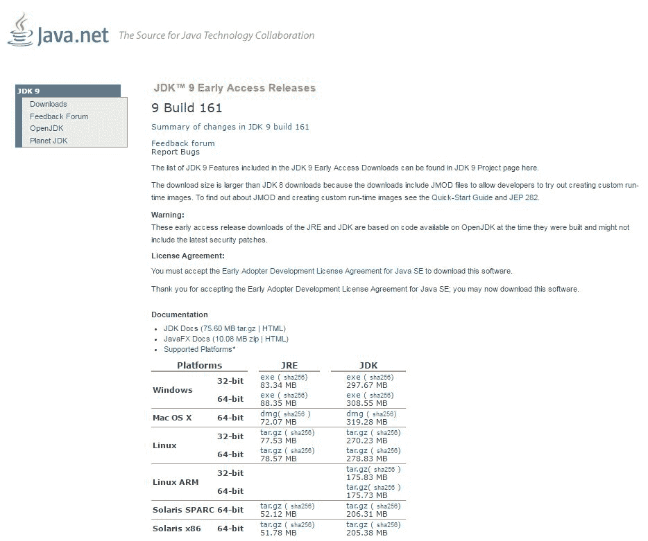

您可以从这里下载的是所谓的早期访问版本的代码，它只能用于实验，任何专业人士都不应将其用于真正的专业目的

在页面上，您必须单击单选按钮以接受许可证。之后，您可以单击直接开始下载安装工具包的链接。许可证是一种特殊的早期访问许可证版本，作为专业人员，只有在您同意条款的情况下，您才应仔细阅读、理解并接受该版本。

对于 Windows 32 和 64 位系统、Mac OS X、Linux 32 和 64 位版本、Linux for ARM 处理器、Solaris for SPARC 处理器系统和 Solaris x86 版本，有单独的安装工具包。由于您不太可能使用 Solaris，因此我将仅详细介绍 Windows、Linux 和 Mac OS X 的安装过程。在后面的章节中，示例将始终是 Mac OS X，但由于 Java 是一种*编写一次、在任何地方运行的*语言，因此安装后没有任何区别。目录分隔符的倾斜可能不同，类路径分隔符字符在 Windows 上是分号而不是冒号，终端或命令应用程序的外观也不同。然而，在重要的地方，我将尽量不忘记提及这一点。

让您感到困惑的是，每个操作系统版本的 Java 下载都列出了一个 JRE 链接和一个 JDK 链接。**JRE**代表**Java 运行时环境**，它包含运行 Java 程序所需的所有工具和可执行文件。**JDK**是**Java 开发工具包**，包含开发 Java 程序所需的所有工具和可执行文件，包括 Java 程序的执行。换句话说，JDK 包含自己的 JRE。现在，您所需要做的就是下载 JDK。

在安装之前，您必须准备好的三个操作系统中的每一个都有一个重要的安装点：要安装 Java，您应该具有管理权限。

# 在 Windows 上安装

Windows 上的安装过程从双击下载的文件开始。它将启动安装程序，向您显示欢迎屏幕。

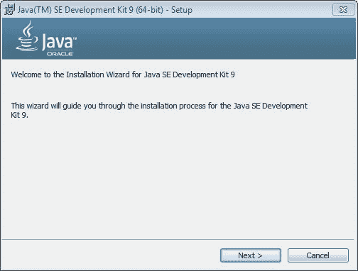

按下“下一步”按钮，我们将看到一个窗口，您可以在其中选择要安装的部件。让我们在这里保留默认选择，这意味着我们安装了 Java 的所有下载部分，然后按下“下一步”按钮。在下面的窗口中，我们可以选择安装的目标文件夹。

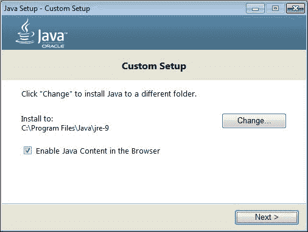

到目前为止，我们不会更改安装程序选择的目录。按“下一步”。稍后，当您成为一名专业 Java 开发人员时，您可能会决定将 Java 安装到不同的位置，但您必须知道自己正在做什么。

您可能需要单击“下一步”按钮几次，然后安装程序完成。请在询问时提供管理密码，瞧！安装了 Java。这实际上是非常常见的 Windows 安装过程。

最后一步是设置环境变量`JAVA_HOME`。要在 Windows 中执行此操作，我们必须打开控制中心，并为您的帐户菜单选择“编辑环境变量”。

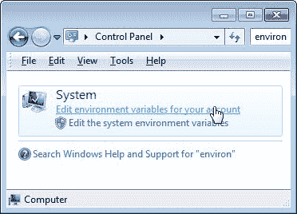

这将打开一个新窗口，我们应该使用它为当前用户创建一个新的环境变量。

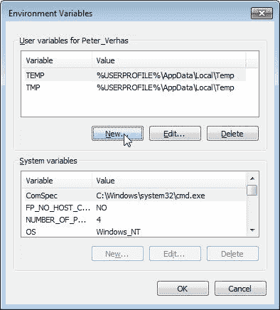

新变量的名称必须是`JAVA_HOME`，并且该值应该指向 JDK 的安装目录。

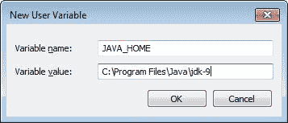

大多数系统上的这个值是 C:ProgramFilesJavaJDK-9。许多 Java 程序和工具都使用它来定位 Java 运行时。

# 在 MAC OS X 上安装

在本节中，我们将了解如何在 OSX 平台上逐步安装 Java。我将描述在编写本书时发布的版本的安装过程。就目前而言，Java9EarlyAccess 版本的安装有点棘手。Java 9 版本可能具有与 Java 8 update 92 相似或相同的安装步骤。

OS X 版本的 Java 以`.dmg`文件的形式出现。这是 OS X 的一种打包格式。要打开它，只需双击浏览器保存它的`Download`文件夹中的文件，操作系统就会将该文件装载为只读磁盘映像。

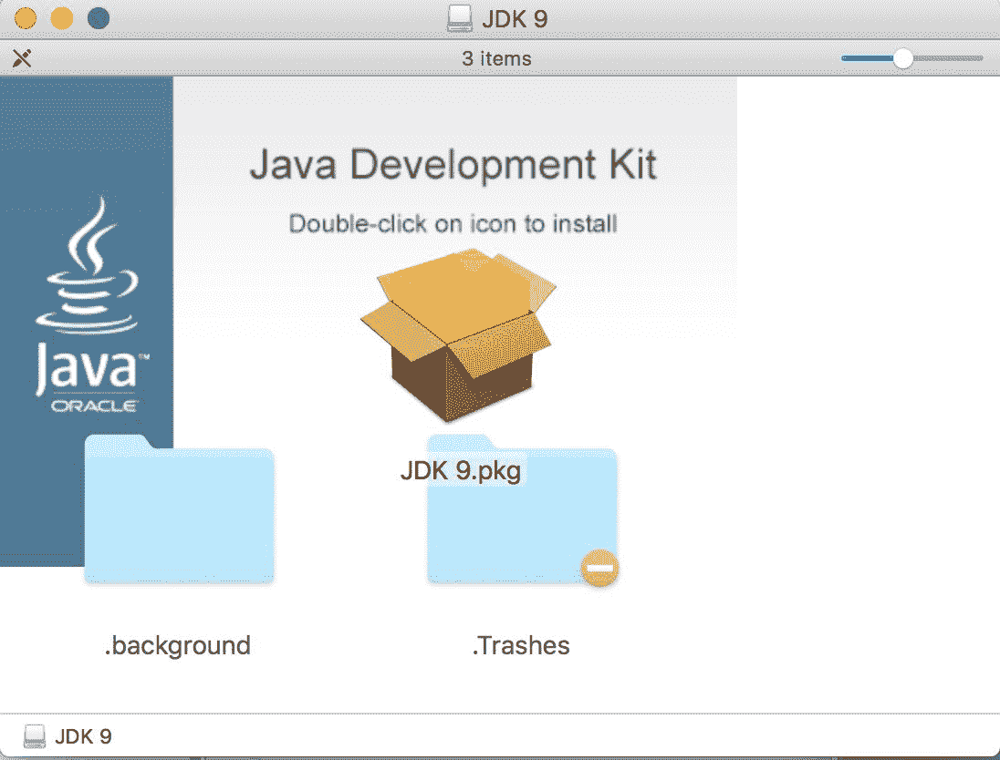

此磁盘上只有一个文件：安装映像。双击 Finder 应用程序中的文件名或图标，安装过程将开始。

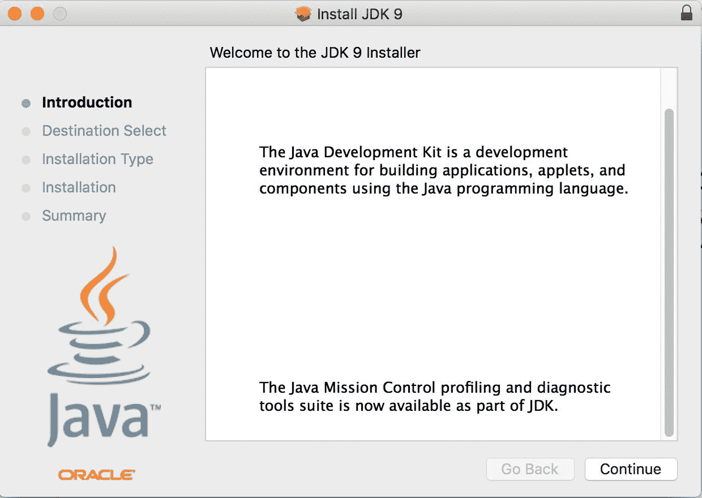

第一个屏幕打开是欢迎屏幕。单击“继续”，您将看到摘要页面，其中显示将要安装的内容。

您将看到标准 Java 安装，这并不奇怪。这一次，该按钮称为安装。单击它，您将看到以下内容：

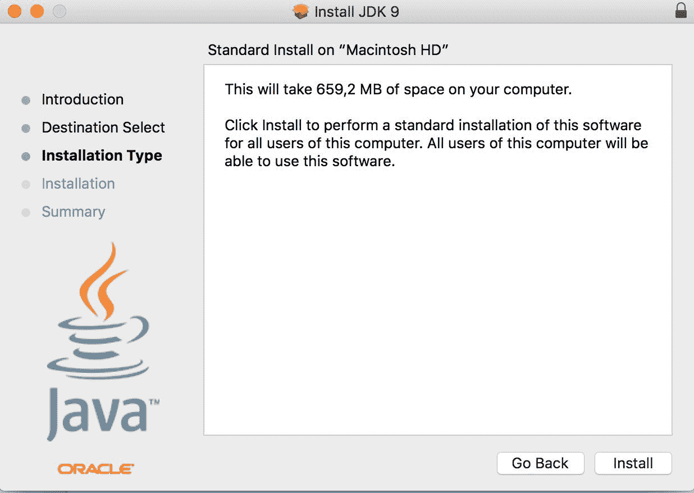

此时，您必须为管理用户提供登录参数—用户名和密码。提供后，安装开始，几秒钟后，您将看到。

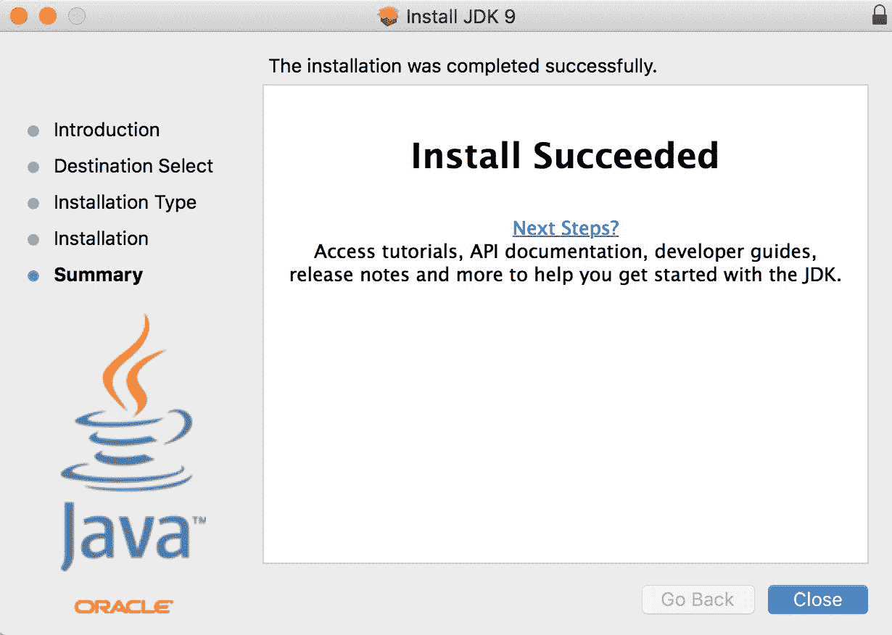

单击“关闭”，您就可以准备好了。您的 Mac 上安装了 Java。或者，您可以卸载安装盘，稍后还可以删除`.dmg`文件。您将不需要它，如果需要，您可以随时从 Oracle 下载它。

最后一件事是检查安装是否正常。吃布丁就是证明。启动一个终端窗口，在提示符处键入`java -version`，Java 将告诉您安装的版本。

在下一个屏幕截图中，您可以看到 my workstation 上的输出以及便于在不同版本的 Java 之间切换的 Mac OS 命令：

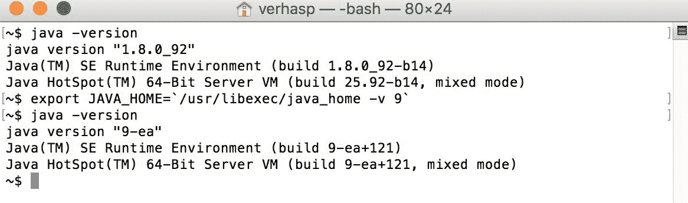

在屏幕截图上，您可以看到我已经安装了 JavaJDK1.8u92 版本，同时，我还安装了 Java9 早期版本，我将在本书中使用它来测试 Java 的新特性。

# Linux 上的安装

在 Linux 上安装 Java 有几种方法，具体取决于它的风格。在这里，我将描述一种安装方法，它在所有口味上的工作方式大致相同。我用的是 Debian。

第一步与任何其他操作系统中的步骤相同：下载安装工具包。对于 Linux，您应该选择一个以`tar.gz`结尾的包。这是一种压缩存档格式。您还应该仔细选择与计算机中的处理器和 32/64 位版本的操作系统相匹配的软件包。下载包后，必须切换到 root 模式，发出`su`命令。这是您可以在显示安装命令的屏幕截图上看到的第一个命令。

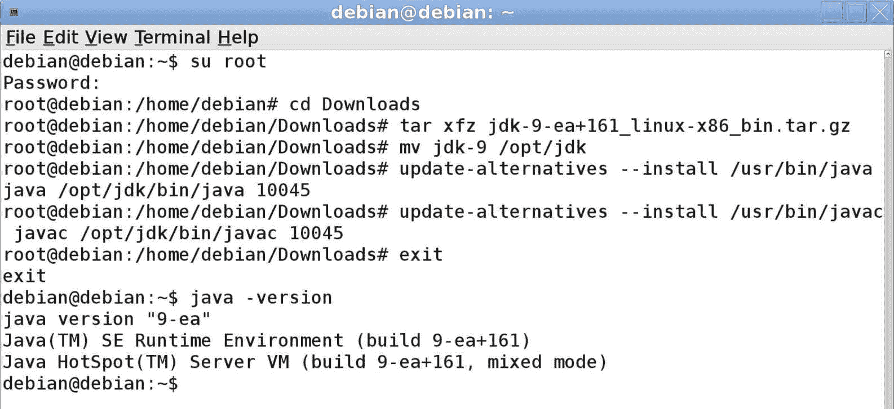

`tar`命令将存档解压缩到子文件夹中。在 Debian 中，此子文件夹必须移动到`/opt/jdk`并且`mv`命令用于此目的。两个`update-alternatives`命令是特定于 Debian 的。这些命令告诉操作系统使用新安装的 Java，以防已经安装了旧的 Java。我用来在虚拟机上测试和演示安装过程的 Debian 附带了一个有 7 年历史的 Java 版本。

安装的最后一步与任何其他操作系统相同：检查安装是否成功发出了`java -version`命令。对于 Linux，这一点更为重要，因为安装过程不会检查下载的版本是否与操作系统和处理器体系结构匹配。

# 设置 JAVA_ 主页

`JAVA_HOME`环境变量对 Java 起着特殊的作用。即使 JVM 可执行文件`java.exe`或`java`在`PATH`上（因此您可以通过在命令提示符上键入名称`java`来执行）（终端），建议您使用正确的 Java 安装来设置此环境变量。变量的值应指向已安装的 JDK。有许多与 Java 相关的程序，例如 Tomcat 或 Maven，它们使用此变量来定位已安装和当前使用的 Java 版本。在 Mac OS X 中，设置此变量是不可避免的。

在 OSX 中，当您键入`java`时开始执行的程序是一个包装器，它首先查看`JAVA_HOME`以决定启动哪个 Java 版本。如果未设置此变量，则 OSX 将自行决定，从可用的已安装 JDK 版本中进行选择。要查看可用版本，可以发出以下命令：

```java
    ~$ /usr/libexec/java_home -V
Matching Java Virtual Machines (10):
 9, x86_64:    "Java SE 9-ea"    /Library/Java/JavaVirtualMachines/jdk-9.jdk/Contents/Home
 1.8.0_92, x86_64:    "Java SE 8"    /Library/Java/JavaVirtualMachines/jdk1.8.0_92.jdk/Contents/Home
 1.7.0_60, x86_64:    "Java SE 7"    /Library/Java/JavaVirtualMachines/jdk1.7.0_60.jdk/Contents/Home
/Library/Java/JavaVirtualMachines/jdk-9.jdk/Contents/Home

```

然后，您将获得已安装 JDK 的列表。请注意，命令是小写的，但选项是大写的。如果您不向程序提供任何选项和参数，它只会返回它认为最新的、最适合该用途的 JDK。当我从终端窗口复制命令的输出时，您可以看到我的机器上安装了相当多的 Java 版本。

程序响应的最后一行是 JDK 的主目录，这是默认的。您可以使用这个来使用一些 bash 编程设置您的`JAVA_HOME`变量：

```java
    export JAVA_HOME=$(/usr/libexec/java_home)

```

您可以将此文件放入您的`.bashrc`文件中，该文件在每次启动终端应用程序时执行，因此`JAVA_HOME`将始终被设置。如果您想使用不同的版本，您可以将`-v`与小写选项一起使用到同一个实用程序，如下所示：

```java
    export JAVA_HOME=$(/usr/libexec/java_home -v 1.8)

```

参数是您要使用的 Java 版本。请注意，此版本控制变为：

```java
    export JAVA_HOME=$(/usr/libexec/java_home -v 9)

```

如果您想使用 JavaJDKEarlyAccess 版本而不是 1.9，那么对于同样的事实，没有任何解释。

请注意，还有一个环境变量对 Java 很重要-`CLASSPATH`。我们以后再谈。

# 执行 jshell

现在我们已经花了很多时间安装 Java，是时候让手指有点痛了。当我们使用 Java9 时，有一个新的工具可以帮助开发人员使用该语言。这是一个**读取-评估-打印循环**（**REPL**工具，许多语言工具集都包含该工具，也有来自 Java 的实现，但版本 9 是第一个包含此功能的现成工具。

REPL 是一个具有交互式提示和语言命令的工具，可以直接输入这些命令，而无需编辑一些独立的文件。直接执行输入的命令，然后循环再次启动，等待用户输入下一个命令。这是一个非常有效的工具，可以在不延迟编辑、编译和加载的情况下尝试一些语言结构。这些步骤由 REPL 工具自动透明地完成。

Java9 中的 REPL 工具称为 jshell。要启动它，只需键入它的名称。如果不在`PATH`上，则键入 Java 9 附带的 jshell 的完整路径，如下例所示：

```java
    $ jshell
|  Welcome to JShell -- Version 9-ea
|  For an introduction type: /help intro
jshell> 

```

jshell 以交互方式启动，它显示的提示是`jshell>`，以帮助您识别 jshell 正在运行，并且您键入的内容由程序而不是操作系统外壳读取。由于这是您第一次启动 jshell，它会告诉您键入`/help intro`。让我们做吧。它将打印出关于 jshell 是什么的简短文本，如以下代码所示：

```java
    jshell> /help intro
| 
|  intro
| 
|  The jshell tool allows you to execute Java code, getting immediate results.
|  You can enter a Java definition (variable, method, class, etc), like:  int x = 8
|  or a Java expression, like:  x + x
|  or a Java statement or import.
|  These little chunks of Java code are called 'snippets'.
| 
|  There are also jshell commands that allow you to understand and
|  control what you are doing, like:  /list
| 
|  For a list of commands: /help

```

好的，我们可以键入 Java 代码段和`/list`，但这只是可用命令的一个示例。我们希望通过键入`/help`获得更多信息，如下代码所示：

```java
    jshell> /help
|  Type a Java language expression, statement, or declaration.
|  Or type one of the following commands:
|     /list [<name or id>|-all|-start]                             -- list the source you have typed
|     /edit <name or id>                                           -- edit a source entry referenced by name or id
|     /drop <name or id>                                           -- delete a source entry referenced by name or id
|     /save [-all|-history|-start] <file>                          -- Save snippet source to a file.
...

```

您得到的是一长串命令。这里介绍的大部分内容并不是为了节省纸张和您的注意力。在接下来的几页中，我们将使用其中的许多命令。让我们从一个小 Java 片段开始，它是永恒的*Hello World*示例：

```java
    jshell> System.out.println("Hello World!")
Hello World!

```

这是 Java 中有史以来最短的 Hello World 程序。在 Java9 之前，如果您只想打印出`Hello World!`，就必须创建一个程序文件。它必须包含一个类的源代码，包括`public static main`方法，其中包含我们必须用 Java9JShell 键入的一行代码。仅仅打印一个简单的示例代码是很麻烦的。现在变得容易多了，jshell 也很宽容，原谅了我们在这行末尾缺少的分号。

接下来我们应该尝试声明一个变量，如下所示：

```java
    jshell> int a = 13
a ==> 13
jshell> 

```

我们声明了一个名为`a`的变量，并为其赋值-`13`。变量类型为`int`，是 Java 中整数类型的缩写。现在，我们的代码段中已经有了这个变量，因此如果需要，我们可以将其打印出来，如图所示：

```java
    jshell> System.out.println(a)
13

```

现在是将比一行程序更复杂的东西写入 jshell 的时候了。

```java
    jshell> void main(String[] args){
 ...>  System.out.println("Hello World")
 ...> }
|  Error:
|  ';' expected
|   System.out.println("Hello World")
| 

```

当我们在第一行末尾按下*Enter*时，jshell 意识到这不是一行，它无法处理我们目前键入的内容，并发出信号，表示它希望我们输入更多字符，因此它显示`...>`作为继续提示。我们输入组成整个 hello world`main`方法的命令，但这次 jshell 不让我们错过分号。仅在单行代码段的情况下才允许这样做。由于 jshell 是交互式的，因此很容易纠正错误；按向上箭头键几次以返回前几行，这次在第二行末尾添加分号：

```java
    jshell> void main(String[] args){
 ...>  System.out.println("Hello World");
 ...> }
|  created method main(String[])

```

此方法是作为片段为我们创建的，现在我们可以调用它：

```java
    jshell> main(null)
Hello World

```

它是有效的。您可以列出创建的所有代码段，如下所示：

```java
    jshell> /list
 1 : System.out.println("Hello World!")
 2 : int a = 13;
 3 : System.out.println(a)
 4 : void main(String[] args){
 System.out.println("Hello World");
 }

```

而且，当我们想继续编写*hello world*的完整 Java 版本时，我们可以将我们的工作从 jshell 保存到一个文件中，如下所示：

```java
    jshell> /save HelloWorld.java

```

最后，我们通过键入`/exit`退出 jshell。返回系统提示时，键入`cat HelloWorld.java`（或 Windows 上的`type HelloWorld.java`）以查看文件内容。详情如下:

```java
    $ cat HelloWorld.java
System.out.println("Hello World!")
int a = 13;
System.out.println(a)
void main(String[] args){
 System.out.println("Hello World");
 }

```

该文件包含我们一个接一个输入的所有代码段。如果您认为您已经用大量不再需要的变量和代码片段将 shell 搞砸了，您可以发出`/reset`命令：

```java
    jshell> /reset
|  Resetting state.

```

执行此命令后，jshell 与之前启动时一样干净

```java
    jshell> /list

jshell>

```

清单并没有产生任何结果，因为我们将其全部删除。幸运的是，我们将 jshell 的状态保存到了一个文件中，我们还可以通过发出`/open`命令加载文件的内容：

```java
    jshell> /open HelloWorld.java
Hello World!
13

```

它从文件中加载该行，并在命令提示符中键入字符时执行该行。

您可能还记得，`/list`命令在每个代码片段前面打印了一个数字。我们可以使用它单独编辑代码段。要执行此操作，请发出`/edit`命令，后跟代码段的编号：

```java
    jshell> /edit 1

```

您可能还记得，我们输入的第一个命令是将参数打印到控制台的`System.out.println`系统调用。当您在`/edit 1`命令后按*Enter*时，不会返回提示。相反，jshell 会打开一个单独的图形编辑器，其中包含要编辑的代码段，如下图所示：

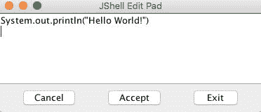

编辑框中的文本，使其如下所示：

```java
    printf("Hello World!")

```

单击 Accept，然后退出。单击“接受”时，终端将执行代码段并显示以下结果：

```java
    Hello World!

```

我们使用的方法`printf`代表格式化打印。这可能是许多其他语言所熟知的。它最初是由 C 语言引入的，尽管这个名字很神秘，但它仍然存在。这也是标准 Java 类`PrintStream`的一部分，就像`println`一样。如果是`println`，我们必须在方法名称前面写`System.out`。就`printf`而言，我们没有。为什么？

原因是 jshell 定义了一些代码片段，在 jshell 启动或重置时自动加载这些代码片段。如果您使用`-start`选项发出`/list`命令，您可以看到这些，如下所示：

```java
    jshell> /list -start

 s1 : import java.util.*;
 s2 : import java.io.*;
 s3 : import java.math.*;
 s4 : import java.net.*;
 s5 : import java.util.concurrent.*;
 s6 : import java.util.prefs.*;
 s7 : import java.util.regex.*;
 s8 : void printf(String format, Object... args) { System.out.printf(format, args); }

```

这些预定义的代码片段有助于使用 jshell。大多数用户都会导入这些类，为了便于打印到屏幕上，它定义了一个方法片段，该片段的名称恰好为`printf`，这也是`PrintStream`类中一个方法的名称。

如果您想列出您输入的所有代码段以及预定义的代码段，以及包含一些错误并因此未执行的代码段，您可以使用`/list`命令的`-all`选项，如下所示：

```java
    jshell> /list -all

...
 s7 : import java.util.regex.*;
...
 1 : System.out.println("Hello World!")
...
 e1 : System.out.println("Hello World!")
 int a = 14;
 5 : System.out.println("Hello World!");
...

```

为了简洁起见，从实际输出中删除了一些行。预加载的行以`s`前缀编号。包含错误的代码段有一个前缀为`e`的数字。

如果要再次执行某些代码段，只需键入`/n`，其中`n`是代码段的编号，如下所示：

```java
    jshell> /1
System.out.println("Hello World!")
Hello World!

```

无法重新执行预加载的代码段或包含错误的代码段。无论如何，这些都没有必要。预加载的代码段声明一些导入并定义代码段方法；错误的代码片段不会执行，因为它们是错误的。

当您想要重新执行代码段时，不需要依赖 jshell 的数量。当您的 jshell 会话中已经有很多代码片段时，将它们全部列出会太麻烦；有一个快捷方式可以重新执行最后第 n 个代码段。你必须写`/-n`。这里，n 是从最后一个开始计数的代码段数。因此，如果您想执行最后一个代码段，那么您必须编写`/-1`。如果要在最后一个之前执行一个，则必须写入`/-2`。请注意，如果您已经键入了`/-1`，那么最后一个是最后一个代码段的重新执行，代码段编号-2 将成为编号`-3`。

列出所有代码段也可以通过其他方式避免。当您只对某些类型的代码段感兴趣时，可以使用特殊命令。

如果我们只想看到我们在代码段中定义的变量，那么我们可以发出`/vars`命令，如下所示：

```java
    jshell> /vars
|    int a = 13

```

如果我们只想查看类，那么命令/类型将执行以下操作：

```java
    jshell> class s {}
|  created class s

jshell> /types
|    class s

```

在这里，我们只是创建了一个空类，然后列出它。

要列出代码段中定义的方法，可以发出`/methods`命令：

```java
    jshell> /methods
|    printf (String,Object...)void
|    main (String[])void

```

您可以在输出中看到，只有两种方法，如下所示：

*   `printf`：这是在预加载的代码段中定义的
*   `main`：这是我们定义的

如果要查看键入的所有内容，必须对键入的所有代码段和命令发出`/history`命令。（我不会在这里复制输出；我不想让自己感到羞愧。你应该尝试一下，看看自己的历史。）

回想一下，我们可以删除发出`/reset`命令的所有代码段。您还可以单独删除代码段。为此，您应该发出`/drop n`命令，其中`n`是被剪断的号码：

```java
    jshell> /drop 1
|  This command does not accept the snippet '1' : System.out.println("Hello World!")
|  See /types, /methods, /vars, or /list

```

哎呀！出了点问题。当执行代码段编号`1`时，没有定义任何内容，`/drop`命令实际上删除了定义的变量、类型或方法。在第一个代码段中没有要删除的内容。但是，如果我们重新发出`/list`命令，我们将得到以下结果：

```java
    jshell> /list

 1 : System.out.println("Hello World!")
 2 : int a = 13;
 3 : System.out.println(a)
 4 : void main(String[] args){
 System.out.println("Hello World");
 }

```

我们可以看到，我们也可以删除第二个或第四个片段：

```java
    jshell> /drop 2
|  dropped variable a

jshell> /drop 4
|  dropped method main(String[])

```

jshell 错误消息表示要查看`/types`、`/methods`、`/vars`或`/list`命令的输出。问题在于`/types`、`/methods`和`/vars`不显示代码段的编号。这很可能是 jshell 预发布版本中的一个小错误，可能在 JDK 发布时修复。

当我们编辑代码片段时，jshell 打开了一个单独的图形编辑器。您可能正在远程服务器上使用 ssh 运行 jshell，并且无法打开单独的窗口。您可以使用`/set`命令设置编辑器。这个命令可以设置 jshell 的许多配置选项。要将编辑器设置为使用无处不在的 vi，请发出以下命令：

```java
    jshell> /set editor "vi"
|  Editor set to: vi

```

在此之后，jshell 将在您发出`/edit`命令的同一终端窗口中打开被剪断的 vi。

您不仅可以设置编辑器。您可以设置启动文件，以及执行命令后 jshell 将反馈打印到控制台的方式。

如果设置了启动文件，则会执行启动文件中列出的命令，而不是在`/reset`命令之后执行 jshell 的内置命令。这也意味着您将无法直接使用默认导入的类，并且您将没有`printf`方法片段，除非您自己的启动文件包含导入和片段的定义。

创建具有以下内容的`sample.startup`文件：

```java
void println(String message) { System.out.println(message); }

```

启动一个新的 jshell 并执行它，如下所示：

```java
    jshell> /set start sample.startup

jshell> /reset
|  Resetting state.

jshell> println("wuff")
wuff

jshell> printf("This won't work...")
|  Error:
|  cannot find symbol
|    symbol:   method printf(java.lang.String)
|  printf("This won't work...")
|  ^----^

```

已定义`println`方法，但未定义在默认启动中定义的`printf`方法。

反馈定义了提示 jshell 打印并等待输入、提示继续行以及每个命令后的消息详细信息。有预定义的模式，如下所示：

*   典型的
*   不说话的
*   简明的
*   冗长的

默认情况下选择“正常”。如果您发出`/set feedback silent`，则提示变为`->`，jshell 不会打印有关命令的详细信息。`/set feedback concise`代码输出更多的信息，`/set feedback verbose`输出关于执行的命令的详细信息：

```java
    jshell> /set feedback verbose
|  Feedback mode: verbose

jshell> int z = 13
z ==> 13
|  modified variable z : int
|    update overwrote variable z : int

```

您还可以定义自己的模式，使用`/set mode xyz`命令为新模式命名，其中`xyz`是新模式的名称。之后，可以为模式设置提示、截断和格式。定义格式后，可以使用与内置模式相同的方式使用该格式。

最后，但并非最不重要的是，jshell 最重要的命令是`/exit`。这将终止程序，您将返回操作系统 shell 提示符。

现在，让我们编辑`HelloWorld.java`文件来创建我们的第一个 Java 程序。要做到这一点，您可以使用 vi、记事本、Emacs 或您的机器上提供的任何适合您的工具。稍后，我们将使用一些集成开发环境（IDE）、NetBeans、Eclipse 或 IntelliJ；然而，就目前而言，一个简单的文本编辑器就足够了。

编辑文件，使内容如下所示：

```java
public class HelloWorld { 
  public static void main(String[] args){ 
        System.out.println("Hello World"); 
       } 
  }

```

要将源代码编译成可由 JVM 执行的字节码，我们必须使用名为`javac`的 Java 编译器：

```java
    javac HelloWorld.java

```

这将在当前目录中生成`java.class`文件。这是一段编译代码，可按如下方式执行：

```java
    $ java HelloWorld
Hello World

```

有了这个，您就创建并执行了第一个完整的 Java 程序。你可能仍然想知道我们在做什么。如何以及为什么，我会解释；但首先，我想让你有一种感觉，它是有效的。

我们编辑的文件只包含片段，我们删除了大部分行，除了`main`方法的声明，并在其周围插入了类的声明。

在 Java 中，您不能像在许多其他语言中一样拥有独立的方法或函数。每个方法都属于某个类，每个类都应该在一个单独的文件中声明（几乎是这样，但现在，让我们跳过异常）。文件名必须与类名相同。编译器要求`public`类使用此选项。即使是非公共课程，我们也通常遵循这个惯例。如果您将文件从`HelloWorld.java`重命名为`Hello.java`，编译器将在您尝试使用新名称编译文件时显示错误。

```java
    $ mv HelloWorld.java Hello.java
~/Dropbox/java_9-by_Example$ javac Hello.java
Hello.java:2: error: class HelloWorld is public, should be declared in a file named HelloWorld.java
public class HelloWorld {
 ^
1 error

```

那么，让我们把它移回原来的名称：`mv Hello.java HelloWorld.java`。

类的声明以关键字`class`开始，然后是类的名称，一个开始的大括号，并持续到匹配的结束大括号。介于两者之间的一切都属于班级。

现在，让我们跳过为什么我在全班同学面前写`public`，重点关注其中的主要方法。因此，该方法不返回任何值；其返回值为`void`。名为`args`的参数是一个字符串数组。当 JVM 启动`main`方法时，它将命令行参数传递给该数组中的程序。但是，这次我们不使用它。`main`方法包含打印出`Hello World`的行。现在，让我们进一步检查这一行。

在其他语言中，将内容打印到控制台只需要一个`print`语句或非常类似的命令。我记得一些基本的口译员甚至允许我们输入`?`而不是`print`，因为在屏幕上打印非常普遍。在过去的 40 年里，这种情况发生了很大的变化。我们使用图形屏幕、互联网和许多其他输入和输出通道。如今，向控制台写入数据已不常见。

通常，在专业的大型企业应用程序中，甚至没有一行可以做到这一点。相反，我们将文本定向到日志文件，将消息发送到消息队列，并通过 TCP/IP 协议发送请求和响应。由于这种方法很少使用，因此没有理由在该语言中为此目的创建快捷方式。在前几个程序之后，当您熟悉调试器和日志记录的可能性时，您将不会自己直接将任何内容打印到控制台。

尽管如此，Java 还是有一些特性，可以让您直接将文本发送到进程的标准输出，就像最初为 UNIX 发明的那样。这是以 Java 方式实现的，其中所有内容都必须是对象或类。为了访问系统输出，有一个名为`System`的类，其中包括以下三个变量：

*   `in`：这是标准的输入流
*   `out`：这是标准输出流
*   `err`：这是标准错误流

要引用输出流变量，因为它不在我们的类中，但在`System,`中，我们必须指定类名，因此我们将在程序中将其称为`System.out`。此变量的类型为`PrintStream`，也是一个类。类和类型在 Java 中是同义词。每个类型为`PrintStream`的对象都有一个名为`println`的方法，该方法接受一个`String`。如果实际的打印流是标准输出，并且我们正在从命令行执行 Java 代码，那么字符串将被发送到控制台。

方法名为`main`，这是 Java 程序中的一个特殊名称。当我们从命令行启动 Java 程序时，JVM 从我们在命令行上指定的类中调用名为`main`的方法。它可以做到这一点，因为我们声明了这个方法`public`，这样任何人都可以看到并调用它。如果它是`private`，则只能从同一个源文件中定义的同一个或多个类中看到和调用它。

该方法也被声明为`static`，这意味着可以在没有包含这些方法的类的实际实例的情况下调用它。如今，使用静态方法通常被视为不是一种好的做法，除非它们实现的函数与实例不可能真正相关，或者具有不同的实现，例如`java.lang.Math`类中的函数；但是，在某些地方，代码执行必须开始，Java 运行时通常不会自动为我们创建类的实例。

要启动代码，命令行应如下所示：

```java
    java -cp . HelloWorld

```

`-cp`选项代表类路径。对于 java 来说，类路径是一个相当复杂的概念，但是现在，让我们简单地说，它是包含类的目录和 JAR 文件的列表。类路径的列表分隔符在类 UNIX 系统上为`:`（冒号），在 Windows 系统上为`;`（分号）。在我们的例子中，类路径是实际的目录，因为这是 Java 编译器创建`HelloWorld.class`的地方。如果我们不在命令行上指定 classpath，Java 将使用当前目录作为默认目录。这就是我们的程序在没有`-cp`选项的情况下运行的原因。

`java`和`javac`都处理许多选项。要获取选项列表，请键入`javac -help`或`java -help`。我们使用 IDE 编辑代码，并且在开发过程中多次编译、构建和运行代码。在这种情况下，环境会设置合理的参数。对于生产，我们使用也支持环境配置的构建工具。因此，我们很少使用这些命令行选项。然而，专业人士必须至少理解它们的含义，并且知道在需要时在哪里学习它们的实际用法。

# 看看字节码

类文件是一个二进制文件。这种格式的主要作用是由 JVM 执行，并在代码使用库中的某些类时为 Java 编译器提供符号信息。当我们编译包含`System.out.println`的程序时，编译器会查看编译后的`.class`文件，而不是源代码。它必须找到名为`System`的类、名为`out`的字段和方法`println`。当我们调试一段代码或试图找出程序找不到类或方法的原因时，我们需要一种方法来查看`.class`文件的二进制文件。这不是一项日常任务，需要一些高级知识

为此，有一个*反编译器*，可以或多或少以可读的格式显示`.class`文件的内容。此命令称为`javap`。要执行它，可以发出以下命令：

```java
    $ javap HelloWorld.class
Compiled from "HelloWorld.java"
public class HelloWorld {
 public HelloWorld();
 public static void main(java.lang.String[]);
}

```

程序的输出显示类文件包含 Java 类，该类有一个名为`HelloWorld()`的东西；它似乎是一个与类同名的方法，并且它还包含我们编写的方法。

与该类同名的*方法*是该类的构造函数。由于 java 中的每个类都可以实例化，因此需要一个构造函数。如果我们不给出一个，那么 Java 编译器将为我们创建一个。这是默认构造函数。默认构造函数不执行任何特殊操作，只返回类的新实例。如果我们自己提供一个构造函数，那么 Java 编译器就不会费心创建一个。

除非我们提供`-c`选项，否则`javap`反编译器不会显示方法内部的内容或它包含的 Java 代码：

```java
    $ javap -c HelloWorld.class
Compiled from "HelloWorld.java"
public class HelloWorld {
 public HelloWorld();
 Code:
 0: aload_0
 1: invokespecial #1                  // Method java/lang/Object."<init>":()V
 4: return
 public static void main(java.lang.String[]);
 Code:
 0: getstatic     #2                  // Field java/lang/System.out:Ljava/io/PrintStream;
 3: ldc           #3                  // String hali
 5: invokevirtual #4                  // Method java/io/PrintStream.println:(Ljava/lang/String;)V
 8: return
}

```

它非常神秘，不适合普通人。只有少数处理 Java 代码生成的专家能够流利地阅读这些内容。但是，看看它有助于您了解字节码的含义。这有点像一个好的老集会。虽然这是二进制代码，但里面没有什么秘密：Java 是开源的，类文件格式有很好的文档记录，专家可以调试。

# 将类打包到 JAR 文件中

交付 Java 应用程序时，通常将代码打包为 JAR、WAR、EAR 或其他打包格式。我们又学到了一些乍一看似乎很模糊的东西，但实际上，这并没有那么复杂。它们都是 ZIP 文件。您可以使用 WinZip 或其他您有许可证的 zip 管理器打开这些文件中的任何一个。额外的要求是，例如，在 JAR 文件的情况下，归档文件应该包含一个名为`META-INF`的目录，其中包含一个名为`MANIFEST.MF`的文件。此文件是一个文本文件，包含以下格式的元信息：

```java
Manifest-Version: 1.0 
Created-By: 9-ea (Oracle Corporation)

```

文件中可能有很多其他信息，但如果我们将类文件打包到一个 jar 中，并发出以下命令，这是 Java 提供的工具`jar`放在那里的最小值：

```java
         jar -cf hello.jar HelloWorld.class

```

`-c`选项告诉 JAR 归档程序创建一个新的 JAR 文件，而`f`选项用于指定新归档文件的名称。我们在这里指定的是`hello.jar`，添加到其中的文件是类文件。

打包的 JAR 文件也可用于启动 Java 应用程序。Java 可以直接从 JAR 档案中读取并从中加载类。唯一的要求是它们位于类路径上。

请注意，不能将单个类放在类路径上，只能放在目录上。由于 JAR 文件是具有内部目录结构的归档文件，它们的行为类似于目录。

检查 JAR 文件是否是使用`ls hello.jar`创建的，并删除`rm HelloWorld.class`类文件，以确保在发出命令行时，代码是从 JAR 文件而不是从类执行的。

```java
    $ java -cp hello.jar HelloWorld
Hello World

```

但是，要查看 JAR 文件的内容，建议您使用 JAR 工具，而不要使用 WinZip，尽管这可能会更舒适。真正的专业人士使用 Java 工具来处理 Java 文件。

```java
$ jar -tf hello.jar 
META-INF/ 
META-INF/MANIFEST.MF 
HelloWorld.class

```

# 管理正在运行的 Java 应用程序

JDK 附带的 Java 工具集也支持运行 Java 应用程序的执行和管理。为了让一些程序在执行时能够管理，我们需要一个不仅能运行几毫秒的代码，而且在它运行时，还能将一些东西打印到控制台。让我们创建一个名为`HelloWorldLoop.java`的新程序，内容如下：

```java
public class HelloWorldLoop { 
  public static void main(String[] args){ 
       for( ;; ){ 
         System.out.println("Hello World"); 
         } 
       } 
  }

```

该程序包含一个`for`循环。循环允许重复执行代码块，我们将在[第 2 章](02.html)*第一个真正的 Java 程序——排序名称*中讨论它们。我们在这里创建的循环是一个特殊的循环，它从不终止，而是重复打印方法调用，打印`Hello World`，直到我们在 Linux 或 OSX 上按*Ctrl*+*c*或发出`kill`命令终止程序，或者在 Windows 下的任务管理器中终止程序。

在一个窗口中编译并启动它，然后打开另一个终端窗口来管理应用程序。

我们应该熟悉的第一个命令是`jps`。[http://docs.oracle.com/javase/7/docs/technotes/tools/share/jps.html](http://docs.oracle.com/javase/7/docs/technotes/tools/share/jps.html) 列出了机器上运行的 Java 进程，如下所示：

```java
$ jps 
21873 sun.tools.jps.Jps 
21871 HelloWorldLoop

```

您可以看到有两个进程，一个是我们执行的程序，另一个是`jps`程序本身。毫不奇怪，jps 工具也是用 Java 编写的。您还可以将选项传递给`jps`，这些选项记录在 web 上。

还有许多其他工具，我们将研究其中一个，它是一个非常强大且易于使用的工具 Java VisualVM。

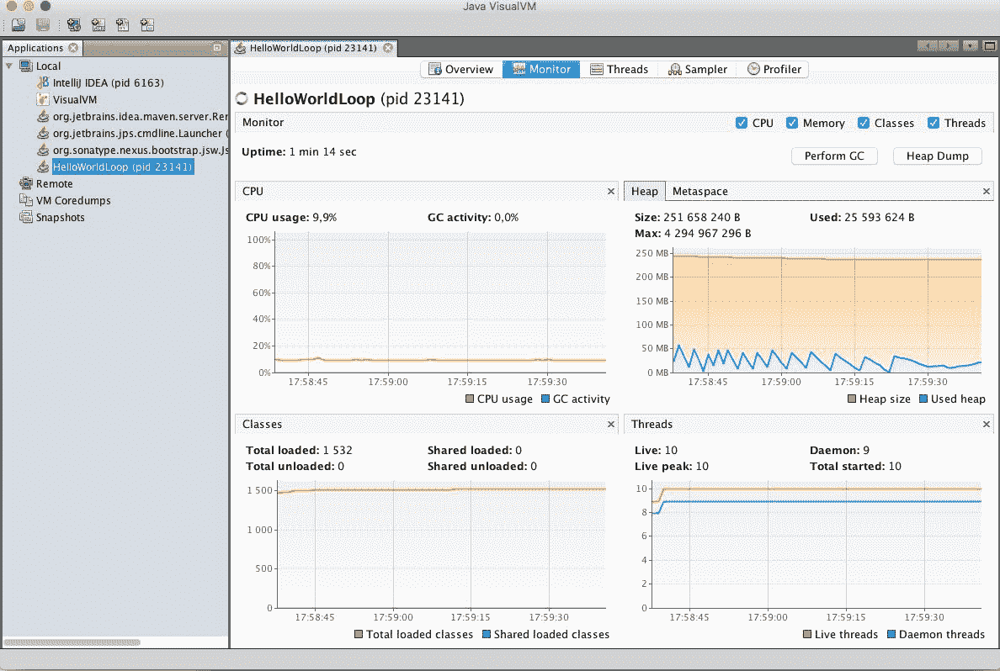

VisualVM 是一个命令行图形工具，它连接到正在运行的 Java 进程并显示不同的性能参数。要启动 VisualVM 工具，您将发出不带任何参数的`jvisualvm`命令。很快，将出现一个窗口，左侧是一棵探索树，右侧是欢迎窗格。左侧显示了名为 Local 的分支下所有正在运行的 Java 进程。如果双击`HelloWorldLoop`，将在右侧窗格中打开流程的详细信息。在标题选项卡上，可以选择概述、监视、线程、采样器和探查器。前三个选项卡是最重要的，它可以让您很好地了解 JVM 中的线程数、CPU 使用率、内存消耗等情况。

# 使用 IDE

集成开发环境是优秀的工具，通过将机械任务从开发人员的肩上卸下来帮助开发。在我们键入代码时，它们可以识别许多编程错误，帮助我们找到所需的库方法，显示库的文档，并为样式检查、调试等提供额外的工具。

在本节中，我们将介绍一些 IDE 以及如何利用它们提供的功能。

要获得 IDE，您必须下载并安装它。它不随 Java 开发工具提供，因为它们不是语言环境的一部分。但是，别担心。它们可以免费下载，并且易于安装。它们可能比记事本编辑器更复杂，但即使工作了几个小时，它们也会回报你花在学习它们上的时间。毕竟，没有开发人员用记事本或 vi 编写 Java 代码并非没有道理。

最顶级的三个 IDE 是*NetBeans*、*Eclipse*和*IntelliJ*。所有这些都有社区版本，这意味着您无需为它们付费。IntelliJ 有一个*完整*版本，您也可以购买。社区版可用于学习该语言。如果您不喜欢 IntelliJ，可以使用 Eclipse 或 NetBeans。这些都是免费的。就我个人而言，我的大多数项目都使用 IntelliJ 社区版，本书中显示 IDE 的屏幕示例将以该 IDE 为特色。但是，这并不一定意味着你必须坚持这个 IDE。

在开发人员社区中，有一些话题可以进行激烈的辩论。这些话题都是关于观点的。如果他们讨论的是事实，辩论很快就会结束。其中一个主题是：“哪一个是最好的 IDE？”这是一个品味问题。没有明确的答案。如果你学会了如何使用其中一个，你会喜欢的，你会不愿意学习另一个，除非你看到另一个更好。这就是为什么开发人员喜欢他们使用的 IDE（或者只是讨厌，取决于他们的个性），但他们通常会长期使用同一个 IDE。没有最好的 IDE。

要下载您选择的 IDE，您可以访问以下任一网站：

*   [https://netbeans.org/](https://netbeans.org/) 用于 NetBeans
*   [http://www.eclipse.org/](http://www.eclipse.org/) 日食
*   [https://www.jetbrains.com/idea/](https://www.jetbrains.com/idea/) 用于 IntelliJ

# 网虫

NetBeans 由 Oracle 支持，并在不断开发。它包含的组件，如 NetBeans profiler，已成为 Oracle Java 发行版的一部分。您可能注意到，当您启动 VisualVM 并启动评测时，Java 进程启动的名称中有`netbeans`。

通常，NetBeans 是一个开发富客户机应用程序的框架，IDE 只是构建在该框架之上的众多应用程序中的一个。它支持多种语言，不仅仅是 Java。您可以使用 NetBeans 开发 PHP、C 或 JavaScript 代码，并为 Java 提供类似的服务。为了支持不同的语言，您可以下载插件或特殊版本的 NetBeans。这些特殊版本可以从 IDE 的下载页面获得，它们只不过是带有一些预配置插件的基本 IDE。在 C 包中，开发人员配置开发 C 时所需的插件；在 PHP 版本中，他们使用 PHP 插件。

# 日食

IBM 支持 Eclipse。与 NetBeans 类似，它也是一个富客户端应用程序平台，它是围绕*OSGi*容器体系结构构建的，而这本身就是一个可以填充像这样一本书的主题。大多数开发人员都使用 Eclipse，而且几乎完全是在开发人员为*IBM WebSphere*应用程序服务器创建代码时选择 Eclipse。Eclipse 特殊版本包含 WebSphere 的开发人员版本。

Eclipse 还具有支持不同编程语言的插件，并且具有类似于 NetBeans 的不同变体。这些变体是用基本 IDE 预先打包的插件。

# IntelliJ

前面枚举中的最后一个是 IntelliJ。这个 IDE 是唯一一个不想成为框架的 IDE。IntelliJ 是一个 IDE。它也有插件，但在 NetBeans 或 Eclipse 中使用需要下载的大多数插件都是预配置的。当你想使用一些更高级的插件时，它可能是你必须付费的，当你从事专业的付费工作时，这应该不是问题，对吗？这些东西没那么贵。为了学习本书中的主题，您不需要任何社区版中没有的插件。正如在本书中一样，我将使用 IntelliJ 开发样本，我建议您在学习过程中跟随我。

我想强调的是，本书中的示例独立于实际使用的 IDE。您可以使用 NetBeans、Eclipse 甚至 Emacs、记事本或 vi 来阅读本书。

# IDE 服务

集成开发环境为我们提供服务。最基本的服务是，您可以使用它们编辑文件，但它们也有助于构建代码、查找 bug、运行代码、在开发模式下部署到应用程序服务器、调试等等。在以下部分中，我们将介绍这些功能。关于如何使用一个或另一个 IDE，我不会给出准确的介绍。像这样的书对于这样的教程来说不是一个好的媒介。

IDE 在菜单位置、键盘快捷键上有所不同，甚至可能随着新版本的发布而改变。最好看一下实际的 IDE 教程视频或在线帮助。另一方面，它们的特征非常相似。IntelliJ 在[有视频文档 https://www.jetbrains.com/idea/documentation/](https://www.jetbrains.com/idea/documentation/) 。

# IDE 屏幕结构

不同的 IDE 看起来相似，并且或多或少具有相同的屏幕结构。在以下屏幕截图中，您可以看到 IntelliJ IDE：

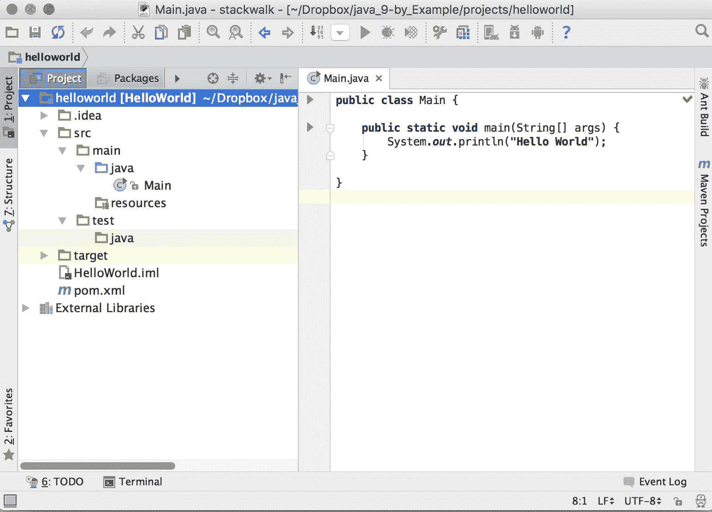

在左侧，您可以看到 Java 项目的文件结构。Java 项目通常包含不同目录中的许多文件，我们将在下一章中讨论这些文件。简单的*HelloWorld*应用程序包含一个`pom.xml`项目描述文件。Maven 构建工具需要这个文件，这也是下一章的主题。现在，您应该只知道它是一个描述 maven 项目结构的文件。IDE 还为自己跟踪一些管理数据。存储在`HelloWorld.iml`中。主程序文件存储在`src/main/java`目录中，名为`HelloWorld.java`。

在右侧，您可以看到文件。在屏幕截图中，我们只打开了一个文件。如果打开了多个文件，则每个文件都有一个选项卡。现在，活动文件是`HelloWorld.java`，可以在源代码编辑器中编辑。

# 编辑文件

编辑时，您可以输入字符或删除字符、单词和行，但这是所有编辑器都可以做的事情。IDE 提供额外的服务。IDE 分析源代码并将其格式化，从而自动缩进行。在您编辑代码时，它还会在后台连续编译代码，如果出现语法错误，则会在代码下面加一条红色的放弃线。修复错误时，红色下划线将消失。

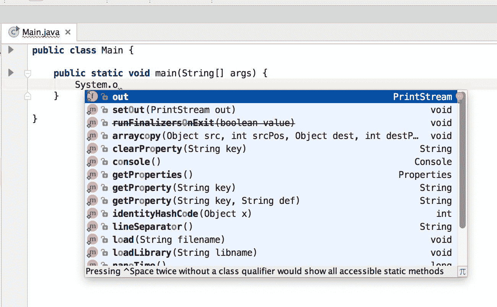

当您键入其他字符时，编辑器还会自动提供建议。您可以忽略弹出的窗口并继续键入。但是，很多时候，在按下*输入*之前，更容易在一个字符后停止并使用上下箭头选择需要完成的单词：该单词将自动插入到源代码中。

在截图中，你可以看到我写了`System.o`，编辑立即建议我写`out`。其他备选方案是类`System`中包含字母`o`的其他静态字段和方法。

IDE 编辑器不仅会提示何时可以为您键入，而且还会提示何时不能代替您键入。在屏幕截图中，IDE 告诉您键入一些表达式作为`println()`方法的参数，即`boolean`、`char`、`int`等等。IDE 完全不知道在那里输入什么。您必须构造表达式。不过，它可以告诉你，它需要某种类型。

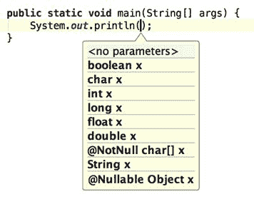

编辑器知道的不仅仅是内置类型。与 JDK 集成的编辑器会不断扫描源文件，并知道源代码中哪些类、方法和字段在编辑时可用。

当您想要重命名方法或变量时，也会大量使用这些知识。旧方法是重命名源文件中的字段或方法，然后彻底搜索变量的所有引用。使用 IDE，机械工作由它完成。它知道字段或方法的所有用途，并自动用新标识符替换旧标识符。它还可以识别局部变量是否恰好与我们重命名的变量同名，并且 IDE 只重命名那些真正引用我们正在重命名的变量的实例。

您通常可以做的不仅仅是重命名。程序员称之为**重构**的机械任务或多或少都有。IDE 使用一些键盘快捷键和编辑器中的上下文相关菜单来支持这些功能，在鼠标上单击鼠标右键，然后单击菜单。


IDE 还帮助您阅读库的文档和源代码，如下图所示：

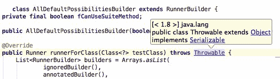

库为`public`方法提供*Javadoc*文档，您还应该为自己的方法编写 Javadoc。Javadoc 文档是从源代码中的特殊注释中提取出来的，我们将在[第 4 章](04.html)、*主脑-创建游戏*中学习如何创建这些文档。这些位于实际方法标题前面的注释中。由于创建编译文档是编译流的一部分，因此 IDE 也知道该文档，当您将光标定位到元素上时，它会在方法名、类名或要在源文件中使用的任何元素上显示为一个悬停框。

# 管理项目

在 IDE 窗口的左侧，您可以看到项目的目录结构。IDE 知道不同类型的文件，并以从编程角度来看有意义的方式显示它们。例如，它不会将`Main.java`显示为文件名。相反，它显示`Main`和一个图标，表示`Main`是一个类。它也可以是名为`Main.java`的文件中的接口，但在这种情况下，图标将显示这是一个接口。这也是通过 IDE 不断扫描和编译代码来完成的。

当我们开发 Java 代码时，这些文件被构造成子目录。这些子目录遵循代码的打包结构。很多时候，在 Java 中，我们使用复合的和长的包名，并且将其显示为一个深度嵌套的目录结构将不那么容易处理。

包用于对源文件进行分组。以某种方式相关的类的源文件应该放在一个包中。我们将在下一章讨论包的概念以及如何使用它们

IDE 能够显示包含源文件的项目目录的包结构，而不是嵌套目录。

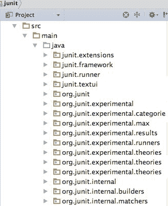

当您将类或接口从一个包移动到另一个包时，其发生方式与重命名或其他重构类似。源文件中对类或接口的所有引用都将重命名为新包。如果文件包含引用该类的`import`语句，则会更正该语句中的类名称。要移动类，可以打开包并使用良好的旧拖放。

包层次结构不是 IDE 中显示的唯一层次结构。类位于包中，但同时存在继承层次结构。类可以实现接口，也可以扩展其他类。JavaIDE 通过显示类型层次结构来帮助我们，您可以在图形界面上沿着继承关系导航。

IDE 可以显示另一个层次结构来帮助我们进行开发：方法调用层次结构。在分析代码之后，IDE 可以向我们显示显示方法之间关系的图形：哪个方法调用哪个其他方法。有时，此调用图在显示方法之间的依赖关系时也很重要。

# 构建代码并运行它

IDE 通常编译代码进行分析，以帮助我们及时发现语法错误或未定义的类和方法。这种编译通常是局部的，涵盖了部分代码，并且由于它一直在运行，源代码会发生变化，并且永远不会真正完成。要创建可部署文件，即项目的最终可交付代码，必须启动单独的构建过程。大多数 IDE 都有一些内置的工具，但是除了最小的项目之外，不建议使用这些工具。专业开发项目使用 Ant、Maven 或 Gradle。下面是 Maven 的一个例子。

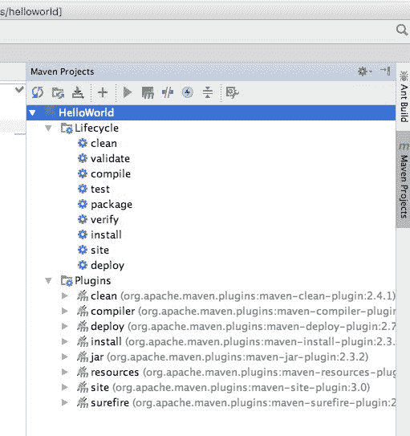

IDE 准备使用这样一个外部工具，它们可以帮助我们启动它们。这样，构建过程就可以在开发人员机器上运行，而无需启动新的 shell 窗口。IDE 还可以从这些外部构建工具的配置文件中导入设置，以识别项目结构、源文件的位置以及编译什么以支持编辑时的错误检查。

构建过程通常包含对代码执行某些检查。一堆 Java 源文件可能会顺利编译，代码可能仍然包含很多 bug，并且可能以糟糕的风格编写，这将使项目在长期内变得不可维护。为了避免此类问题，我们将使用单元测试和静态代码分析工具。这些并不能保证代码是无错误的，但可能性要大得多。

IDE 有运行静态代码分析工具和单元测试的插件。集成到 IDE 中具有巨大的优势。当分析工具或某些单元测试发现任何问题时，IDE 会提供一条错误消息，该消息的功能类似于网页上的链接。如果您单击消息（通常为蓝色并带下划线），就像在网页上一样，编辑器会打开有问题的文件并将光标放在问题所在的位置。

# 调试 Java

开发代码需要调试。Java 有很好的工具在开发过程中调试代码。JVM 通过 Java 平台调试器体系结构支持调试器。这允许您在调试模式下执行代码，JVM 将接受外部调试器工具通过网络连接到它，或者根据命令行选项尝试连接到调试器。JDK 包含一个客户端，`jdb`工具，它包含一个调试器；然而，与内置在 IDE 中的图形客户机相比，它的使用是如此的麻烦，以至于我从未听说有人在实际工作中使用它。

要在调试模式下启动 Java 程序，以便 JVM 将接受调试器客户端以向其附加选项，请执行以下命令：

```java
    -Xagentlib:jdwp=transport=dt_socket,server=y,suspend=y,address=7896

```

`Xagentlib`选项指示 Java 运行时加载`jdwp`代理。`-Xagentlib:jdwp=`后面的选项部分由调试器代理解释。这些方案如下：

*   `transport`：应指定使用哪种传输。它可以是共享内存（`dt_shmem`套接字）或 TCP/IP 套接字传输，但实际上，您将始终使用后者。这在前面的`dt_socket`样本中有规定。
*   `server`：指定调试后的 JVM 是以服务器模式启动还是以客户端模式启动。当您在服务器模式下启动 JVM 时，它开始监听套接字并接受调试器连接到它。如果它是在客户机模式下启动的，那么它会尝试连接一个调试器，该调试器应该在服务器模式下启动，并侦听端口。该选项的值为`y`表示服务器模式或`n`表示非服务器，也称为客户端模式。
*   `suspend`：也可以是`y`或`n`。如果 JVM 是在挂起模式下启动的，它将不会启动 Java 代码，直到附加了调试器。如果它是以`suspend=n`启动的，那么 JVM 将启动，当调试器连接时，它将在到达断点时立即停止。如果启动一个独立的 Java 应用程序，通常会使用默认的`suspend=y`启动调试。如果要在应用服务器或 servlet 容器环境中调试应用程序，最好从`suspend=n`开始；否则，在调试器连接到服务器之前，服务器不会启动。在`suspend=y`模式下启动 Java 进程，以防 servlet 应用程序仅在您想要调试 servlet 静态初始值设定项代码时有用，该代码在服务器启动时执行。如果没有挂起模式，则需要非常快地附加调试器。JVM 最好在这种情况下等待您。
*   `address`：这应该指定 JVM 与之通信的地址。如果 JVM 以客户机模式启动，那么它将开始连接到此地址。如果 JVM 在服务器模式下运行，那么它将接受来自该地址上的调试器的连接。地址只能指定端口。在这种情况下，IP 地址是本地机器的 IP 地址。

调试器代理可能处理的其他选项用于特殊情况。对于本书涵盖的主题，前面的选项就足够了。

下面的屏幕截图显示了一个典型的调试会话，我们在其中调试 IntelliJ IDE 中最简单的程序：

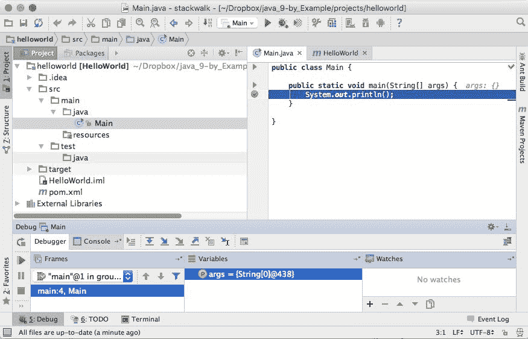

在调试模式下从 IDE 启动程序时，所有这些选项都会自动为您设置。您只需单击编辑器中的源代码即可设置断点。您可以使用单独的表单来添加、删除和编辑断点。断点可以附加到特定的行或特定的事件，比如抛出异常时。附加到特定行的断点也可以具有条件，仅当该条件为 true 时，才通知调试器停止代码的执行；例如，如果变量具有某个预定义值。

# 总结

在本章中，我们互相介绍了 Java。我们彼此不太了解，但我们还是认识了。我们已经安装了 Java 环境：Java、JDK 和集成开发环境。我们已经编写了一个小程序，并简要介绍了使用开发工具可以做些什么。这远非精通，但即使是最长的旅程也要从第一步开始，这有时是最难做到的。我们在 Java 之旅中已经做到了这一点。我们开始滚动，对于我们这样的狂热者来说，没有什么能阻止我们一路走下去。