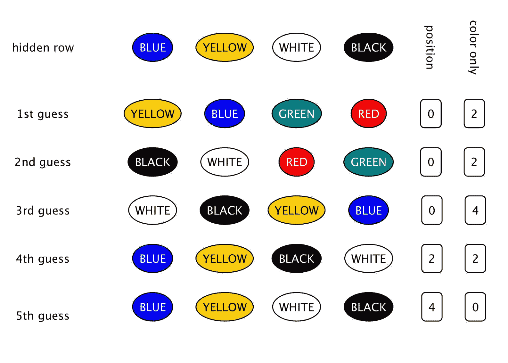
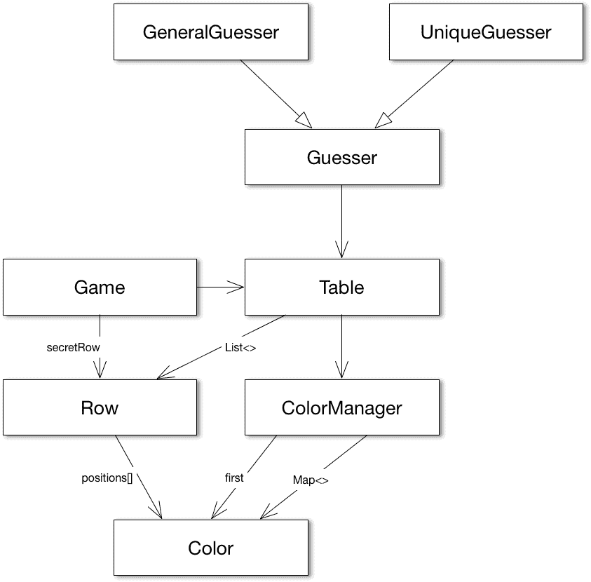
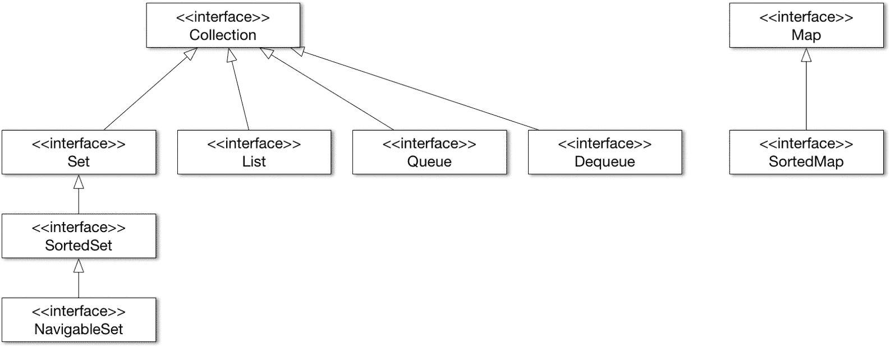
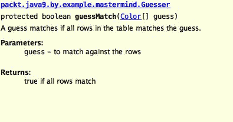

# 策划-创造一个游戏

在本章中，我们将开始开发一个简单的游戏。这场比赛是两个人的主谋游戏。玩家一从六种可能的颜色中选择四种不同颜色的大头针，并将它们排列在棋盘上一行，对另一个玩家隐藏。另一个玩家试图猜测大头针的颜色和位置。每次尝试后，玩家一会告诉玩家匹配颜色的数量以及匹配颜色和位置的针脚。该程序将同时充当播放器 1 和播放器 2。我们的代码将单独运行。然而，留给我们玩的是最重要的：代码。

这个例子非常复杂，足以加深 OO 原则以及我们如何设计类和建模现实世界。我们已经使用了 Java 运行时中提供的类。这一次，我们将使用集合并讨论这一重要领域。这些类和接口在 JDK 中广泛使用和可用，对于专业 Java 开发人员来说，它们与语言本身一样重要。

这次的构建工具是 Gradle。

在本章中，我们将介绍：

*   Java 集合
*   依赖注入
*   如何注释代码和创建 JavaDoc 文档
*   如何创建集成测试

# 游戏

策划人（[https://en.wikipedia.org/wiki/Mastermind_（棋盘游戏）](https://en.wikipedia.org/wiki/Mastermind_(board_game))是一个古老的游戏。1970 年发明了塑料版，这种塑料版在每个有孩子的房子里都很普遍。1980 年左右，我得到了一块棋盘作为圣诞礼物，用 BASIC 语言解决游戏难题是我在 1984 年左右创建的首批程序之一。

游戏板包含四列中几行的洞。有六种不同颜色的塑料别针可以插入孔中。每个针都有一种颜色。它们通常是红色、绿色、蓝色、黄色、黑色和白色。有一个特殊的行对其中一个玩家（猜测者）隐藏。

要玩游戏，其中一名玩家（隐藏者）必须从一组 PIN 中选择四个 PIN。所选管脚应具有不同的颜色。这些插针一个接一个地放置在隐藏行中，每个插针都位于一个位置。

猜测者试图找出什么颜色在哪个位置猜测。每次猜测都会选择四个管脚并将它们排成一行。隐藏器告诉猜测者有多少管脚处于正确位置，有多少管脚具有表上的颜色，但不在该颜色隐藏的位置。



示例剧本可能是这样的：

*   隐藏器隐藏四个颜色为蓝色、黄色、白色和黑色的针脚。
*   猜测者猜测黄色、蓝色、绿色和红色。
*   隐藏者告诉猜测者有两种颜色匹配，但它们都不在隐藏行中的位置。隐藏者这样说是因为黄色和蓝色在隐藏行中，但不在猜测者猜测的位置。它们实际上是交换的，但这些信息隐藏者是保密的。她只说有两种颜色匹配，没有一种在正确的位置。
*   下一个猜测是。。。

当猜者按照正确的顺序找到正确的颜色时，游戏结束。同样的游戏，如图所示，也可以用文字符号描述，`B`表示蓝色，`Y`表示黄色，`G`表示绿色，`W`表示白色，`R`表示红色，`b`表示黑色（幸运的是，我们在电脑上有大小写字母）。

```java
RGBY 0/0
GRWb 0/2
YBbW 0/2
BYGR 0/4
RGYB 2/2
RGBY 4/0

```

猜猜看！这是我们在本章中开发的程序的实际输出。

# 游戏模型

当我们用面向对象的思想开发一段代码时，我们尝试对真实世界建模，并将真实世界的对象映射到程序中的对象。你肯定听说过用几何物体的典型例子来解释物体定向，或者用汽车和马达来解释组成。就我个人而言，我认为这些例子太简单了，无法很好地理解。他们可能是好的开始，但我们已经在本书的第四章。智囊团的游戏好多了。它比矩形和三角形稍微复杂一些，但不像电信计费应用程序或原子能发电厂控制那样复杂。

我们在游戏中拥有的真实物体是什么？我们有一张桌子，我们有不同颜色的别针。我们当然需要两个 Java 类。桌子里有什么？每行有四个位置。也许我们需要一节课来排练。一张桌子将有行。我们还需要一些隐藏秘密的东西。这也可能是一行，每行还可能包含有关匹配的位置和颜色的信息。对于 secret 行，这个信息很明显：4 和 0。

什么是别针？每个针都有一种颜色，通常就是它。除了可以插入桌子上的孔之外，别针没有其他特征，但这是我们不会建模的真实特征。从本质上讲，别针是一种颜色，而不是别的颜色。这样，我们就可以在早期从模型中消除 pin 类，甚至在我们用 Java 创建它之前。相反，我们有颜色。

什么是颜色？这可能是第一次很难沉浸其中的事情。我们都很清楚什么是颜色。正如我们的眼睛所感知的那样，它是不同频率光的混合物。我们可以用不同颜色的颜料和印刷品，等等。有很多东西我们没有在这个项目中建模。在我们的代码中，很难说我们对颜色做了什么建模，因为这些特性是如此明显，以至于我们在现实生活中认为这是理所当然的；我们可以看出两种颜色是不同的。这是我们唯一需要的功能。为此，可以使用最简单的 Java 类：

```java
package packt.java9.by.example.mastermind; 
public class Color {}

```

如果您有两个类型为`Color`的变量，您可以判断它们是否相同。您可以使用表达式`a == b`使用对象标识比较`a`和`b`，也可以使用继承自`Object`类`a.equals(b)`的`equals`方法。用字母对颜色进行编码，或者使用`String`常量来表示它们，这是很诱人的。首先可能比较容易，但之后会有严重的缺点。当代码变得复杂时，会导致 bug；传递同样编码为字符串而不是颜色的东西很容易，只有单元测试可以节省时间。更好的是，当您键入错误的参数时，编译器已经在 IDE 中抱怨了。

当我们玩游戏时，大头针在小盒子里。我们从盒子里拔出别针。我们如何在程序中获得颜色？我们需要一些我们可以从那里获取颜色的东西，或者从另一个角度看一些可以给我们颜色的东西。我们称之为`ColorManager`。`ColorManager`知道我们有多少种不同的颜色，任何时候我们需要一种颜色，我们都可以要求它。

同样，有一种设计`ColorManager`的诱惑，它可以根据序列号提供颜色。如果我们有四种颜色，我们可以要求颜色编号 0、1、2 或 3。但再一次，它只是将颜色隐式编码为整数，我们同意不这样做。我们应该找到建模游戏所需的最小功能。

为了描述类的结构，专业开发人员通常使用 UML 类图。UML 是一种标准化的图表符号，几乎完全用于可视化软件体系结构。UML 中有许多图表类型来描述程序的静态结构和动态行为。这一次，我们将看到一个非常简化的类图。



我们没有空间深入了解 UML 类图的细节。矩形表示类，法线箭头表示类具有其他类类型的字段时的关系，三角形箭头表示一个类扩展另一个类。箭头指向要扩展的类的方向。

**游戏**包含一个秘密**行**和一个**表**。**表**有**ColorManager**和**行**的**列表<>**。**颜色管理器**具有第一种颜色，并且具有**颜色**的**映射<>**。我们还没有讨论为什么会有这样的设计，我们会到达那里，图表帮助我们走这条路。**行**本质上是**颜色**的数组。

玩游戏的人有一个功能：它必须猜很多次，直到找到隐藏的秘密。为了得到**颜色管理器**的模型，我们必须设计**猜测器**的算法。

当玩家做出第一个猜测时，任何颜色的组合都和其他颜色一样好。之后，猜测应该考虑对先前猜测给出的响应。这是一个合理的方法，只尝试颜色变化，可能是真正的秘密。玩家选择一个变体并查看之前的所有猜测，假设所选变体是秘密。如果对他已经做出的行的响应与对游戏中未知秘密的响应相同，那么尝试这种变化是合理的。如果反应有任何差异，那么这种变化肯定不是隐藏的变化。

为了遵循这种方法，猜测者必须一个接一个地生成所有可能的颜色变化，并将其与表格进行比较。猜测代码不会创建和存储所有可能的变化，但它必须知道它在哪里，并且必须能够计算下一个变化。这假设了变化的顺序。有一段时间，让我们忘记在一个变体中没有颜色可能出现两次。一个简单的排序可以像我们排序十进制数一样进行。如果我们有一个三位数的数字，那么第一个是 000，下一个是 001，依此类推到 009，总是取最后一个位置的下一个数字。然后，010 来了。我们在最后一个数字旁边增加了一个数字，并再次将最后一个数字设置为 0。现在，我们有 011012，等等。你知道，我们是怎么数数的。现在，用颜色替换数字，我们只有六个而不是十个。或者，当我们实例化一个`ColorManager`对象时，我们有我们想要的数量。

这导致了`ColorManager`的功能。它必须做以下两件事：

*   给来电者第一种颜色
*   给出给定颜色后的下一种颜色（我们将该方法命名为`nextColor`）

当没有下一种颜色时，后一种功能也应该以某种方式发出信号。这将使用另一个名为`thereIsNextColor`的方法实现。

按照惯例，启动返回布尔值的方法名时使用`is`。这将导致本公约后面的名称`isThereNextColor`或`isNextColor`。这两个名称中的任何一个都解释了该方法的功能。如果我问问题`isThereNextColor`，该方法将回答我`true`或`false`。但是，这不是我们将如何使用该方法。我们将用简单的句子交谈。我们将使用短句。我们将避免不必要的、胡言乱语的表达。我们也将以这种方式进行编程。调用方很可能会在`if`语句中使用此方法。他们会写以下内容：
`If( thereIsNextColor(currentColor)){...}`
而不是
`if( isThereNextColor(currentColor)){...}`
我认为第一个版本更具可读性，可读性优先。最后，但并非最不重要的一点是，如果你遵循旧的惯例，没有人会责怪你。如果这是公司的标准，你无论如何都必须这样做。

为此，`ColorManager`还必须创建彩色对象，并将其存储在有助于执行操作的结构中。

```java
package packt.java9.by.example.mastermind; 

 import java.util.HashMap; 
 import java.util.Map; 

 public class ColorManager { 
     final protected int nrColors; 
     final protected Map<Color, Color> successor = new HashMap<>(); 
     final private Color first; 

     public ColorManager(int nrColors) { 
         this.nrColors = nrColors; 
         first = new Color(); 
         Color previousColor = first; 

         for (int i = 1; i < nrColors; i++) { 
             final Color thisColor = new Color(); 
             successor.put(previousColor, thisColor); 
             previousColor = thisColor; 
         } 
         successor.put(previousColor, Color.none); 
     } 

     public Color firstColor() { 
         return first; 
     } 

     boolean thereIsNextColor(Color color) { 
         return successor.get(color) != Color.none; 
     } 

     public Color nextColor(Color color) { 
         return successor.get(color); 
     } 
 }

```

我们使用的结构是一个`Map`。`Map`是 Java 运行时中定义的一个接口，从 Java 的早期版本开始提供。`Map`有键和值，对于任何键，您都可以轻松检索分配给键的值。

您可以在第行中看到，变量`successor`被定义为我们将变量的类型定义为接口，但值是类的实例。显然，该值不能是接口的实例，因为这样的实例不存在。但是，为什么我们要将变量定义为接口？原因是抽象和编码实践。如果出于某种原因需要更改所使用的实现，那么变量类型可能仍然保持不变，并且不需要在其他地方更改代码。将变量声明为接口也是一种很好的做法，这样我们就不会因为方便而使用接口中不可用的实现的某些特殊 API。当确实需要时，我们可以更改变量的类型并使用特殊的 API。毕竟，API 的存在是有原因的，但仅仅因为它存在而使用某些特殊事物的诱惑就受到了阻碍。这有助于编写更简单、更简洁的程序。

`Map`只是 Java 运行时中定义的属于 Java 集合的接口之一。还有许多其他接口和类。尽管 JDK 和所有的类数量巨大，几乎没有人知道所有的类，但是集合是专业开发人员应该了解的一个特殊领域。在详细说明此代码中使用`HashMap`的原因之前，我们将对集合类和接口进行概述。这将有助于我们了解本计划中使用的其他集合。

# Java 集合

集合是帮助我们存储多个对象的接口和类。我们已经看到了可以做到这一点的数组，在前面的章节中也有`ArrayList`，但我们没有详细讨论 JDK 中还有哪些其他可能性。在这里，我们将更详细地讨论，但将流和函数方法留给后面的章节，我们也将避免讨论细节，这是一本参考书的任务。

使用集合类和接口的实现可以减少编程工作量。首先，您不需要编程已经存在的东西。其次，这些类在实现和特性方面都得到了高度优化。他们有非常好的 API 设计，代码速度快，占用内存小。很抱歉，他们的代码是很久以前写的，很多时候它不是一个好的风格，很难阅读和理解。

当您使用来自 JDK 的集合时，更有可能与某些库进行互操作。如果你制作自己版本的链表，你不可能找到一个现成的解决方案来对你的链表进行排序。如果您使用 JDK 标准类库中的`LinkedList`类，您将从`Collections`类中获得一个现成的解决方案，就在 JDK 中。还值得一提的是，Java 语言本身支持这些类，例如，您可以使用缩短的特殊语法轻松地迭代`Collection`的元素。

JDK 中的集合包含定义不同集合类型、实现类和执行某些操作（如排序）的算法的行为的接口。很多时候，这些算法在不同的实现版本上工作，得到相同的结果，但针对特定于实现的类进行了优化。

您可以使用接口提供的 API，如果您在代码中更改实现，您将获得适合该实现的优化版本。



收集接口可分为两类。一个包包含扩展`Collection`接口的接口，另一个包包含`Map`和扩展`Map`的`SortedMap`接口。这样，`Map`就不是一个真正的集合，因为它不仅包含其他对象，而且还将值与键配对。

# 接口集合

集合是接口层次结构的顶部。该接口定义了所有实现应该提供的方法，无论它们是直接实现`Set`、`SortedSet`、`List`、`Queue`还是`Deque`接口。正如`Collection`简单地说，实现`Collection`接口的对象只是一个将其他对象收集在一起的对象，它定义的方法就像向集合中添加一个新对象，清除其中的所有元素，检查一个对象是否已经是集合的成员，并遍历元素。

有关接口的最新定义，请参阅 Java pi 文档（[http://download.java.net/java/jdk9/docs/api/overview-summary.html](http://download.java.net/java/jdk9/docs/api/overview-summary.html) ）。您可以随时查阅在线 API，建议您这样做。

Java 语言本身直接支持该接口。您可以使用增强的`for`循环语法遍历`Collection`元素，就像您可以遍历数组元素一样，在数组元素中，集合应该是一个表达式，该表达式生成一个实现`Collection`接口的对象：

```java
for( E element : collection ){...}

```

在前面的代码中，`E`是`Collection`元素的对象或泛型类型。

接口`Collection`没有直接在 JDK 中实现。类实现`Collection`的子接口之一。

# 设置

`Set`是一个特殊集合，不能包含重复元素。当您想将一个对象添加到一个已经有一个与实际对象相同或相等的对象的集合中时，`add`方法将不会添加实际对象。`add`方法返回`false`表示失败。

当您需要一组唯一元素时，您可以在程序中使用`Set`，您只需检查元素是否为集合的成员，对象是否属于某个组。

当我们回到我们的程序代码时，我们将看到`UniqueGuesser`类必须实现一个算法来检查猜测中的颜色是否只存在一次。此算法是使用`Set`的理想候选算法：

```java
private boolean isNotUniqueWithSet(Color[] guess) { 
     final Set<Color> alreadyPresent = new HashSet<>(); 
     for (Color color : guess) { 
         if (alreadyPresent.contains(color)) { 
             return true; 
         } 
         alreadyPresent.add(color); 
     } 
     return false; 
 }

```

代码创建了一个集合，该集合在方法启动时为空。之后，它检查每种颜色（注意数组元素上的增强的`for`循环），如果它以前已经存在。为此，代码检查颜色是否已在集合中。如果它存在，猜测就不是唯一的，因为我们发现一种颜色至少存在两次。如果颜色不在集合中，那么猜测的颜色仍然可以是唯一的。为了以后能够检测到这一点，代码将颜色放入集合中。

我们将使用的`Set`的实际实现是`HashSet`。在 JDK 中，有许多类实现了`Set`接口。使用最广泛的是`HashSet`，也值得一提的是`EnumSet`、`LinkedHashSet`、`TreeSet`。最后一个还实现了`SortedSet`接口，因此我们将在这里详细介绍它。

为了理解什么是`HashSet`（以及后面的`HashMap`）以及它们是如何工作的，我们必须讨论什么是散列。它们在许多应用中起着非常重要的核心作用。他们在 JDK 的引擎盖下完成他们的工作，但是程序员必须遵守一些非常重要的限制，否则真的很奇怪，很难找到 bug，这会让他们的生活很痛苦。`HashSet`和`HashMap`中的散列契约是仅次于多线程问题的第二个最难发现的 bug 的原因。

因此，在继续使用不同的集合实现之前，我们将访问此主题。在这个讨论集合的迂回过程中，我们的示例已经深入了一个层次，现在我们将深入一个层次。我保证这是最后一次深入的迂回。

# 散列函数

散列是一个数学函数，它为一个元素指定一个数字。假设你在大学行政部门工作，你必须告诉威尔金森是否是你班的学生。你可以把名字储存在信封里的小纸片上，每个信封对应一个起始字母。不必搜索一万名学生，您可以查看信封中标题为 W 的试卷。这个非常简单的哈希函数将姓名的第一个字母指定给姓名（或字母的序号，正如我们所说的，哈希函数产生一个数字）。这实际上不是一个好的散列函数，因为它只将少数元素（如果有的话）放入表示为 X 的信封中，而将许多元素放入例如 a 的信封中。

一个好的散列函数会以相似的概率产生每个可能的序数。在哈希表中，我们通常有比要存储的元素数量更多的 bucket（上一个示例中的信封）。因此，当搜索一个元素时，很可能只有一个元素。至少这是我们想要的。如果一个 bucket 中有多个元素，则称为碰撞。好的散列函数具有尽可能少的冲突。

为了向后兼容，JDK 中有一个`Hashtable`类。在第一个版本中，这是 Java 中的第一个哈希表实现，由于 Java 是向后兼容的，所以它没有被丢弃。`Map`接口仅在版本 1.2 中引入。`Hashtable`有很多缺点，不推荐使用。（甚至这个名称也违反了 Java 命名约定。）我们在本书中不讨论这个类。每当我们谈论哈希表时，它指的是在`HashSet`、`HashMap`实现内部的实际数组，或者使用某些哈希索引表的任何其他集合。

哈希表是使用哈希函数的结果对数组进行索引的数组。通常，链表管理冲突。哈希表实现还实现了一种策略，当要存储的元素数量过高且冲突的可能性增加时，可以调整数组的大小。此操作可能需要相当长的时间，在此期间，单个元件在铲斗之间移动。

在此操作期间，无法可靠地使用哈希表，这可能是多线程环境中的一些问题的根源。在单线程代码中，您不会遇到此问题。当您调用`add`方法时，哈希表（set 或 map）决定必须调整表的大小。`add`方法调用 resizing 方法，直到完成后才返回。在此期间，单线程代码不可能使用哈希表：一个线程和一个线程本身正在执行调整大小。但是，在多线程环境中。。。

`HashSet`和`HashMap`使用集合中存储的`Object`提供的哈希函数。`Object`类实现`hashCode`和`equals`方法。您可以重写它们，如果这样做，您应该以一致的方式重写它们。首先，我们将看到它们是什么，然后如何一致地覆盖它们。

# 方法等于

set 的文档说明“set 不包含`e1`和`e2`元素对，因此`e1.equals`（`e2`）。如果`e1`和`e2`在某种程度上相等，`equals`方法返回`true`。它可能不同于两个相同的对象。可以有两个相等的不同对象。例如，我们可以有一个颜色实现，它将颜色的名称作为属性，两个颜色对象可能返回 true，在其中一个上调用`equals`方法，并在两个字符串相等时作为另一个传递参数。`equals`方法的默认实现在`Object`类的代码中，当且仅当`e1`和`e2`是完全相同的单个对象时，才会返回`true`。

这似乎很明显，但我的经验表明，在对象中实现 equals 必须如下所示，这一点再强调也不过分：

*   **反身**：这意味着一个对象总是等于它自己
*   **对称**（可交换）：这意味着如果`e1.equals(e2)`是`true`，那么`e2.equals(e1)`也应该是`true`
*   **及物**：表示如果`e1.equals(e2)`和`e2.equals(e3)`，那么`e1.equals(e3)`
*   **一致**：这意味着如果在两次调用之间没有更改对象，则返回值不应该更改

# 方法哈希代码

`hashCode`方法返回一个`int`。文档指出，任何重新定义此方法的类都应提供以下实现：

*   如果未修改对象，则始终返回相同的值
*   结果两个相等的对象的相同`int`值`equals`方法返回`true`

文档中还提到，这不是为不相等的对象生成不同`int`值的要求，但需要支持哈希实现集合的性能。

如果在实现`equals`和`hashCode`时违反了这些规则中的任何一条，那么使用它们的 JDK 类将失败。可以肯定的是，`HashSet`、`HashMap`和类似的类都经过了完全调试，看到您向一个集合添加了一个对象，然后集合报告它不存在，这将是一种令人困惑的体验。但是，只有在您发现集合中存储的两个相等的对象具有不同的`hashCode`值之前，`HashSet`和`HashMap`才会在由`hashCode`值索引的 bucket 中查找该对象。

将对象存储在`HashSet`或`HashMap`中，然后对其进行修改也是一个常见的错误。对象在集合中，但您无法找到它，因为`hashCode`返回不同的值。除非您知道自己在做什么，否则不应修改存储在集合中的对象。

很多时候，对象包含的字段从相等的角度来看并不有趣。`hashCode`和`equals`方法对于这些字段应该是幂等的，即使将对象存储在`HashSet`或`HashMap`中，您也可以更改这些字段。

例如，可以管理对象中的三角形，以保持顶点的坐标和三角形的颜色。但是，您并不关心颜色是否相等，只关心两个三角形在空间中处于完全相同的位置。在这种情况下，`equals`和`hashCode`方法不应考虑字段颜色。这样，我们可以画三角形；无论颜色字段是什么，它们仍然会出现在`HashSet`或`HashMap`中。

# 实现 equals 和 hashCode

实现这些方法相当简单。由于这是一项非常常见的任务，IDE 支持生成这些方法。这些方法紧密地联系在一起，以至于 IDE 中的菜单项不是独立的；他们提供给您立即生成这些方法。

要求 IDE 生成`equals`方法将产生如下代码：

```java
@Override 
 public boolean equals(Object o) { 
     if (this == o) return true; 
     if (o == null || getClass() != o.getClass()) return false; 
     MyObjectJava7 that = (MyObjectJava7) o; 
     return Objects.equals(field1, that.field1) && 
             Objects.equals(field2, that.field2) && 
             Objects.equals(field3, that.field3); 
 }

```

对于此示例，我们有三个名为`field1`、`field2`和`field3`的`Object`字段。带有任何其他类型和字段的代码看起来都非常相似。

首先，该方法检查对象标识。一个`Object`总是`equals`本身。如果作为参数传递的引用是`null`而不是对象，或者它们属于不同的类，那么生成的方法将返回 false。在其他情况下，将使用类`Objects`（注意复数）的静态方法来比较每个字段。

实用程序类`Objects`是在 Java7 中引入的，因此示例类的名称为。静态方法`equals`和`hash`支持`Object equals`和`hashCode`方法的覆盖。在 Java7 之前的`hashCode`创建相当复杂，需要使用一些神奇的数字实现模运算，这很难解释，仅仅看代码而不了解其背后的数学。

这种复杂性现在隐藏在下面的`Objects.hash`方法后面。

```java
@Override 
 public int hashCode() { 
     return Objects.hash(field1, field2, field3); 
 }

```

生成的方法只是调用`Objects.hash`方法，将重要字段作为参数传递。

# 哈希集

现在，我们基本上知道了很多关于散列的事情，所以我们可以勇敢地讨论`HashSet`类。`HashSet`是`Set`接口的一个实现，该接口内部使用哈希表。一般来说，就是这样。将对象存储在那里，可以查看对象是否已经存在。当需要`Set`实现时，几乎总是选择`HashSet`。几乎

# 枚举集

`EnumSet`可以包含某个枚举中的元素。回想一下，枚举是固定了`enum`本身中声明的大量实例的类。由于这限制了不同对象实例的数量，并且这个数量在编译期间是已知的，`EnumSet`代码的实现得到了相当优化。在内部，`EnumSet`被实现为一个位字段，在可以使用位字段操作的地方是一个很好的选择。

# 链接数据集

`LinkedHashSet`是一个`HashSet`，它还维护一个包含元素的双链接列表。当我们迭代 a`HashSet`时，元素的顺序没有保证。当修改`HashSet`时，新元素被插入其中一个桶中，并且可能会调整哈希表的大小。这意味着元素被重新排列并进入完全不同的存储桶。对`HashSet`中元素的迭代只是以某种顺序获取桶和其中的元素，从调用方的角度来看，这种顺序是任意的。

然而，`LinkedHashSet`使用它维护的链表对元素进行迭代，并且保证按照插入元素的顺序进行迭代。

# 分类集

`SortedSet`是一个接口，它保证实现它的类将按排序顺序遍历集合。如果对象实现了`Comparable`接口或`Comparator`对象可以驱动它，则顺序可能是对象的自然顺序。创建实现`SortedSet`的类实例时，该对象应可用；换句话说，它必须是构造函数参数。

# NavigableSet

`NavigableSet`使用方法扩展`SortedSet`接口，允许您在集合中进行邻近搜索。这本质上允许您搜索搜索中的元素，该元素小于或等于搜索的对象、小于或等于搜索的元素、大于或等于搜索的。

# 有序树

`TreeSet`是`NavigableSet`的一个实现，通过这种方式，这也是一个`SortedSet`，事实上，也是一个`Set.`，因为`SortableSet`文档意味着有两种类型的构造函数，尽管每个都有多个版本。一个需要一些`Comparator`，另一个依赖于元素的自然顺序。

# 列表

`List`是一个接口，需要实现类来跟踪元素的顺序。还有一些方法通过索引和`Collection`接口定义的迭代来访问元素，以保证元素的顺序。接口还定义了返回一个也实现了`ListIterator`接口的`Iterator`的`listIterator`方法。该接口提供了一些方法，允许调用方在遍历列表时向列表中插入元素，并在迭代中来回移动。也可以在`List`中搜索某个元素，但大多数接口实现的性能都很差，而搜索只是遍历所有元素，直到找到所搜索的元素。JDK 中有许多类实现这个接口。在这里，我们将提到两个。

# 链表

这是列表接口的双链接列表实现，它对每个元素的上一个元素以及列表中的下一个元素都有引用。该类还实现了`Deque`接口。从列表中插入或删除元素是相当便宜的，因为它只需要调整很少的引用。另一方面，通过索引对元素的访问将需要从列表的开始或列表的结尾进行迭代，以更接近指定索引元素的为准。

# ArrayList

此类是`List`接口的一个实现，该接口保持对数组中元素的引用。这样，通过索引访问元素的速度相当快。另一方面，在`ArrayList`中插入一个元素可能代价高昂。它需要将插入元素上方的所有引用移动一个更高的索引，并且可能还需要调整备份数组的大小，以防原始数组中没有空间存储新元素。本质上，这意味着分配一个新数组并复制对它的所有引用。

如果我们知道阵列将增长多大，并调用`ensureCapacity`方法，那么可以优化阵列的重新分配。这将根据参数提供的大小调整数组大小，即使当前使用的插槽编号较少。

我的经验是，新手程序员在需要列表时使用`ArrayList`，而不考虑不同实现的算法性能。我真的不知道为什么`ArrayList`如此受欢迎。程序中使用的实际实现应该基于正确的决策，而不是习惯。

# 队列

队列是一个集合，通常存储元素以供以后使用。您可以将元素放入队列并将其拉出。一个实现可以指定给定的顺序，可以是**先进先出**（**先进先出**）或**后进先出**（**后进先出**或某种基于优先级的顺序。

在队列上，您可以调用`add`方法添加一个元素，`remove`方法删除 head 元素，`element`方法在不从队列中删除 head 元素的情况下访问 head 元素。当存在容量问题且无法将元素添加到队列时，`add`方法将引发异常。当队列为空且没有 head 元素时，`element`和`remove`方法抛出异常。

由于异常只能在异常情况下使用，并且调用程序可以在代码的正常过程中处理这些情况，因此所有这些方法都有一个版本，该版本只返回一些特殊值来表示这种情况。调用方可以调用`offer`来提供用于存储的元素，而不是`add`。如果队列无法存储元素，则返回`false`。同样，`peek`将尝试访问头部元素，如果没有，则返回`null`，如果没有，`poll`将移除并返回头部元素，如果没有，则返回`null`。

请注意，这些返回`null`的方法只是在`LinkedList`等实现允许`null`元素时使情况变得模糊。切勿在队列中存储`null`元素。

# 德克

`Deque`是一个双端队列接口。它使用允许访问队列两端的方法扩展了`Queue`接口，以添加、查看和删除队列两端的元素。

对于`Queue`接口，我们需要六种方法。`Dequeue`拥有两个可管理的终端需要 12 种方法。我们有`addFirst`和`addLast`而不是`add`。同样我们可以`offerFirst`、`offerLast`以及`peekFirst`、`peekLast`和`pollFirst`、`pollLast`。出于某种原因，在`Queue`上实现`element`方法功能的方法被命名为`getFirst`和`getLast`。

由于此接口扩展了`Queue`接口，因此此处定义的方法也可用于访问队列头。除此之外，此接口还定义了可用于移除队列中特定元素的方法`removeFirstOccurrence`和`removeLastOccurrence`。我们不能指定要删除的元素的索引，也不能基于索引访问元素。`removeFirst`/`LastOccurrence`方法的参数是要删除的对象。如果我们需要这个功能，我们可以使用`Deque`，即使我们从队列的同一端添加和删除元素。

为什么`Deque`中有这些方法而`Queue`中没有？这些方法与`Deque`的双头性无关。原因是方法发布后无法添加到接口。如果我们向接口添加一个方法，就会破坏向后兼容性，因为实现该接口的所有类都必须实现新方法。Java8 引入了默认方法来缓解这种约束，但在 Java1.5 中定义了`Queue`接口，而在 Java1.6 中定义了`Deque`接口。当时没有办法将新方法添加到已经存在的接口中。

# 地图

`Map`将键和值配对。如果我们想从`Collection`的角度接近`Map`，那么`Map`是一组键/值对。您可以将键值对放入一个`Map`中，您可以基于一个键获得一个值。键的唯一性与`Set`中的元素相同。如果您查看`Set`接口的不同实现的源代码，您可能会看到其中一些被实现为`Map`实现的包装器，其中的值被简单地丢弃。

使用`Map`s 既简单又诱人。许多语言，如 Python、Go、JavaScript、Perl 等，都在语言级别上支持这种数据结构。然而，当数组足够时使用映射是一种我见过很多次的糟糕做法，尤其是在脚本语言中。Java 不容易出现这种新手程序员错误，但当您想要使用映射时，您可能仍然会发现自己处于这种情况，而且仍然有更好的解决方案。一般规则是，应使用最简单的数据结构，该结构足以实现算法。

# 哈希图

`HashMap`是`Map`接口基于哈希表的实现。由于映射基于哈希表，所以基本的`put`和`get`方法在固定时间内执行。此外，由于 Map 非常重要，而且由于 JDK 中最常用的实现是`HashMap`，因此该实现是相当可配置的。您可以使用默认构造函数（无参数）实例化`HashMap`，但也有一个构造函数定义初始容量和负载系数。

# 身份地图

`IdentityHashMap`是一个特殊的`Map`，字面上实现了`Map`接口，但事实上，它违反了`Map`接口文档定义的合同。它这样做是有充分理由的。实现使用了一个与`HashMap`一样的哈希表，但为了确定 bucket 中找到的 key 与作为 get 方法参数提供的 key 元素是否相等，它使用了`Object`引用（`==`操作符），而不是`Map`接口文档所要求的方法`equals`。

当我们想要将不同的`Object`实例区分为彼此相等的键时，使用此实现是合理的。出于性能原因使用此实现几乎肯定是一个错误的决定。另外，请注意，JDK 中没有`IdentityHashSet`实现。可能这样的集合很少被使用，以至于它在 JDK 中的存在会对新手程序员造成弊大于利的诱惑。

# 依赖注入

在上一章中，我们已经简要讨论了**依赖注入**（**DI**。现在，我们将深入了解更多细节。

对象通常不会自行工作。大多数情况下，实现依赖于其他类的服务。当我们想要向控制台写入内容时，我们使用`System`类。当我们管理猜测表时，我们需要`Color`对象和`ColorManager`。

在写入控制台的情况下，我们可能无法实现依赖性，因为作为 JDK 类库一部分的类始终可用，我们需要做的只是写入`System.out.println`。在这种情况下，此依赖关系连接到代码中。除非更改代码，否则无法将输出发送到其他地方。这不是太灵活，在许多情况下，我们需要一个解决方案，可以与不同的输出，不同的颜色管理器或不同的服务，我们的代码依赖。实现这一点的第一步是创建一个字段，该字段包含给我们的类提供服务的对象的引用。在输出的情况下，字段的类型可以是`OutputStream`类型。下一个更有趣的步骤是该字段如何获取值。

解决方案之一是使用 DI。在这种方法中，一些外部代码准备依赖项并将它们注入到对象中。当发出对类的方法的第一次调用时，所有依赖项都已填充并准备好使用。

在这个结构中，我们有四个不同的参与者：

*   客户机对象是在流程中获取注入的服务对象的对象
*   一个或多个服务对象被注入到客户机对象中
*   喷油器是执行喷油的代码
*   接口定义客户端需要的服务

如果我们从客户机代码中移动创建服务对象的逻辑，代码就会变得更短、更干净。客户端类的实际能力几乎不应该涵盖服务对象的创建。例如，`Game`类包含一个`Table`实例，但游戏不负责创建`Table`。它被赋予与它一起工作的权利，就像我们在现实生活中建模一样。

服务对象的创建有时与发出`new`操作符一样简单。有时，服务对象还依赖于其他服务对象，这样在依赖项注入过程中也充当客户机。在这种情况下，服务对象的创建可能需要很多行。依赖关系的结构可以用声明式的方式表示，描述哪些服务对象需要哪些其他服务对象，以及要使用的服务接口的实现。依赖注入注入器使用这种声明性描述。当需要一个需要服务对象的对象，而服务对象本身又需要其他服务对象时，注入器使用与声明性描述匹配的实现以适当的顺序创建服务实例。注入器以传递方式发现所有依赖项，并创建依赖项的传递闭包图。

所需依赖项的声明性描述可以是 XML，也可以是专门为依赖项注入开发的特殊语言，甚至可以是使用专门设计的 fluent API（[的 Java 本身 https://blog.jooq.org/2012/01/05/the-java-fluent-api-designer-crash-course/](https://blog.jooq.org/2012/01/05/the-java-fluent-api-designer-crash-course/) ）。XML 最早用于**DI**注入器。后来基于**Groovy**的**领域专用语言**（[https://martinfowler.com/books/dsl.html](https://martinfowler.com/books/dsl.html) 进入图片和 Java fluent API 方法。我们将只使用最现代的最后一个，我们将使用**Spring**和**Guice****DI**容器，因为它们是最知名的注入器实现。

# 实现游戏

没有例子的收藏很无聊。幸运的是，在我们的游戏中，我们使用了一些集合类以及本章将要研究的其他方面。

# 色彩管理

从`ColorManager`类的实现中，我们跳进了充满集合类的池中。现在让我们刷新类中我们感兴趣的部分构造函数：

```java
final protected int nrColors; 
 final protected Map<Color, Color> successor = new HashMap<>(); 
 final private Color first; 

 public ColorManager(int nrColors) { 
     this.nrColors = nrColors; 
     first = new Color(); 
     Color previousColor = first; 

     for (int i = 1; i < nrColors; i++) { 
         final Color thisColor = new Color(); 
         successor.put(previousColor, thisColor); 
         previousColor = thisColor; 
     } 
     successor.put(previousColor, Color.none); 
 }

```

我们将使用`HashMap`将颜色保存在有序列表中。起初，选择`HashMap`似乎很奇怪。非常正确，在编码`ColorManager`的过程中，我也考虑了`List`，这似乎是一个更明显的选择。当我们有一个`List<Color> colors`变量时，`nextColor`方法是这样的：

```java
public Color nextColor(Color color) { 
     if (color == Color.none) 
         return null; 
     else 
         return colors.get(colors.indexOf(color) + 1); 
 }

```

构造函数将更加简单，如以下代码所示：

```java
final List<Color> colors = new ArrayList<>(); 

     public ColorManager(int nrColors) { 
         this.nrColors = nrColors; 
         for (int i = 0; i < nrColors; i++) { 
             colors.add(new Color()); 
         } 
         colors.add(Color.none); 
     } 

     public Color firstColor() { 
         return colors.get(0); 
     }

```

为什么我选择了更复杂的解决方案和不明显的数据结构？关键是性能。调用`nextColor`方法时，列表实现首先找到检查列表中所有元素的元素，然后获取下一个元素。时间与颜色的数量成正比。当我们的颜色数量增加时，时间也会增加，以使下一种颜色有一个。

同时，如果我们关注的不是来自我们想要解决的任务的口头表达的数据结构（按排序顺序获得颜色），而是我们想要实现的实际方法，`nextColor(Color)`，那么我们很容易得出结论，`Map`更合理。我们需要的正是一个`Map`：有一个我们想要的元素，另一个与我们拥有的元素相关。键和值也是`Color`。使用`HashMap`获取下一个元素是恒定时间。此实现可能比基于`ArrayList`的实现更快。

问题是它可能只会更快。当您考虑重构代码具有更好的性能时，您的决策应该总是基于度量值。实践表明，如果您实现了一个您认为更快的代码，那么您将失败。在最好的情况下，您将优化代码，使其在应用程序服务器安装期间快速运行。同时，优化后的代码通常可读性较差。有求必应。
不应过早地进行优化。代码的可读性第一。然后，评估性能，如果性能有问题，那么分析执行情况并优化代码，这对总体性能影响最大。微观优化也无济于事。
我是否选择了`HashMap`实现而不是`List`进行了过早优化？如果我真的使用`List`实现了代码，然后进行了重构，那么是的。如果我在考虑`List`解决方案，然后我发现`Map`解决方案在没有事先编码的情况下更好，那么我没有。随着时间的推移，这样的考虑会变得更加容易，你也会经历到这一点。

# 班级颜色

我们已经看过了类代码的代码，它是世界上最简单的类。实际上，正如在 GitHub 存储库中一样（[https://github.com/j9be/chapter04](https://github.com/j9be/chapter04) 或[https://github.com/PacktPublishing/Java-9-Programming-By-Example/tree/master/Chapter04](https://github.com/PacktPublishing/Java-9-Programming-By-Example/tree/master/Chapter04) ），代码有点复杂：

```java
package packt.java9.by.example.mastermind; 

 /** 
  * Represents a color in the MasterMind table. 
  */ 
 public class Color { 
     /** 
      * A special object that represents a 
      * value that is not a valid color. 
      */ 
     public static final Color none = new Color(); 
 }

```

我们有一个名为`none`的特殊颜色常数，用于表示类型为`Color`但不是有效`Color`的引用。在专业发展中，我们长期使用`null`值来表示无效引用，因为我们向后兼容，所以我们仍然使用它。但是，建议尽可能避免使用`null`参考。

托尼·霍尔（[https://en.wikipedia.org/wiki/Tony_Hoare 1965 年发明了`null`参考的](https://en.wikipedia.org/wiki/Tony_Hoare)，有一次承认这是一个在 IT 行业花费数十亿美元的错误。

`null`值的问题在于它将控件从类中移除，从而打开封装。如果某个方法在某些情况下返回`null`，则严格要求调用方检查空值并根据空值进行操作。例如，您不能对`null`引用调用方法，也不能访问任何字段。如果该方法返回一个对象的特殊实例，那么这些问题就不那么严重了。如果调用方忘记检查特殊返回值并调用特殊实例上的方法，则调用的方法仍有可能实现一些异常或错误处理。该类封装了控件，并可以抛出一个特殊异常，该异常可能提供有关调用方未检查特殊值的编程错误所导致的错误的更多信息。

# JavaDoc 和代码注释

在我们前面介绍的内容和清单之间还有另一个区别。这是对代码的注释。代码注释是程序的一部分，被编译器忽略并过滤掉。这些注释仅适用于维护或使用代码的人员。

在 Java 中，有两种不同的注释。`/*`和`*/`之间的代码为注释。注释的开始和结束不需要在同一行上。另一种类型的注释以`//`字符开头，并在行尾结束。

为了记录代码，可以使用 JavaDoc 工具。JavaDoc 是一个特殊的工具，它可以读取源代码并提取有关类、方法、字段和其他实体的 HTML 文档，这些实体的注释以`/**`字符开头。文档将以格式化的方式包含 JavaDoc 注释以及从程序代码中提取的信息。

当您将鼠标移到方法调用或类名（如果有）上时，该文档也会在 IDE 中显示为联机帮助。JavaDoc 注释可以包含 HTML 代码，但通常不应该包含。如果真的需要，您可以使用`<p>`开始一个新的段落，或者使用`<pre>`标记将一些预格式化的代码示例包含到文档中，但是没有更多的东西能带来真正的好处。文档应该尽可能简短，并且包含尽可能少的格式。

JavaDoc 文档中出现了一些特殊的标记。当您开始将 JavaDoc 键入为`/**`，然后按*回车*时，IDE 会预先填充这些内容。这些在注释中，以`@`字符开头。有一组预定义的标签：`@author`、`@version`、`@param`、`@return`、`@exception`、`@see`、`@since`、`@serial`和`@deprecated`。最重要的标签是`@param`和`@return`。它们用于描述方法参数和返回值。虽然我们还没有到达那里，但是让我们先看看`Guesser`类中的`guessMatch`方法。

```java
/** 
  * A guess matches if all rows in the table matches the guess. 
  * 
  * @param guess to match against the rows 
  * @return true if all rows match 
  */ 
 protected boolean guessMatch(Color[] guess) { 
     for (Row row : table.rows) { 
         if (!row.guessMatches(guess)) { 
             return false; 
         } 
     } 
     return true; 
 }

```

参数的名称由 IDE 自动生成。当你创建文档时，写一些有意义的东西，而不是重复。很多时候，新手程序员都有编写 JavaDoc 的冲动，必须编写一些关于参数的内容。他们制作了如下文档：

```java
* @param guess is the guess

```

真正地我永远也猜不到。如果您不知道在那里写什么来记录参数，那么可能是您选择了参数的名称。前面示例的文档如下所示：



关注方法、类和接口的作用以及如何使用它们。不要解释它是如何在内部工作的。JavaDoc 不是解释算法或编码的地方。它用于帮助使用代码。然而，如果有人碰巧解释了一种方法是如何工作的，那就不是一场灾难。评论很容易被删除。

然而，有一条评论比什么都没有更糟糕：过时的文档不再有效。当元素的契约发生了变化，但是文档没有跟随变化，并且误导了想要调用方法、接口或类的用户，无论什么都将面临严重的错误，并且将不知所措。

从现在起，JavaDoc 注释将不会以打印形式列出以保存树和电子书版本中的电子，但它们存在于存储库中，可以进行检查。

# 一行

现在，我们有了`Color`甚至实例，如果我们需要`ColorManager`。这是在`Row`s 中存储`Color`s 的时间。`Row`类稍长，但不太复杂。

```java
package packt.java9.by.example.mastermind; 

 import java.util.Arrays; 

 public class Row { 
     final Color[] positions; 
     private int matchedPositions; 
     private int matchedColors;

```

`Row`包含三个字段。一个是`positions`阵列。数组的每个元素都是一个`Color`。`matchedPositions`是匹配的位置数，`matchedColors`是匹配隐藏行中颜色但不在隐藏行中位置上的颜色数。

```java
    public static final Row none = new Row(Guesser.none);

```

`none`是一个常量，它包含一个特殊的`Row`实例，我们将在任何地方使用`null`。构造函数获取数组中应该在行中的颜色。

```java
  public Row(Color[] positions) { 
         this.positions = Arrays.copyOf(positions, positions.length); 
     }

```

构造函数生成原始数组的副本。这是一个重要的代码，我们将稍微检查一下。让我们重申 Java 是按值传递参数的。这意味着当您将数组传递给方法时，您将传递保存该数组的变量的值。然而，Java 中的数组和其他任何东西一样都是对象（除了像`int`这样的原语）。因此，变量所包含的是对恰好是数组的对象的引用。如果更改数组的元素，则实际上更改了原始数组的元素。参数通过时复制数组引用，但数组本身和元素不通过。

`java.util.Arrays`实用程序类提供了许多有用的工具。我们可以很容易地用 Java 编写数组复制代码，但是为什么要重新发明轮子呢？除此之外，数组是连续的内存区域，可以使用低级机器代码非常有效地从一个位置复制到另一个位置。我们调用的`copyOf`方法调用`System.arraycopy`方法，该方法是本机方法，因此执行本机代码。

请注意，`Arrays.copyOf`调用本机实现并不能保证在大型阵列的情况下会非常快。我正在测试和调试的版本就是这样做的，我们可以假设一个好的 JDK 做了类似的事情，既有效又快速。

复制数组后，如果调用方修改传递给构造函数的数组，则不成问题。该类将引用包含相同元素的副本。但是，请注意，如果调用方更改了存储在数组中的任何对象（不是数组中的引用，而是数组元素引用的对象本身），则会修改相同的对象。`Arrays.copyOf`不复制数组引用的对象，只复制数组元素。

该行是与颜色一起创建的，因此，我们为`Color`数组使用了一个`final`字段。但是，在创建行时无法知道匹配项。其中一个玩家创建了`Row`，之后，另一个玩家将告诉两个`int`值。但是，我们不会为这两个值创建两个二传手，因为它们总是在游戏中同时定义在一起。

```java
  public void setMatch(int matchedPositions, int matchedColors) { 
         if (matchedColors + matchedPositions > positions.length) { 
             throw new IllegalArgumentException( 
                     "Number of matches can not be more that the position."); 
         } 
         this.matchedColors = matchedColors; 
         this.matchedPositions = matchedPositions; 
     }

```

`setMatch`方法不仅设置值，还检查值是否一致。两个值之和不能超过列数。此检查确保使用`Row`类 API 的调用方不会不一致地使用它。如果此 API 仅在代码内部使用，则此断言不应成为代码的一部分。在这种情况下，良好的编码风格将确保不会使用单元测试不一致地调用该方法。当我们创建 API 以在我们无法控制的情况下使用时，我们应该检查使用是否一致。如果不这样做，我们的代码在使用不一致时可能会表现得很奇怪。当调用者将匹配设置为与任何可能的猜测都不匹配的值时，游戏可能永远不会结束，调用者可能很难弄清楚到底发生了什么。这可能需要调试代码的执行。

如果我们在这种情况下抛出一个异常，程序将在错误所在的位置停止。不需要调试库。

```java
public boolean guessMatches(Color[] guess) { 
     return nrMatchingColors(guess) == matchedColors && 
             nrMatchingPositions(guess) == matchedPositions; 
 }

```

下一个方法决定作为参数给出的猜测是否与实际行匹配。如果当前猜测在隐藏行中，此方法检查行中猜测的答案是否有效。实现相当短且简单。如果颜色匹配的数量和位置匹配的数量与行中给定的数量相同，则猜测与行匹配。不要羞于写简短的方法。不要认为本质上只包含一条语句的单行方法是无用的。无论我们在哪里使用这个方法，我们都可以编写表达式，它就在 return 语句之后，但是我们没有这样做，原因有二。第一个也是最重要的原因是，决定行匹配猜测的算法属于类`Row`的实现。如果实现发生任何更改，那么代码更改的唯一位置就是这里。另一个原因也很重要，那就是可读性。在我们的代码库中，我们从`abstract class Guesser`调用此方法。它包含一个带有以下表达式的`if`语句：

```java
if (!row.guessMatches(guess)) {

```

以下方式是否更具可读性：

```java
if( !(nrMatchingColors(guess) == matchedColors && nrMatchingPositions(guess) == matchedPositions)) {

```

我确信大多数程序员更容易理解第一个版本的意图。我甚至建议实现`doesNotMatchGuess`方法，以进一步提高代码的可读性。

```java
  public int nrMatchingColors(Color[] guess) { 
         int count = 0; 
         for (int i = 0; i < guess.length; i++) { 
             for (int j = 0; j < positions.length; j++) { 
                 if (i != j && guess[i] == positions[j]) { 
                     count++; 
                 } 
             } 
         } 
         return count; 
     }

```

匹配颜色的数量是同时出现在行和猜测中，但不在同一位置的颜色。定义，以及我们如何计算它，是相当简单和明确的情况下，没有颜色可以出现两次在隐藏行。如果一种颜色可能在隐藏行中出现多次，此实现将该颜色在猜测中出现的次数与在隐藏行中出现的次数相同。例如，如果我们有一个隐藏的`RRGB`行，猜测为`bYRR`，计算结果将为 4。这是一个球员之间的协议，他们如何计算在这种情况下。重要的是，它们使用相同的算法，这在我们的例子中应该是正确的，因为我们将要求程序同时扮演两个玩家。由于我们将自己编写代码，我们可以相信它不会作弊。

```java
public int nrMatchingPositions(Color[] guess) { 
         int count = 0; 
         for (int i = 0; i < guess.length; i++) { 
             if (guess[i] == positions[i]) { 
                 count++; 
             } 
         } 
         return count; 
     }

```

计算好的颜色，以及它们应该位于的位置，就更简单了。

```java
public int nrOfColumns() { 
     return positions.length; 
 }

```

此方法告知`Row`中的列数。控制整个游戏流程的`Game`类需要此方法。由于该类与`Row`在同一个包中，因此可以访问字段位置。我创建了代码以获得列数为`row.positions.length`。但第二天，我在读代码时告诉自己：这太难看了，不可读！我在这里感兴趣的不是一些神秘位置的长度；它是列数。列数是`Row`类的责任，而不是任何其他类的业务。如果我开始将职位存储在一个`List`中，而这个`List`中没有`length`（它有`size`方法），这是`Row`的唯一责任，不应影响任何其他代码。因此，我创建了`nrOfColumns`方法来改进代码。

该类的其余部分包含一些更简单的方法，这些方法仅用于显示游戏，而不用于玩算法：

```java
  public int nrColumns() { 
         return positions.length; 
     } 

     public Color position(int i) { 
         return positions[i]; 
     } 

     public int matchedPositions() { 
         return matchedPositions; 
     } 

     public int matchedColors() { 
         return matchedColors; 
     } 
 }

```

如果您是一个纯粹主义者，您可以将这些方法封装到一个名为`Output`或`Print`的内部类中，并通过在`Row`类中创建为字段的最终实例调用它们。也可以将这些字段的可见性从`private`更改为`protected`，并在`PrintableRow`中实现这些方法，该`PrintableRow`可以从现有`Row`实例化并实现这些方法。

`PrintableRow`的第一个版本如下：

```java
public class PrintableRow extends Row { 
     public PrintableRow(Row row) { 
         super(row.positions); 
         super.setMatch(row.matchedPositions,row.matchedColors); 
     } 
 // the methods are deleted from the print ... 
 }

```

方法与前一页完全相同；使用 IDE 重构支持将它们从一个类剪切粘贴到另一个类，或者更确切地说是移动。

编写代码时，请不要使用复制粘贴。但是，您可以使用剪切和粘贴来移动代码片段。危险在于使用复制粘贴。许多开发人员声称，他们实际使用的复制和粘贴并不是复制粘贴编程。他们的理由是，他们对粘贴的代码进行了太多的更改，以至于与原始代码几乎没有任何关系。
真的吗？在这种情况下，为什么在开始修改代码时需要复制的代码？为什么不从头开始呢？这是因为，如果您使用 IDE 的复制和粘贴功能，那么不管发生什么，您都要进行复制粘贴编程。

类`PrintableRow`非常简洁，将输出关注点与核心功能分开。当您需要一个实例时，手头已经有一个`Row`实例并不是问题。构造函数将基本上克隆原始类并返回一个可打印的版本。困扰我的是克隆技术的实施。构造函数中的代码调用超级构造函数，然后调用方法，所有这些都与`Row`类的原始功能一起工作。它们与`PrintableRow`实现的印刷适性无关。此功能实际上属于`Row`类。我们应该创建一个执行克隆的受保护构造函数：

```java
protected Row(Row cloneFrom) { 
     this(cloneFrom.positions); 
     setMatch(cloneFrom.matchedPositions, cloneFrom.matchedColors); 
 }

```

`PrintableRow`的构造函数只需调用`super(row)`即可。

代码永远不会完成，也永远不会完美。在专业环境中，程序员往往会在代码足够好的时候完成润色。没有任何代码是无法改进的，但是有一个截止日期。软件必须传递给测试人员和用户，并且必须用于帮助节约成本。毕竟，这是专业开发人员的最终目标：拥有支持业务的代码。从不运行的代码一文不值。
我不想让您认为我在这里提供的示例是完全预先创建的。原因是（你仔细阅读了吗？）因为它们并不完美。正如我所说，代码从来都不是完美的。
当我第一次创建行时，它在一个内部类中包含打印方法。我不喜欢它。代码很臭。因此，我决定将功能移到`Row`类。然而，我仍然不喜欢这个解决方案。然后，我上床睡觉，睡觉，工作，几天后又回来了。前一天我无法创建的东西现在看来很明显，这些方法必须移动到一个子类中。
现在又出现了另一个困境。我应该给出最终的解决方案，还是在这里提供不同的版本？在某些情况下，我只提供最终版本。在其他情况下，像这样，可以从开发步骤中学习一些东西。在这些情况下，我不仅介绍了代码，还介绍了它的部分演变过程，介绍了它是如何创建的。如果你想看到那些我不敢发表的东西，看看 Git 的历史。我承认，有时候，我创建的代码甚至会让我在一天后使用 facepalm。

# 桌子

Table 是一个简单的类，它只有一个非常简单的功能。

```java
public class Table { 
     final ColorManager manager; 
     final int nrColumns; 
     final List<Row> rows; 

     public Table(int nrColumns, ColorManager manager) { 
         this.nrColumns = nrColumns; 
         this.rows = new LinkedList<>(); 
         this.manager = manager; 
     } 

     public void addRow(Row row) { 
         rows.add(row); 
     } 
 }

```

有一件事值得一提，这不是什么新鲜事，但值得重复。`rows`变量被声明为 final，并在构造函数中获取值。这是一个`List<Row>`类型的变量。事实上，它是`final`意味着它将在其生命周期内持有相同的列表对象。列表的长度、成员和其他功能可能会改变，也将改变。我们将在此列表中添加新行。最终对象变量引用一个对象，但不能保证对象本身是不可变的。只有变量不变。

当您对代码进行检查并向同事解释一个类的功能时，您发现自己多次开始解释“这个类非常简单”，这意味着代码是好的。
在其他方面可能是错误的，但类的粒度似乎还可以。

# 猜测者

Guesser 和`UniqueGuesser`和`GeneralGuesser`子类是程序中最有趣的类。他们实际执行的任务是游戏的核心。给定一个带有隐藏行的`Table`，猜测者必须创建越来越新的猜测。

为此，`Guesser`需要在创建时获得`Table`。这是作为构造函数参数传递的。它应该实现的唯一方法是`guess`，它根据表及其实际状态返回一个新的猜测。

当我们想要实现一个猜测器，该猜测器假设隐藏行中的所有颜色都是不同的，并且没有实现这个假设时，我们将实现三个类。`Guesser`是一个抽象类，它只实现独立于假设的逻辑。这些方法将被实际实现继承：`UniqueGuesser`和`GeneralGuesser`。

让我们看一下这个类的实际代码：

```java
package packt.java9.by.example.mastermind; 

 public abstract class Guesser { 
     protected final Table table; 
     private final ColorManager manager; 
     public Guesser(Table table) { 
         this.table = table; 
         this.lastGuess = new Color[table.nrColumns]; 
         this.manager = table.manager; 
     }

```

猜测者的状态是它做出的最后一次猜测。虽然这是表格的最后一行，但更多的是猜测者的内部问题。猜测者拥有所有可能的猜测，一个接一个；`lastGuess`是上次停止的，再次调用时应继续。

```java
    abstract protected void setFirstGuess();

```

设置第一个猜测在很大程度上取决于颜色唯一性的假设。第一次猜测不应该包含重复的颜色，以防隐藏行不包含重复的颜色（至少在我们的实现中），而`GeneralGuesser`可以随时猜测，即使`firstGuess`所有颜色都相同。

```java
    protected final Color[] lastGuess; 
    public static final Color[] none = new Color[]{Color.none};

```

再次强调，在这个类中，`none`只是一个对象，当我们需要返回对`Guess`的引用但不是真正的猜测时，我们尝试使用它来代替`null`。

```java
  protected Color[] nextGuess() { 
         if (lastGuess[0] == null) { 
             setFirstGuess(); 
             return lastGuess; 
         } else { 
             return nextNonFirstGuess(); 
         } 
     }

```

`nextGuess`方法是一种内部方法，它生成下一个猜测，这是在我们对可能的猜测进行排序时出现的。它没有对`Table`进行任何检查；它几乎不经过思考，只会产生下一个猜测。我们如何进行第一次猜测和如何进行连续猜测的实现是不同的。因此，我们将用不同的方法实现这些算法，并从这里调用它们。

`nextNonFirstGuess`方法表示特殊情况下的下一个猜测，当猜测不是第一个猜测时：

```java
  private Color[] nextNonFirstGuess() { 
         int i = 0; 
         boolean guessFound = false; 
         while (i < table.nrColumns && !guessFound) { 
             if (manager.thereIsNextColor(lastGuess[i])) { 
                 lastGuess[i] = manager.nextColor(lastGuess[i]); 
                 guessFound = true; 
             } else { 
                 lastGuess[i] = manager.firstColor(); 
                 i++; 
             } 
         } 
         if (guessFound) { 
             return lastGuess; 
         } else { 
             return none; 
         } 
     }

```

回顾几页我们详细介绍了算法的工作原理。我们声明，这种工作方式非常类似于我们用十进制数字计数的方式。到目前为止，您已经有足够的 Java 知识和编程技能来理解该方法的功能。更有趣的是知道为什么它是这样编码的。

提示：一如既往，要可读。

有消除`guessFound`变量的诱惑。当我们发现幸运的猜测时，从方法的中间返回不是更简单吗？如果我们这样做了，那么在返回`none`值之前就不需要检查`guessFound`值。如果我们从循环中间返回，代码将无法到达那里。

是的，写起来会更简单。但是，我们创建的代码是可读的，而不是可写的。是的，但是代码越少可读性越好。在这种情况下不行！从循环返回会降低可读性。更不用说，`return`语句分散在方法的不同执行阶段。

```java
private Color[] nextNonFirstGuess() { 
     int i = 0; 
     while (i < table.nrColumns) { 
         if (manager.thereIsNextColor(lastGuess[i])) { 
             lastGuess[i] = manager.nextColor(lastGuess[i]); 
             return lastGuess; 
         } else { 
             lastGuess[i] = manager.firstColor(); 
             i++; 
         } 
     } 
     return none; 
 }

```

当有人以这种方式编写优化的代码时，就像一个蹒跚学步的孩子迈出第一步，然后骄傲地看着母亲。好的，男孩/女孩，你很棒。现在继续走吧。当你是邮递员时，走路会很无聊。那将是你的职业。所以，撇开骄傲，写一些无聊的代码。专业人士编写无聊的代码。不会很慢吧？

不这不会很慢。首先，在探查器证明代码不满足业务需求之前，它并不慢。如果是这样，它就足够快了，不管它有多慢。慢是好的，只要它是好的业务。毕竟，JIT 应该有一些任务来优化要运行的代码。

下一种方法检查猜测是否与之前的猜测及其在`Table`上的结果相匹配：

```java
    private boolean guessMatch(Color[] guess) { 
         for (Row row : table.rows) { 
             if (!row.guessMatches(guess)) { 
                 return false; 
             } 
         } 
         return true; 
     } 
     private boolean guessDoesNotMatch(Color[] guess) { 
         return !guessMatch(guess); 
     }

```

由于我们已经在类`Row`中实现了猜测匹配，所以我们所要做的就是为表中的每一行调用该方法。如果所有行都匹配，那么猜测可能对表有利。如果前面的任何猜测都不匹配，那么这个猜测就泡汤了。

当我们检查匹配的否定表达式时，我们创建了该方法的英文版本。

在这种情况下，创建方法的`guessDoesNotMatch`版本就足够了。但是，如果方法没有被否定，则代码的逻辑执行更具可读性。因此，单独编写`guessDoesNotMatch`方法更容易出错。相反，我们将实现原始的、可读的版本，aux 方法只不过是一个否定。

在所有 aux 方法之后，我们在这里实现了`Guesser`的公共方法。

```java
public Row guess() { 
         Color[] guess = nextGuess(); 
         while (guess != none && guessDoesNotMatch(guess)) { 
             guess = nextGuess(); 
         } 
         if (guess == none) { 
             return Row.none; 
         } else { 
             return new Row(guess); 
         } 
     } 

 }

```

它只是一次又一次地使用`nextGuess`，直到找到一个与隐藏行匹配的，否则就没有更多的猜测了。如果找到了正确的猜测，它会将其封装到一个`Row`对象中并返回它，以便以后可以通过`Game`对象将其添加到`Table`。

# 唯一猜测者

类`UniqueGuesser`必须实现`setFirstGuess`（所有扩展抽象类的具体类都应该实现父类的抽象方法），并且它可以并且将覆盖受保护的`nextGuess`方法：

```java
package packt.java9.by.example.mastermind; 

 import java.util.HashSet; 
 import java.util.Set; 

 public class UniqueGuesser extends Guesser { 

     public UniqueGuesser(Table table) { 
         super(table); 
     } 

     @Override 
     protected void setFirstGuess() { 
         int i = lastGuess.length-1; 
         for (Color color = table.manager.firstColor(); 
              i >= 0; 
              color = table.manager.nextColor(color)) { 
             lastGuess[i--] = color; 
         } 
     }

```

`setFirstGuess`方法选择第一个猜测的方式是，如果我们遵循算法，第一个猜测之后可能出现的任何颜色变化都会一个接一个地产生猜测。

如果猜测包含重复的颜色，aux`isNotUnique`方法返回 true。看有多少人并不有趣。如果所有颜色都相同，或者只有一种颜色出现两次，这并不重要。猜测不是唯一的，也不适合我们的猜测者。这个方法判断。

```java
   private boolean isNotUnique(Color[] guess) { 
         final Set<Color> alreadyPresent = new HashSet<>(); 
         for (Color color : guess) { 
             if (alreadyPresent.contains(color)) { 
                 return true; 
             } 
             alreadyPresent.add(color); 
         } 
         return false; 
     }

```

为此，它使用一个`Set`，并且每当在`guess`数组中发现新颜色时，该颜色都存储在集合中。如果当我们在数组中找到该颜色时，该集包含该颜色，则表示该颜色以前已经使用过；这种猜测并非独一无二。

```java
     @Override 
     protected Color[] nextGuess() { 
         Color[] guess = super.nextGuess(); 
         while (isNotUnique(guess)) { 
             guess = super.nextGuess(); 
         } 
         return guess; 
     } 

```

最重要的`nextGuess`方法很简单。它要求 super`nextGuess`实现进行猜测，但丢弃了它不喜欢的猜测。

# 一般猜测者

类`GeneralGuesser`还必须实现构造函数和`setFirstGuess`，但通常情况下，就是这样。

```java
package packt.java9.by.example.mastermind; 

public class GeneralGuesser extends Guesser { 

     public GeneralGuesser(Table table) { super(table); } 

     @Override 
     protected void setFirstGuess() { 
         int i = 0; 
         for (Color color = table.manager.firstColor();  
                                    i < lastGuess.length; ) { 
             lastGuess[i++] = color; 
         } 
     } 

 }

```

设置`lastGuess`只会在所有列上放置第一种颜色。猜测再简单不过了。其他一切都是从`abstract class Guesser`继承的。

# 游戏课

`Game`类的一个实例包含一个保存秘密颜色值的`Row`，还包含一个`Table`。当有新猜测时，`Game`实例将猜测存储到`Table`中，并设置与秘密行匹配的位置数和颜色。

```java
package packt.java9.by.example.mastermind; 

 public class Game { 

     final Table table; 
     final private Row secretRow; 
     boolean finished = false; 

     public Game(Table table, Color[] secret ) { 
         this.table = table; 
         this.secretRow = new Row(secret); 
     } 

     public void addNewGuess(Row row) { 
         if( isFinished()){ 
             throw new IllegalArgumentException( 
                        "You can not guess on a finished game."); 
         } 
         final int positionMatch = secretRow. 
                           nrMatchingPositions(row.positions); 
         final int colorMatch = secretRow. 
                           nrMatchingColors(row.positions); 
         row.setMatch(positionMatch, colorMatch); 
         table.addRow(row); 
         if( positionMatch == row.nrOfColumns() ){ 
             finished = true; 
         } 
     } 

     public boolean isFinished() { 
         return finished; 
     } 
 }

```

想想我之前写的关于 short 方法的内容，当你从 GitHub 下载代码来使用它时，试着让它看起来更可读。您或许可以创建并使用名为`boolean itWasAWinningGuess(int positionMatch)`的方法。

# 创建集成测试

我们在前一章中创建了单元测试，本章的类中也实现了功能的单元测试。我们将不在这里打印这些单元测试。我们将看一个集成测试，而不是列出单元测试。

集成测试需要调用多个协同工作的类。它们检查功能是否可以由整个应用程序交付，或者至少是应用程序的更大部分交付，并且不关注单个单元。它们被称为集成测试，因为它们测试类之间的集成。光是上课就可以了。它们不应该有任何问题，因为已经通过单元测试进行了验证。集成的重点是它们如何协同工作。

如果我们想测试`Game`类，我们要么创建模仿其他`Game`类行为的模拟，要么编写一个集成测试。从技术上讲，集成测试与单元测试非常相似。很多时候，都使用相同的 JUnit 框架来执行集成测试。这个游戏的集成测试就是这样。

但是，构建工具需要配置为仅在需要时执行集成测试。通常，集成测试的执行需要更多的时间，有时还需要更多的资源，例如外部数据库，这些资源可能在每个开发人员的桌面上都不可用。每次编译应用程序时都会运行单元测试，因此它们必须很快。为了分离单元测试和集成测试，有不同的技术和配置选项，但没有像 Maven（后来由 Gradle 改编）引入的目录结构那样的事实上的标准。

在我们的例子中，集成测试不需要任何额外的资源，也不需要花费大量的时间来运行。它从头到尾都在玩一场游戏，扮演双方玩家的角色。这很像一个人和自己下棋，迈出一步，然后扭转局面。

这段代码有两个目的。一方面，我们希望看到代码运行并完成整个游戏。如果游戏结束了，那就没事了。这是一个非常弱的断言，真正的集成测试执行很多断言（尽管一个测试只测试一个断言）。我们将重点关注另一个目标，即在控制台上以文本格式提供一些乐趣和可视化游戏，以便读者不会感到厌烦。

为此，我们将创建一个实用程序类，该类打印出一种颜色，并动态地为`Color`实例分配字母。这是`PrettyPrintRow`课程。在我们看了代码之后，我们必须讨论这个类中的一些限制。我要说的是，这段代码在这里只是为了演示什么不可以做，为下一章建立一些推理，以及为什么我们需要重构我们在这一章中创建的代码。

```java
package packt.java9.by.example.mastermind; 

 import java.util.HashMap; 
 import java.util.Map; 

 public class PrettyPrintRow { 

     private static final Map<Color, Character> 
             letterMapping = new HashMap<>(); 
     private static final String letters = "RGBYWb"; 
     private static int counter = 0; 

     private static char colorToChar(Color color) { 
         if (!letterMapping.containsKey(color)) { 
             letterMapping.put(color, letters.charAt(counter)); 
             counter++; 

         } 
         return letterMapping.get(color); 
     }

```

这是这门课的核心。当一种颜色要打印时，它会得到一个指定的字母，除非它已经有一个。由于在 JVM 中运行的每个游戏中包含分配的`Map`将使用相同的映射，因此新的`Game`将启动。它分配新的`Color`字符，很快就会用完我们在`String`常量中分配的六个字符。

如果`Game`实例是并行运行的，那么我们的麻烦就更大了。该类根本不是线程安全的。如果两个线程同时调用同一个`Color`实例的`colorToChar`方法，（这不太可能，因为每个`Game`都使用自己的颜色，但请注意，编程中的*不太可能*非常像墓碑上著名的最后一句话）然后，两个线程可能同时看到没有为颜色指定字母，并且都会指定字母（相同的字母或两个不同的字母，取决于运气），并增加计数器一到两次。至少，我们可以说，执行是不确定的。

您可能还记得我说过，违反哈希约定是继多线程问题之后第二个最难发现的 bug。这样一个不确定的代码正是：一个多线程问题。找到最难的虫子是没有奖励的。当应用程序无法运行，并且一个 bug 影响生产系统达数小时或数天时，没有业务人员会感到高兴，在您发现 bug 后，他们也不会感到惊讶。这可能是一个智力上的挑战，但真正的价值并不是首先制造 bug。

作为总结，此代码在 JVM 中只能由单个线程使用一次。对于本章来说，这是一个很好的例子，尽管这是一个难闻且可耻的代码，但它将是下一章的一个很好的例子，在下一章中，我们将看到，如何重构应用程序，使其不需要这样的黑客来打印颜色。

根据 Martin Fowler（[的说法，代码气味是 Kent Back 创造的一个术语 http://martinfowler.com/bliki/CodeSmell.html](http://martinfowler.com/bliki/CodeSmell.html) ）。这意味着有些代码看起来不好，也不明显不好，但有些构造让开发人员感觉可能不好。正如网页上所定义的那样，*“代码气味是一种表面指示，通常对应于系统中更深层次的问题。”*这个术语在过去 10 年中被广泛接受并用于软件开发。

代码的其余部分简单明了：

```java
   public static String pprint(Row row) { 
         String string = ""; 
         PrintableRow pRow = new PrintableRow(row); 
         for (int i = 0; i < pRow.nrOfColumns(); i++) { 
             string += colorToChar(pRow.position(i)); 
         } 
         string += " "; 
         string += pRow.matchedPositions(); 
         string += "/"; 
         string += pRow.matchedColors(); 
         return string; 
     }

```

集成测试，或者更确切地说是演示代码（因为它不包含任何断言，除非它毫无例外地运行），定义了六种颜色和四列。这是原始游戏的大小。它创建一个颜色管理器，然后创建一个表和一个秘密。秘密可能只是从可用的六种颜色中随机选择任何颜色（GitHub 提供的`UniqueGuesserTest`单元测试中测试了 360 种不同的可能性）。正如我们所知，`Guesser`实现从颜色集的一端开始，系统地创建新的猜测，我们希望设置一个秘密，它将猜测最后一个。这并不是因为我们是邪恶的，而是因为我们希望看到我们的代码真正起作用。

代码的目录结构与我们在 Maven 构建工具中使用的目录结构非常相似，如在 Windows 机器上创建的以下屏幕截图所示：


源代码在目录`src`下，`main`和`test`源代码文件分为两个子目录结构。当我们使用 Gradle 时，编译后的文件将在目录`build`中生成。集成测试类的代码如下所示：

```java
package packt.java9.by.example.mastermind.integration; 

 import org.junit.Assert; 
 import org.junit.Test; 
 import packt.java9.by.example.mastermind.*; 

 public class IntegrationTest { 

     final int nrColors = 6; 
     final int nrColumns = 4; 
     final ColorManager manager = new ColorManager(nrColors); 

     private Color[] createSecret() { 
         Color[] secret = new Color[nrColumns]; 
         int count = 0; 
         Color color = manager.firstColor(); 
         while (count < nrColors - nrColumns) { 
             color = manager.nextColor(color); 
             count++; 
         } 
         for (int i = 0; i < nrColumns; i++) { 
             secret[i] = color; 
             color = manager.nextColor(color); 
         } 
         return secret; 
     } 

     @Test 
     public void testSimpleGame() { 
         Table table = new Table(nrColumns, manager); 
         Color[] secret = createSecret(); 
         System.out.println( 
             PrettyPrintRow.pprint(new Row(secret))); 
         System.out.println(); 
         Game game = new Game(table, secret); 

         Guesser guesser = new UniqueGuesser(table); 
         while (!game.isFinished()) { 
             Row guess = guesser.guess(); 
             if (guess == Row.none) { 
                 Assert.fail(); 
             } 
             game.addNewGuess(guess); 
             System.out.println(PrettyPrintRow.pprint(guess)); 
         } 
     } 
 }

```

运行测试的最简单方法是从 IDE 内部启动它。IDE 基于构建文件导入项目时，可以是 Maven`pom.xml`或 Gradle`build.gradle`。IDE 通常提供一个运行按钮或菜单来启动代码。运行游戏将打印出我们在本章中努力工作的以下代码：

```java
RGBY 0/0
GRWb 0/2
YBbW 0/2
BYGR 0/4
RGYB 2/2
RGBY 4/0

```

# 总结

在本章中，我们编写了一个桌面游戏：智囊团。我们不仅编写了游戏的模型，还创建了一个可以猜测的算法。我们回顾了一些 OO 原则，并讨论了为什么模型是以这种方式创建的。在我们创建游戏模型的同时（我们将在下一章中对其进行细化），您已经了解了 Java 集合、什么是集成测试以及如何创建 JavaDoc。