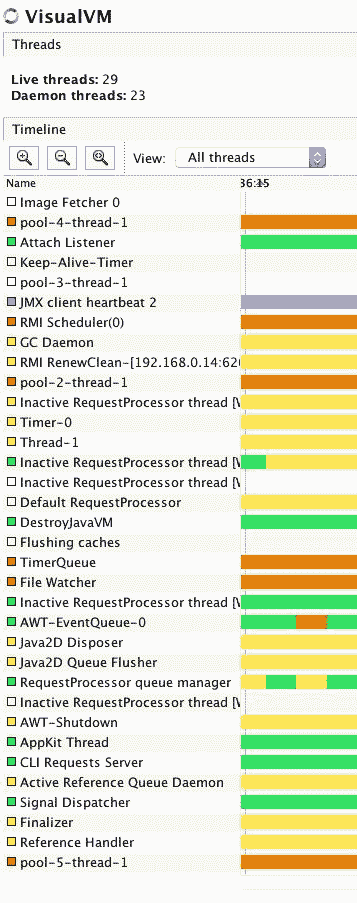

# 扩展游戏-并行运行，运行更快

在本章中，我们将扩展智囊团游戏。现在，它可以猜出隐藏的秘密，也可以隐藏钉子。测试代码甚至可以同时执行这两项任务。它可以自相矛盾，只给我们带来编程的乐趣。它不能做的是利用我们今天笔记本电脑和服务器中的所有处理器。该代码同步运行，只使用一个处理器内核。

我们将修改扩展猜测算法的代码，将猜测分割成子任务，并并行执行代码。在此期间，我们将了解 Java 并发编程。这将是一个巨大的话题，在黑暗中隐藏着许多微妙的角落和警告。我们将深入了解这些最重要的细节，并在您需要并行程序时为进一步学习奠定坚实的基础。

由于比赛的结果与以往一样，只是速度更快，我们必须评估什么是更快。为此，我们将利用 Java9 中引入的一个新特性：微基准标记工具。

在本章中，我们将介绍以下主题：

*   进程、线程和光纤的含义
*   Java 中的多线程
*   多线程编程的问题及避免方法
*   锁定、同步和阻塞队列
*   微基准

# 如何使智囊团平行

旧的算法是遍历所有变化，并尝试找到与表的当前状态匹配的猜测。假设当前检查的猜测是秘密，那么对于已经摆在桌面上的猜测，我们会得到与实际摆在桌面上的答案相同的答案吗？如果是的话，那么当前的猜测可能是秘密，而且它和其他任何猜测一样好。

更复杂的方法可以实现最小-最大算法（[https://en.wikipedia.org/wiki/Minimax](https://en.wikipedia.org/wiki/Minimax) ）。该算法不仅可以得到下一个可能的猜测，还可以查看所有可能的猜测，并选择最能缩短游戏结果的猜测。如果在最坏的情况下，有一个猜测之后可以再进行三次猜测，而另一个猜测的数字只有两次，那么 min max 将选择后者。对于感兴趣的读者来说，这是一个很好的练习。在有六种颜色和四列木桩的情况下，最小-最大算法在不超过 5 个步骤中解决游戏。我们实现的简单算法也分 5 步求解游戏。然而，我们没有朝这个方向走。

相反，我们希望有一个版本的游戏，利用一个以上的处理器。如何将该算法转换为并行算法？对此没有简单的答案。当您有一个算法时，您可以分析计算和算法的部分，并且可以尝试查找依赖项。如果有一个计算*B*需要数据，这是另一个计算*A*的结果，那么很明显*A*只有在*B*准备就绪时才能执行。如果算法的某些部分不依赖于其他部分的结果，那么它们可以并行执行。

例如，快速排序有两个主要任务：分区，然后对这两个部分进行排序。很明显，在我们开始对两个分区部分进行排序之前，分区必须完成。但是，这两部分的排序任务并不相互依赖，它们可以独立完成。您可以将它们分配给两个不同的处理器。一个人会很乐意对包含较小元素的部分进行排序；另一个将携带更重，更大的。

如果您将页面翻回到[第 3 章](03.html)*优化排序代码专业版*中，我们以非递归方式实现了快速排序，您可以看到我们将排序任务安排到一个堆栈中，然后通过`while`循环从堆栈中获取元素来执行排序。我们可以将任务传递给异步线程执行，然后返回到下一个等待的任务，而不是在循环的核心执行排序。我们只是不知道怎么做。然而这就是我们在这一章的原因。

处理器、线程和进程都是复杂而抽象的东西，它们很难想象。不同的程序员有不同的技术来想象并行处理和算法。我可以告诉你我是怎么做的，但这并不能保证这对你有用。其他人可能有不同的想法。事实上，我刚刚意识到，在我写这篇文章的时候，我从来没有告诉过任何人。这可能看起来很幼稚，但不管怎么说，事情是这样的。

当我想象算法时，我想象人。一个处理器就是一个人。这帮助我克服了一个可怕的事实，即处理器可以在一秒钟内进行数十亿次计算。我真的想象一个穿着棕色西装的官僚在做计算。当我为一个并行算法创建代码时，我想象他们中的许多人在桌子后面工作。他们独自工作，不说话。重要的是他们不要互相交谈。他们非常正式。当需要交换信息时，他们会拿着一张写有东西的纸站起来，然后把它带给对方。有时，他们的工作需要一张纸。然后他们站起来，走到放纸的地方，拿着它，把它带回他们的办公桌，继续工作。当他们准备好后，他们回去把报纸拿回来。如果他们需要的时候报纸不在那里，他们就会排队等待，直到有人把报纸带来。

这对智囊团有什么帮助？

我想象一个负责猜测的老板。办公室墙上有一张桌子，上面有以前的猜测和每行的结果。老板懒得做出新的猜测，所以他把这项任务交给了下属。当下属提出猜测时，老板会检查猜测是否有效。他不信任下属，如果猜测是好的，他会将其作为官方猜测，并将其与结果一起放在桌面上。

下属把猜测写在小便条上，然后把它们放在老板桌子上的盒子里。老板不时地看着盒子，如果有便条，老板就会拿走。如果盒子已经满了，而一个下属想把一张纸放在那里，那么他会停下来等待，直到老板拿出至少一张纸条，这样盒子里就有地方放一张新纸条。如果下属排队将猜测放入框中，他们都会等待时机。

下属之间要协调；否则，他们只会做出同样的猜测。他们每个人都应该有一段时间的猜测。例如，如果我们用数字表示颜色，第一个应该检查从 1234 到 2134 的猜测，第二个应该检查从 2134 到 3124 的猜测，依此类推。

这个结构能用吗？常识说它会的。然而，在这种情况下，官僚是隐喻，隐喻并不准确。官僚是人，即使他们看起来不像线程或处理器。他们有时行为异常，做正常人不常做的事情。然而，如果这个比喻能帮助我们想象并行算法是如何工作的，我们仍然可以使用它。

我们可以想象，老板去度假，却不碰桌上堆积如山的纸张。我们可以想象，一些工人比其他工人产生的结果快得多。由于这只是一种想象，加速比可以达到 1000 倍（想想延时视频）。想象这些情况可能有助于我们发现很少发生但可能导致问题的特殊行为。由于线程并行工作，许多时候细微的差异可能会极大地影响一般行为。

在一些早期版本中，当我编写并行策划算法时，官僚们开始工作，在老板把任何猜测摆上桌面之前，在老板的盒子里装满了猜测。由于没有任何猜测，官僚们只是发现他们的时间间隔中所有可能的变化都可能是一个很好的猜测。老板在平行助手的帮助下一无所获；他们必须从所有可能的猜测中选择正确的猜测，而猜测者只是无所事事。

还有一次，官员们正在对照表格核对猜测，而老板则在猜测一个事先创建的猜测。一些官员说，如果有人在换桌子，就不可能对照桌子核对猜测。更准确地说，在一个线程中执行的代码在修改表的`List`时抛出`ConcurrentModificationException`。

还有一次，我试图避免官僚们太快的工作，我限制了盒子的大小，他们可以把包含猜测的文件放在盒子里。当老板最终发现了秘密，游戏结束后，老板告诉官僚们他们可以回家了。老板写了一张小纸条，上面写着：你可以回家，把它放在官僚们的桌子上。官僚们做了什么？一直在等待盒子有空间放纸！（直到进程被终止。这在 Mac OS 和 Linux 上相当于从 Windows 上的任务管理器结束进程。）

这样的编码错误会发生，为了尽可能地避免，我们必须至少做两件事。首先，我们必须了解 Java 多线程是如何工作的，其次，要有一个尽可能干净的代码。第二，我们将进一步清理代码，然后我们将研究如何在 Java 中实现前面描述的并行算法，在 JVM 上运行，而不是使用官僚程序。

# 重构

当我们完成上一章时，我们以一种完美的面向对象的方式设计和编码了智囊团游戏的类，这种方式没有违反任何*OO*原则。是吗？荒谬的除了一些琐碎的例子外，没有任何代码可以让它看起来更好或更好。通常，当我们开发代码并完成编码时，它看起来很棒。它可以工作，所有测试都可以运行，文档也准备好了。从专业的角度来看，它确实是完美的。嗯，这已经足够好了。我们还没有测试的大问题是可维护性。修改代码的成本是多少？

这不是一个容易的问题，特别是因为它不是一个确定的问题。改成什么？对代码的修改是什么？当我们首先创建代码时，我们不知道这一点。如果修改是为了修复一个 bug，那么很明显我们事先并不知道这一点。如果我们知道，我们一开始就不会引入这个 bug。如果这是一项新功能，则有可能预见到该功能。然而，通常情况并非如此。当开发人员试图预测未来，以及程序在未来需要什么功能时，他们通常会失败。了解业务是客户的任务。在专业软件开发的情况下，所需的功能由业务驱动。毕竟，这就是专业的含义。

尽管我们不知道代码后面需要修改什么，但有些东西可能会给有经验的软件开发人员一些提示。通常，OO 代码比特别代码更容易维护，并且有一些代码的气味是可以识别的。例如，请查看以下代码行：

```java
while (guesser.guess() != Row.none) { 
    while (guesser.nextGuess() != Guesser.none) { 
        public void addNewGuess(Row row) { 
            Color[] guess = super.nextGuess();

```

我们可能感觉到某种奇怪的气味。（当我们在[第 4 章](04.html)*主脑-创建游戏*中完成时，`guess`方法的返回值与`Row.none`进行比较，后者是一个`Row`。然后比较`nextGuess`和`Guesser.none`的返回值，应该是`Guesser`。当我们对某事添加新的猜测时，我们实际上添加了一个`Row`。最后，我们可以意识到`nextGuess`返回的猜测不是一个拥有自己声明类的对象。A`guess`只是一组颜色。

我们是否应该引入另一层抽象来创建`Guess`类？它会使代码更易于维护吗？还是只会让代码变得更复杂？通常情况下，代码行越少，出现 bug 的可能性就越小。然而，有时，缺乏抽象会使代码变得复杂和混乱。在这种情况下是什么情况？一般来说，我们如何决定？

您的经验越多，通过查看代码和敏锐地了解您想要进行的修改，您就越容易判断。很多时候，您不会费心让代码变得更抽象，而很多时候，您会毫不犹豫地创建新类。当有疑问时，一定要创建新类，看看会有什么结果。重要的是不要破坏已经存在的功能。只有在有足够的单元测试的情况下才能这样做。

当您想引入一些新功能或修复一个 bug，但代码不合适时，您必须首先修改它。当您修改代码以使功能不发生更改时，该过程被命名为**重构**。您可以在有限的时间内更改代码的一小部分，然后构建它。如果它编译并运行所有单元测试，那么您可以继续。提示是要经常运行构建。这就像在现有道路附近修建一条新道路。每隔几英里，你就会遇到老路线。如果不这样做，你最终会在沙漠中的某个地方走到一个完全错误的方向，你所能做的就是回到你原来的重构代码的起点。努力白费了。

建议我们频繁运行构建的不仅仅是安全性，还有时间限制。重构并不能直接带来收入。该计划的功能与收入直接相关。没有人会为无限的重构工作付钱给我们。重构必须停止一段时间，而这通常不是没有任何东西需要重构的时候。代码永远不会完美，但当它足够好时，您可能会停止。而且，很多时候，程序员永远不会对代码的质量感到满意，当他们被某些外部因素（通常称为项目经理）阻止时，应该编译代码并运行测试，以便在实际代码基础上执行新功能和错误修复。

重构是一个巨大的主题，在这样的活动中可以遵循许多技术。它是如此复杂，以至于有一整本马丁·福勒（Martin Fowler）（[http://martinfowler.com/books/refactoring.html](http://martinfowler.com/books/refactoring.html) ）。

在我们的例子中，我们希望对代码进行的修改是实现一个并行算法。我们首先要修改的是`ColorManager`。当我们想在终端上打印猜测和行时，我们必须实现一些糟糕的技巧。为什么没有可以打印的颜色实现？我们可以有一个扩展原始`Color`类的类，并有一个返回表示该颜色的内容的方法。你有那个方法的候选名称吗？这是`toString`方法。它在`Object`类中实现，任何类都可以自由重写它。将对象连接到字符串时，自动类型转换将调用此方法将对象转换为`String`。顺便说一下，使用`""+object`而不是`object.toString()`来避免`null`指针异常是一个老把戏。不用说，我们不使用诡计。当调试器想要显示某个对象的值时，IDEs 也会调用`toString`方法，因此通常建议在没有其他原因的情况下实现`toString`，以便于开发。如果我们有一个实现了`toString`的`Color`类，那么`PrettyPrintRow`类就变得相当简单，技巧更少：

```java
package packt.java9.by.example.mastermind; 

 public class PrettyPrintRow { 

     public static String pprint(Row row) { 
         String string = ""; 
         PrintableRow pRow = new PrintableRow(row); 
         for (int i = 0; i < pRow.nrOfColumns(); i++) { 
             string += pRow.pos(i); 
         } 
         string += " "; 
         string += pRow.full(); 
         string += "/"; 
         string += pRow.partial(); 
         return string; 
     } 
 }

```

我们从 printing 类中删除了这个问题，但是您可能会认为这个问题仍然存在，您是对的。很多时候，当类设计中出现问题时，解决方法是将问题从一个类转移到另一个类。如果这仍然是一个问题，那么您可能会越来越多地拆分设计，在最后阶段，您将意识到您所拥有的是一个问题而不是一个问题。

实现`LetteredColor`类也很简单：

```java
package packt.java9.by.example.mastermind.lettered; 

 import packt.java9.by.example.mastermind.Color; 

 public class LetteredColor extends Color { 

     private final String letter; 
     public LetteredColor(String letter){ 
         this.letter = letter; 
     } 

     @Override 
     public String toString(){ 
         return letter; 
     } 
 }

```

这一问题再次被推到了前面。但事实上，这不是问题。这是一个面向对象的设计。印刷部不负责为颜色指定`String`来表示颜色。颜色实现本身也不对此负责。必须在生成颜色的位置执行赋值，然后必须将`String`传递给`LetteredColor`类的构造函数。`color`实例是在`ColorManager`中创建的，所以我们必须在`ColorManager`类中实现。还是不？`ColorManager`做什么？它创造了颜色和。。。

当您对列出功能的类进行解释或描述时，您可能会立即看到**单一责任原则**被忽略。`ColorManager`应管理颜色。管理就是提供一种方法，以确定的顺序获得颜色，并在我们知道一种颜色时获得第一种和第二种颜色。我们应该在一个单独的类中实现另一个职责，即创建颜色。

具有创建另一个类实例的唯一功能的类称为 factory。这与使用`new`操作符几乎相同，但与`new`不同，工厂的使用更加灵活。我们将立即看到这一点。`ColorFactory`接口包含一个方法，如下所示：

```java
package packt.java9.by.example.mastermind; 

 public interface ColorFactory { 
     Color newColor(); 
 }

```

仅定义一个方法的接口称为函数接口，因为它们的实现可以作为 lambda 表达式提供，在您将使用作为实现函数接口的类实例的对象的位置。`SimpleColorFactory`实现创建以下`Color`对象：

```java
package packt.java9.by.example.mastermind; 

 public class SimpleColorFactory implements ColorFactory { 
     @Override 
     public Color newColor() { 
         return new Color(); 
     } 
 }

```

这非常类似于我们如何创建一个接口，然后创建一个实现，而不仅仅是在`ColorManager`中的代码中编写`new Color()`。`LetteredColorFactory`更有趣一点：

```java
package packt.java9.by.example.mastermind.lettered; 

 import packt.java9.by.example.mastermind.Color; 
 import packt.java9.by.example.mastermind.ColorFactory; 

 public class LetteredColorFactory implements ColorFactory { 

     private final String letters = "0123456789ABCDEFGHIJKLMNOPQRSTVWXYZabcdefghijklmnopqrstvwxzy"; 
     private int counter = 0; 

     @Override 
     public Color newColor() { 
         Color color = new LetteredColor(letters.substring(counter, counter + 1)); 
         counter++; 
         return color; 
     } 
 }

```

现在，我们有了在创建`Color`对象时将`String`分配给它们的功能。非常重要的是，跟踪已创建颜色的`counter`变量不是`static`。上一章中的类似变量是`static`，这意味着随着`ColorManager`创造了太多颜色，它可能会用完字符。事实上，在单元测试执行期间，每次测试都创建了`ColorManager`和新的`Color`实例，并且打印代码试图将新字母分配给新颜色时，这种情况确实发生在我身上。这些测试在同一个类加载器下的同一个 JVM 中运行，不幸的`static`变量不知道新测试何时可以从零开始计数。缺点是，必须有人在某处实例化工厂，而不是`ColorManager`。`ColorManager`已经有责任，不是创建一个颜色工厂。`ColorManager`必须在其构造函数中获得`ColorFactory`：

```java
package packt.java9.by.example.mastermind; 

 import java.util.HashMap; 
 import java.util.List; 
 import java.util.Map; 

 public class ColorManager { 
     final protected int nrColors; 
     final protected Map<Color, Color> successor = new HashMap<>(); 
     private Color first; 
     private final ColorFactory factory; 

     public ColorManager(int nrColors, ColorFactory factory) { 
         this.nrColors = nrColors; 
         this.factory = factory; 
         createOrdering(); 
     } 

     private Color[] createColors() { 
         Color[] colors = new Color[nrColors]; 
         for (int i = 0; i < colors.length; i++) { 
             colors[i] = factory.newColor(); 
         } 
         return colors; 
     } 

     private void createOrdering() { 
         Color[] colors = createColors(); 
         first = colors[0]; 
         for (int i = 0; i < nrColors - 1; i++) { 
             successor.put(colors[i], colors[i + 1]); 
         } 
     } 

     public Color firstColor() { 
         return first; 
     } 

     public boolean thereIsNextColor(Color color) { 
         return successor.containsKey(color); 
     } 

     public Color nextColor(Color color) { 
         return successor.get(color); 
     } 

     public int getNrColors() { 
         return nrColors; 
     } 
 }

```

您可能还注意到，为了遵循单一责任原则，我忍不住将`createColors`方法重构为两种方法。

现在，创建`ColorManager`的代码必须创建一个工厂并将其传递给构造函数。例如，单元测试的`ColorManagerTest`类将包含以下方法：

```java
@Test
 public void thereIsAFirstColor() { 
     ColorManager manager  
          = new ColorManager(NR_COLORS, Color::new); 
     Assert.assertNotNull(manager.firstColor()); 
 }

```

这是实现由功能接口定义的工厂的最简单方法。只需命名类并通过创建方法引用引用引用`new`操作符，就像它是一个方法一样。

接下来我们要重构的是`Guess`类，实际上，到目前为止我们还没有这个类。`Guess`类包含猜测的标记，可以计算完整（颜色和位置）和部分（颜色存在但位置错误）匹配的数量，还可以计算该猜测之后的下一个`Guess`。到目前为止，这个功能是在`Guesser`类中实现的，但这并不是我们在检查表上已经做出的猜测时如何选择猜测的功能。如果我们遵循为颜色设置的模式，我们可以在名为`GuessManager`的单独类中实现此功能，但就目前而言，不需要它。同样，这不是黑白的。

需要注意的是`Guess`对象只能一次生成。如果它在桌子上，球员不允许改变它。如果我们有一个`Guess`还没有放在桌子上，它仍然只是一个`Guess`，通过钉子的颜色和顺序来识别。`Guess`对象在创建后不会更改。这些对象在多线程程序中易于使用，称为不可变对象：

```java
package packt.java9.by.example.mastermind; 

 import java.util.Arrays; 
 import java.util.HashSet; 
 import java.util.Set; 

 public class Guess { 
     final static public Guess none = new Guess(new Color[0]); 
     final private Color[] colors; 
     private boolean uniquenessWasNotCalculated = true; 
     private boolean unique; 

     public Guess(Color[] colors) { 
         this.colors = Arrays.copyOf(colors, colors.length); 
     }

```

构造函数正在创建传递的颜色数组的副本。因为`Guess`是不可变的，这一点非常重要。如果我们只保留原始数组，`Guess`类之外的任何代码都可能改变数组的元素，本质上改变了`Guess`不应该改变的内容：

```java
public Color getColor(int i) { 
         return colors[i]; 
     } 

     public int nrOfColumns() { 
         return colors.length; 
     } 

     /** 
      * Calculate the next guess and return a new Guess object. 
      * The guesses are ordered in the order of the colors as 
      * specified by the color manager. 
      * 
      * @param manager that specifies the order of the colors 
      *                can return the next color after one color. 
      * @return the guess that comes after this guess. 
      */ 
     public Guess nextGuess(ColorManager manager) { 
         final Color[] colors = Arrays.copyOf( 
                                     this.colors, nrOfColumns()); 

         int i = 0; 
         boolean guessFound = false; 
         while (i < colors.length && !guessFound) { 
             if (manager.thereIsNextColor(getColor(i))) { 
                 colors[i] = manager.nextColor(colors[i]); 
                 guessFound = true; 
             } else { 
                 colors[i] = manager.firstColor(); 
                 i++; 
             } 
         } 
         if (guessFound) { 
             return new Guess(colors); 
         } else { 
             return Guess.none; 
         } 
     }

```

在这种方法中，我们从实际对象中包含的颜色数组开始计算下一个`Guess`。我们需要一个修改过的工作数组，所以我们将复制原始数组。这一次，最后一个新对象可以使用我们在计算过程中使用的数组，因此需要一个不创建副本的单独构造函数。这是可能的额外代码，但我们应该考虑，只有当我们看到这是在代码中的瓶颈，我们不满意的实际性能。

下一种方法只是检查通过的`Guess`是否具有与实际颜色相同的颜色数。这只是计算匹配的下两种方法使用的安全检查：

```java
private void assertCompatibility(Guess guess) { 
         if (nrOfColumns() != guess.nrOfColumns()) { 
             throw new IllegalArgumentException("Cannot compare different length guesses"); 
         } 
     } 

     /** 
      * Count the number of colors that are present on the guess 
      * but not on the pos where they are in the other guess. 
      * If the same color is on multiple pos it is counted 
      * for each pos once. For example the secret is 
      * <pre> 
      *     RGRB 
      * </pre> 
      * and the guess is 
      * <pre> 
      *     YRPR 
      * </pre> 
      * then this method will return 2\. 
      * 
      * @param guess is the actual guess that we evaluate 
      * @return the number of good colors not in pos 
      */ 
     public int nrOfPartialMatches(Guess guess) { 
         assertCompatibility(guess); 
         int count = 0; 
         for (int i = 0; i < nrOfColumns(); i++) { 
             for (int j = 0; j < nrOfColumns(); j++) { 
                 if (i != j && 
                         guess.getColor(i) == this.getColor(j)) { 
                     count++; 
                 } 
             } 
         } 
         return count; 
     } 

     /** 
      * Count the number of colors that are correct and are in pos. 
      * 
      * @param guess is the actual guess that we evaluate 
      * @return the number of colors that match in pos 
      */ 
     public int nrOfFullMatches(Guess guess) { 
         assertCompatibility(guess); 
         int count = 0; 
         for (int i = 0; i < nrOfColumns(); i++) { 
             if (guess.getColor(i) == this.getColor(i)) { 
                 count++; 
             } 
         } 
         return count; 
     }

```

`isUnique`方法检查`Guess`中是否有超过一次的颜色。由于`Guess`是不可变的，所以`Guess`在某一时间是唯一的，而在另一时间不是唯一的。每当对特定对象调用此方法时，它都应返回相同的结果。因此，可以缓存结果。此方法执行此操作，将返回值保存到实例变量。

您可能会说这是过早的优化。是的。我决定这么做有一个原因。这是演示，在此基础上，您可以尝试修改`nextGuess`方法，也可以这样做：

```java
     /** 
      * @return true if the guess does not 
      *         contain any color more than once 
      */ 
     public boolean isUnique() { 
         if (uniquenessWasNotCalculated) { 
             final Set<Color> alreadyPresent = new HashSet<>(); 
             unique = true; 
             for (Color color : colors) { 
                 if (alreadyPresent.contains(color)) { 
                     unique = false; 
                     break; 
                 } 
                 alreadyPresent.add(color); 
             } 
             uniquenessWasNotCalculated = false; 
         } 
         return unique; 
     }

```

对于相同参数返回相同结果的方法称为幂等函数。如果该方法被多次调用并且计算使用了大量资源，那么缓存该方法的返回值可能非常重要。当方法有参数时，结果缓存并不简单。对象方法必须记住所有已计算参数的结果，并且该存储必须有效。如果查找存储的结果比计算结果需要更多的资源，那么使用缓存不仅会占用更多的内存，还会降低程序的速度。如果在对象的生存期内为多个参数调用该方法，则存储内存可能会变得太大。一些元素必须清除那些在将来不再需要的元素。然而，我们无法知道缓存的哪些元素是不需要的，所以我们只能猜测。

正如您所看到的，缓存可能会变得非常复杂，要专业地做到这一点，使用一些现成的缓存实现几乎总是更好的。我们在这里使用的缓存只是冰山一角。或者，它甚至只是阳光在它上面一瞥。

本课程的其余部分相当标准，我们已经详细讨论了一些内容——检查您的知识是了解`equals`、`hashCode`和`toString`方法是如何以这种方式实现的。我在调试期间实现了`toString`方法来帮助我，但在以下示例输出中也使用了该方法：

```java
     @Override 
     public boolean equals(Object other) { 
         if (this == other) return true; 
         if (other == null || !(other instanceof Guess)) 
                                               return false; 
         Guess guess = (Guess) other; 
         return Arrays.equals(colors, guess.colors); 
     } 

     @Override 
     public int hashCode() { 
         return Arrays.hashCode(colors); 
     } 

     @Override 
     public String toString() { 
         if (this == none) { 
             return "none"; 
         } else { 
             String s = ""; 
             for (int i = colors.length - 1; i >= 0; i--) { 
                 s += colors[i]; 
             } 
             return s; 
         } 
     } 
 }

```

这主要是我在开发并行算法时需要的修改。现在，代码是相当最新的，描述的重点是本章的主要主题：如何在 Java 中并行执行代码。

Java 中代码的并行执行是在线程中完成的。您可能知道 Java 运行时中有一个`Thread`对象，但如果不了解计算机中的线程是什么，它就毫无意义。在下面的小节中，我们将了解这些线程是什么，如何启动新线程，如何同步线程之间的数据交换，最后将所有这些放在一起并实现 Mastermind 并行猜测算法。

# 过程

当您启动计算机时，启动的程序是**操作系统**（**操作系统**。操作系统控制机器硬件和可以在机器上运行的程序。启动程序时，操作系统将创建一个新进程。这意味着操作系统在一个表（数组）中分配一个新条目，在该表（数组）中它管理进程，并填写它知道的和需要知道的有关进程的参数。例如，它注册允许进程使用的内存段、进程的 ID 以及哪个用户从哪个其他进程启动。你不能凭空开始一个过程。当您双击一个 EXE 文件时，实际上是告诉文件资源管理器（作为进程运行的程序）作为单独的进程启动 EXE 文件。浏览器通过一些 API 调用系统，并恳请操作系统这样做。操作系统将把资源管理器进程注册为新进程的父进程。操作系统实际上并不启动进程，而是创建启动进程所需的所有数据，当有一些空闲的 CPU 资源时，进程启动，然后很快就会暂停。您不会注意到它，因为操作系统会一次又一次地启动它，并且总是反复暂停进程。它需要这样做，以便为所有进程提供运行可能性。这样，我们可以体验到所有进程同时运行。实际上，进程不会在单个处理器上同时运行，但它们通常会有时间段来运行。

如果机器中有多个 CPU，那么进程实际上可以同时运行，CPU 的数量是多少就多少。随着集成技术的发展，台式计算机的 CPU 包含多个核心，其功能几乎与单独的 CPU 类似。在我的机器上，我有四个内核，每个内核能够同时执行两个线程；所以，我的 Mac 电脑几乎就像一台 8 CPU 的机器。

进程有单独的存储器。允许它们使用内存的一部分，如果进程试图使用不属于它的另一部分，处理器将停止这样做。操作系统将终止进程。

试想一下，最初 UNIX 的开发人员可能会多么沮丧，他们将程序命名为停止进程以杀死进程，而停止进程称为杀死进程。就像中世纪一样，他们砍掉了一个重罪犯的手。你触碰了记忆的错误部分，就被杀死了。我不想成为一个过程。

除了将进程彼此分离外，操作系统对内存的处理非常复杂。当内存不足时，操作系统会将部分内存写入磁盘，释放内存，并在需要时重新加载该部分内存。这是一个非常复杂的、低级别实现的、高度优化的算法，由操作系统负责。

# 线程

当我说操作系统在时间段内执行进程时，我并不是绝对准确的。每个进程都有一个或多个线程，并且执行线程。线程是由外部调度程序管理的最小执行。较旧的操作系统没有线程的概念，正在执行进程。事实上，第一个线程实现只是共享内存的进程的复制。

你可能会听到这个术语，轻量级进程，它意味着线程。

重要的是线程没有自己的内存。他们使用进程的内存。换句话说，在同一进程中运行的线程对同一内存段具有无差别的访问。利用机器中的多核实现并行算法是一种非常强大的可能性，但同时也可能导致错误。



假设两个线程递增相同的长变量。增量首先计算低 32 位的增量值，如果有溢出位，则计算高 32 位的增量值。这是操作系统可能会中断的两个或多个步骤。可能会发生这样的情况：一个线程增加较低的 32 位，记住对较高的 32 位有一些事情要做，开始计算，但在结果被中断之前没有时间存储结果。然后，另一个线程增加低 32 位，高 32 位，然后第一个线程只保存它计算的高 32 位。结果变得乱七八糟。在较旧的 32 位 Java 实现上，演示这种效果非常容易。在 64 位 Java 实现中，所有 64 位都加载到寄存器中，并在一个步骤中保存回内存，因此演示多线程问题并不容易，但这并不意味着没有多线程问题。

当一个线程暂停而另一个线程启动时，操作系统必须执行上下文切换。这意味着，除其他事项外，必须保存 CPU 寄存器，然后将其设置为其他线程的值。上下文开关总是保存线程的状态，并加载之前保存的要启动的线程状态。这是在 CPU 寄存器级别。这种上下文切换非常耗时；因此，执行的上下文切换越多，用于线程管理的 CPU 资源就越多，而不是让它们运行。另一方面，如果没有足够的开关，一些线程可能没有足够的时间执行，程序将挂起。

# 纤维

Java 没有光纤，但由于有些库支持光纤处理，因此值得一提。纤维是比线更细的单位。在线程中执行的程序代码可能决定放弃执行，并告诉光纤管理器只执行其他光纤。重点是什么？为什么它比使用另一个线程更好？原因是，通过这种方式，光纤可以避免部分上下文切换。上下文切换无法完全避免，因为开始执行它的代码的不同部分可能以完全不同的方式使用 CPU 寄存器。因为它是同一个线程，所以上下文切换不是操作系统的任务，而是应用程序的任务。

操作系统不知道是否使用了寄存器的值。寄存器中有一些位，没有人能够仅通过查看处理器状态来判断这些位是否与当前代码执行相关，或者恰好以这种方式存在。编译器生成的程序确实知道哪些寄存器很重要，哪些寄存器可以忽略。该信息在代码中的位置不同，但当需要交换机时，光纤会将该点需要切换的信息传递给进行切换的代码。

编译器计算此信息，但 Java 在当前版本中不支持光纤。在 Java 中实现光纤的工具会在编译阶段之后分析和修改类的字节码。

Golang 的 Goroutine 是光纤，这就是为什么您可以轻松地在 Go 中启动数千个 Goroutine，但您最好将 Java 中的线程数量限制在较低的数量。它们不是相同的东西。

随着术语“轻量级过程”逐渐淡出，越来越少的光纤使用，很多时候被称为轻量级线程。

# java.lang.Thread

由于 Java 中的一切（好的，几乎）都是对象，如果我们想启动一个新线程，我们需要一个表示该线程的类。此类`java.lang.Thread`内置于 JDK 中。当您启动 Java 代码时，JVM 会自动创建几个`Thread`对象，并使用它们运行它所需的不同任务。如果您启动**VisualVM**，您可以选择任何 JVM 进程的线程选项卡，并查看 JVM 中的实际线程。例如，我启动的 VisualVM 有 29 个活动线程。其中一个是名为`main`的线程。这就是开始执行`main`方法的方法（惊喜！）。`main`线程启动了大多数其他线程。当我们想要编写多线程应用程序时，我们必须创建新的`Thread`对象并启动它们。最简单的方法是`new Thread()`，然后在线程上调用`start`方法。它将启动一个新线程，该线程将立即结束，因为我们没有给它任何操作。`Thread`类与 JDK 中的类一样，不执行我们的业务逻辑。以下是指定业务逻辑的两种方法：

*   创建实现`Runnable`接口的类
*   创建扩展`Thread`类并重写`run`方法的类

以下代码块是一个非常简单的演示程序：

```java
public class ThreadIntermingling { 
     static class MyThread extends Thread { 
         private final String name; 
         MyThread(String name){ 
             this.name = name; 
         } 
         @Override 
         public void run(){ 
             for(int i = 1 ; i < 1000 ; i ++ ){ 
                 System.out.print(name + " " + i+ ", "); 
             } 
         } 
     } 
     public static void main(String[] args){ 
         Thread t1 = new MyThread("t1"); 
         Thread t2 = new MyThread("t2"); 
         t1.start(); 
         t2.start(); 
         System.out.print("started "); 

     } 
 }

```

前面的代码创建两个线程，并逐个启动它们。调用 start 方法时，它调度要执行的线程对象，然后返回。因此，当调用线程继续执行时，新线程将很快开始异步执行。在以下示例中，两个线程和`main`线程并行运行，并创建如下输出：

```java
started t2 1, t2 2, t2 3, t2 4, t2 5, t2 6, t2 7, t2 8, t1 1, t2 9, t2 10, t2 11, t2 12,...

```

实际输出随运行而变化。并没有明确的执行顺序或线程如何访问单屏幕输出。甚至不能保证在每次执行中，在任何线程消息之前都会打印消息`started`。

为了更好地理解这一点，我们必须查看线程的状态图。Java 线程可以处于以下状态之一：

*   `NEW`
*   `RUNNABLE`
*   `BLOCKED`
*   `WAITING`
*   `TIMED_WAITING`
*   `TERMINATED`

这些状态在`enumThread.State`中定义。创建新线程对象时，它处于`NEW`状态。此时，线程没有什么特别之处，它只是一个对象，但操作系统执行调度并不知道它。在某种意义上，它只是 JVM 分配的一块内存。

当调用 start 方法时，有关线程的信息会传递给操作系统，操作系统会调度线程，以便在有适当的时间段时由它执行。这样做是一种足智多谋的行为，这就是为什么我们不创建，尤其是不在需要时才启动新的线程对象的原因。我们将保留现有线程一段时间，而不是创建新线程，即使它们目前不需要，如果有合适的线程，我们将重用现有线程。

操作系统中的线程也可以处于运行状态，也可以在操作系统调度并执行时处于可运行状态。javajdkapi 没有很好的理由区分这两者。那是没有用的。当一个线程处于`RUNNABLE`状态，询问它是否实际从线程本身运行时，它将得到一个明显的答案：如果代码刚刚从`Thread`类中实现的`getState`方法返回，那么它将运行。如果它没有运行，它一开始就不会从调用中返回。如果从另一个线程调用了`getState`方法，那么当该方法返回时，关于另一个线程的结果将毫无意义。在此之前，操作系统可能已多次停止或启动查询线程。

当线程中执行的代码试图访问某些当前不可用的资源时，线程处于`BLOCKED`状态。为了避免不断轮询资源，操作系统提供了有效的通知机制，以便线程在需要的资源可用时返回到`RUNNABLE`状态。

线程在等待其他线程或锁时处于`WAIT`或`TIMED_WAITING`状态。`TIMED_WAITING`等待开始调用具有超时的方法版本时的状态。

最后，当线程完成其执行时达到`TERMINATED`状态。如果在上一个示例的末尾附加以下行，那么您将得到一个`TERMINATED`打印输出，并且屏幕上会出现一个异常，抱怨线程状态非法，这是因为您无法启动已经终止的线程：

```java
System.out.println(); 
System.out.println(t1.getState()); 
System.out.println(); 
t1.start();

```

我们可以创建一个实现`Runnable`的类，而不是扩展`Thread`类来定义异步执行的内容。这样做更符合 OO 编程方法。我们在类中实现的东西不是线程的功能。这更像是一件可以执行的事情。这是一个可以运行的东西。

如果此执行在不同的线程中是异步的，或者是在调用 run 方法的同一线程中执行的，则必须分开处理。如果这样做，我们可以将类作为构造函数参数传递给`Thread`对象。对`Thread`对象调用`start`将启动我们传递的对象的 run 方法。这不是收益。好处是我们还可以将`Runnable`对象传递给`Executor`（可怕的名字，呼呼！）。`Executor`是一个接口，实现以高效的方式执行`Thread`中的`Runnable`（以及`Callable`（见下文）对象。执行者通常有一个准备好的、处于`BLOCKED`状态的`Thread`对象池。当`Executor`有一个新任务要执行时，它将其交给`Thread`对象之一，并释放阻塞线程的锁。`Thread`进入`RUNNABLE`状态，执行`Runnable`，再次被阻塞。它不会终止，因此可以在以后重复使用以执行另一个`Runnable`。这样，`Executor`就避免了将线程注册到操作系统中这一耗费资源的过程。

专业应用程序代码从不创建新的`Thread`。应用程序代码使用一些框架来处理代码的并行执行，或者使用一些`ExecutorService`提供的`Executor`来启动`Runnable`或`Callable`对象。

# 陷阱

我们已经讨论了在开发并行程序时可能面临的许多问题。在本节中，我们将用用于解决问题的常用术语对它们进行总结。术语不仅有趣，而且在与同事交谈时也很重要，以便于彼此理解。

# 僵局

死锁是最臭名昭著的并行编程陷阱，出于这个原因，我们将从这个开始。为了描述这种情况，我们将采用官僚的比喻。

这位官僚必须在手中的一张纸上盖章。要做到这一点，他需要邮票，他还需要印泥。首先，他走到放邮票的抽屉，把它拿走。然后，他走向印泥所在的抽屉，拿起印泥。他在邮票上涂墨水，推纸。然后，他把邮票放回原处，然后把印泥放回原处。一切都很好，我们在云端 9。

如果另一个官僚先拿印泥，然后再拿邮票，会发生什么？他们可能很快就会变成一个拿着邮票等待印泥的官僚，另一个拿着印泥等待邮票的官僚。而且，他们可能只是呆在那里，永远冻结，然后越来越多的人开始等待这些锁，文件永远不会盖章，整个系统陷入无政府状态。

为了避免这种情况，必须对锁进行订购，并且应始终按照订购顺序获取锁。在前面的示例中，首先获取印泥，然后获取戳记的简单约定解决了该问题。无论谁获得了这枚邮票，都可以确定印泥是免费的，或者很快就会免费的。

# 比赛条件

我们讨论竞态条件，根据不同并行运行线程的速度和 CPU 访问，计算结果可能不同。让我们看看下面的两条代码行：

```java
    void method1(){ 
1       a = b; 
2       b = a+1; 
        } 
    void method2(){ 
3       c = b; 
4       b = c+2; 
        }

```

如果执行开始时的`b`值为 0，并且两个不同的线程执行这两个方法，则行的顺序可以是 1234、1324、1342、3412、3142 或 3142。四行的任何执行顺序都可以确保 1 在 2 之前运行，3 在 4 之前运行，但没有其他限制。结果，`b`的值在执行段结束时为 1 或 2，这可能不好，这是我们编码时想要的。

请注意，并行策划游戏的实现也有类似的内容。实际猜测在很大程度上取决于不同线程的速度，但从最终结果的角度来看，这是不相关的。在不同的运行中，我们可能会有不同的猜测，这样算法就不是确定性的，但我们可以保证找到最终的解决方案。

# 过度使用的锁

在许多情况下，线程可能正在等待一个锁，该锁保护资源不被并发访问。如果资源不能被多个线程同时使用，并且有更多的线程无法提供服务，那么这些线程将处于饥饿状态。但是，在许多情况下，资源的组织方式可以使线程能够访问资源提供的某些服务，并且锁定结构的限制性更小。在这种情况下，锁被过度使用，可以在不为线程分配更多资源的情况下修复这种情况。可以使用多个锁来控制对资源不同功能的访问。

# 饥饿的

饥饿是指当多个线程正在等待一个资源试图获取锁，而一些线程只有在非常长的时间后才能访问该锁，或者从未访问过该锁。当锁被释放并且有线程在等待它时，其中一个线程可以获得锁。如果线程等待的时间足够长，通常无法保证它会获得锁。这样的机制需要对线程进行密集的管理，在等待队列中对线程进行排序。由于锁定应该是一种低延迟和高性能的操作，所以即使是几个 CPU 时钟周期也很重要；因此，默认情况下，锁不提供这种类型的公平访问。如果锁有一个线程等待，那么在线程调度中不浪费时间和公平性是一个很好的方法。锁的主要目标不是调度等待的线程，而是防止并行访问资源。

就像在商店里一样。如果有人在收银台，你就等着。它是隐式内置的锁。如果人们不排队等候收银台，只要几乎总是有一台免费的，这就不是问题。然而，当出纳员前面有几个队列时，如果没有队列和等待顺序，那么对于访问出纳员速度较慢的人来说，肯定会导致很长的等待顺序。通常，公平性和创建等待线程（客户）队列的解决方案不是一个好的解决方案。好的解决办法是消除导致排队等候的情况。你可以雇佣更多的收银员，或者你可以做一些完全不同的事情，使峰值负荷更小。在商店里，你可以给在非高峰时间开车来的顾客打折。在编程中，通常可以应用几种技术，这取决于我们编写代码的实际业务，而锁的公平调度通常是一种解决方法。

# 遗嘱执行人服务

`ExecutorService`是 JDK 中的一个接口。接口的实现可以异步执行`Runnable`或`Callable`类。接口仅定义实现的 API，不要求调用是异步的，但实际上，这是实现此类服务的要点。以同步方式调用`Runnable`接口的`run`方法只是调用一个方法。我们不需要专门的课程。

`Runnable`接口定义了一个`run`方法。它没有参数，不返回任何值，也不引发任何异常。`Callable`接口是参数化的，它定义的唯一方法`call`没有参数，但返回泛型值，也可能抛出`Exception`。在我们的代码中，如果我们只想运行一些东西，我们将实现`Runnable`，如果我们想返回一些东西，我们将实现`Callable`。这两个接口都是功能接口，因此，它们是使用 lambda 实现的很好的候选者。

要获得一个`ExecutorService`实现的实例，我们可以使用实用程序类`Executors`。很多时候，当 JDK 中有一个`XYZ`接口时，可以有一个`XYZs`（复数）实用程序类，为接口的实现提供工厂。如果我们想多次启动`t1`任务，我们可以在不创建新`Thread`的情况下启动。我们应使用以下 executor 服务：

```java
public class ThreadIntermingling { 
      static class MyThread implements Runnable { 
          private final String name; 

          MyThread(String name) { 
              this.name = name; 
          } 

          @Override 
          public void run() { 
              for (int i = 1; i < 1000; i++) { 
                  System.out.print(name + " " + i + ", "); 
              } 
          } 
      } 
      public static void main(String[] args) 
                throws InterruptedException, ExecutionException { 
          ExecutorService es = Executors.newFixedThreadPool(2); 
          Runnable t1 = new MyThread("t1"); 
          Runnable t2 = new MyThread("t2"); 
          Future<?> f1 = es.submit(t1); 
          Future<?> f2 = es.submit(t2); 
          System.out.print("started "); 
          f1.get(); 
          f2.get(); 
          System.out.println(); 
          f1 = es.submit(t1); 
          es.shutdown(); 
      } 
  }

```

这一次，我们没有得到任何例外。相反，`t1`任务第二次运行。在这个例子中，我们使用一个固定大小的线程池，它有两个`Thread`线程。因为我们只想同时启动两个线程，这就足够了。有些实现动态地增加和缩小池的大小。当我们想要限制线程的数量或者从其他信息源知道 a-priory 线程的数量时，应该使用固定大小的池。在本例中，将池的大小更改为 1 并查看第二个任务在第一个任务完成之前不会启动是一个很好的实验。服务将不会有另一个用于`t2`的线程，并且必须等待池中唯一的`Thread`被释放。

当我们向服务提交任务时，即使任务当前无法执行，它也会返回。任务被放入队列中，一旦有足够的资源启动它们，任务就会开始执行。submit 方法返回一个`Future`对象，如前面的示例所示。

它就像一张服务票。你把车交给修理工，然后你就可以得到一张罚单。在汽车修好之前，你不需要呆在那里，但在任何时候，你都可以询问汽车是否准备好了。你只需要一张票。你也可以决定等到汽车准备好。`Future`对象也是这样的。你没有得到你需要的价值。它将异步计算。然而，有一个`Future`承诺它会在那里，而您访问所需对象的票证就是`Future`对象。

当您有一个`Future`对象时，您可以调用`isDone`方法来查看它是否准备就绪。您可以开始等待它调用`get`，有或没有超时。您也可以取消执行它的任务，但在这种情况下，结果可能会有问题。就像，在你的车的情况下，如果你决定取消任务，你可以把你的车和马达拆开。类似地，取消未做好准备的任务可能会导致资源丢失、打开和无法访问数据库连接（这对我来说是一段痛苦的记忆，即使 10 年后），或者只是一个乱七八糟的不可用对象。准备要取消或不取消的任务。

在前面的示例中，`Future`没有返回值，因为我们提交了一个`Runnable`对象而不是`Callable`对象。在这种情况下，不使用传递给`Future`的值。它通常是`null`，但这没有什么可依靠的。

许多开发人员，甚至我，在多年没有使用代码编写多线程 JavaAPI 之后，错过的最后一件也是最重要的事情是关闭`ExecutorService`。创建了`ExecutorService`并且它有`Thread`元素。当所有非守护进程线程停止时，JVM 停止。直到胖女人唱歌，一切才结束。

如果线程在启动前被设置为守护进程（调用`setDaemon(true)`），那么它就是守护进程线程。线程是自动启动的守护进程，启动线程是守护进程线程。当所有其他线程都完成并且 JVM 希望完成时，JVM 会停止守护进程线程。JVM 本身执行的一些线程是守护进程线程，但在应用程序中创建守护进程线程可能没有实际用途。

不关闭服务只会阻止 JVM 停止。`main`方法完成后，代码将挂起。为了告诉`ExecutorService`不需要它拥有的线程，我们必须`shutdown`服务。该呼叫只会启动关机并立即返回。在这种情况下，我们不想等待。JVM 无论如何都会这样做。如果我们需要等待，我们将不得不拨打`awaitTermination`。

# 叉子池

`ForkJoinPool`是一种特殊的`ExecutorService`，具有执行`ForkJoinTask`对象的方法。当我们想要执行的任务可以分解成许多小任务，然后当结果可用时进行聚合时，这些类非常方便。使用这个执行器，我们不需要关心线程池的大小和关闭执行器。线程池的大小根据给定机器上的处理器数量进行调整，以获得最佳性能。由于`ForkJoinPool`是专为短时间运行的任务设计的特殊`ExecutorService`，因此当没有更多的任务要运行时，它不希望有任何任务在那里或被需要。因此，它作为守护进程线程执行；当 JVM 关闭时，`ForkJoinPool`自动停止，女士不再唱歌。

要创建任务，程序员应该扩展`RecursiveTask`或`RecursiveAction`。第一种是在任务有返回值时使用，第二种是在没有返回计算值时使用。它们被称为递归的，因为很多时候，这些任务会分解问题，它们必须解决较小的问题，并通过 fork-join API 异步调用这些任务。

使用此 API 要解决的一个典型问题是快速排序。在[第 3 章](03.html)*优化排序代码专业*中，我们创建了两个版本的快速排序算法。一个使用递归调用，另一个不使用递归调用。我们还可以创建一个新的任务，它不是递归地调用自身，而是安排任务执行，可能由另一个处理器执行。调度是`ExecutorService`的`ForkJoinPool`执行任务。

您可以在[第 3 章](03.html)*优化分拣代码专业*中重新查看`Qsort.java`的代码。以下是使用`ForkJoinPool`的版本：

```java
public class FJQuickSort<E> { 
     final private Comparator<E> comparator; 
     final private Swapper swapper; 

     public FJQuickSort(Comparator<E> comparator, Swapper swapper){ 
         this.comparator = comparator; 
         this.swapper = swapper; 
     } 

     public void qsort(SortableCollection<E> sortable, 
                       int start, int end) { 
         ForkJoinPool pool = new ForkJoinPool(); 
         pool.invoke(new RASort(sortable,start,end)); 
     } 

     private class RASort extends RecursiveAction { 

         final SortableCollection<E> sortable; 
         final int start, end; 

         public RASort(SortableCollection<E> sortable, 
                       int start, int end) { 
             this.sortable = sortable; 
             this.start = start; 
             this.end = end; 
         } 

         public void compute() { 
             if (start < end) { 
                 final E pivot = sortable.get(start); 
                 final Partitioner<E> partitioner =  
                          new Partitioner<>(comparator, swapper); 
                 int cutIndex = partitioner.partition( 
                                    sortable, start, end, pivot); 
                 if (cutIndex == start) { 
                     cutIndex++; 
                 } 
                 RecursiveAction left =  
                    new RASort(sortable, start, cutIndex - 1); 
                 RecursiveAction right =  
                    new RASort(sortable, cutIndex, end); 
                 invokeAll(left,right); 
                 left.join(); 
                 right.join(); 
             } 
         } 
     }

```

无论何时，只要您可以像前面的快速排序示例中那样将任务拆分为子任务，我建议您使用`ForkJoinPool`作为`ExecutorService`。您可以在 API 和 Oracle 的 JavaDoc 文档中找到很好的文档。

# 可变访问

现在我们可以启动线程并创建并行运行的代码，现在是时候讨论一下这些线程如何在彼此之间交换数据了。乍一看，这似乎相当简单。线程使用相同的共享内存；因此，它们都可以读取和写入 Java 访问保护允许它们的所有变量。这是正确的，只是有些线程可能决定不读取内存。毕竟，如果他们最近刚刚读取了某个变量的值，如果没有修改，为什么还要从内存中再次读取到寄存器中呢？谁会修改它们？让我们看看下面的简短示例：

```java
package packt.java9.by.example.thread; 

 public class VolatileDemonstration implements Runnable { 
     private Object o = null; 
     private static final Object NON_NULL = new Object(); 
     @Override 
     public void run() { 
         while( o == null ); 
         System.out.println("o is not null"); 
     } 
     public static void main(String[] args) 
                            throws InterruptedException { 
         VolatileDemonstration me = new VolatileDemonstration(); 
         new Thread(me).start(); 
         Thread.sleep(1000); 
         me.o = NON_NULL; 
     } 
 }

```

会发生什么？您可能期望代码启动，启动新线程，一分钟后，当`main`线程将对象设置为非`null`对象时，它会停止吗？不会的。

它可能会在一些 Java 实现上停止，但在大多数 Java 实现中，它只会继续旋转。原因是 JIT 编译器优化了代码。它看到循环什么也不做，而且变量永远不会是非 null 的。允许假设由于未声明的变量`volatile`不应该被任何其他线程修改，因此 JIT 有资格进行优化。如果我们将`Object o`变量声明为`volatile`（带有`volatile`关键字），那么代码将停止。

如果您试图删除对 sleep 的调用，代码也将停止。然而，这并不能解决这个问题。原因是 JIT 优化只在大约 5000 次代码执行循环之后才开始。在此之前，代码运行简单，并在优化消除对非易失性变量的额外且经常不需要的访问之前停止。

如果这是如此可怕，那么为什么我们不声明所有变量都是易变的呢？为什么 Java 不能为我们做到这一点？答案是速度，为了更深入地理解它，我们将使用我们的比喻，办公室和官僚。

# CPU 心跳

如今，CPU 运行在 2 到 4GHz 频率的处理器上。这意味着处理器每秒获得 2 到 4 次 10<sup class="calibre29">9</sup>时钟信号来执行某项操作。处理器无法完成比这更快的任何原子操作，而且也没有理由创建一个比处理器可以遵循的更快的时钟。这意味着 CPU 执行简单的操作，例如在半纳秒或四分之一纳秒内递增寄存器。这是处理器的心跳，如果我们认为官僚是人，他们是谁，那么它大约相当于一秒钟，如果和他们的心跳。

处理器在芯片上有不同级别的寄存器和缓存，L1、L2，有时还有 L3；检索数据可能需要内存、SSD、磁盘、网络和磁带。

访问一级缓存中的数据大约为 0.5ns。你可以在半秒钟内抓起桌上的一张纸。二级缓存为 7ns。这是抽屉里的一张纸。你必须把椅子往后推一点，把它弯成坐姿，拉出抽屉，拿纸，把抽屉推回去，把纸举起放在桌子上；这需要 10 秒，不定胜负。

主存储器读取为 100ns。官僚站起来，走到墙上的共享文件前，他等待着其他官僚拉出文件或放回文件，选择抽屉，拉出，取出文件，然后走回办公桌。现在是两分钟。这是一种易变的变量访问，每次您在文档上写一个单词时，必须执行两次。一次阅读，一次写作，即使你碰巧知道下一步你要做的就是在同一张纸上填写表格的另一个字段。

现代体系结构没有多个 CPU，而是有多个内核的单个 CPU，速度要快一些。一个内核可能会检查另一个内核的缓存，以查看是否对同一变量进行了任何修改，但这会将易失性访问速度提高到 20ns 左右，这仍然比非易失性慢一个数量级。

尽管其余部分不太关注多线程编程，但这里值得一提，因为它很好地理解了不同的时间量。

从 SSD 读取数据块（通常为 4K 数据块）的时间为 150000ns。以人类的速度，这比 5 天多一点。在 Gb 本地以太网上通过网络读取或发送内容到服务器的时间为 0.5ms，这就好比等待一个月的隐喻性官僚。如果网络上的数据在旋转的磁盘上，则寻道时间加起来（磁盘旋转以使部分磁表面位于读取头下方的时间）为 20ms。就人类而言，这大约是一年。

如果我们在互联网上通过大西洋发送一个网络数据包，大约是 150 毫秒。这就像 14 年，而这只是一个单一的包；如果我们想在海洋上发送数据，可能需要几秒钟的时间，也就是数千年的历史时间。如果我们计算一台机器启动一分钟，它相当于我们整个文明的时间跨度。

当我们想了解 CPU 大部分时间在做什么时，我们应该考虑这些数字：它等待。此外，当你想到现实生活中官僚的速度时，这也有助于冷却你的神经。毕竟，如果我们考虑他们的心跳，那就意味着他们有一颗心。然而，让我们回到现实生活中，CPU、L1、L2 缓存和易失性变量。

# 易变变量

让我们在示例代码中修改`o`变量的声明，如下所示：

```java
private volatile Object o = null;

```

前面的代码运行正常，大约一秒钟后停止。任何 Java 实现都必须保证多个线程可以访问`volatile`字段，并且该字段的值会持续更新。这并不意味着 volatile 声明将解决所有同步问题，而是保证不同的变量及其值更改关系是一致的。例如，让我们考虑在一个方法中增加了以下两个字段：

```java
private volatile int i=0,j=0; 

 public void method(){ 
     i++; j++; 
 }

```

在前面的代码中，从另一个线程读取`i`和`j`永远不会产生`i>j`。如果没有 volatile 声明，编译器可以根据需要自由地重新组织增量操作的执行，因此，它不能保证异步线程读取一致的值。

# 同步块

声明变量并不是确保线程之间一致性的唯一工具。Java 语言中还有其他工具，其中之一就是 synchronized 块。`synchronized`关键字是语言的一部分，可以在方法前面或方法内部的程序块前面使用。

Java 程序中的每个对象都有一个监视器，可以由任何正在运行的线程锁定和解锁。当一个线程锁定监视器时，据说该线程持有该锁，并且没有两个线程可以同时持有监视器的锁。如果一个线程试图锁定一个已经锁定的监视器，它会得到`BLOCKED`，直到监视器被释放。同步块以`synchronized`关键字开始，然后在括号和块之间指定一个对象实例。下面的小程序演示了`synchronized`块：

```java
public class SynchronizedDemo implements Runnable { 
     public static final int N = 1000; 
     public static final int MAX_TRY = 1_000_000; 

     private final char threadChar; 
     private final StringBuffer sb; 
     public SynchronizedDemo(char threadChar, StringBuffer sb) { 
         this.threadChar = threadChar; 
         this.sb = sb; 
     } 
     @Override 
     public void run() { 
         for (int i = 0; i < N; i++) { 
             synchronized (sb) { 
                 sb.append(threadChar); 
                 sleep(); 
                 sb.append(threadChar); 
             } 
         } 
     } 
     private void sleep() { 
         try { 
             Thread.sleep(1); 
         } catch (InterruptedException ignored) {} 
     } 
     public static void main(String[] args) { 
         boolean failed = false; 
         int tries = 0; 
         while (!failed && tries < MAX_TRY) { 
             tries++; 
             StringBuffer sb = new StringBuffer(4 * N); 
             new Thread(new SynchronizedDemo('a', sb)).start(); 
             new Thread(new SynchronizedDemo('b', sb)).start(); 
             failed = sb.indexOf("aba") != -1 || 
                      sb.indexOf("bab") != -1; 
         } 
         System.out.println(failed ?  
               "failed after " + tries + " tries" : "not failed"); 
     } 
 }

```

代码启动两个不同的线程。其中一条线将`aa`附加到`StringBuffer`上。另一个附加了`bb`。这个附加是在两个独立的步骤中完成的，中间有一个睡眠。睡眠是为了避免将两个单独的步骤优化为一个步骤的 JIT。每个线程执行`append`1000 次，每次追加`a`或`b`两次。由于两个`append`相继位于`synchronized`块内，因此`aba`或`bab`序列不可能进入`StringBuffer`。当一个线程执行同步块时，另一个线程无法执行它。

如果我删除同步块，那么我用来测试 JavaHotSpot（TM）64 位服务器 VM（Build9-ea+121，混合模式）的 JVM 会打印出失败，并且重试次数大约为几百次。

它清楚地说明了同步意味着什么，但它将我们的注意力吸引到了另一个重要的现象上。该错误仅发生在大约每几十万次执行中。这是极为罕见的，即使这个例子是用来证明这样的灾难。如果一个 bug 看起来如此罕见，那么它就很难重现，甚至很难调试和修复。大多数同步错误以神秘的方式出现，它们的修复通常是经过仔细的代码检查而不是调试的结果。因此，在启动商业多线程应用程序之前，清楚地了解 Java 多线程行为的真正本质是非常重要的。

`synchronized`关键字也可以用于方法前面。在这种情况下，要获取锁的对象就是对象。对于`static`方法，同步是在整个类上完成的。

# 等待并通知

类`Object`中实现了五种方法，可用于获得进一步的同步功能：`wait`具有三种不同的超时参数签名、`notify`和`notifyAll`。要调用`wait`，调用线程应该拥有`Object`的锁，在该锁上调用`wait`。这意味着您只能从同步块内部调用`wait`，当调用它时，线程获取`BLOCKED`并释放锁。当另一个线程在同一个`Object`上调用`notify`时，该线程进入`RUNNABLE`状态。它无法立即继续执行，因为它无法获得对象的锁。此时，锁被刚才称为`notifyAll`的线程持有。但是，在另一个线程释放后的某个时间，锁从`synchronized`块中释放出来，等待的线程继续执行。

如果一个对象上有更多线程等待，则所有线程都会退出`BLOCKED`状态。`notify`方法只唤醒一个等待的线程。无法保证哪个线程被唤醒。

`wait`、`notify`和`notifyAll`的典型用法是当一个或多个线程正在创建被其他线程或多个线程消耗的`Object`时。对象在线程之间移动的存储是某种队列。使用者等待，直到有东西要从队列中读取，生产者将对象一个接一个地放入队列。生产者在队列中存储内容时通知消费者。如果队列中没有剩余的空间，生产者必须停止并等待，直到队列有一些空间。在这种情况下，生产者调用`wait`方法。为了唤醒制作人，消费者在阅读内容时会打电话`notifyAll`。

使用者在循环中使用队列中的对象，并且仅当队列中没有可读取的内容时才调用`wait`。当生产者呼叫`notifyAll`时，没有消费者等待，通知被忽略。它飞走了，但这不是问题；消费者没有等待。当消费者消费一个对象并调用`notifyAll`且没有生产者等待时，情况也是一样的。这不是问题。

消费者消费、呼叫`notifyAll`，并且在通知在空中飞行后没有找到任何等待的生产者时，生产者开始等待，这是不可能发生的。这不可能发生，因为整个代码都在一个`synchronized`块中，它确保没有生产者在关键部分。这就是为什么只有在获取`Object`类的锁时才能调用`wait`、`notify`、`notifyAll`的原因。

如果有许多使用者正在执行相同的代码，并且相当擅长使用对象，那么调用`notify`而不是`notifyAll`就是一种优化。在这种情况下，`notifyAll`将唤醒所有消费者线程，但幸运的人会意识到他们被唤醒了，但其他人已经逃脱了诱饵。

我建议您至少练习一次，以实现可用于在线程之间传递`Object`的阻塞队列。但是，千万不要在生产中使用该代码：从 Java1.5 开始，有`BlockingQueue`接口的实现。使用一个适合你需要的。在我们的示例代码中，我们也将这样做。

幸运的是，您可以用 Java9 编写代码。我从 1.4 开始专业地使用 Java，有一次我不得不实现阻塞队列。有了 Java，生活变得越来越好，越来越轻松。

在专业代码中，如果可能，我们通常避免使用`synchronized`方法或块和`volatile`字段以及`wait`和`notify`方法`notifyAll`。我们可以在线程之间使用异步通信，或者将整个多线程过程传递给框架进行处理。在一些特殊情况下，当代码的性能很重要时，或者我们找不到更好的构造时，无法避免使用`Synchronized`和`volatile`。有时，特定代码和数据结构上的直接同步比 JDK 类提供的方法更有效。然而，需要注意的是，这些类也使用这些低级同步结构，因此它们的工作方式并不神奇；为了开发自己，您可以在实现自己的版本之前查看 JDK 类的代码。您将认识到，实现这些队列并不是那么简单；这些类的代码不是没有理由的复杂和复合的。如果你觉得代码很简单，那就意味着你有足够的资历知道什么是不需要重新实现的。或者，也许你甚至不知道你读的是什么代码。

# 锁

`Lock`是 Java 内置的；每个`Object`都有一个锁，线程进入`synchronized`块时可能会获得该锁。我们已经讨论过了。在一些编程代码中，存在这种结构不是最优的情况。

在某些情况下，可以排列锁的结构以避免死锁。可能需要在*B*之前获取*A*锁，在*之前获取*B*锁。*但是，*A*应该尽快释放，不是为了阻止访问受锁*D*保护的资源，而是需要先锁定*A*。在复杂且高度并行的结构中，锁被多次构造到树中，在树中访问资源时，线程应该沿着树向下爬到表示资源的叶子上。在这个攀爬过程中，线程先抓住节点上的锁，然后抓住节点下的锁，然后释放上面的锁，就像一个真正的攀爬者在下降（或者攀爬，如果你想象树的叶子在顶部，这更真实，尽管图中通常显示树是倒置的）。

您不能将`synchronized`块留在第一个块内的另一个块中。同步块是嵌套的。`java.util.concurrent.Lock`接口定义了处理这种情况的方法，实现也在代码中使用的 JDK 中。当您拥有锁时，可以调用 lock 和 unlock 方法。实际顺序在您手中，您可以编写以下代码行以获得锁定顺序：

```java
a.lock(); b.lock(); a.unlock(); c.lock()

```

然而，自由也伴随着责任。锁和解锁与代码的执行顺序没有关联，就像在同步块的情况下一样，并且可能很容易创建代码，在某些情况下，只是丢失了锁而没有解锁，从而导致某些资源无法使用。这种情况类似于内存泄漏：您将分配（锁定）某些内容，而忘记释放（解锁）它。一段时间后，程序将耗尽资源。

我个人的建议是尽可能避免使用锁，并在线程之间使用更高级别的构造和异步通信，例如阻塞队列。

# 条件

功能上的`java.util.concurrent.Condition`接口与内置`wait, notify`和`notifyAll`类似。任何`Lock`的实现都应该创建新的`Condition`对象，并作为`newCondition`方法调用的结果返回。当线程具有`Condition`时，当线程具有创建条件对象的锁时，它可以调用`await`、`signal`和`signalAll`。

功能与前面提到的`Object`方法非常相似。然而，最大的区别是，您可以为单个`Lock`创建多个`Condition`，它们将相互独立工作，但不独立于`Lock`。

# 重入锁

`ReentrantLock`是 JDK 中接口锁的最简单实现。有两种方法可以创建这种类型的锁：使用和不使用公平策略。如果使用 true 参数调用`ReentrantLock(Boolean fair)`构造函数，那么锁将被分配给等待锁时间最长的线程，以防有许多线程等待。这将避免线程等待无限时间和饥饿。

# 重入读写锁

此类是`ReadWriteLock`的一个实现。`ReadWriteLock`是可用于并行读访问和独占写访问的锁。这意味着多个线程可以读取受锁保护的资源，但当一个线程写入资源时，其他线程都无法访问它，甚至在这段时间内也无法读取。`ReadWriteLock`就是`readLock`和`writeLock`方法返回的两个`Lock`对象。要获得对`ReadWriteLock`的读访问权限，代码必须调用`myLock.readLock().lock()`，并获得对写锁的访问权限`myLock.writeLock().lock()`。获取一个锁并在实现中释放它与另一个锁耦合。例如，要获取写锁，任何线程都不应具有活动的读锁。

使用不同的锁有几个复杂之处。例如，您可以获得读锁，但只要拥有读锁，就无法获得写锁。必须先释放读锁才能获得写锁。这只是一个简单的细节，但这是新手程序员经常遇到的问题。为什么要这样实施？为什么程序应该获得写锁，当它仍然不确定是否要写入资源时，在锁定其他线程的概率更高的意义上，写锁的成本更高？代码希望读取它并进行修改。基于内容。它可能会在以后决定要写它。

问题不在于实施。库的开发人员决定使用这个规则，不是因为他们喜欢这样，也不是因为他们知道并行算法和死锁的可能性。当两个线程都有读锁，并且每个线程都决定将锁升级为写锁时，它们本质上会创建死锁。每个人都会持有读锁等待写操作，但没有一个人会得到它。

另一方面，您可以将写锁降级为读锁，而无需冒此风险，同时有人获得写锁并修改资源。

# 原子类

原子类将原语值封装到对象中，并对其提供原子操作。我们讨论了竞争条件和可变变量。例如，如果我们有一个`int`变量用作计数器，并且我们希望为我们处理的对象分配一个唯一的值，我们可以增加该值并将结果用作唯一 ID。但是，当多个线程使用相同的代码时，我们无法确定在增加后读取的值。同时，另一个线程也可能增加该值。为了避免这种情况，我们必须将增量和增量值的赋值包含到一个`synchronized`块中。这也可以使用`AtomicInteger`完成。

如果我们有一个变量`AtomicInteger`，那么调用`incrementAndGet`会增加类中包含的`int`的值，并返回增加的值。为什么不使用同步块而使用它？第一个答案是，如果功能在 JDK 中，那么使用它比再次实现它要简单。维护您创建的代码的开发人员需要了解 JDK 库，但必须研究您的代码，这需要时间，时间就是金钱。

另一个原因是，这些类经过了高度优化，很多时候，它们使用特定于平台的本机代码实现了这些功能，这些代码大大超过了我们可以使用同步块实现的版本。过早地担心性能是不好的，但在性能至关重要时，通常使用并行算法和线程之间的同步；因此，使用原子类的代码的性能很可能很重要。

在`java.util.concurrent.atomic`包中，有几个类，`AtomicInteger`、`AtomicBoolean`、`AtomicLong`和`AtomicReference`。它们都提供特定于封装值的方法。

由每个原子类实现的方法是`compareAndSet`。这是具有以下格式的条件值设置操作：

```java
boolean compareAndSet(expectedValue, updateValue);

```

将其应用于原子类时，会将实际值与`expectedValue`进行比较，如果两者相同，则会将该值设置为`updateValue`。如果该值已更新，则该方法返回`true`，并在原子操作中执行所有这些操作。

你可能会问这样一个问题：如果这个方法在所有这些类中，为什么没有`Interface`定义这个方法？原因是参数类型根据封装的类型而不同，并且这些类型是基本类型。由于原语不能用作泛型类型，因此甚至不能定义泛型接口。在`AtomicXXXArray`的情况下，该方法有一个额外的第一个参数，它是调用中处理的数组元素的索引。

就重新排序而言，封装的变量的处理方式与 volatile 相同，但是有一些特殊的方法可以在可能的情况下稍微放宽使用条件，性能是关键。

一般的建议是考虑使用原子类，如果有一个可用的，你会发现自己创建了一个用于检查和设置、原子增量或加法运算的同步块。

# 阻塞队列

`BlockingQueue`是一个接口，它使用适合多线程应用程序使用的方法扩展了标准`Queue`接口。此接口的任何实现都提供了允许不同线程将元素放入队列、从队列中拉出元素以及等待队列中的元素的方法。

当队列中要存储新元素时，您可以`add`它、`offer`它或`put`它。这些是存储元素的方法的名称，它们做相同的事情，但有点不同。如果队列已满且没有空间容纳该元素，`add`元素将抛出异常。`offer`元素不抛出异常，但根据成功返回`true`或`false`。如果可以将元素存储在队列中，则返回`true`。还有一个版本的`offer`指定了超时。该版本的方法等待，如果在此期间无法将值存储到队列中，则仅返回`false`。`put`元素是最愚蠢的版本；它会等到它能完成它的工作。

当谈论队列中的可用空间时，不要感到困惑，不要将其与常规 Java 内存管理混为一谈。如果没有更多的内存，垃圾收集器也不能释放任何内存，您一定会得到`OutOfMemoryError`。当达到队列限制时，`add`抛出异常，`offer`返回`false`。一些`BlockingQueue`实现可以限制队列中一次可以存储的元素数量。如果达到该限制，则队列已满，无法接受更多元素。

从`BlockingQueue`实现中获取元素也有四种不同的方式。在这个方向上，特殊情况是队列为空。在这种情况下，`remove`抛出异常而不是返回元素，`poll`在没有元素的情况下返回`null`，而`take`只是等待它能够返回元素。

最后，从接口`Queues`继承的两个方法不使用队列中的元素*查看*。`element`返回队列的头部，如果队列为空，则抛出异常；`peek`如果队列中没有元素，则返回`null`。下表总结了从接口文档中借用的操作：

|  | **抛出异常** | **特殊值** | **块** | **超时** |
| **插入** | `add(e)` | `offer(e)` | `put(e)` | `offer(e, time, unit)` |
| **取下** | `remove()` | `poll()` | `take()` | `poll(time, unit)` |
| **检查** | `element()` | `peek()` | `not applicable` | `not applicable` |

# LinkedBlockingQueue

这是`BlockingQueue`接口的一个实现，该接口由一个链表备份。默认情况下，队列的大小不受限制（确切地说，它是`Integer.MAX_VALUE`），但可以选择在构造函数参数中进行限制。在这个实现中限制大小的原因是，当并行算法在有限大小队列中执行得更好时，可以帮助使用，但该实现对大小没有任何限制。

# LinkedBlockingDeque

这是`BlockingQueue`及其子接口`BlockingDeque`的最简单实现。正如我们在前一章中所讨论的，`Deque`是一个双端队列，它具有`add`、`remove`、`offer`等、`xxxFirst`和`xxxLast`形式的方法类型，用于对队列的一端或另一端进行操作。`Deque`接口定义了`getFirst`和`getLast`，而不是一致地命名`elementFirst`和`elementLast`，所以这是您应该习惯的。毕竟，IDE 有助于自动完成代码，所以这应该不是一个真正的大问题。

# 阵列锁定队列

`ArrayBlockingQueue`实现了`BlockingQueue`接口，因此实现了队列接口。此实现使用固定大小的元素管理队列。实现中的存储是一个数组，元素以*FIFO*方式处理：先进先出。这是一个类，我们也将在“策划”的并行实现中使用，用于老板和下属官僚之间的沟通。

# 链接传输队列

`TransferQueue`接口正在扩展`BlockingQueue`，JDK 中唯一的实现是`LinkedTransferQueue`。当一个线程想要将一些数据移交给另一个线程，并且需要确保另一个线程接收了该元素时，`TransferQueue`就很方便了。这个`TransferQueue`有一个方法传输，它将一个元素放入队列中，但直到其他线程`remove`或`poll`完成它后才返回。这样，生产线程可以确保放在队列上的对象在另一个处理线程手中，而不是在队列中等待。方法`transfer`还有一种格式`tryTransfer`，您可以在其中指定一些超时值。如果方法超时，则元素不会放入队列。

# 间隙猜测者

我们讨论了可用于实现并行算法的不同 Java 语言元素和 JDK 类。现在，我们将看到如何使用这些方法实现 Masterrmind 游戏的并行猜测器。

执行猜测创建的类名为`IntervalGuesser`。它在开始和结束猜测之间创建猜测，并将其发送到`BlockingQueue`。该类实现了`Runnable`，因此可以在单独的`Thread`中运行。纯粹主义的实现将`Runnable`功能与区间猜测分开，但由于整个类几乎不超过 50 行，在单个类中实现这两个功能是可以原谅的。

```java
public class IntervalGuesser extends UniqueGuesser implements Runnable { 
     private final Guess start; 
     private final Guess end; 
     private Guess lastGuess; 
     private final BlockingQueue<Guess> guessQueue; 

     public IntervalGuesser(Table table, Guess start, Guess end, BlockingQueue<Guess> guessQueue) { 
         super(table); 
         this.start = start; this.end = end; 
         this.lastGuess = start; 
         this.guessQueue = guessQueue; 
         nextGuess = start; 
     } 
     @Override 
     public void run() { 
         Guess guess = guess(); 
         try { 
             while (guess != Guess.none) { 
                 guessQueue.put(guess); 
                 guess = guess(); 
             } 
         } catch (InterruptedException ignored) { 
         } 
     } 
     @Override 
     protected Guess nextGuess() { 
         Guess guess; 
         guess = super.nextGuess(); 
         if (guess.equals(end)) { 
             guess = Guess.none; 
         } 
         lastGuess = guess; 
         return guess; 
     } 

     public String toString() { 
         return "[" + start + "," + end + "]"; 
     } 
 }

```

实现非常简单，因为大多数功能已经在抽象的`Guesser`类中实现。更有趣的代码是调用`IntervalGuesser`的代码。

# 并行玩家

`ParallelGamePlayer`类实现定义`play`方法的`Player`接口：

```java
@Override 
 public void play() { 
     Table table = new Table(NR_COLUMNS, manager); 
     Secret secret = new RandomSecret(manager); 
     Guess secretGuess = secret.createSecret(NR_COLUMNS); 
     Game game = new Game(table, secretGuess); 
     final IntervalGuesser[] guessers = createGuessers(table); 
     startAsynchronousGuessers(guessers); 
     final Guesser finalCheckGuesser = new UniqueGuesser(table); 
     try { 
         while (!game.isFinished()) { 
             final Guess guess = guessQueue.take(); 
             if (finalCheckGuesser.guessMatch(guess)) { 
                 game.addNewGuess(guess); 
             } 
         } 
     } catch (InterruptedException ie) { 

     } finally { 
         stopAsynchronousGuessers(guessers); 
     } 
 }

```

该方法创建一个表，一个以随机方式创建用作秘密的猜测的`RandomSecret`，一个`Game`对象`IntervalGuesser`s 和一个`UniqueGuesser`。`IntervalGuesser`是官僚；`UniqueGuesser`是交叉检查`IntervalGuesser`创造的猜测的老板。该方法首先启动异步猜测器，然后以循环方式从它们那里读取猜测，如果它们正常，则将它们放在表上，直到游戏结束。在方法结束时，在`finally`块中，异步猜测器停止。

异步猜测器的启动和停止方法使用`ExecutorService`。

```java
private ExecutorService executorService; 

 private void startAsynchronousGuessers( 
                                   IntervalGuesser[] guessers) { 
     executorService = Executors.newFixedThreadPool(nrThreads); 
     for (IntervalGuesser guesser : guessers) { 
         executorService.execute(guesser); 
     } 
 } 

private void stopAsynchronousGuessers( 
                                   IntervalGuesser[] guessers) { 
     executorService.shutdown(); 
     guessQueue.drainTo(new LinkedList<>()); 
 }

```

代码非常简单。唯一需要提及的是，猜测的队列被排到了一个集合中，我们以后不会使用这个集合。这是需要帮助任何手拿建议猜测等待的`IntervalGuesser`，试图将其放入队列的。当我们排空队列时，猜测线程从`IntervalGuesser`中放入`guessQueue.put(guess);`行的方法返回，并可以捕获中断。代码的其余部分不包含任何与我们已经看到的完全不同的内容，您可以在 GitHub 上找到它。

在本章中，我们仍然要讨论的最后一个问题是，使代码并行化的速度有多快？

# 微基准

微基准标记是测量一个小代码片段的性能。当我们想要优化代码时，我们必须对其进行度量。没有度量，代码优化就像蒙着眼睛射击。你不会击中目标，但很可能会射杀其他人。

射击是一个很好的比喻，因为你通常不应该这样做，但当你真的不得不这样做时，你别无选择。如果没有性能问题，并且软件满足要求，那么任何优化，包括速度测量，都是浪费金钱。这并不意味着鼓励您编写缓慢而草率的代码。当我们衡量性能时，我们会将其与需求进行比较，而需求通常在用户级别。例如，应用程序的响应时间应该少于 2 秒。为了进行这样的测量，我们通常在测试环境中创建负载测试，并使用不同的分析工具，这些工具告诉我们什么是最耗时的，以及我们应该在哪里进行优化。很多时候，不仅仅是 Java 代码，而是配置优化，使用更大的数据库连接池、更多的内存和类似的东西。

微基准是另一回事。它是关于一个小 Java 代码片段的性能，因此更接近 Java 编程。

它很少使用，在开始为真正的商业环境制作微基准之前，我们必须三思而后行。Microbenchmark 是一个诱人的工具，可以在不知道是否值得优化代码的情况下优化一些小东西。当我们有一个在多台服务器上运行多个模块的大型应用程序时，我们如何确保改进应用程序的某些特殊部分可以显著提高性能？它是否会回报增加的收入，从而产生如此多的利润，以弥补我们在性能测试和开发中所花费的成本？从统计上看，几乎可以肯定的是，这种包括微基准标记在内的优化不会带来回报。

有一次我在维护一位资深同事的代码。他创建了一个高度优化的代码来识别文件中存在的配置关键字。他创建了一个程序结构，该结构基于键字符串中的字符表示决策树。如果配置文件中存在拼写错误的关键字，则代码会在第一个字符处引发异常，从而确定该关键字不正确。
要插入一个新关键字，需要通过代码结构找到新关键字与已有关键字不同的地方，并扩展深度嵌套的 if/else 结构。从列出了他没有忘记记录的所有关键字的注释中，可以读取处理过的关键字列表。代码运行速度极快，可能节省了几毫秒的 servlet 应用程序启动时间。只有在每隔几个月进行一次系统维护之后，应用程序才会启动。
你觉得很讽刺，不是吗？资历并不总是年数。幸运的人可以拯救他们内心的孩子。

那么什么时候使用微基准标记呢？我可以看到两个方面：

*   您确定了占用应用程序中大部分资源的代码段，可以通过微基准测试改进
*   您无法识别将占用应用程序中大部分资源的代码段，但您怀疑它

第一个是通常情况。第二种情况是，当您开发一个库时，您并不知道将使用它的所有应用程序。在这种情况下，您将尝试优化您认为对大多数想象的、可疑的应用程序最关键的部分。即使在这种情况下，最好还是采集一些由库用户创建的示例应用程序，并收集一些有关使用情况的统计信息。

我们为什么要详细讨论微基准标记？陷阱是什么？基准测试是一项实验。我写的第一个程序是一个 TI 计算器代码，我可以计算出程序将两个大素数（当时是 10 位）分解的步骤数。即使在那个时候，我也用一块旧的俄罗斯秒表来测量时间，懒得计算步数。实验和测量更容易。

今天，即使您需要，也无法计算 CPU 执行的步数。有太多的小因素可能会改变程序员无法控制的应用程序的性能，这使得计算步骤变得不可能。我们还剩下测量，我们将获得所有测量问题。

最大的问题是什么？我们对某些东西感兴趣，比如说*X*，我们通常无法测量。因此，我们将测量*Y*，希望*Y*和*X*的值耦合在一起。我们想测量房间的长度，但我们测量的是激光束从一端传输到另一端所需的时间。在这种情况下，长度*X*和时间*Y*是强耦合的。很多时候，*X*和*Y*只是或多或少相关。大多数情况下，当人们进行测量时，*X*和*Y*值根本没有关系。尽管如此，人们还是把他们的钱和更多的钱花在了有这些衡量标准支持的决策上。

微基准标记也不例外。第一个问题是如何衡量执行时间？小代码运行时间短，`System.currentTimeMillis()`可能在测量开始和结束时返回相同的值，因为我们仍然处于相同的毫秒。即使执行时间为 10ms，测量误差仍然至少为 10%，这纯粹是因为我们测量时时间的量化。幸运的是，有`System.nanoTime()`。但是有吗？仅仅因为名称表示它返回特定开始时间的纳秒数，并不一定意味着它真的可以。

这在很大程度上取决于硬件和 JDK 中方法的实现。之所以称之为纳米，是因为这是我们无法达到的精度。如果是微秒，那么一些实现可能会受到定义的限制，即使在特定的硬件上，有更精确的时钟。然而，这不仅仅是可用硬件时钟的精度；这与硬件的精度有关。

让我们记住官僚们的心跳，以及从记忆中读东西所需的时间。调用一种方法，例如`System.nanoTime(),`，就像让酒店的行李员从二楼跑到大厅，向外窥视，看看路对面塔楼上的时钟，然后回来，告诉秒精度我们询问的时间是几点。胡说我们应该知道塔楼上时钟的精确性，以及行李员从地板到大厅再回到大厅的速度。这不仅仅是呼叫`nanoTime`而已。这就是一个微型标记装置为我们所做的。

**Java 微基准线束****JMH**作为库提供了一段时间。它由 Oracle 开发，用于调整一些核心 JDK 类的性能，使用 Java9，这些性能度量和结果将成为分布式 JDK 的一部分。这对那些为新硬件开发 Java 平台的人来说是个好消息，但对开发人员来说也是如此，因为这意味着 JMH 现在和将来都会受到 Oracle 的支持。

“*JMH 是一种 Java 工具，用于构建、运行和分析以 Java 和其他语言编写的针对 JVM 的纳米/微米/毫/宏基准测试。*”（引自 JMH 官方网站，[http://openjdk.java.net/projects/code-tools/jmh/](http://openjdk.java.net/projects/code-tools/jmh/) ）。

您可以将`jmh`作为独立于实际测量项目的单独项目运行，也可以将测量代码存储在单独的目录中。线束将根据生产类文件进行编译，并执行基准测试。如我所见，最简单的方法是使用 Gradle 插件来执行 JMH。您可以将基准代码存储在名为`jmh`（与`main`和`test`级别相同）的目录中，并创建一个可以启动基准的`main`。

Gradle 构建脚本使用以下行进行扩展：

```java
buildscript { 
     repositories { 
         jcenter() 
     } 
     dependencies { 
         classpath "me.champeau.gradle:jmh-gradle-plugin:0.2.0" 
     } 
 } 
 apply plugin: "me.champeau.gradle.jmh" 

 jmh { 
     jmhVersion = '1.13' 
     includeTests = true 
 }

```

微基准等级如下所示：

```java
public class MicroBenchmark { 
     public static void main(String... args) 
                              throws IOException, RunnerException { 
         Options opt = new OptionsBuilder() 
                 .include(MicroBenchmark.class.getSimpleName()) 
                 .forks(1) 
                 .build(); 
         new Runner(opt).run(); 
     } 

     @State(Scope.Benchmark) 
     public static class ThreadsAndQueueSizes { 
         @Param(value = {"1", "4", "8"}) 
         String nrThreads; 
         @Param(value = { "-1","1", "10", "100", "1000000"}) 
         String queueSize; 
     } 

     @Benchmark 
     @Fork(1) 
     public void playParallel(ThreadsAndQueueSizes t3qs) throws InterruptedException { 
         int nrThreads = Integer.valueOf(t3qs.nrThreads); 
         int queueSize = Integer.valueOf(t3qs.queueSize); 
         new ParallelGamePlayer(nrThreads, queueSize).play(); 
     } 

     @Benchmark 
     @Fork(1) 
     public void playSimple(){ 
         new SimpleGamePlayer().play(); 
     } 

 }

```

创建`ParallelGamePlayer`是为了使用-1、1、4 和 8`IntervalGuesser`线程玩游戏，在每种情况下，都有一个测试运行，队列长度分别为 1、10、100 和 100 万。这是 16 次测试执行。当线程数为负数时，构造函数使用`LinkedBlockingDeque`。还有另一个单独的测量方法来测量非平行玩家。该测试使用独特的猜测和秘密（没有颜色使用超过一次）以及十种颜色和六列来执行。

当线束启动时，它会自动执行所有校准，并运行多次迭代的测试，以启动 JVM。您可能会回忆起从未停止过的代码，除非我们在中使用了`volatile`修饰符作为用于向代码发送停止信号的变量。这是因为 JIT 编译器优化了代码。只有当代码已经运行了几千次时，才会执行此操作。线束执行这些操作是为了预热代码，并确保在 JVM 全速运行时完成测量。

在我的机器上运行此基准测试大约需要 15 分钟。在执行过程中，建议停止所有其他进程，让基准使用所有可用资源。如果在测量过程中使用了任何资源，那么它将反映在结果中。

```java
Benchmark     (nrThreads)  (queueSize) Score   Error 
playParallel            1           -1 15,636 &pm; 1,905 
playParallel            1            1 15,316 &pm; 1,237 
playParallel            1           10 15,425 &pm; 1,673 
playParallel            1          100 16,580 &pm; 1,133 
playParallel            1      1000000 15,035 &pm; 1,148 
playParallel            4           -1 25,945 &pm; 0,939 
playParallel            4            1 25,559 &pm; 1,250 
playParallel            4           10 25,034 &pm; 1,414 
playParallel            4          100 24,971 &pm; 1,010 
playParallel            4      1000000 20,584 &pm; 0,655 
playParallel            8           -1 24,713 &pm; 0,687 
playParallel            8            1 24,265 &pm; 1,022 
playParallel            8           10 24,475 &pm; 1,137 
playParallel            8          100 24,514 &pm; 0,836 
playParallel            8      1000000 16,595 &pm; 0,739 
playSimple            N/A          N/A 18,613 &pm; 2,040

```

程序的实际输出更详细一些；它是为印刷目的而编辑的。`Score`列显示了基准测试在一秒钟内可以运行多少次。`Error`表明，测量显示散射小于 10%。

我们拥有的最快性能是当算法在八个线程上运行时，这是处理器可以在我的机器上独立处理的线程数。有趣的是，限制队列的大小无助于提高性能。事实上，我期望它会有所不同。使用一百万长度的数组作为阻塞队列会产生巨大的开销，在这种情况下，执行速度会比队列中只有 100 个元素时慢，这并不奇怪。另一方面，基于无限链表的队列处理速度相当快，并且清楚地表明，在 100 个元素的有限队列中，额外的速度并不是因为限制不允许`IntervalThreads`跑得太远。

当我们启动一个线程时，我们期望得到与运行串行算法类似的结果。串行算法胜过在一个线程上运行的并行算法这一事实并不令人惊讶。线程创建以及主线程和额外线程之间的通信都有开销。开销很大，特别是当队列不必要地大时。

# 总结

在这一章中，你学到了很多东西。首先，我们重构了代码，为使用并行猜测的进一步开发做好准备。我们熟悉了流程和线程，甚至提到了光纤。之后，我们研究了 Java 如何实现线程以及如何创建在多个线程上运行的代码。此外，我们还看到了 Java 为需要并行程序、启动线程或只是在现有线程中启动某些任务的程序员提供的不同方法。

也许这一章最重要的部分你应该记住的是官僚主义和不同速度的隐喻。当您想要了解并发应用程序的性能时，这一点非常重要。我希望这是一幅容易记住的引人入胜的图画。

有一个关于 Java 提供的不同同步方式的巨大主题，您还了解了程序员在编写并发应用程序时可能遇到的陷阱。

最后但并非最不重要的一点是，我们创建了 Mastermind guesser 的并发版本，并且还测量到它确实比只使用一个处理器的版本（至少在我的机器上）要快。我们将 Java 微基准标记工具与 Gradle 构建工具结合使用，并稍微讨论了如何执行微基准标记。

这是一个很长的章节，不是一个容易的章节。我可能倾向于认为这是最复杂和最理论的一个。如果你一开始就理解了一半，你会感到骄傲。另一方面，请注意，这只是开始试验并发编程的一个良好基础，在这一领域成为高级和专业人员还有很长的路要走。而且，这不是一件容易的事。但首先，在本章结束时，要为自己感到骄傲。

在接下来的章节中，我们将学习更多关于 web 和 web 编程的知识。在下一章中，我们将开发我们的小游戏，以便它可以在服务器上运行，玩家可以使用 web 浏览器进行游戏。这将为网络编程奠定基础知识。稍后，我们将在此基础上开发基于 web 的服务应用程序、反应式编程以及所有将成为专业 Java 开发人员的工具和领域。