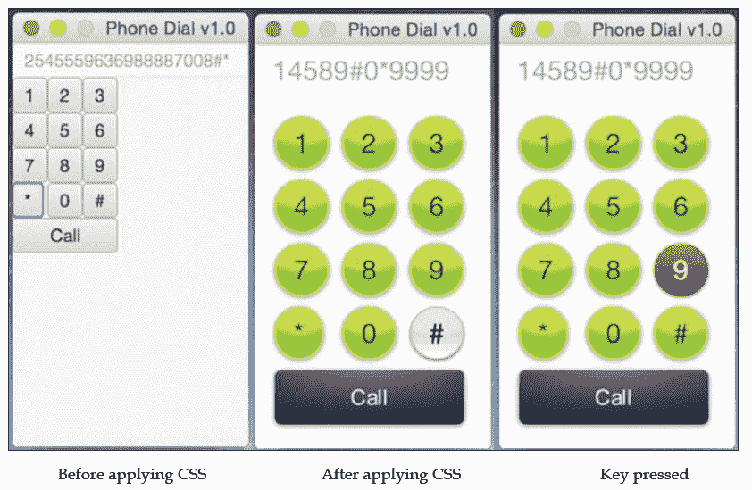
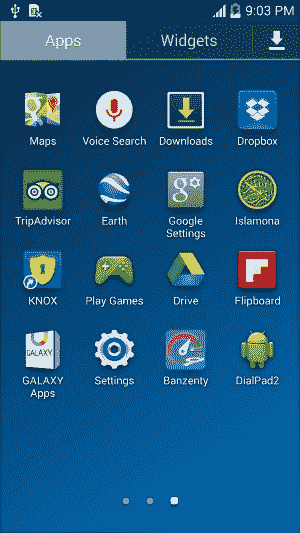

# 四、为 Android 开发 JavaFX 应用

毫无疑问，我们每天都在看到非 PC 客户的增加。几乎每个人都至少有一部手机或平板电脑，可能来自不同的供应商，但肯定有 Android 或 iOS，因为它们占 2014 年智能手机 OSs 销量的 96%。

如今，智能手机和平板电脑非常流行，而且这些数字每年都在增加。这就是为什么开发人员应该考虑获得开发这样一个巨大市场的应用所需的技能。

JavaFX8 已经为 Web 和桌面提供了富客户端应用，正如我们在[第 3 章](3.html#aid-PNV62 "Chapter 3. Developing a JavaFX Desktop and Web Application")*中所看到的，开发 JavaFX 桌面和 Web 应用*。但是，像我一样，如果你已经编写了一个 JavaFX 应用，你肯定希望它能在尽可能多的设备上运行，以遵循*的真正精神——写一次，在任何地方运行*。我想借此机会通知您，是的，我们可以在移动设备上运行 JavaFX。

基于 Oracle Corporation 对 JavaFX 的官方支持，JavaFX 社区中的许多人正在努力移植 JavaFX，以使其在尽可能多的设备和平台（桌面、移动和嵌入式）以及不同的操作系统上运行，并使用相同的代码库。

他们已经成功创建了 SDK，使我们能够将 JavaFX 应用开发为本地应用，在一个捆绑包（*JVM plus 应用*中）的 Android 或基于 iOS 的设备上运行，而不需要任何额外的软件来在桌面或 Web 上运行它们。

本章将为您提供有关 SDK 的基本实践知识，使您能够为 Android 创建、打包和部署本机应用。

以下是本章将学到的一些技巧：

*   安装和配置 Android 环境工具和软件
*   准备和创建 JavaFX8 移动项目结构
*   创建 AndroidJavaFX8 应用
*   JavaFX8 和 Android 低级 API 之间的互操作性
*   在移动设备上打包和部署应用
*   签署最终提交 Google Play 商店的应用

# 为什么要将 JavaFX 移植到移动环境中？

为什么将 JavaFX 移植到移动环境中？是不是**写一次运行在任何地方**（**WORA**）？这是一个很好的问题。任何 Java 应用都遵循 WORA 范式，但有一个非常关键的抽象软件块，它依赖于该软件来运行，称为**Java 虚拟机**（**JVM**。

JVM 是负责为特定机器翻译编译的字节码（*。类文件*）的软件，并提供它可以理解和运行的平台指令，以便您可以运行应用。因此，对于每个硬件（英特尔、AMD、SPARC 或 ARM）和平台（Windows、Mac、Linux 或 Solaris），您会发现 JRE 或**JDK**的不同版本。

在桌面、Web 或嵌入式设备上，您必须首先安装**Java 运行时环境**（**JRE**才能运行 Java 应用。但是，对于移动设备，您会注意到，您只需从应用商店下载应用，安装它，最后运行它，而无需任何额外的软件。此外，一些封闭平台不允许安装 JVM。

为了获得更好的最终用户体验，运行 JavaFX 应用和运行其他针对 Android 或 iOS 的应用之间应该没有区别。

因此，我们应该有一个可以在移动设备上运行的自包含（应用加 JVM）JavaFX 应用。除了能够与 Android 低级 API 交互以控制设备功能外，它还将与 Google Play 商店中的其他应用类似。

我们应该感谢社区提出了这样的移植 SDK，填补了这一空白，使我们能够使用 RoboVM（[的端口在 iOS 上创建和运行 JavaFX 应用 http://www.robovm.org/ Android 上的](http://www.robovm.org/)和使用 JavaFXPorts（[中的端口 http://javafxports.org/](http://javafxports.org/) ）。

自 2015 年 2 月以来，这些项目背后的公司之间的协议已经生效，现在一个名为`jfxmobile-plugin`的插件允许我们从同一代码库为三种平台桌面、Android 和 iOS 构建应用。

此外，一家名为**胶子**的新公司提供免费插件（[http://gluonhq.com/products/tools/ide-plugins/](http://gluonhq.com/products/tools/ide-plugins/) 为**NetBeans**创建了一个项目，其中包含了基于`jfxmobile-plugin`构建应用所需的一切。

### 注

但请记住，所有这些都是不断演变的，事情可能会发生变化。

## 它是如何工作的

用于 iOS 移植的 RoboVM 和用于 Android 移植的 JavaFXPorts 都包含了所有必需的库，可以方便地将 JavaFX8 应用打包到所需的运行时环境中。

当使用 RoboVM for iOS 打包您的 JavaFX 应用（到一个`.ipa`包文件）时，您的所有 JavaFX 应用都会转换为**Objective-C**（当前为**Swift**应用。

当使用 JavaFXPorts for Android 打包 JavaFX 应用（到`.apk`包文件）时，应用将转换为运行在**Dalvik**VM 上的 Android 包。

这些 SDK 包含大量本机代码，在将它们注入 JavaFX 应用中后，这些代码将被移植到 iOS 和 Android，以提高应用性能。

使用这些 SDK，我们可以将我们的应用打包成适合提交到商店的格式（iOS 为`.ipa`，Android 为`.apk`）。

## 谁在维护？

别担心，在 Android 和 iOS 上移植 JavaFX 有大规模的免费支持，还有商业支持。

### 注

为了获得免费和商业支持，RoboVM 和 JavaFXPorts 社区都使用这个 Google 组：

[https://groups.google.com/forum/#!论坛/javafxports](https://groups.google.com/forum/#!forum/javafxports)

免费和商业支持主要来自社区人士和积极参与这两个项目的人。他们还鼓励更多的第三方参与进来。

对于 iOS，RoboVM 对开发者有不同的计划；您可以在[查看 http://robovm.com/pricing/](http://robovm.com/pricing/) 。

对于 Android，公司**LodgON**提供了对 JavaFX Android 集成的支持，作为其对 JavaFX 移植（[的支持的一部分 http://www.lodgon.com/dali/page/JavaFX_Consulting](http://www.lodgon.com/dali/page/JavaFX_Consulting) ）。

# 开始

我们现在已经有了足够的信息，说明前面讨论的工具和 SDK 将如何让我们开始开发 JavaFX 应用并将其移植到 Android 移动设备。

但在进入开发阶段之前，我们应该正确安装和配置工具和软件，以便根据提供的 SDK 完成开发过程，并手头有一个最终的`.apk`包。

我们将在真正的设备上部署这个`.apk`包，最后我们将签署该包并最终提交给 Google Play Store。

因此，让我们开始安装必要的工具和软件，开始开发我们的应用。

## 准备和安装必备软件

我们需要安装下面的工具和软件列表，以便我们的构建过程能够顺利完成。

### Java SE 8 JDK8 u45

我们之前已经这样做过；请参阅[第 1 章](1.html#aid-DB7S1 "Chapter 1. Getting Started with JavaFX 8")*JavaFX 8*入门中的*安装 Java SE 8 JDK*一节。

### 注

JavaSE8Update40 是为 Android 开发 JavaFX 应用所需的最低版本。

### 格拉德尔

从他们的网站上，这是对等级的定义：

> *Gradle 是一个开源的楼宇自动化系统。Gradle 可以自动构建、测试、发布、部署和更多的软件包或其他类型的项目，例如生成的静态网站、生成的文档或其他任何东西。*

最近，Android 开发工具将其构建系统更改为 Gradle。RoboVM 和 JavaFXPorts 移植项目模仿相同的工具。

安装 Gradle 是一项非常简单的任务：

1.  前往至[https://gradle.org](https://gradle.org) 。
2.  从右侧，在**下，抓住格拉德尔！**部分，点击**下载 2.4**（截至本文撰写时），将开始下载`gradle-2.4-all.zip`文件。
3.  将下载的`.zip`文件复制到您选择的方便位置并解压缩。
4.  最后一步是将环境变量设置到系统中，如下所示：
    *   在 Windows 上–假设 Gradle 安装在`c:\tools\gradle_2.4`：

        ```java
        set GRADLE_HOME=c:\tools\gradle_2.4
        set PATH=%PATH%;%GRADLE_HOME%\bin

        ```

    *   在 Mac 上–假设 Gradle 安装在`/usr/local/tools/gradle_2.4`：

        ```java
        export GRADLE_HOME=/usr/local/tools/gradle_2.4
        export PATH=${PATH}:${GRADLE_HOME}/bin

        ```

### 安卓 SDK

安卓 SDK 包含安卓平台的全套开发调试工具。

安装安卓 SDK 是一项非常简单的任务：

1.  转到[http://developer.android.com/sdk/index.html#Other](http://developer.android.com/sdk/index.html#Other) 。
2.  Under SDK Tools Only, click `on android-sdk_r24.2-{platform}`.`{exe|zip|tgz}` (as of this writing) against the name of your favorite platform:

    

3.  将打开一个`Download`页面；接受条款，点击`Download android-sdk_r24.2-{platform}`。`{exe|zip|tgz}`按钮，下载过程开始。
4.  将下载的文件复制到方便的位置并解压缩，或者双击 Windows 上的`.exe`开始安装。
5.  From the command line, run the following:

    ```java
    $ android

    ```

    Android SDK 管理器将打开；点击`Build-tools version 21.1.2`或更高版本以及 API 21 或更高版本的 SDK 平台。

    点击**安装 x 软件包**，接受许可，点击**安装**。你完了。

    Android SDK 管理器的一个很好的参考资料位于[http://developer.android.com/sdk/installing/adding-packages.html](http://developer.android.com/sdk/installing/adding-packages.html) 。

6.  最后一步是在系统中设置环境变量，如下所示：
    *   在 Windows 上–假设 Android SDK 安装在`c:\tools\android_ADT`：

        ```java
        set ANDROID_HOME=c:\tools\android_ADT\sdk
        set PATH=%PATH%;%ANDROID_HOME%\platform-tools;%ANDROID_HOME%\tools

        ```

    *   在 Mac 上–假设 Android SDK 安装在`/usr/local/tools/android_ADT`：

        ```java
        export ANDROID_HOME=/usr/local/tools/android_adt/sdk
        export PATH=${PATH}:${ANDROID_HOME}/tools:${ANDROID_HOME}/platform-tools

        ```

    *   最好的方法是创建一个 Gradle 属性，其名称为`C:\Users\<user>\.gradle\gradle.properties`下定义的 ANDROID_HOME

## 为 Android 做项目准备

我们已经成功地安装了必备软件和工具，并配置了环境变量，因此我们准备开始开发将被移植到 Android 设备中的应用。

但在此之前，我们需要准备好项目结构和构建文件，以便使用 JavaFXPorts 库构建和打包应用。

到目前为止，用三种不同的平台建立一个复杂的项目将是一项艰巨的任务。但最近，胶子(http://gluonhq.com/)发布了一个 NetBeans 插件（[http://gluonhq.com/gluon-plugin-for-netbeans/](http://gluonhq.com/gluon-plugin-for-netbeans/) ）这在很大程度上简化了这项任务。

### 项目结构

最简单的方法是为 NetBeans 使用 Gluon 插件。这将为您创建一个 Java 项目，您只需要添加 JavaFX 源代码，以及一个包含所有任务的`build.gradle`文件。

安装插件后，请执行以下任务：

1.  Just create a new JavaFX project and select **Basic Gluon Application**, as shown here:

    

2.  为项目（`DialPad2`、包（`packt.taman.jfx8.ch4`）和主类（`DialPad2`）选择有效名称，您将在新项目中找到一堆文件夹。
3.  The top project structure following the Gluon plugin will bring a more complex structure and should be as seen in the following screenshot:

    

    胶子插件项目结构

接下来，我们将添加构建脚本文件以完成我们的任务。

#### 使用渐变

要构建 Gradle 项目，我们需要`build.gradle`脚本文件。默认情况下，Gluon 插件已经为您添加了这个文件，包括允许我们的应用成功运行和编译的所有属性。

创建的`build.gradle`文件的默认渐变构建文件如下：

```java
buildscript {
    repositories {
        jcenter()
    }
    dependencies {
        classpath 'org.javafxports:jfxmobile-plugin:1.0.0-b8'
    }
}

apply plugin: 'org.javafxports.jfxmobile'

repositories {
    jcenter()
}

mainClassName = 'packt.taman.jfx8.ch4.DialPad2'

jfxmobile {

    android {
        manifest = 'lib/android/AndroidManifest.xml'
    }
}
```

唯一需要更改的重要内容是将`jfxmobile-plugin`版本更改为 1.0.0-b8（或最新版本；检查[https://bitbucket.org/javafxports/javafxmobile-plugin/overview](https://bitbucket.org/javafxports/javafxmobile-plugin/overview) 经常更新）。

## 申请

您已经到达了这一部分，这意味着我们已经正确地完成了应用项目结构的设置，现在已经为移动设备开发做好了准备。

我们的应用将是一个新的智能手机拨号板接口，在我们的设备上使用默认拨号器进行呼叫。它将使用 CSS 进行定制，以控制其蒙皮样式，可以对其进行修改，以获得不同平台的本机外观。

此应用的主要目的是提供一个新的 UI 概念（使用 CSS 自定义应用），您将学习如何使用 CSS id 和类选择器，以及如何从代码内部将它们设置为应用于不同的控件。

以下屏幕截图显示了应用 CSS 文件前后的应用：



### 使用 CSS 开发和设计应用 UI

正如我们之前所了解的，我将开始原型化我们的应用；在原型化之后，我们应该拥有我们之前看到的应用 UI。

此应用 UI 直接编写在类`DialPad2.java`的`start(Stage)`函数中，作为开发 UI 的替代方法，而不是使用静态 FXML 设计。

这里，我们从代码内部嵌套控件，以防需要动态生成 UI 控件并为它们分配不同的设置、`CSS`类、`ids`选择器和`listeners`。

下面的代码片段显示了我们如何生成前面的应用 UI：

```java
BorderPane root = new BorderPane();
Rectangle2D bounds = Screen.getPrimary().getVisualBounds();
Scene scene = new Scene(root, bounds.getWidth(), bounds.getHeight());
scene.getStylesheets().add(getClass().getResource("ui/Mobile_UI."+PlatformFactory.getName()+".css").toExternalForm());
TextField output = new TextField("");
output.setDisable(true);

root.setTop(output);
String[] keys = {"1", "2", "3",
                 "4", "5", "6",
                 "7", "8", "9",
                 "*", "0", "#"};

GridPane numPad = new GridPane();
numPad.setAlignment(Pos.CENTER);
numPad.getStyleClass().add("num-pad");
for (int i = 0; i < keys.length; i++) {
       Button button = new Button(keys[i]);
       button.getStyleClass().add("dial-num-btn");
       button.setOnAction(e -> output.setText(output.getText().concat(Button.class.
      cast(e.getSource()).getText())));
      numPad.add(button, i % 3, (int) Math.ceil(i / 3));
}
// Call button
Button call = new Button("Call");
call.setOnAction(e->PlatformFactory.getPlatform().callNumber(output.getText()));
call.setId("call-btn");
call.setMaxSize(Double.MAX_VALUE, Double.MAX_VALUE);
numPad.add(call, 0, 4);
GridPane.setColumnSpan(call, 3);
GridPane.setHgrow(call, Priority.ALWAYS);
root.setCenter(numPad);

//Stage setup
stage.setScene(scene);
stage.setTitle("Phone Dial v2.0");
stage.show();
```

代码通过创建一个场景启动，该场景的根节点为`BorderPane`。创建场景后，代码加载 CSS 样式表文件`Mobile_UI.<platform>.css`，通过`getStylesheets().add()`方法设置当前场景节点的样式，如下所示：

```java
scene.getStylesheets().add(getClass().getResource("ui/Mobile_UI."+PlatformFactory.getName()+".css").toExternalForm());
```

我们创建了一个`TextField`输出以显示拨号结果，并将其设置为禁用状态，因此我们无法对其进行编辑后，只需单击按钮即可添加和显示号码。

接下来，代码使用`GridPane`类简单地创建一个网格，并在每个单元格中生成 12 个按钮。请注意，在 for 循环中，每个按钮都通过`getStyleClass().add()`方法设置了名为`dial-num-btn`的样式类。

### 注

这里我们使用一个古老的经典`for`循环来添加按钮，而不是一个花哨的 Java8 流。请注意，`Dalvik VM`仅在 Java 7 上运行，并且只能使用 lambda（因为在内部，JavaFXPorts 使用 Retrolambda 项目）。

最后，深蓝**呼叫**按钮将添加到网格窗格的最后一行。由于**调用**按钮是唯一的，其 id 选择器设置为`#call-btn`，并使用 id 选择器进行样式设置，这意味着 CSS 文件中命名的选择器将以`#`符号作为前缀。

以下是用于设置应用样式的 CSS 文件：

```java
.root {
    -fx-background-color: white;
    -fx-font-size: 20px;
    bright-green: rgb(59,223, 86);
    bluish-gray: rgb(189,218,230);
}
.num-pad {
    -fx-padding: 15px, 15px, 15px, 15px;
    -fx-hgap: 10px;
    -fx-vgap: 8px;
}

#call-btn {
    -fx-background-color: 
        #090a0c,
        linear-gradient(#38424b 0%, #1f2429 20%, #191d22 100%),
        linear-gradient(#20262b, #191d22),
        radial-gradient(center 50% 0%, radius 100%, rgba(114,131,148,0.9), rgba(255,255,255,0));
    -fx-background-radius: 5,4,3,5;
    -fx-background-insets: 0,1,2,0;
    -fx-text-fill: white;
    -fx-effect: dropshadow( three-pass-box , rgba(0,0,0,0.6) , 5, 0.0 , 0 , 1 );
    -fx-font-family: "Arial";
    -fx-text-fill: linear-gradient(white, #d0d0d0);
    -fx-font-size: 16px;
    -fx-padding: 10 20 10 20;
}
#call-btn .text {
    -fx-effect: dropshadow( one-pass-box , rgba(0,0,0,0.9) , 1, 0.0 , 0 , 1 );
}

.dial-num-btn {
    -fx-background-color:
        linear-gradient(#f0ff35, #a9ff00),
        radial-gradient(center 50% -40%, radius 200%, #b8ee36 45%, #80c800 50%);
    -fx-background-radius: 30;
    -fx-background-insets: 0,1,1;
    -fx-effect: dropshadow( three-pass-box , rgba(0,0,0,0.4) , 5, 0.0 , 0 , 1 );
    -fx-text-fill: #395306;
}

.dial-num-btn:hover {
    -fx-background-color: 
        #c3c4c4,
        linear-gradient(#d6d6d6 50%, white 100%),
        radial-gradient(center 50% -40%, radius 200%, #e6e6e6 45%, rgba(230,230,230,0) 50%);
    -fx-background-radius: 30;
    -fx-background-insets: 0,1,1;
    -fx-text-fill: black;
    -fx-effect: dropshadow( three-pass-box , rgba(0,0,0,0.6) , 3, 0.0 , 0 , 1 );
}

.dial-num-btn:pressed {
    -fx-background-color: linear-gradient(#ff5400, #be1d00);
    -fx-background-radius: 30;
    -fx-background-insets: 0,1,1;
    -fx-text-fill: white;
}
```

有关 JavaFX 8 CSS 属性的更多信息，请访问以下 JavaFX 8 CSS 参考：

[http://docs.oracle.com/javase/8/javafx/api/javafx/scene/doc-files/cssref.html](http://docs.oracle.com/javase/8/javafx/api/javafx/scene/doc-files/cssref.html)

### 添加一些逻辑

正如您在代码片段中所看到的，12 个按钮中的每个按钮都有一个使用 lambda 表达式分配的操作，该表达式是动态创建的，如下所示：

```java
button.setOnAction(e -> output.setText(output.getText().concat(Button.class.cast(e.getSource()).getText())));
```

我们获取输出`TextField`并通过获取事件`e`的源（在我们的例子中是单击的按钮）连接下一个数字、星号或散列符号，然后获取包含要拨号的数字的文本值。

### 为移动设备做好项目准备

基本上，这个新的项目是用胶子插件生成的（`build.gradle`更新为**b8**。

为了使应用为移动设备做好准备，我们需要调整它相对于目标设备屏幕的高度和宽度，并使 UI 树相应地响应。

这是一个非常简单但非常重要的步骤，我们可以通过动态设置目标设备屏幕尺寸的场景高度和宽度来调整以下代码行。请看下面一行：

```java
Scene scene = new Scene(root, 175, 300);
```

将此更改为以下代码行：

```java
Rectangle2D bounds = Screen.getPrimary().getVisualBounds();
Scene scene = new Scene(root, bounds.getWidth(), bounds.getHeight());
```

第一行获取设备屏幕`bounds`。然后，我们根据这个边界变量设置场景高度和宽度。

第二行将源代码添加到 sources 包[Java]和 Resources[Main]。然后，它添加了一个`PlatformFactory`类，该类负责查找项目运行的平台。请看带有方法签名的`Platform`接口：

```java
public interface Platform {   
    void callNumber(String number);
}
```

这允许您在源上调用以下方法：

```java
Button call = new Button("Call");
call.setOnAction(e-> PlatformFactory.getPlatform().callNumber(output.getText()));
```

最后，为每个平台提供本机解决方案。例如，对于 Android：

```java
public class AndroidPlatform implements Platform {

    @Override
    public void callNumber(String number) {
        if (!number.equals("")) {
            Uri uriNumber = Uri.parse("tel:" + number);
            Intent dial = new Intent(Intent.ACTION_CALL, uriNumber);
            FXActivity.getInstance().startActivity(dial);
         }
    }
}
```

为了在 Android 上工作，我们只需要修改`AndroidManifest.xml`，添加所需的权限和活动意图。此自定义清单必须在`build.gradle`文件中引用，如下所示：

```java
android {
    manifest = 'lib/android/AndroidManifest.xml'
  }
```

#### 与底层 Android API 的互操作性

您需要`android.jar`才能使用 Android API，您需要`jfxdvk.jar`才能访问`FXActivity`类，它是`JavaFX`和`Dalvik`运行时之间的桥梁。我们在`FXActivity`上使用静态方法检索`FXActivity`，这扩展了 Android `Context`。此`Context`可用于查找 Android 服务。

## 构建应用

为了为我们的应用创建我们的 Android`.apk`包文件，我们需要首先构建我们的应用；这是一项非常容易的任务。使用指向当前项目文件夹的命令行（或从 NetBeans，右键单击**项目**选项卡并选择`Tasks/task`，运行以下命令：

```java
$ gradle build

```

Gradle 将下载所有必需的库并开始构建我们的应用。完成后，您将看到以下成功输出：

```java
$ gradle build
Download https://jcenter.bintray.com/org/robovm/robovm-rt/1.0.0-beta-04/robovm-rt-1.0.0-beta-08.pom
:compileJava
:compileRetrolambdaMain
Download https://jcenter.bintray.com/net/orfjackal/retrolambda/retrolambda/1.8.0/retrolambda-1.8.0.pom
:processResources UP-TO-DATE
:classes
:compileDesktopJava UP-TO-DATE
:compileRetrolambdaDesktop SKIPPED
……...…
:check UP-TO-DATE
:build

BUILD SUCCESSFUL
Total time: 44.74 secs
```

到目前为止，我们已经成功构建了我们的应用。接下来我们需要生成`.apk`并将其部署到多个源。

### 构建最终的.apk Android 包

在构建`.apk`文件时，我们有两种选择。第一种方法是运行以下命令：

```java
gradle android 

```

这将在目录`build/javafxports/android`中生成`.apk`文件。

第二种方法是运行以下命令：

```java
androidInstall 

```

这会将生成的`.apk`包部署到连接到桌面或笔记本电脑设备的设备上。

我们将使用第一个选项（`gradle android`来确保我们能够成功生成`.apk`文件。成功完成后，在前面提到的路径下应该有一个名为`DialPad2.apk`的文件。

## 部署应用

为了能够使用`gradle androidInstall`命令在连接的移动设备上部署我们的应用，您必须在您的设备上启用**开发者选项**并启用其中的一些其他设置，如下所示：

1.  在您的设备上，点击**设置**打开设置菜单。
2.  从顶部菜单中，选择**更多**。选项取决于您的设备。
3.  在**更多选项**菜单列表的末尾，您应该看到**开发者选项**。
4.  点击**开发者选项**菜单。
5.  通过打开右上角的滑块启用**开发者选项**。
6.  在**调试**下，启用**USB 调试**，点击**允许 USB 调试**告警窗口中的**确定**按钮，启用**未知源**。
7.  祝贺你完成了让我们去安装我们的应用。

### 注

**可选**：如果您没有看到**开发者选项**，请不要担心。它存在但隐藏。这是关于设备的**上的魔法点击，找到**构建编号**，点击 5 次（棒棒糖上点击 7 次）。您将看到一个数字倒计时，最后将启用**开发者选项**。**

### 部署在基于 Android 的设备上

否我们已准备好运行以下命令：

```java
$ gradle androidinstall

```

发出此命令后，它将开始构建和打包 JavaFX8 应用。该插件将连接到您连接的设备，并将应用安装到其中。这是您应该得到的结果：

```java
:compileJava
:compileRetrolambdaMain
………...…
:processAndroidResources UP-TO-DATE
:apk
:zipalign
:androidInstall
Installed on device.

BUILD SUCCESSFUL
Total time: 47.537 secs
```

现在打开设备，从主屏幕找到应用图标；在右下角，您应该看到您的`DialPad2`JavaFX 应用已安装，如以下屏幕截图所示，带有默认的 Android 图标：



安装在 Android 设备上的 JavaFX8 应用

点击**拨号板 2**应用，您应该会看到您的应用已启动并在您的设备上运行，并且功能完全符合预期：


在 Android 设备上运行的 JavaFX8 应用

点击**呼叫**按钮即可启动 Android 默认拨号器，拨打您输入的号码，如下图：


JavaFX8 应用正在拨号

如果无法按预期工作，请转到命令行并键入：

```java
$ adb logcat 

```

您将获得设备上所有应用的输出。

### 部署在 Google Play 商店上

为了在 Google Play Store 上部署应用，您必须执行以下操作：

1.  您必须向 Google Play 开发者注册（[https://play.google.com/apps/publish/](https://play.google.com/apps/publish/) ），填写一张包含描述和多个屏幕截图的表格，最后提交 DialPad2 apk。
2.  在`AndroidManifest.xml`中，您必须通过在`application`标记上添加`android:debuggable="false"`来禁用调试选项。
3.  您还可以在`application`标签下添加应用的图标（`android:icon="@icons/ic_launcher`。这里，`icons-*`是具有多种分辨率的图像文件夹。

#### 签署 APK

`apk`必须签署才能放行。**签名**表示您需要私钥；为此，我们可以使用 keytool（[http://developer.android.com/tools/publishing/app-signing.html#signing-手动](http://developer.android.com/tools/publishing/app-signing.html#signing-manually)）。

而**发布**意味着我们需要将签名配置添加到`build.gradle`中，如下所示：

```java
jfxmobile {
    android {
        signingConfig {
            storeFile file("path/to/my-release-key.keystore")
            storePassword 'STORE_PASSWORD'
            keyAlias 'KEY_ALIAS'
            keyPassword 'KEY_PASSWORD'
        }
        manifest = 'lib/android/AndroidManifest.xml'
        resDirectory = 'src/android/resources'
    }
}
```

右键点击**拨号 2**项目，从**任务**中选择**apk**，然后选择**apkRelease**。

祝贺生成的 apk 已准备好提交给 Google Play Store。

## 测试提示

在交付应用之前，最重要的一点是对其进行测试，尤其是在不同的基于 Android 的移动设备上。

根据我在移动行业的经验，我发现有十几家供应商测试了运行 Android 平台的手机和平板电脑，每一家都定制了具有不同功能和性能的每个设备的 UI 层。

根据我的经验，移动测试领域的四条黄金法则是：

1.  在尽可能多的真实设备和 Android 平台上进行测试，以涵盖应用将在其上运行的所有情况，并了解其在生产中的表现。
2.  模拟器仅用于*GUI 测试和功能*，不用于*性能测试*。所有模拟器都依赖于您的底层 PC/笔记本电脑硬件和内存，而在移动硬件上，实现相同的性能将是非常不同和非常具有挑战性的。
3.  有一个新的模拟器叫做铬弧焊机。在[查看 https://developer.chrome.com/apps/getstarted_arc](https://developer.chrome.com/apps/getstarted_arc) 。
4.  在实际设备上进行最终生产和性能测试。因此，您可以放心，您的应用将相应地在目标市场设备上运行。

# 总结

本章让您很好地了解了移动行业，以及如何使用不同的项目开发和定制基于 JavaFX 的应用，例如针对**iOS**的**RoboVM**和针对**Android**的**JavaFXPorts**使应用能够在两种平台上运行。

然后，我们学习了如何安装 Android 开发所需的软件和工具，以及如何使 Android SDK 和*JavaFXPorts*库能够在真正的 Android 设备上打包和安装基于拨号器 JavaFX 的应用，并将其提交给 Google Play Store。

我们了解了如何使用 CSS 定制应用，使同一应用具有不同的外观，以确保您为 Android 版本提供了不同的 CSS。

接下来，我们学习了如何在调试模式下使我们的设备能够通过命令行从`jfxmobile-plugin`成功安装应用。最后，我们介绍了测试的四条黄金规则。

下一章与本章没有太大区别，但将向您介绍如何将 JavaFX8 应用定位在基于 iOS 的设备上运行，并为您提供相关知识。您还将学习如何使用其开发工具。