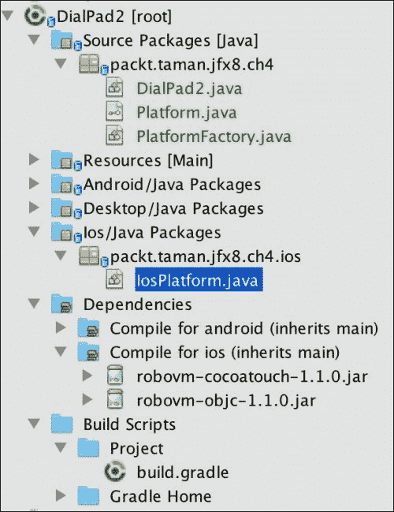
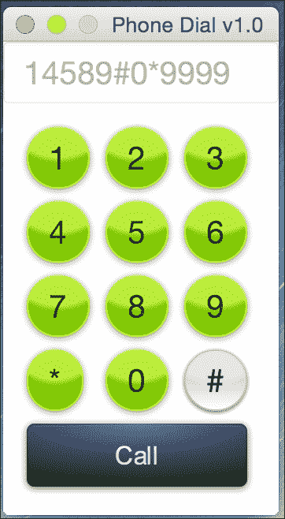
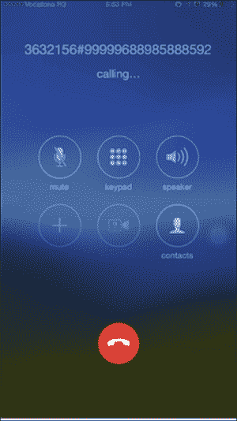

# 第五章，为 iOS 开发 JavaFX 应用程序

苹果在手机和 PC/笔记本电脑领域拥有巨大的市场份额，拥有许多不同的设备，从 iPhone 等手机到 iPod 等音乐设备和 iPad 等平板电脑。

它有一个快速增长的应用程序市场，称为 Apple Store，服务于其社区，可用应用程序的数量每天都在增加。移动应用程序开发人员应该为这样的市场做好准备。

同时面向 iOS 和 Android 的移动应用程序开发人员面临许多挑战。通过比较这两个平台的本机开发环境，您会发现它们有很大的不同。

苹果称，iOS 开发基于**Xcode IDE（**[）https://developer.apple.com/xcode/](https://developer.apple.com/xcode/) **及其编程语言。传统上，它是**Objective-C**，2014 年 6 月，苹果推出了**Swift**（[https://developer.apple.com/swift/](https://developer.apple.com/swift/) ；另一方面，谷歌定义的*Android*开发基于 Intellij IDEA 和 Java 编程语言。**

 **没有多少开发人员精通这两种环境。此外，这些差异排除了平台之间的任何代码重用。

正如我们将在本章中看到的，JavaFX8 通过在两个平台上共享相同的应用程序，填补了平台间可重用代码的空白。

以下是本章结束时您将获得的一些技能：

*   安装和配置 iOS 环境工具和软件
*   创建 iOS JavaFX 8 应用程序
*   模拟和调试 JavaFX 移动应用程序
*   在 iOS 移动设备上打包和部署应用程序

# 使用 RoboVM 在 iOS 上运行 JavaFX

**RoboVM**是从 Java 到 Objective-C 的桥梁。使用它，开发将在基于 iOS 的设备上运行的 JavaFX 8 应用程序变得很容易，因为**RoboVM**项目的最终目标是在不损害开发人员体验或应用程序用户体验的情况下解决这个问题。

正如我们在前面关于 Android 的章节中所看到的，由于 Android 基于 Java 和**Dalvik VM**，因此使用*JavaFXPorts*生成 APK 是一项相对简单的任务。

相反，iOS 没有用于 Java 的 VM，也不允许动态加载本机库。

需要另一种方法。RoboVM 开源项目试图通过使用一个提前*将 Java 字节码转换为本机 ARM 或 x86 机器代码的*编译器，在 Java 和 Objective-C 之间建立一座桥梁，从而缩小 Java 开发人员之间的差距。

## 特征

让我们来看看 RoboVM 的功能：

*   将 Java 和其他 JVM 语言（如 Scala、Clojure 和 Groovy）引入基于 iOS 的设备
*   提前将 Java 字节码转换为机器代码，以便直接在 CPU 上快速执行，而无需任何开销
*   主要目标是 iOS 和 ARM 处理器（32 位和 64 位），但也支持运行在 x86 CPU 上的 Mac OS X 和 Linux（32 位和 64 位）
*   不会对开发人员可访问的 Java 平台功能（如反射或文件 I/O）施加任何限制
*   支持标准 JAR 文件，使开发人员能够重用第三方 Java 库的庞大生态系统
*   通过 Java-to-Objective-C 桥接器提供对完整本机 iOS API 的访问，支持使用真正的本机 UI 和完整的硬件访问开发应用程序
*   与最流行的工具集成，如 NetBeans、Eclipse、Intellij IDEA、Maven 和 Gradle
*   应用商店就绪，商店中已有数百个应用

## 限制

主要由于 iOS 平台的限制，使用 RoboVM 时有一些限制：

*   不支持在运行时加载自定义字节码。构成应用程序的所有类文件必须在编译时在开发人员机器上可用。
*   桌面或服务器上使用的 Java 本机接口技术通常从动态库加载本机代码，但苹果不允许在 iOS 应用程序中附带自定义动态库。RoboVM 支持基于静态库的 JNI 变体。
*   另一个很大的限制是 RoboVM 是一个正在开发的阿尔法州项目，尚未推荐用于生产。

### 注

RoboVM 完全支持反射。

## 它是如何工作的

正如[第 4 章](4.html#aid-SJGS1 "Chapter 4. Developing a JavaFX Application for Android")中提到的*为 Android 开发 JavaFX 应用程序*，自 2015 年 2 月以来，RoboVM 和 JavaFXPorts 背后的公司已经达成协议，现在一个名为 jfxmobile plugin 的插件允许我们为三个平台构建应用程序：桌面、Android、，和来自同一代码库的 iOS。

JavaFXMobile 插件向 Java 应用程序添加了许多任务，允许您创建可提交到 Apple Store 的.ipa 包。

Android 主要使用 Java 作为主要开发语言，因此很容易将 JavaFX8 代码与之合并。在 iOS 上，情况在内部完全不同，但具有相似的 Gradle 命令。

插件将下载并安装 RoboVM 编译器，并使用 RoboVM 编译器命令在`build/javafxports/ios`中创建 iOS 应用程序。

# 开始

在本节中，您将学习如何使用`JavaFXMobile`插件安装 RoboVM 编译器，并通过重用相同的应用程序（电话拨号版本 1.0）确保工具链正常工作，我们之前在[第 4 章](4.html#aid-SJGS1 "Chapter 4. Developing a JavaFX Application for Android")*中为安卓平台开发了用于安卓的 JavaFX 应用程序*。

## 先决条件

为了使用 RoboVM 编译器构建 iOS 应用程序，需要以下工具：

*   Oracle 的 JavaSEJDK8 更新 45。请参阅[第 1 章](1.html#aid-DB7S1 "Chapter 1. Getting Started with JavaFX 8")、*JavaFX8 入门*、*安装 JavaSE8JDK*一节。
*   使用`jfxmobile`插件构建应用程序需要 Gradle 2.4 或更高版本。请参阅[第 4 章](4.html#aid-SJGS1 "Chapter 4. Developing a JavaFX Application for Android")、*为 Android 开发 JavaFX 应用程序*、安装*Gradle 2.4*一节。
*   运行**Mac OS X**10.9 或更高版本的 Mac。
*   来自 Mac 应用商店（[的 Xcode 6.xhttps://itunes.apple.com/us/app/xcode/id497799835?mt=12](https://itunes.apple.com/us/app/xcode/id497799835?mt=12) 。

### 提示

第一次安装**Xcode**时，以及每次更新到新版本时，必须打开一次才能同意 Xcode 条款。

## 为 iOS 准备项目

我们将重用之前在[第 4 章](4.html#aid-SJGS1 "Chapter 4. Developing a JavaFX Application for Android")*中为 Android*开发 JavaFX 应用程序时为 Android 平台开发的项目，因为针对 iOS 的代码、项目结构或渐变构建脚本没有差异。

它们共享相同的属性和功能，但使用不同的 Gradle 命令来为 iOS 开发服务，并对 RoboVM 编译器的 Gradle 构建脚本进行了细微更改。

因此，我们将看到**WORA***写一次，到处运行*的威力，使用相同的应用程序。

### 项目结构

基于[第 4 章](4.html#aid-SJGS1 "Chapter 4. Developing a JavaFX Application for Android")*中的安卓实例相同的项目结构，开发安卓*的 JavaFX 应用程序，我们的 iOS 应用程序的项目结构应该如下图所示：



### 申请

我们将重用[第 4 章](4.html#aid-SJGS1 "Chapter 4. Developing a JavaFX Application for Android")中的相同应用程序*为 Android 开发 JavaFX 应用程序*：手机拨号板版本 2.0 JavaFX 8 应用程序：



正如您所看到的，重用相同的代码库是一个非常强大和有用的特性，尤其是当您同时针对许多移动平台（如 iOS 和 Android）进行开发时。

#### 与低级 iOS API 的互操作性

为了使从我们的应用程序中本机调用默认 iOS 电话拨号器的功能与 Android 相同，我们必须为 iOS 提供本机解决方案，如下`IosPlatform`实现：

```java
import org.robovm.apple.foundation.NSURL;
import org.robovm.apple.uikit.UIApplication;
import packt.taman.jfx8.ch4.Platform;

public class IosPlatform implements Platform {

  @Override
  public void callNumber(String number) {
    if (!number.equals("")) {
      NSURL nsURL = new NSURL("telprompt://" + number);
      UIApplication.getSharedApplication().openURL(nsURL);
    }
  }
}
```

### 渐变生成文件

我们将使用与[第 4 章](4.html#aid-SJGS1 "Chapter 4. Developing a JavaFX Application for Android")中使用的相同的 Gradle 构建脚本文件，*为 Android*开发 JavaFX 应用程序，但在脚本末尾添加了以下几行，这是一个小改动：

```java
jfxmobile {
  ios {
    forceLinkClasses = [ 'packt.taman.jfx8.ch4.**.*' ]
  }
  android {
    manifest = 'lib/android/AndroidManifest.xml' 
  }
}
```

安装和使用`robovm`编译器所涉及的所有工作都由`jfxmobile`插件完成。

这些行的目的是为 RoboVM 编译器提供必须在运行时加载的主应用程序类的位置，因为它在默认情况下对编译器不可见。

`forceLinkClasses`属性确保在 RoboVM 编译期间链接这些类。

#### 构建应用程序

在之后，我们添加了必要的配置集来构建 iOS 脚本，现在是构建应用程序的时候了，以便将其部署到不同的 iOS 目标设备。为此，我们必须运行以下命令：

```java
$ gradle build

```

我们应该有以下输出：

```java
BUILD SUCCESSFUL

Total time: 44.74 secs
```

我们已经成功构建了我们的应用程序；接下来，我们需要生成。`ipa`在生产环境中，您必须通过将其部署到尽可能多的 iOS 版本来测试它。

#### 生成 iOS.ipa 包文件

为了为我们的 JavaFX 8 应用程序生成最终的.ipa iOS 包，这是最终分发到任何设备或 AppStore 所必需的，您必须运行以下`gradle`命令：

```java
gradle ios 

```

这将生成新的。目录`build/javafxports/ios`中的`ipa`文件。

### 部署应用程序

在开发期间，我们需要在 iOS 模拟器上检查我们的应用程序 GUI 和最终应用程序原型，并测量不同设备上的应用程序性能和功能。这些程序非常有用，特别是对于测试人员。

让我们看看在模拟器或真实设备上运行应用程序是多么容易。

#### 部署到模拟器上

在模拟器上，只需运行以下命令即可检查应用程序是否正在运行：

```java
$ gradle launchIPhoneSimulator 

```

此命令将在*iPhone 模拟器*中打包并启动应用程序，如下图所示：


在 iOS 8.3/iPhone 4s 模拟器上运行的 DialPad2 JavaFX 8 应用程序

此命令将在 iPad 模拟器中启动应用程序：

```java
$ gradle launchIPadSimulator 

```

#### 部署到 Apple 设备

为了打包 JavaFX 8 应用程序并将其部署到 Apple 设备，只需运行以下命令：

```java
$ gradle launchIOSDevice 

```

此命令将在连接到台式机/笔记本电脑的设备中启动 JavaFX 8 应用程序。

然后，在设备上启动应用程序后，键入任意号码，然后点击 Call。

iPhone 将请求使用默认移动拨号器拨号的许可；点击**Ok**。将启动默认的移动拨号程序，并显示如下图所示的号码：



默认移动拨号器

### 注

为了能够在您的设备上测试和部署您的应用程序，您将需要 Apple Developer 程序的活动订阅。访问苹果开发者门户网站[https://developer.apple.com/register/index.action](https://developer.apple.com/register/index.action) 注册。您还需要为开发提供设备。您可以在 Apple Developer Portal 中找到有关设备配置的信息，或遵循以下指南：[http://www.bignerdranch.com/we-teach/how-to-prepare/ios-device-provisioning/](http://www.bignerdranch.com/we-teach/how-to-prepare/ios-device-provisioning/) 。

# 总结

本章让我们很好地理解了如何使用 RoboVM for**iOS**开发和定制基于 JavaFX 的应用程序，从而使您的应用程序能够在苹果平台上运行。

您了解了 RoboVM 的特性和局限性，以及它的工作原理；您还获得了可用于开发的技能。

然后，您学习了如何安装 iOS 开发所需的软件和工具，以及如何启用 Xcode 和*RoboVM*编译器，在 OS 模拟器上打包和安装基于电话拨号 JavaFX-8 的应用程序。

我们已经看到了我们如何重用我们在[第 4 章](4.html#aid-SJGS1 "Chapter 4. Developing a JavaFX Application for Android")*中已经开发的相同应用程序，为 Android*开发 JavaFX 应用程序，证明了 JavaWORA 范例是有效的。

最后，我们提供了有关如何在真实设备上运行和部署应用程序的提示。

下一章将开启物联网发展世界的窗口；我们将了解如何购买 RaspberryPi model 2，安装并配置用于开发的*raspbian Wheeezy*操作系统，以及如何为嵌入式设备安装 Java SE。然后，我们将开发一个 JavaFX8 应用程序，该应用程序将在我们的信用卡大小的微型计算机上运行。**