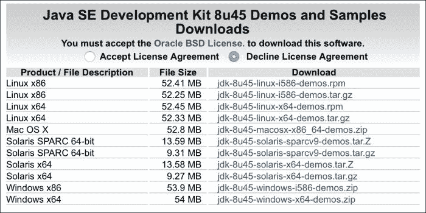
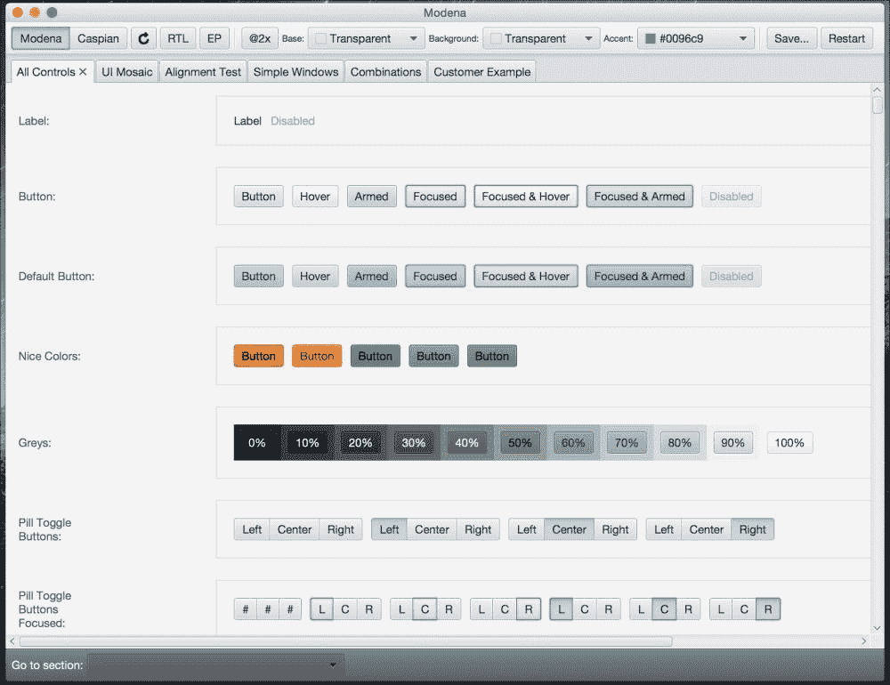

# 九、成为 JavaFX 大师

您的 JavaFX8 之旅会在这里结束吗？绝对不是！JavaFX 是一个非常大的话题，它的发展日新月异，从 Oracle 发布的具有新特性、功能和稳定性的核心版本，到许多创建第三方库的社区个人和公司，以填补您可能遇到的任何缺失，或围绕它发明核心中不存在的新库。

当然，在这本书中，我无法涵盖所有 JavaFX8 主题。取而代之的是，我试图通过找到自己的方式并了解如何自己去做，来触及许多 JavaFX 领域的表面，并打开主题键，以使您的冒险更容易。

然而，我们还讨论了许多其他工具和技术，通过开发传统的 web 和桌面应用，然后转移到一个更先进和市场要求更高的领域，即移动开发。

我们通过学习**物联网**（下一个信息技术时代）来探索未来的越多，我们涉及的有趣话题就越多。我们在电影中见过很多次运动，也想象过它，我们通过开发一款增强的基于无触摸的 JavaFX8 和一款令人惊叹的 Leap motion v2 小工具，实现了我们的梦想。

还有很多东西可以成为 JavaFX 的主题并获得其他经验，这在本书中没有讨论。

*那么，我们从这里走到哪里？*

现在，由于您有许多已启动并正在运行的 JavaFX8 应用，并且了解它在许多平台和硬件上的工作方式，剩下的取决于您和您的创造力。

加入 Facebook、Twitter 上的社区，关注技术专家的博客 JavaFX 博客[http://blogs.oracle.com/javafx/](http://blogs.oracle.com/javafx/) ，并在[上查找新闻、演示和见解 http://fxexperience.com/](http://fxexperience.com/) 。首先是实验。

在本章结束时，请务必查看目前生产中使用 JavaFX 的许多*框架*、*库*和*项目*。

# 资源和参考资料

在部分中，您将找到许多有用的链接和参考资料，它们将帮助您进一步了解所有 JavaFX 主题。

## 官方文件

*   **JavaFX documentation**: This is a great resource pointing toward all JavaFX resources, news, experiences, videos, books, API documentation, technical articles, and tutorials:

    [http://www.oracle.com/technetwork/java/javase/documentation/javafx-docs-2159875.html](http://www.oracle.com/technetwork/java/javase/documentation/javafx-docs-2159875.html)

*   **Java 平台，标准版（Java SE）8**：这些是*客户端技术*，包含多个样本，涵盖所有 JavaFX 主题：[http://docs.oracle.com/javase/8/javase-clienttechnologies.htm](http://docs.oracle.com/javase/8/javase-clienttechnologies.htm)

## JavaFX 样本

开始学习 JavaFX8 的最佳资源之一是 JavaDevelopmentKit8 示例和演示，其中包括一个 JavaFXDemo 文件夹，其中包含许多精彩的高级应用，这些应用包含所有 JavaFX 主题，源代码可供您自己试验。

您只需访问以下链接[即可下载样本 http://www.oracle.com/technetwork/java/javase/downloads/jdk8-downloads-2133151.html](http://www.oracle.com/technetwork/java/javase/downloads/jdk8-downloads-2133151.html) ，然后进入**Java SE 开发工具包 8u45 演示和示例下载**表，选中**接受许可协议**单选按钮，然后单击与您的操作系统相关的 zip 文件链接，如下图所示：



下载 JDK 和 JavaFX8 演示和示例

`samples`zip 文件包含可以运行的预构建示例，以及每个示例的 NetBeans 项目文件。

提取 zip 文件将生成以下目录结构：

```java
--src  (*Contains a NetBeans project for each sample*)
 --<Sample1>
  --nbproject
  --src
  --build.xml
  --manifest.mf
  --<Sample2>
  <sample1>.jar(*Runs the sample as a standalone application*)
<sample2>.jar

```


JavaFX 示例文件夹内容

任何`sample.jar`都可以作为独立应用运行；双击 JAR 文件，我们有四个应用：

1.  `Ensemble8.jar`: A gallery of sample applications that demonstrate a large variety of JavaFX features, including animation, charts, and controls. For each sample, you can do the following on all platforms:
    *   查看正在运行的示例并与之交互
    *   阅读它的描述。

    您只能在桌面平台上对每个示例执行以下操作：

    *   复制它的源代码
    *   对于多个示例，可以调整示例组件的特性
    *   如果您已连接到 Internet，还可以访问相关 API 文档的链接*Ensemble8 也使用 JavaFX for ARM 运行（表示在 Raspberry Pi 上运行）*。

    

    Ensemble8 应用正在运行

2.  `MandelbrotSet.jar`: A sample application that demonstrates the advantages of parallel execution done using the Java Parallel API.

    应用使用 Mandelbrot 集算法渲染图像，并在输入参数范围内提供直观导航。

    更多信息可在`MandelbrotSet`文件夹内的`index.html`文件中找到。

    

    MandelbrotSet 应用正在运行

3.  `Modena.jar`: A sample application that demonstrates the look and feel of UI components using the `Modena` theme. It gives you the option to contrast the `Modena` and `Caspian` themes and explore various aspects of these themes.

    

    Modena 应用正在运行

4.  `3DViewer.jar`: 3DViewer is a sample application that allows the user to navigate and examine a 3D scene with a mouse or a track pad. 3DViewer has importers for a subset of the features in **OBJ** and Maya files.

    还为 Maya 文件提供了导入动画的功能。（注意，对于 Maya 文件，保存为 Maya 文件时，应删除所有对象上的构建历史。）3DViewer 还能够将场景内容导出为 Java 或`FXML`文件。

    

    正在运行的 3DViewer 应用

    为了让自己玩代码，并尝试您可能做的任何更改，祝贺您，您有机会从**NetBeans**运行前面提到的所有应用，如下所示：

5.  在 NetBeans IDE 中，点击工具栏中的**打开项目**，或者在**文件**菜单上选择**打开项目**。
6.  导航到解压缩样本的位置，在`src`目录中选择一个项目，然后点击**打开**。
7.  要在 NetBeans IDE 中运行应用，请在**项目**窗格中，右键单击该项目并选择**运行**。

## 爪哇 SE8

作为一个提醒，JavaFX8 内置于 Java8SDK 中。这意味着您只需要下载 Java8SDK。Java 8 软件开发工具包和相关信息可从以下位置下载：

*   Java 8 at Oracle Technology Network:

    [http://oracle.com/java8](http://oracle.com/java8)

*   The Java development kit:

    [http://www.oracle.com/technetwork/java/javase/downloads/index.html](http://www.oracle.com/technetwork/java/javase/downloads/index.html)

*   What is new in Java 8? Let's check the new features of Java 8:

    [http://www.oracle.com/technetwork/java/javase/8-whats-new-2157071.html](http://www.oracle.com/technetwork/java/javase/8-whats-new-2157071.html)

*   Java SE 8 new features tour:

    [http://tamanmohamed.blogspot.com/2014/06/java-se-8-new-features-tour-big-change.html](http://tamanmohamed.blogspot.com/2014/06/java-se-8-new-features-tour-big-change.html)

### JavaSE8API 文档和教程

Java 8 文档和指南位于以下链接：

*   The Java SE 8 Javadoc API documentation:

    [http://docs.oracle.com/javase/8](http://docs.oracle.com/javase/8)

*   The JavaFX 8 Javadoc API documentation:

    [http://docs.oracle.com/javase/8/javafx/api](http://docs.oracle.com/javase/8/javafx/api)

*   The Java SE 8 Overview Documentation:

    [http://docs.oracle.com/javase/8/docs/index.html](http://docs.oracle.com/javase/8/docs/index.html)

*   The Java SE 8 tutorial:

    [http://docs.oracle.com/javase/tutorial/tutorialLearningPaths.html](http://docs.oracle.com/javase/tutorial/tutorialLearningPaths.html)

### Lambda 项目

核心 JavaSE8 添加的语言特性是 lambda 表达式和流 API。以下参考资料是有关 lambda 项目主题的路线图、博客和视频：

*   State of the Lambda, Brian Goetz (Oracle):

    [http://cr.openjdk.java.net/~briangoetz/lambda/lambda-state-final.html](http://cr.openjdk.java.net/~briangoetz/lambda/lambda-state-final.html)

*   Java 8 Revealed: Lambdas, Default Methods and Bulk Data Operations, Anton Arhipov:

    [http://zeroturnaround.com/rebellabs/java-8-revealed-lambdas-defaultmethods-and-bulk-data-operations](http://zeroturnaround.com/rebellabs/java-8-revealed-lambdas-defaultmethods-and-bulk-data-operations)

*   10 examples of Lambda Expressions and Streams in Java 8, Javin Paul:

    [http://javarevisited.blogspot.com/2014/02/10-example-of-lambdaexpressions-in-java8.html](http://javarevisited.blogspot.com/2014/02/10-example-of-lambdaexpressions-in-java8.html)

*   Java SE 8: Lambda Quick Start, Oracle:

    [http://www.oracle.com/webfolder/technetwork/tutorials/obe/java/Lambda-QuickStart/index.html](http://www.oracle.com/webfolder/technetwork/tutorials/obe/java/Lambda-QuickStart/index.html)

*   Java 8: Closures, Lambda Expressions Demystified, Frank Hinkel:

    [http://frankhinkel.blogspot.com/2012/11/java-8-closures-lambdaexpressions.html](http://frankhinkel.blogspot.com/2012/11/java-8-closures-lambdaexpressions.html)

### 纳肖恩

Java SE 8 包含一个名为**Nashorn**的新脚本引擎，这是一个新的、经过改进的 Java 运行时 JavaScript 引擎。该引擎使开发人员能够使用 JavaScript 语言编写应用。

以下链接和参考文献是描述纳肖恩的文章和博客：

*   Oracle's Nashorn: A next Generation JavaScript Engine for the JVM, Julien Ponge:

    [http://www.oraclejavamagazine-digital.com/javamagazine_twitter/20140102/?pg=60#pg60](http://www.oraclejavamagazine-digital.com/javamagazine_twitter/20140102/?pg=60#pg60)

*   Open JDK's Nashorn site:

    [https://wiki.openjdk.java.net/display/Nashorn/Main](https://wiki.openjdk.java.net/display/Nashorn/Main)

*   The Nashorn blog:

    [https://blogs.oracle.com/Nashorn](https://blogs.oracle.com/Nashorn)

## JavaFX 属性和绑定

在 JavaFX 节点之间同步值时，属性和绑定对 JavaFX 至关重要。

以下是有关只读属性、侦听器和 JavaFXbean 角色的重要资源：

*   Creating Read-Only Properties in JavaFX, Michael Heinrichs:

    [http://blog.netopyr.com/2012/02/02/creating-read-only-properties-injavafx](http://blog.netopyr.com/2012/02/02/creating-read-only-properties-injavafx)

*   The Unknown JavaBean, Richard Bair:

    [https://weblogs.java.net/blog/rbair/archive/2006/05/the_unknown_jav.html](https://weblogs.java.net/blog/rbair/archive/2006/05/the_unknown_jav.html)

*   Using JavaFX Properties and Binding, Scott Hommel:

    [http://docs.oracle.com/javafx/2/binding/jfxpub-binding.htm](http://docs.oracle.com/javafx/2/binding/jfxpub-binding.htm)

*   Pro JavaFX 8, ([Chapter 4](4.html#aid-SJGS1 "Chapter 4. Developing a JavaFX Application for Android"), *Properties and Bindings*), Johan Vos, James Weaver, Weiqi Gao, Stephen Chin, and Dean Iverson, (Apress, 2014):

    [http://www.apress.com/9781430265740](http://www.apress.com/9781430265740)

*   Open Dolphin: A JavaFX MVC framework (founded by Dierk Koenig of Canoo Engineering):

    [http://open-dolphin.org/dolphin_website/Home.html](http://open-dolphin.org/dolphin_website/Home.html)

*   JavaFX MVP framework based on Convention over Configuration and Dependency Injection (founded by Adam Bien):

    [http://afterburner.adam-bien.com](http://afterburner.adam-bien.com)

## JavaFX 社区

那么你想参与 JavaFX 社区？请查看以下链接：

*   The Java.net JavaFX community site:

    [https://www.java.net/community/javafx](https://www.java.net/community/javafx)

*   FXExperience: JavaFX News, Demos and Insight (@fxexperience):

    [http://fxexperience.com](http://fxexperience.com)

*   Nighthacking (@_nighthacking): Hosted by Stephen Chin. A tour around the world to see everything about Java, JavaFX, and IoT. Amazing live talks.

    [http://nighthacking.com](http://nighthacking.com)

*   Oracle's JavaFX Community portal to Real World Use Cases, Community Support, Third-Party tools and Open JFX:

    [http://www.oracle.com/technetwork/java/javase/community/index.html](http://www.oracle.com/technetwork/java/javase/community/index.html)

*   JFXtras: A JavaFX custom controls community:

    [http://jfxtras.org](http://jfxtras.org)

*   ControlsFX: Another custom controls community, started by Jonathan Giles of Oracle:

    [http://fxexperience.com/controlsfx](http://fxexperience.com/controlsfx)

*   Silicon valley JavaFX users group:

    [http://www.meetup.com/svjugfx](http://www.meetup.com/svjugfx)

*   Silicon valley JavaFX users group Live stream:

    [http://www.ustream.tv/channel/silicon-valley-javafx-user-group](http://www.ustream.tv/channel/silicon-valley-javafx-user-group)

*   Oracle Forums on JavaFX:

    [https://community.oracle.com/community/developer/english/java/javafx/javafx_2.0_and_later](https://community.oracle.com/community/developer/english/java/javafx/javafx_2.0_and_later)

## Java SE/JavaFX 书籍和杂志

以下链接是与新 Java SE 8 和 JavaFX 8 平台相关的较新书名：

*   An Amazing book, *JavaFX 8: Introduction by Example, Second Edition*, Carl Dea, Mark Heckler, Gerrit Grunwald, José Pereda, and Sean M. Phillips (Apress, 2014\. ISBN: 978-1-4302-6460-6)

    [http://www.apress.com/9781430264606](http://www.apress.com/9781430264606)

*   Pro JavaFX 8, Johan Vos, James Weaver, Weiqi Gao, Stephen Chin, and Dean Iverson (Apress, 2014\. ISBN: 978-1-4302-6574-0)

    [http://www.apress.com/9781430265740](http://www.apress.com/9781430265740)

*   Java 8 Recipes, Josh Juneau (Apress, 2014\. ISBN: 978-1-4302-6827-7)

    [http://www.apress.com/9781430268277](http://www.apress.com/9781430268277)

*   JavaFX Rich Client Programming on the NetBeans Platform, Paul Anderson and Gail Anderson (Addison-Wesley Professional, 2014\. ISBN: 978-0321927712):

    [https://blogs.oracle.com/geertjan/entry/new_book_javafx_rich_client](https://blogs.oracle.com/geertjan/entry/new_book_javafx_rich_client)

    [http://www.amazon.com/JavaFX-Client-Programming-NetBeans-Platform/dp/0321927710](http://www.amazon.com/JavaFX-Client-Programming-NetBeans-Platform/dp/0321927710)

*   Mastering JavaFX 8 Controls, Hendrik Ebbers (Oracle Press, 2014\. ISBN: 9780071833776):

    [http://mhprofessional.com/product.php?isbn=0071833773](http://mhprofessional.com/product.php?isbn=0071833773)

    [http://www.guigarage.com/javafx-book](http://www.guigarage.com/javafx-book)

*   Quick Start Guide to JavaFX, J.F. DiMarzio (Oracle Press, 2014\. ISBN: 978-0071808965):

    [http://www.mhprofessional.com/product.php?isbn=0071808965](http://www.mhprofessional.com/product.php?isbn=0071808965)

*   Java SE 8 for the Really Impatient, Cay S. Horstmann (Addison-Wesley, 2014\. ISBN 978-0321927767)

    [http://www.addison-wesley.de/9780321927767.html](http://www.addison-wesley.de/9780321927767.html)

*   Mastering Lambdas, Maurice Naftalin (Oracle Press, 2014\. ISBN: 007-1829628):

    [http://www.mhprofessional.com/product.php?isbn=0071829628](http://www.mhprofessional.com/product.php?isbn=0071829628)

*   Java Magazine from Oracle:

    [http://www.oracle.com/technetwork/java/javamagazine/index.html](http://www.oracle.com/technetwork/java/javamagazine/index.html)

> *我感谢您的时间，我希望您喜欢读这本书，就像我喜欢为您写这本书一样。非常感谢。*