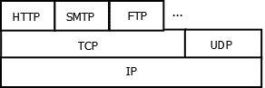

# 第二章网络寻址

要使一个程序与另一个程序通信，它必须有一个地址。本章将研究地址的使用，包括互联网地址。我们将在本章第一部分介绍许多基本概念。这包括网络体系结构和用于节点之间通信的协议。

我们将讨论几个主题，包括：

*   **网络基础**：这是介绍基本概念和术语的地方
*   **使用 NetworkInterface 类**：提供对系统设备的访问
*   **URL/UII/URN**：我们将讨论这些术语之间的关系
*   **Inet4Address 和 Inet6Address 类**：我们将讨论如何使用它们
*   No.T0.网络属性 AUTT1：我们将考虑 java 中可配置的属性。

这将为你更深入地探索网络提供基础。

# 网络基础

网络是一个广泛而复杂的话题。特别是，一个副主题，如寻址，是相当复杂的。我们将从 Java 的角度介绍常见的和有用的术语和概念。

本讨论的大部分内容将集中于对 Internet 的 Java 支持。一个**统一资源定位符**（**URL**）被大多数互联网用户认可。然而，术语**统一资源标识符**（**URI**）和**统一资源名称**（**URN**）与 URL 一样不被识别或理解。我们将区分这些术语，并检查 Java 支持类。

浏览器用户通常会输入他们想要访问的站点的 URL。此 URL 需要映射到 IP 地址。IP 地址是标识站点的唯一编号。URL 使用**域名系统**（**DNS**服务器映射到 IP 地址。这避免了用户必须记住每个站点的编号。Java 使用`InetAddress`类访问 IP 地址和资源。

UDP 和 TCP 被许多应用程序使用。IP 支持这两种协议。IP 协议在网络上的节点之间传输信息包。Java 支持 IPv4 和 IPv6 协议版本。

UDP 和 TCP 都是在 IP 之上分层的。其他几个协议是在 TCP 之上分层的，比如 HTTP。下图显示了这些关系：



当使用不同机器和操作系统的不同网络之间发生通信时，可能会由于硬件或软件级别的差异而出现问题。其中一个问题是 URL 中使用的字符。`URLEncoder`和`URLDecoder`类可以帮助解决这个问题，它们在[第 9 章](9.html "Chapter 9. Network Interoperability")、*网络互操作性*中进行了讨论。

分配给设备的 IP 地址可以是**静态**或**动态**。如果是静态的，则不会在每次重新启动设备时更改。对于动态地址，每次重新启动设备或重置网络连接时，地址可能会更改。

静态地址通常由管理员手动分配。使用从 DHCP 服务器运行的**动态主机配置协议**（**DHCP**）频繁分配动态地址。对于 IPv6，由于 IPv6 地址空间大，DHCP 没有那么有用。但是，DHCP 对于任务很有用，例如支持生成随机地址，从网络外部查看会在网络中引入更多隐私。

**互联网分配号码****机构****IANA**负责 IP 地址空间分配。五个**区域互联网注册中心**（**RIR**向本地互联网实体分配 IP 地址块，这些实体通常被称为**互联网服务提供商**（**ISP**。

有几种出版物详细介绍了 IP 协议：

*   **RFC 790 分配号码**：本规范针对网络号码的格式。对于示例，IPv4 A、B 和 C 类在本规范（[中定义 https://tools.ietf.org/html/rfc790](https://tools.ietf.org/html/rfc790) ）。
*   **RFC 1918 专用互联网地址分配**：本规范涉及如何分配专用地址。这允许多个专用地址与单个公共地址（[相关联 https://tools.ietf.org/html/rfc1918](https://tools.ietf.org/html/rfc1918) ）。
*   **RFC 2365 管理范围的 IP 多播**：该规范定义了多播地址空间及其实现方式。定义了 IPv4 和 IPv6 多播地址空间之间的映射（[https://tools.ietf.org/html/rfc2365](https://tools.ietf.org/html/rfc2365) ）。
*   **RFC 2373-IPv6 寻址架构**：此规范检查 IPv6 协议及其格式，以及 IPv6（[支持的各种地址类型 http://www.ietf.org/rfc/rfc2373.txt](http://www.ietf.org/rfc/rfc2373.txt) ）。

这里介绍的许多概念将尽可能用 Java 代码进行说明。让我们从了解网络开始。

## 了解网络基础知识

网络由节点和链路组成，这些节点和链路组合在一起形成网络架构。连接到互联网的设备称为节点。计算机节点称为**主机**。节点之间的通信使用 HTTP 或 UDP 等协议沿这些链路进行。

链路可以是有线的，如同轴电缆、双绞线和光纤，也可以是无线的，如微波、蜂窝、Wi-Fi 或卫星通信。这些不同的链路支持不同的带宽和吞吐量，以满足特定的通信需求。

节点包括设备，如**网络接口控制器****NIC**、网桥、交换机、集线器、路由器等。它们都涉及在计算机之间传输各种形式的数据。

NIC 有一个 IP 地址，是计算机的一部分。网桥连接两个网段，允许将较大的网络分解为较小的网络。中继器和集线器主要用于重发增强信号强度的信号。

集线器、交换机和路由器彼此相似，但复杂性不同。集线器处理多个端口，只需将数据转发到所有连接的端口。交换机将根据其通信量了解向何处发送数据。路由器可以编程来处理和路由消息。路由器在许多网络中更有用，大多数家庭网络使用路由器。

当一条信息从家用电脑通过互联网发送时，会发生一些事情。计算机的地址不是全局唯一的。这要求发送到计算机和从计算机发送的任何消息都由将地址更改为可在互联网上使用的地址的**网络地址转换**（**NAT**设备处理。它允许单个 IP 地址用于网络上的多个设备，如家庭 LAN。

计算机还可以使用代理服务器，代理服务器充当到其他网络的网关。Java 支持使用`Proxy`和`ProxySelector`类的代理。我们将在[第 9 章](9.html "Chapter 9. Network Interoperability")、*网络互操作性*中检查它们的使用。

消息通常通过防火墙路由。防火墙保护计算机免受恶意攻击。

### 网络架构和协议

常见的网络架构包括总线、星形和树形网络。这些物理网络通常用于支持覆盖网络，即虚拟网络。这种网络抽象底层网络，创建支持应用程序的网络体系结构，如对等应用程序。

当两台计算机通信时，它们使用协议。在网络的不同层上使用了许多不同的协议。我们将主要关注 HTTP、TCP、UDP 和 IP。

有几个模型描述了如何将网络分层以支持不同的任务和协议。一个常见的模型是**开放系统互连**（**OSI**模型），它定义了七层。网络模型的每一层都可以支持一个或多个协议。下表描述了各种协议的关系：

<colgroup><col style="text-align: left"> <col style="text-align: left"> <col style="text-align: left"></colgroup> 
| 

层

 | 

示例协议

 | 

意图

 |
| --- | --- | --- |
| 应用 | HTTP、FTP、SNMP | 支持专门操作的高级协议 |
| 演示 | 传输层安全 | 支持应用层的数据交付和处理 |
| 一场 | 网络文件系统 | 管理会话 |
| 运输 | TCP，UDP | 管理数据包 |
| 网络 | 知识产权 | 传输数据包 |
| 数据链路 | 以太网，帧中继 | 在网段之间传输数据 |
| 身体的 | 蓝牙 | 处理原始数据 |

有关 OSI 层的更完整协议列表，请参见[https://en.wikipedia.org/wiki/List_of_network_protocols_（OSI_ 模型）](https://en.wikipedia.org/wiki/List_of_network_protocols_(OSI_model))。我们无法解决所有这些协议，我们将重点讨论 Java SDK 支持的更重要的协议。

考虑 Web 页面从服务器到客户端的传输方式。当数据发送到客户机时，它将被封装在 HTTP 消息中，HTTP 消息进一步封装在 TCP、IP 和链路级协议消息中，每个消息通常包含一个页眉和页脚。这个封装的头集通过 Internet 发送到目标客户机，在那里为每个封装头提取数据，直到显示原始 HTML 文件。

幸运的是，我们不需要熟悉这个过程的细节。许多类隐藏了这是如何发生的，从而使我们能够专注于数据。

我们感兴趣的传输层的协议是 TCP 和 UDP。TCP 提供了比 UDP 更可靠的通信协议。但是，UDP 更适合于不需要健壮的传递的短消息。流数据通常使用 UDP。

下表概述了 UDP 和 TCP 之间的差异：

<colgroup><col style="text-align: left"> <col style="text-align: left"> <col style="text-align: left"></colgroup> 
| 

特征

 | 

传输控制协议

 | 

UDP

 |
| --- | --- | --- |
| 联系 | 面向连接 | 无连接 |
| 可靠性 | 较高的 | 降低 |
| 包的顺序 | 恢复秩序 | 订单可能丢失 |
| 数据边界 | 数据包被合并 | 数据包是不同的 |
| 传输时间 | 比 UDP 慢 | 比 TCP 更快 |
| 错误检查 | 对 | 是的，但没有恢复选项 |
| 确认 | 对 | 不 |
| 重量 | 需要更多支撑的重物 | 重量轻，需要较少的支撑 |

TCP 用于许多协议，如 HTTP、**简单邮件传输****协议**（**SMTP**）和**文件传输协议**（**FTP**）。DNS 使用 UDP 传输媒体，如电影，以及**语音****IP**（**VOIP**）。

# 使用 NetworkInterface 类

`NetworkInterface`类提供了访问作为网络节点的设备的方法。此类还提供获取低级设备地址的方法。许多系统同时连接到多个网络。它们可以是有线的，如网卡，也可以是无线的，如无线 LAN 或蓝牙连接。

`NetworkInterface`类表示一个 IP 地址，并提供有关该 IP 地址的信息。**网络接口**是计算机与网络之间的连接点。这经常使用某种类型的 NIC。它不必有物理显示，但可以在软件中执行，就像环回连接一样（IPv4 为`127.0.0.1`，IPv6 为`::1`）。

`NetworkInterface`类没有任何公共构造函数。提供了三种静态方法来返回`NetworkInterface`类的实例：

*   `getByInetAddress`：如果 IP 地址已知，则使用
*   `getByName`：已知接口名称时使用
*   `getNetworkInterfaces`：此提供可用接口的枚举

下面的代码说明了如何使用`getNetworkInterfaces`方法获取并显示当前计算机的网络接口枚举：

```java
    try {
        Enumeration<NetworkInterface> interfaceEnum = 
            NetworkInterface.getNetworkInterfaces();
        System.out.printf("Name      Display name\n");
        for(NetworkInterface element : 
                Collections.list(interfaceEnum)) {
            System.out.printf("%-8s  %-32s\n",
                    element.getName(), element.getDisplayName());
    } catch (SocketException ex) {
        // Handle exceptions
    }
```

一个可能的输出如下所示，但已将其截断以节省空间：

**名称显示名称**

**lo 软件环回接口 1**

**eth0 微软内核调试网络适配器**

**eth1 Realtek PCIe FE 系列控制器**

**wlan0 Realtek RTL8188EE 802.11 b/g/n Wi-Fi 适配器**

**wlan1 微软 Wi-Fi 直接虚拟适配器**

**net0 微软 6to4 适配器**

**net1 Teredo 隧道伪接口**

**。。。**

`getSubInterfaces`方法将返回子接口的枚举（如果存在），如下所示。当单个物理网络接口被划分为逻辑接口以进行路由时，就会出现子接口：

```java
    Enumeration<NetworkInterface> interfaceEnumeration = 
        element.getSubInterfaces();
```

每个网络接口将有一个或多个与其关联的 IP 地址。`getInetAddresses`方法将返回这些地址的`Enumeration`。如下图所示，网络接口的初始列表已被扩充，以显示与其关联的 IP 地址：

```java
    Enumeration<NetworkInterface> interfaceEnum = 
        NetworkInterface.getNetworkInterfaces();
    System.out.printf("Name      Display name\n");
    for (NetworkInterface element : 
            Collections.list(interfaceEnum)) {
        System.out.printf("%-8s  %-32s\n",
                element.getName(), element.getDisplayName());
        Enumeration<InetAddress> addresses = 
            element.getInetAddresses();
        for (InetAddress inetAddress : 
                Collections.list(addresses)) {
            System.out.printf("    InetAddress: %s\n", 
                inetAddress);
        }
```

一种可能的输出如下：

**名称显示名称**

**lo 软件环回接口 1**

**InetAddress:/127.0.0.1**

**InetAddress:/0:0:0:0:0:0:0:1**

**eth0 微软内核调试网络适配器**

**eth1 Realtek PCIe FE 系列控制器**

**InetAddress:/fe80:0:0:0:91d0:8e19:31f1:cb2d%eth1**

**wlan0 Realtek RTL8188EE 802.11 b/g/n Wi-Fi 适配器**

**InetAddress:/192.168.1.5**

**InetAddress:/2002:6028:2252:0:0:0:1000**

**InetAddress:/fe80:0:0:0:9cdb:371f:d3e9:4e2e%wlan0**

**wlan1 微软 Wi-Fi 直接虚拟适配器**

**InetAddress:/fe80:0:0:0:f8f6:9c75:d86d:8a22%wlan1**

**net0 微软 6to4 适配器**

**net1 Teredo 隧道伪接口**

**InetAddress:/2001:0:9d38:6abd:6a:37:3f57:fefa**

**。。。**

我们也可以使用以下 Java8 技术。流和 lambda 表达式用于显示 IP 地址以生成相同的输出：

```java
        addresses = element.getInetAddresses();
        Collections
                .list(addresses)
                .stream()
                .forEach((inetAddress) -> {
                    System.out.printf("    InetAddress: %s\n", 
                        inetAddress);
                });
```

有许多`InetworkAddress`方法，它们揭示了有关网络连接的更多细节。我们将在遇到他们时对他们进行讨论。

## 获取 MAC 地址

一个**媒体访问控制**（**MAC**地址用于标识 NIC。MAC 地址通常由 NIC 的制造商分配，并且是其硬件的一部分。节点上的每个 NIC 必须具有唯一的 MAC 地址。理论上，所有 NIC，无论其位置如何，都将具有唯一的 MAC 地址。MAC 地址由 48 位组成，通常以六对十六进制数字组成的组写入。这些组由破折号或冒号分隔。

### 获取特定的 MAC 地址

通常，普通 Java 程序员不需要 MAC 地址。但是，可以在需要时检索它们。以下方法返回一个字符串，其中包含`NetworkInterface`实例的 IP 地址及其 MAC 地址。`getHardwareAddress`方法返回一个包含数字的字节数组。然后，该阵列显示为 MAC 地址。大多数代码段逻辑用于格式化输出，其中第三级运算符确定是否应显示破折号：

```java
    public String getMACIdentifier(NetworkInterface network) {
        StringBuilder identifier = new StringBuilder();
        try {
            byte[] macBuffer = network.getHardwareAddress();
            if (macBuffer != null) {
                for (int i = 0; i < macBuffer.length; i++) {
                       identifier.append(
                       String.format("%02X%s",macBuffer[i], 
                       (i < macBuffer.length - 1) ? "-" : ""));
                }
            } else {
                return "---";
            }
        } catch (SocketException ex) {
            ex.printStackTrace();
        }
        return identifier.toString();
    }
```

下面的示例演示了该方法，其中我们使用 localhost：

```java
    InetAddress address = InetAddress.getLocalHost();
    System.out.println("IP address: " + address.getHostAddress());
    NetworkInterface network = 
        NetworkInterface.getByInetAddress(address);
    System.out.println("MAC address: " + 
        getMACIdentifier(network));
```

根据所使用的计算机，输出会有所不同。一种可能的输出如下：

**IP 地址：192.168.1.5**

**MAC 地址：EC-0E-C4-37-BB-72**

### 注

`getHardwareAddress`方法只允许您访问本地主机 MAC 地址。您无法使用它访问远程 MAC 地址。

### 获取多个 MAC 地址

并非所有网络接口都有 MAC 地址。这里演示了这一点，其中使用`getNetworkInterfaces`方法创建枚举，然后显示每个网络接口：

```java
    Enumeration<NetworkInterface> interfaceEnum = 
        NetworkInterface.getNetworkInterfaces();
    System.out.println("Name    MAC Address");
    for (NetworkInterface element : 
            Collections.list(interfaceEnum)) {
        System.out.printf("%-6s  %s\n",
            element.getName(), getMACIdentifier(element));
```

一种可能的输出如下。将截断输出以节省空间：

**名称 MAC 地址**

**lo---**

**eth0---**

**eth1 8C-DC-D4-86-B1-05**

**wlan0 EC-0E-C4-37-BB-72**

**wlan1 EC-0E-C4-37-BB-72**

**net0---**

**net1 00-00-00-00-00-00-00-E0**

**net2 00-00-00-00-00-00-00-E0**

**。。。**

或者，我们可以使用以下 Java 实现。它将枚举转换为流，然后处理流中的每个元素：

```java
    interfaceEnum = NetworkInterface.getNetworkInterfaces();
    Collections
            .list(interfaceEnum)
            .stream()
            .forEach((inetAddress) -> {
                System.out.printf("%-6s  %s\n",
                    inetAddress.getName(), 
                    getMACIdentifier(inetAddress));
            });
```

当我们需要执行额外的处理时，比如过滤掉某些接口，或者将接口转换成不同的数据类型时，流的力量就来了。

# 网络寻址概念

有不同类型的网络地址。地址用于标识网络中的节点。例如，**网络间分组交换**（**IPX**协议）是用于访问网络上节点的较早协议。X.25 是用于**广域网****广域网**分组交换的协议套件。MAC 地址为物理网络级别的网络接口提供唯一标识符。然而，我们的主要兴趣是 IP 地址。

## URL/URI/URN

这些术语用于指代 Internet 资源的名称和位置。URI 标识资源的名称，例如网站或 Internet 上的文件。它可能包含资源的名称及其位置。

URL 指定资源的位置以及如何检索。协议构成 URL 的第一部分，并指定如何检索数据。URL 总是包含协议，如 HTTP 或 FTP。例如，下面的两个 URL 使用不同的协议。第一个使用 HTTPS 协议，第二个使用 FTP 协议：

**https://www.packtpub.com/**

**ftp://speedtest.tele2.net/**

Java 提供了支持 URI 和 URL 的类。下一节将开始讨论这些课程。在这里，我们将更深入地讨论骨灰盒。

URN 标识资源，但不标识其位置。URN 类似于城市的名称，而 URL 类似于城市的经纬度。当移动资源（如网页或文件）时，资源的 URL 不再正确。无论在何处使用，都需要更新 URL。URN 指定资源的名称，但不指定其位置。当提供骨灰盒时，其他实体将返回其位置。骨灰盒没有被广泛使用。

URN 的语法如下所示。`<NID>`元素是名称空间标识符，`<NSS>`是特定于名称空间的字符串：

**<URN>：=“URN:<NID>：<NSS>**

例如，以下是一个 URN，指定作为 SOAP 消息的一部分来限定其命名空间：

```java
<?xml version='1.0'?>
<SOAP:Envelope
  xmlns:SOAP='urn:schemas-xmlsoap-org:soap.v1'>
 <SOAP:Body>
  ...
    xmlns:i='urn:gargantuan-com:IShop'>
   ...
 </SOAP:Body>
</SOAP:Envelope>
```

它也被用于其他地方，比如用 ISBN 识别书籍。在浏览器中输入以下 URL 将显示对 EJB 书籍的引用：

**https://books.google.com/books?isbn=9781849682381**


URN 的语法取决于名称空间。IANA 负责许多互联网资源的分配，包括 URN 名称空间。骨灰盒仍然是一个活跃的研究领域。URL 和 URN 都是 URI。

## 使用 URI 类

URI 的一般语法由方案和方案特定部分组成：

**【方案：】方案具体部分**

与 URI 一起使用的方案有很多，包括：

*   **文件**：这是用于文件系统
*   **FTP**：这是文件传输协议
*   **HTTP**：这是网站常用的
*   **mailto**：这是邮件服务的部分
*   **urn**：用于按名称标识资源

方案特定部分因所使用的方案而异。URI 可以分为绝对的或相对的，也可以分为不透明的或分层的。在这里，我们对这些区别并不感兴趣，尽管 Java 提供了确定 URI 是否属于这些类别之一的方法。

### 创建 URI 实例

可以使用几个构造函数变体为不同的方案创建 URI。创建 URI 的最简单方法是使用字符串参数指定 URI，如下所示：

```java
    URI uri = new 
        URI("https://www.packtpub.com/books/content/support");
```

下一个 URI 使用一个片段访问 Wikipedia 文章中关于 URL 规范化的小节：

```java
    uri = new URI("https://en.wikipedia.org/wiki/"
        + "URL_normalization#Normalization_process");
```

我们还可以使用以下版本的构造函数来指定 URI 的方案、主机、路径和片段：

```java
    uri = new 
        URI("https","en.wikipedia.org","/wiki/URL_normalization",
        "Normalization_process");
```

后两个 URI 是相同的。

### 拆分 URI

Java 使用`URI`类来表示 URI，并且它拥有几种方法来提取 URI 的部分。下表列出了更有用的方法：

<colgroup><col style="text-align: left"> <col style="text-align: left"></colgroup> 
| 

方法

 | 

意图

 |
| --- | --- |
| `getAuthority` | 这是负责解析 URI 的实体 |
| `getScheme` | 使用的方案 |
| `getSchemeSpecificPart` | 方案 URI 的特定部分 |
| `getHost` | 主持人 |
| `getPath` | URI 路径 |
| `getQuery` | 查询，如果有的话 |
| `getFragment` | 正在访问的子元素，如果使用 |
| `getUserInfo` | 用户信息，如有 |
| `normalize` | 从路径中删除不必要的“.”和“.” |

还有一些“原始”方法，例如`getRawPath`或`getRawFragment`，它们分别返回路径或片段的版本。这包括特殊字符，如问号，或以星号开头的字符序列。有几个字符类别定义了这些字符及其用法，如[所述 http://docs.oracle.com/javase/8/docs/api/java/net/URI.html](http://docs.oracle.com/javase/8/docs/api/java/net/URI.html) 。

我们开发了以下用于显示 URI 特征的辅助方法：

```java
    private static void displayURI(URI uri) {
        System.out.println("getAuthority: " + uri.getAuthority());
        System.out.println("getScheme: " + uri.getScheme());
        System.out.println("getSchemeSpecificPart: " 
            + uri.getSchemeSpecificPart());
        System.out.println("getHost: " + uri.getHost());
        System.out.println("getPath: " + uri.getPath());
        System.out.println("getQuery: " + uri.getQuery());
        System.out.println("getFragment: " + uri.getFragment());
        System.out.println("getUserInfo: " + uri.getUserInfo());
        System.out.println("normalize: " + uri.normalize());
    }
```

下一个代码序列为 Packtpub 网站创建一个`URI`实例，然后调用`displayURI`方法：

```java
    try {
        URI uri = new 
            URI("https://www.packtpub.com/books/content/support");
        displayURI(uri);
    } catch (URISyntaxException ex) {
        // Handle exceptions
    }
```

该序列的输出如下所示：

**获取权限：www.packtpub.com**

**获取方案：https**

**getSchemeSpecificPart://www.packtpub.com/books/content/support**

**获取主机：www.packtpub.com**

**获取路径：/books/content/support**

**获取查询：空**

**getFragment:null**

**getUserInfo:null**

**规范化：https://www.packtpub.com/books/content/support**

**http://www.packtpub.com**

通常，这些方法用于提取相关信息以进行额外处理。

## 使用 URL 类

连接到站点并检索数据的最简单方法之一是通过`URL`类。您只需要提供站点的 URL 和协议的详细信息。`InetAddress`类的实例将包含一个 IP 地址，可能还有该地址的主机名。

`URLConnection`课程在[第一章](1.html "Chapter 1. Getting Started with Network Programming")*网络编程入门*中介绍。它还可以用于提供对由 URL 表示的 Internet 资源的访问。我们将在[第 4 章](4.html "Chapter 4. Client/Server Development")、*客户机/服务器开发*中讨论该类及其使用。

### 创建 URL 实例

有几种方法可以创建 URL 实例。最简单的方法是简单地提供站点的 URL 作为类构造函数的参数。此处举例说明创建 Packtpub 网站的`URL`实例：

```java
    URL url = new URL("http://www.packtpub.com");
```

URL 需要指定协议。例如，以下创建 URL 的尝试将导致**java.net.MalformedURLException:no protocol:www.packtpub.com**错误消息：

```java
    url = new URL("www.packtpub.com"); 
```

有几个构造函数变体。以下两个变体将创建相同的 URL。第二个使用协议、主机、端口号和文件的参数：

```java
    url = new URL("http://pluto.jhuapl.edu/");
    url = new URL("http", "pluto.jhuapl.edu", 80, 
        "News-Center/index.php");
```

### 拆分 URL

了解更多关于 URL 的信息可能很有用。如果用户输入了我们需要处理的 URL，我们甚至可能不知道我们正在使用什么 URL。有几种方法支持将 URL 拆分为其组件，如下表所示：

<colgroup><col style="text-align: left"> <col style="text-align: left"></colgroup> 
| 

方法

 | 

意图

 |
| --- | --- |
| `getProtocol` | 这是协议的名称。 |
| `getHost` | 这是主机名。 |
| `getPort` | 这是端口号。 |
| `getDefaultPort` | 这是协议的默认端口号。 |
| `getFile` | 返回与`getQuery`结果串联的`getPath`的结果。 |
| `getPath` | 这将为 URL 检索路径（如果有）。 |
| `getRef` | 这是 URL 引用的返回名称。 |
| `getQuery` | 这将返回 URL 的查询部分（如果存在）。 |
| `getUserInfo` | 这将返回与 URL 关联的任何用户信息。 |
| `getAuthority` | 权限通常由服务器主机名或 IP 地址组成。它可能包括端口号。 |

我们将使用以下方法来说明上表中的方法：

```java
    private static void displayURL(URL url) {
        System.out.println("URL: " + url);
        System.out.printf("  Protocol: %-32s  Host: %-32s\n",
            url.getProtocol(),url.getHost());
        System.out.printf("      Port: %-32d  Path: %-32s\n", 
            url.getPort(),url.getPath());
        System.out.printf(" Reference: %-32s  File: %-32s\n",
            url.getRef(),url.getFile());
        System.out.printf(" Authority: %-32s Query: %-32s\n", 
            url.getAuthority(),url.getQuery());
        System.out.println(" User Info: " + url.getUserInfo());
    }
```

下面的输出演示了当多个 URL 用作此方法的参数时的输出。

```java
URL: http://www.packpub.com
  Protocol: http                              Host: www.packpub.com                 
      Port: -1                                Path:                                 
 Reference: null                              File:                                 
 Authority: www.packpub.com                  Query: null                            
 User Info: null

URL: http://pluto.jhuapl.edu/
  Protocol: http                              Host: pluto.jhuapl.edu                
      Port: -1                                Path: /                               
 Reference: null                              File: /                               
 Authority: pluto.jhuapl.edu                 Query: null                            
 User Info: null

URL: http://pluto.jhuapl.edu:80News-Center/index.php
  Protocol: http                              Host: pluto.jhuapl.edu                
      Port: 80                                Path: News-Center/index.php           
 Reference: null                              File: News-Center/index.php           
 Authority: pluto.jhuapl.edu:80              Query: null                            
 User Info: null

URL: https://en.wikipedia.org/wiki/Uniform_resource_locator#Syntax
  Protocol: https                             Host: en.wikipedia.org                
      Port: -1                                Path: /wiki/Uniform_resource_locator  
 Reference: Syntax                            File: /wiki/Uniform_resource_locator  
 Authority: en.wikipedia.org                 Query: null                            
 User Info: null

URL: https://www.google.com/webhp?sourceid=chrome-instant&ion=1&espv=2&ie=UTF-8#q=url+syntax
  Protocol: https                             Host: www.google.com                  
      Port: -1                                Path: /webhp                          
 Reference: q=url+syntax                      File: /webhp?sourceid=chrome-instant&ion=1&espv=2&ie=UTF-8
 Authority: www.google.com                   Query: sourceid=chrome-instant&ion=1&espv=2&ie=UTF-8
 User Info: null

URL: https://www.packtpub.com/books/content/support
  Protocol: https                             Host: www.packtpub.com                
      Port: -1                                Path: /books/content/support          
 Reference: null                              File: /books/content/support          
 Authority: www.packtpub.com                 Query: null                            
 User Info: null

```

URL 类还支持打开连接和 IO 流。我们在[第一章](1.html "Chapter 1. Getting Started with Network Programming")*网络编程入门*中演示了`openConnection`方法。`getContent`方法返回 URL 引用的数据。例如，下面对 Packtpub URL 应用该方法：

```java
    url = new URL("http://www.packtpub.com");
    System.out.println("getContent: " + url.getContent());
```

结果如下：

**sun.net.www.protocol.http.HttpURLConnection$HttpInputStream@5c647e05**

这表明我们需要使用输入流来处理资源。数据类型取决于 URL。本主题通过[第 4 章](4.html "Chapter 4. Client/Server Development")、*客户机/服务器开发*中讨论的`URLConnection`类进行探讨。

## IP 地址和 InetAddress 类

IP 地址是用于标识节点的数值，如计算机、打印机、扫描仪或类似设备。它用于网络接口寻址和位置寻址。地址在其上下文中是唯一的，用于标识设备。在的同时，它构成了网络中的一个位置。名称表示实体，如[www.packtpub.com](http://www.packtpub.com)。它的地址`83.166.169.231`告诉我们它的位置。如果我们想从一个站点发送或接收消息，消息会通过一个或多个节点进行异常路由。

### 获取地址信息

`InetAddress`类表示一个 IP 地址。IP 协议是 UDP 和 TCP 协议使用的低级协议。IP 地址是分配给设备的 32 位或 128 位无符号数字。

IP 地址历史悠久，使用两个主要版本：IPv4 和 IPv6。编号 5 已分配给**互联网流协议**。这是一个实验性的协议，但它实际上从未被称为 IPv5 版本，也不打算用于一般用途。

`InetAddress`类“`getAllByName`方法将返回给定 URL 的 IP 地址。在以下示例中，显示与[www.google.com](http://www.google.com)关联的地址：

```java
    InetAddress names[] = 
        InetAddress.getAllByName("www.google.com");
    for(InetAddress element : names) {
        System.out.println(element);
    }
```

一种可能的输出如下。输出将因位置和时间而异，因为许多网站都有多个分配给它们的 IP 地址。在这种情况下，它同时使用 IPv4 和 IPv6 地址：

**www.google.com/74.125.21.105**

**www.google.com/74.125.21.103**

**www.google.com/74.125.21.147**

**www.google.com/74.125.21.104**

**www.google.com/74.125.21.99**

**www.google.com/74.125.21.106**

**www.google.com/2607:f8b0:4002:c06:0:0:0:69**

`InetAddress`类拥有多种方法来提供对 IP 地址的访问。当它们变得相关时，我们将介绍它们。我们从返回其规范主机名、主机名和主机地址的方法开始。它们在以下帮助器方法中使用：

```java
    private static void displayInetAddressInformation(
            InetAddress address) {
        System.out.println(address);
        System.out.println("CanonicalHostName: " +
            address.getCanonicalHostName());
        System.out.println("HostName: " + address.getHostName());
        System.out.println("HostAddress: " + 
            address.getHostAddress());
    }
```

规范主机名是一个**完全限定域名**（**FQDN**）。顾名思义，它是主机的全名，包括顶级域。这些方法返回的值取决于多个因素，包括 DNS 服务器。系统提供有关网络上实体的信息。

以下序列使用 Packtpub 网站的显示方法：

```java
    InetAddress address = 
        InetAddress.getByName("www.packtpub.com");
    displayInetAddressInformation(address);
```

您将得到一个与以下类似的输出：

**www.packtpub.com/83.166.169.231**

**规范主机名：83.166.169.231**

**主机地址：83.166.169.231**

**主机名：www.packtpub.com**

`InetAddress`类“`toString`方法返回主机名，后跟正斜杠，然后是主机地址。在本例中，`getCanonicalHostName`方法返回的主机地址不是 FQDN。该方法将尽最大努力返回名称，但可能无法返回，具体取决于计算机的配置。

### 解决范围界定问题

IP 地址的范围是指 IP 地址的唯一性。在本地网络中，例如在许多家庭和办公室中使用的网络，地址可能是该网络的本地地址。有三种类型的作用域：

*   **链路本地**：在未连接到 Internet 的单个本地子网内使用。不存在路由器。当计算机没有静态 IP 地址且找不到 DHCP 服务器时，会自动分配链路本地地址。
*   **站点本地**：当地址不需要全局前缀且在站点内唯一时使用。它无法直接从互联网访问，需要 NAT 等映射服务。
*   **全球**：顾名思义，该地址在互联网上是唯一的。

IPv4 中的*专用地址和 IPv6*部分中的*专用地址中也讨论了专用地址。`InetAddress`类支持多种方法来识别所使用的地址类型。大多数方法都是不言自明的，如以下表所示，其中 MC 是多播的缩写：*

<colgroup><col style="text-align: left"> <col style="text-align: left"> <col style="text-align: left"></colgroup> 
| 

方法

 | 

范围

 | 

描述

 |
| --- | --- | --- |
| `isAnyLocalAddress` | 任何 | 这是一个与任何本地地址匹配的地址。这是一个通配符地址。 |
| `isLoopbackAddress` | 环回 | 这是一个环回地址。IPv4 为`127.0.0.1`，IPv6 为`0:0:0:0:0:0:0:1`。 |
| `isLinkLocalAddress` | 链接本地 | 这是一个链接本地地址。 |
| `isSiteLocalAddress` | 现场本地 | 这是一个站点的本地。同一站点内不同网络上的其他节点可以访问它们。 |
| `isMulticastAddress` | 国会议员 | 这是一个多播地址。 |
| `isMCLinkLocal` | MC 链接本地 | 这是一个链路本地多播地址。 |
| `isMCNodeLocal` | MC 节点本地 | 这是一个节点本地多播地址。 |
| `isMCSiteLocal` | MC 站点本地 | 这是一个站点本地多播地址。 |
| `isMCOrgLocal` | MC 组织本地 | 这是一个组织本地多播地址。 |
| `isMCGlobal` | MC 全球 | 这是一个全局多播地址。 |

下表总结了 IPv4 和 IPv6 使用的地址类型和范围：

<colgroup><col style="text-align: left"> <col style="text-align: left"> <col style="text-align: left"></colgroup> 
| 

地址类型

 | 

IPv4

 | 

IPv6

 |
| --- | --- | --- |
| 多播 | `224.0.0.0`至`239.255.255.25` | 以字节`FF`开头 |
| MC 全球 | `224.0.1.0`至`238.255.255.255` | `FF0E`或`FF1E` |
| 组织管理委员会 | `239.192.0.0/14` | `FF08`或`FF18` |
| MC 站点本地 | 不适用 | `FF05`或`FF15` |
| MC 链接本地 | `224.0.0.0` | `FF02`或`FF12` |
| MC 节点本地 | `127.0.0.0` | `FF01`或`FF11` |
| 私有的 | `10.0.0.0`至`10.255.255.255``172.16.0.0`至`172.31.255.255``192.168.0.0`至`192.168.255.255` | `fd00::/8` |

### 测试可达性

`InetAddress`类“`isReachable`方法将尝试确定是否可以找到地址。如果可以，则该方法返回`true`。下面的示例演示此方法。`getAllByName`方法返回 URL 可用的`InetAddress`实例数组。`isReachable`方法使用整数参数指定在确定地址不可访问之前，最多等待多长时间（以毫秒为单位）：

```java
    String URLAddress = "www. packtpub.com";
    InetAddress[] addresses = 
        InetAddress.getAllByName(URLAddress);
    for (InetAddress inetAddress : addresses) {
        try {
            if (inetAddress.isReachable(10000)) {
                System.out.println(inetAddress + " is reachable");
            } else {
                System.out.println(inetAddress + 
                    " is not reachable");
            }
        } catch (IOException ex) {
            // Handle exceptions
        }
    }
```

可访问 URL[www.packtpub.com](http://www.packtpub.com)，如图所示：

**可访问 www.packtpub.com/83.166.169.231**

然而，[www.google.com](http://www.google.com)不是：

**无法访问 www.google.com/173.194.121.52**

**无法访问 www.google.com/173.194.121.51**

**www.google.com/2607:f8b0:4004:809:0:0:0:1014 无法访问**

您的结果可能会有所不同。`isReachable`方法将尽最大努力确定地址是否可访问。然而，它的成功不仅仅取决于地址是否存在。失败的原因可能包括：服务器可能已关闭，网络响应时间过长，或者防火墙可能正在阻止站点。操作系统和 JVM 设置也会影响该方法的工作情况。

此方法的另一种选择是使用`RunTime`类的`exec`方法对 URL 执行`ping`命令。然而，这是不可移植的，并且可能仍然受到影响`isReachable`方法成功的相同因素的影响。

## 介绍 Inet4Address

此地址由 32 位组成，最多允许 4294967296（232）个地址。地址的可读形式由四个十进制数字（8 位）组成，每个数字的范围从 0 到 255。一些地址已保留给专用网络和多播地址。

在 IPv4 的早期使用中，第一个**八位组**（8 位单元）表示网络编号（也称为网络前缀或网络块），其余位表示**剩余**字段（主机标识符）。后来，使用了三个类来划分地址：A、B 和 C。这些系统基本上已经废弃，并被**无类域间路由**（**CIDR**所取代。这种路由方法在位边界上分配地址，提供了更大的灵活性。与早期的类完整系统相比，此方案称为无类系统。在 IPv6 中，使用 64 位网络标识符。

### IPv4 中的专用地址

私人网络不一定需要全球接入互联网。这导致为这些专用网络分配一系列地址。

<colgroup><col style="text-align: left"> <col style="text-align: left"> <col style="text-align: left"></colgroup> 
| 

范围

 | 

位数

 | 

地址数

 |
| --- | --- | --- |
| `10.0.0.0`至`10.255.255.255` | 24 位 | 16,777,216 |
| `172.16.0.0`至`172.31.255.255` | 20 位 | 1,048,576 |
| `192.168.0.0`至`192.168.255.255` | 16 位 | 65,536 |

您可能认识到家庭网络正在使用最后一组地址。专用网络通常使用 NAT 与 Internet 连接。这项技术将本地 IP 地址映射到 Internet 上可访问的 IP 地址。它最初是为了缓解 IPv4 地址不足的问题而引入的。

### IPv4 地址类型

IPv4 支持三种地址类型：

*   **单播**：该地址用于标识网络中的单个节点
*   **组播**：该地址对应一组网络接口。成员将加入一个组，并向该组的所有成员发送一条消息
*   **广播**：向子网上所有网络接口发送消息

`Inet4Address`类支持 IPv4 协议。接下来我们将更深入地研究这个类。

### Inet4Address 类

`Inet4Address`类是由`InetAddress`类派生而来的。作为一个派生类，它不会覆盖许多`InetAddress`类的方法。例如，为了获得一个`InetAddress`实例，我们可以使用任意一个类的`getByName`方法，如下所示：

```java
    Inet4Address address;
    address = (Inet4Address) 
       InetAddress.getByName("www.google.com");
    address = (Inet4Address) 
        Inet4Address.getByName("www.google.com");
```

在这两种情况下，都需要强制转换地址，因为在这两种情况下都使用基类方法。`Inet4Address`类没有在`InetAddress`类的基础上添加任何新方法。

### 特殊 IPv4 地址

有几个特殊的 IPv4 地址，包括以下两个：

*   **0.0.0.0**：这称为未指定的 IPv4 地址（通配符地址），通常在网络接口没有 IP 地址且试图使用 DHCP 获取 IP 地址时使用。
*   **127.0.0.1**：称为环回地址。它提供了一种方便的方式向自己发送消息，通常用于测试目的。

如果地址是通配符地址，`isAnyLocalAddress`方法将返回`true`。此处演示此方法，其中返回`true`：

```java
    address = (Inet4Address) Inet4Address.getByName("0.0.0.0");
    System.out.println(address.isAnyLocalAddress());
```

`isLoopbackAddress`方法如下所示，返回`true`：

```java
    address = (Inet4Address) Inet4Address.getByName("127.0.0.1");
    System.out.println(address.isLoopbackAddress());
```

在后面的章节中，我们将经常使用它来测试服务器。

除此之外，其他特殊地址还包括用于协议分配、IPv6 到 IPv4 中继和测试目的的地址。有关这些和其他特殊地址的更多详细信息，请访问[https://en.wikipedia.org/wiki/IPv4#Special-使用 _ 地址](https://en.wikipedia.org/wiki/IPv4#Special-use_addresses)。

## 引入 Inet6Address 类

IPv6 地址使用 128 位（16 个八位字节）。这允许最多 2128 个地址。IPv6 地址由八个组组成，每个组有 4 个十六进制数，用冒号分隔。数字不区分大小写。例如，[www.google.com](http://www.google.com)的 IPv6 地址如下：

**2607:f8b0:4002:0c08:0000:0000:0000:0067**

IPv6 地址可以通过几种方式简化。可以删除组中的前导零。前面的示例可以改写为：

**2607:f8b0:4002:c08:0:0:0:67**

连续的零组可以替换为`::`，如图所示：

**2607:f8b0:4002:c08:：67**

IPv6 支持三种寻址类型：

*   **单播**：指定单一网络接口。
*   **选播**：这种类型的地址分配给一组接口。当一个数据包被发送到这个组时，该组中只有一个成员收到该数据包，通常是最近的一个。
*   **多播**：向组中的所有成员发送数据包。

此协议不支持广播寻址。IPv6 不仅仅是网络规模的增加。它包括一些改进，例如更简单的管理、更高效的路由功能、简单的报头格式，以及消除对 NAT 的需求。

### IPv6 中的专用地址

专用地址空间在 IPv6 中可用。最初，它使用带有前缀 fec0:：/10 的块来使用站点本地地址。但是，由于其定义存在问题，已将其删除为，并使用地址块`fc00::/7`将其替换为**唯一本地**（**UL**）地址。

这些地址可以由任何人生成，不需要协调。然而，它们不一定是全球唯一的。其他专用网络可以使用相同的地址。它们不能使用全局 DNS 服务器分配，只能在本地地址空间中路由。

### Inet6Address 类

通常，除非您正在开发一个仅限 IPv6 的应用程序，否则不需要使用`Inet6Address`类。大多数网络操作都是透明处理的。`Inet6Address`类是从`InetAddress`类派生而来的。`Inet6Address`类的`getByName`方法使用其基类`InetAddrress`类的`getAllByName`方法返回它找到的第一个地址，如下所示。这可能不是 IPv6 地址：

```java
    public static InetAddress getByName(String host)
        throws UnknownHostException {
        return InetAddress.getAllByName(host)[0];
    }
```

### 注

要使其中一些示例正常工作，您的路由器可能需要配置为支持 IPv6 Internet 连接。

`Inet6Address`类只在`InetAddress`类的基础上增加了一个方法。这是*使用 IPv4 兼容 IPv6 地址*一节中讨论的`isIPv4CompatibleAddress`方法。

### 特殊 IPv6 地址

有一个由 64 个网络前缀组成的地址块：`2001:0000::/29`到`2001:01f8::/29`。这些用于特殊需要。IANA 分配了三个：

*   `2001::/32`：这是 teredo 隧道，是 IPv4 的过渡技术
*   `2001:2::/48`：用于基准测试目的
*   `2001:20::/28`：用于加密散列标识符

大多数开发人员不需要使用这些地址。

## IP 地址类型测试

通常，我们不关心 IP 地址是 IPv4 还是 IPv6。两者之间的差异隐藏在不同的协议级别之下。当您确实需要了解差异时，您可以使用这两种方法中的任何一种。`getAddress`方法返回一个字节数组。检查字节数组的大小以确定它是 IPv4 还是 IPv6。也可以使用的`instanceOf`方法。这两种方法如下所示：

```java
    byte buffer[] = address.getAddress();
    if(buffer.length <= 4) {
        System.out.println("IPv4 Address");
    } else {
        System.out.println("IPv6 Address");
    }
    if(address instanceof Inet4Address) {
        System.out.println("IPv4 Address");
    } else {
        System.out.println("IPv6 Address");
    }
```

### 使用 IPv4 兼容的 IPv6 地址

虚线四元符号是使用 IPv6 表示 IPv4 地址的一种方式。`::ffff:`前缀位于 IPv4 地址或其十六进制等效地址的前面。例如，IPv4 地址`74.125.21.105`的十六进制等价物为`4a7d1569`。两者都表示 32 位的量。因此，以下三个地址中的任何一个都代表同一个网站：

```java
    address = InetAddress.getByName("74.125.21.105");
    address = InetAddress.getByName("::ffff:74.125.21.105");
    address = InetAddress.getByName("::ffff:4a7d:1569");
```

如果我们在`displayInetAddressInformation`方法中使用这些地址，输出将是相同的，如下所示：

**/74.125.21.105**

**规范主机名：yv-in-f105.1e100.net**

**主机名：yv-in-f105.1e100.net**

**主机地址：74.125.21.105**

**规范主机名：83.166.169.231**

这些地址称为 IPv4 兼容 IPv6 地址。

`Inet6Address`类拥有`isIPv4CompatibleAddress`方法。如果地址仅仅是放置在 IPv6 地址内的 IPv4 地址，则该方法返回`true`。发生这种情况时，除最后四个字节外，所有字节都为零。

下面的示例说明了如何使用此方法。测试与[www.google.com](http://www.google.com)关联的每个地址，以确定它是 IPv4 地址还是 IPv6 地址。如果它是 IPv6 地址，则该方法将应用于它：

```java
    try {
        InetAddress names[] = 
            InetAddress.getAllByName("www.google.com");
        for (InetAddress address : names) {
            if ((address instanceof Inet6Address) && 
                       ((Inet6Address) address)
                           .isIPv4CompatibleAddress()) {
                System.out.println(address
                        + " is IPv4 Compatible Address");
            } else {
                System.out.println(address
                        + " is not a IPv4 Compatible Address");
            }
        }
    } catch (UnknownHostException ex) {
        // Handle exceptions
    }
```

输出取决于可用的服务器。以下是一种可能的输出：

**www.google.com/173.194.46.48 不是 IPv4 兼容地址**

**www.google.com/173.194.46.51 不是 IPv4 兼容地址**

**www.google.com/173.194.46.49 不是 IPv4 兼容地址**

**www.google.com/173.194.46.52 不是 IPv4 兼容地址**

**www.google.com/173.194.46.50 不是 IPv4 兼容地址**

**www.google.com/2607:f8b0:4009:80b:0:0:0:2004 不是 IPv4 兼容地址**

另一种 Java 8 解决方案如下：

```java
    names = InetAddress.getAllByName("www.google.com");
    Arrays.stream(names)
            .map(address -> {
                if ((address instanceof Inet6Address) && 
                        ((Inet6Address) address)
                            .isIPv4CompatibleAddress()) {
                    return address + 
                        " is IPv4 Compatible Address";
                } else {
                    return address + 
                        " is not IPv4 Compatible Address";
                }
            })
            .forEach(result -> System.out.println(result));
```

# 控制网络属性

在许多操作系统上，默认行为是使用 IPv4 而不是 IPv6。在执行 Java 应用程序以控制此行为时，可以使用以下 JVM 选项。第一个设置如下：

```java
-Djava.net.preferIPv4Stack=false
```

这是默认设置。如果 IPv6 可用，则应用程序可以使用 IPv4 或 IPv6 主机。如果设置为`true`，则将使用 IPv4 主机。将不使用 IPv6 主机。

第二个设置涉及使用的地址类型：

```java
-Djava.net.preferIPv6Addresses=false
```

这是默认设置。如果 IPv6 可用，它将首选 IPv4 地址而不是 IPv6 地址。这是首选，因为它允许 IPv4 服务向后兼容。如果设置为`true`，它将尽可能使用 IPv6 地址。

# 总结

本章概述了基本网络术语和概念。网络是一门庞大而复杂的学科。在本章中，我们重点讨论了与 Java 中的网络相关的概念。

`NetworkInterface`课程介绍。此类提供对连接到支持联网的计算机的设备的低级访问。我们还学习了如何获取设备的 MAC 地址。

我们重点关注 Java 为访问 Internet 提供的支持。详细介绍了基础 IP 协议。`InetAddress`类支持此协议。Java 使用`Inet4Address`和`Inet6Address`类分别支持 IPv4 和 IPv6 地址。

我们还演示了`URI`和`URL`类的使用。这些类拥有几种方法，使我们能够获得有关特定实例的更多信息。我们可以使用这些方法将 URI 或 URL 拆分为多个部分，以便进一步处理。

我们还讨论了如何控制一些网络连接属性。我们将在后面的章节中更详细地介绍这个主题。

有了这个基础，我们现在可以向前迈进，并解决使用 NIO 软件包来支持网络化的问题。NIO 是面向缓冲区的，支持非阻塞 IO。此外，它为许多 IO 操作提供了更好的性能。