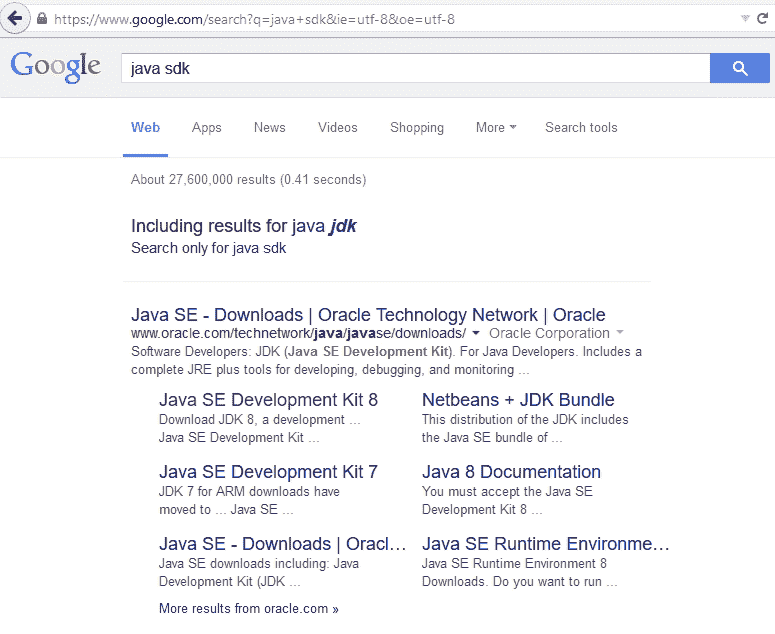

# 第四章客户机/服务器开发

在本章中，我们将探讨开发主要面向 HTTP 的客户机/服务器应用程序的过程。这是一个重要的协议，它是多种应用程序的主要通信媒介。我们将检查协议、客户机上的需求以及服务器上各种版本协议的需求。

具体而言，我们将：

*   检查 HTTP 协议的性质
*   演示低级套接字如何支持该协议
*   使用`HttpURLConnect`和`HTTPServer`类创建 HTTP 服务器
*   检查各种开源 JavaHTTP 服务器
*   调查各种配置问题以及 cookie 的处理方式

HTTP 服务器被广泛使用，因此很好地理解 Java 如何支持它们是很重要的。

# HTTP 协议结构

HTTP 是一种网络协议，用于通过**万维网**（**WWW**传递资源。资源通常是**超文本标记语言**（**HTML**文件），但它们也包括数量的其他文件类型，如图像、音频和视频。用户通常在浏览器中输入 URL 以获取资源。术语**URL**代表**统一资源定位器**，此处重点强调资源。

大多数人使用浏览器在 WWW 上进行通信。浏览器代表客户端应用程序，而 web 服务器响应客户端请求。这些服务器使用的默认端口是端口`80`。


HTTP 经过多年的发展。HTTP/1.0 起源于 20 世纪 80 年代和 90 年代，第一份文档于 1991 年发布。HTTP/1.1 的最新定义于 2014 年 6 月作为六部分规范发布。2015 年 5 月发布了 HTTP 2.0 的**征求意见**（**RFC**）。HTTP 是一个不断发展的标准。

以下链接可能对`interested`读者有用：

<colgroup><col style="text-align: left"> <col style="text-align: left"></colgroup> 
| 

版本

 | 

参考

 |
| --- | --- |
| HTTP 1.0 | [http://www.w3.org/Protocols/HTTP/1.0/spec.html](http://www.w3.org/Protocols/HTTP/1.0/spec.html) |
| HTTP/1.1 | [http://tools.ietf.org/html/rfc2616](http://tools.ietf.org/html/rfc2616) |
| HTTP/2 | [https://en.wikipedia.org/wiki/HTTP/2](https://en.wikipedia.org/wiki/HTTP/2) |

HTTP 服务器用于各种情况。最常见的用途是在组织内部支持向用户传播信息。通常情况下，这是由生产质量支持的服务器（如 Apache 软件基金会）提供的支持。http://www.apache.org/foundation/ 或双子座（[http://www.eclipse.org/gemini/](http://www.eclipse.org/gemini/) ）。

但是，并非所有服务器都需要支持生产服务器所代表的服务级别。它们可以非常小，甚至可以嵌入远程设备中，在远程设备中，它们可能会影响设备的更改，而不仅仅是提供信息。

本章将研究 Java 支持的各种网络技术，以解决这些类型的问题。这些措施包括：

*   HTTP 协议语法概述
*   客户端/服务器的低级别套接字支持
*   使用`URLConnection`类
*   使用`HTTPServer`类
*   开源 Java 服务器概述

HTTP 是一个复杂的话题，我们只能略过它的表面。

### 注

**机器人**，通常称为**蜘蛛**，是自动跟踪链接的应用程序，经常收集网页供搜索引擎使用。如果您希望开发这样的应用程序，请研究它们的用途以及它们是如何构建的（[http://www.robotstxt.org/](http://www.robotstxt.org/) 。如果不仔细设计，这些类型的应用程序可能会中断。

# HTTP 消息的性质

让我们检查一下 HTTP 消息的格式。消息可以是从客户端发送到服务器的请求消息，也可以是从服务器发送到客户端的响应消息。基于对格式的理解，我们将向您展示 Java 如何支持这些消息。HTTP 消息在很大程度上是人类可读的。请求和响应消息都使用此结构：

*   指示消息类型的行
*   零行或多行标题
*   空行
*   包含数据的可选消息正文

以下是 HTTP 请求的示例：

**获取/索引 HTTP/1.0**

**用户代理：Mozilla/5.0**

客户端请求消息由一个初始请求行和零个或多个头行组成。响应消息由初始响应行（称为**状态行**）、零行或多行标题行以及可选的消息正文组成。

让我们更详细地检查这些元素。

## 初始请求行格式

请求和响应初始行的格式不同。请求行由三部分组成，三部分之间用空格隔开：

*   请求方法名称
*   资源的本地路径
*   HTTP 版本

方法名称是指客户端请求的操作。最常用的方法是**GET**方法，它只要求返回特定的资源。**POST**命令也很常见，用于插入和更新数据。HTTP/1.0 方法名称列表见[http://www.w3.org/Protocols/HTTP/1.0/spec.html#Methods](http://www.w3.org/Protocols/HTTP/1.0/spec.html#Methods) 。HTTP/1.1 方法名称可在[找到 http://www.w3.org/Protocols/rfc2616/rfc2616-sec9.html](http://www.w3.org/Protocols/rfc2616/rfc2616-sec9.html) 。方法名总是用大写字母写的。

本地路径通常引用所需的资源。它跟随 URL 请求中的主机名。例如，在下面的 URL 中，本地路径为**/books/info/packt/faq/index.html**：

**www.packtpub.com/books/info/packt/faq/index.html**

HTTP 版本始终为大写，由首字母缩略词 HTTP、正斜杠和版本号组成：

**HTTP/x.x**

以下是请求初始行的示例：

**获取/索引 HTTP/1.0**

响应初始行由三部分组成，三部分之间用空格隔开，如下所示：

*   HTTP 版本
*   响应状态代码
*   描述代码的响应短语

下一行是响应初始行的示例。响应代码反映结果的状态，很容易被计算机解释。“原因”一词是为了让人可读。

**未找到 HTTP/1.0 404**

HTTP 版本使用与请求行相同的格式。

下表列出了更常用的代码。完整的列表可在[中找到 https://en.wikipedia.org/wiki/List_of_HTTP_status_codes](https://en.wikipedia.org/wiki/List_of_HTTP_status_codes) ：

<colgroup><col style="text-align: left"> <col style="text-align: left"> <col style="text-align: left"></colgroup> 
| 

状态码

 | 

标准文本

 | 

意思

 |
| --- | --- | --- |
| `200` | **好** | 此表示请求成功 |
| `301` | **永久移动** | 这表示 URL 已被永久移动，链接应更新 |
| `302` | **发现** | 这表示资源临时位于其他地方，但仍应使用 URL |
| `307` | **临时重定向** | 这与`302`类似，但使用的方法不应改变，这可能发生在`302`中 |
| `308` | **永久重定向** | 这与`301`类似，但使用的方法不应改变，这可能发生在`301`中 |
| `400` | **请求错误** | 这表明请求访问不正确 |
| `401` | **未经授权** | 这表示资源经常受到限制，因为登录尝试失败 |
| `403` | **禁止** | 这表示禁止访问请求的资源 |
| `404` | **未找到** | 这表示资源不再可用 |
| `500` | **内部服务器错误** | 这反映了服务器的某种错误 |
| `502` | **坏网关** | 这表示网关服务器从另一台服务器接收到无效响应 |
| `503` | **服务不可用** | 这表示服务器不可用 |
| `504` | **网关超时** | 这表示网关服务器没有及时收到来自另一台服务器的响应 |

状态代码为三位数字。此数字的第一位数字反映了代码的类别：

*   1xx：这表示一条信息性消息
*   2xx：这代表着成功
*   3xx：这会将客户端重定向到另一个 URL
*   4xx：这表示客户端错误
*   5xx：这表示服务器错误

## 标题行

标题行提供有关请求或响应的信息，例如发件人的电子邮件地址和应用程序标识符。标题由一行组成。此行的格式以标题标识符开始，后跟冒号、空格，然后是分配给标题的值。下面的标题说明了 Firefox 36.0 使用的`User-Agent`标题。此标题将应用程序标识为在 Windows 平台上运行的 Firefox 浏览器：

**用户代理：Mozilla/5.0（Windows NT 6.3；rv:36.0）Gecko/20100101 Firefox/36.0**

标题字段和说明列表见[https://en.wikipedia.org/wiki/List_of_HTTP_header_fields](https://en.wikipedia.org/wiki/List_of_HTTP_header_fields) 。代理字符串列表可在[中找到 http://useragentstring.com/pages/useragentstring.php](http://useragentstring.com/pages/useragentstring.php) 。

HTTP 1.0 定义了 16 个头文件（[http://www.w3.org/Protocols/HTTP/1.0/spec.html#HeaderFields](http://www.w3.org/Protocols/HTTP/1.0/spec.html#HeaderFields) ），而 HTTP 1.1 有 47 个头文件（[http://tools.ietf.org/html/rfc2616#section-14](http://tools.ietf.org/html/rfc2616#section-14)）。它的`Host`头是必需的。

标题有助于在出现问题时进行故障排除。最好包含请求的`From`和`User-Agent`头，以便服务器能够更好地响应请求。

## 消息体

这是构成消息的数据。虽然通常包含消息正文，但它是可选的，对于某些消息来说不需要。当包含主体时，会包含`Content-Type`和`Content-Length`标题，以提供有关主体的更多信息。

例如，以下标题可用于消息正文：

**内容类型：text/html**

**内容长度：105**

消息正文可能如下所示：

**<html><h1>HTTPServer 主页。。。。</h1><br><b>欢迎使用全新改进的 web 服务器！</b><BR></html>**

## 客户端/服务器交互示例

下面的交互是客户端发送请求和服务器响应的简单演示。客户端请求消息对路径`\index`使用`GET`方法：

**获取/索引 HTTP/1.0**

**用户代理：Mozilla/5.0**

假定服务器能够处理请求，则服务器将用以下消息响应。使用`Server`、`Content-Type`和`Content-Length`头。标题和 HTML 邮件正文之间有一个空行：

**HTTP/1.0 200 正常**

**服务器：WebServer**

**内容类型：text/html**

**内容长度：86**

**<html><h1>网站服务器主页。。。。</h1><br><b>欢迎使用我的网络服务器！</b><BR></html>**

可以包括其他标题行。

# 对 HTTP 客户机/服务器应用程序的 Java 套接字支持

HTTP 客户端将与 HTTP 服务器建立连接。客户端将向服务器发送请求消息。服务器通常会以 HTML 文档的形式发回响应消息。在早期的 HTTP 版本中，一旦发送响应，服务器就会终止连接。这有时被称为无状态协议，因为没有维护连接。

使用 HTTP/1.1，可以维护持久连接。当需要在服务器和客户端之间传输多个数据时，无需打开和关闭连接，从而提高了性能。

我们将重点介绍如何创建 HTTP 服务器和 HTTP 客户端。虽然浏览器通常充当 HTTP 客户端，但其他应用程序也可以访问 web 服务器。此外，它有助于说明 HTTP 请求的性质。我们的服务器将支持 HTTP/1.0 规范的一个子集。

## 构建一个简单的 HTTP 服务器

我们将使用一个名为`WebServer`的类来支持 HTTP/1.0 协议。服务器将使用`ClientHandler`类来处理客户端。服务器将仅限于处理 GET 请求。但是，这足以说明所需的基本服务器元素。其他方法的支持可以轻松添加。

`WebServer`定义如下所示。AUT1 T1 类是服务器的基础。其`accept`方法将被阻止，直到发出请求。发生这种情况时，将启动基于`ClientHandler`类的新线程：

```java
public class WebServer {

    public WebServer() {
        System.out.println("Webserver Started");
        try (ServerSocket serverSocket = new ServerSocket(80)) {
            while (true) {
                System.out.println("Waiting for client request");
                Socket remote = serverSocket.accept();
                System.out.println("Connection made");
                new Thread(new ClientHandler(remote)).start();
            }
        } catch (IOException ex) {
            ex.printStackTrace();
        }
    }

    public static void main(String args[]) {
        new WebServer();
    }
}
```

Mac 用户在使用端口`80`时可能会遇到错误。改用端口`3000`或`8080`。线程是在进程内并发执行代码序列。在 Java 中，使用`Thread`类创建线程。构造函数的参数是实现`Runnable`接口的对象。此接口由一个方法组成：`run`。当使用`start`方法启动线程时，将为新线程创建一个单独的程序堆栈，`run`方法在此堆栈上执行。当`run`方法终止时，线程终止。下面显示的`ClientHandler`类实现了`Runnable`接口。它的构造函数被传递给代表客户端的套接字。当线程启动时，`run`方法执行。该方法显示启动和终止消息。实际工作按`handleRequest`方法进行：

```java
public class ClientHandler implements Runnable {

    private final Socket socket;

    public ClientHandler(Socket socket) {
        this.socket = socket;
    }

    @Override
    public void run() {
        System.out.println("\nClientHandler Started for " + 
            this.socket);
        handleRequest(this.socket);
        System.out.println("ClientHandler Terminated for " 
            + this.socket + "\n");
    }

}
```

`handleRequest`方法使用输入和输出流与服务器通信。此外，它还确定发出了什么请求，然后处理该请求。

在下面的代码中，将创建输入和输出流，并读取请求的第一行。`StringTokenizer`类用于标记此行。调用`nextToken`方法时，返回该行的第一个字，该字应与 HTTP 方法对应：

```java
    public void handleRequest(Socket socket) {
        try (BufferedReader in = new BufferedReader(
                new InputStreamReader(socket.getInputStream()));) {
            String headerLine = in.readLine();
            StringTokenizer tokenizer = 
                new StringTokenizer(headerLine);
            String httpMethod = tokenizer.nextToken();
            ...
        } catch (Exception e) {
            e.printStackTrace();
        }
    }
```

标记器是将文本拆分为一系列标记的过程。通常，这些标记都是简单的单词。`StringTokenizer`类的构造函数被传递要标记化的文本。`nextToken`方法将返回下一个可用令牌。

下一个代码序列处理`GET`方法。服务器端会显示一条消息，指示正在处理一个`GET`方法。此服务器将返回一个简单的 HTML 页面。页面使用`StringBuilder`类构建，其中`append`方法以流畅的方式使用。然后调用`sendResponse`方法来实际发送响应。如果请求了其他方法，则返回一个`405`状态代码：

```java
    if (httpMethod.equals("GET")) {
        System.out.println("Get method processed");
        String httpQueryString = tokenizer.nextToken();
        StringBuilder responseBuffer = new StringBuilder();
        responseBuffer
            .append("<html><h1>WebServer Home Page.... </h1><br>")
            .append("<b>Welcome to my web server!</b><BR>")
            .append("</html>");
        sendResponse(socket, 200, responseBuffer.toString());
    } else {
        System.out.println("The HTTP method is not recognized");
        sendResponse(socket, 405, "Method Not Allowed");
    }
```

如果我们想要处理其他方法，那么可以添加一系列 else If 子句。为了进一步处理`GET`方法，我们需要解析初始请求行的其余部分。下面的语句将为我们提供一个可以处理的字符串：

```java
    String httpQueryString = tokenizer.nextToken();
```

本例不需要前面的语句，代码中不应包含该语句。它只是提供了一种进一步处理 HTTP 查询的可能方法。

创建响应后，我们将使用`sendResponse`方法将其发送到客户端，如下所示。此方法传递套接字、状态代码和响应字符串。然后创建一个输出流：

```java
    public void sendResponse(Socket socket, 
            int statusCode, String responseString) {
        String statusLine;
        String serverHeader = "Server: WebServer\r\n";
        String contentTypeHeader = "Content-Type: text/html\r\n";

        try (DataOutputStream out = 
                new DataOutputStream(socket.getOutputStream());) {
            ...
            out.close();
        } catch (IOException ex) {
            // Handle exception
        }
    }
```

如果状态代码为`200`，则返回一个简单的 HTML 页面。如果状态代码为`405`，则返回单个状态代码行。否则，发送`404`响应。当我们使用`DataOutputStream`类编写时，我们使用其`writeBytes`方法来处理字符串：

```java
    if (statusCode == 200) {
        statusLine = "HTTP/1.0 200 OK" + "\r\n";
        String contentLengthHeader = "Content-Length: " 
            + responseString.length() + "\r\n";

        out.writeBytes(statusLine);
        out.writeBytes(serverHeader);
        out.writeBytes(contentTypeHeader);
        out.writeBytes(contentLengthHeader);
        out.writeBytes("\r\n");
        out.writeBytes(responseString);
    } else if (statusCode == 405) {
        statusLine = "HTTP/1.0 405 Method Not Allowed" + "\r\n";
        out.writeBytes(statusLine);
        out.writeBytes("\r\n");
    } else {
        statusLine = "HTTP/1.0 404 Not Found" + "\r\n";
        out.writeBytes(statusLine);
        out.writeBytes("\r\n");
    }
```

当服务器启动时，会显示以下内容：

**已连接**

**等待客户请求**

当客户端发出`GET`请求时，将显示类似以下输出：

**已为套接字启动 ClientHandler[addr=/127.0.0.1，端口=50573，localport=80]**

**获取处理方法**

**为套接字终止的 ClientHandler[addr=/127.0.0.1，端口=50573，localport=80]**

使用一个简单的服务器，让我们看看如何构建 HTTP 客户端应用程序。

## 构建一个简单的 HTTP 客户端

我们将使用以下`HTTPClient`类访问我们的 HTTP 服务器。在其构造函数中，将创建一个连接到服务器的套接字。`Socket`类的`getInputStream`和`getOutputStream`分别返回套接字的输入和输出流。调用`sendGet`方法，向服务器发送请求。`getResponse`方法返回响应，然后显示：

```java
public class HTTPClient {

    public HTTPClient() {
        System.out.println("HTTP Client Started");
        try {
            InetAddress serverInetAddress = 
               InetAddress.getByName("127.0.0.1");
            Socket connection = new Socket(serverInetAddress, 80);

            try (OutputStream out = connection.getOutputStream();
                 BufferedReader in = 
                     new BufferedReader(new 
                         InputStreamReader(
                             connection.getInputStream()))) {
                sendGet(out);
                System.out.println(getResponse(in));
            }
        } catch (IOException ex) {
            ex.printStackTrace();
        }
    }

    ...

    public static void main(String[] args) {
        new HTTPClient();
    }
}
```

`sendGet`方法遵循这一点，使用简单路径发送`GET`方法请求。后面是一个**`User-Agent`头。我们使用了一个带有`write`方法的`OutputStream`类实例。`write`方法需要一个字节数组。`String`类的`getBytes`方法返回这个字节数组：**

 **```java
    private void sendGet(OutputStream out) {
        try {
            out.write("GET /default\r\n".getBytes());
            out.write("User-Agent: Mozilla/5.0\r\n".getBytes());
        } catch (IOException ex) {
            ex.printStackTrace();
        }
    }
```

`getResponse`方法如下，通过`BufferedReader`实例从服务器获取响应。返回使用`StringBuilder`类创建的字符串：

```java
    private String getResponse(BufferedReader in) {
        try {
            String inputLine;
            StringBuilder response = new StringBuilder();
            while ((inputLine = in.readLine()) != null) {
                response.append(inputLine).append("\n");
            }
            return response.toString();
        } catch (IOException ex) {
            ex.printStackTrace();
        }
        return "";
    }
```

当客户端应用程序执行时，我们得到以下反映服务器响应的输出：

**HTTP 客户端启动**

**HTTP/1.0 200 正常**

**服务器：WebServer**

**内容类型：text/html**

**内容长度：86**

**<html><h1>网站服务器主页。。。。</h1><br><b>欢迎使用我的网络服务器！</b><BR></html>**

如果我们使用来自浏览器的相同请求，我们将得到以下结果：


这些客户端和服务器应用程序可以进一步增强。但是，我们可以使用`HttpURLConnection`类来获得类似的结果。**  **# 使用标准 Java 类开发客户机/服务器

具体来说，我们将使用`HttpURLConnection`和`HTTPServer`类来实现客户机和服务器应用程序。这些类支持客户端和服务器所需的大部分功能。使用这些类将避免编写底层代码来实现 HTTP 功能。低级代码是指非专业类，如`Socket`类。更高级别和更专业的课程，如`HttpURLConnection`和`HTTPServer`课程，补充并提供专业操作的额外支持。

`HttpURLConnection`类派生自`HttpConnection`类。这个基类有许多与 HTTP 协议没有直接关系的方法。

## 使用 HttpURLConnection 类

`HttpURLConnection`类提供了访问 web 服务器的方便技术。通过这个类，我们可以连接到站点，发出请求，并访问响应头和响应消息。

我们将使用定义如下的`HttpURLConnectionExample`类。`sendGet`方法支持向服务器发送`GET`方法请求。`HttpURLConnectionExample`类支持其他 HTTP 方法。对于本例，我们仅使用`GET`方法：

```java
public class HttpURLConnectionExample {

    public static void main(String[] args) throws Exception {
        HttpURLConnectionExample http = 
            new HttpURLConnectionExample();
        http.sendGet();
    }

}
```

下面显示`sendGet`方法的实现。谷歌查询（[http://www.google.com/search?q=java+sdk&ie=utf-8&oe=utf-8](http://www.google.com/search?q=java+sdk&ie=utf-8&oe=utf-8)用于说明我们搜索“java sdk”的过程。查询的后半部分`&ie=utf-8&oe=utf-8`是谷歌搜索引擎附加到查询的附加信息。`openConnection`方法将连接到 Google 服务器：

```java
    private void sendGet() throws Exception {
        String query = 
      "http://www.google.com/search?q=java+sdk&ie=utf-8&oe=utf-8";
        URL url = new URL(query);
        HttpURLConnection connection = 
            (HttpURLConnection) url.openConnection();
        ...
    }
```

使用此连接，`setRequestMethod`和`setRequestProperty`方法分别设置请求方法和用户代理：

```java
        connection.setRequestMethod("GET");
        connection.setRequestProperty("User-Agent", 
            "Mozilla/5.0");
```

检索到响应代码，如果我们成功，`getResponse`方法将检索到响应，然后显示如下：

```java
        int responseCode = connection.getResponseCode();
        System.out.println("Response Code: " + responseCode);
        if (responseCode == 200) {
            String response = getResponse(connection);
            System.out.println("response: " + 
                response.toString());
        } else {
            System.out.println("Bad Response Code: " + 
                responseCode);
        }
```

`getResponse`方法如下所示。`HttpURLConnection`类的`getInputStream`方法返回一个输入流，用于创建`BufferedReader`类的实例。`StringBuilder`实例与此读取器一起用于创建并返回字符串：

```java
    private String getResponse(HttpURLConnection connection) {
        try (BufferedReader br = new BufferedReader(
                new InputStreamReader(
                    connection.getInputStream()));) {
            String inputLine;
            StringBuilder response = new StringBuilder();
            while ((inputLine = br.readLine()) != null) {
                response.append(inputLine);
            }
            br.close();
            return response.toString();
        } catch (IOException ex) {
            // Handle exceptions
        }
        return "";
    }
```

当这个程序执行时，您将得到如下输出。由于输出的长度，它已被截断：

**已发送 Http GET 请求**

**应答码：200**

**应答：<！doctype html><html itemscope=“”。。。**

如果我们在浏览器中使用此查询，我们将获得类似以下内容的输出：



关于如何使用`URLConnection`类处理 HTTP 请求的非常有趣的讨论可以在[中找到 http://stackoverflow.com/questions/2793150/using-java-net-urlconnection-to-fire-and-handle-http-requests](http://stackoverflow.com/questions/2793150/using-java-net-urlconnection-to-fire-and-handle-http-requests) 。

### URL 编码

当形成 URL 时，需要使用特定的 URL 格式。此格式的某些字符是保留的，其他字符是不保留的。保留字符具有特殊含义，例如正斜杠，用于分隔 URL 的各个部分。无保留字符没有任何特殊含义。

当保留字符需要在非保留上下文中使用时，URL 编码（也称为百分比编码）用于使用特殊字符序列表示这些字符。有关此过程的更多信息，请参见[https://en.wikipedia.org/wiki/Percent-encoding](https://en.wikipedia.org/wiki/Percent-encoding) 。

在 Java 中，我们可以使用`URLEncoder`类执行 URL 编码。具体来说，`URLEncoder`类有一个`encode`方法来转换符合`application/x-www-form-url`编码 MIME 格式的字符串。

此方法已重载。单参数方法已被弃用。双参数方法接受要转换的字符串和指定字符编码方案的字符串。对于 HTTP 消息，请使用 UTF-8 格式。

之前，我们使用以下字符串创建新的 URL 实例：

```java
    String query = 
      "http://www.google.com/search?q=java+sdk&ie=utf-8&oe=utf-8";
```

这个字符串实际上是由浏览器格式化的。以下代码说明了如何使用`encode`方法来获得类似的结果，而不是使用浏览器：

```java
    String urlQuery = "http://www.google.com/search?q=";
    String userQuery = "java sdk";
    String urlEncoded = urlQuery + URLEncoder.encode(
        userQuery, "UTF-8");
```

这将生成字符串：`http://www.google.com/search?q=java+sd`。您可以看到该 URL 的空格是如何转换为`+`符号的。原始查询的后一部分`&ie=utf-8&oe=utf-8`不包括在我们的 URL 编码字符串中。

如果需要，`URLDecoder`类可用于解码 URL 编码的字符串。有关 URL 编码的综合讨论，请参阅：[http://blog.lunatech.com/2009/02/03/what-every-web-developer-must-know-about-url-encoding](http://blog.lunatech.com/2009/02/03/what-every-web-developer-must-know-about-url-encoding) 。

## 使用 HTTPServer 类

`HTTPServer`类在`com.sun.net.httpserver`包中找到。它提供了一组功能强大的功能来支持一个简单的 HTTP 服务器。我们必须使用以前的服务器手动执行的许多任务都使用此服务器进行了简化。客户机和服务器之间的交互称为交换。

此类和其他支持类及接口是`com.sun.net.httpserver`包的成员。它们通常包含在大多数 IDE 中。API 文档可在[中找到 http://docs.oracle.com/javase/8/docs/jre/api/net/httpserver/spec/index.html?com/sun/net/httpserver/package-summary.html](http://docs.oracle.com/javase/8/docs/jre/api/net/httpserver/spec/index.html?com/sun/net/httpserver/package-summary.html)。

这个包由许多类组成。我们将使用的主要类包括：

<colgroup><col style="text-align: left"> <col style="text-align: left"></colgroup> 
| 

类/接口

 | 

意图

 |
| --- | --- |
| `HttpServer` | 这个类支持 HTTP 服务器的基本功能 |
| `HttpExchange` | 这个类封装了与客户机/服务器交换相关联的请求和响应 |
| `HttpHandler` | 这个类定义了一个用于处理特定交换的句柄方法 |
| `HttpContext` | 此类将 URI 路径映射到`HttpHandler`实例 |
| `Filter` | 这个类支持请求的预处理和后处理 |

服务器使用`HttpHandler`派生的类来处理客户端请求。例如，一个处理程序可以处理基本网页的请求，而另一个处理程序可以处理与服务相关的请求。

`HttpExchange`类支持客户机和服务器之间交换的生命周期活动。它拥有许多方法来提供对请求和响应信息的访问。下表按正常使用顺序列出了这些方法。并非所有方法都需要用于所有请求：

<colgroup><col style="text-align: left"> <col style="text-align: left"></colgroup> 
| 

方法

 | 

意图

 |
| --- | --- |
| `getRequestMethod` | 此方法返回请求的 HTTP 方法 |
| `getRequestHeaders` | 此方法返回请求头 |
| `getRequestBody` | 此方法返回请求主体的`InputStrea``m`实例 |
| `getResponseHeaders` | 此方法返回除内容长度以外的响应头 |
| `sendResponseHeaders` | 此方法发送响应头 |
| `getResponseBody` | 此方法返回用于发送响应的`OutputStream`实例 |

当输入和输出流关闭时，交换关闭。在调用`getResponseBody`方法之前，必须先使用`sendResponseHeaders`方法。

### 注

这个类的初始版本的性能不是很好。但是，较新的版本具有更好的性能。此外，过滤设备可以帮助处理交换。

使用`com.sun.*`类可以不用担心。如果`sun.*`类与不同的 JRE 一起使用，可能会出现问题。`HTTPServer`类完全支持 HTTP/1.0，但只提供了对 HTTP/1.1 的部分支持。

### 实现一个简单的 HTTPServer 类

下面的类使用`HTTPServer`类实现了一个简单的服务器。使用本地主机和端口`80`（Mac 上的`3000`或`8080`创建`HttpServer`类的实例。`createContext`方法将`/index`路径与`IndexHandler`类的实例相关联。此处理程序将处理该请求。`start`方法启动服务器。服务器将继续运行，处理多个请求，直到手动停止：

```java
public class MyHTTPServer {

    public static void main(String[] args) throws Exception {
        System.out.println("MyHTTPServer Started");
        HttpServer server = HttpServer.create(
            new InetSocketAddress(80), 0);
        server.createContext("/index", new IndexHandler());
        server.start();
    }

}
```

当`createContext`方法将表示为字符串的路径与处理程序匹配时，它使用特定的匹配过程。在[中找到的`HTTPServer`类文档的*映射请求 URI 到 HttpContext 路径*部分解释了此过程的细节 http://docs.oracle.com/javase/8/docs/jre/api/net/httpserver/spec/com/sun/net/httpserver/HttpServer.html](http://docs.oracle.com/javase/8/docs/jre/api/net/httpserver/spec/com/sun/net/httpserver/HttpServer.html) 。

下一步将声明`IndexHandler`类。它通过重写`handle`方法来实现`HttpHandler`接口。`handle`方法被传递一个`HttpExchange`实例，我们可以用它来处理请求。

在此方法中，我们执行以下操作：

*   显示客户端的地址
*   发回状态代码为`200`的请求
*   将响应发送到客户端

`sendResponseHeaders`方法将发送状态代码`200`的初始响应行和内容长度的标题。`getResponseBody`方法返回用于发送消息体的输出流。然后关闭流，终止交换：

```java
    static class IndexHandler implements HttpHandler {

        @Override
        public void handle(HttpExchange exchange) 
                throws IOException {
            System.out.println(exchange.getRemoteAddress());
            String response = getResponse();
            exchange.sendResponseHeaders(200, response.length());
            OutputStream out = exchange.getResponseBody();
            out.write(response.toString().getBytes());
            out.close();
        }
    }
```

`sendResponseHeaders`方法使用两个参数。第一个是响应代码，第二个控制消息正文的传输，详见下表：

<colgroup><col style="text-align: left"> <col style="text-align: left"></colgroup> 
| 

价值

 | 

意思

 |
| --- | --- |
| 大于零 | 这是消息的长度。服务器必须发送此字节数。 |
| 零 | 这用于发送任意字节数的分块传输。 |
| -1 | 这是指没有发送响应正文的情况。 |

`getResponse`方法使用`StringBuilder`类构造字符串：

```java
    public String getResponse() {
        StringBuilder responseBuffer = new StringBuilder();
        responseBuffer
            .append(
                "<html><h1>HTTPServer Home Page.... </h1><br>")
            .append("<b>Welcome to the new and improved web " 
                    + "server!</b><BR>")
            .append("</html>");
        return responseBuffer.toString();
    }
```

服务器启动时，将显示以下输出：

**MyHTTPServer 已启动**

如果我们在浏览器中输入 URL`http://127.0.0.1/index`，浏览器将显示类似于*构建简单 HTTP 客户端*一节中图像中的页面。

服务器将为每个请求显示以下内容：

**/127.0.0.1:50273**

此类在处理客户机请求时起着作用。在这里，我们将使用一个名为`DetailHandler`的不同处理程序来说明这个类的几个方法，如下所述：

```java
    static class DetailHandler implements HttpHandler {

        @Override
        public void handle(HttpExchange exchange) 
                throws IOException {
            ...
        }
    }
```

要使用此处理程序，请替换`createContext`方法，并使用以下语句调用`MyHTTPServer`：

```java
        server.createContext("/index", new DetailHandler());
```

让我们从检查`getRequestHeaders`方法的使用开始，该方法返回`Headers`类的一个实例。这将允许我们显示客户端发送的每个请求头，并在需要时基于这些头执行附加处理。

将以下代码添加到`handle`方法中。`keyset`方法为每个标头返回一个`Set`键/值对。在 for each 语句中，`Set`接口的`get`方法返回每个头的值列表。此列表用于显示标题：

```java
    Headers requestHeaders = exchange.getRequestHeaders();
    Set<String> keySet = requestHeaders.keySet();
    for (String key : keySet) {
        List values = requestHeaders.get(key);
        String header = key + " = " + values.toString() + "\n";
        System.out.print(header);
    }
```

使用 Firefox 浏览器中的上一个 URL（`http://127.0.0.1/index`，我们得到以下输出：

**接受编码=[gzip，deflate]**

**Accept=[text/html，application/xhtml+xml，application/xml；q=0.9，*/*；q=0.8]**

**连接=【保持活动】**

**主机=[127.0.0.1]**

**用户代理=[Mozilla/5.0（Windows NT 10.0；WOW64；rv:40.0）Gecko/20100101 Firefox/40.0]**

**接受语言=[en-US，en；q=0.5]**

**缓存控制=【最大年龄=0】**

使用不同的浏览器可能会返回不同的请求头集。`getRequestMethod`方法返回请求方法的名称，如下图：

```java
    String requestMethod = exchange.getRequestMethod();
```

我们可以使用它来区分客户端请求。

一些请求方法将随请求一起传递消息体。`getRequestBody`方法将返回一个`InputStream`实例来访问这个主体。

以下代码说明了如何获取和显示消息正文：

```java
    InputStream in = exchange.getRequestBody();
    if (in != null) {
        try (BufferedReader br = new BufferedReader(
                new InputStreamReader(in));) {
            String inputLine;
            StringBuilder response = new StringBuilder();
            while ((inputLine = br.readLine()) != null) {
                response.append(inputLine);
            }
            br.close();
            System.out.println(inputLine);
        } catch (IOException ex) {
            ex.printStackTrace();
        }
    } else {
        System.out.println("Request body is empty");
    }
```

由于我们的请求没有正文，因此没有显示任何内容。

### 管理响应头

服务器可以使用`sendResponseHeaders`方法发回响应头。但是，需要使用`getResponseHeaders`方法和`set`方法的组合来创建这些头文件。

在下一个代码序列中，`getResponseHeaders`方法将返回`Header`类的实例：

```java
    Headers responseHeaders = exchange.getResponseHeaders();
```

我们使用`getResponse`方法获得我们的响应。我们需要这个来计算内容长度。然后使用`set`方法创建**内容类型**和**服务器**头：

```java
    String responseMessage = HTTPServerHelper.getResponse();
    responseHeaders.set("Content-Type", "text/html");
    responseHeaders.set("Server", "MyHTTPServer/1.0");
```

使用前面描述的`sendResponseHeaders`方法发送头，如下所示：

```java
    exchange.sendResponseHeaders(200, responseMessage.getBytes().length);
```

可以使用以下代码序列显示这些响应标题。这执行与用于显示请求头的 for-each 语句相同的功能。但是，此实现使用 Java 8 流类和两个 lambda 表达式：

```java
    Set<String> responseHeadersKeySet = responseHeaders.keySet();
    responseHeadersKeySet
            .stream()
            .map((key) -> {
                List values = responseHeaders.get(key);
                String header = key + " = " + 
                    values.toString() + "\n";
                return header;
            })
            .forEach((header) -> {
                System.out.print(header);
            });
```

此实现使用流。`stream`方法返回在集合中找到的键。`map`方法处理每个键，使用它查找与该键相关的值列表。列表将转换为字符串。然后，`forEach`方法将显示每个字符串。

`HTTPServer`及其附带的类提供了一种简单但易于使用的技术来实现 HTTP 服务器。还提供了使用`HttpsServer`类的安全通信支持，这在[第 8 章](8.html "Chapter 8. Network Security")、*网络安全*中进行了讨论。

# 开源 Java HTTP 服务器

虽然我们可以使用本章讨论的任何技术开发 web 服务器，但另一个选项是使用许多基于 Java 的开源 HTTP 服务器中的任何一个。此类服务器通常提供许多功能，包括：

*   完全符合 HTTP 标准
*   对日志记录和监视的支持
*   虚拟主机的处理
*   性能调整能力
*   可伸缩
*   分块数据传输
*   可配置性
*   支持 NIO（Grizzly）

利用这些系统可以为您节省大量时间和精力，否则这些时间和精力将用于构建定制服务器。一些基于 Java 的服务器的部分列表包括：

*   雅加达 Tomcat（[http://tomcat.apache.org/](http://tomcat.apache.org/) ）
*   码头（[http://www.eclipse.org/jetty/](http://www.eclipse.org/jetty/) ）
*   JLHTTP（[http://www.freeutils.net/source/jlhttp/](http://www.freeutils.net/source/jlhttp/) ）
*   玻璃鱼（[https://glassfish.java.net/](https://glassfish.java.net/) ）
*   灰熊（[https://grizzly.java.net/](https://grizzly.java.net/) ）
*   简单（[http://www.simpleframework.org/](http://www.simpleframework.org/) ）

一个开源 Java 服务器列表位于[http://java-source.net/open-source/web-servers](http://java-source.net/open-source/web-servers) 。

在更高的层次上，JavaEE 经常用于支持 Web 服务器。虽然这个版本经过多年的发展，但 servlet 是处理 web 请求的基础。servlet 是一个 Java 应用程序，它隐藏了关于请求和响应的低级处理的许多细节。这使得开发人员能够专注于处理请求。

servlet 保存在为任务提供支持的容器中，例如数据库访问、管理性能和提供安全性。下面显示了一个简单的 servlet，让您了解它们的结构。

`doGet`和`doPost`方法分别处理`GET`和`POST`类型的消息。但是，由于这两条 HTTP 消息之间的差异是隐藏的，因此只需要一条。`HttpServletRequest`类表示 HTTP 请求，`HttpServletResponse`类表示响应。这些类提供对消息的访问。例如，`getWriter`方法返回一个`PrintWriter`类实例，允许我们以更清晰的方式编写 HTML 响应：

```java
public class ServletExample extends HttpServlet { 

    @Override
    public void doGet(HttpServletRequest request,
            HttpServletResponse response)
                throws ServletException, IOException {
        response.setContentType("text/html");
        PrintWriter out = response.getWriter();
        out.println("<h1>" + "Message to be sent" + "</h1>");
    }

    @Override
    public void doPost(HttpServletRequest request, 
            HttpServletResponse response)
                throws IOException, ServletException {
        doGet(request, response);
    }

}
```

servlet 通常使用 JavaEESDK 开发。除非使用此 API 开发，否则前面的示例将无法正确编译。

许多技术已经进化并隐藏了 servlet。多年来，这包括了**JavaServer 页面**（**JSP**）和**JavaServer 界面**（**JSF**），这在很大程度上消除了直接编写 servlet 的需要。

Java 有大量的 web 服务器。在[中可以找到其中一些的比较 https://en.wikipedia.org/wiki/Comparison_of_application_servers#Java](https://en.wikipedia.org/wiki/Comparison_of_application_servers#Java) 。

# 服务器配置

服务器的配置取决于用于构建它的技术。在这里，我们将重点关注`URLConnection`类的配置。此类有许多受保护的字段，用于控制连接的行为。使用相应的 get 和 set 方法访问这些字段。

一个字段处理用户交互。当设置为`true`时，它允许用户参与交互，例如响应身份验证对话框。连接可用于输入和/或输出。可以将连接配置为不允许输入或输出。

当数据在客户端和服务器之间传输时，它可能会被缓存。`UseCaches`变量确定是否忽略缓存。如果设置为`true`，则根据需要使用缓存。如果`false`，则不执行缓存。

`ifModifiedSince`变量控制是否检索对象。它是一个长值，表示从历元（1970 年 1 月 1 日，格林尼治标准时间）开始的毫秒数。如果对象的修改时间比该时间晚，则将获取该对象。

下表总结了用于配置使用`URLConnection`类建立的连接的方法。每种方法都有相应的`GET`方法：

<colgroup><col style="text-align: left"> <col style="text-align: left"> <col style="text-align: left"></colgroup> 
| 

方法

 | 

违约

 | 

意图

 |
| --- | --- | --- |
| `setAllowUserInteraction` | NA | 此方法控制用户交互 |
| `setDoInput` | `true` | 如果其参数设置为`true`，则允许输入 |
| `setDoInput` | `true` | 如果其参数设置为`true`，则允许输出 |
| `setIfModifiedSince` | NA | 这将设置`ifModifiedSince`变量 |
| `setUseCaches` | `true` | 这将设置`UseCaches`变量 |

更复杂的服务器，比如 Tomcat，有更多的选项来控制它的配置方式。

部署应用程序时，`deployment.properties`文件中有许多配置选项。这些选项中有许多是低级别的，与 JRE 相关。选项的说明见[https://docs.oracle.com/javase/8/docs/technotes/guides/deploy/properties.html](https://docs.oracle.com/javase/8/docs/technotes/guides/deploy/properties.html) 。*21.2.4 网络*部分讨论网络选项，*21.2.5 缓存和可选包存储库*部分涉及缓存的配置。

**HTTP 代理**是服务器，充当客户端和服务器之间的中介。代理经常用于管理网络、监视流量和提高网络性能。

通常，我们不关心代理的使用或配置。但是，如果需要配置代理，我们可以使用 JVM 命令行或使用`System`类的`getProperties`方法在代码中控制它。我们可以控制使用的代理，并在需要时指定访问它的用户和密码。关于这些功能的简短讨论见[http://viralpatel.net/blogs/http-proxy-setting-java-setting-proxy-java/](http://viralpatel.net/blogs/http-proxy-setting-java-setting-proxy-java/) 。

# 处理饼干

cookie 是一个字符串，其中包含一个键/值对，表示服务器感兴趣的信息，如用户首选项。它从服务器发送到浏览器。浏览器应将 cookie 保存到文件中，以便以后使用。

cookie 是一个字符串，由一个名称、一个等号和一个值组成。以下是一种可能的 cookie：

**userID=cookiemonster**

一个 cookie 可以有多个值。这些值将由分号和空格分隔。

我们将使用`HTTPServer`类和`HttpURLConnection`类来演示 cookies 的处理。在`MyHTTPServer`类服务器的 handler 类的`handle`方法中，在其他头之后添加以下代码：

```java
    responseHeaders.set("Set-cookie", "userID=Cookie Monster");
```

当服务器响应时，它将发送该 cookie。

在`HttpURLConnectionExample`类的`getResponse`方法中，在其 try 块的开头添加以下代码。生成一个包含 cookie 文本的字符串。使用多种`substring`和`indexOf`方法提取 cookie 的名称，然后提取其值：

```java
    Map<String, List<String>> requestHeaders = 
        connection.getHeaderFields();
    Set<String> keySet = requestHeaders.keySet();
    for (String key : keySet) {
        if ("Set-cookie".equals(key)) {
            List values = requestHeaders.get(key);
            String cookie = key + " = " + 
                values.toString() + "\n";
            String cookieName = 
                cookie.substring(0, cookie.indexOf("="));
            String cookieValue = cookie.substring(
                cookie.indexOf("=")+ 1, cookie.length());
            System.out.println(cookieName + ":" + cookieValue);
        }
    }
```

当服务器发送响应时，它将包含 cookie。然后，客户端将接收 cookie。在服务器和客户端中，您应该看到显示 cookie 的以下输出：

**设置 cookie:[userID=cookiemonster]**

前面的示例处理简单的单值 cookie。处理多个值的代码留给读者作为练习。

# 总结

在本章中，我们研究了可用于开发 HTTP 客户机/服务器应用程序的各种 Java 方法。使用 HTTP 进行通信是一种常见做法。了解 Java 如何支持这个过程是一项很有价值的技能。

我们从 HTTP 消息的概述开始。我们检查了初始请求和响应行的格式。还检查了用于传递消息信息的标题行。HTTP 消息中可能会出现可选的消息正文。这在正文通常是 HTML 文档的响应中更为常见。

我们演示了如何使用简单的套接字开发客户机/服务器。虽然可能，但这种方法需要大量的工作来开发功能齐全的 HTTP 服务器。本次讨论之后，使用了`HTTPServer`和`HttpURLConnection`类分别支持服务器和客户机。这些类的使用使得开发过程更加容易。

有许多基于 Java 的开源 HTTP 服务器可用。对于某些环境来说，这些可能是可行的备选方案。还讨论了以 ApacheTomcat 为代表的更复杂的 web 服务器。它们与 servlet 一起工作，并向开发人员隐藏许多底层 HTTP 细节。

我们在本章结尾简要讨论了服务器配置问题以及服务器和客户端如何创建和使用 cookie。

虽然客户机/服务器体系结构非常常见，但对等体系结构是跨网络共享信息的替代方案。我们将在下一章深入探讨这个话题。**